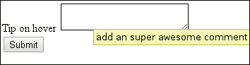
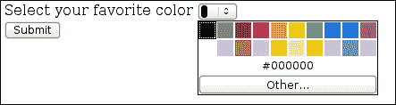

# 四、使用 HTML5 输入组件

在这一章中，我们将看看添加到 HTML5 中的一些伟大的新元素类型。涵盖的主题有:

*   使用`text`输入字段
*   使用`textarea`
*   输入日期
*   输入时间
*   电话输入
*   范围输入字段
*   颜色选择器输入
*   使用单选项下拉菜单
*   使用多选选择列表
*   获取地理位置输入
*   在客户端使用文件输入
*   使用拖放文件区域

# 简介

表单是日常 web 应用开发的一部分。我们做了很多重新发明，以启用各种输入功能。HTML5 在现有的结构中增加了一些新的输入类型和许多不同的属性和扩展。大多数这些新东西已经在现代浏览器中可用，让我们所有人的生活变得更加轻松。对于还不存在的东西，我们使用在遗留系统上工作的回退。没有充分的理由说明为什么您不应该从今天开始使用至少一些功能。

### 注

有多种方法可以确定对 HTML5 功能的支持。许多网站都提供了支持的功能列表，但其中一些值得一提的是[http://caniuse.com/](http://caniuse.com/)和[http://html5please.com/](http://html5please.com/)。如果您对添加回退不感兴趣，可以经常参考它们来获取最新信息。

# 使用文本输入字段

我们将看一下在 HTML 中使用输入数据的一个基本例子`<input type="text">`。这种输入类型会自动从输入值中删除换行符，因此适用于单行文本，如下图所示:


## 怎么做...

在 HTML 文档的正文部分中，我们将创建一个表单，其中将放置类型为`text`的输入:

1.  首先我们添加最基本的输入类型`text` :

    ```html
    <form>
      <p>
        First name  <input name="firstname" type="text">
      </p>
    ```

2.  接下来，我们添加一个将启用音频输入的位置:

    ```html
      <p>
        Speak up <input name="quote" type="text" x-webkit-speech speech>
      </p>
    ```

3.  另外添加一个带`placeholder`属性，一个带`autofocus`属性:

    ```html
      <p>
        Last name: <input name="lastname" type="text" placeholder="John Doe">
      </p>
      <label>
        Comment <input name="comment" type="text" title="This is area to insert your opinion" autofocus >  </label>
    ```

4.  最后，我们添加`submit`并关闭表单:

    ```html
      <input type="submit" >
    </form>
    ```

## 它是如何工作的...

`<input name="firstname" type="text" >`元素是最基本的 HTML 输入元素，提交表单时，查询参数为:

```html
?firstname=someText&...
```

下一个输入元素有一个属性`x-webkit-speech speech`，即允许语音输入的 Chrome 特定属性，这意味着您可以使用麦克风插入文本。

### 注

请注意，这不太可能成为标准，因为它依赖于谷歌服务器端的语音处理，因此远离开放网络。为了获得广泛的认可，应该提供开放的语音提供商。

对于第三个输入元素，我们使用了`placeholder`属性，它在输入字段中添加了一个漂亮的提示。

HTML5 中新增的一个属性是`autofocus`。正是布尔值属性允许我们指定页面加载后哪个表单控件应该具有初始焦点。在我们的例子中，我们使用了单个单词的语法，但是`autofocus="true"`也会做同样的事情。这里需要注意的另一件事是，这只能应用于一个表单元素，因为这是将获得初始焦点的元素，并且它不能应用于`input` `type="hidden"`，因为这样做没有太大意义。

## 还有更多...

如果我们使用自己的回退方法来插入语音数据，我们可以简单地检查当前的方法是否支持它，以便支持其他浏览器:

```html
  var hasSupportForSpeach = 
    document.createElement("input").webkitSpeech != undefined;
```

还有一个被触发的事件，我们可以用于语音输入:

```html
onwebkitspeechchange="myOnChangeFunction()"
```

### 注

开发的语音输入的开放替代方案是 **网络语音应用编程接口**。它的主要目标是为开发人员提供一种将语音输入和输出作为文本到语音的方法。API 定义不包括在哪里进行识别的实现，这意味着服务器端或客户端的实现取决于供应商。更多关于[上的 API。](https://dvcs.w3.org/hg/speech-api/raw-file/tip/speechapi.html)

负责 HTML5 中语音集成的初始要求和规范的孵化器工作组可以在:[http://www.w3.org/2005/Incubator/htmlspeech/](http://www.w3.org/2005/Incubator/htmlspeech/)上找到。

# 使用文本区域

在这个食谱中，我们将查看`textarea`元素，并创建一个简单的表单来显示一些可以使用的属性。`textarea`用于多行纯文本编辑控件。

## 怎么做...

我们将创建一个示例`form`来演示`textarea`元素的一些用法:

1.  首先我们添加一个`texarea`柠檬，其`placeholder`属性设置为:

    ```html
    <form>
      <label>Short info: <textarea placeholder="some default text"></textarea>
      </label>
    ```

2.  然后我们添加一个设置了`rows`和`cols`属性的文本区:

    ```html
    <label>
      Info with default size set: <textarea  rows="4" cols="15" placeholder="some default text"></textarea>
    </label>
    ```

3.  然后我们添加一个`maxlength`设置:

    ```html
      <label>
        Max area limited to 5 characters <textarea maxlength="5" placeholder="Inset text here limit 5 char"></textarea>
      </label>
    ```

4.  然后我们添加一个`title`属性集:

    ```html
      <label>
        Tip on hover <textarea maxlength="5" title="add an super awesome comment"></textarea>
      </label>
    ```

5.  最后我们添加`submit`并关闭`form` :

    ```html
      <input type="submit"/>
    </form>
    ```

## 它是如何工作的...

第一个示例是一个常规的`<textarea />`元素，允许文本具有多行和换行符。我们可以额外使用属性，如`rows`和`cols`来启用一些初始大小。这也可以通过 CSS 设置初始大小来实现:

```html
textarea{
  width:300px;
  height:100px;
}
```

大多数新的浏览器现在都有一个小的可拖动的右下角来放置文本区域，用户可以调整它的大小。可以通过在 CSS 中设置`max-width`和`max-height`来禁用文本区域的这种可伸缩性。

我们也可以使用`maxlength`属性限制可以插入的字符数，比如在我们的示例`maxlength="5"`中将其设置为最多 5 个字符。

还有属性`title`可以给用户添加关于输入字段的提示。



### 注

`title`、`maxlength`、`placeholder`等属性并不是`textarea`独有的，但也可以用于其他元素。例如，`title`属性是 HTML5 中的全局属性之一，可以添加到任何元素上。我们可以看到流畅的片段:

```html
<input type="text" autofocus maxlength="10" placeholder="Awesome">
```

有关输入属性和全局元素属性的更多信息，请访问网站[。](http://www.whatwg.org/specs/web-apps/current-work/multipage/elements.html#global-attributes)

# 输入日期

在 HTML5 之前，我们被迫创建自定义控件，这些控件总是缺少一些功能或者与某些浏览器不兼容。现在，日期有不同的输入类型，在这个食谱中，我们将看到如何使用它们。不幸的是，它们仍然没有在各种用户代理中完全实现，但是每个人都在慢慢赶上。

## 怎么做...

我们将简单地创建一个基本的 HTML 文档，并在 body 元素中创建一个表单:

1.  首先在主体部分添加`form`，在里面添加一个`date input`元素:

    ```html
    <form>
      <label>
        Select date  <input name="theDate" type="date">
      </label>
    ```

2.  同样，我们为`month`和`week`添加了一个输入元素:

    ```html
    <label>
      Select month <input name="theMonth" type="month">
    </label>
    <label>
      Select week <input name="theWeek" type="week">
    </label>
    ```

3.  最后我们添加一个简单的`submit`并关闭`form` :

    ```html
      <input type="submit" />
    </form>
    ```

## 它是如何工作的...

根据浏览器的支持，您将获得一个空的输入字段或一个完整的日期输入控件:


```html
<input type="week" /> rendered on Opera v12.11
```

在表单提交时，表单发送的参数是有效的字符串:

```html
?theDate=2012-12-21&theMonth=2012-12&theWeek=2012-W5
```

日期、星期和月份的创建和编号符合大多数编程语言中广泛接受的 ISO 8601，或者至少有一种标准化的数据表示和访问方式。还有一个选项可以指定`min`和`max`属性，它们应该是相应的有效日期、月份和星期字符串，还有`step`可以定义选择控制的步骤，默认为`1`。

# 输入时间

在本食谱中，我们将看看如何使用时间输入控件，以及它们如何与日期选择相结合。总的想法是让用户代理呈现一个可以用作输入的时钟。有包括时区和简单时间表示的选项，我们将通过创建一个简单的表单来尝试，如下面的屏幕截图所示:


## 怎么做...

与其他示例类似，我们创建了一个包含少量输入元素的表单:

1.  首先我们启动表单，添加`time`输入元素:

    ```html
    <form>
      <label>
        Select time <input name="time" type="time" >
      </label>
    ```

2.  我们添加一个`datetime-local`输入:

    ```html
      <label>
        Date and time local <input name="datetime-local" type="datetime-local" >
      </label>
    ```

3.  我们还添加了一个`datetime`输入:

    ```html
      <label>
        Select date and time <input name="datetime" type="datetime" >
      </label>
    ```

4.  最后我们添加提交并关闭表单

    ```html
      <input type="submit">
    </form>
    ```

## 它是如何工作的...

提交表单时，选定的值将作为查询参数添加到 URL 中，例如:

```html
/?time=00%3A00%3A00.00&datetime-local=2012-11-02T12%3A00&datetime=2012-12-21T12%3A00Z/
```

这里的`time`参数的值为`00:00:00`，其中`%3A`是编码的`:`字符网址。

类似地，`datetime-local`的`2012-11-02T12%3A00`值实际上是`2012-11-02T12:00`按照`YYYY-MM-DDThh:mm:ss`模式给出参数中的日期和时间。

至于`datetime`变量，字符串的格式是`YYYY-MM-DDThh:mm:ssTZD`，这里我们有关于时区的附加信息。

由于我们的输入元素有一个正确的上下文，当在一个支持良好的浏览器上打开时，控件将被优化。


# 电话输入

在这个食谱中，我们将看看电话号码的输入类型。由于国家之间电话号码格式差异很大，电话输入不需要任何特定的模式，如果没有明确指定的话。如果我们需要一些特定的模式，我们可以进行各种类型的验证，如[第 6 章](06.html "Chapter 6. Data Validation")、*数据验证*中详细讨论的。

使用文本输入类型的主要优点是语义更加正确，从而在移动设备上带来更多优化。

## 怎么做...

作为前面的相关菜谱，我们只需在 HTML 文档的主体中添加`input`元素:

```html
  <form>
    <label>
      Insert phone <input type="tel" >
    </label>
  <input type="submit" >
  </form>
```

## 它是如何工作的...

当你第一眼看到它时，它看起来就像是一个普通的`input type="text"`元素。但是现在这个在语义上更正确。为什么这很重要，或者我们为什么要关心它？

移动设备会将此作为电话号码，并自动打开数字键盘，就像下面截图中显示的安卓设备一样:


## 还有更多...

还有`input type="url"`、`input type="search"`和`input type="email"`给元素赋予语义，让移动设备拿起正确的键盘。它们还可以有关于如何插入数据的额外验证和逻辑，允许更多类型特定的功能。其中一些将包含在验证相关的食谱中。

在 HTML5 中，为所有输入类型添加了一个名为`inputmode`的属性，该属性源自术语 **输入模式**。这些属性为浏览器提供了应该使用哪种键盘的提示。这些属性可以具有以下值:

*   **逐字**:该值指定通常可以用作非散文文本的字母数字字符，例如用户名、关键字或密码。
*   **拉丁语**:该值指定用户输入中的拉丁语输入，以用户偏好的语言输入助手，如移动设备上的文本预测。
*   **拉丁名称**:该值指定了与`latin`相同的规则，但用于名称。
*   **拉丁文-散文**:该值指定了与`latin`相同的规则，但是具有完整的打字助手，用于电子邮件、聊天或评论等实现中。
*   **全角拉丁文**:此值指定与`latin-prose`相同，但为用户的第二语言。
*   **假名**、**片假名**:该值指定 **假名**或 **罗马字**输入，一般为 **平假名**输入，使用全角字符，支持转换为**汉字**。至于**片假名** ，则是与此相关的另一种形式。所有这些都是针对日语输入文本的。关于日语书写系统的更多信息，请参见:[http://en.wikipedia.org/wiki/Japanese_writing_system](http://en.wikipedia.org/wiki/Japanese_writing_system)。
*   **数字**:该值指定数字 0-9 输入的数字字符，包括用户选择的千位分隔符和表示负数的字符。这样做的目的是输入数字代码，例如一些街道号码或信用卡。如果我们确定我们使用数字，输入`type="number"`应该是首选的，因为它在语义上更正确。
*   **电话**、**电子邮件**、**网址**:该值可用于给出与相应输入类型相同的提示。我们应该更喜欢这些值中的输入类型。

浏览器并不支持所有的状态，并且有一个后备机制。同样，这些州对于移动或特殊用途设备来说也很有意义。

# 范围输入字段

我们有时想要输入一个值，它是用户使用“滑块”从给定的值范围中挑选出来的。为了在 HTML5 中实现这一点，添加了`<input type="range" >`，允许对元素值的设置进行不精确的控制。

## 怎么做...

通过几个简单的步骤，我们将创建几个使用 HTML5 不同特性的范围控件:

1.  我们首先使用`body`文本的以下部分添加一个 HTML 页面:

    ```html
    <form>
      <label>
        Select the range <input name="simpleRange" type="range" />
      </label>
      <br/>
      <label>
        Select within range <input id="vertical" name="simpleRangeLimited" min="20" max="100" type="range" />
      </label>
      <br/>
      <label>
        Custom step <input id="full" name="simpleRangeSteped"       type="range" value="35" min="0" max="220" step="5" />
      </label>
      <span id="out"> </span>
      <br/>
      <label>
        Temperature scale
        <input min="0" max="70" type="range" name="themp"       list="theList">
      </label>
        <datalist id="theList">
          <option value="-30" />
          <option value="10" label="Low" />
          <option value="20" label="Normal" />
          <option value="45" label="High" />
          <option value="some invalid Value" />
        </datalist>
      <br/>
      <input type="submit" />
    </form>
    ```

2.  为了垂直显示其中一个滑块，我们可以在 HTML 的`head`标签中添加 CSS:

    ```html
      #vertical {
         height: 80px;
         width: 30px;
      };
    ```

3.  我们还可以显示使用 JavaScript 选择的值:

    ```html
    <script src="http://ajax.googleapis.com/ajax/libs/jquery/1.8.2/jquery.min.js">
    </script>
    <script type="text/javascript">
      (function($){
        var val = $('#full').val();
        var out  = $('#out');
        out.html(val);
        $('#full').change(function(){
          out.html(this.value);
        });
      }($));
    </script>
    ```

## 它是如何工作的...

浏览器拾取`type = "range"`并创建一个滑块，其中`min`的值为`0`，而`max`的值为`100`，其`step`为`1`。


为了垂直显示，请使用 CSS 设置宽度和高度。为了使它在 Chrome 上工作，由于通过大小改变渲染还没有实现，您可以在 CSS 中添加以下代码，强制它垂直显示:

```html
-webkit-appearance: slider-vertical;
```

如果我们想通过改变滑块来直接更新一个小的显示，我们可以通过 JavaScript 来实现，在输入范围元素中添加一个事件监听器:

```html
    $('#full').change(function(){
  out.html(this.value);
});
```

还有一个选项可以将`input type="range"`元素与`datalist`连接起来，后者将使用预定义的选项创建记号:

```html
  <datalist id="theList">
```

```html
  <option value="-30" />
  <option value="10" label="Low" />
  <option value="20" label="Normal" />
  <option value="45" label="High" />
  <option value="some invalid Value" />
</datalist>
```


`datalist`元素中的选项可能具有无效值或超出用属性“最小值”和“最大值”指定的范围的值，因此将被忽略。另一方面，有效的值将在滑块上可选择的位置添加标记。


`datalist`还有一个可选的`label`属性可以添加，应该在显示的标记旁边呈现文本。浏览器不支持标签显示功能，但它是规范的一部分。

## 还有更多...

在撰写本文时，Firefox 和 IE 都没有完全支持`type="range"`元素，作为变通方法，我们可以使用 JavaScript 添加基本支持。已经有一个实用程序脚本允许在[http://frankyan.com/labs/html5slider/](http://frankyan.com/labs/html5slider/)上使用变通方法，并且在[https://github.com/html5-ds-book/html5slider](http:// https://github.com/html5-ds-book/html5slider)滑块上也有源代码。为了启用它，你只要包含`html5slider.js`，神奇就发生了。

# 颜色选择器输入

作为新的输入类型之一，我们有`input type="color"`元素，它让你选择一种颜色，选择的颜色将有我们习惯的简单颜色表示。颜色表示有一个更流行的名称十六进制颜色表示，在这个食谱中，我们将看到一个简单的例子，说明如何通过创建一个带有颜色选择器的表单来使用它:



## 怎么做...

我们将创建一个简单的表单，在表单中添加一个颜色选择器，它是 HTML 主体的一部分:

```html
<form>
  <label>
    Select your favorite color <input type="color" value="#0000ff">
  </label>
  <input type="submit" >
</form>
```

## 它是如何工作的...

选择颜色输入类型，并显示当前选择的颜色。单击颜色，我们可以直接从系统颜色选择控件中选择一个菜单。

选择的值是表示为一个简单的颜色字符串，它有一个`#`字符和一个不区分大小写的十六进制字符串。

如果浏览器不支持这种方式，我们可以自定义处理方式。检查支撑的方法之一是使用`modenrizer.js`方法:

```html
  <script src="http://cdnjs.cloudflare.com/ajax/libs/modernizr/2.6.2/modernizr.min.js"></script>
  <script type="text/javascript">
    if(!Modernizr.inputtypes.color){
      //do a different method of color picking
      console.log("Browsers has no support for color going with fallback")
    }
  </script>
```

它允许我们在其他浏览器赶上实现时实现回退。


# 使用单选项下拉菜单

单选下拉是一个标准的 HTML 组件。它们的使用虽然简单，但有时会让开发人员和用户感到沮丧。浏览器要求将“选定”属性添加到选定项目中。要以编程方式设置`select`元素的值，代码必须首先找到当前选中的项目并移除其“选中”属性，然后找到具有指定值的项目并向其添加“选中”属性。

然而，开发人员可能想要一种更简单的方法来指定下拉字段的值。简单的添加一个包含值的属性应该就够了。在这个食谱中，我们将通过给下拉菜单添加一个新属性来解决这个问题。

## 怎么做...

我们开始吧。

1.  我们将创建一个带有下拉菜单的网页。在 HTML 中，下拉是用一个`select`元素组成的。要添加选择选项，我们在`select`元素中添加一个或多个选项元素。通常，我们会通过添加一个选定的属性来指定预先选择的选项:

    ```html
    <select name="dropdown">
      <option value="1">First</option>
      <option value="2" selected="selected">Second</option>
      <option value="3">Third</option>
    </select>
    ```

2.  然而，在服务器端生成或者在客户端使用模板生成可能会不方便。通常，我们的列表元素是静态的——只是值发生了变化。为了简化模板，我们可以在`index.html` :

    ```html
    <!DOCTYPE HTML>
    <html>
      <head>
      <title>Dropdown</title>
      </head>
      <body>
        <select name="dropdown" data-value="2">
          <option value="1">First</option>
          <option value="2">Second</option>
          <option value="3">Third</option>
        </select>
        <script src="http://ajax.googleapis.com/ajax/libs/jquery/1.8.2/jquery.min.js">
        </script>
        <script type="text/javascript" src="example.js">
        </script>
      </body>
    </html>
    ```

    中进行不同的操作
3.  然后我们可以在`example.js` :

    ```html
    $(function() {
      $('body').on('change', 'select[data-value]', function() { $(this).attr('data-value', $(this).val()); });
      window.updateDropdowns = function() {
        $('select[data-value]').each(function() {
          $(this).val($(this).attr('data-value'));
        });
      }
      updateDropdowns();
    });
    ```

    中设置数值

## 它是如何工作的...

加载页面时，`example.js`中的代码运行。此时，它会找到所有具有数据值属性的 select 元素，并使用 jQuery 的多功能函数`$.fn.val`设置所选选项。此外，它为所有具有数据值属性的当前和未来选择项绑定一个全局事件，从而将该值与实际值同步。

这是一个更自然的单选下拉模式。

## 还有更多...

需要注意的是，该代码在加载页面后生成的客户端生成的 HTML 中无法正常工作。为了处理这种情况，在页面中添加新的`select`元素后，将调用`updateDropdowns`方法。

# 使用多选选择列表

可以制作选择列表以允许用户选择多个元素。

多选选择列表有一个特殊的序列化模型。在本食谱中，我们将了解该模型如何工作以及如何使用它。

我们将创建一个包含多选选择列表的表单页面。该表单将向另一个页面发送`GET`请求，我们将在该页面通过 JavaScript 提取所选项目。


## 怎么做...

遵循以下步骤:

1.  用具有多选列表的表单创建一个基本页面，如以下代码片段所示:

    ```html
    <!DOCTYPE HTML>
    <html>
      <head>
        <title>Dropdown</title>
      </head>
      <body>
        <form method="get" action="result.html">
          <select name="multi" multiple>
            <option value="1">First</option>
            <option value="2">Second</option>
            <option value="3">Third</option>
            <option value="4">Fourth</option>
            <option value="5">Fifth</option>
          </select>
          <input type="submit" value="Submit">
      </form>
      </body>
    </html>
    ```

2.  然后我们将创建接收列表的页面，并显示所选值，如下所示:

    ```html
    <!DOCTYPE HTML>
    <html>
      <head>
        <title>Dropdown</title>
      </head>
      <body>
        <div id="result">
        </div>
        <script src="http://ajax.googleapis.com/ajax/libs/jquery/1.8.2/jquery.min.js"></script>
        <script type="text/javascript" src="example.js">
        </script>
      </body>
    </html>
    ```

3.  这里是显示结果的`example.js`代码片段:

    ```html
    $(function() {
      var params = window.location.search.substring(1).split('&').
        map(function(param) {
          var nameval = param.split('=');
          return { name: nameval[0], value: nameval[1] };
        });
        console.log(params);
        var selectValues = params.
        filter(function(p) { return p.name == 'multi'; }).
          map(function(p) { return p.value; })
        $("#result").text("Selected: " + selectValues.join(','));
    });
    ```

## 它是如何工作的...

表单提交生成的地址如下所示:

```html
result.html?multi=2&multi=3
```

这种格式打破了流行框架对表单数据本质的许多假设。他们通常将表单数据视为字典，其中一个名称只有一个值。然而，在这种情况下，数据不能放入这样的字典中，因为多选列表生成多个具有相同名称和不同值的参数。

相反，我们将参数视为一个列表，这使我们能够提取和过滤这两个值。

# 获取地理位置输入

HTML5 中令人兴奋的新特性之一是地理定位 API([http://www.w3.org/TR/geolocation-API/](http://www.w3.org/TR/geolocation-API/))。它允许开发者询问用户的位置。这个 API 允许开发者获得地理坐标，比如纬度和经度。

在这个 API 之前，开发人员不得不依赖于更粗糙的方法，比如 GeoIP 数据库。这些方法产生的结果准确度很低。根据用户的浏览器、设备和全球定位系统的可用性，地理定位应用编程接口可以给出几米精度的结果。

在这个食谱中，我们将在地图上显示用户的位置。为此，我们将使用**传单**图书馆。在*显示地图*食谱、[第 2 章](02.html "Chapter 2. Display of Graphical Data")、*图形数据显示*中介绍了使用该库显示地图。

## 怎么做...

我们开始吧。

1.  我们将创建一个带有地图占位符的 HTML 页面，它将包括传单库(CSS 和 JS 文件)和我们用于获取和显示用户位置的代码，位于`example.js`中，如以下代码片段所示:

    ```html
    <!DOCTYPE HTML>
    <html>
      <head>
        <title>Geolocation example</title>
         <link rel="stylesheet" href="http://cdn.leafletjs.com/leaflet-0.4/leaflet.css" />
         <!--[if lte IE 8]>
           <link rel="stylesheet" href="http://cdn.leafletjs.com/leaflet-0.4/leaflet.ie.css" />
         <![endif]-->
      </head>
      <body>
        <div id="map" style="height:480px; width:640px;"></div>
          <script src="http://ajax.googleapis.com/ajax/libs/jquery/1.8.2/jquery.min.js"></script>
          <script src="http://cdn.leafletjs.com/leaflet-0.4/leaflet.js"></script>
          <script type="text/javascript" src="example.js"></script>
      </body>
    </html>
    ```

2.  我们将在`example.js`中添加以下代码:

    ```html
    $(function() {
      var map = L.map('map').setView([51.505, -0.09], 13)

      L.tileLayer('http://{s}.tile.openstreetmap.org/{z}/{x}/{y}.png',{
        attribution:'Copyright (C) OpenStreetMap.org',
        maxZoom:18
        }).addTo(map);

      if ("geolocation" in navigator) {
        var marker = L.marker([51.5, -0.09]).addTo(map);
        var watchId = navigator.geolocation.watchPosition(function(position) {
        var userLatLng = new L.LatLng(position.coords.latitude, position.coords.longitude);
        marker.setLatLng(userLatLng);
        map.panTo(userLatLng);
        });
      }
      else alert("Sorry, geolocation is not supported in your browser");
    });
    ```

## 它是如何工作的...

地理定位应用编程接口可通过导航器对象中的`geolocation`对象获得。有多种方法可用，如下所示:

*   `getCurrentPosition`:该方法在获得位置后，调用其回调函数参数一次
*   `watchCurrentPosition`:该方法在每次位置信息更新时调用其第一个回调函数参数，并返回一个观察者 ID
*   `clearWatch`:这个方法通过使用我们返回的观察器 ID 清除它来移除观察器回调

在我们的例子中，我们使用`watchCurrentPosition`，并为其提供回调，设置标记的位置。用户将首先被要求给予网站访问他或她的位置的许可。在给出权限并找到位置后，我们的回调将使用 position 对象调用。

位置对象包含属性`timestamp`和`coords`。`coords`属性是包含`latitude`和`longitude`信息的对象。`timestamp`属性是表示位置信息更新时间的 UNIX UTC 时间戳。

## 还有更多...

当直接作为文件打开时，此示例将不起作用。要查看该示例，必须在同一目录中启动本地服务器。有关如何启动本地服务器的更多信息，请参见*附录，安装和使用 http 服务器*。

# 在客户端使用文件输入

HTML 一直缺少一种方便的方法来读取用户的文件。在 HTML5 之前，在客户端访问用户文件的唯一方法是使用类型文件的输入元素，将该文件上传到服务器，然后将其发送回浏览器。

HTML5 带来了使用 JavaScript 代码在用户浏览器内部本地读取用户文件的能力。该实现是带有附加应用编程接口的文件输入元素功能的扩展。

在本食谱中，我们将显示一个文本文件，该文件由用户使用新的 HTML5 文件 API([http://www.w3.org/TR/FileAPI/](http://www.w3.org/TR/FileAPI/))选择。

## 怎么做...

让我们编写代码。

1.  创建一个带有文件`input`字段和内容`div`的 HTML 页面，以显示所选文件的内容:

    ```html
    <!DOCTYPE HTML>
    <html>
      <head>
        <title>File API example</title>
      </head>
      <body>
        <input type="file" id="file" value="Choose text file">
          <div id="content"></div>
            <script src="http://ajax.googleapis.com/ajax/libs/jquery/1.8.2/jquery.min.js"></script>
            <script type="text/javascript" src="example.js"></script>
      </body>
    </html>
    ```

2.  Then we're going to add the code to read the selected file in `example.js`:

    ```html
    $(function() {
      $("#file").on('change', function(e) {
    ```

    我们可以从输入元素的 files 属性中读取选定的文件。

    ```html
      for (var k = 0; k < this.files.length; ++k) {
        var f = this.files[k];
    ```

3.  要阅读的内容，我们使用一个`FileReader`对象。我们需要实例化它，告诉它要读取什么文件(根据文件的类型，它应该以什么方式读取它)，然后在读取完成时附加一个事件侦听器，它将访问文件内容。具体如下:

    ```html
      var fr = new FileReader();
        if (f.type && f.type.match('image/.+'))
          fr.readAsDataURL(f);
        else
          fr.readAsText(f);
    ```

4.  调用`onload`函数时，变量`f`将变为每次`onload`调用的最后一个文件的值。为了避免这种情况，我们使用匿名函数模式捕获变量。

    ```html
      (function(f) {
        fr.onload = function(e) {
    ```

5.  侦听器用一个事件调用，该事件在其目标属性中包含我们的结果或整个文件的文本。

    ```html
      if (f.type && f.type.match('image/.+'))
        $("").attr('src', e.target.result)
        .appendTo("#content");
      else
        $("<pre />").text(e.target.result)
        .appendTo("#content");
      }
      }(f));
      }
      });
    });
    ```

## 它是如何工作的...

HTML5 文件 API 包含两个新的补充:

*   文件输入元素具有 files 属性，该属性包含所选文件的列表。
*   存在一种称为`FileReader`的新型对象，它允许我们使用其方法以不同的方式读取选定的文件。其中有`readAsBinaryString`、`readAsText`、`readAsDataURL`和`readAsArrayBuffer`。它还为我们提供了事件侦听器，我们可以将其设置为在加载文件或发生错误时获取文件内容。

要显示文本文件，我们使用阅读器的`readAsText`属性。结果，文件数据被提供给阅读器的`onload`监听器。文件的内容是一个简单的字符串，我们将其附加到显示预格式化文本的元素内的`div`内容中。

为了检索图像，我们调用`readAsDataURL`，然后轻松创建一个新的图像元素，其`src`属性被设置为该数据 URL。然后我们在内容里面加入这个元素`div`。

如果选择了一个文件夹，我们的食谱将显示文件夹的全部内容，包括文本和图像。

## 还有更多...

可以为文件选择对话框指定过滤器，从而限制文件的类别。例如，添加`accept="image/*"`将告诉浏览器输入期望任何类型的图像，而添加`accept="image/jpeg"`将告诉浏览器输入仅期望 JPEG 图像。此过滤器基于媒体类型。有关可用媒体类型的更多信息，请访问[http://www.iana.org/assignments/media-types](http://www.iana.org/assignments/media-types)。

### 注

虽然 IE9 支持很多 HTLM5 特性，但是不支持 HTML5 文件 API。IE 第 10 版增加了支持。

# 使用拖放文件区域

对于 HTML5，我们还有另一种读取用户文件的方法:我们可以使用拖放区。通常，用户会觉得拖放很直观，并且更喜欢它而不是其他编辑和操作方法。

拖放还使用户能够将元素从不同的窗口或选项卡拖动到我们的窗口或选项卡中，这意味着它们比常规的文件上传按钮有更多的用途。

在这个食谱中，我们要去为图像制作一个拖放区。它既可以处理拖动的文件，也可以处理从不同窗口或选项卡拖动的图像。

### 注

有关 HTML5 拖放规范的更多信息，请访问[http://www . what WG . org/specs/web-apps/current-work/multipage/dnd . html](http://www.whatwg.org/specs/web-apps/current-work/multipage/dnd.html)。

## 怎么做...

让我们写代码。

1.  我们将创建一个带有拖放区的网页。为了使该区域更容易放置，我们将向其添加一些填充、边距和边框。

    ```html
    <!DOCTYPE HTML>
    <html>
      <head>
        <title>File API example</title>
          <style type="text/css">
            #content {
              padding:0.5em;
              margin:0.5em;
              border: solid 1px; #aaa;
            }
          </style>
      </head>
      <body>
        <div id="content"><p>Drop images here</p></div>
        <script src="http://ajax.googleapis.com/ajax/libs/jquery/1.8.2/jquery.min.js"></script>
        <script type="text/javascript" src="example.js"></script>
      </body>
    </html>
    ```

2.  Then we're going to add the code to read the dropped files or images from another website in `example.js`.

    ```html
    $(function() {
      $("#content").on('drop', function(e) {
    ```

    拖放时的默认浏览器操作是导航到拖放的项目。我们希望防止这种情况发生。

    ```html
      e.preventDefault();
      e.stopPropagation();
      var files = e.originalEvent.dataTransfer.files;
    ```

3.  我们将使用文件阅读器将图像作为`DataURL`读取，将文本文件作为文本读取。

    ```html
    for (var k = 0; k < files.length; ++k) {
      var f = files[k];
      var fr = new FileReader();
        if (f.type && f.type.match('image/.+'))
          fr.readAsDataURL(f);
        else
          fr.readAsText(f);
    ```

4.  捕获闭包中的每个文件允许我们从同步`onload`回调中引用它。在这里，我们将其附加到内容元素，如下面的代码片段所示:

    ```html
    (function(f) {
      fr.onload = function(e) {
        if (f.type && f.type.match('image/.+'))
          $("").attr('src', e.target.result)
          .appendTo("#content");
        else
          $("<pre />").text(e.target.result)
         .appendTo("#content");
        }
      }(f));
    }
    ```

5.  或者，如果项目是从不同的窗口或标签中拖动的，我们需要从 items 属性中读取它。我们正在寻找类型为`text/html`的物品，如下所示:

    ```html
    var items = e.originalEvent.dataTransfer.items;
    for (var k = 0; k < items.length; ++k) {
      if (items[k].type == 'text/html') {
        items[k].getAsString(function (html) {
          $(html).appendTo("#content");
         });
        }
      }
      });
    });
    ```

## 它是如何工作的...

在`example.js`的第一部分，我们使用了标准的 HTML5 API。您可以在之前的食谱*中阅读更多关于它的内容，使用客户端的文件输入*––简而言之，它允许我们以文本或`DataURL`的形式读取文件，并将它们放入文档中。

这部分代码支持图像文件和文本文件。

第二部分略有不同，仅在从不同网站拖动元素或图像时调用。它适用于任何`draggable` HTML 元素——这个元素也将作为 HTML 添加到我们的内容页面中。图像数据将不可访问。

总之，这里描述的应用编程接口在在线富文本、用户界面或图形编辑器中非常强大。我们可以将它与图像上传服务相结合，或者与我们自己的包含各种预制元素的面板相结合，我们可以将这些元素放入拖放区。

## 还有更多...

从这个食谱中可以看出，HTML5 的拖放 API 不仅仅局限于文件。通过设置`draggable="true"`属性，任何页面上的任何元素都可以被拖动。

一旦拖动开始， `dragstart`事件将在`draggable`元素上触发。当我们将元素移动到潜在掉落目标上方时，`dragenter`、`dragover`和`dragleave`事件将被触发。最后，我们在这个配方中使用的`drop`事件在元素掉落时被触发，同样`dragend`也被触发。

最后，要对拖动对象的内容进行精细的编程控制，可以使用`DataTransfer`对象。例如，放置在`draggable`元素上的以下`dragStart`处理程序:

```html
function onDragStart(e) {
  e.dataTransfer.setData('text/html', '<p>Hello world</p>');
}
```

将导致浏览器将指定的 HTML 内容放入被拖动的对象中。

自定义 HTML5 `draggable`元素最大的特点就是与系统中其他应用的兼容性。可拖动对象可以在浏览器之外“移动”到其他应用中，如邮件客户端、图像编辑器等。因此，HTML5 应用离成为操作系统内的一流公民又近了一步。