# 第二章：图形数据的显示

在本章中，我们将涵盖许多常见的图形任务，例如：

+   创建折线图

+   创建柱状图

+   创建饼图

+   创建面积图

+   显示组合图表

+   创建气泡图

+   显示带有标记位置的地图

+   显示带有路径的地图

+   显示仪表

+   显示树

+   使用 Web 字体的 LED 记分牌

# 介绍

在本章中，我们将介绍使用基于现代 HTML5 标准的各种 JavaScript 库显示图形数据。主要目的是让您对从 2D 图形到 SVG 数据驱动文档的各种视觉部分感兴趣，并通过解决问题的示例来帮助您。

# 创建折线图

线图是最基本的图表类型。它们通过线连接在一起显示一系列数据点。线图通常用于可视化时间序列数据。

有各种库实现这种图表功能，有付费的也有免费的。我们将使用**Flot**图表库。它是免费的，简单易用，过去 4 年来一直在积极开发。它还旨在产生美观的图表。

在这个示例中，我们将制作一个时间序列图表，显示过去 24 小时的室外温度历史。

## 准备工作

我们需要从官方网站[`www.flotcharts.org/`](http://www.flotcharts.org/)下载 Flot，并将内容提取到一个名为`flot`的单独文件夹中。

## 操作步骤...

让我们编写 HTML 和 JavaScript 代码。

1.  创建一个包含图表占位符的基本 HTML 页面。我们还将包括 jQuery（Flot 所需）和 Flot 本身。Flot 需要在占位符 div 中绘制图表画布，因此我们将提供一个。图表占位符需要指定其宽度和高度，否则 Flot 将无法正确绘制：

```html
<!DOCTYPE HTML>
<html>
    <head>
        <title>Chart example</title>
    </head>
    <body>
        <div id="chart" style="height:200px; width:800px;"></div>
        <script src="img/jquery.min.js"></script>
        <script src="img/jquery.flot.js"></script>
        <script type="text/javascript" src="img/example.js"></script>
    </body>
</html>
```

1.  在`example.js`中添加绘制图表的代码。`getData`函数生成一些看起来很真实的随机数据，您可以轻松地用一个从服务器获取数据的函数替换它。数据需要以两个元素数组的形式返回。在这对中，第一个（x 轴）值是标准的 UNIX 时间戳（以毫秒为单位），通常在 JavaScript 中使用，而第二个（y 轴）值是温度。

1.  绘制图表非常简单。`$.plot`函数在指定的占位符中绘制包含指定图表选项的指定系列的图表：

```html
$(function() {    
    function getData(cb) {
        var now  = Date.now();
        var hour = 60 * 60 * 1000;
        var temperatures = [];
        for (var k = 24; k > 0; --k)
            temperatures.push([now - k*hour,
                Math.random()*2 + 10*Math.pow((k-12)/12,2)]);
        cb({data:temperatures});
    }
    getData(function(data) {
        $.plot("#chart", [data], {xaxis: {mode: 'time'}});
    });
});
```

就是这样！以下是最终的结果：

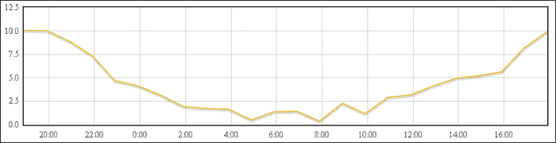

## 它是如何工作的...

`$.plot`函数接受三个参数：

+   占位符选择器。这是 Flot 将绘制图表的地方。

+   要绘制的系列数组。Flot 可以同时在同一图表上绘制多个系列。每个系列都是一个对象，至少必须包含`data`属性。该属性是一组两个元素数组，它们是系列的 x 和 y 值。其他属性允许我们控制特定系列的绘制方式-这些将在下一个示例中更详细地探讨。默认情况下，Flot 使用预设颜色绘制常规线图。

+   一个包含广泛的图表绘制选项的`options`对象，用于图表标签、轴、图例和网格。这些选项也将在下一个示例中探讨。

在这个示例中，我们为 x 轴指定了“时间”模式。这会导致 Flot 在我们的轴上适当地标记小时、天、月或年（取决于数据的时间跨度）。

## 还有更多...

以下是`getData`函数的简单 Ajax 替代，发送一个 Ajax 请求到同一域上的路径`/chart`上托管的请求处理程序以检索图表数据：

```html
function getData(cb) {
    $.get('/chart').success(cb);
}
```

# 创建柱状图

与通常用于显示平均值或瞬时值的折线图不同，条形图用于可视化属于离散组的数据。例如每日、每月和每周的销售量（组是天、月和周），每个用户的页面访问量，每辆车的燃料消耗等。

Flot 图表库还可以绘制条形图。在这个示例中，我们将可视化过去七天的每日销售量。我们还将分别显示来自不同产品的销售量，堆叠在彼此之上。

## 准备工作

我们需要从官方网站[`www.flotcharts.org/`](http://www.flotcharts.org/)下载 Flot，并将内容提取到名为`flot`的单独文件夹中。

## 如何做...

让我们修改折线图代码，以绘制我们的柱状图。

1.  首先，我们将复制上一个折线图示例中的相同 HTML 页面，但是我们会做一些更改。为了绘制堆叠条形图，我们需要堆叠插件，它位于`jquery.flot.stack.js`文件中。图表占位符的高度增加以获得对各个堆叠条形图的更好概览：

```html
<!DOCTYPE HTML>
<html>
    <head>
        <title>Chart example</title>
    </head>
    <body>
        <div id="chart" style="height:300px; width:800px;"></div>
        <script src="img/jquery.min.js"></script>
        <script src="img/jquery.flot.js"></script>
        <script src="img/jquery.flot.stack.js"></script>
        <script type="text/javascript" src="img/example.js"></script>
    </body>
</html>
```

1.  然后我们将创建`example.js`脚本：

```html
$(function() {    
    var day = 24 * 60 * 60 * 1000;
    function getData(cb) {
        var now  = new Date();
        now = new Date(now.getYear(), now.getMonth(), now.getDate()).getTime();
        var products = [];
        for (var product = 1; product < 4; ++product) {
            var sales = { label: "Product " + product, data: [] };
            for (var k = 7; k > 0; --k)
                sales.data.push([now - k*day, Math.round(Math.random()*10)]);
            products.push(sales);
        }
        cb({series:products});
    }

    getData(function(data) {
        $.plot("#chart", data.series, {
            series: {
                stack: true, lines: { show: false },
                bars: { show: true, barWidth: 0.8 * day, align:'center' }
            }, xaxis: {mode: 'time'}
        });
    });
});
```

代码在下一节中进行了解释。以下是生成的图表的外观：

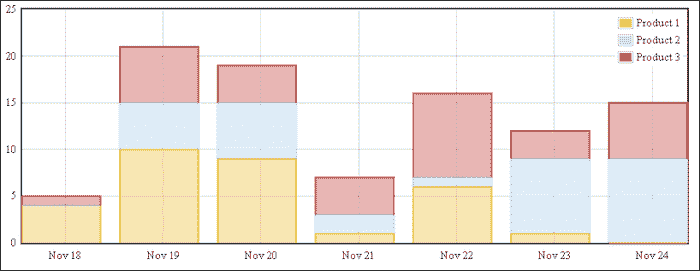

## 它是如何工作的...

与以前的示例一样，`$.plot`函数接受三个参数。第一个参数是图表占位符，第二个是数据，第三个是包含图表选项的对象。

以下是我们输入数据的方案：

```html
[
  {label: "Product 1", data:[
    [timestamp, value],
    [timestamp, value], …]},
  {label: "Product 2", data: […]},
  {label: "Product 3", data: […]}
]
```

输入数据是一个系列的数组。每个系列代表一个产品的销售情况。系列对象有一个`label`属性表示产品，以及一个`data`属性，它是一个数据点的数组。每个数据点都是一个二维数组。此数组的第一个元素是日期，表示为以毫秒为单位的 UNIX 时间戳——即当天的确切开始。第二个元素是当天的销售数量。

为了更轻松地操作日期，我们定义一个表示一天中毫秒数的变量。稍后，我们将使用此变量来定义图表中条形的宽度。

Flot 会自动从预定义列表中为我们选择系列颜色（但是，我们也可以指定我们需要的颜色，我们将在下面的示例中看到）。

代码中指定了几个系列选项。我们通过将`stack`属性的值设置为`true`来告诉 Flot 堆叠我们的系列。我们还确保隐藏了默认情况下会显示的线条。

为了使柱形图的中心与日期的 x 轴刻度对齐，我们将`bar`对象中的`align`属性的值设置为`center`。

我们输入数据中的每个系列都有一个标签。因此，Flot 会自动生成一个放置在右上角的图例。

Flot 会自动选择轴的边界，但可以使用`options`对象来控制它们。

# 创建饼图

当可视化比例或百分比作为一个整体时，通常使用饼图。饼图足够简单，可以自己绘制；但是，为了获得更灵活和美观的结果，我们将使用 Flot 图表库及其饼图插件。

Flot 的饼图插件可以显示带有图例或不带图例的饼图，并具有广泛的选项来控制标签的位置。它还能够渲染倾斜的饼图和甜甜圈图。还包括交互式饼图的支持。

在这个示例中，我们将制作一个关于访问者浏览器的饼图。

## 准备工作

我们需要从官方网站[`www.flotcharts.org/`](http://www.flotcharts.org/)下载 Flot，并将内容提取到名为`flot`的单独文件夹中。

## 如何做...

让我们编写 HTML 和 JavaScript 代码。

1.  在`index.html`中创建以下 HTML 页面：

```html
<!DOCTYPE HTML>
<html>
    <head>
        <title>Chart example</title>
    </head>
    <body>
        <div id="chart" style="height:600px; width:600px;"></div>
        <script src="img/jquery.min.js"></script>
        <script src="img/jquery.flot.js"></script>
        <script src="img/jquery.flot.pie.js"></script>
        <script type="text/javascript" src="img/example.js"></script>
    </body>
</html>
```

页面中有一个图表的占位符元素。

Flot 依赖于包含的 jQuery 库。要绘制饼图，我们需要添加 Flot 的饼图插件。

1.  创建`example.js`脚本：

```html
$(function() {    
    var day = 24 * 60 * 60 * 1000;
    function getData(cb) {
        var browsers = [
            {label: 'IE', data: 35.5, color:"#369"},
            {label: 'Firefox', data: 24.5, color: "#639"},
            {label: 'Chrome', data: 32.1, color: "#963"},
            {label: 'Other', data: 7.9, color: "#396"}
        ];
        cb(browsers);
    }

    getData(function(data) {
        $.plot("#chart", data, {
        series: {
            pie: {
                show: true,
                radius: 0.9,
                label: {
                    show: true,
                    radius: 0.6,
                },
                tilt: 0.5
            }
        },
        legend: { show: false }
        });
    });
});
```

它生成以下饼图：

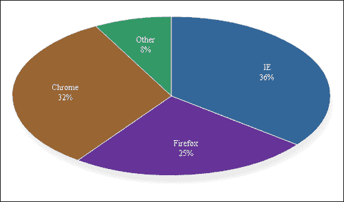

## 工作原理...

Flot 要求饼图切片数据以对象数组的形式提供。每个对象包含以下两个属性：

+   `label`：这是切片的标签

+   `data`：这是切片的编号——一个可以是任何值的数字（不需要是百分比）

在调用`$.plot`时，第一个参数是饼图的占位符元素，第二个是饼图切片的数组，第三个包含饼图选项。

为了显示饼图，最小的`options`对象如下：

```html
{pie: {show: true}}
```

自定义默认饼图，我们使用以下内容添加到`pie`属性中：

+   `radius`：指定饼图的大小，以画布的百分比表示。

+   `label`：`show`（布尔值）属性设置为`true`以显示饼图标签，`radius`属性控制标签与饼图中心的距离。

+   `tilt`：这会对饼图进行 3D 倾斜。如果省略，Flot 将渲染一个无标题的圆形饼图。

## 还有更多...

还有更多可用的选项，例如以下内容：

+   `innerRadius`：将其设置为值，例如`0.5`，以创建一个圆环图。

+   `combine`：此属性用于将较小的切片合并为单个切片。它是一个包含以下属性的对象：

+   `threshold`：设置为整体的百分比，例如，`0.1`

+   `color`：这是用于渲染“其他”部分的颜色，例如，`#888`

有关更多详细信息，请参阅[`people.iola.dk/olau/flot/examples/pie.html`](http://people.iola.dk/olau/flot/examples/pie.html)上的饼图示例。

# 创建面积图

在需要在线图的位置上堆叠多个结果时，通常使用面积图。它们也可以在某些情况下用于增强图表的视觉吸引力。

这个示例将展示一个使用面积图来增强视觉吸引力的例子：显示海拔数据。

假设我们需要可视化一个 8 公里的下坡徒步旅行，然后是 12 公里的平地行走的海拔。我们还想标记图表的“山脉”部分。最后，我们希望海拔线下的区域以一种让人联想到颜色浮雕地图的方式填充，低海拔使用绿色，中等海拔使用黄色，高海拔使用白色。

## 准备工作

在这个示例中，我们还将使用 Flot 图表库，因此我们需要从官方网站[`www.flotcharts.org/`](http://www.flotcharts.org/)下载 Flot 并将内容提取到名为`flot`的单独文件夹中。

## 如何操作...

1.  我们的 HTML 文件需要一个图表占位符元素和必要的脚本。以下是内容：

```html
<!DOCTYPE HTML>
<html>
    <head>
        <title>Chart example</title>
        <style type="text/css">
            #chart { font-family: Verdana; }
        </style>
    </head>
    <body>
        <div id="chart" style="height:200px; width:800px;"></div>
        <script src="img/jquery.min.js"></script>
        <script src="img/jquery.flot.js"></script>
        <script type="text/javascript" src="img/example.js"></script>
    </body>
</html>
```

1.  我们将在包含以下代码的`example.js`脚本中绘制图表：

```html
$(function() {    
    function getData(cb) {
        var altitudes = [];
        // Generate random but convincing-looking data.
        for (var k = 0; k < 20; k += 0.5)
            altitudes.push([k, Math.random()*50 + 1000*Math.pow((k-15)/15,2)]);
        cb(altitudes);
    }

    getData(function(data) {
        $.plot("#chart", [{data: data}], {
            xaxis: {
                tickFormatter: function(km) { return km + ' km'; }
            },
            lines: {
                fill: true,
                fillColor: {colors: ["#393", "#990", "#cc7", "#eee"] }
            },
            grid: {
                markings: [{ xaxis: { from: 0, to: 8 }, color: "#eef" }]
            }
        });
    });
});
```

以下是我们的结果：

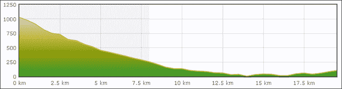

海拔线下的区域以一种让人联想到颜色浮雕的方式填充。山区部分由`markings`对象创建的蓝色区域标记。

## 工作原理...

与我们所有的示例一样，`example.js`中的`getData`函数生成随机数据，然后调用提供的回调函数以使用数据。我们可以很容易地编写一个替代函数，而不是从服务器获取数据，而是使用 jQuery。

单次调用`$.plot`将绘制面积图。第一个参数是目标容器。第二个参数是要绘制的系列数组——在这种情况下只有一个。

第三个参数更复杂。它包括以下部分：

+   `xaxis`属性指定我们的 x 轴的行为。我们通过提供自己的刻度格式化程序来覆盖默认的刻度标签。此格式化程序在刻度值后添加`"km"`字符串。

+   `lines`属性指定我们将使用填充线图。我们希望有类似山的渐变填充效果，因此我们指定了一个包含 CSS 颜色字符串数组的渐变对象，即`{color: [颜色数组]}`。

+   `grid`属性用于在我们的图表上标记山脉段。我们指定它应该包含一个 x 轴段的标记，跨越 0 到 8 公里的范围，并具有浅蓝色。

## 还有更多...

Flot 有更多的面积图选项——它们可以在随分发的 API 文档中找到。

要使用这个配方，我们需要从服务器提供我们自己的数据数组。以下是`getData`函数的一个简单 Ajax 替代，向托管在同一域上的请求处理程序发送 Ajax 请求，以检索图表数据的路径`/areachart`。这很简单：

```html
function getData(cb) {
    $.get('/areachart').success(cb);
}
```

# 显示组合图表

组合图表是具有多个 x 或 y 轴的图表，并且可能具有多种类型的系列（线条、条形和面积）。有时，我们可能希望在单个图表上呈现多种异构类型的数据，通常是为了可视化其相关性。

在这个配方中，我们将尝试通过在单个图表上呈现温度和海拔来可视化一次登山。高度系列将是一个具有渐变颜色的面积图，让人联想到地形图，但温度系列将是一条线状图，如果高于摄氏 19 度则为红色，如果低于摄氏 19 度则为蓝色。

为了做到这一点，我们需要一个能够处理两个 y 轴的图表库。我们将使用 Flot 图表库，因为它能够显示具有两个或多个 x 或 y 轴的图表。

## 准备工作

就像在以前的配方中一样，我们需要从官方网站[`www.flotcharts.org/`](http://www.flotcharts.org/)下载 Flot 并将内容提取到名为`flot`的单独文件夹中。

## 如何做...

让我们编写 HTML 和 JavaScript 代码。

1.  我们的 HTML 文件需要一个图表占位符、jQuery、Flot 和我们的示例脚本。这次我们还需要`threshold`插件，以便有两种温度颜色。以下是内容：

```html
<!DOCTYPE HTML>
<html>
    <head>
        <title>Chart example</title>
        <style type="text/css">
            #chart { font-family: Verdana; }
        </style>
    </head>
    <body>
        <div id="chart" style="height:200px; width:800px;"></div>
        <script src="img/jquery.min.js"></script>
        <script src="img/jquery.flot.js"></script>
        <script src="img/jquery.flot.threshold.js"></script>
        <script type="text/javascript" src="img/example.js"></script>
    </body>
</html>
```

1.  我们的图表是在`example.js`中使用以下代码绘制的：

```html
$(function() {    
    function getData(cb) {
        var altitudes = [], temperatures = [];
        // Generate random but convincing-looking data.
        for (var k = 0; k < 20; k += 0.5) {
            altitudes.push([k, Math.random()*50 + 1000*Math.pow((k-15)/15,2)]);
            temperatures.push([k, Math.random()*0.5 + k/4 + 15]);
        }
        cb({alt:altitudes, temp:temperatures});
    }

    getData(function(data) {
        $.plot("#chart", [
           {
             data: data.alt, yaxis:1,
             lines: {fill:true, fillColor: {
             colors: ["#393", "#990", "#cc7", "#eee"] } }
                },
           {
             data: data.temp, yaxis:2, color: "rgb(200, 20, 30)",
             threshold: { below: 19, color: "rgb(20, 100, 200)" }
                }
            ], {
            yaxes: [ { }, { position: "right"}],
            xaxis: {
                tickFormatter: function(km) { return km + ' km'; }
            },
            grid: {
                markings: [{ xaxis: { from: 0, to: 8 }, color: "#eef" }]
            }
        });
    });
});
```

以下屏幕截图显示了最终结果：

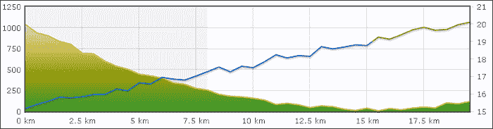

## 它是如何工作的...

使用`getData`函数，我们为绘图生成了两个系列，一个包含温度，另一个包含海拔。

在绘制图表时，我们首先调用`getData`函数。在提供的回调中，我们将数据传递给`$.plot`函数，该函数接受目标容器元素、系列数组和绘图选项。

数组中的第一个系列包含高度数据。我们有两个 y 轴，所以我们需要声明我们将用于该系列的 y 轴——第一个 y 轴。其余的参数声明了填充渐变；有关更多信息，请参阅*创建面积图*配方。

第二个系列使用第二个 y 轴。新的是`threshold`属性。它指定对于低于 19 度的值，线的颜色应该不同（蓝色而不是红色）。

我们将在`options`对象中通过指定`yaxes`属性（注意名称中的复数形式）来配置第二个 y 轴。该属性是一个包含 y 轴选项的数组。我们将使用第一个轴的默认值，因此为空对象。我们将把第二个轴放在右侧。

x 轴的单位是公里，因此我们的`tickformatter`函数在数字后添加字符串`" km"`。

最后，我们用网格标记选项将“山脉部分”（从 0 到 8 公里）标记为蓝色。

## 还有更多...

这里是`getData`函数的一个简单 Ajax 替代，向托管在同一域上的请求处理程序发送 Ajax 请求，以检索图表数据的`/charts`路径。此处理程序应返回以下格式的对象：

```html
{alt: data1, temp: data2}
```

其中`data1`和`data2`是包含数据的二维数组。

```html
function getData(cb) {
    $.get('/charts').success(cb);
}
```

# 创建气泡图

气泡图可以将值集显示为圆圈。它们适用于大小在 10 到 100 之间的数据集。它们特别适用于可视化数量级差异的值，并且可以在这些情况下取代饼图。

由于气泡图更复杂且稍微不太常见，我们需要一个灵活的库来绘制它们。优秀的 D3 库（[`d3js.org/`](http://d3js.org/)）非常适合；它提供了一组工具（核心数据驱动 DOM API 加上“pack”数据布局），可以实现气泡图的创建。

我们将绘制一个气泡图，显示来自引荐网站的访问者数量。

## 操作步骤如下...

让我们编写 HTML 和 JavaScript 代码。

1.  我们将创建一个包含图表占位符的 HTML 页面。我们将包括图表库 D3，以及将从我们的`example.js`文件绘制气泡图的代码：

```html
<!DOCTYPE HTML>
<html>
    <head>
        <title>Chart example</title>
        <style type="text/css">
            #chart text { font-family: Verdana; font-size:10px; }
        </style>
    </head>
    <body>
        <div id="chart"></div>
        <script src="img/d3.v2.js?2.9.5"></script>
        <script type="text/javascript" src="img/example.js"></script>
    </body>
</html>
```

1.  然后我们将在`example.js`中添加以下代码：

```html
(function() {
var getData = function(cb) {
    cb({children:[
        {domain: 'google.com', value: 6413},
        {domain: 'yahoo.com', value: 831},
        {domain: 'bing.com', value: 1855},
        {domain: 'news.ycombinator.com', value: 5341},
        {domain: 'reddit.com', value: 511},
        {domain: 'blog.someone.com', value: 131},
        {domain: 'blog.another.com', value: 23},
        {domain: 'slashdot.org', value: 288},
        {domain: 'twitter.com', value: 327},
        {domain: 'review-website.com', value: 231}
    ]});
}

// r is the dimension of the bubble chart
var r = 640,
    fill = d3.scale.category20c();

// create the visualization placeholder
var vis = d3.select("#chart").append("svg")
    .attr("width", r)
    .attr("height", r)
    .attr("class", "bubble");

// create a pack layout for the bubbles
var bubble = window.bubble = d3.layout.pack()
    .sort(null)
    .size([r, r])
    .padding(1.5);

    getData(function(json) {
        // Process the data with the pack layout
        var data = bubble.nodes(json);
        // Create a node for every leaf data element
        var selection = vis.selectAll("g.node")
            .data(data.filter(function(d) { return !d.children; }));
        var node = selection.enter().append("g");

        node.attr("class", "node");
        node.append("title")
            .text(function(d) { return d.domain });
        node.attr("transform", function(d) { return "translate(" + d.x + "," + d.y + ")"; });
        node.append("circle")
            .attr("r", function(d) { return d.r; })
            .style("fill", function(d) { return fill(d.domain); });
        node.append("text")
            .attr("text-anchor", "middle")
            .attr("dy", ".3em")
            .text(function(d) { return d.domain.substring(0, d.r / 3); });
    });
}());
```

在接下来的部分中，我们将解释 D3 的工作原理以及我们如何使用它来创建气泡图：

## 工作原理...

与大多数其他图表库不同，D3 没有任何预定义的图表类型，可以绘制。相反，它提供了一组模块化工具，您可以自由混合和匹配，以创建任何类型的数据驱动文档。

然而，D3 包含一些非常特定于可视化的工具。

例如，`d3.scale.category20c`创建一个序数比例尺。序数比例尺将输入值映射到一组离散的输出值。在这种情况下，离散的值集是一组预定义的 20 种输出颜色。比例尺是一个函数——它将输入值映射到输出值。我们可以明确指定哪些输入值映射到哪些输出值，但如果我们不这样做，它会根据使用情况进行推断。在我们的情况下，这意味着第一个域名将映射到第一个颜色，第二个将映射到第二个，依此类推。

其他工具包括类似于 jQuery 的 DOM 选择工具，在我们的示例中，我们使用它们将 SVG 元素添加到我们的图表占位符中。

另一个例子是 D3 布局。要绘制气泡图，我们需要一个包布局。布局根据某些规则和约束将一组具有值的对象映射到一组输出坐标。一个常见的例子是**力布局**，它是一种通过在图形节点之间迭代应用虚拟力来排列对象的图形布局。

我们使用的是将对象层次化地打包成圆圈的包布局。我们的数据是平面的，因此包布局仅用于自动排列我们的圆圈。创建一个包布局并将其分配给`bubble`变量。

包布局通过将`bubble.nodes`函数应用于输入数据来工作。此函数查找输入数据中每个对象中的`value`属性。基于这个属性（它将其视为相对半径）和布局的大小，它将以下属性添加到我们的数据中：x、y 和 r，并返回结果数组。

此时，我们已经有了绘制气泡图所需的大部分数据：我们有气泡的位置和尺寸。现在我们需要做的就是将它们转换为适当的 SVG 元素。我们用来做这个的工具是 D3 的`selectAll`函数。

与 jQuery 选择器不同，D3 的`selectAll`可以用于在文档和数据对象之间维护双向映射。我们使用选择的`.data`函数指定映射到我们选择的数据数组。

声明了这个映射之后，我们可以决定当一个元素被添加到我们的数据数组时会发生什么，使用`.enter`函数。在我们的示例中，我们声明一个新的 SVG 图形元素被添加到 SVG 画布中，并将该声明分配给`node`变量。

需要注意的是，我们的节点变量并不持有 SVG 元素；相反，它是未来将创建的节点集合中每个图形 SVG 元素的选择，每当新的数据元素“进入”选择时，节点上的操作指定将在每个添加的 SVG 元素上执行的操作。

我们指定每个节点都将有一个`title`属性（将在鼠标悬停时显示）。此标题的内部文本取决于数据数组中的特定元素。为了描述这一点，我们将一个函数作为`.text()`调用的参数传递。传递函数的第一个参数将是特定节点的数据元素，返回的值应该是将设置为标题的文本。

类似地，我们将我们的气泡移动到由包布局计算的位置。之后，我们添加一个由包布局计算的半径的圆和颜色比例尺来生成圆的颜色。

最后，以相同的方式附加文本节点。

以下是结果的样子：

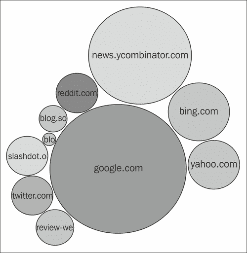

## 还有更多...

此示例使用 SVG（可缩放矢量图形）标记来呈现可视化。大多数现代浏览器都支持 SVG，但 IE9 之前的 Internet Explorer 版本不支持。但是，D3 不仅限于 SVG，它还能够生成 HTML 元素，这些元素可以用作 IE 旧版本的替代品。

# 展示带有标记位置的地图

谷歌地图的崛起和他们出色的 API 使地图嵌入网站变得流行起来。嵌入式地图有各种用途：显示用户去过的地方，显示事件的位置，显示商店的位置等等。地图可以与我们网站上显示的每个文本地址一起显示。

在这个教程中，我们将制作一个简单的地图，并在上面标记一个位置。为此，我们将使用**Leaflet**库（[`leafletjs.com/`](http://leafletjs.com/)），这是一个广泛被 Flickr、FourSquare、Craigslist、Wikimedia 和其他流行网站使用的知名库。

我们将显示一个**OpenStreetMap**地图图层。OpenStreetMap（[`www.openstreetmap.org/`](http://www.openstreetmap.org/)）是一个类似维基百科的免费协作创建的街道地图，覆盖范围广泛。

我们还将添加一个描述气球，当点击标记时会显示。

## 如何做...

让我们编写 HTML 和 JavaScript 代码。

1.  在我们的 HTML 文件中添加 Leaflet 的样式表，以及 IE8 和更旧版本所需的条件额外 CSS：

```html
<link rel="stylesheet" href="http://cdn.leafletjs.com/leaflet-0.4/leaflet.css" />
 <!--[if lte IE 8]>
     <link rel="stylesheet" href="http://cdn.leafletjs.com/leaflet-0.4/leaflet.ie.css" />
<![endif]-->
```

1.  在我们的脚本中包含 Leaflet 库 JS 文件：

```html
<script src="img/leaflet.js"></script>
```

1.  在我们的页面上放置地图的占位符。我们还必须指定它的高度，否则 Leaflet 将无法正常工作：

```html
<div id="map" style="height:200px;"></div>
```

1.  通过添加`example.js`来添加我们的 JS 代码：

```html
<script src="img/example.js"></script>
```

1.  最后，在`example.js`中添加创建地图的代码：

```html
var map = L.map('map').setView([51.505, -0.09], 13);

L.tileLayer('http://{s}.tile.openstreetmap.org/{z}/{x}/{y}.png',{
        attribution:'Copyright (C) OpenStreetMap.org',
        maxZoom:18
        }).addTo(map);

var marker = L.marker([51.5, -0.09]).addTo(map);
marker.bindPopup("<b>Hello world!</b><br>I am a popup.").openPopup();
```

## 它是如何工作的...

大多数地图库通过使用瓦片图像图层来绘制它们的地图。瓦片图像图层是具有预定义固定大小的图像网格。这些图像是地图的切片部分，已经预先渲染并托管在瓦片服务器上。

地图使用称为**缩放级别**的离散缩放点。不同的缩放级别使用不同的瓦片图像。

在某些情况下，特别是在高缩放级别下，服务器会根据需要在空间超出合理存储空间大小的情况下动态渲染瓦片。例如，OpenStreetMap 使用 19 个缩放级别。第一级使用单个瓦片，第二级将此瓦片分成四个瓦片，第三级使用 16 个瓦片，依此类推。在第 19 个缩放级别，有 480 亿个瓦片，假设平均瓦片大小为 10KB，那将需要 480TB 的存储空间。

当用户滚动地图时，以前未加载的区域的瓦片会动态加载并显示在容器中。当用户更改缩放级别时，旧缩放级别的瓦片将被移除，新的瓦片将被添加。

在我们的`example.js`文件中，我们使用 Leaflet 的函数（在`L`命名空间对象中找到）来创建地图。地图初始化为位于伦敦的中心，使用代表`[纬度，经度]`对的数组。另一个参数是缩放级别，设置为`13`。

之后添加了一个瓦片图层。我们指定 OpenStreetMap 使用的瓦片服务器模式如下：

```html
http://{s}.tile.openstreetmap.org/{z}/{x}/{y}.png
```

其中`s`是服务器字母（`a`，`b`或`c`），`z`是缩放级别，`x`和`y`是瓦片的离散坐标。例如，在缩放级别 1 时，`x`和`y`中的每一个可以是`1`或`2`，而在缩放级别 2 时，它们可以在 1 到 4 的范围内。我们还指定了可用的最大缩放级别。

我们向地图添加自己的标记。初始化参数是一个`[纬度，经度]`对。之后，我们可以在标记内部添加一个弹出窗口，显示文本和/或任意 HTML。我们立即打开弹出窗口。

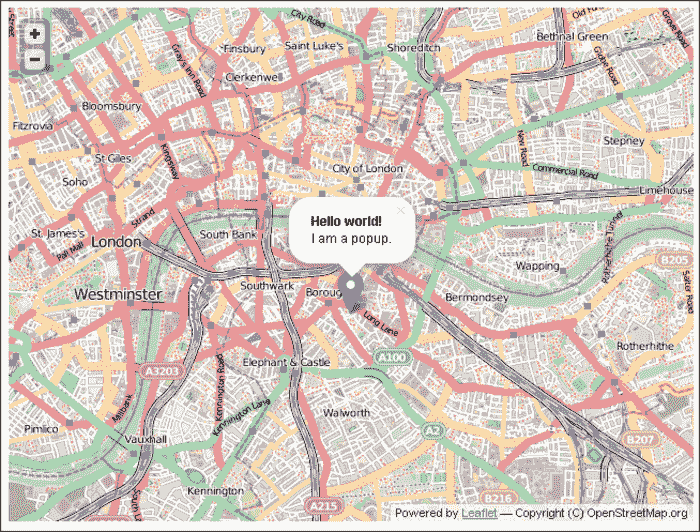

使用 Leaflet 绘制的地图

# 显示带有路径的地图

在显示地图时，有时我们可能希望显示的不仅仅是位置。除了标记，另一个最常见的地图叠加层是路径和区域。

在这个食谱中，我们将创建一个显示路径和区域的地图。

## 如何做...

让我们编写 HTML 和 JavaScript 代码。

1.  就像在*显示带有标记位置的地图*食谱中一样，我们需要包含适当的 CSS 和脚本。以下是一个示例 HTML 文件：

```html
<!DOCTYPE HTML>
<html>
    <head>
        <title>Map example</title>
        <link rel="stylesheet" href="http://cdn.leafletjs.com/leaflet-0.4/leaflet.css" />
        <!--[if lte IE 8]>
        <link rel="stylesheet" href="http://cdn.leafletjs.com/leaflet-0.4/leaflet.ie.css" />
        <![endif]-->
    </head>
    <body>
        <div id="map" style="height:480px; width:640px;"></div>
        <script src="img/jquery.min.js"></script>
        <script src="img/leaflet.js"></script>
        <script type="text/javascript" src="img/example.js"></script>
    </body>
</html>
```

1.  然后我们可以将我们的代码添加到`example.js`中：

```html
var map = L.map('map').setView([52.513, -0.06], 14)

L.tileLayer('http://{s}.tile.openstreetmap.org/{z}/{x}/{y}.png',{
    attribution:'Copyright (C) OpenStreetMap.org',
    maxZoom:18
}).addTo(map);

var polyline = L.polyline([
    [52.519, -0.08],
    [52.513, -0.06],
    [52.52, -0.047]
]).addTo(map);

var polygon = L.polygon([
    [52.509, -0.08],
    [52.503, -0.06],
    [52.51, -0.047]
], {
    color:"#f5f",
    stroke: false,
    fillOpacity:0.5
}).addTo(map);
```

## 它是如何工作的...

我们使用`L.map`函数创建地图，并使用`setView`在指定的`[纬度，经度]`数组和缩放级别上设置地图的位置。我们还添加了标准的 OpenStreetMap 瓦片图层。

首先，我们创建并添加一个标准折线。由于我们没有指定任何选项，Leaflet 对颜色、不透明度、边框等都使用了合理的默认值。折线构造函数采用`[纬度，经度]`对的数组，并绘制通过它们的顶点的线。

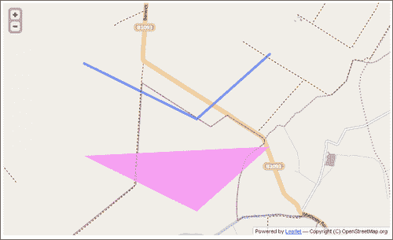

之后，我们创建一个稍微定制的多边形。与折线构造函数一样，多边形也采用`[纬度，经度]`对的数组。此外，我们自定义了背景颜色，删除了多边形的边框，并指定了多边形的不透明度为 50%。

# 显示表盘

模拟表盘对于可视化数值在预定义最小值和最大值之间并随时间变化的数据非常有用。示例包括燃料量，当前速度，磁盘空间，进程和内存使用等。

在这个食谱中，我们将为 jQuery 制作一个非常灵活的、数据驱动的表盘插件。然后我们将使用这个插件来显示模拟汽车速度表。以下是速度表的外观：

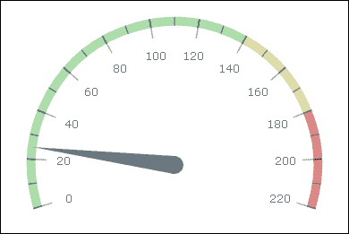

该食谱广泛使用了 HTML5 的画布。

## 如何做...

让我们为我们的示例编写 HTML 代码，表盘插件和将它们联系在一起的代码。

1.  制作一个简单的 HTML 文件，其中包含我们的表盘的画布：

```html
<!DOCTYPE HTML>
<html>
    <head>
        <title>Gauge example</title>
    </head>
    <body>
        <canvas id="gauge" width="400" height="400"></canvas>
        <script src="img/jquery.min.js"></script>
        <script type="text/javascript" src="img/example.js"></script>
    </body>
</html>
```

1.  然后在`example.js`中编写我们的表盘插件代码：

```html
(function($) {
```

1.  这是一个支持函数，它替换了`Array.forEach`，可以在单个项目和数组上工作。我们的表盘将支持多个条纹、指针和刻度，但当提供单个条纹时，它也应该能够工作：

```html
    function eachOrOne(items, cb) {
        return (items instanceof Array ? items : [items]).map(cb);
    }
```

1.  以下是一个通用函数，它围绕中心`c`（角度量为`a`）旋转点`pt`。方向是顺时针的：

```html
    function rotate(pt, a, c) {
        a = - a;
        return { x: c.x + (pt.x - c.x) * Math.cos(a) - (pt.y-c.y) * Math.sin(a),
                 y: c.y + (pt.x - c.x) * Math.sin(a) + (pt.y-c.y) * Math.cos(a) };
    }
```

1.  以下是我们的表盘插件

```html
    $.gauge = function(target, options) {
        var defaults = {
            yoffset: 0.2,
            scale: {
                type: 'linear',
                values: [1, 200],
                angles: [0, Math.PI]
            },
            strip: {
                scale: 0, radius: 0.8, width: 0.05,
                color: "#aaa", from: 0, to: 200
            },           
            ticks: {
                scale: 0, radius: 0.77, length: 0.1, width: 1, color: "#555",
                values: {from: 0, to:200, step: 10},
            },           
            labels: {
                scale: 0, radius: 0.65,
                font: '12px Verdana', color: "#444",
                values: {from: 0, to:200, step: 20}
            },
            needle: {
                scale: 0, length: 0.8, thickness: 0.1,
                color: "#555", value: 67
            }
        };
```

默认情况下，我们的表盘具有以下特点：

+   从顶部偏移 20%

+   具有值范围 1 到 200 的线性刻度，角度范围 0 到 180 度，

+   具有 80%或总半径宽度为总半径 5%的单条带，颜色为灰色，范围从 0 到 200。

+   具有一个从 0 到 200 的单个`ticks`数组，步长为 10

+   具有从 0 到 200 的标签，步长为 20

+   具有单个指针设置为值 67

1.  我们允许用户覆盖选项，并指定之前提到的任何组件的多个：

```html
        var options = $.extend(true, {}, defaults, options);
        for (var key in defaults) if (key != 'yoffset')
            options[key] = eachOrOne(options[key], function(item) {
                return $.extend(true, {}, defaults[key], item);
            });        
        var $target = $(target);
        var ctx = $target[0].getContext('2d');
```

1.  我们构建我们的`scale`函数，并用实际数组替换指定值范围的对象。请注意，您可以指定实际数组，而不是`range`对象：

```html
        options.scale = eachOrOne(options.scale, function(s) {
            return $.gauge.scale(s);
        });
        eachOrOne(options.ticks, function(t) {
            return t.values = $.gauge.range(t.values);
        });
        eachOrOne(options.labels, function(l) {
            return l.values = $.gauge.range(l.values);
        });
```

1.  以下是绘图代码：

```html
        function draw(options) {
```

1.  我们将使用仪表中心作为参考点，并清除画布：

```html
            var w = $target.width(), h = $target.height(),
                c = {x: w * 0.5, y: h * (0.5 + options.yoffset)},
                r = w * 0.5,
                pi = Math.PI;
            ctx.clearRect(0, 0, w, h);
```

1.  然后我们将绘制所有条带（一个或多个）作为弧线：

```html
            // strips
            eachOrOne(options.strip, function(s) {
                var scale = options.scale[s.scale || 0];
                ctx.beginPath();
                ctx.strokeStyle = s.color;
                ctx.lineWidth = r * s.width;
                ctx.arc(c.x, c.y, s.radius * r, scale(s.to), scale(s.from), true);
                ctx.stroke();
            });
```

1.  然后绘制所有刻度（我们使用非常短、非常粗的弧线作为刻度）。我们的`scale`函数将`range`中的值转换为角度：

```html
            // ticks
            eachOrOne(options.ticks, function(s) {
                var scale = options.scale[s.scale || 0];
                ctx.strokeStyle = s.color;
                ctx.lineWidth = r * s.length;
                var delta = scale(s.width) - scale(0);
                s.values.forEach(function(v) {
                    ctx.beginPath();
                    ctx.arc(c.x, c.y, s.radius * r,
                        scale(v) + delta, scale(v) - delta, true);
                    ctx.stroke();
                });
            });
```

1.  然后我们绘制标签。我们通过将其放在最右边的垂直居中位置来确定位置，然后按照与值缩放的量逆时针旋转它：

```html
            // labels
            ctx.textAlign    = 'center';
            ctx.textBaseline = 'middle';
            eachOrOne(options.labels, function(s) {
                var scale = options.scale[s.scale || 0];
                ctx.font = s.font;
                ctx.fillStyle = s.color;
                s.values.forEach(function(v) {
                    var pos = rotate({x: c.x + r * s.radius, y:c.y},
                        0 - scale(v), c);
                    ctx.beginPath();
                    ctx.fillText(v, pos.x, pos.y);
                    ctx.fill();
                });
            });
```

1.  最后，我们绘制指针。指针由一个圆和一个三角形组成，圆心位于仪表的中心旋转点，三角形从那里延伸。我们旋转所有三角形点的方式与旋转标签中心的方式相同：

```html
            // needle
            eachOrOne(options.needle, function(s) {
                var scale = options.scale[s.scale || 0];
                var rotrad = 0 - scale(s.value);
                var p1 = rotate({x: c.x + r * s.length, y: c.y},    rotrad, c),
                    p2 = rotate({x: c.x, y: c.y + r*s.thickness/2}, rotrad, c),
                    p3 = rotate({x: c.x, y: c.y - r*s.thickness/2}, rotrad, c);
                ctx.fillStyle = s.color;
                ctx.beginPath();
                ctx.arc(c.x, c.y, r * s.thickness / 2, 0, 2*Math.PI);
                ctx.fill();
                ctx.beginPath();
                ctx.moveTo(p1.x, p1.y);
                ctx.lineTo(p2.x, p2.y);
                ctx.lineTo(p3.x, p3.y);
                ctx.fill();                
            });            
        }        
        draw(options);
```

1.  在绘制整个仪表之后，`gauge`函数返回一个函数，该函数可用于更改仪表指针值并重新绘制它：

```html
        return function(val, i) {
            i = i || 0;
            options.needle[i].value = val;
            draw(options);
        }
    };
```

1.  这些是常见的辅助函数。`range`函数创建一个值数组，而`scale`创建一个将值从一个范围缩放到另一个范围的函数。两者都支持对数刻度：

```html
    $.gauge.range = function(opt) {
        if (opt instanceof Array) return opt;
        var arr = [], step = opt.step;
        var last = opt.from;
        for (var k = opt.from; k <= opt.to; k+= step)
            arr.push(opt.log ? Math.pow(opt.log, k) : k);
        return arr;
    };
    $.gauge.scale = function(opt, f) {
        if (opt.type == 'linear') opt.type = function(x) { return x; };
        else if (opt.type == 'log') opt.type = Math.log;
        var f = opt.type,
            v0 = f(opt.values[0]),
            v1 = f(opt.values[1]);
        return function(v) {
            return (f(v) - v0) / (v1 - v0)
                    * (opt.angles[1] - opt.angles[0]) + Math.PI + opt.angles[0];
        };
    }
}(jQuery));
```

使用 jQuery 对象作为参数调用匿名函数，在函数的范围内变为`$`。这是构建具有自己私有范围的 jQuery 插件的典型方式，并在该范围内使 jQuery 作为`$`可用，而不管全局命名空间中的`$`是否与 jQuery 相同。

1.  我们将在`example.js`中绘制我们的仪表。以下是内容：

```html
$(function() {
    var g = $.gauge("#gauge", {
        scale: {
            angles: [-0.3, Math.PI+0.3],
            values: [0, 220]
        },
        strip: [
            { from: 0,   to: 140, color:"#ada" },
            { from: 140, to: 180, color:"#dda" },
            { from: 180, to: 220, color:"#d88" }
        ],
        ticks: [{
            color: "rgba(0,0,0,0.33)",
            values: { from: 0, to: 220, step:10 },
            length:0.05, radius:0.8, width:0.3
        }, {
            color: "rgba(0,0,0,0.33)",
            values: { from: 0, to: 220, step:20 },
            length:0.11, radius: 0.77, width:0.3
        }],
        labels: {
            color: "#777",
            values: { from: 0, to: 220, step:20 },
            radius: 0.62
        },
        needle: { color:"#678" }
    });
    g(25);
});
```

## 它是如何工作的...

我们为仪表指定了一个线性刻度，角度略低于中间，并且速度值在 0 到 220 的范围内。我们创建了三个条带，绿色的范围是 0 到 140 公里/小时，黄色的范围是 140 到 180 公里/小时，红色的范围是 180 到 220 公里/小时。我们将使用两组条带：每 20 公里/小时一个较大的，每 10 公里/小时一个较小的，都是半透明的。最后，我们添加了一个带有蓝色色调的指针。

最后，我们可以使用返回的函数设置仪表值，我们将其设置为 25 公里/小时。

# 显示树

在这个配方中，我们将看看如何以树状布局显示数据。我们将通过 JSON 文件来可视化 Linux 的一个小家族树。此外，我们将使用`D3.js`文件来操作 DOM 以显示数据。

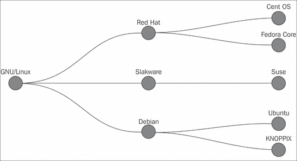

## 准备工作

首先，我们需要有将用于可视化的数据。我们需要获取这个配方示例中的`tree.json`文件。

## 如何做...

我们将编写 HTML 和支持 JavaScript 代码，应该从 JSON 文件生成数据：

1.  让我们首先看一下 JSON 数据的结构：

```html
{
  "name": "GNU/Linux",
  "url": "http://en.wikipedia.org/wiki/Linux",
  "children": [
    {
      "name": "Red Hat",
      "url": "http://www.redhat.com",
      "children": [ .. ]
   } ]
...
}
```

每个对象都有一个`name`属性，表示分布名称，一个`url`属性，其中包含指向官方网页的链接，以及可选的`children`属性，其中包含其他对象的列表。

1.  下一步将是使用 HTML5 文档类型创建页面，并添加对`D3.js`的依赖项和名为`tree.css`的 CSS 文件：

```html
<!DOCTYPE html>
<html>
  <head>
    <title>Linux Tree History</title>
    <script src="img/d3.v2.js"></script>
    <link type="text/css" rel="stylesheet" href="tree.css"/>
  </head>
```

1.  在`body`部分，我们将添加一个具有名为`location`的`id`的`<div>`标签，我们将用它作为占位符，并另外包含一个名为`tree.js`的 JavaScript 文件，该文件将用于包含映射数据的逻辑：

```html
  <body>
    <div id="location"></div>
    <script type="text/javascript" src="img/tree.js"></script>
  </body>
</html>
```

1.  让我们从在`tree.js`文件中创建显示区域开始。首先，我们创建提供内部私有状态的匿名函数：

```html
(function() {
```

1.  然后，我们设置生成图像的大小，给定`width`和`height`。为简单起见，我们将它们设置为固定值：

```html
var width = 1000,
          height = 600;
```

1.  然后，我们设置了一个标准的 D3 布局树：

```html
  var tree = d3.layout.tree()
          .size([height, width - 200]);
  var diagonal = d3.svg.diagonal()
          .projection(function(d) {
            return [d.y, d.x];
          });
```

1.  由于我们需要指定和创建实际的 SVG，我们使用之前在 HTML 中选择的`id`来选择位置，然后附加 SVG 元素：

```html
  var vis = d3.select("#location").append("svg")
          .attr("width", width)
          .attr("height", height)
          .append("g")
          .attr("transform", "translate(60, 0)");
```

1.  我们还需要从`tree.json`中读取数据，并以某种方式使用给定的层次结构创建节点和链接：

```html
d3.json("tree.json", function(json) {
    var nodes = tree.nodes(json);
    vis.selectAll("path.link")
          .data(tree.links(nodes))
          .enter().append("path")
          .attr("class", "link")
          .attr("d", diagonal);
    var node = vis.selectAll("g.node")
            .data(nodes)
            .enter().append("g")
            .append("a")
            .attr("xlink:href", function(d) {
                 return d.url;
              })
            .attr("class", "node")
            .attr("transform", function(d) {
                return "translate(" + d.y + "," + d.x + ")";
              });

    node.append("circle")
            .attr("r", 20);

    node.append("text")
            .attr("dx", -19)
            .attr("fill", "white")
            .attr("dy", -19)
            .style("font-size", "20")
            .text(function(d) {
              return d.name;
            });
```

1.  我们可以使用 CSS 样式页面，选择页面链接背景和圆圈的颜色：

```html
 .node circle {
     fill: #fc0;
     stroke: steelblue;
     stroke-width: 1px;
}
.link {
  fill: none;
  stroke: #fff;
  stroke-width: 5.0px;
}
body{  
    background-color: #000;
 }
```

## 它是如何工作的...

`d3.layout.tree()`创建一个具有默认设置的新树布局，其中假定数据元素中的每个输入都有一个子数组。

使用`d3.svg.diagonal()`，我们创建了一个具有默认访问器函数的生成器。 返回的函数可以生成连接节点的立方贝塞尔路径数据，其中我们有用于平滑线条的切线。

### 注意

有关贝塞尔曲线的更多信息，请访问[`en.wikipedia.org/wiki/Bézier_curve`](http://en.wikipedia.org/wiki/Bézier_curve)。 它背后有一些数学知识，但最简单的解释是，它是一条受到某些点影响的线，使其成为定义曲线的不错选择。

由于我们希望树从左到右而不是默认的从上到下，我们需要通过进行投影来改变默认行为：

```html
var diagonal = d3.svg.diagonal()
          .projection(function(d) {
              return [d.y, d.x];
          });
```

该函数将使用`[d.y, d.x]`而不是默认的`[d.x,d.y]`。 你可能已经注意到了`.append("g")`函数，它添加了 SVG `g`元素，这是一个用于将各种相关元素分组在一起的容器元素。 我们可以在其中有多个嵌套元素，一个在另一个内部，到任意深度，允许我们在各个级别创建组：

```html
<g>
      <g>
      <g>
       </g>
     </g>
   </g>
```

要读取 JSON 数据，我们使用了以下内容：

```html
d3.json("tree.json", function(json) { … }
```

这将对`tree.json`资源进行 AJAX 调用。

### 注意

请注意，默认情况下，您的浏览器不会允许跨域请求。 这包括对本地文件系统的请求。 要克服这一点，请使用附录 A 中解释的本地 Web 服务器，*安装 Node.js 和使用 npm*。 另一个选择是使用 JSONP 作为一个很好的解决方法，因为在这种安全限制下有一些缺点。 在第八章中，*与服务器通信*，我们将介绍这些限制背后的问题和原因。

有关更多信息，请查看 W3C 页面[`www.w3.org/TR/cors/`](http://www.w3.org/TR/cors/)。

然后，我们使用`tree.nodes(json)`自动映射来自 JSON 文件的数据，其中对我们在数据中有什么进行了一些假设； 例如，我们可以有一个父节点或子节点。

之后，我们使用类似于 jQuery 的 W3C 选择器选择了所有的`path.link`：

```html
vis.selectAll("path.link")
```

使用`.data`，我们将它们与`tree.links`返回的链接信息绑定：

```html
.data(tree.links(nodes))
```

D3 的树布局有一个`links`函数，它接受一个节点数组，并返回表示这些节点的父节点到子节点的链接的对象数组。 不会创建叶子节点的链接。 返回对象中存储的信息有一个`source`或父节点和`target`或子节点。 现在，在接下来的部分中，有一个非常 D3 魔术的`.enter()`函数。 每个数组中的元素都是`.data([theArray])`的一部分，并且在选择中找不到相应的 DOM 元素时，它就会“进入数据”，从而允许我们使用`.append`、`.insert`、`.select`或`.empty`操作符。 在我们的情况下，我们想要创建具有 CSS 类`link`和使用我们之前定义的对角线函数计算的`d`属性的 SVG 路径元素：

```html
           .enter()
           .append("path")
           .attr("class", "link")
           .attr("d", diagonal)
```

因此，对于每个数据元素，它将创建`<path class='link' d='dataCalucatedByDiagonal' />`。

SVG 路径元素是一个用于表示线条绘制的概念，例如，具有各种类型的几何和表示。`d`属性包含了用`moveto(M)`、`lineto(L)`、`curve( cubic and quadratic besiers)`、`arc(A)`、`closepath(Z)`、`vertical lineto (V)`等指定的路径数据。

了解 D3 为我们生成了什么，以便更全面地了解它是如何工作的。比如说我们想要显示一个简单的线：

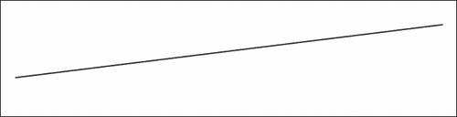

SVG 代码如下：

```html
<svg  version="1.1">
  <g style="stroke: red; fill: none;">
    <path d="M 10 30 L 200 10"/>
 </g>
</svg>
```

检查路径数据值，我们可以看到它的意思是将`pen(M)`移动到`(10,30)`，并画`line(L)`到`(200,10)`。

在我们的树的例子中，我们使用路径绘制线条，所以下一步是绘制节点。我们应用相同的过程，选择所有旧的`g.node`元素并输入节点数据，但是我们不是创建`<path/>`元素，而是只是附加`"g"`，并额外添加一个带有`<xlink:href>`属性的`<a>`元素：

```html
…
            .append("a")
            .attr("xlink:href", function(d) {
                 return d.url;
              })
```

由于我们已经自动迭代了所有数据节点，我们可以访问`d.url`，检索每个节点的 URL，并将其设置为我们稍后要添加的所有内部元素的链接。

不要忘记我们需要旋转坐标，因为我们希望树从左到右显示：

```html
            .attr("transform", function(d) {
                return "translate(" + d.y + "," + d.x + ")";
              });
```

在此之后，我们可以向每个元素附加其他元素，为了创建圆，我们添加以下内容：

```html
    node.append("circle")
            .attr("r", 20);
```

这样就创建了一个半径为 20px 的 SVG 圆，另外，我们附加了将显示分布名称的`<text/>`元素：

```html
   node.append("text")
            .attr("dx", -19)
            .attr("dy", -19)
             ...
```

注意，我们将文本元素移动了`(-19,-19)`，以避免与圆和线重叠，就是这样。

## 还有更多...

你首先要做的事情是玩弄一下那些是常数的值，比如图像大小或文本偏移量。这将帮助你更好地理解变化如何影响布局。有各种不同的函数来生成布局，你可以以径向方式创建它，或者使它看起来像树突一样。

有各种方法可以添加交互，你可以在代码的某些部分进行更新，使某些部分动画化，甚至在 SVG 内部包含 HTML。

# 使用网络字体的 LED 记分牌

在这个食谱中，我们将创建一个 LED 记分牌，类似于篮球比赛中使用的记分牌，通过巧妙地使用 HTML 网络字体。该食谱的主要目标是介绍网络字体及其提供的功能。

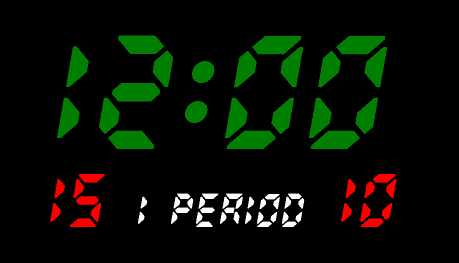

### 提示

有关网络字体的完整规范可以在 W3C 上找到[`www.w3.org/TR/css3-webfonts/`](http://www.w3.org/TR/css3-webfonts/)。

## 准备工作完成

在开始之前，你需要获取我们在这个例子中要使用的字体。这些文件可以从示例代码中检索，它们都有一个`RADIOLAND`前缀。

## 如何做...

为了创建记分牌，我们将创建一个 HTML 页面，一个支持 JavaScript 代码，用于更新计时器和相关数据，以及一个使用网络字体的 CSS 文件：

1.  首先，我们将从创建 HTML 页面开始；在`head`部分，包括`stylesheet.css`和对 jQuery 的依赖。

```html
  <link rel="stylesheet" href="stylesheet.css" type="text/css" charset="utf-8">
  <script src="img/jquery.min.js"></script>
```

1.  在`body`部分，添加我们将用作分数占位符的`div`元素，并另外包括`scoreboard.js`：

```html
    <div class="counter"></div>
    <div class="score">
              <span class="home"></span>
               <span class="period"></span>
               <span class="guests"></span>
    </div>
  </div>
  <script type="text/javascript" src="img/scoreboard.js"></script>
```

1.  我们现在可以创建`stylesheet.css`文件，首先定义具有 LED 外观的网络字体：

```html
@font-face {
  font-family: 'RadiolandRegular';
  src: url('RADIOLAND-webfont.eot');
  src: url('RADIOLAND-webfont.eot?#iefix') format('embedded-opentype'),
    url('RADIOLAND-webfont.woff') format('woff'),
    url('RADIOLAND-webfont.ttf') format('truetype'),
    url('RADIOLAND-webfont.svg#RadiolandRegular') format('svg');
  font-weight: normal;
  font-style: normal;
}
```

1.  由于字体现在被定义为`RadiolandRegular`，我们可以直接引用它：

```html
div.counter{
  font: 118px/127px 'RadiolandRegular', Arial, sans-serif;
  color: green;
}
    .score {
      font: 55px/60px 'RadiolandRegular', Arial, sans-serif;
      letter-spacing: 0;
      color: red;
      width: 450px;
    }

  .period {
      font: 35px/45px 'RadiolandRegular', Arial, sans-serif;
      color: white;
    }

    div.display {
      padding: 50px;
    }
```

1.  我们可以继续创建将要使用的 JavaScript，并且我们将使用一个名为`game`的模拟对象，该对象具有游戏信息。一般来说，这个对象应该通过 AJAX 调用从服务器检索，但为了简单起见，我们使用了一些预定义的值：

```html
  var game = {
    periodStart: 1354650343000,
    currentPeriod: 1,
    score: {
      home: 15,
      guests: 10
    }
  };
```

1.  为了使我们的显示对象的创建逻辑和数据获取逻辑分离，我们可以将其放在一个函数中：

```html
  function fetchNewData() {
    // server data
    var game = {
      periodStart: new Date().getTime(),
      //the server will return data like: periodStart: 1354838410000,
      currentPeriod: 1,
      score: {
        home: 15,
        guests: 10
      }
    };
    //return display data
    return {
      periodStart: game.periodStart,
      counter: '00:00',
      period: game.currentPeriod + ' Period',
      score: {
        home: game.score.home,
        guests: game.score.guests
      }
    };
  }
```

1.  我们还创建了一个 `config` 对象，可以在其中定义游戏参数，例如周期数和每周期的分钟数：

```html
  var config = {
    refreshSec: 1,
    periods: 4,
    minPerPeriod: 12
  };
```

1.  然后我们定义 `updateCounter()` 和 `updateScore()` 函数，它们将更新显示并执行计时器的计算。我们将检查当前时间是否小于游戏开始时间，并将计时器设置为 `00:00`。如果当前时间大于最大可能时间，则将计时器设置为最大可能时间：

```html
  function updateCounter() {
          var now = new Date(),
          millsPassed = now.getTime() - displayData.periodStart;

         if (millsPassed < 0) {
           displayData.counter = '00:00';
         } else if (millsPassed > config.minPerPeriod * 60 * 1000) {
           displayData.counter = config.minPerPeriod + ':00';
         } else {
           //counting normal time
           var min = Math.floor(millsPassed/60000);
           if (min<10) {
             min = '0' + min;
           }
           var sec = Math.floor((millsPassed % 60000)/1000);
           if (sec<10) {
             sec = '0'+sec;
           }
           displayData.counter = min+':'+sec;
         }
         $('.counter').text(displayData.counter);
         $('.period').text(displayData.period);
```

1.  随后，我们添加一个将更新得分的函数：

```html
  function updateScore(){
    $('.home').text(displayData.score.home);
    $('.guests').text(displayData.score.guests);
  }
```

1.  最后，我们可以调用 `setInterval` 函数，该函数将每 500 毫秒调用更新：

```html
    setInterval(updateCounter, 500);
    setInterval(updateScore, 500);
```

## 工作原理…

这个配方中的 HTML 和 JavaScript 代码非常简单直接，但另一方面，我们正在深入研究 CSS 和字体文件。

通过添加 `@font-face` at-rule，我们可以指定在其他元素中使用在线字体。通过这样做，我们允许使用客户端机器上不可用的不同字体。

在 `@font-face` 的定义中，我们添加了 `font-family` ——一个我们随后可以应用在任何元素上的名称定义。例如，考虑以下示例，我们将我们的字体称为 `someName`：

```html
@font-face {
  font-family: someName;
  src: url(awesome.woff) format("woff"),
       url(awesome.ttf) format("opentype");
}
```

您可以在此示例中以及我们的 `stylesheet.css` 中的 `url` 旁边注意到名为 `format("woff")` 的格式定义。可以应用以下格式：

+   `.woff`：这代表**Web 开放字体格式**（**WOFF**），这是由 Mozilla 开发的一种较新的标准之一。完整规范可在 [`www.w3.org/TR/WOFF/`](http://www.w3.org/TR/WOFF/) 上找到。该格式的目标是为其他格式提供替代解决方案，这些解决方案在需要一定级别的许可证时会更加优化。该格式允许将元数据附加到文件本身，其中可以包含许可证。

+   `.ttf` 和 `.otf`：**TrueType 字体**（**TTF**）和扩展版本**OpenType 字体**（**OTF**）是一些最广泛使用的类型。TrueType 的标准是由苹果电脑在 80 年代末开发的，作为一些 PostScript 标准的替代品。它为字体开发人员提供了灵活性和对用户以多种不同大小显示字体的控制。由于其流行和功能，它迅速传播到其他平台，如 Windows。OpenType 是基于 TrueType 的后继版本。该规范由微软开发，并得到 Adobe Systems 的补充。OpenType 是微软公司的注册商标。详细规范可以在 [`www.microsoft.com/typography/otspec/default.htm`](http://www.microsoft.com/typography/otspec/default.htm) 上找到。

+   `.eot`：嵌入式 OpenType 字体是设计用于网页的 OpenType 字体的一种形式。对嵌入版本的扩展与制作版权保护密切相关。由于其他字体很容易被复制，EOT 只向用户提供可用字符的子集，使得复制整个字体更加困难。有关 EOT 的更多信息，请参阅 W3C 规范 [`www.w3.org/Submission/EOT/`](http://www.w3.org/Submission/EOT/)。

+   `.svg` 和 `.svgz`：SVG 和带有扩展名 `.svgz` 的经过解压缩的版本可以用来表示字体。字体定义存储为 SVG 字形，可以轻松支持。有关 SVG 字体的更多信息可以在规范 [`www.w3.org/TR/SVG/fonts.html`](http://www.w3.org/TR/SVG/fonts.html) 中找到。不幸的是，目前写作时，这种格式在 IE 和 Firefox 中不受支持。

`@font-face` 上还可以使用一些其他属性，例如 `font-style`、`font-weight` 和 `font-stretch`。此外，我们可以通过为 `unicode-range` 设置值来指定 Unicode 中使用的字符范围。规范中的一些示例如下：

+   `unicode-range: U+0-7F;`：这是基本 ASCII 字符的代码范围

+   `unicode-range: U+590-5ff;`：这是希伯来字符的代码范围

Web 字体的一个问题是 CSS2 的规范没有要求特定的格式。这通常意味着我们需要提供几种不同的格式，以在各种浏览器中获得相同的体验。

### 注意

有许多`font-face`定义生成器可以简化所有这些可能选项的创建。其中一个是**FontSquirrel**（[`www.fontsquirrel.com/tools/webfont-generator`](http://www.fontsquirrel.com/tools/webfont-generator)）。

Web 字体正在成为 Web 的最常见构建块之一，因此，当我们需要一个出色的排版时，它们应该始终被考虑。图像、SVG、Coufons 和类似类型与文本不太兼容。我们可能会使用这些来获得出色的文本外观，但搜索引擎无法访问文本，大多数辅助功能软件将忽略它，甚至可能使页面大小变大。另一方面，使用文本允许我们对数据进行各种 CSS 调整，我们可以使用选择器，比如`:first-letter`、`:first-line`和`:lang`。

## 还有更多...

Google 有许多我们可以使用的字体，这些字体可以在[`www.google.com/fonts/`](http://www.google.com/fonts/)上找到。除了标准的字体包含，他们还有一个基于 JavaScript 的字体加载器。这个加载器解决了在“真正”的字体加载时看到回退文本渲染的问题，通常被称为**未样式化文本的闪烁**（**FOUT**）。例如，我们可以这样做来包含一个名为`'Noto Sans'`的字体：

```html
<script type="text/javascript">
  WebFontConfig = {
    google: { families: [ 'Noto+Sans::latin' ] }
  };
  (function() {
    var wf = document.createElement('script');
    wf.src = ('https:' == document.location.protocol ? 'https' : 'http') +
      '://ajax.googleapis.com/ajax/libs/webfont/1/webfont.js';
    wf.type = 'text/javascript';
    wf.async = 'true';
    var s = document.getElementsByTagName('script')[0];
    s.parentNode.insertBefore(wf, s);
  })(); </script>
```

之后，我们可以简单地在 CSS 中使用`font-family: 'Noto Sans', sans-serif;`来包含它。

### 注意

有关 Google 字体选项的更多信息，请访问[`developers.google.com/fonts/`](https://developers.google.com/fonts/)。至于所谓的 FOUT 以及一些对抗它的方法，*Paul Irish*在[`paulirish.com/2009/fighting-the-font-face-fout/`](http://paulirish.com/2009/fighting-the-font-face-fout/)的文章中有更多内容。
