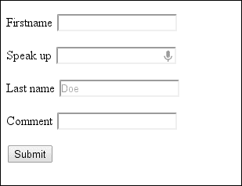
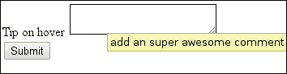
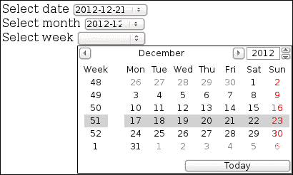
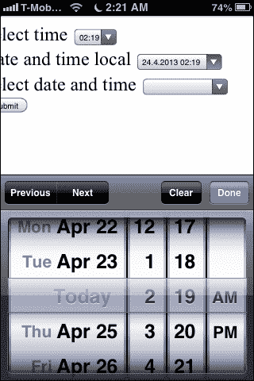
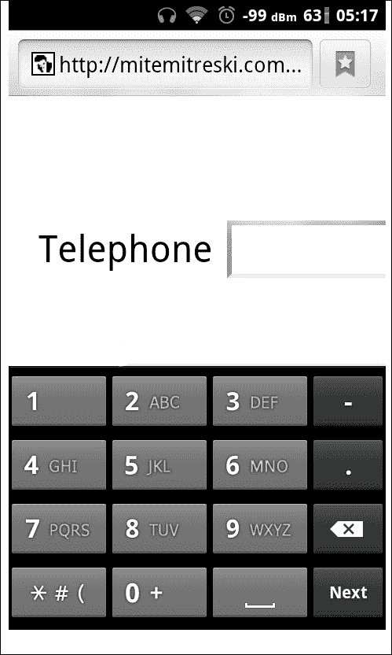
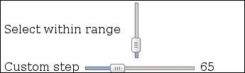
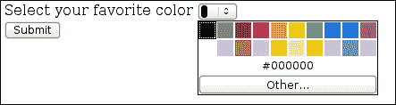
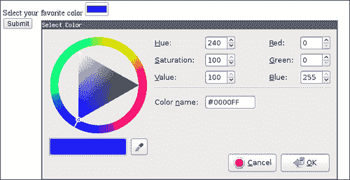
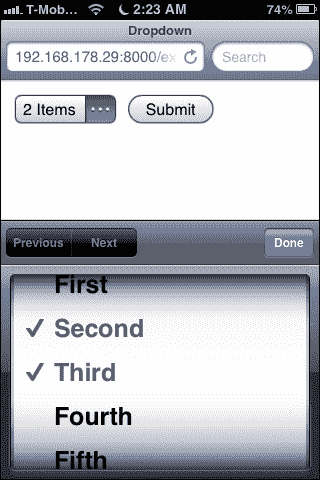

# 第四章：使用 HTML5 输入组件

在本章中，我们将看一下 HTML5 中添加的一些出色的新元素类型。涵盖的主题有：

+   使用`text`输入字段

+   使用`textarea`

+   输入日期

+   输入时间

+   电话输入

+   范围输入字段

+   颜色选择器输入

+   使用单选下拉菜单

+   使用多选选择列表

+   获取地理位置输入

+   在客户端使用文件输入

+   使用拖放文件区域

# 介绍

表单是日常 Web 应用程序开发的一部分。我们进行了大量的重新发明来启用各种输入功能。HTML5 添加了一些新的输入类型以及对现有结构的许多不同属性和扩展。这些新的东西大多已经在现代浏览器中可用，并且使我们所有人的生活更加轻松。对于尚未存在的东西，我们使用在旧系统上运行的备用方案。没有理由您今天不应该开始使用至少其中一些功能。

### 注意

有各种方法来确定对 HTML5 功能的支持。许多网站提供了支持的功能列表，但其中一些值得一提的是[`caniuse.com/`](http://caniuse.com/)和[`html5please.com/`](http://html5please.com/)。如果您不想添加备用方案，您通常可以参考它们以获取最新信息。

# 使用文本输入字段

我们将看一下使用 HTML `<input type="text">`输入数据的基本示例之一。这种输入类型会自动从输入值中删除换行符，因此适用于单行文本使用，如下面的屏幕截图所示：



## 如何做...

在 HTML 文档的 body 部分，我们将创建一个表单，其中类型为`text`的输入将被放置：

1.  首先，我们添加最基本的输入类型`text`：

```html
<form>
  <p>
    First name  <input name="firstname" type="text">
  </p>
```

1.  接下来，我们添加一个启用音频输入的表单：

```html
  <p>
    Speak up <input name="quote" type="text" x-webkit-speech speech>
  </p>
```

1.  还添加一个带有`placeholder`属性和一个带有`autofocus`属性的输入：

```html
  <p>
    Last name: <input name="lastname" type="text" placeholder="John Doe">
  </p>
  <label>
    Comment <input name="comment" type="text" title="This is area to insert your opinion" autofocus >  </label>
```

1.  最后，我们添加`submit`并关闭表单：

```html
  <input type="submit" >
</form>
```

## 它是如何工作的...

`<input name="firstname" type="text" >`元素是最基本的 HTML 输入元素，在提交表单时，查询参数将是：

```html
?firstname=someText&...
```

下一个输入元素具有一个属性`x-webkit-speech speech`，即 Chrome 特定属性，允许语音输入，这意味着您可以使用麦克风插入文本。

### 注意

请注意，这不太可能成为标准，因为它依赖于谷歌服务器端处理语音，因此远非开放网络。为了获得广泛的接受，应该提供开放的语音提供者。

对于第三个输入元素，我们使用了`placeholder`属性，在输入字段内添加了一个漂亮的提示。

HTML5 中添加的一个新属性是`autofocus`。它是一个布尔值属性，允许我们指定页面加载后应该具有初始焦点的表单控件。在我们的情况下，我们使用了单词语法，但`autofocus="true"`也会起到同样的作用。这里需要额外注意的一点是，这只能应用于一个表单元素，因为这是将获得初始焦点的元素，而且它不能应用于`input` `type="hidden"`，因为这样做没有太多意义。

## 还有更多...

如果我们正在使用自己的备用方法来插入语音数据，我们可以简单地检查当前是否支持它，以支持其他浏览器：

```html
  var hasSupportForSpeach = 
    document.createElement("input").webkitSpeech != undefined;
```

还有一个触发的事件，我们可以用于语音输入：

```html
onwebkitspeechchange="myOnChangeFunction()"
```

### 注意

开发的语音输入的开放替代方案是**Web Speech API**。其主要目标是为开发人员提供一种手段，以便将语音输入和输出作为文本到语音。API 定义不包括识别将在何处进行的实现，这意味着服务器端或客户端实现取决于供应商。有关 API 的更多信息，请访问[`dvcs.w3.org/hg/speech-api/raw-file/tip/speechapi.html`](https://dvcs.w3.org/hg/speech-api/raw-file/tip/speechapi.html)。

负责 HTML5 中关于语音集成的初始要求和规范的孵化工作组可以在以下网址找到：[`www.w3.org/2005/Incubator/htmlspeech/`](http://www.w3.org/2005/Incubator/htmlspeech/)。

# 使用文本区域

在这个示例中，我们将看看`textarea`元素，并创建一个简单的表单来展示一些可以使用的属性。`textarea`用于作为多行纯文本编辑控件。

## 如何做...

我们将创建一个示例`form`来演示`textarea`元素的一些用法：

1.  首先，我们添加一个带有设置`placeholder`属性的`texarea`元素：

```html
<form>
  <label>Short info: <textarea placeholder="some default text"></textarea>
  </label>
```

1.  然后我们添加一个带有设置`rows`和`cols`属性的文本区域：

```html
<label>
  Info with default size set: <textarea  rows="4" cols="15" placeholder="some default text"></textarea>
</label>
```

1.  然后我们添加一个设置了`maxlength`的文本区域：

```html
  <label>
    Max area limited to 5 characters <textarea maxlength="5" placeholder="Inset text here limit 5 char"></textarea>
  </label>
```

1.  然后我们添加一个设置了`title`属性的元素：

```html
  <label>
    Tip on hover <textarea maxlength="5" title="add an super awesome comment"></textarea>
  </label>
```

1.  最后我们添加`submit`并关闭`form`：

```html
  <input type="submit"/>
</form>
```

## 它是如何工作的...

第一个示例是一个常规的`<textarea />`元素，允许多行文本和换行。我们还可以使用`rows`和`cols`等属性来启用一些初始大小。这也可以通过 CSS 设置初始大小来实现：

```html
textarea{
  width:300px;
  height:100px;
}
```

现在大多数新的浏览器都有一个可以拖动的文本区域的小右下角，使用户可以调整大小。可以通过在 CSS 中设置`max-width`和`max-height`来禁用文本区域的可调整大小。

我们还可以使用`maxlength`属性限制可以插入的字符数，例如在我们的示例中将其设置为最多 5 个字符`maxlength="5"`。

还有一个`title`属性，可以用来向用户添加有关输入字段的提示。



### 注意

诸如`title`、`maxlength`和`placeholder`之类的属性不仅适用于`textarea`，还可以用于其他元素。例如，`title`属性是 HTML5 中的全局属性之一，可以添加到任何元素上。我们可以有以下片段：

```html
<input type="text" autofocus maxlength="10" placeholder="Awesome">
```

有关输入属性和全局元素属性的更多信息，请访问网站[`www.whatwg.org/specs/web-apps/current-work/multipage/elements.html#global-attributes`](http://www.whatwg.org/specs/web-apps/current-work/multipage/elements.html#global-attributes)。

# 输入日期

在 HTML5 之前，我们被迫创建自定义控件，这些控件总是缺少一些功能，或者与某些浏览器不兼容。现在，日期有单独的输入类型，在这个示例中我们将看到如何使用它们。不幸的是，它们在各种用户代理中仍然没有完全实现，但是每个人都在慢慢赶上。

## 如何做...

我们将简单地创建一个基本的 HTML 文档，并在 body 元素中创建一个表单：

1.  首先在 body 部分添加`form`，并在其中添加`date input`元素：

```html
<form>
  <label>
    Select date  <input name="theDate" type="date">
  </label>
```

1.  类似地，我们为`month`和`week`添加一个输入元素：

```html
<label>
  Select month <input name="theMonth" type="month">
</label>
<label>
  Select week <input name="theWeek" type="week">
</label>
```

1.  最后，我们添加一个简单的`submit`并关闭`form`：

```html
  <input type="submit" />
</form>
```

## 它是如何工作的...

根据您的浏览器支持情况，您将获得一个空的输入字段或一个完整的日期输入控件：



```html
<input type="week" /> rendered on Opera v12.11
```

在表单提交时，表单发送的参数是有效的字符串：

```html
?theDate=2012-12-21&theMonth=2012-12&theWeek=2012-W5
```

日期、周和月的创建和编号符合 ISO 8601 标准，在大多数编程语言中被广泛接受，或者至少有一种标准化的表示和访问数据的方式。还有一个选项可以指定`min`和`max`属性，这些属性应该是有效的日期、月份和周字符串，以及`step`，它将定义选择控件的步骤，并默认为`1`。

# 输入时间

在这个示例中，我们将看看如何使用时间输入控件以及它们如何与日期选择结合。总体思路是让用户代理呈现一个可以用作输入的时钟。有选项可以包括时区，并且有纯时间表示，并将通过创建一个简单的表单来尝试它们，如下面的屏幕截图所示：


## 如何做...

与其他示例类似，我们创建一个包含少量输入元素的表单：

1.  首先我们开始表单并添加`time`输入元素：

```html
<form>
  <label>
    Select time <input name="time" type="time" >
  </label>
```

1.  我们添加一个`datetime-local`输入：

```html
  <label>
    Date and time local <input name="datetime-local" type="datetime-local" >
  </label>
```

1.  我们还添加了一个`datetime`输入：

```html
  <label>
    Select date and time <input name="datetime" type="datetime" >
  </label>
```

1.  最后我们添加提交并关闭表单

```html
  <input type="submit">
</form>
```

## 它是如何工作的...

在表单提交时，所选的值将作为查询参数添加到 URL 中，例如：

```html
/?time=00%3A00%3A00.00&datetime-local=2012-11-02T12%3A00&datetime=2012-12-21T12%3A00Z/
```

这里的`time`参数的值为`00:00:00`，其中`%3A`是 URL 编码的`:`字符。

类似地，`datetime-local`的`2012-11-02T12%3A00`值实际上是`2012-11-02T12:00`，遵循`YYYY-MM-DDThh:mm:ss`模式的日期和时间参数。

至于`datetime`变量，字符串的格式为`YYYY-MM-DDThh:mm:ssTZD`，其中我们有关于时区的附加信息。

由于我们对输入元素有了正确的上下文，当在具有良好支持的浏览器上打开时，控件将被优化。



# 电话输入

在这个示例中，我们将看一下电话号码的输入类型。由于不同国家之间的电话号码格式非常不同，因此电话输入不需要任何特定的模式，除非明确指定。如果我们需要一些特定的模式，我们可以进行各种类型的验证，如在第六章*数据验证*中详细讨论的那样。

使用文本输入类型的主要优势在于更具语义，因此可以在移动设备上进行更多优化。

## 如何做...

与前面相关的示例一样，我们只需在 HTML 文档的主体中添加`input`元素：

```html
  <form>
    <label>
      Insert phone <input type="tel" >
    </label>
  <input type="submit" >
  </form>
```

## 它是如何工作的...

当您首次尝试时，它看起来像是常规的`input type="text"`元素。但这个现在更具语义正确性。现在为什么这很重要，或者为什么我们应该关心它呢？

移动设备将把这个识别为电话号码，并自动打开数字键盘，就像 Android 设备在下面的屏幕截图中显示的那样：



## 还有更多...

还有`input type="url"`，`input type="search"`和`input type="email"`，它们为元素提供语义，允许移动设备选择正确的键盘。它们还可以具有关于数据如何插入的附加验证和逻辑，从而允许更多类型特定的功能。其中一些将在与验证相关的示例中介绍。

在 HTML5 中，对于所有输入类型，都添加了一个称为`inputmode`的属性，该属性源自术语**输入模式**。这些属性为浏览器提供了关于应使用何种类型的键盘的提示。这些属性可以具有以下值：

+   **verbatim**：此值指定可以常用于非散文文本的字母数字字符，例如用户名、关键字或密码。

+   **latin**：此值指定用户首选语言中的拉丁输入，具有在移动设备上的文本预测等打字助手。

+   **latin-name**：此值指定与`latin`相同的规则，但用于名称。

+   **latin-prose**：此值指定与`latin`相同的规则，但具有完整的打字助手，用于在电子邮件、聊天或评论等实现中使用。

+   **full-width-latin**：此值指定与`latin-prose`相同，但用于用户的辅助语言。

+   **假名**，**片假名**：此值指定**假名**或**罗马字**输入，通常使用全宽字符的**平假名**输入，并支持转换为**汉字**。至于**片假名**，它是与此相关的另一种形式。所有这些都是用于日语输入文本的。有关日语书写系统的更多信息，请访问：[`en.wikipedia.org/wiki/Japanese_writing_system`](http://en.wikipedia.org/wiki/Japanese_writing_system)。

+   **numeric**：此值指定数字字符输入，包括用户选择的千位分隔符和表示负数的字符。其目的是输入数字代码，例如一些街道号码或信用卡。如果我们确定使用数字，应优先使用`type="number"`输入，因为这更语义正确。

+   **tel**，**email**，**url**：此值可用于提供与我们为相应输入类型使用的相同提示。我们应该优先使用这些值中的输入类型。

浏览器不支持所有状态并具有回退机制。同样，在这里，状态大多对移动设备或特殊用途设备有意义。

# 范围输入字段

有时我们希望输入一个用户从给定值范围中选择的值，使用“滑块”。为了在 HTML5 中实现这一点，添加了`<input type="range" >`，允许对元素的值进行不精确的控制。

## 如何做...

通过简单的步骤，我们将创建几个使用 HTML5 不同功能的范围控件：

1.  我们首先通过添加以下部分的`body`文本来添加一个 HTML 页面：

```html
<form>
  <label>
    Select the range <input name="simpleRange" type="range" />
  </label>
  <br/>
  <label>
    Select within range <input id="vertical" name="simpleRangeLimited" min="20" max="100" type="range" />
  </label>
  <br/>
  <label>
    Custom step <input id="full" name="simpleRangeSteped"       type="range" value="35" min="0" max="220" step="5" />
  </label>
  <span id="out"> </span>
  <br/>
  <label>
    Temperature scale
    <input min="0" max="70" type="range" name="themp"       list="theList">
  </label>
    <datalist id="theList">
      <option value="-30" />
      <option value="10" label="Low" />
      <option value="20" label="Normal" />
      <option value="45" label="High" />
      <option value="some invalid Value" />
    </datalist>
  <br/>
  <input type="submit" />
</form>
```

1.  为了垂直显示其中一个滑块，我们可以在 HTML 的`head`标签中添加 CSS：

```html
  #vertical {
     height: 80px;
     width: 30px;
  };
```

1.  我们还可以使用 JavaScript 显示所选的值：

```html
<script src="img/jquery.min.js">
</script>
<script type="text/javascript">
  (function($){
    var val = $('#full').val();
    var out  = $('#out');
    out.html(val);
    $('#full').change(function(){
      out.html(this.value);
    });
  }($));
</script>
```

## 它是如何工作的...

浏览器会捕获`type="range"`，并创建一个值为`0`的`min`和值为`100`的`max`的滑块，步长为`1`。



为了垂直显示它，使用 CSS 设置宽度和高度。为了使其在 Chrome 上工作，由于尚未实现通过大小更改渲染，您可以在 CSS 中添加以下代码，强制其垂直显示：

```html
-webkit-appearance: slider-vertical;
```

如果我们希望通过更改滑块直接更新小型显示，我们可以通过 JavaScript 实现这一点，通过向输入范围元素添加事件侦听器：

```html
    $('#full').change(function(){
  out.html(this.value);
});
```

还有一个选项，可以将`input type="range"`元素与`datalist`连接起来，从而创建具有预定义选项的刻度：

```html
  <datalist id="theList">
```

```html
  <option value="-30" />
  <option value="10" label="Low" />
  <option value="20" label="Normal" />
  <option value="45" label="High" />
  <option value="some invalid Value" />
</datalist>
```


`datalist`元素中的选项可以具有无效值或超出使用属性 min 和 max 指定的范围的值，因此将被忽略。另一方面，有效的值将在可选择的滑块上添加一个标记。


`datalist`还有一个可选的`label`属性，可以添加，并应该在显示的标记旁边呈现文本。浏览器不支持此功能与标签的显示，但它是规范的一部分。

## 还有更多...

在撰写本文时，Firefox 和 IE 都没有完全支持`type="range"`元素，因此我们可以使用 JavaScript 添加基本支持。已经有一个实用程序脚本可用于解决此问题，可在[`frankyan.com/labs/html5slider/`](http://frankyan.com/labs/html5slider/)上找到，并且源代码也可在[`github.com/html5-ds-book/html5slider`](http:// https://github.com/html5-ds-book/html5slider)上找到。为了启用它，只需包含`html5slider.js`，然后魔术就会发生。

# 颜色选择器输入

作为新的输入类型之一，我们有`input type="color"`元素，它允许您选择颜色，并且所选颜色将具有我们习惯的简单颜色表示。颜色表示具有更常用的十六进制颜色表示名称，在本教程中，我们将通过创建一个带有颜色选择器的表单来看一个简单的示例：



## 如何做...

我们将创建一个简单的表单，其中将添加一个颜色选择器，该表单是 HTML 主体的一部分：

```html
<form>
  <label>
    Select your favorite color <input type="color" value="#0000ff">
  </label>
  <input type="submit" >
</form>
```

## 它是如何工作的...

颜色输入类型被选中，并显示当前选定的颜色。单击颜色后，我们可以直接从系统颜色选择控件中选择菜单。

所选值表示为一个简单的颜色字符串，其中包含一个`#`字符和一个不区分大小写的十六进制字符串。

如果浏览器不支持此功能，我们可以有一种自定义的处理方式。检查支持的一种方法是使用`modenrizer.js`方法：

```html
  <script src="img/modernizr.min.js"></script>
  <script type="text/javascript">
    if(!Modernizr.inputtypes.color){
      //do a different method of color picking
      console.log("Browsers has no support for color going with fallback")
    }
  </script>
```

它允许我们在其他浏览器跟上实现时实施一个回退。



# 使用单选下拉菜单

单选下拉菜单是标准的 HTML 组件。它们的使用虽然简单，但有时可能令开发人员和用户感到沮丧。浏览器要求向所选项目添加一个“selected”属性。要以编程方式设置`select`元素的值，代码必须首先找到当前选定的项目并删除其“selected”属性，然后找到具有指定值的项目并向其添加“selected”属性。

然而，开发人员可能希望以更简单的方式指定下拉字段的值。只需添加一个包含值的属性即可。在本示例中，我们将通过向下拉菜单添加一个新属性来解决这个问题。

## 如何做...

让我们开始吧。

1.  我们将创建一个带有下拉菜单的 HTML 页面。在 HTML 中，下拉菜单是使用`select`元素制作的。要添加选择选项，我们在`select`元素内添加一个或多个 option 元素。通常，我们会通过为其添加 selected 属性来指定预选选项：

```html
<select name="dropdown">
  <option value="1">First</option>
  <option value="2" selected="selected">Second</option>
  <option value="3">Third</option>
</select>
```

1.  然而，这可能不方便在服务器端生成或在客户端使用模板生成。往往情况下，我们的列表元素是静态的，只是值会改变。为了简化模板，我们可以在我们的`index.html`中以不同的方式进行：

```html
<!DOCTYPE HTML>
<html>
  <head>
  <title>Dropdown</title>
  </head>
  <body>
    <select name="dropdown" data-value="2">
      <option value="1">First</option>
      <option value="2">Second</option>
      <option value="3">Third</option>
    </select>
    <script src="img/jquery.min.js">
    </script>
    <script type="text/javascript" src="img/example.js">
    </script>
  </body>
</html>
```

1.  然后我们可以在`example.js`中设置值：

```html
$(function() {
  $('body').on('change', 'select[data-value]', function() { $(this).attr('data-value', $(this).val()); });
  window.updateDropdowns = function() {
    $('select[data-value]').each(function() {
      $(this).val($(this).attr('data-value'));
    });
  }
  updateDropdowns();
});
```

## 它是如何工作的...

`example.js`中的代码在页面加载时运行。此时，它找到所有具有 data-value 属性的 select 元素，并使用 jQuery 的多功能函数`$.fn.val`设置所选选项。此外，它为所有当前和未来具有 data-value 属性的 select 项目绑定了一个全局事件，该事件将该值同步到实际值。

这是单选下拉菜单的更自然模型。

## 还有更多...

重要的是要注意，此代码将无法正确处理在页面加载后生成的客户端生成的 HTML。要处理这种情况，必须在向页面添加新的`select`元素后调用`updateDropdowns`方法。

# 使用多选选择列表

选择列表可以被制作成允许用户选择多个元素。

多选选择列表具有特殊的序列化模型。在本示例中，我们将看看该模型是如何工作的以及如何使用它。

我们将创建一个包含多选选择列表的表单页面。该表单将向另一个页面发送`GET`请求，我们将在那里通过 JavaScript 提取所选项目。



## 如何做...

按照以下步骤：

1.  创建一个基本页面，其中包含一个多选选择列表的表单，如下所示的代码片段：

```html
<!DOCTYPE HTML>
<html>
  <head>
    <title>Dropdown</title>
  </head>
  <body>
    <form method="get" action="result.html">
      <select name="multi" multiple>
        <option value="1">First</option>
        <option value="2">Second</option>
        <option value="3">Third</option>
        <option value="4">Fourth</option>
        <option value="5">Fifth</option>
      </select>
      <input type="submit" value="Submit">
  </form>
  </body>
</html>
```

1.  然后我们将创建接收列表并显示所选值的页面如下：

```html
<!DOCTYPE HTML>
<html>
  <head>
    <title>Dropdown</title>
  </head>
  <body>
    <div id="result">
    </div>
    <script src="img/jquery.min.js"></script>
    <script type="text/javascript" src="img/example.js">
    </script>
  </body>
</html>
```

1.  以下是显示结果的`example.js`代码片段：

```html
$(function() {
  var params = window.location.search.substring(1).split('&').
    map(function(param) {
      var nameval = param.split('=');
      return { name: nameval[0], value: nameval[1] };
    });
    console.log(params);
    var selectValues = params.
    filter(function(p) { return p.name == 'multi'; }).
      map(function(p) { return p.value; })
    $("#result").text("Selected: " + selectValues.join(','));
});
```

## 它是如何工作的...

表单提交生成的地址如下所示：

```html
result.html?multi=2&multi=3
```

这种格式打破了许多流行框架对表单数据性质的假设。通常，它们将表单数据视为字典，其中一个名称对应一个值。然而，在这种情况下，数据无法放入这样的字典中，因为多选列表会生成具有相同名称和不同值的多个参数。

相反，我们将参数视为列表，这使我们能够提取和过滤两个值。

# 获取地理位置输入

HTML5 中一个令人兴奋的新功能是地理位置 API（[`www.w3.org/TR/geolocation-API/`](http://www.w3.org/TR/geolocation-API/)）。它允许开发人员请求用户的位置。此 API 允许开发人员获取地理坐标，如纬度和经度。

在使用此 API 之前，开发人员必须依赖更原始的方法，例如 GeoIP 数据库。这些方法产生的结果精度较低。根据用户的浏览器、设备以及其上的 GPS 的可用性，地理位置 API 可以提供几米的精度。

在这个示例中，我们将在地图上显示用户的位置。为此，我们将使用**Leaflet**库。使用此库显示地图的方法在*显示地图*一章中有介绍，第二章，*图形数据的显示*。

## 如何做到这一点...

让我们开始吧。

1.  我们将创建一个包含地图占位符的 HTML 页面，其中将包括 leaflet 库（CSS 和 JS 文件）以及我们用于获取和显示用户位置的代码，位于`example.js`中，如下面的代码片段所示：

```html
<!DOCTYPE HTML>
<html>
  <head>
    <title>Geolocation example</title>
     <link rel="stylesheet" href="http://cdn.leafletjs.com/leaflet-0.4/leaflet.css" />
     <!--[if lte IE 8]>
       <link rel="stylesheet" href="http://cdn.leafletjs.com/leaflet-0.4/leaflet.ie.css" />
     <![endif]-->
  </head>
  <body>
    <div id="map" style="height:480px; width:640px;"></div>
      <script src="img/jquery.min.js"></script>
      <script src="img/leaflet.js"></script>
      <script type="text/javascript" src="img/example.js"></script>
  </body>
</html>
```

1.  然后我们将在`example.js`中添加以下代码：

```html
$(function() {
  var map = L.map('map').setView([51.505, -0.09], 13)

  L.tileLayer('http://{s}.tile.openstreetmap.org/{z}/{x}/{y}.png',{
    attribution:'Copyright (C) OpenStreetMap.org',
    maxZoom:18
    }).addTo(map);

  if ("geolocation" in navigator) {
    var marker = L.marker([51.5, -0.09]).addTo(map);
    var watchId = navigator.geolocation.watchPosition(function(position) {
    var userLatLng = new L.LatLng(position.coords.latitude, position.coords.longitude);
    marker.setLatLng(userLatLng);
    map.panTo(userLatLng);
    });
  }
  else alert("Sorry, geolocation is not supported in your browser");
});
```

## 它是如何工作的...

地理位置 API 可通过`navigator`对象中的`geolocation`对象找到。有多种可用方法，如下所示：

+   `getCurrentPosition`：此方法在获得位置后调用其回调函数参数一次

+   `watchCurrentPosition`：此方法在每次更新位置信息时调用其第一个回调函数参数，并返回一个观察者 ID

+   `clearWatch`：此方法通过使用我们返回的观察者 ID 清除观察回调

在我们的示例中，我们使用`watchCurrentPosition`，并为其提供一个回调，该回调设置标记的位置。用户将首先被要求允许网站访问他或她的位置。在获得许可并找到位置后，我们的回调将使用位置对象调用。

位置对象包含`timestamp`和`coords`属性。`coords`属性是一个包含`纬度`和`经度`信息的对象。`timestamp`属性是一个 UNIX UTC 时间戳，表示位置信息更新的时间。

## 还有更多...

此示例在直接打开文件时将无法工作。要查看示例，必须在相同目录中启动本地服务器。有关如何启动本地服务器的更多信息，请参见*附录，安装和使用 http-server*。

# 在客户端使用文件输入

HTML 一直缺乏一种方便的方法来读取用户的文件。在 HTML5 之前，客户端访问用户文件的唯一方法是使用文件类型的输入元素，将该文件上传到服务器，然后将其发送回浏览器。

HTML5 通过 JavaScript 代码在用户的浏览器内本地读取用户文件的能力。该实现是文件输入元素功能的扩展，具有额外的 API。

在这个示例中，我们将使用用户选择的新 HTML5 文件 API（[`www.w3.org/TR/FileAPI/`](http://www.w3.org/TR/FileAPI/)）来显示文本文件。

## 如何做到这一点...

让我们编写代码。

1.  创建一个包含文件`input`字段和内容`div`的 HTML 页面，以显示所选文件的内容：

```html
<!DOCTYPE HTML>
<html>
  <head>
    <title>File API example</title>
  </head>
  <body>
    <input type="file" id="file" value="Choose text file">
      <div id="content"></div>
        <script src="img/jquery.min.js"></script>
        <script type="text/javascript" src="img/example.js"></script>
  </body>
</html>
```

1.  然后我们将添加代码来读取`example.js`中选择的文件：

```html
$(function() {
  $("#file").on('change', function(e) {
```

我们可以从输入元素的文件属性中读取所选文件。

```html
  for (var k = 0; k < this.files.length; ++k) {
    var f = this.files[k];
```

1.  要读取内容，我们使用`FileReader`对象。我们需要实例化它，告诉它要读取哪个文件（以及根据其类型应该如何读取它），然后在读取完成时附加一个事件侦听器，该事件侦听器将访问文件内容。操作如下：

```html
  var fr = new FileReader();
    if (f.type && f.type.match('image/.+'))
      fr.readAsDataURL(f);
    else
      fr.readAsText(f);
```

1.  在调用`onload`函数时，变量`f`将在每个`onload`调用的最后一个文件的值上发生变化。为了避免这种情况，我们使用匿名函数模式捕获变量。

```html
  (function(f) {
    fr.onload = function(e) {
```

1.  监听器被调用时会传入一个事件，其中目标属性包含我们的结果或整个文件的文本。

```html
  if (f.type && f.type.match('image/.+'))
    $("").attr('src', e.target.result)
    .appendTo("#content");
  else
    $("<pre />").text(e.target.result)
    .appendTo("#content");
  }
  }(f));
  }
  });
});
```

## 它是如何工作的...

HTML5 文件 API 包括两个新添加：

+   文件输入元素具有一个包含所选文件列表的文件属性。

+   存在一种称为`FileReader`的新类型对象，它允许我们使用其方法以不同的方式读取所选文件。其中包括`readAsBinaryString`、`readAsText`、`readAsDataURL`和`readAsArrayBuffer`等。它还为我们提供了事件监听器，我们可以设置以在加载文件内容或发生错误时获取文件内容。

要显示文本文件，我们使用读取器的`readAsText`属性。结果，文件数据将提供给读取器的`onload`监听器。文件的内容是一个简单的字符串，我们将其附加到显示预格式文本的元素内的`div`内容中。

为了检索图像，我们调用`readAsDataURL`，然后轻松地创建一个新的图像元素，其`src`属性设置为该数据 URL。然后我们将此元素添加到内容`div`中。

如果选择了一个文件夹，我们的示例将显示文件夹的全部内容，包括文本和图像。

## 还有更多...

可以为文件选择对话框指定过滤器，限制文件的类别。例如，添加`accept="image/*"`将告诉浏览器输入期望任何类型的图像，而添加`accept="image/jpeg"`将告诉浏览器输入期望仅 JPEG 图像。此过滤器基于媒体类型。有关可用媒体类型的更多信息，请访问[`www.iana.org/assignments/media-types`](http://www.iana.org/assignments/media-types)。

### 注意

尽管 IE9 支持许多 HTLM5 功能，但不支持 HTML5 文件 API。支持是在 IE 版本 10 中添加的。

# 使用拖放文件区域

使用 HTML5，我们有另一种读取用户文件的选择：我们可以使用拖放区域。通常用户发现拖放直观，并且更喜欢它而不是其他编辑和操作方法。

拖放还使用户能够将元素从不同的窗口或选项卡拖放到我们的窗口中，这意味着它们比常规文件上传按钮具有更多用途。

在这个示例中，我们将为图像创建一个拖放区域。它将同时适用于拖动的文件和从不同窗口或选项卡中拖动的图像。

### 注意

有关 HTML5 拖放规范的更多信息，请访问[`www.whatwg.org/specs/web-apps/current-work/multipage/dnd.html`](http://www.whatwg.org/specs/web-apps/current-work/multipage/dnd.html)。

## 如何做...

让我们写代码。

1.  我们将创建一个带有拖放区域的 HTML 页面。为了使区域更容易放置，我们将为其添加一些填充、边距和边框。

```html
<!DOCTYPE HTML>
<html>
  <head>
    <title>File API example</title>
      <style type="text/css">
        #content {
          padding:0.5em;
          margin:0.5em;
          border: solid 1px; #aaa;
        }
      </style>
  </head>
  <body>
    <div id="content"><p>Drop images here</p></div>
    <script src="img/jquery.min.js"></script>
    <script type="text/javascript" src="img/example.js"></script>
  </body>
</html>
```

1.  然后我们将在`example.js`中添加代码来读取放置的文件或从另一个网站中拖放的图像。

```html
$(function() {
  $("#content").on('drop', function(e) {
```

拖放的默认浏览器操作是导航到被放置的项目。我们希望阻止这种情况发生。

```html
  e.preventDefault();
  e.stopPropagation();
  var files = e.originalEvent.dataTransfer.files;
```

1.  我们将使用文件读取器将图像读取为`DataURL`，将文本文件读取为文本。

```html
for (var k = 0; k < files.length; ++k) {
  var f = files[k];
  var fr = new FileReader();
    if (f.type && f.type.match('image/.+'))
      fr.readAsDataURL(f);
    else
      fr.readAsText(f);
```

1.  在闭包中捕获每个文件使我们能够从异步`onload`回调中引用它。在那里，我们将其附加到内容元素中，如下面的代码片段所示：

```html
(function(f) {
  fr.onload = function(e) {
    if (f.type && f.type.match('image/.+'))
      $("").attr('src', e.target.result)
      .appendTo("#content");
    else
      $("<pre />").text(e.target.result)
     .appendTo("#content");
    }
  }(f));
}
```

1.  或者，如果项目是从不同的窗口或选项卡拖动的，我们需要从 items 属性中读取它。我们正在寻找类型为`text/html`的项目，如下所示：

```html
var items = e.originalEvent.dataTransfer.items;
for (var k = 0; k < items.length; ++k) {
  if (items[k].type == 'text/html') {
    items[k].getAsString(function (html) {
      $(html).appendTo("#content");
     });
    }
  }
  });
});
```

## 它是如何工作的...

在`example.js`的第一部分中，我们使用了标准的 HTML5 API。您可以在前一个示例*在客户端使用文件输入*中了解更多信息——简而言之，它允许我们将文件读取为文本或`DataURL`并将其放入文档中。

代码的这一部分支持图像文件和文本文件。

第二部分略有不同，仅在从不同网站拖动元素或图像时才会调用。它适用于任何`draggable` HTML 元素 - 此元素也将作为 HTML 添加到我们的内容页面。图像数据将无法访问。

结合起来，这里描述的 API 在在线富文本、UI 或图形编辑器中非常强大。我们可以将其与图像上传服务或包含各种预制元素的面板结合使用，然后将其拖放到拖放区域内。

## 还有更多...

正如在本教程中所看到的，HTML5 拖放 API 不仅限于文件。通过设置`draggable="true"`属性，任何页面上的任何元素都可以被设置为可拖动。

`dragstart`事件将在拖动开始时立即在`draggable`元素上触发。当我们将元素移动到潜在的放置目标上时，将触发`dragenter`、`dragover`和`dragleave`事件。最后，当元素被放置时，我们在本教程中使用的`drop`事件将被触发，以及`dragend`事件。

最后，为了对拖动对象的内容进行精细的编程控制，可以使用`DataTransfer`对象。例如，可以在`draggable`元素上放置以下`dragStart`处理程序：

```html
function onDragStart(e) {
  e.dataTransfer.setData('text/html', '<p>Hello world</p>');
}
```

将导致浏览器将指定的 HTML 内容放置在拖动对象内部。

自定义 HTML5 `draggable`元素的最佳功能是与系统中其他应用程序的兼容性。可拖动的对象可以“移动”到浏览器之外的其他应用程序中，例如邮件客户端、图像编辑器等。因此，HTML5 应用程序距离成为操作系统内的一流公民又近了一步。
