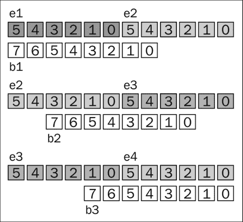
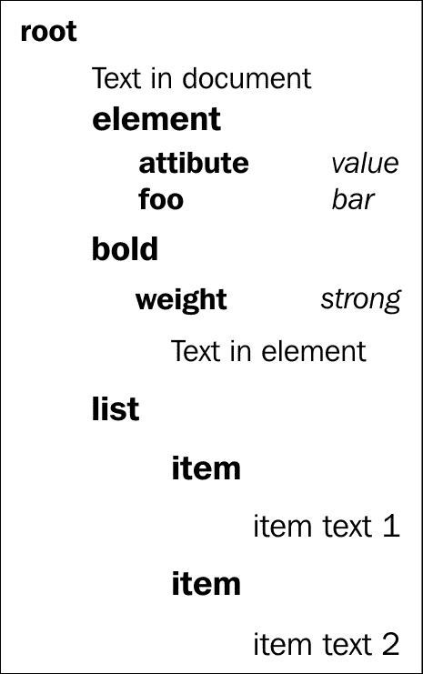

# 第七章：数据序列化

在本章中，我们将介绍以下内容：

+   将 JSON 反序列化为 JavaScript 对象

+   将对象序列化为 JSON 字符串

+   解码 base64 编码的二进制数据

+   将二进制数据或文本编码为 base64

+   将二进制数据序列化为 JSON

+   序列化和反序列化 cookie

+   将表单序列化为请求字符串

+   使用 DOMParser 读取 XML 文档

+   在客户端对 XML 文档进行序列化

# 介绍

数据存储和传输的基本概念之一是序列化。我们将介绍一些准备数据以便发送到另一个环境或永久保存的方法。除此之外，我们还将看到一些读取另一个计算机环境序列化的数据的方法。

# 将 JSON 反序列化为 JavaScript 对象

最简单的情况是将 JSON 数据读入 JavaScript 对象。以这种方式格式化的数据是轻量级的，此外它是 JavaScript 的一个子集。有几种方法可以读取这些数据，我们将看看如何通过创建一个简单的 JSON 片段，然后将其转换为 JavaScript 对象来实现这一点。

## 如何做...

这个例子足够简单，可以作为 HTML 文件中的脚本，甚至可以在 firebug 或开发者工具控制台上执行：

1.  我们首先需要以下序列化的 JSON 字符串：

```html
var someJSONString = '{"comment":"JSON data usually is retrieved from server","who":"you"}';
```

1.  有几种不需要添加外部 JavaScript 依赖项的方法来实现这一点，一种是通过使用`eval`，另一种是通过使用`json`：

```html
     var evalData =  eval('(' + someJSONString + ')');
     var jsonData =  JSON.parse(someJSONString);
```

1.  之后，我们将尝试访问反序列化对象的一些属性：

```html
     document.writeln(someJSONString.who + " access without conversion <br/>" );
     document.writeln(jsonData.who + " with parse <br/>" );
     document.writeln(evalData.who + " with eval <br/>");
```

在执行时，第一个`document.writeln`方法应该返回`undefined`，因为我们正在尝试访问尚未反序列化的 JSON 字符串上的属性，而在另外两个方法中，我们应该得到值`you`。

## 它是如何工作的...

JSON 是一种与语言无关的格式，但与此同时 JSON 是 JavaScript，这意味着我们可以使用`eval`函数。现在这非常简单，因为这是一个顶级函数，它接受字符串作为输入进行评估。如果作为参数传递的字符串具有 JavaScript 语句，`eval`将执行这些语句。这可能是一个危险的事情，因为它执行传递给它的代码。如果它用于您不信任的代码，那么您可能会从潜在恶意的第三方那里获得利用。对于`eval`的大多数用例，已经有很好的替代方案。当我们使用`eval`时，调试也可能非常困难，因此在大多数情况下我们应该避免使用它。

在进行 JSON 解析时，在大多数现代浏览器上，我们可以使用已添加到 JavaScript 1.7 的`JSON.parse(text[, reviver])`语句。该函数解析一个字符串作为 JSON，并具有可选参数`reviver`，它是一个可以转换解析产生的值的函数。例如，如果我们想要在每个值上附加`"a?"`，我们可以定义如下内容：

```html
    var transformed = JSON.parse(someJSONString, function(key, val) {
      if (key === "") return val;
      return val +' a?';
     });
```

现在，如果我们尝试访问`transformed.who`，我们将得到`"you a?"`。最终对象将包含以下信息：

```html
{comment: "JSON data usually is retrieved from server a?", who: "you a?"}
```

这意味着解析的原始字符串的每个值都附加了值`'a?'`，并且在给定迭代中的键取了值`comment`和`who`。

如果`reviver`函数对于给定值返回`undefined`或`null`，那么该属性将被删除，因此它可以用作过滤机制。

## 还有更多...

在不支持本地 JSON 的旧浏览器中会发生什么。有两个简单的选择，我们可以只包含 JSON 2 或 JSON 3：

```html
   <script src="img/json3.min.js"></script>
   <script src="img/json2.js"></script>
```

JSON 3 是一个兼容几乎所有 JavaScript 平台的 polyfill，从某种意义上说，它是 JSON 2 的更新实现，这是我们应该使用的。 JSON 2 没有正确处理的几个不一致性和特殊情况，尽管在撰写本文时，旧版本更为普遍。此外，JSON 3 解析器不使用`eval`或`regex`，这使其在移动设备上更安全，并带来性能优势，这在移动设备上可能非常重要。

如果您的项目中已经有 jQuery，您可以使用`jQuery.parseJSON(json)`，类似地，Prototype JS 有自己的实现，`String#evalJSON()`。

### 提示

一个常见的错误是使用单引号而不是双引号。大多数 JSON 实现不允许使用单引号，这可能是为了简单起见。引用 Douglas Crockford 的话：JSON 的设计目标是最小化、可移植、文本化，并且是 JavaScript 的子集。我们在互操作方面需要达成的共识越少，我们就越容易进行互操作。

# 将对象序列化为 JSON 字符串

前一个配方的反向操作是将 JavaScript 对象序列化为 JSON 字符串。同样，对于浏览器是否支持 JSON 的规则也适用，但在大多数浏览器中这不是问题。一种方法是手动创建字符串，但这只是一种容易出错和混乱的浏览器方式，因此我们将尝试一些现有的方法。

## 如何做到...

在以下示例中，我们仅使用 JavaScript，因此可以将其放在 HTML 文件中的简单脚本标记中：

1.  首先需要数据以便将其序列化为字符串，因此我们将创建一个简单的 JavaScript 对象：

```html
    var someJSON = {
      "firstname":"John",
      "lastname":"Doe",
      "email":"john.doe@example.com"
     };
```

1.  我们创建另一个对象，其中我们将拥有`toJSON()`函数：

```html
    var customToJSON = {
      "firstname":"John",
      "lastname":"Doe",
      "email":"john.doe@example.com",
      toJSON: function () {
      return {"custom":"rendering"};
      }
    };
```

1.  为了将 JavaScript 对象转换为字符串，我们将使用`JSON.stringify(value [, replacer [, space]])`函数：

```html
     var jsonString = JSON.stringify(someJSON);
     var jsonStringCustomToJSON = JSON.stringify(customToJSON);
```

1.  之后，我们将尝试该函数的其他参数，对于`replacer`，我们将创建一个允许属性的列表，对于第三个参数，我们将尝试两种不同的选项：

```html
    var allowedProperties=["firstname","lastname"];
     var jsonCensured = JSON.stringify(someJSON , allowedProperties);
     var jsonCensured3Spaces = JSON.stringify(someJSON,allowedProperties,30);
     var jsonCensuredTab = JSON.stringify(someJSON,allowedProperties,"\t");
```

1.  然后我们可以简单地将输出写入文档对象：

```html
     document.writeln(jsonString + "  <br/>" );
     document.writeln(jsonStringCustomToJSON + "  <br/>" );
     document.writeln(jsonCensured + "  <br/>" );
     document.writeln(jsonCensured3Spaces + "  <br/>" );
     document.writeln(jsonCensuredTab + "  <br/>" );
```

## 它是如何工作的...

JSON `stringify`方法接受三个参数，最后两个是可选的。当只使用一个参数时，它将返回 JavaScript 对象的 JSON 字符串形式，如果对象中的某些属性未定义，则在数组中找到时将被省略或替换为 null。如果对象内定义了`toJSON()`函数，则将使用该函数来选择要转换的对象。这允许对象定义其自己的 JSON 表示。在我们的情况下，`JSON.stringify(customToJSON)`的评估版本将如下所示：

```html
{"custom":"rendering"} 
```

`stringify`的完整函数定义如下：

```html
JSON.stringify(value[, replacer ] [, space])
```

我们可以使用`replacer`来过滤将被列入白名单的属性。`replacer`可以是一个`String`和`Number`对象的数组，它们将作为允许的参数列表。

`space`参数可以添加并具有`String`或`Number`类型的值。如果是`Number`，它表示要用作空格的空格字符数。在我们的示例中，如果您在浏览器中打开生成的 HTML，可以看到这一点。如果`space`参数是`String`，则使用传递的值的前 10 个字符作为 JSON 的空格。

需要注意的一点是，对于非数组对象，序列化属性的顺序不能保证。在对象序列化后，您不应依赖属性的顺序。现在，由于这一点，序列化可能不是该过程的最准确定义，因此通常被称为字符串化。

## 还有更多...

对于不支持 JSON 的旧用户代理，我们再次遇到类似的问题。对于这种情况，我们建议使用 JSON 3：

```html
   <script src="img/json3.min.js"></script>
```

此外，出于调试目的，您不应使用`stringify`函数，因为正如我们之前提到的，它以特定方式转换未定义的对象，因此通过这样做可能会得出错误的结论。这种错误的结论只与顺序和 JSON 兼容性有关，但对于对象的一般调试来说，它是完全有效的。

# 解码 base64 编码的二进制数据

直到最近，JavaScript 没有任何原生支持存储二进制数据类型的功能。大多数二进制数据都被处理为字符串。无法使用字符串处理的二进制数据（例如图像）被处理为 base64 编码的字符串。

### 注意

Base64 是一种将二进制数据编码的方法，它将字节组转换为 base64 数字组。其目标是通过安全地使用仅以可打印字符表示的二进制数据来避免数据丢失，这些字符不会以特殊方式解释。

HTML5 对二进制数据有更好的支持，可以使用`ArrayBuffer`类和类型化数组类进行存储和操作。然而，传统的库和 API 可能仍然使用 base64 数据。为了在现代浏览器中进行更有效的二进制处理，我们可能希望将这些数据转换为数组缓冲区。

在这个示例中，我们将编写一个转换函数，将 base64 编码的字符串转换为数组缓冲区。

## 准备工作

要编写此函数，首先我们需要了解 base64 编码的工作原理。

访问二进制数据的通常方法是一次一个字节。一个字节有 8 位。如果我们尝试为一个字节分配数字解释，它将能够表示 2 ^ 8 = 256 个不同的数字。换句话说，一个字节可以表示一个单个的基数 256 位数。

我们需要将二进制数据表示为 base64 数字。它们由字母`A-Z`、`a-z`、`0-9`、`+`和`/`表示-共 64 个字符，足以每个字符存储 6 位数据。为此，我们将从二进制数据中取出 6 位的组。6 位和 8 位的最小公倍数是 24 位，这意味着每组 3 个字节由一组 4 个 base64 数字表示。

我们可以得出结论，解码过程将取出所有四组 base64 编码的数字，并从每组中产生 3 个字节。

但是，如果总字节数不能被 3 整除会发生什么？Base64 使用附加字符"`=`"（等号）来表示最后一组缺少的字节数。在字符串末尾添加一个字符来指示最后一组少 1 个字节（最后一组只有两个字节）；当最后一组少 2 个字节时，添加两个字符（最后一组只有一个字节）。

现在我们已经了解了 base64 的工作原理，我们准备编写一个 base64 解码器。

## 如何做...

让我们开始吧。

1.  创建一个包含文本字段以输入`text`和两个`div`元素的`index.html`页面。其中一个元素将用于显示 base64 字符串，另一个将用于显示转换后字节的十进制值：

```html
<!DOCTYPE HTML>
<html>
    <head>
      <title>Text to base64 and binary</title>
   </head>
   <body>
   <input type="text" id="text" value="Enter text here">
   <div id="base64"></div>
   <div id="bytes"></div>
   <script src="img/jquery.min.js"></script>
   <script type="text/javascript" src="img/atobuf.js"></script>
   <script type="text/javascript" src="img/example.js"></script>
   </body>
</html>
```

1.  创建`example.js`并放置代码，以便在用户输入文本时应用更改：

```html
$(function() {
    $("#text").on('keyup keypress', function() {
      var base64 = btoa($(this).val()),
      buf = atobuf(base64),
      bytes = new Uint8Array(buf),
      byteString = [].join.call(bytes, ' ');
      $("#base64").text(base64);
      $("#bytes").text(byteString);
    });
}
```

1.  创建`atobuf.js`，导出一个函数，该函数接受一个 base64 字符串并返回一个包含解码字节的 ArrayBuffer 对象：

```html
(function(exports) {
    var key = {};
    'ABCDEFGHIJKLMNOPQRSTUVWXYZabcdefghijklmnopqrstuvwxyz 0123456789+/='
        .split('').forEach(function(c, i) {
            key[c] = i;
        });

    exports.atobuf = function atobuf(b64str) {
        var b64l = b64str.length,
            bytes = b64l / 4 * 3;
        if (b64str[b64str.length - 1] == '=') bytes -= 1;
        if (b64str[b64str.length - 2] == '=') bytes -= 1;

        var buf = new ArrayBuffer(bytes),
            arr = new Uint8Array(buf),
            at = 0;

        for (var k = 0; k < bytes; k+=3) {
            var e1 = key[b64str[at++]],
                e2 = key[b64str[at++]],
                e3 = key[b64str[at++]],
                e4 = key[b64str[at++]];

            var b1 = (e1 << 2) | (e2 >> 4),
                b2 = ((e2 & 0xF) << 4) | (e3 >> 2),
                b3 = ((e3 & 0x3) << 6) | e4;

            arr[k] = b1;
            if (k+1<bytes) arr[k+1] = b2;
            if (k+2<bytes) arr[k+2] = b3;
        }

        return buf;
    };

}(typeof(exports) !== 'undefined' ? exports : this));
```

## 它是如何工作的...

`index.html`和`example.js`中的代码非常简单，我们设置了一个页面，以便轻松预览和测试我们的转换函数的结果。为了存储字节，我们在传递的缓冲区上创建了一个`Uint8Array`对象。这是 HTML5 中引入的一种新类型的数组，它使我们能够将`ArrayBuffer`对象中的单个字节读取为无符号 8 位整数。

值得注意的是，`Uint8Array`对象没有`join`方法。这就是为什么我们通过编写`[].join.call(bytes, ' ')`从空数组中“借用”该方法，该方法调用`join`方法（通常属于空数组）就像它是对象 bytes 的方法一样。

在`atobuf.js`内部，我们将`atobuf`函数导出为 CommonJS 模块（通过附加到`exports`对象）或作为附加到全局对象的函数。

为了加快转换速度，我们预先定义一个转换字典，将字符映射到其适当的数值。



让我们看看位操作代码是如何工作的。编码值有 6 位，而解码值有 8 位。在阅读解释时，请注意位是从右到左枚举的，其中位 0 是最右边的位，位 1 是第二右边的位，依此类推。

对于第一个解码字节，我们需要将存储在第一个编码值中的 6 位定位为解码值中的位 2 到 7。这就是为什么我们将它们向左移动两个位置。我们还需要从第二个编码值中获取位 4 和 5 作为第一个解码值的位 0 和 1。这意味着我们需要将它们向右移动四个位置。

对于第二个字节，我们需要从第二个编码值中获取位 0 到 3 的位，将其定位为解码值中的位 4 到 7。为了做到这一点，我们使用二进制 AND 操作将位 4 和 5 清零，并将其余四位左移。我们还需要从第三个编码值中获取位 2 到 5 作为位 0 到 3，因此我们需要将它们向右移动两个位置。

对于第三个字节，我们需要从第三个编码值中获取位 0 到 1，位于 6 到 7 的位置，这意味着使用 AND 将其余部分清零，并将其左移六个位置。最后一个编码值的位都在第三个字节的正确位置上，因此我们将它们原样取出。

# 将二进制数据或文本编码为 base64

HTML5 对二进制数据的支持是通过`ArrayBuffer`对象，相关类型数组。当涉及到传输数据时，通常的做法是通过 base64。这主要用于处理文本数据，但随着 Data URI 的使用增加，base64 变得越来越相关。在这个示例中，我们将看到如何使用这种方案来编码数据。

## 如何做...

我们将创建一个 HTML 文件，其中我们将使用`canvas`元素，该元素将生成一些数据，然后将其编码为 base64：

1.  为了拥有二进制数据，我们将使用 canvas 创建一个图像，因此我们添加一个`canvas`元素：

```html
<!doctype html>
<html>
  <head>
    <meta charset="utf-8">
    <title>Binary data to Base64</title>
  </head>
  <body>
    <canvas id="myCanvas" width="100" height="100"></canvas>
```

1.  我们可以有一些输入字段，用于显示文本编码：

```html
    <input type="text" id="text" placeholder="Insert some text">
```

1.  在该元素之后，我们可以放置两个输出元素，一个用于来自图像的编码二进制数据，另一个用于编码文本：

```html
    <div>
      <b> Text Base64:</b>
      <output id="content"></output>
    </div>
    <hr />
    <div>
      <b> Image Base64:</b>
      <output id="imgBase"></output>
    </div>
```

1.  然后我们包括对 jQuery 和`example.js`的依赖：

```html
    <script src="img/jquery.min.js"></script>
    <script type="text/javascript" src="img/example.js"></script>
```

1.  由于我们已经包含了`example.js`文件，因此我们可以继续创建编码数据的逻辑。为了拥有一些二进制数据，我们将使用 canvas 创建一个正方形的图像：

```html
  var canvas = $('#myCanvas')[0],
  context = canvas.getContext('2d');
  context.beginPath();
  context.rect(0, 0, 100, 100);
  context.fillStyle = 'green';
  context.fill();
  var imgdata = context.getImageData(0,0, 200, 200);
```

### 注意

`CanvasRenderingContext2D`的当前方法定义可以在 WHATWG 找到：[`www.whatwg.org/specs/web-apps/current-work/multipage/the-canvas-element.html#canvasrenderingcontext2d`](http://www.whatwg.org/specs/web-apps/current-work/multipage/the-canvas-element.html#canvasrenderingcontext2d)。

1.  为了创建 base64 编码的数据，我们将把数组转换为字符串，以便我们可以定义一个函数如下：

```html
function arrayToString(inputArray){
    var stringData = '';
    var bytes = new Uint8ClampedArray(inputArray);
    var length = bytes.byteLength;
    for (var i = 0; i < length; i++) {
      stringData += String.fromCharCode(bytes[i]);
    }
    return stringData;
  }
```

1.  现在我们可以调用该函数并使用内部的`btoa()`方法来接受将要编码的字符串：

```html
  var stringData = arrayToString(imgdata.data);
  var b64encoded = btoa(stringData);
```

1.  为了证明我们现在可以返回，我们将使用`atob`来解码 base64 编码的字符串数据：

```html
  var originalStringData = atob(b64encoded);
```

1.  现在，为了从解码后的字符串数据返回到原始二进制数组，我们需要定义一个函数如下：

```html
  function stringToArray(raw){
   var rawLength = raw.length;
   var array = new Uint8ClampedArray(new ArrayBuffer(rawLength));
    for(i = 0; i < rawLength; i++) {
      array[i] = raw.charCodeAt(i);
    }
   return array;
  }
```

1.  之后我们可以在我们的解码数据上调用该函数：

```html
var originalArray = stringToArray(originalStringData);
```

1.  我们将在页面上打印 base64 编码的字符串：

```html
  $("#imgBase").text(b64encoded);
```

1.  由于 base64 算法做出了某些假设，因此最初不支持 UTF。Johan Sundström 创建了一个解决方法，利用标准函数并使 UTF 成为可能：

```html
  function utf8ToB64(str) {
    return window.btoa(unescape(encodeURIComponent(str)));
  }

  function b64ToUtf8(str) {
    return decodeURIComponent(escape(window.atob(str)));
  }
```

1.  这只对我们的文本数据感兴趣，因此我们可以通过将输入字段与输出标签连接来尝试它，我们将得到一个 base64 编码的文本：

```html
  $("#text").keyup(function(e) {
    var currentValue = $(this).val();
    $("#content").val(utf8ToB64(currentValue));
  });
```

## 它是如何工作的...

现代浏览器支持`atob("base64encoded")`和`btoa("stringToBeEncoded")`。这些方法允许对 base64 字符串进行编码和解码。我们使用`btoa()`对字符串数据进行编码，得到的结果具有 ASCII 字符`A-Z,a-z,0-9`和符号`(/,+,=)`，使数据便于传输。数据范围限制是有代价的，编码后的数据现在比原始二进制流大约 33%。另一方面，编码后的数据通常更易压缩，因此 gzip 将使大小更或多或少相等。

### 注意

JavaScript 类型化数组提供了一种比使用标准类型更高效地访问原始二进制数据的方式。它们受到所有现代浏览器和 IE 10 的支持。有关类型化数组的更多信息可以在 MDN 上找到：[`developer.mozilla.org/en-US/docs/JavaScript/Typed_arrays`](https://developer.mozilla.org/en-US/docs/JavaScript/Typed_arrays)。

为了测试二进制数据编码，我们使用了从 HTML 画布生成的数组。为了在那里检索二进制数组表示，我们使用了以下语句：

```html
context.getImageData(0,0, 200, 200);
```

这返回一个包含属性宽度、高度和数据的`ImageData`对象。数据属性表示为一个`Uint8ClampedArray`对象。这种类型的数组类似于标准的`Array`对象，其中每个项目都是一个 8 位（1 字节）无符号整数。存储在此数组中的所有值都在 0 到 255 的范围内，非常适合颜色。在我们的情况下，我们可以通过使用`console.log()`记录数组中存储的值，并获得以下值：

```html
 [0,128,0,255,0,128,0,255 …]

```

0 代表红色，128 代表绿色，第三个 0 代表蓝色，另一方面 255 代表不透明度级别。由于我们想要将数组的数据编码为 base64，我们不能简单地调用`btoa(theArray)`，因为我们只存储`toString`值而不是整个数组：

```html
[Object Uint8ClampedArray]

```

### 注意

如果我们比较`Uint8array`和`Uint8ClampedArray`，主要区别在于前者在插入超出范围的值时使用模数缩短，而后者则将值夹紧。例如，如果我们将值 300 设置为 255 限制，对于`Uint8ClampedArray`将变为 255，而对于另一个将变为 45。同样，值-1 将被夹紧为 0。有关`Uint8ClampedArray`的更多信息可以在以下找到：

[`www.khronos.org/registry/typedarray/specs/latest/#7.1`](http://www.khronos.org/registry/typedarray/specs/latest/#7.1)

我们添加`arrayToString`的主要原因是为我们创建一个字符串，以便我们以后可以在`btoa`中使用。同样，我们需要`stringToArray`来恢复转换。

当涉及到文本时，核心函数`btoa()/atob()`不支持 Unicode。如果我们尝试转换值大于`"\u0100"`的字符，我们将得到：

```html
Error: InvalidCharacterError: DOM Exception 5

```

作为对此的修复，我们添加了`utf8ToB64()`和`b64ToUtf8()`方法。

### 注意

这两个都是 Johan Sundström 的聪明技巧，是 MDN 推荐的修复方法。更多信息可以从[`ecmanaut.blogspot.com/2006/07/encoding-decoding-utf8-in-javascript.html`](http://ecmanaut.blogspot.com/2006/07/encoding-decoding-utf8-in-javascript.html)获取。

这个技巧利用了标准函数对`encodeURIComponent()/decodeURIComponent()`和`escape()/unescape()`。

`encodeURICompoenent`和`unescape`的组合是如何工作的？

这是这种方法的一个示例：

```html
 > encodeURICompoenent(" ");
 "%20"

```

我们得到的结果是一个百分比编码的字符串，其中 UTF-8 字符被替换为适当的百分比表示。现在我们可以只使用`encodeURIComponent`，因为百分比编码只使用 ASCII 字符：

```html
> "\u2197"
"↗"
> encodeURIComponent("\u2197")
"%E2%86%97"
> btoa(encodeURIComponent('\u2197'));
"JUUyJTg2JTk3"
```

但是这种方法的一个缺点是，结果的百分比编码字符串比初始字符串大得多，而由于 base64 增加了额外的开销，它很容易变得非常庞大。

`escape`和`unescape`函数已经被弃用，因为它们对非 ASCII 字符不起作用，但在我们的情况下，输入是有效的，因此它们可以被使用。至于未来版本，它们不是标准的一部分，但它们可能会保留下来。`unescape`函数返回指定十六进制编码值的 ASCII 字符串。使用这个的好处是现在我们有一个更小的字符串表示。这个黑客的另一个好处是它使用了浏览器可用的多个编码函数来扩展标准功能。

## 还有更多...

在用户代理支持方面，IE 是目前唯一尚未包含`btoa()`和`atob()`的浏览器，但这仅适用于早于 IE 10 的版本。为了在不受支持的用户代理上启用它，我们可以使用一个 polyfill。有几种不同的 polyfill，但我们可以使用一个叫做`base64.js`的。

有一个有趣的异步资源加载器叫做`yenope.js`，它非常快速，并允许自定义检查。如果我们想要包含`base64.js`，我们可以测试所需函数的存在，如果不存在，它将自动包含它。

```html
yepnope({
    test: window.btoa && window.atob,
    nope: 'base64.js',
    callback: function () {
       //safe to use window.btoa and window.atob
    }
});
```

### 注意

Yepnope 是许多条件资源加载器之一，但它是其中一个简单的。`yepnope`函数是整个加载器的核心。因此它非常小并且集成在 Modernizer 中；更多信息可以在[`yepnopejs.com/`](http://yepnopejs.com/)找到。

# 将二进制数据序列化为 JSON

在使用 REST API 时，如果需要将二进制数据包含在 JSON 中，最简单的方法之一是使用 base64。图像和类似的资源很可能应该存在为单独的资源，但它们也可以作为 JSON 文档的一部分。在这个配方中，我们将介绍在 JSON 文档中包含图像的一个简单例子。

## 如何做到...

我们将从`canvas`元素生成一些二进制数据，并将其序列化为 JSON：

1.  我们首先创建一个 HTML 文件，在其中放置一个简单的`canvas`，一个用于输出的`div`元素，并包括 jQuery，然后创建脚本：

```html
<!doctype html>
<html>
  <head>
    <meta charset="utf-8">
    <title>Binary data to json</title>
    <style type="text/css">
      div {
        word-wrap: break-word;
      }
    </style>
  </head>
  <body>
    <canvas id="myCanvas" width="75" height="75"></canvas>
    <hr />
    <div>
      <output id="generatedJson"> </output>
    </div>
    <script src="img/jquery.min.js"></script>
    <script type="text/javascript" src="img/example.js"></script>
  </body>
</html>
```

1.  在`example.js`脚本中，我们可以在`canvas`元素上创建一个简单的圆：

```html
  var canvas = $('#myCanvas')[0],
      context = canvas.getContext('2d');
  context.beginPath();
  context.arc(50, 50, 20, 0, Math.PI*2, true);
  context.closePath();
  context.fillStyle = 'green';
  context.fill();
 var imgdata = context.getImageData(0,0, 50, 50);
```

1.  然后我们定义了与*将二进制数据或文本编码为 base64*部分中使用的相同的`arrayToString`函数：

```html
  function arrayToString(inputArray){
    var stringData = '',
    len = inputArray.byteLength;
    for (var i = 0; i < len; i++) {
      stringData += String.fromCharCode(inputArray[i]);
    }
    return stringData;
  }
```

1.  然后我们对数据进行编码，并创建一个 JavaScript 对象，同时创建两个数据 URI 形式的`canvas`元素，一个是`jpeg`，另一个是`png`：

```html
  var imageEncoded = btoa(arrayToString(imgdata.data));
 var jsObject = {
    "name":"pie chart or not a pie...chart",
    "dataURL" : {
      "jpeg": canvas.toDataURL('image/jpeg'),
      "png": canvas.toDataURL('image/png')
    },
    "image" : imageEncoded
  };
```

1.  为了创建 JSON 对象，我们可以使用`JSON.stringify`，然后将结果打印到`generatedJson` div 中：

```html
 var jsonString = JSON.stringify(jsObject, null , 2);
  $("#generatedJson").text(jsonString);
```

## 它是如何工作的...

代码与上一个配方非常相似，我们使用 2D 上下文为 canvas 创建了一个简单的圆：

```html
  context.beginPath();
  context.arc(50, 50, 20, 0, Math.PI*2, true);
  context.closePath();
```

然后我们从图像中获取了二进制数据，并应用了与*将二进制数据或文本编码为 base64*配方中相同的逻辑。一个特定的特性是使用 Data URI，它简单地在指定的格式中创建图像的 base64 编码渲染。在我们的例子中，我们创建了`jpeg`和`png`的渲染。如果你复制出数据包含在

```html
  "dataURL" : {
      "jpeg": "copy data rendered here",
      "png":"or copy data from here"
    }
```

并将其粘贴到浏览器的 URL 选择中，它将呈现图像。数据 URI 将在标题为*数据存储*的章节中详细讨论。

## 还有更多...

base64 编码可以与 XML 一起使用来存储更复杂或二进制数据。由于编码的字符基不会干扰解析，因此不需要 CDATA 部分。

与服务器交换二进制数据的其他格式有很多，例如 BSON、Base32 或 Hessian。Base64 是最常用的，因为它非常简单且易于集成。

base64 的一个很好的用途是将文本存储到 URL 参数中，使文本易于表示和重建，你可以在[`hashify.me`](http://hashify.me)上看到。 

# 序列化和反序列化 cookies

尽管 HTML5 取得了很多进展，但浏览器仍然具有非常奇怪的 Cookie API。它的工作方式容易出错，并且与 JavaScript 的正常语义不一致。

全局的`document`对象有一个`cookie`属性，如果给它赋一个字符串，它会神奇地将指定的 Cookie 添加到 Cookie 列表中。当尝试读取 Cookie 时，会返回一个包含所有 Cookie 的不同值。

这个 API 如果没有包装器就不太有用。在这个教程中，我们将用一个实际有意义的包装器来包装这个 API。我们将通过制作一个表单页面来测试这个包装器，该页面在每次修改后保存自身（在页面重新加载后保留数据）两分钟。

## 准备工作

让我们找出`document.cookie`的工作原理。我们可以设置 Cookie 如下：

```html
document.cookie = "name=test; expires=Fri, 18 Jan 2023 00:00:00 GMT; path=/";
```

这为当前网站的整个域设置了一个名为 test 的 Cookie，到 2023 年 1 月 18 日过期。现在，如果我们尝试从`document.cookie`读取，我们将得到`"name=test"`，这意味着所有额外的数据已被剥离。如果我们继续添加另一个 Cookie：

```html
document.cookie = "otherName=test; expires=Fri, 18 Jan 2023 00:00:00 GMT; path=/"
```

然后尝试访问`document.cookie`，我们会得到两个 Cookie：

```html
"name=test; otherName=test"
```

要实际清除 Cookie，我们需要按以下方式设置`expires`日期和路径：

```html
document.cookie = "otherName=test; expires=Fri, 18 Jan 2000 00:00:00 GMT; path=/"
```

然后我们回到包含`"name=test"`的`document.cookie`。

最后，如果我们省略`expires`日期，我们将得到一个持续到用户关闭浏览器或我们通过将其过期日期设置为过去来清除它的 Cookie：

```html
document.cookie = "otherName=test; path=/"
```

但是，如果值包含字符`;`会发生什么？Cookie 值将在此字符处被截断，并且下一个参数（过期日期或路径）将被忽略。幸运的是，我们可以通过使用`encodeURIComponent`来编码值来解决这个问题。

现在我们有足够的信息来编写我们的 Cookie 处理库。

## 如何做...

让我们写代码：

1.  在`index.html`中创建表单页面，其中包含三个文本字段，并包括我们的 Cookie 包装器脚本和表单保存脚本：

```html
<!DOCTYPE HTML>
<html>
<head>
<title>Cookie serialization</title>
</head>
<body>
<form method="post">
    <input type="text" name="text1" value="Form data will be saved"><br>
    <input type="text" name="text2" value="in the cookie formdata"><br>
    <input type="text" name="text3" value="and restored after reload">
</form>
<script src="img/jquery.min.js"></script>
<script type="text/javascript" src="img/cookie.js"></script>
<script type="text/javascript" src="img/example.js"></script>
</body>
</html>
```

1.  创建`cookie.js`，实现并导出 Cookie API。它将具有以下功能：

+   `cookie.set`(`name, value, options`)：此函数设置 Cookie 的值。该值可以是任意对象，只要它可以被`JSON.stringify`序列化。可用的选项包括`expires`、`duration`和`path`。

```html
(function(exports) {

    var cookie = {};

    cookie.set = function set(name, val, opt) {
      opt = opt || {};
      var encodedVal = encodeURIComponent(JSON.stringify(val)),
      expires = opt.expires  ? opt.expires.toUTCString()
      : opt.duration ? new Date(Date.now()
                                     + opt.duration * 1000).toUTCString()
      : null;

      var cook = name +'=' + encodedVal + ';';
      if (expires) cook += 'expires=' + expires;
      if (opt.path) cook += 'path=' + opt.path;
      document.cookie = cook;
    };

    cookie.del = function(name) {
      document.cookie = name + '=deleted; expires='
      + new Date(Date.now() - 1).toUTCString();
    }
    cookie.get = function get(name) {
      var cookies = {};
      var all = document.cookie.split(';').forEach(function(cs) {
      var c = cs.split('=');
      if (c[1])
      cookies[c[0]] =
      JSON.parse(decodeURIComponent(c[1]));
      });
    if (name)
      return cookies[name]            
      else
      return cookies
    };

    exports.cookie = cookie;
}(typeof(exports) !== 'undefined' ? exports : this));
```

1.  创建`example.js`来测试新的 Cookie API。它在文档加载时加载表单数据，并在更改时保存它：

```html
$(function() {
    var savedform = cookie.get('formdata');
    savedform && savedform.forEach(function(nv) {
      $('form')
      .find('[name="'+nv.name+'"]')
      .val(nv.value);
    });
    $('form input').on('change keyup', function() {
      cookie.set('formdata', $('form').serializeArray(),
      {duration: 120});
    });
});
```

## 工作原理...

我们的 API 实现了几个方便处理 Cookie 的函数。

`cookie.set`函数允许我们设置 Cookie。它接受三个参数：名称、值和选项。

该值使用`JSON.stringify`进行序列化，然后使用`encodeURIComponent`进行编码。因此，我们可以存储任何可以使用`JSON.stringify`进行序列化的对象（但是不同浏览器之间存在大小限制）。

选项参数是一个对象，可以包含三个属性：expires、duration 和 path。`expires`属性是 Cookie 应该过期的日期。或者，可以提供`duration`，它是 Cookie 应该持续的秒数。如果这两者都被省略，Cookie 将持续到当前浏览器会话结束。最后，`path`属性是一个指定 Cookie 可用路径的字符串。默认是当前路径。

## 还有更多...

不应该使用 Cookie 来存储大量数据。大多数浏览器将每个 Cookie 的大小限制在 4KB。有些浏览器将所有 Cookie 的总大小限制在 4KB。存储在 Cookie 中的数据会随着每次向服务器发出的请求而传输，增加带宽的总使用量。

对于更大的数据，我们可以使用本地存储。更多信息可以在第十章中找到，*数据绑定框架*。

请注意，此示例在本地文件系统上打开时不起作用。要使其起作用，必须运行本地 HTTP 服务器。有关如何运行简单 HTTP 服务器的更多信息，请参见附录。

# 将表单序列化为请求字符串

在处理表单时的一个常见任务是创建实际的请求字符串。有几种不同的方法可以做到这一点，首先想到的是只选择每个单独的表单元素并获取它的值，然后通过附加名称属性和值来创建字符串。这种方法非常容易出错，因此我们将看一下使用`jQuery.serialize()`的更好的解决方案。

## 如何做...

像往常一样，我们可以从 HTML 开始：

1.  首先我们添加基本的`head`部分和一个输出元素，显示生成的请求字符串：

```html
<!doctype html>
<html>
  <head>
    <meta charset="utf-8">
    <title>JavaScript objects to form data</title>
  </head>
  <body>
    <label><b>Generated string:</b></label>
    <output id="generated">none</output>
    <hr/>
    <output id="generatedJson">none</output>
    <hr/>
```

1.  然后我们可以继续创建一个简单的表单，其中包括全名、电子邮件和令人惊叹的百分比的输入：

```html
  <form id="theForm">
    <label>Full name</label>
    <input type="text" id="fullName" name="fullName" placeholder="Some Name">
    <label>Email address </label>
    <input type="email" id="email" name="email" placeholder="example@example.com">
    <label>Percent of awesomeness </label>
    <input type="number" id="awesomeness" name="awesomeness" value="50" min="1" max="100">
    <br/>
    <input type="submit">
  </form>
```

1.  接下来，我们可以包含所需的 JavaScript 依赖项到 jQuery 和我们的`example.js`脚本中：

```html
 <script src="img/jquery.min.js"></script>
    <script src="img/example.js"></script>
```

1.  然后我们可以继续创建`example.js`文件，在表单元素的每次更新时对表单进行序列化：

```html
$(function() {
$("#theForm").keyup(function(){
    var theForm = $("#theForm"),
    parameterArray = theForm.serializeArray();
    $("#generated").text(theForm.serialize());
    $("#generatedJson").text(JSON.stringify(parameterArray));
   });
});
```

## 它是如何工作的...

`.serialize()`函数将表单元素及其值转换为百分比编码的字符串。百分比编码通常称为 URL 编码，是一种以 URI 友好的方式表示信息的方法。因此，它是大多数使用的表单的核心部分，它具有`application/x-www-form-urlencoded`的 MIME 类型。

如果表单中有一个按钮，它不会被视为生成的字符串的一部分，因为该按钮未被点击以提交表单。此外，仅当复选框和单选按钮被选中时，它们才是生成的字符串的一部分。

另一方面，如果我们需要一些 JSON 表示，那么我们可以使用`.serializeArray()`，这个函数将创建一个 JavaScript 数组。在获得这个元素数组之后，我们可以使用`JSON.stringify()`创建一个 JSON。默认的 JSON 表示在大多数情况下可能不是很有用，但我们可以很容易地重组和过滤这些元素。

`.serializeArray()`和`.serialize()`函数只保存 W3C 定义的“成功控件”（[`www.w3.org/TR/html401/interact/forms.html#h-17.13.2`](http://www.w3.org/TR/html401/interact/forms.html#h-17.13.2)），在这里，您将获得与通过按钮点击正常提交表单相同的行为。

## 还有更多...

首先要注意的是，使用这两种方法不会序列化文件选择元素中的数据。为此和其他类似用例，`FormData`对象在`XMLHttpRequest Level 2`中被引入。该对象允许创建一组键/值对，以便使用`XMLHttpRequest`发送。使用此方法创建的数据以与标准提交相同的方式发送，其中编码设置为`"multipart/form-data"`。

我们在示例中看到，即使使用`.serializeArray()`，从表单元素创建 JSON 对象也可能变得混乱。为了简化事情并使更复杂的 JSON 直接从元素创建，创建了`form2js`，[`github.com/maxatwork/form2js`](https://github.com/maxatwork/form2js)。一个简单的示例是创建一个简单的人对象：

```html
{
    "person" :
    {
        "contact" :
        {
            "email" : "test@example.com",
            "phone" : "0123456789"
        }
    }
}
```

为了实现这一点，我们只需在`name`属性中创建定义，脚本会处理其他所有事情：

```html
<input type="email" name="person.contact.email" value="test@example.com" />
<input type="text" name="person.contact.phone" value="0123456789" />
```

此库有标准的 JavaScript 版本和 jQuery 插件。它还具有其他功能，例如具有对象数组或自定义字段处理程序。

# 使用 DOMParser 读取 XML 文档

虽然`XMLHttpRequest`允许我们下载和解析 XML 文档，但有时我们可能希望手动解析 XML 数据文档。例如，手动解析可以使我们在`script`标签中包含任意 XML 数据（例如，基于 XML 的模板）在页面中。这可以帮助减少发送到浏览器的请求数量。

在这个示例中，我们将从`textarea`输入中读取一个简单的 XML 文档，并使用`DOMParser`解析它，然后将结果显示为树。

## 如何做...

让我们编写测试 HTML 页面和解析器：

1.  创建`index.html`，它应包含一个`textarea`元素用于输入 XML（包含一个示例 XML 文档），一个文档`body`对象的占位符，以及一些文档树的 CSS 样式：

```html
<!DOCTYPE HTML>
<html>
<head>
<title>Deserializing XML with DOMParser</title>
<style type="text/css">
div.children { padding-left: 3em; }
h3 { padding:0; margin:0; }
.children .text { padding-top: 0.5em; }
.attribute .name { padding-left: 1.5em; width:5em;
    display:inline-block; font-weight:bold; }
.attribute .value { padding-left: 1em; font-style:oblique; }
</style>
</head>
<body>
<textarea rows="11" cols="60">
&lt;?xml version=&quot;1.0&quot; encoding=&quot;UTF-8&quot; ?&gt;
&lt;root&gt;
    Text in document
    &lt;element attribute=&quot;value&quot; foo=&quot;bar&quot; /&gt;
    &lt;bold weight=&quot;strong&quot;&gt;Text in element&lt;/bold&gt;
    &lt;list&gt;
      &lt;item&gt;item text 1&lt;/item&gt;
      &lt;item&gt;item text 2&lt;/item&gt;
    &lt;/list&gt;        
&lt;/root&gt;
</textarea>
<div id="tree">
</div>
<script src="img/jquery.min.js"></script>
<script type="text/javascript" src="img/example.js"></script>
</body>
</html>
```

1.  创建`example.js`，并添加解析文档并将其转换为 HTML 树的代码：

```html
$(function() {
  function parseDocument(text) {
    function displayElement(e) {
      var holder = $("<div />").addClass('element');
      $("<h3 />").text(e.nodeName).appendTo(holder);
      if (e.attributes && e.attributes.length) {
        var attrs = $("<div />").addClass('attributes')
        .appendTo(holder);
        for (var a = 0; a < e.attributes.length; ++a) {
          var nameval = e.attributes[a];
          var attr = $("<div />").addClass('attribute')
          .appendTo(attrs);
          $('<span />').addClass('name')
          .text(nameval.name).appendTo(attr);
          $('<span />').addClass('value')
                        .text(nameval.value).appendTo(attr);
          }
        }
        if (e.childNodes.length) {
          var children = $("<div />").appendTo(holder)
          .addClass('children');
          for (var c = 0; c < e.childNodes.length; ++c) {
            var child = e.childNodes[c];
            if (child.nodeType == Node.ELEMENT_NODE)
                        displayElement(child).appendTo(children);
                    else if (child.nodeType == Node.TEXT_NODE
                          || chilc.nodeType == Node.CDATA_SECTION_NODE)
                        $("<div />").addClass('text')
                            .text(child.textContent)
                            .appendTo(children);
                }
            }
            return holder;
        }
        var parser = new DOMParser();
        var doc = parser.parseFromString(text, 'application/xml');
        window.doc = doc;
        return displayElement(doc.childNodes[0]);
    }
    function update() {
      $('#tree').html('')
        parseDocument($('textarea').val()).appendTo('#tree');
    }
    update();
    $('textarea').on('keyup change', update);
});
```

## 它是如何工作的...

要解析 XML 文档，我们创建一个新的`DOMParser`对象并调用`parseFromString`方法。我们将文档类型指定为 application/xml - 解析器还可以解析`text/html`并返回`HTMLDocument`元素，或解析`image/svg+xml`并返回`SVGDocument`元素。

生成的文档具有与`window.document`中找到的非常相似的 API（相同的 DOM API 可用）。我们创建一个递归函数，迭代根元素的所有子元素并生成 HTML。它为元素名称构造标题，为属性名称和值创建 span 元素，为文本节点创建 div 元素，并调用自身生成 HTML 以显示元素节点。结果是一个 DOM 树：



# 在客户端对 XML 文档进行序列化

JSON 比 JavaScript 更简单易用；已经有很多 REST 服务使用 XML。在这个示例中，我们将创建一个简单的表单，使用 DOM API for XML 构建 XML 文档。

## 如何做...

让我们开始：

1.  首先我们创建一个简单的 HTML 文档：

```html
<!doctype html>
<html>
  <head>
    <meta charset="utf-8">
    <title>Create XML from JavaScript objects</title>
  </head>
  <body>
    <output id="log"> </output>
```

1.  完成后，我们将在文本中包含一个 KML 文档，在实际应用中，这可能会通过 AJAX 加载，但为简单起见，我们将直接添加数据：

```html
  <kml id="test" >
    <Document>
      <name>Red Pyramid</name>
      <description><![CDATA[]]></description>
      <Style id="style1">
        <IconStyle>
          <Icon>
            <href></href>
          </Icon>
        </IconStyle>
      </Style>
      <Placemark>
        <name>Red Pyramid</name>
        <styleUrl>#style1</styleUrl>
        <Point>
          <coordinates>31.206320,29.808853,0.000000</coordinates>
        </Point>
      </Placemark>
    </Document>
  </kml>
```

### 注意

您可能已经注意到在这个示例中使用了**KML**（**Keyhole Markup Language**）。最初这是由 Google 收购的一家公司开发的格式，但现在它是一个国际开放标准。这种格式广泛用于描述地标和位置。更多信息可以在以下网址找到：

[`developers.google.com/kml/documentation/`](https://developers.google.com/kml/documentation/)

1.  在这个块之后，我们只需包含 JavaScript `example.js`：

```html
    <script src="img/example.js"></script>
  </body>
</html>
```

1.  我们将从头开始创建一个简单的 XML 文档，并将其序列化为字符串。该代码将简单地检索 HTML 文档的一个部分，其中包含 KML 数据，将其序列化为字符串，然后在文本区域中显示数据：

```html
;(function() {
 var doc = document.implementation.createDocument("","root", null),
       node = doc.createElement("someNode");
  doc.documentElement.appendChild(node);

  document.getElementById('first')
  .appendChild(
    document.createTextNode(
      new XMLSerializer()
    .serializeToString(doc))
  );

  var kml = document.getElementById('test');
  document.getElementById('second')
  .appendChild(
    document.createTextNode(
      new XMLSerializer()
      .serializeToString(kml))
  );
}());
```

## 它是如何工作的...

这个示例的核心是`XMLSerializer()`方法，它可以用于将 DOM 子树或整个文档转换为文本。这个对象受大多数现代浏览器和 IE 9+的支持，但对于旧版本，您需要使用类似以下的一些回退：

```html
function xmlStringify(someXML) {
  if (typeof XMLSerializer !== 'undefined') {
    return (new XMLSerializer()).serializeToString(someXML);
  }
  // fallback for IE
  if (someXML.xml) {
    return someXML.xml;
  }
  //Not supported
}
```

标准的 DOM 操作可以用于创建 XML 文档。对于 jQuery 也是一样，我们可以直接使用其功能来创建文档。只有当我们需要处理更大的文档或对 XML 进行大量工作时，情况才会变得更加复杂。如今大多数 REST 服务都有某种内容协商，所以通常 JSON 是一种可用且更好的选择。

## 还有更多...

还有一个名为 JXON（[`developer.mozilla.org/en-US/docs/JXON`](https://developer.mozilla.org/en-US/docs/JXON)）的功能，它代表 JavaScript XML 对象表示法，是与 JavaScript 中 XML 文档的创建和使用相关的 API 的通用名称。这基本上定义了 JSON 和 XML 之间的双向转换的约定。

在与 XML 密切相关的工作中，XPath 可能是您最好的朋友。它可以非常灵活地访问与特定模式匹配的文档的特定部分。

### 注意

XPath（XML 路径语言）是一种用于选择 XML 文档中节点的查询语言。与 SQL 类似，它提供了某些计算函数。在 MDN 上有详尽的文档，网址为[`developer.mozilla.org/en-US/docs/XPath`](https://developer.mozilla.org/en-US/docs/XPath)，同时也有规范文档，网址为[`www.w3.org/TR/xpath20/`](http://www.w3.org/TR/xpath20/)。
