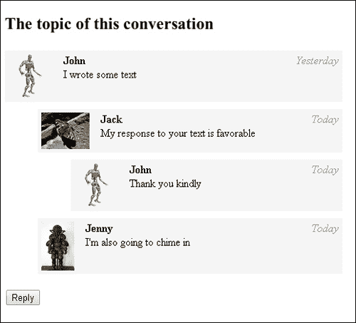
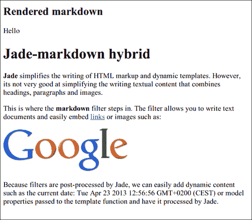
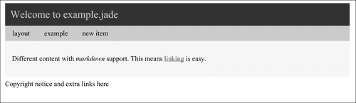

# 第九章：客户端模板

在本章中，我们将涵盖以下内容：

+   使用 Handlebars 渲染对象

+   使用 EJS 渲染对象

+   使用 Jade 渲染对象

+   使用 Handlebars 渲染数组

+   使用 EJS 渲染数组

+   使用 Jade 渲染数组

+   在 Handlebars 中使用助手简化模板

+   在 Handlebars 中使用部分模板重用模板

+   在 EJS 中使用部分模板重用模板

+   在 Jade 中使用过滤器

+   在 Jade 中使用混合

+   使用 Jade 中的布局和块

# 介绍

现代服务应用程序通常为多个平台构建，其中只有一个平台是 Web。其他平台可能包括 iOS、Android 和其他需要通过 API 使用服务的网站。其中一些平台可能不支持 HTML。它们可能还需要为相同的数据显示不同的 HTML 或在显示数据之前进行预处理。

结果是，Web 应用程序已经从使用服务器端 HTML 渲染转变为使用客户端 HTML 渲染。服务提供序列化的原始数据（通常为 JSON，有时为 XML），客户端决定如何显示数据。

在本章中，我们将介绍几种流行的客户端模板语言，每种语言都有不同的模板方法。

+   EJS 将 HTML 与 JavaScript 的全部功能结合在一起

+   Handlebars 将 HTML 与简洁但更受限制的块结构相结合

+   Jade 将 HTML 语法替换为更清晰的版本，并支持动态功能

我们将学习如何在每个模板语言中执行一些常见任务，比如显示基本对象，显示列表（或循环），以及使用部分模板。

# 使用 Handlebars 渲染对象

Handlebars 是一种模板语言，它在 HTML 中添加了最小的语法。它的目标是最小化模板中存在的逻辑量，并强制传递的模型对象与视图中应该呈现的内容相对应。

在这个示例中，我们将演示使用一个简单的例子来展示 Handlebars 的一些优点和缺点。我们将根据一天中的时间来呈现用户的问候语。

## 准备工作

我们需要从[`github.com/wycats/handlebars.js`](https://github.com/wycats/handlebars.js)下载 Handlebars。浏览器版本位于`dist`目录中。创建一个示例目录并将`handlebars.js`复制到该目录中，或直接下载（在 Linux 上）：

```html
wget https://raw.github.com/wycats/handlebars.js/master/dist/handlebars.js
```

## 如何做... 

让我们写下代码：

1.  创建包含`name`输入、`greeting`占位符和 Handlebars 模板的`index.html`：

```html
<!DOCTYPE HTML>
<html>
<head>
<title>Displaying objects with Handlebars</title>
</head>
<body>
<form method="post">
    <p>Name: <input id="name" type="text" name="name" value="John"></p>
</form>
<div id="greeting">
</div>
<script id="template" type="text/x-handlebars-template">

{{#if evening}}
    Good evening,
{{/if}}
{{#if morning}}
    Good morning,
{{/if}}
{{#if day}}
    Hello,
{{/if}}
<b>{{name}}</b>

</script>
<script src="img/jquery.min.js"></script>
<script type="text/javascript" src="img/handlebars.js"></script>
<script type="text/javascript" src="img/example.js"></script>
</body>
</html>
```

1.  创建`example.js`来将模板绑定到数据和视图：

```html
$(function() {
    var template = Handlebars.compile($('#template').html());
    function changeName() {
        var hour = new Date().getHours();
        $('#greeting').html(template({
            name: $("#name").val(),
            evening: hour > 18,
            morning: hour < 10,
            day: hour >= 10 && hour <= 18
        }));
    }
    $('#name').on('keypress keyup', changeName);
    changeName();
});
```

## 它是如何工作的...

我们通常通过将 Handlebars 模板添加到带有`type`属性设置为`text/x-handlebars-template`的`script`元素中，将它们嵌入到 HTML 页面中。浏览器会忽略未知类型的脚本，因此我们可以确保内容保持不变。

使用模板分为两个阶段。在第一阶段，我们需要编译模板文本。这个过程会返回一个以 JavaScript 函数形式的编译模板。在第二阶段，我们将模型对象作为参数传递给该函数（编译模板），并获得 HTML 输出。

Handlebars 是一种非常有主见的和极简的模板语言。在模板中使用比较运算符等程序逻辑是严格禁止的。这是有意设计的，这是一个好主意，如果业务逻辑发生变化，我们不需要更新模板。例如，如果我们开始将午夜到凌晨 2 点视为晚上，我们不需要更改模板-我们只需要在创建模型时添加条件，然后将其传递给 Handlebars。

另一方面，我们可以看到 Handlebars 有时会对其限制有些过分。例如，它不支持 case 结构，枚举或诸如'else if'之类的结构。因此，我们必须要么为每种可能的状态使用布尔表达式，要么将实际文本或值保留在模型中。在某些情况下，模型可能会干扰属于视图的信息。

# 使用 EJS 渲染对象

EJS 是一种模板语言，允许用户在模板中混合 HTML 和 JavaScript。类似于 PHP 和 ERB，它通过在 HTML 中添加额外的标记来使用户能够从 HTML 中“逃离”到编程语言，并使用该语言的全部功能。

在这个教程中，我们将使用一个简单的示例来演示 EJS。我们将根据一天中的时间来渲染用户问候。

## 准备工作

我们需要从[`embeddedjs.com/`](http://embeddedjs.com/)下载 EJS，并在我们的`recipe`文件夹中提取`ejs_production.js`。

## 如何做...

让我们开始吧。

1.  创建包含`name`输入，`greeting`占位符和 EJS`template`的`index.html`：

```html
<!DOCTYPE HTML>
<html>
<head>
<title>Displaying an EJS object</title>
</head>
<body>
<form method="post">
    <p>Name: <input id="name" type="text" name="name" value="John"></p>
</form>
<div id="greeting">
</div>
<script id="template" type="text/ejs">
    <% if (hour > 18) { %>
        Good evening,
    <% } else if (hour < 10) { %>
        Good morning,
    <% } else { %>
        Hello,
    <% } %>
    <b><%= name %></b>
</script>
<script src="img/jquery.min.js"></script>
<script type="text/javascript" src="img/ejs_production.js"></script>
<script type="text/javascript" src="img/example.js"></script>
</body>
</html>
```

1.  创建`example.js`以将模板绑定到数据和视图：

```html
$(function() {
    var template = new EJS({
        text: $('#template').html()
    });
    function changeName() {
        $('#greeting').html(template.render({
            name: $("#name").val(),
            hour: new Date().getHours()
        }));
    }
    $('#name').on('keypress keyup', changeName);
    changeName();
});
```

## 它是如何工作的...

将 EJS 模板嵌入页面的常见方法是将它们添加到具有`type`属性设置为`text/ejs`的`script`元素中。浏览器会忽略未知类型的脚本，因此我们可以确保内容保持不变。

在 EJS 的开放和关闭标签`<% %>`之间，我们可以编写任意的 JavaScript，这将在渲染模板时执行。模板的其余部分是纯 HTML。这使得 EJS 非常容易使用。

当我们想要打印 JavaScript 表达式的值时，我们使用不同的开标签`<%=`，它将表达式值打印为纯文本，转义任何包含的 HTML。

要使用模板，我们创建一个新的 EJS 对象。这将调用 EJS 编译器，将模板编译成更高效的形式。然后我们可以调用这个对象的`render`方法，传递变量（数据模型）以在渲染模板时使用。

## 还有更多...

要打印 HTML 表达式的值而不转义，我们可以使用`<%-`标签而不是`<%=`标签。这使我们能够将 HTML 代码插入为 DOM 节点（而不是将它们视为纯文本）。

# 使用 Jade 渲染对象

Jade 是一种简洁的模板语言。它使用显著的空格来表示块和元素的层次结构。它支持许多高级功能，例如混合，这是子模板，以及块，这是可以通过继承替换的模板部分。

在这个教程中，我们将使用 Jade 渲染一个简单的问候语。在本章的后面，我们将看一些更高级的功能。

## 准备工作

我们需要在我们的`recipe`文件夹中下载`jade.min.js`，可以在[`github.com/visionmedia/jade`](https://github.com/visionmedia/jade)上找到。

## 如何做...

让我们开始吧。

1.  创建`index.html`，它将包含一个要求用户输入姓名的小表单，一个用于渲染问候语的占位符，以及问候语模板：

```html
<!DOCTYPE HTML>
<html>
<head>
<title>Displaying an object with Jade </title>
</head>
<body>
<form method="post">
    <p>Name: <input id="name" type="text" name="name" value="John"></p>
</form>
<div id="greeting">
</div>
<script id="template" type="text/jade">

if hour > 18
    span Good evening,
else if hour < 10
    span
        | Good
        | morning,
else
    span Hello,
b= name

</script>
<script src="img/jquery.min.js"></script>
<script type="text/javascript" src="img/jade.min.js"></script>
<script type="text/javascript" src="img/example.js"></script>
</body>
</html>
```

1.  创建`example.js`以编译模板并将其绑定到数据和视图：

```html
$(function() {
    var template = jade.compile(
        $('#template').html()
    );
    function changeName() {
        $('#greeting').html(template({
            name: $("#name").val(),
            hour: new Date().getHours()
        }));
    }
    $('#name').on('keypress keyup', changeName);
    changeName();
});
```

## 它是如何工作的...

Jade 模板与生成的 HTML 结构非常相似。我们的模板生成一个包含问候文本的单个`span`元素，以及另一个包含用户姓名的`b`（粗体）元素。

Jade 支持条件语句。它们的语法看起来与元素语法完全相似，只是它们不会被渲染。条件不需要用括号括起来，但布尔表达式会被作为 JavaScript 代码进行评估。

正如“早上好”问候所示，我们可以使用竖线字符将文本分成多行

显示变量的内容（转义 HTML 标记），我们使用"`=`"（等于）字符。如果我们不希望内容被过滤，可以使用"`-`"（减号）字符。

要使用 Jade 模板，我们使用`jade.compile`进行编译。这将得到一个`template`函数。如果我们将一个对象传递给这个函数，我们将得到一个渲染后的 HTML 作为结果。我们在`#greeting`元素内显示 HTML。

# 使用 Handlebars 渲染数组

显示对象列表是我们需要单独的模板语言的最常见原因，否则我们可以轻松地通过直接操作 DOM 来完成。Handlebars 对于数组迭代有一个简单、清晰和直接的语法——`each`结构，它的工作方式与其他语言中的`for each`循环非常相似。

在这个示例中，我们将渲染一个消息对象列表。每个消息对象都有一个作者、到达时间、正文和阅读状态。我们将使用不同的样式来区分已读和未读的消息。

像本章中的其他示例一样，模板将包含在 HTML 文件中的`script`标签内。然而，编译可以在我们选择的任何字符串上调用；因此可以通过向服务器发送请求来下载模板数据。

## 准备工作

我们需要从[`github.com/wycats/handlebars.js`](https://github.com/wycats/handlebars.js)下载 Handlebars。浏览器版本在`dist`目录中。创建一个示例目录并将`handlebars.js`复制到该目录，或直接下载（在 Linux 上）：

```html
wget https://raw.github.com/wycats/handlebars.js/master/dist/handlebars.js
```

## 如何做...

按照以下步骤进行：

1.  创建`index.html`，其中包含一个标题，Handlebars 模板，用于渲染消息列表的占位符，以及一些列表样式：

```html
<!DOCTYPE HTML>
<html>
<head>
<title>Rendering an array with EJS</title>
<style type="text/css">
.message {
    border-bottom:solid 1px #ccc;
    width: 250px;
    padding: 5px; }
.message p { margin: 0.5em 0; }
.message.unread { font-weight:bold; }    
.message .date {
    float: right;
    font-style: italic;
    color: #999; }
</style>
</head>
<body>
<h2>Messages</h2>
<div id="list">
</div>
<script id="template" type="text/x-handlebars-template">

{{#each list}}
    <div class="message {{status}}">
        <p><span class="name">{{name}}</span>
        <span class="date">{{date}}</span></p>
        <p class="text">{{text}}</p>
    </div>
{{/each}}

</script>
<script src="img/jquery.min.js"></script>
<script type="text/javascript" src="img/handlebars.js"></script>
<script type="text/javascript" src="img/example.js"></script>
</body>
</html>
```

1.  创建`example.js`以在占位符元素中显示一个示例数组，使用`template`变量：

```html
$(function() {
    var template = Handlebars.compile($('#template').html());
    $('#list').html(template({list:[
        { status: 'read',   name: 'John', date: 'Today',
            text: 'just got back, how are you doing?' },
        { status: 'unread', name: 'Jenny', date: 'Today',
            text: 'please call me asap' },
        { status: 'read',   name: 'Jack', date: 'Yesterday',
            text: 'where do you want to go today?' },
    ]}));
});
```

## 它是如何工作的...

Handlebars 有`{{#each}}`助手，它遍历作为第一个参数传递的数组。

在块内，数组元素的每个成员变量都进入当前作用域，并且可以直接通过名称访问。这个特性极大地简化了这个模板，因为它避免了在循环内重复变量名。

从这个示例中我们可以看到，我们不仅限于在元素内部使用变量，还可以在属性中间或 HTML 的任何其他地方使用它们。

# 使用 EJS 渲染数组

在使用模板语言时，最常见的任务之一是渲染项目列表。由于 EJS 是基于转义到 JavaScript 的，可以使用语言中的循环结构来渲染列表。

在这个示例中，我们将渲染一个消息对象列表。每个消息对象都有一个作者、到达时间、正文和阅读状态。我们将使用不同的样式来区分已读和未读的消息。

## 准备工作

我们需要从[`embeddedjs.com/`](http://embeddedjs.com/)下载 EJS，并在我们的`recipe`文件夹中提取`ejs_production.js`。

## 如何做...

让我们开始吧。

1.  创建`index.html`，其中包含一个标题，EJS 模板，用于渲染消息列表的占位符，以及一些列表样式：

```html
<!DOCTYPE HTML>
<html>
<head>
<title>Rendering an array with EJS</title>
<style type="text/css">
.message {
    border-bottom:solid 1px #ccc;
    width: 250px;
    padding: 5px; }
.message p { margin: 0.5em 0; }
.message.unread { font-weight:bold; }    
.message .date {
    float: right;
    font-style: italic;
    color: #999; }
</style>
</head>
<body>
<h2>Messages</h2>
<div id="list">
</div>
<script id="template" type="text/ejs">
<% for (var k = 0; k < list.length; ++k) {
    var message = list[k];  %>
    <div class="message <%= message.status %>">
        <p><span class="name"><%= message.name %></span>
        <span class="date"><%= message.date %></span></p>
        <p class="text"><%= message.text %></p>
    </div>
<% } %>
</script>
<script src="img/jquery.min.js"></script>
<script type="text/javascript" src="img/ejs_production.js"></script>
<script type="text/javascript" src="img/example.js"></script>
</body>
</html>
```

1.  使用`example.js`中的`render`函数并传递一些文本数据：

```html
$(function() {
    var template = new EJS({
        text: $('#template').html()
    });
    $('#list').html(template.render({list:[
        { status: 'read',   name: 'John', date: 'Today',
            text: 'just got back, how are you doing?' },
        { status: 'unread', name: 'Jenny', date: 'Today',
            text: 'please call me asap' },
        { status: 'read',   name: 'Jack', date: 'Yesterday',
            text: 'where do you want to go today?' },
    ]}));
});
```

## 它是如何工作的...

在`render`函数中，我们传递一个包含消息数组的模型对象给渲染器。

要渲染数组，我们使用标准的 JavaScript `for` 循环。我们可以在开放和闭合标签之间添加任何有效的 JavaScript 代码。在我们的示例中，我们在循环体内赋值一个变量，然后在整个模板中使用它。

从示例中可以清楚地看出，EJS 允许你在模板文本的任何地方转义到 JavaScript。甚至在 HTML 属性中转义也是允许的（我们正在为消息添加一个与消息状态相对应的类，已读或未读），通过在`class`属性内转义。

## 还有更多...

这个示例表明 EJS 几乎和 JavaScript 本身一样强大。然而，不建议在模板内编写任何业务逻辑代码。相反，准备好你的模型对象，使模板代码编写起来更加直观。

# 使用 Jade 渲染数组

Jade 还支持将项目列表呈现为其他模板语言。我们可以使用`each`结构来迭代数组中的元素，并为每个元素输出一些 HTML 元素。

在这个示例中，我们将呈现一系列消息对象。每个消息对象都将有一个作者、到达时间、正文和阅读状态。我们将使用不同的样式来区分已读和未读的消息。

我们还将为奇数和偶数行使用不同的背景。

## 准备工作

我们需要在`recipe`文件夹中下载`jade.min.js`，可在[`github.com/visionmedia/jade`](https://github.com/visionmedia/jade)中找到。

## 如何做...

按照以下步骤：

1.  创建包含 CSS 样式、占位符和模板`script`元素的`index.html`：

```html
<!DOCTYPE HTML>
<html>
<head>
<title>Rendering an array with EJS</title>
<style type="text/css">
.message {
    border-bottom:solid 1px #ccc;
    width: 250px;
    padding: 5px; }
.message p { margin: 0.5em 0; }
.message.unread { font-weight:bold; }    
.message.odd { background-color:#f5f5f5; }
.message .date {
    float: right;
    font-style: italic;
    color: #999; }
</style>
</head>
<body>
<h2>Messages</h2>
<div id="list">
</div>
<script id="template" type="text/jade">

each msg,i in list
  .message(class=msg.status + (i % 2?' odd':' even'))
    p
      span.name=msg.name
      span.date=msg.date
    p.text=msg.text

</script>
<script src="img/jquery.min.js"></script>
<script type="text/javascript" src="img/jade.min.js"></script>
<script type="text/javascript" src="img/example.js"></script>
</body>
</html>
```

1.  创建`example.js`来包装元素和模板与一些模型数据：

```html
$(function() {
    var template = jade.compile($('#template').html());
    $('#list').html(template({list:[
        { status: 'read',   name: 'John', date: 'Today',
            text: 'just got back, how are you doing?' },
        { status: 'unread', name: 'Jenny', date: 'Today',
            text: 'please call me asap' },
        { status: 'read',   name: 'Jack', date: 'Yesterday',
            text: 'where do you want to go today?' },
    ]}));
});
```

## 它是如何工作的...

除了允许我们访问数组元素之外，Jade 中的`each`结构还可以提供元素的索引。

使用这个索引，我们演示了 Jade 可以支持任意表达式。我们为奇数编号的消息添加了一个奇数类，并为偶数编号的消息添加了一个偶数类。当然，最好使用 CSS 伪选择器来做到这一点，例如：

```html
.message:nth-child(odd) { ... }
.message:nth-child(even) { ... }
```

Jade 允许我们省略元素的名称，只使用类和/或 ID 属性。在这些情况下，假定元素是`div`。

我们可以在元素标签后附加 CSS 样式类和 ID。Jade 将为元素添加相应的属性。

## 还有更多...

我们可以传递一个包含要添加到元素的类数组的变量，而不是连接样式类。

# 使用 Handlebars 简化模板

在编写模板时，我们经常需要显示常见的视觉元素，例如警报、对话框和列表。这些元素可能具有复杂的内部结构，每次都编写模板将模型映射到这个结构可能是一个容易出错和重复的过程。

Handlebars 允许我们通过将常见元素的模板替换为调用助手来简化包含常见元素的模板的编写。

在这个示例中，我们将编写 Handlebars 助手来呈现链接、图像和无序列表。我们将显示一个包含姓名、照片和链接到其个人资料的人员列表。

## 准备工作

我们需要从[`github.com/wycats/handlebars.js`](https://github.com/wycats/handlebars.js)下载 Handlebars。浏览器版本位于`dist`目录中。创建一个示例目录并将`handlebars.js`复制到该目录中，或者直接下载（在 Linux 上）：

```html
wget https://raw.github.com/wycats/handlebars.js/master/dist/handlebars.js
```

## 如何做...

按照以下步骤：

1.  创建包含列表样式、列表占位符和列表模板的`index.html`。模板将利用我们的新助手：

```html
<!DOCTYPE HTML>
<html>
<head>
<title>Helpers in Handlebars</title>
<style type="text/css">
li { padding:1em; }
li img { vertical-align:middle; }
</style>
</head>
<body>
<div id="list">
</div>
<script id="template" type="text/x-handlebars-template">

{{#ul list}}
    {{img image alt=name}} {{name}}
{{else}}
    No items found
{{/ul}}

</script>
<script src="img/jquery.min.js"></script>
<script type="text/javascript" src="img/handlebars.js"></script>
<script type="text/javascript" src="img/example.js"></script>
</body>
</html>
```

1.  实现助手，并在`example.js`中呈现模板：

```html
$(function() {    
    Handlebars.registerHelper('ul', function(items, options) {
        if (items .length) return '<ul>' + items.map(function(item) {
            return '<li>' + options.fn(item) + '</li>';  
        }).join('') + '</ul>'
        else
            return options.inverse(this);
    });

    Handlebars.registerHelper('img', function(src, options) {
        return new Handlebars.SafeString('');
    });

    var template = Handlebars.compile($('#template').html());

    $('#list').html(template({list:[
        { name: 'John',  image: '1.png'},
        { name: 'Jack',  image: '2.jpg'},
        { name: 'Jenny', image: '3.jpg'},
    ]}));
});
```

## 它是如何工作的...

在我们的模板中，我们使用了两个新的助手，`ul`用于显示列表和`img`标签用于显示图像。

Handlebars 有两种不同类型的助手：常规和块。块助手以以下格式调用：

```html
{{#helperName argument param=value otherparam=value}}
    body
{{else}}
    alternative
{{/name}}
```

当 Handlebars 遇到一个块时，它会调用它的块函数，该函数接受一个或两个参数：

```html
function helper(argument, options) {
…
}
```

如果指定，第一个参数将传递给`helper`函数。如果第一个参数不可用，则`options`参数将成为第一个。

命名参数也是可选的，并在`hash`属性中作为`options`参数可用。

接下来是必需的块参数，在`helper`函数内部可用，称为`options.fn`。块参数是一个函数，它接受一个上下文并返回使用该上下文渲染块的结果

`else`块也是一个块函数（`options.inverse`）。它是可选的，可以省略。如果省略，将一个默认的空块函数作为`options.inverse`传递。

在我们的示例中，我们将列表内容传递给我们的`ul`助手。如果列表中有项目，这个助手在每个项目上使用常规块；否则，它使用替代块来显示空列表消息。

另一种类型的助手是常规助手，可以按照以下方式调用：

```html
{{helperName argument param=value otherparam=value}}
```

普通助手的工作方式与块助手类似，只是它们不接收块参数。在我们的示例中，我们将`alt`文本作为命名参数传递给呈现的图像。

两种类型的助手都应返回呈现的 HTML。

在我们的`example.js`文件中，我们通过调用`Handlebars.registerHelper`注册了我们的两个新助手。这使它们可以用于需要呈现的所有后续模板。之后，我们可以对模板调用`render`，并使用我们的数据，这将调用助手来生成结果的 HTML：

```html
<ul>
    <li>  John </li>
    <li>  Jack </li>
    <li>  Jenny </li>
</ul>
```

# 在 Handlebars 中使用部分模板重用模板

Handlebars 部分模板是可以从其他模板中调用的模板，并带有特定的上下文。

部分模板的一个示例用途是用户登录框。这样的框将显示用户名、未读通知的数量，以及如果用户已登录则显示注销链接；否则将显示可在使用 Facebook 和 Twitter 时使用的常规登录选项。

当没有参数需要传递给助手或不需要复杂逻辑时，部分模板可以用来代替助手。当动态生成的内容量较小，HTML 量较大时，它们特别有用。这是因为在部分模板内部，可以直接编写 HTML，而无需将其转换为字符串。

在这个示例中，我们将使用部分模板来呈现一个分级对话模型。这个例子还表明，部分模板可以在自身内部递归地重复使用。

## 准备工作

我们需要从[`github.com/wycats/handlebars.js`](https://github.com/wycats/handlebars.js)下载 Handlebars。浏览器版本在`dist`目录中。创建一个示例目录，并将`handlebars.js`复制到该目录，或直接下载（在 Linux 上）：

```html
wget https://raw.github.com/wycats/handlebars.js/master/dist/handlebars.js
```

## 如何操作...

让我们开始吧。

1.  创建`index.html`，其中将包含对话占位符、主对话模板和递归部分线程模板：

```html
<!DOCTYPE HTML>
<html>
<head>
<title>Partials in Handlebars</title>
<link rel="stylesheet" type="text/css" href="style.css">
</head>
<body>
<div id="list" class="conversation">
</div>

<script id="thread-template" type="text/x-handlebars-template">
    <div class="message">
        
        <span class="name">{{from}}</span>
        <span class="date">{{date}}</span>
        <p class="text">{{text}}</p>
    </div>
    <div class="replies">
        {{#each replies}}
            {{> thread}}
        {{/each}}
    </div>
</script>

<script id="template" type="text/x-handlebars-template">
<h2>{{topic}}</h2>
{{> thread}}
<p><input type="button" value="Reply"></p>
</script>

<script src="img/jquery.min.js"></script>
<script type="text/javascript" src="img/handlebars.js"></script>
<script type="text/javascript" src="img/example.js"></script>
</body>
</html>
```

1.  为了给显示的消息添加样式，创建`style.css`并添加以下 CSS 代码：

```html
* { box-sizing: border-box; }
.conversation { width: 70ex; }
.message {
    background-color:#f5f5f5;
    padding: 5px;
    margin:5px 0;
    float:left;
    clear: both;
    width:100%; }
.message p {
    margin: 0 0 0.5em 0; }
.message .name {
    font-weight: bold; }
.message img {
    float: left;
    margin-right: 1em}
.message.unread {
    font-weight:bold; }    
.message .date {
    margin-left:1em;
    float: right;
    font-style: italic;
    color: #999; }
.replies {
    margin-left:3em;
    clear:both; }
```

1.  渲染将从`example.js`中进行：

```html
$(function() {    

    Handlebars.registerPartial('thread', $("#thread-template").html());

    var template = Handlebars.compile($('#template').html());

    $('#list').html(template({
        topic: "The topic of this conversation",
        from: 'John',  
        image: '1.png',
        text: "I wrote some text",
        date: 'Yesterday',
        replies:[
            {from: 'Jack',
                image: '2.jpg',
                text: "My response to your text is favorable",
                date: 'Today' ,
                replies: [
                    {from: 'John',
                        image: '1.png',
                        text: "Thank you kindly",
                        date: 'Today'}
                ]},
            {from: 'Jenny',
                image: '3.jpg',
                text: "I'm also going to chime in",
                date: 'Today' }
        ]}));
});
```

## 工作原理...

这个示例中消息的数据结构是递归的。它包含消息的详细信息：用户名和用户照片、消息文本和消息日期。但它还包含对该消息的回复，这些回复本身也是消息。

为了呈现这个结构，我们编写了一个单个对话线程的部分模板，指定如何显示消息的详细信息，但也遍历所有的回复，并为每个回复调用自身。

然后从主模板中调用这个部分模板，得到完整的对话树。

Handlebars 部分模板是使用当前上下文中的变量调用的。部分与我们直接替换部分模板的调用一样工作，用部分模板的内容替换部分的调用：

```html
{{> partial}}
```

## 还有更多...

部分模板可以用于头部、尾部、菜单，甚至是递归。将网站的大部分可重用部分拆分为部分模板是一种推荐的做法，以避免复制并使这些部分更容易更改和重用。

# 在 EJS 中使用部分模板重用模板

部分模板是需要从多个页面多次包含的较大的 HTML 部分。部分模板的常见用途包括头部、尾部、站点菜单、登录框、警报等。

最新版本的 EJS 不支持部分模板；它们已被移除。然而，还有另一种方法可以在模板中使用其他模板，即通过在数据模型中包含编译后的模板本身。

在这个食谱中，我们将使用 EJS 中的递归部分模板来呈现对话线程。

## 准备工作

我们需要从[`embeddedjs.com/`](http://embeddedjs.com/)下载 EJS，并在我们的`recipe`文件夹中提取`ejs_production.js`。

## 如何做...

让我们开始吧。

1.  创建`index.html`，其中包含对话占位符、主对话模板和递归部分线程模板：

```html
<!DOCTYPE HTML>
<html>
<head>
<title>Partials in EJS</title>
<link rel="stylesheet" type="text/css" href="style.css">
</head>
<body>
<div id="list" class="conversation">
</div>

<script id="thread-template" type="text/ejs">
    <div class="message">
        ">
        <span class="name"><%= thread.from %></span>
        <span class="date"><%= thread.date %></span>
        <p class="text"><%= thread.text %></p>
    </div>
    <div class="replies">
        <% thread.replies && thread.replies.forEach(function(reply) { %>
            <%= partial.render({thread:reply, partial:partial}) %>
        <% }); %>
    </div>
</script>

<script id="template" type="text/ejs">
<h2><%= thread.topic %></h2>
<%= partial.render({thread: thread, partial: partial}) %>
<p><input type="button" value="Reply"></p>
</script>

<script src="img/jquery.min.js"></script>
<script type="text/javascript" src="img/ejs_production.js"></script>
<script type="text/javascript" src="img/example.js"></script>
</body>
</html>
```

1.  在`style.css`中添加必要的样式来呈现模板：

```html
* { box-sizing: border-box; }
.conversation { width: 70ex; }
.message {
    background-color:#f5f5f5;
    padding: 5px;
    margin:5px 0;
    float:left;
    clear: both;
    width:100%; }
.message p {
    margin: 0 0 0.5em 0; }
.message .name {
    font-weight: bold; }
.message img {
    float: left;
    margin-right: 1em}
.message.unread { font-weight:bold; }    
.message .date {
    margin-left:1em;
    float: right;
    font-style: italic;
    color: #999; }
.replies {
    margin-left:3em;
    clear:both; }
```

1.  在`example.js`中添加渲染代码：

```html
$(function() {    
    var template = new EJS({
        text: $('#template').html()
    });

    var threadTemplate = new EJS({
        text:$("#thread-template").html()
    });
    $('#list').html(template.render({
        partial: threadTemplate,
        thread:{
            topic: "The topic of this conversation",
            from: 'John',  
            image: '1.png', text: "I wrote some text",
            date: 'Yesterday',
            replies:[
                {from: 'Jack',
                    image: '2.jpg',
                    text: "My response to your text is favorable",
                    date: 'Today' ,
                    replies: [
                        {from: 'John',
                            image: '1.png',
                            text: "Thank you kindly",
                            date: 'Today'}
                    ]},
                    {from: 'Jenny',
                        image: '3.jpg',
                        text: "I'm also going to chime in",
                        date: 'Today' }
        ]}}));
});
```

## 它是如何工作的...

消息线程是一个递归数据结构。它包含消息细节（如日期、用户和文本）以及回复，这些回复本身也是消息线程。

为了使部分模板对象在模板内可用，我们将其包含在传递的模型中。然后我们可以从模板中调用它，并将其进一步传递到递归部分线程模板的模型中。

这个部分模板显示消息细节，然后继续调用自身以呈现每个回复（如果有的话）。在每次调用中，我们传递部分模板对象，以便在下一次调用中可用。

当没有更多的线程需要呈现时，过程结束，得到一个完整的消息树：



## 还有更多...

尽管 EJS 不再原生支持部分模板，但这个食谱展示了我们如何仍然可以在 EJS 模板之间重用。我们可以通过传递所有注册的部分模板的表格以及每个模型来轻松扩展到完整的部分支持。

# 在 Jade 中使用过滤器

Jade 过滤器是强大的功能，使用户能够在 Jade 模板中使用不同的标记。它们的主要用途是通过使用户能够为模板的特定部分使用适当的工具，使模板更加简洁。

在这个食谱中，我们将使用 Jade 过滤器将 markdown 嵌入到我们的模板中，并解释过滤器的工作原理。

## 准备工作

Jade 的客户端版本[`github.com/visionmedia/jade`](https://github.com/visionmedia/jade)可以在`jade.js`文件中找到，但默认情况下不支持 markdown 过滤器。要添加对 markdown 的支持，我们需要编辑此文件并找到开始定义`markdown`过滤器的行：

```html
  markdown: function(str){
    var md;

    // support markdown / discount
    try {
      ….
    }
    str = str.replace(/\\n/g, '\n');
    return md.parse(str).replace(/\n/g, '\\n').replace(/'/g,''');
  },
```

然后用以下函数替换它：

```html
  markdown: function(str){
    str = str.replace(/\\n/g, '\n');
    return markdown.toHTML(str).replace(/\n/g, '\\n').replace(/'/g,''');
  },
```

这将通知 Jade 使用全局定义的 markdown 对象，我们将通过包含外部 markdown 脚本来提供。

## 如何做...

让我们开始吧。

1.  创建`index.html`，其中包含我们模板的占位符和模板本身：

```html
<!DOCTYPE HTML>
<html>
<head>
<title>Using the markdown filter in Jade</title>
</head>
<body>
<h2>Rendered markdown</h2>
<div id="list">
</div>
<script id="template" type="text/jade">

#header
  | Hello
#content
  :markdown
    # Jade-markdown hybrid
    **Jade** simplifies the writing of HTML markup and dynamic
    templates. However, its not very good at simplifying the
    writing textual content that combines headings, paragraphs
    and images.

    This is where the **markdown** filter steps in. The filter
    allows you  to write text documents and easily embed
    [links](http://google.com) or images such as:

    

    Because filters are post-processed by Jade, we can easily
    add dynamic content such as the current date:
    #{new Date().toString()} or model #{prop} passed to the
    template function and have it processed by Jade.

</script>
<script src="img/jquery.min.js"></script>
<script src="img/markdown.js"></script>
<script type="text/javascript" src="img/jade.js"></script>
<script type="text/javascript" src="img/example.js"></script>
</body>
</html>
```

1.  创建简单的`example.js`文件将模板绑定到元素：

```html
$(function() {
    var template = jade.compile($('#template').html());
    $('#list').html(template({prop: 'properties' }));
});
```

## 它是如何工作的...

当 Jade 遇到`:markdown`块时，它将块内找到的文本传递给我们之前创建的 markdown`filter`函数。这个`filter`函数调用 markdown-js 的 HTML 方法来处理 markdown 并生成 HTML。



# 在 Jade 中使用 mixin

与其他模板语言中的部分模板类似，Jade 的 mixin 是可以接受参数的较小的模板片段。当生成常见的 HTML 块时，如警报框、对话框和菜单时，mixin 非常有用。

在这个食谱中，我们将通过重新实现线程对话模板来比较 Jade 的 mixin 和其他模板语言中的部分模板。这是一个递归模板，用于呈现线程对话树。

## 准备工作

我们需要在我们的`recipe`文件夹中下载`jade.min.js`，可在[`github.com/visionmedia/jade`](https://github.com/visionmedia/jade)找到。

## 如何做...

让我们开始吧。

1.  创建`index.html`，其中包含对话占位符、主对话模板和递归部分线程模板：

```html
<!DOCTYPE HTML>
<html>
<head>
<title>Mixins in Jade</title>
<link rel="stylesheet" type="text/css" href="style.css">
</head>
<body>
<div id="list" class="conversation">
</div>

<script id="thread-template" type="text/jade">
</script>

<script id="template" type="text/jade">

mixin thread(thread)
  .message
    img(src=thread.image)
    span.name=thread.from
    span.date=thread.date
    p.text=thread.text
  .replies
    if thread.replies
      each reply in thread.replies
        +thread(reply)

h2=thread.topic
+thread(thread)
p
  input(type="button",value="Reply")

</script>

<script src="img/jquery.min.js"></script>
<script type="text/javascript" src="img/jade.min.js"></script>
<script type="text/javascript" src="img/example.js"></script>
</body>
</html>
```

1.  创建`example.js`将数据传递给模板：

```html
$(function() {    
    var template = jade.compile($('#template').html());
    $('#list').html(template({
        thread:{
            topic: "The topic of this conversation",
            from: 'John',  
            image: '1.png',
            text: "I wrote some text",
            date: 'Yesterday',
            replies:[
                {from: 'Jack',
                    image: '2.jpg',
                    text: "My response to your text is favorable",
                    date: 'Today' ,
                    replies: [
                        {from: 'John',
                            image: '1.png',
                            text: "Thank you kindly",
                            date: 'Today'}
                    ]},
                    {from: 'Jenny',
                        image: '3.jpg',
                        text: "I'm also going to chime in",
                        date: 'Today' }
            ]}}));
});
```

1.  创建`style.css`来为对话线程设置样式：

```html
* { box-sizing: border-box; }
.conversation { width: 70ex; }
.message {
    background-color:#f5f5f5;
    padding: 5px;
    margin:5px 0;
    float:left;
    clear: both;
    width:100%;
}
.message p {
    margin: 0 0 0.5em 0; }
.message .name {
    font-weight: bold; }
.message img {
    float: left;
    margin-right: 1em}
.message.unread { font-weight:bold; }    
.message .date {
    margin-left:1em;
    float: right;
    font-style: italic;
    color: #999; }
.replies {
    margin-left:3em;
    clear:both; }
```

## 它是如何工作的...

消息线程是一个递归数据结构。它包含消息细节（如日期、用户和文本），还包括回复，这些回复本身就是消息线程。

为了渲染这个结构，我们写了一个 Jade 混合。混合以线程作为参数，并显示其属性以及线程顶部节点中的文本。

最后，如果线程对象中有回复，它会遍历所有这些回复，并递归地将每个回复作为参数调用自身。通过在混合名称前加上字符“+”来调用混合。

主模板显示顶级消息的主题。然后它调用混合与顶级线程，这导致完整线程树的渲染。

# 在 Jade 中使用布局和块

为了让我们轻松创建不同的模板，Jade 支持模板继承。Jade 的模板继承允许我们定义一个主布局模板，然后通过扩展主布局替换该模板的部分。

在这个示例中，我们将使用模板继承来模拟一个完整的网站，包含标题、菜单、一些内容和页脚。内容将分为两个页面。

## 准备就绪

Jade 的客户端版本不支持布局和块。指定要扩展的模板需要访问文件系统，这在浏览器中不可用。但是，我们可以使用 browserify 预编译模板。为此，我们将编写一个 browserify 插件，该插件注册了 Jade 文件的处理程序。

首先让我们安装先决条件。我们需要`nodejs`，可以从[`nodejs.org/`](http://nodejs.org/)下载。在命令提示符中安装 node 后，我们将安装 browserify Version 1（截至目前，Version 2 不支持插件）：

```html
npm install -g browserify@1
```

接下来，我们将为我们的示例创建一个新目录：

```html
mkdir example && cd example
```

在该目录中，我们将安装 Jade（和 markdown 以添加 markdown 支持到 Jade）：

```html
npm install jade markdown
```

## 如何做...

按照以下步骤：

1.  让我们编写 browserify 插件，`browserify.jade.js`：

```html
var jade = require('jade');
module.exports = function(browserify) {
    browserify.register('jade', function(tmpl, file) {
        var fn =  jade.compile(tmpl, {
            client: true,
            filename:true,
            path: __dirname
        });
        return ["var jade = require('jade/lib/runtime.js');",
                'module.exports=',fn.toString()].join('');
    });
};
```

1.  然后创建`index.html`，在这种情况下，它是一个简单的占位符，用于模板填充的内容：

```html
<!DOCTYPE HTML>
<html>
<head>
<title>Blocks and layouts in Jade</title>
<link rel="stylesheet" type="text/css" href="style.css">
</head>
<body>
<div id="content">
</div>
<script src="img/jquery.min.js"></script>
<script type="text/javascript" src="img/example.min.js"></script>
</body>
</html>
```

1.  然后我们可以创建`example.js`，它将加载两个模板，并使菜单点击呈现不同的模板：

```html
$(function() {    
    var templates = {
        'layout':require('./layout.jade'),
        'example':require('./example.jade')
    };
    console.log(templates.layout.toString())
    $('body').on('click', 'a', function() {
        var template = templates[$(this).text().trim()];
        $("#content").html(template({}));
    });
    $("#content").html(templates.layout({}));
});
```

1.  这是`layout.jade`的内容（也渲染菜单）：

```html
#header
 | Welcome to example.jade
ul.menu
  block menu
    li
      a layout
    li
      a example
.content
  block content
    div
      p This is the default page
#footer
  | Copyright notice and extra links here
```

1.  将其添加到`example.jade`中，通过向`menu`块追加项目并替换`content`块来扩展`layout.jade`：

```html
extends layout
block append menu
  li
    a new item
block content
  :markdown
    Different content with *markdown* support.
    This means [linking](http://google.com) is easy.
```

1.  让我们添加`style.css`，使其看起来漂亮：

```html
* { box-sizing: border-box; }
#content {
    max-width: 800px;
    margin: 0 auto; }
ul.menu {
    background-color: #ccc;
    margin: 0; padding:0; }
ul.menu li {
    display:inline-block;
    border-top: solid 1px #ddd;
    border-left: solid 1px #ddd;
    border-right: solid 1px #bbb; }
ul.menu li a {
    display: inline-block;
    cursor:pointer;
    padding: 0.5em 1em; }
.content {
    padding: 1em;
    background-color:#f5f5f5; }
#header {
    background-color:#333;
    color: #ccc;
    padding:0.5em;
    font-size: 1.5em; }
#footer {
    margin-top: 0.5em;}
```

1.  最后，通过在命令提示符中输入以下命令，将所有内容包装到`example.min.js`中：

```html
browserify -p ./browserify-jade.js example.js -o example.min.js

```

## 它是如何工作的...

让我们从`browserify-jade.js`开始。

这个插件通过使用 browserify 注册新的文件扩展名'`jade`'，并告诉它使用我们的转换函数处理它遇到的每个 jade 文件的内容来工作。这意味着它将拦截`require('layout.jade')`和`require('example.jade')`。

我们的插件函数使用 Jade 编译接收到的模板内容，然后编写生成的 JavaScript 函数的代码。但是，为了确保生成的模板可以使用 Jade 辅助函数，它还通过 require 包含`runtime.js`。该文件包含所有编译模板需要的基本 Jade 库（以这种方式添加将导致 browserify 将其包含在最终捆绑包中）。

块和继承的工作原理：

要使模板成为可继承的布局，我们只需要在其中放置命名块。在我们的示例中，`layout.jade`中有两个命名块 - 一个用于菜单，一个用于内容。

命名块允许我们扩展模板，然后用自己的内容替换部分内容。我们在`example.jade`文件中这样做。该文件继承自布局，使用“`block append`”在菜单块中追加一个新的菜单项，并完全用自己的 markdown 内容替换内容块。

### 提示

也可以通过简单地使用“`block prepend`”来在块前添加内容。

当我们运行`browserify`命令时，它会将模板和`example.js`合并成一个名为`example.min.js`的单个文件，我们在页面中引入它：



结果是一个简单的页面，有一个标题、菜单、内容和一个页脚块。当菜单中的链接被点击时，适当的模板会被加载并在页面上呈现。
