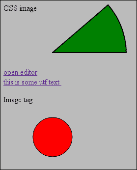
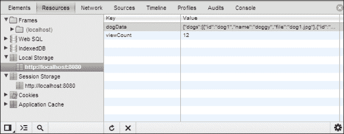
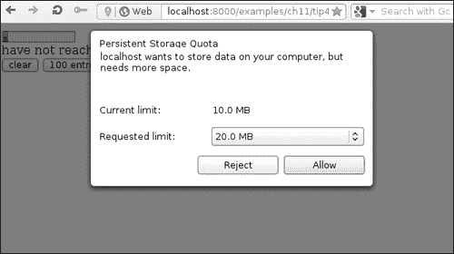

# 第十一章：数据存储

本章涵盖以下配方：

+   Data URI

+   会话和本地存储

+   从文件中读取数据

+   使用 IndexedDB

+   存储的限制以及如何请求更多

+   操作浏览器历史记录

# 介绍

当我们谈论存储时，大多数开发人员会考虑将数据存储在服务器上的某个数据库中。HTML5 确实在可以传递和保存到客户端方面取得了长足的进步。无论是用于临时使用、缓存，还是完全离线使用整个应用程序，客户端存储正在变得越来越普遍。

所有这些伟大的功能使我们能够在客户端存储数据，从而使应用程序变得更快、更易用和更可达。即使在基于云的解决方案中，我们仍然需要一些本地数据，这将使用户体验更好。

本章涵盖了一些与 HTML5 相关的特性，涉及数据存储。

# Data URI

我们已经在本书中的多个场合使用了 Data **URI**（**统一资源标识符**），但从未详细介绍过我们可以用它做什么，以及有什么限制。Data URI 通常被称为 Data **URL**（**统一资源定位符**），尽管从技术上讲，它们实际上并没有从远程站点定位任何内容。

在这个例子中，我们将使用不同的媒体类型并检查大小约束。

## 准备工作

对于这个例子，我们只需要浏览器和一些样本文本文件。这些文件可以作为示例文件中的`files`文件夹的一部分下载。

## 如何做...

为了查看一些可用的选项，我们将创建一个简单的 HTML 文件，其中包含几种不同的使用场景：

1.  `head`部分将包括`example.css`文件：

```html
<head>
<title>Data URI example</title>
<link rel="stylesheet" type="text/css" href="example.css">
</head>
```

1.  在`body`部分，我们添加一个`div`元素，用作 CSS 图像 Data URI 的容器：

```html
<div id="someImage">
CSS image
</div>
```

1.  通过使用 Data URI，我们可以创建一个简单的编辑器，通过点击链接打开：

```html
<a href="data:text/html,<body contenteditable>write here">open editor</a>
```

1.  base64 是可选的，可以使用字符集：

```html
<a href="data:text/plain;charset=utf-8,програмерите%20ќе%20го%20населат%20светот">this is some UTF-8 text </a>
```

1.  Data URI 可以是原始 SVG：

```html
<p>Image tag </p>
<imgsrc='data:image/svg+xml,<svg version="1.1"><circle cx="100" cy="50" r="40" stroke="black" stroke-width="1" fill="red" /></svg>' />
```

1.  使用 Data URI 的伴随 CSS 代码用于表示`background-image`：

```html
img {
  width: 300px;
  height: 110px;
}

#someImage {
  background-image : url('data:image/svg+xml,<svg version="1.1"><path d="M 100,100 l150,0a150,150 0 0,0 -37,-97 z" fill="green" stroke="black" stroke-width="2" stroke-linejoin="round" /></svg>');
}
```

这将显示两个图像和链接到简单编辑器和一个小文本文件：



## 它是如何工作的...

一个常见的误解是 Data URI 只能用来表示图像。正如我们在例子中看到的，这并不是这样。严格来说，Data URI 不是 HTML5 的特性，而是在 RFC-2397（[`tools.ietf.org/html/rfc2397`](http://tools.ietf.org/html/rfc2397)）中包含的，1998 年指定，最初在 1995 年提出了这个想法。其背后的想法是直接内联嵌入数据。URI 形式被指定为：

```html
data:[<mediatype>][;base64],<data>
```

`mediatype`属性是 Internet 媒体类型，或者它的旧名称是 MIME。如果我们不指定它，它默认为`text/plain;charset=US-ASCII`。

除了酷和不同之外，我们为什么要使用 Data URI？

一个很好的理由是从当前显示的文档中派生数据。例如，我们可以从`canvas`元素创建图像，或者从当前表格生成 CSV 文件。

另一个原因是网页加载速度。这是矛盾的，因为 Data URI 通常是 base64 编码的，这会增加文档的大小到 1/3。加快速度的原则是减少请求的数量。这对于传输应该小于几千字节的小文件是有意义的，否则，不再发出另一个请求的收益很小，如果有的话。这种方法的另一个问题是，我们正在失去单独资源的缓存。否则将被单独缓存的文件，现在具有与嵌入它的文档相同的属性。如果该文档经常更改，则嵌入的数据将每次重新加载。

其他用例是对各种资源有限制的环境。电子邮件就是这种情况的一个例子，在这种情况下，为了实现单一文档体验而不必将图像作为附件，可以使用 Data URI。

## 还有更多...

在一些数据 URI 的应用中，安全性可能是一个问题，但如果大多数浏览器中的客户端应用程序遵循规范，那么只有允许的`mediatype`数据将被处理。

HTML5 中的属性有大小限制。HTML 4 有`ATTSPLEN`限制，其中指定属性的最大长度为`65536`个字符。HTML5 不是这种情况，目前每个浏览器版本都有不同的状态。对于 Firefox 3.x，它是 600 KB，对于 Chrome 19，它是 2 MB，IE 8 的限制是 32 KB。可以肯定地说，这只对较小的资源有意义。

# 会话和本地存储

Cookie 是保存应用程序状态的常用方式，可能是一些选中的复选框或某种临时数据，例如，向导应用程序中的当前流程，甚至是会话标识符。

这是一个经过验证的方法已经有一段时间了，但有一些使用情况是不舒服创建 Cookie 并且它们会施加一定的限制和开销，这是可以避免的。

会话和本地存储解决了一些 Cookie 的问题，并且使数据在客户端上的简单存储成为可能。在这个示例中，我们将创建一个简单的表单，利用 HTML5 存储 API。

## 准备工作

在这个示例中，我们将使用可以从`images`文件夹中检索的几个图像，或者您可以使用自己的选择。此外，由于我们将使用来自 JSON 对象的 REST API 的模拟响应，我们需要启动一个本地 HTTP 服务器来提供我们的静态文件。

## 如何做到这一点...

我们可以先创建一个表单，其中包含狗的选择和留下评论的区域。当我们在表单中点击一个按钮时，将显示所选狗的图像。除此之外，我们还将有一个输出字段，用于显示当前用户的访问次数：

1.  我们在`head`部分链接一个简单的 CSS 类：

```html
<meta charset="utf-8">
<title>Session and storage</title>
<link rel="stylesheet" type="text/css" href="example.css" />
```

1.  表单将包含以下单选按钮和文本区域：

```html
<form id="dogPicker">
<fieldset>
<legend>Pick a dog</legend>
<div id="imageList"></div>
<p>The best is:</p>
<p>
<input id="dog1" type="radio" name="dog" value="dog1" />
<label for="dog1">small dog</label>

<input id="dog2" type="radio" name="dog" value="dog2" />
<label for="dog2">doggy</label>

<input id="dog3" type="radio" name="dog" value="dog3" />
<label for="dog3">other dog</label>
</p>
</fieldset>

<label for="comment">Leave a comment</label>
<textarea id="comment" name="comment" ></textarea>
<button id="send" type="button">Pick</button>
</form>
```

1.  我们添加一个访问次数的计数器如下：

```html
<p>
      You have opened this page <output id="counter">0</output> times
</p>
```

1.  还有一个简单的`div`元素作为所选狗图片的占位符和对 jQuery 的依赖，以及包括我们稍后将编写的`example.js`文件：

```html
<div id="selectedImage"></div>
<script src="img/jquery.min.js"></script>
<script src="img/example.js" ></script>
```

1.  对于`example.js`文件，我们创建一个函数，将在点击按钮时将评论存储在会话中。如果数据不可用，将对`"dogs.json"`变量进行请求：

```html
$(function() {
  $('#send').click(function() {
vardogId = $("#dogPicker :radio:checked").val();
var comment = $('#comment').val();
    //different ways to set data
sessionStorage.comment = comment;
    // if no data available do AJAX call
    if (localStorage.dogData) {
showSelectedImage(dogId);
    } else {
      $.ajax({
url: "dogs.json",
      }).done(function(data){
localStorage.dogData = JSON.stringify(data);
showSelectedImage(dogId);
      });
    }
  });
```

### 提示

使用`#dogPicker :radio:checked`，我们选择`dogPicker`ID 的元素的所有选中输入`radio`子元素。

1.  由于评论的数据存储在会话中，点击后我们可以有一种加载它的方式，以备下次使用：

```html
  if (sessionStorage.comment) {
    $('#comment').val(sessionStorage.comment);
  }
```

1.  但是使用`localStorage`，我们可以递增`viewCount`变量，或者首次初始化它：

```html
  if (localStorage.viewCount) {
localStorage.viewCount++;
    $('#counter').val(localStorage.viewCount);
  } else {
localStorage.viewCount = 1;
  }
```

1.  `showSelectedImages`方法遍历每个狗对象，在我们的`localStorage`列表中创建一个带有所选文件的图像元素：

```html
 function showSelectedImage(dogId){
vardogList = JSON.parse(localStorage.dogData);
vardogFile;
    $.each(dogList.dogs, function(i,e){
      if(e.id === dogId){
dogFile = e.file;
      };
    });
      $('#selectedImage').html("<imgsrc='images/" + dogFile + "'></img>");
  }
```

如果我们选择一个单选按钮并单击它，狗的图像应该显示出来，如果我们尝试重新加载缓存，那么（*Ctrl* + *F5*）在大多数浏览器中，评论数据仍然会保留。如果我们在另一个标签中打开相同的 URL，那么评论就不应该存在，这意味着会话与单个浏览器窗口或标签相关联。另一方面，计数器应该每次递增，而且不会为`dogs.json`文件执行额外的请求。

## 它是如何工作的...

`sessionStorage`和`localStorage`共享通用的`Storage`接口，并且它们被定义为[`www.w3.org/TR/webstorage/`](http://www.w3.org/TR/webstorage/)的一部分。我们可以使用点表示法来读取或写入存储，例如`storage.key = someValue`和`someValue = storage.key`。更长的形式是使用方法调用访问数据，`storage.setItem(key, value)`和`storage.getItem(key)`。

这里对键和值的限制是它们必须是“字符串”。在我们的例子中，我们需要存储 JSON，所以为了使其与值兼容，我们使用了`JSON.stringify`和`JSON.parse`。还有一个方法`storage.removeItem(key)`来删除一个项目，或者用`storage.clear()`来清除整个存储。

`sessionStorage`是一个用于存储在浏览器会话期间持续存在的信息的对象，这就是名称的由来。即使重新加载后信息仍然保留，使其成为会话 cookie 的强大替代品。存储的项目的有效上下文是当前网站域，在当前打开的选项卡的会话期间。例如，如果我们在域[`example.com/1.html`](http://example.com/1.html)上存储一个项目，它将在[`example.com/2.html`](http://example.com/2.html)或同一域的任何其他页面上都可以访问。

`LocalStorage`是一种持久存储，与`sessionStorage`不同，它在会话结束后仍然有效。这类似于标准 cookie 的行为，但与 cookie 不同的是，cookie 只能保存非常有限的数据。`localStorage`在大多数浏览器上默认为 5MB，在 IE 上为 10MB。需要记住的是，我们将数据存储为字符串而不是它们的原始形式，例如整数或浮点数，因此最终存储的表示将更大。如果我们超出存储限制，那么将抛出一个带有`QUOTA_EXCEEDED_ERR`错误消息的异常。

在我们的代码中，我们使用`localStorage`来缓存 JSON 资源，从而完全控制了失效。此外，我们为给定用户的访问次数创建了一个简单的计数器。

显而易见的隔离是`hostname`和`port`的组合，需要单独存储。较少人知道的是，Web 存储还取决于`scheme/host/port`的元组。Scheme 包含子域和协议。因此，如果页面加载了混合类型的资源，有些是用`https`，有些是用`http`，你可能得不到那么明显的结果。虽然混合资源不是一个好的安全实践，但它经常发生。无论哪种情况，敏感数据都不应存储在本地或会话存储中。

另一种情况是大多数现代浏览器都有的私人/无痕模式。在该模式下打开页面时，将使用一个新的临时数据库来存储这些值。在此模式下存储的所有内容只会成为该会话的一部分。

## 还有更多...

**本地存储**使用一个在浏览器的主 UI 线程上运行的同步 API。因此，如果我们在多个不同的窗口上打开相同的网站，就有很小的可能发生竞争条件。对于大多数用例来说，这并不是一个真正的问题。要从客户端清除数据，我们可以随时调用`storage.clear()`，但大多数浏览器现在都有开发者工具来简化操作：



在填充方面有很多可用的，例如[`code.google.com/p/sessionstorage/`](https://code.google.com/p/sessionstorage/)或[`gist.github.com/remy/350433`](https://gist.github.com/remy/350433)。您可能想知道它们是如何工作的，因为存储是添加到浏览器的新功能。它们大多使用 cookie 来存储数据，因此通常受到 2 KB 的限制，即 cookie 的最大大小。其他使用 IE userData([`msdn.microsoft.com/en-us/library/ms531424%28VS.85%29.aspx`](http://msdn.microsoft.com/en-us/library/ms531424%28VS.85%29.aspx))对象在旧版本的 IE 上启用其使用。还有一些库，例如[`www.jstorage.info/`](http://www.jstorage.info/)，为多个浏览器版本提供相同的接口。此外，还有`Persists.js`，它可以启用多种不同的回退解决方案：flash - Flash 8 持久存储，gears - 基于 Google gears 的持久存储，localstorage - HTML5 草案存储，whatwg_db - HTML5 草案数据库存储，globalstorage - HTML5 草案存储（现已过时），IE - Internet Explorer 用户数据行为，和 cookie - 基于 cookie 的持久存储。

### 注意

还有一个基于自定义对象的回退，可以创建以在旧浏览器上启用`localStorage`。有关更多信息，请访问 MDN 的[`developer.mozilla.org/en-US/docs/DOM/Storage#Compatibility`](https://developer.mozilla.org/en-US/docs/DOM/Storage#Compatibility)。

`globalStorage`在几个版本的 Firefox 中实现了，但由于与实现相关的混乱很多，它已经从 Firefox 13 中移除，以及 Web 存储的规范。

在安全性方面，将敏感数据存储在客户端存储中从来都不是一个好主意。如果您的站点存在 XSS 漏洞，那么存储可以被读取。使用服务器端密钥加密数据并没有太多意义，因为这将使我们依赖于服务器数据。在非 TLS 站点上还可能发生 DNS 欺骗攻击。如果域名被欺骗，浏览器将无法判断数据是否是从“错误”的站点访问的。

对 Web 存储提出了很多批评，主要是由于用户跟踪。如果我们在几个不同的站点中有相同的广告商，那么他可以轻松地跟踪用户在这些站点上的访问。这使得用户的匿名性大大降低，成为易受攻击的目标。有几种提出的解决方案来解决这个问题，例如，对第三方`iframes`进行限制和创建此类数据的域名黑名单，但目前没有一种完全解决问题。

# 从文件中读取数据

我们已经使用文件输入来读取一些数据，但从未详细介绍过文件读取和可用于我们的对象。在这个示例中，我们将使用输入文件创建一个简单的文件阅读器，它将作为文件 API 提供的一些选项的迷你演示：目录和系统，[`www.w3.org/TR/file-system-api/`](http://www.w3.org/TR/file-system-api/)。

## 如何做到...

我们将创建一个包含文件输入控件和上传状态的进度输出的 HTML 文件：

1.  我们创建控件和一些输出占位符：

```html
<body>
<p>
<progress id="progress" value="0" max="100"></progress>
<output id="percent" for="progress">0</output>
</p>
<p>
<div id="fileInfo"></div>
</p>
<input type="file" id="file" value="Choose text file">
<button type="button" id="abort">Abort</button>
<button type="button" id="slice">Read 5 bytes</button>
<div id="state"></div>
<br />
<label>
        Contents:
<div id="content"></div>
</label>
```

1.  添加依赖项到 jQuery 和我们的`example.js`：

```html
<script src="img/jquery.min.js"></script>
<script type="text/javascript" src="img/example.js"></script>
```

1.  我们可以继续创建`example.js`文件；在这里，我们在`abort`按钮上附加一个事件处理程序，并使用`FileReader`对象：

```html
$(function() {

varfr = new FileReader();

  $('#abort').click(function(){
fr.abort();
console.log('aborting file change');
  });
```

1.  从所选的文件输入中，我们将使用当前配置项迭代上传的文件，并为一些常见事件添加事件处理程序：

```html
$('#file').on('change', function(e) {
    for (var i = 0; i <this.files.length; i++) {
var f = this.files[i];
fr = new FileReader();

fr.onerror = function (e) {
        $('#state').append('error happened<br />').append(e).append('\n');
      }

fr.onprogress = function (e) {
var percent = (e.loaded * 100 / e.total).toFixed(1);
        $('#progress').attr('max', e.total).attr('value', e.loaded);
        $('#percent').val(percent + ' %');
      }
fr.onabort = function() {
        $('#state').append('aborted<br />');
      }

fr.onloadstart = function (e) {
        $('#state').append('started loading<br />');
      }

      if (f.type&& (f.type.match('image/.+')) || (f.type.match('video/.+'))) {
fr.readAsDataURL(f);
      } else if (f.type.match('text/.+')) {
fr.readAsText(f);
      } else {
        $('#state').append('unknown type of file loaded, reading first 30 bytes <br />');
      }

fr.onload = function(e) {
        $('#state').append('finished reading <br />');
appendContents(f,e);
      }
      $('#fileInfo').html(getMetaData(f));
    }
  });
```

1.  `getMetaData`函数将从`file`对象中读取可用的元数据，并创建一个简单的 HTML 表示：

```html
function getMetaData(file){
var text = "<b>file: </b>" + file.name + " <br />";
    text += "<b>size: </b>" + file.size + " <br />";
    text += "<b>type: </b>" + file.type + " <br />";
    text += "<b>last modified: </b>" + file.lastModifiedDate.toString() + " <br />";
    return text;
  }
```

### 注意

您可以在 W3C 文件 API 规范的[`www.w3.org/TR/FileAPI/#dfn-file`](http://www.w3.org/TR/FileAPI/#dfn-file)中阅读有关文件接口的更多信息。

1.  通过读取文件类型，我们还可以确定输出内容。在我们的情况下，如果我们有文件，即图像，我们将数据附加为`img`标签上的`src`，另一方面，对于其他文件类型，我们只是打印文本表示：

```html
function appendContents(f,e) {
    if (f.type&&f.type.match('image/.+')){
      $("").attr('src', e.target.result).appendTo("#content");
    } else {
      $("<pre />").text(e.target.result).appendTo("#content");
    }
  }
```

1.  还有另一种通过访问属性文件来读取文件输入中的文件列表的方法。`slice`按钮将仅从文件中读取前 15 个字节：

```html
$('#slice').click(function(){
varfileList = $('#file').prop('files');
    $.each(fileList, function(i,file) {
fr = new FileReader();
var blob = file.slice(0, 15);
fr.readAsBinaryString(blob);
fr.onload = function(e) {
        $("<pre />").text(e.target.result).appendTo("#content");
      }
    });
   });
  });
```

到目前为止，我们应该有一个正在运行的网站，一旦上传文件，文件将被读取和显示。为了查看进度事件，您可以尝试使用大文件，否则它可能会立即运行。至于`slice`按钮，最好尝试使用一个简单的`.txt`文件，以便您可以查看内容。

## 工作原理...

这些规范背后的主要思想是在客户端实现完整功能的文件系统 API。关于当前状态的不幸之处在于，只有 Chrome 实现了大多数来自文件系统和 FileWriter API 的功能，而其他浏览器支持 FileReader 和 File API。这就是为什么我们决定使用在所有主要浏览器中都受支持并使用最常见功能的工作示例。

对于读取和简单操作，我们使用包含可以使用`FileReader`读取的`File`对象的`FileList`。HTML5 在`<input type="file">`控件上定义了一个文件属性，可以使用 jQuery（`$('#file').prop('files'))`）或直接从所选的 HTML 元素中访问，就像我们在`this.files.length`的情况下所做的那样。此属性实际上是一个称为`FileList`的类似数组的对象，其中包含`File`对象。`FileList`实例具有一个方法`item(index)`和一个属性`length`。每个项目都是一个`File`对象，一个扩展了`Blob`的接口，不可变的原始二进制数据。文件是一个表示，并具有以下属性：

+   `name`：此属性表示文件的名称。

+   `lastModifiedDate`：此属性表示文件的最后修改日期。如果浏览器无法获取此信息，则将当前日期和时间设置为`Date`对象。

但除此之外，还有来自`Blob`接口的方法，如下所示：

+   `size`：此属性表示文件的大小（以字节为单位）

+   `type`：MIME 类型。此元数据可以直接读取，就像我们在`getMetaData`函数中所做的那样。元数据可以以各种不同的方式使用，例如在我们的情况下，根据文件类型匹配图像`f.type&&f.type.match('image/.+')`，然后显示`img`标签或其他文本。

`Blob`类型还包含`slice`方法的定义，由于`File`扩展了`Blob`，因此也可以在那里使用。`slice(start, end, contentType)`方法返回一个新对象，其中新的`contentType`属性被切片，新文件将从原始文件中切片。

### 提示

在较旧的浏览器版本中，例如，Firefox 版本小于 12 和 Chrome 版本小于 21，您需要使用`slice`方法的前缀版本。对于 Chrome，它是`File.webkitSlice()`，对于 Firefox，它是`File.mozSlice()`。`Blob`对象也可以从字节数组创建。

`FileReader`对象实际上是执行文件中包含的数据读取的对象，因为`File`对象本身只是对真实数据的引用。在`FileReader`中有用于从`Blob`中读取的方法，如下所示：

+   `void readAsArrayBuffer(blob)`: 此方法将文件读取为二进制数组

+   `void readAsText(blog, optionalEncoding)`: 此方法将文件读取为文本，其中可以添加可选的编码字符串名称以指定应使用的编码。如果省略编码，则将使用编码确定算法自动选择编码，如规范中所定义的，在大多数情况下应该足够。

+   `void readAsDataUrl(blob)`: 该方法从给定的文件创建一个数据 URL

您可能会注意到，这些方法实际上并不返回读取的数据。这是因为`FileReader`对象是异步读取数据的，所以一旦数据被读取，就会运行回调函数。还有一个`abort`方法，可以在调用后停止文件的读取，这是我们在示例中点击`abort`按钮时调用的方法。

可以附加到文件读取器的事件处理程序可能会在某些情况下触发。在我们的示例中，我们只打印文件读取器的状态。以下事件可以被处理：

+   `onabort`: 一旦读取操作被中止，就会触发此事件。

+   `onerror`: 当发生错误时调用此事件。这是我们经常想要处理或至少知道何时发生的事件，尽管处理程序是可选的。错误可能发生在各种不同的原因，我们的处理程序可以接受一个参数来检查`FileError`错误代码。例如，处理程序可以执行以下操作：

```html
fr.onerror = function (err){
  switch(err.code){
    case FileError.ENCODING_ERR:
      // handle encoding error
      break;
    case FileError.SYNTAX_ERR:
      // handle invalid line ending
      break;
    case FileError.ABORT_ERR:
    // handle abort error
    break;
    default :
    //handle all other errors , or unknown one
    break;
  }
}
```

`FileError`对象包含已发生的相应错误，但我们只处理给定情况下的一些情况。

+   onload – 一旦读取操作成功完成，就会调用此事件。处理程序接受并处理事件，从中我们可以读取数据：

```html
fr.onload = function (e){
    // e.target.result contains the data from the file.
}
```

+   `onloadstart`: 此方法在读取过程的最开始调用。

+   `onloadend`: 当我们成功读取时调用此方法，但即使发生错误，它也是一个很好的清理资源的候选者。

+   `onprogress`: 在读取数据时定期调用此方法。在进度处理程序中，我们可以读取几个对我们有用的属性，以便在`progress`元素上进行更新。我们可以读取已读取该文件的总字节数，这意味着我们可以简单地计算数据的百分比：

```html
fr.onprogress = function (e) {
var percent = (e.loaded * 100 / e.total).toFixed(1);
        $('#progress').attr('max', e.total).attr('value', e.loaded);
        $('#percent').val(percent + ' %');
      }
```

在大多数情况下，`onload`和`onerror`就足够了，但我们可能需要向用户显示视觉显示或通知他们读取状态。

要检查浏览器是否支持我们使用的功能，我们可以使用：

```html
if (window.File&&window.FileReader&&window.FileList&&window.Blob) {
   // has support for File API
}
```

## 还有更多...

对于更高级的逻辑和文件写入，有`FileWriter`、`DirectoryReader`、`FileEntry`、`DirectoryEntry`、`LocalFileSystem`等等。问题在于，目前只有 Chrome 支持它们。

要请求受限文件系统，我们调用`window.requestFileSystem(type, size, successCallback, errorCallback)`，这是 FileSystem API 的一部分。受限环境意味着这个文件系统与用户的文件系统是分开的，所以你不能随意写入任何地方。

自 Chrome 12 以来，文件系统已经被添加前缀，当前版本的 Chrome 25 仍在使用该版本。一个简单的文件系统请求可能是：

```html
window.webkitRequestFileSystem(
window.TEMPORARY,
  2*1024*1024,
  function (fs){
console.log("Successfully opened file system " + fs.name);
  });
```

受限环境中的文件用`FileEntry`表示，目录用`DirectoryEntry`表示。

一旦我们成功打开了文件系统，我们就可以读取`FileEntries`：

```html
function (fs){
fs.root.getFile(
    "awesome.txt",
     { create : true },
     function (fileEntry) {
console.log(fileEntry.isDirectory); // false
console.log(fileEntry.fullPath); // '/awesome.txt'
    }
   );
}
```

这个`fs.root`调用是对文件系统根目录的引用，至于`fileEntry`参数，有很多方法可以用于移动文件、删除文件、将其转换为 URL、复制以及您可能期望从文件系统中获得的所有其他功能。这些 URL 是相对于给定的受限文件系统的，因此我们可以期望在特定受限文件系统的`root`目录中有类似`/docs/books/dragon/`的内容。

Erick Bidelman 是 FileSystem API 背后的程序员之一，他实现了一个使用众所周知的 UNIX 命令（如`cp`，`mv`，`ls`）的功能的包装器。该库称为`filer.js`，[`github.com/ebidel/filer.js`](https://github.com/ebidel/filer.js)。他还有一个名为`ibd.filesystem.js`的 FileSystem API polyfill，([`github.com/ebidel/idb.filesystem.js`](https://github.com/ebidel/idb.filesystem.js))，它使用 IndexedDB 在其他浏览器中模拟功能。

还有一个 API 的同步版本，我们使用`webkitRequestFileSystemSync`调用它。我们希望使用同步读取的原因是 Web workers，因为这样做是有意义的，因为我们不会像那样阻塞主应用程序。

规范中提到了几种用例，因此这些用例的概述版本如下：

+   持久上传器是一种一次上传一个文件块到服务器的方式，因此当服务器或浏览器发生故障时，它可以继续使用服务器接收到的最后一个文件块，而不是重新上传整个文件。

+   游戏或富媒体应用程序中，资源作为 tarballs 下载并在本地展开，相同的资源可以预取，只需一个请求而不是许多小请求，这可以减少查找时间。

+   应用程序创建的文件，如离线视频、音频或任何其他类型的二进制文件查看器和编辑器，可以保存在本地系统中以供进一步处理。

# 使用 IndexedDB

除了本地和会话存储外，IndexedDB 还为我们提供了一种在浏览器中存储用户数据的方式。IndexedDB 比本地存储更先进：它允许我们在对象存储中存储数据，并支持对数据进行索引。

在这个示例中，我们将创建一个简单的待办事项列表应用程序，它将其数据存储在 IndexedDB 中。我们将使用第十章中介绍的 Angular 框架，*数据绑定框架*来简化我们的代码。我们将找出 IndexedDB 是否是更适合更大、更复杂的数据模型和更复杂的搜索和检索需求的选择。

待办事项列表应用程序将支持当前和已归档的项目，并允许按日期筛选项目。

## 如何做...

让我们写代码：

1.  创建`index.html`。为了简化我们的应用程序代码，我们将使用`angular.js`模板。我们的模板将包含以下元素：

+   选择以在当前和已归档的待办事项之间进行选择

+   使用 HTML5 日期组件的日期范围过滤器

+   带有复选框和每个项目的年龄的待办事项列表

+   添加新项目的表单

+   对已完成的当前项目进行归档的归档按钮

```html
<!doctype html>
<html ng-app="todo">
<head>
<script src="img/angular.min.js"></script>
<script src="img/example.js"></script>
<script src="img/service.js"></script>
<meta charset="utf8">
<style type="text/css">
        .todo-text {
            display: inline-block;
            width: 340px;
vertical-align:top;
        }
</style>
</head>
<body>
<div ng-controller="TodoController">
<select ng-model="archive">
<option value="0">Current</option>
<option value="1">Archived</option>
</select>
        From: <input type="date" ng-model="from">
        To: <input type="date" ng-model="to">
<ul>
<li ng-repeat="todo in todos | filter:{archived:archive}">
<input type="checkbox" ng-model="todo.done"
ng-disabled="todo.archived"
ng-click="updateItem(todo)">
<span class="todo-text">{{todo.text}}</span>
<span class="todo-age">{{todo.date | age}}</span>
</li>
</ul>
<form ng-submit="addItem()">
<input ng-model="text">
<input type="submit" value="Add">
</form>
<input type="button" ng-click="archiveDone()"
            value="Archive done">
<div ng-show="svc.error">{{svc.error}}</div>
</div>
</body>
</html>
```

1.  创建`example.js`，它将定义设置和操作`index.html`模板范围的控制器，并为日期定义年龄过滤器：

```html
var app = angular.module('todo', []);

app.filter('age', function() {
    return function(timestamp) {
var s = (Date.now() - timestamp) / 1000 / 3600;
        if (s < 1) return "now";
        if (s < 24) return s.toFixed(0) + 'h';
        if (s < 24*7) return (s / 24).toFixed(0) + 'd';
        return (s /24/7).toFixed(0) + 'w';
    };
});
var DAY = 1000*3600*24;

function TodoController($scope, DBTodo) {
    $scope.svc = DBTodo.data;
    $scope.archive = 0;
    $scope.from = new Date(Date.now() - 3*DAY)
        .toISOString().substr(0, 10);
    $scope.to = new Date(Date.now() + 1*DAY)
        .toISOString().substr(0, 10);
    $scope.todos = [];

    function updateItems() {
DBTodo.getItems(
            new Date($scope.from).getTime(),
            new Date($scope.to).getTime(),
            function(err, items) {
                $scope.todos = items;
            });
    };
    $scope.addItem = function() {
DBTodo.addItem({
            date: Date.now(),
            text: $scope.text,
            archived: 0,
            done: false
        }, function() {
            $scope.text = "";
updateItems();
        });
    };
    $scope.updateItem = function(item) {
DBTodo.updateItem(item);
    };
    $scope.archiveDone = function(item) {
DBTodo.archive(updateItems);
    };
    $scope.$watch('from',updateItems);
    $scope.$watch('to', updateItems);
}
```

1.  在`service.js`中定义控制器所需的`DBTodo`服务：

```html
angular.module('todo').factory('DBTodo', function($rootScope) {
```

首先，我们需要从全局定义中删除前缀：

```html
window.indexedDB = window.indexedDB || window.mozIndexedDB ||
window.webkitIndexedDB || window.msIndexedDB;
window.IDBTransaction = window.IDBTransaction ||
window.webkitIDBTransaction || window.msIDBTransaction;
window.IDBKeyRange = window.IDBKeyRange ||
window.webkitIDBKeyRange || window.msIDBKeyRange;

var self = {}, db = null;
self.data = {error: null};
```

我们的初始化函数打开数据库并指定请求的版本。当数据库不存在时，将调用`onupgradeneeded`函数，我们可以使用它来创建我们的对象存储和索引。我们还使用一些随机生成的项目填充数据库：

```html
    function initialize(done) {

varreq = window.indexedDB.open("todos", "1");
varneedsPopulate = false;
req.onupgradeneeded = function(e) {
db = e.currentTarget.result;
varos = db.createObjectStore(
                "todos", {autoIncrement: true});
os.createIndex(
                "date", "date", {unique: false});
os.createIndex(
                "archived", "archived", {unique: false});
needsPopulate = true;
        }
req.onsuccess = function(e) {
db = this.result;
            if (needsPopulate) populate(done);
            else done();
        };
req.onerror = function(e) {
self.data.error = e.target.error;
        };
    }

Random item generator
    function pickRandomText(k) {
var texts = ["Buy groceries",
            "Clean the car",
            "Mow the lawn",
            "Wash the dishes",
            "Clean the room",
            "Do some repairs"],
            selected = texts[(Math.random() * texts.length)
                .toFixed(0)];
            return selected + " " + k;
    }
```

该函数用`25`天内分布的`50`个随机项目填充数据库：

```html
    function populate(done) {
var now = Date.now();
var t = db.transaction('todos', 'readwrite');
t.oncomplete = done;

vartbl = t.objectStore('todos');
var N = 50;
        for (var k = N; k > 0; --k) {
tbl.add({
                text: pickRandomText(k),
                date: Date.now() - (k / 2) * DAY,
                archived: k > 5 ? 1 : 0,
                done: (k > 5 || Math.random() < 0.5)
            });
        }
    }
```

`withDB`是一个辅助函数，确保在执行指定函数之前初始化数据库：

```html
    function withDB(fn) {
        return function() {
varargs = arguments, self = this;
            if (!db) initialize(function() {
fn.apply(self, args);
            });
            else fn.apply(self, args);            
        };
    }
```

`withScope`是一个辅助函数，它创建一个函数，在其中调用`$rootScope.$apply`来指示 angular 范围对象的更新：

```html
    function withScope(fn) {
        return function() {
varargs = arguments, self = this;
            $rootScope.$apply(function() {
fn.apply(self, args);
            });
        };
    }
```

最后，`getItems`，`updateItem`，`archive`和`addItem`是`DBTodo`服务的公共 API：

```html
self.getItems = withDB(function(from, to, cb) {
var list = [];
var index = db.transaction('todos')
            .objectStore('todos').index('date');
varreq = index.openCursor(IDBKeyRange.bound(from, to, true, true));
req.onsuccess = function(e) {
var cursor = e.target.result;
            if (!cursor)
                return withScope(function() {
cb(null, list);
                })();
list.push(cursor.value);
cursor.continue();
        };
    });

self.updateItem = withDB(function(item, done) {
var t = db.transaction('todos', 'readwrite'),
            ix = t.objectStore('todos').index('date'),
req = ix.openCursor(IDBKeyRange.only(item.date));
t.oncomplete = done &&withScope(done);
req.onsuccess = function(e) {
var cursor = e.target.result;
            if (cursor) cursor.update(item);
        };            
    });

self.archive = withDB(function(done) {
var current = IDBKeyRange.only(0);
var t = db.transaction('todos', 'readwrite'),
req = t.objectStore('todos')
            .index("archived")
            .openCursor(current);

t.oncomplete = withScope(done);

req.onsuccess = function(e) {
var cursor = e.target.result;
            if (!cursor) return;
            if (cursor.value.done) {
cursor.value.archived = 1;
cursor.update(cursor.value);
            }
cursor.continue();
        };

    });

self.addItem = withDB(function(item, done) {         
var t = db.transaction('todos', 'readwrite'),
os = t.objectStore('todos');
t.oncomplete = withScope(done);
os.add(item);
    });

    return self;
});
```

1.  在支持 IndexedDB 和日期输入（例如 Google Chrome）的浏览器中打开`index.html`。

## 它是如何工作的...

与普通的 JavaScript API 相比，IndexedDB API 相当冗长。IndexedDB 使用 DOM 事件来表示异步任务的完成。大多数 API 调用都会返回一个请求对象。要获取结果，我们需要将事件监听器附加到这个对象上。

例如，打开数据库的结果是一个请求对象。我们可以将三个事件监听器附加到这个对象上：

+   `onsuccess`: 当数据库成功打开时调用

+   `onerror`: 当发生错误时调用

+   `onupgradeneeded`: 当数据库不是指定版本或尚不存在时调用

IndexedDB 数据库是一个包含一个或多个对象存储的面向对象数据库。

对象存储具有主键索引。在我们的例子中，主键是自动生成的，但我们也可以指定一个现有属性作为主键。

每个对象存储可能有一个或多个索引。索引可以通过指定应该被索引的属性路径来添加 - 在我们的例子中，我们为`todos`存储在日期和归档字段上定义了两个索引。

所有对数据库的查询都在事务中执行。创建事务时，我们定义将在事务中使用的对象存储。与请求一样，事务也有事件监听器：

+   `oncomplete`: 当事务完成时调用

+   `onerror`: 如果发生错误，则调用此方法

+   `onabort`: 如果事务被中止，则调用此方法

在事务中，我们可以通过调用`transaction.objectStore('name')`来访问对象存储。对该对象存储的所有操作都将在事务内完成。

对象存储支持多种方法来添加、获取和删除项目，以及访问索引的方法。要添加项目，我们使用`add`方法。要访问需要显示或更新的项目，我们使用索引，通过调用`objectStore.index('name')`。

索引提供了对象存储 API 的子集，用于检索数据，如`get`、`count`和`openCursor`。

要更新项目或获取多个项目，我们使用`openCursor`方法。它返回一个`request`，我们可以将`onsuccess`监听器附加到该请求上。该监听器将对游标访问的每个项目调用。可以通过`request.result`访问游标。

当我们处理完访问的项目后，可以调用`cursor.continue`来前进到下一个项目。`onsuccess`监听器将再次被调用，这次游标指向下一个项目。

我们可以通过指定键范围和方向（升序或降序）来限制游标的访问。键范围可以使用`IDBKeyRange`方法生成：

+   `upperBound`: 该方法用于指定上限范围

+   `lowerBound`: 该方法用于指定下限范围

+   `bound`: 该方法用于指定上限和下限范围

+   `only`: 该方法用于指定仅包含一个键的范围。

除了指定边界`upperBound`、`lowerBound`和`bound`之外，它们还支持额外的布尔参数，允许我们指定边界是否包含。

总而言之，当我们实现`getItems`方法来获取指定日期之间的所有项目时，我们需要：

+   打开一个到 todos 对象存储的事务

+   从事务中打开 todos 对象存储

+   从对象存储中打开`date`索引

+   创建一个`IDBKeyRange`边界，指定第一个日期作为下限，第二个日期作为上限（并指示边界包含两个 true 参数）

+   使用创建的键范围从`date`索引中打开游标

+   使用游标请求来迭代所有项目并将它们添加到数组中

+   使用事务的`oncomplete`处理程序在添加所有项目时调用回调函数

## 还有更多...

IndexedDB API 非常冗长和低级。它不是用于直接被 Web 应用程序使用的；相反，它旨在提供手段在其上编写更高级的数据库实现。

但更重要的是，IndexedDB 不支持一些我们已经接受为标准的真实数据库中的一些基本功能：

+   没有复合索引，这意味着我们无法编写有效的查询来绑定对象的多个属性。

+   如果我们希望按照与索引键提供的顺序不同的顺序对项目进行排序，我们将不得不填充一个数组并手动对结果进行排序。

+   没有连接，这意味着我们需要手动编写代码来连接两个对象存储，并选择最合适的索引来最小化工作量。

因此，我们不建议在 IndexedDB API 成熟之前使用它，或者在其上编写更完整和不那么冗长的数据库实现。

### 注意

查看 PouchDB ([`pouchdb.com/`](http://pouchdb.com/))以获取更完整的解决方案，或者查看`db.js` ([`aaronpowell.github.com/db.js/`](http://aaronpowell.github.com/db.js/))以获取更简洁的 API。

# 存储的限制以及如何请求更多

到目前为止，我们已经看到了在客户端有多种不同的方式来存储和访问数据。所有这些方式都给了我们在客户端存储大量数据的选择。问题是为什么没有一种方法可以填满所有设备的存储空间？

我们将看到为什么这并不是无处不在的，至少不是没有一些浏览器漏洞。为了做到这一点，我们将创建一个简单的案例，我们将使用`localStorage`将数据存储到浏览器中，只要用户代理允许。

## 如何做...

1.  我们可以开始创建一个名为`example.js`的文件，在那里我们将生成大小为`1k`和大小为`100k`的数据。1k 的数据可以通过创建一个包含`1025`个元素的数组来生成，然后我们将其与字母`"a"`连接，得到一个包含`1024`个字符的字符串`"a"`。

```html
var testing = (function (me) {
me.data1k =  new Array(1025).join("a"); // about 1k
me.data100k = new Array((1024*100)+1).join("b");// about 100k
```

1.  接下来，我们将创建一个简单的函数，该函数将接受条目数量和每个条目的数据：

```html
me.run = function (max, data) {
var el = document.getElementById('status');
el.setAttribute('max', max);
    try {
      for (i = 0; i < max; i++) {
console.log(i);
el.setAttribute('value', 1+i);
localStorage.setItem(i, data);
    }
    } catch (err) {
maxReached(i, err);
    }
}
The maxReached function will display the last entry that was successfully stored:
  function maxReached(i, err) {
console.log("max reached");
console.log(err);
var div = document.getElementById('max');
div.innerHTML = "Reached max " + i + " entry";
  }
```

1.  我们还将添加一个函数，用于清除整个`localStorage`对象：

```html
me.clear = function() {
var progress = document.getElementById('status');
progress.setAttribute('value','0');
localStorage.clear();
console.log("removed all data from localStorage");
  }
```

1.  在这之后，我们可以创建一个 HTML 文件，在那里我们将有几个按钮，一个用于清除所有数据，其他用于填充生成的数据到存储中：

```html
<body>
<progress id="status" value="0" max="100"></progress>
<div id="max">have not reached max</div>
<button type="button" onclick="testing.clear()" >clear</button>
<button type="button" onclick="testing.run(100,testing.data1k)" >100 entries 1K</button>
<button type="button" onclick="testing.run(500,testing.data100k)" >500 entries 100K</button>
<script src="img/example.js"></script>
</body>
```

## 它是如何工作的...

存储限制以及行为取决于浏览器。规范本身说用户代理应该限制存储区域的总空间量。此外，他们应该为每个子域（例如`a.example.com`，`b.example.com`等）提供相同数量的存储空间。还有一个选项可以提示用户请求更多的存储空间；不幸的是，目前只有 Opera 才这样做。



在 Firefox 中有一个名为`dom.storage.default_quota`的可配置属性，可以在`about:config`中找到，但你不能真的指望用户在那里手动设置一个增加的值。对于 IndexDB，存储大小没有限制，但初始配额设置为 50MB。

## 还有更多...

如果我们谈论 HTML5 文件系统 API 中的限制，我们有几种存储类型定义。

临时存储是基本的，所以我们不需要特殊权限来获取它；这使得它成为缓存的一个不错的选择。Chrome 目前有一个 1GB 的临时池，并且计划将 IndexedDB 和 WebSQL 纳入相同的池中。对于临时存储，没有持久性的保证，因此它可以随时被移除。

### 注意

有关 WebSQL 的更多信息可以在 W3C 上找到，尽管该规范已不再开发或维护[`www.w3.org/TR/webdatabase/`](http://www.w3.org/TR/webdatabase/)。

另一方面，持久存储是持久的。数据在重新启动后仍然存在，并且直到用户或我们的应用手动删除为止。当我们进行请求文件系统调用时，浏览器将提示我们是否同意，如果我们同意，我们将收到`QUOTA_EXCEEDE_ERR`。

还有一种类型为无限的存储，但这是 Chrome 特有的，并且旨在从扩展和 Chrome 应用中使用。

已经采取了一些努力来标准化存储请求的方式，因此为此目的创建了 Quota API 规范，[`www.w3.org/TR/quota-api/`](http://www.w3.org/TR/quota-api/)。规范本身定义了一个 API，用于管理各种持久 API 的本地存储资源的使用和可用性。

有一个`StorageQuota`接口，描述了获取更多`PERSISTENT`数据的过程。Chrome 中提供了实现的带前缀版本：

```html
window.webkitStorageInfo.requestQuota(PERSISTENT, 10*1024*1024, function(bytes){
console.log(bytes);
}, function (error){
console.log(error);
});
```

通过调用该方法，将出现提示要求用户请求权限。

# 操纵浏览器历史

历史 API 允许您使用 JavaScript 操纵浏览器历史。一些操作在用户代理中很长时间以来就已经可用了。一个新功能是可以在历史中添加新条目，更改在位置栏中显示的 URL 等。

这意味着我们可以创建一个遵守 REST 方式的单页面应用。现在页面可以具有唯一的标识符，将直接导航到具有特定状态的特定视图，而无需进行页面重新加载或进行一些客户端端的黑客攻击。

## 准备就绪

在这个示例中，我们将使用一些图片，因此您可以选择自己的选择，或者使用位于`img/`文件夹下的示例文件中提供的图片。这些图片也将在我们的网页中的`img/`中提供，因此您应该运行 HTTP 服务器。

## 如何做到...

让我们开始吧：

1.  我们为猫查看器创建 HTML 代码：

```html
<div>
<nav>
<ul>
<li><div data-id="0" data-url="/mycat.html">A cat</div></li>
<li><div data-id="1" data-url="/awesome.html">Some cat</div></li>
<li><div data-id="2" data-url="/somecat.html">The cat</div></li>
</ul>
</nav>
<div id="image">
</div>
</div>
```

1.  我们包含了对 jQuery 和我们的脚本`example.js`的依赖：

```html
<script src="img/jquery.min.js"></script>
<script src="img/example.js"></script>
```

1.  可选地，我们可以添加一些非常基本的样式，使 div 元素的行为更像链接，尽管在一般情况下我们也可以使用`<a>`元素，但覆盖锚点的点击行为并不总是最佳主意。样式可能类似于以下内容：

```html
<style>
nav div {
text-decoration:underline;
      cursor: pointer;
    }
</style>
```

1.  至于`example.js`文件，我们有一个称为`catson`的小型类似 JSON 的结构，描述了我们的数据：

```html
varcatson = [
  {
  "name":"Awesome cat",
  "url":"1.jpg"
  },
  {
  "name":"Crazy cat",
  "url":"2.jpg"
  },
  {
  "name":"Great cat",
  "url":"3.jpg"
  }
];
```

1.  文档加载时，我们检查当前用户代理中是否支持历史 API：

```html
$(document).ready( function() {
  function hasSupportForHistory() {
    return window.history&&history.pushState;
  }

  if ( !hasSupportForHistory() ) {
    $('body').text('Browser does not have support for History fall backing');
    return;
  }
```

1.  接下来，我们为我们的导航元素添加一个点击处理程序：

```html
  $("nav div").click( function(e) {
console.log('clicking');

var title = $(this).text(),
url = document.URL.substring(0, document.URL.lastIndexOf('/')) + $(this).data('url'),
        id = $(this).data('id'),
img = '<imgsrc="img/'+ catson[id].url +'" />',
        text = '<h1>'+catson[id].name+'</h1>';

    // change the displayed url
history.pushState(null, title, url);
    $('#image').html(text + img);
    // stop default propagation of event
e.preventDefault();
  })
```

此时，您应该有一个运行中的示例，如果您点击周围，您会注意到浏览器 URL 已更改，但我们依赖于只有一个页面。

如果您刷新一些其他生成的 URL，您应该会收到类似的消息：

```html
Error code 404.
Message: File not found.
Error code explanation: 404 = Nothing matches the given URI.

```

这是因为我们只是模拟网页，而页面本身并不存在。

## 它是如何工作的...

历史 API 背后的思想很简单。它是一个允许我们通过`window.history`对象操纵浏览器历史的对象。

如果我们想回到上一页，我们只需调用：

```html
window.history.back();
```

或者前往下一页：

```html
window.history.forward();
```

还有一个更一般的方法，允许我们在历史中向前或向后移动`n`页，例如，要后退三页，我们调用：

```html
window.history.go(-3);
```

这个 API 提供的所有方法中最有趣的可能是`pushState(state`，`title`，`url)`和`replaceState(state`，`title`，`url)`。我们在示例中使用的第一个方法将具有给定状态对象的 URL 添加到历史堆栈中。为了完全符合规则，我们应该使用方法的第一个参数，即代表当前文档状态的状态对象。在我们的例子中，这将是`catison`列表的一个 cat 对象。

与`pushState`类似，`replaceState`方法是更新而不是使用相同参数在历史堆栈上添加新状态。

状态对象本身可以通过`history.state`变量访问，类似于`history.state`变量，当前堆栈的大小也有一个`history.length`变量。`history.state`变量可用于存储给定段的数据，这使得它成为浏览器中存储数据的另一个选项。

### 注意

您可以在 WHATWG 的实时规范中阅读有关 History API 的更多信息：[`www.whatwg.org/specs/web-apps/current-work/multipage/history.html`](http://www.whatwg.org/specs/web-apps/current-work/multipage/history.html)。

你需要考虑的第一件事是制定一个聪明的路由，这样你就不会有损坏和不存在的 URL。这意味着我们可能需要在服务器端做一些工作，以便 URL 的状态可用于呈现。主要目标是提高可用性，而不是过度使用新功能，所以要小心在哪里真正需要这个功能。

对于旧版浏览器，有一个名为`history.js`的出色 polyfill，（[`github.com/browserstate/history.js`](https://github.com/browserstate/history.js)），它还为开发添加了一些其他不错的功能。

还有一个名为`Path.js`的库，它使用 History API 进行高级路由，但也滥用`hashbangs`（`#`）来实现良好的功能。

当我们谈论完全滥用时，有一个整个游戏是使用`history.replaceState`来使 URL 栏成为一个屏幕。这个游戏叫做 Abaroids，可以在[`www.thegillowfamily.co.uk/`](http://www.thegillowfamily.co.uk/)找到。
