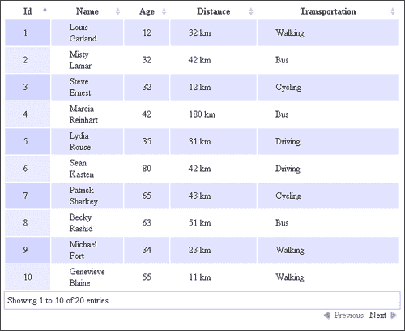

# 第一章：文本数据的显示

在本章中，我们将涵盖以下主题：

+   舍入数字以进行显示

+   填充数字

+   显示公制和英制测量单位

+   在用户的时区中显示格式化日期

+   显示已经过去的动态时间

+   显示数学

+   创建无限滚动列表

+   创建可排序的分页表

+   创建多选过滤器

+   创建范围过滤器

+   创建组合复杂过滤器

+   在 HTML 中显示代码

+   渲染 Markdown

+   自动更新字段

# 介绍

与 Web 应用程序开发相关的最常见任务是显示文本。本章将涵盖程序员在浏览器中显示数据时面临的一些问题，并将解释如何以简单而有效的方式解决这些问题，为程序员提供几种不同的选择。这些示例将包含标记的渲染或其他数据类型转换为纯文本。

# 舍入数字以进行显示

在文本之后，应用程序中使用的第二种最常见的数据类型是数字。有许多不同的处理数字的方式，当需要给定精度时，我们将看一些这些方式。第一个明显的选择是使用 JavaScript 的`Number`对象包装器来处理数值。

## 准备工作

`Number`对象包含`toFixed([digits])`方法，可用于显示数字；这里的`digits`参数可以在 0 和 20 之间取值。如果需要，数字将自动舍入，或者如果需要，数字将填充额外的零。好的，让我们看看它的效果。

## 如何做...

执行以下步骤来演示使用`Number`对象：

1.  首先，我们将创建一个数字列表；请注意，这些数字是有意挑选的，以说明一些函数的特性：

```html
    var listOfNumbers=
        [1.551, 1.556, 1.5444, 1.5454, 1.5464, 1.615, 1.616, 1.4, 1.446,1.45];
```

1.  迭代列表，并使用`.toFixed()`方法显示数字，分别使用`digits`参数的值 0、1 和 2：

```html
for (var i = 0; i < listOfNumbers.length; i++) {
      var number = listOfNumbers[i];
         // iterate over all of the numbers and write to output all the value
      document.write(number + "---"
                   + number.toFixed(2) + "---"
                   + number.toFixed(1) + "---"
                   + number.toFixed() + "<br />");
    };
```

## 它是如何工作的...

执行代码后得到的结果将打印出带有它们各自`toFixed`表示的数字，这应该很简单。

让我们来看一些特征值：

+   `1.616.toFixed(2)`将返回`1.62`

+   `1.4.toFixed(2)`将返回`1.40`，如预期的那样，添加一个尾随零

+   `1.5454.toFixed()`将返回`2`，因为`toFixed()`的默认值是`0`；这意味着没有小数点，另外`0.5`部分被舍入为`1`，所以这里使用了天花板值

+   `1.615.toFixed(2)`将返回`1.61`，忽略`0.005`部分，或者将使用地板值

`toFixed()`方法在大多数情况下都能按预期工作，只要我们不需要更高的精度或仅用它来显示数字，其中舍入的类型并不是关键。

此外，当我们需要在有类似 1.446 的数字的情况下进行舍入时，我们不能依赖于`toFixed()`; 调用`1.446.toFixed(1)`将导致不一致和不可预测的结果。

## 还有更多...

有各种方法可以解决这个问题。快速而肮脏的解决方案是重新定义`Number.prototype.toFixed()`函数，但我们鼓励您不要这样做，因为这样做可能会产生不明显的副作用。如果不是绝对必要，对内置对象的函数进行重新定义被认为是一种反模式。问题在于如果另一个库或一段代码使用相同的函数。另一个库可能期望我们重新定义的函数以某种方式工作。这些类型的重新定义很难跟踪；即使我们添加一个函数而不是重新定义它，其他人可能会做同样的事情。例如，假设我们决定向`Number`对象添加一些函数：

```html
Number.prototype.theFunction = function(arg1,arg2){}
```

没有保证其他人没有将`theFunction`添加到`Number`对象中。我们可以进行额外的检查来验证函数是否已经存在，但我们不能确定它是否会按我们希望的方式工作。

相反，使用一个实用函数来实现一致的数据将是一个更好的选择。

解决问题的一种方法是首先将数字乘以`10 ^ digits`，然后在结果上调用`Math.round(number)`方法，或者您可以调用`Math.ceil(number)`。例如，如果您需要将值向上舍入到最接近的整数，使用以下方法：

```html
    function round(number, digits) {
        if(typeof digits === "undefined" || digits < 0){
          digits = 0;
        }
        var power = Math.pow(10, digits),
         fixed = (Math.round(number * power) / power).toString();
        return fixed;
    };
```

现在，由于数字乘以`10 ^ digits`，然后四舍五入，我们不会观察到`toFixed()`的问题。请注意，这种方法与`toFixed()`的行为不同，不仅在处理舍入的方式上有所不同，而且还会添加尾随零。

另一个选择是使用一个类似 Big.js 这样的任意精度库，如果精度很重要的话（[`github.com/MikeMcl/big.js`](https://github.com/MikeMcl/big.js)）。

# 填充数字

有时我们需要将数字填充到一定的范围。例如，假设我们想要以五位数字的形式显示一个数字，比如`00042`。一个明显的解决方案是使用迭代方法并在前面添加字符，但还有一些更简洁的解决方案。

## 准备工作

首先，我们需要看一下我们将要使用的一些函数。让我们看一下`Array.join(separator)`方法，它可以用来从元素列表创建连接的文本：

```html
new Array('life','is','life').join('*')
```

这将导致`"life*is*life"`，显示了用给定分隔符连接的相当简单的元素。另一个有趣的方法是`Array.slice(begin[, end])`，它返回数组的一部分的副本。对于我们的用途，我们只对`begin`参数感兴趣，它可以具有正值和负值。如果我们使用正值，这意味着这将是使用基于零的索引的切片的起始索引；例如，考虑以下代码行：

```html
new Array('a','b','c','d','e','f','g').slice(4);
```

上面的代码将返回一个包含元素`'e'`、`'f'`和`'g'`的数组。

另一方面，如果对`begin`元素使用负值，则表示从数组末尾的偏移量，考虑以下使用负值的相同示例：

```html
new Array('a','b','c','d','e','f','g').slice(-3);
```

结果将是`'e'，'f'，'g'`，因为我们是从末尾切片。

## 如何做...

让我们回到我们的问题：如何为数字添加前导零创建一个干净的解决方案？对于迭代解决方案，我们创建一个接受数字、格式化结果的大小和用于填充的字符的方法；例如，让我们以`'0'`为例：

```html
function iterativeSolution(number,size,character) {
   var strNumber = number.toString(),
    len = strNumber.length,

    prefix = '';
   for (var i=size-len;i>0;i--) {
      prefix += character;
   }
 return prefix + strNumber;
}
```

在这里，我们将数字转换为字符串，以便获得其表示的长度；之后，我们简单地创建一个`prefix`，它将有`size-len`个字符的`character`变量，并返回结果`prefix + strNumber`，这是该数字的字符串表示。

您可能会注意到，如果`size`小于`len`，则会返回原始数字，这可能需要更改，以使该函数适用于这种特殊情况。

另一种方法是使用`Array.slice()`方法来实现类似的结果：

```html
function sliceExample(number,prefix){
   return (prefix+number).slice(-prefix.length);
}
sliceExample(42,"00000");
```

这将只是在数字前面添加一个前缀，并从末尾切掉多余的`'0'`，使解决方案更加简洁，并且还能够更灵活地确定前缀的内容。这样做的缺点是我们手动构造了将成为方法调用`sliceExample(42,"00000")`一部分的前缀。为了使这个过程自动化，我们可以使用`Array.join`：

```html
function padNumber(number,size,character){
  var prefix = new Array(1 + size).join(character);
```

我们创建一个预期的`size + 1`的数组，因为在连接时，我们将得到总数组`size-1 个连接的元素`。这将构造预期大小的前缀，而其他部分将保持不变：

```html
  return (prefix + number).slice(-prefix.length);
 }
```

一个示例方法调用将是`padNumber(42,5,'0')`; 这将不具有以前方法的灵活性，但在处理更大的数字时会更简单。

## 它是如何工作的...

这个配方相当简单，但需要注意的一点是功能性方法。如果有一件事可以从这个配方中带走的话，那就是迭代解决方案并不总是最好的。当涉及到 JavaScript 时，通常有几种其他完成任务的方法；它们并不总是*那么*直接，有时甚至不是更快，但它们可能更加干净。

## 还有更多...

如果由于某种原因我们经常填充数字，将函数添加到`Number`对象中并使用`this`关键字删除`input`参数数字可能是有意义的：

```html
Number.prototype.pad=function(size,character){
     //same functionality here
}
```

由于该函数现在是每个`Number`对象的一部分，我们可以直接从任何数字中使用它；让我们来看下面的例子：

```html
  3.4.pad(5,'#');
```

此外，如果不应包括“。”字符在填充的计算中，我们可以添加一个额外的检查，以减少前缀的大小。

### 注意

请注意，在*舍入数字以进行显示*配方中，我们解释了为什么向标准对象添加函数是一种可能会对我们产生反作用的黑客行为。

# 显示公制和英制测量

处理计算和测量的网站通常需要解决同时使用公制和英制计量单位的问题。本教程将演示一种数据驱动的方法来处理单位转换。由于这是一本 HTML5 书籍，解决方案将在客户端而不是服务器端实现。

我们将实现一个客户端，“理想体重”计算器，支持公制和英制测量。这一次，我们将创建一个更通用和优雅的数据驱动解决方案，利用现代 HTML5 功能，如数据属性。目标是尽可能抽象出混乱和容易出错的转换。

## 准备工作

计算体重指数（BMI）的公式如下：

BMI =（千克中的体重/（米中的身高 x 米中的身高））

我们将使用 BMI = 22 来计算“理想体重”。

## 如何做...

1.  创建以下 HTML 页面：

```html
<!DOCTYPE HTML>
<html>
    <head>
        <title>BMI Units</title>
    </head>
    <body>
        <label>Unit system</label>
        <select id="unit">
            <option selected value="height=m,cm 0;weight=kg 1;distance=km 1">Metric</option>
            <option value="height=ft,inch 0;weight=lbs 0;distance=mi 1">Imperial</option>
        </select><br>

        <label>Height</label>
        <span data-measurement="height" id="height">
            <input data-value-display type="text" id="height" class="calc">
            <span data-unit-display></span>
            <input data-value-display type="text" id="height" class="calc">
            <span data-unit-display></span>
        </span>
        <br>
        <label>Ideal Weight</label>
        <span data-measurement="weight" id="weight">
            <span data-value-display type="text">0</span>
            <span data-unit-display></span>
        </span> <br>

        <script src="img/jquery.min.js"></script>
        <script type="text/javascript" src="img/unitval.js"></script>
        <script type="text/javascript" src="img/example.js"></script>
        </script>
    </body>
</html>
```

这个页面看起来非常像我们为基于 BMI 的理想体重计算器制作的常规页面。主要区别如下：

+   我们有一个英制/公制选择输入

+   我们还有额外的自定义数据属性，为 HTML 字段赋予特殊含义

+   我们使用`data-measurement`来表示元素将显示的测量类型（例如，体重或身高）

+   我们使用`data-display-unit`和`data-display-value`来表示显示单位字符串和测量值的字段

1.  创建一个名为`example.js`的文件，其中包含以下代码：

```html
(function() {
    // Setup unitval
    $.unitval({
        weight: {
            "lbs": 0.453592, // kg
            "kg" : 1 // kg
        },
        height: {
            "ft"  : 0.3048, // m
            "inch": 0.0254, // m
            "m"   : 1, // m
            "cm"  : 0.01, // m
        }
    });
    $("#unit").change(function() {
        var measurementUnits = $(this).val().split(';').map(function(u) {
            var type_unitround = u.split('='),
                unitround = type_unitround[1].split(' ');
            return {
                type: type_unitround[0],
                units: unitround[0].split(','),
                round: unitround[1]
            };
        });
        // Setup units for measurements.
        $('body').unitval(measurementUnits);
    });

    $("#unit").trigger("change");

    $('#height').on('keyup change',function() {
        var height = $('#height').unitval(), bmi = 22;
        var idealWeight = bmi * height * height;
        $("#weight").unitval(idealWeight);
    });

}
```

代码的第一部分配置了一个名为`unitval`的 jQuery 插件，其中包含我们将使用的测量和单位的转换因子（体重和身高）。

第二部分通过从`select`字段中读取规范来设置文档的测量单位。它指定了一个测量数组，每个测量都有以下内容：

+   一个类型字符串，例如“身高”

+   单位列表，例如`["ft", "inch"]`

+   用于最后一个单位的小数位数

第三部分是一个常规计算器，几乎与没有单位转换时写的一样。唯一的例外是，值是使用名为`$.unitval`的 jQuery 插件从具有`data-measurement`属性的元素中获取的。

1.  我们将编写一个通用的单位转换器。它将需要两个函数：一个将用户显示（输入）数据转换为标准国际（SI）测量单位的函数，另一个将其从 SI 单位转换回用户友好的显示单位。我们的转换器将支持同时使用多个单位。在从输入转换时，第一个参数是测量类型（例如，距离），第二个是值-单位对的数组（例如，`[[5，'km']，[300，'m']]`），单个对（例如`[5，'km']`），或者只是值（例如`5`）。

1.  如果第二个参数是一个简单的值，我们将接受一个包含单位的第三个参数（例如`'km'`）。输出始终是一个简单的 SI 值。

在将值转换为所需的输出单位时，我们将单位指定为数组，例如，作为`['km', 'm']`或作为单个单位。我们还指定最后一个单位的小数位数。我们的输出是转换后的值数组。

转换是使用`Factors`对象中的值完成的。该对象包含我们将要使用的每个测量名称的属性。每个这样的属性都是一个对象，其中包含该测量的可用单位作为属性，其 SI 因子作为值。在`example.js`中查看示例。

1.  jQuery 插件`unitval.js`的源代码如下：

```html
(function() {
    var Factors = {};
    var Convert = window.Convert = {
        fromInput: function(measurement, valunits, unit) {
            valunits = unit ? [[valunits, unit]] // 3 arguments
                : valunits instanceof Array && valunits[0] instanceof Array ? valunits  
                : [valunits]; // [val, unit] array

            var sivalues = valunits.map(function(valunit) { // convert each to SI
                return valunit[0] * Factors[measurement][valunit[1]];
            });
            // sivalues.sum():
            return sivalues.reduce(function(a, e) { return a + e; });
        },
        toOutput: function(measurement, val, units, round) {
            units = units instanceof Array ? units : [units];
            var reduced = val;
            return units.map(function(unit, index) {
                var isLast = index == units.length - 1,
                    factor = Factors[measurement][unit];
                var showValue = reduced / factor;
                if (isLast && (typeof(round) != 'undefined'))
                    showValue = showValue.toFixed(round) - 0;
                else if (!isLast) showValue = Math.floor(showValue);
                reduced -= showValue * factor;
                return showValue;
            });
        }
    };
    $.unitval = function(fac) {
        Factors = fac;
    }
    // Uses .val() in input/textarea and .text() in other fields.
    var uval = function() {
        return ['input','textarea'].indexOf(this[0].tagName.toLowerCase()) < 0 ?
                this.text.apply(this, arguments) : this.val.apply(this, arguments);
    }
```

1.  我们的通用转换器很有用，但不太方便或用户友好；我们仍然必须手动进行所有转换。为了避免这种情况，我们将在元素上放置数据属性，表示它们显示的测量。在其中，我们将放置用于显示值和单位的单独元素。当我们设置测量单位时，函数`setMeasurementUnits`将在具有此数据属性的每个元素上设置它们。此外，它还将相应地调整内部值和单位元素：

```html
// Sets the measurement units within a specific element.
// @param measurements An array in the format [{type:"measurement", units: ["unit", ...], round:N}]
// for example [{type:"height", units:["ft","inch"], round:0}]
    var setMeasurementUnits = function(measurements) {
        var $this = this;
        measurements.forEach(function(measurement) {
            var holders = $this.find('[data-measurement="'+measurement.type+'"]');
            var unconverted = holders.map(function() { return $(this).unitval(); })
            holders.attr('data-round', measurement.round);
            holders.find('[data-value-display]').each(function(index) {
                if (index < measurement.units.length)    
                    $(this).show().attr('data-unit', measurement.units[index]);
                else $(this).hide();
            });
            holders.find('[data-unit-display]').each(function(index) {
                if (index < measurement.units.length)    
                    $(this).show().html(measurement.units[index]);
                else $(this).hide();
            });

            holders.each(function(index) { $(this).unitval(unconverted[index]); });
        });
    };
```

1.  由于每个元素都知道其测量和单位，因此我们现在可以简单地在其中放入 SI 值，并让它们显示转换后的值。为此，我们将编写`unitval`。它允许我们设置和获取“联合”值，或在具有`data-measurement`属性的元素上设置单位选项：

```html
    $.fn.unitval = function(value) {
        if (value instanceof Array) {
            setMeasurementUnits.apply(this, arguments);
        }
        else if (typeof(value) == 'undefined') {
            // Read value from element
            var first       = this.eq(0),
                measurement = first.attr('data-measurement'),
                displays    = first.find('[data-value-display]:visible'),
                // Get units of visible holders.
                valunits = displays.toArray().map(function(el) {
                    return [uval.call($(el)), $(el).attr('data-unit')] });
            // Convert them from input
            return Convert.fromInput(measurement, valunits);
        }
        else if (!isNaN(value)) {
            // Write value to elements
            this.each(function() {
                var measurement   = $(this).attr('data-measurement'),
                    round         = $(this).attr('data-round'),
                    displays      = $(this).find('[data-value-display]:visible'),
                    units         = displays.map(function() {
                        return $(this).attr('data-unit'); }).toArray();
  var values = Convert.toOutput(measurement, value, units, round);
                displays.each(function(index) { uval.call($(this), values[index]); });
            });
        }
    }
}());
```

此插件将在下一节中解释。

## 它是如何工作的...

HTML 元素没有测量单位的概念。为了支持单位转换，我们添加了自己的数据属性。这些属性允许我们赋予某些元素特殊的含义，其具体内容由我们自己的代码决定。

我们的约定是，具有`data-measurement`属性的元素将用于显示指定测量的值和单位。例如，具有`data-measurement="weight"`属性的字段将用于显示重量。

此元素包含两种类型的子元素。第一种类型具有`data-display-value`属性，并显示测量的值（始终是一个数字）。第二种类型具有`data-display-unit`属性，并显示测量的单位（例如，`"kg"`）。对于用多个单位表示的测量（例如，高度可以以“5 英尺 3 英寸”的形式表示），我们可以使用两种类型的多个字段。

当我们改变我们的单位制度时，`setMeasurementUnits`会向以下元素添加附加的数据属性：

+   `data-round`属性附加到`data-measurement`元素

+   向包含适当单位的`data-display-value`元素添加了`data-unit 属性`

+   `data-display-unit`元素填充了适当的单位

因此，`$.unitval()`知道我们页面上每个测量元素上显示的值和单位。该函数在返回之前读取并将测量转换为 SI。我们所有的计算都使用 SI 单位。最后，当调用`$.unitval(si_value)`时，我们的值会在显示之前自动转换为适当的单位。

该系统通过识别只有在读取用户输入和显示输出时才真正需要转换时，最小化了容易出错的单位转换代码的数量。此外，数据驱动的方法允许我们完全从我们的代码中省略转换，并专注于我们的应用逻辑。

# 在用户的时区中显示格式化的日期

在这个示例中，我们将学习如何在用户的本地时区中格式化并显示日期；此外，我们还将看到 JavaScript 中如何使用和表示日期。最好的方法是让用户选择他们希望日期显示的时区，但不幸的是，这很少是一个选项。

## 准备工作

就像大多数编程语言一样，JavaScript 使用 Unix 时间。这实际上是一种表示给定时间实例的系统，即自 1970 年 1 月 1 日午夜以来经过了多少秒或在 JavaScript 的情况下是毫秒，通常称为协调世界时的时间。

### 注意

关于 UTC 的一些有趣的小知识：缩写是法语版本 Temps Universel Coordonné和英语版本协调世界时之间的妥协，法语版本将是 TUC，英语版本将是 CUT。

这个数字实际上并不完全符合 UTC，也没有考虑到闰秒等各种非典型情况，但在大多数情况下这是可以接受的。

在 JavaScript 中，我们有`Date`对象，可以以不同的方式构造：

```html
new Date() // uses local time
new Date(someNumber) //create date with milliseconds since epoch
new Date(dateString) // create date from input string representation
new Date(year, month, day [, hour, minute, second, millisecond])
```

### 注意

请注意，在各种浏览器中，从字符串表示创建日期可能会有不同的行为，`Date.parse`方法解析字符串为日期也是如此。

在构造过程中，如果您提供了一些参数并省略了可选参数，它们将默认为零。还有一件事要注意的是，JavaScript 中的月份是基于零的，而日期不是。

### 注意

在 JavaScript 中，将`Date`对象作为函数而不是构造函数使用，使用`new Date(...)`，将导致您获得该日期的字符串表示，而不是获得`Date`对象，这与大多数其他 JavaScript 对象的预期不同。

## 如何做...

1.  您需要做的第一件事是创建`Date`对象：

```html
  var endOfTheWorld= new Date(1355270400000);
```

1.  然后，只需使用本地化的日期和时间表示：

```html
    document.writeln(endOfTheWorld.toLocaleDateString());
    document.writeln(endOfTheWorld.toLocaleTimeString());
```

1.  如果您需要知道用户时区与 UTC 之间的小时偏移量，可以使用以下代码：

```html
var offset = - new Date().getTimezoneOffset()/60;
```

1.  此偏移变量表示本地用户时区到 UTC 的小时数。这里的减号将逻辑反转为日期；这意味着差异将从日期到 UTC 而不是从 UTC 到日期。

## 它是如何工作的...

我们通常可以从服务器端返回毫秒表示，并在本地时区中格式化数字。因此，假设我们的 API 返回了毫秒`1355270400000`，实际上是 2012 年 12 月 12 日，也被称为世界末日日期。

日期的创建如下：

```html
var endOfTheWorld= new Date(1355270400000);
```

在本地字符串中打印时，有一些可用的选项；其中之一是`toLocaleDateString`：

```html
   endOfTheWorld.toLocaleDateString()
```

此方法使用底层操作系统来获取格式约定。例如，在美国，格式为月/日/年，而在其他国家，格式为日/月/年。对于我们的情况，世界末日是在“2012 年 12 月 12 日星期三”。您还可以使用适当的`getX`方法手动构造打印日期。

还有一种打印本地时间的方法叫做`toLocaleTimeString`，可以用在我们的世界末日日期上。因为这种方法也为我们使用操作系统的本地时间，所以它是 01:00:00，因为我们处于 UTC+1 时区。对我们来说，这意味着我们有一个额外的小时可以活着；或者也许不是？

为了获取本地用户的偏移量，`Date`对象中有一个名为`getTimezoneOffset()`的方法，它返回日期到 UTC 的时区偏移量（以分钟为单位）。问题在于没有小时的方法，此外，它是反直觉的，因为我们通常想要知道从 UTC 到给定日期的差异。

## 还有更多...

如果处理日期是您的应用程序中常见的事情，那么使用一个库是有意义的，比如**Moment.js**（[`momentjs.com/`](http://momentjs.com/)）。

Moment.js 提供了对国际化和更高级的日期操作的支持。例如，从当前日期减去 10 天只需使用以下代码即可完成：

```html
moment().subtract('days', 10).calendar();
```

要从今天的开始时间获取时间，请使用以下代码：

```html
moment().startOf('day').fromNow();
```

# 显示经过的动态时间

在每个主要网站上，通常都会有这些很棒的计数器，显示页面上各种元素的时间戳。例如，这可能是“您在 3 小时前打开了此页面”或“2 分钟前发表了评论”。这就是为什么，除了名称“动态经过的时间”，这个功能也被称为“时间过去”。

## 准备工作

我们将使用一个名为**timeago**的 jQuery 插件，专门为此目的设计，可以从[`timeago.yarp.com/`](http://timeago.yarp.com/)获取。

## 如何做…

我们将创建一个简单的页面，其中我们将通过执行以下步骤显示经过的时间：

1.  因为`timeago`是一个 jQuery 插件，我们首先需要包含 jQuery，然后添加`timeago`插件：

```html
 <script src="img/jquery.min.js">
 </script>
 <script src="img/jquery.timeago.js" type="text/javascript"></script>
```

1.  举个例子，添加以下 HTML：

```html
        <p> Debian was first announced <abbr class='timeago' title="1993-08-16T00:00:00Z">16 August 1993</abbr>
          </p>
          <p> You opened this page <span class='page-opened' /> </p>
           <p> This is done use the time element
              <time datetime="2012-12-12 20:09-0700">8:09pm on December 12th, 2012</time>
          </p>
```

1.  这将使我们能够对`timeago`插件提供的基本功能有一个概述。之后，让我们添加以下 JavaScript：

```html
 $(document).ready(function() {
          jQuery.timeago.settings.allowFuture = true;
          var now= new Date();
          $(".timeago").timeago();
          $(".page-opened").text( $.timeago(now));
          $("time").timeago();
          //$("some-future-date") $.timeago(new Date(999999999999));
      });
```

就是这样；现在您有一个完全工作的时间示例，它将计算自给定日期以来的时间并更新它，另外，与`page-opened`选择的第二部分将随着用户在页面上花费更多时间而自动更新。

## 它是如何工作的…

您可能想知道的第一件事是关于`abbr`和`time`标签。实际上，第一个是“缩写”的表示，并且可以选择性地为其提供完整的描述。如果存在完整的描述，`title`属性必须包含此完整描述，而不包含其他内容。完整的描述通常在浏览器中显示为工具提示，但这是一个标准。为什么我们选择`abbr`标签来显示时间？嗯，有一个名为`time`的新的 HTML5 时间元素，围绕它有一些争议，因为它被从规范中删除，但后来又被重新添加。这个元素在语义上更正确，而且以机器可读的格式表示日期，可以被浏览器用来启用类似“添加到日历”的功能。使用`abbr`元素的理由只支持旧的浏览器，但随着时间的推移，这变得越来越不相关。目前，大多数现代桌面和移动浏览器都支持语义上正确的`time`元素，即使 IE 9+也支持它。

其余的 HTML 由标准的、众所周知的标签和一些标记组成，例如为了以后选择这些元素而添加的不同 CSS 类。

让我们来看看 JavaScript；首先我们使用标准的 jQuery 文档准备好函数：

```html
$(document).ready(function() {
```

之后，我们将`allowFuture`的设置设置为`true`，以启用`timeago`插件与未来日期一起工作，因为这不是默认设置的：

```html
jQuery.timeago.settings.allowFuture = true;
```

如果`timeago`直接应用于选定的`abbr`或`time`元素，则我们无需做任何其他操作，因为计算是自动完成的：

```html
 $(".timeago").timeago();
 $("time").timeago();
```

您还可以注意到，我们可以直接从 JavaScript 中获取给定日期的文本，并以任何我们认为合适的方式处理它：

```html
$(".page-opened").text( $.timeago(now));
```

## 还有更多...

在处理国际化和本地化应用程序时，会有一些问题。其中之一是`timeago`自动处理的时区支持。我们唯一需要确保的是我们的时间戳遵循**ISO 8601**（[`en.wikipedia.org/wiki/ISO_8601`](http://en.wikipedia.org/wiki/ISO_8601)）时间格式，并具有完整的时区标识符（[`en.wikipedia.org/wiki/ISO_8601#Time_zone_designators`](http://en.wikipedia.org/wiki/ISO_8601#Time_zone_designators)）。另一个经常出现的问题是语言支持，但在这方面我们大多数都有覆盖，因为有许多语言的本地化版本的插件，甚至您可以创建自己的版本并贡献给社区。要做到这一点，您可以使用[`github.com/rmm5t/jquery-timeago/tree/master/locales`](https://github.com/rmm5t/jquery-timeago/tree/master/locales)上托管的代码。

还有一些其他执行类似工作的实现，例如*John Resig*的*pretty date*，可以在他的博客[`ejohn.org/blog/javascript-pretty-date/`](http://ejohn.org/blog/javascript-pretty-date/)上找到。

# 显示数学

在技术写作方面，我们经常希望在页面内显示数学公式。过去，这是通过在服务器上从某种标记创建图像来完成的，甚至是手动使用外部程序创建图像。自 MathML 引入以来，这就不再需要了；这样可以节省我们在解决布局问题上的时间，并使浏览器原生支持显示方程式。在撰写本书时，尽管大多数功能的规范已经可用了几年，但并非所有主要浏览器都支持 MathML。

显示数学

## 准备工作

**数学标记语言**（**MathML**）是一种应用程序描述公式的标准化方式，不仅旨在实现 Web 集成，还可用于其他应用程序。

W3C 维护了一个使用 MathML 的软件列表；可以在[`www.w3.org/Math/Software/`](http://www.w3.org/Math/Software/)找到。规范的几个修订是由工作组完成的（[`www.w3.org/Math/`](http://www.w3.org/Math/)），最新的是第 3 版（[`www.w3.org/TR/MathML3/`](http://www.w3.org/TR/MathML3/)）。

HTML5 增加了在 HTML 内嵌入 MathML 文档的支持。

在这个配方中，我们要描述一个公式，如前面π的连分数，使用 MathML，其中我们有一个不同表示*π*的示例。

## 如何做...

1.  我们将使用一个名为`MathJax`的库，可以从作者的 CDN 检索，也可以单独下载并包含在项目中。

```html
<script type="text/javascript"
      src="img/MathJax.js?config=TeX-AMS-MML_HTMLorMML">
 </script>
```

1.  我们可以通过添加以下 MathML 示例来继续：

```html
<math >
       <mrow>
           <mi>π</mi>
         <mo>=</mo>
         <mfrac>
            <mstyle scriptlevel="0">
              <mn>3</mn>
            </mstyle>
            <mstyle scriptlevel="0">
               <mrow>
                 <mn>7</mn>
                 <mo>+</mo>
                 <mfrac numalign="left">
                   <mstyle scriptlevel="0">
                     <msup><mn>1</mn></msup>
                   </mstyle>
                 </mfrac>
               </mrow>
            </mstyle>
         </mfrac>
      </mrow>
    </math>
```

元素的基本含义将在后面解释，但您可以注意到，示例在很少的嵌套级别后变得非常庞大，很难阅读。这是因为 MathML 从未打算手动创建，而是作为某些应用程序的格式来使用。

1.  那么，如果我们想启用可编辑的标记，对我们来说真正简单的选项是什么？嗯，最简单的选择是一种称为`ASCIIMath`的东西；为了启用它，我们需要改变请求中的`config`参数：

```html
<script type="text/javascript" src="img/MathJax.js?config=AM_HTMLorMML-full"> </script>
```

通常我们使用所有可能的输入格式和呈现选项的版本，但这样我们会遇到 JavaScript 文件大小的问题。

那么，使用`ASCIIMath`有多简单呢？嗯，我们之前解释的表达式可以用一行显示：

```html
 <p>
        `π = 3+1/(7+1/(15+1/(1+1/...)))`
 </p>
```

### 注意

请注意，表达式包含在[P37]"中，否则重音字符将被呈现为 HTML 和 CSS 或任何其他已配置的呈现方法。

## 还有更多...

`ASCIIMath`方法非常简单，并且在 Khan Academy（[`www.khanacademy.org/`](https://www.khanacademy.org/)）和 Math StackExchange（[`math.stackexchange.com/`](http://math.stackexchange.com/)）等主要网站上非常受欢迎。如果您有兴趣了解如何使用`ASCIIMath`，可以在其官方网页[`www1.chapman.edu/~jipsen/mathml/asciimath.html`](http://www1.chapman.edu/~jipsen/mathml/asciimath.html)上获取更多信息。使用`MathJax`，您还可以呈现其他标记格式语言，如 Tex 和 Latex。

### 注意

Tex 是由*Donald Knuth*制作的排版格式，目的是帮助他撰写他的著名书籍。另一方面，Latex 是一种使用 Tex 作为排版格式的文档标记。有关它们的更多信息可以在[`en.wikipedia.org/wiki/TeX`](http://en.wikipedia.org/wiki/TeX)和[`www.latex-project.org/`](http://www.latex-project.org/)上找到。

# 创建一个无限滚动列表

无限滚动列表是由社交网络网站（如 Facebook 和 Twitter）推广的。它们的目标是营造整个可用内容已经加载的假象。此外，通过这种技术，用户试图找到下一页按钮而导致的正常滚动中断可以避免。

同时，我们也希望避免不必要的带宽浪费；这意味着一次加载整套数据不是一个选择。

解决方案是监视用户的滚动并检测页面底部的接近。当用户足够接近底部时，我们可以通过将其附加到当前显示内容的末尾来自动加载下一页的内容。

## 准备工作

您必须已经有一个按页面提供内容的服务。此示例默认情况下可以工作，但要使其完全功能，需要一个实际的 HTTP 服务器，以便 Ajax 请求下一页的工作。

## 如何做...

让我们编写 HTML 页面、CSS 样式和 JavaScript 代码。

1.  创建一个名为`index.html`的文件，其中包含我们示例的完整 HTML、CSS 和 JavaScript 代码。我们需要在 HTML 文档中插入一个 DOCTYPE；否则，浏览器将以“怪癖模式”运行，高度测量函数`$(window).height()`将无法工作。

```html
<!DOCTYPE HTML>
```

我们将在页面中添加一个内容占位符元素：

```html
<div id="content"></div>
```

1.  为了演示目的，我们将添加以下 CSS 代码以使页面可见。可以跳过这个 CSS：

```html
div.page {
   min-height: 1200px;
   width: 800px;
   background-color:#f1f1f1;
   margin:0.3em;
   font-size: 3em;
}
div.error {
   color:#f00;
}
```

1.  最后，我们添加 JavaScript 代码。首先加载 jQuery：

```html
<script src="img/jquery.min.js">
</script>
```

然后我们可以添加我们的脚本：

```html
<script type="text/javascript">
(function() {
```

我们的页面获取器使用 null 错误参数和一个简单的包含页面编号的字符串（例如`Page 1`）来调用回调函数，但它也可以执行 Ajax 请求。有关如何修改它以进行 Ajax 请求的更多信息，请参见以下代码。

这个函数人为地限制了 10 页的内容。第十页后，回调函数将带有错误调用，表示没有更多可用页面：

```html
var page = 1;
function getPage(callback) {
   if (page <= 10)
       callback(null, 'Page ' + page);
   else
       callback("No more pages");
   page += 1;
};
```

1.  我们使用`triggerPxFromBottom`来指定何时开始加载下一页。当只剩下`triggerPxFromBottom`像素要滚动时，将开始加载下一页。它的值设置为`0`；这意味着用户必须到达当前可见页面的末尾才能触发加载过程：

```html
var currentlyLoading = false;
var triggerPxFromBottom = 0;
```

1.  `loadNext`将下一页附加到`#content` div 中。但是，如果回调函数带有错误调用，它将在页面的最后部分下方显示`没有更多内容`。错误事件发生后，将不再加载更多页面。这意味着当`getPage`返回错误时，我们的代码将停止加载新页面。这是期望的行为：

```html
function loadNext() {
   currentlyLoading = true;
   getPage(function(err, html) {
        if (err) {
            $("<div />")
                .addClass('error')
                .html("No more content")
                .appendTo("#content");
        } else {
            $("<div />")
                .addClass('page')
                .html(html).appendTo("#content");
            currentlyLoading = false;
        }
      });
}
```

1.  当页面以任何方式滚动时，将调用此事件处理程序。它计算剩余的滚动像素数。如果像素数足够小且代码当前未加载页面，则调用页面加载函数：

```html
$(window).on('scroll', function() {
    var remainingPx = $(document).height()
        - $(window).scrollTop()
        - $(window).height();
    if (remainingPx <= triggerPxFromBottom
        && !currentlyLoading)
        loadNext();
});
```

1.  最后，我们第一次调用`loadNext()`来加载第一页：

```html
loadNext();
}());
</script>
```

## 它是如何工作的...

浏览器的可见区域（也称为视口）具有自己的尺寸，可以通过调用 jQuery 的`$.fn.height()`函数来获取`$(window)`对象的高度。另一方面，`$(document).height()`为我们提供页面整个内容的高度。最后，`$(window).scrollTop()`给出滚动偏移量。

使用这些函数，我们可以计算剩余需要滚动的像素。然后，我们在用户滚动页面时重新计算和检查这个值。如果值足够小，我们调用我们的加载函数。同时，我们确保在当前加载过程完成之前停止加载新页面。（否则，用户的滚动操作可能会在等待内容加载时加载更多页面。）

## 还有更多...

这是`getPage`函数的一个可能的 Ajax 实现。该函数向在相同域上托管的请求处理程序发送 Ajax 请求，路径为`/pages/<number>`，以检索下一页的 HTML 内容：

```html
function getPage(cb) {
    $.get('/pages/' + page)
        .success(function(html) { cb(null, html); })
        .error(function() { cb("Error"); }
    page += 1;
}
```

要使此版本工作，您需要在服务器端代码中实现请求处理程序。

您的服务器端代码可以返回错误，比如 404，表示没有更多的内容可用。因此，jQuery 永远不会调用我们的成功回调，我们的代码将停止加载新页面。

无限滚动列表配方提供了很好的用户体验，但它有一个重大缺点。我们必须确保`contents`元素下面没有重要的页面内容。这意味着放在底部的页面元素（通常是页脚链接和版权信息）可能无法到达。

# 创建一个可排序的分页表

在创建网站时，我们遇到的最常见任务之一是显示列表和表格。大多数技术都侧重于服务器端的排序、分页和数据呈现。我们的解决方案完全在客户端，适用于小到中等数量的数据。客户端解决方案的主要好处是速度；排序和切换页面将几乎是瞬间完成的。

在这个配方中，我们将创建一个客户端可排序的分页表。

## 准备工作

我们假设一个服务以 JSON 对象的形式提供数据，其中包含一个`data`属性，该属性是一个数组的数组：

```html
{data:[["object1col1", "object1col2"], ["object2col1", "object2col2"],  …]}
```

在我们的示例中，我们将显示附近的人员列表。表中的每个人都有自己的 ID 号码、姓名、年龄、与我们的距离和交通方式。

我们将以公里为单位显示距离，并希望能够按姓氏对人员列表进行排序。

随着表格显示问题迅速超出最初的简单问题，我们不打算构建自己的解决方案。相反，我们将使用可在[`datatables.net/`](http://datatables.net/)上获得的出色的 jQuery DataTables 插件。

### 提示

**下载示例代码**

您可以从您在[`www.packtpub.com`](http://www.packtpub.com)的帐户中下载您购买的所有 Packt 图书的示例代码文件。如果您在其他地方购买了这本书，您可以访问[`www.packtpub.com/support`](http://www.packtpub.com/support)并注册，以便直接通过电子邮件接收文件。

## 如何做...

让我们编写 HTML 页面、CSS 样式和 JavaScript 代码。

1.  首先，我们将创建一个包含空表的 HTML 页面。我们还将添加一些 CSS 来导入表的基本 DataTables 样式。样式表通常随 DataTables 分发。我们的`index.html`文件如下：

```html
<!DOCTYPE HTML>
<html>
    <head>
        <title>Sortable paged table</title>
        <style type="text/css">
            @import "http://live.datatables.net/media/css/demo_page.css";
            @import "http://live.datatables.net/media/css/demo_table.css";
            #demo, #container {
                width:700px;
            }
            #demo td {
                padding: 0.2em 2em;
            }
            #demo_info {
                width:690px;
                height:auto;
            }
        </style>
    </head>
    <body>
        <div id="container">
            <table id="demo">
                <thead>
                    <tr>
                        <th>Id</th><th>Name</th><th>Age</th><th>Distance</th><th>Transportation</th>
                    </tr>
                </thead>
                <tbody>
                </tbody>
            </table>
        </div>
        <script src="img/jquery.min.js"></script>
        <script type="text/javascript" src="img/jquery.dataTables.min.js"></script>
        <script type="text/javascript" src="img/example.js"></script>
    </body>
</html>
```

示例包括一个链接到官方网站上托管的 DataTables 的缩小版本。

DataTables 插件在表格下方附加了`pager`和`info`元素。因此，我们需要将表格包装在一个`container`元素内。

1.  `example.js`文件如下：

```html
(function() {
    $.extend($.fn.dataTableExt.oSort, {
        "lastname-sort-pre": function (a) {
            return a.split(' ').reverse().join(' ');
        },
        "lastname-sort-asc": function(a, b) { return a < b ? -1 : a > b ? 1 : 0; },
        "lastname-sort-desc": function(a, b) { return a > b ? -1 : a < b ? 1 : 0; },
        "unitnumber-pre": function(a) { return new Number(a.split(' ')[0]); },
        "unitnumber-asc": function(a, b) { return a - b; },
        "unitnumber-desc": function(a, b) { return b - a; }
    } )
    var fetchData = function(callback) {
        var data = [
            [1,'Louis Garland', 12, 32, 'Walking'],
            [2,'Misty Lamar',32, 42, 'Bus'],
            [3,'Steve Ernest',32, 12, 'Cycling'],
            [4,'Marcia Reinhart',42, 180, 'Bus'],
            [5,'Lydia Rouse',35, 31, 'Driving'],
            [6,'Sean Kasten',80,42, 'Driving'],
            [7,'Patrick Sharkey',65,43, 'Cycling'],
            [8,'Becky Rashid',63, 51, 'Bus'],
            [9,'Michael Fort',34, 23, 'Walking'],
            [10,'Genevieve Blaine',55, 11, 'Walking'],
            [11,'Victoria Fry',58, 14, 'Walking'],
            [12,'Donald Mcgary',34, 15, 'Cycling'],
            [13,'Daniel Dreher',16, 23, 'Walking'],
            [14,'Valerie Santacruz',43, 35, 'Driving'],
            [15,'Jodi Bee',23, 13, 'Walking'],
            [16,'Jo Montana',14, 31, 'Cycling'],
            [17,'Stephanie Keegan',53, 24, 'Driving'],
            [18,'Philip Dewey',12, 29, 'Cycling'],
            [19,'Jack Clemons',11, 44, 'Walking'],
            [20,'Steve Serna',14, 60, 'Cycling']
        ];
        callback({data:data});
    };
    window.myTable = {};
    var table = window.myTable.table = $("#demo").dataTable({
        'bLengthChange': false, 'bFilter': false,
        'iDisplayLength': 10,
        'aoColumnDefs':[{
            aTargets: [3], // distance
            mRender: function(data) { return data + ' km'; },
            sType: 'unitnumber'
        }, {
            aTargets: [1],
            sType: 'lastname-sort'
        }]
    });
    var setData = window.myTable.setData = function(data) {
        table.fnClearTable();
        table.fnAddData(data);
        table.fnDraw();
    };

    fetchData(function(result) {
        window.myTable.data = result.data;
        setData(result.data);
    });

}());
```

示例中`fetchData`的实现提供了硬编码的示例数据。您可以轻松地将其替换为对您的服务的请求。`setData`函数是一个方便的函数，用于更改表数据——我们将使用相同的脚本，该脚本将调用此函数来设置其自己的数据，用于多个示例。最后，其余的代码是特定于 DataTables，并将在下一节中进行解释。

## 它是如何工作的...

以下图片显示了生成的表格：



要初始化表格，我们使用`dataTable`初始化函数。我们可以将多个选项传递给函数。例如，我们可以通过将`iDisplayLength`属性的值设置为`10`来指定每页 10 个项目。

因为我们要对**Distance**列（第 3 列）进行稍微不同于仅显示的渲染，所以我们在`aoColumnDefs`选项中为目标列 3 添加了一个项目，为该列设置了一个自定义渲染函数。这是一个简单地将`km`字符串附加到我们的数字的函数；但我们也可以使用更复杂的函数（涉及自定义日期格式化、单位转换等）。

分页在 DataTables 中自动工作——插件附加了一个分页控件，提供对上一页/下一页的访问。排序也大部分自动工作。然而，在我们的特定示例中，尽管**Name**列以"firstname lastname"的格式显示，但我们需要对其进行特殊排序（按姓氏）。为此，我们为该列指定了一个名为`lastname-sort`的自定义排序类型。我们还为**Distance**列指定了一个特殊的排序类型，称为`unitnumber`。

DataTables 允许我们定义自定义排序类型作为插件。自定义排序器具有以下属性：

+   在将其传递给排序器之前，对列值进行预处理的预处理函数

+   一个升序排序函数，根据传递的两个参数的值返回一个值：如果第一个值较小，则返回-1，如果它们相等，则返回 0，如果第一个值较大，则返回 1

+   一个与升序排序函数类似的降序排序函数

这些属性使我们能够按照**Name**列的姓氏进行排序，以及按照**Distance**列的数字进行排序。

## 还有更多...

这里是`fetchData`函数的一个简单 Ajax 替代，向托管在同一域上路径为`/people`的请求处理程序发送一个 Ajax 请求以检索数组数据：

```html
function fetchData(cb) {
    $.get('/people/').success(cb);
}
```

请注意，这种解决方案对于大型数据集效果不佳。虽然现代客户端具有处理大量数据的性能，但带宽也是一个考虑因素。在使用此解决方案之前，应仔细考虑带宽要求和目标客户端（桌面或移动）。

# 创建多选过滤器

在显示表格时的一个常见任务是将表格中的数据过滤为满足某些条件的子集。多选表格过滤器适用于具有有限数量值的列。例如，如果我们有一个包含某些人的数据的表，其中一列是人员使用的交通方式，则在该列上使用的过滤器将是多选过滤器。用户应该能够选择一个或多个交通方式，表视图将显示所有使用所选方式的人员。

## 准备就绪

我们将假设我们正在使用上一个示例中的代码和数据。我们有一个人员列表，他们的交通方式显示在一个可排序、分页的表中，使用 DataTables jQuery 插件。我们将复制上一个示例中的文件，然后对其进行补充。

我们需要过滤的数据已经在`tableData`全局变量中可用；我们可以过滤这些数据，然后使用全局的`tableSetData`函数来显示过滤后的表格。

过滤将在**交通**字段上进行。

## 如何做...

让我们修改上一个代码，向我们的表格添加多选过滤器：

1.  在上一个配方的`index.html`文件中，在开头的`<body>`标签后添加一个多选选择列表：

```html
<select id="list" style="width:100px;"  multiple>
</select>
```

1.  在关闭`</body>`标签之前为`filter.js`添加一个脚本元素：

```html
<script type="text/javascript" src="img/filter.js"></script>
```

1.  我们还将修改`example.js`末尾的`fetchData`调用，以触发自定义事件，通知任何观察者数据已经被获取并设置：

```html
$(function() {
    fetchData(function(result) {
        window.myTable.data = result.data;
        setData(result.data);
        $("#demo").trigger("table:data");
    });
});
```

代码被包装以在页面加载后执行，以便事件触发工作。在页面加载之前，无法触发任何事件。

1.  创建一个名为`filter.js`的文件，并添加以下代码：

```html
(function() {
    function getUnique(data, column) {
        var unique = [];
        data.forEach(function(row) {
            if (unique.indexOf(row[column]) < 0) unique.push(row[column]); });
        return unique;
    }

    function choiceFilter(valueList, col) {
        return function filter(el) {
            return valueList.indexOf(el[col]) >= 0;
        }
    }
    $("#demo").on('table:data', function() {
        getUnique(window.myTable.data, 4).forEach(function(item) {
            $("<option />").attr('value', item).html(item).appendTo("#list");
        });
    })
    $("#list").change(function() {
        var filtered = window.myTable.data.filter(
                choiceFilter($("#list").val(), 4));
        window.myTable.setData(filtered);
    });
}());
```

## 工作原理...

实现多选过滤器的最简单方法是使用多选选择元素。

当数据可用时，我们还需要填充元素。为此，我们在获取数据后触发我们的新自定义事件`table:data`。监听器从数据的**交通**列中提取唯一值，并用这些值为选择列表添加选项。

当选择发生变化时，我们提取所选值（作为数组），并使用`choiceFilter`创建一个新的过滤函数，这是一个高阶函数。高阶函数返回一个新的过滤函数。这个过滤函数接受一个表行参数，并在该行的第四列的值包含在指定列表中时返回`true`。

过滤函数被传递给`Array.filter`；它将此函数应用于每一行，并返回一个仅包含过滤函数返回`true`的行的数组。然后显示过滤后的数据，而不是原始数据。

# 创建范围过滤器

表格也可以通过其数字列进行过滤。例如，给定一个表格，其中每一行都是一个人，其中一列包含有关该人年龄的数据，我们可能需要通过指定年龄范围来过滤该表格。为此，我们使用范围过滤器。

## 准备工作

我们将假设我们正在使用*创建可排序的分页表*配方中的代码和数据。我们有一个人员名单，他们的年龄显示在一个可排序的分页表中，使用 DataTables jQuery 插件。我们将从配方中复制文件，然后添加一些额外的过滤代码。

我们需要过滤的数据已经在`tableData`全局变量中可用；我们可以过滤这些数据，然后使用`tableSetData`全局函数来显示过滤后的表格。

过滤将在**年龄**字段上进行。

## 如何做...

让我们修改上一个代码，向我们的表格添加范围过滤器：

1.  在上一个配方的`index.html`文件中，在开头的`<body>`标签后添加两个输入元素：

```html
 Age: <input id="range1" type="text">
 to <input id="range2" type="text"> <br>       
```

1.  在关闭`</body>`标签之前为`filter.js`添加一个脚本元素：

```html
<script type="text/javascript" src="img/filter.js"></script>
```

1.  最后，我们创建我们的`filter.js`脚本：

```html
(function() {
    function number(n, def) {
        if (n == '') return def;
        n = new Number(n);
        if (isNaN(n)) return def;
        return n;
    }
    function rangeFilter(start, end, col) {
        var start = number(start, -Infinity),
            end = number(end, Infinity);
        return function filter(el) {
            return start < el[col] && el[col] < end;
        }
    }
    $("#range1,#range2").on('change keyup', function() {
        var filtered = window.myTable.data.filter(
            rangeFilter($("#range1").val(), $("#range2").val(), 2));
        window.myTable.setData(filtered);
    });
}());
```

## 工作原理...

过滤数组数据的最简单方法是使用 JavaScript 内置的`Array.filter`函数。这是一个高阶函数；它的第一个参数是一个函数，它接受一个行参数，并在行应该添加到过滤后的数组时返回`true`，或者在行应该被排除时返回`false`。

为了提供这样的功能，我们创建自己的高阶函数。它接受开始和结束范围以及指定的列。返回结果是一个过滤每一行的函数。

为了忽略输入中的空值或无效值，我们使用`number`函数。如果输入字段为空或包含非数字数据，则提供默认值（范围的开始为`-Infinity`，结束为`+Infinity`）。这也使我们能够进行单侧范围过滤。

`Array.filter`函数返回通过过滤器的所有元素的数组。我们在表格中显示这个数组。

# 创建组合复杂过滤器

在显示表格时，我们有时希望使用涉及多个列的多个条件来过滤表格元素。例如，给定一个包含人员信息的人员表，例如他们的姓名、年龄和交通方式，我们可能只想查看年龄大于 30 岁且使用公交车交通的人。我们可能还想按姓名过滤人员。为此，我们必须同时对数据应用多个过滤器，例如年龄范围过滤器、多选过滤器和文本过滤器。这样做的最简单方法是创建一个过滤器组合函数。

## 准备工作

我们假设我们正在使用*创建可排序的分页表*配方中的代码，并且我们将根据前两个配方中描述的方式添加我们的过滤器。这次我们将允许组合过滤器。

## 如何做...

让我们修改前面的代码，向我们的表格添加多个过滤器：

1.  在开头的`<body>`标签后，我们将在页面中添加与过滤相关的输入：

```html
<select id="list" style="width:100px;"  multiple>
</select>
Age: <input id="range1" type="text">
to <input id="range2" type="text">,
Name: <input type="text" id="name"> <br>
```

1.  在关闭`</body>`标签之前添加`filter.js`脚本：

```html
<script type="text/javascript" src="img/filter.js"></script>
```

1.  我们将修改`example.js`，在页面加载后获取数据并在显示数据后触发`table:data`事件：

```html
    $(function() {
        fetchData(function(data) {
            window.myTable.data = data;
            setData(data);
            $("#demo").trigger("table:data");
        });
    });
```

1.  然后我们可以通过组合前两个配方中的代码来创建`filter.js`：

```html
(function() {
    function getUnique(data, column) {
        var unique = [];
        data.forEach(function(row) {
            if (unique.indexOf(row[column]) < 0)
                unique.push(row[column]);
        });
        return unique;
    }
    function choiceFilter(valueList, col) {
        return function filter(el) {
            return valueList.indexOf(el[col]) >= 0;
        }
    }
    function number(n, def) {
        if (n == '') return def;
        n = new Number(n);
        if (isNaN(n)) return def;
        return n;
    }
    function rangeFilter(start, end, col) {
        var start = number(start, -Infinity),
            end = number(end, Infinity);
        return function filter(el) {
            return start < el[col] && el[col] < end;
        };
    }
    function textFilter(txt, col) {
        return function filter(el) {
            return el[col].indexOf(txt) >= 0;
        };
    }
    $("#demo").on('table:data', function() {
        getUnique(window.myTable.data, 4)
        .forEach(function(item) {
            $("<option />").attr('value', item)
                .html(item).appendTo("#list");
        });
    });
    var filters = [null, null, null];
    $("#list").change(function() {
        filters[0] = choiceFilter($("#list").val(), 4);
        filterAndShow();
    });
    $("#range1,#range2").on('change keyup', function() {
        filters[1] = rangeFilter($("#range1").val(),
            $("#range2").val(), 2);
        filterAndShow();
    });
    $("#name").on('change keyup', function() {
        filters[2] = textFilter($("#name").val(), 1); filterAndShow();
    });
    function filterAndShow() {
        var filtered = window.myTable.data;
        filters.forEach(function(filter) {
            if (filter) filtered = filtered.filter(filter);
        });
        window.myTable.setData(filtered);
    };
}());
```

## 它是如何工作的...

与之前的配方一样，我们使用`Array.filter`函数来过滤表格。这次我们连续应用多个过滤器。我们将所有过滤函数存储在一个数组中。

每当输入发生变化时，我们更新适当的过滤函数，并重新运行`filterAndShow()`来显示过滤后的数据。

## 还有更多...

DataTables 是一个高度灵活的表格库，具有许多选项和丰富的 API。更多信息和示例可以在官方网站[`www.datatables.net/`](http://www.datatables.net/)上找到。

# 在 HTML 中显示代码

在 HTML 中显示代码或甚至在 HTML 中显示 HTML 代码是一种常见需求，特别是在技术文档或博客中。这已经做过太多次，通过从格式化代码中获取图像并将其作为页面的一部分。图像中的代码可能不会被搜索引擎捕捉到。此外，它可能限制我们到特定的页面布局或屏幕尺寸，而在今天的移动革命中，这不是一个选择。

## 准备工作

这个配方的唯一要求是要显示的数据需要被正确转义；这意味着`<p>awesome </p>`需要被转换为`&lt;p&gt;awesome &lt;/p&gt;`。这可以在服务器端完成，也可以在保存之前进行转义。

## 如何做...

1.  我们将使用**Google 代码美化**，因为在发言时，这个库在任何 CDN 上都不完全可用；你可以从[`code.google.com/p/google-code-prettify/`](http://code.google.com/p/google-code-prettify/)获取它。

1.  之后，我们可以在`<pre /> <code />`块中添加转义代码：

```html
<body onload="prettyPrint()">
     <div>
          <pre class="prettyprint">
            <code>
              SELECT *
              FROM Book
              WHERE price &lt; 100.00
              ORDER BY name;
            </code>
          </pre>
        </div>
</body>
```

1.  这两个标签中的任何一个都必须包含`prettyprint` CSS 类。除此之外，我们还需要包含`onload="prettyPrint()"`属性。

1.  还有一个选项，可以从 JavaScript 中添加的其他事件监听器中调用`prettyPrint`函数：

```html
<script>
       window.addEventListener('load', function (e){
          prettyPrint();
       }, false);
       </script>
```

## 它是如何工作的...

`prettyprint`类会自动选择所有标记有适当 CSS 类的块，并自动检测所使用的编程语言，然后进行高亮显示。

词法分析器应该适用于大多数语言；在常见语言中，有特定语言的自定义脚本，例如基于 lisp 的语言。

## 还有更多...

因为`prettyprint`自动检测源语言，如果我们想要获得更好的结果，我们可以自行指定。例如，如果我们想要显示 XML，代码将如下所示：

```html
<pre class="prettyprint"><code class="language-xml">...</code></pre>
```

大多数常见语言都有 CSS 类。

`prettyprint`是其中一个较旧的可用脚本，还有一些替代方案可以提供更多的自定义选项和更好的 JavaScript API。

其中一些，如**SyntaxHighliger** ([`alexgorbatchev.com/SyntaxHighlighter/`](http://alexgorbatchev.com/SyntaxHighlighter/))，**Rainbow** ([`craig.is/making/rainbows`](http://craig.is/making/rainbows))，和**Highlight.js** ([`softwaremaniacs.org/soft/highlight/en/`](http://softwaremaniacs.org/soft/highlight/en/))，通常可以在大多数网站上找到。

# 渲染 Markdown

Markdown 是一种流行的轻量级标记语言。这种语言类似于维基标记（在维基百科上使用），强调简单性。它的主要目的是让用户编写纯文本并获得格式化的 HTML 输出。因此，它被流行的网站使用，如 Reddit、Stack Overflow、GitHub，以及各种论坛，作为不太直观的 BBCode 格式的替代品。

Markdown 是为我们的用户启用格式化文本输入的最快方式，而无需将完整的 HTML 编辑器嵌入页面。有多个库可以渲染 markdown；在这个示例中，我们将使用简单的`markdown-js`脚本来实时渲染 markdown。

## 如何做...

渲染 markdown 非常简单。一个最简单的例子如下：

```html
<!DOCTYPE HTML>
<html>
    <head>
        <title>Render markdown</title>
        <style type="text/css">
            #markdown, #render { width: 48%; min-height:320px; }
            #markdown { float: left; }
            #render { float: right; }
        </style>
    </head>
    <body>
        <textarea id="markdown">
# Markdown example.
This is an example of markdown text. We can link to [Google](http://www.google.com)
or insert Google's logo:


## Text formatting
We can use *emphasis* or **strong** text,
> insert a quote
etc.</textarea>
        <div id="render"></div>
        <script src="img/jquery.min.js"></script>
        <script src="img/markdown.js"></script>
        <script type="text/javascript">
            function rendermd(val) { $("#render").html(markdown.toHTML($("#markdown").val())); }
            $("#markdown").on('keyup', rendermd); $(rendermd);
        </script>
    </body>
</html>
```

## 它是如何工作的...

当页面加载时，`textarea`元素中的 markdown 文本将被渲染到右侧的`#render`元素中。每次按键都会导致脚本更新渲染的元素。

## 还有更多...

从官方网站[`daringfireball.net/projects/markdown/`](http://daringfireball.net/projects/markdown/)了解更多关于 markdown 格式的信息。

# 自动更新字段

这些天，在字段上自动更新是很常见的，其中一个部分是给定选择的结果，或者显示给定的图像或文本块。其中一个例子是密码强度计算；例如，在谷歌上搜索“货币转换器”会在结果中显示一个框，你可以在其中进行美元和欧元之间的货币转换。以这种方式链接字段是有意义的，当我们有两个或更多逻辑上相关的字段，或者一个是另一个的结果形式时。

为了演示这一点，我们将创建一个温度转换器，其中更新一个字段将导致另一个字段的更改，因为这些值是相关的。

## 准备工作

对于这个示例，我们只需要对 jQuery 有基本的了解，并且有一个简单的公式来在摄氏度和华氏度之间进行转换：

```html
Celsius = (Fahrenheit -32) x (5/9)
```

或者：

```html
Fahrenheit = Celsius  x(9/5) +32
```

## 如何做...

1.  首先，我们将创建 HTML 部分，并创建两个将自动更新并添加适当标签的输入字段：

```html
<div>
<label for='celsius'>C&deg;</label>
<input id='celsius' type='text' /> =
<label for='fahrenheit'>F&deg;</label>
<input id='fahrenheit' type='text' />
</div>
```

1.  之后，我们必须确保已经包含了 jQuery：

```html
<script src="img/jquery.min.js"> </script>
```

1.  接下来，我们可以添加处理字段之间绑定的脚本：

```html
$(document).ready(function() {
  $('#celsius').keyup(function(data) {
  var celsius = new Number(data.currentTarget.value);
  var farenheit =celsius *(9/5) + 32;
    $('#farenheit').val(farenheit);
    });
   $('#farenheit').keyup(function(data) {
       var farenheit = new Number(data.currentTarget.value);
    var celsius =(farenheit-32)*(5/9);
     $('#celsius').val(celsius);
     });
        });
```

这将连接并自动计算温度的前后。

## 它是如何工作的...

首先让我们看一下显示部分，这里没有什么特别的；我们使用一个简单的文本输入类型，并为每个字段添加适当的标签。此外，我们可以使用转义字符`&deg;`来显示度字符。

如果我们看一下 jQuery `keyup`事件，我们会发现它在用户释放键盘上的键时执行。这个事件可以附加在任何 HTML 元素上，但只有在元素处于焦点时才会起作用；因此，它在输入元素上使用起来更有意义。由于`keyup`事件有一个选项来执行一个将接受事件对象的函数，所以对于我们的情况，它如下所示：

```html
$('#celsius').keyup(function(event) {
```

在`event`对象中，我们可以访问触发事件的元素并访问其值：

```html
event.currentTarget.value
```

之后，我们可以进行计算（*摄氏度*(9/5) + 32*）并将结果设置为另一个元素的值，以便在华氏度中显示：

```html
$('#fahrenheit').val(fahrenheit);
```

由于我们希望绑定可以双向工作，我们也可以在华氏度的输入字段上做同样的事情：

```html
$('#farenheit').keyup(function(event) {
```

当然，你需要使用适当的公式（*华氏度-32）*（5/9)*）来返回到摄氏度。

## 还有更多...

这个食谱展示了如何简单地使用 jQuery `event`来实时更新输入文本，它也可以用于创建自动完成框或功能，比如谷歌的即时搜索。这里的想法是，我们可以并且应该为各种 HTML 元素使用单向或双向绑定，特别是当我们谈论派生数据或数据是同一来源的表示时。
