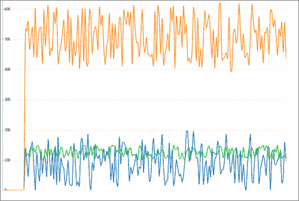
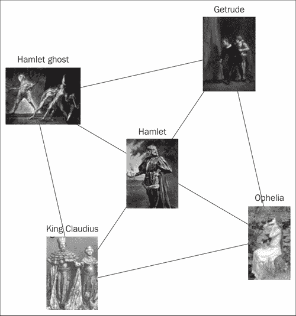
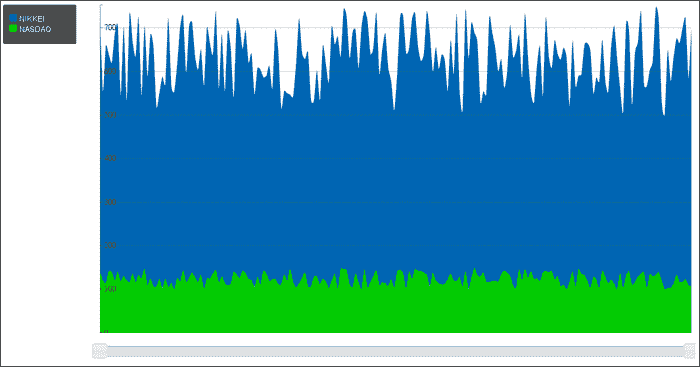
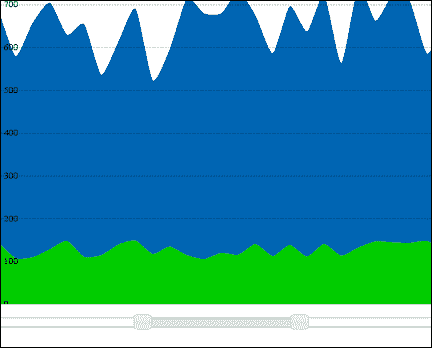
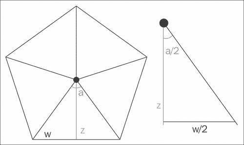
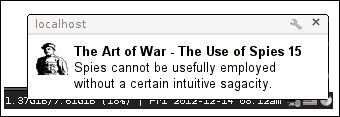
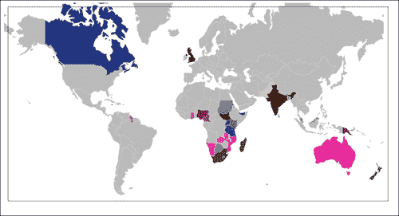
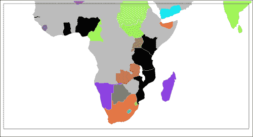

# 第三章：动画数据显示

在本章中，我们将涵盖以下食谱：

+   制作运动图表

+   显示力导向图

+   制作实时范围图表过滤器

+   制作图像轮播

+   缩放和平移图表

+   使用 Web 通知 API

+   从数据集创建交互式地理图表

# 介绍

我们都生活在一个信息时代，每天都会产生大量数据。这种过量的数据急需以用户可访问的格式呈现。

本章将涵盖一些常见的动画数据可视化方法，带有轻微的交互。大多数示例将是数据驱动文档，绑定到页面上的 D3，以及一些其他动画数据显示方法。

### 注意

在整本书中，我们都使用 D3，所以了解一些它的起源是很好的。Mike Bostock，这个杰出的核心作者，创建了这个库，作为他在博士研究期间创建的一个库 Protovis 的继任者，考虑到了 Web 标准并进行了性能改进。他还在他的网站[`bost.ocks.org/mike/`](http://bost.ocks.org/mike/)上提供了一个令人惊叹的可视化列表，大部分是为纽约时报做的。

# 制作运动图表

在处理基于时间的数据时，通常希望有一个视图，其中时间变化将被可视化。一种方法是使用随时间更新的运动图表，这就是我们将用这个食谱创建的内容。



## 准备工作

我们将使用一个用于创建交互式图表的工具包**Rickshaw**，可以从[`code.shutterstock.com/rickshaw/`](http://code.shutterstock.com/rickshaw/)获取，并且也是示例代码的一部分。除此之外，我们还需要包括`D3.js`，因为 Rickshaw 是建立在其之上的。

## 如何做...

为了创建这个食谱，我们将添加 JavaScript 代码，随机生成数据，并使用 Rickshaw 创建一个交互式图表。

1.  首先，我们在头部添加外部 JavaScript 和 CSS。按照惯例，我们可以将供应商库放在一个单独的文件夹`js/vendor/和 css/vendor/`中。

```html
<!doctype html>
<head>
  <link type="text/css" rel="stylesheet"href="css/vendor/graph.css">
  <title>Motion chart</title>
  <script src="img/d3.v2.js"></script>
  <script src="img/rickshaw.js"></script>
</head>
```

1.  我们在 body 部分添加图表的占位符。

```html
<div id="content">
  <div id="chart"></div>
</div>
```

1.  我们继续主要部分，即`js/example.js`文件，我们首先创建一个调色板，然后是刷新率。

```html
(function () {
  //create a color palette
    var palette = new Rickshaw.Color.Palette({scheme: 'munin' });
  // we set the refresh rate in milliseconds
    var refreshRate = 500;
```

1.  下一步是使用大小为`900px` x `600px`的 SVG 创建`Rickshaw.Graph`，类型为`line`。我们使用之前选择的刷新率和指定的调色板。

```html
// create graph
var graph = new Rickshaw.Graph({
  element: document.getElementById("chart"),
  width: 900,

height: 600,
  renderer: 'line',
  series: new Rickshaw.Series.FixedDuration(
    [
      { name : 'one' },
      { name : 'two' },
      { name : 'three' }
    ], palette, {
      timeInterval: refreshRate,
      maxDataPoints: 50
      }
    )
  });
```

1.  接下来，我们可以在创建的图表中添加 Y 轴。

```html
var yAxis = new Rickshaw.Graph.Axis.Y({
  graph: graph
});
```

因为我们创建了所需的对象，它们可以通过调用`.render`在屏幕上呈现。

```html
graph.render();
yAxis.render();
```

1.  我们需要数据来显示，所以我们将生成一些随机数据，并将其添加到图表中。为了延迟添加数据，可以使用 setInterval 在 refreshRate 周期上。

```html
//random util
function getRandomInRange(n){
  return Math.floor(Math.random() * n);
}
// generate random data and add it to the graph
setInterval( function() {
  var data = {
    one: getRandomInRange(50) + 100,
    two: Math.abs(Math.sin(getRandomInRange(30)+1) ) *(getRandomInRange(100) + 100),
    three: 400 + getRandomInRange(110)*2
  };
  graph.series.addData(data);
  //update
  graph.render();  yAxis.render();
}, refreshRate );
```

在这一点上，我们应该看到类似于食谱开头所示的图形。

## 它是如何工作的...

我们选择的`Rickshaw.Color.Palette`是`munin`方案。还有其他调色板可供选择，例如`spectrum14`或`cool`。调色板用于简化和自动选择图表的颜色。例如，如果我们手动多次调用`.color()`方法。

```html
palette.color()
"#00cc00"
palette.color()
"#0066b3"
palette.color()
"#ff8000"

```

它将始终返回下一个颜色。调色板是一组预定义的颜色，可以在给定的规则集之间选择。例如，原始的任天堂 Game Boy 有四种绿色的阴影，可以用来显示所有的游戏。如果我们看一下 Rickshaw 中调色板的实现，我们会注意到它们只是一系列颜色。以下是 Rickshaw 源代码中调色板`cool`的定义片段：

```html
this.schemes.cool = [
  '#5e9d2f',
  '#73c03a',
  '#4682b4',
  '#7bc3b8',
  '#a9884e',
  '#c1b266',
  '#a47493',
  '#c09fb5'
  ];
```

如果我们看一下`Rickshaw.Graph`的创建，除了 SVG 大小，我们选择了 ID 为`chart`的元素，图表将在其中呈现。

```html
element: document.getElementById("chart")
```

此外，我们将`renderer`类型设置为`line`，但也可以设置为`area`，`stack`，`bar`或`scatterplot`，具体取决于结果。

对于`series`属性，我们使用以下代码片段：

```html
series: new Rickshaw.Series.FixedDuration([
  {name: 'one'},
  {name: 'two'},
  {name: 'three'}
  ], palette, {
  timeInterval: refreshRate,
  maxDataPoints: 50
  })
```

第一个参数是带有数据名称的数组，然后是调色板，最后是选项对象，我们在其中设置了更新`timeInterval`。另外，`maxDataPoints`设置为`50`，这表示当前显示的数据样本数，也就是我们将显示最后 50 个对象。

之后，我们第一次在`graph`和`yAxis`对象上调用了`.render()`方法，然后在`setInterval()`方法中，我们在每次数据变化时调用了它们的重新渲染。我们构建的渲染数据格式如下：

```html
var data = {
  one: someNumber,
  two: someNumber,
  three:  someNumber
  };
```

前面的格式表示了特定时间点的三行值。

这个数据对象被传递到系列中，使用了`Rickshaw.Series.FixedDuration`定义的`addData()`方法，设置了`series`属性的最新更新。

```html
graph.series.addData(data);
```

如果我们需要获取所有显示帧的当前数据，我们可以调用`graph.series.dump()`方法。

例如，这将返回以下结果：

```html
Object:
 color: "#00cc00"
 data: Array[50]
 name: "one"

```

## 还有更多...

有各种方法可以自定义`chart` ID：过滤信息，添加控件，或者从远程服务器提供数据。如果我们想要附加一个图例，我们可以在图形渲染之前简单地创建这样一个对象，并将其附加到我们的图形对象上。

```html
var legend = new Rickshaw.Graph.Legend({
  element: document.getElementById('legend'),
  graph: myGraph
  });
```

# 显示力导向图

在这个示例中，我们将创建一个图表，其中包含*威廉·莎士比亚*的戏剧*哈姆雷特*中的一些角色。想法是以一种有趣和互动的方式可视化角色之间的联系。将被可视化的图表类型被称为**力导向**图。



## 准备就绪

为了可视化角色之间的联系，它们需要以某种方式存储。有一个名为`data.json`的示例文件，是代码示例的一部分，您可以使用它。尽管我们鼓励您创建自己的示例数据，或者至少玩弄现有的数据，但出于简单起见，我们将使用代码示例中提供的数据。

## 如何做...

我们将创建一个 JSON 文件，包含关系和图像信息，HTML 和相关的 JavaScript。

1.  首先，我们可以开始创建食谱的数据。我们可以定义`nodes`列表，其中对象将被放置，具有`name`属性，指定节点的名称，**icon**将是图像的 URL，group 将是

```html
{
  "nodes": [
    {
      "name": "Hamlet",
        icon":"http://upload.wikimedia.org/wikipedia/commons/thumb/4/4e/Bernhardt_Hamlet2.jpg/165px-Bernhardt_Hamlet2.jpg"
    },
    {
      "name": "King Claudius",
      "icon": "http://upload.wikimedia.org/wikipedia/commons/thumb/b/b4/Massalitinov_and_Knipper_in_Hamlet_1911.jpg/167px-Massalitinov_and_Knipper_in_Hamlet_1911.jpg"
    },
```

1.  在添加数据中的节点之后，我们还需要关于它们如何连接的信息。为此，我们将向模型添加一个`links`列表。

```html
"links": [
  {
    "source": 1,
    "target": 0
  }
  {
    "source": 3,
    "target": 0
  }
]
```

1.  现在我们可以继续创建 HTML 文件。对于这个实现，我们将使用`D3.js`，所以我们需要包含它，并设置两个 CSS 类，一个用于链接，另一个用于节点文本。

```html
<script src="img/d3.v2.min.js"></script>
<style>
.link {
  stroke: #aaa;
}
.node text {
  pointer-events: all;
  font: 14px sans-serif;
  cursor: pointer;
  user-select: none;
}
</style>
```

1.  之后，我们可以开始在主脚本中添加部分。与之前的示例一样，我们首先将 SVG 添加到`body`元素中，并设置一些预定义的大小。

```html
(function (){
  var width = 960,    height = 600;
  var svg = d3.select("body").append("svg")
  .attr("width", width)
  .attr("height", height);
}
```

1.  现在我们可以为图形创建布局。

```html
var force = d3.layout.force()
.gravity(.04)
.distance(350)
.charge(-200)
.size([width, height]);
```

1.  下一步是将 JSON 文档中的数据映射到力布局，并创建所有的`links`和`nodes`。

```html
d3.json("data.json", function(json) {
  force.nodes(json.nodes)
  .links(json.links)
  .start();
  var link = svg.selectAll(".link")
  .data(json.links)
  .enter().append("line")
  .attr("class", "link");
  var node = svg.selectAll(".node")
  .data(json.nodes)
  .enter().append("g")
  .attr("class", "node")
  .call(force.drag);
}
```

1.  然后我们从模型中附加`image`，定义为`icon`和节点名称的`text`。

```html
node.append("image")
.attr("xlink:href", function(d){return d.icon;})
.attr("x", -32)
.attr("y", -32)
.attr("width", 100)
.attr("height", 100);

node.append("text")
.attr("dx", -32)
.attr("dy", -32)
.text(function(d) { return d.name });
```

1.  此外，对于力的变化和更新，我们将设置一个监听器，用于更新链接和节点位置。

```html
force.on("tick", function() {
  link.attr("x1", function(d) { return d.source.x; })
  .attr("y1", function(d) { return d.source.y; })
  .attr("x2", function(d) { return d.target.x; })
  .attr("y2", function(d) { return d.target.y; });

  node.attr("transform", function(d) { return "translate(" + d.x + "," + d.y + ")"; });
  });
}());
```

## 它是如何工作的...

首先，我们将看一下 CSS，更具体地说是我们设置为`all`的`pointer-events`。这个设置使元素成为鼠标事件的目标，当指针在内部或边缘上时，只能用在 SVG 元素上。为了禁用文本的选择，我们使用 CSS 属性`user-select`，并将其设置为`none`的值。

### 提示

`user-select`在各个浏览器中不一致，为了使用它，我们可以添加特定于浏览器的 CSS hack，例如以下内容：

```html
-webkit-touch-callout: none;
-webkit-user-select: none;
-khtml-user-select: none;
-moz-user-select: none;
-ms-user-select: none;
user-select: none;
```

此处使用的布局是`d3.layout.force()`，它不会创建固定的视觉表示，而是我们定义参数，如`friction`、`distance`和`gravity strength`。根据数据和鼠标交互，我们会得到不同的视图。

```html
var force = d3.layout.force()
.gravity(.04)
.distance(350)
.charge(-200)
.size([width, height]);
```

在设置参数和关于`links`和`nodes`的数据信息后构建布局时，我们需要调用`start()`方法。

```html
force.nodes(json.nodes)
.links(json.links)
.start();
```

我们想要为数据中的所有节点创建`g`元素，并设置适当的 CSS 类`node`。

```html
var node = svg.selectAll(".node")
.data(json.nodes)
.enter().append("g")
.attr("class", "node")
.call(force.drag);
```

还要添加一个行为，以允许使用`.call(force.drag)`进行交互拖动。

`g`元素表示一个容器，可用于对其他元素进行分组。应用于`g`元素的转换也会应用于其所有子元素。这个特性使得该元素成为组织不同视图块的好选择。

### 注意

有关`g`元素的更多信息可以在 SVG 规范中找到[`www.w3.org/TR/SVG/struct.html#Groups`](http://www.w3.org/TR/SVG/struct.html#Groups)。

`force.drag()`方法在`d3.layout.force()`方法中预定义。拖动事件固定在`mouseover`上，以允许捕捉移动节点。当接收到`mousedown`事件时，节点被拖动到鼠标位置。有趣的是，这种行为支持来自移动设备（如 iOS 或 Android）的触摸事件。为了在拖动时禁用节点的点击事件，我们捕获并阻止了`mouseup`事件的传播。

要为节点创建图像，我们使用 SVG `image`标签，并使用`xlink:href`将 URL 添加到存储在`d.icon`中的数据。

```html
node.append("image")
.attr("xlink:href", function(d){return d.icon;})
```

为了从布局中获得更新，每次可视化的每个刻度都会分派`tick`事件。为了保持元素更新，我们为该事件添加了一个监听器。

```html
force.on("tick", function() {
  link.attr("x1", function(d) { return d.source.x; })
  .attr("y1", function(d) { return d.source.y; })
  .attr("x2", function(d) { return d.target.x; })
  .attr("y2", function(d) { return d.target.y; });
  node.attr("transform", function(d) { return "translate(" + d.x + "," + d.y + ")"; });
  });
```

监听器为`link`和`node`的移动设置了正确的位置。

## 还有更多...

这里更明显的选项之一是为可视化添加更多交互。节点可以被制作成可折叠的，还可以为节点添加链接。节点之间的关系可以设置为更细粒度的级别。有多种方法可以使数据随时间刷新并重新加载图表的某些部分。如果需要，可以预设期望的布局，以便节点将尝试确认某个特定的位置。

### 注意

从[`github.com/mbostock/d3/wiki/Force-Layout`](https://github.com/mbostock/d3/wiki/Force-Layout)了解更多关于 D3 力导向布局和相关功能的信息。

# 制作实时范围图表过滤器

在处理大量数据时，通常希望添加一些过滤或选择要显示的数据的方法。本教程将涵盖图形的简单范围过滤器和显示时间变化数据系列的图表。



## 准备工作

我们将使用与*制作动态图表*教程相同的工具包来创建交互式图表。必要的库 Rickshaw 可以从[`code.shutterstock.com/rickshaw/`](http://code.shutterstock.com/rickshaw/)获取，并且也是示例代码的一部分。除此之外，我们还需要 D3，因为 Rickshaw 是基于 D3 的。

## 操作步骤

我们将创建一个包含 JavaScript 文件的 HTML 页面，同时为图形生成随机数据，并添加额外的过滤元素。

1.  首先，我们将制作一个 HTML 页面，并包含所需的库的 CSS。

```html
<!DOCTYPE html>
  <html>
    <head>
      <link type="text/css" rel="stylesheet"href="css/vendor/graph.css">
      <link type="text/css" rel="stylesheet"href="css/vendor/legend.css">
      <link rel="stylesheet" type="text/css"href="http://code.jquery.com/ui/1.9.2/themes/base/jquery-ui.css">
      <link type="text/css" rel="stylesheet"
        href="css/main.css">
    </head>
```

1.  请注意，我们添加了一个额外的文件`legend.css`，其中包含有关图例的布局信息。然后我们可以添加我们自定义的 CSS 文件。

```html
<link type="text/css" rel="stylesheet" href="css/main.css">
```

1.  用于图形、图例和幻灯片的 HTML 占位符将是常规的`div`元素。

```html
<div id="content">
<div id="chart"></div>
<div id="legend"></div>
</div>
<div style="clear:both"></div>
<div id="slider"></div>
```

1.  我们添加了库的依赖项。除了 Rickshaw 及其依赖项 D3 之外，我们还将添加 jQuery 和 jQuery UI，因为我们将使用其中的控件。现在，我们可以继续进行主要的 JavaScript，并开始定义颜色调色板和刷新率。

```html
var refreshRate = 300;
var palette = new Rickshaw.Color.Palette( { scheme: 'munin' } );
```

1.  下一步是在大小为`900px` x `500px`的图表元素中创建图表。

```html
var graph = new Rickshaw.Graph( {
  element: document.getElementById("chart"),
  width: 900,
  height: 500,
  renderer: 'area',
  series: new Rickshaw.Series.FixedDuration([{
    color: palette.color(),
    name: 'NASDAQ'
  },
  {
    color: palette.color(),
    name: 'NIKKEI'
  }], palette, {
    timeInterval: refreshRate,
    maxDataPoints: 200,
    timeBase: new Date().getTime() / 1000
  })
});
```

1.  至于`slider`属性，Rickshaw 为我们提供了一个现成的控件，我们可以将其连接到我们创建的图表上。

```html
var slider = new Rickshaw.Graph.RangeSlider({
  graph: graph,
  element: $('#slider')
});
```

1.  要绘制 Y 轴，我们可以创建它，并将其连接到我们的图表上。

```html
var yAxis = new Rickshaw.Graph.Axis.Y({
  graph: graph
});
```

1.  为了在显示的数据样本上创建颜色和名称的图例，我们可以使用一个控件，并将其连接到我们的图表上，同时还要指定它将被渲染的元素。

```html
var legend = new Rickshaw.Graph.Legend({
  graph: graph,
  element: $('#legend').get(0)
});
```

1.  因为这个示例有一个时间序列组件，我们将生成随机数据。在生成数据之后，我们调用`graph.series.addData(data)`并重新渲染`graph`和`yAxis`属性。这个生成、数据更新和渲染发生在每个`refreshRate`毫秒。

```html
function getRandomInRange(n){
  return Math.floor(Math.random() * n);
}
setInterval( function() {
  var data = {
    one: getRandomInRange(50) + 100,
    two: 400 + getRandomInRange(110)*2
  };
  graph.series.addData(data);
  graph.render();
  yAxis.render();
}, refreshRate );
```

## 操作方法...

让我们来看看图表的系列输入参数。

```html
series: new Rickshaw.Series.FixedDuration([{
  color: palette.color(),
  name: 'NASDAQ'
  }, {
  color: palette.color(),
  name: 'NIKKEI'
  }], palette,
```

除了图表数据，我们还有`name`和`color`属性。现在，你可能会问自己，为什么有一个`color`属性并输入一个调色板呢？嗯，我们这样做是为了使其他插件能够读取这些信息。

其中一个插件是`Rickshaw.Graph.Legend`，它构建一个显示每个数据流信息的图例框。

我们还在 X 轴上添加了一个范围过滤器`Rickshaw.Graph.RangeSlider`。

```html
var slider = new Rickshaw.Graph.RangeSlider({
  graph: graph,
  element: $('#slider')
});
```

在后台，`slider`属性使用了 jQuery UI 控件，设置为`range:true`。最小值和最大值来自当前图表数据。`slider`属性有一个`slide`事件，用于限制图表上显示的样本大小。

因为数据不断添加到图表中，`slider`属性的最小值和最大值根据图表的事件相应地设置。这些都是在开发自定义控件时需要牢记的一些考虑因素。



将滑块设置为仅显示给定时间的一部分。因为时间改变了，滑块会随着数据一起移动。

# 制作图像轮播

图像轮播是网站上使用的最受欢迎的营销和展示工具之一。它们也可以用于显示图像库或演示文稿。

在这个示例中，我们将构建一个图像轮播。它将支持自动定时转换，如果用户移动到轮播区域，转换将停止。它将有一个导航区域，包括表示当前活动图像和剩余图像数量的控制矩形。

这将是一个利用 HTLM5 功能的 3D 轮播，如 CSS3 3D 转换。

## 准备工作

我们需要在目录中与我们的代码一起放置三张图片。它们应分别命名为`1.jpg`，`2.jpg`和`3.jpg`。

## 操作方法...

我们将使用 jQuery、HTML5 和 CSS 转换来创建图像轮播。

1.  首先，我们将创建一个带有轮播和灰色图像控件的 HTML 页面。我们将把控件放在轮播的中下部分。

```html
<!DOCTYPE html>
<html>
  <head>
    <title>Image carousel</title>
    <style type="text/css">
```

1.  为了获得具有深度的 3D 视图，主容器必须具有`perspective`属性。它表示观察者与屏幕的距离。它会使附近的东西看起来更大，而远处的东西看起来更小。

```html
#carousel {
 perspective: 500px;
  -webkit-perspective: 500px;
  position:relative; display:inline-block;
  overflow:hidden;
}
```

1.  我们将把所有的图像放在旋转器内，然后旋转旋转器本身。为了做到这一点，旋转器上的旋转必须保持子元素的 3D 转换。

1.  此外，旋转器和图像都将具有过渡动画。我们通过添加`transition`属性来指定这一点。在我们的示例中，过渡将在变换上起作用，并且持续一秒钟。

```html
#rotator {
  transform-style: preserve-3d;
  -webkit-transform-style: preserve-3d;
  position:relative;
  margin:30px 100px;
  width:200px; height:200px;
  transition: transform 1s;
  -webkit-transition: -webkit-transform 1s;
}
#rotator img {
  position:absolute;
  width: 200px; height:200px;
  transition: transform 1s;
  -webkit-transition: -webkit-transform 1s;
}
#controls {
  text-align: center;
  position:absolute;
  left:0; bottom:0.5em;
  width:100%;
}
#controls span {
  height: 1em; width: 1em;
  background-color:#ccc;
  margin: 0 0.5em;
  display: inline-block;
}
  </style>
</head>
<body>
  <div id="carousel">
    <div id="rotator">
      
      
      
      </div>
    <div id="controls"></div>
  </div>
  <script src="img/jquery.min.js"></script>
  <script type="text/javascript" src="img/example.js">
</script>
</body>
</html>
```

1.  轮播动画和可点击控件的代码将在`example.js`中。

```html
(function() {
  $("#carousel").on('mouseover', pause);
  $("#carousel").on('mouseout', start);
  var position = 0;
  var all = $("#carousel").find('.image');
  var total = all.length;
```

1.  我们将把所有图像放在它们在 3D 空间中的适当位置，每个图像都旋转了一个角度的倍数，并且移动了一个计算出的量。有关更多信息，请参阅本食谱的*它是如何工作...*部分。

```html
  var angle = (360 / total);
  var deg2radfac = 2 * Math.PI / 360;
  var zMovement = $("#rotator").width() / 2 *Math.tan(deg2radfac * angle / 2);
  all.each(function(k) {
    var trans = 'rotateY(' + (angle * k).toFixed(0) + 'deg)'
    + 'translateZ('+ zMovement.toFixed(0) + 'px)';
    $(this).css('transform', trans);
  });
  $("#rotator").css('transform', 'translateZ('+ (0 - zMovement).toFixed(0) + 'px)');
```

1.  对于每个图像，我们添加一个控制标记，可以激活该图像。

```html
for (var k = 0; k < all.length; ++k) {
  $('<span />').attr('data-id', k).appendTo("#controls");
}
$("#controls").on('click', 'span', function() {
  changeTo(position = $(this).attr('data-id'));
});
ctrls = $("#controls span");
start();
```

1.  最后，让我们编写改变旋转木马位置的函数。`change`函数通过`dir`元素改变位置，`changeTo`直接将位置更改为指定的元素。然后我们可以启动我们的旋转木马计时器。

```html
function change(dir) {
  dir = dir || 1;
  position += dir;
    if (position >= all.length) position = 0;
    else if (position < 0) position = 0;
    changeTo(position);
  }
function changeTo(position, cb) {
  ctrls.css({'opacity': 0.33});
  ctrls.eq(position).css({'opacity': 1});
  $("#rotator").css('transform',
  'translateZ('+ (0 - zMovement).toFixed(0) + 'px) ' +
  'rotateY(' + (angle * position).toFixed() + 'deg) ');
  }
function start() { timer = setInterval(change, 5000); }
function pause() {
  if (timer) { clearInterval(timer); timer = null; }
  }
}());
```

## 它是如何工作的...



我们的旋转木马的构建取决于我们将要使用的图像数量。为了更好地了解我们应用变换时到底发生了什么，让我们看一下旋转木马的俯视图。前面的图显示了一个有五个面的旋转木马。每个面都被一个距离`z`从中心点移开，然后以角度`a`旋转多次。角度可以计算如下：`a = 360 / 边数`。

然而，翻译`z`稍微难以计算。为了做到这一点，我们需要看一下由`z`和一半边宽组成的三角形。通过应用三角函数方程`tan(a/2) = (w/2) / z`，我们可以计算`z = w/2 / tan(a/2)`。

为了旋转旋转木马，我们每 5 秒将`rotator`父元素旋转一个角度`a`。用户可以点击控件来改变旋转。

我们还通过`z`将`rotator`向相反方向移动，以使旋转木马中前端元素的距离保持不变，就好像它没有被翻译过一样。

我们希望这个食谱通过使用一些新的 HTML5 功能为制作旋转木马这个略显沉闷的主题增添一些乐趣和新鲜感，这肯定会让用户们大吃一惊。

### 注意

截至目前，一些 CSS3 功能并不是普遍可用的。尽管 Internet Explorer 9 在其他方面支持大量 HTML5，但它并没有这些功能，尽管它们在 Internet Explorer 10 中是可用的。在使用这些技术之前，请查看目标浏览器的要求。

# 缩放和平移图表

我们在本书前一章讨论的图表是静态的。因此，它们非常适合可视化有限数量的数据。但是，当数据集变得太大时，用户可能需要交互地选择图表中显示的数据范围。

为了实现这一点，我们将制作一个能够进行交互控制的图表，例如缩放和平移。Flot 图表库通过其导航插件轻松支持此功能。

在这个食谱中，我们将以 30 分钟的间隔显示一周的温度历史。我们将允许用户缩放和平移历史。

## 准备工作

我们需要从官方网站[`www.flotcharts.org/`](http://www.flotcharts.org/)下载 Flot，并将内容提取到一个名为`flot`的单独文件夹中。

## 如何做...

为了创建这个食谱，我们将添加 Flot、jQuery，并创建一个 HTML 文件。

1.  首先，我们创建一个基本的 HTML 页面，其中包含一个图表的占位符。我们还将包括 jQuery（Flot 所需的），Flot 本身和 Flot 导航插件。Flot 需要在一个占位符`div`中绘制图表画布，因此我们将提供一个。占位符需要通过 CSS 指定`width`和`height`；否则 Flot 可能无法正确绘制图表。

```html
<!DOCTYPE HTML>
<html>
  <head>
    <title>Chart example</title>
  </head>
  <body>
    <div id="chart" style="height:200px;width:800px;"></div>
    <script src="img/jquery.min.js"></script>
    <script src="img/jquery.flot.js"></script>
    <script src="img/jquery.flot.navigate.js"></script>
    <script type="text/javascript" src="img/example.js"></script>
  </body>
</html>
```

1.  我们将在`example.js`中添加我们的代码。

```html
$(function() {
  var now  = Date.now();
  var hour = 60 * 60 * 1000, day = 24*hour;
  var weekAgo = now - 7*day;
  var zoomOut = null;

  function getData(cb) {
    var temperatures = [];
    // Generate random but convincing-looking data.
    for (var k = 24 * 7; k >= 0; --k)
    temperatures.push([now - k*hour,Math.random()*2 + 10*Math.sin(k/4 + 2)]);
    cb(temperatures);
  }

  getData(function(data) {
    var p = $.plot("#chart", [{data: data}], {
      xaxis: {
        mode: 'time',
        zoomRange: [day / 2, 7 * day],
        panRange: [weekAgo, now]
      },
    yaxis: { zoomRange: false,   panRange: false },
    zoom: { interactive: true },pan:  { interactive: true }
    });
  zoomOut = p.zoomOut.bind(p);
  });
  $('<input type="button" value="zoom out">')
  .appendTo("#chart")
  .click(function (e) {
    e.preventDefault();
    zoomOut && zoomOut();
  });
});
```

## 它是如何工作的...

为了绘制图表，首先我们编写了函数`getData`来生成一些看起来令人信服的随机温度数据，白天上升，夜晚下降。由于它是基于回调的，我们可以用一个从服务器获取数据的函数来替换这个函数。

绘图函数`$.plot`需要三个参数。第一个是绘图占位符，第二个是我们需要绘制的系列数组，第三个是绘图选项。我们将只传递一个系列。

我们图表的新添加是绘图选项和缩小按钮。我们在轴选项中指定了缩放和平移范围。我们的 Y 轴不支持缩放和平移，因此已被禁用。

`zoomRange`选项指定了在缩放时完整绘图的最小和最大范围。例如，我们的选项指定绘图将缩放至少显示半天，最多显示一周的完整范围。

`panRange`选项指定了 X 轴上的最小最小值和最大最大值。在我们的示例中，我们指定用户不能将图表平移以使其最小值低于`weekAgo`，也不能将其最大值高于`now`。

最后，我们指定了缩放和平移将是交互式的。这意味着用户可以双击放大，也可以通过鼠标拖动进行平移。

为了允许用户重置缩放，我们添加了一个`zoomOut`按钮，它调用`zoomOut`函数。每当我们重新绘制绘图时，我们需要更新此函数，因为从`$.plot`调用返回的对象会发生变化。这样就允许多次调用`getData`。

通过这样做，我们为我们的图表添加了交互性，允许用户自定义他们想要查看的数据范围。Flot 导航适用于各种图表；务必查看前一章，以了解支持的一些图表类型的概述。

# 使用 Web 通知 API

Web 通知是现代浏览器中添加的较新功能之一。它们旨在作为用户在网页上下文之外的警报。想法是它们是为浏览器而设计的，例如，在使用移动浏览器时，通知可以进入设备的主屏幕。在桌面上，它们通常显示在屏幕的右上角，至少在大多数桌面环境中是这样。



## 准备工作

为了本例的目的，我们将使用从古腾堡计划[`www.gutenberg.org/`](http://www.gutenberg.org/)获取的数据。数据是来自《孙子兵法》中*间谍的使用*章节的提示，可以在此处的`data.json`代码示例下找到。

## 如何做...

为了创建这个示例，我们将创建一个 HTML 文件，并使用 jQuery 来简化。

1.  首先，我们可以从 HTML 部分开始，我们只需创建一个简单的`button`和一个带有 ID`fallback`的`div`元素，如果浏览器不支持通知，我们将使用它。

```html
<body>
 <button id="show">Show quote</button>
 <div id="fallback" ></div>
  <script src="img/jquery.min.js"></script>
  <script src="img/notification.js"></script>
  <script src="img/display.js"></script>
</body>
```

1.  让我们首先创建`notification.js`文件，我们将用它作为创建`simpleNotifations.show(data)`的实用程序。我们首先要做的检查是验证对`webkitNotifications`的支持，在撰写本文时，这是唯一完整的实现。

```html
var simpleNotification = (function () {
  var my = {};
   my.show = function (data) {
    if (window.webkitNotifications) {
      //check if there is a support for webkitNotifications
      if (window.webkitNotifications.checkPermission()== 0) {
        var notification = webkitNotifications.createNotification(data.icon, data.title, data.body);
        notification.show();
        //set timeout to hide it
        setTimeout(function(){
        notification.cancel();
      }, data.timeout);
    } else {
      webkitNotifications.requestPermission(function () {
        //call the same function again
        my.show(data);
      });
    }
  }
```

1.  接下来是对基于真实标准的 Web 通知对象的检查，在未来，随着浏览器对其实现的不断增加，它应该是第一个。

```html
else if (window.Notification) {
  if ("granted" === Notification.permissionLevel()) {
    var notification = new Notification(data.title, data);
      notification.show();
    } else if ("default" === Notification.permissionLevel() ) {
      Notification.requestPermission(function () {
        //call the same function again
        my.show(data);
      });
    }
  }
```

1.  最后一种情况；如果系统不支持任何类型的通知，我们只需使用回调来处理这种情况，同时关闭实用程序。

```html
  }else{
    //Notifications not supported, going with fallback
    data.errorCallback();
    }
  };
  return my;
}());
```

1.  接下来，我们可以继续创建`display.js`文件，该文件将从数据中获取一个随机引用，并调用先前定义的`simpleNotification.show()`方法。首先我们将进行获取。

```html
  function fetchRandomQuote(location,data){
    $.ajax(
      {
        url:location,
        dataType:'json',
        success: function(result){
          var quoteNumber = Math.floor(Math.random()*26)+1;
          var obj = result.quotes[quoteNumber];
          for(var key in obj){
            data.title += key;
            data.body = obj[key];
        }
       simpleNotification.show(data);
    }}
    );
  };
```

1.  因为我们希望所有通知都有一些默认行为，例如图标、默认消息或回退函数，所以我们使用默认的`data`对象进行调用。

```html
$(document).ready(function() {
  $("#show").click(function (){
    var data = {
      icon: "images/war.png",
      title: "The Art of War - The Use of Spies ",
      body: "text",
      timeout : 7000,
      errorCallback: function(){
        $("#fallback").text(this.body);
        }
      };
    fetchRandomQuote('js/data.json',data);
    });});
```

## 它是如何工作的...

我们将更深入地研究`notification.js`文件，其中大部分通知逻辑都在其中。我们对通知的检查测试`if (window.webkitNotifications)`和`if (window.Notification)`尝试查看浏览器中是否有这样的对象。如果没有这样的对象，这意味着不支持该类型的通知。另一方面，如果满足了`if`条件，这意味着我们有支持，并且可以请求权限。

```html
  if (window.webkitNotifications.checkPermission() == 0)
```

之后，我们可以自由创建通知，并使用给定的`icon`、`title`和`body`参数显示它。

```html
var notification = webkitNotifications.createNotification(data.icon, data.title, data.body);
notification.show();
```

如果我们希望通知在给定的超时后隐藏，我们添加以下函数：

```html
setTimeout(function(){
  notification.cancel()
}, data.timeout);
```

另一方面，如果我们没有权限显示通知，我们需要从用户那里请求，然后再次调用我们的函数。

```html
webkitNotifications.requestPermission(function () {
  my.show(data);
}
```

### 提示

对权限的请求必须来自用户触发的 HTML 元素上的事件。在我们的情况下，这是按钮上的`onClick`函数。更具体地说是 jQuery 点击`$("#show").click(function (){ ...}`。

我们不需要过多关注数据的获取，但在我们的默认对象中，我们有`icon`参数的值为`images/war.png`，我们将用于通知，以及`fallback`函数和`timeout`配置。

```html
var data = {
  icon: "images/war.png",
  title: "The Art of War - The Use of Spies ",
  body: "text",
  timeout : 7000,
  errorCallback: function(){
    $("#fallback").text(this.body);
    } };
```

### 注意

在撰写本文时，Chrome 是唯一长期支持通知的浏览器，但 Safari 6.0 和 Firefox 22 Aurora 也有初始实现。

有关 Web 通知的完整规范可以在[`www.w3.org/TR/notifications/`](http://www.w3.org/TR/notifications/)中找到。

# 从数据集创建交互式地理图表

在这个示例中，我们将看到如何创建看起来很酷的交互式地理图表，以及如何用它们来显示数据。这在显示更大地理区域的统计数据方面变得非常普遍，通常是选举结果或全球变暖影响。为了拥有覆盖多个不同国家的地图，我们将可视化英联邦成员和成员申请者的统计数据。

### 注意

英联邦是由 54 个独立主权国家自愿组成的联合体（其中一个成员目前被暂停）。大多数是前英国殖民地或这些殖民地的附属地。英联邦中没有一个政府对其他国家行使权力，就像政治联盟一样。相反，这种关系是一个国际组织，通过这个组织，具有不同社会、政治和经济背景的国家被视为地位平等，并在共同价值观和目标的框架内合作，这些价值观和目标在新加坡宣言中有所阐述，可以从中阅读

[`en.wikipedia.org/wiki/Member_states_of_the_Commonwealth_of_Nations`](http://en.wikipedia.org/wiki/Member_states_of_the_Commonwealth_of_Nations)。



## 准备工作

有 JSON 对象定义了各个地区的边界和比例尺级别，大部分是从公共领域数据集中获取的，可在[`www.naturalearthdata.com/downloads/`](http://www.naturalearthdata.com/downloads/)上找到。

在我们的案例中，我们使用了一个`world-data.json`文件，可以在代码示例中找到。

## 如何做...

获取`world-data.json`文件后，我们可以开始创建 HTML 和 JavaScript 文件。

1.  让我们首先看一下`world-data.json`文件中的这些国家边界数据，例如巴哈马。

```html
{
  "type":"Feature",
  "properties":{
    "name":"The Bahamas"
  },
  "geometry":{
    "type":"MultiPolygon",
    "coordinates":[":[
        [
          [
            [
              -77.53466,
              23.75975
            ],
              [
                -77.78,
                23.71
              ], …
            ]}}
```

在它们的属性中，我们有国家的名称，以及以多个点表示的国家的几何形状。

### 注意

有许多不同的方法来创建和表示边界数据。为了创建自己的边界或获取已有数据，Open Street Map([`www.openstreetmap.org/`](http://www.openstreetmap.org/))是一个提供这些选项的伟大项目。例如，名为 Osmosis 的工具可以用于从[`wiki.openstreetmap.org/wiki/Osmosis`](http://wiki.openstreetmap.org/wiki/Osmosis)获取许多不同缩放级别的有关某些对象的矢量数据。

1.  我们可以继续在头部添加 CSS 和`D3.js`的依赖项。

```html
<style>
  .frame {
    stroke: #333;
    fill: none;
    pointer-events: all;
  }
  .feature {
    stroke: #ccc;
  }
</style>
<script src="img/d3.v2.js"></script>
```

1.  在 body 部分，我们直接从`example.js`文件开始，并定义有关欧元区国家名称部分和生成随机数字和颜色的实用程序。

```html
<script>
var commonwealth = [
"Australia", "Algeria",
"The Bahamas", "Bangladesh",
"Belize", "Botswana",
"Brunei", "Cameroon",
"Canada", "Cyprus",
"Gambia", "Ghana",
"Guyana", "India",
"Jamaica", "Kenya",
"Lesotho", "Malawi",
"Malaysia", "Mozambique",
"Madagascar", "Namibia",
"New Zealand", "Nigeria",
"Pakistan", "Papua New Guinea",
"Rwanda", "Sierra Leone",
"Solomon Islands", "Somaliland",
"South Africa", "South Sudan",
"Sudan", "Sri Lanka",
"Swaziland", "United Republic of Tanzania",
"Trinidad and Tobago", "Yemen",
"Uganda", "United Kingdom",
"Vanuatu", "Zambia"
];

function random(number) {
  return Math.floor(Math.random()*number).toString(16)
}
function randomColor() {
  return "#"+random(255)+random(255)+random(255);
}
```

1.  在那里，我们添加了一个用于获取随机颜色的实用函数，如果国家是该区域的一部分，则为`#bbb`。

```html
function getColorForCountry(name){
  if(commonwealth.indexOf(name)<0){
    return "#bbb";
  }else {
    return randomColor();
  }
}
```

1.  然后，为了获得类似框架的效果，我们设置了周围的边距。

```html
var margin = {
  top: 10,  right: 10,
  bottom: 10,  left: 10
},
  width = 960 - margin.left - margin.right,
  height = 500 - margin.top – margin.bottom;
```

1.  接下来，我们定义投影、缩放行为和路径的类型，其中缩放行为在`zoom`事件上添加了对`move()`方法的回调。

```html
var projection = d3.geo.mercator()
  .scale(width)
  .translate([width / 2, height / 2]);

var path = d3.geo.path()
  .projection(projection);
var zoom = d3.behavior.zoom()
  .translate(projection.translate())
  .scale(projection.scale())
  .scaleExtent([height, 10 * height])
  .on("zoom", move);
```

1.  我们使用先前设置的宽度和高度创建 SVG 图像，并调用缩放行为以进入所选的缩放级别。

```html
var svg = d3.select("body").append("svg")
  .attr("width", width + margin.left + margin.right)
  .attr("height", height + margin.top + margin.bottom)
.append("g")
  .attr("transform", "translate(" + margin.left + "," + margin.top + ")")
  .call(zoom);
```

1.  首先，我们为地图的选定特征创建了`g`元素。

```html
var feature = svg.append("g")
  .selectAll(".feature");
```

1.  然后，我们通过创建 SVG 矩形为地图添加了一个框架。

```html
svg.append("rect")
  .attr("class", "frame")
  .attr("width", width)
  .attr("height", height);
```

1.  现在我们需要从`world-data.json`文件中获取数据，为各个国家创建路径，并根据`d.properties.name`是否属于所需组来填充它们的适当颜色。

```html
d3.json("js/world-data.json", function(data) {
  feature = feature
    .data(data.features)
    .enter().append("path")
    .attr("class", "feature")
    .attr("d", path)
    .style("fill", function(d){return getColorForCountry(d.properties.name)});
  });
```

1.  最后，在缩放时调用`move()`函数。

```html
function move() {
  projection.translate(d3.event.translate).scale(d3.event.scale);
  feature.attr("d", path);
}
```

## 它是如何工作的...

首先，`d3.geo.mercator()`从球形数据表示构造了一个**墨卡托投影**。

### 注意

墨卡托投影是由杰拉尔德斯·墨卡托在 1569 年创建的柱状地图投影。它被广泛用于表示地图，但它的问题是随着我们从赤道向极地移动，对象的大小和形状会发生扭曲。有关墨卡托投影的更多信息，请参见[`en.wikipedia.org/wiki/Mercator_projection`](https://en.wikipedia.org/wiki/Mercator_projection)和[`en.wikipedia.org/wiki/File:Cylindrical_Projection_basics2.svg`](https://en.wikipedia.org/wiki/File:Cylindrical_Projection_basics2.svg)。


`d3.geo.path()`方法使用一些预定义的设置创建一个新的地理生成。我们将此路径生成器设置为使用我们的`projection`类型。

```html
var path = d3.geo.path()
  .projection(projection);
```

`d3.behavior.zoom()`方法使我们能够为我们的`projection`类型添加自动缩放功能，并在`scaleExtent`中给定缩放的比例和范围。此外，这会在`zoom`事件上创建一个监听器，调用`move()`函数。

```html
d3.behavior.zoom()
  .scale(projection.scale())
  .scaleExtent([height, 10 * height])
  .on("zoom", move);
```

创建县的主要特点是，我们从`world-data`获取要素数据，并创建实际表示各个国家的 SVG 路径，然后可以对其进行样式和填充颜色。

```html
d3.json("js/world-data.json", function(data) {
  feature = feature
    .data(data.features)
    .enter().append("path")
```

这种类型的地图也被称为分级地图，意思是显示某些统计变量的专题地图。

文件`js/world-data.json`包含每个国家的边界和一些元数据。元数据与我们的英联邦国家列表进行匹配。如果它们匹配，国家就会被着色。请注意，我们的地图数据中还有一些国家是不可用的。



## 还有更多...

在处理 JavaScript 和地图时，经常出现两种格式。一种是 GeoJSON（[`www.geojson.org/`](http://www.geojson.org/)），一种用于各种地理数据结构的格式。另一种是名为 TopoJSON（[`github.com/mbostock/topojson`](https://github.com/mbostock/topojson)）的格式，它是 GeoJSON 的扩展，用于编码拓扑。TopoJSON 使用称为弧的线段来获得比 GeoJSON 更好的特性。

有一家名为 CartoDB 的公司，[`cartodb.com/`](http://cartodb.com/)，专门从事地图制作，并在后台广泛使用 D3。他们提供一个免费计划，有很多值得一试的选项，尽管它是商业产品。
