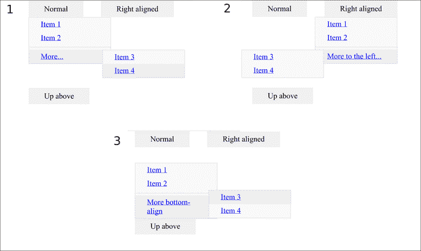
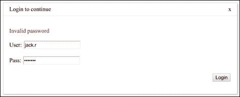

# 第五章：自定义输入组件

在本章中，我们将涵盖以下内容：

+   使用 contentEditable 进行基本的富文本输入

+   高级富文本输入

+   创建下拉菜单

+   创建自定义对话框

+   为输入创建自动完成

+   创建自定义单选列表

+   创建多选列表

+   使用地图进行地理位置输入

# 介绍

到目前为止，我们介绍了几种不同的从用户那里获取输入的方法。HTML5 提供了许多新功能，使得以前用 JavaScript 完成的输入组件的功能成为可能。

通常，我们需要扩展这个标准功能。在本章中，我们将看到创建一些自定义输入组件的方法，并使用已有的输入组件，其中我们添加额外的功能以扩展或简化最终用户体验。

# 使用 contentEditable 进行基本的富文本输入

在 HTML5 中，新的 `contentEditable` 属性使我们可以将每个元素转换为可编辑的富文本字段。理论上，这可以使我们编写在浏览器内部直接工作的复杂富文本编辑器。

除了其他功能，新的 API 还可以用于发送编辑命令。这是使用 `document.execCommand` 函数完成的，该函数将命令字符串作为第一个参数，选项作为第三个参数。

实际上，每个浏览器供应商都以稍微不同的方式实现接口。然而，大多数现代浏览器都是完全兼容的。

您可以在 [`tifftiff.de/contenteditable/compliance_test.html`](http://tifftiff.de/contenteditable/compliance_test.html) 上测试您的浏览器的兼容性；然而，该测试并未考虑到一些浏览器可能在相同的命令上有不同的行为。

在这个示例中，我们将创建一个非常简单的 `contentEditable` 字段，支持一些命令（段落样式、撤销/重做、粗体/斜体/下划线、项目符号和编号列表）。

## 如何做到...

我们将创建一个包含 `contentEditable` div 的 HTML 页面。

1.  我们将在 div 中添加一些填充，以便更容易点击。在 div 上方，我们将放置我们的格式化按钮和一个下拉菜单：

```html
<!DOCTYPE HTML>
<html>
    <head>
        <title>Simple rich text editor</title>
        <style type="text/css">
            #edit { margin: 0.5em 0.1em; padding:0.5em;
           border: solid 1px #bbb; }
        </style>
   </head>
   <body>
   <div>
       <select class="btn style">
           <option value="P">Normal</option>
       </select>
       <button class="btn undo">Undo</button>
       <button class="btn redo">Redo</button>
       <button class="btn bold">B</button>
       <button class="btn italic">I</button>
       <button class="btn under">U</button>
       <button class="btn bullet">Bullet</button>
       <button class="btn number">Number</button>
   </div>
   <div id="edit" contentEditable="true">
   </div>
   <script src="img/jquery.min.js"></script>
   <script type="text/javascript" src="img/example.js"></script>
   </body>
</html>
```

1.  然后我们可以让编辑控件在我们的 `example.js` 文件中工作：

```html
$(function() {
    var editCommand = function(cmd, arg) { return document.execCommand(cmd, true, arg); };
```

1.  我们将把所有的 `editCommand` 绑定放在一个对象中：

```html
    var bindings = {
        '.undo': editCommand.bind(this, 'undo'),
        '.redo': editCommand.bind(this, 'redo'),
        '.bold': editCommand.bind(this, 'bold'),
        '.italic': editCommand.bind(this, 'italic'),
        '.under': editCommand.bind(this, 'underline'),
        '.bullet': editCommand.bind(this, 'insertUnorderedList'),
        '.number': editCommand.bind(this, 'insertOrderedList')
    };
```

1.  然后我们将它们应用到适当的编辑控件上：

```html
    for (var key in bindings) $(key).on('click', bindings[key]);
```

1.  最后，我们将定义并添加额外的段落样式：

```html
    var styles = {
        'Heading 1': 'H1',
        'Heading 2': 'H2',
        'Heading 3': 'H3',
    };
    for (var key in styles)
        $('<option>').html(key).attr('value', styles[key]).appendTo('.style');

    $('.style').on('change', function() {
        editCommand('formatBlock', $(this).val());
    });
});
```

## 它是如何工作的...

`document.execCommand` 函数允许我们向当前活动的 `contentEditable` 字段发送命令。这些命令的工作方式就像工具栏按钮在常规富文本编辑器中的工作方式一样。例如，命令 "bold" 切换文本的粗体; 第二次应用时，它将文本恢复到其原始状态。该函数接受以下三个参数：

+   `commandName`：这是要执行的命令的名称。

+   `showDefaultUI`（`boolean`）：这告诉浏览器是否应该向用户显示与命令相关的默认用户界面，如果需要的话。

+   `Value`：这为取决于命令类型的命令提供参数。例如，粗体、斜体和下划线需要一个 `boolean` 值。

在这个示例中，我们不会跟踪光标当前选择的状态。我们将把这种跟踪留给一个更高级版本的编辑器的示例。然而，值得在这里提到的是，我们可以使用 `document.queryCommandState` 函数来检索与当前光标位置的命令相关的状态（或者如果当前选择有活动选择）。

# 高级富文本输入

虽然基本的基于 `contentEditable` 的富文本输入字段在大多数情况下足够了，但有时还不够。我们可能希望允许用户插入更复杂的对象，如图片和表格。

在这个示例中，我们将创建一个支持插入图片和基本表格的高级富文本编辑器。

我们将基于*使用 contentEditable 进行基本富文本输入*配方中演示的简单富文本编辑器构建此编辑器。

## 准备就绪

我们将从*使用 contentEditable 进行基本富文本输入*配方中的代码开始，并对其进行改进。

## 如何做…

让我们编写代码。

1.  我们将使用原始的`index.html`和`example.js`文件，但我们将修改 HTML 文件。我们将添加两个控件：一个表按钮和一个文件选择器来插入图像：

```html
<!DOCTYPE HTML>
<html>
    <head>
        <title>Simple rich text editor</title>
        <style type="text/css">
            #edit {margin: 0.5em 0.1em;padding:0.5em;border:solid 1px #bbb;}
            #edit table td { border: solid 1px #ccc; }
        </style>
   </head>
   <body>
   <div>
       <select class="btn style">
              <option value="P">Normal</option>
       </select>
       <button class="btn undo">Undo</button>
       <button class="btn redo">Redo</button>
       <button class="btn bold">B</button>
       <button class="btn italic">I</button>
       <button class="btn under">U</button>
       <button class="btn bullet">Bullet</button>
       <button class="btn number">Number</button>
       <button class="btn table">Table</button>
       <input type="file" class="btn image">Image</input>
   </div>
   <div id="edit" contentEditable="true">
   </div>
   <script src="img/jquery.min.js"></script>
   <script type="text/javascript" src="img/example.js"></script>
   <script type="text/javascript" src="img/example-table.js"></script>
   <script type="text/javascript" src="img/example-image.js"></script>
   </body>
</html>
```

1.  要向我们的富文本添加表格，我们将创建一个名为`example-table.js`的新脚本。表按钮将具有双重功能。一个功能将是更改当前活动表中的行/列数。如果没有活动表，它将插入一个具有指定行数和列数的新表。以下是`example-table.js`中的代码：

```html
$(function() {
    var editCommand = function(cmd, arg) {
        return document.execCommand(cmd, true, arg);
    };
    $('.table').on('click', function() {
        var rows = prompt("How many rows?"),
            cols = prompt("How many columns?");
        var loc = document.getSelection().getRangeAt(0)
                .startContainer.parentElement;
        while (loc.id != 'edit'
            && loc.nodeName.toLowerCase() != 'table')
                loc = loc.parentElement;
        var isInTable = loc.nodeName.toLowerCase() == 'table';
        var contents;
        if (isInTable)
            contents = $(loc).find('tr').toArray().map(function(tr) {
                return $(tr).find('td').toArray().map(function(td) {
                    return td.innerHTML;
                });
            });
        var table = $('<table />');
        for (var k = 0; k < rows; ++k) {
            var row = $('<tr />').appendTo(table);
            for (var i = 0; i < cols; ++i) {
                var cell = $('<td />').appendTo(row);
                if (contents && contents[k] && contents[k][i])
                    cell.html(contents[k][i]);                
                else cell.html('&nbsp;');
            }            
        }
        if (isInTable) $(loc).remove();
        editCommand('insertHTML', table[0].outerHTML);
    });    

});
```

1.  要向我们的富文本添加图像，我们将创建一个名为`example-image.js`的新脚本。图像选择器将在指定位置插入用户选择的图像。以下是`example-image.js`的内容：

```html
$(function() {
    var editCommand = function(cmd, arg) {
        return document.execCommand(cmd, true, arg);
    };
    $(".image").on('change', function(e) {
        for (var k = 0; k < this.files.length; ++k) {
            var f = this.files[k];
            var fr = new FileReader();
            if (f.type && f.type.match('image/.+'))
                fr.readAsDataURL(f);
            else
                fr.readAsText(f);
            (function(f) {
              fr.onload = function(e) {
                if (f.type && f.type.match('image/.+'))
                    editCommand('insertHTML',
                        $("").attr('src',     e.target.result)[0].outerHTML);
                }
            }(f));
        }
    });
});
```

## 它是如何工作的…

我们向编辑器添加了两个新控件：表控件和插入图像控件。

表控件要求用户首先指定行数和列数。它通过检查当前光标位置的父元素来确定用户当前是否在表内。如果找到表，则记住其内容。

随后，将根据指定的列数和行数构建新表。如果旧表在该行/列位置包含一些内容，则将该内容复制到新构建的单元格中。最后，如果存在旧表，则将删除旧表，并使用`insertHTML`命令添加新表。

图像插入控件使用 HTML5 文件 API 用于文件输入，以将用户选择的图像文件读取为数据 URL。读取后，它使用相同的`insertHTML`命令将它们添加到内容中。

## 还有更多…

使用这种方法，很容易构建新的控件，将任何类型的内容添加到`contentEditable`字段中。这使我们能够创建具有专业功能的自定义富文本或页面编辑器。

然而，如果目标是向我们的页面添加一个功能齐全的通用富文本编辑器，我们建议使用已经可用的许多优秀的编辑器组件之一，例如 TinyMCE（[`www.tinymce.com/`](http://www.tinymce.com/)）。

# 创建下拉菜单

下拉菜单经常用于 Web 应用程序中以显示扩展功能。不经常使用或对少数用户有用的操作可以添加到菜单中，从而使界面更清晰。

HTML5 和 CSS3 允许我们完全使用 CSS 编写下拉菜单。我们将在本节中创建这样的菜单。

## 准备就绪

让我们分析下拉菜单的结构。下拉菜单有一个激活按钮，显示它和一个或多个项目如下：

+   常规（操作）项

+   分隔符项

+   子菜单项（激活子菜单）

我们的 HTML 元素结构应反映下拉菜单的结构。我们的 CSS 代码将控制菜单的定位和显示。

我们将有三个按钮显示略有不同但结构相同的菜单。

第一个将具有默认行为-下拉，左对齐，并在右侧显示子菜单。

第二个将具有修改后的行为-右对齐，并在左侧显示子菜单。

最后，第三个将具有非常不同的行为；它将出现在按钮上方，子菜单出现在右侧，但向上移动。



## 如何做…

要创建菜单，我们将使用 HTML 和 CSS。

1.  让我们首先在 HTML 文件中创建菜单结构。基本上，它是之前讨论过的相同结构，复制了三次，但在样式上略有变化，特别是包含菜单和子菜单的无序列表元素：

```html
<!DOCTYPE HTML>
<html>
<head>
<title>Dropdown menu</title>
<link rel="stylesheet" type="text/css" href="example.css">
<style type="text/css">
.screen-bottom {
    position:fixed;
    bottom:3em;
}
</style>
</head>
<body>

<div class="dropdown-menu">
    <a class="btn">Normal</a>
    <ul class="menu">
        <li><a href="item1">Item 1</a>
        <li><a href="item2">Item 2</a>
        <li class="separator"></li>
        <li class="dropdown-menu">
        <a href="#" class="submenu">More...</a>
        <ul class="menu">
            <li><a href="item3">Item 3</a>
            <li><a href="item4">Item 4</a>
        </ul>
        </li>
    </ul>
</div>

<div class="dropdown-menu">
    <a class="btn">Right aligned</a>
    <ul class="menu right-align">
        <li><a href="item1">Item 1</a>
        <li><a href="item2">Item 2</a>
        <li class="separator"></li>
        <li class="dropdown-menu">
        <a href="#" class="submenu">More to the left...</a>
        <ul class="menu left-side">
            <li><a href="item3">Item 3</a>
            <li><a href="item4">Item 4</a>
        </ul>
        </li>
    </ul>
</div>

<div class="screen-bottom">
    <div class="dropdown-menu">
        <a class="btn">Up above</a>
        <ul class="menu up">
            <li><a href="item1">Item 1</a>
            <li><a href="item2">Item 2</a>
            <li class="separator"></li>
            <li class="dropdown-menu">
            <a href="#" class="submenu">More bottom-align</a>
            <ul class="menu bottom-align">
                <li><a href="item3">Item 3</a>
                <li><a href="item4">Item 4</a>
            </ul>
            </li>
        </ul>
    </div>
</div>
</body>
</html>
```

1.  然后让我们在`example.css`中为这个菜单添加适当的 CSS。我们将使用`border-box`的尺寸模型。与常规模型不同，在常规模型中，边框和填充在元素的指定尺寸（宽度或高度）之外，而在`border-box`模型中，填充和边框包括在指定的尺寸中：

```html
.dropdown-menu * {
    -webkit-box-sizing: border-box; /* Safari/Chrome, WebKit */
        -moz-box-sizing: border-box; /* Firefox, other Gecko */
            box-sizing: border-box;
}
div.dropdown-menu {
    display:inline-block;
    position:relative;
    margin:0 1em;
}
```

1.  我们将为显示下拉菜单的菜单项目以及菜单本身添加样式。默认情况下，内部菜单绝对定位在内容的下方：

```html
a.btn {
    padding: 0.5em 2em;
    background-color:#f1f1f1;
}
.dropdown-menu ul.menu {
    width:auto;
    background-color:#f9f9f9;
    border: solid 1px #ddd;
    display:none;
    position:absolute;
    top:50%;
    left:0;
    list-style:none;
    padding:0;
    min-width:170px;
}
```

1.  当按钮处于活动状态时，我们需要让菜单在悬停时显示：

```html
.dropdown-menu:hover > ul.menu,
.dropdown-menu:active > ul.menu {
    display:block;
}
```

1.  我们需要子菜单相对于其父项目定位：

```html
.dropdown-menu > ul.menu > li {
    position:relative;
}
```

1.  我们将设置常规项目和分隔符项目的样式：

```html
.dropdown-menu > ul.menu > li:hover {
    background-color:#eee;
}
.dropdown-menu > ul.menu > li > a {
    padding:0.3em 1.5em;
    display:block;
}
.dropdown-menu > ul.menu > li.separator {
    height:0.01em;
    margin:0.3em 0;
    border-bottom: solid 1px #ddd;
}
```

1.  常规子菜单的定位略有不同：与父项目内联，但距左侧 90%：

```html
li.dropdown-menu ul.menu {
    left:90%;
    right:auto;
    top:0em;
}
```

1.  最后，我们应用专门的样式，用于右对齐和卷起菜单，以及与父菜单底部对齐的子菜单：

```html
.dropdown-menu ul.menu.right-align {
    left:auto;
    right:0;
}
.dropdown-menu ul.menu.up {
    top: auto;
    bottom:50%;
}
li.dropdown-menu ul.menu.left-side {
    right: 90%;
    left: auto;
}
li.dropdown-menu ul.menu.bottom-align {
    top:auto;
    bottom:0;
}
```

## 工作原理

为了动态显示菜单，我们使用`hover`和`active` CSS 伪选择器。它们使我们能够在光标悬停在元素上或元素被标记为`active`时以不同的样式显示元素。将整个菜单放在菜单项内允许我们通过在菜单项上使用这些选择器来显示它。

为了定位菜单和子菜单，我们使用`position:relative`的父菜单项目和`position:absolute`的子菜单项目的组合。当我们使用这种组合时，我们的子定位属性是相对于第一个相对父级，即项目。

这使我们能够将菜单放置在任何位置：默认情况下在父项目下方，或作为选项在上方（对于子菜单，默认情况下在右侧，作为选项在左侧）。它还允许我们以任何我们喜欢的方式对齐子菜单：默认情况下左对齐，作为选项右对齐（对于子菜单，默认情况下顶部对齐，作为选项底部对齐）。

这些组合应该使我们能够在任意位置构建菜单，而不必担心菜单可能超出屏幕。

# 创建自定义对话框

自定义对话框可用于各种用户输入。我们可以要求用户填写表单（例如，登录表单可以显示为对话框）。我们还可以用它们来要求用户接受或拒绝需要立即注意的某些操作（例如，对话框询问用户“您确定要删除所选项目吗？”）。

由于理论上我们可以在对话框中显示任何其他页面部分，如果我们有一个灵活的方法来做到这一点，那将是很好的。实现灵活性的最简单方法是将对话框分为三个部分：视图、模型和控制器。

在这个教程中，我们将创建一个通用对话框。它将包括一个视图（支持 JavaScript 模板的 HTML）、一个模型（从模板中获取）、以及一个使控制器的事件绑定列表。

这是一个高级教程。如果您不熟悉**嵌入式 JavaScript 模板**（**EJS**），我们建议在阅读本教程之前先阅读第九章中的 EJS 教程，*客户端模板*。



## 准备工作

我们将使用 John Resig 的类似 EJS 模板的简单实现。这是一个将 EJS 模板转换为 JavaScript 函数的编译器。我们不打算解释编译器——知道它接受包含模板内容的元素的 ID 并返回模板函数就足够了。应用于对象时，此函数会产生 HTML 输出。

以下是模板编译器函数：

```html
// Simple JavaScript Templating
// John Resig - http://ejohn.org/ - MIT Licensed
(function(){
  var cache = {};

  this.tmpl = function tmpl(str, data){
    // Figure out if we're getting a template, or if we need to
    // load the template - and be sure to cache the result.
    var fn = !/\W/.test(str) ?
      cache[str] = cache[str] ||
        tmpl(document.getElementById(str).innerHTML) :

      // Generate a reusable function that will serve as a template
      // generator (and which will be cached).
      new Function("obj",
        "var p=[],print=function(){p.push.apply(p,arguments);};" +

        // Introduce the data as local variables using with(){}
        "with(obj){p.push('" +

        // Convert the template into pure JavaScript
        str
          .replace(/[\r\t\n]/g, " ")
          .split("<%").join("\t")
          .replace(/((^|%>)[^\t]*)'/g, "$1\r")
          .replace(/\t=(.*?)%>/g, "',$1,'")
          .split("\t").join("');")
          .split("%>").join("p.push('")
          .split("\r").join("\\'")
      + "');}return p.join('');");

    // Provide some basic currying to the user
    return data ? fn( data ) : fn;
  };
})();
```

### 注意

解释 JavaScript 微模板的原始文章可以在[`ejohn.org/blog/javascript-micro-templating/`](http://ejohn.org/blog/javascript-micro-templating/)找到。

## 如何做...

我们将编写页面代码和对话框库。

1.  让我们创建一个名为`index.html`的文件。它将包含一个秘密的`div`区域和一个登录对话框的模板，可以预先填充`用户名`并显示错误消息的能力：

```html
<!DOCTYPE HTML>
<html>
    <head>
        <title>Simple rich text editor</title>
        <link rel="stylesheet" type="text/css" href="dialog.css">
        <style type="text/css">
        .dialog.tmplExample .button-area { margin-top: 20px; text-align:right; }
        .dialog.tmplExample p.error.hidden { display:none; }
        .dialog.tmplExample p.error { color:#c00; }
        div.secret { display:none; }
        </style>
   </head>
   <body>
   <div>
       <div class="secret">
           Welcome to the secret place, where only authenticated users may roam.
       </div>
   </div>
   <script id="tmplExample" type="text/html">
        <p class="error hidden"></p>
        <p><label for="user">User:</label>
          <input name="user" type="text" value="<%= user %>" ></p>
        <p><label for="pass">Pass:</label>
          <input name="pass" type="password" value="<%= pass %>" ></p>
        <p class="button-area">
            <button class="login" type="button">Login</button>
        </p>
   </script>
   <script src="img/jquery.min.js"></script>
   <script type="text/javascript" src="img/tmpl.js"></script>
   <!--<script type="text/javascript" src="img/dialog.js"></script>-->
   <script type="text/javascript" src="img/example.js"></script>
   </body>
</html>
```

1.  为了看看我们希望对话框 API 如何工作，接下来我们将创建`example.js`。它将立即显示一个登录对话框，一旦输入正确的密码，对话框将关闭，然后显示秘密内容。否则，对话框内将显示错误消息：

```html
$(function() {
    dialog("tmplExample", {title: 'Login to continue', user: 'jack.r', pass: ''}, {
        'button.login => click': function(dialog, ev) {
            var data = dialog.data();
            if (data.pass == 'secret') { dialog.close(); $('.secret').show(); }            
            else { dialog.find('p.error').text('Invalid password').show(); }
        }
    });
});
```

1.  接下来让我们创建`dialog.js`。它应该导出一个名为`dialog`的函数，该函数接受三个参数：对话框模板的 ID，要填充到模板中的数据，以及包含事件绑定的对象：

```html
(function() {
    window.dialog = function(template, data, bindings) {
```

1.  首先，构建`dialog` chrome：

```html
        var holder = $("<div />").addClass('dialog')
                .addClass(template);
        var titlebar = $("<div />").addClass('title')
                .appendTo(holder);
        var titletext = $("<span />").addClass('titletext')
                .appendTo(titlebar);
        var close = $("<span />").addClass('close')
                .html('x').appendTo(titlebar);
        var form = $("<form />").addClass('dialog')
                .appendTo(holder);
```

1.  用模板化的 HTML 填充它，设置标题，并显示它：

```html
        form.html(tmpl(template, data));
        $(titletext).text(data.title || "Dialog");
        holder.appendTo('body');
```

1.  应用`selector => event`格式的绑定：

```html
        for (var key in bindings) if (bindings.hasOwnProperty(key))
          (function(key) {
            var selectorEvent = key.split(/\s+=>\s+/);
            form.find(selectorEvent[0]).on(selectorEvent[1],
                function() {
                    var args = [].slice.call(arguments);
                    args.unshift(self);
                    bindings[key].apply(this, args);
                });
        }(key));
```

1.  构建要返回的`dialog`对象。提供`find()`函数用于字段，`data()`函数用于提取所有表单数据为 JSON 对象，以及事件绑定和关闭函数：

```html
        var self = {};
        self.find = form.find.bind(form);
        self.data = function() {
            var obj = {};
            form.serializeArray().forEach(function(item) {
                if (obj[item.name]) {
                    if (!(obj[item.name] instanceof 'array'))
                        obj[item.name] = [ obj[item.name] ];
                    obj[item.name].push(item.value);
                }
                else obj[item.name] = item.value;
            });
            return obj;
        }
        self.close = function() {
            holder.trigger('dialog:close');
            holder.remove();
        };
        self.on = holder.on.bind(holder);
        close.on('click', self.close);
        return self;
    };
}());
```

1.  最后，我们将在`dialog.css`中自定义对话框的定位和样式。

```html
div.dialog {
    position:fixed;
    top:10%;
    left: 50%;
    margin-left: -320px;
    width:640px;
    height:auto;
    border: solid 1px #ccc;
    background-color:#fff;
    box-shadow: 2px 2px 5px #ccc;
}
div.dialog div.title { border-bottom: solid 1px #eee; }
div.dialog div.title span { padding: 0.5em 1em; display:inline-block; }
div.dialog div.title span.close { float: right; cursor: pointer; }
div.dialog form.dialog { padding: 1em; }
```

## 它是如何工作的...

为了创建一个灵活的对话框库，我们将显示对话框所需的数据分为视图、模型和控制器。

`tmpl.js`库提供了一个使用提供的模型对象处理 EJS 模板的函数。此函数的内部超出了本示例的范围。

我们的`dialog`函数构建了一个包含标题栏、关闭按钮和表单的 chrome。然后，它用模板和数据填充表单。最后，它将我们的绑定应用于此表单的内容。绑定采用 jQuery 的`selector => event`格式，可用于响应任何类型的用户输入。

该函数返回一个`dialog`对象（在变量 self 中构造）。该对象提供以下便利函数：

+   `find`：这允许用户使用选择器在表单中查找元素

+   `data`：这将提取表单中的所有数据输入为易于使用的 JSON 对象

+   `close`：这将关闭对话框

+   `on`：这允许用户添加额外的绑定（例如，`dialog:close`事件）

该对象还提供了一个方便的事件，名为`dialog:close`，当对话框关闭时触发。

我们使用`dialog.css`样式化这个对话框。对话框的定位采用纯 CSS 定位方法：使用固定宽度和负边距，我们避免了需要读取窗口宽度的需求，因此完全避免了使用 JS。

灵活的模板语言允许我们创建任何复杂度的对话框内容，而`bindings`语法允许完全控制所有用户输入。我们可以通过提供模板和一些或全部绑定来简化创建一些常见对话框。

通过这种通用方法，创建简单的消息框、通用文本提示或具有可变数量字段的复杂对话框表单都同样容易。

# 创建输入自动完成

通常与搜索字段或输入相关的一个常见功能是，我们可以在输入一些数据后猜测文本。这可以是我们数据库中的任何字段，比如员工姓名。在这个示例中，我们将看一下创建输入自动完成的一些可能方式；你可以决定什么最适合你的用例。


## 准备工作

在这个例子中，我们将使用一个样本 JSON 文件，模拟一个 REST API 返回的结果。该文件可以从示例中检索，文件名为`countries.json`，其中包含一个对象列表——国家与其对应语言的映射。在这个例子中，我们将同时使用**jQueryUI**（[`jqueryui.com/`](http://jqueryui.com/)）和一个名为**Chosen**的库（[`github.com/harvesthq/chosen`](https://github.com/harvesthq/chosen)）。为什么要同时使用两者？嗯，我们可以使用它们中的任何一个，或者都不用，但这里的想法是展示使用列表选择创建良好用户体验的不同方式。另外，由于我们将模拟 REST 服务，我们需要运行一个服务器；有关更多信息，请参阅附录 A，*安装 Node.js 和使用 npm*。

## 如何做...

对于这个例子，我们将使用 HTML 和相应的 JavaScript 和 CSS：

1.  我们将首先从`head`部分开始，添加 jQueryUI 和 Chosen 的 CSS 依赖项。此外，我们还将添加一个小的 CSS 部分，其中我们将定义 Chosen 的单个选择器的大小：

```html
 <head>
    <meta charset="utf-8">
    <title>Autocomplete</title>
    <link rel="stylesheet" href="//cdnjs.cloudflare.com/ajax/libs/jqueryui/1.10.2/css/lightness/jquery-ui-1.10.2.custom.css" type="text/css" media="all">
    <link rel="stylesheet" type="text/css" href="//cdnjs.cloudflare.com/ajax/libs/chosen/0.9.11/chosen.css">
    <style type="text/css">
      .marker{
        width:350px;
      }
    </style>
 </head>
```

1.  接下来，我们可以添加 HTML 的主体部分，我们将在其中创建表单。首先，我们将创建一个块，其中将有一个输入文本字段，该字段将连接到建议水果的列表：

```html
<div>
        <label>
          Pick your favorite fruit <input name="favFruit" type="text" list="fruit" placeholder="Example:'Apple'">
        </label>
        <datalist id="fruit">
          <option value="apple" label="Apple"></option><option value="apricot"></option><option value="banana"></option><option value="berries"></option>
        </datalist>
      </div>
```

1.  下一个输入字段是用于选择国家，我们将使用 Chosen 类型的选择器，该选择器将作为控件的一部分具有自动完成功能：

```html
     <div>
        <label for="country">Your country </label>
        <select id="country" name="country" data-placeholder="Choose a Country..." class="marker">
            <option value=""></option>
            <option value="United States">United States</option>
            <option value="United Kingdom">United Kingdom</option>
            <option value="Afghanistan">Afghanistan</option>
            <option value="Aland Islands">Aland Islands</option>
            <option value="Andorra">Andorra</option>
            <option value="Angola">Angola</option>
            <option value="Anguilla">Anguilla</option>
            <option value="Antarctica">Antarctica</option>
            <option value="Antigua and Barbuda">Antigua and Barbuda</option>
           </select>
     </div>
```

1.  另一个输入元素用于语言选择。我们将使用从服务器检索的 JSON 数据，或者在我们的情况下是一个 JSON 文件。此外，我们将添加一个职业输入和一个提交按钮：

```html
   <div>
        <label for="language">Language</label>
        <input type="text" id="language" name="language" placeholder="Example: English"/>
     </div>
     <div>
        <label for="occupation">Occupation</label>
        <input type="text" id="occupation" name="occupation" placeholder="Example: prog">
     </div>
     <div>
      <input type="submit">
     </div>
```

1.  不要忘记这个块需要作为`form`的一部分才能提交。另一个选项是让元素指定一个`form`属性：

```html
<input type="text" id="occupation" name="occupation" placeholder="Example: prog" form ="someFormId" >
```

1.  这将设置给定元素的所有者，允许我们将元素放在文档的任何位置。这里的限制是对于给定元素只能有一个表单。

1.  下一步是包含 jQuery、jQueryUI 和 Chosen 的外部供应商 JavaScript：

```html
<script src="img/jquery.min.js"></script>
 <script src="img/chosen.jquery.min.js"></script>
 <script src="img/jquery-ui.min.js" type="text/javascript"></script>
```

1.  之后，我们可以开始 jQuery 选择和逻辑：

```html
$(function() { ...}
```

1.  要为元素启用 Chosen，我们选择它们并直接在它们上调用插件；就是这么简单：

```html
$(".marker").chosen();
```

1.  另一个选择是使用 jQueryUI 的`autocomplete`插件。一种方法是在本地拥有数据，然后将其应用于某些选择：

```html
 var occupation = ["programmer","manager","doctor","designer"];
      $("#occupation").autocomplete({
          source:occupation,
          minLength:2,
          delay:200
      });
```

1.  在组件的配置中，`source`属性可以接受可能的字符串选项列表，`minLength`属性指定应在触发自动完成之前插入的最小字符数。`delay`可以设置在按键和对源数据进行搜索之间的毫秒数。

### 注意

请注意，将延迟设置为“低”可能会导致向数据源发送大量请求的副作用。

1.  数据也可以位于远程服务器上，并作为插件的源进行检索，可以应用一些额外的过滤：

```html
   $("#language").autocomplete({
     source: function (request, response) {
     //matcher for terms filtering on client side
     var matcher = new RegExp( "^" + $.ui.autocomplete.escapeRegex( request.term ), "i" );
              //simulate a server side JSON api
     $.getJSON("countries.json?term=" + request.term,
        function (data) {
     response($.map(data, function (value, key) {
       for(var name in value) {
         var result = {};
           if(matcher.test( value[name])){
             result.label=value[name]+" "+name;
             result.value=value[name];
             return result;
           }
        }
      })
     );
   });
  },
  minLength: 2,
  delay: 200
    });
```

## 它是如何工作的...

最简单的情况是使用标准的 HMTL5 标签来实现自动完成。代码如下：

```html
<input name="favFruit" type="text" list="fruit" placeholder="Example:'Apple'" />
```

`list="fruit"`属性将输入字段连接到`datalist`。此属性用于标识将建议给用户的预定义选项列表。

另一个选择是使用 Chosen，这是一个使选择更加用户友好的 JavaScript 插件。可以通过以下简单的 HTML 实现：

```html
        <select id="country" name="country" data-placeholder="Choose a Country..." class="marker">
            <option value=""></option>
            <option value="United States">United States</option>
            <!-- … Other options -->
        </select>
```

这将通过使用 jQuery 选择器来激活插件元素：

```html
     $(".marker").chosen();
```

Chosen 将自动样式化选择并添加自动完成功能，如果设置了`data-placeholder`属性，它将模仿 HTML5 的`placeholder`属性的标准行为。

### 注意

请注意，为简单起见，其他国家已被移除，在实际使用情况下，您可以使用 ISO 3166-1（[`www.iso.org/iso/country_codes.htm`](http://www.iso.org/iso/country_codes.htm)）中定义的国家列表以及相应的维基百科文章[`en.wikipedia.org/wiki/ISO_3166-1`](http://en.wikipedia.org/wiki/ISO_3166-1)。

另一个选择是使用 jQueryUI 自动完成组件。这就是为什么我们将更详细地分析一个带有服务器端数据源的示例。有三种选择：

+   **客户端过滤**：我们获取整个 JSON 文档，或者其他任何文档，然后在客户端对数据进行过滤。如果可能的话，这通常是一个很好的方法。但并非所有情况都适用。包含列表的数据可能非常庞大。考虑搜索引擎上的自动完成功能，可能会有大量的可能结果列表。

+   **服务器端过滤**：我们只获取通过某个查询参数过滤的数据的一部分。过滤是在服务器端完成的，在大多数情况下会更慢。即使数据立即返回而不需要太多处理，额外的请求也会增加一些额外的延迟，这可能并非总是如此。

+   **服务器端和客户端过滤**：在处理大型数据集时，这两种方法的结合可能是我们最好的方法。只有在满足一定的阈值时，我们才能向服务器请求更多的数据。

### 注意

值得一提的是，如果我们创建一个搜索输入字段，使用 HTML5 的`input type="search"`是语义上正确的。此控件可以启用单行输入字段，并可以添加`autosave`属性以启用预先搜索过的术语的下拉列表。代码如下：

```html
<input id="mySearchField" type="search" autosave>
```

为了在用户输入时使用从服务器检索到的数据，我们可以在配置的`source`属性中使用一个函数：

```html
source: function (request, response) {
```

在`request`对象中，我们可以通过`request.term`属性获取插入`input`元素的当前数据。然后，如果我们想要在客户端过滤数据，我们可以创建一个正则表达式匹配器，就像在我们的情况下一样，因为我们总是访问相同的 JSON 文件：

```html
  var matcher = new RegExp( "^" + $.ui.autocomplete.escapeRegex( request.term ), "i" );
```

之后，我们使用 Ajax 调用服务来读取数据：

```html
   $.getJSON("countries.json?term=" + request.term, function (data) {
```

请注意，大多数 REST API 通常都有自己的过滤功能，通常通过`request`参数进行过滤，在我们的情况下，我们没有这样的功能，但是为了说明问题，我们可以很容易地做如下操作：

```html
'countries.json?term=' + request.term
```

因此，回调函数接收 JSON 数据，但由于我们获取了所有未经过滤的数据，我们使用`jQuery.map( arrayOrObject, callback( value, indexOrKey ) )`来将原始对象数组中的所有项目转换为新数组，遵循`callback`函数中定义的规则。

在我们的情况下，JSON 的格式如下：

```html
[
  {
    "Afghanistan": "Pashto"
  },
  {
    "Albania": "Albanian"
  }
…
]
```

为了使用`language`名称过滤数据，我们应该返回与我们在`matcher`中定义的条件匹配的对象子列表：

```html
function (data) {
  response($.map(data, function (value, key) {
    for(var name in value) {
     var result = {};
     if(matcher.test( value[name])){
        result.label=value[name]+" "+name;
        result.value=value[name];
        return result;
     }
   }
  }));
  }
```

您可能会注意到返回的结果具有`label`和`value`属性；这是`source`的可能格式之一，其中我们有一个这样的对象数组。

如果我们要比较 jQueryUI 处理数据的方法与 Chosen 库，我们可以得出结论，jQueryUI 在处理不同数据源时更灵活。另一方面，Chosen 在某种程度上只是为标准的 HTML 元素添加样式，比使用巧妙的技巧更加符合规范。此外，Chosen 非常专注于做一些非常好的事情，并且在不具有 jQueryUI 这样体积庞大的库所带来的负担的情况下提供了出色的用户体验。

## 还有更多...

`list`属性可以用于除`hidden`、`checkbox`、`radio`、`file`或`button`类型之外的所有输入类型，这些类型会被忽略。仔细想想，不在这些类型上工作是有道理的，因为在它们上面使用自动完成并没有太多实际用途。

如果我们需要在旧版浏览器上具有相同的行为，或者需要回退模式，我们可以将该内容放在`datalist`元素中：

```html
 <datalist id="fruits">
  <label>
   or select on from this list of element:
   <select name="Fallback">
    <option value="">
    <option>Apple</option>
    <option>Orange</option>
    <!-- ... -->
   </select>
  </label>
 </datalist>
```

如果支持`datalist`元素，这些数据将不会显示，从而使我们能够为旧版浏览器添加支持。

还有其他各种数据源可以与 jQueryUI 自动完成一起使用，例如 JSONP 或 XML。

# 创建自定义单选列表

在上一个示例中，我们使用了 Chosen。在这个示例中，我们将更深入地了解创建简单选择框的过程，使其成为最用户友好的选择器之一。

## 准备工作

在这个示例中，我们将使用 Chosen ([`github.com/harvesthq/chosen`](https://github.com/harvesthq/chosen))及其依赖项 jQuery，通过从 CDN 添加它们。

## 如何做...

我们创建一个 HTML 文件和相应的 JavaScript 代码：

1.  首先，我们将从 HTML 的 head 部分开始，包括 Chosen 的 CSS 样式：

```html
 <head>
    <meta charset="utf-8">
    <title>Single select list</title>
    <link rel="stylesheet" type="text/css" href="//cdnjs.cloudflare.com/ajax/libs/chosen/0.9.11/chosen.css">
    <style type="text/css">
       .drop-down{
        width: 250px;
      }
    </style>
 </head>
```

1.  我们将创建一个简单的表单，用户可以在其中选择他们最喜欢的编程语言和职位。为此，我们添加了带有多个可用选项的`select`元素：

```html
<form>
    <div>
      <label>
        Favorite programming language:
        <select id="programming" data-placeholder="Your favorite programming language" class="drop-down">
          <option value=""></option>
          <option>Java</option>
          <option>Python</option>
          <option>Clojure</option>
          <option>C</option>
          <option selected>Java Script </option>
          <option>Lisp</option>
          <option>Pascal</option>
          <option>VB</option>
        </select>
    </label>
    </div>
```

1.  可以使用`optgroup`元素对可能的选项进行分组：

```html
<div>
     <label>
       You consider your self to be a:
        <select id="occupation" data-placeholder="Occupation" class="drop-down">
          <optgroup label="Software">
              <option>Java developer</option>
              <option>Node developer</option>
              <option>Software Achitect</option>
              <option selected>Engineer</option>
              <option>Manager</option>
          <optgroup>
          <optgroup label="Hardware">
            <option>Semiconductor</option>
            <option>Manager</option>
            <option>Computer Hardware Engineer</option>
          </optgroup>
        </select>
      </label>
    </div>
```

1.  最后，我们只需为表单添加一个简单的提交：

```html
    <input type="submit" />
    </form>
```

1.  为了包含 Chosen，我们从 CDN 添加它们的实现：

```html
 <script src="img/jquery.min.js"></script>
   <script src="img/chosen.jquery.min.js"></script>
```

1.  为了指定应该应用 Chosen 的元素，我们使用 jQuery 选择：

```html
         $(function() {
          $("#programming").chosen({
             allow_single_deselect:true
          });
          $("#occupation").chosen();
         });
```

## 工作原理...

Chosen 最好的地方在于它的简单性；我们只需使用 jQuery 选择元素并应用插件。有一个允许取消选择的选项，我们可以在创建这种元素时启用它：

```html
    $("#programming").chosen({allow_single_deselect:true});
```

### 注意

请注意，Chosen 可以与**Prototype JS**一起使用，而不是 jQuery；在那里，元素的选择将是`new Chosen(someElement);`。

此外，我们可以添加一个名为`data-placeholder`的属性，其中包含默认文本，例如我们的示例中的`Occupation`。如果未指定，单选默认为`Select Some Option`。

### 提示

对于`select`元素，如果未指定`selectedIndex`或没有带有`selected`属性的选项，浏览器会假定第一个元素被选中。为了允许未选择任何选项，我们可以将第一个选项设置为空，从而启用`data-placeholder`文本支持。

## 还有更多...

如果您需要使用在 Chosen 初始创建后会更改的选项数据，您可以动态更新组件，然后在所选字段上触发`liszt:updated`事件。`liszt:updated`事件是 Chosen 特定的内部事件。调用事件后，Chosen 将根据更新的内容重新构建列表。例如，在 ID 为`countries`的元素上，触发将如下所示：

```html
   $("#form_field").trigger("liszt:updated");
```

# 创建多选列表

Chosen 可以用于创建漂亮的多选项。在这个示例中，我们将创建一个菜单订购表单，其中使用了这种类型的选择。


## 准备工作

这个示例将包含与*创建自定义单选列表*相同的部分，并在此基础上构建。

## 如何做...

我们首先要有与*创建自定义单选列表*相同的基础，并添加以下部分：

1.  首先，我们添加将具有我们在 head 部分创建的`drop-down`CSS 类的选择：

```html
                <div>
      <label for="cocktails">Place the order for cocktails</label>
     <select id="cocktails" data-placeholder="Add cocktails"  multiple class="drop-down" name="cocktails">
          <option value=""></option>
          <option>Black Velvet</option>
          <option>Moonwalk</option>
          <option>Irish coffee</option>
          <option>Giant Panda</option>
          <option selected>Jungle Juice</option>
          <option selected>Mojito</option>
          <option selected disabled>Joker</option>
          <option disabled>Long Island Iced Tea</option>
          <option disabled>Kamikaze</option>
     </select>
    </div>
```

1.  我们还可以对`select`元素的选项进行分组，如`Starters`和`Pizza`：

```html
<div>
      <label for="food">Select the food order</label>
     <select id="food" data-placeholder="Select some off the menu element" multiple class="drop-down" name="food">
      <optgroup label="Starters">
            <option>White Pizza</option>
            <option>Calzone</option>
        <optgroup>
       <optgroup label="Pizza">
            <option>Chees and Tomato</option>
            <option>Garden Veggie</option>
            <option>Pepperoni</option>
        <optgroup>
        <optgroup label="Salads">
          <option>House Salad</option>
          <option>Cezar Salad</option>
          <option>Sopska</option>
        </optgroup>
     </select>
    </div>
```

1.  只需选择所有具有`drop-down`CSS 类的元素，并为它们启用 Chosen：

```html
  <script type="text/javascript">
   $(function() {
    $('.drop-down').chosen();
    }
   </script>
```

## 工作原理...

Chosen 的一个主要特点是轻松设置，因此 JavaScript 部分非常简单，因为我们只有基本的元素选择。可以通过在选项上使用`selected`属性在页面呈现给用户之前选择选项，例如`Mojito`。它们也可以通过使用`disabled`属性禁用选择，因此在我们的情况下，选项`Long Island Iced Tea`将不会出现在选择中。

Optgroups、selected states、multiple attributes 以及其他属性都像标准的 HTML5 行为一样受到尊重。这意味着我们不需要期望特殊的东西或在服务器端处理表单时进行一些定制。

# 使用地图的地理位置输入

自从引入 HTML5 地理位置 API 以来，读取用户的位置变得更加简单。然而，有时我们可能希望允许用户更正或验证他们的位置，或者指定一个与他们自己不同的位置。

在本章中，我们将制作一个位置输入，允许用户通过在地图上标记来指定位置。

我们的位置选择器将表示为一个链接。单击链接后，用户将有选择使用输入字段搜索其位置的选项，然后通过单击地图选择位置。

与我们所有的地图示例一样，我们将使用流行的 Leaflet（[`leafletjs.com/`](http://leafletjs.com/)）地图库。

## 准备工作

我们希望我们的地图输入行为类似于大多数输入字段。我们将使用一个下拉样式的机制，类似于大多数日期选择器组件。用户将点击一个链接来修改位置，然后地图下拉菜单将出现。用户做出选择后，下拉菜单将消失。

我们还将在地图上添加一个搜索框，以帮助用户找到所需的位置。为此，我们将使用**Nominatim**（[`nominatim.openstreetmap.org/`](http://nominatim.openstreetmap.org/)），这是 OpenStreetMap 提供的免费地理编码服务。以下是 Nominatim JSON 响应的示例：

```html
[{
    [snip]
    "lat": "52.5487969264788",
    "lon": "-1.81642935385411",
    "display_name": "135, Pilkington Avenue, Castle Vale, Birmingham, West Midlands, England, B72 1LH, United Kingdom",
    [snip]
}]
```

这是一个包含各种数据的搜索结果数组，其中包括我们需要的数据，如纬度、经度和显示名称。

## 如何做...

让我们写代码。

1.  与我们的 HTML 页面一样，我们始终从 HTML 页面开始。我们的输入字段由三个组件组成：要单击的链接、包含纬度和经度数据的隐藏输入字段以及基于地图的位置选择器。地图和搜索框不包括在 HTML 中，它们是按需创建的。

为了使地图下拉菜单出现在链接下方，它相对于其容器进行定位。为了使自动完成链接出现在单独的行上，它们的显示样式设置为`block`。

```html
<!DOCTYPE HTML>
<html>
    <head>
        <title>Location input using a map</title>
        <style type="text/css">
            div[data-input-map] {
                position:relative;
            }
            div[data-map] {
                width: 480px;
                height: 320px;
                position:absolute;
                top:100%;
                left:0;
            }
            div[data-results] a {
                display:block;
            }
        </style>
        <link rel="stylesheet" href="http://cdn.leafletjs.com/leaflet-0.4/leaflet.css" />
        <!--[if lte IE 8]>
        <link rel="stylesheet" href="http://cdn.leafletjs.com/leaflet-0.4/leaflet.ie.css" />
        <![endif]-->
    </head>
    <body>
        <div data-input-map>
            <a href="#">Set location</a>
            <input data-location type="hidden" name="location" value="51.5,-0.09" />
        </div>
        <script src="img/jquery.min.js"></script>
        <script src="img/leaflet.js"></script>
        <script type="text/javascript" src="img/example.js"></script>
    </body>
</html>
```

1.  为了使此选择器工作，将以下代码添加到`example.js`中：

```html
$('body').on('click', '[data-input-map] > a', function(e) {
    e.preventDefault();
    var par = $(this).parent();

    // Read the current location of the input
    var location = par.find('[data-location]');
    var latlng = location.val().split(',').map(parseFloat);

    // Create the map element and center the map at the current
    // location. Add a marker to that location.
    var mape = $('<div data-map />')
        .appendTo(par)[0];
    var map = L.map(mape).setView(latlng, 13)
    L.tileLayer('http://{s}.tile.openstreetmap.org/{z}/{x}/{y}.png',{
        attribution:'Copyright (C) OpenStreetMap.org',
        maxZoom:18
    }).addTo(map);
    var marker = L.marker(latlng).addTo(map);

    // Update the location when a new place is clicked.
    map.on('click', function(e) {
        marker.setLatLng(e.latlng);
        location.val([e.latlng.lat, e.latlng.lng].join(','));
        setTimeout(function() {
            $(mape).remove();
            inpe.remove();
        }, 500);
    });

    // Given a street address return a list of locations with
    // names and latlngs using the nominatim service.
    function findLocation(query, callback) {
        $.ajax('http://nominatim.openstreetmap.org/search', {
            data: { format: 'json', q: query },
            dataType: 'json'
        }).success(function(data) {
            callback(data.map(function(item) {
                return {
                    latlng: [item.lat, item.lon],
                    name: item.display_name
                };
            }));
        });
    }

    // Add a search box
    var inpe = $('<input type="text" data-search />')
        .appendTo(par);
    delaySearch = null;

    // Fire a search 1 second after the input stops changing,
    // displaying the results in a list  
    inpe.on('keydown keyup keypress', function() {
        if (delaySearch) clearTimeout(delaySearch);
        delaySearch = setTimeout(function() {
            par.find('div[data-results]').remove();
            var autocomplete = $('<div data-results />')
                .appendTo(par);
            findLocation(inpe.val(), function(results) {
                results.forEach(function(r) {
                    $('<a href="#" />')
                        .attr('data-latlng', r.latlng.join(','))
                        .text(r.name).appendTo(autocomplete);
                });
                // When a result is picked, center the map there and
                // allow the user to pick the exact spot.
                autocomplete.on('click', 'a', function(e) {
                    e.preventDefault();
                    var latlng = $(this).attr('data-latlng')
                        .split(',');
                    map.setView(latlng, 13);
                    autocomplete.remove()
                });
            });
        }, 1000);
    });

});
```


## 它是如何工作的...

`example.js`中的代码使用户可以单击**设置位置**链接，并使用地图选择位置。`click`事件绑定添加到文档主体，以便更容易地向页面添加新的位置输入。

我们从隐藏输入字段中解析纬度和经度，然后创建一个以这些坐标为中心的地图，并在同一位置放置一个标记。

当用户点击地图时，位置将被更新，并且地图将在 500 毫秒后被移除。这应该足够长，让用户注意到他的更改已成功应用。

此外，我们在点击的链接旁边添加了一个搜索框。当用户在其中输入搜索查询时，将通过向 Nominatim 发出 Ajax 请求来执行搜索。为了避免过载服务，搜索会延迟 1 秒；如果用户在那一秒内输入了内容，查询将被取消，并且将安排在 1 秒后发送新的查询。

在获取结果后，代码将它们显示为链接列表。单击后，它们将重新定位地图，使其位于单击搜索结果的确切位置。搜索结果列表将被移除，并允许用户选择确切的位置。
