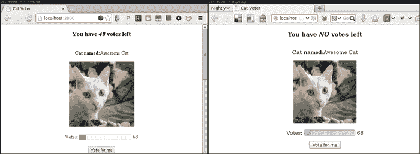
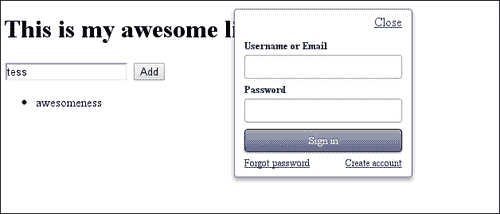

# 第十章：数据绑定框架

在本章中，我们将涵盖以下主题：

+   创建具有数据绑定的基本 Angular 视图

+   渲染列表和使用 Angular 控制器

+   Angular 中的路由、过滤器和后端服务

+   使用 Angular 的客户端验证

+   使用 Angular 指令制作图表组件

+   为 Meteor.js 构建应用程序结构

+   Meteor.js 中的响应式编程和数据

+   Meteor.js 中的实时 HTML 和用户特定数据

+   Meteor.js 中的安全机制

# 介绍

在现代 Web 应用程序中，很多代码逐渐从服务器移动到浏览器。因此，出现了新的可能性和挑战。

其中一种可能性是即时自动数据绑定。客户端代码使我们能够将模型对象绑定到网页的部分。这意味着模型中的更改会自动且立即反映在显示该模型的视图元素中。

此外，代码组织方面也出现了挑战。JavaScript 没有提供足够的模块设施或代码组织模型，这在较大的浏览器应用程序中是必需的。

在本章中，我们将涵盖两个试图提供解决方案的完整框架。这些框架支持声明性的、数据绑定的方法来编写 Web 应用程序。同时，它们提供了模块化和组织设施，使我们能够为我们的代码提供清晰的结构，将其分离为模型、视图、控制器或视图模型和组件。

本章的前半部分将涵盖 Angular——这是来自 Google 的一个框架，提供客户端绑定，并可以与任何服务器端堆栈（Rails、Node.js、Django 等）一起使用。它提供了数据绑定和组织设施。在本章中，我们将做以下工作：

+   使用数据绑定创建基本的 Angular 视图

+   使用 Angular 控制器编写一个小型列表编辑应用程序

+   为我们的应用程序添加验证

+   使用 Angular 路由和过滤器创建一个简单的 Markdown 维基，并定义一个本地存储服务

+   使用指令创建显示图表的组件

第二部分将涵盖 Meteor——一个完整的框架和平台，涵盖了客户端和服务器端，还提供了数据绑定和组织设施。Meteor 更多地是一种真正不同的构建 Web 应用程序的方式，我们将为其基础知识进行一些介绍：

+   按照 Meteor 的风格构建应用程序

+   响应式编程的基础知识，以及如何在 Meteor 中处理数据

+   实时 HTML 和用户数据

+   安全和认证

# 创建具有数据绑定的基本 Angular 视图

Angular.js 允许我们创建具有自动数据绑定的视图。这意味着我们可以指定模型对象，其属性将绑定到元素属性或内容。

自动数据绑定简化了编程。我们不需要添加事件监听器来监视元素内部的更改，然后通过添加类、更改属性或修改它们的内容来手动更新元素，我们只需简单地更改模型对象，元素将自动更新。

在这个示例中，我们将创建一个简单的货币转换器，使用固定的汇率将美元转换为英镑。

## 准备工作

Angular 可以通过 CDN 获得，因此无需下载。我们只需将其包含到我们的页面中。

## 如何做...

让我们编写 Angular 模板。

创建一个名为`index.html`的文件，其中包含以下代码：

```html
<!doctype html>
<html>
  <head>
    <script src="img/angular.min.js"></script>
  </head>
  <body>
    <div ng-app>
      <label>Amount in USD:</label>
      $<input type="text" ng-model="usdValue" placeholder="Enter USD amount">
      <hr>
      <label>Amount in GBP:</label><span ng-show="usdValue"> £ {{usdValue * 0.65}}</span>
    </div>
  </body>
</html>
```

## 它是如何工作的...

我们的 HTML 页面不是用纯粹的标准 HTML 编写的。有很多新的属性添加进来，我们将在接下来的段落中解释它们。

`ng-app`属性告诉 Angular 我们页面的哪一部分应该由它管理。在我们的情况下，这是页面上唯一的`div`元素。我们也可以将这个标签放在 HTML 元素上，这样整个页面将由 Angular 控制。

在`div`内部，我们有一个带有`ng-model`属性的输入元素，其值为`usdValue`。这个属性会导致 Angular 在视图模型中添加一个名为`usdValue`的新属性。当内容发生变化时，该属性的值将自动更新为输入字段的值。这个属性现在在视图中变为全局可用。

我们的`span`元素包含一个值为`usdValue`的`ng-show`属性。这个属性将导致`span`元素只在`usdValue`有一个非假值时显示。空值、空字符串、未定义和零是“假值”的例子，对于这些值，`span`元素将被隐藏。

最后，在`span`内部，我们既有货币，又有放置在双大括号内的表达式。由于这个表达式取决于`usdValue`变量的值，所以`span`元素的内容将在该值发生变化时自动更新。

结果绑定将`span`元素与输入字段连接起来。每当输入字段发生变化时，模型`usdValue`变量会自动更新。这反过来会导致`span`元素的可见性和内容自动更新。

## 还有更多...

`ng`属性在 Angular 中被称为**属性指令**。Angular 还允许你编写自己的属性指令。

### 注意

`ng`属性是非标准的，HTML 验证器在遇到它们时会抱怨。为了解决这个问题，你可以在它们前面加上`data`前缀。例如，`data-ng-model`将会验证通过，因为带有`data`前缀的自定义属性是符合标准的。

# 渲染列表和使用 Angular 控制器

Angular 允许我们通过代码与视图进行交互，让我们为视图设置一个控制器。控制器可以修改视图作用域（模型）并调用其他操作，比如后台服务。

在这个示例中，我们将使用一个控制器来编写一个简单的待办事项列表。

## 如何做...

让我们开始吧。

1.  创建一个名为`index.html`的文件，用于显示任务列表、添加新任务的表单和隐藏所有任务的按钮：

```html
<!doctype html>
<html ng-app>
<head>
<script src="img/angular.min.js"></script>
<script src="img/example.js"></script>
</head>
<body>
<div ng-controller="TodoListController">
    <ul>
        <li ng-repeat="task in tasks" ng-show="task.shown">
        <input type="checkbox" ng-model="task.complete">  
        {{task.text}}
        </li>
    </ul>
    <form ng-submit="addTask()">
        <input type="text" placeholder="Write a task here..." ng-model="taskToAdd">
        <input type="submit" value="Add">
    </form>
    <button ng-click="hideComplete()">Hide complete</button>
</div>
</body>
</html>
```

1.  创建一个名为`example.js`的文件来定义我们待办事项列表的控制器：

```html
function TodoListController($scope) {
    $scope.tasks = [
        {text: "Write a todo list",
            complete: false, shown: true },
        {text: "Save it to the backend",
            complete: false, shown: true },
    ];
    $scope.addTask = function() {
        $scope.tasks.push({
            text: $scope.taskToAdd,
            complete: false,
            shown:true
        });
        $scope.taskToAdd = "";
    };
    $scope.hideComplete = function() {
        $scope.tasks.forEach(function(t) {
            if (t.complete)
                t.shown = false;
        });
    };
}
```

## 它是如何工作的...

在这个例子中，我们声明 Angular 应用将成为我们整个页面，通过将`ng-app`属性设置为页面的根元素。

`div`元素代表我们的视图。这个元素有一个`ng-controller`属性，指定了视图的控制器。控制器是在窗口的全局作用域中定义的一个函数。

在这个视图中，我们使用`ng-repeat`指令来显示我们的任务列表。在这个列表中，有一个复选框表示任务的完成状态和任务的文本。

`tasks`变量属于视图的作用域。我们期望这个变量包含一个任务数组，每个任务都有一个`text`描述，在`complete`字段中有完成状态（与任务的复选框绑定），以及一个`hidden`标志。

页面底部是用于向列表添加任务的表单。使用`ng-submit`属性，我们声明该表单在提交时应执行`addTask()`函数。为了做到这一点，我们期望作用域包含`addTask()`函数。该表单中的`text`字段绑定到`taskToAdd`变量。

最后，为了隐藏已完成的任务，我们在页面上添加了一个按钮。通过将其`ng-click`属性的值设置为`hideCompleted()`，我们告诉按钮在点击时执行`hideCompleted()`函数。为此，我们期望视图的作用域包含一个`hideCompleted()`函数。

我们如何将必要的函数和一些数据附加到视图上？

为了做到这一点，我们可以使用在`example.js`中定义的控制器函数。当视图加载时，控制器函数被调用。

在这个控制器中，没有 DOM 操作代码或 DOM 事件绑定。相反，我们有一个由 Angular 传递给控制器的`$scope`参数。这个参数表示视图的变量作用域。控制器只是将变量（如`tasks`数组）附加到该作用域，变量立即对视图可用。

我们还将`addTask()`和`hideCompleted()`函数附加到作用域上。内部的代码非常简单：

+   `addTask`从`taskToAdd`作用域变量的内容中推送一个新任务到列表中，然后将其值重置为空字符串。这将导致 Angular 更新任务列表并重置与`taskToAdd`绑定的`input`字段的内容。

+   `hideCompleted`遍历任务列表并为每个已完成的任务设置`hidden`标志。结果，`ng-show`指令会自动导致标记为`hidden`的任务在视图中被隐藏。

## 还有更多...

这个例子突出了使用自动数据绑定框架时的主要区别。

没有自动数据绑定，我们需要手动将数据传递给模板渲染函数，然后为操作设置事件绑定。操作将手动从视图中提取数据，进行实际的模型操作，然后再次调用渲染函数。这是一种命令式的模板方法。

使用自动数据绑定框架，在模板中指定其部分与模型对象的连接方式。然后，要更新视图，我们只需简单地操纵或更改模型，视图会自动更新以反映这些变化。这是一种声明式的模板方法。

这个配方中唯一的缺点是我们的控制器必须在全局变量作用域中声明。我们将在下一个配方中展示如何避免这种情况。

# Angular 中的路由、过滤器和后端服务

为了更好地利用浏览器的后退按钮功能，以及允许用户复制和粘贴链接，Angular 提供了一个路由器模块。路由器的功能类似于服务器端的路由器，在 URL 的哈希后附加路径以及查询字符串参数。它将重定向用户到适当的控制器和视图对。

此外，为了在视图和服务器之间共享数据，我们需要为后端存储定义一个模块。我们将使用 HTML5 的`localStorage`——结果代码将非常相似。

在这个配方中，我们将构建一个简单的基于 markdown 的维基，它将页面存储在本地存储中。Angular 还支持过滤器，因此我们将编写一个 markdown 过滤器模块。

## 如何做...

让我们编写我们的 Angular 应用程序：

1.  创建一个名为`index.html`的文件，用于托管 Angular 应用程序。它包括所有必要的脚本，并设置将托管视图的`div`元素：

```html
<!doctype html>
<html ng-app="wiki">
<head>
<link rel="stylesheet" type="text/css" href="style.css">
<script src="img/markdown.js"></script>
<script src="img/angular.min.js"></script>
<script src="img/angular-sanitize.min.js"></script>
<script src="img/edit-controller.js"></script>
<script src="img/view-controller.js"></script>
<script src="img/storage.js"></script>
<script src="img/markdown-filter.js"></script>
<script src="img/app.js"></script>
</head>
<body>
<div id="main" ng-view>
</div>
</body>
</html>
```

1.  为了显示 markdown，我们需要一个`markdown`过滤器。在名为`markdown-filter.js`的 Angular 模块`markdown`中定义 Angular 过滤器：

```html
angular.module('markdown', []).filter('markdown', function() {
    return function(input) {
        return input ? markdown.toHTML(input) : ''
    };
});
```

1.  为了存储维基页面，我们需要一个存储模块。在`storage.js`中定义一个工厂，用于在名为`storage`的模块内创建`Storage`对象：

```html
angular.module('storage', []).factory('Storage', function() {
    var self = {};
    self.get = function get(id) {
        var page = localStorage["page-"+id];
        if (page) return JSON.parse(page);
        else return {id: id, text: null};
    };
    self.save = function save(page) {
        var stringified = JSON.stringify(page);
        localStorage["page-"+page.id] = stringified;
    };
    return self;
});
```

1.  现在让我们在`app.js`中定义我们的维基应用。除了`storage`和`markdown`模块，我们还将使用`ngSanitize`来显示不安全的 HTML。我们将定义两个路由，一个用于编辑，另一个用于查看页面：

```html
var wwwApp = angular.module('wiki',
    ['storage', 'markdown', 'ngSanitize'])
    .config(['$routeProvider', '$locationProvider',
        function($routeProvider, $locationProvider) {
            $locationProvider
                .html5Mode(true).hashPrefix('!');
            $routeProvider.when('/edit/:page', {
                templateUrl: '../edit.html',
                controller: EditController
            })
            .when('/:page', {
                templateUrl: 'view.html',
                controller: ViewController
            })
        }]);
```

1.  让我们在`view.html`中定义我们的查看模板。除了显示文章，它还应该提供一个编辑链接以及返回主页的链接：

```html
<div ng-show="page.text"
    ng-bind-html-unsafe="page.text | markdown">
</div>
<br>
<a href="edit/{{page.id}}">Edit this page</a> -
<a href="./">Go to the start page</a>
```

1.  现在让我们在`view-controller.js`中定义查看控制器。它应该从存储中加载显示的文章。

```html
function ViewController($scope, $routeParams, Storage) {
    $scope.page = Storage.get($routeParams.page || 'index');
}
```

1.  在`edit.html`中添加编辑模板：

```html
<div class="edit">
    <div class="left">        
        <textarea ng-model="page.text"></textarea>
    </div>
    <div class="right"
        ng-bind-html-unsafe="page.text | markdown">
    </div>
</div>
<a ng-click="savePage()"
    href="../{{page.id}}">Save</a>
```

1.  然后在`edit-controller.js`中定义编辑控制器；它应该从`storage`中加载页面，并定义`savePage()`方法来保存页面：

```html
function EditController($scope, Storage, $routeParams) {
    $scope.page = Storage.get($routeParams.page);
    $scope.savePage = function() {
        Storage.save({id: $scope.page.id, text: $scope.page.text});
    };
}
```

1.  最后，让我们通过在`style.css`中添加一些 CSS 来为事物增添一些样式：

```html
* { box-sizing: border-box; }
#main { padding: 0em 1em; }
.edit .left {
    float:left;
    width: 50%;
    padding-right: 1em; }
.edit .right {
    float: right;
    width: 50%;
    padding-left: 1em; }
.edit textarea {
    width: 100%;
    min-height: 24em;}
.edit input {
    width: 70%; }
.edit {
    float:left;
    width: 100%;
    clear:both; }
```

1.  要运行应用程序，为该目录运行一个 HTTP 服务器。假设您已安装了 Node.js（参见附录 A，“安装 Node.js 和使用 npm”），安装`http-server`，然后在`app`目录中运行它：

```html
npm install -g http-server
http-server

```

1.  将浏览器指向`http://localhost:8080/`以查看结果。

## 它是如何工作的...

前面的示例定义了一个简单的单控制器应用程序，因此它没有真正需要路由和模块化。另一方面，这个示例实现了一个更复杂的应用程序，具有多个视图和控制器，以及存储和过滤器模块。

我们的 Angular 应用程序始于`app.js`—定义为一个名为`wiki`的模块，与我们`index.html`文件中的`html`标签的`ng-app`属性相同。它包含了加载我们自定义的`markdown`和`storage`模块并设置控制器和视图的主要粘合代码。

要配置我们的应用程序，我们加载两个对象：`$locationProvider`和`$routeProvider`：

```html
['$routeProvider', '$locationProvider',  function($routeProvider, $locationProvider) { … }]
```

前面的加载语法是数组语法，我们在数组的元素中定义要加载的模块名称；然后我们在数组的末尾定义接受这些模块作为参数的函数，并执行使用它们的代码。

我们使用`locationProvider`模块来启用`html5mode`，在这种模式下，每个 URL 看起来都像是作为单独的页面加载的，不包含任何哈希。这种模式需要 HTML5 浏览器历史 API。作为备用，我们定义了一个前缀`!`，在哈希之后和 URL 之前使用。

要定义我们的路由，我们使用`routeProvider`。我们声明任何`/edit/:page` URL 将由`EditController`处理，并使用`edit.html`模板显示。URL 的`:page`部分是一个`URL`参数，匹配任何文本—它将在控制器中可访问。我们还定义了一个`/:page`路由用于查看页面，由`ViewController`处理，并使用`view.html`模板。

`view`模板包含一个`div`元素，仅当页面文本被定义时才显示。我们使用`ng-bind-html-unsafe`指令来实现这一点。该指令允许我们将一个表达式绑定到元素，该表达式评估为任意 HTML，这正是我们需要`markdown`过滤器的地方。

要使用过滤器，我们使用管道字符：

```html
ng-bind-html-unsafe="page.text | markdown"
```

页面的编辑链接位于页面底部，将我们带到该页面的编辑视图。同样，在编辑页面上，我们将 markdown 文本和生成的 HTML 绑定到不同的元素。结果是，更改文本区域会立即更新显示的 HTML，为我们提供生成页面的实时预览。

查看和编辑控制器都非常简单：第一个控制器从存储加载文章，而第二个控制器定义了一个`save()`函数，将文章保存回存储。

我们控制器中的新参数是它们接收的额外参数：

```html
function EditController($scope, Storage, $routeParams) ...
function ViewController($scope, $routeParams, Storage) ...
```

这些参数导致 Angular 通过将它们作为控制器的参数传递来注入所请求的对象。在这种情况下，请求了`Storage`对象（在`storage`模块中定义），以及请求了内置的`$routeParams`对象。参数的顺序并不重要，重要的是它们的名称。我们可以通过使用数组语法来避免这种行为：

```html
var EditController = ['$scope', 'Storage', '$routeParams',  function($scope, Storage, $routeParams) { … }]
```

使用上述语法，Angular 将按照数组中指定的顺序注入对象。

定义过滤器很简单。在`markdown-filter.js`中，我们定义了一个名为`markdown`的新模块。然后我们声明该模块将提供一个名为`markdown`的过滤器。要定义过滤器，我们定义一个构造并返回过滤器的函数。返回的过滤器应该是一个接受单个输入参数并返回过滤输出的函数。我们的`markdown`过滤器只是在输入参数上调用`markdown.toHTML`。

`storage`对象在`storage.js`中以类似的方式定义。在这里，我们定义了一个名为`storage`的新模块。在这个模块中，我们为`Storage`对象定义了一个构造函数，提供了`get()`和`save()`函数。然后我们可以通过添加一个名为`Storage`的参数在任何控制器中注入我们的存储。在 Angular 中，这些由工厂创建的可注入对象通常被称为**服务**。

## 还有更多...

使用`ng-bind-html-unsafe`是不安全的，可能允许攻击者编写一个页面，注入窃取个人信息或代表用户执行其他操作的任意脚本。为了避免这种情况，应尽可能使用`ngSanitize`模块中的`$sanitize`服务来处理 HTML。

# 使用 Angular 的客户端验证

Angular 自己扩展了新的 HTML5 验证属性，并允许用户向模板添加错误条件。借助 Angular 的这些功能，我们可以向表单添加自定义错误消息和样式。

在这个配方中，我们将在 Angular 中创建一个简单的用户注册表单，然后我们将向表单添加一些验证规则。

## 如何做...

让我们执行以下步骤：

创建一个名为`index.html`的文件，其中包含注册表单和验证规则：

```html
<!doctype html>
<html ng-app>
<head>
<script src="img/angular.min.js"></script>
<style type="text/css">
    form { display: block; width: 550px; margin: auto; }
    input[type="submit"] { margin-left: 215px; }
    span.err { color: #f00; }
    label { width: 120px; display:inline-block; text-align: right; }
</style>
</head>
<body>
<div>
    <form name="register">
        <p>
        <label for="user">User:</label>
        <input type="text" name="name" ng-model="user.name"
            required  ng-minlength="5" ng-maxlength="32">
        <span ng-show="register.name.$error.required" class="err">
            Required</span>
        <span ng-show="register.name.$error.minlength" class="err">
            Minimum 5 characters</span>
        <span ng-show="register.name.$error.maxlength" class="err">
            Maximum 32 characters</span>
        </p>

        <p>
        <label for="pass">Pass:</label>
        <input type="password" name="pass" ng-model="user.pass"
            required  ng-minlength="6" ng-maxlength="32"
            ng-pattern="/^(?=.*[a-zA-Z])(?=.*[0-9])/">
        <span ng-show="register.pass.$error.required" class="err">
            Required</span>
        <span ng-show="register.pass.$error.minlength" class="err">
            Minimum 6 characters</span>
        <span ng-show="register.pass.$error.maxlength" class="err">
            Maximum 32 characters</span>
        <span ng-show="register.pass.$error.pattern" class="err">
            Must have both letters and numbers</span>
        </p>

        <p>
        <label for="age">Age:</label>
        <input type="number" name="age" ng-model="user.age"
            required min="13">
        <span ng-show="register.age.$error.required" class="err">
            Required</span>
        <span ng-show="register.age.$error.min" class="err">
            Must be 13 or older</span>
        </p>

        <p>
        <label for="email">Email:</label>
        <input type="email" name="email" ng-model="user.email"
            required>
        <span ng-show="register.email.$error.required" class="err">
            Required</span>
        <span ng-show="register.email.$error.email" class="err">
            Not a valid email address</span>
        </p>

        <p>
        <label for="url">Website:</label>
        <input type="url" name="website" ng-model="user.website"
            required>
        <span ng-show="register.website.$error.required" class="err">
            Required</span>  
        <span ng-show="register.website.$error.url" class="err">
            Not a valid website URL</span>
        </p>

        <input type="submit" value="Register" ng-disabled="register.$invalid">
    </form>
</div>
</body>
</html>
```

## 它是如何工作的...

Angular 通过扩展内置的 HTML5 验证规则和新添加的规则和属性来添加验证支持。让我们看看我们在表单中使用的这些规则：

我们的第一个字段是用户的用户名。除了 HTML5 的`required`属性外，我们还使用了两个验证指令：`ng-minlength`和`ng-maxlength`来指定用户名的最小和最大长度。

Angular 的另一个增强是能够从其他独立元素中访问模板中的当前验证状态。错误跨度显示验证错误。但是，只有在发生相应的验证错误时才会显示它们。

要访问验证状态，我们可以使用以下格式：

```html
<formName>.<fieldName>.$error.<checkName>
```

例如，要检查`register`表单中的`user`字段是否有`minlength`错误，我们可以使用以下属性：

```html
register.user.$error.minlength
```

同样，我们可以使用`number`输入字段，并使用`min`和`max`属性检查数字是否在指定范围内。相应的`$error`字段分别为`$error.min`和`$error.max`。

对于电子邮件和 URL 输入，我们可以分别使用`$error.email`和`$error.url`字段。

最后，在表单的末尾，在我们的提交按钮中，如果一个字段中有错误，我们使用`ng-disable`来禁用表单的提交。要检查错误，我们可以简单地使用以下语法：

```html
<formName>.$invalid
```

在我们的情况下，如下所示：

```html
register.$invalid
```

如果任何字段中的任何验证规则生成错误，则上述代码将返回`true`。

# 使用 Angular 指令制作图表组件

Angular 指令允许我们以非常强大的方式扩展 HTML 语法，通过添加新的属性和元素。这使我们能够创建感觉本地的组件：从日期和时间选择器到数据网格、图表和可视化。

这样的组件可以在不向我们的控制器添加初始化代码的情况下重复使用。我们只需告诉组件它应该绑定到哪个模型，它将自动更新其外观以反映模型中的任何更改。

在这个配方中，我们将使用 Flot 制作一个图表指令来绘制我们的图表。在这个过程中，我们将了解一些 Angular 指令的强大功能。

## 准备工作

我们需要从[`www.flotcharts.org/`](http://www.flotcharts.org/)下载 Flot 并将 ZIP 存档解压缩到我们的配方目录中，创建一个名为`flot`的子目录。

## 如何做...

让我们写代码。

1.  创建一个名为`index.html`的文件。它将包括所有必要的脚本和一个使用我们的`chart`指令显示图表的视图。

```html
<!doctype html>
<html ng-app="chart">
<head>
<script src="img/angular.min.js"></script>
<script src="img/jquery.min.js"> </script>
<script src="img/jquery.flot.js"></script>
<script src="img/random.js"></script>
<script src="img/chart.js"></script>
<script src="img/controller.js"></script>
<script src="img/app.js"></script>
</head>
<body>
<div id="main" ng-controller="Controller">
    <chart style="display:block; width:800px; height:200px;"
        data="chart.data" options="chart.options">
</div>
</body>
</html>
```

1.  要实现控制器，创建一个名为`controller.js`的文件，它将设置图表数据和选项。此外，它将每 50 毫秒使用随机生成的点更新图表数据：

```html
function Controller($scope, $timeout) {
    $scope.chart = {
        data: [getRandomData()],
        options: {lines: {fill:true}}
    };
    setInterval(function updateData(delay) {
        $scope.$apply(function() {
            $scope.chart.data[0] = getRandomData();
        });
    }, 50);
}
```

1.  要创建一个随机数据生成函数，创建一个名为`random.js`的文件，并添加以下代码：

```html
(function() {
    var data = [], maximum = 200;
    window.getRandomData = function getRandomData() {
        if (data.length)
            data = data.slice(1);
        while (data.length < maximum) {
            var previous = data.length ? data[data.length - 1] : 50;
            var y = previous + Math.random() * 10 - 5;
            data.push(y < 0 ? 0 : y > 100 ? 100 : y);
        }
        var res = [];
        for (var i = 0; i < data.length; ++i)
        res.push([i, data[i]])
        return res;
    }
}());
```

1.  最后，在名为`chart.js`的文件中编写`chart`指令：

```html
angular.module('chart', []).directive('chart', function() {
    var dir = {};
    dir.restrict = 'E';
    dir.scope = {
        data: '&',
        options: '&'
    }
    dir.link = function(scope, el, attrs) {
        console.log(scope)
        var data = scope.data(),
            opts = scope.options(),
            flot = $.plot(el, data, opts);
        function updateOnData(newdata) {
            data = newdata;
            flot.setData(data);
            flot.setupGrid();
            flot.draw();
        };
        function updateOnOptions(options) {
            opts = options;
            flot = $.plot(el, data, opts);
        }

        scope.$watch('data()', updateOnData, {objectEquality: true});
        scope.$watch('options()', updateOnOptions, {objectEquality: true});
    }
    return dir;
});
```

## 工作原理...

这是一个相当常规的 Angular 应用，其中有一个带有控制器的`div`元素。控制器在作用域中设置了一个新对象。

控制器中的`setInterval`调用值得特别一提。我们试图在 Angular 的浏览器事件循环之外修改作用域对象。

### 提示

浏览器事件循环是一种等待和分发事件的编程构造。此类事件包括鼠标和键盘事件，由`setTimeout`和`setInterval`设置的超时和间隔，脚本加载，图像加载或`xmlhttprequest`完成等。

Angular 注册在事件循环中的所有函数都被包装在一个作用域应用包装器中，通知作用域在执行后应检查自身更新。然而，Angular 之外的函数，如`setTimeout`和`setInterval`，不会进行此包装，我们必须使用 Angular `$scope`对象上的`$apply`函数手动进行包装（`$scope.$apply`）。

`chart`指令工厂定义在`chart`模块内。该工厂创建指令，这是一个对象。让我们解释一下这个对象的属性：

+   `directive.restrict`：这将指令限制为特定类型。`E`表示指令限制为元素。此外，还有三种可能性可用：`A`表示属性，`C`表示 CSS 类，`M`表示特殊注释形式。

+   `directive.scope`：这允许我们配置定义指令本地（隔离）范围的属性。我们可以使用不同的特殊字符来导入不同类型的内容：

+   `&`字符表示将属性解释为表达式。它允许我们设置任意单向绑定，并监视表达式进行更新。要获取表达式的值，我们需要将导入的作用域变量作为函数调用。

+   `=`字符表示将属性解释为另一个作用域的变量。这允许我们设置双向数据绑定。

+   `@`字符表示将属性解释为字符串值。返回属性的字符串值。

+   `directive.link`：这用于将指令与新元素链接。对于指令的每个实例（在我们的例子中是每个元素），这只会执行一次。它允许我们定义执行渲染新图表的代码，以及设置范围观察以更新图表。它使用`scope`、`element`和`attribute`参数进行调用。

在我们的例子中，`chart`指令被限制为元素。因为我们不需要双向数据绑定，使用`&`，我们将`data`和`options`属性都解释为表达式。这允许使用过滤器和其他操作，这非常有用，而且`=`解释不提供这个功能。

在`link`函数内，我们渲染初始图表。因为我们将两个属性都解释为表达式，所以需要将它们作为函数调用以获取值。

### 提示

与 Angular 控制器不同，我们的`link`函数的参数顺序很重要，总是：`scope`、`element`和`attributes`。这是因为它们不是由 Angular 依赖注入系统处理的。

为表达式设置观察也略有不同——观察字符串是一个函数调用。

`data`和`options`都是复杂对象，其内容可以在不改变对象本身的情况下进行修改。因此，我们需要向`watch`函数传递第三个参数，该参数指定在比较监视表达式的值时应使用对象相等性。默认值是检查对象引用，这对我们的图表不起作用。

当`data`或`options`被修改时，我们重新渲染我们的图表。我们的`chart`元素现在是完全动态的，可以从每 50 毫秒更新一次数据点的示例中看出。这些更新立即反映在图表上。

## 还有更多...

除了`directive.link`属性之外，还有`directive.compile`。即使有多个实例，它也只被调用一次。它允许我们在元素内部转换模板并在指令内部包含内容。还有更多属性可用-详细文档可以在官方网站的 Angular 指南中找到[`angularjs.org/`](http://angularjs.org/)。

# 为 Meteor.js 构建应用程序的结构

Meteor.js 的第一个承诺是它是构建 Web 应用程序的更快方式。今天使用的大多数 Web 框架都在同一机架上拥有 Web 服务器和数据库，并将渲染的 HTML 发送到浏览器。它们都使用标准的请求和响应式开发。

如今，我们还有很多智能客户端：在浏览器中运行的 JavaScript 应用程序或 Android 或 iOS 中的本机客户端。所有这些都与云连接；它们都以某种方式与 Google、Facebook、Twitter 或 Amazon 对齐。

Meteor 提供了一种围绕**智能包**构建代码的新方法，这些代码模块可以在客户端或服务器端执行，甚至两者兼而有之。开发人员可以选择他们将在应用程序中使用的智能包。Meteor 将创建一个准备好成为云一部分的捆绑包。在这个示例中，我们将构建一个非常基本的 Meteor 应用程序，以了解 Meteor 的几乎所有功能。关于 Meteor 的一个重要事项是，它仍在不断发展中，应该作为这样对待。

## 准备工作

在撰写本文时，官方支持的平台是 Mac OS 和 GNU/Linux。有一个 Windows 的预览安装程序可用作 MSI 安装程序包，网址为[`win.meteor.com/`](http://win.meteor.com/)，它应该具有相同的功能，但有一些更多的错误和一个不舒服的 shell。官方对 Windows 的支持计划在未来实现，所以这不应该是一个大问题。

对于 Linux 和 Mac，安装是通过命令行完成的：

```html
curl https://install.meteor.com | /bin/sh

```

这个命令将运行并将 Meteor 安装到您的计算机上，但它只适用于 Debian 和 RedHat 类别的发行版。如果您的操作系统不属于这些类别，就没有必要担心，可能已经有一个 Meteor 的软件包已经包含在您的发行版存储库中，但它可能会落后几个版本。

Meteor 是建立在 Node.js 之上的，并使用它自己的系统来管理包。默认情况下，它还使用 MongoDB 作为数据库。

## 如何做...

1.  安装了 Meteor 后，我们可以开始创建一个名为`simple`的应用程序：

```html
meteor create simple

```

这将创建一个名为`simple`的文件夹，在其中我们应该有名为`simple.html`、`simple.js`、`simple.css`的文件，以及一个名为`.meteor`的子文件夹。

1.  要启动应用程序，只需在文件夹中键入`meteor`：

```html
meteor
[[[[[ /the-example-location/simple ]]]]]
Running on: http://localhost:3000/

```

## 它是如何工作的...

在深入代码之前，我们将看一些 Meteor 背后的想法。创建者用他们的七大原则来推广这个框架，这些原则大多符合您的期望：

> Meteor 的七大原则
> 
> 数据传输。不要通过网络发送 HTML。发送数据，让客户端决定如何呈现它。
> 
> 一种语言。在 JavaScript 中编写接口的客户端和服务器部分。
> 
> 数据库无处不在。使用相同的透明 API 从客户端或服务器访问数据库。
> 
> 延迟补偿。在客户端，使用预取和模型模拟，使其看起来就像您与数据库有零延迟的连接。
> 
> 全栈响应性。使实时成为默认。从数据库到模板的所有层都应该提供事件驱动的接口。
> 
> 拥抱生态系统。Meteor 是开源的，集成而不是替代现有的开源工具和框架。
> 
> 简单等于高效。使某物看起来简单的最好方法是使其实际上变得简单。通过干净、经典美观的 API 来实现这一点。

其中一些原则被夸大了，但尽管如此，Meteor 肯定是构建 Web 应用程序的一种新方式。

让我们回到生成的代码，并从`simple.js`开始：

```html
if (Meteor.isClient) {
  Template.hello.greeting = function () {
    return "Welcome to simple.";
  };

  Template.hello.events({
    'click input' : function () {
      // template data, if any, is available in 'this'
      if (typeof console !== 'undefined'){
        console.log("You pressed the button");
      }
    }
  });
}
if (Meteor.isServer) {
  Meteor.startup(function () {
    // code to run on server at startup
    });
}
```

提供`Meteor.isServer`和`Meteor.isClient`变量，以便根据代码是在客户端还是服务器上运行来更改行为。

如果我们在`simple.js`的`server`部分添加`console.log("I'm running")`，我们可以注意到服务器控制台重新加载服务器：

```html
 I'm running

```

这基本上是我们在 Meteor 中创建服务器代码的方式，我们可以选择是要一个单个文件还是一堆其他文件。Meteor 收集我们项目树中的所有文件，除了`server`和`public`子目录。它们被最小化，并且被提供给每个客户端。

与 Node.js 创建异步回调的方式不同，Meteor 使用单个线程处理每个请求，这意味着它应该会导致更易维护的代码。

如果我们看一下`simple.html`，我们有一个简单的模板，使用了`simple.js`中的客户端代码，其中使用了适当的`Template.hello.events`事件和`Template.hello.greeting`中的数据：

```html
<head>
  <title>simple</title>
</head>
<body>
  {{> hello}}
</body>
<template name="hello">
  <h1>Hello World!</h1>
  {{greeting}}
  <input type="button" value="Click" />
</template>
```

我们暂时不会深入讨论模板背后的细节，但这个基本示例应该很简单。如果我们在`http://localhost:3000`上已启动的应用程序中打开浏览器，我们可以看到数据加载到模板中。当我们点击按钮时，将调用`console.log("You pressed the button")`函数，并且消息应该显示在控制台中。请注意，这应该是浏览器的控制台，而不是服务器控制台，因为该部分设置为在客户端运行。

处理敏感数据的代码部分，例如令牌或密码，应该只是服务器的一部分，这可以通过将该代码放在名为`server`的文件夹中轻松实现。在生产模式下，CSS 文件和 JavaScript 被打包并捆绑后提供给客户端。在开发过程中，它们被单独发送以简化调试。

您可能已经注意到，向客户端提供的 HTML 文件与我们在应用程序文件夹中的文件有些不同且更大。这是因为 Meteor 扫描 HTML 文件以查找顶级元素`<head>`、`<body>`和`<template>`。`template`部分被转换为可以从`Template.*`命名空间调用的 JavaScript 函数。至于`<head>`和`<body>`元素，它们分别被连接在一起，并且自动包括了 DOCTYPE 和 CSS 等其他部分。

## 还有更多...

如果我们需要 Meteor 提供一些静态文件，例如`图标`、`图片`、`pdf`文件，或者例如`robots.txt`，我们可以使用`public`目录。应用程序的根目录是`public`文件夹的根目录；例如，如果我们有一个名为`meme.png`的文件，它将可以通过`http://localhost:3000/meme.png`访问。

以下是一个简单的目录结构：

```html
`-- simple
    |-- public
    |   `-- meme.png
    |-- simple.css
    |-- simple.html
    `-- simple.js
```

# Meteor.js 中的响应式编程和数据

Meteor 使用 NoSQL 文档导向存储，默认使用 Mongo DB。名称来自单词"humongous"，意思是非常大。该数据库是 NoSQL 数据库家族的一部分，这意味着它不像传统关系数据库那样存储数据。Mongo DB 以类似 JSON 的文档格式持久化数据，使得与基于 JavaScript 的框架集成变得更加容易。在这个示例中，我们将看到如何从 Meteor 中使用数据库，以及数据访问是如何被编排的。

## 准备工作

示例文件中有一个`icon.png`图像；除此之外，只需要在您的计算机上安装 Meteor 并打开命令行。

## 如何做到这一点...

1.  首先，我们可以从命令行开始创建名为`movies`的应用程序：

```html
>meteor create movies

```

为了简化生成的结构，我们将创建两个文件夹：一个名为`server`，另一个名为`client`。`movies.css`、`movies.js`和`movies.html`文件可以放在`client`目录中，因为我们将在那里放置与客户端相关的代码。

1.  在`server`目录中，我们创建一个名为`bootstrap.js`的文件，它将使用我们定义的少量对象来初始化数据库：

```html
Meteor.startup(function () {
  if (Movies.find().count() === 0) {
    var data = [
      {
        name: "North by northwest",
        score: "9.9"
      },
      {
        name: "Gone with the wind",
        score:"8.3"
      },
      {
        name: "1984",
        score: "9.9"
      }
    ];

    var timestamp = (new Date()).getTime();
    for (var i = 0; i < data.length; i++) {
      var itemId = Movies.insert({
        name: data[i].name,
        score: data[i].score,
        time: timestamp
      });
    }
  }
});
```

1.  你可能会想知道的第一件事是，这个`Movies`对象是什么？这是一个我们将在不同文件中定义的集合，可以称为`publish.js`，因为我们将从服务器上发布该集合。该文件将包括以下内容：

```html
Movies = new Meteor.Collection("movies");
Meteor.publish('movies', function () {
  return Movies.find();
});
```

1.  至于客户端，我们已经生成了文件，所以我们开始创建一个简单的 HTML 和一个 handlebar 模板。在模板内部，我们将遍历电影并打印出一个包含电影名称和评分的元素列表。此外，在模板中，我们放置一个包含对图像的引用的按钮：

```html
<body>
  <div id="main">
      {{> movies}}
  </div>
</body>

<template name="movies">
  <h3>List of favorite movies</h3>
  <div id="lists">
    <div>
      <ul>
        {{#each movies}}
          <li><b>{{name}}</b>  {{score}}<li/>
        {{/each}}
      </ul>
      <button>
        
      </button>
    </div>
  </div>
</template>
```

为了使`icon.png`图像作为静态文件可用，我们需要创建一个名为`public`的文件夹，并将图像放在其中。这遵循*约定优于配置*的原则，大多数情况下，你没有真正需要不遵循它。

1.  至于客户端，在之前生成的`movies.js`文件中，我们应该自动订阅电影的`servers`集合。此外，我们将添加一个功能来填充`movies`变量，并为按钮添加一个事件，该事件将触发保存一个随机的新电影：

```html
// Define mongo style collections to match server/publish.js.
Movies = new Meteor.Collection("movies");

// Always be subscribed to the movies list.
Meteor.autorun(function () {
    Meteor.subscribe('movies');
});

// fill the movies variable with data from the collection sorted by name
Template.movies.movies = function () {
  return Movies.find({}, {sort: {name: 1}});
};

// on click we insert a random movie
Template.movies.events({
  'click button': function(){
    Movies.insert({
      name: "random awesome movie",
      score: Math.random() * 10
    });
  }
});
```

1.  现在一切应该都正常工作了。在使用`meteor`启动应用程序后，我们可以在默认端口`http://localhost:3000/`上在浏览器中访问它。如果我们想要更改应用程序运行的端口，例如在端口`3333`上，我们可以使用以下命令：

```html
meteor --port 3333

```

## 它是如何工作的...

首先，我们可以从数据开始，如果服务器正在运行，我们可以打开另一个控制台，在那里我们可以访问相同的目录。然后，在控制台中打开相同的文件夹后，我们运行以下命令：

```html
meteor mongo
MongoDB shell version: 2.2.3
connecting to: 127.0.0.1:3002/meteor

```

这打开了一个简单的控制台，我们可以在其中查询我们的数据库。Mongo 将数据存储为集合，为了获取所有可用电影的名称，我们可以使用以下命令：

```html
> db.getCollectionNames()
[ "movies", "system.indexes" ]

```

`movies`集合是我们在`bootstrap.js`初始化中定义的集合；至于`system.indexes`，它是一个包含数据库所有索引的集合。要使用该集合操作数据，我们可以使用`ensureIndex()`和`dropIndex()`。

在控制台中，我们可以分配以下变量：

```html
> var x = db.getCollection("movies");
> x
meteor.movies

```

可以使用`find()`查询集合；如果我们尝试在没有参数的情况下调用它，它将返回所有元素：

```html
> x.find();
{ "name" : "North by northwest", "score" : "9.9", "time" : 1360630048083, "_id" : "bc8f1a7a-71bd-49a9-b6d9-ed0d782db89d" }
{ "name" : "Gone with the wind", "score" : "8.3", "time" : 1360630048083, "_id" : "1d7f1c43-3108-4cc5-8fbf-fc8fa10ef6e2" }
{ "name" : "1984", "score" : "9.9", "time" : 1360630048083, "_id" : "08633d22-aa0b-454f-a6d8-aa2aaad2fbb1" }
...

```

数据是基本的 JSON，易于使用 JavaScript 进行操作。如果你看一下对象，你会注意到`"_id" : "08633d22-aa0b-454f-a6d8-aa2aaad2fbb1"`键值对。这是由 Mongo 生成的唯一键，我们用它来引用和操作该对象，通常称为**文档**。

如果我们想删除 ID 为`beef20a3-c66d-474b-af32-aa3e6503f0de`的记录，我们可以使用以下命令：

```html
> db.movies.remove({"_id":"beef20a3-c66d-474b-af32-aa3e6503f0de"});

```

之后，我们可以调用`db.movies.find()`来查看一个现在缺失了。还有很多其他用于数据操作的命令，但大多数都很直观，你可以根据它们的名称轻松猜到。作为一个快速提醒和学习工具，有一个可以调用的`help`函数：

```html
>help
>db.help()

```

这两个命令会列出命令列表，并简要解释每个命令的作用。你不应该被命令的数量所压倒，因为我们不会使用大部分命令，但它仍然是一个很好的参考。

### 注意

有关 MongoDB 命令的更详细的教程，请访问[`mongodb.org`](http://mongodb.org)并单击**TRY IT OUT**以尝试在线 shell。网络上有大量关于 NoSQL 的资源，但*Martin Flower*做的一个很好的介绍可以在[`www.youtube.com/watch?v=qI_g07C_Q5I`](http://www.youtube.com/watch?v=qI_g07C_Q5I)上找到。

如果我们打开浏览器，我们可能会注意到每次点击“随机”按钮时，都会立即添加一条新记录。这看起来非常快，不仅仅是因为服务器在本地运行。每当客户端向服务器发出写入请求时，它会立即更新本地缓存，而无需等待服务器的响应。当服务器接收到请求并接受更新时，客户端在屏幕上不需要做任何事情。这应该是大多数情况下发生的，它节省了往返等待时间，使屏幕更具响应性。另一方面，如果服务器拒绝更新，客户端的缓存将被更新为正确的结果。

在 Meteor 中，为了访问数据库，客户端和服务器使用相同的 API。在框架的每个设计决策中，都强调减少往返服务器的时间。请求和响应以及消息失效都被编排为这样做。

我们在`movies.js`中使用`autorun`自动从服务器获取更新：

```html
Meteor.autorun(function () {
    Meteor.subscribe('movies');
});
```

`autorun`函数中的代码块是所谓的**响应上下文**，使我们能够以命令式风格编写代码，但获得响应式行为。

**响应式编程**是围绕变化传播的编程范式之一。在命令式编程中，如果我们有一个表达式，比如`z = x + y`，这意味着`x + y`的计算结果将被分配给`z`，如预期的那样。例如，如果我们有`x = 42`和`y = 13`，那么`z = 42 + 13`或`z = 55`。`x`和`y`的值以后可以更改，例如，它们可以更改为`x=4`和`y=4`，但这不会以任何方式影响`z`，它仍然是`55`。

这方面的最简单的例子是现代的电子表格程序，比如 Microsoft Excel 或 Google 文档电子表格。电子表格单元格通常包含文字值，例如数字，或者包含从其他单元格派生值的公式。在我们的单元格`C3`中，我们可以有公式`"=A1+B1"`，这意味着当我们更改`A1`或`B1`中的一些值时，`C3`将自动更新。

在 MVC 架构中，可以使用响应式编程进行简化，从视图自动传播变化到模型，然后返回，这在实时系统中非常有益。

使用响应上下文可以避免我们编写一整套调用。在我们的例子中，我们首先需要取消订阅当有变化发生，然后再次订阅以从服务器获取数据。这减少了大量可能会出现错误的代码，并增加了维护阶段的复杂性。

### 注意

除了`Meteor.autorun`，响应上下文还应用于`Templates`以及`Meteor.render`和`Meteor.renderList`函数。

至于可以触发更改的数据源，我们可以使用数据库 `collections` 和 `session` 变量，以及与身份验证和授权相关的一些其他函数。您可以在 Meteor 关于响应性的文档中找到更多详细信息 [`docs.meteor.com/#reactivity`](http://docs.meteor.com/#reactivity)。

如果您同时打开两个不同的浏览器，您可能会注意到即使会话不同，也会显示相同的数据。为了拥有特定于用户的数据，我们将在下一个示例中创建一个示例。

您可能希望将整个集合发送到客户端，但首先要仔细考虑客户端实际需要的是什么。通常，只发送特定字段而不是整个文档可能更明智。为了降低网络流量，客户端的某些部分可以关闭订阅，对于这些部分的文档将从本地缓存中删除，除非在其他活动订阅中使用。

## 还有更多...

因为我们使用的数据存储在数据库中，如果我们使用某些外部应用程序更改了那里的数据，它也会触发对客户端的更改。在下一个示例中，我们将看到如何允许多个用户为每个用户拥有自己的收藏列表，而不是一个单一的全局列表。

# Meteor.js 中的实时 HTML 和特定于用户的数据

您可能已经注意到在上一个示例中，我们使用的数据是全局的，而不是特定于用户的。在这个示例中，我们将看到如何创建会话数据，并深入研究模板以及与其关联的数据。为了演示这一点，我们将创建一个小型的图像投票应用程序，用户将被提示输入名称，然后他们将获得 50 点，可以用于对图像进行投票。

## 准备工作

为了使示例更简单，我们将从我们的 `public` 目录静态提供图像，这样您就可以下载示例代码中的样本图像，或者使用您自己的图像。

## 如何做...

1.  我们像任何其他普通的 Meteor 应用程序一样开始：

```html
>meteor create gallery

```

1.  因为在这个示例中我们将使用更多的代码，所以创建一个带有 `public` 文件夹用于静态文件，以及 `server` 和 `client` 文件夹用于服务器和客户端代码是有意义的。之后，我们可以将生成的画廊文件移动到 `client` 文件夹，并将图像添加到 `public` 文件夹中。为了简单起见，图像将被命名为 `1.jpg`、`2.jpg`、`3.jpg`，以及猜猜看，`4.jpg`。然后我们继续在 `server` 文件夹中创建一个 `bootstrap.js` 文件：

```html
// if the database is empty fill it with data
Meteor.startup(function () {
  //has some images
  if (Images.find().count() < 4) {
    var images =[
      {
        name: "Awesome Cat",
        url: "img/1.jpg",
        votes: "0"
      },{
        name:"Cool Cat",
        url: "img/2.jpg",
        votes: "0"
      },{
        name:"Mjauuu",
        url: "img/3.jpg",
        votes: "0"
      },{
        name:"The Cat",
        url: "img/4.jpg",
        votes: "0"
      }
    ];

    for (var i = 0; i < images.length; i++) {
      Images.insert(images[i]);
    }

    Users.insert({
      name: "awesome user",
      pointsLeft: "30"
    });
  }
});
```

1.  这将使用一个简单的用户初始化数据库，并添加一些关于图像的数据，还添加一个条件，只有在数据库中少于四张图像时才会发生这种情况。

### 注意

您可能会注意到我们使用 `for` 循环来插入数据，但自 MongoDB 2.2 版本以来，`db.collection.insert()` 函数可以接受一个元素数组，并将它们批量插入到集合中，但我们没有使用这种方法，因为它会导致稍微复杂的结构，我们希望选择最简单的情况。您可以在 [`docs.mongodb.org/manual/reference/method/db.collection.insert/`](http://docs.mongodb.org/manual/reference/method/db.collection.insert/) 上阅读更多关于 `db.collecton.insert()` 的信息。

1.  之后，我们可以继续定义和发布集合，使集合在客户端可用：

```html
// DB collection of movies
Images = new Meteor.Collection("images");

// DB collection of users
Users = new Meteor.Collection("users");

// Publish complete set of lists to all clients.
Meteor.publish('images', function () {
  return Images.find();
});

// Publish for users
Meteor.publish('users', function () {
  return Users.find();
});
```

1.  现在我们可以继续在 `gallery.html` 中编写模板代码：

```html
<body>
  <div class="box">
    {{> main}}
  </div>
  {{> footer}}
</body>

<template name="footer">
  <footer>
    {{footerText}}
  </footer>
</template>
```

1.  `main` 模板将检查当前是否有用户。如果有，它将显示投票，否则，它将显示一个简单的表单以输入名称：

```html
<template name="main">
  {{#if hasUserEnteredName}}
    {{> votes}}
    {{> gallery}}
  {{else}}
  <label>Please insert your name
    <input name="name">
    </input>
    <button class="name">start</button>
    </label>
  {{/if}}
</template>
```

1.  `votes` 模板将显示用户剩余的投票数，画廊将显示图像以及当前投票数的信息，还会添加一个用于投票的按钮：

```html
<template name="votes">
  <h3>You have <i>{{numberOfVotes}}</i> votes left</h3>
</template>

<template name="gallery">
  <div>
    {{#each images}}
    <div class="item">
      <p>
        <b>Cat named:</b>{{name}}
        </p>
      
      <p>
        Votes:
        <progress value="{{votes}}" max="500" />
        <output>{{votes}}</output>
      </p>
      <button class="vote">Vote for me</button>
    </div>
    {{/each}}
  </div>
</template>
```

1.  我们可以启动应用程序，看看是否一切都如预期那样。如果您在两个浏览器会话中同时打开应用程序，并输入两个不同的名称，您会注意到当我们对图像进行投票时，另一个浏览器会话上的投票数会立即更新。

## 它是如何工作的...

你可能想要看的第一件事是数据库中的状态。在服务器启动的同时，您可以启动`meteor mongo`控制台，并使用`db.getCollectionNames()`列出集合，您应该会得到以下结果：

```html
[ "images", "system.indexes", "users" ]
```

集合名称是我们在`publish.js`文件中定义的。至于数据库中包含的数据，我们决定在图像集合中使用`public`文件夹中的图像的 URL，因为这对于这种情况更简单。

### 注意

如果您需要存储或操作诸如图像之类的二进制数据，您可以在 MongoDB 中进行操作，并且它与 Meteor 非常兼容。在那里，我们可以使用 EJSON，其中 E 代表扩展。基本上，它支持所有 JSON 类型，同时通过 JavaScript 的`Date()`对象和`Uint8Array`添加额外的数据。您还可以定义自己的自定义数据类型，并类似于常规 JSON 使用 EJSON 对象。还有一些其他方法，如`EJSON.newBinary(size)`和`EJSON.addType(name,factory)`，您可以在[`docs.meteor.com/#ejson`](http://docs.meteor.com/#ejson)上阅读更多关于它们的信息。还有配置自己已经存在的 MongoDB 实例的选项。这是在启动 meteor 之前定义一个环境变量来完成的：

```html
MONGO_URL=mongodb://localhost:3317 meteor
```

这样可以方便地拥有一个非 Meteor 应用程序使用的相同的 MongoDB 服务器。

在`gallery.js`文件中，为了在客户端有一些数据，我们使用了`Session`变量。这实际上是一个全局对象，可以在客户端上用来存储任何键值对。就像你在其他框架和语言中习惯的那样，我们有`Session.set("theKey", someValue)`来存储`theKey`的`someValue`，并且使用`Session.get("theKey")`来检索数据。至于初始化，有`Session.setDefault("theKey", initalValue)`，这样可以方便地避免在加载应用程序的新版本时重新初始化变量。

### 注意

您可以在 Meteor 规范的[`docs.meteor.com/#session`](http://docs.meteor.com/#session)中阅读更多关于 Session 对象的信息。

正如你可能已经注意到的那样，我们可以嵌套模板。这是标准的 handlebar 行为，在我们的情况下，我们使用它来简化视图逻辑。在现实生活中，不仅将只能在应用程序的其他部分中重用的部分分开是更有意义的，而且同时，你也不希望有使你的代码难以阅读的庞大模板。为了有事件，我们可以使用标准的 CSS 选择器将它们添加到我们的模板中，因此，如果我们想要在`main`模板中使用`.name` CSS 类的元素的`click`事件上附加一个回调，我们可以使用以下代码：

```html
Template.main.events({
    'click .name' : function () { ... }
});
```

在事件回调中，我们可以访问一些对我们有用的对象。我们在`Template.gallery.events`中使用了其中一些，在`onclick`回调中接受两个参数；我们可以在这个对象中看到这一点，并且我们可以访问相关的文档。具有触发元素的数据上下文允许轻松地操纵该部分：

```html
Template.gallery.events({
  'click .vote' : function(e,t) {
    //this object can be used to access elements
      }
});
```

传递给回调的两个参数允许访问事件类型以及当前目标的`DOMElement`。

### 注意

有关事件映射和选择器的更多信息，以及事件回调中可访问的其他内容，可以在[`docs.meteor.com/#eventmaps`](http://docs.meteor.com/#eventmaps)找到。您还可以附加在模板呈现后调用的回调，[`docs.meteor.com/#template_rendered`](http://docs.meteor.com/#template_rendered)。还有一个选项可以使用其他模板引擎，而不是 handlebars，例如 Jade，[`docs.meteor.com/#templates`](http://docs.meteor.com/#templates)。这可以做到，因为模板的响应上下文不依赖于引擎；甚至可以通过附加字符串手动构建 HTML，它仍然可以工作。

在`main`模板中，除了`Users.insert`，我们还使用了`db.collection.findOne`函数，该函数返回找到的第一个对象。这是通过将我们指定的查询与数据库匹配，并在自然顺序中检索找到的第一个结果来完成的。

### 注意

有关`findOne`的更详细解释，请参阅 MongoDB 文档[`docs.mongodb.org/manual/reference/method/db.collection.findOne/`](http://docs.mongodb.org/manual/reference/method/db.collection.findOne/)。

至于元素的更新，集合接受两个参数，第一个是选择查询，例如在`voteForImage`中，我们使用了 MongoDB 生成的`_id`来匹配元素，第二个是使用`$set`修饰符更新所选文档的`pointsLeft`属性：

```html
    Users.update(
        {_id:currentUser._id},
        {$set:{pointsLeft:currentUser.pointsLeft}}
      );
```

### 注意

有几种不同的更新修饰符可以使用，您可以在文档中详细了解它们，但为了让您快速掌握基础知识，您可以使用 10gen 提供的一些参考卡。更多细节可以在[`www.10gen.com/reference`](http://www.10gen.com/reference)找到。

在我们的例子中，我们可以使用`$inc`修饰符来增加给定数量的值，但为了简单起见，我们选择了更通用的`$set`修饰符。另外，可以进行的另一个额外改进是将集合声明（例如`Images = new Meteor.Collection('images')`）移动到一个通用文件中，用于服务器和客户端，而不是在各自的文件夹中，以减少代码重复。

## 还有更多...

在某个时间点，您可能希望基于标准 JavaScript 的`setTimeout`或`setInterval`函数进行一些定时器。如果您尝试这样做，将会收到错误提示，但`Meteor.setTimeout`和`Meteor.setInterval`函数提供了相同的功能([`docs.meteor.com/#timers`](http://docs.meteor.com/#timers))。

当涉及到视图时，到目前为止，您可能已经看到它完全由 JavaScript 处理。这是 Meteor 的一个问题，因为像这样生成的内容很难被搜索引擎（如 Google）索引。为了帮助您解决这个问题，有一个名为**spiderable**的包([`docs.meteor.com/#spiderable`](http://docs.meteor.com/#spiderable))，可以用作临时修复。

# Meteor.js 中的安全机制

Meteor 的安全性一直存在很多争议。到处都是数据库并不代表安全。我们在客户端和服务器端代码中使用相同的 API，毫无疑问，我们也可以删除集合。在 JavaScript 控制台玩耍一段时间后，我们很容易删除我们之前示例中的所有`Users`。您可以随时为安全性编写自己的实现；例如，您可以覆盖默认的服务器方法处理程序，使`Users`和`Images`集合可以从客户端访问：

```html
Meteor.startup(function () {
  var collection = ['Users', 'Images'];
  var redefine = ['insert', 'update', 'remove'];
  for (var i = 0; i < collection.length; i++) {
    for (var j = 0; j < redefine.length; i++){
      Meteor.default_server.method_handlers['/' + collection[i] + '/' + redefine[j]] = function() {
        console.log('someone is hacking you, oh no !!! Too bad for him...');
      };
    }
  }
});
```

在这个示例中，我们将看一下 Meteor 保护应用程序的方式，以及身份验证和授权的一些机制。为此，我们将创建一个简单的列表输入应用程序。

## 准备就绪

对于这个配方，不需要特殊的准备工作；你只需要命令行和安装了 Meteor 的版本。

## 如何做...

让我们开始吧。

1.  创建一个名为`secure`的应用程序，使用`meteor create secure`。在生成的`secure.html`文件中，我们将定义一个小模板，其中包含一个输入元素、一个按钮和一个已有列表条目的列表：

```html
<body>
  {{> list}}
</body>

<template name="list">
  <h1>This is my awesome list</h1>
  <input placeholder="enter awesomeness"> </input>
  <button>Add</button>
  <ul>
    {{#each items}}
      <li>{{text}} </li>
    {{/each}}
  </ul>
</template>
```

1.  `secure.js`中的附带代码将初始化列表的一个元素，并添加模板的渲染日期：

```html
Notes = new Meteor.Collection("Notes");

if (Meteor.isClient) {
  Template.list.items = function () {
    return Notes.find();
  };

  Template.list.events({
    'click button' : function () {
      Notes.insert({
        text: $('input').val()
      });
    }
  });
}

if (Meteor.isServer) {
  Meteor.startup(function () {
    //initialize
    if(Notes.find().count() < 1){
      Notes.insert({
        text: "awesomeness"
      });
    }
  });
}
```

1.  启动应用程序并尝试一下，看看它是否工作。如果此时打开浏览器的控制台，我们可以直接访问`Notes.remove()`，这通常是我们想要禁止的事情之一。我们可以使用以下命令删除生成的应用程序中的一个默认智能软件包：

```html
meteor remove insecure

```

1.  通过手动编辑`.meteor/packages`也可以实现同样的效果。这将使我们的应用程序变得“安全”，甚至过于安全，如果这样的话。

1.  现在，如果我们尝试在浏览器的控制台中玩耍，我们会得到以下消息：

```html
insert failed: Access denied

```

如果我们只是点击之前有效的**添加**按钮，将会出现相同的消息。这是因为现在所有对数据库的请求都被视为匿名的，我们只能得到服务器发布的内容。

1.  我们总是可以自己编写身份验证，但内置的身份验证非常好；要将其添加到我们的项目中，我们可以使用以下代码：

```html
> meteor add accounts-base
accounts-base: A user account system
> meteor add accounts-password
accounts-password: Password support for accounts.
> meteor add email
email: Send email messages
>  meteor add accounts-ui
accounts-ui: Simple templates to add login widgets to an app.

```

1.  如前所述，我们可以直接在`packages`文件中添加这些软件包；最好经常检查一下你在尝试的示例应用程序中有什么，这样你就不会感到惊讶。

### 注意

各种软件包和第三方库扩展了核心 Meteor 功能。有用于 D3、underscore、backbone 等的软件包，每天都会添加更多。这些以及一些基本的支持逻辑可以在[`docs.meteor.com/#packages`](http://docs.meteor.com/#packages)找到。还有一种方法可以为您的应用程序创建自己的扩展和通用逻辑。

1.  我们包含的软件包是一组辅助程序，使身份验证用户管理逻辑自动化。Accounts-UI 甚至使我们能够轻松拥有出色的用户界面进行登录。那么我们需要做些什么来启用它呢？首先，我们将在希望登录 UI 出现的地方添加一小段代码：

```html
 <div id="login">
    {{loginButtons align="right"}}
  </div>
```

1.  此外，我们需要配置我们想要的登录类型，所以在我们的情况下，我们使用了一个简单的用户名和密码类型，可以选择输入电子邮件。我们将这个配置添加到`secure.js`文件中：

```html
Accounts.ui.config({
    passwordSignupFields: 'USERNAME_AND_OPTIONAL_EMAIL'
});
```

1.  您可能还想添加的另一件事是一个简单的 CSS 样式来定位登录框：

简单注册并登录到帐户后，我们应该注意到一个带有我们用户名的用户链接。我们可以使用这个来注销。正如你所注意到的，这是尽可能轻松的。

Accounts-UI 还有许多其他配置选项，以及用于连接 Twitter、Facebook、Google 和 GitHub 帐户的扩展。更多信息可以在[`docs.meteor.com/#accounts_ui_config`](http://docs.meteor.com/#accounts_ui_config)找到，软件包文档可以在[`docs.meteor.com/#accountsui`](http://docs.meteor.com/#accountsui)找到。此外，您还可以使用诸如发送验证电子邮件或确认之类的功能。

## 工作原理...

登录后，如果我们尝试使用按钮添加文本，我们会注意到我们仍然没有访问权限，因为我们的用户没有被授权进行插入。要允许特定用户进行插入，使用以下代码：

```html
  Notes.allow({
      insert: function (userId, doc) {
        console.log(userId);
        console.log(doc);
        //do the check for the permission and return true if allowed
        return true;
      }
    });
```

在这个插入回调中，我们可以允许或拒绝对给定文档的`userId`用户的访问。对于我们的情况，文档是我们正在尝试插入的`Notes`对象，而`userId`是当前登录用户的 ID。除了`collection.allow`，还有它的对应物`collection.deny`，我们可以使用它来禁止对某些方法的访问，即使有`allow`规则。

现在，很容易创建一个高级授权系统，我们可以以编程方式指定访问权限。有程序员认为这会导致很多开销，对于某些应用程序可能是这样，但对于大多数应用程序来说，设置访问权限应该非常简单。

总的来说，我们绝对不应该信任来自客户端的数据。只有他们必须使用的部分才能被访问，输入应该经过过滤。将信用卡数据发送到客户端是摧毁你的业务的一种简单方式。仅仅因为 Meteor 为我们做了这么多事情，这并不意味着我们应该忘记其他常见的做法，比如数据验证。

你可能想知道我们用于注册的用户数据存储在哪里。如果我们使用`meteor mongo`访问 Mongo 控制台，应该会包含类似以下内容的`users`集合：

```html
{
  "createdAt": 1362434550460,
  "services": {
    "password": {
      "srp": {
        "identity": "bE9uYyziWxM2soGem",
        "salt": "FDEduAsvpf5ZJCWea",
        "verifier": "11a2fa4139c8283db1ce61e5f5fa7bf875da27a9b8ec195 baae49cd69c7f3ea48e1c1db471e1bc6aa1a9894a0633f44098717e0c6af367dcd39f 964d63f4fd5346f3b314bd897b76d3f31aa8aeb37030e5fef099b77efb594ad07103 6ec31fb6a3016f0c6cc43605469f798e20fc5b005e982e579014aef7742aac3 bc5792271"
      }
    },
    "resume": {
      "loginTokens": [
        {
          "token": "PDbpT6jtKcdvZMurr",
          "when": 1362434550460
        }
      ]
    }
  },
  "username": "mite",
  "emails": [
    {
      "address": "mitemitereski@gmail.com",
      "verified": false
    }
  ],
  "_id": "QuZEe4uSPK6MfM5PQ"
}
```

你可能注意到，这更多或多少是你可能期望存储在数据库中的标准数据。密码经过哈希处理并加盐，以防止一些常见的攻击。

就是这样；我们有一个非常简单但安全的应用程序。列表的数据当然不是用户特定的，但可以通过为每个创建的文档添加一个所有者字段来轻松扩展。

## 还有更多...

有一件事你应该接受的是，Meteor 仍然没有完全完成。每个版本都在进行大量的更改，直到它变得完全稳定。大部分用户请求的功能都在被添加，同时还有其他重要的架构改进正在实施，所以你需要随着每个版本更新部分代码。

一个很好的信息资源是示例应用程序；你可以通过调用`meteor create –list`命令列出它们；至于再次获取代码，你可以使用`meteor create -example nameofexample`。

在部署方面，我们可以自由地使用提供的服务器，但也有一个选项可以将其部署在[www.meteor.com](http://www.meteor.com)上。这是由这个有趣框架背后的初创公司提供的服务。在那里部署只需要一个命令：

```html
>meteor deploy myapp.meteor.com

```

有关云解决方案的更多信息，请访问[`docs.meteor.com/#meteordeploy`](http://docs.meteor.com/#meteordeploy)。

还有一个选项，可以从我们的 Meteor 应用程序生成一个完全独立的 Node.js 应用程序，并使用其他云服务。可以使用以下命令完成：

```html
>meteor bundle packed.tgz

```

至于运行解压文件，请使用以下命令：

```html
> PORT=3000 MONGO_URL=mongodb://localhost:2222/myapp node main.js

```

这是可能的，因为 Meteor 在幕后是一个具有不同类型打包的 Node.js 框架。
