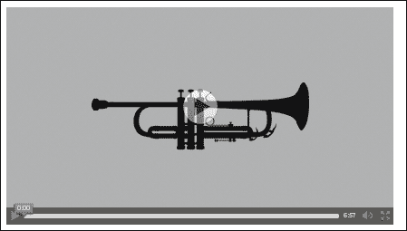

# 第十二章：多媒体

在本章中，我们将涵盖以下配方：

+   播放音频文件

+   播放视频文件

+   自定义媒体元素的控件

+   向您的视频添加文本

+   多媒体嵌入

+   使用 HTML5 音频将文本转换为语音

# 介绍

HTML5 添加了两个元素音频和视频，它们提供了以前使用浏览器插件完成的功能。在大多数情况下，我们发现的播放器都是基于 Flash 的，但最近情况正在改变。大多数浏览器现在对基本的 HTML5 媒体元素相关功能有很好的支持。

播放器的自定义选项非常有限，并且是特定于供应商的。大多数网站都有一些仍然使用 Flash 制作的自定义播放器，因为这是完成工作的最佳方式。

Flash 本身不会突然消失，但是使用开放标准的替代方案总是有说服力的理由。同样的情况也发生在网络游戏行业，HTML5 正在逐渐取代基于 Flash 的游戏市场。

# 播放音频文件

音频元素使得在浏览器中播放音频文件变得简单。这个元素的采用引起了很多争议，主要是因为缺乏格式的共同基础。最初，W3C 规范建议使用 Ogg Vorbis ([`www.vorbis.com/`](http://www.vorbis.com/))格式。

### 注意

有关不同格式的浏览器支持的最新信息可以在`www.caniuse.com`上找到。

在这个配方中，我们将看一下元素和一些可以应用在它上面的基本属性。

## 准备工作

为了播放音频，我们需要一个实际的音频文件。您可以自己选择一个，或者使用示例中附带的文件。该文件将从音乐文件夹中提供。我们将使用 Jason Weinberger & the WCFSO 在免费音乐档案馆[`freemusicarchive.org/music/Jason_Weinberger__the_WCFSO/Jason_Weinberger__the_Waterloo-Cedar_Falls_Symphony_Orchestra/`](http://freemusicarchive.org/music/Jason_Weinberger__the_WCFSO/Jason_Weinberger__the_Waterloo-Cedar_Falls_Symphony_Orchestra/)提供的 Mozart—Clarinet Concerto in A K. 622, II. Adagio。

该文件的类型是`.mp3`，但是为了这个例子，我们还需要一个`.ogg`文件。有很多在线和离线的转换器可用，所以我们可以使用[`media.io`](http://media.io)。例如。如果您不想麻烦，示例文件中还有一个转换后的`song.ogg`文件可用。

## 如何做...

我们将创建一个包含音频播放器的 HTML 文件：

1.  body 部分将包含以下内容：

```html
    <p>
      <audio id="mulipleSrc" controls preload loop>
          Audio not supported
        <source src="img/Jason_Weinberger__the_WCFSO_-_04_-_Mozart_-_Clarinet_Concerto_in_A_K_622_II_Adagio.mp3"type="audio/mpeg" />
        <source src="img/song.ogg" type="audio/ogg" />
    <a href="music/song.ogg">download file </a>
      </audio>
    <p>
```

1.  归因的一小段文字：

```html
    Mozart - Clarinet Concerto in A K. 622, II. Adagio by <a href="http://freemusicarchive.org/music/Jason_Weinberger__the_WCFSO/Jason_Weinberger__the_Waterloo-Cedar_Falls_Symphony_Orchestra/">Jason Weinberger</a> & the WCFSO is licensed under a Creative Commons Attribution License.
    </p>
```

就是这样，您应该在浏览器中有一个可访问的音频播放器。

## 它是如何工作的...

旧的方法是使用`<object>`和`<embed>`，并传递了许多特定于播放器的参数给嵌入的`.swf`文件，看起来像下面的代码：

```html
<object data="somePlayer.swf">
  <param name="quality" value="medium">
</object>
```

新的方法相当简单，我们可以添加一个带有指定`src`属性的音频元素：

```html
<audio src="img/myFile.ogg" autoplay>
  Some fallback HTML code
</audio>
```

这将自动在页面上播放文件，而不给用户关于停止音乐的选项。为了让用户代理呈现播放器，我们添加了属性控件。我们通过设置`src`属性施加的另一个限制是只播放该文件。你可能会想为什么我们需要多个来源，但原因很简单。在当前状态下，一些浏览器支持某些格式，而其他浏览器不支持。如果我们想要在所有现代浏览器中获得支持，那么我们就提供了多个来源的选项。

### 注意

在撰写本文时，这是使用 Windows 操作系统的浏览器格式支持的大致情况。

| 浏览器/功能 | WAV | Opus | Ogg | MP3 | ACC |
| --- | --- | --- | --- | --- | --- |
| Firefox 20 | 是 | 是 | 是 | 否 | 否 |
| Chrome 26 | 是 | 是 | 是 | 是 | 是 |
| IE 9 | 否 | 否 | 否 | 是 | 是 |
| Opera | 是 | 否 | 是 | 否 | 否 |

### 注意

除了提供浏览器支持统计数据的标准网站外，您还可以使用 SoundCloud 完成的测试套件来检查[`areweplayingyet.org/`](http://areweplayingyet.org/)上的各个功能，或者在[`github.com/soundcloud/areweplayingyet`](https://github.com/soundcloud/areweplayingyet)上查看源代码。

源元素允许我们为任何媒体元素指定多个备用资源。它本身没有意义，因此应该是某些媒体标签的一部分。我们可以有多个具有不同`src`、类型和媒体属性的源元素。例如，我们可以有以下元素：

```html
<source src='audio.oga' type='audio/ogg; codecs=flac'>
```

如果您不确定您提供的任何源是否可以在用户的浏览器中使用，您可以在`source`元素上附加`onerror`事件侦听器。这个处理程序可以用来执行一个回退。

还有一些其他属性可以用于媒体元素。除了全局属性外，媒体指定的属性包括：

+   `autoplay`属性：它是一个布尔值属性，定义了浏览器是否应该在具有足够大的媒体文件部分时立即开始播放。该元素的默认状态是缺失，这意味着我们默认情况下没有自动播放。

+   `preload`属性：它向浏览器提供提示，即使用户尚未点击播放，源文件也应该被下载。这里的想法是我们期望将来某个时候会播放文件，相当于将值设置为`auto`。该值也可以设置为`none`，这表明浏览器应该暂停预加载，因为我们不希望用户按下播放按钮。还有一个选项是将值设置为 metadata，这意味着只加载媒体文件的元数据，比如长度。

+   `muted`属性：它也是一个基于布尔值的属性，默认值为 false，表示将没有声音。

+   `loop`属性：它在完成后将音频设置为重新开始。

+   `controls`属性：它简单地添加了播放器控件。

+   `mediagroup`属性：它用于对多个媒体元素进行分组，例如，如果我们希望两个元素使用相同的控件，我们可以设置它们使用相同的媒体组。

+   `crossorigin`属性：它可以指定限制`src`属性符合**跨域资源共享**（**CORS**）。

大多数其他的自定义和 JavaScript 访问将在以下教程中介绍。如果我们使用没有设置控件属性的元素，最好将音频元素的 CSS 设置为`display:none`，以确保它不会占用页面空间。

# 播放视频文件

为了在浏览器中添加对视频的本地支持，HTML5 引入了视频元素。这与音频元素非常相似，因为它们共享共同的接口，所以相同的属性适用。还有一些其他属性仅适用于视频元素。此外，源的编解码器大多不同，对于视频，我们有 H.264/MPEG-4、VP8、VP9 和 Theora。

在这个教程中，我们将看到如何通过创建一个简单的页面来使用内置播放器。

### 注意

HTML5 媒体元素的规范可以在[`www.whatwg.org/specs/web-apps/current-work/multipage/the-video-element.html`](http://www.whatwg.org/specs/web-apps/current-work/multipage/the-video-element.html)找到。

## 准备工作

我们需要一个视频文件来使用我们的播放器，所以您可以自己选择一个。我们选择使用[`archive.org/details/animationandcartoons`](http://archive.org/details/animationandcartoons)上提供的视频之一。

这个视频叫做《Boogie Woogie Bugle Boy》，由《Walter Lantz Productions》制作，在 1941 年被提名奥斯卡奖。

### 注意

Archive.org，也称为互联网档案馆，是一个非营利数字图书馆，其使命是“普遍获取所有知识”。除了是一个图书馆之外，它还托管了各种多媒体。更著名的子项目之一是 wayback machine，[`archive.org/web/web.php`](http://archive.org/web/web.php)，这是一个网站过去状态的快照存档。还有一个名为[nasaimages.org](http://nasaimages.org)的子项目，旨在使 NASA 的图像和视频更接近公众。互联网档案馆提供的数据量非常庞大，使其成为一个很好的信息来源。

此外，我们将使用一个海报图像，在视频开始之前显示该图像；图像名为`poster.png`，是示例源的一部分，但您可以使用任何您喜欢的图像。

## 如何做...

我们创建一个简单的 HTML，其中包含视频元素，并为我们的视频提供一个源：

1.  body 部分将包含以下代码：

```html
    <p>
      <video width="640" height="360" poster="poster.png" controls preload loop>
          Video not supported <a href="http://archive.org/download/WalterLantz-BoogieWoogieBugleBoy1941/WalterLantz-BoogieWoogieBugleBoy1941.ogv"> download </a> instead
        <source src="img/WalterLantz-BoogieWoogieBugleBoy1941.ogv" type="video/ogg" />
      </video>
```

1.  并且归因将包含以下代码：

```html
    <p>
    Video is part of animation shorts on <a href="http://archive.org/details/more_animation"> archive.org</a>. The video
    is titled : Walter Lantz - Boogie Woogie Bugle Boy
    </p>
```

打开后，我们应该有一个运行中的视频播放器，就像以下截图一样：



## 它是如何工作的...

视频元素与音频元素非常相似，所有音频元素的属性都适用于视频元素。视频特定的属性包括：

+   `Width`和`height`：它们表示元素的宽度和高度。控制将调整视频大小以适应指定的大小。视频的实际大小取决于正在播放的文件。

+   `poster`：这是一个属性，使我们能够在用户决定播放视频之前在视频元素上显示静态图像。

通过向视频添加各种属性的组合，我们可以使用户体验更好；在我们的代码示例中，视频将居中显示，因为宽度和高度属性与视频的实际宽度和高度不匹配。

如果我们想要播放视频的特定范围，也有内置的支持。例如，我们可能希望从第 30 秒播放到第 40 秒。要在`src`属性的 URL 中执行此操作，我们在哈希（`#`）后附加一个片段定义，如以下代码所示：

```html
<source src="img/myvideo.ogv#t=30,40" />
```

通用定义如下：

```html
#t=[starttime],[endtime]
```

变量`starttime`和`endtime`是可选的，可以是指定从开始的秒数，也可以是`小时:分钟:秒`的格式。

如果我们想要从第 80 秒播放到视频结束，源将如下所示：

```html
<source src="img/myvideo.ogv#t=80" />
```

视频通常以一些有损压缩格式编码，因为它们作为原始格式传输时非常大。

### 注意

您可以在以下链接中了解有关有损压缩的更多信息[`en.wikipedia.org/wiki/Lossy_compression`](https://en.wikipedia.org/wiki/Lossy_compression)。其主要思想是通过牺牲一定程度的信息和质量来显著减小原始视频的大小。

微软和苹果拥有使用 H.264 的许可证，或者更常见的是通过扩展名`.mp4`或`.m4v`。该编解码器有许多不同的版本和组合，此外，它受 YouTube 和 iTunes 的支持，使其成为一个非常受欢迎的选择。Firefox 和 Chrome 原本计划放弃对其的支持，因为该格式是专有的，并且必须支付一定的特许费，这使得它成为一个非常有争议的选择。Firefox 计划在将来支持该编解码器，但前提是有第三方解码器可用。

### 注意

有关 H.264 的更多信息，请访问[`en.wikipedia.org/wiki/H.264/MPEG-4_AVC`](http://en.wikipedia.org/wiki/H.264/MPEG-4_AVC)。

Ogg Theora 来自[Xiph.org](http://Xiph.org)，这个组织提供了我们在音频元素配方中使用的`.ogg`容器和 Vorbis 音频编解码器，以及其他贡献。这受到 Firefox、Opera 和 Chrome 的支持，但至少默认情况下不受 IE 和 Safari 的支持。

### 注意

有关 Ogg Theora 的更多信息，请访问[`www.theora.org/`](http://www.theora.org/)。

WebM 支持 Vorbis 作为音频编解码器，支持 VP8 作为视频编解码器。VP8 是由一家名为 On2 的公司开发的编解码器，后来被 Google 收购。此外，WebM 原生支持 Chrome、Opera 和 Firefox，至于 IE 和 Safari，用户需要下载额外的插件。

### 注意

有关 WebM 的更多信息，包括格式、工具和相关文档，请访问[`www.webmproject.org/`](http://www.webmproject.org/)。

## 还有更多...

拥有多个来源是好的，但并不总是一个选择。我们还希望为旧浏览器提供备用方案，为此我们必须依赖插件。

如果您引用来自 YouTube 或 Vimeo 等第三方付费网站的视频，您可以简单地放置嵌入播放器的`iframe`：

```html
<iframe width="420" height="345"src="img/WEbzZP-_Ssc">
</iframe>
```

还有一些服务器 JavaScript 库可以使备用过程变得简单。其中之一是[`mediaelementjs.com/`](http://mediaelementjs.com/)。

安装很简单，因为我们只需要包含`.js`和`.css`文件作为依赖项，如下所示：

```html
<code><script src="img/jquery.js"></script>
  <script src="img/mediaelement-and-player.min.js"></script>
  <link rel="stylesheet" href="mediaelementplayer.css" />
</code>
```

至于备用播放器：

```html
<video src="img/myvideo.ogv" />
  <!-- other sources -->
  <object width="320" height="240" type="application/x-shockwave-flash" data="flashmediaelement.swf">
    <param name="movie" value="flashmediaelement.swf" />
    <param name="flashvars" value="controls=true&file=myvideo.mp4" />
    
  </object>
</video>
```

备用播放器只是`mediaelement.js`的众多功能之一；移动浏览器有很多选项，API 也有很多简化。

### 注意

如果您对可能的转换工具或编解码器背后的政策以及对它们的详细解释感兴趣，请查看 Mark Pilgram 的书*Dive into HTML5*，可在[`fortuito.us/diveintohtml5/video.html`](http://fortuito.us/diveintohtml5/video.html)上找到。

还有一篇有趣的文章，标题为“面向所有人的视频”，讨论了在不同浏览器上启用视频支持的主题，[`camendesign.com/code/video_for_everybody`](http://camendesign.com/code/video_for_everybody)。

# 自定义媒体元素的控件

媒体元素，目前是视频和音频，可以使用 JavaScript 进行控制，因为这些元素本身包含有用的方法和属性。在这个配方中，我们将介绍一些最基本的功能和方法，这些功能和方法可以应用在具有`HTMLMediaElement`接口的元素上。

### 注意

HTML5 媒体元素的规范可以在[`www.w3.org/TR/html5/embedded-content-0.html#htmlmediaelement`](http://www.w3.org/TR/html5/embedded-content-0.html#htmlmediaelement)找到。

## 准备工作

在这个配方中，我们还需要一个视频文件，所以我们可以使用上一个配方中的相同视频。

## 如何做...

我们首先创建一个 JavaScript 控制器，它将具有媒体播放器的非常基本的功能。

1.  我们的控制器方法将接受一个命令的选择器并执行该命令，我们需要以下内容：

```html
var videoController = (function () {
  var my = {};
  function findElement(selector){
   var result = document.querySelector(selector);
   if (!result) {
    throw "element " + selector + " not found ";
   }
   return result;
  }

  function updatePlaybackRate(el, speed) {
   el.playbackRate += speed;
  }

  function updateVolume(el, amount) {
   el.volume += amount;
  }

  my.play = function(video) {
   var el = findElement(video);
   el.play();
  }

  my.pause = function(video) {
   var el = findElement(video);
   el.pause();
  }

  my.toggleMute = function(video) {
   var el = findElement(video);
    el.muted = !el.muted;
  }

  my.increasePlaybackRate = function(video, speed) {
   var el = findElement(video);
   updatePlaybackRate(el, speed);
  }

  my.decreasePlaybackRate = function(video, speed) {
   var el = findElement(video);
   updatePlaybackRate(el, -speed);
  }

  my.increaseVolume = function(video, amount) {
   var el = findElement(video);
   updateVolume(el, amount)
  }
  return my;
}());
```

现在在一个简单的场景中，我们可能只需使用标准方法而不添加另一层，但这里的想法是，我们可以根据需要扩展功能，因为我们可以从 JavaScript 中访问元素。

1.  对于 HTML，我们将拥有与播放视频配方中相似的版本。我们将有一些按钮，这些按钮将使用我们的视频控制器，并额外添加一个简单的样式。让我们在头部添加以下内容：

```html
  <head>
    <title>Video custom controls</title>
    <style>
      video {
        box-shadow: 0 0 10px #11b;
      }
    </style>
  </head>
```

1.  身体部分将包含控制按钮：

```html
    <p>
      <video id="theVideo" width="640" height="480" poster="poster.png" preload loop>
          Video playback not supported <a href="http://archive.org/download/WalterLantz-BoogieWoogieBugleBoy1941/WalterLantz-BoogieWoogieBugleBoy1941.ogv"> download </a>
        <source src="img/WalterLantz-BoogieWoogieBugleBoy1941.ogv" type="video/ogg" />
      </video>
    </body>
    <p>
    The Dashboard: <br/>
      <button onclick="videoController.play('#theVideo')">Play</button>
      <button onclick="videoController.pause('#theVideo')">Pause</button>
      <button onclick="videoController.increasePlaybackRate('#theVideo',0.1)">Speed++</button>
      <button onclick="videoController.decreasePlaybackRate('#theVideo',0.1)">Speed-- </button>
      <button onclick="videoController.decreaseVolume('#theVideo', 0.2) ">Vol-</button>
      <button onclick="videoController.increaseVolume('#theVideo', 0.2) ">Vol+</button>
      <button onclick="videoController.toggleMute('#theVideo')">Toggle Mute</button>
    <p>
    Video is part of animation shorts on <a href="http://archive.org/details/more_animation"> archive.org</a>. The video
    is titled : Walter Lantz - Boogie Woogie Bugle Boy
    </p>
```

1.  然后我们将依赖项添加到我们的`example.js`文件中。

```html
<script src="img/example.js"> </script>
```

之后我们应该有一个完全运行的视频播放器。

## 它是如何工作的...

使用 JavaScript，我们可以访问和操作任何媒体元素的属性。这个选项使我们能够对标准元素进行许多不同类型的定制。这些属性大多数在`HTMLMediaElement`中定义；在那里我们可以读取和写入`currentTime`、`playbackRate`、`volume`、`muted`、`defaultMuted`等等。

### 注意

有关更全面的`HTMLMediaElement`属性以及只读属性，请参考[`www.w3.org/TR/html5/embedded-content-0.html#media-elements`](http://www.w3.org/TR/html5/embedded-content-0.html#media-elements)上可用的规范。

通过更改属性，我们可以制作自定义播放器，以及各种不同的视觉更新。媒体元素会触发大量不同的事件。在这些事件上，我们可以附加事件侦听器，并根据状态更改进行更新。以下事件会被触发：`loadstart`、`abort`、`canplay`、`canplaythrough`、`durationchange`、`emptied`、`ended`、`error`、`loadeddata`、`loadedmetadata`、`pause`、`play`、`playing`、`progress`、`ratechange`、`seeked`、`seeking`、`stalled`、`suspend`、`timeupdate`、`volumechange`和`waiting`。

### 注意

事件的名称是不言自明的，如果您对特定事件感兴趣，可以阅读文档了解它们的用途，文档位于[`www.w3.org/TR/html5/embedded-content-0.html#mediaevents`](http://www.w3.org/TR/html5/embedded-content-0.html#mediaevents)。

在我们的示例中，我们可以添加一个监听器来显示当前速率的速率：

```html
  my.displayRate = function (video, output) {
   var vid = findElement(video),
       out = findElement(output);

   vid.addEventListener('ratechange', function(e) {
     console.log(e);
     out.innerHTML = 'Speed x' + this.playbackRate;
   }, false);
  }
```

然后在 HTML 中添加一个输出元素，并调用我们新添加的方法：

```html
    <output id="speed"></output>
    <script>
      videoController.displayRate("#theVideo","#speed");
    </script>
```

现在，第一次播放视频时，速率更改事件会被触发，并且速率设置为`1`。每次连续的速率更改都会触发相同的事件。

### 注意

W3C 在[`www.w3.org/2010/05/video/mediaevents.html`](http://www.w3.org/2010/05/video/mediaevents.html)上有一个关于媒体元素触发的事件的很好的演示。

这里还有一件有趣的事情要注意，`<audio>`元素也可以用于视频文件，但只会播放文件中的音频流。

# 向您的视频添加文本

在显示多语言视频时，我们经常希望为讲其他语言的人提供文本。这是许多会议演讲以及许多电影和电视节目的常见做法。为了在视频中启用外部文本轨道资源，创建了 WebVTT（[`dev.w3.org/html5/webvtt/`](http://dev.w3.org/html5/webvtt/)）标准。

## 准备工作

为简单起见，我们将使用与其他示例中相同的视频以及海报图像。至于其他文件，我们将自己创建它们。您也可以自己选择其他视频，因为视频本身并不那么重要。

## 如何做...

我们从 HTML 开始，其中包括视频元素，另外还添加了轨道元素以及简单的`example.js`。执行以下步骤：

1.  在 body 元素中包括：

```html
    <p>
      <video width="640" height="360" poster="poster.png" controls preload loop>
     Video playback not supported <a href="http://archive.org/download/WalterLantz-BoogieWoogieBugleBoy1941/WalterLantz-BoogieWoogieBugleBoy1941.ogv"> download</a> instead
        <source
        src="img/WalterLantz-BoogieWoogieBugleBoy1941.ogv" type="video/ogg" />
        <track src="img/video.vtt" kind="subtitles" srclang="en" label="English" default />
        <track src="img/karaoke.vtt" kind="captions" srclang="gb" label="Other" />
      </video>
    <p>
    Video is part of animation shorts on <a href="http://archive.org/details/more_animation"> archive.org</a>. The video
    is titled : Walter Lantz - Boogie Woogie Bugle Boy
    </p>
    <script src="img/example.js"></script>
```

1.  JavaScript 只会记录我们的视频元素可用的对象。这里的想法是展示可以通过代码访问和操作轨道。脚本将包含以下内容：

```html
(function(){
  var video = document.getElementById('theVideo'),
      textTracks = video.textTracks;

   for(var i=0; i < textTracks.length; i++){
    console.log(textTracks[i]);
   }
}())
```

1.  至于我们为轨道创建的`.vtt`文件，我们将手动创建它们。文件`video.vtt`将包含以下内容：

```html
WEBVTT

1
00:00:01.000 --> 00:00:13.000
this is the video introduction

2
00:00:15.000 --> 00:00:40.000
There is also some awesome info in
multiple lines.
Why you ask?
Why not ...

3
00:00:42.000 --> 00:01:40.000
We can use <b>HTML</b> as well
<i> Why not?</i>

4
00:01:42.000 --> 00:02:40.000
{
"name": "Some JSON data",
"other": "it should be good for meta data"
}

5
00:02:41.000 --> 00:03:40.000 vertical:lr
text can be vertical

6
00:03:42.000 --> 00:04:40.000 align:start size:50%
text can have different size relative to frame
```

1.  至于`karaoke.vtt`，它将包含以下代码：

```html
WEBVTT

1
00:00:01.000 --> 00:00:10.000
This is some karaoke style  <00:00:01.000>And more <00:00:03.000> even more  <00:00:07.000>  
```

运行示例后，我们应该在给定范围内有字幕。

### 提示

如果您手动构建 WebVTT 文件，您会注意到很容易出错。有一个很好的验证器可用于[`quuz.org/webvtt/`](http://quuz.org/webvtt)，源代码在[`github.com/annevk/webvtt`](https://github.com/annevk/webvtt)上。

## 它是如何工作的...

视频已经有一段时间了，但添加字幕并不是一个选择。轨道元素以标准方式使我们能够向视频添加信息。轨道不仅用于字幕，还可以用于其他类型的定时提示。

### 注意

*cue*这个词的一般定义是，它代表了一个说或做的事情，作为一个信号，让演员或其他表演者进入或开始他们的讲话或表演。

Cues 可以包含其他数据格式，如 JSON、XML 或 CSV。在我们的示例中，我们包含了一个小的 JSON 数据片段。这些数据可以以许多不同的方式使用，因为它与特定时间段相关联，但字幕并不是它的真正用途。

轨道元素的`kind`属性可以包含以下值：

+   **字幕**：这是给定语言的转录或翻译。

+   **字幕**：它与字幕非常相似，但也可以包括音效或其他音频。这种类型的主要意图是用于音频不可用的情况。

+   **描述**：这是视频的文本描述，用于在视觉部分不可用的情况下使用。例如，它可以为盲人或无法跟随屏幕的用户提供描述。

+   **章节**：此轨道可以包含给定时期的章节标题。

+   **元数据**：这是一个非常有用的轨道，用于存储以后可以由脚本使用的元数据。

除了`kind`属性之外，还有`src`属性是必需的，并显示轨道源的 URL。轨道元素还可以包含`srclang`，其中包含定时轨道的语言标签。

### 注意

语言标签通常具有两个字母的唯一键，用于表示特定语言。有关更多详细信息，您可以查看[`tools.ietf.org/html/bcp47`](http://tools.ietf.org/html/bcp47)。

还有一个`default`属性，如果在轨道上存在，则该轨道将成为默认显示的轨道。

此外，我们还可以使用`label`属性，该属性可以具有自由文本值，用于指定元素的唯一标签。

### 注意

轨道元素的一个巧妙用法可以在以下网址找到：[`www.samdutton.net/mapTrack/`](http://www.samdutton.net/mapTrack/)。

WebVTT 标准定义了文件需要以字符串"WEBVTT"开头。在此之后，我们有提示定义，零个或多个此类元素。

每个提示元素具有以下形式：

```html
[idstring]
[hh:]mm:ss.ttt --> [hh:]mm:ss.ttt [cue settings]
Text string
```

`idstring`是一个可选元素，但如果我们需要使用脚本访问提示，则最好指定它。至于`timestamp`，我们有一个标准格式，其中小时是可选的。第二个`timestamp`必须大于第一个。

文本字符串允许包含简单的 HTML 格式，如`<b>`，`<i>`和`<u>`元素。还有一个选项可以添加`<c>`元素，用于为文本的部分添加 CSS 类，例如`<c.className>styled text </c>`。还有一个选项可以添加所谓的语音标签`<v someLabel> the awesome text </v>`。

提示设置也是可选的，并且在时间范围之后附加。在此设置中，我们可以选择文本是水平显示还是垂直显示。设置是区分大小写的，因此它们必须像示例中显示的那样小写。可以应用以下设置：

+   **垂直**：它与值`vertical:rl`一起使用，其中`rl`代表从右到左的书写，`vertical:lr`代表从左到右。

+   **行**：此设置指定文本将在垂直方向显示的位置，或者在我们已经使用垂直时，它指定水平位置。该值用百分比或数字指定，其中正值表示顶部，负值表示底部。例如，`line:0`和`line:0%`表示顶部，`line:-1%`或`line:100%`表示底部。

+   **位置**：这是一个设置，用于指定文本在水平方向上显示的位置，或者如果我们已经设置了垂直属性，则指定文本在垂直方向上显示的位置。它的值应该在 0 到 100 之间。例如，可以是`position:100%`表示右侧。

+   **大小**：它指定文本区域的宽度/高度，以百分比表示，具体取决于附加的垂直设置。例如，`size:100%`表示文本区域将显示。

+   **对齐**：这是一个属性，用于设置文本在由大小设置定义的区域内的对齐方式。它可以具有以下值`align:start`，`align:middle`和`align:end`。

在文本字符串中，我们还可以按照给定单词的更详细的出现顺序，以一种卡拉 OK 的风格。例如，参见以下内容：

```html
This is some karaoke style  <00:00:02.000>And more <00:00:03.000>
```

它说明在 2 秒之前我们有一些文本，活动提示`And more`在 2 到 3 秒之间。

关于文本字符串的另一点是，它不能包含字符串`-->`，和字符`<`，因为它们是保留字符。但不用担心，我们总是可以使用转义版本，例如`&amp;`代替`&`。

如果我们使用文件进行元数据跟踪，则不适用这些限制。

## 还有更多...

我们还可以使用 CSS 样式文本。如前所述，VTT 文件可以包含带有`<c.someClass>`的轨道，以进行更精细的样式设置，但在一般情况下，我们希望对整个轨道应用样式。可以对所有提示应用样式：

```html
::cue  {
        color: black;
        text-transform: lowercase;
        font-family: "Comic Sans";
}
```

但是，通过将他们的字幕设置为 Comic Sans，您可能会使用户感到疏远。

过去的提示`::cue:past{}`和`::cue:future{}`也有选择器，对于制作卡拉 OK 式的渲染很有用。我们还可以使用`::cue(selector)`伪选择器来定位匹配某些条件的节点。

并非所有功能在现代浏览器中都完全可用，目前写作时最兼容的是 Chrome，因此对于其他浏览器来说，使用 polyfill 是一个好主意。一个这样的库是[`captionatorjs.com/`](http://captionatorjs.com/)，它为所有现代浏览器添加了支持。除了为 WebVTT 添加支持外，它还支持格式如`.sub`、`.srt`和 YouTube 的`.sbv`。

还有另一种为视频轨道开发的格式。它的名字是**定时文本标记语言**（**TTML**）1.0 [`www.w3.org/TR/ttaf1-dfxp/`](http://www.w3.org/TR/ttaf1-dfxp/)，目前只有 IE 支持，没有计划在其他浏览器中获得支持。这个标准更复杂，基于 XML，因此更加冗长。

# 嵌入多媒体

媒体元素可以与其他元素合作并组合在一起。各种 CSS 属性可以应用于元素，并且有选项将视频与 SVG 组合。我们可以在画布元素中嵌入视频，并对渲染的图像应用处理。

在这个示例中，我们将创建一个简单的情况，其中我们在画布中嵌入一个视频。

## 准备工作

在这个示例中，我们将需要一个视频用于我们的视频元素，另一个要求是视频具有跨域资源共享支持，或者位于我们的本地服务器上。确保这一点的最简单方法是使用我们本地运行的服务器上的视频。

### 注意

在[`www.spacetelescope.org/videos/astro_bw/`](http://www.spacetelescope.org/videos/astro_bw/)的 NASA 和 ESA 提供了许多不同格式的视频。

## 如何做到...

我们将通过以下步骤在画布元素上渲染视频：

1.  首先从 HTML 文件开始，我们添加一个视频元素和一个画布：

```html
      <video id="myVideo" width="640" height="360" poster="poster.png" controls preload>
          Video not supported
        <source src="img/video.mp4" type="video/mp4" />
      </video>
        <canvas id="myCanvas" width="640" height="360"> </canvas>
        <button id="start">start showing canvas </button>
    <script src="img/example.js"> </script>
```

1.  我们的 JavaScript 代码示例将附加事件处理程序，以在画布元素上开始渲染视频的灰度版本：

```html
(function (){
  var button = document.getElementById('start'),
      video = document.getElementById('myVideo'),
      canvas = document.getElementById('myCanvas');

  button.addEventListener("click", function() {
    console.log('started drawing video');
    drawVideo();
  },false);

  function drawVideo(){
   var context = canvas.getContext('2d');
   // 0,0 means to right corner
  context.drawImage(video, 0, 0);
   var pixels = context.getImageData(0,0,640,480);
   pixels = toGrayScale(pixels);
   context.putImageData(pixels,0,0);
   // re-draw
   setTimeout(drawVideo,10);
  }

  function toGrayScale(pixels) {
    var d = pixels.data;
    for (var i=0; i<d.length; i+=4) {
      var r = d[i],
          g = d[i+1],
          b = d[i+2],
          v = 0.2126*r + 0.7152*g + 0.0722*b;
      d[i] = d[i+1] = d[i+2] = v
    }
    return pixels;
  };
}())
```

我们应该有一个运行的示例。这里的另一个附加说明是，我们的原始视频应该是彩色的，以便注意到差异。

## 它是如何工作的...

视频元素应该在这一点上是清晰的，至于画布，我们将从限制开始。在画布上绘制图像有 CORS 限制。这种安全约束实际上是有道理的，因为我们正在从图像中读取数据并根据此执行代码。这可能会被一些恶意来源利用，因此添加了这些约束。

使用`canvas.getContext('2d')`，我们可以获得一个绘图上下文，可以在其中绘制来自视频元素的当前图像。在绘制图像时，我们可以修改单个像素。这使我们有可能在视频上创建滤镜。

对于我们的示例，我们创建了一个简单的灰度滤镜。滤镜函数`toGrayScale`遍历像素数据，因为每三个值代表 RGB 中像素的颜色，我们读取它们的数据并创建一个调整后的值：

```html
  v = 0.2126*r + 0.7152*g + 0.0722*b;
```

接下来，我们将调整后的值应用于所有三个值。这些魔术数字被选择为了补偿红色和蓝色值，因为人眼对它们的平均值不太敏感。我们可以在这里使用三个值的平均值，结果会类似。

### 注意

如果您对其他滤镜感兴趣，可以在[`www.html5rocks.com/en/tutorials/canvas/imagefilters/`](http://www.html5rocks.com/en/tutorials/canvas/imagefilters/)上找到一篇关于这个主题的好文章，这些滤镜适用于图像，但同样适用于视频。

## 还有更多...

另一个值得一看的有趣演示是类似立方体的视频播放器，[`html5playbook.appspot.com/#Cube`](http://html5playbook.appspot.com/#Cube)，它使用各种不同的方式来创建酷炫的效果。

如果您对在 HTML5 应用程序中处理和合成音频感兴趣，可以在[`www.w3.org/TR/webaudio/`](http://www.w3.org/TR/webaudio/)上找到一个新的高级 API，可以实现这一点。

# 使用 HTML5 音频将文本转换为语音

如果我们今天要构建基于网络的导航应用程序，大部分组件已经可以使用。有 Google 地图或开放街道地图组件来显示地图，以及提供驾驶路线的 API 服务。

但是关于基于语音的导航指引呢？那不是需要另一个将文本转换为语音的 API 服务吗？

由于 HTML5 音频和 Emscripten（一个 C 到 JavaScript 编译器），我们现在可以在浏览器中完全使用名为 espeak 的免费文本到语音引擎。

在这个例子中，我们将使用 espeak 来生成用户在简单页面上输入的文本。大部分工作将包括准备工作-我们需要设置`espeak.js`。

## 准备好了

我们需要从([`github.com/html5-ds-book/speak-js`](http://github.com/html5-ds-book/speak-js))下载 speak.js。单击下载 zip 按钮并将存档下载到新创建的文件夹中。在该文件夹中提取存档-它应该创建一个名为`speak-js-master`的子文件夹。

## 如何做...

执行以下步骤：

1.  创建包含文本输入字段和“说话”按钮的页面`index.html`：

```html
<!doctype html>
<html>
  <head>
    <script src="img/jquery.min.js"></script>
    <script src="img/speakClient.js"></script>
    <script src="img/example.js"></script>
    <meta charset="utf8">    
  </head>
  <body>
    <div id="audio"></div>
    <input type="text" id="text" value="" placeholder="Enter text here">
    <button id="speak">Speak</button>
  </body>
</html>
```

1.  创建`example.js`并为按钮添加点击操作：

```html
$(function() {
    $("#speak").on('click', function(){
        speak($("#text").val());
    });
});
```

1.  从命令行安装`http-server`（如果尚未安装），然后启动服务器：

```html
npm install -g http-server
http-server
```

1.  在浏览器中打开[`localhost:8080`](http://localhost:8080)并测试演示。

## 它是如何工作的...

将文本转换为语音的引擎是 eSpeak ([`espeak.sourceforge.net/`](http://espeak.sourceforge.net/))。这个引擎是用 C 编写的，然而，浏览器原生支持的唯一语言是 JavaScript。我们如何在浏览器中使用这个引擎？

Emscripten 是一个旨在解决这一限制的编译器。它接受由 LLVM 编译器从 C 或 C++源代码生成的 LLVM 字节码，并将其转换为 JavaScript。Emscripen 利用了许多现代 JavaScript 特性，如类型化数组，并依赖于现代优化 JavaScript JIT 编译器的出色性能。

为了避免阻塞浏览器，语音生成器是从在`speakClient.js`中创建的 Web Worker 中调用的。生成的 WAV 数据由工作线程传回，转换为 base64 编码，并作为数据 URL 传递给新创建的音频元素。然后，该元素被附加到页面上的#audio 元素上，并通过调用`play`方法来激活播放。

## 还有更多...

Espeak 根据 GNU GPL v3 许可证授权。因此，它可能不适用于专有项目。

有关 Emscripten 的更多信息可以在 Emscripten 维基上找到：[`github.com/kripken/emscripten/wiki`](https://github.com/kripken/emscripten/wiki)。
