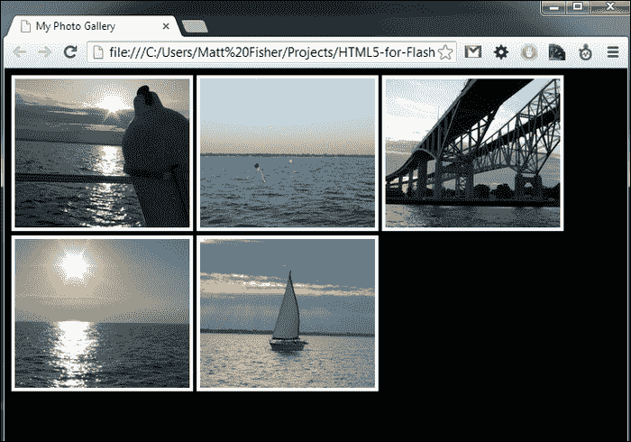
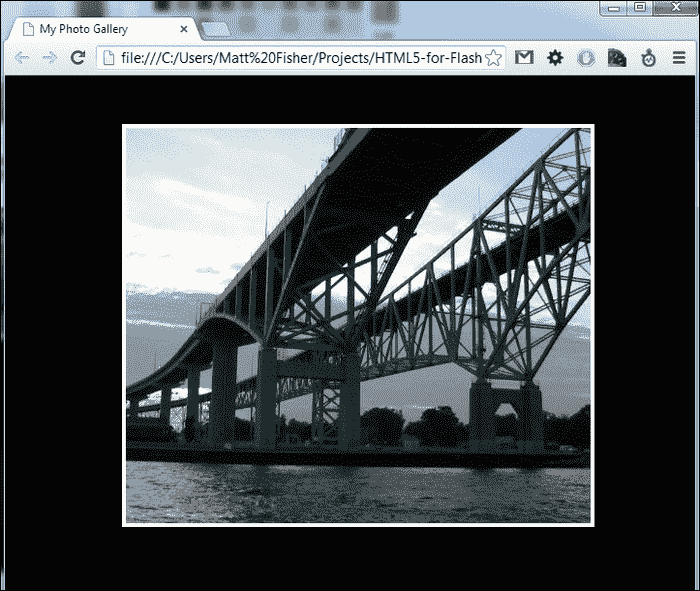

# 第一章：为什么选择 HTML5？

在开始之前，重要的是您了解 HTML5 是什么，它是如何工作的，以及它与您作为 Flash 开发人员已经了解的内容有何关联。本书在比较 HTML5 的功能与 Flash 开发人员通常在 Flash 中创建应用程序时习惯使用的功能时，使用 Adobe Flash（CS6）作为参考。因此，要正确地跟随本书中的示例，需要对 Adobe Flash IDE 和 ActionScript 3 有扎实的了解。

在本章中，您将学到：

+   HTML5 实际上是什么，其中包括哪些技术

+   将 HTML5 开发添加到您的技能集中的原因

+   避免从 Flash 开发转换中涉及的初始问题

+   现代浏览器与 HTML5 功能的兼容性

# 理解 HTML5

作为 Flash 开发人员，您可能经常甚至每天都使用 HTML 作为在 Web 上发布编译后的 Adobe Flash SWF 文件的平台。虽然安装了 Flash Player 的 Web 浏览器可以查看独立的 SWF 文件，但将 Flash 内容嵌入 HTML 文档是正常的做法。由于 HTML 的简单语法和可用性，许多甚至不是开发人员的人已经学会了传统的 HTML 开发技术。不幸的是，早期的 HTML 规范在许多在线显示内容的领域存在不足。创建丰富的交互体验、共享多媒体资产或创建基于 Web 的用户界面以更典型的软件方式运行等常见任务变得非常繁琐，甚至不可能。最近，许多 Web 上的这些功能已经使用 HTML5 重新制作，使用户可以以相同的方式访问内容，但不需要使用 Adobe Flash Player 等技术。

构建可以全球访问的高质量基于 Web 的内容是成功产品或服务的关键。Facebook、Google 和 Twitter 都在使用 HTML5 来改善其应用程序的用户体验，并向用户提供内容，而无需第三方插件。越来越多的企业通过利用 HTML5 开发堆栈在桌面和移动 Web 浏览器以及两个平台上的可安装应用程序上进行应用开发，从而节省时间、资源和金钱。

将您的 Flash 开发技能转换为 HTML5 是一个有趣的过程，不仅会为您在职业上开启更多机会，还能让您更好地分析什么工具适合当前的工作。Adobe Flash 在短期内不会消失，但同样可以轻松地说 HTML5 也是如此。

由于许多开发人员从以前与 HTML 无关的 Web 和应用程序开发技术转向 Flash 开发，让我们从 HTML5 堆栈的基本知识开始。

## 什么是 HTML5？

HTML5 是由万维网联盟（[`www.w3.org/`](http://www.w3.org/)）开发的 HTML 标准的第五个也是最新的版本。作为一个新版本，它为现有的 HTML 规范带来了一些新功能，并删除了一些旧的过时功能。许多这些新功能和现有功能开始与 Adobe Flash 中的功能集紧密相似，从而开启了许多不依赖于付费应用程序或浏览器插件（如 Adobe Flash Player）的新的 Web 开发方面。

HTML5 规范的开发仍在进行中，并计划在 2014 年某个时候完成并发布，但今天大多数现代 Web 浏览器已经支持规范的许多功能。

一般来说，对 HTML5 的引用通常涉及到一套功能和技术，不仅涉及到 HTML，还涉及到**层叠样式表**（**CSS**）以及**JavaScript**。如果没有使用 CSS 和 JavaScript，即使是 HTML5 文档，其功能和外观仍然会非常简单。因此，学习 HTML5 实际上是在同时学习三种技术。尽管听起来很繁琐，但 Adobe Flash 的设置方式非常相似。Flash IDE 允许轻松创建、编辑和引用要在应用程序中使用的资产。要将这些资产集成到动态交互式应用程序中，需要使用**ActionScript**。HTML5 与此非常相似，其中 HTML 和 CSS 将是您的 Flash IDE，而 JavaScript 将是 ActionScript 的替代品。考虑到所有这些，让我们继续审查构建 HTML 的标准。

## HTML 标准

**万维网联盟**（[`www.w3.org/`](http://www.w3.org/)）或**W3C**负责创建今天 HTML 开发的标准。这些 Web 开发标准是为了统一开发人员创建网页的语法和功能，以及在 Web 浏览器中集成的功能集，以便在 HTML 中启用这些功能。通过以符合 HTML 规范标准的标记编写 Web 应用程序，开发人员可以更好地确保他们的内容将被正确显示，无论用户选择如何查看它。

## HTML 语法

尽管看起来微不足道，HTML 语法是所有网页的核心。无论是在 HTML 文件中硬编码，从另一个编程语言源编译，还是在应用程序运行时注入到文档中，HTML 语法都是 HTML 页面中使用的资产的蓝图。开发人员对 HTML 语法及其限制的理解越深入，构建应用程序就会越容易。

HTML 语法是使用包裹在尖括号中的标签元素编写的。HTML 标签有两种不同的类型：成对的或空元素。成对的 HTML 标签是最常见的，也是创建 HTML 文档时通常使用的第一种标签样式。`html`标签用于声明 HTML 文档中的内容，并通常位于 HTML 文件的第一行和最后一行：

```html
<html>
  Add your HTML content here.
</html>
```

如前面的例子所示，成对标签打开和关闭一个容器，以便更多的 HTML 元素放置在其中。标签的格式始终相同，成对标签之间唯一的区别是使用斜杠来声明标签正在关闭一个元素。因此，`<html>`将不会与不包含相同内部值的任何标签配对。HTML 标签不区分大小写，在早期，开发人员在编写标签时通常总是使用大写。这种传统现在已经消失，你几乎总是会看到标签以小写形式书写。

空的 HTML 标签是不使用闭合标签写的。例如，在 HTML 文档中放置图像引用时，没有更多的 HTML 元素内容可以放置在该图像中。因此，在 HTML 中，图像引用的格式如`<imgsrc="img/my_image.jpg">`。通过将`src`参数附加到`img`标签中，并将其值设置为图像位置来引用图像。

### 提示

如果您已经成功使用**Adobe Flex**构建任何 Flash 内容并利用**MXML**用户界面标记语言，您可能已经掌握了使用诸如`<imgsrc="img/my_image.jpg" />`这样的语法来关闭空标签元素。在 HTML5 中，这个尾部的斜杠是不需要的，但如果您添加它，仍然会正确呈现您的内容。为了最佳使用情况，请尽量养成在 HTML5 项目中不使用它的习惯。

在调试 HTML 时，HTML 是一个棘手的问题；语法错误的文档不会像传统的 Flash 应用程序一样在加载时显示错误。编写干净简洁的 HTML 是保持无错误、标准、符合规范的网页的关键。有许多应用程序和工具可用于帮助开发干净的 HTML 代码，其中一些将在本书的后面部分介绍。W3C 创建了一个强大的 HTML 语法验证服务，可以检查公开可用的网站的 HTML 错误([`validator.w3.org/`](http://validator.w3.org/))。

## HTML 元素

每个 HTML 规范版本都有一组特定的标签可供开发人员在创建 HTML 文档时使用。W3C 定义的 HTML5 规范中当前的元素列表可以在其语言参考文档中找到([`www.w3.org/TR/html-markup/elements.html`](http://www.w3.org/TR/html-markup/elements.html))。

在 HTML5 规范中，对于媒体集成到网页中，开发人员可以使用一些非常有趣的新元素。例如，通过添加`audio`和`video`标签，现在可以避免嵌入音频或视频时对 Flash 的要求。这些令人兴奋的新媒体标签将在第三章中更深入地介绍，*可伸缩性、限制和效果*。

## 引入样式

层叠样式表或 CSS 是用于为 HTML 元素设置样式的主要方法。与 HTML 一样，在 CSS 中有一组样式列表，您可以将其应用于 HTML 文档中的元素。要了解可用于您的 CSS 属性的想法，请转到[`www.w3schools.com/cssref/`](http://www.w3schools.com/cssref/)查看完整列表。CSS 可以以多种不同的方式应用于 HTML 元素。传统上，CSS 语法存储在外部的`.css`文件中，并从 HTML 文档的`head`元素中引用。但是，CSS 也可以直接附加到 HTML 文档中的元素中，方法是在`body`标记内的几乎任何元素中添加`style`参数：

```html
<imgsrc="img/my_image.jpg" style="border:5px solid #000000;">
```

在上一个示例中，使用`style`参数在图像元素上应用了一个 5 像素宽的黑色边框，该图像在`src`参数中引用。

### 提示

**下载示例代码**

您可以从[`www.packtpub.com`](http://www.packtpub.com)的帐户中下载您购买的所有 Packt 图书的示例代码文件。如果您在其他地方购买了本书，可以访问[`www.packtpub.com/support`](http://www.packtpub.com/support)并注册以直接通过电子邮件接收文件。

如果您的页面中有五个图像，甚至 100 个图像需要应用相同的样式到每个元素，那该怎么办？将完全相同的`style`参数应用于每个图像标记不仅耗时，而且会导致代码过大，可能极难维护或更新。CSS 可以通过使用`class`或`id` HTML 参数来针对单个元素或一组元素：

```html
<div id="photo-gallery">
  <imgsrc="img/photo1.jpg" class="photo">
  <imgsrc="img/photo2.jpg" class="photo">
  <imgsrc="img/photo3.jpg" class="photo">
  <imgsrc="img/photo4.jpg" class="photo">
  <imgsrc="img/photo5.jpg" class="photo">
</div>
```

在前面的示例中，我们尝试在 HTML 文档中显示一组不同的图像。每个图像，使用`img`元素标记引用，并附加了一个值为`photo`的`class`参数。`class` HTML 参数可以在几乎任何可用的元素上使用和重复使用，并允许您引用一组元素，而不是直接修改每个元素。所有图像也都包含在一个`div`元素中。`div`元素用作显示内容的容器。在这种情况下，`div`元素的`id`参数设置为`photo-gallery`。`id` HTML 参数与`class`非常相似，但可以在同一 HTML 文档中重复使用相同的`id`值。

### 提示

通过使用设置为辅助 HTML5 语法的代码编辑应用程序，可以简化编辑 HTML、CSS 和 JavaScript。推荐使用**Aptana**（[`aptana.com/`](http://aptana.com/)）、**Dreamweaver**（[`adobe.com/products/dreamweaver.html`](http://adobe.com/products/dreamweaver.html)）和**Sublime Text**（[`sublimetext.com/`](http://sublimetext.com/)）等应用程序。然而，如果你喜欢简单，可以随意使用其他工具。

考虑到所有这些，编写 CSS 来为这个相册添加样式可以按以下方式完成：

```html
<!DOCTYPE html>
<html>
  <head>
    <title>My Photo Gallery</title>

    <!-- Our Photo Gallery CSS Styles -->
    <style type="text/css">
      body {
        background-color:#000000;
      }

      #photo-gallery {
        width:100%;
      }

      #photo-gallery .photo {
        width:200px;
        border:4px solid #ffffff;
      }
    </style>
  </head>
  <body>
    <div id="photo-gallery">
      <imgsrc="img/photo1.jpg" class="photo">
      <imgsrc="img/photo2.jpg" class="photo">
      <imgsrc="img/photo3.jpg" class="photo">
      <imgsrc="img/photo4.jpg" class="photo">
      <imgsrc="img/photo5.jpg" class="photo">
    </div>
  </body>
</html>
```

现在，我们可以在`head`元素内使用`style`标签来放置原始的 CSS 代码，而不是将`style`参数应用到文档中的每个元素。在前面的例子中，HTML 元素以三种不同的方式被选中。首先，通过使用其十六进制值，将文档的背景颜色设置为黑色。我们通过简单地使用标签引用来选择`body`标签元素。这种选择原始元素的方法可以用于文档中的各种元素，但会影响具有该引用的所有元素。第二种选择方法是查找具有特定 ID 的元素。为了指定使用 ID，需要在 ID 值前面加上`#`。因此，`#photo-gallery`将选择具有`id`参数设置为`photo-gallery`的`div`元素。我们将相册容器的`width`参数设置为`100%`，这是根据查看 HTML 文档时的浏览器宽度计算的。最后，为了为相册中的每个图像添加样式，我们为应用到 HTML 文档的每个图像标签的类添加样式。由于`class` HTML 参数可以应用于 HTML 文档中无限数量的元素，我们可以通过将 CSS 元素选择链接在一起来具体地定位另一个元素中的类。在 CSS 中，通过在类名前面添加`.`来选择类。因此，`#photo-gallery .photo`将仅选择具有`photo`类名的元素，这些元素位于具有`id`为`photo-gallery`的元素内：



## 交给 JavaScript

仅使用 CSS 来为 HTML 元素添加样式只能让你走得更远。从 Flash 开发者的角度来看，HTML 和 CSS 在效果上等同于 Flash IDE。缺少的是驱动应用程序内交互和功能的代码。在使用 Flash 时，创建强大应用程序时，ActionScript 是首选的武器。在开发 HTML5 内容时，JavaScript 将会发挥作用，使你的 HTML 元素焕发生机。

## 什么是 JavaScript？

JavaScript 自上世纪 90 年代中期就存在，并已成长为最流行的脚本语言之一。JavaScript 通过添加内容修改、动画、3D 图形、表单提交和数据检索等功能，为 HTML 文档增添了生机，而无需重新加载活动的 HTML 文档。这些功能使得 Web 内容更像传统软件应用程序，而不是静态网页。

与 ActionScript 3 不同，JavaScript 是一种真正的脚本语言，因为它不需要预处理或编译就可以运行。就像 HTML 和 CSS 一样，JavaScript 文档的源代码在用户请求时发送到用户端并在客户端执行。因此，与 ActionScript 等技术不同，JavaScript 源代码是公开可见的。

## JavaScript 的作用

回顾我们的`我的照片库`示例，一个重要的缺失功能是查看所选照片的大尺寸。JavaScript 是一个完美的平台，可以通过它的主要用途将交互性带入 HTML 文档。使用现有的代码示例，我们可以通过在页面主体底部添加一个新的`div`元素来扩展其功能，以包含更大的图像视图。这个元素可以是空的，因为我们不希望在页面加载时默认显示照片。最后，我们在`div`标签上设置一个标识符`id="photo-display"`，这将允许我们从 CSS 和 JavaScript 中定位该元素中的内容：

```html
<div id="photo-display"></div>
```

在集成 JavaScript 功能之前，我们需要使用`#photo-display`附加一些 CSS 样式到`div`，以允许所选照片以更高分辨率填充浏览器窗口，这是大多数照片库显示的典型特征。在 CSS 样式中，我们已经为此示例设置了一些样式属性，我们将在`#photo-display`元素中附加一些更多的样式属性：

```html
#photo-display {
  display:none;
  position:absolute;
  top:0;
  width:100%;
  height:100%;
  background-color:#000000;
  text-align:center;
}

#photo-display img {
  margin:auto;
  margin-top:50px;
  max-height:800px;
  border:4px solid #ffffff;
}
```

这个 CSS 将只针对一个特定的`div`，因为我们使用了`#photo-display`语法来定位它。为了开始样式，我们从最重要的参数`display:none`开始，这会在页面加载时隐藏元素。这在我们的情况下是完美的，因为我们不希望在页面加载时看到全屏显示。通过为`#photo-display`元素的样式定义添加`position:absolute`和`top:0`，我们将在 HTML 主体中声明的先前元素的顶部显示该元素。在`#photo-display`上设置的其余样式都很容易理解。CSS 的下一行专门针对具有`photo-display`类的`div`中的`img`元素。我们可以在 CSS 中通过链接标识符来做到这一点。在这种情况下，我们为自定义命名的元素 ID 内的图像标签元素指定这些样式。

在 HTML 和 CSS 中显示所选照片的大尺寸版本后，下一步是添加 JavaScript 代码，以便在用户交互时在`#photo-display`容器中显示所选照片。为了将这个示例整合到一个文件中，我们将在 HTML 的`script`元素中添加 JavaScript：

```html
<!-- Our Photo Gallery JavaScript Source -->
<script>
  var largeImage = new Image();

  // Display a specific photo in the large
  // photo display element.
  var displayPhoto = function(source) {
    // If there is already an image inside the display
    // remove it.
    if(largeImage.src != '') {
      document.getElementById("photo-display").removeChild(largeImage);
    }

    // Update the source location of the image
    largeImage.src = source;
    document.getElementById("photo-display").appendChild(largeImage);

    // Display the large photo element.
    document.getElementById("photo-display").style.display = 'block';
  }

  // Closes the large photo display element.
  var closePhotoDisplay = function() {
    document.getElementById("photo-display").style.display = 'none';
  }
</script>
```

作为 Flash 开发人员，以前的函数语法应该看起来很熟悉。在函数范围内的一个重大变化是变量语法。与 AS3 不同，HTML 以及源变量都不是严格类型的。这适用于 JavaScript 语法中的所有变量，这可能是 Flash 开发人员对 JavaScript 最大的问题之一。

除了对源变量进行一些字符串操作以生成`img` HTML 元素之外，该方法还引用了文档对象。加载到浏览器中的每个 HTML 文档都成为 JavaScript 中可访问的文档对象。JavaScript 中的文档对象具有许多内置属性和方法，可用于访问视图 HTML 文档中的信息和元素。在我们的示例中，我们利用了易于定义的文档对象方法`getElementById()`。正如方法名称所暗示的那样，当提供 HTML 元素的 ID 时，将返回对 HTML 文档中元素的引用，以便在脚本中使用。由于 JavaScript 支持属性的链接，我们可以应用`innerHTML`属性来操作 HTML 元素的内部内容，以及`style`属性来更改元素的 CSS 属性。

为了使用户在查看完照片后能够关闭图像，我们将在示例中添加第二个 JavaScript 函数，以恢复显示照片时所做的所有更改。由于当用户点击新图像时，`photo-display`图像将被更新，我们的`closePhotoDisplay`方法所需做的就是隐藏可见元素，以再次显示完整的照片库：

```html
functionclosePhotoDisplay() {
  document.getElementById("photo-display").style.display = 'none';
}
```

将`#photo-display`元素的`style.display`设置回`none`会隐藏整个元素，并将用户界面恢复到初始状态。

将事件添加到每张照片中可以通过向目标元素附加`onclick`参数来轻松实现。添加如下：

```html
<imgsrc="img/photo1.jpg" class="photo"onclick="displayPhoto('photo1.jpg')">
```

现在，当单击图像时，`onclick`事件将被触发并运行参数中声明的 JavaScript 代码。在这种情况下，我们利用这个机会来调用我们之前编写的 JavaScript 块中的`displayPhoto`方法。在调用中，我们提供所需的源变量，这将是图像文件名作为`String`数据类型。这将允许在`#photo-display`元素中使用正确的图像引用。将所有内容放在一起，我们更新的带有`id="#photo-gallery"`的`div`标签现在看起来像下面这样：

```html
<div id="photo-gallery">
  <imgsrc="img/photo1.jpg" class="photo"onclick="displayPhoto('photo1.jpg')">
  <imgsrc="img/photo2.jpg" class="photo"onclick="displayPhoto('photo2.jpg')">
  <imgsrc="img/photo3.jpg" class="photo"onclick="displayPhoto('photo3.jpg')">
  <imgsrc="img/photo4.jpg" class="photo"onclick="displayPhoto('photo4.jpg')">
  <imgsrc="img/photo5.jpg" class="photo"onclick="displayPhoto('photo5.jpg')">
</div>
```

最后，为了使用户能够关闭`#photo-display`元素中的打开图像，我们将应用一个`onclick`事件来调用我们的`closePhotoDisplay`方法。我们将事件应用于`#photo-display`元素中的图像，而是将其定位到显示本身，允许用户在浏览器中的任何位置单击以关闭显示：

```html
<div id="photo-display" onclick="closePhotoDisplay()"></div>
```

将所有这些代码片段放在一起，画廊源现在看起来像下面这样：

```html
<!DOCTYPE html>
<html>
  <head>
    <title>My Photo Gallery</title>

    <!-- Our Photo Gallery CSS Styles -->
    <style type="text/css">
      body {
        background-color:#000000;
      }

      #photo-gallery {
        width:100%;
      }

      #photo-gallery .photo {
        width:200px;
        border:4px solid #ffffff;
      }

      #photo-display {
        display:none;
        position:absolute;
        top:0;
        width:100%;
        height:100%;
        background-color:#000000;
        text-align:center;
      }

      #photo-display img {
        margin:auto;
        margin-top:50px;
        max-height:800px;
        border:4px solid #ffffff;
      }
    </style>

    <!-- Our Photo Gallery JavaScript Source -->
    <script>
      var largeImage = new Image();

      // Displays a specific photo in the large
      // photo display element.
      var displayPhoto = function(source) {
        // If there is already a image inside the display
        // remove it.
        if(largeImage.src != '') {
          document.getElementById("photo-display").removeChild(largeImage);
        }

        // Update the source location of the image
        largeImage.src = source;
        document.getElementById("photo-display").appendChild(largeImage);

        // Display the large photo element.
        document.getElementById("photo-display").style.display = 'block';
      }

      // Closes the large photo display element.
      var closePhotoDisplay = function() {
        document.getElementById("photo-display").style.display = 'none';
      }
    </script>
  </head>
  <body>
    <div id="photo-gallery">
      <!-- Place all of the images inline with a 'photo' class for CSS manipulation. -->
      <imgsrc="img/photo1.jpg" class="photo"onclick="displayPhoto('photo1.jpg')">
      <imgsrc="img/photo2.jpg" class="photo"onclick="displayPhoto('photo2.jpg')">
      <imgsrc="img/photo3.jpg" class="photo"onclick="displayPhoto('photo3.jpg')">
      <imgsrc="img/photo4.jpg" class="photo"onclick="displayPhoto('photo4.jpg')">
      <imgsrc="img/photo5.jpg" class="photo"onclick="displayPhoto('photo5.jpg')">
    </div>

    <!-- An empty DIV element to contain the user selected photo in large scale. -->
    <div id="photo-display" onclick="closePhotoDisplay()"></div>
  </body>
</html>
```

将文本保存到`.html`文件中，并在 Web 浏览器中启动它，现在将显示出我们所有的辛勤工作。就像以前一样，画廊应该从默认显示图像列表开始。一旦单击图像，选择将传递到`#display-window`元素，并以浏览器宽度的 100％显示：



最后，在文档中的任何位置单击将关闭大图像，并将您返回到初始画廊显示。

尽管此示例不包含 HTML5 的新功能，但这是展示 HTML 的一些关键技术和引用 HTML 中资产的一些方法的简单方式。

# 为什么要学习 HTML5？

作为 Flash 开发人员，进入 HTML5 开发领域是一个非常合乎逻辑的步骤，原因有很多。使用 HTML5 构建应用程序可以让您轻松地在桌面或移动设备上接触到用户，而无需插件即可获得丰富的集成和交互式内容。HTML5 开发最有益的一个方面是开发环境的可访问性。由于 HTML5 不需要特殊的编译器或软件来编写代码，开发人员可以自由选择他们喜欢的设置来编写和测试他们的项目。应用程序可以在任何兼容的 Web 浏览器中轻松运行和测试，并且可以在本地进行测试，而无需 Web 服务器。这使得 HTML5 成为 Web 上最易访问和易用的技术之一。

## 一次编写，到处部署

与 Flash 应用程序不同，任何具有现代 Web 浏览器的设备都可以与 HTML5 Web 内容进行交互。因此，借助 CSS 对可视内容进行动态调整，您的 HTML5 应用程序可以在不需要在桌面或移动平台上安装应用程序或依赖的情况下使用。开发人员还可以使用诸如**Phone Gap**（[`phonegap.com/`](http://phonegap.com/)）或**Appcelerator**（[`www.appcelerator.com/`](http://www.appcelerator.com/)）等技术，将其现有的 HTML5 Web 内容轻松转换为打包的移动应用程序，以在所有现代移动操作系统中上市。打包的应用程序可以通过诸如苹果的**App Store**（[`store.apple.com`](http://store.apple.com)）和**Google Play**（[`play.google.com`](https://play.google.com)）等常见移动应用程序服务进行集成和销售。此外，**Microsoft Windows 8**桌面应用程序开发现在支持一整套不同的编程语言，其中之一就是 HTML5（[`msdn.microsoft.com/en-us/library/windows/apps/br211386.aspx`](http://msdn.microsoft.com/en-us/library/windows/apps/br211386.aspx)）。通过将 HTML5 内容打包成可安装的应用程序，开发人员现在可以通过各种应用程序分发渠道轻松地将其作品进行销售。

## 令人兴奋的新功能

正如刚才提到的，HTML5 拥有一系列新的令人兴奋的功能，其中许多将在本书的后续章节中介绍。然而，为了让您更好地理解为什么 HTML5 对 Flash 开发人员和 Web 开发社区如此令人兴奋和重要，这里是一份更详细的一些功能列表。

### canvas - 2D 绘图 API

Flash 开发人员可以在新的`canvas`元素和 2D 绘图 API 中充分发挥他们的编程能力。就像 ActionScript 3 中的绘图 API 一样，`canvas` HTML5 元素允许开发人员在运行时创建动态图形，所有这些都可以通过 JavaScript 完成。转向 HTML5 的 Flash 游戏开发人员通常会在使用 HTML5 时找到他们的家园，因为`canvas`元素是传统 Flash 开发的最接近的表示。

### 媒体播放

Web 开发人员不再需要使用 Flash 或 Quicktime 等平台来开发他们的媒体播放元素。音频和视频现在可以通过`audio`和`video`标签轻松集成到 HTML 文档中。这不仅使播放元素更容易、更便宜地集成到网页中，而且移动设备在其集成浏览器中读取和显示这些元素时也没有问题。

### 离线存储

传统上，当 Web 开发人员需要在用户的计算机上本地保存数据时，他们使用**cookies**。HTML5 添加了一种新的离线存储方法，称为**Web Storage**（[`dev.w3.org/html5/webstorage`](http://dev.w3.org/html5/webstorage)），可以大大增加应用程序的能力，当您需要保存数据以供重复使用时。像客户端用户特定的应用程序配置这样的大量数据现在可以以更安全、更快的方式存储。

现在还可以设置 HTML5 内容在用户离线时可用，方法是利用 HTML5 的**缓存清单**。缓存清单只是一个简单的文本文件，放在您的 Web 服务器上。如果 Web 浏览器支持使用 HTML5 缓存清单（所有现代浏览器目前都支持），则在清单中放置的文件和资产的引用都会被缓存在客户端。根据您的清单是否设置为缓存运行应用程序所需的所有内容，用户可以在离线状态下继续使用应用程序。结合使用 HTML Web 存储将数据存档以在重新连接到互联网时重新发送到 Web 服务器，您可以开发应用程序，使用户可以在连接中断的情况下无缝地使用它们。HTML5 功能的一个完美示例是 Google 的**Gmail**（[`mail.google.com`](https://mail.google.com)）。通过在用户访问时在设备上存档消息数据，例如电子邮件，在用户在地铁地下时打开消息时，仍然可以查看重要信息。

### 文档编辑

许多 HTML5 元素现在允许使用参数`contenteditable="true"`，这允许用户编辑元素内的所有内容。这个功能直接将所见即所得的环境带到了 HTML 内容中。在 HTML5 项目中操作内容时，内联文档编辑对开发人员来说非常方便。

### 拖放

HTML5 元素现在具有可拖动的能力。诸如此类简单但重要的用户体验增强功能，可以带来更多类似应用程序的交互性，传统上需要使用 JavaScript 来构建。就像内联文档编辑一样，在开发过程中将元素设置为可拖动可以帮助找到正确的位置属性。

### 地理定位

地理定位 API 使用户可以允许将其当前位置发送到 HTML5 文档中供 JavaScript 使用。除了在地图应用程序中使用用户位置的明显用途外，地理定位值还可以为允许更交互式用户体验的 Web 文档添加许多新功能。

### 文件 API

HTML5 中的文件 API 允许在处理用户本地计算机上的文件时获得更交互式的体验。现在可以将本地文件拖入浏览器，并在 HTML 文档中预览，而无需将数据上传到 Web 服务器。

### 提示

要更深入地了解 HTML5 中的完整功能集，请访问在线 W3C API 文档（[`www.w3.org/TR/html5/`](http://www.w3.org/TR/html5/)）。

## 移动设备可访问性

随着越来越多的设备集成了互联网功能，需要流畅、多平台的应用程序，可以实现低开销和集成设备访问的需求达到了历史最高点。几乎所有现代移动浏览器已经支持 HTML5 的许多功能，Web 开发人员可以利用这些功能来构建与特定移动平台上许多原生应用程序相媲美的移动应用程序。地理定位、本地文件访问和离线存储等功能使应用程序能够轻松地整合到运行它们的设备硬件中。

### 提示

本书中的任何示例都可以在运行 HTML5 兼容的现代移动设备上运行。如果您有 iPhone、Android 或 Windows 手机，可以在设备上测试示例，查看移动平台如何运行 HTML5 内容。

HTML5 出现的最大推动力之一是移动设备。移动应用程序开发需要与典型应用程序开发略有不同的方法，因为运行应用程序的平台不仅资源较少，而且还需要考虑诸如电池寿命、屏幕分辨率和触摸界面等因素。在开发 Flash 应用程序时处理所有这些要求可能会有些棘手。Flash 应用程序传统上在资源使用上有些沉重，尽管可以进行优化来弥补在移动平台上运行应用程序时的一些问题。

## 移动设备上的 Flash Player

自 iPhone 问世以来，Flash 开发人员不得不面对这样一个事实，即他们基于 Web 的 Flash 内容永远无法在集成的 iOS Web 浏览器中查看。苹果在 2010 年 4 月史蒂夫·乔布斯公开信中明确表明了对 Adobe Flash Player 使用的立场，指出 Flash Player 无法在他们的设备上提供所需的性能。

2012 年 6 月，Adobe 发布了一份关于 Adobe Flash Player 在移动设备上的未来的公开声明。截至 2012 年 8 月 15 日，Android 版 Flash Player 只能在经过认证可以运行 Flash Player 的设备上使用，因为 Adobe 已经暂停了移动版 Flash Player 的开发。运行 Android 4.1+版本的用户将无法在其浏览器中运行 Flash 内容，所有 Web 内容将依赖于 HTML5 中的技术。

随着 Flash Player 从移动市场上被移除，目前 Flash 开发人员创建移动应用程序的唯一资源是使用**Adobe AIR**开发并将他们的工作打包为独立应用程序，而不是在 Web 上运行。

## 建立在现有的技能基础上

Flash 开发人员转向 HTML5 开发时，学习使用纯 HTML、CSS 和 JavaScript 创建令人惊叹的应用程序的技巧会更容易一些。不仅所有关于处理和优化媒体元素的经验都会转移过来，而且他们的 ActionScript 3 技能也将使他们能够充分理解和使用 JavaScript。

## ECMAScript

开发人员投入学习诸如 ActionScript 3 之类的编程语言的时间远非短暂。幸运的是，JavaScript 和 ActionScript 3 都是基于**ECMAScript**脚本语言标准构建的（[`www.ecmascript.org`](http://www.ecmascript.org)）。简而言之，这意味着许多方法、变量和属性的语法设置在外观、感觉和使用上都非常相似。当我们深入挖掘并看到 HTML5 的更多实例时，如果你有 ActionScript 3 的经验，你将立即注意到在使用 JavaScript 时有许多相似之处。

# 避免最初的障碍

所有 Flash 开发人员在转向 HTML5 开发时通常都会遇到相同的问题。大多数问题都源于平台语法之间的差异，以及处理 HTML5 堆栈内每个元素之间的交互。

## 舞台与 DOM

转向 HTML5 开发时最明显的变化之一是缺少了重要的 Flash 舞台。在 HTML5 中处理元素布局、资产动画和交互性都纯粹通过代码来实现。尽管有许多带有拖放式界面的 Web 开发 IDE，为了更好地理解如何构建更干净的网页，本书将涵盖所有手写代码示例。

## 在 DOM 中定位资产

许多 Flash 开发人员在转向 Web 开发时最初遇到的一个最大问题是在 DOM 中定位内容和资产的概念。除非指定，HTML 元素不会简单地使用 X 和 Y 位置值放置在 DOM 中。由于 HTML 文档中的元素默认以内联方式显示，全局 X 和 Y 位置值是无关紧要的。在 DOM 中使用 CSS 定位元素时，而是使用诸如 margin、padding、top、left、right 和 bottom 等属性。如前所述，如果元素被特别设计为绝对位置或在`canvas`元素中使用，则可以使用 X 和 Y 值。除了简单地控制项目中元素放置的问题之外，还有确保可能查看内容的所有 Web 浏览器都按照您的规格显示内容的问题。

## 处理媒体元素

媒体优化是提供 Web 内容的关键。在使用 Flash 时，许多使用的资产是基于矢量的，因此在编译后的 SWF 文件大小上轻量级。Flash SWF 中使用的位图数据在编译期间被压缩，因此自动帮助您最小化文件大小。由于大多数 HTML 文档所做的是引用公开可访问的原始文件，因此每个使用的资产都应该针对最小文件大小进行优化，同时尽可能保持预期的质量接近原始质量。随着本书各章节中涵盖 HTML5 开发的不同方面，将涵盖用于网页中使用的不同类型媒体的许多优化方法。

## 保护您的代码

在 Adobe Flash 中发布内容会输出一个编译后的二进制 SWF 文件，该文件已准备好在兼容的 Flash Player 中播放。应用程序中使用的代码和资产免受窥视，因为应用程序已编译为单个二进制文件。但是在处理 Web 上的代码和资产时，整个游戏都会发生变化。几乎您在 HTML5 项目中创建和交付的所有内容，与任何网站一样，都可以公开查看。

代码混淆是一些开发人员在交付生产级别客户端代码时使用的一种做法。许多网站和应用程序可用于通过以难以阅读的压缩格式重写代码来混淆 JavaScript 代码。尽管这并不是保护代码的绝对方法，但在用户查看文档源代码时，它增加了一定程度的威慑力。

理解客户端代码的使用和限制是编写安全 JavaScript 应用程序的关键。敏感信息不应该硬编码到可以在客户端查看的文档中。第二章，“准备战斗”，比 ActionScript 3 更深入地涵盖了客户端脚本的使用。

## 浏览器和平台兼容性

从 Flash 转向 HTML5 开发时的主要变化之一是需要使用相同的代码库针对多个平台进行开发。在使用 Adobe Flash 开发应用程序时，您最初为应用程序设置 Flash Player 的目标版本。通过将应用程序编译为打包的 SWF，Flash 运行时将无法在任何兼容的 Flash Player 中渲染您的应用程序。由于每个浏览器和平台都倾向于以稍微不同的方式显示 Web 内容，因此在开发 HTML5 内容和应用程序时，必须注意可能用于查看内容的平台和浏览器，以更好地优化查看体验。

可以将浏览器功能检查写入 JavaScript 条件中，以便使那些不支持特定 HTML5 功能的浏览器的用户仍然可以查看你的 HTML5 内容。例如，如果用户访问一个包含 HTML5 视频播放元素的页面，而他的浏览器不支持它，JavaScript 可以选择替代地嵌入 Flash 视频播放应用程序。

### 提示

找到一个不支持 HTML5 的现代 Web 浏览器变得越来越困难。在阅读本书时，选择一个用于测试代码的浏览器时，Firefox（[`www.getfirefox.net/`](http://www.getfirefox.net/)）、Chrome（[`www.google.com/chrome`](http://www.google.com/chrome)）、Safari（[`www.apple.com/safari/`](http://www.apple.com/safari/)）和 Opera（[`www.opera.com/`](http://www.opera.com/)）都是很好的选择，并且可以在线免费使用。

在本书的章节中，将使用许多这些流行的 Web 浏览器来展示内容在外观和使用上有时可能会有所不同。由于浏览器更新和变化的速度很快，尽可能在每个平台的每个浏览器中测试你的网站是 Web 开发的一个非常重要的方面。许多这些 Web 浏览器现在都有内置的开发和调试工具，可以更轻松地优化你的 HTML5 项目。还有其他应用程序和服务可用于简化浏览器测试的痛苦，其中一些将在本书中使用和介绍。

# 总结

在这一章中，我们已经涵盖了 HTML5 技术栈的关键方面，以及如何以简单的方式使用它们。通过创建一个简单的相册网页，我们不仅使用了 HTML、CSS 和 JavaScript，还使用了它们之间引用元素的方法。一些 HTML5 中的新功能也被解释并与传统上在 Flash 资产中创建的功能进行了比较。回顾了 Flash 开发人员转向 Web 开发时的典型问题，让你在发现问题之前就意识到这些问题。希望这一章能进一步激发你对学习 HTML5 更多可能性的兴趣。

W3C 维护的 HTML5 标准的制定是一个有趣但非常深入的话题，这超出了本书的范围。如果你对了解 HTML5 标准的制定和维护更感兴趣，我强烈建议查看并关注 W3C 在其网站上发布的规范和语法开发信息（[`www.w3.org`](http://www.w3.org)）。

在完成平台概述后，我们将继续深入研究 HTML5 技术栈中最重要的方面 JavaScript，以及它与你已经了解的使用 ActionScript 开发的知识的关系。
