# 第二章：为战斗做准备

现在您了解了 HTML5 的构成技术，我们可以开始动手了。但在我们开始编写 HTML、CSS 和 JavaScript 之前，我们需要覆盖项目开发的第一步基础知识，即资产准备。没有设计、资产和内容，您的网页将不会很吸引人，或者说，功能不完善。在准备过程中，我们还将深入研究 JavaScript 的语法规范，以及它与 ActionScript 3 的关系，为我们在第三章 *可扩展性、限制和效果*中进行全面开发做准备。

在本章中，我们将涵盖：

+   准备常见资产，如图像、音频和视频，以在 HTML5 文档中使用

+   在浏览器中代码输出和调试

+   JavaScript 的基础知识和与 ActionScript 3 的语法变化

+   JavaScript 在实际操作中的示例以及代码执行的正确方法

# 准备资产

在 Flash 中开发应用程序时，可以通过几种不同的方式将资产（如图像、音频和视频）集成到典型项目中。您可以选择通过直接在 Flash 项目库中导入它们的典型方式来集成资产。将资产添加到 Flash 项目中会导致资产包含到编译的 SWF 文件中。由于所有资产都编译在一个文件中，因此无需从互联网等外部资源获取资产。编译在编译的 Flash 项目中的资产本质上受到保护，不会被获取或被公开引用。

不幸的是，项目库内部引用的资产一旦项目被导出就无法更新或更改。开发应用程序，如视频播放 UI 或照片库，需要动态集成资产，从而产生一个可以无限使用的单个应用程序实例。可以通过请求外部文件来集成外部资产，这些文件在互联网上是公开可访问的。外部集成可以减小应用程序的大小，并且可以修改外部资产而无需进行应用程序更新。不幸的是，如果文件不可用或用户未连接到互联网，则无法集成资产，可能会导致应用程序失败。

外部资产集成是将内容包含到基于 Web 的文档中的标准方式。将被 HTML 文档引用的文件通常放在与嵌入它们的 HTML 文档相同的 Web 服务器上。

资产也可以从互联网上的其他 Web 服务器引用，但内容取决于具有访问权限的开发人员或管理员。开发人员的懒惰或试图降低带宽成本可能导致图像或其他资产被嵌入到外部来源，将带宽费用转移到您自己以外的 Web 服务器。这个过程被称为**热链接**，在 Web 开发社区中被视为不良行为，因为您迫使其他网站所有者承担资产分发的成本。

由于 Web 内容没有像 Flash 中的编译器那样自动优化，Web 开发人员必须自行准备其内容和资产以供 Web 使用。由于 Web 内容根据用户的可变互联网连接速度按需传送，资产的文件大小应尽可能小，以便最终用户能够以尽可能少的延迟进行播放和查看。让我们回顾一下常见资产类型以及为将它们嵌入到我们的 HTML 文档中准备的正确方法。

### 提示

所有用于优化和转换的资产都可以在书籍的可下载示例文件中的`Chapter 02_examples`目录中找到。

## 图像

将图像添加到项目中通常是每个基于 Web 的项目中使用的第一种资产集成技术。Web 上的所有图像通常以 JPEG、PNG 或 GIF 三种不同格式之一出现。每种格式都有特定的用途，应根据设计和功能的要求来使用。尽管这些图像格式在日常使用中很常见，但重要的是要了解每种格式的优缺点，以便将图像优化地集成到 HTML 文档中。

### 注意

可以在 Packt Publishing 网站（[www.packtpub.com](http://www.packtpub.com)）上下载示例文件，跟着本书学习。如果你没有 Photoshop CS6 的副本，可以从[`www.adobe.com/cfusion/tdrc/index.cfm?product=photoshop&loc=en_us&promoid=IICUB`](http://www.adobe.com/cfusion/tdrc/index.cfm?product=photoshop&loc=en_us&promoid=IICUB)免费下载和安装演示版。

考虑一下这张高质量的未压缩 CR2 格式图像，直接从佳能数码单反相机拍摄而来。这张原始图像的大小为 27 兆字节，因此不适合在任何现代 Web 浏览器中查看或嵌入。


即使 Web 浏览器可以处理将图像放入 HTML 文档中，下载图像所需的时间也将是巨大的。尽管如今普通的高速互联网连接很常见，但不多的用户愿意等待几分钟以上来查看加载网页时的单个图像。因此，在将图像用于 Web 之前，必须对其进行优化。当在 Photoshop 中打开这个 CR2 图像时，Photoshop Camera RAW 窗口将显示照片数据和文件大小，还有图像尺寸。

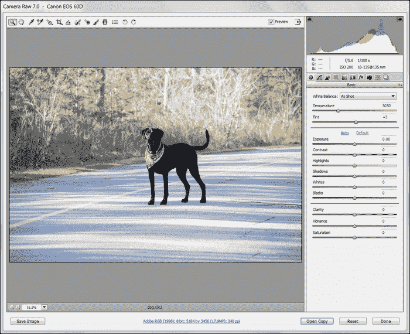

看起来用于拍摄这张照片的数码相机以 17.9 百万像素的分辨率保存了这张图像，使得这张图像宽 5184 像素，高 3456 像素。这张图像在 Web 上永远不会以这个分辨率使用，因为它不适合在计算机显示器上，需要缩小才能查看。为了在 Web 上使用图像，需要将其缩小，使其在 Web 上更小更容易查看，但用于显示它的文件仍然是巨大的主版本，加载速度慢。让我们继续通过在 Camera RAW 导入窗口中选择“完成”来在 Photoshop 中打开这个文件。

将网页设计所需的分辨率导出为网页版本的图像是一个很好的做法。在 Photoshop 中，可以通过在“图像”选项卡下选择“图像大小”来轻松地将图像分辨率更改为适合 Web 的合适尺寸。

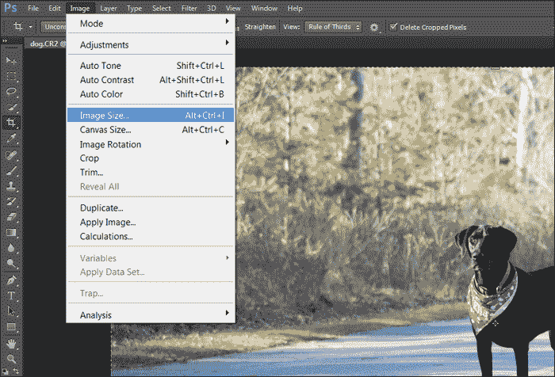

在“图像大小”窗口中，我们可以输入一些更现实的值到“宽度”和“高度”参数中，以查看我们可以实现什么样的优化。通过使用 1920 x 1280 这样的值，这仍然是一个非常高分辨率的图像，可以查看预期输出图像源文件大小将显示在“宽度”和“高度”参数上方的文本中。

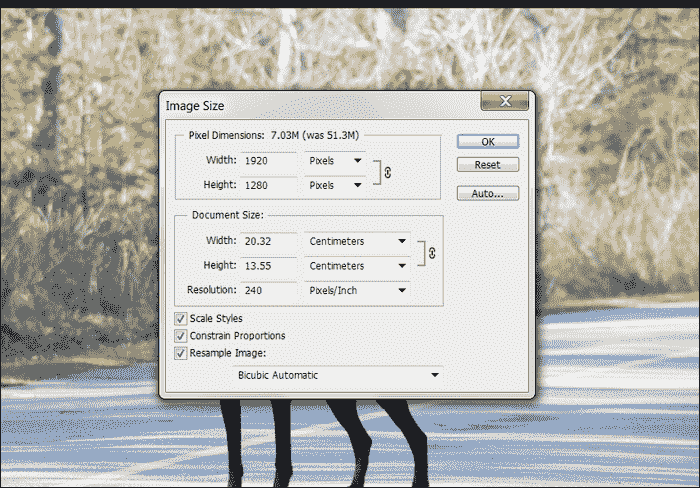

在“图像大小”窗口中更新“宽度”和“高度”参数后，生成的文件大小将立即显示在它们的上方。请记住，显示的文件大小变化不会是最终输出大小，因为我们仍然可以使用 JPEG 压缩等技术来优化这个图像源。

### 提示

在为特定网页设计优化图像大小时，通常不需要导出比设计中设置的尺寸更大的图像。如果设计中需要缩略图，最好导出两张图像，一张大一张小，而不是在两种情况下使用同一张图像。

位于**文件**选项卡下的 Photoshop 的**保存为 Web**功能可以说是网页开发人员的好帮手。这个工具允许您轻松地从 Photoshop 中导出图像，特别是为了优化 Web 而设计。无论是为设计增添活力还是将资产转换为单个实例，每当您要从 Photoshop 导出东西供 Web 使用时，这个工具都是实现的最佳方式。

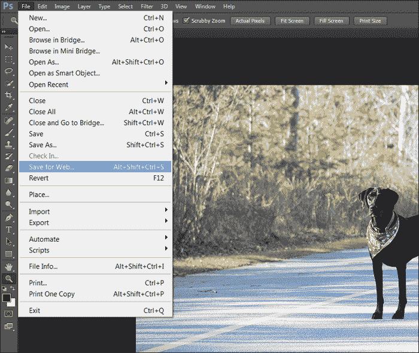

单击**保存为 Web**选项将打开一个专用窗口，帮助您选择最佳格式和压缩方法来导出数据。因此，让我们导出这张照片的几个版本，看看在尽量保留图像质量的同时可能的最小文件大小是多少。

将格式类型设置为**JPG**以进行更好的压缩，然后在窗口顶部选择**4-Up**选项卡，以便在图像数据的不同压缩级别之间进行并排比较。尝试调整这些值，看看在看到图像发生显著变化之前，您可以将质量水平降低到多低。在这样做的同时，密切关注预期文件大小，以了解压缩水平如何影响文件大小。

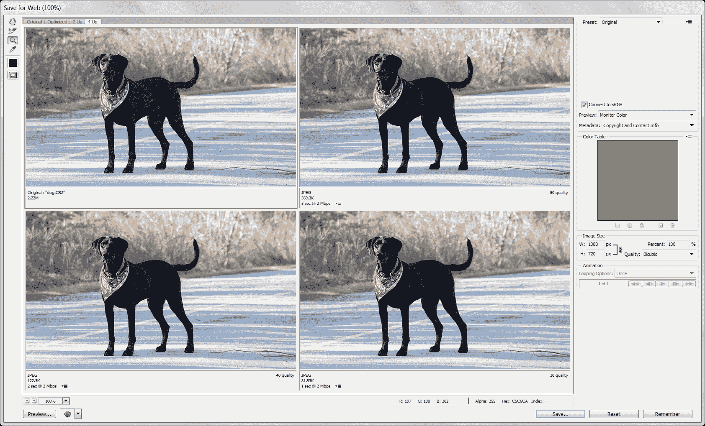

随着压缩级别的提高，这张狗照片的背景质量特别受到影响。这是因为长草创造了一个非常动态和繁忙的区域，可以看到像素化。狗身体内的固体颜色区域保持了更多原始质量，因为同一区域的像素颜色非常相似。**保存为 Web**窗口中的另一个有趣特性是每个图像版本的预期下载时间。您可以轻松更改预期带宽级别，以查看将此图像传递到互联网用户可能需要多少时间。

### 提示

由于每个图像都不同，没有单一的完美优化设置。花时间确保每个图像在最小文件大小下看起来最好，将为您带来一个外观更好、加载速度更快的网站。

举例来说，我使用 JPEG 格式以不同的分辨率和压缩级别导出了这张照片。

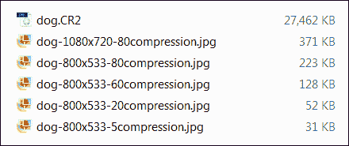

正如您从文件列表中看到的，我们最初从数码单反相机直接拍摄了一张 27MB 的照片。在 Photoshop 中使用不同的导出方法，我们可以轻松获得相同图像的较小分辨率版本，文件大小远远低于 500 千字节。考虑到在完全开发的网页中，这张图片可能是众多图片之一，一般的经验法则是尽可能保持每个图像文件的大小。这将使您的内容快速加载，并为您创建的设计正确显示。

当然，正如之前提到的，JPG 并不是网页中唯一可用的图像格式。让我们快速介绍每种格式以及它们各自的特点。

### JPEG

将图像输出为`.jpeg`或更常见的`.jpg`允许进行有损图像压缩，旨在通过丢弃图像内的一些数据来减小文件大小。在 JPEG 格式中保存时使用的压缩量通常由用户定义，允许设计师和开发人员创建比原始文件更小的文件，使其尽可能接近其源。JPEG 格式的主要缺点之一是缺乏透明度支持，因为该格式不包含 alpha 通道。

### PNG

**便携式网络图形**（**PNG**）是一种位图图像格式，在保存图像数据时不使用压缩。PNG 图像非常适合设计和资产图像，因为它们保留了设计中使用的质量和调色板，并且支持透明度。然而，它们通常不用于照片等图像，因为由于图像中的细节数量，生成的文件大小将会太大。

### GIF

心爱的 GIF 文件，或者如今更常见的**动画 GIF**自 1987 年 CompuServe 发布该格式以来一直可供使用。GIF 图像支持 256 种颜色、透明度，以及通过多个图像帧进行动画。尽管直到今天它仍然在 Web 上使用，但由于对动画图像的时间轴控制的缺乏，诸如精灵表（我们将在接下来的章节中更多地介绍）的技术正在变得更受欢迎，用于动画图像的集成。

## 音频

为 Web 准备音频相对来说非常简单，因为大多数 Web 浏览器支持 HTML5 新音频元素中的**MP3**音频格式。除了 MP3，一些浏览器还支持使用**OGG**音频文件。因此，以任一格式导出音频将允许您针对所有现代 HTML5 兼容的浏览器，并确保您的最终用户无论选择何种浏览器查看您的内容，都能听到音频。

### 音频元素

创建`audio`元素，与大多数元素的 HTML 语法一样，都非常简单。与 HTML 元素中传统的源引用的一个主要区别是使用了`source`元素，该元素被包含在`audio`元素中。通过利用这个新的`source`元素，我们可以在同一个元素中引用多个资产，并且只加载与之兼容的第一个文件：

```html
<audio controls>
  <source src="img/horse.ogg" type="audio/ogg">
  <source src="img/horse.mp3" type="audio/mp3">
  Your browser does not support the audio tag.
</audio>
```

如果用户尝试在不支持 HTML5 音频的浏览器中打开此元素，则将显示`audio`元素内的其余内部内容。在这种情况下，我们只显示文本，但您也可以轻松地附加对 Flash 音频播放应用程序的引用或使用 CSS 进行样式化的警告。但是，如果浏览器按照给定的要求一切正常，页面将显示类似以下内容的音频播放 UI：


音频播放控件用户界面是特定于显示数据的浏览器的。上述图像是 Google Chrome 当前呈现的内部音频播放控件用户界面。可以通过在`audio`标签元素中排除`controls`参数来移除默认音频控件。没有默认控件 UI，您可以使用图像、HTML 和 CSS 构建自己的控件，并使用 JavaScript 进行控制。

## 视频

如第一章 *为什么选择 HTML5？*中所述，将视频集成到 HTML5 文档中现在比以往任何时候都更容易。虽然将视频集成到 HTML5 文档中很简单，但一切都始于为 Web 准备视频。这个过程不仅应该最小化视频文件的大小，还应该使用特定的编解码器对其进行编码，并将其保存在特定的视频容器中。

HTML5 的`video`标签支持包含多种视频容器格式。在尝试支持完整范围的 HTML5 兼容浏览器时，开发人员必须包含对同一视频的多种格式的引用，因为并非每个浏览器都支持所有允许的视频文件类型。因此，对视频容器和编解码器的扎实理解对于网页开发人员来说是必要的，以便将视频正确集成到其文档中。


### 视频编解码器

编解码器用于压缩和解压视频，以减小文件大小并允许使用更少的带宽共享大型视频文件。如果不对视频文件进行压缩，用户将不得不等待很长时间才能通过典型的互联网连接传输视频。以高清晰度为例，大约 5 分钟的原始视频可能超过 25GB 的数据。视频编解码器由先进的算法组成，可以删除从一帧到另一帧混合的相似数据。编码视频不是将每个单独的帧存储为单独的图像，而是存储一个通常比原始源材料小得多的专门数据集。为了观看，编码数据需要从精简的数据源解码回可视的基于帧的视频。编解码器是完成这项任务的一体化技术。HTML5 中支持的每个视频容器只支持一个视频编解码器，因此选择一个相当简单。然而，由于视频通常伴随着音频，音频也必须通过特定的音频编解码器运行。

### 视频容器

在尝试将视频嵌入 HTML5 文档时的一个主要问题是支持所有现代浏览器以相同的内容。不幸的是，并非所有兼容 HTML5 的浏览器都支持相同的视频格式。因此，为了支持最广泛的浏览器范围，开发人员必须嵌入多个版本的相同视频文件，以多种格式进行编码。由于这个问题在不久的将来不太可能改变，了解可用的视频容器及其相应的编解码器是准备 HTML5 文档中的视频的重要步骤。

#### MP4

从 Flash 开发者的角度来看，**MP4** 容器应该是最熟悉的，因为它们与 **FLV** 或 **F4V** 文件非常相似。目前，**MPEG-4** 或 MP4 容器受到 Internet Explorer 9+、Google Chrome 和 Safari 的支持，可以嵌入视频元素。MP4 视频必须使用 **H.264** 编解码器进行编码，这也是 Flash 中 FLV 和 F4V 视频所使用的。

#### WebM

WebM 音频和视频格式是由 Google 赞助的项目，旨在为 Web 带来完全开放的多媒体容器和编解码器。WebM 文件受到 Firefox、Google Chrome 和 Opera 的支持。在为 WebM 容器内的视频进行编码时，使用了同样由 Google 拥有的 VP8 视频编解码器。

GG

**OGG** 容器受到 Firefox、Google Chrome 和 Opera 的支持。在为 OGG 容器内的视频进行编码时，使用 **Theora** 编解码器。由于只需使用 MP4 和 WebM 视频即可覆盖所有浏览器，因此在 OGG 格式中进行编码并不是完全必要的。无论如何，将其添加为备用并不会有害；浏览器在源列表中找到的第一个视频文件格式在显示时被利用，所有其他文件都会被忽略并且不会被下载。

### 提示

可以在`Chapter 02_examples`目录中找到示例编码视频文件以及高质量的主视频文件。

### 视频编码软件

有许多在线可用的优秀应用程序可以将您的视频内容编码为与 HTML5 兼容的格式。只要满足容器和编解码器的规范，任何应用程序或方法都可以用于完成任务。为了帮助您快速上手，在本章和本书的其余部分，以下是一些最受欢迎的编码工具和应用程序，供 Web 开发人员使用以快速将视频发布到网络上。

#### Miro 视频转换器

如果您正在寻找一个简单的方法来准备 Web 视频，那么不妨试试 Miro Video Converter，它可以在 Miro 的网站[`www.mirovideoconverter.com`](http://www.mirovideoconverter.com)上找到。这个软件不仅免费和开源，而且还支持以所有 HTML5 兼容格式导出视频和音频。Miro Video Converter 适用于 Windows 和 OS X，可能是为 HTML5 项目准备音频和视频的最简单的方法。

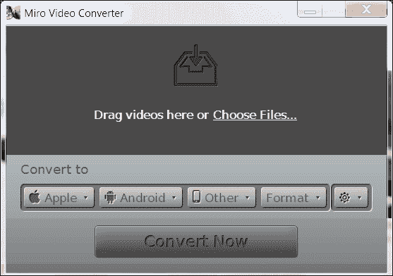

安装并打开应用程序后，下一步就是简单地将源视频文件拖放到应用程序中进行排队。如果您有多个视频，也可以将它们添加到队列中，所有视频将依次进行编码。

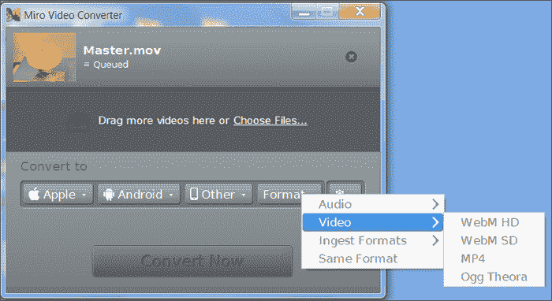

一旦您需要编码的所有视频都添加到队列中，选择窗口底部的**格式**选项，并在转换器中选择三种可用格式之一。请记住，为了在每个浏览器中启用视频元素播放支持，您需要在每种格式中编码您的视频一次。如果您需要更深入地配置编码作业，Miro Video Converter 允许我们控制基本参数，如宽高比和视频尺寸。

#### Adobe Media Encoder

在其项目中包含视频的 Flash 开发人员可能已经使用了 Adobe Media Encoder。这个方便的软件与 Flash 捆绑在一起，可以轻松地对 Flash 和 HTML5 项目中使用的视频进行编码。不幸的是，该应用程序只能原生输出 Flash 视频格式的 HTML5-ready MP4 视频。


#### Handbrake

如果您无法访问 Adobe Media Encoder，那么免费编码 MP4 视频的下一个最简单的方法就是前往[`handbrake.fr`](http://handbrake.fr)并下载 Handbrake。Handbrake 不仅是开源的，而且还适用于 Windows、OS X 和 Linux，因此很难被忽视。

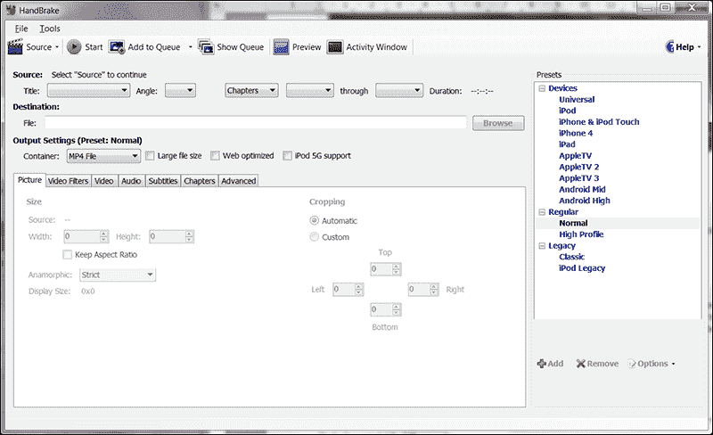

#### FFMPEG

最后，我个人最喜欢的是 FFMPEG。如果您像我一样喜欢命令行，那么这个令人惊叹的软件一定适合您。在媒体方面，很难说 FFMPEG 不能用来完成什么。如果您需要高级视频转码，请务必访问[`ffmpeg.org`](http://ffmpeg.org)了解更多信息。

### 视频元素

一旦我们的视频内容已经以必要的格式进行了编码，剩下的就是在 HTML 文档的正文中引用视频。与`audio`元素一样，`video`元素支持在`video`元素内部使用`source`标签来引用多个资产，而不是在标签中使用典型的`src`参数来创建对文件的引用。值得注意的是，如果您只嵌入了单个视频引用，则可以在`video`标签中使用`src`参数，而不是添加`source`标签：

```html
<video width="800" height="600" controls>
  <source src="img/my_video.mp4" type="video/mp4">
  <source src="img/my_video.webm" type="video/webm">
  <source src="img/my_video.ogg" type="video/ogg">
  Your browser does not support the video tag.
</video>
```

与`audio`元素一样，`video`元素允许通过在`video`标签中添加`controls`参数来进行播放控制集成。视频可以通过在`video`标签中添加`autoplay="true"`来在页面加载时自动播放。

现在我们已经准备好所有资产并准备好行动，是时候开始进入开发环境了。由于 Web 浏览器是我们的目标平台，让我们花点时间来了解今天的现代 Web 浏览器在 Web 开发工具方面为我们提供了什么，以帮助我们在开发周期中进行开发。

# 调试和输出方法

随着 HTML5 和其他大量客户端驱动的网页内容的流行，需要一个强大的开发者工具集来方便地调试和测试网页。幸运的是，每个现代浏览器都已经适应或集成了一些非常相似的设置来做到这一点。在这个工具集中最重要的功能之一就是 JavaScript 控制台。JavaScript 控制台对于网页开发者来说就像 Flash 开发者的 Flash 输出窗口一样重要。这是一个非常重要的区域，用于打印初始化应用程序或网站中的数据以及代码中指定的打印语句或值。在 ActionScript 中，通过使用`trace()`函数来将数据打印到输出窗口。在 JavaScript 中，我们利用`console`对象的内置方法来做同样的事情。考虑以下示例：

```html
function calculateSum(a, b) {
  sum = a + b;
  console.log("The sum of " + a + " + " + b + " = " + sum);
}

calculateSum(2, 3);
```

### 提示

这个例子可以在`Chapter 02_examples`目录中的`Console-Example`目录中找到。

这个代码示例创建了一个 JavaScript 函数来计算数字的总和，并使用示例参数调用该方法，以在浏览器控制台中显示输出。与 ActionScript 中的跟踪类似，JavaScript 中的控制台集成在幕后，与实际网页分开。控制台的主要功能是在运行时帮助开发者调试 JavaScript、CSS 或 HTML 属性。开发者控制台不仅可以用于从应用程序中打印数据，还可以用于触发代码中特定函数的执行，而无需特定事件或交互的发生。

控制台同样重要，整个用户界面和交互取决于使用何种浏览器来查看文档。因此，了解在所有流行浏览器中找到和如何使用控制台是帮助您构建健壮代码的重要一步。让我们快速在一些常见的浏览器中运行我们简单的计算总和示例，看看它们如何处理输出。

## 谷歌浏览器

所有版本的谷歌浏览器都内置了开发者工具集，可以通过右键单击网页并在对话框中选择**检查元素**选项来轻松打开。这将显示附加到浏览器窗口底部的开发者工具窗口。选择**控制台**选项卡将显示 JavaScript 控制台，以查看网页的输出。在 Chrome 中打开我们的 JavaScript `calculateSum`函数示例，并打开控制台，应该显示类似下面的图像：

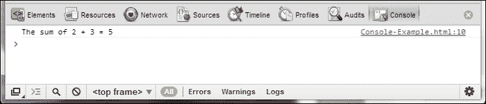

正如你所看到的，`console.log()`调用的输出已经显示出来，还有调用是从哪个文件和行号发出的。即使从简单的角度来看，我相信你已经开始看到这个工具有多么方便，如果你有 100 甚至 1000 行代码在多个文件中处理。与 ActionScript 中的跟踪输出窗口类似，这个工具的另一个亮点是它能够直接从控制台窗口调用进一步的 JavaScript 执行。在控制台中，我们可以继续调用`calculateSum`函数，并直接从控制台传入必要的值来找到新数字的总和。

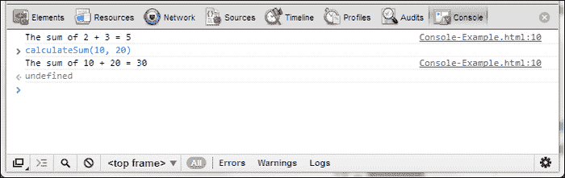

一些浏览器，比如 Chrome，甚至具有自动完成功能，当你输入方法或属性名称时会展开文本，这是我相信大多数 Flash 开发者希望在 Flash IDE 中拥有的功能。

## 火狐浏览器的 Firebug

由于 Firefox 没有预装强大的开发者工具集，网页开发者的常见选择是安装**Firebug**扩展来启用此功能。可以通过访问[`getfirebug.com`](http://getfirebug.com)在几秒钟内将扩展轻松添加到 Firefox 安装中。安装并激活后，右键单击页面的任何位置，然后选择**使用 Firebug 检查元素**。

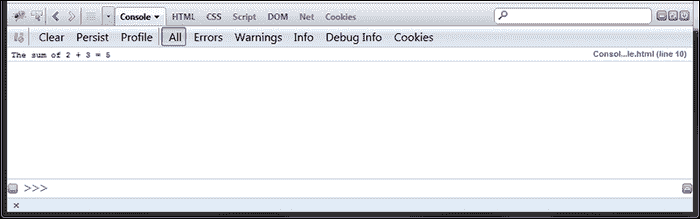

这应该感觉非常熟悉，就像我们在 Chrome 中所做的一样。Firebug 是一个几乎所有我认识的开发人员都使用的很棒的项目。所有这些工具集中都有很多很棒的功能，我们将在本书中介绍其中许多功能。由于我们打开了一个非常简单的 HTML 页面，几乎没有什么内容，现在可能是一个很好的时机来查看更原始的网页的 UI 和输出，所以随时随地点击并查看一下。

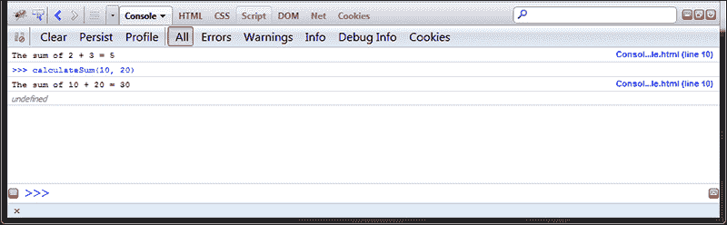

## Safari

启用 Safari 中的开发者工具，请打开**首选项**窗口，然后选择**高级**选项卡。选择窗口底部标有**在菜单栏中显示开发菜单**的复选框，然后可以关闭窗口。

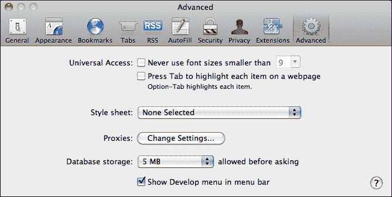

从这一点开始，您可以像往常一样在任何网页上右键单击，然后选择**检查元素**以显示工具窗口。

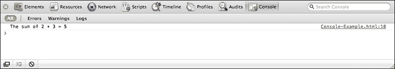

如果您留意的话，您可能会注意到这个控制台几乎与 Google Chrome 中的控制台相同。当然，它具有命令行集成，就像我们在其他浏览器中看到的那样。

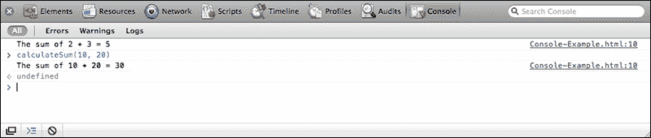

## Opera

与 Google Chrome 类似，Opera 中的开发者工具可以通过右键单击网页并选择**检查元素**来轻松访问。一旦开发者工具窗口在浏览器底部打开，选择**控制台**选项卡以打开开发者控制台。最初，控制台将是空白的，没有任何来自当前正在查看的网页的交互。

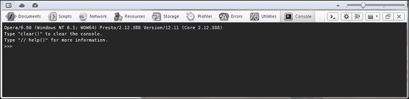

与始终处于活动状态的控制台不同，Opera 决定仅在控制台实际打开时才读取控制台命令。因此，刷新页面将显示控制台交互：

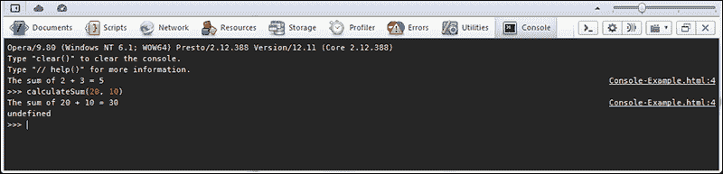

## Internet Explorer

从 Internet Explorer 9 开始，微软已经开始在浏览器中直接包含开发人员工具集。可以通过在查看页面时按下*F12*随时打开**开发人员工具**窗口。与 Opera 一样，Internet Explorer 需要刷新页面才能在活动页面上启用控制台的使用，因为当关闭时它保持不活动状态。

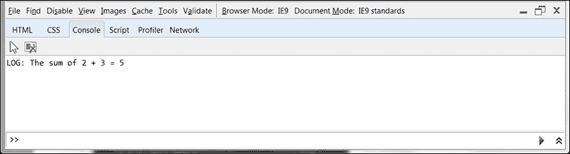

当然，就像其他控制台一样，我们可以从命令行调用我们的 JavaScript 方法和变量。

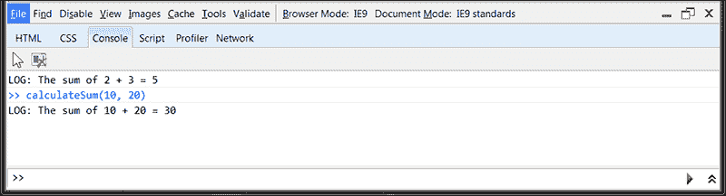

# 语法差异

既然我们有一些媒体可以使用，并且浏览器工具也可以使用，让我们开始玩弄 JavaScript 并将其语法与您已经了解的 ActionScript 3 进行比较。

## 变量

与在 ActionScript 3 中声明的变量不同，JavaScript 变量没有严格类型。这将从熟悉的 ActionScript 3 变量声明转换为： 

```html
var myVariable:String = 'abc123';
```

转换为 JavaScript 中的更简单的语法，如下所示：

```html
var myVariable = 'abc123';

```

这种缺乏严格类型称为动态类型。JavaScript 中的变量可以随时用作任何类型。考虑以下示例：

```html
var exampleVar;                      // A undefined variable
exampleVar = "Some example text";    // Variable is now a String
exampleVar = 12345;                  // Variable is now a Number
```

动态类型允许代码更快地编写，因为它需要开发人员的输入更少，但这种开发便利性是以调试大型应用程序为代价的。ActionScript 3 的严格类型允许编译器在导出新版本应用程序之前就捕获问题。JavaScript 不会在本地执行此操作，这可能是先前具有 ActionScript 3 经验的大多数开发人员使用该语言时最大的抱怨之一。

### 变量类型转换

尽管 JavaScript 中的变量没有严格类型，但有方法可以确保变量数据以正确的形式进行所需的操作。可以对变量进行类型转换以确保其格式正确：

```html
myString = String('12345');   // Convert to a String
myBoolean = Boolean('true');  // Convert to Boolean
myNumber = Number('12345');   // Convert to Number
```

## 条件和循环

我们将一起涵盖这两个方面，因为 JavaScript 中的条件和循环语法几乎与 ActionScript 3 中您习惯的一样。`If`，`if... else`和`if... else if`条件与 ActionScript 中的条件没有什么不同：

```html
if(cats > dogs) {
  // Code for cat people...
} else if (cats < dogs) {
  // Code for dog people...
} else {
  // Code for everyone else...
}
```

另外，`switch`语句也可以使用，就像`if`语句一样；语法与 ActionScript 中的完全相同：

```html
switch(animal) {
  case 'cat':
    // Code for cat people...
    break;
  case 'dog':
    // Code for dog people...
    break;
  default:
    // Code for everyone else...
}
```

循环与 ActionScript 中的循环没有什么不同。考虑这些`for`和`while`循环：

```html
for(var n = 0; n < myArray.length; n++) {
  // Code within loop...
}

while(n < 100) {
  // Code within loop...
}

do {
  // Code within loop...
} while(n < 100);
```

## 函数

与 ActionScript 3 一样，JavaScript 中的函数是用大括号（`{}`）括起来的代码块。每个函数都与一个关键字相关联，用于调用函数并运行其中的代码。通常情况下，函数可以将值返回到最初调用的地方。这是通过使用`return`语句来实现的。

JavaScript 函数的语法与 ActionScript 函数非常相似，但不需要严格类型化预期参数和函数返回类型。作为 Flash 开发人员，您的 ActionScript 3 函数可能看起来像下面这样：

```html
function getCoffee (owner:String, milks:int, sugars:int):void {
  // Code...
}
```

这种语法可以很容易地转换为 JavaScript，只需删除变量和返回类型声明，以便 JavaScript 中的相同函数可以写成如下形式：

```html
function getCoffee (owner, milks, sugars) {
  // Code...
}
```

## 对象

从技术上讲，JavaScript 中声明的所有内容都是对象，但是，总有一天你会需要创建自己的自定义对象。可以通过以下两种方式之一来实现。第一种方式，应该非常熟悉 ActionScript 开发人员，如下所示：

```html
player = new Object();
player.name = "John Smith";
player.lives = 5;
player.posX = 10;
player.posY = -30;
```

您还可以通过将它们定义为函数来创建对象，如下所示：

```html
function player(name, lives, posX, posY) {
  player.name = name;
  player.lives = lives;
  player.posX = posX;
  player.posY = posY;
}

var teddyBear = new player("Teddy", 5, 10, 10);
console.log(teddyBear.name);
```

## DOM 事件

集成 DOM 事件允许您使用 JavaScript 处理在 HTML 文档中发生的事件。

### 鼠标事件

DOM 公开了鼠标事件，用于鼠标指针的基本用户交互。通过在 HTML 标记中使用`onclick`事件参数，我们可以在用户单击特定元素时执行 JavaScript：

```html

```

然而，我们也可以完全从 JavaScript 中定位元素，并在 HTML 源代码之外处理事件处理程序，以保持项目清晰易懂：

```html
document.getElementById("my-image").onclick=function() {
  // Place your JavaScript here...
};
```

当然，您不仅仅局限于鼠标点击事件。事件也可以处理鼠标悬停、鼠标移出、鼠标按下和鼠标释放。在本书的示例中，我们将利用所有这些事件以及扩展它们的方法。

# JavaScript 示例

在涵盖了所有 JavaScript 语法规范之后，让我们将其中一些用于一个工作示例，并看看会发生什么。看一下以下简单的 HTML 文档，其中包含 JavaScript 来对随机数组进行排序：

```html
<!DOCTYPE html>
<html lang="en">
  <head>
    <meta charset="utf-8" />
    <title>Insertion Sort - JavaScript Syntax Example</title>

    <script type="text/javascript">
      // Number of elements to sort.
      elementCount = 10000;	
      // The array which will be sorted.
      sortlist = new Array();

      /**
      * Called on button click.
      */
      function init() {
        // Prepare random array for sorting.
        for(i = 0; i < elementCount; i++)
          sortlist.push(i);

        //shuffle(sortlist);
        sortlist.sort(function() {
          return 0.5 - Math.random();
        });

        // Display the random array prior to sorting.
        console.log(sortlist);

        // Start a timer.
        console.time('Iteration Sort Timer');

        // Sort the randomized array.
        insertionSort(sortlist);

        // Stop the timer.
        console.log('Sorted ' + elementCount + ' items.');
        console.timeEnd('Iteration Sort Timer');

        // Display the sorted array.
        console.log(sortlist);
      }

      /**
      * The popular Insertion Sort algorithm.
      */
      function insertionSort(list) {
        // It's always smart to only lookup array size once.
        l = list.length;

        // Loop over supplied list and sort.
        for(i = 0; i < l; i++) {
          save = list[i];
          j = i;

          while(j > 0 && list[j - 1] > save) {
            list[j] = list[j - 1];
            j -= 1;
          }

          list[j] = save;
        }
      }
    </script>
  </head>

  <body>
    <p>
      Click the button below to begin.
      Be sure to open up your browsers developer console.
    </p>
      <button onclick="init()">Start Sorting</button>
  </body>
</html>
```

这个示例涵盖了我们刚刚涵盖的 JavaScript 的许多特性和语法规范。在 HTML 文档的`head`标记中声明的 JavaScript 块中，我们创建了两个函数。第一个函数是我们的初始化方法，用于准备和运行应用程序。第二个函数包含了流行的插入排序算法，它将对我们的随机数组进行排序。为了使两个函数能够使用相同的变量，我们在每个函数的作用域之外创建了`elementCount`和`sortlist`作为全局变量。在 HTML 的`body`标记中是一个`button`元素，它在页面上呈现一个典型的表单按钮元素，当用户单击此按钮时，`onclick`处理程序调用`init`函数。

这个示例并不华丽，但正如我上面提到的，它涵盖了 JavaScript 语法规范的许多不同方面。

# 定时 JavaScript 执行

处理 JavaScript 执行时间的一个重要注意点是确保整个页面在允许 JavaScript 开始执行其代码之前已经完成加载。等待页面加载的原因是为了在尝试操作它们之前允许页面上的所有资产和外部引用加载。如果您的 JavaScript 尝试对不存在的元素执行操作，您的应用程序流程可能会失败。为了避免这个问题，我们可以向 DOM 添加一个事件侦听器，使其仅在页面完全加载并显示后运行。利用 DOM 事件为 JavaScript 提供了一个简单的方法来做到这一点，如下面的代码所示：

```html
window.addEventListener("load", init, false);

var init = function() {
  // Start everything from in here.
}
```

现在，当窗口完成加载过程后，将调用`init`函数，应用程序代码的其余部分可以开始执行。实际上，JavaScript 有许多方法可以在页面加载完成后执行代码。本书的后续章节将使用示例来使用和解释其中许多方法。

# 总结

在本章中，我们花了一些时间来更好地熟悉为我们的 HTML5 项目准备媒体资产所涉及的过程。此外，本章还涵盖了每种典型多媒体格式的准备和集成技术，以及一些流行的软件，可帮助完成这些工作。我们迅速地比较了 ActionScript 3 和 JavaScript 语法，以便更熟悉在编写 JavaScript 时与 ActionScript 3 相比的细微但重要的差异。这使我们完美地准备好进入第三章，“可扩展性、限制和效果”，在那里我们将开始将 HTML5 推到极限，以查看它的限制和缺点，以及它可以做的所有令人惊讶的事情。
