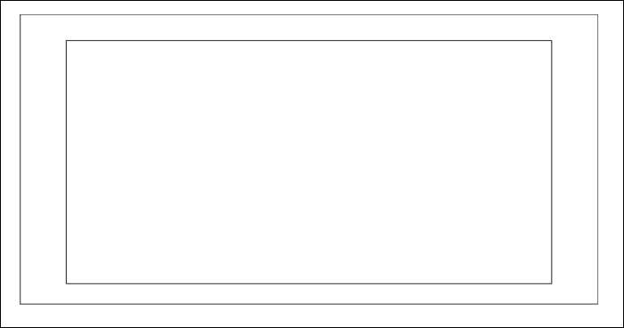

# 第三章：可扩展性、限制和效果

准备好用于 HTML5 集成的媒体资产后，让我们继续这个旅程，通过查看 CSS3 和 JavaScript 中一些新的和令人兴奋的对象操作功能，以及它们与 Flash 开发人员熟悉的内容的关系。在本章的过程中，我们将回顾 HTML5 的许多特定功能，这些功能使其获得了广泛的使用和受欢迎程度，变得更像典型的 Flash 开发。

本章将涵盖以下内容：

+   初始开发限制及避免它们的方法

+   一些新的和令人兴奋的 CSS3 新增功能

+   为移动和桌面开发响应式布局

+   使用 CSS 媒体查询为特定显示目标 CSS 样式

+   控制和流式传输音频和视频，以及与 Flash 相比的限制

+   客户端文件集成和操作

+   使用 HTML5 Web Workers 将繁重的进程发送到后台

+   介绍使用 WebSockets 进行服务器端通信

+   了解 Canvas 元素是什么以及它的重要性

+   WebGL 简介及其与 Stage3D 的关系

# HTML5 的限制

如果您现在还没有注意到，您将使用的许多 HTML5 功能都具有故障保护、多个版本或特殊语法，以使您的代码覆盖整个浏览器范围和其中支持的 HTML5 功能集。随着时间的推移和标准的巩固，人们可以假设许多这些故障保护和其他内容显示措施将成熟为所有浏览器共享的单一标准。然而，实际上，这个过程可能需要一段时间，即使在最好的情况下，开发人员仍然可能不得不无限期地利用许多这些故障保护功能。因此，对何时、何地以及为什么使用这些故障保护措施有坚实的理解，将使您能够以一种方式开发您的 HTML5 网页，以便在所有现代浏览器上都能按照预期查看。

为了帮助开发人员克服先前提到的这些问题，许多框架和外部脚本已经被创建并开源，使得在开始每个新项目时，可以拥有更普遍的开发环境，从而节省了开发人员无数的时间。Modernizr（[`modernizr.com`](http://modernizr.com)）已经迅速成为许多 HTML5 开发人员必不可少的补充，因为它包含了许多条件和验证，使得开发人员可以编写更少的代码并覆盖更多的浏览器。Modernizr 通过检查客户端浏览器中 HTML5 中可用的大多数新功能（超过 40 个）并在几毫秒内报告它们是否可用来实现所有这些。这将使您作为开发人员能够确定是否应该显示内容的备用版本或向用户发出警告。

让您的网络内容在所有浏览器中正确显示一直是任何网络开发人员面临的最大挑战，当涉及创建尖端有趣的内容时，挑战通常变得更加艰巨。本章不仅将涵盖许多新的 HTML5 内容操作功能，还将在代码示例中进行演示。为了让您更好地了解这些功能在没有使用第三方集成的情况下是什么样子，我们将暂时避免使用外部库。值得注意的是，这些功能和其他功能在所有浏览器中的外观。因此，请确保在不仅是您喜欢的浏览器中，而且在许多其他流行的选择中测试示例以及您自己的工作。

# 使用 CSS3 进行对象操作

在 CSS3 出现之前，Web 开发人员使用了一长串的内容操作、资源准备和资源呈现技术，以便在每个浏览器中获得他们想要的网页布局。其中大部分技术都被认为是“黑客”技术，因为它们基本上都是一种解决方案，使浏览器能够执行通常不会执行的操作。诸如圆角、投影阴影和变换等功能都不在 Web 开发人员的工具库中，而且要达到想要的效果的过程可能会让人感到无聊。可以理解的是，CSS3 对所有 Web 开发人员的兴奋程度都非常高，因为它使开发人员能够执行比以往更多的内容操作技术，而无需事先准备或特殊的浏览器黑客技术。尽管 CSS3 中可用属性的列表很庞大，但让我们来介绍一些最新和最令人兴奋的属性。

## box-shadow

一些设计师和开发人员说投影阴影已经过时，但在 HTML 元素中使用阴影仍然是许多人的流行设计选择。在过去，Web 开发人员需要进行一些技巧，比如拉伸小的渐变图像或直接在背景图像中创建阴影，以在其 HTML 文档中实现这种效果。CSS3 通过创建`box-shadow`属性来解决了这个问题，允许在 HTML 元素上实现类似投影阴影的效果。

为了提醒我们 ActionScript 3 中是如何实现这种效果的，让我们回顾一下这段代码：

```html
var dropShadow:DropShadowFilter = new DropShadowFilter();
dropShadow.distance = 0;
dropShadow.angle = 45;
dropShadow.color = 0x333333;
dropShadow.alpha = 1;
dropShadow.blurX = 10;
dropShadow.blurY = 10;
dropShadow.strength = 1;
dropShadow.quality = 15;
dropShadow.inner = false;
var mySprite:Sprite = new Sprite();
mySprite.filters = new Array(dropShadow);
```

如前所述，CSS3 中的新`box-shadow`属性允许您相对轻松地附加这些阴影效果，并且具有许多相同的配置属性：

```html
.box-shadow-example {
  box-shadow: 3px 3px 5px 6px #000000;
}
```

尽管在此样式中应用的每个值都没有属性名称，但您可以看到许多值类型与我们在 ActionScript 3 中创建的投影阴影所附加的值相符。

这个`box-shadow`属性被赋予了`.box-shadow-example`类，因此将被应用到任何具有该类名的元素上。通过创建一个带有`box-shadow-example`类的`div`元素，我们可以改变我们的内容，使其看起来像下面这样：

```html
<div class="box-shadow-example">CSS3 box-shadow Property</div>
```


尽管这个 CSS 属性很容易添加到您的项目中，但它在一行中声明了很多值。让我们按顺序回顾每个值，以便我们更好地理解它们以备将来使用。为了简化属性中每个变量的识别，这些变量已经被更新为不同的值：

```html
box-shadow: 1px 2px 3px 4px #000000;
```

这些变量的解释如下：

+   初始值（`1px`）是阴影的**水平偏移**，或者阴影是向左还是向右。正值将把阴影放在元素的右侧，负偏移将把阴影放在左侧。

+   第二个值（`2px`）是**垂直偏移**，与水平偏移值一样，负数将生成向上的阴影，正数将生成向下的阴影。

+   第三个值（`3px`）是**模糊半径**，控制阴影的模糊程度。声明一个值，例如`0`，将不会产生模糊，显示出一个非常锐利的阴影。放入模糊半径的负值将被忽略，与使用 0 没有任何不同。

+   第四个值（`4px`）也是数字属性的最后一个，是**扩展半径**。扩展半径控制了投影阴影模糊超出初始阴影大小声明的距离。如果使用值`0`，阴影将显示默认的模糊半径并且不会应用任何更改。正数值将产生更模糊的阴影，负值将使阴影模糊变小。

+   最后一个值是十六进制颜色值，表示阴影的颜色。

或者，您可以使用`box-shadow`将阴影效果应用于元素的内部而不是外部。使用 ActionScript 3，可以通过在`DropShadowFiler`对象的参数列表中附加`dropShadow.inner = true;`来实现这一点。在 CSS3 中应用`box-shadow`属性的语法方式非常相似，只需要添加`inset`关键字。例如，考虑以下代码片段：

```html
.box-shadow-example {
  box-shadow: 3px 3px 5px 6px #666666 inset;
}
```

这将产生一个看起来像下面截图的阴影：


### 提示

本章的代码示例中包含了一个 box-shadow 工具，它将帮助您更好地理解每个属性的影响。

## text-shadow

就像`box-shadow`属性一样，`text-shadow`通过为文本创建相同的投影效果，实现了其名字的含义。

```html
text-shadow: 2px 2px 6px #ff0000;
```

与`box-shadow`一样，`text-shadow`的初始两个值是阴影放置的水平和垂直偏移量。第三个值是可选的模糊大小，第四个值是十六进制颜色：


## border-radius

就像元素或文本阴影一样，在 CSS3 之前为元素添加圆角是一件苦差事。开发人员通常会附加单独的图像或使用其他对象操作技术来实现这种效果，通常是在典型的正方形或矩形形状元素上。通过在 CSS3 中添加`border-radius`设置，开发人员可以轻松动态地设置元素的角落圆度，只需几行 CSS 代码，而无需像 Flash 中那样使用矢量 9 切片。

由于 HTML 元素有四个角，当附加`border-radius`样式时，我们可以单独针对每个角落，或者一次性针对所有角落。为了轻松地一次性附加边框半径设置到所有角落，我们将创建我们的 CSS 属性如下：

```html
#example {
  background-color:#ff0000; // Red background
  width: 200px;
  height: 200px;
border-radius: 10px;
}
```

前面的 CSS 不仅将 10px 的边框半径附加到`#example`元素的所有角落，还使用了现代浏览器使用的所有属性，我们可以确保这种效果对所有试图查看此内容的用户都是可见的：


如上所述，可以针对元素的每个单独角落，只附加半径到元素的特定部分：

```html
#example {
  border-top-left-radius: 0px; // This is doing nothing
  border-top-right-radius: 5px;
  border-bottom-right-radius: 20px;
  border-bottom-left-radius: 100px;
}
```

前面的 CSS 现在通过将左边框半径设置为`0px`来移除我们的`#example`元素，并为其他每个角落设置了特定的半径。值得注意的是，在这里将边框半径设置为`0`与完全不在 CSS 样式中留下该属性没有任何区别：


## 字体

多年来，在 Flash 中处理自定义字体一直有着起伏。任何需要在其 Flash 应用程序中合并和使用自定义字体的 Flash 开发人员可能都知道选择字体嵌入方法以及确保它对没有在其计算机上安装字体的用户正常工作的痛苦。

CSS3 字体嵌入已经实现了一种“无忧无虑”的方式，可以通过`@font-face`声明将自定义字体包含到 HTML5 文档中：

```html
@font-face {
  font-family: ClickerScript;
  src: url('ClickerScript-Regular.ttf'),
    url('ClickerScript-Regular .otf'),
    url('ClickerScript-Regular .eot');
}
```

CSS 现在可以直接引用您的 TTF、OTF 或 EOT 字体，这些字体可以放在您的 Web 服务器上以实现可访问性。在我们的 CSS 文档中声明了字体源，并为其应用了唯一的`font-family`标识后，我们可以通过使用`font-family`属性在特定元素上开始使用它：

```html
#example {
  font-family: ClickerScript;
}
```

由于我们在`@font-face`属性中声明了特定的字体系列名称，因此以后几乎可以在任何元素上使用该自定义名称。自定义字体可以应用于 HTML 文档中几乎包含文本的任何内容。表单元素，如按钮标签和文本输入，也可以被设计为使用您的自定义字体。您甚至可以使用纯 HTML 和 CSS 重新制作网站标志等资产，并使用原始资产创建时使用的相同自定义字体。

### 可接受的字体格式

与在线资产的许多其他嵌入方法一样，字体需要转换为多种格式，以使所有常见的现代浏览器能够正确显示它们。几乎所有可用的浏览器都能够处理常见的 True Type 字体（.ttf 文件类型）或 Open Type 字体（.otf 文件类型），因此嵌入其中一种格式就足够了。不幸的是，Internet Explorer 9 没有内置对这两种流行格式的支持，需要将字体保存为 EOT 文件格式。

### 外部字体库

在过去几年中，出现了许多优秀的在线服务，使 Web 开发人员可以轻松地准备和嵌入字体到他们的网站中。Google 的 Web 字体存档可在[`www.google.com/webfonts`](http://www.google.com/webfonts)找到，其中托管了一大批开源字体，可以添加到您的项目中，而无需担心许可或付款问题。只需在 HTML 文档中添加几行额外的代码，您就可以开始使用了。

值得一提的另一个很棒的网站是 Font Squirrel，可以在[`www.fontsquirrel.com`](http://www.fontsquirrel.com)找到。与 Google Web Fonts 一样，Font Squirrel 托管了一个大型的网页可用字体存档，并提供了复制粘贴就绪的代码片段，以将它们添加到您的文档中。该网站上的另一个很棒的功能是`@font-face`生成器，它可以让您将现有字体转换为所有网页兼容格式。

在沉迷于将所有喜爱的字体转换为网页可用格式并将它们整合到您的工作中之前，值得注意的是最初随字体附带的最终用户许可协议或 EULA。将许多可用字体转换为网页使用将违反许可协议，并可能在未来给您带来法律问题。

## 不透明度

对于 Flash 开发人员来说，更常见的是“alpha”，设置元素的不透明度不仅可以改变设计的外观和感觉，还可以添加诸如淡入淡出的内容等功能。尽管这个概念看起来很简单，但它相对于 Web 开发人员可用的 CSS 属性列表是相对较新的。设置元素的不透明度非常容易，看起来像下面这样：

```html
#example {
  opacity: 0.5;
}
```

正如您从上面的示例中看到的那样，与 ActionScript 3 一样，不透明度值是介于 0 和 1 之间的数值。上面的示例将以 50%的透明度显示一个元素。CSS3 中的不透明度属性现在在所有主要浏览器中都得到支持，因此在声明时无需担心使用替代属性语法。

## RGB 和 RGBA 着色

在处理 CSS 中的颜色值时，许多开发人员通常会使用十六进制值，类似于`#000000`来声明使用黑色。颜色也可以在 CSS 中以 RGB 表示法实现，通过使用`rgb()`或`rgba()`调用来代替十六进制值。通过方法名称，您可以看到 CSS 中的`rgba`颜色查找还需要第四个参数，它声明颜色的 alpha 透明度或不透明度量。在 CSS3 中使用 RGBA 而不是十六进制颜色有几个好处。假设您刚刚创建了一个`div`元素，它将显示在网页布局中现有内容的顶部。

如果您曾经想要将`div`的背景颜色设置为特定颜色，但希望只有该背景是半透明的，而不是内部内容，那么 RGBA 颜色声明现在可以轻松实现这一点，因为您可以设置颜色的透明度：

```html
#example {
  // Background opacity
  background: rgba(0, 0, 0, 0.5); // Black 50% opacity

  // Box-shadow
  box-shadow: 1px 2px 3px 4px rgba(255, 255, 255, 0.8); // White 80% opacity
```

```html
  // Text opacity
  color: rgba(255, 255, 255, 1); 	// White no transparency
  color: rgb(255, 255, 255);	// This would accomplish the same styling

  // Text Drop Shadows (with opacity)
  text-shadow: 5px 5px 3px rgba(135, 100, 240, 0.5);
}
```

正如在前面的示例中所看到的，您可以在 CSS 语法中的任何需要颜色值的地方自由使用 RGB 和 RGBA 值，而不是十六进制。

## 元素变换

就我个人而言，我发现 CSS3 变换是 CSS 中最令人兴奋和有趣的新功能之一。在 Flash IDE 中以及使用 ActionScript 转换资产一直是非常容易访问和易于实现的。在 CSS 中转换 HTML 元素是 CSS 的一个相对较新的功能，并且仍在逐渐得到所有现代浏览器的全面支持。

变换元素允许您通过打开大量动画和视觉效果的可能性来操纵其形状和大小，而无需事先准备源。当我们提到“变换元素”时，实际上是在描述可以应用于变换的一系列属性，以赋予它不同的特性。如果您以前在 Flash 或可能在 Photoshop 中转换过对象，这些属性可能对您来说很熟悉。

### 翻译

作为一名主要处理 X 和 Y 坐标来定位元素的 Flash 开发人员，CSS3 Translate Transform 属性是放置元素的一种非常方便的方法，它的工作原理与 Flash 相同。`translate`属性接受两个参数，即 X 和 Y 值，用于平移或有效地移动元素：

```html
transform:translate(-25px, -25px);
```

不幸的是，为了使您的变换在所有浏览器中都能正常工作，您需要在附加变换样式时针对每个浏览器进行定位。因此，标准的变换样式和属性现在看起来会像这样：

```html
transform:translate(-25px, -25px);
-ms-transform:translate(-25px, -25px);     /* IE 9 */
-moz-transform:translate(-25px, -25px);    /* Firefox */
-webkit-transform:translate(-25px, -25px); /* Safari and Chrome */
-o-transform:translate(-25px, -25px);      /* Opera */
```

### 旋转

旋转是相当不言自明的，而且非常容易实现。`rotate`属性接受一个参数，用于指定要应用于特定元素的旋转量（以度为单位）：

```html
transform:rotate(45deg);
-ms-transform:rotate(45deg);       /* IE 9 */
-moz-transform:rotate(45deg);      /* Firefox */
-webkit-transform:rotate(45deg);   /* Safari and Chrome */
-o-transform:rotate(45deg);        /* Opera */
```

值得注意的是，尽管提供的值始终意味着度数值，但值必须始终附加**deg**以便正确识别该值。

### 比例

就像`rotate`变换一样，缩放也非常简单。`scale`属性需要两个参数，分别声明 X 和 Y 的缩放量：

```html
transform:scale(0.5, 2);
-ms-transform:scale(0.5, 2);      /* IE 9 */
-moz-transform:scale(0.5, 2);     /* Firefox */
-webkit-transform:scale(0.5, 2);  /* Safari and Chrome */
-o-transform:scale(0.5, 2);       /* Opera */
```

### 倾斜

倾斜元素将导致 X 和 Y 轴的倾斜：

```html
transform:skew(10deg, 20deg);
-ms-transform:skew(10deg, 20deg);      /* IE 9 */
-moz-transform:skew(10deg, 20deg);     /* Firefox */
-webkit-transform:skew(10deg, 20deg);  /* Safari and Chrome */
-o-transform:skew(10deg, 20deg);       /* Opera */
```

以下插图是对使用前述属性倾斜图像的表示：


### 矩阵

`matrix`属性将所有前述变换组合成一个属性，并且可以轻松消除源代码中的许多额外 CSS 行：

```html
transform:matrix(0.586, 0.8, -0.8, 0.586, 40, 20);
/* IE 9 */
-ms-transform:matrix(0.586, 0.8, -0.8, 0.586, 40, 20);
/* Firefox */
-moz-transform:matrix(0.586, 0.8, -0.8, 0.586, 40, 20); 
/* Safari and Chrome */  
-webkit-transform:matrix(0.586, 0.8, -0.8, 0.586, 40, 20);
/* Opera */
-o-transform:matrix(0.586, 0.8, -0.8, 0.586, 40, 20); 
```

前面的示例利用了 CSS 变换矩阵属性来在单个调用中应用多个变换样式。`matrix`属性需要六个参数来旋转、缩放、移动和倾斜元素。只有当您实际上需要一次实现所有变换属性时，使用矩阵属性才真正有用。如果您只需要利用元素变换的一个方面，最好只使用该 CSS 样式属性。

### 3D 变换

到目前为止，我们审查过的所有变换属性都是二维变换。CSS3 现在还支持 3D 和 2D 变换。CSS3 3D 变换最好的部分之一是许多设备和浏览器支持硬件加速，从而允许在您的视频卡 GPU 上进行复杂的图形处理。在撰写本书时，只有 Chrome、Safari 和 Firefox 支持 CSS 3D 变换。

### 提示

在开始开发之前，想知道哪些浏览器将支持所有这些出色的 HTML5 功能吗？请访问[`caniuse.com`](http://caniuse.com)查看流行浏览器在一个简单易用的网站上支持哪些功能。

在处理 3D 世界中的元素时，我们使用 Z 坐标，这允许使用一些新的变换属性。

```html
transform:rotateX(angle)
transform:rotateY(angle)
transform:rotateZ(angle)
transform:translateZ(px)
transform:scaleZ(px)
```

让我们从 HTML 元素创建一个 3D 立方体，将所有这些属性放入一个工作示例中。要开始创建我们的 3D 立方体，我们将首先编写包含立方体的 HTML 元素，以及构成立方体本身的元素：

```html
<body>
  <div class="container">
    <div id="cube">
      <div class="front"></div>
      <div class="back"></div>
      <div class="right"></div>
      <div class="left"></div>
      <div class="top"></div>
      <div class="bottom"></div>
    </div>
  </div>
</body>
```

这个 HTML 通过创建每个具有特定类名的六个面的元素，以及整个立方体的容器以及显示所有页面内容的主容器，为我们的立方体创建了一个简单的布局。当然，由于这些容器中没有内部内容，也没有样式，将此 HTML 文件在浏览器中打开将得到一个空白页面。因此，让我们开始编写 CSS，使所有这些元素可见，并将每个元素定位以形成我们的三维立方体。我们将首先设置我们的主容器，这将定位我们的内容并包含我们的立方体面：

```html
.container {
  width: 640px;
  height: 360px;
  position: relative;
  margin: 200px auto;

  /* Currently only supported by Webkit browsers. */
  -webkit-perspective: 1000px;
  perspective: 1000px;
}
#cube {
      width: 640px;
      height: 320px;
      position: absolute;

/* 
Let the transformed child elements preserve 
the 3D transformations: 
*/
  transform-style: preserve-3d;
      -webkit-transform-style: preserve-3d;
      -moz-transform-style: preserve-3d;
}
```

`container`类是我们的主要元素，它包含此示例中的所有其他元素。在附加了宽度和高度后，我们将顶部边距设置为`200px`，以将显示向下推移一点，以便更好地查看页面，并将左右边距设置为自动，这将使该元素在页面中居中对齐。

```html
#cube div {
  display: block;
  position: absolute;
     border: 1px solid #000000;
     width: 640px;
     height: 320px;
     opacity:0.8;
}
```

通过为`#cube div`定义属性，我们为`#cube`元素内的每个`div`元素设置样式。我们还通过将宽度和高度设置为矩形比例来欺骗立方体系统，因为我们的意图是在结构和位置确定后向立方体的每一面添加视频。

附加了基本的立方体面样式后，现在是时候开始变换每个面，形成三维立方体了。我们将从立方体的前面开始，通过在 Z 轴上进行平移，使其靠近视角：

```html
#cube .front  {
-webkit-transform: translateZ(320px);
   -moz-transform: translateZ(320px);
   transform: translateZ(320px);
}
```

为了将这种样式附加到所有现代浏览器中的元素上，我们需要为每个不支持默认`transform`属性的浏览器指定多种语法的属性：



在附加了 Z 轴平移 320px 后，前面的屏幕截图显示了`.front` div 发生的变化。较大的矩形是`.front` div，现在离我们的视角近了 320px。为了简单起见，让我们对`.back` div 执行相同的操作，将其推离视角 320px：

```html
#cube .back   {
  -webkit-transform:
      rotateX(-180deg) 
      rotate(-180deg) 
      translateZ(320px);
  -moz-transform: 
      rotateX(-180deg) 
      rotate(-180deg) 
      translateZ(320px);
  transform: 
      rotateX(-180deg) 
      rotate(-180deg) 
      translateZ(320px);
}
```

如前面的代码所示，为了正确将`.back`元素移动到位而不使其倒置，我们在 X 轴上将元素翻转 180 度，然后像`.front`一样将 Z 平移 320px。请注意，我们没有在 translate Z 上设置负值，因为元素被翻转了。有了`.back` CSS 样式，我们的立方体应该看起来像下面这样：


现在可见的最小矩形是具有类名`.back`的元素，最大的是我们的`.front`元素，中间的矩形是剩下的要变换的元素。

为了定位立方体的各个面，我们需要绕 Y 轴旋转侧面元素，使其面向正确的方向。一旦它们旋转到位，我们可以在 Z 轴上平移位置，使其从中心推出，就像我们对前面和后面的面做的那样：

```html
#cube .right {
    -webkit-transform: rotateY(90deg) translateZ( 320px );
    -moz-transform: rotateY(90deg) translateZ( 320px );
    transform: rotateY(90deg) translateZ( 320px );
}
```


右侧就位后，我们可以对左侧执行相同的操作，但是将其朝相反方向旋转，使其面向另一侧：

```html
#cube .left {
-webkit-transform: rotateY(-90deg) translateZ( 320px );
   -moz-transform: rotateY(-90deg) translateZ( 320px );
   transform: rotateY(-90deg) translateZ( 320px );
}
```


现在我们已经正确对齐了立方体的四个面，我们可以通过对齐顶部和底部来最终确定立方体的位置。为了正确设置顶部和底部的大小，我们将设置它们自己的宽度和高度，以覆盖`#cube` div 样式中设置的初始值：

```html
#cube .top {
   	width: 640px;
   height: 640px;

   -webkit-transform: rotateX(90deg) translateZ( 320px );
   -moz-transform: rotateX(90deg) translateZ( 320px );
   transform: rotateX(90deg) translateZ( 320px );
}
#cube .bottom {
   	width: 640px;
   height: 640px;

   -webkit-transform: rotateX(-90deg) translateZ( 0px );
   -moz-transform: rotateX(-90deg) translateZ( 0px );
   transform: rotateX(-90deg) translateZ( 0px );
}
```

为了正确定位顶部和底部，我们需要在 X 轴上将`.top`和`.bottom`元素旋转+-90 度，使它们朝上和朝下，只需要在 Z 轴上将顶部平移到正确的高度，以连接所有其他面。

在我们的布局中添加了所有这些变换后，生成的立方体应该如下所示：


尽管看起来是 3D 的，但由于容器中没有内容，透视并没有很好地展示我们的立方体。因此，让我们在立方体的每一面添加一些内容，比如视频，以更好地可视化我们的工作。在每一面中，让我们添加相同的 HTML5 视频元素代码：

```html
<video width="640" height="320" autoplay="true" loop="true">
  <source src="img/cube-video.mp4" type="video/mp4">
  <source src="img/cube-video.webm" type="video/webm">
  Your browser does not support the video tag.
</video>
```

由于我们尚未添加元素播放控件以显示立方体的更多可见区域，我们的视频元素被设置为在完成后*自动播放*视频以及*循环*播放。现在我们得到了一个正确展示 3D 变换能做什么并且更具视觉吸引力的结果：


由于我们设置了每个立方体面的不透明度，现在我们可以看到所有四个视频在每一面播放，非常酷！既然我们已经在这里，为什么不再加一点，为这个立方体添加用户交互，这样我们就可以把它转过来，看到每一面的视频。

要执行这种用户交互，我们需要使用 JavaScript 将页面文档上的鼠标坐标转换为立方体的 X 和 Y 3D 旋转。因此，让我们开始创建 JavaScript 来监听鼠标事件：

```html
window.addEventListener("load", init, false);

function init() {
  // Listen for mouse movement
  window.addEventListener('mousemove', onMouseMove, false);
}

function onMouseMove(e) {
  var mouseX = 0;
  var mouseY = 0;

  // Get the mouse position
  if (e.pageX || e.pageY) {
    mouseX = e.pageX;
    mouseY = e.pageY;
  } else if (e.clientX || e.clientY) {
    mouseX = e.clientX + document.body.scrollLeft + document.documentElement.scrollLeft;
    mouseY = e.clientY + document.body.scrollTop + document.documentElement.scrollTop;
  }

  console.log("Mouse Position: x:" + mouseX + " y:" + mouseY);
}
```

从上述代码示例中可以看出，当`mousemove`事件触发并调用`onMouseMove`函数时，我们需要运行一些条件语句来正确解析鼠标位置。由于像网页开发的许多其他部分一样，从浏览器中检索鼠标坐标各不相同，我们添加了一个简单的条件来尝试以几种不同的方式收集鼠标 X 和 Y。

鼠标位置准备好被转换为立方体的变换旋转后，我们需要在设置 CSS 样式更新之前完成最后一点准备工作。由于不同的浏览器支持不同语法的 CSS 变换应用，我们需要在 JavaScript 中找出在运行时使用哪种语法，以允许我们的脚本在所有浏览器上运行。以下代码示例就是这样做的。通过设置可能属性值的预定义数组，并尝试检查每个属性的类型作为元素样式属性，我们可以找到哪个元素不是未定义的，并知道它可以用于 CSS 变换样式：

```html
// Get the support transform property
var availableProperties = [
      'transform',
      'MozTransform',
      'WebkitTransform',
      'msTransform',
      'OTransform'
      ];
// Loop over each of the properties
for (var i = 0; i < availableProperties.length; i++) {
  // Check if the type of the property style is a string (ie. valid)
  if (typeof document.documentElement.style[availableProperties[i]] == 'string'){
    // If we found the supported property, assign it to a variable
    // for later use.
        var supportedTranformProperty = availableProperties[i];
      }
}
```

现在我们已经获得了用户的鼠标位置和立方体的 CSS 变换更新的正确语法，我们可以把它们放在一起，最终实现对我们的视频立方体的 3D 旋转控制：

```html
<script>
  var supportedTranformProperty;

  window.addEventListener("load", init, false);

  function init() {
    // Get the support transform property
    var availableProperties = ['transform', 'MozTransform','WebkitTransform', 'msTransform', 'OTransform'];
    for (var i = 0; i < availableProperties.length; i++) {
      if (typeof document.documentElement.style[availableProperties[i]] == 'string'){
                supportedTranformProperty = availableProperties[i];
          }
}

    // Listen for mouse movement
    window.addEventListener('mousemove', onMouseMove, false);
  }

  function onMouseMove(e) {
    // Get the mouse position
    if (e.pageX || e.pageY) {
      mouseX = e.pageX;
      mouseY = e.pageY;
    } else if (e.clientX || e.clientY) {
      mouseX = e.clientX + document.body.scrollLeft + document.documentElement.scrollLeft;
      mouseY = e.clientY + document.body.scrollTop + document.documentElement.scrollTop;
}

    // Update the cube rotation
    rotateCube(mouseX, mouseY);
  }

  function rotateCube(posX, posY) {
    // Update the CSS transform styles
  document.getElementById("cube").style[supportedTranformProperty] = 'rotateY(' + posX + 'deg) rotateX(' + posY * -1 + 'deg)';
  }

</script>
```

尽管我们已经尝试允许多浏览器使用此示例，但最好在每个浏览器中打开它，看看类似 3D 变换的重型内部内容是如何运行的。在撰写本书时，所有 WebKit 浏览器都是查看此类内容的简单选择，因为诸如 Firefox 和 Internet Explorer 之类的浏览器以更慢和更低质量的输出渲染此示例：


## 过渡

使用 CSS3，我们可以在从一种样式更改到另一种样式时添加效果，而无需使用 Flash 动画或 JavaScript：

```html
div {
  transition: width 2s;
  -moz-transition: width 2s;    /* Firefox 4 */
  -webkit-transition: width 2s; /* Safari and Chrome */
  -o-transition: width 2s;      /* Opera */
}
```

如果未指定持续时间，过渡将不会产生任何效果，因为默认值为 0：

```html
div {
  transition: width 2s, height 2s, transform 2s;
  -moz-transition: width 2s, height 2s, -moz-transform 2s;
  -webkit-transition: width 2s, height 2s, -webkit-transform 2s;
  -o-transition: width 2s, height 2s,-o-transform 2s;
}
```

### 提示

值得注意的是，目前 Internet Explorer 不支持 CSS3 过渡。

## 浏览器兼容性

如果你还没有注意到，浏览器兼容性的斗争是网页开发人员工作的最重要方面之一。随着时间的推移，许多出色的服务和应用程序已经被创建，以帮助开发人员以比试错技术更简单的方式克服这些障碍。网站，如[`css3test.com`](http://css3test.com)、[`caniuse.com`](http://caniuse.com)和[`html5readiness.com`](http://html5readiness.com)都是保持 HTML5 规范开发人员和浏览器对所有功能的支持的重要资源。

# 帧速率

一个人会假设，因为你，读者，来自 Flash 开发背景，当开发 HTML5 应用程序时，应该花点时间谈论帧速率或每秒帧数。由于 Flash 应用程序中的每个资源都是基于时间轴模型的，计算每秒显示多少帧时间轴的帧是一个相当简单的计算。然而，组成 HTML5 开发的所有技术在运行时都不依赖于时间轴的使用。因此，计算网页的每秒帧数或 FPS 值并不总是衡量 HTML5 项目性能的准确指标。

### 提示

我们在章节代码示例中找到的 CSS 3D 变换示例包括使用一个名为**Stats.js**的优秀 JavaScript 代码，用于监视每秒帧数以及毫秒数。Stats.js 是一个开源项目，可以在[`github.com/mrdoob/stats.js`](https://github.com/mrdoob/stats.js)找到。

## 为移动设备开发

HTML5 受到现代移动浏览器的全面支持，这是 HTML5 流行的另一个推动力。随着 Flash Player 在所有移动平台上的失去，使用 HTML5 传递内容的使用率达到了历史最高水平，并且每天都在增长。应用程序、框架和模板，如 jQuery Mobile ([`jquerymobile.com`](http://jquerymobile.com))、Phone Gap ([`phonegap.com`](http://phonegap.com))、Appcelerator ([`www.appcelerator.com`](http://www.appcelerator.com))和 Mobile Boilerplate ([`html5boilerplate.com/html5boilerplate.com/dist/mobile`](http://html5boilerplate.com/html5boilerplate.com/dist/mobile))，所有这些都将在第五章中详细介绍，*一次编码，到处发布*，都是专门为帮助网页开发人员构建专门针对移动视图的网页内容而构建的。CSS 可以以响应的方式设置，以便根据用户查看内容的设备和视口配置以优化的格式显示相同的页面内容。

## 响应式布局

“响应式布局”这个术语似乎在 HTML5 开发日益普及的情况下被更频繁地使用。对一些人来说，它已经成为定义良好的 HTML5 开发的关键特性之一的关键词。无论术语如何使用，归根结底，当我们在网页开发中提到“响应式布局”时，我们指的是使用现代网页开发技术来使同一页面内容能够在用户设备和视图分辨率上进行布局和内容的过渡调整。换句话说，确保您的页面内容以优化的方式设置，适用于所有视图分辨率，并且能够在任何一个布局之间进行过渡，而无需刷新页面内容。

## CSS 媒体查询

创建响应式布局时最重要的资产之一是使用 CSS 媒体查询。媒体查询允许您根据用户的设备、分辨率、旋转等目标特定的 CSS 样式。尽可能了解加载 HTML 文档的设备和软件将使您不仅能够指定特定设备和浏览器如何显示内容，还可以使您的代码监视查看方法的实时更改。例如，以下媒体查询示例根据设备旋转更改背景颜色：

```html
@media screen and (orientation:portrait) {
  background-color: #FF0000;
}

@media screen and (orientation:landscape) {
  background-color: #0000FF;
}
```

CSS 媒体查询属性列表很短，但在创建条件时了解可用的内容非常重要。因此，让我们快速回顾一下在编写媒体查询时可以使用的属性：

+   `width`：描述目标显示区域的宽度。

+   `height`：描述目标显示区域的高度。

+   `device-width`：描述输出设备的渲染显示的宽度。

+   `device-height`：描述输出设备的渲染显示的高度。

+   `orientation`：当高度媒体特征的值大于或等于宽度媒体特征的值时，为`portrait`。否则，方向为`landscape`。

+   `aspect-ratio`：定义为`width`媒体特征值与`height`媒体特征值的比率。

+   `device-aspect-ratio`：定义为`device-width`媒体特征值与`device-height`媒体特征值的比率。

+   `color`：描述输出设备颜色组件的每位数。如果设备不是彩色设备，则该值为零。

+   `color-index`：描述输出设备颜色查找表中的条目数。如果设备不使用颜色查找表，则该值为零。

+   `monochrome`：描述单色帧缓冲区中每像素的位数。如果设备不是单色设备，则输出设备值将为`0`。

+   `resolution`：描述输出设备的分辨率，即像素的密度。在查询具有非方形像素的设备时，在`min-resolution`查询中，最不密集的维度必须与指定值进行比较，在`max-resolution`查询中，最密集的维度必须进行比较。没有“min-”或“max-”前缀的`resolution`查询永远不匹配具有非方形像素的设备。

+   **scan**：描述“tv”输出设备的扫描过程。

+   **grid**：用于查询输出设备是否为网格或位图。如果输出设备是基于网格的（例如“tty”终端或仅具有一个固定字体的手机显示器），则值将为`1`。否则，值将为`0`。

# 音频和视频播放控制

正如我们在上一章中看到的，将音频和视频资产与基本控件集成到 HTML5 文档中非常容易。但是，如果您打算以除了直接视频播放元素之外的其他形式使用多媒体，您需要了解用于自定义播放代码集成的可用属性。

## 预加载

默认情况下，在 HTML5 文档中显示音频或视频元素时，其中声明的源资产将被预加载，以便在用户启动播放器时进行即时播放。资产将仅在浏览器认为必要的情况下进行预加载，以实现流畅的不间断播放。要覆盖此设置，我们可以在音频元素中使用`preload`参数来声明用户查看页面时希望预加载的内容。

将`preload`参数设置为`auto`将在页面加载时预加载整个音频，并且可能是用户在页面加载后某个时刻几乎肯定会观看的任何音频的有用补充。使用设置了`preload`参数后，我们的音频元素将如下所示：

```html
<audio controls preload="all">
  <source src="img/my-audio .mp3" type="audio/mpeg">
  <source src="img/my-audio.ogg" type="audio/ogg">
  Your browser does not support the audio element.
</audio>
```

除了预加载所有内容，我们还可以通过设置`preload="none"`而不是`auto`来完全不预加载任何内容。从音频中删除预加载将允许用户在不需要进行不必要的音频下载的情况下浏览您的页面，但会导致用户启动音频播放后加载时间更长。最后，我们还可以通过设置`preload="metadata"`在预加载时仅加载音频元数据。这将允许音频元素查看它即将加载的数据，这在动态添加音频到音频元素并在尝试播放之前需要验证其是否适合播放时非常有用。

## 自动播放

如第二章*准备战斗*中所述，将`autoplay`设置附加到视频元素后，视频将在能够播放而无需停止视频进行进一步缓冲时开始播放。与 HTML 中许多其他元素参数不同，`autoplay`参数不需要值。因此，只需将`autoplay`附加到元素即可完成任务。值得注意的是，几乎所有移动浏览器加载时都会忽略`autoplay`设置。移动浏览器倾向于忽略此设置，以节省无线连接的带宽。

## 循环

将循环设置附加到音频元素后，视频将在每次完成时重新开始。与`autoplay`参数一样，`loop`参数不需要值。如果您只想让视频循环播放特定次数，可以使用设置`loop`参数并在必要时删除它，或者从 JavaScript 控制整个播放以控制视频元素中的循环计数而不使用循环参数。

## 音效

在特定时刻播放音效可以通过使用 HTML5 音频元素和 JavaScript 的多种方式来实现。在其最简单的形式中，播放音效可以实现为以下代码示例所示的方式。

```html
<body>
  <audio src="img/ping.mp3" preload="auto" id="audio-ping">
  </audio>

  <script>
    window.addEventListener("load", init, false);

    function init() {
      window.addEventListener(
          'mousedown', 
          onMouseDown, 
          false
      );
    }

    function onMouseDown(e) {
      document.getElementById('audio-ping').play();
    }
  </script>
</body>
```

当音频元素在 HTML 文档主体内创建时，我们设置`preload="auto"`，这将确保音频尽快完全预加载。我们这样做是为了在需要音效时没有延迟。音频元素还被赋予一个 ID，以便在 JavaScript 中引用。通过窗口加载事件监听器，我们等待页面加载，然后对浏览器窗口中的任何`mousedown`事件应用事件监听器。当这发生时，我们通过 ID 选择我们的音频元素，并调用内置的`play()`方法，从而在每次单击浏览器窗口时播放音频。

## 媒体播放操作

除了前面示例中的`play()`方法外，JavaScript 还可以直接控制音频和视频元素的许多其他方面。如下例所示，音频音量可以设置为`0`到`1`之间的值。

```html
document.getElementById('audio-ping').volume = 0.5; // Set the volume to 50%
```

我们还可以利用其中的以下公开对象来收集元素的所有统计信息：

```html
var media = document.getElementById('audio-ping');
media.seekable.start(); // Start time (seconds)
media.seekable.end(); 	  // End time (seconds)
media.currentTime = 20; // Seeks playback to 20 seconds
// Total amount of seconds the playback has displayed
media.played.end();
```

# 使用文件 API 读取本地文件

将 HTML5 内容带入更类似应用程序的功能集的另一个功能是添加文件 API。用户现在可以以比以往更深入的方式与本地内容进行交互。用户可以以传统的 HTML 表单方式导入文件，或者现在只需将文件拖放到 HTML5 布局中指定的拖放区域。一旦用户向网页提交了文件，您的 JavaScript 文件 API 使用可以允许您在将文件提交到服务器之前查看、编辑和操作文件数据。我们将在接下来的章节中深入探讨文件 API 的许多示例中。

# Web Workers

在过去，当执行处理器密集型 JavaScript 时，浏览器经常会在处理完成并返回结果之前冻结。随着 HTML5 Web Workers 的出现，您现在可以将处理器密集型的 JavaScript 代码作为后台进程来执行，这不会影响活动文档的性能。用户将能够在等待 Web Worker 在后台完成其工作时继续使用网站。

要轻松检查用户的浏览器是否支持 HTML5 Web Workers，我们可以检查`Worker`对象的类型是否未定义或不是：

```html
if(typeof(Worker) == "undefined") {
  // This browser doesn't support Web Workers...
}
```

根据浏览器是否支持 Web Workers 的使用，我们可以随时通过实例化一个新的`Worker`对象和其 JavaScript 源的引用来轻松创建一个新的 worker：

```html
worker = new Worker("worker.js");
```

在前面的示例中，我们创建了一个新的 worker，并将其引用到`worker.js`文件中的源代码。下一步是为当 worker 发布更新时创建事件侦听器。为了创建这个侦听器，我们在`onmessage`属性上创建一个函数，并从`event.data`属性中检索消息：

```html
// Create an event listener for worker updates.
worker.onmessage = function (event) {
  console.log('New worker event - ' + event.data);
};
```

worker 中的代码可以是任何内容，尽管最合理的做法是使其成为通常会在短时间内冻结浏览器的内容。无论您的 worker 正在做什么，为了使回调到您的代码生效，您将使用内置的`postMessage`函数：

```html
postMessage(YOUR_DATA);
```

### 提示

由于您的 Web Worker 代码位于外部文件中，因此它将无法访问其 JavaScript 源中的 window、document 或 parent 对象。

在本章的示例文件中，以及在我们开始构建更大的 JavaScript 项目时，您将在即将到来的章节中找到更多 Web Workers 的用法。

# WebSockets

向您的网页添加服务器端通信以启用诸如多用户交互或推送通知等功能，随着 WebSockets 的出现越来越受欢迎。简而言之，当您需要服务器与客户端进行通信而不需要客户端的请求时，WebSockets 填补了这一空白。

在构建 Flash 应用程序时，通常会使用诸如**实时媒体流协议**（**RTMFP**）或 SmartFoxServer（[`www.smartfoxserver.com`](http://www.smartfoxserver.com)）等技术和框架，以实现基于服务器的多用户应用程序。现在，通过使用 WebSockets，这个概念已经可以实现，这真正证明了 HTML 规范的发展已经走了很远。

在即将到来的章节中，我们将继续深入研究 WebSockets 的更多示例，以及一些其他有趣的方法，用于连接查看您的 HTML5 内容的用户，例如 Socket.io（[`socket.io`](http://socket.io)）、Node.js（[`nodejs.org`](http://nodejs.org)）和 Google V8（[`code.google.com/p/v8`](http://code.google.com/p/v8)）。

# Canvas 元素

在没有至少提及 HTML5 Canvas 元素的情况下，我们无法完成本章。Canvas 允许开发人员使用 Canvas 2D 绘图 API 将图形实时绘制到一个可控制的空白区域中。从 Flash 开发人员的角度来看，理解 Canvas 元素的功能集最简单的方法是，它使用类似于 ActionScript 3 绘图和图形 API 的功能，在 HTML 布局中的一个空白区域中，这与 Flash 舞台非常相似。

为了更好地理解这一切的意义，让我们使用 Canvas 创建一个简单的绘图应用程序。首先，我们需要将 Canvas 元素附加到 HTML 文档的主体中。元素标签内不需要包含任何内容，因为只有在用户尝试从不支持 Canvas 元素的浏览器中查看此内容时才能看到它：

```html
<body>
  <canvas id="example" width="640" height="480" style="border:1px  solid #000000;">
    Your browser does not support the HTML5 Canvas element.
  </canvas>
</body>
```

在这个例子中，Canvas 中添加了两个重要的内容，它们是元素 ID，将在接下来的步骤中在 JavaScript 中使用，以及宽度和高度声明。如果没有在元素中设置宽度和高度，大多数浏览器将以 300px x 150px 渲染 Canvas。为了帮助我们开发这个应用程序，在 Canvas 中添加了 1px 的边框，以便我们准确地看到它在浏览器窗口中的边界。最后，正如前面提到的，Canvas 元素内部的内容只有在浏览器中不支持该元素时才会显示。如果应用程序也被编写为 Flash 应用程序，Flash SWF 的对象嵌入可以用来替代我们在这个例子中使用的文本警告。

下一步是在 JavaScript 中设置对我们的 Canvas 及其 2D 上下文的引用，由于我们在元素上设置了一个 ID，我们可以在我们的代码中轻松地引用它到一个变量中：

```html
var canvas, context; // Variables to hold Canvas references

window.addEventListener("load", init, false);

function init() {
  // Set the canvas reference to a JavaScript variable.
  canvas = document.getElementById('example');

  // Get the 2D canvas context to allow for 2D Drawing API integration
   context = canvas.getContext('2d');
      if(!context) {
        alert("Failed to get canvas context!");
    return;
}

  canvas.addEventListener('mousemove', onMouseMove, false);
  canvas.addEventListener('mousedown', onMouseDown, false);
  canvas.addEventListener('mouseup', onMouseUp, false);
}

function onMouseDown(e) {
  isDrawing = true;
}
function onMouseUp(e) {
  isDrawing = false;
}
```

通过引用我们的 Canvas 并设置鼠标事件监听器来监视用户何时按下鼠标按钮，让我们通过编写我们的`onMouseMove`函数来完成这个例子，以在`isDrawing`变量为`true`时画一条线：

```html
function onMouseMove(e) {
    var x, y;

  if (e.pageX || e.pageY) {
    x = e.pageX;
    y = e.pageY;
  } else if (e.clientX || e.clientY) {
    x = e.clientX + document.body.scrollLeft + document.documentElement.scrollLeft;
    y = e.clientY + document.body.scrollTop + document.documentElement.scrollTop;
  }

    if(!isDrawing) {
    // Since the mouse isn't down, just move 
// the context to the latest mouse position.
        context.beginPath();
        context.moveTo(x, y);
  } else {
        // The mouse is down so draw the line to 
// the current mouse position.
        context.lineTo(x, y);
        context.stroke();
  }
}
```

如果您注意到，我们`onMouseMove`函数中的初始代码取自我们的 3D 变换示例，并允许我们在不同的现代浏览器上读取鼠标 X 和 Y 位置。如果您曾在 ActionScript 3 中使用过绘图 API，那么跟随鼠标位置查找的条件应该看起来有点熟悉。假设鼠标按下，我们会画一条线到当前鼠标位置，并设置默认的描边。在这种情况下，默认的描边是 1px 的黑色实线。当鼠标未按下时，我们只是将上下文移动到鼠标位置，但不画任何线条。这样可以让我们不断重置并等待开始新的线条。在浏览器中测试时，这个例子会看起来像这样：


这个例子只是开发人员可以使用的开始，但希望能让您了解它是如何工作的。我们将在下一章继续研究 Canvas 元素。

# Stage3D 与 WebGL

在结束本章之前，应该提到一些关于 WebGL 的可用性以及它与 Adobe Flash 中的 Stage3D 的相似之处和不同之处。WebGL 是一个跨平台的 Web 标准，允许开发人员创建和操作低级 3D 图形，将无插件的 3D 开发带到 Web 上。WebGL 可以在所有现代浏览器中实现和查看，唯一的例外是 Internet Explorer。

### 提示

请注意，微软似乎计划发布支持 WebGL 的 Internet Explorer 11。

WebGL 和 Stage 3D 的关键方面是它们都支持使用硬件加速。这可以在设备和浏览器上查看内容时大大提高图形处理负载的性能，前提是有适当的支持。尽管本书没有足够的空间深入研究 WebGL 的使用，但我们将在第六章中查看一些支持和使用它的框架和库，*HTML5 框架和库*。

### 提示

要了解更多信息并查看您当前的网络浏览器是否支持使用 WebGL，请访问[`get.webgl.org`](http://get.webgl.org)，WebGL 公共维基([`www.khronos.org/webgl/wiki`](http://www.khronos.org/webgl/wiki))，或在[`www.khronos.org/webgl/wiki/Demo_Repository`](http://www.khronos.org/webgl/wiki/Demo_Repository)上查看一些有趣的示例。

# 摘要

虽然在本章的课程中我们已经涵盖了许多有趣的功能，但在接下来的章节中，我们还将看到许多非常酷的 HTML5 新增功能。到目前为止，我们所涵盖的关键思想是 Flash 和 HTML5 之间的特性关系在某种程度上是相似的，但又有所不同。了解什么样的技术能够让你以最佳方式开发应用程序是任何优秀开发者的关键特质。在下一章中，我们将深入探讨 JavaScript 的使用以及在面向对象编程时与 ActionScript 3 的关系。
