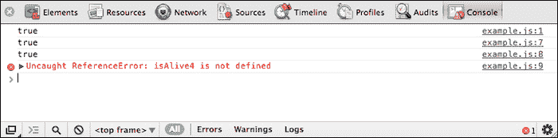
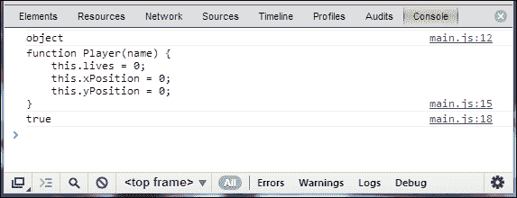
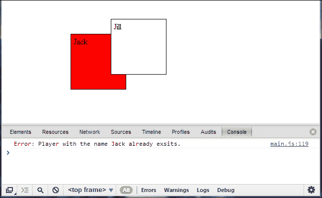

# 第四章：使用 HTML5 构建健壮的应用程序

自从 ActionScript 3 出现以来，Flash 开发人员已经习惯于以面向对象编程（OOP）范式进行开发。当转换到 JavaScript 时，许多具有 OOP 经验的开发人员可能会对 JavaScript 用于实现相同功能的语法感到不满。然而，对语法的误解可能导致对功能的误解。因此，在本章中，我们将介绍 JavaScript OOP、事件和事件监听器的使用。

在本章中，我们将涵盖以下内容：

+   JavaScript 类结构、用法和语法

+   对象继承

+   类构造函数

+   辅助开发的工具和框架

+   创建自定义事件和监听器

# 编写面向对象的 JavaScript

2006 年，当 Adobe 发布带有 ActionScript 3 支持的 Flash Player 9 时，Flash 开发社区看到了他们开发 Flash 应用程序的一次重大范式转变。在使用 ActionScript 3 之前，开发人员被要求用 ActionScript 2 编写他们的应用程序，这主要用作脚本编程语言。ActionScript 3 被设计为一个真正的面向对象编程语言，具有严格的类型，允许以可重用、更受控制的方式编写代码。

通过使用 ActionScript 3 和为 Flash Player 9 发布的新 ActionScript 虚拟机编译器，Flash 应用程序中的代码不仅以 OOP 结构编写，而且还可以比以前的传统 Flash 应用程序运行快 10 倍。随着时间的推移，Flash 开发人员已经习惯于编写适当的 OOP 结构化代码，这使他们能够轻松地将他们的编程技能转移到其他语言，如 Java、C++或 C#。

在 JavaScript 中使用 OOP 范式起初有点难以理解，因此让我们创建一个在 ActionScript 3 中的示例类结构，并直接将其移植到 JavaScript 中，以查看视觉语法的差异。在这个示例中，我们将创建一个名为`Player`的示例类，它将模拟游戏中角色的基本功能。我们将使用`Player`类来创建我们游戏中所需的任意数量的玩家，并通过构造函数、getter、setter 和公共变量来改变它们的属性，而不是根据功能为我们的游戏中的每个玩家设置单独的代码。为了更好地理解这个概念，请考虑以下代码示例：

```html
package {
public class Player {
    // Private Variables
    private var lives:int; // How many lives our player has.
    private var xPosition:int; // The players X position.
    private var yPosition:int; // The players Y position.

    // Public Variables
    public var name:String = 'John'; // The players name.

    /**
     * The Player constructor. 
     * This function is called when a new Player is     * instantiated.
     *
     * @param playerName: The name to give to our player.
     * @param lives: How many lives to give our player.
     */
    public function Player(playerName:String, playerLives:int = 5):void {
        // Update the player variables with 
        // the supplied parameters.
        name = playerName;
        lives = playerLives;
    }

    /**
     * Return the current amount of lives the player has.
     */
    public function get lives():int {
        return lives;
    }

    /**
     * Move the players x and y position.
     *
     * @param	x: The new X position to move the player to.
     * @param	y: The new Y position to move the player to.
     */
    public function move(x:int, y:int):void {
        // Update the player position variables.
        xPosition = x;
        yPosition = y;

        updatePosition();
    }

    /**
     * The would be the function that actually moves the
     * displayed player display object on the stage. 
     * This would get called every time a players X and Y   
     * position values are updated.
     */
    private function updatePosition():void {
        // Code to update the players display object...
    }
  }
}
```

尽管为了示例目的而简化，这个类示例对于任何有 ActionScript 3 编码经验的开发人员来说应该看起来非常熟悉。在我们的 Flash 项目中声明了这个类，我们可以随时导入它并实例化它。在对象内部声明了可以被父对象调用以操纵特定`Player`对象数据的属性和方法，这是任何类的典型特征。当你准备在你的应用程序中添加一个新的玩家时，我们可以用以下 ActionScript 3 代码实例化一个新对象：

```html
var player:Player = new Player('John', 10);
```

通过将所需的值附加到构造函数中，我们为我们的玩家提供了一个独特的名称，以及这个玩家将拥有多少生命的初始值。现在我们有了我们的新玩家，在我们的想象游戏中可以操纵它。

现在让我们看一下在 JavaScript 中重新编写的相同类：

```html
function Player(playerName, playerLives) {
  // Private variables
  var lives = playerLives;
  var xPosition = 0;
  var yPosition = 0;

  // Public variables
  this.name = playerName;

  // Return the current amount of lives the player has.
  this.lives = function() {
    return lives;
  }

  /**
   * Move the players x and y position.
   *
   * @param	x: The new X position to move the player to.
   * @param	y: The new Y position to move the player to.
   */
  this.move = function(x, y) {
    xPosition = x;
    yPosition = y;

    updatePosition();
  }

  /**
   * The would be the function that actually moves the displayed
   * player display object on the stage. This would get called 
   * every time a players X and Y position values are updated.
   */
  function updatePosition() {
    //
  }
}
```

乍一看，人们会发现没有类声明，这是许多其他编程语言中熟悉的。相反，在 JavaScript 中创建“类”时，使用函数来模拟传统类结构的使用。包声明也从等式中移除，JavaScript 的包含也附加到 HTML 文档中，渲染网页。在逻辑上，可以将所有 JavaScript 类分开放在单独的文件中以便于开发。但是，当将大量 JavaScript 发布到公共托管环境时，为了节省对 Web 服务器的数据请求，应尽可能合并 JavaScript。我们将在第十章中更深入地探讨为生产环境准备 HTML5 项目，*准备发布*。

### 提示

此时必须注意一点。由于缺乏严格的类型和许多其他特定的类结构规则，同样的 JavaScript 功能可以用多种方式编写。在本章的过程中，我已经尽可能地编写了示例，以便让我们更好地检查语法。

## 类语法

在初始的 JavaScript 类示例中，我们比较了 ActionScript 3 的类结构与 JavaScript 在创建面向对象代码时的差异。该示例使用了 JavaScript 中创建类的更传统方法之一，即使用函数代替典型的类声明。

### 函数

到目前为止，我们在代码示例中使用的许多 JavaScript 函数示例已经展示了定义新函数的不同方式。正如我刚才提到的，根据开发人员的舒适程度，他们可能选择以以下一种方式之一在 JavaScript 中编写函数：

```html
function isAlive1() { return true; }
var isAlive2 = function() { return true; };
window.isAlive3 = function() { return true; };

console.log(isAlive1());
console.log(isAlive2());
console.log(isAlive3());
```

在前面的示例中，三个`console.log`输出中的每一个都将产生正确的布尔返回值*true*。值得注意的是，函数定义和函数使用的顺序不需要像前面的代码示例中所示的那样。以下示例将产生完全相同的结果：

```html
console.log(isAlive1());

function isAlive1() { return true; }
var isAlive2 = function() { return true; };
window.isAlive3 = function() { return true; };

console.log(isAlive2());
console.log(isAlive3());
```

尝试调用未定义的函数时，将会触发`ReferenceError`错误，并在 JavaScript 控制台中显示。



尽管我们的应用程序可能会继续运行，尽管出现此运行时错误，但这通常意味着我们的代码存在问题。我们可以使用简单的条件来处理代码中的此问题，而不是将默认的`ReferenceError`错误发送到 JavaScript 控制台。

```html
try {
  console.log(isAlive4());
} catch(error) {
  console.log('Failed to call isAlive4() - ' + error);
  // Run alternate code here...
}
```

### 变量范围

正确理解 JavaScript 中变量范围是理解语言核心方面的关键步骤。范围是指变量在代码的其他部分创建时对其可访问性。变量可以根据用于声明它们的语法进行实例化和引用。JavaScript 利用许多人所说的*函数范围*，在其中所有变量和函数的范围都相同。在范围链的顶部是全局变量和函数。与所有编程范式一样，全局意味着一切，全局变量或函数可以在代码的任何其他地方访问。

```html
var name = 'John';

function getName() {
  return name;
}

// Both calls return the name as it is accessible globally.
console.log(name);
console.log(getName());
```

此代码演示了全局变量的使用。由于变量名在使用它的函数范围之上声明，因此运行此代码时不会出现错误。但是，变量也可以在函数内部局部声明。

```html
function getName() {
  var name = 'John';
  return name;
}

console.log(name);     // Error
console.log(getName());   // Success
```

由于 Player 的名称（在这种情况下是 John）是在`getName`函数内创建的，因此无法全局访问该函数之外的任何代码。全局和局部变量的概念虽然简单，但当你开始考虑严格类型的缺乏以及全局和局部变量的确切变量名称时，你可能会感到头晕。不用担心，这是 JavaScript 开发人员在典型学习曲线问题中遇到的另一个问题。但正如之前提到的，掌握 JavaScript 中的变量作用域是每个优秀的 HTML5 开发人员必须具备的基本技能之一。

为了演示一些问题，并允许您完全查看作用域的运行情况，让我们回顾以下示例：

```html
// We will start with a globally scoped variable which is accessible by everything.
var alpha = 'a';

// Global scope example.
function a() {
    console.log(alpha); // Reference the global alpha variable.
}

// Local scope using a supplied variable.
function b(alpha) {
    console.log(alpha); // Reference the supplied alpha variable.
}

// Local scope using a variable created within the function.
function c() {
  var alpha = 'c';
  console.log(alpha);
}

// Update the global object property.
function d() {
    this.alpha = 'd'; // Create an internal object property.
}

function e() {
    var n = 'e';

    this.alpha = function() {
        console.log(n);
    }
};

function f() {};

a();    // A
b('b'); // B
c();    // C

console.log(new d().alpha); // D

var e = new e().alpha();    // E

f.prototype.alpha = 'f';    
console.log(new f().alpha); // F
```

尽管上面的例子是一个不合逻辑的输出字符 A 到 F 的方式，但它展示了许多变量和函数可以被操纵以访问应用程序作用域链中特定区域数据的方式。

### 公共和私有变量和函数

理解 JavaScript 中的变量和函数的下一步是学习如何创建和利用公共和私有成员。与 ActionScript 3 不同，变量不是私有或公共类型的，因此语法稍微难以理解。

#### 局部或私有变量

通过在对象内创建变量时使用`var`关键字声明私有（或局部）变量。结果变量只能在特定对象内部访问，并且需要 getter 和 setter 方法来允许外部操作。这种变量声明方式类似于在 ActionScript 3 中创建变量时使用`private`关键字。面向对象编程开发的一个一般准则是尽可能使用私有变量，因为这将大大减少变量损坏或其他错误使用的问题。

```html
function Example() {
  var foobar = 'abc'; // Only accessible within the Example scope.
}
```

#### 公共变量

通过使用`this.myVariableName`语法声明公共变量或属性。与在 ActionScript 3 中创建变量时使用`public`关键字类似，JavaScript 中的公共变量不仅可以在对象作用域链内的代码中访问，还可以在创建它的对象之外访问。

```html
function Example() {
  this.foobar = 'abc'; // Accessible outside the Example scope.
}
```

#### 私有函数

只能在对象作用域内访问的私有函数可以用几种不同的方式编写。

```html
function Example() {
  function TestOne() {
    return true;
  }

  var testTwo = function() {
    return true;
  };
}
```

先前演示的两个例子都产生了一个私有函数。任何尝试从对象作用域之外调用该函数的尝试都会导致运行时错误。

#### 公共函数

公共或特权函数，像公共变量一样，可以从创建它们的对象之外访问，并使用`this.myFunctionName = function() {...}`语法创建。

```html
function Example() {
  this.test = function() {
    return true;
  }
}
```

### 原型

JavaScript 对象语法中更令人困惑的一个方面是原型对象的使用。正如我们在此之前的示例和解释中所看到的，JavaScript 中的一切都是对象，而每个 JavaScript 对象中都有一个原型属性。

### 提示

如果您在 ActionScript 1 或 ActionScript 2 的时代使用 Flash，您可能熟悉原型对象的概念（[`help.adobe.com/en_US/as2/reference/flashlite/WS5b3ccc516d4fbf351e63e3d118ccf9c47f-7ec2.html`](http://help.adobe.com/en_US/as2/reference/flashlite/WS5b3ccc516d4fbf351e63e3d118ccf9c47f-7ec2.html)）。这个对象在两种编程语言中都被使用，但在 ActionScript 3 发布时被放弃。

为了看到这个概念的运行情况，让我们从简单开始，逐步向更复杂的原型对象用法前进。我们将首先查看一个新空对象的原型对象。

```html
var player = {}; // Create a new empty object.
console.log(Object.getPrototypeOf(player)); // Return the prototype object.
```

在 Web 浏览器中运行此代码将导致 JavaScript 日志，其结果非常接近以下代码，如果不是相同的话：

```html
Object
__defineGetter__: function __defineGetter__() { [native code] }
__defineSetter__: function __defineSetter__() { [native code] }
__lookupGetter__: function __lookupGetter__() { [native code] }
__lookupSetter__: function __lookupSetter__() { [native code] }
constructor: function Object() { [native code] }
hasOwnProperty: function hasOwnProperty() { [native code] }
isPrototypeOf: function isPrototypeOf() { [native code] }
propertyIsEnumerable: function propertyIsEnumerable() { [native code] }
toLocaleString: function toLocaleString() { [native code] }
toString: function toString() { [native code] }
valueOf: function valueOf() { [native code] }
```

这个输出可以让我们更加了解原型对象的真正含义。正如你已经从之前的 ActionScript 3 开发中了解到的，对象变量类型带有许多内置方法来操作其中的内容。查看我们的`Player`对象的原型的输出，你可能会注意到列出了许多这些熟悉的方法和属性。

我们可以使用原型对象随时向对象附加新属性。考虑以下示例，我们创建了一个简化的`Player`对象，并通过原型对象而不是直接在对象本身内部附加移动功能：

```html
function Player(name) {
  this.name = name;
  this.lives = 0;
  this.xPosition = 0;
  this.yPosition = 0;
}

Player.prototype.move = function(x, y) {
  this.xPosition = x;
  this.yPosition = y;
}
```

相同的概念可以用于覆盖默认对象行为。通过修改原型对象的移动属性，对移动方法的任何进一步调用都将导致新附加的行为。

```html
function Player(name) {
  this.name = name;
  this.lives = 0;
  this.xPosition = 0;
  this.yPosition = 0;

  this.move = function(x, y) {
    this.xPosition = x;
    this.yPosition = y;
  }
}

Player.prototype.move = function(x, y) {
  this.xPosition = x + 5;
  this.yPosition = y + 5;
}
```

请记住，这些更改是针对对象本身而不是实例。因此，这些更改将影响到每个“Player”实例，如下所示：

```html
function Player(name) {
  this.name = name;
  this.lives = 0;
  this.xPosition = 0;
  this.yPosition = 0;

  this.move = function(x, y) {
    this.xPosition = x;
    this.yPosition = y;
  }
}

function init() {
  var susan = Player('Susan');
  var john = Player('John');	

  // Modify the move function for ALL Player instances.
  Player.prototype.move = function(x, y) {
    this.xPosition = x + 5;
    this.yPosition = y + 5;
  }
}
```

那么为什么这很重要呢？根据你的应用程序是如何构建的，通过利用原型对象，你可以直接向对象附加共享代码，而无需多次编写相同的代码。代码越少意味着内存占用越少，这将使你在维护项目时更加轻松。

### 实例类型

当你开始在这些示例和自己的 JavaScript 代码中浮动时，添加检查和条件以获取实例类型将证明是一个重要的补充。缺乏严格的类型将要求你编写和维护干净和优化的代码，以使你的应用程序正常工作。考虑一些以下代码片段，以获取有关我们的`Player`对象实例类型的信息：

```html
// Create a player instance
var player = new Player('John');

// Check the type of player.
console.log(typeof(player));

// Output the constructor data from the player.
console.log(player.constructor);

// Check if the player is a Object - returns a Boolean.
console.log(player instanceof Object);
```

对`console.log`方法的每次调用都执行查找`Player`对象实例的不同方式。当我们在 Web 浏览器中运行此代码并打开开发者控制台时，我们会得到以下输出：



初始的`object`输出是对`Player`对象的`typeof()`函数调用的结果。第二个输出是调用`Player`对象的构造函数时返回的代码块。最后，条件控制台调用（`console.log(player instanceof Object)`）在控制台中返回布尔值，让我们知道`instanceof`条件为真。

### 对象字面量

字面量只是在 JavaScript 中定义数组和对象的一种更简短的方法。我们已经使用以下语法在 JavaScript 中创建新对象：

```html
var player = new Object();
var player= Object.create(null);
var player = {};
```

我们可以通过在变量声明中直接创建对象的内部来进一步扩展前面的语法。

```html
var player = {
  name: "John",
  lives: 5,
  xPosition: 0,
  yPosition: 0,
  move: function(x, y) {
    xPosition = x;
    yPosition = y;

    // Update the position display...
  }
}
```

然而，这种`Object`语法在重用方面存在重大问题，因为它的实例在创建时已经存在。由于不需要实例化对象，我们可以通过引用其属性来继续我们的代码。

```html
  player.name = "Susan";
  player.move(5, 5);
```

### 构造函数

正如我们在之前的一些示例中所看到的，与 ActionScript 3 相比，对象构造函数的语法与通常使用的有些不同。由于类只是函数，我们可以直接将通常在构造函数中找到的代码放在类内部。

通过调用对象的`constructor`属性，你可以轻松查找最初创建对象的函数的引用。

```html
console.log(player.constructor);
```

当尝试查找内置对象类型（如数组、字符串或日期）的构造函数时，输出将隐藏内部代码，并显示使用原生代码的警告。

```html
var test = Array();
console.log(test.constructor);
```

这将在浏览器的 JavaScript 控制台中生成以下内容：

```html
function Array() { [native code] }
```

## 继承

通过在现有对象上使用`call()`方法，我们可以将对`this`的引用从对象本身更新到代码中的其他位置。

```html
function Player(name) {
  this.name = name;
  this.age = 20;
}

function John() {
  Player.call(this, 'John');

  this.age += 35;
}

function Jill() {
  this.age += 20;
}
Jill.prototype = new Player('Jill');

function init() {
  var john = new John();
  console.log(john.name + ' is ' + john.age);

  var jill = new Jill();
  console.log(jill.name + ' is ' + jill.age);
}
window.addEventListener("load", init);
```

此示例演示了在新的`John`对象中简单继承`Player`对象。这使我们能够访问`Player`中的内部值，并在`John`类中外部使用它们。在这个例子中，我们让 John 比默认的`Player`大 35 岁。我们还可以使用原型对象来声明对象继承。

```html
function Player(name) {
  this.name = name;
  this.age = 20;
}

function Jill() {
  this.age += 20;
}
Jill.prototype = new Player('Jill');

function init() {
  var jill = new Jill();
  console.log(jill.name + ' is ' + jill.age);
}
window.addEventListener("load", init);
```

创建新的`jill`对象时，它继承了来自`Player`的所有基本属性和函数，因为原型引用已经声明了对象继承。在页面加载时，此示例的输出将显示以下内容：

```html
John is 55
Jill is 40
```

## 列出对象属性

在任何时候，您都可以使用`Object.getOwnPropertyNames()`方法查找对象中可用的属性。在考虑私有和公共语法的情况下，让我们回顾以下示例，查看查找对象属性时的输出：

```html
function Player() {
  // Private variables
  var _this = this; 	// Reference to this object
  var lives;
  var positionX = 0;
  var positionY = 0;
  var playerElement;

  // Public variables
  this.name = '';	// The players name.
  this.age = 10;	// The players age (default = 10).

  this.move = function(x, y) {
    positionX = x;
    positionY = y;

    // Move the player...
  };

  function blink() {
    // Blink players eyes...
  }
}

var player = new Player();
var properties = Object.getOwnPropertyNames(player);

console.log(properties);
```

再次，考虑到公共和私有变量，只有使用关键字`this`创建的变量才能在对象范围之外可见。执行前面的代码示例将提供以下属性名称数组作为输出：

```html
["name", "age", "move"]

```

# 使 JavaScript 中的面向对象编程更容易

对于许多开发人员来说，开发面向对象 JavaScript 所需的所有这些变通和语法更改似乎就像是一长串“黑客”清单。无论您对此事的看法如何，都有许多选项可用于帮助构建具有更传统开发流程的大规模基于 JavaScript 的应用程序。在第六章中，*HTML5 框架和库*，我们将深入研究许多流行的 JavaScript 库和框架，以及它们如何不仅可以加快您的开发时间，还可以在所有现代浏览器和设备上提供更可靠的最终结果。

# JavaScript 事件

与大多数语言一样，事件是真正使应用程序活跃起来的。如果没有事件的使用，程序通常只会从开始到结束运行，而不需要人类交互。JavaScript 事件建立在异步事件模型的基础上。事件可以使用回调结构，例如在 ActionScript 中，来执行一旦事件被触发就执行代码，而不是不断地检查是否满足条件。这方面的一个很好的例子，你可能已经在许多其他示例中看到过：

```html
window.addEventListener("load", init, false);
```

我们在`window`对象上使用此事件监听器，以便让我们的代码确定`window`对象何时完成加载，以便我们可以调用我们的初始方法来开始 JavaScript 操作我们的文档。

## 键盘和鼠标事件

鼠标事件是几乎所有 JavaScript 项目都包含的核心元素之一。虽然我们将在整本书中的示例中使用这些事件，但值得回顾一下不仅是鼠标，还有键盘和触摸事件的整合列表，这样你就可以更好地了解可供您用于输入事件监听的内容。不同的键盘和鼠标事件列举如下：

+   **mousedown：**鼠标按钮已被按下

+   **mouseup：**鼠标按钮已被释放

+   **click：**鼠标按钮已被单击

+   **dblclick：**鼠标按钮已被双击

+   **contextmenu：**已触发某个操作以显示上下文菜单

+   **scrolling：**上下文已在滚动轴上移动

+   **keydown：**键盘键已被按下

+   **keypress：**键盘键已被按下并释放

+   **keyup：**键盘键已被释放

## 触摸事件

触摸事件支持正逐渐接近一套标准；但是，您会注意到根据您正在测试的设备和浏览器的支持和功能集的差异。值得注意的是，就像在触摸界面上运行的 Flash 应用程序一样，您可以使用鼠标事件而没有问题，并且仍然支持实际鼠标的使用。但是，由于鼠标一次只能点击一个点，如果您的应用程序需要多点触控支持，您将不得不开始使用触摸事件结构。在接下来的两章中，我们将进一步探讨在触摸设备上使用 HTML 的方式以及开发的区别。支持的触摸事件如下：

+   touchstart：用户已开始触摸元素

+   touchmove：用户自 touchstart 以来移动了触摸位置

+   touchend：用户已经从元素中移开手指

## 自定义事件

拥有创建自定义事件并将其分派给等待事件监听器的能力，可以进一步扩展应用程序的面向对象编程语法和结构。通常，作为使用 ActionScript 3 的 Flash 开发人员，您会利用`flash events`类来创建自定义事件，以便从一个类到另一个类创建通信流。在其最简单的形式中，它看起来像下面这样：

```html
import flash.events.Event;
import flash.events.EventDispatcher;

var myEvent:Event = new Event("myEvent", false);
dispatchEvent(myEvent);
```

与 ActionScript 3 中的大多数功能一样，为了优化应用程序的文件大小和执行速度，在使用扩展的内部功能时，必须直接导入包。因此，在 ActionScript 3 中创建和分派事件时，我们应该始终导入`Event`和`EventDispatcher`类，之后我们可以用提供为字符串的自定义事件类型实例化一个新事件。当事件被分派时，将需要一个事件监听器来执行进一步的代码，以完成应用程序中的事件序列。我相信您非常清楚，ActionScript 3 中的典型事件监听器描述如下语法：

```html
addEventListener("myEvent", myCustomEventHandeler, false, 0, true);
```

使用与所有事件监听器设置相同的 ActionScript 3 语法，自定义事件类型再次以字符串形式提供给标识符。提供的第二个参数始终是一旦此监听器触发将要调用的函数。最后三个参数控制事件控制和内存清理的冒泡和弱引用。

幸运的是，JavaScript 中自定义事件的设置和结构与一些明显的区别非常相似。考虑这个工作示例，与我们刚刚审查过的内容以及您已经了解的 ActionScript 3 中的事件相比。

```html
function init() {
  // Create an event listener
  document.addEventListener("myEvent", myEventHandeler, false);

  // Create our custom event
  var myEvent = document.createEvent("Event");

  // initEvent(event type, allow bubbling, allow prevented)
  myEvent.initEvent("myCustomEvent", true, true);
  myEvent.customData = "We can add more data into our event easily!";
  document.dispatchEvent(myEvent);
}

function myEventHandeler(event) {
  console.log('The custom event has been dispatched - ' + event);
  console.log('And retrieve our appended data - ' + event.customData);
}

window.addEventListener("load", init);
```

除了缺少导入的类之外，这个事件示例在任何 Flash 开发人员眼中应该看起来非常熟悉。与本书中大多数示例一样，我们等待窗口加载一个我们到目前为止经常看到的事件监听器。在`init`函数中，我们首先创建我们的事件监听器。在这种情况下，我们将监听器附加到文档；但是，这可以附加到代码中的任何对象。请注意，不仅创建新事件监听器的方法完全相同（`addEventListener`），而且初始两个参数的语法也是相同的。提供的最后一个布尔值控制事件冒泡，我们稍后将回顾。`init`函数中的剩余代码包含我们的事件实例化以及该事件的分派。再次感谢 ECMAScript 的荣耀，自定义事件的语法和结构几乎是相同的。

在 JavaScript 中使用`createEvent()`方法创建我们的事件类型时，事件模块的可用性取决于浏览器的 DOM 级别支持。在撰写本书时，大多数浏览器都在向全面支持 DOM 级别 3 事件迈进，其中包括 UIEvent、DOMFocus、DOMActivate、Event、MouseEvent、MutationEvent、TextEvent、KeyboardEvent 和 HTMLEvent。您可以通过访问[`www.w3.org/TR/DOM-Level-3-Events/`](http://www.w3.org/TR/DOM-Level-3-Events/)来查看当前可用或未来指定的 DOM 级别 3 事件的完整列表。

`addEventListener`方法的第三个参数指定注册的事件处理程序是否捕获指定的事件。如果事件处理程序捕获事件，那么每次事件发生在元素或其后代上时，事件处理程序都将被调用。

## 事件冒泡

当事件被分派时，它将遵循对象的父树直到绝对父对象，直到它被处理或停止。这种行为称为事件冒泡，它也存在于 ActionScript 3 和 JavaScript 事件结构中。在 Flash 项目中，事件将一直冒泡到主对象或在大多数情况下是舞台。在 JavaScript 中，事件将冒泡到文档对象。

在下面的例子中，我们将研究如何通过控制事件的传播来处理文档和对象上的`mousedown`事件：

```html
function init() {
  // Add a mouse click listener to the document.
  document.addEventListener("mousedown", onDocumentClick, false);

  // Add a mouse click listener to the box element.
  var box = document.getElementById('box');
  box.addEventListener("mousedown", onBoxClick, false);
}

function onDocumentClick(event) {
  console.log('The document has been clicked - ' + event);
}

function onBoxClick(event) {
  console.log('The box has been clicked. - ' + event);

  // Stop this event from reaching the document object
  // and calling the document level event listener.
  event.stopPropagation();
}

window.addEventListener("load", init);
```

这个 JavaScript 片段为文档中的元素以及文档本身都应用了`mousedown`事件监听器。如果用户在页面中的元素上点击，那么两个事件监听器都会被调用，导致两个不同的处理程序处理相同的鼠标点击。虽然在某些应用程序中这可能很方便，但处理这个问题的自然方式是通过使用`stopPropagation()`方法停止事件冒泡的流程，从而只允许调用单个处理程序。

在 JavaScript 中处理事件传播与在 ActionScript 3 中所习惯的方式是相同的。在事件流的任何时刻，您都可以通过调用`stopPropagation()`或`stopImmediatePropagation()`方法轻松地停止事件的传播。如果您熟悉 ActionScript 3 开发中的这些方法，您将知道它们在本质上几乎是相同的。唯一的区别是`stopImmediatePropagation()`调用会阻止事件流到达当前节点中的任何其他事件侦听器。

# 把所有东西放在一起

归根结底，所有这些代码示例只是定义了 JavaScript 功能的各个部分。继续使用本章节中一直在使用的`Player`类概念，我们对我们的示例“游戏中的玩家”类结构进行了一些润色。

```html
function Game() {
  // An array to hold all our player objects
  var players = new Array();

  // Game Constructor
  // Reference to the game element in the document.
  var gameElement = document.getElementById('game'); 

  // Get the game element size.
  var gameElementWidth = gameElement.offsetWidth;
  var gameElementHeight = gameElement.offsetHeight;

  // Be sure to update these values if the window is 
  // to ever be resized.
  window.onresize = function() {
    console.log("NOTICE: Browser Resize: " + gameElementWidth + " x " + gameElementHeight);
    gameElementWidth = gameElement.offsetWidth;
    gameElementHeight = gameElement.offsetHeight;
  };

  // Player Class.
  function Player(name) {
    this.name = name;

    // Create the element for the player.
    var playerElement = document.createElement("div");
    playerElement.class = 'element';
    playerElement.style.position = "absolute";
    playerElement.style.left = Math.floor((Math.random() * gameElementWidth - 100) + 1) + 'px';	// Random position within viewabled bounds
    playerElement.style.top = Math.floor((Math.random() * gameElementHeight - 100) + 1) + 'px';
    playerElement.style.color = "#000000";
    playerElement.style.display = "block";
    playerElement.style.padding = "5px";
    playerElement.style.border = "1px solid #000000";
    playerElement.style.width = "100px";
    playerElement.style.height = "100px";
    playerElement.innerHTML = this.name;
    gameElement.appendChild(playerElement);

    // Move this players X and Y positions.
    this.move = function(x, y) {
      playerElement.style.left = x + "px";
      playerElement.style.top = y + "px";
    }

    // Return the current position of this player 
    // as a object.
    this.getPostion = function() {
      var position = {};
      position.x = parseInt(playerElement.style.left);
      position.y = parseInt(playerElement.style.top);
      return position;
    }
  }

  // Public Methods
  this.addNewPlayer = function(name) {
    // Check if this player name is already created
    var l = players.length;
    for(var i = 0; i < l; i++) {
      if(name == players[i].name) {
        console.log('Error: Player with the name ' + name + ' already exsits.');
        return;
      }
    }

    // Create the new player instance
    var player = new Player(name);

    // Add a reference to the global players array.
    players.push(player);
  }

  this.getPlayer = function(name) {
    // Check if this player name is already created
    var l = players.length;
    for(var i = 0; i < l; i++) {
      if(name == players[i].name) {
        return players[i];
      }
    }

    return false;
  }
}

function init() {
  // Create the game instance.
  var game = new Game();

  // For this game we will automatically create two players.
  game.addNewPlayer('Jack');
  // Try to add another Jack to view name check.
  game.addNewPlayer('Jack'); 
  game.addNewPlayer('Jill');

  document.addEventListener('keydown', onKeyDown);

  // Called when the user presses a key on the keyboard.
  function onKeyDown(event) {
    // The key that was just pressed (ID).
    var key = event.keyCode; 

    // Lookup the player to reference.
    var player = game.getPlayer('Jack'); 

    // Make sure the player exsists.
    if(player == false) return;

    // Get the players current position.
    var position = player.getPostion();

    // Forward
    if(key == 38) player.move(position.x, position.y - 10);

    // Backwards
    if(key == 40) player.move(position.x, position.y + 10);

    // Left
    if(key == 37) player.move(position.x - 10, position.y);

    // Right
    if(key == 39) player.move(position.x + 10, position.y);
  }
}

window.addEventListener("load", init);
```

尽管这仍然是一个简单的例子，展示了在一个单一包中可能具备的许多我们在本章中看到的特性：



# 总结

尽管本章涵盖了 JavaScript 开发中对象的语法和结构的主要概念，但实际上我们可以写一整本书来讨论这个主题。话虽如此，我们将继续在本书中涵盖这些以及更多 JavaScript 开发的高级方面。正如本章的介绍中所提到的，许多高级 JavaScript 开发中呈现的差异和范式变化可能对一些 Flash 开发人员来说有些令人生畏。然而，一旦您掌握了这些核心概念中的大部分，其他的拼图就会变得轻而易举地拼合在一起。在下一章中，我们将探讨一些可用于将现有 Flash 内容移植到 HTML5 的工具。

### 提示

寻找更高级的 JavaScript 语法和结构技巧？您可以查看 Packt Publishing 出版的这些书籍，*Object-Oriented JavaScript* by *Stoyan Stefanov*，*Learning jQuery, Third Edition* by *Jonathan Chaffer* and *Karl Swedberg*，以及*jQuery for Designers: Beginner's Guide* by *Natalie MacLees*。
