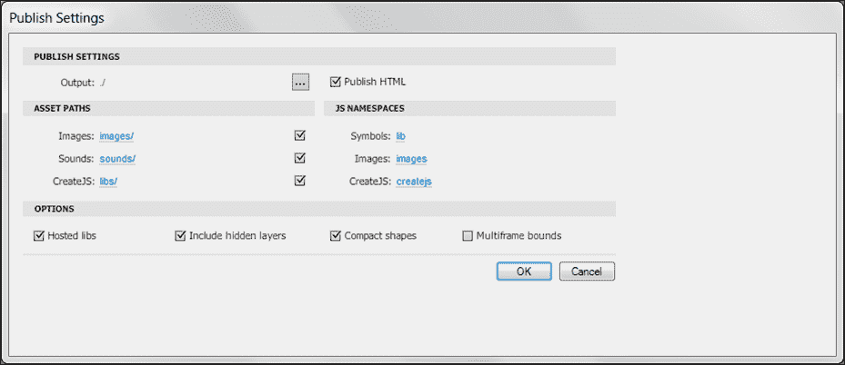

# 第五章：一次编码，到处发布

我相信您现在可能已经注意到，尽管所有现代浏览器都支持指定的 HTML5 功能集的许多方面，但在许多情况下，开发人员必须以特定方式编写其代码，以实现对其项目的适当跨浏览器支持。这不仅是一项耗时的任务，需要大量的冗余和调整，而且要求开发人员保持与 HTML5 规范的当前浏览器支持的最前沿；不仅针对每个目标浏览器，还要针对每个浏览器的每个更新。随着 HTML5 开发的流行度以极快的速度增长，许多开发人员已经创建了库和框架，以帮助使用单个代码实例针对所有平台。

在本章中，我们将学习：

+   CreateJS 工具包的概述，这是 Flash 开发人员在 HTML5 开发中的最佳伙伴，以及其内部库 EaselJS、SoundJS、PreloadJS 和 TweenJS

+   使用 Modernizr 检测客户端浏览器功能

+   深入了解 CSS3 媒体查询

# 覆盖所有基础

Flash 和 HTML5 开发范式之间最大的区别之一是开发人员对最终用户的期望。通常，Flash 开发人员会在启动项目时预设项目的发布设置，以便将项目发布到最能支持应用程序内置功能集的 Flash Player。当然，这意味着用户计算机上安装的 Flash Player 必须是最新的，以满足先决条件版本。在开发任何基于 HTML 的 Web 项目时，这个问题会更加严重，因为开发人员失去了对用户如何查看其内容的控制。尽管有些浏览器比其他浏览器更常见，但如今有大量的互联网浏览器软件可用，不仅适用于台式机和移动设备，还适用于电视等设备。不幸的是，每个浏览器的规格并不完全相同，如果您忽略在每个浏览器中测试您的项目，就无法保证您的内容将被显示并且将按照您创建的方式运行。

随着微软发布的 Internet Explorer 10 版本的发布，开发人员不再抱怨为 Internet Explorer 6 版本开发网页的日子已经一去不复返。然而，随着 HTML5 的出现，一系列新问题也随之而来。网页和基于 Web 的应用程序现在可以访问许多您已经习惯于在本机桌面应用程序中使用的功能。新的系统集成，如文件访问权限，外围支持以及硬件加速，要求现代 Web 浏览器实现对这些功能的支持，以便为查看这些新 HTML5 内容的用户提供适当的支持。

那么哪个浏览器是最好的呢？从开发人员的角度来看，尽管有一个最喜欢的浏览器是很好的，但如果您希望每个人都能查看您的内容，这并不重要。了解差异以及它们如何已经改变，以及将来会如何改变，将使您的 HTML5 技能保持最新并领先于潮流。如前所述，如果您使用今天可用的流行和现代 Web 浏览器，大多数基础将得到覆盖。在撰写本书时，即将推出的功能，如我们将在本书后面介绍的 WebRTC，只在 Google Chrome 等浏览器中得到支持。

# CreateJS

由于这本书是专门为 Flash 开发人员编写的，他们正在用 HTML5 扩展他们的技能，我们首先要介绍的是 CreateJS。CreateJS 是一组开源的、模块化的 JavaScript 库，可以单独工作，以实现从 ActionScript 3 到 JavaScript 的更无缝的过渡。CreateJS 专门为了让 Web 开发人员能够轻松地在他们的 HTML5 项目中创建、嵌入和操纵媒体资产。如果你来自 Flash 开发背景，这一点尤其正确。

### 注意

CreateJS 中所有元素的最新版本以及完整的文档可以在[`www.createjs.com`](http://www.createjs.com)找到。

CreateJS 专注于资产集成和操纵，以便让您，开发人员，花更多的时间来确保您的项目像素完美。最近有一些很棒的例子，展示了一些令人惊叹的项目，这些项目利用了这个库，产生了一些令人惊叹的 HTML5 体验，比如[`www.findyourwaytooz.com`](http://www.findyourwaytooz.com)、[`www.atari.com/arcade`](http://www.atari.com/arcade)和[`shinobicorp.com/retro-soccer`](http://shinobicorp.com/retro-soccer)。

虽然我们可以详细介绍 CreateJS 包中每个令人兴奋的功能，但我们可能会填满一半的书。因此，为了确保您至少可以初步了解 CreateJS 提供了什么，让我们回顾一下包中的每个元素以及它们如何在您的 HTML5 项目中使用。

## EaselJS

EaselJS 是一个旨在模仿 Flash 中 ActionScript 3 的显示列表语法的 JavaScript 库。它通过使用 HTML5 Canvas 元素来实现这一点，就像 Flash 中的舞台一样。作为 HTML5 和 JavaScript 语法的新手，EaselJS 可能是一个不仅可以让你继续以与你到目前为止一直在开发的方式相似的方式创建应用程序，而且还可以让你相对轻松地将你现有的 Flash 应用程序移植到 HTML5 的库。

### 注意

最新的 EaselJS 文档可以在[`www.createjs.com/Docs/EaselJS`](http://www.createjs.com/Docs/EaselJS)上轻松找到。

EaselJS 可以用来处理 HTML5 项目中的所有图形元素，如位图、矢量和精灵表。EaselJS 的最佳用例之一是将现有的 ActionScript 3 类移植到 JavaScript 中。由于 EaselJS 被设置为模拟 Flash 中的显示列表，一旦我们的 ActionScript 3 类被转换，我们就可以开始在我们的 JavaScript 项目中使用它，方式几乎与在 Flash 项目中使用它的方式相同。

每个使用 EaselJS 或任何其他 CreateJS 库的项目都需要将库源导入到他们的 HTML5 项目中。一旦你从 CreateJS 网站获取了必要的 JavaScript 源文件，就可以按照下面的例子设置你的 HTML 文档：

```html
<!DOCTYPE html>
<html lang="en">
  <head>
    <meta charset="utf-8" />
    <title>CreateJS - EaselJS Example</title>

    <!-— Import the EaselJS Library --> 
    <script src="img/easeljs-0.5.0.min.js"></script>

    <script>
      function init() {
        // We can place our custom code here.
      }
    </script>
  </head>

  <body onload="init()">
    <canvas id="exampleCanvas" width="800" height="600">
  </body>
</html>
```

正如您从上面的例子中所看到的，EaselJS 库是在`<script>`标签中导入到我们的文档中的。我们还在文档的主体中添加了一个空的 Canvas 元素。由于 EaselJS 使用 HTML5 Canvas 元素来替代 Flash 中的舞台，这在这个例子和所有使用这个库的项目中都是必需的。

在我们的例子中，我们将首先回顾一个基本的 ActionScript 3 类，这个类可以在任何 Flash 项目中使用。这个类是一个简单的演示，将一个位图图形应用到舞台上鼠标的位置，并在鼠标移动时更新图形的位置。这个例子不仅涵盖了对外部图形引用的使用，还涵盖了基于鼠标和时间的事件：

```html
package {

  import flash.display.*;

  public class MouseLine() {

    private var oldX:int;
    private var oldY:int;

    public function MouseLine() { }

    public function update(container:Sprite, x:int, y:int):void {
      container.graphics.setStrokeStyle(1);
      container.graphics.moveTo(oldX, oldY);
      container.graphics.lineTo(x, x);

      oldX = x;
      oldY = y;
    }
  }
}
```

如果你花了一些时间使用 ActionScript 3 类，所有这些都应该看起来非常熟悉，所以让我们直接进入转换过程。正如我们在整本书中所看到的例子一样，在 JavaScript 中创建类时，语法、布局和用法都有一些明显的不同。首先是包声明以及导入语句。JavaScript 中不存在包；因此，该代码可以被移除。代码目录和文件结构仍然可以被使用；然而，在代码中不需要引用来区分哪个代码在哪个包中。导入语句也可以完全移除，因为它们在 JavaScript 中也不被使用。相反，项目中需要的任何外部代码应该在 HTML 文档内的`<script>`标签元素中导入。

由于我们打算将所有课程作为项目源结构中的单独文件保留，因此我们可以用以下自执行匿名函数替换 ActionScript 3 类中的典型包语法：

```html
(function(window) {
  // Place Your Code here
})(window);
```

当我们的类源代码放置在这个函数内时，它将在加载后自动执行，允许我们从项目的其余代码中利用这个类。在删除函数和变量的严格类型以及将公共和私有变量转换为 JavaScript 语法之后，我们的类将看起来像下面这样：

```html
(function(window) {

  function MouseLine() {
    this.oldX = 0;
    this.oldY = 0;
  };

  MouseLine.update = function(container, x, y) {
    container.graphics.setStrokeStyle(1);
    container.graphics.moveTo(this.oldX, this.oldY);
    container.graphics.lineTo(x, y);

    this.oldX = x;
    this.oldY = y;
  }

  window.MouseLine = MouseLine;

})(window);
```

注意在自执行匿名函数中附加的最后一行，`window.MouseLine = MouseLine;`

类的最后添加允许我们从应用程序基础实例化一个新的`MouseLine`对象，并在类中使用功能。但在我们开始使用这个类之前，我们需要将其导入到我们的项目中，如下所示：

```html
<script type="text/javascript" src="img/MouseLine.js"></script>
```

将我们的类保存为`MouseLine.js`后，我们现在可以像往常一样将其导入到我们的 HTML 文档中，通过在 HTML5 文档的头部使用`<script>`标签。在这个例子中，我们还将在文档的*head*中打开另一个`<script>`标签，在那里我们将放置利用我们的新类的自定义 JavaScript 代码：

```html
<script type="text/javascript">
  var stage;
  var line;

  function init() {
    stage = new createjs.Stage("exampleCanvas");
  }
</script>
```

在前面的例子中，我们开始构建 EaselJS 项目的`stage`。我们首先创建两个全局变量，一个用于我们的`stage`元素，另一个用于我们的鼠标图形元素。在全局变量之后是我们的`init()`函数，该函数将在页面加载时调用。在我们的`init`函数内的下一步是设置 Canvas 元素，我们将其应用到这个 HTML 文档的 body 上。我们使用`new.createjs.Stage('canvas-element')`语法告诉 EaselJS，我们的 ID 为`exampleCanvas`的 Canvas 是我们预期的 stage。

将 EaselJS 应用到我们的项目中并引用我们的 Canvas 元素后，下一步是应用一个 ticker，以允许我们模拟 ActionScript 3 中的`onEnterFrame`事件。由于我们打算让`MouseGraphic`类中的图形在 Canvas 上跟随鼠标移动，我们需要不断检查鼠标的位置，将这些值转换为图形的 x 和 y 位置值。如前所述，在 ActionScript 3 中，传统上会使用`onEnterFrame`事件；然而，在 JavaScript 中没有 MovieClips 和 frames 的概念，因此设置使用了 EaselJS 的`Ticker`对象。

在我们刚刚创建的`init()`函数中，我们现在可以应用以下代码来设置我们的`Ticker`对象：

```html
createjs.Ticker.setFPS(60);
createjs.Ticker.addListener(window);
```

我们不仅为我们的`Ticker`对象创建了一个新的事件监听器，并且还通过使用 CreateJS 内部对象方法之一来设置了 Canvas 渲染的预期每秒帧数。然而，通过创建我们的事件监听器，我们需要一个在每次渲染新帧时调用的函数。在使用 CreateJS 中的`Ticker`对象时，我们可以简单地在与`Ticker`对象相同的范围内附加一个`tick()`函数，这将在每个间隔调用：

```html
function tick() {
  stage.update();
}
```

在这个 tick 函数中，我们还添加了对我们在`init()`函数中创建的 Stage 对象的全局变量引用的调用。正如您可能猜到的那样，这个调用实际上告诉`stage`对象通过渲染舞台进度中的下一个间隔来更新自己。因此，任何在 ActionScript 3 中通常附加在`onEnterFrame`事件中的代码都将在调用`stage.update()`方法之前放置。

有了我们基本的 EaselJS 结构，我们的示例现在应该看起来像下面这样：

```html
<!DOCTYPE html>
<html lang="en">
  <head>
    <meta charset="utf-8" />
    <title>CreateJS - EaselJS Example</title>

    <script src="img/easeljs-0.5.0.min.js"></script>
    <script src="img/MouseLine.js"></script>

    <script>
      var stage;
      var mouseImage;

      function init() {
        stage = new createjs.Stage("exampleCanvas");

        createjs.Ticker.setFPS(60);
        createjs.Ticker.addListener(window);
      }

      function tick() {
        stage.update();
      }

    </script>
  </head>

  <body onload="init()">
    <canvas id="exampleCanvas" width="800" height="600">
  </body>
</html>
```

最后，我们需要导入我们的自定义类，并在`Ticker`对象的每个间隔中读取鼠标位置属性，以便重新定位图像：

```html
<!DOCTYPE html>
<html lang="en">
  <head>
    <meta charset="utf-8" />
    <title>CreateJS - EaselJS Example</title>

    <style>
      canvas {
        border:1px solid #000;
      }
    </style>

    <!-- Import the EaselJS library. -->
    <script type="text/javascript" src="img/easeljs-0.5.0.min.js"></script>

    <!-- Import our custom classes. -->
    <script type="text/javascript" src="img/MouseLine.js"></script>

    <script type="text/javascript">
      // A global reference to our stage object.
      var stage; 
      var line;

      /**
       * Called on body load.
       */
      function init() {
        // Initialize the stage.
         stage = new createjs.Stage("exampleCanvas"); 
         line = new createjs.Shape();
         stage.addChild(line);

        // Create our ticker (ie. onEnterFrame).
        // Sets the target frames per second.
        createjs.Ticker.setFPS(60); 
        createjs.Ticker.addListener(window);
      }

      /**
       * The 'tick' function is continuously called on the specified interval set by Ticker.setFPS()
       */
      function tick() {
      line.graphics.beginStroke(createjs.Graphics.getRGB(0, 0, 0));

        MouseLine.update(line, stage.mouseX, stage.mouseY);

        stage.update();
      }

    </script>
  </head>

  <body onload="init()">
    <!— Canvas element to be used as our Stage. -->
    <canvas id="exampleCanvas" width="800" height="600">
  </body>
</html>
```

这个简单的示例只是使用 EaselJS 时的冰山一角，但它展示了如何使用 Canvas 元素作为舞台的核心流程。EaselJS 实际上是 CreateJS 捆绑包的核心，因为当它与捆绑包中的任何或所有其他库一起使用时，一切都会变得生动起来。让我们继续查看 CreateJS 中的库列表，看看下一个库 TweenJS。

## TweenJS

对于 Flash 开发人员来说，对对象进行缓动应该并不陌生。然而，在 ActionScript 3 中处理对象动画要比使用 CSS3 动画或编写自己的缓动引擎要容易得多。这就是 TweenJS 发挥作用的地方。TweenJS（[`www.createjs.com/#!/TweenJS`](http://www.createjs.com/#!/TweenJS)）使用了 ActionScript 和 TweenMax（[`www.greensock.com/tweenmax`](http://www.greensock.com/tweenmax)）等库中常用的缓动语法，可以让您轻松创建适用于 HTML5 的动画，通过允许 TweenJS 在特定时间段内执行所有对象属性操作。虽然 TweenJS 是一个非常简单的库，但它在开发新项目或转换现有 Flash 项目时所能节省的时间可能是无价的。与 CreateJS 包中的所有元素一样，TweenJS 与 EaseJS 库非常配合，我们可以在下面的代码示例中演示：

```html
<!DOCTYPE html>
<html lang="en">
  <head>
    <meta charset="utf-8" />
    <title>CreateJS - TweenJS Example</title>

    <style>
      canvas {
        border:1px solid #000;
      }
    </style>

    <!-- Import the TweenJS library. -->
    <script type="text/javascript" src="img/easeljs-0.6.1.min.js"></script>
    <script type="text/javascript" src="img/tweenjs-0.4.1.min.js"></script>
<!-- Import the TweenJS Ease library as well. -->
    <script type="text/javascript" src="img/Ease.js"></script>

    <script type="text/javascript">
      var canvas, stage;

      // Called on body load.
      function init() {
        stage = new createjs.Stage("exampleCanvas");

        var circle = new createjs.Shape();
        circle.graphics.beginFill("#00FF00").drawCircle(100, 100, 100);

        stage.addChild(circle);

        createjs.Tween.get(circle, {loop:true})
          .to({
            x:600,
          }, 1000)
          .wait(500)
          .to({
          scaleX:0.2,
            scaleY:0.2
          }, 500)
          .to({
            x:600,
            y:400
          }, 1000)
                .to({
            scaleX:1,
            scaleY:1
          },1000)
          .to({
            x:0,
            y:0
          }, 1000);

        createjs.Ticker.setFPS(30);
        createjs.Ticker.addEventListener("tick", stage);
      }
    </script>
  </head>

  <body onload="init()">
    <!-- Canvas element to be used as our Stage. -->
    <canvas id="exampleCanvas" width="800" height="600">
  </body>
</html>
```

正如您在前面的示例代码中所看到的，在 EaselJS 创建的舞台中对元素进行缓动非常简单和熟悉，对于任何 Flash 开发人员来说都是如此。与 CreateJS 中的所有元素一样，TweenJS 可以与 CreateJS 套件的其余部分一起使用，也可以单独使用。因此，如果您需要一个简单但功能强大的缓动引擎来节省大量时间和开销，同时在 HTML5 项目中对元素进行动画处理，那么 TweenJS 绝对值得一试。

## PreloadJS

就像在 Flash 应用程序中一样，在 HTML5 项目中预加载资产可以是一个关键步骤，以确保您的内容以适当的方式传递给最终用户。PreloadJS（[`www.createjs.com/#!/PreloadJS`](http://www.createjs.com/#!/PreloadJS)）允许轻松设置多个资产的预加载，实时进度反馈和队列支持。正如我们在 EaselJS 示例中看到的，CreateJS 已经设置了自己的资产管理系统，可以轻松集成到 PreloadJS API（[`www.createjs.com/Docs/PreloadJS/modules/PreloadJS.html`](http://www.createjs.com/Docs/PreloadJS/modules/PreloadJS.html)）中。考虑以下简化的示例，它从 Web 加载外部音频和图像资产。

```html
<!DOCTYPE html>
<html lang="en">
  <head>
    <meta charset="utf-8" />
    <title>CreateJS - PreloadJS Example</title>

    <!-- Import the PreloadJS library. -->
    <script type="text/javascript" src="img/preloadjs-0.3.1.min.js"></script>
    <!-- Import the SoundJS library. -->
    <script type="text/javascript" src="img/soundjs-0.4.1.min.js"></script>

    <script type="text/javascript">

      // Called on body load.
      function init() {
        var loadCount = 0;

        var queue = new createjs.LoadQueue(false);
        queue.installPlugin(createjs.Sound);
        queue.addEventListener("complete", handleComplete);
        queue.addEventListener("fileload", handleFileLoad);

        // We can load a specific external file...
        queue.loadFile({id:"sound", src:"http://www.w3schools.com/html/horse.mp3"});

        // Or create a manifest which lists all of the files to load.
        queue.loadManifest([
        // Load some Google Doodles from the Google Servers.
           	{ id: "doodle1", src:"http://www.google.com/logos/2013/first_day_of_summer_2013-1536005-hp.gif" },
           	{ id: "doodle2", src:"http://www.google.com/logos/2013/first_day_of_winter_2013-1985005-hp.gif" },
           	{ id: "doodle3", src:"http://www.google.com/logos/2013/140th_anniversary_of_the_rcmp-1580006-hp.jpg" }
        ]);

        // Called on LoadQueue file load complete.
        function handleFileLoad(event) {
          var item = event.item;
              console.log("File Loaded: " + item.id);

          loadCount++;
            	console.log((loadCount / 4) * 100 + "% completed.");
        }

        // Called on LoadQueue load complete.
        function handleComplete() {
            console.log("File Loading Completed!");

            createjs.Sound.play("sound");

            var d1 = queue.getResult("doodle1");
            document.body.appendChild(d1);

            var d2 = queue.getResult("doodle2");
            document.body.appendChild(d2);

            var d3 = queue.getResult("doodle3");
            document.body.appendChild(d3);
        }
      }

    </script>
  </head>

  <body onload="init()">
  </body>
</html>
```

正如我们在本书的前面示例中所看到的，等待所有文档及其资产在与其交互之前加载是几乎每个 JavaScript 应用程序都会使用的关键步骤。然而，在页面加载期间下载资产时，没有简单的方法来监视下载或完成过程。尽管我们典型的`onload`调用仍将等待我们的资产准备就绪，但在许多应用程序中，进度条的使用可以极大地增强用户体验，尤其是在较长的应用程序加载时间内。

再次审查前面的示例，您会发现我们在每个文件加载时都添加了事件侦听器，以及在所有资产加载完成时。将要加载的资产数量的数值与已加载的资产数量相结合，我们可以轻松地找到当前的预加载完成百分比。为了避免冗长的代码示例，我只是使用开发者控制台来补充了一些预加载用户界面：


## SoundJS

在撰写本书时，处理所有现代 HTML5 兼容浏览器上的音频和音频交互支持仍然非常困难。当前的 HTML5 音频支持水平在不同浏览器之间甚至在大多数移动平台上都可能存在极大的差异。正确地调整音频交互和操作，以在每台设备和浏览器上运行几乎似乎是一项不可能的任务。幸运的是，SoundJS 可以帮助解决许多与 HTML5 音频开发相关的常见问题。SoundJS 允许您轻松地查询客户端浏览器的功能，以确保您使用的音频具有用户设备支持的正确功能和插件：

```html
<script>
  var preload;

  function init() {
    if (window.top != window) {
      document.getElementById("header").style.display = "none";
    }

    createjs.FlashPlugin.BASE_PATH = "../src/soundjs/" // Initialize the base path from this document to the Flash Plugin
    if (!createjs.SoundJS.checkPlugin(true)) {
      document.getElementById("error").style.display = "block";
      document.getElementById("content").style.display = "none";
      return;
     }

    document.getElementById("loader").className = "loader";
    var assetsPath = "assets/";
    var manifest = [
        {src:assetsPath+"Game-Break.mp3|"+assetsPath+"Game-Break.ogg",id:1, data: 1},
        {src:assetsPath+"Game-Spawn.mp3|"+assetsPath+"Game-Spawn.ogg",id:2, data: 1},
        {src:assetsPath+"Game-Shot.mp3|"+assetsPath+"Game-Shot.ogg", id:3, data: 1},

        {src:assetsPath+"GU-StealDaisy.mp3|"+assetsPath+"GU-StealDaisy.ogg", id:4, data: 1},
        {src:assetsPath+"Humm.mp3|"+assetsPath+"Humm.ogg", id:5, data:1},
        {src:assetsPath+"R-Damage.mp3|"+assetsPath+"R-Damage.ogg", id:6, data: 1},

        {src:assetsPath+"Thunder1.mp3|"+assetsPath+"Thunder1.ogg", id:7, data: 1},
        {src:assetsPath+"S-Damage.mp3|"+assetsPath+"S-Damage.ogg", id:8, data: 1},
        {src:assetsPath+"U-CabinBoy3.mp3|"+assetsPath+"U-CabinBoy3.ogg", id:9, data: 1},

        {src:assetsPath+"ToneWobble.mp3|"+assetsPath+"ToneWobble.ogg",id:10, data: 1},
        {src:assetsPath+"Game-Death.mp3|"+assetsPath+"Game-Death.ogg", id:11, data: 1},
        {src:assetsPath+"Game-Break.mp3|"+assetsPath+"Game-Break.ogg",id:12, data: 1}
		];

      preload = new createjs.PreloadJS();
      //Install SoundJS as a plugin, then PreloadJS will initialize itautomatically.
      preload.installPlugin(createjs.SoundJS);

      //Available PreloadJS callbacks
      preload.onFileLoad = function(event) {
        // Show the icon on loaded items.
        var div = document.getElementById(event.id);
        div.style.backgroundImage = "url('assets/audioButtonSheet.png')";
      };
    preload.onComplete = function(event) {
      document.getElementById("loader").className = "";
    }

      //Load the manifest and pass 'true' to start loading immediately. Otherwise, you can call load() manually.
      preload.loadManifest(manifest, true);
  }

  function stop() {
    if (preload != null) { preload.close(); }
    createjs.SoundJS.stop();
  }

  function playSound(target) {
      //Play the sound: play (src, interrupt, delay, offset, loop, volume, pan)
      var instance = createjs.SoundJS.play(target.id, createjs.SoundJS.INTERRUPT_NONE, 0, 0, false, 1);
    if (instance == null || instance.playState == createjs.SoundJS.PLAY_FAILED) { return; }
    target.className = "gridBox active";
    instance.onComplete = function(instance) {
      target.className = "gridBox";
    }

  }
</script>
```

## CreateJS Toolkit

CreateJS 最伟大的方面之一是由*Grant Skinner*（[`www.gskinner.com`](http://www.gskinner.com)）和 Adobe 创建的 CreateJS Toolkit。这个工具包是 Adobe Flash Professional 的插件，可以让您轻松地在 Flash Professional 环境中创建 CreateJS-ready 的动画和元素，这是每个 Flash 开发人员已经习惯的。

### 提示

您可以在[`www.adobe.com/devnet/createjs.html`](http://www.adobe.com/devnet/createjs.html)获取 CreateJS Toolkit 的最新消息和文档。

### 设置工具包

首先，您需要前往 Adobe 网站上的 Adobe CreateJS Toolkit 页面（[`www.adobe.com/devnet/createjs.html`](http://www.adobe.com/devnet/createjs.html)）下载插件的最新版本以安装到您的计算机上。找到此页面的最简单方法之一是单击打开 Flash CS6 时可能已显示的链接：


一旦您下载了扩展程序，请确保退出所有正在运行的 Flash CS6 实例，并在 Adobe Extension Manager CS6 应用程序中打开下载的文件，将其安装到您的计算机的创意套件设置中。阅读并接受条款和条件以完成安装。

安装完成后，您应该能够在 Flash 扩展下看到 CreateJS Toolkit 扩展程序的列表，就是这样，我们已经准备好再次在 Flash 中开始使用 Toolkit 了：


安装了扩展程序并重新打开 Flash 后，启动一个新的 ActionScript 3 项目，并通过从**窗口**下拉菜单中选择 CreateJS Toolkit 来打开 CreateJS Toolkit 窗口。生成的 Toolkit 窗口将类似于以下图像。从这个窗口，您将能够在 Flash Professional 中使用 CreateJS Toolkit 配置和发布当前项目，而不是传统的导出到 SWF 设置：


在深入发布内容之前，值得查看一下工具包窗口中的配置设置。点击工具包窗口中的“编辑设置”按钮，打开 CreateJS Toolkit 的“发布设置”窗口：



从 Flash 项目中发布内容的配置设置相对简单。默认的“输出”值将在与 FLA 文件相同的目录中，您的项目保存在其中，并设置了资产路径。**选项**部分中的最终值再次非常简单，除了以下值：

+   **紧凑形状**：此值将代码压缩为绘图 API 类的最小版本

+   **多帧边界**：此值计算资产的`boundsRect`

### 发布您的资产

一旦您的资产都准备好了，可以在工具包窗口中点击“发布”按钮。结果将是典型的应用程序输出，而不是编译成 SWF，结果完全设置在 HTML5 中：


这个 CreateJS Toolkit 编译器最好的部分是能够轻松地获取导出源代码的一部分，并在应用程序的特定部分中使用它。这个过程极大地提高了设计师和开发人员轻松地处理 HTML5 内容和资产，并轻松更新现有媒体的能力。

### 审查 CreateJS Toolkit 的输出

在完成工具包之前，值得审查一下从其编译器中导出的一些代码。让我们看看它为我们的太空游戏示例创建了什么：

```html
<!DOCTYPE html>
<html>
<head>
<meta charset="UTF-8">
<title>CreateJS export from SpaceAssets</title>

<script src="img/easeljs-0.5.0.min.js"></script>
<script src="img/SpaceAssets.js"></script>

<script>
var canvas, stage, exportRoot;

function init() {
	canvas = document.getElementById("canvas");
	exportRoot = new lib.SpaceAssets();

	stage = new createjs.Stage(canvas);
	stage.addChild(exportRoot);
	stage.update();

	createjs.Ticker.setFPS(30);
	//createjs.Ticker.addListener(stage);
}
</script>
</head>

<body onload="init();" style="background-color:#D4D4D4">
	<canvas id="canvas" width="800" height="600" style="background-color:#ffffff"></canvas>
</body>
</html>
```

正如您所看到的，通过上面的所有示例和库，CreateJS 是一组 JavaScript 功能的大集合，打包成了几个非常良好维护的开源 JavaScript 库。如前所述，在这本书中我们没有时间涵盖的内容远远超过这些，所以一定要前往 CreateJS 网站（[`www.createjs.com`](http://www.createjs.com)）并阅读最新版本的文档。

# Modernizr

我们在 CreateJS 捆绑包中看到的一个重要功能是轻松地检查客户端的 Web 浏览器是否支持在您的网页上使用的 HTML5 功能。然而，只有 CreateJS 具有检查库中使用的功能的兼容性的能力。如果您需要更深入地检查用户的 Web 浏览器是否具有适当的功能，Modernizr 项目绝对值得一看。Modernizr 允许您仅使用几行代码和一个仅有几千字节的外部 JavaScript 文件轻松地检查 HTML5 功能集中的每个功能。

## 使用 Modernizr

首先，您需要前往[`modernizr.com`](http://modernizr.com)并下载库的最新版本。与许多 JavaScript 库一样，您可以选择下载生产版本或开发版本的代码，以便节省文件大小和带宽：


为了方便示例和学习的缘故，我们将下载开发版本的代码，其中包括整个 Modernizer 库。一旦 JavaScript 文件下载完成，它可以像包含任何 JavaScript 引用一样包含到您的 HTML 文档中。

### 提示

如果您仍然在寻找 Modernizr 设置方面遇到问题，请前往官方安装文档，网址为[`modernizr.com/docs/#installing`](http:// http://modernizr.com/docs/#installing)。

### 理解 Polyfills

在网页开发中，Polyfill 的概念一旦在实际项目中处理起来就非常简单。幸运的是，即使您来自 100％的 Flash 开发背景，您以前可能也有过这个概念的经验。在 HTML 页面中嵌入 Flash 内容时，即使在 Flash Professional 中使用了自动发布设置，生成的代码也会创建一个带有对编译的 SWF 文件的引用的 HTML 对象元素。但是，如果您仔细观察，或者在 Web 浏览器中禁用 Flash，您会注意到仍会显示警告，提示您需要下载 Flash 播放器以及指向 Flash 播放器下载页面的链接。这个内容只在 Flash 内容无法显示时显示，并且是 Polyfill 的一个最简单形式的示例。

在 HTML5 中使用 Polyfills 可能是为了在特定浏览器和平台上达到预期受众而必不可少的。但是，并不总是需要使用 Polyfills。如果您试图提供尽可能最佳的体验，可能不值得尝试使用您的尖端 HTML5 功能来针对像 IE7 这样的浏览器。

### Modernizr.load()

Moderizr 中的`load`方法可能是库中最强大但又易于使用的实用工具之一。简而言之，`load`方法允许您有选择地选择应加载哪些脚本和数据，这取决于用户是否能够利用 HTML5 功能集的特定部分。考虑以下示例：

```html
Modernizr.load({
  test: Modernizr.geolocation,
  yep : 'geo.js',
  nope: 'geo-polyfill.js'
});
```

这个简单的例子展示了我们如何根据用户是否能够在其浏览器中使用地理位置功能来轻松选择要加载的 JavaScript 文件。如果客户端能够在其浏览器中使用地理位置 API，则将加载`geo.js`文件并继续执行。如果用户无法使用地理位置，则使用`nope`值，并加载`geo-polyfill.js`文件。

正如您在此演示中所看到的，Modernizr 是一个简单的库，其主要目标是简化处理多个浏览器和平台尝试查看您的 HTML5 内容的混乱，并且它做得非常好。

## Modernizr 可以检测到的内容

感谢世界各地许多 JavaScript 开发人员的贡献，Modernizr 自豪地宣称它能够检测并为当前指定的每个 HTML5 功能创建 Polyfill。由于有太多功能要列出，我将把 Modernizr API 文档的研究留给你，并给你以下代码示例，以演示这个伟大库的进一步用途：

```html
<!DOCTYPE html>
<html lang="en">
  <head>
    <meta charset="utf-8" />
    <title>Modernizr Example</title>

    <!-- Import the Modernizr library. -->
    <script type="text/javascript" src="img/modernizr-latest.js"></script>

    <script>
      function init() {
        // Touch
        if(Modernizr.touch){
           console.log('You are on a touch enabled device.');
        } else {
           console.log('You are not on a touch enabled device.');
        }

        // WebGL
        if(Modernizr.webgl){
           console.log('You are on a WebGL enabled browser.');
        } else {
           console.log('You are on a WebGL enabled browser.');
        }

        // Display all values
        console.log(Modernizr);
      }
    </script>
  </head>

  <body onload="init()">
  </body>
</html>
```

如上例所示，Modernizr 的实现非常简单。条件易于识别，因为它们的命名约定几乎直接匹配可以测试的功能集。要更好地了解 Modernizr 提供的不断增长的 API，请访问官方项目文档[`modernizr.com/docs`](http://modernizr.com/docs)。

# CSS 媒体查询

尽管我们已经在前几章中涉及了 CSS3 媒体查询，但在本章中也值得停下来注意一下。如果活动视口在设置内容以便在所有设备上可见并具有响应式布局和显示设置时发生大小变化，CSS3 媒体查询可以轻松地允许您避免操纵任何站点内容，只操纵附加到它们的样式。这个概念不仅非常适合在所有桌面和移动项目上实施，而且还可以用于更多其他用途。考虑以下一些可以直接从 CSS 源中查询的属性列表：

+   **全部**：此属性允许*所有*设备监听此属性

+   **盲文**：此属性用于盲文触觉反馈设备

+   **浮雕**：此属性用于分页盲文打印机

+   **Handheld**：此属性用于手持设备（智能手机和平板电脑*不*适用于此！）

+   **Print**：此属性用于分页材料和在屏幕上打印预览模式中查看的文档

+   **Projection**：此属性用于投影演示，例如投影仪

+   **Screen**：此属性主要用于彩色计算机屏幕和智能手机

+   **Speech**：此属性用于语音合成器

+   **tty**：此属性用于使用固定间距字符网格的媒体，例如电传打字机、终端或具有有限显示功能的便携设备

+   **Tv**：此属性用于电视类型设备，例如低分辨率、彩色、有限滚动功能的屏幕，带有可用音频

媒体查询的正确使用可以轻松地让您针对各种设备进行定位，使您的内容能够根据浏览器的特定大小、平台和设置做出响应：

```html
#mycontent {
    background-repeat: no-repeat;
    background-image:url('image.gif');
}

@media screen and (min-width: 1200px) {
    # mycontent {
        background-image:url('large-image.gif');
    }
}

@media print {
    #mycontent {
        display: none;
    }
}
```

# 总结

在本章中，我们介绍了将现有的 Flash 应用程序转换或移植到 HTML5 时可用的一些选项，以及使用户能够在任何设备上正确查看其内容的方法。我们深入研究了构成 CreateJS 的各个优秀库，从在 JavaScript 中模拟 Flash 显示列表，到使用传统的 ActionScript 3 tweening 语法对元素进行动画处理。我们了解了 CreateJS 工具包对于任何具有 Adobe Flash 专业版 IDE 的先前知识的人来说是多么有用，以及如何直接从舞台和库编译资产以供在 Web 文档中使用。我们还学习了如何通过使用 Modernizr 等库来统一开发体验。通过查询浏览器功能支持，您可以轻松决定是否需要使用替代显示方法或 shim 来使用户获得良好的体验。
