# 第六章：HTML5 框架和库

与任何编程语言一起工作最令人兴奋的方面之一是发现可以用来扩展和简化驱动应用程序的代码的新库和框架。随着 HTML5 在许多不同平台和设备上的开发日益受欢迎，为帮助任何人进行 HTML5 开发而公开提供的代码量以惊人的速度增长。在本章中，我们将概述一些最受欢迎的库和框架，您可以随时利用它们，不仅可以节省时间，还可以让您更多地专注于用户体验，而不是编写复杂的 JavaScript 以在每个现代浏览器中运行。

在本章中，我们将涵盖以下内容：

+   框架和库如何让你的生活更轻松

+   使用框架或库可以创建的东西

+   对广受欢迎的 jQuery 库和 jQuery 移动框架进行概述

+   使用**HTML5** Boilerplate 模板构建**HTML**页面

+   使用 Bootstrap 创建响应式统一页面布局

+   使用 GreenSock 的动画平台来使用熟悉的缓动引擎对内容进行动画处理

+   使用`Backbone.js`在流行的**MVC**结构中开发您的 JavaScript

+   使用 WebGL 和`Three.js`编程硬件加速的 3D 图形

+   通过查看 Google 的 V8 项目来概述 JavaScript 编译器

+   使用`Node.js`将 JavaScript 推动到应用程序开发的极限

# 框架和库如何让你的生活更轻松？

从外部人或非开发人员的角度来看，在项目中使用他人的代码的想法可能会引起许多负面联想。如果您使用的是由您不认识的人创建并自由分发的代码，您如何能相信它的性能与所宣传的一样，并且不会显示恶意功能？传统上，在任何编程语言中导入库和使用框架时，只会使用整个代码库的一小部分。这会导致更大的开销，并可能对应用程序运行时执行速度产生影响。尽管所有这些论点都是有效的，但许多关于使用外部库和框架的流行关注点已经得到解决。在**HTML5**项目中使用外部资源的概念已经变得如此普遍，以至于 JavaScript 已经轻松成为社交编码网站 GitHub（[`github.com/languages`](https://github.com/languages)）上最受欢迎的编程语言。

由于 GitHub 等网站（[`github.com`](http://github.com)）的出现，分享和为开源项目做出贡献的概念已经爆炸式增长。借助外部库和框架，开发人员可以轻松地从头脑中的概念或想法转移到在几分钟到几小时内构建原型。开发人员还可以更多地专注于实际的概念集成，而不是处理诸如浏览器优化和平台支持等小问题。因此，随着开发人员周围的环境扩大和支持项目的开源项目增长，升级外部依赖项将导致应用程序功能集获得最新和最好的支持。

## JavaScript 框架和库可以做什么？

正如你在本书前面章节中所看到的，现代 Web 浏览器对 JavaScript 的支持每天都在变得更好。将所有应用程序类型的典型应用程序流程移动到 Web 的想法随着时间的推移变得更加现实。JavaScript 现在开始进入桌面和移动操作系统应用程序。有了对这么多平台的新覆盖，JavaScript 可以做很多你现在可能还不知道的事情。作为一个有经验的 Flash 应用程序开发者，你可能会发现，在理解和实现许多新颖的 JavaScript API 方面，当涉及到转向 HTML5 时，你会有另一个优势。从麦克风和摄像头集成到触摸设备上的多点触控手势，你可以用 JavaScript 做的事情每天都在增加。为了让你对可能的事情更加兴奋，这里是一些 HTML5 应用程序可以做的一些伟大的事情的简短列表：

+   动态控制 CSS 属性以创建 2D 和 3D 动画

+   从客户端摄像头和麦克风实时音频和视频流传输

+   使用硬件加速渲染 3D 图形和高帧率

+   将 JavaScript 直接编译成机器码，以便作为服务器或应用程序运行

## 寻找适合项目的正确库或框架

当涉及到寻找适合项目的外部资源时，可能会变成一个繁琐的任务，需要筛选各种项目，因为它们似乎都在做同样的事情。随着 JavaScript 开发的当前流行，人们只能期望这个问题会随着越来越多的开发者发布他们的项目而变得更加严重。幸运的是，开发社区支持你！那么，一个人应该去哪里找到最新和最好的开源项目，以在他们的 HTML5 项目中使用呢？嗯，和互联网上的任何东西一样，没有一个地方可以找到所有这些可用的项目。然而，随着时间的推移，越来越多的项目被托管在 GitHub 上（[`github.com`](http://github.com)），这样开发者就可以轻松地分享和贡献项目，同时利用 Git 版本控制系统。

在尝试寻找新项目时，像 GitHub 这样的社交编码网站的最好之处不仅在于能够按特定的编程语言对项目进行排序，还在于项目的当前流行程度（[`github.com/explore`](https://github.com/explore)）。GitHub 通过关注、派生和对相关项目的贡献数量来排名项目的流行程度。因此，通过排序这些值，将显示无数受欢迎和最新的项目。当然，使用站点搜索只会在寻找特定主题和平台时进一步细化您的结果：

寻找适合项目的正确库或框架

因此，在进行一些调查后，您可能已经找到了一些您认为是适合您需求的库或框架。下一个决定是将选择范围缩小到您可以开始使用的内容。那么，您该如何选择呢？显然，对于这个问题也没有简单的答案。但是，在下载和实施您找到的库或框架之前，有一些重要的考虑值得考虑。第一个考虑因素应该始终是您期望的最终结果是什么。如果您只是为了自己编写代码来学习新的框架，那么您几乎可以自由下载和测试任何您希望的内容。如果您考虑将此代码用于专业用途或可能向公众开放的项目，花一些时间研究有关所涉及项目的更多具体信息将有助于您避免日后的麻烦。如果您发现了一个感兴趣的开源项目，但该项目几乎没有或没有任何开发活动，无论是错误修复还是更新，那么该项目背后的开发团队很可能已经转移到了新项目。因此，您将下载和使用的代码版本将需要您维护和更新，以便在没有任何问题的情况下实施和使用它。如果最初创建项目的开发人员已经放弃了它，他们很可能不会很快回来专门帮助您解决问题。另一方面，如果您正在查看一个刚刚诞生或仍处于早期开发阶段的项目，那么如果您将该项目实施到您的项目中，您将需要在每次进行关键依赖项的手动更正时将其重新引入您的项目中。尽管这在大多数开发情况下都是典型的，但在早期阶段（选择和使用外部资产）时，始终值得记住，您可能会在项目的生命周期中使用这些代码。

为了让您了解一些可用功能，让我们概述一些等待在您下一个项目中使用的优秀开源项目。

# jQuery

在列出 JavaScript 库的清单时，我们不可能不从 jQuery 开始。在本书的这一部分，我们还没有在任何示例中使用 jQuery。但是，如果您在阅读本书之前花了一些时间研究 Web 开发，那么您很可能已经听说过这个项目。jQuery 最初发布于 2006 年，已经成为最受欢迎的 JavaScript 库，截至目前（撰写本书时）在互联网上访问量最高的 10,000 个网站中，超过 55%使用了 jQuery。由于 jQuery 在互联网上的大大小小项目中被广泛使用，它已经成为**HTML5**开发者工具包中几乎必不可少的技能。

### 提示

为了让您了解与 jQuery 相关的一切，请访问项目网站[`jquery.com`](http://jquery.com)。

当然，随着 jQuery 的压倒性流行，文档、示例和教程的数量也是压倒性的。因此，与其花费大量时间查看 jQuery 的所有功能，我们将简要概述它的基本原理以及您可以用它做什么。

与本书中的所有主题一样，如果您有兴趣了解更多，快速的谷歌搜索将非常有帮助：

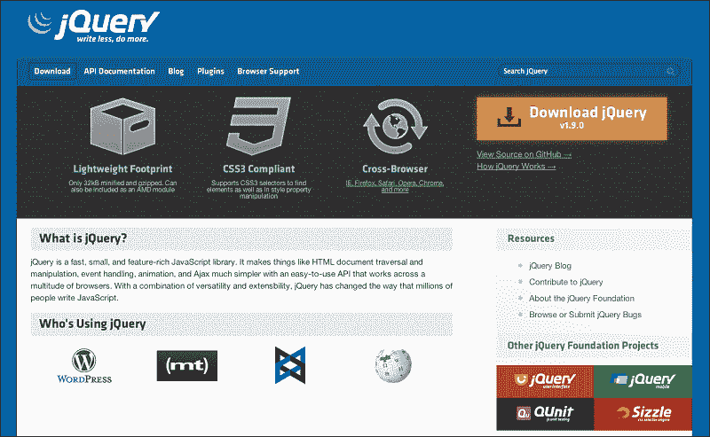

那么 jQuery 到底是什么呢？嗯，jQuery 是一个相对较小的 JavaScript 库，用于帮助解决各种常见的 JavaScript 开发任务和问题。通过轻松选择文档中的元素，创建和处理各种事件，在文档中对元素进行动画处理，使用 Ajax 调用和检索外部数据，jQuery 可以为您提供一个更简单、易于使用和统一的语法，可在大量的 Web 浏览器上运行。jQuery 最好的部分是，它可以在只导入一个小于 50 KB 的 JavaScript 文件的情况下完成所有这些工作。

## 将 jQuery 投入实践

与所有 JavaScript 项目一样，了解 jQuery 的最佳方法是通过示例。因此，让我们快速了解如何将 jQuery 正确添加到您的项目中，以及如何开始在您的代码中使用其功能。

一切都始于前往 jQuery 项目网站获取项目的最新稳定版本（[`jquery.com`](http://jquery.com)）。值得注意的是，几乎所有积极开发的开源项目都有许多不同的构建类型可供您下载和使用。通常情况下，当访问 jQuery 等项目网站时，您通常会找到一个链接，用于下载项目的最新稳定版本。积极开发的项目的稳定版本通常不是最新版本，但稳定版本经过测试并获得批准供公众使用。随着开发人员对项目的贡献不断增加，它们将继续增加，直到开发团队批准当前代码库已准备好供公众使用。因此，在软件的每个版本发布之间的整个时间内，项目将有一个开发版本，在许多情况下，您也可以下载和使用，当然可能会遇到新的未记录问题的可能性。

在到达 jQuery 下载页面（[`jquery.com/download`](http://jquery.com/download)）后，您可以选择下载当前版本的压缩或未压缩版本。压缩代码的原因是为了减小文件大小，并在您的 Web 服务器请求时实现更快的加载时间。压缩或压缩 JavaScript 实际上是您可以轻松完成的工作，我们将在后面的章节中继续深入探讨这个主题。现在，您可以将这些 jQuery 源 JavaScript 文件中的任何一个保存在计算机上，最好是在您将创建**HTML5**项目的目录中。创建空的 HTML 文档后，导入 jQuery 就像导入任何其他外部 JavaScript 文档一样简单：

```html
<!DOCTYPE html>
<html lang="en">
  <head>
    <meta charset="utf-8" />
    <title>jQuery Importing Example</title>
    <script src="img/jquery.min.js"></script>
  </head>

  <body>
  </body>
</html>
```

完成了这项艰苦的工作后，您现在可以在项目中利用 jQuery 的所有功能。但是，通常需要从一个关键位置开始，那就是控制代码准备执行的时间点。到目前为止，我们已经使用了许多常见的技术来完成这项任务，比如将`body onload`参数设置为 JavaScript 函数。

```html
<body onload="init()">
```

或在`window`对象上设置`onload`事件：

```html
window.onload = function() {
	// Start executing your code here...
}
```

使用这种方式调用 JavaScript 的一个问题是，等待文档加载的方式包括等待所有图像资产加载，包括不受控制的外部资产，如横幅广告。因此，jQuery 创建了自己的文档就绪事件处理程序语法来规避这个问题。通常情况下，对于所有基于 jQuery 的项目，要追加的第一段代码将是文档就绪处理程序：

```html
$( document ).ready( function() {
  // Start executing your code here...
});
```

## 使用 jQuery 选择元素

jQuery 最伟大的方面之一是其选择器引擎，也被称为 Sizzle（[`sizzlejs.com`](http://sizzlejs.com)）。选择器引擎之所以如此出色，是因为在处理 HTML 文档中的交互元素时，它使整个开发过程变得非常简单。考虑一下我们在 body 中添加一些简单内容的工作示例：

```html
<!DOCTYPE html>
<html lang="en">
  <head>
    <meta charset="utf-8" />
    <title>jQuery Importing Example</title>

    <!-- Always import external libraries before your custom site code. -->
    <script src="img/jquery.min.js"></script>

    <script>
      $( document ).ready( function() {
        // Start executing your code here...
      });
    </script>
  </head>

  <body>
    <div>
        <p>
        <a href="http://www.google.com">Go to Google</a>
        </p>
    </div>
  </body>
</html>
```

尽管这个页面布局很简单，但页面中的每个元素都可以通过使用 jQuery 选择器来轻松控制。要为我们的链接到 Google 添加事件监听器，我们可以在文档准备好的回调函数中添加它：

```html
$( document ).ready(function() {
  $("a").click(function(event) {
    alert("Tell Google I said hello!");
  });
});
```

尽管前面的示例非常简单，但有几个关键方面应该立即介绍。jQuery 选择器语法依赖于`$()`语法。在我们的示例中，在选择器语法括号内，我们提供参数"`a"`来选择文档主体中的所有`<a>`元素标记。仅仅选择一个元素不会让你走得太远；因此，示例中的下一步是将点击事件监听器链接到所选元素。当然，点击事件远非您可以应用于元素的唯一可用事件，您可以参考事件文档以查看整个列表（[`api.jquery.com/category/events`](http://api.jquery.com/category/events)）。最后一步是定义要在事件回调中使用的方法，在我们的示例中，我们只是直接将函数定义到回调参数中。

通过添加、保存并在浏览器中重新加载此更改后，当单击链接时，将显示一个警报对话框，然后是页面位置（[`google.com)`](http://google.com)）。如您所见，我们的事件监听器在锚标签中引用的**URL**移动到之前已经被触发。选择器引擎与大量的 jQuery 事件一起使用，可以让您控制页面中可能发生的大量用户和网络交互。

覆盖预定义的操作也很容易。正如您在我们的示例中定义的回调函数中所看到的，当它被调用时，它将事件变量传递给方法。这个事件属性用于控制事件，可以很容易地被操纵或完全覆盖：

```html
$(document).ready(function() {
	$("a").click(function(event) {
		alert("You're not going anywhere!");
		event.preventDefault();
	});
});
```

通过在事件对象上调用`preventDefault()`方法，我们可以禁用事件的默认操作，并使用我们自己的代码来控制结果。

## 通过 jQuery 控制 CSS

jQuery 的另一个伟大之处是可以轻松地使用 CSS3 属性来控制元素的外观和感觉。使用 jQuery 选择器和 CSS 方法在任何元素上获取和设置 CSS 值非常简单：

```html
$("#example").css("width", 200);
$("#example").css("height", 300);
```

正如您在前面的示例中所看到的，设置特定元素的宽度和高度的 CSS 属性非常简单。我们可以通过将 CSS 属性传递给对象而不是单独传递它们来简化这两行 CSS 属性更新为一行：

```html
$("#example").css({ width:200, height:300 });
```

这相当于在文档的 CSS 结构中添加以下内容：

```html
#example {
  width:200px;
  height:300px;
}
```

在 jQuery 中进行 CSS 操作不仅仅是为了设置文档中元素的宽度和高度。jQuery 现在完全支持 CSS3 属性，其中包括圆角、文本效果、不透明度、2D 和 3D 变换以及滤镜等属性。

### CSS 动画

由于通过 jQuery 可以控制几乎任何元素的 CSS 属性，因此也可以轻松地对它们进行动画处理。

在查看一些示例之前，有一些重要的要点需要注意。如第二章中所述，*准备战斗*，以及第三章中所述，*可扩展性、限制和影响*，在涵盖 CSS 属性及其值与 ActionScript 3 API 相比时，定位文档中元素的值不是基于传统的 x 和 y 值集。因此，在对元素位置进行动画处理时，应注意元素位置值，以正确定义移动元素的正确值：

```html
<!DOCTYPE html>
<html lang="en">
  <head>
    <meta charset="utf-8" />
    <title>jQuery CSS Animation Example</title>

    <style>
      html, body {
        margin:0;
        padding:0;
        height:100%;
      }
      #example {
        width:200px;
        margin:auto;
        background-color:#EFEFEF;
        border:1px solid #000;
        text-align:center;
        cursor:pointer;
      }
    </style>

    <script src="img/jquery.min.js"></script>
    <script>
      $( document ).ready( function() {
        $('#example').click(function(event){ 
          // Animate the #example element
          $("#example").animate({
              marginLeft: '0',
              width:'100%',
              height:'100%',
              fontSize:'40px'
          }, 500, function(event) {
          // Update the element paragraph inner HTML.
            $("#example p").html('Animation Complete!');
          });
        });
      });
    </script>
  </head>

  <body>
    <div id="example">
      <p>Click To Begin Animation</p>
  </div>
  </body>
</html>
```

## 使用 jQuery Ajax 请求外部数据

由于 ActionScript 3 中内置的`URLLoader`和`URLRequest`类，请求外部数据（无论是项目内部还是 Web 上的外部数据）都非常简单。创建了一个`URLLoader`，以及一个包含数据路径引用的`URLRequest`对象。最后，将`URLRequest`对象传递到加载器对象中，并调用`load`方法：

```html
Var loader:URLLoader = new URLLoader();
var request:URLRequest = new URLRequest("data.xml");
loader.load(request);
```

当然，要正确完成此示例，您需要添加事件处理程序来捕获数据的返回，并知道何时可以开始操作或利用它。然而，从应用程序中调用和检索外部数据的概念对您可能并不陌生。

在 JavaScript 中开发应用程序时，这种功能的首选是**AJAX**。**AJAX**（异步 JavaScript 和 XML）是在客户端使用网页时与 Web 服务器交换数据的概念，而无需重新加载页面。如今在 Web 上使用**AJAX**是如此普遍，以至于几乎不可能一天不在许多网站或服务中使用它。一个完美的例子是在查看 Facebook 时间线或 Twitter 动态时的无限滚动。当您向下滚动页面查看内容时，底层运行的 JavaScript 会检测到您即将到达页面底部，并调用服务器以获取更多数据以不断填充列表。传统上，这将通过将数据应用于多个页面并要求用户为每个视图刷新页面来完成。

那么 jQuery 在开发应用程序的**AJAX**功能方面能做些什么呢？在 jQuery 库中有许多方法专门设计用于处理**AJAX**请求和请求类型。

在其最基本的形式中，jQuery 的`load`方法可以在一行 JavaScript 中检索外部数据并将其放置在所选元素中：

```html
$('#myElement').load('example.html');
```

当然，外部资产不需要是**HTML**文档。**XML**、JavaScript、JSON、纯文本和 HTML 文档都支持在 AJAX 请求中使用。

可以理解的是，您可能并不总是希望将**AJAX**请求中的传入数据直接放入文档中，因此响应处理程序通常会放置在这些类型的调用中。这可以通过使用**AJAX**方法本身以自我实例化的 jQuery 语法来实现：

```html
$.ajax({
    url: 'example.html'
}).done(function(data) {
  if(data != '') {
    $("body").append(data);
  }
});
```

现在，通过返回的数据，您可以在将其包含在文档中之前轻松操作和验证**AJAX**调用返回的数据。

数据也可以在调用外部数据时提供。根据所引用文档中脚本的要求，您可以选择通过**HTTP** GET 请求发送数据：

```html
$.get("getmyphotos.php", { user:"johnsmith", id:"200" })
.done(function(data) {
	console.log(data);
});
```

或者，您可以选择通过 HTTP POST 请求发送数据：

```html
$.post("getmyphotos.php", { user:"johnsmith", id:"200" })
.done(function(data) {
	console.log(data);
});
```

## jQuery Mobile

在最近，jQuery 团队发布了 jQuery Mobile ([`jquerymobile.com`](http://jquerymobile.com))，它为开发人员创建了一个统一的**HTML5**用户界面，可以在现代移动设备的广泛范围内正确显示内容。就像 jQuery 本身一样，jQuery Mobile 非常轻量，甚至带有预构建的主题包，可以在可主题化的元素设计中使用。jQuery Mobile 旨在通过允许您更多地专注于应用程序内容而不是为浏览器支持编写特殊的 shims 和条件代码来简化您的移动开发过程。更新由开发团队发布的速度能够跟上移动设备市场惊人的速度。因此，您可以编写能够在尽可能多的设备上运行的移动 Web 应用程序，而无需专门针对每个设备进行定位：

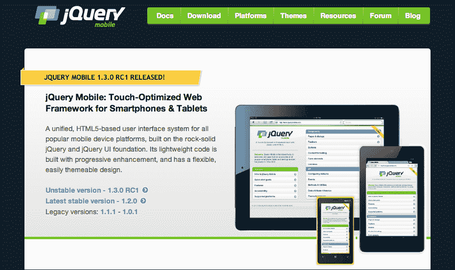

自发布以来，jQuery Mobile 已经被大大小小的网站广泛使用。jQuery Mobile 框架的核心方面包括页面、对话框、工具栏、列表视图和按钮的使用。通过围绕框架中的这些核心元素开发您的网页和内容，您可以为移动设备布局您的页面，而无需打开 Photoshop。

jQuery Mobile 充分利用了自定义数据属性，这是**HTML5**中的一个新功能。如果您查看下面的示例多页面 jQuery Mobile 布局，您会看到许多元素属性使用了`data-*`语法。这些是任何人现在都可以将其实现到他们的**HTML5**项目中的自定义数据属性。它们可以有任何字符串，至少是一个字符，并且可以用于在设置元素属性时轻松声明值：

```html
<body>
  <div data-role="page" id="one">
    <div data-role="header">
      <h1>Page 1</h1>
    </div>
    <div data-role="content" >
      <h2>Page One</h2>
      <p><a href="#two" data-role="button">Show Page 2</a></p>
      <p><a href="page3.html" data-role="button">Show Page 3</a></p>
    </div>
    <div data-role="footer" data-theme="d">
      <h4>Page Footer</h4>
    </div>
  </div>

  <div data-role="page" id="two" data-theme="a">
    <div data-role="header">
      <h1>Page 2</h1>
    </div>

    <div data-role="content" data-theme="a">	
      <h2>Page Two</h2>
      <p><a href="#one" data-direction="reverse" data-role="button" data-theme="b">Back to Page 1</a></p>	
    </div>

    <div data-role="footer">
      <h4>Page Footer</h4>
    </div>
  </div>
</body>
```

正如你所看到的，这个单个的**HTML**文件实际上是两个页面，分别用`data-role="page"`元素分隔成 DIV 元素。现在当 jQuery Mobile 框架加载包含这两个页面的**HTML**文件时，只有初始页面会显示，第二个页面会等待用户交互滑动到视图中。在第一个页面中，你可以看到到我们第二个页面的链接实际上只是一个锚标签，因为它在引用当前**HTML**文档中另一个页面的 ID 之前使用了`#`字符。为了进一步说明这种差异，在初始页面的导航中还有一个到第三个页面的链接，它以传统的方式链接到外部**HTML**文档。

默认情况下，当请求新页面时，数据会被加载（如果尚未加载），并显示在一个 DIV 元素中，实际上对于最终用户是不可见的。当数据加载和文档准备工作完成后，新页面会从右向左动画显示给用户。这种内容动画是许多现代移动设备应用程序用户界面的典型特征，因此使您的应用程序更加熟悉于最终用户：

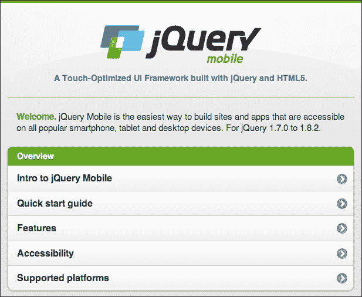

jQuery Mobile 在实际操作中最简单、最精致的例子之一是该框架的文档。正如您在上面的截图中所看到的，默认情况下，jQuery Mobile 的用户界面看起来非常适合移动设备。按钮很大，可以轻松地拉伸以适应页面，让用户可以轻松选择菜单项而不必担心误点。标题和段落文本易于阅读，并且位置完美。在文档导航中的特定元素添加了图标。在打印的截图中看不到的是布局的响应性。为了更好地说明移动设备上响应性的重要性，这里是同一 jQuery Mobile 文档网页在更大的窗口大小下的截图：

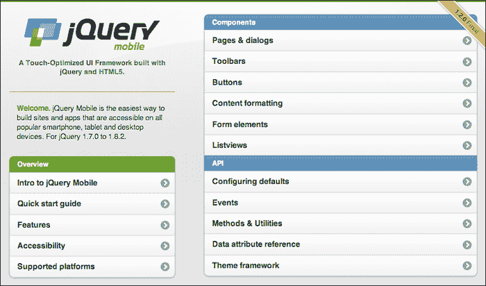

正如您所看到的，同一个页面现在已经响应了更大的浏览器窗口大小，并重新调整了页面布局以更好地适应可见的显示区域。jQuery Mobile 使用**CSS**媒体查询来定义当前的视口大小，并将页面内容定向到适当的位置，而不是在不同的浏览器大小上显示相同页面的多个设计。使用 jQuery Mobile 构建网站的最大优势是，您无需编写一行**CSS**或自己定义特殊的**CSS**媒体查询。

# HTML5 模板

像 jQuery 这样的库非常适合帮助您轻松编写 JavaScript 代码，但让您的项目启动运行是另一个问题。页面布局、浏览器故障保护和跟踪代码通常是您最终会添加到项目中的所有内容，这些只是**HTML5**模板（[`html5boilerplate.com`](http://html5boilerplate.com)）中的一些出色功能。HTML5 模板在技术上并不是一个库或框架，因为在其核心，它只是创建 HTML5 文档的起点。

然而，由于其简单性、渴望跟上网络周围的所有变化以及在其背后有大量开源贡献的支持，这个**HTML5**模板在处理任何大小的项目时都是一个很好的起点：

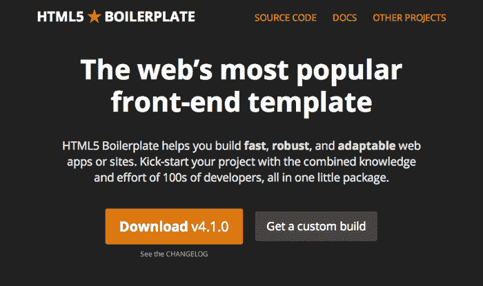

从项目网站下载最新版本的**HTML5**模板后，您会发现一系列文件，其中不仅包括基本的 ready-to-go `index.html`文件及其引用文件，还包括一组其他常见文件，通常在公共网络服务器的基本网站目录中找到。

要了解这个模板的确切外观和它对您的实际作用，让我们快速浏览一下以下默认的`index.html`文件：

```html
<!DOCTYPE html>
<!--[if lt IE 7]>      <html class="no-js lt-ie9 lt-ie8 lt-ie7"> <![endif]-->
<!--[if IE 7]>         <html class="no-js lt-ie9 lt-ie8"> <![endif]-->
<!--[if IE 8]>         <html class="no-js lt-ie9"> <![endif]-->
<!--[if gt IE 8]><!--> <html class="no-js"> <!--<![endif]-->
    <head>
        <meta charset="utf-8">
        <meta http-equiv="X-UA-Compatible" content="IE=edge,chrome=1">
        <title></title>
        <meta name="description" content="">
        <meta name="viewport" content="width=device-width">

        <!-- Place favicon.ico and apple-touch-icon.png in the root directory -->

        <link rel="stylesheet" href="css/normalize.css">
        <link rel="stylesheet" href="css/main.css">
        <script src="img/modernizr-2.6.2.min.js"></script>
    </head>
    <body>
        <!--[if lt IE 7]>
            <p class="chromeframe">You are using an <strong>outdated</strong> browser. Please <a href="http://browsehappy.com/">upgrade your browser</a> or<a href="http://www.google.com/chromeframe/?redirect=true"> activate Google Chrome Frame</a> to improve your experience.</p>
        <![endif]-->

        <!-- Add your site or application content here -->
        <p>Hello world! This is HTML5 Boilerplate.</p>

        <script src="img/jquery.min.js"></script>
        <script>window.jQuery || document.write('<script src="img/jquery-1.9.0.min.js"><\/script>')</script>
        <script src="img/plugins.js"></script>
        <script src="img/main.js"></script>

        <!-- Google Analytics: change UA-XXXXX-X to be your site's ID. -->
        <script>
            var _gaq=[['_setAccount','UA-XXXXX-X'],['_trackPageview']];
            (function(d,t){var g=d.createElement(t),s=d.getElementsByTagName(t)[0];
            g.src=('https:'==location.protocol?'//ssl':'//www')+'.google-analytics.com/ga.js';
            s.parentNode.insertBefore(g,s)}(document,'script'));
        </script>
    </body>
</html>
```

正如您所看到的，这个模板 HTML 文件做了很多事情，而且幸运的是它有非常完善的文档。从头到尾，这个示例充满了浏览器检查和故障保护，网站图标的引用，用于清理和设置开发环境的 Modernizr 的引用，以及对 jQuery 和包括 Google Analytics 访客跟踪的默认代码的引用。

HTML5 模板是在 MIT 许可下开发的，甚至包括一些精制和优化的 Web 服务器配置，如果您有兴趣优化您的 Web 服务器提供内容的方式。

# Bootstrap

如果你和我一样喜欢编写代码而不是处理在 Photoshop 中设计和创建页面，你可能会对 Bootstrap 很感兴趣，这是由两名 Twitter 员工创建的。Bootstrap 是一个 HTML5 框架，旨在让开发人员轻松创建基于 12 列网格系统的强大和响应式页面布局和设计。Bootstrap 支持在所有现代设备和浏览器上正确呈现页面布局，减少了大量编写 CSS 和 JavaScript 的需求，以便以统一的方式为所有用户显示内容，无论他们如何尝试查看您的内容：

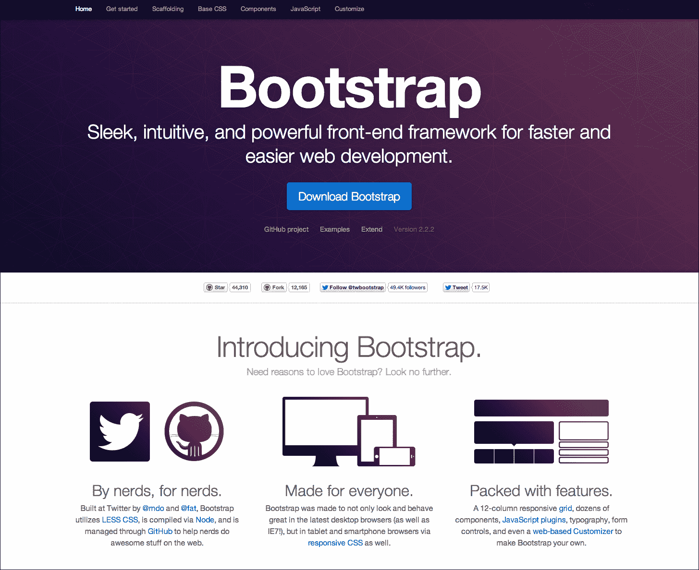

使用 Bootstrap 开发新项目并使其运行起来，就像本章涵盖的许多项目一样，非常简单。只需转到项目网站[`twitter.github.com/bootstrap`](http://twitter.github.com/bootstrap)并下载最新版本。下载并解压缩后，将下载的目录内容移动到项目目录的根目录。您会注意到下载的 Bootstrap 文件不包含用于开始工作的 HTML 文件，而是期望您生成自己的文件。原因是页面没有定义特定的布局模板。Bootstrap 利用网格布局系统，使开发人员能够轻松地将其网站内容放置在网格格式中，以便轻松地响应动态浏览器窗口大小的正确定义布局：

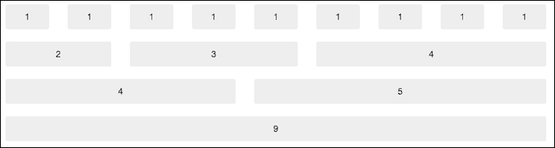

默认的 Bootstrap 布局是建立在一个具有无限行数的 12 列网格布局上的，因为行的溢出将导致典型的网页滚动。通过查看前面图像中的示例网格布局，您几乎可以想象出您每天使用的每个网站以及它是如何在这样的网格中排列的。由于这种网格布局系统对于几乎任何网页设计都非常有价值，它几乎可以在您将来遇到的几乎每个 HTML5 项目中为您提供帮助。

如果您仍然不确定 Bootstrap 是否适合您的网站，请转到 Bootstrap 项目网站的**示例**部分，查看正在使用该项目的最新热门网站列表[`twitter.github.com/bootstrap/getting-started.html#examples`](http://twitter.github.com/bootstrap/getting-started.html#examples)。

## Bootstrap 附加组件

随着 Bootstrap 的流行度迅速增长，用户贡献的数量也开始跟随。许多这些第三方外部插件和功能可以添加到现有的 Bootstrap 设置中，以扩展其基本功能。让我们快速浏览一下其中一些最受欢迎的项目，以便让您对可用的内容有所了解。

### StyleBootstrap.info

尽管 Bootstrap 在创建元素时附带了许多不同的颜色选择，但您可能希望进一步定制的机会相当高。`StyleBootstrap.info` ([`stylebootstrap.info`](http://stylebootstrap.info))是一个很好的在线资源，可以通过简单的点击和选择用户界面轻松定制 Bootstrap 设置的外观和感觉。完成设计后，该网站将为您生成必要的**CSS**文件，供您下载并包含在项目中。

### Font Awesome

另一个扩展 Bootstrap 已有功能集的优秀库是 Font Awesome ([`fortawesome.github.com/Font-Awesome`](http://fortawesome.github.com/Font-Awesome))。虽然听起来像是这是框架的新字体添加，但实际上它是一个额外的图标集，可以轻松地实现到您的设计中。之所以提到字体的概念是因为图标集实际上是在打包的字体中实现的，以实现可伸缩的矢量图形，而不是在**HTML**文档中找到的典型位图图形。由于您来自 Flash 背景，您可能已经了解了在缩放图像时矢量图形有多么重要，您可能已经明白为什么使用字体打包概念会使库变得非常易于使用。包中的所有图标都有特定的名称，并且可以通过在**HTML**元素中调用该唯一图标名称作为类来轻松实现到您的页面中：

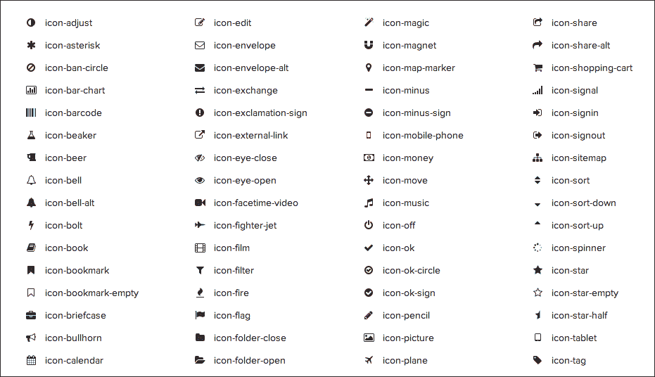

正如前面的屏幕截图所示，其中仅显示了包中可用图标的一小部分，每个图标都有一个特定的名称。根据项目文档的规定，将图标附加到文档中的最佳方法是在`<i>`或斜体**HTML**标记的类属性中调用唯一的图标名称。例如，如果我们想在文档中的“书籍”旁边放置一个书籍图标，HTML 语法将表示如下：

```html
<p><i class="icon-book"></i> Books</p>
```

由于斜体标记可以放置在几乎任何 HTML 元素中，这使您可以将图标放在需要的任何位置，比如放在 Bootstrap 自定义按钮内部：

```html
<a href="books.html" class="btn">
<i class="icon-book"></i> Books
</a>
```

同样值得注意的是，由于字体包以矢量格式保存，以允许动态字体大小，因此默认的 Bootstrap 设置以及此项目中的图标也都是矢量格式。要更改文档中图标的大小，只需设置`font-size`属性或将其附加到已配置字体样式的元素中。

### bootstrap-wysihtml5

如果您计划构建需要大量基于文本的用户输入的 Web 应用程序，那么 Bootstrap **WYSIWYG**（所见即所得）库值得一看（[`jhollingworth.github.com/bootstrap-wysihtml5`](http://jhollingworth.github.com/bootstrap-wysihtml5)）。只需几行代码，您就可以为用户构建格式化的**HTML**文本内容的优雅工具输入表单：

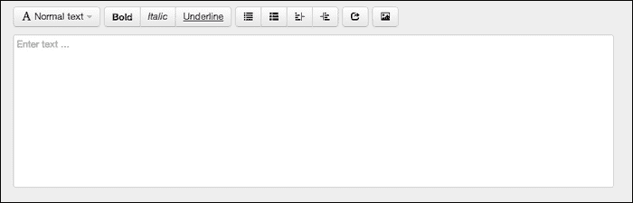

尽管简单，这只是互联网上许多免费分发的众多优秀示例之一，随时可以在您的项目中使用。

# Hammer.js

如果您计划进入快速发展的移动 Web 开发世界，处理新的事件，如触摸交互，将是必不可少的。尽管传统的 JavaScript 鼠标事件在触摸设备上直接转换为基本的触摸事件，但是像滑动和捏合这样的事件并不常见于传统的桌面用户交互（[`eightmedia.github.com/hammer.js`](http://eightmedia.github.com/hammer.js)）。

Hammer.js 目前支持轻触、双击、滑动、按住、捏合（变换）和拖动事件，并且可以轻松地实现到任何现有网站中，无论您是否使用 jQuery。由于库的简单性，压缩后的文件大小仅为 2KB：

```html
<!DOCTYPE html>
<html lang="en">
  <head>
    <meta charset="utf-8" />
    <title>Hammer.js Example</title>

    <style>
      body {
        padding:10px;	
      }
          #touch-area {
              border: 5px dashed #000;
              text-align: center;
              width: 100%;
              line-height:10px;
              padding-top:200px;
              padding-bottom:200px;
          }
          #touch-area p {
          font-size: 30px;
          }
          #touch-area p.subtext {
          	font-size:12px;
          	color:#666;
          }
      </style>

      <script type="text/javascript" src="img/jquery-1.9.1.min.js"></script>
    <script type="text/javascript" src="img/hammer.js"></script>
    <script type="text/javascript"  src="img/jquery.specialevent.hammer.js"></script>
    <script>
      function hammerLog(event){
          event.preventDefault();
          $('#output').prepend( "Type: " + event.type + ", Fingers: " + event.touches.length + ", Direction: " + event.direction + "<br/>" );
      }

      $(document).ready(function() {
        var events = ['hold', 'tap', 'swipe', 'doubletap', 'transformstart', 'transform', 'transformend', 'dragstart', 'drag', 'dragend', 'swipe', 'release'];

        $.each(events, function(key, val) {
          console.log('NOTICE: Applying Touch Event: ' + val);
          $('#touch-area').on(val,  hammerLog);
        });  
      });
    </script>
  </head>

  <body>
    <div id="touch-area">
      <p>Touch here to see results<p>
      <p class="subtext">For best results, open this page on a touch enabled device.</p>
    </div>

    <p id="output"></p>
  </body>
</html>
```

# GreenSock 动画平台

如果您花了足够的时间开发 Flash 应用程序，很可能您以前已经接触过 GreenSock TweenMax 或 TweenLite 库。TweenMax 和 TweenLite 库可以轻松地让您在舞台上移动 Flash 对象，并支持 ActionScript 2 和 ActionScript 3 项目。GreenSock 现在已经开发并发布了他们的纯 JavaScript 库，没有依赖关系，为您的 HTML5 项目带来了许多伟大的熟悉功能。

因此，在查看 jQuery 动画方法及其功能后，为什么您需要使用这样的库呢？与 jQuery 不同，GSAP JS 专注于非常出色地完成一件事。诸如按顺序动画以启用适时的动画、覆盖控制以随时停止运行的动画以及能够对几乎任何内容进行动画处理等功能，将相对轻松地增强您的 Web 应用程序的视觉吸引力。

就像 ActionScript 伴侣一样，GreenSock JavaScript 库（[`www.greensock.com/v12`](http://www.greensock.com/v12)）包含大量的最新文档和示例，将指导您正确的起步方向。事实上，他们专门创建了一个视觉快速入门指南，让您轻松上手并在浏览器中演示代码的结果：

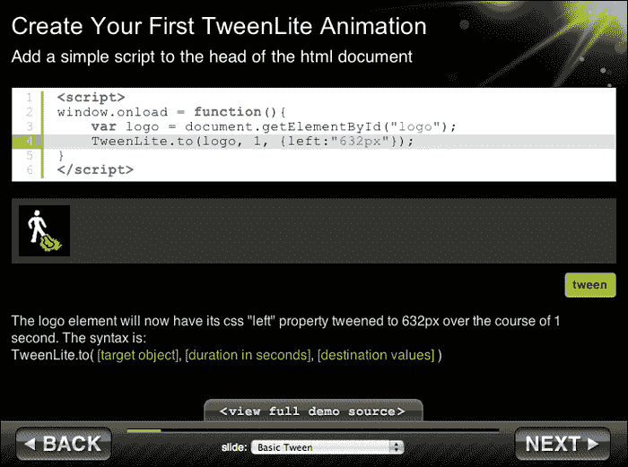

GSAP JS 文档的最佳补充是交互式入门指南，可以在[`www.greensock.com/jump-start-js/`](http://www.greensock.com/jump-start-js/)找到。这个简单易用的交互式应用程序可以让您在几分钟内从未使用过该库，了解它的功能；我无法强调这个功能有多么棒。

再次，如果您在以前的 Flash 项目中使用过 GreenSock TweenMax 或 TweenLite 库，那么您将非常容易地转移到 GSAP JS。如前所述，大多数 ActionScript 3 开发人员在使用此库时将面临的主要问题是正确处理为 Tween 提供的**CSS3**属性，以便正确运行。

# Three.js

如果您喜欢硬件加速的 3D 图形世界，`Three.js`（[`mrdoob.github.com/three.js`](http://mrdoob.github.com/three.js)）绝对值得一看。这个轻量级的 3D 库非常容易上手，并且在网络上有大量的示例和文档。`Three.js`不仅使用`<canvas>`元素进行渲染，还使用`<svg>`、`CSS3D`和`WebGL`，从而支持各种现代浏览器和设备。

为了让您对`Three.js`在打印中的功能有所了解，请查看我在查看`Three.js`项目网站上找到的一些示例项目时拍摄的一些美丽的屏幕截图：

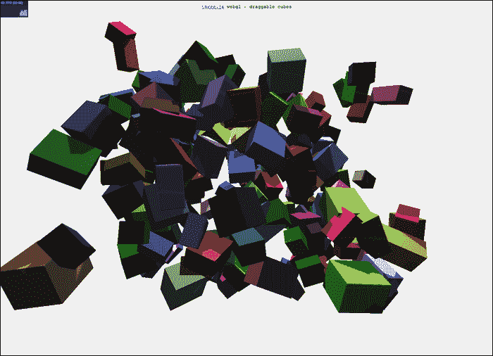

从前面的截图中可以看出，JavaScript 和 WebGL 在很短的时间内取得了长足的进步。再次强调，所有这些截图都是从`Three.js`项目网站上找到的示例中获取的，所以一定要去那里尝试一下，看看它们在您的设备和浏览器上运行得如何。请记住，许多现代移动设备的网络浏览器都渴望获得更强大的 WebGL 支持，因此也可以在手机或平板电脑上尝试一下。

在开始开发您的`Three.js`项目之前，最好确保您熟悉 3D 编程的许多常见方面和原则。在其核心，典型的`Three.js`应用程序将包括一个场景、一个渲染器、一个摄像机和一个对象。这些元素将相互配合，以创建一个 3D 环境。学习关于`Three.js`的最佳入门教程之一是*Paul Lewis*的*Getting Started with Three.js*文章（[`www.aerotwist.com/tutorials/getting-started-with-three-js`](http://www.aerotwist.com/tutorials/getting-started-with-three-js)）。在这篇文章中，他涵盖了 3D 编程的所有原则以及如何在`Three.js`框架中利用它们。

不要深入细节，因为已经有许多优秀的书籍和在线资源可以学习 Three.js 开发，这里是一个在`Three.js`中渲染场景的非常简单的代码布局：

```html
// Scene sizes
var WIDTH = 500;
var HEIGHT = 300;

// set some camera attributes
var VIEW_ANGLE = 45,
    ASPECT = WIDTH / HEIGHT,
    NEAR = 0.1,
    FAR = 10000;

// get the DOM element to attach to
var $container = document.getElementById('example');

// create a WebGL renderer, camera
// and a scene
var renderer = new THREE.WebGLRenderer();
var camera = new THREE.PerspectiveCamera(  VIEW_ANGLE,
                                ASPECT,
                                NEAR,
                                FAR  );
var scene = new THREE.Scene();

// the camera starts at 0,0,0 so pull it back
camera.position.z = 300;

// start the renderer
renderer.setSize(WIDTH, HEIGHT);

// attach the render-supplied DOM element
$container.append(renderer.domElement);

// create the sphere's material
var sphereMaterial = new THREE.MeshLambertMaterial({ color: 0xCC0000 });

// Set up the sphere vars
var radius = 50, segments = 16, rings = 16;

// Create a new mesh with sphere geometry -
// we will cover the sphereMaterial next!
var sphere = new THREE.Mesh(
   new THREE.SphereGeometry(radius, segments, rings),
   sphereMaterial);

// Add the sphere to the scene
scene.add(sphere);

// and the camera
scene.add(camera);

// create a point light
var pointLight = new THREE.PointLight( 0xFFFFFF );

// set its position
pointLight.position.x = 10;
pointLight.position.y = 50;
pointLight.position.z = 130;

// add to the scene
scene.add(pointLight);

// draw!
renderer.render(scene, camera);
```

从前面的`Three.js`代码示例的顶部开始，我们可以看到最初将舞台大小附加到`WIDTH`和`HEIGHT`变量中。这些属性对每个 Flash 开发人员来说都很熟悉，它们定义了内容将被渲染的可视区域。在舞台配置之后是初始摄像机配置。创建 3D 场景时，渲染前端的视图将来自已放置在场景中的摄像机的透视。就像任何其他对象一样，摄像机可以根据 x、y 和 z 值以及属性（如视角、摄像机方面和缩放能力）移动。摄像机配置之后，我们需要将文档中的特定元素作为我们的舞台目标，并且`document.getElementById`查找我们在 HTML 文档中已经创建的元素就可以了。配置值设置好，选择了一个准备好设置我们场景的元素，我们实际上可以开始初始化我们的`scene`元素。

当然，`Three.js`项目并不需要 100%使用 JavaScript。一旦您的场景设置好并准备好查看，转到 Blender 或 Maya 等 3D 建模软件将允许您创建极其详细的 3D 对象，这些对象可以轻松地导入到您的 HTML5 项目中。正如您之前在一些示例图像中看到的那样，可以获得的细节水平简直令人惊叹。

关于在 JavaScript 中使用 3D 或 WebGL 的最后一点说明：目前在桌面环境中，浏览器对 WebGL 的支持已经非常广泛。您几乎不会在几乎所有现代桌面 Web 浏览器中遇到任何问题，但是在移动浏览器中可能仍然会遇到许多限制。谷歌 Chrome 浏览器在桌面和移动端都试图通过 Chrome 实验网站([`www.chromeexperiments.com/webgl/`](http://www.chromeexperiments.com/webgl/))来推动 WebGL 的极限。该网站包含大量出色的示例和项目，可以让您轻松测试您正在运行的浏览器、设备或平台对硬件加速图形的处理能力。

# 编译 JavaScript

早已过去了将 JavaScript 仅视为用于 HTML 元素操作的前端开发语言的日子。随着 JavaScript 编译器的出现，仅仅编写一些 JavaScript 代码就可以做一些难以想象的事情。就像您在 Flash 中习惯的方法，其中 ActionScript 被编译成二进制包一样，JavaScript 编译器将纯 JavaScript 转换为机器代码，可以在计算机上像任何其他应用程序一样运行。尽管这个概念可能看起来很遥远，但实际上有很多很好的原因，其中最好的原因是用于 Web 浏览器。

## 谷歌的 V8 引擎

2008 年底，谷歌发布了 Chrome 的初始版本，随之而来的是 V8 引擎的初始版本。V8 将 JavaScript 直接编译成本机机器代码，甚至在这样做时优化代码。结果是应用程序可以像用 Python 或 C++编写的应用程序一样运行。V8 是用 C++编写的，并自原始发布以来一直是开源和免费提供给公众的。您可以通过访问项目网站[`code.google.com/p/v8`](http://code.google.com/p/v8)了解更多关于 Google V8 项目的信息。

## Node.js

从谷歌 V8 引擎诞生的最酷的新项目之一就是 Node.js([`nodejs.org`](http://nodejs.org))。`Node.js`允许您完全使用 JavaScript 编写服务器端应用程序（通常是 Web 服务器），这通常是用**PHP**、**Perl**、**Python**甚至**C**或**C++**等编程语言完成的。

与本章涵盖的许多框架和库一样，`Node.js`拥有大量的优秀文档和示例，遍布整个网络。然而，由于一些项目的开发速度，可用的文档很容易过时。`Node.js`最好的资源之一是由`Node.js`项目的早期核心贡献者之一*Felix Geisendörfer*创建的[`nodeguide.com`](http://nodeguide.com)，该资源不断更新到项目的当前稳定版本。

由于`Node.js`是用于服务器端运行的，而不是将其包含到您的**HTML5**项目中，您必须在计算机上安装它以便作为应用程序运行。因此，在您选择的计算机上下载并安装`Node.js`文件后，您现在可以像运行任何其他命令行应用程序一样从命令行运行`Node.js`准备好的 JavaScript 文件。

为了演示如何启动`Node.js`应用程序的基本用法，我们将使用流行的`Node.js` Web 服务器示例，该示例可以在官方文档中找到。创建一个名为`example.js`的新 JavaScript 文件，并使用以下 JavaScript 填充它：

```html
var http = require('http');

http.createServer(
  function (request, response)
  {
    response.writeHead(200, {'Content-Type': 'text/plain'});
    response.end('Hello World\n');
  }
).listen(8000);

console.log('Server running at http://localhost:8000/');
```

示例代码的第一行是在`Node.js`框架中导入**HTTP**模块。包含 HTTP 模块后，将调用`createServer`方法并提供成功函数。该函数包含一个简单的“Hello World”问候，并将`Content-Type`设置为`text/plain`，因此查看它的浏览器知道它只是纯文本。最后，将`listen`方法链接到服务器声明中以指定端口，**HTTP**服务器将在该端口上监听请求。

保存`example.js`文件后，在运行`Node.js`的系统上打开命令行，并将当前工作目录指向您的新 JavaScript 文件的位置，然后输入以下命令。使用`Node.js`执行文件就像使用*node*应用程序引用 JavaScript 文件一样简单：

```html
% node example.js

```

执行此命令将产生以下响应：

```html
Server running at http://localhost:8000/

```

命令行将等待物理终止。在停止服务器之前，我们必须测试以确保它正常工作。因此，在执行`node`命令后，转到响应中指定的 URL：

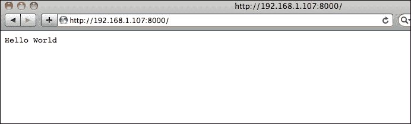

尽管这个输出很简单，但事实上，您只是使用 JavaScript 创建了一个简单的自定义 Web 服务器。这只是`Node.js`所提供的众多功能的开始，最好的部分是`Node.js`可以做的许多伟大的事情已经存在，并且随时可供您查找和使用。`Node.js`不需要在 Google 上花费数小时搜索要包含在项目中的模块，它使用自己的系统来查找并安装更多功能到您的`Node.js`服务器中。

## Node 包管理器

如果您仍然不确定`Node.js`对您有什么作用，**NPM**（**Node 包管理器**）可能能够帮助您。包管理器是一个在线收集的包，可以轻松地在您的节点项目中下载和使用。由于`Node.js`已安装在您的计算机上，当涉及到检查依赖关系、版本和平台支持时，包管理器可以完成所有繁重的工作。要轻松搜索当前的`Node.js` **NPM**目录，请转到[`npmjs.org`](https://npmjs.org)并浏览，直到找到您有兴趣安装的内容：

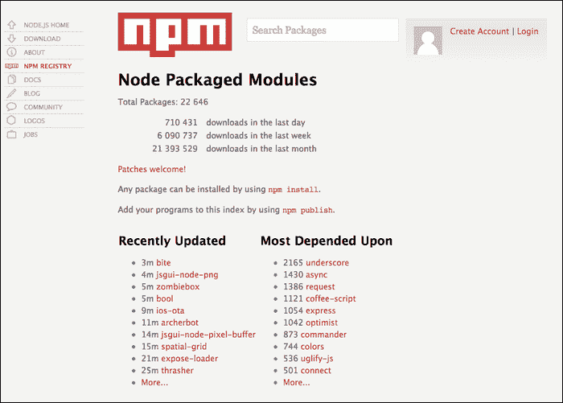

在注册表中找到的任何包都可以通过在命令行中运行安装命令来轻松安装到您的系统上：

```html
% npm install PACKAGE-NAME

```

如前所述，如果您请求安装的软件包需要注册表中的其他软件包，它们将自动下载和安装，而无需您自己去寻找适当的版本。随着开发人员对您可能使用的软件包进行更新并发布更新，NPM 注册表将自动负责向您提供更新信息，并允许轻松更新您安装的任何过时软件包。

## 托管公共 Node.js 服务器

由于您需要一个服务器来运行您的`Node.js`项目，您需要设置一个面向公众的服务器来托管您希望对互联网开放的任何项目。由于在计算机上安装`Node.js`进行测试无法实现这一点，您需要设置自己的服务器，并进行适当的网络设置，或者从`Node.js`托管公司购买此服务。由于您用于网页托管的公司通常不允许您完成此操作，因此研究 Nodejitsu（[`nodejitsu.com`](http://nodejitsu.com)）等服务可能会有用：

托管公共 Node.js 服务器

与传统的网络托管公司一样，Nodejitsu 提供您自己的面向公众的`Node.js`服务器，可用于在线的任何网页项目。您可以始终从免费试用账户开始，以了解该服务如何允许您在世界各地使用您的`Node.js`服务器，然后根据您的需求转入付费账户。

# 摘要

本章仅仅触及了作为 HTML5 开发人员可用的一部分内容。这里介绍的是目前最流行的一些库和框架的集合。全世界开发人员公开发布并积极开发的惊人代码数量似乎以超指数速度增长。分配和利用本章列出的外部资产需要您作为开发人员在将其实施到公开网站之前了解使用库或框架的影响和好处。

花时间去研究、测试和贡献许多您感兴趣的项目，不仅有利于您现有的开发技能，还可以让您利用手头的最佳工具。随着时间的推移和网络开发的变化，跟上这些流行的库和框架将始终有助于您了解整个 HTML5 开发环境的最新情况。

在下一章中，我们将把这些新获得的 HTML5 框架和库的知识扩展到直接将您现有的 Flash 应用程序转换为 HTML5 网页项目的领域。
