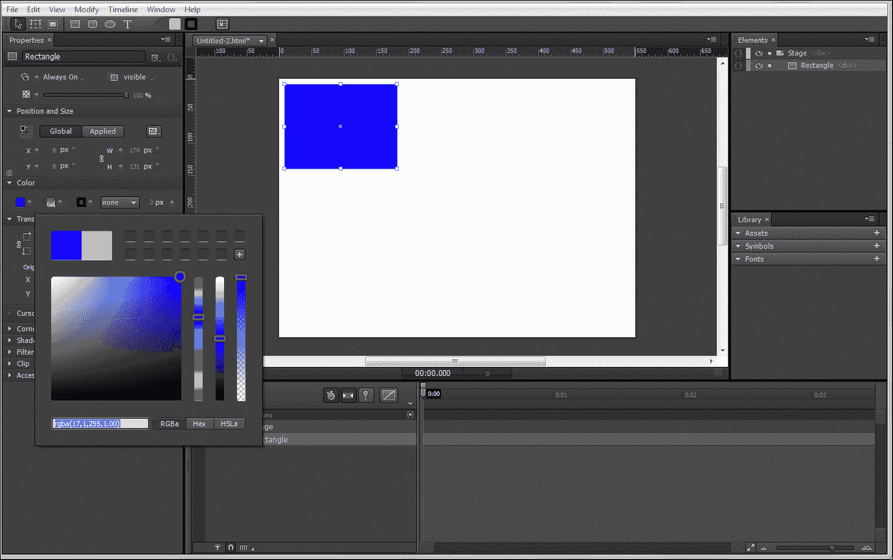

# 第七章：选择开发方式

进入 HTML5 开发流程将需要您摆脱在 Flash 开发周期中熟悉的应用程序。诸如 Flash 专业版、Flash Builder 和 Flash Develop 等应用程序都是专门设计用于处理 Flash 内容的。尽管这些应用程序非常出色，但有许多类似的 HTML5 开发应用程序可以让您以非常类似的方式构建丰富的网络体验。本章将介绍摆脱使用 Adobe Flash 专业版开发环境的过程，并开始艰难决定在创建 HTML5 项目时使用什么新的开发软件。虽然有许多优秀的软件可供选择，本章将介绍许多当前网页开发人员正在使用的新型和流行的应用程序。

在本章中，我们将涵盖以下内容：

+   了解 HTML5 IDE 所需的内容

+   资产创建和操作工具

+   使用 Adobe Edge 创建交互式动画 HTML5 元素

+   一些最受欢迎的 HTML5 代码编辑器概述

+   代码执行和运行时测试工具

# 替换 Flash 开发环境

在 Flash 环境中开发应用程序的最大优势在于 Adobe 花费大量时间构建了 Creative Suite 中包含的工具和应用程序，使您能够在其应用程序集中创建整个应用程序。尽管有人认为这个系统限制性强，更新速度慢。事实是，当所有正确的工具都可用于帮助您构建应用程序时，进入下一个项目就会更容易。由于 HTML5 开发不受特定公司的监管或控制，它是一个更加开放的开发平台，开发人员可以自由选择如何以及使用什么来构建他们的项目。

我必须强调，在本章中，我们将概述许多 HTML5 开发人员用来完成工作的常见方法和应用程序。当然，这些应用程序或方法都不是构建 HTML5 项目的绝对正确方式，希望您能找到符合您需求的应用程序。随着时间的推移，您构建越来越多与 HTML5 相关的项目，一定要在研究最适合手头工作的最佳工具时付出额外的努力。快速变化的环境导致许多项目在短时间内兴起和衰落。了解市场上的情况将有助于保持您的竞争力，并继续扩展您的 HTML5 开发技能。

# HTML5 开发环境的要求

当在同一个代码编辑器中编写 HTML、CSS 和 JavaScript 时，大多数开发人员通常会考虑一些一般性的因素，以确保他们获得适合自己需求的功能集。由于整个 HTML5 堆栈都是以纯文本文档的形式呈现，从技术上讲，任何文本编辑器都可以完成工作。尽管每个开发人员都有自己独特的设置和开发风格，但总是值得留意许多常见的功能。

## 资产和文件管理

具有预览甚至操纵项目中包含的资产的能力，如图像、视频、音频和其他外部资产，直接在开发环境中可以帮助您加快开发流程，将焦点集中在特定应用程序内。我们将在稍后介绍的 Adobe Dreamweaver 等应用程序是设计用来将设计和开发过程结合在一起的绝佳例子。值得注意的是，本章将概述的许多简单的代码编辑器可能不包含支持轻松文件和资产管理的功能。然而，当像这样的大型功能集成不包含在代码编辑器中时，一般的最终结果是更快速、轻量级的应用程序。

## 代码高亮

与任何编程语言一样，代码高亮或着色是代码编辑器中必不可少的功能。轻松理解代码的各个部分在做什么的能力，不仅可以让您更轻松地开发应用程序，还可以帮助您更轻松地理解其他开发人员的代码。代码高亮也是确保您以正确的语言语法编写代码的关键。为了让代码编辑器能够正确地着色或高亮显示您的代码，应用程序必须能够正确识别和解析您的代码所编写的特定语言。因此，在寻找最佳选择时，要密切关注支持您打算使用的特定编程语言的代码编辑应用程序是至关重要的。幸运的是，在我们的情况下，HTML5 开发或 HTML、CSS 和 JavaScript 开发得到了许多可用的代码编辑应用程序的广泛支持，因此您拥有的选择非常丰富。

## 代码完成

在您选择使用的代码编辑器中内置良好的代码完成功能可以帮助您学习新的编程语言。如果您在 Flash 开发职业生涯中使用 Flash Builder，我相信您已经看到了您可以编写良好、有效的代码的速度有多快。尽管一些开发人员认为代码完成只会让开发人员变得懒惰，避免记住语言语法的具体细节。事实是，从新手到经验丰富的老手，开发人员都使用代码完成来避免在编写代码时出现延迟，以及加快编写长代码片段所需的时间。

在使用 Flash Builder（[`www.adobe.com/products/flash-builder.html`](http://www.adobe.com/products/flash-builder.html)）或 Flash Develop（[`www.flashdevelop.org`](http://www.flashdevelop.org)）等开发环境开发 Flash 应用程序时，您将面临着利用代码完成的最佳情况之一。由于这些代码编辑器专门用于编写 ActionScript 3，它们可以通过专注于 ActionScript 3 API 中可用的内容来优化开发体验。

实际上，在开发 HTML5 或其他许多语言时，存在两种形式的代码完成。这种明显的形式是在您输入时自动完成文本。例如，当您键入声明的变量名称并按下*.*键以准备指定该对象上的属性时。一些编辑器将在活动代码行下生成一个下拉菜单，列出您可以附加到当前对象上的可用属性列表。当学习一种新语言时，这种代码完成形式非常方便，因为它在您开发时就在您面前展示了可用的可能性。代码完成的第二种形式是生成更大的代码片段。例如，当您尝试通过在代码编辑器中键入单词`function`来声明一个新函数时，一些编辑器会识别这一点，并自动生成默认的函数布局。您所要做的就是填写内部代码，然后完成。一些开发人员对此功能有意见，因为它可能无法生成符合其精确规范的代码，但现在许多编辑器都支持修改预先存在的代码片段甚至添加自己的代码。

## 创建和操作资产

作为以前在 Flash 中创建应用程序的开发人员，您可能已经习惯于使用 Flash Professional 开发环境，不仅可以将应用程序资产文件存储在 SWC 文件中以供项目包含，还可以构建整个项目。在功能丰富的开发环境中使用项目资产的能力，比如 Flash Professional，是 Flash 首先变得如此受欢迎的原因之一。转向 HTML5 开发时，失去这样一个用于构建和操作资产的出色开发环境将是一件遗憾。幸运的是，随着 HTML5 的普及，许多新的令人兴奋的项目和应用程序已经发布，将这种资产控制带到了 Web 开发周期中。

### Adobe Edge Animate

随着 Adobe 将其产品发展为完全基于云的软件设置，他们还推出了许多基于 HTML5 的项目，使 Web 开发人员可以在传统的 Adobe 用户友好环境中轻松创建 HTML5 内容。在这个系列中最新和令人兴奋的软件之一是 Adobe Edge。Edge 允许在一个点和点击用户界面中轻松创建交互式和动画的 HTML5 内容。实质上，您可以将 Edge 视为在 HTML5 堆栈中使用 HTML、CSS 和 JavaScript 开发时 Flash IDE 的替代品。尽管这个软件远没有 Flash IDE 支持的功能强大，但自发布以来，其功能支持已经呈指数级增长。

通过登录 Adobe 的应用程序管理器，可以免费下载 Adobe Edge。前往[`html.adobe.com/edge/animate`](http://html.adobe.com/edge/animate)下载 Edge，并注册 Adobe 帐户（如果尚未注册）。设置完帐户后，在应用程序管理器中找到**Edge Tools & Services**部分，并将软件下载到您的计算机。值得注意的是，正如前面提到的，这种新的基于云的软件交付系统是 Adobe 正在朝着的新方向，以便更轻松地访问其目录中的软件。您可以通过单击下面截图中显示的每个可用软件描述下的**Try**链接来轻松测试 Adobe 的任何其他产品。


一旦您成功下载并安装了 Edge，启动它，您就可以首次看到用户界面。虽然它不完全像您可能习惯于的 Flash Professional 用户界面，但您可能会看到许多相似之处，这将使您轻松地整合您从 Flash、Photoshop 等软件中获得的现有 Adobe 用户界面技能：


让我们花点时间来概述 Edge 对 CSS3 滤镜和动画等独特功能的激动人心的支持和功能。我们可以从一个简单的蓝色框开始，这是用户界面领域的 Hello World。默认情况下，主要工具栏位于窗口顶部，方形形状工具在其中很容易找到：


值得一提的是，工具栏中的其他工具也很熟悉和不言自明。无论如何，我们很快就会回来仔细研究它们。现在我们将选择方形形状工具，并在用户界面中呈现的舞台上绘制一个相当大的矩形。请注意，这个过程与在 Flash 中创建内容非常相似：



默认情况下，你的形状不会是蓝色的，所以在放置在舞台上后，转到默认情况下位于应用程序窗口左侧的**属性**面板，并使用颜色选择器修改形状的颜色。

准备好进行动画处理的框后，让我们把焦点转移到默认情况下显示在应用程序窗口底部的**时间轴**面板。如前所述，如果你花时间在 Flash Professional 和基于时间轴的动画上，Edge 中的这个功能不仅会很熟悉，而且可能会让你兴奋。如果时间轴动画的概念对你来说是新的，那么它是控制应用程序视图中元素在一定时间内的过程。通过定义你的资产如何随时间变化，你可以轻松控制它们在特定播放间隔上的行为。为了演示这一点，我们将使用时间轴来使我们的新蓝色矩形在舞台周围进行动画，同时应用不同的效果和属性。

首先，我们将启用切换销钉，这将轻松地允许我们在动画时间轴的关键帧中设置元素的新状态。切换销钉位于**时间轴**面板中的顶部按钮导航中。它用蓝色销钉标记表示：


启用切换销钉后，当时间轴设置为新位置时，元素的任何更新将仅应用于该新关键帧内。结果将是在一定时间内自动生成的动画补间。

通过将时间轴上的播放头拖动到 1 秒，我们现在告诉 Edge 开始将新属性应用于舞台上的任何元素。因此，让我们将蓝色框从舞台的左上角拖动到右上角，然后按空格键查看结果动画：


当然，在文本中你只能相信我的话，但结果是你在 Flash 中对元素进行补间动画时所习惯的。当播放头从 0 秒移动到我们新的 1 秒关键帧时，蓝色框的位置会自动更新，从起点到终点进行动画。尽管这个例子很简单，但它不仅展示了 Edge 与 Flash Professional 非常相似的许多方面，而且突出了 Edge 的核心功能。

让我们花更多时间来检查我们的蓝色框还能做些什么，通过查看**属性**面板中提供的内容。不要深入每个**属性**面板的细节，总结起来最简单的方法是，它显然受到了 Flash 专业版中**属性**面板的启发。虽然 Edge 中可用的一些属性与 Flash 不同，但布局和风格几乎相同。如果 Adobe Edge 引起了您的兴趣，值得花些时间查看当前版本中提供的一些可用属性。我还建议在测试时，打开发布的文件，并在您可以使用的所有浏览器中进行测试，从桌面到移动设备。了解不同设备和平台对 HTML5 动画负载的反应，以更好地判断未来应用程序的推进程度。

当然，在开发或测试阶段的任何时候，您都可以在**文件**菜单中选择**在浏览器中预览**选项，查看您当前项目在实际网络浏览器中的外观和感觉。这也是深入生成的源代码以更好地了解 Edge 编译器实际为我们做了什么的绝佳时机。

Edge 将应用程序源代码构建为 HTML、CSS 和最小化的 JavaScript 文件，并将 JavaScript 数据保存为`YOUR-PROJECT-NAME_edgePreload.js`的文件名。尽管这些最小化的 JavaScript 很难阅读或理解，但它被设置为尽可能小的文件大小，以优化通过互联网由最终用户检索时的加载速度。

Adobe Edge 还包含一个内置的代码编辑器，允许您轻松地将代码附加到您的 Edge 项目中，进一步扩展您的 Web 应用程序的功能。这个代码编辑器，虽然使用方式略有不同，但对于任何在 Flash IDE 中编写过任何 ActionScript 的人来说，它是一个极具辨识度的面板。在代码编辑面板中，您将找到一系列代码片段，可以通过单击将其附加到您的项目中。从在您的元素上添加播放方法调用这样简单的功能，到动态创建和销毁您的元素的新实例，内置的代码片段可以轻松帮助您入门。代码编辑器还可以通过仅显示您操纵元素所需的内容来简化代码显示。这可以通过选择代码窗口右上角的**完整代码**选项卡来切换，结果将显示整个项目 JavaScript 文档源代码。

## 编码环境

通常，创建 HTML5 项目的大部分工作将在一个设置允许您在同一位置编写 HTML、CSS 和 JavaScript 的环境中进行。由于所有这些不同的开发语言都包含在纯文本文件中，因此在选择编辑器时没有特定的要求。然而，随着 HTML5 成为一个更成熟的 Web 和应用程序开发平台，支持媒体集成、代码格式化和完成、设备测试和调试等功能的平台几乎已成为必需。许多自 HTML5 之前就存在的软件标题已更新其功能集，以支持 HTML5 开发，并添加了新功能，使 Web 开发变得更加容易。一个很好的例子就是 Adobe Creative Suite 最新版本中包含的最新版本的 Adobe Dreamweaver。

### Adobe Dreamweaver CS6

由于 Adobe Creative Suite 应该已经对您来说有些熟悉，我们将从 Adobe 的 Dreamweaver 开始概述 HTML5 代码编辑器。Dreamweaver 自从第 3 版以来一直是 Creative Suite 的一部分。尽管您可能会发现许多网页开发人员对 Dreamweaver 有爱恨交织的关系，因为如果您购买了 Creative Suite，它非常容易获得，许多网页开发人员曾经或另一次使用过它。现在需要注意的重要事情是，无论您以前是否使用过 Dreamweaver，Adobe 都已经添加了大量专门与 HTML5 网页开发相关的新功能，以帮助您整个开发周期中的工作。


我不会深入探讨 Dreamweaver 的使用，因为网络上有许多优秀的书籍和教程可以帮助您学习其功能集和用户界面。然而，我将概述 Dreamweaver CS6 包含的一些新的和令人兴奋的功能，以便让网页开发人员轻松地将 HTML5 元素和功能集成到他们的网页项目中。值得注意的是，写作本书时，这些功能中的许多功能只在 Creative Cloud 上 Dreamweaver CS6 的第二次更新中才可用。目前安装了 Dreamweaver 原生版本的用户目前没有这些功能。如果您有兴趣测试其中一些功能，请从 Creative Cloud 下载 Dreamweaver 的 30 天试用版并尝试一下。

#### 音频和视频嵌入

Dreamweaver CS6 的最新更新增加了一些围绕将 HTML5 准备好的音频和视频文件包含和操作到您的文档中的新功能。与许多可以导入到 HTML5 项目中的媒体形式一样，音频和视频现在可以轻松地从项目源目录中选择，并通过几次点击放置到您的文档中。从 Dreamweaver 用户界面直接设置元素属性，如自动播放，启用播放控件，甚至设置海报图像，都可以轻松完成。这个过程不仅可以确保您正在开发媒体播放代码到正确的语法规范，而且可以轻松地为只支持特定文件类型的浏览器和平台设置播放替代方案。

#### Adobe Edge 支持

由于您已经了解了 Adobe Edge Animate 的一些功能，您可能会理解为什么直接将 Adobe Edge 集成到 Dreamweaver 中对于网页开发人员来说是一个巨大的胜利。现在，您可以无缝地将交互式和动画元素直接集成到 Dreamweaver 项目中，而不是手动地从 Adobe Edge 项目中提取导出的数据并将其应用到您自己的项目中。如果您曾经有幸在 Flash Professional 中使用“从 Photoshop 导入”功能节省了几个小时，您将很容易理解这种跨应用程序通信如何为您节省无数的开发时间。

#### PhoneGap 和 jQuery Mobile 支持

您可能会惊讶地发现，Adobe 实际上在 jQuery Mobile 框架的开发中扮演了重要角色。看来两者的关系仍然很密切，因为 Adobe 已经将其对 Dreamweaver CS5.5 的完整 jQuery Mobile 支持延续到了 CS6。最新的 jQuery Mobile 功能更新使得为您的 jQuery Mobile 项目设置主题变得非常容易：


正如您在上一张截图中所看到的，jQuery Mobile **Swatches**面板允许我们轻松选择项目的实时视图中的特定元素，并通过单击鼠标应用新的主题属性到该元素。生成的代码更新显示为突出显示的更改，向您展示了在现有文档中进行了什么修改。此功能远远超出了仅支持默认 jQuery Mobile 主题。Dreamweaver 将自动检测已附加到项目中的任何自定义主题，并允许您继续在 Dreamweaver jQuery Mobile **Swatches**面板中操作和实现该主题。您可以将选择范围缩小到网页中的特定元素，并修改图标和字体等资源。最受欢迎的 HTML5 移动框架变得更加易于使用。

PhoneGap 用户也不会被冷落。如果您希望将移动项目构建为原生应用程序，Dreamweaver 已经从开发人员的角度使其非常用户友好。新的 PhoneGap **Build Service**面板允许您通过单击几下鼠标为任何支持的移动平台构建当前的工作项目。您可以从 Dreamweaver 内部将 PhoneGap 构建发送并从 PhoneGap 构建服务器下载。使用 HTML5 为五种不同的流行移动平台构建原生应用程序从未如此简单或用户友好。

#### 流体网格布局和 HiDPI 支持

Dreamweaver 中的新**流体网格布局**系统允许您从项目创建开始轻松地针对特定设备定位和自定义网页布局。在页面布局中激活网格系统后，您可以开始指定特定元素可以占用多少列。如果浏览器窗口大小调整或页面加载到高于或低于目标屏幕分辨率的显示器上，网格系统将自动响应更改，更新将显示多少列。在网页中布置元素的概念并不新鲜。然而，随着现在可以访问您的内容的设备的发布，要求跟上现代显示规格可能会很耗费精力。Adobe 已经使 Dreamweaver 用户能够轻松集成优化的条件集，从而实现轻松的响应式 Web 设计。


今天我们看到移动和台式屏幕的像素密度越来越高。即使开发人员没有访问权限，也需要适当的环境来测试这些显示器，这已经成为必须。Dreamweaver 现在已经将 HiDPI 支持集成到易于使用的用户界面中，使得针对特定显示类型进行测试变得轻而易举。

### Aptana

如果您来自主要在 Flash Builder 中存在的 Flash 开发背景，那么 Aptana（[`www.aptana.com`](http://www.aptana.com)）可能值得一看。Aptana 建立在与 Flash Builder 相同的 Eclipse（[`www.eclipse.org`](http://www.eclipse.org)）编辑器上，为许多 Flash 开发人员带来了非常熟悉的代码开发用户界面：


Aptana 包括许多专门设计用于辅助 Web 开发的出色功能。代码辅助功能可帮助处理 HTML、CSS 和 JavaScript 语法，部署向导可以轻松地将自动文件更新集成到您的公共 Web 服务器中。Aptana 还包含内置的 Git 集成支持，因此您可以轻松地为您的项目集成版本控制支持。与 Flash Builder 一样，Aptana 允许您轻松地将多个项目同时添加到应用程序中。在您面前有来自多个项目的代码可以在引用其他地方添加的功能源代码时轻松节省时间。Aptana 是免费的，开源的，并且由一大群贡献者积极开发。

### Brackets

Adobe 的 Brackets（[`brackets.io/`](http://brackets.io/)）是目前正在开发中的最新和最令人兴奋的 HTML5 代码编辑器之一。这个开源编辑器不仅专门为 HTML5 开发人员设计，而且应用程序本身实际上是用 HTML5 堆栈编写的，使您可以轻松定制您的编辑体验。

Brackets 实际上是 HTML 开发在过去几年中发展的一个惊人的代表。使用 Web 技术在计算机上创建这样一个丰富的交互环境来操作本地文件，只是朝着完全基于 Web 应用程序的生活方式迈出的又一步。

Brackets 仍处于早期开发阶段，但已经可以被任何人使用。尽管它是用 HTML、CSS 和 JavaScript 编写的，但由于它被打包并作为桌面应用程序运行，它可以轻松地在本地机器上创建和操作文件。

要开始使用 Brackets，您需要前往项目网站获取最新版本的链接（[`download.brackets.io/`](http://download.brackets.io/)）。与许多开源项目一样，作为最终用户，您将被要求下载软件的预打包版本，这通常是最稳定的。或者您可以下载每夜版或最新的开发版本，这是项目贡献者正在积极开发的版本。开发版本可能会不稳定，并可能在使用过程中出现一些问题。然而，如果您愿意冒着使用有 bug 的软件的风险，那么您在使用过程中获得的信息和经验对于项目的开发团队来说可能非常重要。您遇到的问题和 bug 应该记录在 Brackets 的 GitHub 项目账户的**Issue Tracker**中（[`github.com/adobe/brackets/issues`](https://github.com/adobe/brackets/issues)）。

为了举例说明，我将下载软件的最新预打包稳定版本，以展示 Brackets 提供的一些令人兴奋的功能。下载安装程序并运行后，在 Windows 或基于 OS X 的机器上打开应用程序。在应用程序的初始启动时，您将看到一个默认的示例设置，类似于以下屏幕截图：


正如您在上一个屏幕截图中所看到的，界面虽然对许多人来说很熟悉，但却极为简单，同时又具有优雅的风格和布局。

#### 内联编辑

目前内置在 Brackets 中的最酷的功能之一是其易于使用的内联代码编辑系统。作为 Web 开发人员，您会发现自己不仅在开发项目时从一个程序跳转到另一个程序，而且还会从包含完全不同编程语言的文件跳转。为了简化这个过程并加快文档中元素的开发，Brackets 允许您选择 HTML 文件中的元素，并查看它们的相关 CSS 样式。要实现这一点，选择 HTML 示例文件中的一个元素，然后按下*Ctrl* +*E*或*Cmd* + *E*（取决于您的操作系统）以在同一 HTML 文件中直接显示该元素的样式。

您不再需要浪费时间在专用的 CSS 文件中逐行查找元素样式。现在 Brackets 可以在您继续编写代码的同时进行所有繁重的搜索工作：


当内联编辑器显示时（如在前一个屏幕截图中在`<body>` HTML 元素标签下看到的），不仅可以轻松编辑与所选元素相关的样式，还会显示一些重要的数据。在内联样式窗口的左上角是包含相关样式的文档的文件名，文件名旁边是可以找到样式的行号。

内联编辑的概念就像是简单的一样，我们可以通过检查包含多个样式定义的元素的样式来进一步完善它。例如，查看以下链接元素中的多个不同样式的括号显示了所有以某种方式应用于同一元素的不同样式。通过在内联编辑器中选择不同的定义，您可以轻松地在每个样式设置之间切换，编辑它们，然后继续进行。当然，这种内联编辑的概念不仅适用于 HTML 和 CSS，它也适用于您的 JavaScript 开发周期。Brackets 团队仍在将更多的内联编辑功能扩展到应用程序中，扩展功能包括颜色和渐变选择等。

#### 实时预览

Brackets 中已经内置的另一个很棒的功能是**实时预览**。与传统的编辑代码、保存代码，然后转到浏览器进行测试的方法不同，实时预览系统将这一切简化为在您输入时自动进行测试构建。当在应用程序窗口的右上角激活**实时预览**按钮时，默认的系统 Web 浏览器将打开包含当前工作的 HTML 页面。如前所述，选择了此功能后，您可以继续修改当前文档并在输入时查看反映的更改：


上述截图说明了对 body 元素的 background-color 样式属性的更改，将其从白色更改为红色。这种简单的自动保存和重新加载功能只是 Brackets 的另一个部分，它使 Web 开发人员花费更少的时间来执行重复耗时的任务。

#### 插件

由于 Brackets 是开源的，并且是使用与其预期使用的相同平台创建的，许多开发人员已经开始为 Brackets 创建自己定制的扩展和插件。从使用鼠标进行自定义代码高亮的能力，到增加对代码完成的支持，公众的输入范围已经非常惊人。当然，您不必依赖公众来将新功能引入 Brackets。如前所述，整个项目都是使用您在本书中学习的技术构建的。因此，如果您愿意尝试添加一些新的独特功能到 Brackets 中，这可能是一个很好的学习项目。

#### 贡献

Brackets 最棒的部分不仅在于它完全开源、免费提供并且在积极开发中，而且整个应用程序都是基于 HTML5 堆栈构建的。随着您的 Web 开发技能的增长，Brackets 项目可以成为一个与世界其他地方分享您的开发技能的绝佳场所。开发团队不断追加公众提交的更新和修改，并且始终要求用户提供更多的意见。由于 Brackets 仍在开发中，现在是一个很好的时机来加入并帮助创建可能成为下一个重要的 HTML5 代码编辑器的东西。所有项目信息都可以在项目网站页面以及项目 GitHub 页面中找到。如果您希望深入了解更多，请登录 IRC 并在[freenode.net](http://freenode.net)上检查`#brackets`频道。

### Sublime Text

如果像 Brackets 这样的轻量级代码编辑器更适合您，那么 Sublime Text 是另一个值得一试的编辑器（[`www.sublimetext.com`](http://www.sublimetext.com)）。Sublime 简单、轻巧，并且支持大量的编程语言，因此它不仅可以用于 HTML5 开发：


Sublime 的多文本选择功能值得注意。在处理大型代码文档时，经常需要对大量文本进行相同的编辑，例如间距。为了解决这个问题，Sublime 使用多文本选择和编辑功能，允许您轻松修改同一文档的许多部分，只需进行一次更改：


正如您在上述截图中所看到的，Sublime 还包括代码的最小化布局，以便您根据外观轻松定位代码的特定部分。尽管这听起来有些奇怪，但令人惊讶的是，它确实非常有效。Sublime 还有许多其他出色的功能，使它成为我个人最喜欢的代码编辑器之一。

Sublime 可在 Windows、OS X 和 Linux 上免费下载和永久使用。但是，为了去除购买提醒，可以从 Sublime Text 网站购买 70 美元的许可证([`www.sublimetext.com/buy`](https://www.sublimetext.com/buy))。

# 执行和测试

到目前为止，所展示的许多软件标题都包含了它们自己的方法来帮助您测试和调试您的网站和应用程序的过程。然而，用于测试和测试的技术数量正在以难以保持领先地位的速度增长。拥有不同应用程序和服务的库不仅可以让您测试项目的许多不同方面，还可能在此过程中节省大量时间。

## Web 浏览器开发人员控制台

尽管我们在本书中已经花了一些时间研究了许多流行浏览器开发人员控制台中包含的功能，但在考虑前端执行基准测试和测试时，还有一些其他方面值得研究。随着项目的规模和复杂性不断增长，您需要花时间优化应用程序的流程和执行。如果您曾有机会使用 Adobe Flash Profiler 或 Adobe Scout 来深入了解应用程序在运行时的操作和情况，您可能已经了解了这种预防措施的好处：


上述截图来自新的 Adobe Scout ([`gaming.adobe.com/technologies/scout/`](http://gaming.adobe.com/technologies/scout/))，游戏开发人员使用这些工具来查看游戏实际进行时的情况。不幸的是，放弃 Flash 开发意味着放弃诸如 Scout 之类的新应用程序和分析器的使用，但是作为 HTML5 开发人员，您有许多可供选择的替代方案，我们只需要去寻找它们。

### 提示

在 2013 年 Adobe Max 会议期间，讨论了专门为 HTML5 开发而构建的新版本 Adobe Scout 的细节。请在 Adobe 网站上关注这个神奇工具的发布日期。您还可以在会议上观看视频演示[`tv.adobe.com/watch/max-2013/adobe-scout-profiling-taken-to-the-next-level/`](http://tv.adobe.com/watch/max-2013/adobe-scout-profiling-taken-to-the-next-level/)。

我们已经花了一些时间来研究今天许多流行的 Web 浏览器中的 JavaScript 或 Web 开发人员控制台，但这些面板包含许多其他功能，可以帮助您在发布项目之前对其进行测试和基准测试。

### 网络分析

许多网络浏览器中的开发者控制台包含网络控制台，允许您从用户的角度可视化您的网页中的数据是如何加载的。在加载页面之前打开控制台，当页面加载完成时，实时数据将传递到一个易于阅读的表格中，该表格可以显示正在加载的文件，它们是否成功加载，资产的文件大小以及加载所需的时间：


将所有这些数据结合起来可以很容易地帮助您找到在开发阶段可能忽略的网页中的问题。要注意的一件简单的事情是，一旦页面完全加载，要注意页面的总加载大小是多少。考虑到用户连接到互联网的各种方法和速度，当尝试优化项目中使用的资产的文件大小时，始终首先考虑最终用户是明智的。

### 时间轴分析

使用许多常见的内置时间轴分析工具，您可以简单地点击记录按钮，捕获应用程序运行时内部发生的情况。当事件被捕获时，它们会实时显示，并显示总内存使用情况。在尝试定位应用程序中任何潜在内存泄漏可能发生的地方时，这些数据非常有帮助：


如果您对这些应用程序分析方法中的一些形式感到陌生，不用担心，我们将在接下来的章节中更多地涵盖这个主题。花时间检查您的网站和应用程序在不同平台上的实际运行情况，可以在发布后避免许多麻烦。

## Stats.js

在 Flash 中处理**每秒帧数**或**FPS**的概念是经常发生的事情。由于整个平台都建立在时间轴的概念上，使您的应用程序以特定的 FPS 或最大 FPS 运行通常是每个 Flash 项目的最终目标。在您的 Flash 开发生涯中，您可能曾经遇到过或甚至使用过 Mr. Doob 的 Hi-ReS Stats 脚本的版本([`github.com/mrdoob/Hi-ReS-Stats`](https://github.com/mrdoob/Hi-ReS-Stats))。这段很棒的小代码片段允许您轻松地在应用程序上附加一个覆盖层，显示随时间变化的 FPS 以及您的应用程序当前使用的内存量：


正如您在来自伟大的 Flash 资源网站 WonderFl([`wonderfl.net/c/6fCf`](http://wonderfl.net/c/6fCf))上找到的原型示例中所看到的，统计脚本被用来显示魔方应用程序的运行情况。当尝试找到可能导致问题的项目执行位置时，这非常方便。

尽管 HTML5 开发中的 FPS 概念并不完全相同，因为静态 HTML 页面在加载期间或加载后没有活动 FPS。但是，在 JavaScript 中处理动画和定时器间隔时，FPS 概念可以像在 Flash 开发中一样使用。由于 Mr. Doob 的工作，曾经只存在于 Flash 项目中的`Stats`脚本现在也可以在您的 HTML5 项目中使用了。

访问[`github.com/mrdoob/stats.js/`](https://github.com/mrdoob/stats.js/)下载项目的最新版本。在 JavaScript 中实现`Stats`显示比在 ActionScript 3 中更复杂，但仍然相对简单。看一下项目文档中`Stats`显示的示例实现：

```html
var stats = new Stats();
stats.setMode(1); // 0: fps, 1: ms

// Align top-left
stats.domElement.style.position = 'absolute';
stats.domElement.style.left = '0px';
stats.domElement.style.top = '0px';

document.body.appendChild(stats.domElement);

setInterval( function () {
    stats.begin();

    // your code goes here

    stats.end();
}, 1000 / 60 );
```

这里的主要区别在于你需要自己创建`Stats`窗口将绘制其计算的时间间隔。正如前面提到的，JavaScript 并不是基于基于帧的开发范式，应用自己的方法来设置应用程序间隔是计算诸如每秒帧数之类的数据的唯一方法。这很容易通过 JavaScript 中内置的`setInterval()`方法来实现，并手动设置预期的帧速率。由于帧将被有效地模拟渲染，我们可以进行一些简单的数学运算，使事情符合我们已经习惯的方式。在前面的例子中，我们将间隔持续时间设置为*1000/60*，其中*60*是预期的每秒帧数值。这个计算等于*16.66666666666667*，这是在一秒钟内对 60 个间隔求和的毫秒值。因此，在创建`Stats`对象并使用`setMode()`方法设置显示模式之后，你还需要手动设置显示位置。

在接下来的章节中，我们将继续深入研究一些这些应用程序，以及概述更多可以帮助项目测试和基准测试的平台。正如我在前面的几章中提到的，仔细检查你的完成项目以测试执行时间、内存使用和浏览器性能的重要性非常重要，以确保你可以相信每个人都可以按照你设计的方式查看你的内容。网页开发缺乏 Flash 编译器在运行之前自动优化我们的应用程序的好处。这项工作取决于你，确保你的程序运行顺畅。

# 总结

我可能无法再次强调一件事情有多重要，那就是你要去探索尽可能多的不同应用程序和其他服务。你对作为网页开发者可用的内容有越好的理解，你就能更好地判断手头工作的正确工具是什么。尽管在许多方面类似，但 HTML5 开发更多地是一种开放式的开发方式。无需使用特定的应用程序集，你可以自由地做任何你想做的事情。本章仅仅是对一些当今开发者正在使用的流行应用程序的浅显介绍。然而，我希望通过对所解释的软件的概述，你可以开始用最适合工作的工具开发自己的 HTML5 应用程序。

在下一章中，我们将看看一些将 JavaScript 推向更远的流行选项，不仅将 JavaScript 编译为其他编程语言，还将其他编程语言编译为 JavaScript。
