# 第八章：导出到 HTML5

在第五章中，*一次编码，到处发布*，我们花了一些时间学习了 CreateJS JavaScript 框架以及 Flash Professional CS6 的 CreateJS Toolkit 插件（[`www.adobe.com/ca/products/flash/flash-to-html5.html`](http://www.adobe.com/ca/products/flash/flash-to-html5.html)），以及它们如何可以轻松地将您对 Flash 开发的现有知识直接整合到 HTML5 项目中。在过去的一年里，Adobe 已经采用了这个框架作为在 HTML5 项目中处理基于 Flash 的资产的官方方式。也就是说，实际上有许多其他方法可以在尝试直接将基于 Flash 的应用程序和游戏移植到纯 HTML5 时实现类似的效果。在本章中，我们将继续探讨一些可能帮助您进行资产和代码开发流程的第三方工具和应用程序。

在本章中，我们将涵盖以下内容：

+   使用 Google 的 Swiffy 从 Flash SWF 自动生成 HTML5 项目

+   手动将动画资产转换为 HTML5 准备的精灵表

+   使用 Jangaroo 在 ActionScript 3 中编写您的 JavaScript 库和框架

+   使用 Haxe 在单一语言源中定位您所有的平台开发需求

+   使用 Google 的 Dart 编程语言构建强大的 Web 应用程序

# Google Swiffy

由 Google 创建的 Swiffy 项目（[`www.google.com/doubleclick/studio/swiffy`](https://www.google.com/doubleclick/studio/swiffy)）是将您现有的 Flash 应用程序移植到 HTML5 项目中的最简单的方法之一。该项目的目标是接收已经编译的 Flash SWF 文件，并将其中的数据转换为带有 SVG 矢量动画数据的 JSON 对象。然后，生成的 Swiffy 编译的 JavaScript 可以在现代 Web 浏览器中直接运行，借助 Google Swiffy Runtime 的帮助。

尽管该项目仍处于 Beta 阶段，并且有许多限制，但 Swiffy 支持用 ActionScript 2 和 ActionScript 3 编写的 Flash 项目，使您有可能避免手动将 AS2 转换为 AS3 项目。对于项目中更复杂的 Flash 资产的支持正在稳步增长，但是在使用之前，最好花时间查看项目网站上的当前浏览器和功能支持列表，因为它可能无法完全覆盖您打算转换的应用程序（[`www.google.com/doubleclick/studio/swiffy/gettingstarted.html`](https://www.google.com/doubleclick/studio/swiffy/gettingstarted.html)）。Swiffy 中的 ActionScript 3 支持仅限于在特定类中使用特定方法，以确保转换可以正确进行。在撰写本书时，Swiffy 中的 ActionScript 3 支持包括以下限制：

+   不支持异常处理

+   不支持可选参数

+   不支持 XML 处理

+   对象初始化和构造的顺序不是恒定的

您可以在项目网站的 Swiffy ActionScript 3 支持页面上找到当前 ActionScript 3 支持的完整和最新文档（https://www.google.com/doubleclick/studio/swiffy/actionscript3.html）。如果您转到 ActionScript 支持页面，您可以更好地了解哪些类和方法可以在您的 Flash 应用程序中使用。如果您的应用程序超出了项目支持页面中列出的支持属性，那么您的应用程序很可能无法正确转换。

## Swiffy 是如何工作的？

为了了解 Swiffy 的工作原理，并亲自看到输出和限制，让我们创建一个简单的 Flash 应用程序，将其转换为 HTML5 并查看结果。我们将从可能是 Swiffy 转换的最佳案例开始。我们的 Flash 项目将包含完全在 Flash Professional IDE 内创建的资产和动画，并暂时避免使用任何 ActionScript。为了使这个示例更接近真实世界的情况，我们可以假装这个 Flash 应用程序是一个现有的横幅广告或其他简单的 Flash 电影，我们希望在移动设备或其他没有访问 Adobe Flash Player 的设备上显示。

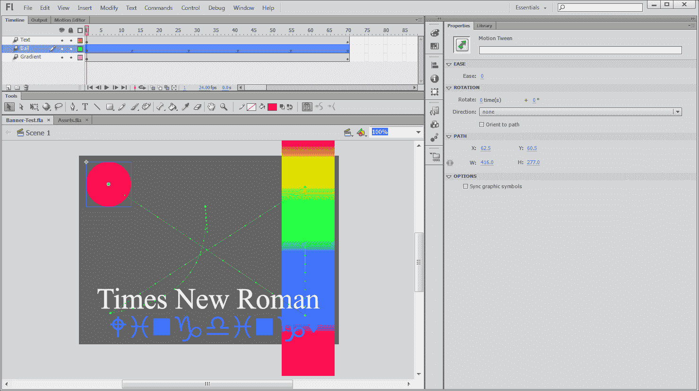

尽管前面的例子很丑陋，但它实际上代表了一些重要的测试因素。首先，我们有一个在舞台上运动的圆。其次，我们有一个填充有渐变背景颜色的矩形，同样是矢量格式。最后，我们有两行文本：一行是对**Times New Roman**字体的简单使用，另一行是对更复杂字体如**Wingdings**的测试。就像两个形状一样，文本在播放时将在舞台上进行动画。这个测试的想法是看看 Swiffy 如何处理只有时间轴修改元素的极为常见的 SWF 设置。为了使这个测试不那么复杂，我们还将省略任何 ActionScript，并假设时间轴将无限循环。

创建了时间轴后，我们可以将这部电影的 SWF 输出到我们的项目目录中。Swiffy 生成 Web 准备好的输出所需的唯一 SWF 来自于你的 Flash 项目创建的单个 SWF，所以打开一个 Web 浏览器，前往 Swiffy 项目网站（[`www.google.com/doubleclick/studio/swiffy`](https://www.google.com/doubleclick/studio/swiffy)）。

### 提示

在撰写本书时，Swiffy 允许你上传任何大小等于或小于 1MB 的 SWF 文件。

当你准备好转换你的 SWF 时，使用项目网站首页上的表单将你的 SWF 上传到 Swiffy 服务器。结果应该很快就会出现，就像下面的截图所示：

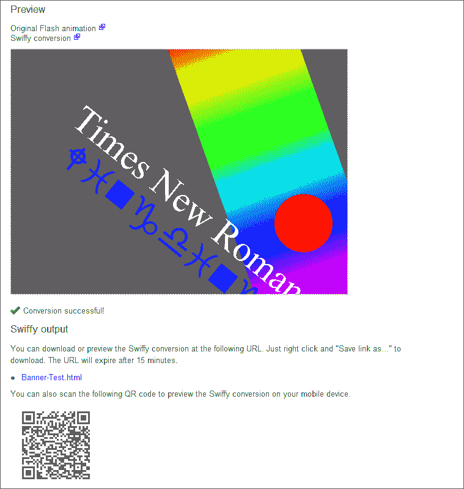

结果应该显示类似于前面的截图。转换后的 SWF 的预览将显示在 Web 准备好的显示中，以及所有的输出消息和下载输出的链接。每个 SWF 转换页面上提供的 QR 码将允许您轻松地在移动设备上测试生成的源代码，以验证它是否正常工作。如输出页面所示，您可以通过右键单击外部输出示例的链接（在本例中为`Banner-Test.html`）轻松下载 HTML 文档以及所有其他数据，并以这种方式保存引用页面。

## 检查 Swiffy 生成的代码

将内容保存到本地计算机后，让我们花点时间来审查究竟做了什么，以及我们如何将这个资产移植到现有的网站中。打开 HTML 文件后，首先要注意的是使用外部库：

```html
<script src="img/runtime.js"></script>
```

这个 JavaScript 调用是从 Google 文件服务器导入 Google Swiffy 运行时，并且需要正确显示其后的数据。就像 CreateJS 一样，已创建的代码是 JavaScript 和需要最终解释器才能正常运行的混合体。这是关于 Swiffy 的一个非常重要的事情。包括`runtime.js`文件是项目的绝对要求，只要添加了从 Swiffy 生成的任何资产。

在 Swiffy 运行时包含之后，你会注意到更多 HTML `<script>`标签中包含了大量文本。以下是它的一部分：

```html
swiffyobject = {"tags":[{"frames":[],"scenes":[{"name":"Scene 1","offset":0}],"type":23},{"bounds":[{"ymin":0,"ymax":2240,"xmin":0,"xmax":10399}],"id":1,"fillstyles":[{"transform":["4738D::1056F199e20k"],"type":2,"gradient":{"stops":[{"color":[-65536],"offset":[0]},{"color":[-256],"offset":[42]},{"color":[-16711936],"offset":[93]},{"color":[-16711681],"offset":[127]}….
```

这些数据是 JavaScript 对象，代表了原始 SWF 中包含的所有资产和动画的数据。由于我们的例子中没有包含任何位图图像，而且其中的一切都是基于矢量的，整个应用程序已经被编译为 100%的代码，并且可以用几行进一步的 JavaScript 来显示：

```html
var swiffyElement = document.getElementById('swiffycontainer');
var stage = new swiffy.Stage(swiffyElement), swiffyobject);
stage.start();
```

## 发现 Swiffy 的限制

所有这些都很好，直到我们开始让事情变得更加复杂。在下一个例子中，我创建了一个非常简单的 ActionScript 3 游戏。游戏的想法是通过移动鼠标来控制舞台上方框的位置。随着时间的推移，你的方框会开始增长并占据舞台上更多的空间。游戏的目标是尽可能长时间地让你的方框不要碰到任意移动的黑点。为简单起见，我在这个游戏中没有包含任何用户界面。所有的结果和输出都将暂时发送到 Web 浏览器的开发者控制台。你可以在可下载的章节示例文件中找到这个例子的工作形式。

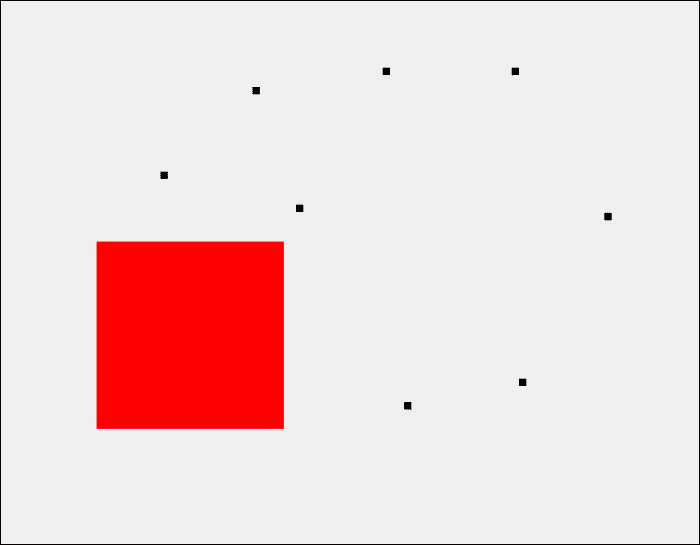

是的，这非常粗糙，但它涵盖了 Flash 应用程序中许多常见的方面，并且用可管理的代码行数，非常适合我们的演示目的。如前所述，游戏中没有用户界面，任何游戏输出都将被发送到 Flash 输出调试窗口。在继续之前，让我们先看一下代码，这样你就可以注意到已经使用的特定功能、类和变量类型。

```html
package {

  import flash.display.MovieClip;
  import flash.events.Event;
  import flash.events.MouseEvent;

  // Setting the frame rate is important here as we calculate
  // the users score from how many frames have passed.
  // It's worth noting that the TimerEvent class can be used
  // without any issue by applications converted with
  // Google Swiffy.
  [SWF(backgroundColor="0xEFEFEF", width="1024", height="768", frameRate="30")]

  public class PlayerMoveTest extends MovieClip {
    // Setting a static const variable, defines
    // how many bad guy dots to add to the stage.
    private static const BAD_GUY_COUNT:int = 10;

    // The 'Player' class is a red box created and defined
    // within an SWC included into this project.
    private var _player:Player;

    // An array to hold all of the bad guys created
    // when the game is created.
    private var _badGuys:Array;

    private var _lifeTimer:int;
    private var _playerTarget:Object = new Object();

    /**
     * PlayerMoveTest Constructor
     */
    public function PlayerMoveTest() {
      // Start by creating and adding all of the bad
      // guys to the game stage.
      _badGuys = new Array();
      for(var i:int = 0; i < BAD_GUY_COUNT; i++) {
        // Using MovieClips instead of Sprites
        // as Sprites are not supported by the
        // Google Swiffy compiler.
        var badGuy:MovieClip = new MovieClip();
        badGuy.graphics.beginFill(0x000000, 1);
        badGuy.graphics.drawRect(-5, -5, 10, 10);
        badGuy.graphics.endFill();
        badGuy.x = Math.floor(Math.random() * (1000 + 1));
        badGuy.y = Math.floor(Math.random() * (700 + 1));
        _badGuys.push(badGuy);
        addChild(badGuy);
      }

// Create the users Player object
// Again, this is created within a included SWC.
      _player = new Player();
      _player.x = 100;
      _player.y = 100;
      _playerTarget.x = _player.x;
      _playerTarget.y = _player.y;
      addChild(_player);

      // Add a on enter frame to update the game stage.
      this.addEventListener(Event.ENTER_FRAME, updateEnviroment, false, 0, true);
    }

/**
 * Called on every frame when the game is in a playable
 * state.
 */ 
    private function updateEnviroment(event:Event):void {
      // Update the life timer, used for player score.
      _lifeTimer++;

      // Set the new player position target.
      // this position is based of the current X and Y
      // position of the user's mouse.
      _playerTarget.x = this.mouseX - 50;
      _playerTarget.y = this.mouseY - 50;

// Calculate the distance to the current 
// player target.
      var xDistance:int = _playerTarget.x - _player.x;
      var yDistance:int = _playerTarget.y - _player.y;

      // Update the position of the player object. Use
      // a simple method to ease the position into the 
      // target.
      _player.x = _playerTarget.x - (xDistance * 0.9);
      _player.y = _playerTarget.y - (yDistance * 0.9);
      _player.width += 0.5;
      _player.height += 0.5;

// Randomly move the position of each bad guy on
// every frame.
      for(var i:int = 0; i < BAD_GUY_COUNT; i++) {
        _badGuys[i].x += Math.round(Math.random() * (15 - (-15)) + (-15));
        _badGuys[i].y += Math.round(Math.random() * (15 - (-15)) + (-15));

// Using the common hitTestObject method 
// to check and see if any of these bad guys 
// are currently touching the player object. 
        if(_player.hitTestObject(_badGuys[i])) {
          // The player is touching a bad guy
          // so stop the on enter frame event
          // and alert the users score.
          this.removeEventListener(Event.ENTER_FRAME, updateEnviroment);

          trace('GAME OVER!!!');
          trace('You lasted ' + Math.round(_lifeTimer / 30) + ' seconds.');
        }
      }
    }
  }
}
```

如果你有兴趣实际编译这个应用程序的源代码，你可以找到所有的文件，在 Flash Builder 中打开它作为一个 ActionScript 项目。将应用程序编译为 SWF 并在本地测试应用程序以确认它是否正常工作。如果一切顺利，让我们尝试将这个文件发送给 Swiffy，看看会发生什么：

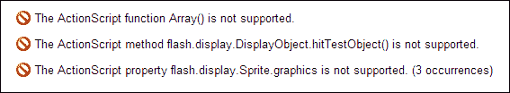

只要你正确地按照步骤操作，当尝试转换这个 SWF 并生成前一个截图中的错误列表时，Swiffy 会失败。让我们快速看一下出了什么问题，限制以及可以采取的解决方法。首先，第一个错误列出了数组不受 Swiffy 编译器支持的通知。在我们的应用程序中，我们使用数组来包含所有坏人实例在一个全局变量中。在这个或任何应用程序中，如果不使用数组来管理数据，就需要以更原始的方式来管理数据。这个问题本身可以成为决定是否使用 Swiffy 进行转换的关键因素。尽管有许多方法可以解决这个问题，事实是，如果你的应用程序中到处都是数组，那么当前版本的 Swiffy 很可能无法帮助你。不管有多少坏消息，让我们继续看第二个问题。毫不奇怪，常见的 ActionScript 3 开发中的`hitTestObject`方法也不被编译器支持。

这种易于使用的方法在 Flash 开发中需要简单的碰撞检测时可以成为救命稻草，但由于没有直接的 JavaScript 等效方法来转换它。再次弥补这一点是可以的，但结果代码会比在典型的 ActionScript 3 开发中调用单个方法要大得多。因此，这可能被视为一个问题，但并不是一个死胡同，只要你的碰撞检测只使用支持的方法和属性。我们转换尝试中列出的最终错误是使用`Sprite.graphics`类。如果你还记得，代码示例明确使用了 MovieClips 而不是 Sprites，因为 Sprites 不受 Swiffy 编译器支持。然而，与最初在 Flash Professional IDE 中创建并保存到 SWC 中的`Player`对象不同，坏人对象是在代码中使用内部 ActionScript 3 Graphics API 创建的。

```html
badGuy.graphics.beginFill(0x000000, 1);
badGuy.graphics.drawRect(-5, -5, 10, 10);
badGuy.graphics.endFill();
```

这三行是最终错误的原因。由于 Flash 中的`MovieClip`对象是建立在`Sprite`类之上的，所以结果错误也是如此。由于 SWC 处理了`Player`对象的创建，因此该对象不会出现错误。然而，值得注意的是，即使通过移除所有坏人并只让一个方块在周围移动来修复这些错误，成功转换的结果在游戏的 HTML 版本中仍然没有显示任何内容。目前看来，Swiffy 不支持在 ActionScript 3 项目中使用 SWC，它更倾向于使用旧式的纯 Flash IDE 开发风格的应用程序开发。

尽管 Swiffy 缺乏多年来在 Flash 开发中常用的许多功能，但它仍然可以成为集成网站动画或广告横幅等资产的非常方便的工具。实际上，Swiffy 可靠地为你做的大部分工作是简单的 Flash 应用程序和电影转换，而不是你典型的 Flash 游戏或应用程序。

# 在 Flash Professional CS6 中生成精灵表

如果你打算将一些现有的基于 Flash 的时间轴动画移植或复制到 HTML5 项目中，你将不得不进行一些自己的转换。正如你在本书的示例中所看到的，时间轴动画在 HTML5 堆栈中根本不存在。因此，你需要将动画序列转换为一种新的格式，以便在 Web 上正确显示。最简单的选项之一是将动画转换为视频文件，并使用`<video>`标签元素进行播放。不幸的是，将位图或矢量资产转换为可以在 Web 上正确播放的视频文件将导致大量的质量损失。更糟糕的是，视频播放将非常沉重，导致应用加载时间变慢。最后，HTML5 中的视频缺少许多重要功能，比如不支持 alpha 透明度，导致所有资产都包含在一个完全可见的矩形容器中。为了解决所有这些问题，许多网页开发人员正在转向经过验证的精灵表方法。精灵表背后的概念非常简单。将动画序列中的所有帧放在同一张图像上（带有透明背景），并将图像保存为未压缩的 PNG 文件。这样，当客户端在 Web 上加载时，只需下载一个文件就可以将整个动画序列加载到内存中准备播放。将基于 Flash 的时间轴动画手动转换为精灵表，通过将每一帧复制并粘贴到 PNG 文档中，是一项漫长而繁琐的工作。幸运的是，这是一项你不需要处理的工作，因为 Flash Professional CS6 在 IDE 中已经集成了精灵表生成器。

在 Flash CS6 中使用精灵表生成器非常简单。Adobe 的工程师们成功地创建了一个工具，可以让您在几分钟内轻松地在 HTML5 项目中使用 Flash 动画。虽然使用简单，但该功能可能有点隐藏，因此让我们快速看一下精灵表生成器的操作，并将一些结果放入工作中的 HTML5 文档进行测试。

举例来说，我创建了一个非常简单的 Flash 动画示例，时间轴上只包括三种不同的形状。每种形状仅显示 5 帧，总共有 15 帧动画：

### 提示

和往常一样，您可以在可下载的章节示例中找到所有示例文件。

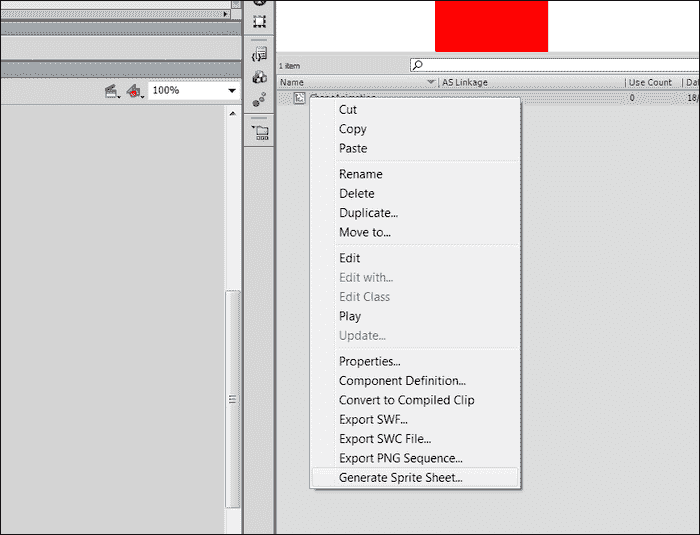

在 Flash 项目的库中找到 MovieClip，右键单击它。在右键单击任何 MovieClip 时显示的上下文菜单中，您将找到**生成精灵表**选项。选择此选项，将会出现新的、功能丰富的**生成精灵表**窗口：

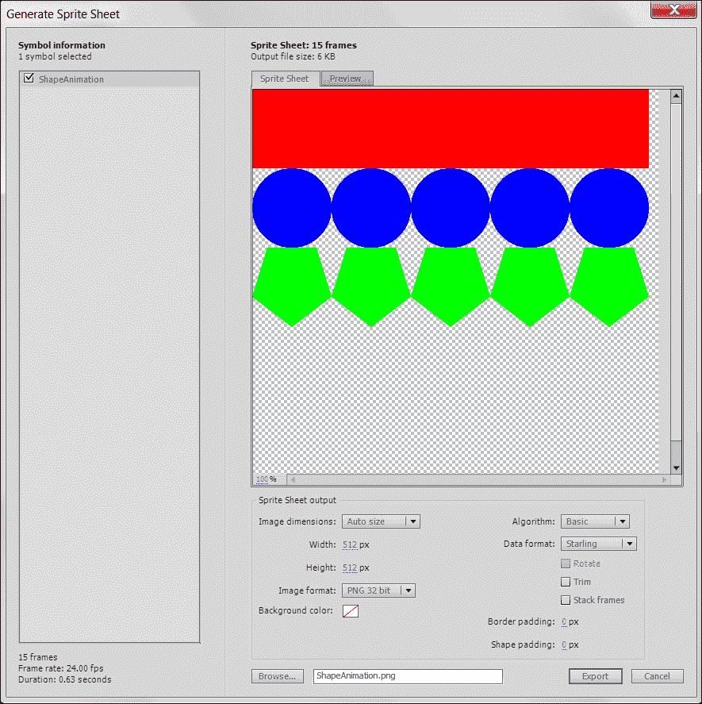

初步检查时，您会看到动画中的每一帧都自动添加到同一文档中，并以网格格式排列。如前所述，该动画包含 15 帧，因此每帧都已添加到精灵表**预览**窗口中，并显示默认配置。在保存此输出之前，让我们查看一些可用的选项，看看是否可以进一步优化这个精灵表。

我们可以从对即将导出的内容进行概述开始。在**生成精灵表**窗口的左下角，您将找到当前 MovieClip 的详细信息，包括基于特定帧速率的帧数和持续时间。在窗口的右侧，您可以看到一个易于查看的预览，显示了在当前配置下生成的精灵表的外观。选择第二个**预览**选项卡将显示以其原生形式运行的动画。

在预览窗口下方是在导出动画资产和数据集时可用的所有配置属性。导出图像的尺寸可以由 Flash 自动调整，也可以手动配置以设置动画帧的可用区域。图像格式也可以配置为 PNG 或 JPG 格式，以便对导出图像进行进一步压缩。建议将其设置为 PNG 格式，无背景，除非需要允许正确的图像背景透明度：

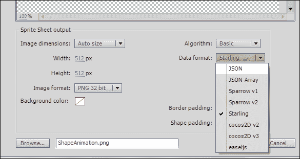

配置属性的正确大小包含了数据集导出的设置。由于为精灵表导出的图像将只包含帧资产而没有动画数据，因此精灵表将需要某种形式的数据才能正确播放。当使用可用的切片算法中的基本算法时，通常不会出现问题。使用基本设置时，精灵以漂亮的统一行排列在易于使用的网格布局中。这是处理任何简单动画时的最佳输出设置。目前算法的另一个选项是**MaxRects**选项。此选项用于尝试尽可能紧密地打包帧。这样做的原因是为了最小化导出图像文件大小，以便在互联网连接上实现更快的下载时间。选择算法后，我们可以继续进行此导出窗口中可能最重要的设置。**数据格式**选择允许您将数据导出格式设置为特定于您正在开发的 HTML5 应用程序的工作方式。已包括对 iOS 开发的**The Sparrow Framework**（[`gamua.com/sparrow`](http://gamua.com/sparrow)）、用于 ActionScript 3 的**The Starling Framework**（[`gamua.com/starling/`](http://gamua.com/starling/)）以及**Cocos2D**（[`cocos2d.org/`](http://cocos2d.org/)）的支持。作为 HTML5 开发人员，您可能最感兴趣的三个主要导出设置是**JSON**、**JSON-Array**和**easeljs**选项。将数据集导出为简单的 JSON 导出将允许您将数据通用地用作 JSON，这是人类可读的数据存储的开放标准。**JSON-Array**设置非常相似，不同之处在于将数据存储在 JSON 数组中而不是直接对象中。这两者之间的区别实际上只会影响您在代码中如何解释数据。最后，**easlejs**导出设置允许您自动准备导出的动画以包含在您的 CreateJS 或 EaselJS 项目中。当您尝试将外部资产包含到现有的基于 CreateJS 工具包的项目中时，这种导出设置非常方便：

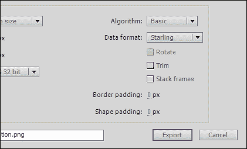

配置中的最终设置是**修剪**和**堆叠帧**选项。修剪精灵表中的帧将删除每个元素之间的未使用空白空间。这将通过最小化导出图像文件大小再次优化您的最终结果。最后，**堆叠帧**选项允许您通过删除或堆叠动画中相同的帧来进一步优化您的动画。

由于导出的数据集将包含时间轴信息，因此无需存储相同的图像两次，因此可以毫无问题地删除这些资产：

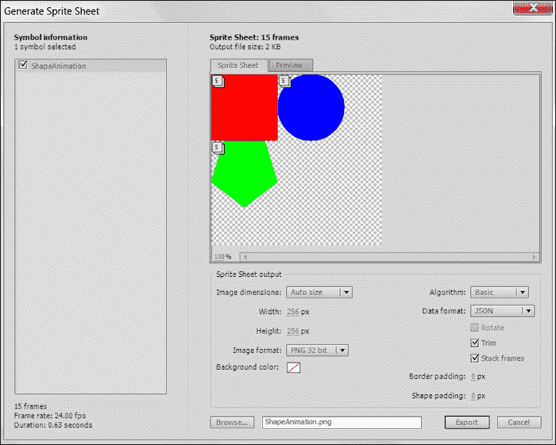

所有这些设置都已覆盖，让我们使用前面截图中的设置导出这个动画，看看我们得到了什么输出。当单击**导出**按钮时，窗口完成后将关闭，您将能够在项目目录的根目录中找到导出的材料。在**数据格式**选项中附加**JSON**设置后，将导出两个文件。第一个文件是 PNG 格式的精灵表图像：

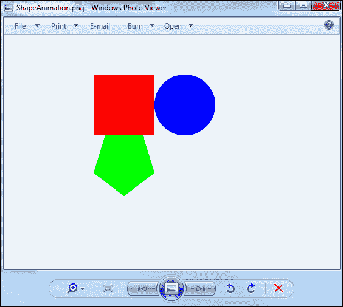

第二个文件是我们的 JSON 输出，其中包含动画的前三帧的所有帧位置和大小的数据。以下是导出的 JSON 中包含的动画数据的片段：

```html
{"frames": {

"ShapeAnimation0000":
{
  "frame": {"x":0,"y":0,"w":100,"h":100},
  "rotated": false,
  "trimmed": false,
  "spriteSourceSize": {"x":0,"y":0,"w":100,"h":100},
  "sourceSize": {"w":100,"h":100}
},
"ShapeAnimation0001":
{
  "frame": {"x":0,"y":0,"w":100,"h":100},
  "rotated": false,
  "trimmed": false,
  "spriteSourceSize": {"x":0,"y":0,"w":100,"h":100},
  "sourceSize": {"w":100,"h":100}
},
"ShapeAnimation0002":
{
  "frame": {"x":0,"y":0,"w":100,"h":100},
  "rotated": false,
  "trimmed": false,
  "spriteSourceSize": {"x":0,"y":0,"w":100,"h":100},
  "sourceSize": {"w":100,"h":100}
},
"ShapeAnimation0003":
{
  "frame": {"x":0,"y":0,"w":100,"h":100},
  "rotated": false,
  "trimmed": false,
  "spriteSourceSize": {"x":0,"y":0,"w":100,"h":100},
  "sourceSize": {"w":100,"h":100}
},
```

数据非常简单易懂，这很好，因为从这一点开始，如果没有使用游戏开发框架或 CreateJS，我们必须自己解释和显示这些数据和资产：

```html
<!DOCTYPE html>
<html lang="en">
  <head>
    <meta charset="utf-8" />
    <title>ShapeAnimation Sprite Sheet Example</title>

    <style>
      #animation {
        width:100px;
        height:100px;
        overflow:hidden;
      }
      </style>

      <script type="text/javascript" src="img/jquery-1.9.1.min.js"></script>
    <script>
      var animationData = Array();
      var currentFrame = 0;

      $(document).ready(function() {
        // Get the Sprite Sheet JSON
        $.getJSON('ShapeAnimation.json', function(data) {
          // Save each of the objects into an array.
          $.each(data['frames'], function(key, val) {
            animationData.push(val);
          });

          // Start the animation.
          runAnimation();
        });
      });

      function runAnimation() {
        // Update the CSS properties of the Sprite Sheet image.
        $('#animation img').css('margin-left', animationData[currentFrame]['frame']['x'] * -1);
        $('#animation img').css('margin-top', animationData[currentFrame]['frame']['y'] * -1);

        // Update the frame counter and reset if needed.
        currentFrame++;
        if(currentFrame == animationData.length) currentFrame = 0;

        // Keep calling this method every 200ms.
        setTimeout(runAnimation, 200);
      }
    </script>
  </head>

  <body>
    <div id="animation">
      
    </div>
  </body>
</html>
```

由于 Flash Professional CS6 对 CreateJS 的巨大支持，使用 EaselJS 设置来导出和使用精灵表绝对是最简单的方法。然而，正如前面的代码片段所示，通过标准化的 JSON 导出方法，你可以相对容易地将任何 Flash 动画实现为精灵表，用于你的 HTML5 项目。

### 提示

如果你对精灵表感兴趣，但又不想花时间创建所有的资源，可以前往 Google 图片搜索精灵表。你会发现无穷无尽的精灵表资源，可以用来测试你的应用程序。当然，在公共网站上使用任何资产时，你应该确保拥有权限或所有权。

# Jangaroo

Jangaroo（[`www.jangaroo.net`](http://www.jangaroo.net)）的开发背后实际上非常有趣。Jangaroo 是由 CoreMedia（[`www.coremedia.com`](http://www.coremedia.com)）的开发团队创建的，它是由内部开发团队对当前 JavaScript 开发能力的挫折而构建的。CoreMedia 的开发团队并没有处理 JavaScript 所具有的许多常见语法问题，而是着手创建了一个用 Java 编写的 ActionScript 3 到 JavaScript 编译器。尽管这听起来可能很荒谬，但实际情况是，Flash 开发人员可以轻松地继续使用熟悉的语法，同时专门针对基于 HTML5 的 Web 开发。Jangaroo 旨在允许开发人员使用 ActionScript 3 的强大功能编写高质量的 JavaScript 框架和应用程序。简而言之，它将接收 ActionScript 3 文件，并借助其用 Java 编写的编译器将它们转换为可用的 JavaScript：

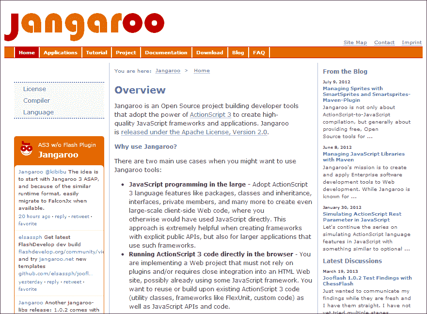

那么，为什么有人想要避免编写原生 JavaScript，开始为下一个 HTML5 项目编写 ActionScript 3 呢？嗯，作为一个有过编写 ActionScript 3 经验的开发者，你可能已经可以从本书中到目前为止的所有示例和概述中回答这个问题。在编写大型强大的 HTML5 应用程序时，JavaScript 中缺少包、类和适当的继承可能会开始创建一堆代码的雷区，这些代码可能很难管理。通过允许自己继续使用一种你不仅习惯了的语言来开发应用程序，而且可以更容易地管理项目中的类，你可以克服许多在纯 JavaScript 开发周期中可能出现的常见障碍。

Jangaroo 项目的核心是名为`jooc`的 Jangaroo ActionScript 3 到 JavaScript 编译器。编译器将接收你的 ActionScript `.as`文件，并将它们导出为编译后的 JavaScript `.js`文件。要安装和运行 Jangaroo，你需要首先确保已安装最新版本的 Java 运行环境（[`www.oracle.com/technetwork/java/javase/downloads/index.html`](http://www.oracle.com/technetwork/java/javase/downloads/index.html)）以及 Maven（[`maven.apache.org`](http://maven.apache.org)）。安装和设置这两个软件可能看起来令人生畏，但请放心，这个过程非常简单直接，并且有很好的文档记录，所以我会把这个过程留给你自己。

### 提示

在安装 Java 运行环境时，值得注意的一点是要确保`JAVA_HOME`环境变量已正确设置。如果在安装或测试 Jangaroo 过程中遇到任何问题，这将是一个很好的调试起点。

为了给你一个用 ActionScript 3 创建并使用 Jangaroo 编译的 JavaScript 驱动应用程序的简化开发周期的例子，让我们使用可以在项目网站上找到的 HelloWorld 示例（[`www.jangaroo.net/tutorial`](http://www.jangaroo.net/tutorial)）。

```html
package {
/**
 * The most simple Jangaroo class on earth.*/
public class HelloWorld {
  /**
   * Let the browser display a welcome message.*/
  public static function main():void {window.document.body.innerHTML = "<strong>Hello World from Jangaroo!</strong>";
  }
}
}
```

正如您在代码示例中所看到的，您的 ActionScript 类可用的语法是常见的 ActionScript 3 和一些特殊的窗口和文档对象引用的混合，以便您可以正确地将应用程序集成到浏览器中。如果您对准备将 ActionScript 3 编译为 Jangaroo 编译器感兴趣，可以前往官方 Jangaroo 文档的**编写代码**页面了解有关语言和代码语法选项的更多信息（[`www.jangaroo.net/tutorial/writing_code`](http://www.jangaroo.net/tutorial/writing_code)）。

Jangaroo 的大部分是开源的，项目代码和资产可以在 CoreMedia 的 Github 页面上找到（[`github.com/CoreMedia`](https://github.com/CoreMedia)）。

# Haxe

继续讨论将应用程序和其他编程语言直接编译为 JavaScript 的话题，我应该花点时间介绍一下 Haxe 开发世界中一些令人兴奋的功能：

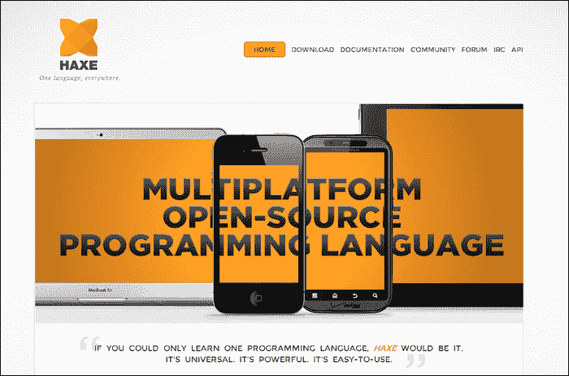

**Haxe**（[`haxe.org`](http://haxe.org)）是一种独立的开源编程语言。大多数编程语言都是为特定的应用类型而构建的，JavaScript 用于 Web，ActionScript 用于 Flash，而 Haxe 可以从相同的源代码编译和运行在各种平台和设备上。Haxe 源代码可以有选择地编译成 JavaScript、Flash、PHP、C++、C#和 Java，结合您之前对 ActionScript 3 的经验和您在 JavaScript 中学到的新技能，学习 Haxe 语法是轻而易举的。

尽管跨平台开发现在可能不是您的兴趣所在，但至少对诸如 Haxe 等语言提供的基本了解可能会让您填补开发技能中的一些空白。在我们继续之前，让我们快速看一下 Haxe 项目网站的**代码片段**页面上可以找到的 Haxe 代码示例。以下代码是实现流行排序方法 Quicksort 的示例（[`en.wikipedia.org/wiki/Quicksort`](http://en.wikipedia.org/wiki/Quicksort)）。由于我们已经了解了这个排序算法试图实现的目标，让我们主要审查这段代码，以了解 Haxe 编程语言中的类、方法和变量语法：

```html
class Quicksort {

    static var arr = [4,8,0,3,9,1,5,2,6,7];

    static function quicksort( lo : Int, hi : Int ) : Void {
        var i = lo;
        var j = hi;
        var buf = arr;
        var p = buf[(lo+hi)>>1];
        while( i <= j ) {
            while( arr[i] > p ) i++;
            while( arr[j] < p ) j--;
            if( i <= j ) {
                var t = buf[i];
                buf[i++] = buf[j];
                buf[j--] = t;
            }
        }
        if( lo < j ) quicksort( lo, j );
        if( i < hi ) quicksort( i, hi );
    }

    static function main() {
        quicksort( 0, arr.length-1 );
        trace(arr);
    }
}
```

正如您可以直接在第一行看到的那样，Haxe 具有完整的类支持，不像 JavaScript。这个概念本身可能是一个卖点，因为从 ActionScript 转到 Haxe 的开发人员会发现许多在 JavaScript 中不可用的相似之处。其他功能，如静态函数、严格的变量类型和常见的调试方法，比如`trace()`，只是 Haxe 中让具有先前 ActionScript 3 开发经验的开发人员脱颖而出的众多出色功能之一。

### 提示

如果您对了解 Haxe 开发的激动人心世界感兴趣，请查看《Haxe 2 初学者指南》，*Packt Publishing*（[`www.packtpub.com/haxe-2-beginners-guide/book`](http://www.packtpub.com/haxe-2-beginners-guide/book)）。

Haxe 本身是一个庞大的项目。直接将应用程序源代码交叉编译到几乎所有现代平台上的能力是一个非常宝贵的资产，尤其是当您开发具有非常特定平台要求的项目时。即使您只打算使用 Haxe 源代码针对 HTML5 Web 项目，只需点击几下鼠标即可将应用程序移植到另一个平台的能力是非常惊人的。此外，就像我们在本章中审查的许多其他平台和编译器一样，Haxe 可以减轻许多 Web 开发人员对 JavaScript 语法的常见抱怨。该项目仍然相对较新，尽管许多开发人员已经加入了这一行列。如果在 Haxe 中开发您的下一个应用程序听起来像一个有趣的挑战，我强烈建议您进一步了解一下。

# Google Dart

为了帮助来自各个平台的开发人员构建现代 Web 的复杂、高性能客户端应用程序，谷歌的 Dart（[`code.google.com/p/dart/`](https://code.google.com/p/dart/)）是推动 Web 开发的又一个很好的例子，更具体地说是 JavaScript 开发。就像 Haxe 一样，Dart 是一个开源项目，使用自己特定的编程语言编译成 Web-ready JavaScript 文档，就像 Jangaroo 一样，Dart 是基于对当前 Web 开发平台限制的不满而构建的。为了引入新的结构化、单一语言工作流程，谷歌发布了 Dart 项目的*技术预览*，以便早期测试和来自 Web 开发社区的反馈：

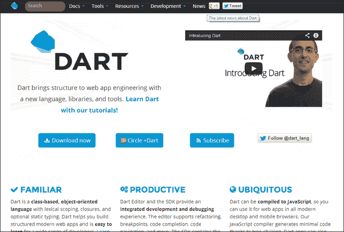

当然，由于 Dart 是基于自己的语法构建的，刚开始时会有一个学习曲线。为了帮助减轻学习新语言的压力，我强烈建议查看官方的 Dart Editor。Dart Editor（[`www.dartlang.org/docs/editor/`](http://www.dartlang.org/docs/editor/)）可能是最简单的开始和运行 Dart 开发的方法。

它支持实时错误和语法检查功能，以在编译之前提醒您任何问题，同时还支持代码完成功能，以帮助您了解每个方法和属性可以做什么。

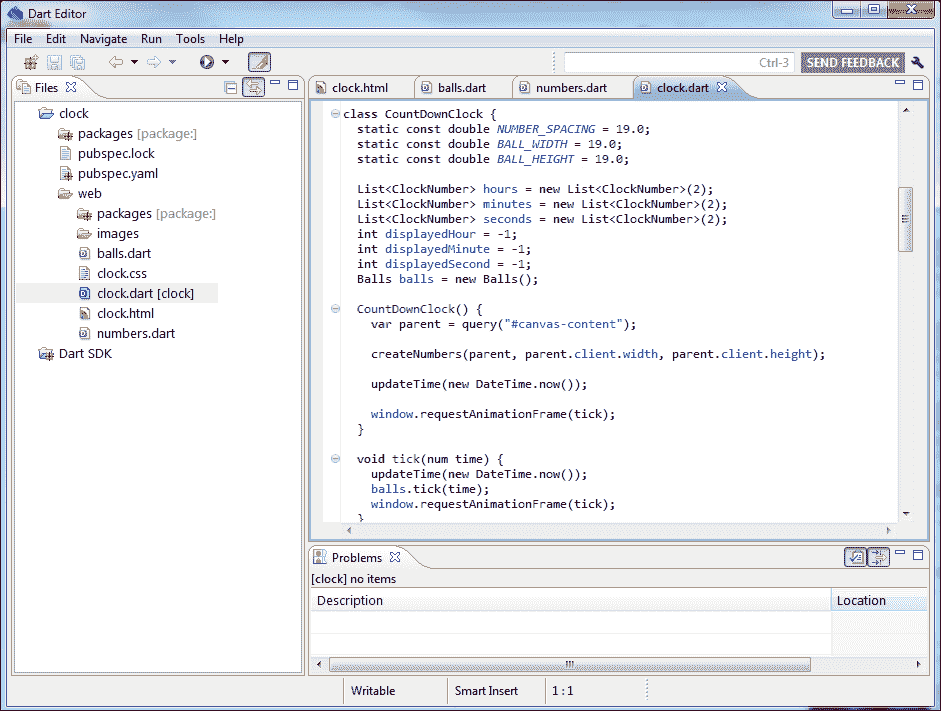

Dart Editor，就像许多其他编辑器一样，是基于流行的 Eclipse IDE 构建的。尽管代码编辑器简化了，但对于有 Flash Builder 经验的人来说，这可以被认为是又一个胜利，因为界面会非常熟悉。我说这个编辑器简化了，因为这个编辑器不是作为 Eclipse 的插件提供的，而是作为自己独立的基于 Eclipse 的编辑器打包，删除了所有不必要的元素。

就像 Haxe 的概述一样，我会保持简短，因为 Dart 仍然是一个非常新的项目，我还没有亲自遇到任何使用它开发流行 Web 应用程序的人。也就是说，绝对没有理由贬低 Dart 这样的语言。随着 JavaScript 规范的发展和浏览器支持的跟进，对这些项目的需求可能会减少。然而，就像任何 Flash 开发人员知道的，使用适当的调试和输出流编译项目可以让他们比许多传统的客户端脚本编写方法更快地找到和修复问题。

# 总结

在本章的过程中，我们花了一些时间研究了一些正在推动网页应用程序开发极限的项目，例如谷歌的 Swiffy 项目，它可以轻松地将简单的 Flash SWF 文件直接转换为 Web 友好的 HTML 和 JavaScript 配置，以及从 Flash Professional IDE 中直接导出 Flash 矢量和位图动画到 Web 准备好的精灵表。诸如 Haxe、Dart 和 Jangaroo 之类的项目为开发人员在尝试创建他们的 HTML5 项目时提供了新的选择。驱动他们应用程序的本机 JavaScript 实际上可以用完全不同的语言编写。最初，将 JavaScript 的能力扩展到其他语言可能看起来有些反向，但创建这些项目的原因通常都归结为在编写 JavaScript 时缺乏通用语法和开发流程问题。正如前面提到的，开发下一个 HTML5 项目时，并不需要使用本章中提到的特定应用程序中的项目或功能。了解当前网页开发人员可以使用的项目和平台的知识将使您能够更好地得出结论，找到最佳的方式来处理下一个 HTML5 项目。

我必须强调，本章提到的应用程序、功能和编译器列表只是在使用 JavaScript 时可用的一小部分。如果您有兴趣了解更多可以编译到 JavaScript 或扩展 JavaScript 的项目，请访问[`altjs.org`](http://altjs.org)。在那里，您将找到针对初学者到高级开发人员风格的项目列表，所以我相信那里一定会有一些能够吸引您的东西。许多这些项目都是基于 CoffeeScript（[`coffeescript.org`](http://coffeescript.org)）开发的，这是另一种直接编译为 JavaScript 的专用语言，也是我推荐您了解的另一个很棒的项目。与扩展 JavaScript 的开发流程和能力相关的项目数量似乎是无穷无尽的，并且每天都在增长。没有人能指望您了解所有这些项目，但是对现有项目以及许多这些平台能做什么有一个基本的了解，将使您在着手开发下一个项目时能够做出更快更好的决策。

在接下来的两章中，我们将开始将我们到目前为止所涵盖的所有内容融入到实际的 HTML5 应用程序开发流程中。我们将涵盖每个开发人员在为 Web 开发时应该注意的许多重要方面，以及在开发过程中正确测试应用程序的方法。最后，为了总结一切，我们将把该应用程序发布到互联网，并介绍一些在应用程序上线后发布和维护项目的方法。
