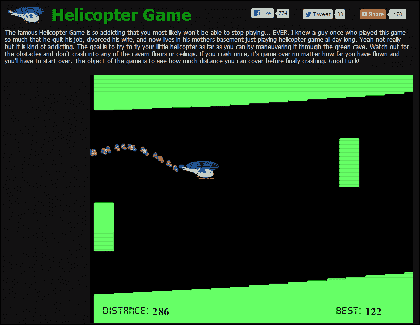
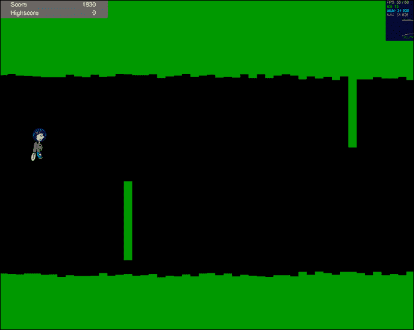
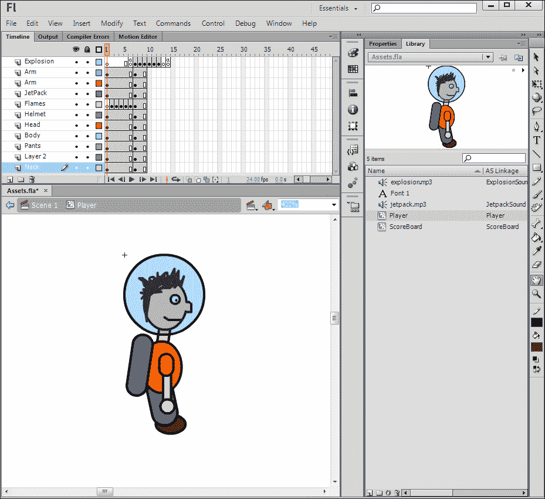
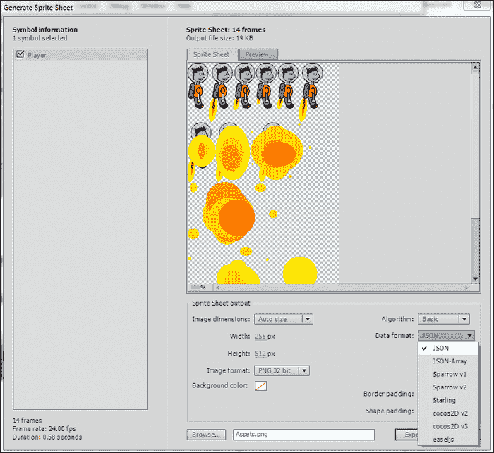
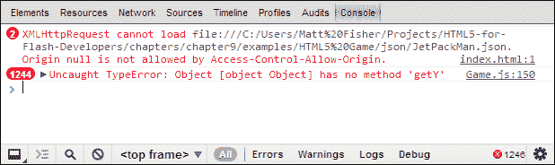
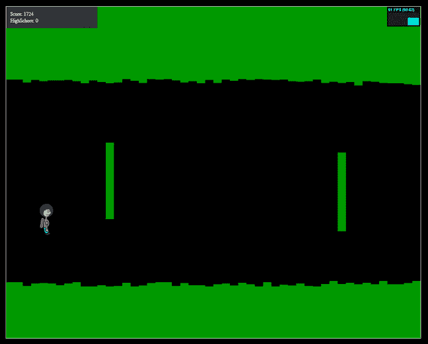
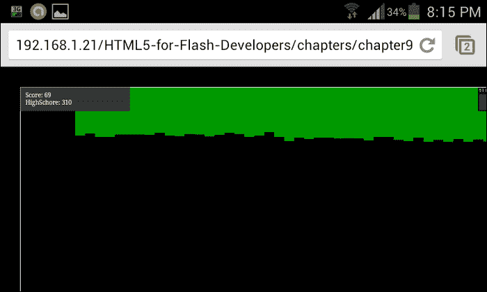
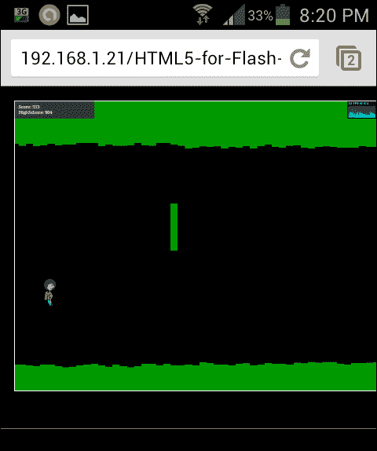

# 第九章：避免路障

到目前为止，在本书中，我们已经涵盖了许多 HTML5 网页开发的新颖方面。然而，在此期间，我们只是将每个功能视为一个独立的方面，而不是一个更大项目的一部分。在构建真实世界的应用程序时，您将不可避免地不得不开始合并这些新功能，以构建应用程序中的适当功能集。在本章中，我们将使用一些新的和旧的功能来构建一个可玩的游戏，作为 Web 开发人员可用的一些功能。我们将从 Flash 内置版本开始，然后将应用程序直接移植到 HTML5，并讨论在处理您已经习惯于 ActionScript 和 Flash 开发世界中的资产和功能时可能遇到的差异和问题。

# 喷气背包游戏

我们将构建的应用程序是一个简单的 2D 横向滚动游戏，具有简单的控件，可以轻松转换为移动设备的触摸事件。为了使解释和理解变得简单，我将此游戏建模为流行的直升机游戏（[`www.helicopter-game.org/`](http://www.helicopter-game.org/)）的简化版本，这个游戏已经在互联网上玩了很多年。

以下屏幕截图显示了直升机游戏：



尽管互联网上已经有许多版本的这个游戏，但最受欢迎的版本是用 Flash 编写的，这使得许多移动设备和桌面浏览器的用户无法玩这个游戏。游戏玩法和控件非常简单，只需要玩家使用键盘上的一个键或使用鼠标进行点击。

与其直接复制这个流行的游戏，我们将把它作为游戏设计的起点。为了为游戏增添我们自己的个人风格，我们将把直升机角色换成一个带喷气背包的小人。在开始之前，看一下游戏运行的屏幕截图，以更好地了解我们最终的结果会是什么样子。当然，您也可以通过查看本章示例文件中的 Flash 和 HTML 版本来玩这个游戏。



您将扮演左侧屏幕截图中显示的角色，即喷气背包人。您的目标是通过激活他的喷气背包来控制角色的高度。随着角色深入洞穴系统，洞穴不仅会变得越来越狭窄，而且还会随机放置障碍物，您需要绕过这些障碍物。重力也起着重要作用，因为当您的喷气背包未激活时，您的角色将开始下落到地面。随着难度的增加，关卡对象会在玩家深入洞穴时实时动态生成，并受到更严格的限制。在游戏源代码的每个间隔期内，将检查关卡的每个部分与玩家的碰撞，以确定游戏是否结束。游戏的每个间隔期还会增加玩家的当前得分，因此您深入洞穴旅行越深，得分就越高。高分将在游戏实例中进行跟踪，并在 UI 中显示，以便玩家轻松查看下一次尝试的目标。

正如我之前提到的，我们将首先查看这个游戏的 ActionScript 3 源代码，以了解我是如何编写的。当然，需要声明的是，尽管这个游戏代码的某些方面可能适用于你在其他项目中，但这个游戏的源代码已经设置好，以帮助我们学习和理解 ActionScript 3 到 HTML5 的转换。这个游戏还没有被优化到应该发布给公众的程度，我会在本章尽力指出其中一些不足之处。有了这些想法，让我们直接进入这个喷气背包游戏 Flash 版本的源代码结构。

## 在 Flash 中构建游戏

为了让事情易于理解，我们将保持这个游戏的行数和文件数最少。我们将从我们 ActionScript 项目的基类`Game`开始。查看以下精简的基类示例，以了解游戏代码的结构。你可以随时在可下载的章节示例文件中查看完整版本：

```html
package {
  import flash.display.Sprite;
  import flash.events.Event;
  import flash.events.KeyboardEvent;

  [SWF(width='1000', height='800', backgroundColor='#000000', frameRate='60')]
  public class Game extends Sprite {
    private var _levelBlocks:Array = new Array();
    private var _interval:int;
    private var _blockInterval:int;
    private var _player:JetPackMan;
    private var _difficulty:int = 10;
    private var _speed:int = 10;
    private var _keyDown:Boolean;
    private var _score:int;
    private var _highScore:int;
    private var _scoreBoard:ScoreBoard;
    private var _gameOver:Boolean;

    public function Game() {
      generateLevel();
      createPlayer();
      displayScore();

      this.addEventListener(Event.ENTER_FRAME, updateI terval, false, 0, true);
      stage.addEventListener(KeyboardEvent.KEY_DOWN, onKeyDown, false, 0, true);
      stage.addEventListener(KeyboardEvent.KEY_UP, onKeyUp, false, 0, true);
    }

    // Starts a new game.
    private function startNewGame():void {
      // Reset the game switches and counters.
      _gameOver = false;
      _score = 0;
      _speed = 10;
      _difficulty = 10;

      for each(var block:LevelBlock in _levelBlocks) {
        block.destroy();
        removeChild(block);
      }
      _levelBlocks = new Array();

      removeChild(_player);
      _player.destroy();
      _player = null;

      generateLevel();
      createPlayer();

      this.addEventListener(Event.ENTER_FRAME, updateInterval, false, 0, true);
    }

    // Adds the score board to the stage.
    private function displayScore():void {
      _scoreBoard = new ScoreBoard();
      _scoreBoard.x = -40;
      _scoreBoard.y = -20;
      addChild(_scoreBoard);
    }

    // Generates the beginnings of a new level.
    private function generateLevel():void {
      for(var i:int = 0; i < 20; i++) {
        var randomHeight:int = (Math.floor(Math.random() * (_difficulty - (_difficulty - 10) + 1)) + (_difficulty - 10));
        var levelBlock:LevelBlock = new LevelBlock(_speed, 800 + (20 * i), randomHeight - 10, 20, 100);
        _levelBlocks.push(levelBlock);
        addChildAt(levelBlock, 0);

        randomHeight = (Math.floor(Math.random() * (_difficulty - (_difficulty - 10) + 1)) + (_difficulty - 10));
        var bottomLevelBlock:LevelBlock = new LevelBlock(_speed, 800 +(20 * i), (randomHeight * -1) + 750, 20, 100);
        _levelBlocks.push(bottomLevelBlock);
        addChildAt(bottomLevelBlock, 0);
      }
    }

    // Creates and adds a player object to the stage.
    private function createPlayer():void {
      _player = new JetPackMan();
      _player.x = 80;
      _player.y = 400;
      addChild(_player);
    }

    // Called on keyboard key down.
    private function onKeyDown(e:KeyboardEvent):void {
      if(_gameOver) startNewGame();
      _keyDown = true;
    }

    // Called on keyboard key up.
    private function onKeyUp(e:KeyboardEvent):void {
      _keyDown = false;
    }

    // Game interval. Called on each frame.
    private function updateInterval(e:Event):void {
      _score = _score + 1;
      _scoreBoard.score.text = String(_score);

      if(_keyDown) {
        _player.jetPackOn();
        _player.y = _player.y - 5;
      } else {
        _player.jetPackOff();
        _player.y = _player.y + 5;
      }

      _interval++;
      var increaseSpeed:Boolean = false;
      if(_interval >= 100) {
        increaseSpeed = true;
        _difficulty = _difficulty + 5;
        //_speed++;
        _interval = 0;
      }

      // Update every block
      for each(var block:LevelBlock in _levelBlocks) {
        block.update();

        if(block.hitTestObject(_player)) {
          _player.explode();
          _gameOver = true;

          if(_score > _highScore) {
            _highScore = _score;
            _scoreBoard.highscore.text = String(_highScore);
          }

          this.removeEventListener(Event.ENTER_FRAME, updateInterval);
        }

        if(increaseSpeed) block.setSpeed(_speed);
      }

      // Check if new blocks need to be added
      if(_levelBlocks[_levelBlocks.length - 1].currentX() < 2000) {
        var randomHeight:int = (Math.floor(Math.random() * (_difficulty - (_difficulty - 10) + 1)) + (_difficulty - 10));
        var levelBlock:LevelBlock = new LevelBlock(_speed, _levelBlocks[_levelBlocks.length - 1].currentX() + 20, randomHeight - _difficulty, 20, 100 + _difficulty);
        _levelBlocks.push(levelBlock);
        addChildAt(levelBlock, 0);

        randomHeight = (Math.floor(Math.random() * (_difficulty - (_difficulty - 10) + 1)) + (_difficulty - 10));
        var bottomLevelBlock:LevelBlock = new LevelBlock(_speed, _levelBlocks[_levelBlocks.length - 1].currentX(), (randomHeight * -1) + 750, 20, 100 + _difficulty);
        _levelBlocks.push(bottomLevelBlock);
        addChildAt(bottomLevelBlock, 0);
}

      // Add a random block every now and then to make things interesting.
      // We will base the frequency of random blocks on the // current difficulty in the game.
      _blockInterval++;
      if(_blockInterval > 5000 / _difficulty) {
        _blockInterval = 0;

        randomHeight = (Math.floor(Math.random() * (750 - 5 + 1)) + 5);
        var randomY:int = (Math.floor(Math.random() * (750 - 5 + 1)) + 5);
        var randomBlock:LevelBlock = new LevelBlock(_speed, _levelBlocks[_levelBlocks.length - 1].currentX(), randomY, 20, 100 + _difficulty);
        _levelBlocks.push(randomBlock);
        addChildAt(randomBlock, 0);
      }
    }

  }
}
```

这个单一的类负责处理大部分的游戏玩法和用户交互。游戏会根据当前设置的难度因素不断更新。随着游戏的进行，难度被转化为滚动速度，因为每个关卡中的资产都会被更新，并设置为以更大的数值改变其 x 位置值。虽然还有另外两个类来支持玩家和所有的关卡块的创建，但我会留给你自己去深入研究。

## 转换游戏资产

为了开始准备将这个游戏移植到 HTML5，我们将从游戏中使用的资产开始，将它们转换并准备好用于网络。为了在游戏中创建用户界面和玩家对象，我创建并发布了一个 Flash SWC，它包含在 Flash Builder 中的 ActionScript 项目中。SWC 中的资产不仅包括游戏中使用的对象和动画，还包括如下截图中显示的声音：



如前面的截图所示，我粗略地手绘了一个喷气背包人，他有一个基于时间轴的关键帧动画序列，使他能够在视觉上打开和关闭喷气背包，并在撞到墙壁时爆炸。这个时间轴动画在一些帧上附加了一些简单的 ActionScript，允许动画序列轻松停止和循环。

为了将玩家 MovieClip 转换为 HTML5 准备好的资产，我们将使用我们在之前章节中讨论过的精灵表生成工具，如下截图所示：



在将图像压缩到最小布局并优化输出属性后，在**生成精灵表**窗口中将**数据格式**属性设置为**JSON**并导出数据。编译后的精灵表以及**JSON**文件将用于在 HTML5 转换中复制玩家的动画。一旦我们准备好了玩家精灵表，我们可以将其放在一边，同时转换其余的资产。

现在让我们继续准备游戏中使用的音频。Flash SWF 中的音频资产可以通过简单地定位源 MP3 文件并将它们放置在 HTML5 游戏项目目录中来轻松准备用于 HTML5。由于 MP3 文件在 HTML5 中可以在`<audio>`元素中使用，因此在进行转换时不需要进一步准备音频。HTML5 音频的棘手之处只有在需要在代码中处理它时才会出现，我们很快就会涉及到。

在没有使用 Flash 时间轴或任何其他 HTML5 精灵表库的情况下，我们将不得不自己导入和操作我们的玩家的 Sprite Sheet 数据。像`gotoAndPlay();`和`stop();`这样方便的调用在 JavaScript 中是不存在的，因此我们需要自己重新创建这些功能。这可能听起来是一项艰巨的任务，但请放心，Sprite Sheets 图像和数据集包含了显示它们所需的所有必要信息。您只需要了解数据格式和需要引用的属性。由于 Sprite Sheets 被分解为帧，通过数字帧引用进行播放控制的概念对您来说应该非常熟悉。在 Flash 中，Sprite Sheet 数据集中导出的帧将直接对应于 Flash 中源 MovieClip 中帧的数字值。然而，由于**JSON**文件中的帧数据是一个数组，如果我们不补偿数字数组键从 0 开始而不是 1，我们将遇到一个“差一”错误。再次强调，值得一提的是，这种显示 Sprite Sheet 的方法只是 HTML5 中成千上万种 Sprite Sheet 实现方法中的一种。许多开发人员已经创建了自己的开源项目，以减轻在每个项目中都必须自己完成这项工作的压力。

### 提示：

网络上有很多优秀的开源资源，可以帮助将 Sprite Sheet 集成到您的 HTML5 项目中。一个值得一试的库是[`www.spritely.net`](http://www.spritely.net)，这是一个完全基于 HTML5 和 jQuery 的 Sprite Sheet 库。

看一下转换后的`JetPackMan`类的精简版本，如下所示的 JavaScript。这将让您对这个 Sprite Sheet 的帧控制有一个更清晰的理解：

```html
var JetPackMan = function() {
  var _jetPackSound = document.getElementById("jetpack");
  _jetPackSound.addEventListener("ended", onSoundDone, false);

  var _explosionSound = document.getElementById("explosion");
  var _soundPlaying = false;

  var _animationData = Array();
  var _imageSource = 'imgs/JetPackMan.png';
  var _currentFrame = 0;
  var _canvas = document.getElementById("player");
  var _context = _canvas.getContext("2d");

  var _imageObj = new Image();
  _imageObj.src = _imageSource;

  var _currentY = 0;
  var _jetPackOn = false;
  var _explode = false;
  var _interval;

  var _xVal = 0;
  var _yVal = 0;
  var _widthVal = 0;
  var _heightVal = 0;

  // Append the Sprite Sheet JSON to a local Array.
  $.each(JetPackManData['frames'], function(key, val) {
    _animationData.push(val);
  });

  _widthVal = _animationData[_currentFrame]['frame']['w'];
  _heightVal = _animationData[_currentFrame]['frame']['h'];

  // Starts the animation sequence.
  this.startAnimation = function() {
    runAnimation();
  }

  // Turns the Jet Pack on.
  this.jetPackOn = function() {
    _jetPackOn = true;

    if(!_soundPlaying) {
      _jetPackSound.play();
      _soundPlaying = true;
    }
  }

  // Runs the character's animation sequence.
  function runAnimation() {
    // Clear the entire canvas as the player sits in its own.
    _context.clearRect(0, 0, 1000, 800);

    if(_jetPackOn) {
      if(_currentFrame == 0) _currentFrame = 1;

      if(_currentFrame == 5) {
        _currentFrame = 0;
      } else {
        _currentFrame++;
      }
    }

    if(_explode) {
      if(_currentFrame < 7) {
        _currentFrame = 7;
      } else {
        if(_currentFrame < 13)
          _currentFrame++;
        else
          return; // The explosion has finished, stop the interval.
      }
    }

    _currentY = _yVal;

    _context.drawImage(
      _imageObj, 
      _animationData[_currentFrame]['frame']['x'], 
      _animationData[_currentFrame]['frame']['y'], 
      _animationData[_currentFrame]['frame']['w'], 
      _animationData[_currentFrame]['frame']['h'], 
      _xVal,
      _yVal,
      _animationData[_currentFrame]['frame']['w'],
      _animationData[_currentFrame]['frame']['h']
    );

    _widthVal = _animationData[_currentFrame]['frame']['w'];
    _heightVal = _animationData[_currentFrame]['frame']['h'];

    // Call the animation interval again.
    setTimeout(runAnimation, 1000/60);
  }

  // Called on jetpack sound effect complete.
  function onSoundDone(e) {
    _soundPlaying = false;
  }

  // Turns the Jet Pack off.
  this.jetPackOff = function() {
    _jetPackOn = false;
    _currentFrame = 0;
  }

  // Explodes the JetPackMan.
  // To be called on level collision.
  this.explode = function() {
    _explode = true;
    _jetPackOn = false;
    _explosionSound.play();
  }

  this.setX = function(x) { _xVal = x; }
  this.setY = function(y) { _yVal = y; }
  this.currentX = function() { return _xVal; }
  this.currentY = function() { return _yVal; }
  this.currentWidth = function() { return _widthVal; }
  this.currentHeight = function() { return _heightVal; }

  // Destroys the JetPackMan.
  this.destroy = function() {
    _explosionSound = null;
    _jetPackSound = null;
  }
}
```

这种图形操作方法，虽然与 Flash 时间轴中使用的概念类似，但不同之处在于我们使用了 100%的位图数据，这要求我们在每个帧间隔手动重绘 Sprite Sheet 的可见区域。在每个更新间隔到动画序列时，我们利用内置的`drawImage();`方法将更新后的帧位置附加到 HTML `<canvas>`元素上。这意味着如果在前一帧中已经绘制到画布上的可见数据没有被手动从画布上移除，下一个`drawImage();`调用将只是在旧的图形上附加新的帧图形。为了避免这个问题，我们调用另一个内置方法`clearRect();`，使用前一个图形的位置值。这可能听起来令人困惑，但有一个非常简单的方法来看待这种 Sprite Sheet 操作。如果您打开本章示例文件中包含的 Jet Pack 游戏的 HTML5 版本，并在`runAnimation`函数中注释掉`clearRect();`，您现在可以玩游戏，看看在运行时玩家元素会是什么样子。随着时间的推移，越来越多的帧叠加在一起，很快就会变成一团永远不会更新的层叠图像。尽管这很烦人，但它确实有一个很好的用途，因为它可以用于一些非常有趣的可视化。然而，由于我们游戏中只想要一个角色，我们必须确保在每个间隔上清理画布显示。

虽然在这个例子中避免了这种情况，但另一个重要的注意事项是，在尝试导入包含 Sprite Sheet 帧属性的**JSON**数据集时可能会遇到的问题：

```html
$.getJSON('json/JetPackMan.json', function(data) { 
  // Your code here…
});
```

如果用于外部数据加载，流行的 jQuery `getJSON`方法（[`api.jquery.com/jQuery.getJSON/`](http://api.jquery.com/jQuery.getJSON/)）将尝试通过 AJAX 请求到外部数据源，以读取数据并将其传递回返回方法。然而，如果您在本地计算机上执行 JavaScript 而没有使用 Web 服务器，您的浏览器将不接受该请求，并显示类似以下控制台截图的警告：



解决这个问题的一种方法是简单地将您的 HTML5 项目发布到一个工作的 Web 服务器上。从那里，您可以在浏览器中打开从网站 URL 引用的数据。您还可以在计算机上设置自己的 Web 服务器，以便能够连接到`http://localhost`来查看您的内容。像 WAMP（[`www.wampserver.com/en/`](http://www.wampserver.com/en/)）和 MAMP（[`www.mamp.info/en/index.html`](http://www.mamp.info/en/index.html)）这样的项目都是一体化的软件包，包括 Apache Web 服务器、MySQL 服务器和 PHP。这些服务器设置通常在 Linux 服务器上运行，允许您轻松模拟您的网站最终将驻留的环境，并从上面描述的软件堆栈中获得所有的好处。

当然，您在本地 Web 服务器上运行的内容不会在互联网上公开，所以除非您开始执行一些网络配置（如果您感兴趣，可以在 Google 上搜索“端口转发”），否则您将无法与朋友分享。在尝试在没有 Web 服务器的情况下本地运行此代码时，最终并且可能更合乎逻辑的解决此问题的方法是从 JSON 精灵表输出中剥离数据，并将其附加到包含在游戏 HTML 文档中的 JavaScript 源代码中，如下所示：

```html
var JetPackManData = {
  "frames": {
    "Player0000": {
      "frame": {"x":0…
```

通过简单地将从 Flash 导出的 JSON 对象附加到标准 JavaScript 变量中，我们现在可以调用`JetPackManData`变量，而不是 jQuery 的`getJSON()`调用，从而使我们可以在本地运行这个游戏，而不会出现进一步的访问控制问题。

### 提示

Mozilla 开发者网络有一个很好的资源，可以更详细地解释为什么可能会出现访问控制问题（[`developer.mozilla.org/en-US/docs/HTTP/Access_control_CORS`](https://developer.mozilla.org/en-US/docs/HTTP/Access_control_CORS)）。

您可能会遇到的另一个问题，取决于您用来玩这个游戏的浏览器大小，是浏览器页面滚动或用户试图在游戏中控制玩家时发生的其他不需要的操作。

## 转换 ActionScript 类

由于您已经通过查看已经修改为处理精灵表而不是 Flash 时间轴的`Player`类，已经对转换后的游戏源代码有了一瞥，让我们继续沿着这条路，看看我们如何在 HTML5 中设置应用程序的基类。为了帮助一些事件侦听器和元素选择，我在这个项目中包含了 jQuery 库。我已经在本书的前几章中注意到了这个有争议的决定，但值得再次注意的是，许多开发人员不喜欢使用 jQuery 仅仅用于元素选择。由于我们目前正在转换为 HTML5 的游戏非常简单，所以在这个例子中真的没有必要使用 jQuery。然而，如果您将这个简单的游戏源代码扩展为一个更发达的游戏，具有丰富的用户界面和更好的游戏玩法，像 jQuery 这样的库的使用将很容易变得非常有效。

以下源代码是包含在这个游戏的 HTML5 版本中的`Game.js`文件的简化副本。我简化了代码，并进一步添加了注释文档，以帮助理解这个游戏源代码的流程：

```html
// Wait for the page load to finish before starting the game.
$( document ).ready( function() {
  // Create a new instance of our Game object.
  // This is effectively like declaring our base class
  // in our Flash Builder ActionScript project.
  var game = new Game();
});

// Declaring the Game Object
var Game = function() {
  // Setup all of the private object variables.
  var _levelBlocks = Array();
  var _interval = 0;
  var _blockInterval = 0;

  // Calls the (JetPackMan) object source we just reviewed above
  var _player = new JetPackMan();

  var _difficulty = 10;
  var _speed = 10;
  var _keyDown = false;
  var _score = 0;
  var _highScore = 0;
  var _gameOver = false;
  var _gameInterval;

  // Use the 'game' canvas for level assets.
  var _canvas = document.getElementById("game");

  // Append the stats display to the stage for benchmarking.
  var _stats = new Stats();
  _stats.setMode(0);
  document.body.appendChild(_stats.domElement);
  _stats.domElement.style.position = 'absolute';
  _stats.domElement.style.left = '960px';
  _stats.domElement.style.top = '41px';
  _stats.domElement.style.zIndex = '2';

  // Prepare the initial aspecs of the level.
  generateLevel();

  // Create a player object for the user to control.
  createPlayer();

  // Set up Enter Frame and keyboard even listeners.
  // To emulate the 60 frames per second runtime in the Flash
  // version of this game, we divide 1000 by the specific frame
  // rate.
  _gameInterval = setInterval(
    function() {
      // On every frame interval
      updateInterval(); 
    }
  , 1000 / 60);

  // Set up the keyboard event listeners as they were set up
  // in the Flash version. 
  $(document).keydown(function() { onKeyDown(); });
  $(document).keyup(function() { onKeyUp(); });

  // Do the same for the mouse click events.
  window.addEventListener('mousedown', onKeyDown, false);
  window.addEventListener('mouseup', onKeyUp, false);

  // Finally add support for touch events.
  window.addEventListener('touchstart', onKeyDown, false);
  window.addEventListener('touchend', onKeyUp, false);

  /**
  * Starts a new game.
  * Note: The structure of this function declares it as a 
  * private function within the Game object scope.
  */
  function startNewGame() {
    // Reset the game switches and counters.
    _gameOver = false;
    _score = 0;
    _speed = 10;
    _difficulty = 10;

    // Clear all level blocks by calling the destroy method
    // on each of the active blocks.
    // NOTE: By appending the _levelBlocks.length to a 
    // variable prior to looping over the Array, we avoid
    // having to duplicate the same lookup multiple times.
    var l = _levelBlocks.length;
    for(var i = 0; i < l; i++) {
      _levelBlocks[i].destroy();
    }
    _levelBlocks = new Array();

    // Remove player.
    _player.destroy();
    _player = null;

    generateLevel();
    createPlayer();

    // Start the game interval event again.
    _gameInterval = setInterval(function() { updateInterval(); }, 1000 / 60);
  }

  /**
  * Generates the beginnings of a new level.
  * By running this prior to starting the game, we can
  * assure that there is some level already created for the
  * Player to initially fly into.
  */
  function generateLevel() {
    // Run a loop to generate LevelBlocks on both the top 
    // and bottom of the level.
    for(var i = 0; i < 20; i++) {
      // Top LevelBlocks
      // Base the height of the LevelBlock on the
      // current game difficulty.
      var randomHeight = (Math.floor(Math.random() * (_difficulty - (_difficulty - 10) + 1)) + (_difficulty - 10));
      var levelBlock = new LevelBlock(_speed, 800 + (20 * i), randomHeight - 10, 20, 100);
      // Once created, add the LevelBlock reference to
      // the _LevelBlocks Array.
      _levelBlocks.push(levelBlock);

      // Bottom LevelBlocks
      // We will perform the same operation as above
      // with some some changes to place this block on
      // the bottom of the level.
      randomHeight = (Math.floor(Math.random() * (_difficulty - (_difficulty - 10) + 1)) + (_difficulty - 10));
      var bottomLevelBlock = new LevelBlock(_speed, 800 + (20 * i), (randomHeight * -1) + 750, 20, 100);
      _levelBlocks.push(bottomLevelBlock);
    }
  }

  /**
  * Creates and adds a player object to the stage.
  */
  function createPlayer() {
    _player = new JetPackMan();
    _player.setX(80);
    _player.setY(400);
    _player.startAnimation();
  }

  /**
  * Called on keyboard key down.
  */
  function onKeyDown(e) {
    // Start a new game if the current one has ended.
    if(_gameOver) startNewGame();

    _keyDown = true;
  }

  /**
  * Called on keyboard key up.
  */
  function onKeyUp(e) {
    _keyDown = false;
  }

  /**
  * Game interval. Called on each frame.
  */
  function updateInterval(e) {
    _stats.begin();

    // Update the player's score.
    _score = _score + 1;
    $('#scoreboard .score').html(String(_score));

    // Move player
    if(_keyDown) {
      _player.jetPackOn();
      _player.setY(_player.currentY() - 5);
    } else {
      _player.jetPackOff();
      _player.setY(_player.currentY() + 5);
    }

    // Speed game up as it plays
    _interval++;

    // Check if the interval is far enough to increase
    // the difficulty factor.
    var increaseSpeed = false;
    if(_interval >= 100) {
      increaseSpeed = true;
      _difficulty = _difficulty + 5;
      //_speed++;
      _interval = 0;
    }

    // Update every block
    var l = _levelBlocks.length;
    for(var i = 0; i < l; i++) {
      _levelBlocks[i].update();

      // This is where things get really interesting.
      // Since we do not have access to the 
      // hitTestObject() method like in ActionScript 3
      // we will need to do our own collision detec-tion.
      // This process is further explained after this
      // code example.
      if(
        _levelBlocks[i].currentX() < _player.currentX() + _player.currentWidth()  && 
        _levelBlocks[i].currentX() + _levelBlocks[i].currentWidth()  > _player.currentX() &&_levelBlocks[i].currentY() < _player.currentY() + _player.currentHeight() && _levelBlocks[i].currentY() + _levelBlocks[i].currentHeight() > _player.currentY()
      ) {
        _player.explode();
        _gameOver = true;

        // Check for highscore.
        if(_score > _highScore) {
          _highScore = _score;
          $('#scoreboard .highscore').html(String(_highScore));
        }

        // Like the Flash version, we need to stop
        // the game interval once the user has hit
        // a part of the level. To do this, we can 
        // utilize the clearInterval() method and
        // pass in the _gameInterval reference.
        window.clearInterval(_gameInterval);
      }

      // If the condition for the game speed to increase
      // was met and the increaseSpeed Boolean is set to 
      // true, call the setSpeed method on each of the 
      // LevelBlocks.
      if(increaseSpeed) _levelBlocks[i].setSpeed(_speed);
    }

    // As time passes and the LevelBlocks scroll across
    // the screen we need to check if new blocks need to be
    // added in order to keep the level filled with blocks.
    // To do this, we just monitor the X position value of
    // last block in the _levelBlocks Array.
    if(_levelBlocks[_levelBlocks.length - 1].currentX() < 2000) {
      // Just as in the generateLevel() method, we
      // create a block on both the top and bottom 
      // and set its height based on the _ difficulty.
      var randomHeight = (Math.floor(Math.random() * (_difficulty - (_difficulty - 10) + 1)) + (_difficulty - 10));
      var levelBlock = new LevelBlock(_speed, _levelBlocks[_levelBlocks.length - 1].currentX() + 20, randomHeight - _difficulty, 20, 100 + _difficulty);
      _levelBlocks.push(levelBlock);

      // Bottom
      randomHeight = (Math.floor(Math.random() * (_difficulty - (_difficulty - 10) + 1)) + (_difficulty - 10));
      var bottomLevelBlock = new LevelBlock(_speed, _levelBlocks[_levelBlocks.length - 1].currentX(), (randomHeight * -1) + 750, 20, 100 + _difficulty);
      _levelBlocks.push(bottomLevelBlock);
    }

    // To make the game interesting, we add a random block
    // every now and then to make things interesting.
    // We will base the frequency of random blocks on the
    // current difficulty in the game. 
    _blockInterval++;
    if(_blockInterval > 5000 / _difficulty) {
      // When the condition is met, reset the counter.
      _blockInterval = 0;

      // Create random height and Y position values
      // to keep things interesting. This method of
      // generating a random number within a range
      // is one of the most common.
      // Math.floor(Math.random()*(max-min+1))+min;
      randomHeight = (Math.floor(Math.random() * (750 - 5 + 1)) + 5);
      var randomY = (Math.floor(Math.random() * (750 - 5 + 1)) + 5);
      var randomBlock = new LevelBlock(_speed, _levelBlocks[_levelBlocks.length - 1].currentX(), randomY, 20, 100 + _difficulty);
      _levelBlocks.push(randomBlock);
    }

    _stats.end();
  }
};
```

在打印时，这可能看起来像是大量的代码，但实际上这是一个非常简单的 JavaScript 构建的 2D 游戏的例子。确保阅读代码中包含的注释，这些注释突出了代码的每个部分的功能以及其布局。当一切都说完并且主`index.html`文件在符合 HTML5 的网络浏览器中打开时，您将希望看到以下截图中所示的 Jet Pack 游戏的结果：



请注意，我们甚至成功在游戏区域的右上角获得了类似于 Flash 版本的统计信息。就像我们在第七章中审查的那样，*选择开发方式*，我们利用了相同开发者（Ricardo Cabello Miguel，也被称为 Mr. Doob）提供给我们在 Flash 中使用的统计显示功能。查看`Stats.js`的 GitHub 页面（[`github.com/mrdoob/stats.js/`](https://github.com/mrdoob/stats.js/)）以了解更多关于该项目的信息。

# 处理音频和播放

利用我们在本书中对 HTML5 音频文件类型和编解码器支持的概述中获得的知识，我们可以很容易地为这个游戏设置音频。与我们在 Flash 项目中使用的 SWC 导入方法不同，当将音频导入 HTML5 项目时，我们可以直接将引用附加到 HTML 文档的`<audio>`元素的主体中，如下所示：

```html
<!DOCTYPE html>
<html lang="en">
  <head>
    <meta charset="utf-8" />
    <title>Jet Pack</title>

    <link rel="stylesheet" type="text/css" href="css/Game.css">

    <script src="img/jquery.min.js"></script>
    <script src="img/Stats.js"></script>
    <script src="img/LevelBlock.js"></script>
    <script src="img/JetPackMan.js"></script>
    <script src="img/JetPackManData.js"></script>
    <script src="img/Game.js"></script>
  </head>

  <body>
    <canvas id="game" width="1000" height="800"></canvas>
    <canvas id="player" width="1000" height="800"></canvas>

    <div id="scoreboard">
      <p>Score: <span class="score">0</span></p>
      <p>HighSchore: <span class="highscore">0</span></p>
    </div>

 <audio id="explosion" src="img/explosion.mp3"></audio>
 <audio id="jetpack" src="img/jetpack.mp3"></audio>
  </body>
</html>
```

默认情况下，音频不会播放，因为我们排除了创建播放控件的选项，在页面渲染期间不会创建任何可见元素在 HTML 文档中。因此，要开始在 JavaScript 中利用音频，允许我们按需播放，我们首先通过引用附加到 HTML 文档中的元素来开始：

```html
var _jetPackSound = document.getElementById("jetpack");
```

通过引用音频文件，我们可以通过在 _jetPackSound 变量上调用`play()`方法来轻松开始控制播放。然而，为了避免在游戏过程中多次重叠同一音轨，我们还可以附加一个事件侦听器到元素，以在声音播放完成时调用如下：

```html
_jetPackSound.addEventListener("ended", onSoundComplete, false);
```

通过为此侦听器创建事件处理程序，我们还可以更新位于`JetPackMan`类中的`_soundPlaying`布尔变量。从这一点开始，我们现在可以轻松确定声音效果是否正在`JetPackMan`对象内的任何位置播放。

### 提示

您可以在 Mozilla 开发者网络网站上找到有关 JavaScript 中 HTML5 音频和视频播放控件的更详细信息[`developer.mozilla.org/en-US/docs/HTML/Using_HTML5_audio_and_video`](https://developer.mozilla.org/en-US/docs/HTML/Using_HTML5_audio_and_video)。

# 重写无法直接转换的 AS3 代码

正如我在之前的一个代码示例中提到的，ActionScript 3 中常用的`hitTestObject()`方法在任何 HTML5 项目中都没有，这意味着许多这些常见但复杂的功能需要自己编写。在 HTML5 中 Jet Pack 游戏的示例中，我们使用了更简单的碰撞检测方法之一，通过检查玩家的边界框或玩家占据的区域，并将其与生成的每一个 LevelBlock 进行比较。简化后，这个条件看起来像下面的代码：

```html
if(
  a.x < b.x + b.width && a.x + a.width > b.x && a.y < b.y + b.height && a.y + a.height > b.y
) {
  // 'a' is touching 'b'
}
```

实现碰撞检测这样的功能的一个棘手之处在于，随着 HTML5 中 Canvas 元素的出现，有多种方法可以在 HTML 文档中创建和操作元素。Flash 应用程序具有利用一些出色的内置功能的优势，因为开发结构更加结构化。在开发严重依赖 JavaScript 的 HTML5 应用程序时，开发流程变得更加像是在西部的野外。

### 提示

当查找其他开发者如何实现碰撞检测这样的功能时，一个很好的资源始终是 Github。Github 项目搜索允许您将搜索范围缩小到特定的编程语言，从而更容易找到可能帮助您的开源项目（[`github.com/search?l=JavaScript&q=Collision+Detection&ref=cmdform&type=Repositories`](https://github.com/search?l=JavaScript&q=Collision
+Detection&ref=cmdform&type=Repositories)）。

# 移动平台支持

由于我们现在有了一个 HTML5 版本的游戏，我们可以考虑的一个最初的好处是，大多数移动设备浏览器都支持播放这个应用程序。然而，由于我们专门设置了游戏以通过用户的键盘进行控制，我们没有为那些无法访问键盘的用户创建控制方法。在我们的 Jet Pack 游戏中解决这个问题实际上相当容易，因为我们的控制系统只使用一个输入。实际上，我们有两种选择来实现这个功能，因为几乎每个支持触摸事件的移动浏览器都将它们注册为点击事件。这意味着我们可以将相同的键盘事件监听器实现为特定的触摸事件或常见的鼠标点击事件。设置鼠标事件而不是触摸事件的好处是，鼠标事件也将为任何使用鼠标玩游戏的用户注册。只使用默认的 JavaScript 语法，我们可以用以下代码实现这一点：

```html
window.addEventListener('mousedown', onKeyDown, false);
window.addEventListener('mouseup', onKeyUp, false);
```

如您所见，由于我们没有在`onKeyDown`或`onKeyUp`方法中对按键进行条件判断，我们可以简单地将鼠标事件绑定到相同的事件处理程序中并结束。根据您是否使用触摸事件而不是鼠标事件，我们只需要修改`addEventListener`调用中的事件参数，如下所示：

```html
window.addEventListener('touchstart', onKeyDown, false);
window.addEventListener('touchend', onKeyUp, false);
```

### 提示

Mozilla 开发者网络还包含了一个详细的概述，介绍了在开发支持触摸的 HTML5 应用程序时可用的触摸事件和属性（[`developer.mozilla.org/en-US/docs/DOM/Touch_events`](https://developer.mozilla.org/en-US/docs/DOM/Touch_events)）。虽然这是一个 Mozilla 网站，但大部分文档都是跨浏览器兼容的。

在移动设备上测试这个游戏最令人困扰的一个方面可能是，用于显示游戏元素的画布元素具有固定的宽度和高度。我最初选择创建游戏的宽度和高度为 1000px 乘以 600px。这些尺寸可能在一些移动设备上正确呈现，但如果您在手机上玩这个游戏，画布的某些区域可能会被切断显示，或者以缩放画布以适应屏幕的方式呈现，如下面的截图所示：



前面的截图直接来自三星 Galaxy S2，清楚地显示了游戏在横向显示中如何从默认视图中被切断。页面的放大和缩小仍然可以作为交互式浏览器功能，但即使在游戏处于横向显示时缩小页面，我仍然无法查看整个可视游戏区域。现在看看在同一手机上以纵向显示拍摄的游戏的下一个截图：



现在，页面视图完全缩小，我们可以看到整个游戏区域，但可视区域的底部一半被浪费了，因为游戏设置为在 1000px x 600px 的显示中显示。尽管这个问题很痛苦，但实际上对许多 Flash 开发人员来说是非常常见的。如果您在 Flash 中开发了任何需要可伸缩显示的 Web 应用程序，您将不得不在应用程序中编写事件侦听器，以便监视窗口调整大小并相应地移动应用程序中的元素位置。您可以使用以下代码轻松从 JavaScript 更新画布大小，调用元素的宽度和高度属性：

```html
myCanvas.width = 1920;
myCanvas.height = 1080;
myCanvas.style.width = "1920px";
myCanvas.style.height = "1080px";
```

这个设置涵盖了更新元素的 CSS 样式以及基本元素的宽度和高度值。当然，通过这个更新，您还必须手动更新在游戏中显示的所有可玩元素的位置值。如果您希望继续深入挖掘这个游戏的源代码，我建议尝试扩展游戏玩法或使用 Canvas 元素调整动态窗口显示大小。

# 总结

通过使用最初在 Flash 中构建的应用程序，在本章中，我们涵盖了 HTML5 开发的一些更有趣的方面。通过在不使用任何第三方 JavaScript 库的情况下开发我们游戏的 HTML5 版本，我们可以轻松地比较这两种开发范式。实际上，Flash 和 HTML5 开发非常相似。资产准备和操作突出了将您的 ActionScript 和 Flash 开发经验转移到 HTML5 开发的最复杂的方面之一。了解您的限制，无论是浏览器还是设备特定的，都是确保您准备好向尽可能多的用户显示您的内容的关键因素。

在本书的下一章和最后一章中，我们将继续组合工作的 HTML5 应用程序，更加重视为公开发布做准备。我们将尝试推动 HTML5 在外围设备上的潜力，如网络摄像头和麦克风，并讨论一旦您完成本书后，您在 HTML5 开发中的下一步可能是什么。
