# 第十章：准备发布

在本书的各章中，我们已经涵盖了许多不同的应用程序和工具，用于开发你的 HTML5 内容。与你习惯的 Flash 开发周期一样，你通常需要花一些时间来优化你的应用程序，以便在 HTML5 应用程序开发流程的最后阶段在网络上使用。值得庆幸的是，就像我们的 HTML5 开发的资产管理和编码阶段一样，有大量的优秀资源可以帮助你准备将你的应用程序移动到公共面向网络服务器上。在本地计算机上测试 HTML5 应用程序时，你正在开发它们的计算机上的本地网络，除非经过特殊配置，否则不允许在任何其他计算机上查看内容，无论是在你的本地网络上还是在互联网上。如果你在你的计算机上安装了一个 Web 服务器并配置了你的网络以允许传入连接，那么你才能与互联网上的其他人分享你的工作。为了避免任何域名或安全问题，将你的工作托管到互联网上的常见方法是从在线供应商那里购买 Web 托管计划。这样，你的内容就不再是你的工作版本，而是放置在专门用于托管你的 Web 内容的服务器上。这个过程对于 HTML5 来说并不新鲜，对于你的 Flash **SWF**文件来说也是典型的，只要你有相同的意图。然而，由于 HTML5 项目不会被编译成 Flash 那样的单个二进制文件，我们需要非常小心地确保我们的项目资产和代码被正确设置，以向我们的最终用户提供快速和安全的体验。在本章中，我们将通过审视许多最佳的方式来为 Web 准备你的项目来结束本书。

# 针对支持的 Web 浏览器

许多开发人员在 HTML5 开发过程中未能不断在多个 Web 浏览器中测试他们的工作，要么是因为他们懒得花时间去做，要么是因为他们完全忘记了。当你测试和发布最终应用程序供公众使用时，你将遇到的最大问题之一很可能是浏览器支持。如果你没有在不同平台的各种浏览器中测试你的项目，当用户抱怨你的应用程序对他们不起作用时，你可能会感到惊讶。由于 HTML5 仍然是新生力量，许多浏览器仍在努力赶上支持显示你的 HTML5 内容所需的功能。

跟上当前 Web 浏览器在 HTML5 功能支持方面的支持是作为开发人员获得的一个极其重要的资产。让自己和你的项目远离即将到来的厄运，因为你能够早早地发现特定设备或平台上的支持不足，不仅可以节省大量的时间，还可以节省金钱。一个伟大的“一站式”Web 浏览器 HTML5 功能支持检查的网站是[`caniuse.com`](http://caniuse.com)。在 Web 浏览器中打开该网站后，你可以轻松地选择任何指定的 HTML5 功能，并查看哪些浏览器，更重要的是哪些浏览器版本支持该特定功能：

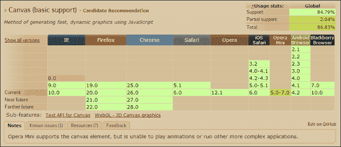

在撰写本书时，看一下前面的**Canvas**标签元素支持统计的屏幕截图，我们可以看到**Canvas**元素现在被大约 85%的浏览器支持。这个网站几乎是在开始为项目创建初始技术大纲时必不可少的。只要稍微了解一些 HTML5 中可能在项目中使用的功能，你就可以简单地跳转到[`caniuse.com`](http://caniuse.com)并确定你的最终用户需要使用什么来正确查看你的内容。

[`html5readiness.com`](http://html5readiness.com)是一个很好的 HTML5 项目的示例，因为该网站使用了来自[`caniuse.com`](http://caniuse.com)的数据，以便以易于查看的单页交互式图形显示 HTML5 的**准备情况**。

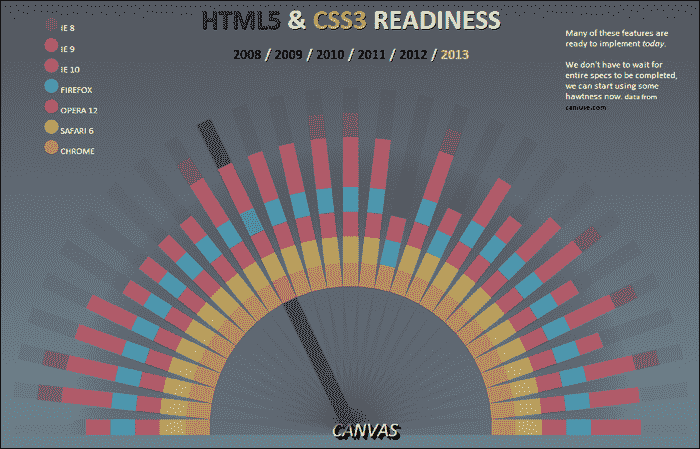

这可以是一个很好的资源，就像[`caniuse.com`](http://caniuse.com)一样，但是你的客户或设计师可能更喜欢它，因为它易于使用，并且支持功能的时间线可视化。

了解全球浏览器支持的概况是一个很好的资源，但是如果你对你的电脑上使用的浏览器的规范和统计数据感兴趣，可以前往[`html5test.com`](http://html5test.com)让该网站评估你的浏览器。

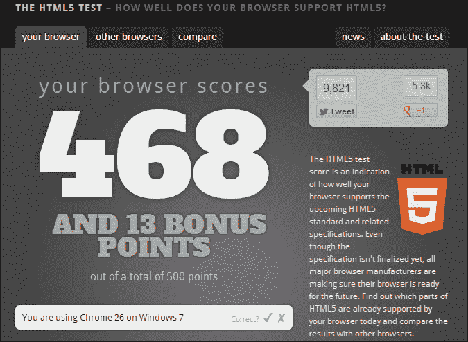

该网站生成的评分可以作为该网站测试你的浏览器的所有 HTML5 功能的概览。在结果页面向下滚动，你会找到每个被测试功能的完整概述，以及它是否通过了测试。

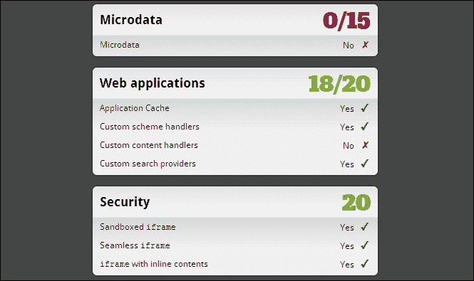

这些易于使用的工具都可以免费在线访问，让你可以轻松获取所有数据，以便正确规划和概述你的 HTML5 应用。请记住，随着新浏览器的发布和当前版本的更新，这些数据将继续发展。你甚至可能会发现，在项目开发初期参考的一些数据在你完成时已经发生了变化。因此，在开发过程中测试项目的浏览器兼容性总是值得额外的努力。

### 提示

一定要查看移动浏览器的 HTML5 测试，网址是[`html5test.com/results/mobile.html`](http://html5test.com/results/mobile.html)。在那里，你可以轻松找出当前哪些移动设备最好地支持你的 HTML5 应用所使用的功能，以及整个 HTML5 规范。这个资源在购买下一个手机或平板电脑时也会非常有帮助。

# 客户端测试

随着支持 HTML5 的移动和桌面设备数量呈指数增长，开发人员需要在各种不同的设置上测试应用程序或网络内容的需求也在增加。不幸的是，花费在所有这些设备上设置测试环境所需的时间可能会非常快速。为了在测试阶段节省大量时间，你可能会对查看[`www.browserstack.com`](http://www.browserstack.com)感兴趣。

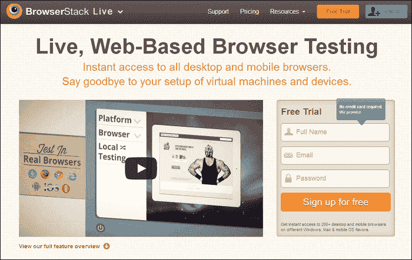

注册 BrowserStack 后，你可以轻松地从该服务中访问所有现代桌面和移动浏览器。与必须独立配置每台机器和浏览器不同，BrowserStack 已经为你做好了所有的艰苦工作，只需提供预先配置了开发工具的特定浏览器的访问权限。BrowserStack 是一个付费服务，但如果你感兴趣，也可以获得免费试用。我个人建议至少手动进行一次这种类型的测试，以便看看你能否证明使用这样的服务的成本。如果你是那种在地下室有 10 台电脑的人，那么请设置自己的测试环境。你也可以在开发电脑上设置多个虚拟机，以便你可以从一台电脑上打开和关闭你的测试机器。无论你如何做，通常只是时间的问题，你会厌倦花费无数小时来维护你的测试环境，而 BrowserStack 等服务可能是最终的解决方案。

## 浏览器 Nightly 版本

如果您真的在挑战 HTML5 的极限，测试您的内容在将要查看您网站的所有预期浏览器的最新版本上可能是一个明智的决定。对于像 Internet Explorer 这样的私人开发的浏览器，您将不得不等待微软发布或预发布下一个版本，但对于像 Google Chrome（[`www.google.com/intl/en/chrome/browser/`](https://www.google.com/intl/en/chrome/browser/)）或 Mozilla 的 Firefox（[`www.mozilla.org/en-US/firefox/new/`](http://www.mozilla.org/en-US/firefox/new/)）这样的开源浏览器，您可以下载 Nightly 或积极开发的软件版本，以了解下一个版本的方向。


Google Chrome 浏览器的 Nightly 版本被称为 Canary 版本，可以在[`www.google.ca/intl/en/chrome/browser/canary.html`](https://www.google.ca/intl/en/chrome/browser/canary.html)找到。从前面项目网站截图的标语中可以看出，这个 Chrome 版本是绝对最新的，并且在前面明确警告了其可能的不稳定性。值得记住的是，您可以安全地在计算机上安装标准版本的 Google Chrome 以继续正常使用。Canary 版本可以随时打开，并且预设为在 Google 发布新版本供公众使用时从其分发服务器上自动更新。

当然，正如前面提到的，Mozilla 也有他们自己的 Firefox Nightly 版本可供下载，网址是[`nightly.mozilla.org`](http://nightly.mozilla.org)。

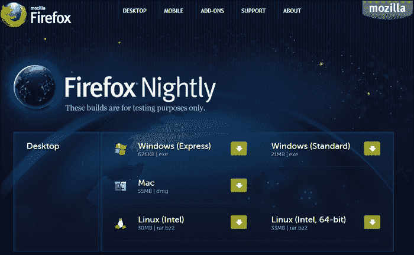

Firefox 的 Nightly 版本目前提供了桌面和移动版本的网络浏览器，并且可以轻松地与您计算机上现有的稳定版本的 Firefox 并存。使用这些流行网络浏览器的开发版本不仅可以让您在即将推出的软件上测试您的代码，而且还可以让您深入了解一些新的令人兴奋的功能，这些功能一般公众可能要等到下一个稳定版本才能使用。

那么，真的值得在这些浏览器上进行测试吗？实际上，没有人真正使用这些浏览器吗？嗯，对于可能在互联网上不受更新或补丁影响的应用程序来说，提前进行开发确实可以带来回报。如果您没有注意到您的 HTML5 网络应用程序在您发布应用程序几个月后发布的浏览器中无法工作，那可能是一件非常糟糕的事情。此外，花时间与这些新的网络浏览器一起将使您更加了解和熟悉在开发应用程序时可以利用的功能。您将开始更多地了解特定浏览器的开发和发布周期的内部工作。

## WebRTC

利用媒体输入，如摄像头和麦克风，在您的 HTML5 应用程序中的使用达到了历史最高水平，WebRTC 已经提供了解决这个问题的解决方案。WebRTC 项目目前得到 Google、Mozilla 和 Opera 的支持，项目网站可以在[`www.webrtc.org`](http://www.webrtc.org)找到。从 Flash 开发者的角度来看，使用网络摄像头和麦克风而无需第三方插件的概念应该让您对 HTML5 开发更加兴奋。WebRTC 已经开始为 HTML5 开发者带来的功能将 HTML5 的极限推向了与 Flash 更加接近的地步。

### 提示

如果您有在线朋友，并且想测试一个简单的 WebRTC 网络摄像头聊天应用程序，请转到[`apprtc.appspot.com`](http://apprtc.appspot.com)并连接到将返回用户 ID 的服务器。将该 ID 与站点的 URL 一起发送给朋友，并在纯 HTML5 音频和视频聊天中在线连接到彼此。

由于 WebRTC 仍然是一个非常新的规范，目前仅有一些现代浏览器支持它，而且不幸的是，对于开发人员来说，每个浏览器的支持方法都有些不同。任何使用 WebRTC 的开发人员应该做的初始步骤是检查当前浏览器是否支持此功能。可以使用一些 JavaScript 函数来完成这个任务，比如以下代码片段：

```html
function hasGetUserMedia() {
  return !!(navigator.getUserMedia || 
            navigator.webkitGetUserMedia ||
            navigator.mozGetUserMedia || 
            navigator.msGetUserMedia
          );
}
```

正如您所看到的，与 JavaScript 中的用户媒体对象元素交互的方法从`getUserMedia`到`msGetUserMedia`都不同，具体取决于尝试加载它的 Web 浏览器的类型。通过将查找用户媒体对象的所有方法条件化为一个单一的返回语句，这个函数将返回用户媒体对象（如果浏览器支持），或者如果没有找到任何内容，则返回 false。将这个`hasGetUserMedia`函数应用到 HTML5 项目中后，如果可用，我们可以轻松地将函数调用应用到进一步的代码中，将用户的网络摄像头视频流应用到网页上。

```html
var video = document.getElementById('camera');
if(hasGetUserMedia()) {
  navigator.webkitGetUserMedia(
{
audio: true, 
video: true
}, function(stream) {
video.src = window.URL.createObjectURL(stream);
      }, onConnectionFail);
} else {
      alert('WebRTC is not supported!');
}
```

这个代码示例的初始行将 ID 为`camera`的元素应用到变量`video`上。HTML 文档中的这个元素实际上是一个视频标签元素，看起来像下面这样：

```html
<video id="camera" autoplay></video>
```

您可能还记得，视频元素可以通过 CSS3 属性进行样式设置，为显示网络摄像头视频提供了大量的设计选项。因此，让我们将这些与 WebRTC 相关的代码片段扩展为一个带有一些 CSS3 样式的工作示例。我们将从创建初始的 HTML 页面开始，以在 Web 浏览器中显示。

```html
<!DOCTYPE html>
<html lang="en">
  <head>
    <meta charset="utf-8" />
    <title>Web RTC Demo</title>
    <style>
      .grayscale {
        -webkit-filter:grayscale(1);
      }
      .sepia {
        -webkit-filter:sepia(1);
      }
      .blur {
        -webkit-filter:blur(10px)
      }
    </style>
  </head>

  <body>
    <video id="camera" autoplay></video>
    <p>
      <button id="button0">Clear Styles</button>
      <button id="button1">Grayscale</button>
      <button id="button2">Sepia</button>
      <button id="button3">Blur</button>
    </p>
    <script src="img/webrtc.js"></script>
  </body>
</html>
```

在这个 HTML 页面中，我们还添加了一些简单的 CSS3 过滤器，为每个过滤器添加了唯一的类名。每个不同的 CSS 样式都附加到 HTML 文档中，并在文档的主体中有一个对应的 HTML 按钮元素。最后，我们引用将处理 WebRTC 功能的外部 JavaScript 文件，接下来我们将创建这个文件。

保存了 HTML 文件并打开一个新文件来编写我们的 JavaScript 代码，我们可以将已经查看过的代码片段附加到视频元素上，以及一些代码来附加 CSS 样式，当用户点击 HTML 页面上的按钮时。

```html
var video = document.getElementById('camera');
var clearBtn = document.getElementById('button0');
var grayscaleBtn = document.getElementById('button1');
var speiaBtn = document.getElementById('button2');
var blurBtn = document.getElementById('button3');

if(hasGetUserMedia()) {
  navigator.webkitGetUserMedia({audio: true, video: true}, function(stream) {
    video.src = window.URL.createObjectURL(stream);
  }, onConnectionFail);
} else {
  alert('getUserMedia() is not supported in your browser');
}

// Checks if the users browser has Web RTC support.
function hasGetUserMedia() {
  return !!(navigator.getUserMedia || 
            navigator.webkitGetUserMedia ||
            navigator.mozGetUserMedia || 
            navigator.msGetUserMedia
          );
}

// Called if the connection to the video stream fails.
var onConnectionFail = function(e) {
  console.log('ERROR: User Media connection failure!', e);
};

// Clear Styles
clearBtn.addEventListener('click', function() {
  video.className = '';
});

// Grayscale
grayscaleBtn.addEventListener('click', function() {
  video.classList.add('grayscale');
});

// Sepia
speiaBtn.addEventListener('click', function() {
  video.classList.add('sepia');
});

// Blur
blurBtn.addEventListener('click', function() {
  video.classList.add('blur');
});
```

正如您所看到的，这个 JavaScript 的大部分内容都在处理视频元素的 CSS 操作，而不是设置网络摄像头流。只要用户的浏览器支持，通过几行 JavaScript 代码就可以轻松地为最终用户建立 WebRTC 连接。


幸运的是，我足够聪明，添加了模糊效果来隐藏自己，就像在前面的截图中使用的例子一样。请记住，就像 Flash 中的摄像头和麦克风连接一样，流完全是用户本地的，除非您手动将该功能添加到应用程序中，否则不会发送到任何其他服务器。对于诸如多用户聊天和公共流媒体之类的应用程序，您将需要一个服务器来发送您的音频或视频流。如果您对这种 HTML5 开发感到兴奋，Node.js 将是一个完美的开始。甚至有一个专门用于处理 WebRTC 的 Node.js 包（[`npmjs.org/package/webrtc.io`](https://npmjs.org/package/webrtc.io)）可以帮助您朝着正确的方向开始。

隐私可能是一个巨大的问题，当涉及到在互联网上流式传输音频和视频而不使用 Flash Player 等第三方插件时。因此，当尝试通过 WebRTC 连接到其媒体通道时，Web 浏览器将始终提示最终用户进行批准。如果您正在开发计划利用 WebRTC 功能的 HTML5 应用程序，这是一个重要的事实需要记住。如果用户决定不启用其麦克风或网络摄像头，您的应用程序的用户体验可能会完全中断。一些浏览器（如 Google Chrome）正在采取的另一步骤是为任何具有活动媒体流的浏览器标签应用一个独特的图标，以保护您的在线安全。无论流是否将内容传送到第三方服务器或仅在本地使用，该图标始终可见。

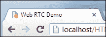

正如您在前面的截图中所看到的，当 Google Chrome 中激活了 WebRTC 并且用户正在向网站传送音频或视频时，浏览器标签会获得一个发光的红色录制图标，以提醒您流正在进行。

### 提示

如果您对了解 WebRTC 项目的起源及其在现代浏览器上的支持感兴趣，以及如何在项目中正确利用它，可以查看[`www.html5rocks.com/en/tutorials/getusermedia/intro/`](http://www.html5rocks.com/en/tutorials/getusermedia/intro/)上关于*在 HTML 中捕获音频和视频*的精彩文章。

关于 WebRTC 更令人兴奋的是技术的可能未来。正如您迄今为止在本技术概述中所看到的，目标实际上是在没有对网络的依赖的情况下使音频和视频工作。然而，还有一个目标是在 WebRTC 中启用专用数据通道，这可能会使一系列令人惊叹的新基于 Web 的技术成为可能，因为您的计算机在使用特定 Web 应用程序时可以真正充当自己的服务器。

# WebGL 支持

WebGL 和 WebRTC 一样，是许多现代桌面和移动 Web 浏览器开始看到高质量支持的新功能之一。利用客户端计算机或设备上的硬件加速图形，可以使您在开发 Flash 项目时可能使用的许多完整功能的 2D 和 3D 动画和交互成为可能。在尝试验证您所使用的浏览器是否支持 WebGL 时，最简单的验证工具可以在[`get.webgl.org`](http://get.webgl.org)找到。

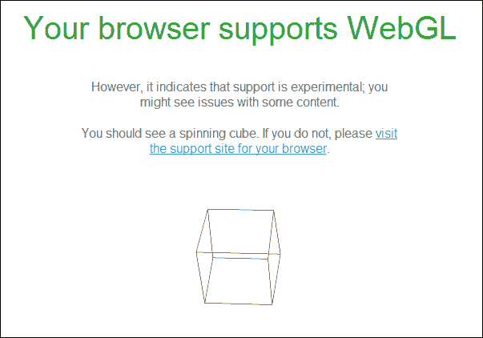

如果您的浏览器通过了 WebGL 验证测试，该网站将显示如前面的截图所示，呈现一个旋转的 3D 线框立方体，并显示结果的文本提示。当然，您可以使用[`caniuse.com`](http://caniuse.com)来检查当前支持 WebGL 的浏览器，以及查看[`www.khronos.org/webgl/wiki/Main_Page`](http://www.khronos.org/webgl/wiki/Main_Page)上的官方 WebGL 公共 wiki。

### 提示

如果您对在 HTML5 中的令人兴奋的 WebGL 世界想了解更多，请查看 Packt Publishing 网站上的*WebGL 初学者指南*（[`www.packtpub.com/webgl-javascript-beginners-guide/book`](http://www.packtpub.com/webgl-javascript-beginners-guide/book)）。

## 移动浏览器上的 WebGL

根据您正在查看的 WebGL 应用程序的强度，您可能会注意到极慢的帧速率，以及可能变得无响应的应用程序。由于 WebGL 在少数设备和浏览器上得到支持，开发社区正在慢慢地为利用这项技术的移动体验创建优化。不幸的是，大多数桌面和移动设备之间的处理能力仍然相差甚远，因此，如果打算让移动浏览器查看它们，开发人员需要优化其体验是至关重要的。

在移动设备上查看 WebGL 内容的一个很好的资源是 Three.js 项目页面，网址为[`threejs.org`](http://threejs.org)。从主页的项目和示例索引中，您可以轻松地了解一些最酷的 WebGL 示例是如何在任何设备上运行的。

### 提示

如果您对任何网络浏览器的 WebGL 功能感兴趣，可以查看[`webgl-bench.appspot.com`](http://webgl-bench.appspot.com)，这是一个在线基准测试工具，可帮助检查和显示您的 WebGL 渲染统计信息。

# 让用户找到您的作品

虽然搜索引擎索引与 HTML5 没有直接关系，但从 Flash 开发者的角度来看，这点绝对值得注意。许多搜索引擎在解析 Flash 内容以获取搜索结果方面已经变得越来越好，但归根结底，创建一个完整的 Flash 网站将需要您进行一些工作，以确保您的内容在搜索时能够正确显示。搜索引擎爬虫将更容易地读取您的 HTML5 项目，因为它们对于读取网站页面上的重要数据有更直接的方法。

随着 HTML 元素标签所能包含的内容的增长，特别是针对搜索引擎的网站上特定元素的标记，是优化您的网站搜索引擎优化的一种新颖而令人兴奋的方式。谷歌搜索引擎近年来寻找的网络内容的关键方面之一是与作者相关的内容。例如，如果您的网站上有一篇特定作者撰写的文章或作品，您可以轻松地将作者的信息作为 HTML 页面中的元数据集成进去。

当正确标记时，这不仅可以让搜索引擎轻松解析这些特定页面的内容，也可以让社交网站轻松解析。例如，考虑一些在 HTML 源代码中定义特定元素的方法：

```html
<!-- 
    Link to a Spanish version of your site, defined by the
    'hreflang' parameter.
-->
<link hreflang="es" href="index_es.html" rel="alternate">

<!-- The link to the authors website (external) -->
<link rel="author" href="https://www.johnsmith.com″>
```

在这些示例中，我们附加了`rel`和`hreflang`标签元素，以帮助预先描述链接的内容。

```html
<a rel="license" href="licensing.html">License information</a>
<a rel="next" href="index3.html">Next</a> 
<a rel="prev" href="index1.html">Previous</a>

<link rel="search" href="http://www.johnsmith.com/search.xml">

<figure id="myfigure>
  
  <figcaption>A Photo of my Cat</figcaption>
</figure>
```

虽然在开发 HTML 文档时，这些标签都不是技术上必需的，但是在您的内容中放入元数据的努力，特别是如果它将会被动态提供，很可能会导致更好的流量和搜索引擎结果排名，一旦您的网站已经发布在线。

正如前面提到的，许多社交网站，如 Google+或 Facebook，将尝试解析您的网页内容，以创建详细的链接结构指向您的网站。您可以向这些尝试读取内容的网站和系统提供更多有价值的内容和元数据，这将导致更好的链接结构和信息输出，当用户链接回您的网站时。

## HTML5 历史 API

如果您以前完全使用 Flash 构建过网站，可能已经使用过 JavaScript 库，如 SWFAddress（[`www.asual.com/swfaddress`](http://www.asual.com/swfaddress)）来模拟正常网页显示中典型的 URL 更新功能。如果您不了解这个项目，或者 URL 更新的概念，那么简单来说，当您在互联网上加载新页面时，地址栏中的 URL 会根据您正在查看的页面的位置而更改。对于典型的 HTML 网页内容，每个页面都显示在一个新的 HTML 文档中，因此可以为网站的每个部分轻松定义 URL。对于使用 Flash 构建的网站，所有内容将被编译到一个单独的 SWF 中，该 SWF 将嵌入到单个 HTML 页面中。因此，当 Flash 中的内容发生变化时，由于没有请求新页面，因此 Web 浏览器的地址栏不会发生变化。通过在 Flash 项目中包含 SWFAddress，您可以轻松通过 SWFAddress JavaScript API 发送命令，以将自定义更新附加到 Web 浏览器的地址栏。最重要的是，如果用户要点击应用程序使用的自定义 URL 之一，您可以轻松地将用户体验直接跳转到他们最初打算访问的应用程序部分。随着 HTML5 中 Canvas 元素和 AJAX 请求等功能的日益流行，许多网站在每次请求时都需要重新加载网页的需求正在减少。因此，需要类似于 SWFAddress 的系统来正确地将您的网站集成到 Web 上。

HTML5 历史 API（[`www.whatwg.org/specs/web-apps/current-work/multipage/history.html`](http://www.whatwg.org/specs/web-apps/current-work/multipage/history.html)）不仅可以控制客户端 Web 浏览器的地址栏，还可以控制许多浏览器历史记录的元素，以使浏览器的后退和前进功能继续工作。尽管一些较旧版本的流行现代浏览器不支持 HTML5 历史 API，但目前可用的绝大多数最新版本的所有浏览器似乎都支持此功能（[`caniuse.com/#feat=history`](http://caniuse.com/#feat=history)）。然而，当尝试使用任何您不确定每个用户是否支持的功能时，通常值得进行一些初始检查。要检查历史 API 的支持情况，我们可以尝试查找`history.pushState`对象的类型，该对象负责将更改写入浏览器的页面历史记录。

```html
if (typeof history.pushState === 'undefined') {
  // The HTML5 History API is Unavailable...
} else {
  // The HTML5 History API is Available!
}
```

如果一切顺利，您就可以读取和写入客户端浏览器的历史记录。Mozilla 已经对历史 API 及其用法进行了出色的概述，可以在[`developer.mozilla.org/en/docs/DOM/Manipulating_the_browser_history`](https://developer.mozilla.org/en/docs/DOM/Manipulating_the_browser_history)找到。

### 提示

要了解 HTML5 历史 API 的实际示例，请查看 HTML5 Demos（[`html5demos.com/history`](http://html5demos.com/history)）的在线演示和源代码。

关于历史 API 和搜索引擎优化，需要注意的重要因素是，当应用程序在浏览器地址栏中引用应用程序状态时，应用程序具有的自由度。为内容设置唯一的 URL 以指向特定位置和元素将有助于更容易地进行调试和生成用户统计和分析数据。

# 预制测试和基准解决方案

在之前的章节中，我们已经介绍并利用了许多现代网页浏览器开发者工具集的功能，主要是利用 JavaScript 控制台在开发过程中进行简单的输出和代码调试。许多流行的网页浏览器中预装的开发者工具集还包括许多工具，不仅允许您深入了解自己网站的结构以查找问题，还可以调试互联网上的其他网站，以了解它们的内部运作。

## 谷歌的 Web 开发工具集

谈到在浏览器中调试和分析 HTML5 内容的工具时，谷歌确实通过创建 Chrome 开发者工具([`developers.google.com/chrome-developer-tools/`](https://developers.google.com/chrome-developer-tools/))和谷歌 Web 工具包([`developers.google.com/web-toolkit/overview`](https://developers.google.com/web-toolkit/overview))迈出了重要的一步。所有这些工具结合起来可以用来进行应用程序部署之前可能需要的大部分深度调试。例如，如果您已经成功开发了自己的 HTML5 游戏，并且需要深入了解游戏的结构和流程以确定需要优化的地方，您可以通过编写每个游戏元素的测试来完成这个过程，或者您可以使用谷歌的 Speed Tracer([`developers.google.com/web-toolkit/speedtracer/index`](https://developers.google.com/web-toolkit/speedtracer/index))这样的工具。

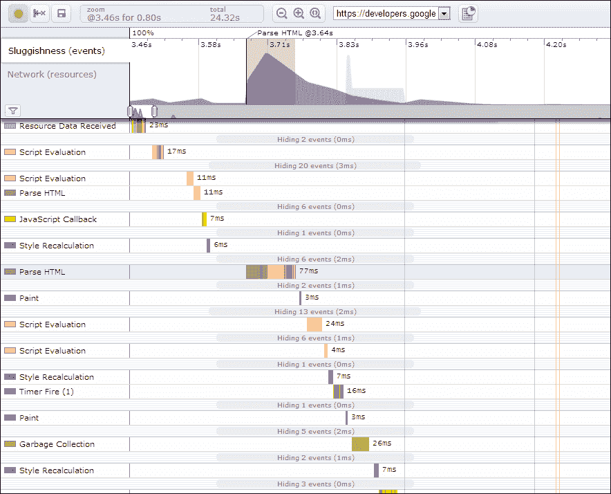

正如您在 Speed Tracer 的截图中所看到的，该应用程序成功地深入到应用程序运行时，显示了有关活动应用程序在特定计算机上实际运行方式的许多方面的统计信息。统计输出中包括加载时间、执行时间、显示时间等等。以传统方式显示内容和视频的简单网站可能不会发现使用这种深度挖掘工具的任何好处。然而，对于任何有兴趣构建强大的交互式 Canvas、WebGL 或任何其他需要调试运行时的重型计算或计算应用程序的人来说，这个工具绝对值得一试。

对于绝大多数 HTML5 开发者来说，Chrome 开发者工具是一个许多网页开发者无法离开的浏览器功能。在每个 Chrome 安装中都包含了整个工具集，您可以轻松地打开并开始使用工具来调试任何网站。从使用元素检查器检查页面元素及其相关样式，如下截图所示，到使用网络检查器显示页面在加载和运行时所做的每个内部和外部请求的加载时间，几乎您需要调试内容的一切都在一个方便的内置窗口中。

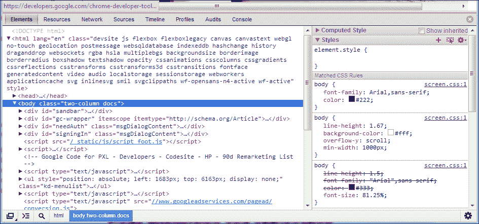

由于谷歌在过去几年里一直在极大地推广这款软件，我在这里真的不需要详细介绍它的用法。在项目网站上可以找到多个令人惊叹的视频教程，以及对应用程序功能集中的每个功能的出色文档。

### 提示

Chrome 开发者工具项目网站包含了大量视频和文本资源，帮助理解扩展能够做到的一切。一定要前往[`developers.google.com/chrome-developer-tools/docs/videos`](https://developers.google.com/chrome-developer-tools/docs/videos)查看。

随着时间的推移，你可能会发现自己在浏览网页时迅速打开和关闭这个扩展。作为开发者，HTML5 开发的一个伟大方面是当内容是公开的时候，运行它的代码也是公开的。深入研究别人是如何创建让你惊叹的网页内容是一个非常简单的方法，让你对 HTML5 技术栈非常了解。

## YSlow 网站评分

尽管我们中的许多人讨厌在学校得到成绩，但让别人给你的网站打分可能是一个非常有用的资源。YSlow（[`yslow.org`](http://yslow.org)）浏览器扩展是一个开源项目，可以添加到 Chrome、Firefox、Opera、Safari 和许多其他形式的基于 Web 的内容中。打开并激活扩展后，你可以在网页浏览器中运行当前打开的网站上的系统。在我们对[`www.packtpub.com`](http://www.packtpub.com)运行测试后，考虑一下 YSlow 扩展窗口。

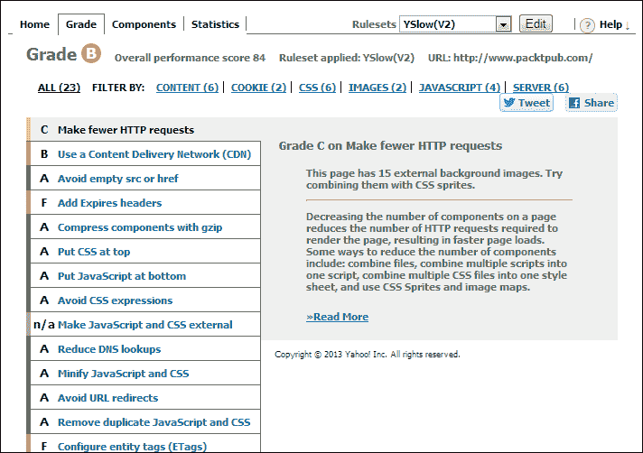

在扩展窗口的左上角，你可以看到该网站得到了 B 级的评分。现在没有关于评分构成的详细信息，这些数据实际上是没有用的。因此，为了确认评分结果，让我们深入了解为什么这个网站得到了它的评分。在评分下面的一个颜色编码列表中，你将找到 YSlow 检查的所有领域的单独测试结果。对于绝大多数测试，Packt Publishing 网站得分都非常好。然而，测试得出结论，首先，该网站可以减少 HTTP 请求，这意味着页面所包含的代码和资产过多地引用了各种外部资源。其次，测试结果还显示了过期头的不良结果。

这意味着页面上有许多资产的缓存到期时间非常遥远。这样的配置很可能会导致一些用户在页面加载期间看到实际上已经在服务器上更新的页面内容。由于某些资产的缓存时间设置得非常遥远，如果用户之前访问过你的网站，他们的网页浏览器可能不会重新请求相同的资产，认为由于缓存时间如此遥远，数据不可能发生变化。

### 提示

如果你对 YSlow 是如何做到它所做的感兴趣，一定要前往项目的 GitHub 页面了解更多（[`github.com/marcelduran/yslow`](https://github.com/marcelduran/yslow)）。

YSlow 涵盖的远不止你在上一张截图中看到的结果的简短列表。由于测试实际上只需要几秒钟，而浏览器扩展应用程序的设置允许你在几秒钟内安装它，我强烈建议下载这个扩展并测试它；不仅是在你的网页内容上，还有其他的网页内容上。

# 代码最小化和混淆

在开发完 HTML5 应用程序后，你可能会注意到对外部 JavaScript 和 CSS 文件的引用量可能有点过多。开始争取更快页面加载的最简单方法之一是将你的 JavaScript 和 CSS 源代码最小化到尽可能小的文件大小。这将允许客户端在较短的时间内通过互联网检索内容，从而使页面的其余部分完成加载。

一些 CSS 编译器，如 LESS（[`lesscss.org`](http://lesscss.org)）和 SAS（[`sass-lang.com`](http://sass-lang.com)）具有自动最小化 CSS 的能力，可以节省您在每次更新网站后都要自己记得去做这件事的麻烦。然而，如果你不使用 CSS 编译器，仍然有许多很好的方法来完成相同的任务。我个人最喜欢的在线 CSS 压缩资源之一是[`www.csscompressor.com`](http://www.csscompressor.com)。这个易于使用的 CSS 压缩器不仅可以配置执行优化 CSS 的操作，还可以控制压缩的级别。为了更好地了解这种压缩是什么样子，可以考虑以下示例 CSS 语法：

```html
#example {
  width:800px;
  height:600px;
  overflow:hidden;
  margin-right:10px;
  top:20px;
}
#example a {
  color:#FFFFFF;
  text-decoration:none;
}
#example li {
  line-height:20px;
  color:#EFEFEF;
  padding-left:20px;
}
#example .alert {
  display:none;
}
```

这些 CSS 样式没有什么特别之处，除了我们只对`#example`标签元素及其内部内容进行样式设置。这个 CSS 示例只是作为一个示例，你可能会在项目中经常看到这样的样式。当然，你的最终应用程序可能包含的 CSS 属性远远多于四个，但无论 CSS 源代码的大小如何，最终结果都将是相同的。为了简化并节省书中的空间，我们将只使用这些样式。

打开一个网络浏览器，然后转到[`www.csscompressor.com`](http://www.csscompressor.com)，我们可以将这些样式复制到网站上的大文本区域中。

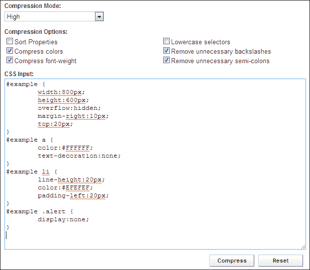

在开始 CSS 压缩之前，请注意文本输入区域上方的选项。尽管这个特定的 CSS 最小化网站只是互联网上众多免费可用的网站之一，但一般的配置属性是相同的。正如你在之前的截图中所看到的，你还可以选择**排序属性**，这将使你的 CSS 样式按照极简配置进行排序，有效地优化你的代码。最重要的是下拉选择器，它允许你选择压缩输出的压缩模式。例如，选择**高**并压缩我们的示例 CSS 将输出以下内容：

```html
#example{width:800px;height:600px;overflow:hidden;margin-right:10px;top:20px}
#example a{color:#FFF;text-decoration:none}
#example li{line-height:20px;color:#EFEFEF;padding-left:20px}
#example .alert{display:none}
```

由于我们的示例 CSS 本来就很简单，所以在配置中压缩我们的代码所做的工作量非常小。实际上，压缩器只需要删除所提供的 CSS 中的所有额外空格，并将所有元素属性放在单独的行上。这可能看起来是一种最小量的工作和输出，但事实是，压缩后的 CSS 源代码现在比最初提供的源代码小了 14.8％。对于只需几分钟的工作来说，这是一个巨大的优化量。我们甚至可以进一步选择**最高**选项作为压缩模式。选择此选项后，压缩器将把整个压缩后的 CSS 源代码放在一行上。通过这种设置，我们的文件大小再减少了 2.2％，总共减少了 16％的文件大小。

```html
#example{width:800px;height:600px;overflow:hidden;margin-right:10px;top:20px}#example a{color:#FFF;text-decoration:none}#example li{line-height:20px;color:#EFEFEF;padding-left:20px}#example .alert{display:none}
```

如前所述，这种文件压缩不仅适用于你的 CSS 源代码。这种技术实际上对 JavaScript 更有用。因为你的 JavaScript 源代码通常负责所有客户端动作，所以你的源代码大小可能会变得非常大。这些外部源代码不仅可能在文件大小上很大，而且可能还包含一些半敏感的代码，你可能希望最终用户不要知道。当然，JavaScript 不适合硬编码用户名和密码，但如果你要在 JavaScript 中编写一个游戏，你可能不希望用户找到进入下一级的方法。你可以使用 JavaScript 压缩来帮助保护你的代码隐私，但当然要记住 JavaScript 是一种客户端语言。无论你如何努力，最终用户始终可以访问你的源代码，所以在开发应用程序时要时刻记住这一点。

JavaScript 压缩在许多流行的 JavaScript 库和框架中很常见，其中许多我们在本书中已经看过。jQuery（[`jquery.com`](http://jquery.com)）库有两种不同的包，开发版和生产版。两者之间的区别在于生产版本已经压缩，准备在网上使用，而开发版本是用户友好的 JavaScript 源码，可以进一步操作。网站，比如[`www.minifyjavascript.com`](http://www.minifyjavascript.com)，是一个很好的在线资源，可以帮助你完成这个任务，包括在你的 HTML5 项目中包含的自定义 JavaScript。

# 外部依赖

随着你的 HTML5 项目变得越来越丰富，包括 jQuery 或各种 jQuery 插件等外部依赖的需求可能会同样增加。在应用程序开发周期结束时，你可能会从单个 HTML 文件中引用超过十几个外部 JavaScript 文件。尽管从人类的角度来看，将所有应用程序功能分开放在不同的文件中可能是最有利于开发的，但当要在网上发布所有这些文件时，实际上是在让最终用户的连接在尝试加载内容时做更多的工作。由于 JavaScript（或 CSS）功能的每个部分可能在不同的文件中，浏览器需要单独请求并接收文档中引用的每个文件，然后文档才能完成加载。解决这个问题的一个方法是将所有外部第三方 JavaScript 或 CSS 文件合并到一个文件中，以便 HTML 文档请求。这样只会向服务器发出一个请求，减少页面加载时间和带宽消耗。然而，在大多数情况下，你可能只想合并那些未来不打算编辑的 JavaScript 和 CSS 内容。当所有文件合并成一个文件时，当需要调试问题时，难度因素可能会增加。将自定义 JavaScript 和 CSS 保存在它们自己的文件中可以更容易地进行编辑和重新发布。

在你的网站发布一段时间后，无论你是否更新它，你的应用程序使用的依赖可能会过时。你的应用程序使用的项目的开发人员可能会在没有你的知识的情况下发布小的错误修复或整个版本更新到他们的库或框架。尽管你的应用程序应该可以正常运行，前提是之前也是如此，你可能会倾向于更新特定的插件以获得最新的功能集或安全修复。例如，如果更新了一个 jQuery 插件的版本，而你使用的 jQuery 版本要么过时要么不兼容，当尝试运行你的应用程序时，你可能会遇到各种问题。

这个问题可能很容易通过更新您网站所使用的 jQuery 版本来解决；然而，如果您使用的其他插件与最新版本的 jQuery 不兼容，那么这些插件也可能会出现问题。

正是因为这种恶性循环，我强调所有 HTML5 开发人员应该注意两件事。首先，尝试跟上您项目中使用的外部依赖的开发进展。即使您对扩展功能不感兴趣，这些项目的开发人员通常会发布安全更新和代码优化。最后，尝试花时间进行适当的研究和测试，以确定更新项目使用的任何依赖项是否会直接影响与之一起工作的其他依赖项。

# 使部署变得简单

如果您正在开发一个需要不断更新的 HTML5 网站或应用程序，您可能会有兴趣找到简化手动文件更新的方法，以便发布更新到您的 Web 服务器。手动更新特定文件到您的 Web 服务器上可能位于不同目录的 FTP 或 SFTP 连接可能会变得非常繁琐。寻找自动化任何浪费时间的过程通常是任何开发人员感兴趣的点。因此，为了您未来项目的健康，让我们来看看一些有趣的选项，可以帮助 Web 开发人员自动化从压缩代码到部署网站的许多过程。

## 使用 Grunt 创建任务

Grunt ([`gruntjs.com`](http://gruntjs.com)) 是 Web 开发领域的一个相对较新的工具，但自 2011 年推出以来一直在进行非常活跃的开发。该软件背后的概念非常简单——自动化。Grunt 在 HTML5 Web 开发人员社区取得成功的关键在于，您编写的用于执行自定义任务的脚本完全是用 JavaScript 编写的。这使得任何有 JavaScript 编写经验的人都可以创建通常使用 BASH 脚本或其他命令行部署的编程语言创建的任务。

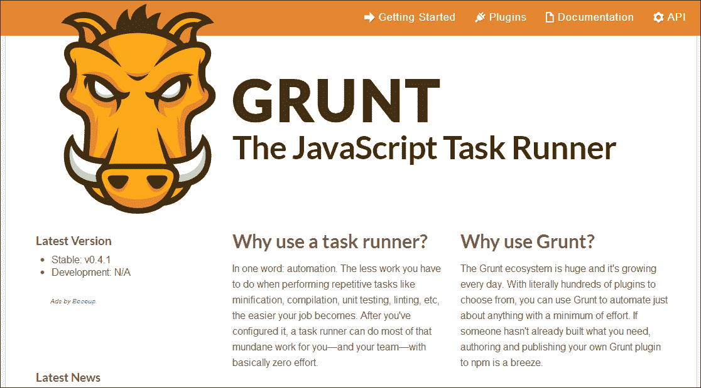

Grunt 是建立在 Node.js ([`nodejs.org/`](http://nodejs.org/)) 框架上的，并且需要在使用它的机器上安装 Node.js。由于 Grunt 与 Node.js 的关系，您可以找到插件来开始构建 Grunt 任务的基础，并以与安装 Node.js 包相同的方式安装它们。在自动部署网站源代码到 Web 服务器方面，您可能需要首先弄清楚如何通过 FTP 或 SFTP 从 Grunt 脚本代码与 Web 服务器建立连接。幸运的是，正如前面提到的，Node.js 包管理器或 NPM 系统可以通过在[`npmjs.org`](https://npmjs.org)上快速搜索 Grunt SFTP 来为您提供正确的方向。在结果中，您将找到 grunt-sftp-deploy ([`npmjs.org/package/grunt-sftp-deploy`](https://npmjs.org/package/grunt-sftp-deploy)) 插件，它将使您的 Grunt 任务能够轻松连接并将本地网站源代码部署到外部 Web 服务器上的 SFTP 连接。

### 提示

如果您对了解更多关于 Grunt 或者想在您的计算机上安装它感兴趣，请访问官方 Grunt 文档[`gruntjs.com/getting-started`](http://gruntjs.com/getting-started) 并按照*入门*教程。

实际上，当涉及到使用 Grunt 创建定制任务时，你的想象力真的是无限的。如果你发现自己一遍又一遍地做同样的任务，并希望自动化重复，无论问题是个人的还是全局的，编写一些代码来执行自动化对你来说都是一个非常好的学习经验和时间节省器。前往官方项目网站的 Grunt 插件页面（[`gruntjs.com/plugins`](http://gruntjs.com/plugins)）寻找更多关于你可以创建或利用的出色任务的灵感。

## 使用 Git 部署内容

如果你还没有使用过的话，另一个你可能会发现自己在使用的软件是 Git（[`git-scm.com/`](http://git-scm.com/)）。Git 是一个被世界各地的大型和小型项目所使用的免费开源版本控制系统。大多数开发人员无法想象一个没有使用某种版本控制软件的世界，而大多数使用版本控制软件的 Web 开发人员使用的是 Git。Git 在 Web 开发领域的成功主要不仅仅是因为它是一款如此出色和可靠的软件，还因为诸如 Github（[`github.com`](https://github.com)）和 BitBucket（[`bitbucket.org`](https://bitbucket.org)）这样的网站已经被创建出来，允许开发人员将他们的代码存储在私人或公开的仓库中。开发人员可以下载包括其他开发人员所做的所有先前编辑历史的整个代码库，而不是将代码自由分发为存档的 ZIP 文件。这也意味着，如果你对别人的代码进行了更改，他们仍然有权选择将你的编辑集成到他们的发布中。版本控制的好处可以填满一整本书，所以如果你还没有使用 Git 或其他形式的版本控制，一定要深入了解一下。

使用 Git 自动部署你的 Web 内容一开始可能有点棘手，但一旦配置好，这种设置不仅可以让你轻松地发布内容到你的 Web 服务器，还可以让任何其他可能正在开发同一应用程序的开发人员也能够这样做。Git 利用分支的概念允许开发人员在应用程序代码的自己的环境中工作，而不会干扰其他开发人员。当两个开发人员都在各自的分支中完成了对应用程序的更新后，Git 可以自动将两个分支中的编辑合并成一个文件。通过利用分支的概念，开发人员可以同意将一个特定的分支（通常是主分支）作为在应用程序 Web 服务器上部署的工作分支。如果你在 Web 服务器上附加了 Git 仓库，并从基于 Web 的脚本中调用 Git pull 命令，你的开发团队中的任何人都可以轻松地将 Git 仓库中的最新版本推送到活动 Web 服务器上，而无需通过 FTP 或 SFTP 连接并手动复制文件。

### 提示

如果你对学习更多内容或者想知道如何为你的基于 Web 的 HTML5 项目设置这种类型的解决方案感兴趣，请查看 Github 上的 git-deploy 项目（[`github.com/git-deploy/git-deploy`](https://github.com/git-deploy/git-deploy)）。

# 总结

在本章中，我们花了一些时间讨论了一些为在公共 Web 服务器上部署 HTML5 应用程序或网站做准备的常见方面。尽管没有 Web 项目的常见实践，但有许多方面，如代码和文件结构的优化，如果给予适当的时间，将使您的内容保持稳定，并将服务器请求的交付时间最小化。有时，除非您已经完成了对项目的有效用户测试，否则很难预料到问题。这种用户测试，除非您有一个团队可供使用，通常是在您的应用程序首次向公众发布时进行的。确保您的应用程序设置为报告错误或生成统计数据将减少您定位和纠正可能出现的任何问题所需的时间。甚至像将 Google Analytics（[`www.google.ca/analytics/`](http://www.google.ca/analytics/)）添加到您的网站中这样简单的添加也将使您能够查看用户可能遇到死胡同或错误请求的位置。

学习 HTML5 以及它为 Web 开发社区提供的内容是一项无止境的承诺，这将极大地有利于您作为开发人员的职业生涯。尽管仍处于早期阶段，但这个最新版本的 HTML 规范已被证明是将 Web 推向更类似应用程序基础设施的最重要方面之一。HTML5 开发世界已向来自其他语言的开发人员敞开了大门。作为一名具有 Flash 和 ActionScript 3 经验的开发人员，您不仅在学习曲线方面已经占据优势，而且每个 Flash 开发人员对多媒体及其在代码中的集成的理解将是一项宝贵的技能，您在学习过程中将不断依赖它。

最后，我想对您抽出时间阅读本书的页面表示衷心的感谢。我希望您进入 HTML5 开发的过程与我的一样愉快。过去几年涌现的令人惊叹的项目证明了围绕 HTML5 的兴奋情绪以及规范中新增的新功能。似乎每周都会有一个新的令人兴奋的框架或库出现在社区的聚光灯下。尽管项目的多样性可能很大，但可供在您的项目中利用的大量优秀的第三方内容意味着，为了做出有效的决策，您需要尽可能跟上最新动态。加入您喜欢的社交网络，找到一些与您兴趣相似的其他开发人员，并开始一个新项目，以推动您在 HTML5 中所能实现的极限。谁知道，也许我将在我的下一个项目中使用您编写的库！
