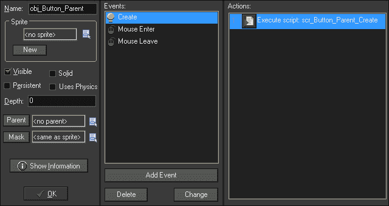
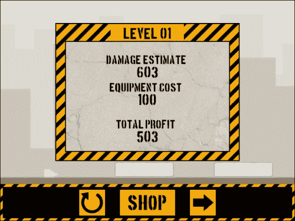

# 七、动态前端

在上一章中，我们制作了一个塔楼倒塌物理游戏，玩家可以使用 TNT、破坏球和磁力起重机来摧毁由玻璃、木头和钢柱组成的塔楼。在本章中，我们将通过实现商店、分数屏幕和关卡介绍对话框来构建这个游戏。我们还将对 HUD 进行返工，以便只有可用的设备才能用于实施倒计时，并添加用于重新启动水平仪和前往车间的按钮。为了完成所有这些，我们将花一些时间研究用于存储信息和使用全局变量的数组和数据结构。

# 设置房间

在上一章中，我们建造了两个房间`Level_01`和`Level_12`，用于测试 HUD 和游戏难度。我们现在需要为这两个楼层之间的所有楼层提供房间，并为前端、商店和楼层选择提供一些额外的房间：

1.  为从`Level_02`到`Level_11`的每一层创建一个新房间。按如下方式设置房间的大小：
    *   `Level_02`-`Level_04`设置为**宽度**：`640`和**高度**：`480`
    *   `Level_05`-`Level_08`设置为**宽度**：`960`和**高度**：`720`
    *   `Level_09`-`Level_11`设置为**宽度**：`1280`和**高度**：`960`
2.  每个房间需要在**物理**选项卡中勾选**房间为物理世界**。
3.  确保屏幕上的**视图****端口**设置为**X**：`0`、**Y**：`0`、**W**：`640`、**H**：`480`，以便每个房间都能在屏幕上正确显示。
4.  我们提供了每个级别的背景，可在`Chapter 7/Backgrounds/`中找到。确保未选中**删除背景**。
5.  每一层都应该有一个独特的塔楼，塔楼由各种柱子组成，理想情况下，塔楼的难度要比前一层高。首先，将地面向下放置在房间中，该房间需要不同的 Y 坐标，具体取决于房间的大小。Y 位置如下所示：
    *   `Level_02`–`Level_04`：**384**
    *   `Level_05`–`Level_08`：**576**
    *   `Level_09`–`Level_11`：**784**
6.  Populate the levels with one instance of `obj_Overlord` and `obj_Menu` each. Each room should look something like the following screenshot:

    

7.  一旦建立了关卡，我们就可以进入前端了。新建一个房间，在**设置**中，将其命名为`MainMenu`，宽度为`640`，高度**为`480`。将其移动到资源树中`Rooms`文件夹的顶部。**
8.  创建新背景`bg_MainMenu`并加载`Chapter 7/Backgrounds/BG_MainMenu.png`。确保未选中**删除背景**。
9.  在的**房间属性****背景**页签中，将**背景 0**设置为`bg_MainMenu`。应检查房间启动时可见的**框**。我们现在已经处理完这个房间，请点击**确定**。
10.  我们需要为前端增加两个房间：`LevelSelect`和`Shop`，并应用适当的背景。资源树中的位置无关紧要。我们现在有了比赛所需的所有房间。

## 初始化主菜单

主菜单是玩家将看到的第一个屏幕，它由两个对象组成：一个启动游戏的按钮和一个包含所有全局变量的游戏初始化对象：

1.  让我们从一个初始化游戏的对象开始。创建一个新对象并将其命名为`obj_Global`。
2.  创建一个名为`scr_Global_GameStart`的新脚本。我们将在此过程中添加代码，但现在我们只需要初始化分数：

    ```html
    score = 0;
    ```

3.  添加一个**其他****游戏开始**事件并应用`scr_Global_GameStart`。点击**确定**。
4.  重新打开`MainMenu`并将`obj_Global`的一个实例放在房间的某个地方。
5.  我们将创建几个按钮，因此让我们构建一个父对象来运行悬停状态的公共功能。创建一个名为`obj_Button_Parent`的新对象。
6.  所有按钮都将有多个动画帧用于悬停状态，因此我们需要停止播放它们。创建一个新脚本`scr_Button_Parent_Create`，并将其附加到一个**创建**事件，事件代码如下：

    ```html
    image_speed = 0;
    image_index = 0;
    ```

7.  创建一个新脚本`scr_Button_Parent_MouseEnter`，并将其附加到一个**鼠标****鼠标输入**事件，并使用代码将其更改为动画的第二帧：

    ```html
    image_index = 1;
    ```

8.  We also need to reset this by creating another new Script, `scr_Button_Parent_MouseLeave` and attach it to a **Mouse** | **Mouse Leave** event:

    ```html
    image_index = 0;
    ```

    父对象现在已完成，设置应如以下屏幕截图所示：

    

9.  接下来我们可以构建第一个真正的按钮。创建一个新的精灵`spr_Button_Start`，关闭**移除背景**并加载`Chapter 7/Sprites/Button_Start.gif`。**将**原点**居中**点击**确定**。
10.  创建一个新对象`obj_Button_Start`，并将`spr_Button_Start`应用为**精灵**。
11.  将**父**设置为`obj_Button_Parent`，使悬停状态正常工作。
12.  由于每个按钮都会做一些不同的事情，我们需要为每个按钮提供自己的点击事件。创建一个新脚本`scr_Button_Start_MousePressed`，并将其附加到一个**鼠标****左键按下**事件上，并使用以下代码进入房间`LevelSelect`：

    ```html
    room_goto(LevelSelect);
    ```

13.  This button is now complete. Place a single instance of `obj_Button_Start` into `MainMenu` near the bottom of the screen at **X**: `320` and **Y**: `416`. The Room should look like the following screenshot:

    

14.  运行游戏，确保以`MainMenu`开始，并且**开始**按钮按设计运行。

## 使用 2D 阵列选择级别

我们要建的下一个房间是`LevelSelect`。在这个房间里会有一个去商店的按钮和游戏中每个关卡的按钮，只有第一关卡在开始时解锁。当玩家前进时，按钮将解锁，玩家将可以进入所有先前的关卡。为了实现这一点，我们将为游戏中的每个关卡动态创建按钮，并使用 2D 数组存储所有这些信息。

2D 数组就像我们在书中已经使用过的数组一样。这是一个单一的静态数据列表，但它允许每行有多个值，就像电子表格一样。这是一个非常强大的工具，可供我们使用，因为它使将几个不同的元素组合在一起变得更加简单：

1.  Create a new Script, `scr_Global_Levels`, and start by initializing some global variables:

    ```html
    globalvar level, totalLevels;
    ```

    由于我们一直试图简化代码，因此可以使用另一种方法，即使用`globalvar`声明全局变量。此声明方法的功能与`global`完全相同，但它允许我们编写`level`而不是`global.level`。虽然这将为我们节省大量的击键次数，但我们需要记住，这是一个全局变量，因为它并不那么明显。

2.  Next we need to create a 2D array with one column holding the level and another with whether it is locked or not. Let's just add the first level:

    ```html
    level[0, 0] = Level_01;
    level[0, 1] = false;
    ```

    要创建二维数组，只需在括号内放置两个数字。第一个数字表示行，第二个数字表示列。这里只有一行有两列。第一列显示房间名称，第二列显示房间是否上锁；在这种情况下，`Level_01`被解锁。

3.  在 GameMaker:Studio 中使用简单数组有一个缺点，即没有确定数组大小的函数。我们需要知道这个数组的大小，以便动态创建所有按钮。我们已经创建了一个全局变量来保存级别的总量；我们只需要手动设置它的值。让我们将所有级别添加到数组中，锁定它们，并设置`totalLevels`变量。以下是所有 12 个级别的完整脚本：

    ```html
    globalvar level, totalLevels;
    level[0, 0] = Level_01;
    level[0, 1] = false;
    level[1, 0] = Level_02;
    level[1, 1] = true;
    level[2, 0] = Level_03;
    level[2, 1] = true;
    level[3, 0] = Level_04;
    level[3, 1] = true;
    level[4, 0] = Level_05;
    level[4, 1] = true;
    level[5, 0] = Level_06;
    level[5, 1] = true;
    level[6, 0] = Level_07;
    level[6, 1] = true;
    level[7, 0] = Level_08;
    level[7, 1] = true;
    level[8, 0] = Level_09;
    level[8, 1] = true;
    level[9, 0] = Level_10;
    level[9, 1] = true;
    level[10, 0] = Level_11;
    level[10, 1] = true;
    level[11, 0] = Level_12;
    level[11, 1] = true;
    totalLevels = 12;
    ```

4.  我们需要在游戏开始时初始化这个数组。重新打开`scr_Global_GameStart`并在 score 变量后执行此脚本。

    ```html
    scr_Global_Levels();
    ```

5.  让我们继续构建去商店的按钮。创建一个新的精灵`spr_Button_Shop`，关闭**移除背景**后，加载`Chapter 7/Sprites/Button_Shop.gif`。**将**原点**居中**点击**确定**。
6.  创建一个新对象`obj_Button_Shop`，并将`spr_Button_Shop`应用为**精灵**。
7.  这是一个标准按钮，因此将**父项**设置为`obj_Button_Parent`。
8.  我们需要对该对象做的最后一件事是添加一个**鼠标****左键按下**事件，并应用一个新脚本`scr_Button_Shop_MousePressed`，代码为切换室：

    ```html
    room_goto(Shop);
    ```

9.  我们将在这些按钮上绘制一些文本，这意味着我们需要引入一些字体。我们在此游戏中提供了一种称为 Boston Traffic 的字体，需要安装在您的计算机上。要在 Windows 计算机上安装此字体，请右键单击`Chapter 7/Fonts/boston.ttf`并选择**安装**。然后在提示时按照说明进行操作。
10.  回到 GameMaker:Studio，我们需要创建三种新字体：`fnt_Large`、`fnt_Medium`和`fnt_Small`。这三种字体都将有一个**字体**为`Boston Traffic`。将`fnt_Large`的**大小**设置为`20`、`fnt_Medium`设置为`16`、`fnt_Small`设置为`10`。
11.  下一步我们可以进入选择关卡的按钮。我们将动态创建这些按钮，并在每个按钮上绘制一个数字，这样我们只需要一个艺术资产。创建一个新的精灵`spr_Button_LevelSelect`，关闭**移除背景**后，加载`Chapter 7/Sprites/Button_LevelSelect.gif`。**将**原点**居中**点击**确定**。
12.  创建一个新对象`obj_Button_LevelSelect`，并将`spr_Button_LevelSelect`应用为**精灵**。这些按钮不能作为`obj_Button_Parent`的子按钮，因为它们需要具有锁定状态的能力，这将影响悬停状态。
13.  Since this button type is unique, we need to initialize some variables. Create a new Script, `scr_Button_LevelSelect_Create`, and attach it to a **Create** event.

    ```html
    isLocked = true;
    myLevel = MainMenu;
    myNum = 0;
    image_speed = 0;
    alarm[0] = 1;
    ```

    我们首先默认锁定所有按钮。我们为单击时应该进入的房间设置了默认房间，并在顶部绘制了一个数字。最后，我们停止精灵的动画制作，并为一步设置警报。

14.  We are using an alarm so that we can ensure that the levels will properly display whether they are locked or not. Create a new Script, `scr_Button_LevelSelect_Alarm0`, and attach it to an **Alarm** | **Alarm 0** event:

    ```html
    if (isLocked)
    {
        image_index = 2;
    } else {
        image_index = 0;
    }
    ```

    如果要锁定按钮，我们将精灵设置为显示锁定的帧。否则它将被解锁，我们将显示第一帧。

15.  Create a new Script, `scr_Button_LevelSelect_MouseEnter`, and apply it to a **Mouse** | **Mouse Enter** event:

    ```html
    if (isLocked)
    {   
        exit;
    } else {
        image_index = 1;
    }
    ```

    对于按钮的悬停状态，我们首先检查它是否已锁定。如果是，我们就立即退出脚本。如果它被解锁，我们将切换到悬停帧。

16.  当鼠标离开按钮时，需要应用相同的逻辑。创建另一个新脚本`scr_Button_LevelSelect_MouseLeave`，并将其应用于**鼠标****鼠标离开**事件：

    ```html
    if (isLocked)
    {   
        exit;
    } else {
        image_index = 0;
    }
    ```

17.  接下来我们将添加一个**鼠标****左键按下**事件，并添加一个新脚本`scr_Button_LevelSelect_MousePressed`，如果仅解锁，则附加代码以更改房间：

    ```html
    if (isLocked)
    {
        exit;
    } else {
        room_goto(myLevel);
    }
    ```

18.  最后，我们只需要一个新的脚本，`scr_Button_LevelSelect_Draw`，我们可以用它来绘制顶部有适当数字的按钮。将此添加到**抽签****抽签**事件

    ```html
    draw_self();
    draw_set_color(c_black);
    draw_set_font(fnt_Large);
    draw_set_halign(fa_center);
    draw_text(x, y-12, myNum);
    draw_set_font(-1);
    ```

    中

首先，我们需要绘制已应用于对象本身的精灵。接下来，我们将图形颜色设置为黑色，设置字体，并将文本居中对齐。然后，我们绘制保存在`myNum`变量中的文本，将其向下放置在 Y 轴上，使其垂直居中。由于我们将在这个游戏中绘制大量文本，我们应该通过将字体设置为`-1`值来强制字体为默认字体。这将有助于防止此字体影响游戏中的任何其他绘制字体：

1.  We are now finished with the level selection button and the properties should look like the following screenshot:

    

2.  我们现在有了级别选择屏幕所需的所有组件，我们只需要生成所有内容。为此，我们将创建一个新对象`obj_LevelSelect_Overlord`，以在进入房间时构建菜单。
3.  Add an **Other** | **Room Start** event and attach a new Script, `scr_LevelSelect_Overlord_RoomStart`, with the following code:

    ```html
    column = 0;
    row = 1;
    for ( i = 0; i < totalLevels ; i++ )
    {
        lvl = instance_create((72 * column) + 128, 80 * row + 128, obj_Button_LevelSelect);
        lvl.myLevel = level[i, 0];
        lvl.isLocked = level[i, 1];
        lvl.myNum = (i + 1);
        column++;
        if (column > 5)
        { 
            row++; 
            column = 0;
        }
    }
    instance_create(320, 440, obj_Button_Shop);
    ```

    我们首先为按钮布局所需的行和列建立变量。然后，我们从零开始运行一个循环，并对我们在全局变量`totalLevels`中声明的级别总量运行它。在这个循环中，我们首先创建一个`obj_Button_LevelSelect`实例，并在水平和垂直方向上对其进行偏移，在屏幕边缘和按钮之间添加 128 个像素的边距填充。然后我们根据`level`全局数组中的值设置按钮的`myLevel`和`isLocked`变量。接下来，我们更改`myNum`变量，以指示按钮上将绘制的数字。最后几行代码是如何限制列的数量和添加额外的按钮行。每一个循环我们增加列数，一旦超过五，我们将其重置为零。这将给我们一行六个按钮。如果我们有六个以上的按钮，将创建一个新行，可以有另外六个按钮。这意味着我们可以在以后向数组中添加级别，它们将被添加到此菜单中，并为每六个级别自动创建新行。最后但并非最不重要的一点是，我们在屏幕底部生成了一个**商店**按钮的实例。

4.  打开`LevelSelect`并在房间的某个地方放置一个`obj_LevelSelect_Overlord`实例。这就是我们所需要的，要做到这一点，请单击复选标记。
5.  Run the game. After clicking start game, you should end up in `LevelSelect` and it should look like the following screenshot. Only Level 1 is accessible at this point and the button is yellow. All the other buttons are gray, indicating that they are locked. Clicking on the button for **Level 1** will take you to that level and the **SHOP** button should take you to the Shop.

    

## 使用数据结构准备店铺

我们剩下的唯一空间是商店，玩家可以在那里购买每一关使用的装备。房间将包括每件设备的图标、价格清单和购买设备的按钮。我们还将有一个显示玩家当前拥有多少现金的显示屏，该显示屏将随着玩家的消费而更新：

1.  在构建任何东西之前，我们需要做的第一件事是建立一些常量，以使代码更易于阅读。打开**资源****定义常数**编辑器，设置设备：`TNT`：`0`、`WRECKINGBALL`：`1`、`MAGNET`：`2`的值。
2.  We will also need some constants that describe all the elements that comprise a piece of equipment. Add `SPRITE`: `0`, `OBJECT`: `1`, `AMOUNT`: `2`, and `COST`: `3`. When this is complete the settings in the editor should look like the following screenshot:

    

3.  In order to stick with the color scheme of the game we will need to create a unique yellow color that we can access globally. Create a new Script, `scr_Global_Colors`, with this code:

    ```html
    globalvar yellow;
    yellow = make_color_rgb(249, 170, 0);
    ```

    我们为我们的颜色创建一个全局变量，然后使用一个具有红、绿和蓝数量参数的函数来生成我们的特殊黄色。

4.  Open `scr_Global_GameStart` and execute `scr_Global_Colors()`.

    为了建立一个合适的车间和库存系统，我们需要比静态数组更有效地控制数据。我们需要更具可塑性和可搜索性的东西。这就是**数据结构**的用武之地。数据结构是一种特殊的动态结构，类似于数组，但能够使用特定的函数来操作数据，例如对数据进行无序排列或重新排序。GameMaker:Studio 提供了六种不同类型的数据结构，每种结构都有自己的功能和优点：

    *   **堆栈**：此结构为后进先出，表示每一条新数据都放在前一条数据之上，读取时先读取最新数据。把它想象成一堆盘子，你要用最后一个放在架子上的盘子。
    *   **队列：**这种结构是先进先出的，这意味着每一条新数据都放在前一条数据的后面，读取时，首先读取最旧的数据。想象一下商店里的排队，排队的第一个人将首先得到服务。
    *   **列表**：这个结构更灵活。在这种结构中，数据可以放在列表中的任何位置，并且可以在整个列表中进行排序、更改和搜索。把这想象成一副牌，它们可以按任何顺序排列，可以随时更改。
    *   **映射**：此结构允许使用键和值将信息存储在链接对中，尽管它不能排序，并且所有键必须是唯一的。设想一组钥匙，其中每把钥匙只打开相关的门。
    *   **优先级队列**：此结构类似于队列，但每个值都分配了一个优先级。把这想象成夜总会里的排队，在那里贵宾们有更高的优先权，可以先进来。
    *   **Grids**: This structure is the most robust and is similar to a 2D array. It has rows and columns, but it has many functions for sorting, searching, and manipulating the data. Think of a searchable airport departure schedule, where you can see all the planes, the companies, flight times, and so on, and sort it according to your preference.

        我们将从一个网格数据结构开始，因为我们需要每个项目的几行和几列信息。创建一个新脚本，`scr_Global_Equipment`并编写以下代码来构建网格：

        ```html
        globalvar equip;
        equip = ds_grid_create(3,4);
        ds_grid_set(equip, TNT, SPRITE, spr_Menu_TNT);
        ds_grid_set(equip, TNT, OBJECT, obj_Ghost_TNT);
        ds_grid_set(equip, TNT, AMOUNT, 1);
        ds_grid_set(equip, TNT, COST, 100);
        ds_grid_set(equip, WRECKINGBALL, SPRITE, spr_Menu_WreckingBall);
        ds_grid_set(equip, WRECKINGBALL, OBJECT, obj_Ghost_WreckingBall);
        ds_grid_set(equip, WRECKINGBALL, AMOUNT, 0);
        ds_grid_set(equip, WRECKINGBALL, COST, 1000);
        ds_grid_set(equip, MAGNET, SPRITE, spr_Menu_MagneticCrane);
        ds_grid_set(equip, MAGNET, OBJECT, obj_Ghost_MagneticCrane);
        ds_grid_set(equip, MAGNET, AMOUNT, 0);
        ds_grid_set(equip, MAGNET, COST, 3000);
        ```

        我们首先声明一个全局变量，然后使用它保存网格的 ID。创建网格时，我们需要声明它需要多少行和列。对于这个游戏，我们有三行设备，每个设备有四列数据。我们分别为每个网格单元设置值，因此插槽 0 是要使用的精灵，插槽 1 是要生成的对象，插槽 2 是玩家开始时的数量，最后，插槽 3 是购买成本。我们已经为每件装备做了这项工作，我们（玩家）将只使用一件 TNT 开始游戏。

5.  重新打开`scr_Global_GameStart`并调用此脚本。我们现在已将所有设备分类并准备就绪。
6.  Next we need to create an inventory for the player to track what equipment they have purchased. Since the player needs to add equipment to the inventory and will also use that equipment, we need a data structure that is easily mutable. We will use a List for this purpose. Create a new Script, `scr_Global_Inventory`, and start a List:

    ```html
    globalvar inventory;
    inventory = ds_list_create();
    ds_list_add(inventory, TNT);
    ```

    我们声明一个全局变量，然后使用它保存我们创建的列表的 ID。在游戏开始时，我们已经确定玩家将有一些 TNT，所以这就是我们在库存中所需要的。

7.  再次在`scr_Global_GameStart`中调用此脚本。以下是完整的代码：

    ```html
    score  = 0;
    scr_Global_Levels();
    scr_Global_Colors();
    scr_Global_Equipment();
    scr_Global_Inventory();
    ```

8.  现在我们已经存储了所有数据，我们可以继续构建项目菜单。我们需要创建的第一个元素是购买按钮。创建一个新的精灵`spr_Button_Buy`，关闭**移除背景**后，加载`Chapter 7/Sprites/Button_Buy.gif`。**居中**到**原点**点击**确定**。
9.  创建一个新对象`obj_Button_Buy`，并将`spr_Button_Buy`指定为**精灵**。
10.  这是一个标准按钮，因此将**父项**设置为`obj_Button_Parent`。
11.  Add a **Mouse** | **Left Pressed** event and apply a new Script, `scr_Button_Buy_MousePressed`, with the following code:

    ```html
    if (score > ds_grid_get(equip, myItem, COST))
    {
        ds_grid_add(equip, myItem, AMOUNT, 1);
        score -= ds_grid_get(equip, myItem, COST);
        if (ds_list_find_index(inventory, myItem) == -1)
        {
            ds_list_add(inventory, myItem);
        }
    }
    ```

    为了购买物品，我们首先需要检查玩家是否有足够的钱。为此，我们将`score`与我们创建的网格中保存的数据进行比较。您会注意到，我们有一个变量，`myItem`，它尚未在按钮本身中初始化。我们将在稍后生成按钮时动态创建该变量。如果玩家可以购买物品，我们会增加玩家拥有的数量，并通过物品的价格减少金钱的数量。最后，我们检查玩家当前的库存中是否已经有一些物品。如果这是其类型的第一项，我们将其添加到库存列表中。

12.  我们现在已经准备好用一个名为`obj_Shop_Overlord`的新对象生成房间中的所有东西。
13.  Add an **Other** | **Room Start** event and attach a new Script, `scr_Shop_Overlord_RoomStart`, with the code for spawning the buttons needed in the Shop:

    ```html
    for ( i = 0; i < ds_grid_width(equip); i++ )
    {
        buyButton = instance_create(512, (96 * i) + 152, obj_Button_Buy);
        buyButton.myItem = i;   
    }

    instance_create(502, 440, obj_Button_Start);
    ```

    我们首先在设备网格的每一行中运行一个循环，以便知道需要创建多少个按钮。然后，我们生成一个购买按钮，该按钮将垂直堆叠在屏幕上。接下来，我们传递鼠标按下事件中使用的`myItem`变量。我们要做的最后一件事是在屏幕右下角创建一个开始按钮，以便玩家可以返回到`LevelSelect`选项。

14.  We now have all the buttons placed, but we still need to draw all the other necessary information. Create a new Script, `scr_Shop_Overlord_Draw`, and add it to a **Draw** | **Draw** event:

    ```html
    draw_set_color(c_black);
    draw_set_halign(fa_center);

    for ( i = 0; i < ds_grid_width(equip); i++ )
    {
        draw_sprite(ds_grid_get(equip, i, SPRITE), 0, 96, (96 * i) + 152);
        draw_set_font(fnt_Small);
        draw_text(116, (96 * i) + 166, ds_grid_get(equip, i, AMOUNT));
        draw_set_font(fnt_Large);
        draw_text(300, (96 * i) + 140, ds_grid_get(equip, i, COST));    
    }
    ```

    首先，我们需要将字体颜色设置为黑色，并将文本居中对齐。然后，我们在设备网格中运行一个循环来绘制每个组件。我们首先在正确的位置绘制适当的精灵，使其与按钮对齐。在这里，我们使用一个小字体在精灵右下角的小空间中绘制玩家拥有的物品数量。然后，我们将更改为大字体并显示项目的价格。

15.  The menu is now built but it is still missing an important piece of information; how much cash the player has. Add the following at the end of the script:

    ```html
    draw_set_color(yellow);
    draw_set_font(fnt_Medium);
    draw_text(96, 416, "Cash");
    draw_set_font(fnt_Large);
    draw_text(96, 440, score);
    draw_set_font(-1);
    ```

    在本文的其余部分，我们将颜色设置为特殊的黄色。我们设置了一个中等字体来显示单词`Cash`，然后根据实际拥有的数量更改为大字体。最后，我们将字体重置为默认值。

16.  打开向上`Shop`并将`obj_Shop_Overlord`对象的单个实例放置在房间的某个位置。我们已经处理完这个房间，请点击**确定**。
17.  Run the game and go to the Shop. You won't be able to purchase anything at this point but you should see the icons, buttons, and information properly displayed. It should look like the following screenshot:

    

# 重建 HUD

游戏开发是一个迭代过程，在需要的时候加入元素，并且随着功能的实现和用户的反馈改变项目的方向，这些元素通常会重复多次。以这种方式构建一个游戏可以节省时间，因为它可以让我们快速完成任务，看到结果，并在进行过程中进行调整。在上一章中，我们重点讨论了基本游戏的功能。我们构建了一个简单的 HUD，它让我们只需点击一下就可以生成每件设备。然而，我们没有限制玩家可以使用的设备，也没有能力重新启动关卡或显示倒计时计时器，显示还剩多少时间才能清除区域。我们需要解决所有这些问题，而且我们应该允许玩家去商店，以防他们的供应不足。所有这些都可以通过以下方式完成：

1.  We will start by adding some global variables. Create a new Script, `scr_Global_Gameplay`, and declare the necessary global variables:

    ```html
    globalvar isGameActive, isTimerStarted;
    isGameActive = true;
    isTimerStarted = false;
    ```

    这里我们初始化两个变量，这两个变量是改进游戏功能所需的。变量`isGameActive`将在每个关卡开始时设置为`true`开始游戏。它还将使我们能够在关卡末尾显示信息，同时防止玩家使用菜单。`isTimerStarted`变量将用于倒计时以清除区域。

2.  打开`scr_Global_GameStart`并将其称为脚本。
3.  The Menu is also going to need some new variables. Open `scr_Menu_Create` and add the following code:

    ```html
    timer = 10;
    isTimerStarted = false;
    menuItem_Zone = 32;
    menuItems_Y = 440;
    restartX = 468;
    shopX = 564;
    tempCost = 0;
    tempScore = 0;
    startEquip = ds_grid_create(3, 4);
    ds_grid_copy(startEquip, equip);
    ```

    第一个变量是玩家倒计时的时间量。在这里，我们将给出 10 秒钟的时间来清除该区域。然后，我们将菜单的垂直位置设置为靠近屏幕底部。接下来的两个变量用于重新启动和商店按钮的水平位置。我们需要一些临时变量来保存所用装备的价值以及玩家在关卡中的收入，因为我们不想改变全局分数，除非玩家赢得关卡。最后，我们创建另一个网格并从`equip`网格复制数据，这样，如果级别重新启动，我们仍然保留原始设置。

4.  We will also want to make sure that the player is unable to play a level if they have no equipment in their inventory. If that happens we will want to automatically go to the Shop. At the very top of the script, add the following code:

    ```html
    if (ds_list_size(inventory) == 0)
    {
        room_goto(Shop);
    }
    ```

    我们检查存货的大小，如果里面什么都没有，我们就去商店。

5.  The previous draw script we used for the Menu functioned adequately for what we needed at the time. However, now that we have data structures, we can simplify the system and add new functionality. We will start by creating a new Script, `scr_Menu_Equipment`, for which we will need to accept some parameters:

    ```html
    slot = argument0;
    item = argument1;

    if (slot == 0) { myX = 40; }
    if (slot == 1) { myX = 104; }
    if (slot == 2) { myX = 168; }
    ```

    我们首先为调用此脚本时必须提供的两个参数声明两个变量。**参数**只是调用脚本或函数时传递信息的变量。在这里，我们将在菜单上放置一个插槽，并声明插槽中要显示的项目。因为我们在菜单上有一个预定的三个插槽，我们可以检查哪个插槽正在通过，并应用适当的水平偏移。

6.  Next we will add the functionality for how the Menu equipment buttons work. Add the following code:

    ```html
    draw_sprite(ds_grid_get(startEquip, item, SPRITE), 0, myX, menuItems_Y);
    if (!isActive)
    {   
        if (win_Y > menuItems_Y - menuItem_Zone && win_Y < menuItems_Y + menuItem_Zone)
        {
            if (win_X > myX - menuItem_Zone && win_X < myX + menuItem_Zone) 
            {
                draw_sprite(ds_grid_get(startEquip, item, SPRITE), 1, myX, menuItems_Y);
                if (mouse_check_button_pressed(mb_left) && ds_grid_get(startEquip, item, AMOUNT) > 0)
                {        
                    instance_create(myX, menuItems_Y, ds_grid_get(startEquip, item, OBJECT));
                    ds_grid_add(startEquip, item, AMOUNT, -1);
                    tempCost += ds_grid_get(startEquip, item, COST);
                    isActive = true;
                }
            }
        }
    }
    ```

    以前，我们对每一台设备都有类似的代码。现在我们有了数据结构，我们可以使用这些信息动态地创建所有设备。我们首先绘制从本地`startEquip`网格中提取的精灵。然后，我们检查菜单是否由于玩家试图放置项目而处于活动状态。我们检查鼠标在屏幕上的位置，看它是否在按钮上方悬停，并切换到相应的动画帧。如果点击按钮，我们创建所选项目，从网格中减去一个项目单位，将项目值添加到玩家花费的金额中，并激活菜单。

7.  We have drawn all the Equipment buttons, but we haven't displayed how many items the player has in their inventory. To fix this, add the following code to the end of the script:

    ```html
    draw_set_color(c_black);
    draw_set_halign(fa_center);
    draw_set_font(fnt_Small);
    draw_text(myX + 20, menuY + 14, ds_grid_get(startEquip, item, AMOUNT));
    ```

    我们在这里所做的就是设置颜色、文本的水平对齐方式和字体。然后我们在右下角画出每件商品的单位数量，就像我们在商店里做的那样。

8.  Now that we have the improved and simplified Equipment button code, we can go back to `scr_Menu_DrawGUI` and remove all the old clunky code. Delete all the code except for the very first line that draws the menu background. Once it has been removed, add the following code to draw the Menu:

    ```html
    if (isGameActive)
    {
        Win_X = window_mouse_get_x();
        Win_Y = window_mouse_get_y();
        for (i = 0; i < ds_list_size(inventory); i++)
        {
            scr_Menu_Equipment(i, ds_list_find_value(inventory, i));
        }
    }
    draw_set_font(-1);
    ```

    我们首先检查全局变量`isGameActive`是否为真。如果这是真的，我们得到了鼠标的屏幕位置，因此我们有正确的信息来正确放置菜单。然后，我们为玩家在清单中拥有的尽可能多的对象运行一个循环，然后执行菜单设备脚本来绘制所有按钮。在脚本的最后，我们再次将字体设置回默认值。

9.  HUD 需要的不仅仅是设备的按钮。对于这样的游戏，我们肯定需要一个按钮，让玩家重新启动的水平。让我们快速创建一个新的精灵`spr_Button_Restart`，关闭**移除背景**后，加载`Chapter 7/Sprites/Button_Restart.gif`。**居中**到**原点**点击**确定**。
10.  We do not need to create an object for this button as it is going to be drawn on the Menu. Create a new Script, `scr_Menu_Button_Restart`, and write the following code:

    ```html
    draw_sprite(spr_Button_Restart, 0, restartX, menuItems_Y);
    if (win_Y > menuItems_Y - menuItem_Zone && win_Y < menuItems_Y + menuItem_Zone)
    {
        if (win_X > restartX - menuItem_Zone && win_X < restartX + menuItem_Zone)
        {
            draw_sprite(spr_Button_Restart, 1, restartX, menuItems_Y);
            if (mouse_check_button_pressed(mb_left))
            {        
                room_restart();
            }
        }
    }
    ```

    正如我们对设备按钮所做的那样，我们首先绘制处于非悬停状态的按钮。然后检查鼠标是否悬停在按钮上，如果是，则将动画更改为悬停状态。如果单击按钮，我们将重新启动房间。

11.  重新打开`scr_Menu_DrawGUI`并在创建设备按钮的循环后调用此脚本。
12.  We also need a button to allow the player to access the Shop. We can't use the button we previously created as we need it to be drawn on the menu, not spawned in the world. Luckily, we can use its sprite so all we need to do is create a new Script, `scr_Menu_Button_Shop`, with code similar to all the other menu buttons:

    ```html
    draw_sprite(spr_Button_Shop, 0, shopX, menuItems_Y);
    if (win_Y > menuItems_Y - menuItem_Zone && win_Y < menuItems_Y + menuItem_Zone)
    {
        if (win_X > shopX - menuItem_Zone*2 && win_X < shopX + menuItem_Zone*2)
        {
            draw_sprite(spr_Button_Shop, 1, shopX, menuItems_Y);    
            if (mouse_check_button_pressed(mb_left)) 
            {        
                room_goto(Shop);
            }
        }
    }
    ```

    与之前一样，我们绘制精灵，然后检查鼠标是否悬停，确保将宽度更改为该精灵的较大尺寸。如果按下按钮，我们就去商店。

13.  再一次打开`scr_Menu_DrawGUI`并在重启按钮后立即调用此脚本。
14.  We are almost finished with the HUD, we only have one very important piece of information we still need to show the player: How much time is left. This will be done completely with text, so all we need to do is create a new Script, `scr_Menu_Clock`:

    ```html
    draw_set_color(yellow);
    if (isTimerStarted)
    {
        draw_set_font(fnt_Small);
        draw_text(320, 416,"COUNTDOWN");
        draw_set_font(fnt_Large);
        draw_text(320, 436, timer);
    } else {
        draw_set_font(fnt_Small);
        draw_text(320,416,"PRESS SPACE TO");    
        draw_set_font(fnt_Large);
        draw_text(320,436,"DESTROY")
    } 
    ```

    背景是黑色的，因此我们将使用我们为所有文本创建的黄色。如果全局变量`isTimerStarted`为真，则我们以小写字母绘制单词`"COUNTDOWN"`，并在其下方以大字体绘制剩余时间。如果`isTimerStarted`为 false，我们将以类似的方式绘制文本，以向玩家指示他们应该做什么。

15.  重新打开`scr_Menu_DrawGUI`并在商店按钮调用后调用此脚本。已完成的脚本应如以下代码所示：

    ```html
    draw_sprite(spr_Menu_BG, 0, 0, 400);
    if (isGameActive)
    {
        Win_X = window_mouse_get_x();
        Win_Y = window_mouse_get_y();

        for (i = 0; i < ds_list_size(inventory); i++)
        {
            scr_Menu_Equipment(i, ds_list_find_value(inventory, i));
        }
        scr_Menu_Button_Restart();
        scr_Menu_Button_Shop();
        scr_Menu_Clock();
    }
    draw_set_font(-1);
    ```

16.  To get the countdown started we need to activate it, which we can do in `scr_Overlord_KeyPress`. Add the following code:

    ```html
    if (!isTimerStarted)
    {
        obj_Menu.alarm[0] = room_speed;
        isTimerStarted = true;
    }
    ```

    我们检查`isTimerStarted`变量，看看它是否已经被激活，因为我们只希望它发生一次。如果计时器尚未启动，它将在一秒钟内打开菜单中的警报。

17.  The last thing we need to do to get everything to work is to open `obj_Menu` and add an **Alarm** | **Alarm 0** event with a new Script, `scr_Menu_Alarm0`, attached.

    ```html
    if (timer > 0)
    {
        timer -= 1;
        alarm[0] = room_speed;
    } else {
        obj_Overlord.alarm[0] = 1;
    }
    ```

    菜单上有一个计时器，初始化时间为 10 秒，在此警报中，我们检查是否还有剩余时间。如果有，我们将时间缩短一秒，并重新设置警报一秒钟。这将重复直到时间到期，在这种情况下，我们告诉霸王立即运行胜利条件警报。

18.  HUD 现在正在控制时间，所以我们需要从霸王中删除该功能。重新打开`scr_Overlord_Step`并删除设置报警的代码行。
19.  Run the game and play the first level. The Menu has a single Equipment button of TNT, a Restart button, and a Shop button. Once you hit spacebar, the countdown timer will start ticking down until zero. When time expires the room will either restart or go to the next room based on whether the Zone is clear or not. The game should look like the following screenshot:

    

# 给破坏增加风险和回报

到目前为止，这场游戏几乎没有什么风险或回报。我们在游戏中增加了一个商店，在那里我们可以购买物品，但我们还不能赚取任何现金。我们可以使用我们想要的任何设备，只要它在我们的库存中，这意味着不需要战略。如果玩家用完了钱或者完成了所有关卡，我们需要在屏幕上添加一个游戏。我们还需要一个得分屏幕，因为目前球员不知道他们做得有多好，所以我们也希望展示这一点。是时候添加这些功能了，首先奖励玩家积分：

1.  我们将从屏幕上的游戏开始。创建一个名为`GameOver`的新房间，并应用`bg_MainMenu`作为背景。
2.  创建一个新对象`obj_GameOver`，不附加**精灵**。
3.  在创建时，我们将创建一个变量，该变量将包含游戏结束消息，我们将设置一个警报 5 秒钟，我们将使用该警报重新启动游戏。使用以下代码创建一个新脚本`scr_GameOver_Create`，并将其附加到**创建**事件：

    ```html
    gameOverText = "You ran out of money, better luck next time!";
    alarm[0] = 5 * room_speed;
    ```

4.  添加一个**报警****报警 0**事件，然后附加一个新脚本`scr_GameOver_Alarm0`，并重新启动游戏：

    ```html
    game_restart();
    ```

5.  我们所要做的就是画出胜负声明。创建新脚本`scr_GameOver_Draw`，并将其附加到**绘制****绘制**事件

    ```html
    draw_set_color(c_black);
    draw_set_halign(fa_center);
    draw_set_font(fnt_Large);
    draw_text(320, 280, "Game Over");
    draw_set_font(fnt_Small);
    draw_text(320, 320, gameOverText);
    draw_set_font(-1);
    ```

    上
6.  如果尚未打开，请重新打开`GameOver`并将`obj_GameOver`的单个实例放置在房间的某个位置。我们现在已经完成了，可以关闭房间了。
7.  下一步我们将创建一个新对象，`obj_ScoreFloat`，显示每根柱子或碎片被摧毁时奖励的点数。
8.  Add a **Create** event with a new Script, `scr_ScoreFloat_Create`, and initialize two variables:

    ```html
    fadeOut = 0;
    alpha = 1;
    ```

    随着时间的推移，分数会逐渐淡出，因此我们有一个用于触发淡出的变量和一个用于当前设置为完全不透明度的透明度值的变量。

9.  Next we need to add a **Draw** | **Draw** event with a new Script, `scr_ScoreFloat_Draw`, to show the value on screen:

    ```html
    y -= 1;
    fadeOut++;
    if (fadeOut > 60) { alpha -= 0.05;}
    if (alpha <= 0) { instance_destroy(); }
    draw_set_color(c_black);
    draw_set_font(fnt_Small);
    draw_set_alpha(alpha);
    draw_text(x, y, myValue);
    draw_set_alpha(1);
    ```

    该对象不是物理世界的一部分，因此我们可以在每帧中手动垂直移动它。我们增加`fadeOut`变量，一旦它达到 60，我们开始少量减少`alpha`变量。一旦`alpha`达到零，我们将销毁该实例，这样它就不会占用任何内存。之后，我们设置颜色、字体和透明度值并绘制文本。`myValue`变量将在从生成它的对象创建时传递。最后，我们将透明度设置回完全不透明度；否则整个房间里的其他东西也会消失。

10.  Now that we can display the score we need to spawn it and pass a value to it. Since we already know that each Pillar and Debris has a different mass, we can use that number to award points upon its destruction. Reopen `scr_Pillar_BreakApart` and insert the following code after the shatter sound is played but before the instance is destroyed:

    ```html
    scoreFloat = instance_create(x, y, obj_ScoreFloat);
    scoreFloat.myValue = floor(phy_mass);
    obj_Menu.tempScore += scoreFloat.myValue;
    ```

    当支柱断裂时，将产生一个`obj_ScoreFloat`实例。然后，我们将显示的值设置为对象总质量的向下舍入量。最后，我们将菜单的`tempScore`增加相同的数量。

11.  我们需要小柱子和碎片来做同样的事情，所以打开`scr_Pillar_Destroy`并在相同的地方插入相同的代码。
12.  Run the game and destroy the Pillars in the first level. As each piece breaks, a number will float up signifying the value that it is worth. The floating numbers should fade out after a few seconds and should look something like the following screenshot:

    

13.  我们现在需要做的就是制作一个评分屏幕，总结损失并显示该关卡的总利润。我们将首先引入更多的精灵，`spr_Screen_BG`和`spr_Button_NextLevel`，它们都是在`Chapter 7/Sprites/`中提供的。确保不将**背景**和**中心**都移除**原点**。
14.  Let's create a new Script, `scr_Menu_Button_NextLevel`, with the functionality of this button:

    ```html
    if (isVictory)
    {
        draw_sprite(spr_Button_NextLevel, 0, nextLevelX, menuItems_Y);
        if (win_Y > menuItems_Y - menuItem_Zone && win_Y < menuItems_Y + menuItem_Zone)
        {
            if (win_X > nextLevelX - menuItem_Zone && win_X < nextLevelX + menuItem_Zone)
            {
                draw_sprite(spr_Button_NextLevel, 1, nextLevelX, menuItems_Y);
                if (mouse_check_button_pressed(mb_left))
                {
                    for(i = 0; i < totalLevels; i++)
                    { 
                        if (level[i, 0] == room)
                        { 
                            level[i+1, 1] = false;
                            room_goto( level[i+1, 0] );                        
                        }
                    }    
                }
            }
        }
    }
    ```

    我们只希望在玩家成功清除区域时出现下一关卡按钮，因此我们首先检查该按钮。如果玩家赢得了关卡，我们画出精灵，然后检查鼠标是否在上面悬停。如果鼠标悬停在按钮上方并按下按钮，我们将在关卡阵列中快速循环，查看当前所在的房间并解锁下一关卡。最后我们去了我们刚刚解锁的房间。

15.  现在我们已经准备好创建一个新对象`obj_ScoreScreen`，以显示分数屏幕。将**深度**设置为`-100`，使其始终绘制在所有其他 GUI 元素之上。
16.  Add a **Create** event with a new Script, `scr_ScoreScreen_Create` attached and initialize the following variables:

    ```html
    isGameActive = false;
    obj_Menu.isActive = true;
    isVictory = scr_WinCondition();
    screenX = 320;
    screenY = 200;
    menuItem_Zone = 32;
    menuItems_Y = 440;
    restartX = 200;
    shopX = 320;
    nextLevelX = 440;
    ```

    我们不希望播放器在这段时间内播放，因此我们关闭`isGameActive`变量并激活菜单，以便设备按钮不再起作用。接下来，我们需要检查玩家是否成功，以便知道要画什么。最后七个变量都用于放置我们将要显示的各种文本和按钮。

17.  Now to add a **Draw** | **Draw GUI** event with a new Script, `scr_ScoreScreen_DrawGUI` and we will start by drawing all the text we need:

    ```html
    draw_sprite(spr_Screen_BG, 0, screenX, screenY);

    draw_set_color(c_black);
    draw_set_halign(fa_center);
    draw_set_font(fnt_Large);
    draw_text(screenX, 60, room_get_name(room));
    draw_text(screenX, 144, obj_Menu.tempScore);
    draw_text(screenX, 204, obj_Menu.tempCost);
    draw_text(screenX, 284, obj_Menu.tempScore - obj_Menu.tempCost);

    draw_set_font(fnt_Medium);
    draw_text(screenX, 120, "Damage Estimate");
    draw_text(screenX, 180, "Equipment Cost");
    draw_text(screenX, 260, "Total Profit");
    draw_set_font(-1);
    ```

    首先我们画背景精灵。然后设置颜色、对齐方式和字体。我们使用最大的字体来绘制房间的名称，以及损失金额、使用的设备数量和总利润的值。然后，我们切换到中等字体，将每个值的描述写在对应的数字上方。我们已经绘制完文本，所以我们将字体设置回默认值。

18.  Now we just need to add the buttons into the script:

    ```html
    Win_X = window_mouse_get_x();
    Win_Y = window_mouse_get_y();
    scr_Menu_Button_Restart();
    scr_Menu_Button_Shop();
    scr_Menu_Button_NextLevel();
    ```

    就像我们使用菜单一样，我们在屏幕上获得鼠标的坐标，然后执行三个按钮的脚本。

19.  为了激活评分屏幕，我们需要重新打开`scr_Overlord_Alarm0`并让它生成`obj_ScoreScreen`的实例，而不是它当前运行的代码。删除所有代码并替换为以下代码：

    ```html
    instance_create(0, 0, obj_ScoreScreen);
    ```

20.  Run the game and finish the first level. After the timer has run out, the Score Screen appears displaying the damage, the cost, and the profit. The in-game menu has disappeared and has been replaced by three buttons for replaying the level, going to the Shop, or the next level. It should look like the following screenshot:

    

21.  There is one issue that we need to solve. While the screen says we have earned money, if we go to the Shop, there will be no cash available. This is because we haven't transferred the temporary values to the global values, which we will do in a new Script called `scr_ScoreCleanUp`:

    ```html
    with (obj_Menu)
    {
        ds_grid_copy(equip, startEquip);
        ds_grid_destroy(startEquip);
        score += tempScore - tempCost;
        for ( i = 0; i < ds_grid_width(equip); i++)
        {
            e = ds_grid_get(equip, i, AMOUNT);

            if (e == 0)
            {
                inv = ds_list_find_index(inventory, i);
                ds_list_delete(inventory, inv);
            }
        }
    }
    ```

    执行此脚本时，它将进入菜单并将剩余设备复制到全局设备值，然后从内存中删除临时网格。接下来，我们将根据游戏过程中发生的情况增加全局分数。然后，我们在库存中运行一个循环，查找玩家是否已经用完了任何物品。如果他们有，我们将其从库存中删除。

22.  如果玩家进入下一关，我们应该立即付款。我们还应该检查分数，以确保球员有钱。如果他们的钱用完了，游戏就结束了，否则他们可以进入下一个级别。重新打开`scr_Menu_Button_NextLevel`并将我们交换房间的代码行替换为以下代码：

    ```html
    scr_ScoreCleanUp(); 
    if (score < 0)
    {
        room_goto(GameOver);
    } else {
        room_goto( level[i+1, 0] );
    }
    ```

23.  If the player decides to go to the Shop, it becomes a bit trickier. The script we are calling is also used on the Menu, so we don't want it to change the data during gameplay. Reopen `scr_Menu_Button_Shop` and replace the line of code where we switch rooms with the following code:

    ```html
    if (!isGameActive) { scr_ScoreCleanUp();}
    if (score < 0)
    {
        room_goto(GameOver);
    } else {
        room_goto(Shop);
    }
    ```

    现在，只有当游戏停止时，分数才会被转移。我们也会在这里检查游戏状态的分数，以决定点击时去哪个房间。

24.  现在一切都应该正常工作了，所以运行游戏并检查以确保在游戏过程中，当你去商店时，分数不会改变。

# 每一级增加介绍性文字

我们有一个好的关卡，但玩家可能不确定该做什么。我们需要的是一个故事来宣传摧毁塔楼的想法，并解释玩家在每个关卡需要做什么。为此，我们将添加一个屏幕，非常类似于每个级别开头的分数屏幕：

1.  We will need a button to start the level, which again will need to be drawn on screen. Create a new Script, `scr_Menu_Button_Start`, with some very familiar code:

    ```html
    draw_sprite(spr_Button_Start, 0, startX, startY);
    if (win_Y > startY - start_ZoneHeight && win_Y < startY + start_ZoneHeight)
    {
        if (win_X > startX - start_ZoneWidth && win_X < startX + start_ZoneWidth)
        {
            draw_sprite(spr_Button_Start, 1, startX, startY);
            if (mouse_check_button_pressed(mb_left)) 
            {        
                isGameActive = true;
                instance_destroy();
            }
        }
    }
    ```

    所有的标准按钮代码都在这里，但是当点击按钮时，我们激活游戏，然后销毁故事屏幕对象。此处使用的`start_ZoneWidth`和`start_ZoneHeight`变量尚未初始化，但我们将很快进行初始化。

2.  Next we need all the text that we want to display for each level. For this we will want to use a Map data structure so that we can link the text to the level. Create a new Script, `scr_Global_Dialogue`, and write the dialog that we need:

    ```html
    globalvar dialogue;
    dialogue = ds_map_create();
    ds_map_add(dialogue, Level_01, "Welcome to Destruct! A tower toppling game. 
    # Let's start with some basic training. Here we have a glass tower that needs to come down. You have one stick of TNT to use to completely clear the Zone. 
    # Let's see what you can do.");
    ds_map_add(dialogue, Level_02, "Temporary Dialogue for Level 02");
    ds_map_add(dialogue, Level_03, "Temporary Dialogue for Level 03");
    ds_map_add(dialogue, Level_04, "Temporary Dialogue for Level 04");
    ds_map_add(dialogue, Level_05, "Temporary Dialogue for Level 05");
    ds_map_add(dialogue, Level_06, "Temporary Dialogue for Level 06");
    ds_map_add(dialogue, Level_07, "Temporary Dialogue for Level 07");
    ds_map_add(dialogue, Level_08, "Temporary Dialogue for Level 08");
    ds_map_add(dialogue, Level_09, "Temporary Dialogue for Level 09");
    ds_map_add(dialogue, Level_10, "Temporary Dialogue for Level 10");
    ds_map_add(dialogue, Level_11, "Temporary Dialogue for Level 11");
    ds_map_add(dialogue, Level_12, "Temporary Dialogue for Level 12");
    ```

    我们创建一个新的全局变量，并将其附加到我们创建的地图数据结构中。对于每个条目，我们需要有一个**键**和该键的**值**。在这里，我们使用每个房间的名称作为键，并将对话框作为值写入。我们需要游戏中每个房间的文本，这样它就不会出错，所以我们有 2-12 房间的临时对话框，您可以用自己的文本替换。在 Level 01 的对话框中，我们使用了`#`，这是一个用于开始新段落的特殊字符。这将使大量文本更具可读性。

3.  打开`scr_Global_GameStart`并调用此脚本。
4.  我们有所有我们需要的艺术资产，但我们确实需要一个新的对象`obj_StoryScreen`，其**深度**为`-100`。
5.  Add a **Create** event and apply a new Script, `scr_StoryScreen_Create`, to initialize the variables:

    ```html
    isGameActive = false;
    screenX = 320;
    screenY = 200;
    startY = 440;
    startX = 320;
    start_ZoneWidth = 128;
    start_ZoneHeight = 32;
    myText = ds_map_find_value(dialogue, room);
    textLength = 0;
    ```

    我们停止游戏，然后为我们将要绘制的文本的位置设置六个变量。然后，我们根据播放器当前所在的房间从地图中加载文本。我们拥有的最后一个变量`textLength`将用于库存效应，其中文本似乎随着时间的推移而输入。

6.  Next we need to add a **Draw** | **Draw GUI** event with a new Script, `scr_StoryScreen_DrawGUI`, that draws everything:

    ```html
    draw_sprite(spr_Screen_BG, 0, screenX, screenY);
    draw_set_color(c_black);
    draw_set_halign(fa_center);
    draw_set_font(fnt_Large);
    draw_text(screenX, 60, string(room_get_name(room)));

    draw_set_halign(fa_left);
    draw_set_font(fnt_Small);
    textLength++;
    writeText = string_copy(myText, 1, textLength);
    draw_text_ext(160, 120, writeText, -1, 320);
    draw_set_font(-1);

    win_X = window_mouse_get_x();
    win_Y = window_mouse_get_y();
    scr_Menu_Button_Start();
    ```

    正如我们对分数屏幕所做的那样，我们绘制背景，并为关卡标题设置颜色、对齐方式和字体。接下来是显示在屏幕上的对话框的打印效果。我们更改对话框的对齐方式和字体，并开始将`textLength`变量每增加一步。此值决定需要将对话框中的多少字符复制到`writeText`变量，这意味着文本将随时间增长。我们使用的是`draw_text_ext`函数，它允许我们在段落落下一行之前限制段落的宽度，在本例中为 320 像素。最后，我们再次获得开始按钮工作的鼠标位置。

7.  留给我们做的就是在`scr_Overlord_Create`：

    ```html
    instance_create(0, 0, obj_StoryScreen);
    ```

    中生成一个故事屏幕实例
8.  Run the game and go to the first level. The story screen appears and the dialog starts appearing one letter at a time and should look like the image below. When the **START** button is clicked, the gameplay starts as usual.

    

# 保存玩家的进度

游戏中的波兰语并不总是关于视觉装饰。有时，它还需要添加一些小的功能，这些功能不会立即被注意到，但可以极大地改善整体体验。目前游戏看起来不错，玩得也不错，但如果我们关闭浏览器，稍后再回来玩，我们需要重新开始。现在的球员希望他们能回到比赛中，从他们离开的地方继续比赛。为了做到这一点，我们需要保存玩家的进度。

## 了解本地存储

当游戏需要保存数据时，唯一可行的选择是将数据写入游戏本身之外的文件。这对基于网络的游戏来说是一个潜在的问题，因为任何需要下载的文件都需要用户明确允许。这意味着玩家将知道文件的名称和位置，这反过来意味着他们可以轻松破解自己保存的文件。为了克服这一障碍，HTML5 提供了一种称为**本地存储**的解决方案。

本地存储允许网页或嵌入网页的游戏在浏览器本身内保存数据。这类似于 internet cookie，但其好处是更快、更安全，并且可能能够存储更多信息。由于该数据保存在浏览器中，因此不会通知用户正在创建或访问的文件；他们无法轻松查看数据，只能从创建数据的域访问数据。这使得它非常适合保存我们的游戏数据。

### 注

只有两种方法可以清除保存的数据。覆盖数据或清除浏览器的缓存。建议您始终在专用浏览器模式下测试游戏，以确保保存系统正常工作。

## 写入本地存储器

对于这个游戏，我们将保存与解锁等级、应计现金金额和购买设备相关的所有相关数据。为了保存游戏数据，我们需要写入一个文件。GameMaker:Studio 有两种文件格式可以处理 HTML5 游戏：**文本文件**和**Ini 文件**。文本文件对于读取或写入大量数据非常有用，并且可以以您选择的任何方式进行结构化。Ini 文件用于较小的数据量，并使用**节/键/值**结构。此结构将数据分为单独的部分，每个部分中都有键/值对，如下所示：

```html
[section]
key = value
[playerData]
playerFirstName = Jason
playerLastName = Elliott
```

本地存储要求所有数据都是键/值对，因此我们将使用 Ini 文件系统。使用文本文件系统是可能的，但对于我们需要保存的少量数据和需要的额外编码量来说，这不是非常有益的：

1.  The first thing any save system needs to do is to create a save file with the appropriate structure and settings desired. Create a new Script, `scr_GameSave`, and write the following code:

    ```html
    theFile = argument0;
    ini_open(theFile);
    ini_write_real("Score","Cash", score);
    for (i = 0; i < totalLevels; i++)
    {
        ini_write_string("Levels", string("Level_" + i), level[i, 1]);
    }
    for ( j = 0; j < ds_grid_width(equip); j++ )
    {
        ini_write_real("Equipment",string("Equip_" + j), ds_grid_get(equip, j, AMOUNT));
    }
    ini_close(); 
    ```

    当我们执行这个脚本时，我们需要将文件名作为参数传递。然后，我们可以打开请求的文件，或者如果找不到，将创建该文件以打开。一旦文件打开，我们就可以写入所有必要的数据。我们首先写入一个`Score`部分，用一个名为`Cash`的键来设置 score 的值。我们使用级别数组运行一个循环，并在`Levels`部分存储每个级别以及它是否已解锁。接下来，我们运行另一个循环，这一次通过设备网格，并记录玩家当前在游戏中拥有的每个项目的数量。最后，在写入所有数据后，我们关闭该文件。

2.  Saving a game is only useful if we actually load the data into it. Create a new Script, `scr_GameLoad`, so we can read from the file.

    ```html
    theFile = argument0;
    if (!file_exists(theFile)) 
    {
        scr_GameSave(theFile); 
    } else {
        ini_open(theFile);
        score = ini_read_real("Score","Cash", "");
        for (i = 0; i < totalLevels; i++)
        {
            level[i, 1] = ini_read_string("Levels", string("Level_" + i), "");
        }
        for ( j = 0; j < ds_grid_width(equip); j++ )
        {
            ds_grid_set(equip, j, AMOUNT, ini_read_real("Equipment",string("Equip_" + j), ""));
            if (ds_list_find_index(inventory, j) == -1 && ds_grid_get(equip, j, AMOUNT) > 0)
            {
                ds_list_add(inventory, j);
            }
        }   
        ini_close();
    }
    ```

    我们首先检查通过参数传递的文件是否存在。如果在本地存储中找不到该文件，例如第一次运行游戏时，我们将运行 save 脚本来初始化这些值。如果找到文件，我们打开保存文件，并在保存数据的同时将数据读取到游戏中。我们设置分数，解锁相应级别，然后加载设备。我们还对库存进行了检查，以确保所有设备都可供玩家使用。

3.  We will want to load any game data at the start of the game. Open `scr_Global_GameStart` and add the following code at the end of the script:

    ```html
    globalvar saveFile;
    saveFile = "Default.ini";
    scr_GameLoad(saveFile);
    ```

    我们为文件名创建一个全局变量，以便以后可以轻松保存数据。然后将字符串传递给加载脚本。这段代码必须在脚本的末尾，因为我们需要先初始化网格和数组的默认值。

4.  最合理的开始保存游戏的地方是在玩家完成每一关之后。打开`scr_ScoreCleanUp`并在最后一个括号前插入对`scr_GameSave`的调用。整个脚本如下所示：

    ```html
    with (obj_Menu)
    {
        ds_grid_copy(equip, startEquip);
        ds_grid_destroy(startEquip);
        score += tempScore - tempCost;
        for ( i = 0; i < ds_grid_width(equip); i++)
        {
            e = ds_grid_get(equip, i, AMOUNT);

            if (e == 0) 
            {
                inv = ds_list_find_index(inventory, i);
                ds_list_delete(inventory, inv);
            }
        }
        scr_GameSave(saveFile);
    }
    ```

5.  当玩家在商店购买设备时，我们还需要保存游戏。打开`scr_Button_Buy_MousePressed`并在最后一个括号之前插入对`scr_GameSave`的调用。
6.  保存游戏并玩前几个关卡。完成几个级别后，刷新浏览器。您应该看到，您的所有现金、设备和解锁级别保持不变。

## 保存多个游戏档案

我们现在有一款可以保存玩家进度的游戏，但是如果他们想重放游戏，就无法清除数据。正如我们已经提到的，删除数据的唯一选项是让用户清除浏览器缓存或覆盖数据，这两种选项都有缺点。大多数用户不希望清除缓存，因为缓存将删除本地存储中的所有数据，而不仅仅是游戏数据。如果多人希望在同一浏览器中玩游戏，则覆盖数据是有问题的。只有一个保存文件变得毫无意义。我们有第三种选择，即我们根本不清除数据，而是创建可以随时加载的其他保存文件。我们当前的保存/加载系统已经为我们提供了多个用户配置文件，我们只需要添加一个输入系统来捕获用户的名称。我们将保持系统相当简单，将其放在前端，并将用户名限制为最多 8 个字符。当播放器单击开始按钮时，它将在切换房间之前加载正确的配置文件：

1.  我们将首先为玩家的名字添加一个全局变量。打开`scr_Global_GameStart`，初始化`playerName`变量，并在脚本末尾将其设置为空字符串。

    ```html
    globalvar playerName;
    playerName = "";
    ```

2.  我们需要创建一个新对象，`obj_NameInput`，用于跟踪玩家的输入。它不需要精灵，因为我们将在屏幕上绘制文本。
3.  添加一个带有新脚本`scr_NameInput_Create`的**创建**事件，以初始化字符串长度和键入字符数的变量。

    ```html
    nameSpace = 0;
    nameMax = 8;
    ```

4.  接下来我们将添加一个**Draw****Draw**事件，并添加一个新脚本`scr_NameInput_Draw`，用于在键入时绘制玩家的名字，以及一个简单的指令，告诉玩家键入他们的名字：

    ```html
    draw_set_color(c_black);
    draw_set_halign(fa_center);
    draw_set_font(fnt_Small);
    draw_text(320, 280, "Type In Your Name");
    draw_set_font(fnt_Large);
    draw_text(320, 300, playerName);
    draw_set_font(-1);
    ```

5.  Now that we have everything displayed on screen we need to gather the keyboard input. Add a **Key Press** | **Any Key** event and attach a new Script called `scr_NameInput_KeyPressed`.

    ```html
    if (nameSpace < nameMax) 
    {    
        if (keyboard_key >= 65 && keyboard_key <= 90) 
        {
            playerName = playerName + chr(keyboard_key);
            nameSpace++;
        }
    }
    ```

    我们只希望名称最多为八个字母，因此首先检查当前名称中是否还有可用的空间。如果我们可以输入另一个字母，那么我们会检查正在按下的键是否是字母。如果一个字母被按下，我们会将该字母添加到字符串的末尾，然后表示已经使用了另一个空格。

6.  If we ran the game now we would be able to enter letters, but we have no ability to undo any letters. We can fix that with the following code:

    ```html
    if (keyboard_key == vk_backspace) 
    {  
        lastLetter = string_length(playerName);
        playerName = string_delete(playerName, lastLetter, 1)
        if (nameSpace > 0)
        {
            namespace--;
        }
    }
    ```

    如果用户按下*backspace*，我们会抓取字符串的长度，找出字符串的最后一个空格在哪里。一旦我们知道了这一点，我们就可以删除字符串末尾的字母。最后，我们检查是否还有剩余的字母，如果有，将空间数减少 1。这是必要的，这样我们就不会进入负空间。

7.  打开`MainMenu`并将`obj_NameInput`的单个实例放在房间的某个地方，位置无关紧要。
8.  Save and play the game. In the front end you should be able to enter a name of up to eight letters and by clicking backspace, delete all those letters. It should look like the following screenshot:

    

9.  保存系统现已完成；剩下要做的就是在播放器点击**开始**按钮时加载数据。由于我们使用商店中的**开始**按钮以及主菜单，我们需要进行检查，以确保我们仅在游戏开始时加载游戏数据。打开`scr_Button_Start_MousePressed`并在房间变更前添加以下代码：

    ```html
    if (room == MainMenu)
    {
        saveFile = string(playerName + ".ini");
        scr_GameLoad(saveFile);
    }
    ```

10.  保存并玩游戏。用你的名字玩游戏，完成几个关卡。然后刷新页面并输入其他名称。到达标高选择时，只有第一个房间可用。
11.  再次刷新浏览器并再次使用您的姓名。这一次，当您进入关卡选择时，您应该会看到所有未锁定的关卡。保存系统工作！

# 总结

干得好！在本章中，我们添加了一个完整的前端，包括一个商店和可解锁的关卡，从而真正完善了游戏体验。我们学会了使用网格、地图和列表数据结构来保存各种信息。我们重建了 HUD，这样我们可以显示更多的按钮，只显示可用的设备，并建立了一个基本的倒计时计时器。我们创建了一个记分屏幕，向玩家展示他们在关卡中的表现。我们还在每一层的前面创建了一个介绍性屏幕，它利用了一个简单的打字机效果，向我们展示了如何操作字符串。最后，我们添加了一个保存系统，它教会我们如何使用本地存储，并允许我们进行多个玩家保存！

总的来说，我们把游戏从一个可玩的原型变成了一个完全充实的游戏，有开始和结束，有大量的风险和回报。在下一章中，我们将继续完善这个游戏，通过观察粒子效果，并将它们添加到支柱和碎片破坏中。让我们继续吧！