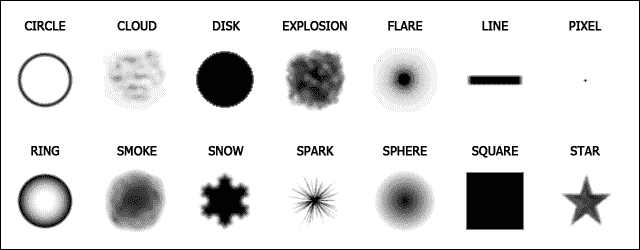
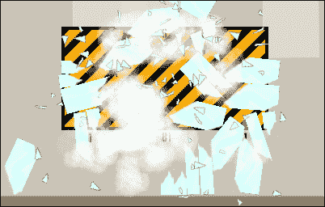
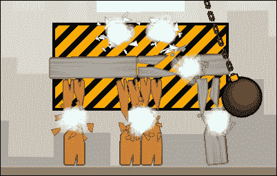
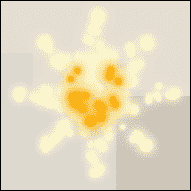
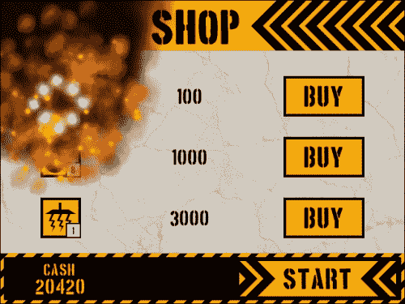

# 八、玩转粒子

在过去的两章中，我们利用关节、固定装置和力构建了一个健壮的基于物理的游戏。然后我们添加了一个完整的前端，玩家可以在那里购买设备和解锁关卡。我们还更新了抬头显示器（HUD），并实施了介绍屏幕和评分屏幕，以完善每个级别。这感觉就像一场完整的比赛，但缺少了一些东西。TNT 闪烁着消失了，柱子的断裂突然出现在眼前。在本章中，我们将通过在游戏中添加一些粒子效果来解决这个问题，以帮助掩盖这些变化。经过这一点点的润色，我们的游戏就可以发布了！

# 引入粒子效应

粒子效果是游戏中用来表现动态和复杂现象的装饰花饰，如火、烟和雨。要创建粒子效果，需要三个元素：一个**系统**、**发射器**和**粒子**本身。

## 了解粒子系统

粒子系统是粒子和发射器所在的宇宙。就像宇宙一样，我们无法定义大小，但我们可以定义一个原点，所有发射器和粒子都将相对于该原点放置。我们也可以在任何给定的时间存在多个粒子系统，可以设置这些系统来绘制不同深度的粒子。虽然我们可以拥有我们想要的尽可能多的粒子系统，但为了防止可能的内存泄漏，最好是拥有尽可能少的粒子系统。原因是，一旦粒子系统被创建，它将永远存在，除非它被手动销毁。销毁产生它的实例或更换房间不会删除系统，因此请确保在不再需要它时将其删除。通过破坏粒子系统，它将移除该系统中的所有发射器和粒子。

## 利用粒子发射器

粒子发射器是系统内定义的区域，粒子将从中产生。有两种类型的发射器可供选择：**突发**发射器一次性产生粒子，以及**流**发射器随时间不断喷出粒子。我们可以为每个发射器定义空间区域的大小和形状，以及粒子在区域内的分布方式。


在空间中定义区域时，有四个**形状**选项：菱形、椭圆、直线、矩形。在前面的图表中可以看到每种方法的一个示例，所有方法都使用完全相同的尺寸、粒子数量和分布。虽然使用这些形状中的任何一个都没有功能上的区别，但是效果本身可以从正确选择的形状中受益。例如，只有一条线可以使效果看起来倾斜 30 度。


粒子的**分布**也会影响粒子如何从发射器中排出。如上图所示，有三种不同的分布。**线性**将在整个发射器区域产生均匀随机分布的粒子。**高斯**将产生更多朝向区域中心的粒子。**INVGAUSSIAN**是高斯的倒数，其中粒子将在更靠近发射器边缘的位置繁殖。

## 涂抹颗粒

粒子是从发射器生成的图形资源。可以创建两种类型的粒子：**形状**和**精灵**。形状是 GameMaker:Studio 内置的 64 x 64 像素精灵的集合，用作粒子。如下图所示，这些形状适用于大多数最常见的效果，如烟花和火焰。当想要为游戏创建更专业的东西时，我们可以使用资源树中的任何精灵。



通过调整可用的许多属性，我们可以对粒子执行很多操作。我们可以定义它的寿命范围、颜色以及移动方式。我们甚至可以在每个粒子的死亡点产生更多的粒子。然而，有些事情我们不能做。为了降低图形处理成本，无法在效果中操纵单个粒子。此外，粒子无法以任何方式与对象交互，因此无法知道粒子是否与世界中的实例碰撞。如果我们需要这种控制，我们需要构建对象。

### 注

设计粒子事件的外观通常是一个反复试验的过程，可能需要很长时间。要加快速度，请尝试使用 Internet 上提供的众多粒子效果生成器之一，如此处找到的警报游戏《粒子设计器 2.5》：[http://alertgames.net/index.php?page=s/pd2](http://alertgames.net/index.php?page=s/pd2) 。

## HTML5 的局限性

使用粒子效果确实可以提高游戏的视觉质量，但当开发一款打算在浏览器中玩的游戏时，我们需要小心。在实现粒子效果之前，了解我们可能遇到的潜在问题非常重要。围绕粒子的最大问题是，为了平滑地渲染粒子而不产生任何延迟，需要使用图形处理器而不是主 CPU 来渲染粒子。大多数浏览器都允许通过名为**WebGL**的 JavaScript API 实现这一点。然而，它不是 HTML5 标准，微软表示，在可预见的未来，他们没有计划让 Internet Explorer 支持它。这意味着，如果使用粒子，游戏潜在观众中可能有相当一部分人的游戏性会很差。此外，即使启用了 WebGL，也无法使用粒子添加混合和高级颜色混合的功能，因为目前没有浏览器支持此功能。现在，我们知道了这一点，我们准备作出一些影响！

# 在游戏中添加粒子效果

我们将构建一些不同的粒子效果，以演示在游戏中实现效果的各种方式，并探讨可能出现的一些问题。为了让事情简单明了，我们创建的所有效果都将是单个全局粒子系统的一部分。我们将使用这两种类型的发射器，并同时使用基于形状和精灵的粒子。我们将从一团尘埃云开始，每当一根柱子被打破或毁坏时，就会看到尘埃云。然后，我们将添加一个系统，为每种支柱类型创建独特的弹片效果。最后，我们将为 TNT 爆炸创建一些火焰和烟雾效果，以演示移动的发射器。

## 制造尘云

我们要创造的第一个效果是一个简单的尘埃云。它会在每根柱子被摧毁后向外爆裂，并随着时间的推移逐渐消失。由于此效果将在游戏的每个关卡中使用，我们将使其所有元素都是全局的，因此它们只需声明一次。

1.  打开我们之前正在进行的塔楼倒塌项目（如果尚未打开）。
2.  我们需要确保在构建游戏时启用 WebGL。导航至**资源****更改全球游戏设置**并点击**HTML5**选项卡。
3.  On the left-hand side, click on the tab for **Graphics**. As seen in the following screenshot, there are three options under **WebGL** in **Options**. If WebGL is **Disabled**, the game will not be able to use the GPU and all browsers will suffer from any potential lag. If WebGL is **Required**, any browser that does not have this capability will be prevented from running the game. The final option is **Auto-Detect** which will use WebGL if the browser supports it, but will allow all browsers to play the game no matter what. Select **Auto-Detect** and then click on **OK**.

    

4.  现在我们已经激活了 WebGL，我们可以构建我们的效果了。我们将首先通过创建一个名为`scr_Global_Particles`的新脚本，将粒子系统定义为一个全局变量。

    ```html
    globalvar system;
    system = part_system_create();
    ```

5.  我们将要产生的第一个效应是附在柱子上的尘埃云。为此，我们只需要一个发射器，我们将在需要时移动到适当的位置。为发射器创建一个全局变量，并使用脚本末尾的以下代码将其添加到粒子系统：

    ```html
    globalvar dustEmitter;
    dustEmitter = part_emitter_create(system);
    ```

6.  For this particle, we are going to use one of the built-in shapes, `pt_shape_explosion`, which looks like a little thick cloud of dust. Add the following code to the end of the script:

    ```html
    globalvar particle_Dust;
    particle_Dust = part_type_create();
    part_type_shape(particle_Dust, pt_shape_explosion);
    ```

    我们再一次将其作为一个全局变量，因此我们只需创建一次尘埃云粒子。此时，我们仅声明了该粒子的形状属性。当我们看到游戏中的效果时，我们将在后面添加更多内容。

7.  我们需要用其他全局变量初始化粒子系统。重新打开`scr_Global_GameStart`并调用粒子脚本。

    ```html
    scr_Global_Particles();
    ```

8.  With everything initialized, we can now create a new script, `scr_Particles_DustCloud`, which we can use to set the region of the emitter and have it activate a burst of particles.

    ```html
    part_emitter_region(system, dustEmitter, x-16, x+16, y-16, y+16, ps_shape_ellipse, ps_distr_gaussian);
    part_emitter_burst(system, dustEmitter, particle_Dust, 10);
    ```

    我们首先根据调用此脚本的实例的位置为发射器定义一个小区域。该区域本身将是圆形的，具有高斯分布，以便粒子从中心射出。然后，我们从发射器中激活一个由 10 个尘埃粒子组成的单次爆发。

9.  我们现在需要做的就是在摧毁一根柱子的过程中执行这个脚本。重新打开`scr_Pillar_Destroy`并在实例销毁前在该行插入以下代码：

    ```html
    scr_Particles_DustCloud();
    ```

10.  我们还需要将这种效果添加到支柱断裂中。重新打开`scr_Pillar_BreakApart`并在同一位置插入相同的代码。
11.  Save the game and then play it. When the glass Pillars are destroyed, we should see thick white clouds appearing as shown in the following screenshot:

    

12.  The particles are boring and static at this point, because we have not told the particles to do anything other than to look like the shape of a cloud. Let's fix this by adding some attributes to the particle. Reopen `scr_Global_Particles` and add the following code at the end of the script:

    ```html
    part_type_life(particle_Dust, 15, 30);
    part_type_direction(particle_Dust, 0, 360, 0, 0);
    part_type_speed(particle_Dust, 1, 2, 0, 0);
    part_type_size(particle_Dust, 0.2, 0.5, 0.01, 0);
    part_type_alpha2(particle_Dust, 1, 0);
    ```

    我们添加的第一个属性是我们希望粒子存活多长时间，即介于`15`和`30`步之间的范围，或者以我们房间的速度，半秒到整秒。接下来，我们希望粒子向外爆炸，所以我们设置角度并增加一些速度。我们正在使用的两个函数都有相似的参数。第一个值是要应用此值的粒子类型。接下来的两个参数是随机选择数字的最小值和最大值。第四个参数设置每一步的增量值。最后，最后一个参数是将在粒子的整个生命周期内随机应用的摆动值。对于尘埃云，我们将方向设置为任意角度，速度相当慢，每一步仅几个像素。我们还想改变粒子的大小和透明度，使尘埃看起来消散。

13.  Save the game and run it again. This time the effect appears much more natural, with the clouds exploding outwards, growing slightly larger, and fading out. It should look something like the next screenshot. The Dust Cloud is now complete.

    

## 加入弹片

尘云效应有助于柱子的破坏看起来更可信，但它缺少人们期望看到的更大块的材料。我们想要一些不同形状和大小的榴弹片在不同类型的柱子上向外爆炸。我们将从玻璃颗粒开始。

1.  创建一个新的精灵`spr_Particle_Glass`，选中**移除背景**后，加载`Chapter 8/Sprites/Particle_Glass.gif`。这个精灵并不意味着要设置动画，尽管它有几个帧。每个帧表示粒子的不同形状，在粒子繁殖时将随机选择该形状。
2.  我们希望粒子在向外移动时旋转，因此需要将原点居中。点击**确定**。
3.  Reopen `scr_Global_Particles` and initialize the Glass particle at the end of the script.

    ```html
    globalvar particle_Glass;
    particle_Glass = part_type_create();
    part_type_sprite(particle_Glass, spr_Particle_Glass, false, false, true);
    ```

    创建全局变量和粒子后，将粒子类型设置为精灵。当分配精灵时，有一些额外的参数，超出这些参数，应该使用资源。第三个和第四个参数用于是否应设置动画，如果是，动画是否应在粒子寿命期间拉伸。在我们的例子中，我们没有使用动画，所以它被设置为`false`。最后一个参数是我们是否希望它选择精灵的随机子图像，这就是我们希望它做的。

4.  We also need to add some attributes to this particle for life and movement. Add the following code at the end of the script:

    ```html
    part_type_life(particle_Glass, 10, 20);
    part_type_direction(particle_Glass, 0, 360, 0, 0);
    part_type_speed(particle_Glass, 4, 6, 0, 0);
    part_type_orientation(particle_Glass, 0, 360, 20, 4, false);
    ```

    当与尘埃云相比时，这种粒子的寿命更短，但移动速度要快得多。这将使这种效果更加强烈，同时保持总面积较小。我们还通过`part_type_orientation`添加了一些旋转运动。粒子可以设置为任何角度，并且每帧将旋转 20 度，最大变化为 4 度。这将使我们在每个粒子的自旋上有一个很好的变化。方向还有一个附加参数，即角度是否应相对于其移动。我们将其设置为`false`，因为我们只想让粒子自由旋转。

5.  为了测试这种效果，在尘埃云发射之前打开`scr_Particles_DustCloud`并插入一个突发发射器，以便玻璃粒子出现在另一种效果的后面。

    ```html
    part_emitter_burst(system, dustEmitter, particle_Glass, 8);
    ```

6.  Save the game and then play it. When the Pillars break apart, there should be shards of Glass exploding out along with the Dust Cloud. The effect should look something like the following screenshot:

    

7.  接下来，我们需要为木材和钢铁颗粒制造弹片。为`spr_Particle_Wood`和`spr_Particle_Steel`创建新的精灵，使用`Chapter 8/Sprites/`中提供的图像，方法与我们为玻璃所做的相同。
8.  由于这些粒子是全局的，我们不能动态地交换精灵。我们需要为每种类型创建新粒子。在`scr_Global_Particles`中，为木材和钢添加与玻璃属性相同的粒子。
9.  目前效果设置为**始终创建玻璃粒子**，这是我们不想做的事情。为了解决这个问题，我们将向每个不同的柱体添加一个变量`myParticle`，以允许我们生成适当的粒子。打开`scr_Pillar_Glass_Create`并在脚本末尾添加以下代码：

    ```html
    myParticle = particle_Glass;
    ```

10.  对木材和钢材重复最后一步，并指定适当的粒子。
11.  为了获得正确的粒子繁殖，我们只需重新打开`scr_Particles_DustCloud`并将变量`particle_Glass`更改为`myParticle`，如下代码所示：

    ```html
    part_emitter_burst(system, dustEmitter, myParticle, 8);
    ```

12.  Save the game and play the game until you can destroy all the three types of Pillars to see the effect. It should look something similar to the following screenshot, where each Pillar spawns its own Shrapnel:

    

## 制造 TNT 爆炸

当 TNT 爆炸时，它射出一些 TNT 碎片，这些碎片目前看起来很平淡。我们希望碎片在穿越现场时着火。我们还希望从爆炸中升起一团烟雾，表明我们看到的爆炸实际上是着火了。这会引起一些并发症。为了让某些东西看起来着火了，它需要改变颜色，比如从白色到黄色再到橙色。正如我们已经提到的，由于并非所有浏览器都支持 WebGL，我们无法利用任何允许我们将颜色混合在一起的功能。这意味着我们需要解决这个问题。解决方法是使用几个粒子，而不是一个。

1.  We will start by creating some custom colors so that we can achieve the look of fire and smoke that we want. Open `scr_Global_Colors` and add the following colors:

    ```html
    orange = make_color_rgb(255, 72, 12);
    fireWhite = make_color_rgb(255, 252, 206);
    smokeBlack = make_color_rgb(24, 6, 0);
    ```

    我们已经有了一个不错的黄色，所以我们添加了一个橙色，一个略带黄色的白色，和一个部分橙黑色。

2.  In order to achieve the fake blending effect we will need to spawn one particle type, and upon its death, have it spawn the next particle type. For this to work properly, we need to construct the creation of the particles in the opposite order that they will be seen. In this case, we need to start by building the smoke particle. In `scr_Global_Particles` add a new particle for the smoke with the following attributes:

    ```html
    globalvar particle_Smoke;
    particle_Smoke = part_type_create();
    part_type_shape(particle_Smoke, pt_shape_smoke);
    part_type_life(particle_Smoke, 30, 50);
    part_type_direction(particle_Smoke, 80, 100, 0, 0);
    part_type_speed(particle_Smoke, 2, 4, 0, 0);
    part_type_size(particle_Smoke, 0.6, 0.8, 0.05, 0);
    part_type_alpha2(particle_Smoke, 0.5, 0);
    part_type_color1(particle_Smoke, smokeBlack);
    part_type_gravity(particle_Smoke, 0.4, 90);
    ```

    我们首先添加粒子并使用内置烟雾形状。我们想让烟雾停留一段时间，所以我们将其寿命设置为至少一秒到几乎两整秒。然后，我们将方向和速度设置为或多或少向上，以便烟上升。接下来，我们设置大小并使其随时间增长。对于 alpha 值，我们不希望烟雾完全不透明，因此我们将其设置为从半透明开始，并随时间逐渐消失。接下来，我们使用`part_type_color1`，它允许我们在不影响性能的情况下对粒子着色。最后，我们对粒子施加一些重力，使任何有角度的粒子缓慢地向上漂浮。

3.  The smoke is the final step of our effect and it will be spawned from an orange flame that precedes it.

    ```html
    globalvar particle_FireOrange;
    particle_FireOrange = part_type_create();
    part_type_shape(particle_FireOrange, pt_shape_smoke);
    part_type_life(particle_FireOrange, 4, 6);
    part_type_direction(particle_FireOrange, 70, 110, 0, 0);
    part_type_speed(particle_FireOrange, 3, 5, 0, 0);
    part_type_size(particle_FireOrange, 0.5, 0.6, 0.01, 0);
    part_type_alpha2(particle_FireOrange, 0.75, 0.5);
    part_type_color1(particle_FireOrange, orange);
    part_type_gravity(particle_FireOrange, 0.2, 90);
    part_type_death(particle_FireOrange, 1, particle_Smoke);
    ```

    我们再次使用内置的烟雾形状设置粒子，这次使用的寿命要短得多。总的方向仍然主要是向上，尽管扩散的范围比烟雾还广。这些颗粒稍小，呈橙色，在其整个生命周期内部分透明。我们增加了一点向上的重力，因为这个粒子位于火和烟之间。最后，我们正在使用一个函数，该函数将在每个橙色粒子死亡时生成单个烟雾粒子。

4.  此效果链中的下一个粒子是黄色粒子。这一次我们将使用光斑形状，这将提供更好的火焰外观。它也会更小一些，比橙色粒子活得稍长一些，移动更快，向各个方向扩散。我们不会为该粒子添加任何透明度，以使其看起来明亮。

    ```html
    globalvar particle_FireYellow;
    particle_FireYellow = part_type_create();
    part_type_shape(particle_FireYellow, pt_shape_flare);
    part_type_life(particle_FireYellow, 6, 12);
    part_type_direction(particle_FireYellow, 0, 360, 0, 0);
    part_type_speed(particle_FireYellow, 4, 6, 0, 0);
    part_type_size(particle_FireYellow, 0.4, 0.6, 0.01, 0);
    part_type_color1(particle_FireYellow, yellow);
    part_type_death(particle_FireYellow, 1, particle_FireOrange);
    ```

5.  我们只有一个粒子可以创建此效果，它是最热和最亮的白色粒子。它的结构与黄色粒子相同，只是更小更快。

    ```html
    globalvar particle_FireWhite;
    particle_FireWhite = part_type_create();
    part_type_shape(particle_FireWhite, pt_shape_flare);
    part_type_life(particle_FireWhite, 2, 10);
    part_type_direction(particle_FireWhite, 0, 360, 0, 0);
    part_type_speed(particle_FireWhite, 6, 8, 0, 0);
    part_type_size(particle_FireWhite, 0.3, 0.5, 0.01, 0);
    part_type_color1(particle_FireWhite, fireWhite);
    part_type_death(particle_FireWhite, 1, particle_FireYellow);
    ```

6.  We now have all the particles we need for this particle effect; we just need to add an emitter to spawn them. This time we are going to use a stream emitter, so that the fire continuously flows out of each Fragment. Since the Fragments are moving, we will need to have a unique emitter for each Fragment we create. This means it cannot be a global emitter, but rather a local one. Open `scr_TNT_Fragment_Create` and add the following code at the end of the script:

    ```html
    myEmitter = part_emitter_create(system);
    part_emitter_region(system, myEmitter, x-5, x+5, y-5, y+5, ps_shape_ellipse, ps_distr_linear);
    part_emitter_stream(system, myEmitter, particle_FireWhite, 5);
    ```

    我们创建一个面积相当小的发射器，用于均衡分布的产卵。在每一步中，只要发射器存在，发射器将创建五个新的火粒子。

7.  发射器现在与片段同时创建，但我们需要发射器与片段一起移动。打开`scr_TNT_Fragment_Step`并添加以下代码：

    ```html
    part_emitter_region(system, myEmitter, x-5, x+5, y-5, y+5, ps_shape_ellipse, ps_distr_linear);
    ```

8.  As already mentioned we need to destroy the emitter, otherwise it will never stop streaming particles. For this we will need to open `obj_TNT_Fragment` and add a `destroy` event with a new Script, `scr_TNT_Fragment_Destroy`, which removes the emitter attached.

    ```html
    part_emitter_destroy(system, myEmitter);
    ```

    此函数将从系统中删除发射器，而不删除任何已生成的粒子。

9.  我们需要做的最后一件事是取消选中**可见**复选框，因为我们不想看到碎片精灵，而只想看到粒子。
10.  Save the game and detonate the TNT. Instead of just seeing a few Fragments, there are now streaks of fire jetting out of the explosion that turn into dark clouds of smoke that float up. It should look something like the following screenshot:

    

## 清理颗粒物

在这一点上，我们使用各种粒子和发射器构建了各种各样的效果。这些特效为游戏增添了不少亮点，但粒子有一个缺陷。如果玩家决定在爆炸发生后立即重启房间或前往**商店**，发射器将不会被破坏。这意味着它们将永远继续繁殖粒子，我们将丢失对这些发射器的所有引用。游戏将以如下屏幕截图结束：



1.  我们需要做的第一件事是在我们离开房间时摧毁发射器。幸运的是，我们已经编写了一个脚本来实现这一点。打开`obj_TNT_Fragment`并添加**房间结束**事件，并将`scr_TNT_Fragment_Destroy`附加到该事件上。
2.  Even if we destroy the emitters before changing rooms, any particles remaining in the game will still appear in the next room, if only briefly. What we need to do is clear all the particles from the system. While this might sound like it could be a lot of work, it is actually quite simple. As Overlord is in every level, but not in any other room, we can use it to clean up the scene. Open `obj_Overlord`, add a **Room End** event and attach a new Script, `scr_Overlord_RoomEnd`, with the following line of code:

    ```html
    part_particles_clear(system);
    ```

    此函数将删除系统中存在的任何粒子，但不会从内存中删除粒子类型。重要的是，我们不要破坏粒子类型，因为如果粒子类型不再存在，我们将无法再次使用该粒子。

3.  保存游戏，引爆一些 TNT，并立即重启房间。您不应再在场景中看到任何粒子。

# 总结

我们以一个完整的游戏开始了这一章，现在我们添加了一些技巧和技巧，让它真正闪耀。我们深入研究了粒子世界，创造了各种各样的效应，增加了 TNT 和矿柱破坏的影响。游戏现在已经完成，可以发布了。

在下一章，我们将考虑把这个游戏放到互联网上。我们将把它上传到你自己的网站，在 Facebook 上托管，并提交给游戏门户网站。我们还将研究如何使用各种内置的开发人员服务，如分析和广告。让我们开始比赛吧！