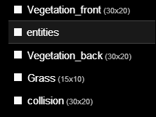
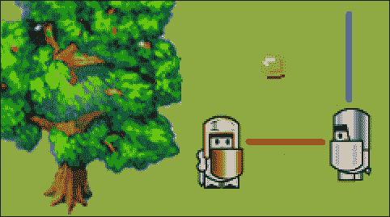
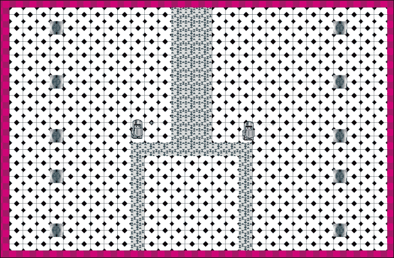

# 三、让我们建立一个角色扮演游戏

在前一章中，我们看了几个关键概念，并一个接一个地放大了它们，很大程度上忽略了它们的底层依赖关系。现在我们将逐步建立一个游戏。在这一章我们会看一下 RPG，而在[第四章](04.html "Chapter 4. Let's Build a Side Scroller Game")、*让我们构建一个侧边 scroller 游戏*，我们会潜入侧边 Scroller 游戏。

在本章中，我们将介绍:

*   RPG 游戏格式及其可能的子格式
*   为你的玩家建造一个真实的关卡，并将其与其他关卡连接起来
*   增加一个可玩的实体，可杀死但危险的敌人，和中性健谈的角色到游戏中
*   通过增加武器和有用的物品，把你的玩家变成一股不可忽视的力量
*   通过赋予玩家的敌人基本的人工智能来增加他们的深度
*   跟踪游戏中的一些变化，如收集硬币
*   通过让玩家与更强大的敌人对抗来结束游戏

# RPG 游戏设定

在进入 RPG 游戏设定之前，最好先看看一些成功的 RPG，看看我们能从他们身上学到什么。外面有一些很棒的例子:**塞尔达****最终幻想****神奇宝贝****魔兽世界****胫骨****巴尔杜尔之门****无冬之夜** 等等。名单实际上是无穷无尽的。是什么让这些游戏如此成功？嗯，总有营销的成分，但没有一款游戏能单独靠营销获得永恒的名气。那么他们针对目标受众的独特游戏主张是什么呢？游戏评论者经常将他们的分数分为几类，如游戏性、图形、声音等等。这些都是有效的观点，但是为什么不看看上瘾呢？即使是最简单的游戏也会让人上瘾。如果你曾经去过维加斯，目睹了成千上万的人在完全不需要技能的老虎机上玩了几个小时，你就会明白游戏心理学有一些特别之处。

如果你提供一款免费游戏，并想从游戏内广告或定期订阅费中赚钱，上瘾当然很棒。另一种方法是使游戏引人入胜，但最终。这些是你可以真正“完成”的游戏。他们通常在游戏主角和对手之间有一个有趣的故事。当对手被击败时，游戏就结束了，作为玩家，你不太可能再次捡起来。《最终幻想》系列的每一款游戏都是一个例子。

除了**MMORPG**(**大众多人在线角色扮演游戏** ) 之外的大部分 RPG 都属于这第二类。他们经常有一个迷人的故事和迷人的音乐。人物真的很有趣，很深刻。战斗系统非常直观，但也足够复杂，以至于有人擅长或不擅长。真正好的往往会给演奏它们的人留下持久的印象，而且它们需要花费大量的工作来组合。

这是看待 RPG 的标准方式。然而，这不应该阻止你刷新流派，并从其他流派或全新的想法中加入一些元素。例如，**边境地带** 是 RPG 和射手的混血儿。它和大多数 RPG 一样有等级提升和武器增强。它有一个故事，同时它仍然像一个射手一样打球。

一款游戏不需要混合两种电脑流派。**《我的世界》** 本质上就是玩乐高带到电脑上的乐趣。

归结起来就是自己去发现自己小时候最喜欢或最喜欢的事情。找到工作中的潜在机制，并尝试在游戏中复制这种感觉。说起来容易，做起来难。然而，有必要经历这个过程，因为构建游戏需要花费你的时间，如果这甚至不是你自己想玩的游戏，为什么其他人会想要它？

对于 RPG 来说，它通常比简单地找到一个原始的游戏组件更复杂。RPG 视频游戏可以是一本好书和一部电影的混合体，具有交互性的优点。如果你是一个伟大的故事讲述者，或者知道一个，为什么不这样做呢？一个游戏不需要很难或者图形完美，人们就可以玩。一个很好的例子是《最终幻想 7》，它在 20 世纪 90 年代大受欢迎。2012 年，它重新发布了“抛光图形”。没有太大区别；未经训练的眼睛不会立即注意到抛光。但它仍然是一款很棒的游戏，尽管它无法与 Skyrim 或寓言等游戏的复杂性和图形精彩程度相抗衡。

这才是你应该的目标:获得你希望你的游戏拥有的*核心乐趣*，尽可能以最小的复杂性包装它，并添加愉快的、柔和的彩色图形。快乐图形很棒。不，说真的，如果你想让你的游戏散发出黑暗和恐惧，那也没问题，但除此之外，一定要考虑微笑的云和看起来疯狂的动物。

# 建造一个 RPG 关卡

现在是时候把我们自己的小 RPG 放在一起了。我们将重新开始我们的旅程。以下是构建 RPG 级别的步骤:

1.  让我们复制一份保存在`chapter 1`文件夹中的新安装的`ImpactJS`文件夹，并将其重命名为`RPG`。将`chapter 3`文件夹中的`media`文件夹复制到您的`RPG/media`文件夹中。这样至少我们可以使用一些图形。
2.  回到**它起作用了！当您在浏览器中输入`localhost/RPG`时，会出现**屏幕。
3.  让我们从打开 weltmester(`localhost/Weltmeister.html`)并绘制一个小级别开始。
4.  你会注意到这次没有为你准备任何东西。唯一可用的层是`entities`层，它甚至不包含单个实体。然而，一旦我们有东西可以填充这个世界，我们可以给自己画一个小游戏场来开始。
5.  所以我们再加一层( *+-* 标志)称之为`grass`。让我们将图块大小设置为`16`，并在 1 像素的距离处有一个 30 x 20 的区域。选择平铺`grass.png`并点击**应用更改**按钮，然后开始铺草。
6.  如果您的抽屉柜没有对中，请按住 *Ctrl* 键并移动鼠标，直到它对中。如果由于某种原因，它太大而不适合您的屏幕，请使用鼠标滚轮缩小。
7.  一旦我们把整个图层涂成绿色，我们就可以轻松地添加另一个图层到草地上。但在此之前，请将您的文件保存为`level1`。经常储蓄是一种美德。
8.  当添加层时，你可以根据它们应该代表的东西来命名和使用它们。例如，您有一个用于家具、植物和其他对象的层。这是一种体面的工作方式，但你必须记住，一些层将在视觉上出现在你的玩家和怪物实体的前面，而其他层将出现在他们的后面。即使是像一面墙这样简单的东西，最好也画两层。

### 类型

Weltmeister 不支持无限多层。为了保持层数的体面，你可以有特定层次的波浪线。例如，你有两个等级设置:一个城市和一个地牢。两者都可以包含一把椅子，所以不要害怕为你的城市在一个瓷砖上有同样的椅子，在不同的瓷砖上建造你的地牢。复制信息会增加你的整体游戏尺寸，但会减少一个关卡所需的层数。

我们的草只是被称为`grass` ，因为我们不会有草会飘在我们的玩家面前；因此我们不需要第二个草层。让我们制作两个新的图层，分别叫做`vegetation_back` 和`vegetation_front`。`vegetation_back` 必须位于图层选择菜单中`entities`图层的下方。`vegetation_front` 必须放在`entities`层之上。这两个新图层将构成地图上的所有植被。

选择波浪线`tree.png`，并对`grass`层使用相同的设置。

用`vegetation_front`图层绘制一棵树的上部，用`vegetation_back`绘制树的下部。下面的截图显示了不同的层:


以下是您当前应该在 weltmester**图层**菜单中拥有的图层:



如果你不知道任何东西的上半部分或下半部分应该是什么，想想你的玩家和/或敌人会有多大。当走过树时，他们的头或脚不应该消失。为了避免玩家完全穿过树，我们将需要另一个层，碰撞层。

将名为`collision`的图层添加到 Weltmeister 中。

不要忘记，您可以通过将图层拖到图层堆栈的顶部或关闭阻挡视图的图层来使图层在 Weltmeister 中可见。在这种情况下，如果碰撞层位于堆栈的底部，`grass`层可能会阻挡所有视图。将`collision`层拖到顶部，并在必要时打开和关闭它是非常有效的。设置图层的设置始终相同。

通过`collision`层，在关卡周围画一个边框，这样就没人能逃脱了。还在树干中放一些碰撞方块，就在前层和后层分界线的下方或上方，如下图截图所示:


所以我们创造了一个可行的环境。不多但这是个开始。但是，对于要加载的级别，我们需要对我们的`main.js`脚本进行更改，如以下代码片段所示:

```html
.requires(
  'impact.game',
  'impact.font',
  'game.levels.level1'
)
init: function() {
  // Initialize your game here; bind keys etc.
  this.loadLevel(LevelLevel1);
},
```

为了确保我们的游戏找到关卡，我们需要将它包含在我们模块的`.requires`部分。我们需要像指向任何文件一样指向它，从我们的游戏根文件夹开始。唯一的区别是斜线(`/`)被点(`.`)代替，并且包含的文件本身总是被认为具有`.js`扩展名。比如`/game/levels/level1.js`变成`game.levels.level1`。

我们还需要在游戏启动的时候加载关卡，所以我们给`init()`功能增加一个`loadlevel()`方法。不要忘记调用这个函数的参数总是有以下形式:

`Level + Levelname`用大写字母。其他任何事情都会使游戏崩溃。

我们现在有一个加载的水平，但没有任何互动；我们还没有球员。虽然有了**它还是有效的！**在屏幕上时时刻刻都是相当激励人的，它也在温和地阻挡我们的视野。因此，让我们从`main.js`中删除以下代码，并使用以下代码继续我们的`player`实体:

```html
var x = ig.system.width/2,
var y = ig.system.height/2;
this.font.draw( 'It Works!', x, y, ig.Font.ALIGN.CENTER );
```

总结前面的内容，步骤如下:

1.  在本章中，我们需要从头开始构建我们的游戏。因此，我们需要最初下载的 ImpactJS 文件。将它们放在服务器工作目录中的单独文件夹中。还要测试你是否得到**它起作用了！**消息。
2.  将`chapter 3`文件夹的`media`文件添加到您刚刚设置的文件夹中。
3.  打开 weltmester 关卡编辑器，制作一个分层关卡。您需要一个碰撞层、一个实体层和三个图形层。底部的图形层将代表草地。另外两层代表将出现在玩家前面或后面的所有其他对象。
4.  绘制图形层。
5.  在你的`main`脚本中包含等级文件。
6.  从`main`脚本中删除`it works!`消息。

# 增加一个可玩角色

为了从头开始打造我们的玩家我们需要一个新的(并且是空的)`.js`文件。在代码编辑器中创建一个新文件，即使它是空的，也将其保存为`entities`文件夹中的`player.js`。

每个模块都以相同的方式开始。由`ig.module()``ig.requires()`和`ig.defines()`方法组成。对于某些模块，您不需要`requires()`方法，但是所有实体都需要，因为这里您需要包含实体的`impact`脚本，如下面的代码片段所示:

```html
ig.module('game.entities.player')
.requires(
'impact.entity')
.defines( function(){
  EntityPlayer = ig.Entity.extend({
  });
});
```

我们将基于`prototype`实体构建玩家。这个原型有几个属性(如`health``velocity`)和几个预定义的方法(如`kill()``receiveDamage()`)。这样我们只需要用`extend()`方法扩展原始版本就可以创建我们的玩家。

这里有一些规则。如果你的 JavaScript 文件叫`player.js`，你的实体就叫`Player`。通过在其名称前添加`Entity`，可以将其分配给`entity`原型的扩展，如前面的代码所示。

### 类型

任何对命名惯例的偏离都会将该实体从 weltmester**实体**菜单中移除。当一个实体被正确命名时，将它添加到 Weltmeister 编辑器中，并以错误的命名加载游戏将导致崩溃。

也不要忘记将实体包含在`main.js`内的`requires()`方法中。模块只有在`main`模块知道其存在时才能使用。以下代码显示扩展`.player`被分配到`entities`文件夹:

```html
'game.entities.player'
```

如果你现在用 Weltmeister 将`player`实体添加到游戏中，你会注意到没有什么可看的。播放器还没有可视化表示，我们在下面的代码中解决了这个问题:

```html
EntityPlayer = ig.Entity.extend({
  size: {x:32,y:48},
  health: 200,
  animSheet: new ig.AnimationSheet('media/player.png', 32, 48 ), init: function( x, y, settings ) {
    this.parent( x, y, settings );
    // Add the animations
    this.addAnim( 'idle', 1, [0] );
  }
});
```

为了一窥我们的可玩角色，我们需要添加一个动画表，它位于我们的`media`文件夹中。如果你不想看到你的角色到处走动，动画表需要分配正确的尺寸。我们也给了实体一个尺寸。动画实际上可以大于实体的大小。如果不设置大小，您将看到您可以在 Weltmeister 中选择`player`实体，但是它的边界不包含整个图像。这是因为默认大小是 16 x 16。大小是碰撞检测的相关属性。我们也给了玩家一些健康来开始。默认运行状况为 10。

我们也面临着原型的`init()`方法。`entity`原型已经有了自己的`init()`功能，所以最好通过在`init()`功能中调用`parent()`方法来包含这个功能。定义动画表不会使实体动画化。您需要为动画工作表指定一个动作。这里，*空转*对应于纸张上的第一个图像。您现在可以安全地将您的玩家添加到地图中。

太好了，我们的游戏里有一个玩家！可惜它不动了。我们现在就开始吧。

在`main.js`脚本中，您要将以下内容添加到您的`init()`方法中:

```html
// move your character
ig.input.bind(ig.KEY.UP_ARROW, 'up');
ig.input.bind(ig.KEY.DOWN_ARROW,'down');
ig.input.bind(ig.KEY.LEFT_ARROW,'left');
ig.input.bind(ig.KEY.RIGHT_ARROW,'right');
```

这将确保您的箭头键被绑定到一个*输入状态*。从现在开始，游戏将自动检查这些键是否被按下。既然我们在这里构建的是一个自上而下的游戏，我们就需要能够往任何方向走。

在`player.js`脚本中，需要向`init()`函数添加四个新的动画序列，如以下代码片段所示:

```html
this.addAnim('down',0.1,[0,1,2,3,2,1,0]);
this.addAnim('left',0.1,[4,5,6,7,6,5,4]);
this.addAnim('right',0.1,[8,9,10,11,10,9,8]);
this.addAnim('up',0.1,[12,13,14,15,14,13,12]);
```

虽然`idle`的动画序列是由一个图像组成的，但是我们现在需要为玩家可以行走的每个方向分配一个真实的序列。同样，`0.1`值是图像之间的时间。

此外，您还需要调用和扩展`entity`原型的`update()`功能。别忘了用逗号分隔`init()`和`update()`功能，否则会出错。

```html
update: function(){
  this.parent();
  //player movement
  if(ig.input.state('up')){
    this.vel.y = -100;
    this.currentAnim = this.anims.up;
  }
  else if(ig.input.pressed('down')) {
    this.vel.y = 100;
    this.currentAnim = this.anims.down;
  }
  else if(ig.input.state('left')){
    this.vel.x = -100;
      this.currentAnim = this.anims.left;
  }
  else if(ig.input.state('right')){
    this.vel.x = 100;
    this.currentAnim = this.anims.right;
  }
  else{
    this.vel.y = 0;
    this.vel.x = 0;
    this.currentAnim = this.anims.idle;
  }
}
```

`update()`功能和`init()`一样，是原型`entity`的标准方法。因此我们需要来调用父函数，如果我们不想失去它的 Impact 的话。

对于每个输入状态，我们需要单独的行为，所以我们有这组 *if-then 运算符*。请记住，由于我们将此代码放在`update()`函数中，因此每次游戏经历更新循环时都会运行此代码，即每帧一次。`init()`功能只调用一次，也就是在玩家创建的瞬间。

在条件检查中，我们做两件事:在相关轴上分配一个速度并添加一个动画。如果玩家什么都不做，两个方向的速度也设置为`0`，所以玩家移动需要持续输入。

我们可以用代替`ig.input.state` 。但这将导致我们的玩家不得不在关卡中按下按钮。因为，每当他或她按下一个移动按钮时，玩家只会移动一点点，然后立即停止。在 60 fps 和速度为 100 的情况下，玩家一次触摸将移动 100/60 = 1.67 像素。虽然`ig.input.pressed`确实有它的优点，但以这种方式移动可能会惹恼即使是最有耐心的游戏玩家。

我们终于有一个可玩的角色，优雅地四处移动！它甚至可以藏在我们之前创造的树后面。尽管如此，我们仍然有另一个问题，我们不能一直看到我们的球员。你能想象一个玩家因为看不清自己要去哪里而被什么东西杀死的沮丧感吗？我相信你可以，如果你过去玩过一些游戏，这种情况可能会发生在你身上。然而，我们很幸运，因为跟踪玩家的摄像机很容易实现，如下面的代码片段所示:

```html
var gameviewport= ig.game.screen;
var gamecanvas= ig.system;
var player = this.getEntitiesByType( EntityPlayer )[0];
gameviewport.x = player.pos.x - gamecanvas.width /2;
gameviewport.y = player.pos.y - gamecanvas.height /2;
```

正如您在前面的代码中看到的，两个重要的元素和播放器被分配给了一个局部变量。然后视口坐标被设置到玩家的位置。如果你想让你的相机把玩家放在屏幕的左上角，你就不需要你的游戏画布。但是当然，我们希望玩家居中，所以我们在两个维度上调整它的位置是画布大小的一半。

在重新加载浏览器时，你会注意到你终于可以走到屏幕底部和树下了。太好了。只是可惜这里没什么可做的，所以接下来我们就介绍一些敌对的东西。

总结前面的内容，步骤如下:

1.  打开一个新的 JavaScript 文件，保存为`player.js`。
2.  用标准的 ImpactJS 模块代码设置`player.js`脚本。
3.  在你的`main`脚本中包含`player.js`。
4.  给你的可玩角色添加一个动画表和序列，这样它就可以在威尔士列表中找到。还为他提供健康和尺码。
5.  通过将键盘按键绑定到`main`脚本中的输入状态来添加播放器控件。
6.  绑定这些输入状态，通过控制角色的速度来移动角色的动作。
7.  通过引入额外的动画序列并在某些输入状态处于活动状态时调用它们，使运动看起来像平滑的动画。
8.  安装一个摄像头，自动跟踪玩家到任何地方。

# 引入一个可击败的对手

同样，我们将不得不从头开始，所以打开一个空白的 JavaScript 文件并将其保存为`enemy.js`。

实体创建的开始总是相同的。设置你的`Entity`文件，并添加一个`enemy`实体到你的`main`脚本中。

在`main.js.requires`中添加以下代码:

```html
'game.entities.enemy',
```

在`enemy.js`中添加以下代码:

```html
ig.module('game.entities.enemy')
.requires('impact.entity')
.defines(function(){
  EntityEnemy = ig.Entity.extend({
  }); 
});
```

添加前面的代码片段会创建我们的实体，我们可以使用 Weltmeister 将其添加到级别中。但是，它仍然非常无用，所以让我们首先使用以下代码添加一些图形:

```html
size: {x:32,y:48},
animSheet: new ig.AnimationSheet('media/enemy.png',32,48),
init: function(x, y , settings){
  this.addAnim('idle',1,[0]);
  this.addAnim('down',0.1,[0,1,2,3,2,1,0]);
  this.addAnim('left',0.1,[4,5,6,7,6,5,4]);
  this.addAnim('right',0.1,[8,9,10,11,10,9,8]);
  this.addAnim('up',0.1,[12,13,14,15,14,13,12]);
  this.parent(x,y,settings);
}
```

现在我们可以将我们的第一个敌人添加到关卡中。这不会有太大的作用，你甚至可以直接穿过他，就好像他不在那里。这是因为还没有指定实体之间的冲突。

将以下代码作为属性添加到`player`和`enemy`实体中。您可以用旧的 JavaScript 符号在`init()`函数中添加它们，或者用文字符号在`init()`之上添加它们，如下代码所示。

以下代码适用于播放器:

```html
collides: ig.Entity.COLLIDES.ACTIVE,
type: ig.Entity.TYPE.A,
checkAgainst: ig.Entity.TYPE.B,
```

以下代码为敌人`entity`:

```html
collides: ig.Entity.COLLIDES.PASSIVE,
type: ig.Entity.TYPE.B,
checkAgainst: ig.Entity.TYPE.A,
```

我们现在可以像真正的恶霸一样把我们的敌人推来推去。你可能已经注意到玩家和敌人之间还有一些空间。这是因为实体的边界是矩形，它不仅仅包含实际的图形。当视觉上不是这样的时候，玩家被敌人击中是很烦人的。为了纠正这种情况，我们需要引入`offset`作为玩家属性。`size`属性决定实体周围碰撞框的大小。`offset`属性使碰撞盒向右或向下移动几个像素。当然，您可以在负数向左和/或向上移动的点输入负数。我们将需要结合这两个属性来为玩家制作一个新的碰撞盒，这将使他更难被击中。然而，在继续之前，通过在`requires()`方法中的`main.js`脚本中添加以下代码行来打开 ImpactJS 调试器是有用的:

```html
 'impact.debug.debug',
```

在开发过程中打开这个调试器是一个好习惯。准备发布时，您可以再次删除此代码。让我们使用以下代码更改玩家和敌人的大小和偏移量:

```html
size: {x:18,y:40},
offset: {x: 7, y: 4},
```

实际图像大小为 32 x 48。我们将两个实体的大小都更改为`18` x `40`，偏移量为`7` x `4`。如果打开上的**实体**选项卡上的调试器，并打开**显示碰撞盒**，您会注意到大小的差异。您可能还会注意到静态碰撞，例如我们添加到树中间的碰撞层的正方形不可见，因为它只显示实体的碰撞，如下图所示:


设置碰撞盒没有完美的规则。这完全取决于你的图像有多居中和对称，在碰撞时你有多宽容，以及正面和侧面外观之间的图像大小差异。在这里，我们选择将宽度减少 14 像素(32 - 18)。为了保持框居中，偏移被设置为差值的一半((32 - 18) / 2 = 7)。同样的推理也适用于 y 轴。

现在我们有了一个敌人。让我们杀了它！

总结前面的内容，步骤如下:

1.  打开一个新的 JavaScript 文件，保存为`enemy.js`。
2.  用标准的 ImpactJS 模块代码设置`enemy.js`脚本。
3.  在你的`main`脚本中包含`enemy.js`。
4.  添加一个动画表和几个动画序列，考虑到你的敌人可能行走的每个方向。
5.  改变玩家和敌人的`collisions`实体。他们需要能够发现对方的存在，这样敌人就可以在以后伤害玩家。
6.  如果您还没有这样做，通过将 ImpactJS 调试器包含在您的`main`脚本中来打开它。目的是查看实体的碰撞盒。

# 给玩家一些武器

我们确实希望我们的玩家能够武装起来，准备好的一些行动。让我们首先添加一个将用于攻击的新密钥。在`main.js`中添加以下键绑定:

```html
ig.input.bind(ig.KEY.MOUSE1,'attack');
```

在任何战斗情况下，都是两个物体的碰撞造成伤害。如果一支箭击中了目标，造成伤害的是那支箭，而不是弓。核导弹也是如此。并不是发射设施，而是核弹的爆炸波与任何会造成损害的物体发生碰撞。在这方面，你可以说这里有三个实体在工作:一个发射设施，一枚核弹，以及它的 Impact 波。如果你想让空气压力和实际的火灾有所不同，你甚至可以再加一个。所有这些只是为了展示你在游戏中添加武器时应该如何思考。哪些影响是相关的？在一只鸡和一个鸡发射器的情况下，鸡将成为一个实体，而发射器只是一个绘图。

## 产生抛射体

对于我们的远程攻击，我们需要一个新的实体，我们称之为`projectile`。制作一个新的脚本，设置基础，保存为`projectile.js`，并将其包含在`main.js`中。

在`main.js`中包含以下代码:

```html
'game.entities.projectile',
```

在`projectile.js`中包含以下代码:

```html
ig.module('game.entities.projectile')
.requires('impact.entity')
.defines( function(){
  EntityProjectile = ig.Entity.extend({
    size: {x:8,y:4},
    vel: {x:100,y:0},
    animSheetX: new ig.AnimationSheet('media/projectile_x.png',8,4),
    animSheetY: new ig.AnimationSheet('media/projectile_y.png',4,8),
    init: function(x, y , settings){
      this.parent(x,y,settings);
      this.anims.xaxis = new ig.Animation(this.animSheetX,1,[0]);
      this.anims.yaxis = new ig.Animation(this.animSheetY,1,[0]);
      this.currentAnim = this.anims.xaxis;
    }
  })
});
```

好吧，基础看起来并没有那么基础。这一次，我们有两个不同的动画表。箭头往往比宽度长一点。因此，如果箭头是从左向右(或从右向左)射出的，则其尺寸与向上或向下射出的箭头不同。当定义一个动画表时，我们必须定义每个图像只取一次的尺寸。然而，在这种情况下，我们需要两个不同的维度:`8` x `4`和`4` x `8`。实际上，在这种特殊情况下，还有另一种可能更简单的解决方案，涉及动画的角度。在编程语言中，通常有不同的方法来获得相同或相似的结果。但是，现在我们将使用多个动画表。

我们定义了两个不同的动画表。我们没有在标准的`animSheet`属性上初始化它们，而是将它们命名为`animSheetX`和`animSheetY`，以指示不同的轴。`init()`函数不像在`Player`和`Enemy`实体中那样调用`addAnim()`方法，因为它被编程为默认采用`animSheet`属性。相反，我们直接处理`ig.animation`，我们可以将自己的动画表单传递给它。如果您想在 Weltmeister 中添加一个箭头，有一个图像是很好的，因此`currentAnim`属性被赋予 x 轴动画序列作为默认值。

现在我们只需要让玩家产生箭头。因此我们需要在玩家的`update()`功能中加入以下内容:

```html
if(ig.input.pressed('attack')) {
  ig.game.spawnEntity('EntityProjectile',this.pos.x,this.pos.y);
}
```

箭头将在玩家所在的位置产生。

万一你此时运行游戏，箭头只能朝一个方向飞:向右。这是因为我们的默认速度被设置为每秒向右`100`像素。同样，我们的动画默认是一个向右的箭头。

这不完全是我们想要的。我们的敌人在任何时候都必须站在我们的右边，这样我们才能杀死他们。因此，让我们通过向`init()`函数添加以下代码来修改投射体代码:

```html
if (this.direction == 'right'){
  this.vel.x = this.velocity;
  this.vel.y = 0;
  this.currentAnim = this.anims.xaxis;
  this.anims.xaxis.flip.x = false;
}
else if (this.direction == 'left'){
  this.vel.x = -this.velocity;
  this.vel.y = 0;
  this.currentAnim = this.anims.xaxis;
  this.anims.xaxis.flip.x = true;
}
else if (this.direction == 'up'){
  this.vel.x = 0;
  this.vel.y = -this.velocity;
  this.currentAnim = this.anims.yaxis;
  this.anims.yaxis.flip.y = false;
  }
else if (this.direction == 'down'){
  this.vel.x = 0;
  this.vel.y = this.velocity;
  this.currentAnim = this.anims.yaxis;
  this.anims.yaxis.flip.y = true;
}
```

添加`velocity`作为属性，如下代码所示:

```html
velocity: 100,
```

现在发生的情况是，如果箭头的方向是右、左、上或下，它将相应地调整其速度和动画。这里只有两个图像在播放，一个箭头指向上方，一个指向右侧，每个图像都在单独的动画表单中。我们可以在每张纸上添加一个额外的图像，一个向下的箭头，一个向左。这将是一个可行的解决方案，但这里我们选择使用翻转属性来代替。翻转基本上是动画的镜像，使箭头指向完全相反的方向。使用翻转时，您必须确保翻转图像而不是使用单独的图像确实有意义。例如，如果你有一个角色从左向右跑，你想让它从右向左跑，翻转是非常好的使用。对于跑向或离开你的角色来说，这实际上不起作用，因为你希望看到他们的正面或背面。

这一切都很好，但是它的*方向*从哪里来呢？让我们用默认值启动方向，然后修改玩家，这样它就可以将自己的方向传递给投射体。

在`projectile.js`中添加以下代码:

```html
direction: 'right',
```

对`player.js`执行以下操作:

对于每个方向，添加一个名为`lastpressed` 的变量，其值与输入状态相同，如下面的代码片段所示，用于向右移动:

```html
else if(ig.input.state('right')){
  this.vel.x = 100;
  this.currentAnim = this.anims.right;
  this.lastpressed = 'right';
}
```

使用以下代码使`spawnEntity`方法通过方向参数:

```html
if(ig.input.pressed('attack')) {
  ig.game.spawnEntity('EntityProjectile',this.pos.x,this.pos.y,{direction:this.lastpressed});
}
```

太好了。我们现在让我们的英雄像老板一样向各个方向射箭。目前，我们的箭仍然相当坚不可摧，对我们幸运的敌人相当无害。他们只是达到了我们的水平，并永远留在那里，或者直到游戏重新加载。

总结前面的内容，步骤如下:

1.  打开一个新的 JavaScript 文件，保存为`projectile.js`。
2.  设置`projectile.js`脚本。给它两张动画纸。
3.  将`projectile`脚本添加到`main`脚本中。
4.  更改玩家的`update`功能，这样当`attack`输入状态被激活时，玩家就可以产生一个抛射体。
5.  根据玩家射击时面对的方向调整弹丸的方向和动画。
6.  产卵时确保玩家的方向转移到`projectile`脚本。这是通过填写标准 ImpactJS 实体的可选参数完成的:`spawn`函数。

## 用投射物造成伤害

我们可以使用以下代码使箭在击中敌人或在空中飞行一段时间后消失:

```html
lifetime: 0,
update:function(){
  if(this.lifetime<=100){this.lifetime +=1;}else{this.kill();}
  this.parent();
}
```

在`0`启动一个名为`lifetime`的新属性，并在`update()`功能上增加一个带有`kill()`功能的计数器，将使箭头在飞行`100`帧后消失。还是那句话，别忘了用逗号(`,`)把`init()`和`update()`分开，否则字面符号不会原谅你。

为了伤害敌人，我们需要我们的箭来检查它是否遇到了。我们使箭头成为类似于`player`实体的`TYPE A`实体，并让它在下面的代码中检查类似于`enemies`实体的`TYPE B`实体:

```html
collides: ig.Entity.COLLIDES.NONE,
type: ig.Entity.TYPE.A,
checkAgainst: ig.Entity.TYPE.B,
```

通过添加`check()`功能，我们可以对需要检查的每个实体进行箭头检查(由`checkAgainst`属性设置)。如果遇到类型为`B`的实体，该实体将受到`100`的伤害，如以下代码片段所示:

```html
check: function(other){
  other.receiveDamage(100,this);
  this.kill();
  this.parent();
}
```

现在我们仍然没有解决箭头在关卡边缘或者任何其他有地图碰撞的地方扎营的问题。所以让我们做一些弹跳箭吧！不用担心，我们确保他们不会伤害玩家，因为他们只会检查类型为`B`的实体，并且会直接飞过我们的玩家。

首先将`bounciness`设置为`1`，这意味着反弹时保持所有速度，使用以下代码:

```html
bounciness: 1,
```

现在我们只需要检查速度有没有反转(箭头有没有弹起)，需要的话反转动画。当然，这需要在`update()`函数中完成，如下面的代码片段所示，因为它随时都可能发生:

```html
if (this.vel.x< 0 &&this.direction == 'right'){this.anims.xaxis.flip.x = true;}
else if (this.vel.x> 0 &&this.direction == 'left'){this.anims.xaxis.flip.x = false;}
else if (this.vel.y> 0 &&this.direction == 'up'){this.anims.yaxis.flip.y = true;}
else if (this.vel.y< 0 &&this.direction == 'down'){this.anims.yaxis.flip.y = false;}
```

这是一个非常天真的检查，因为它依赖于这样的假设，即箭头的速度在任何时候都保持不变，即使是在反弹之后。但是，为了保持示例简单，它可以做到。

我们甚至没有设置敌人的`health`值，我们已经可以伤害并杀死它了。这是因为默认情况下，实体的`health`值设置为`10`。让我们改变这个属性，这样我们的敌人至少可以在第一次攻击中幸存下来。

按照`enemy.js`中的以下代码进行更改:

```html
health: 200,
```

我们的敌人变得越来越难杀死，但他似乎还不是我们的挑战。是时候进入一些不可玩角色的基本 **AI** 或者**人工智能**了。

总结前面的内容，步骤如下:

1.  给你的射弹增加一个最大寿命，这样它就不会永远留在游戏里了。
2.  添加实体碰撞检测，以便它可以与敌人碰撞。
3.  设置射弹的`check`功能，当射弹与敌人碰撞时，射弹被击杀，敌人被伤害。
4.  添加`bounciness`使其能弹离墙壁。
5.  设定敌人的`health`属性，这样敌人就不会被第一发炮弹击中。

# 用人工智能让你的 NPC 活起来

人工智能可以是最复杂的一个，如果不是*游戏中最复杂的*元素的话。顾名思义，人工智能是人工或模拟智能。游戏中的实体需要对你作为玩家对他们或他们的环境所做的事情做出行动和反应。当编写人工智能时，你实际上是在试图把人脑或更强大的东西放入计算机。对于策略游戏，人工智能可以决定游戏的成败，因为当玩家离线玩小规模比赛时，它会让玩家保持专注。对于其他类型，如 2D 射手，你可能会满足于那些不仅仅向你射击的敌人。复杂人工智能的问题是，它需要考虑如此多的参数，以至于一个程序员几乎无法理解。让我们分成三种类型:

*   **单策略 AI**
*   **多策略 AI**
*   **数据驱动 AI**

**策略**是实体在特定情况下会遵循的行为模式。一个敌人可以在完全健康的情况下向你发起猛烈的攻击，但是在严重受伤的情况下撤退并寻找一个安全的地方进行自我治疗。这是一个使用两种不同策略的例子，而一个*单一策略* 敌人可能会继续攻击你，直到它死去，而不管它自己的生命。

*数据驱动的 AI* 完全是别的东西。这不是硬编码的行为，而是需要大量的玩家数据，这些数据被上传到一个位置。在那里，数据被处理，诸如回归、决策树建模和神经网络等统计过程被应用，以使人工智能在未来更有能力。你得到的是一个学习实体，它变得越来越难击败，并根据模型的预测自动发明新的策略。对一些人来说，想到计算机能够学习和适应行为可能会相当可怕。然而，这是今天的现实，未来必然会带来越来越智能的 AI。计算机是否最终会像电影《终结者》和《黑客帝国》中那样接管世界，还有待观察。

现在，我们将忘记所有那些数据驱动的统计解决方案，只看一看单一策略 AI。

在编写 AI 时，我们希望在决策和实际行为之间保持清晰的划分。你可以把它看作是人脑和身体的分裂。大脑做出决定，并向身体发送脉冲来执行动作。出于这个原因，我们将把我们的“大脑”写在一个单独的模块中，而敌人能够执行的动作将作为方法留在`enemy`实体本身中。

## NPC 的行为

创建一个新的脚本，将其命名为`ai.js`，并将其保存在`plugins`文件夹下，如以下代码片段所示:

```html
ig.module('plugins.ai').
defines(function(){
  ig.ai = ig.Class.extend({ 
  })
})
```

我们首先定义了我们全新的模块，我们的第一个插件。让我们不要忘记要求我们的`main.js`中的脚本，如下面的代码所示:

```html
'plugins.ai',
```

人工智能需要给实体下命令。要做到这一点，他们需要说一种共同的语言。就像你的腿需要解读你的神经信号一样，我们的敌人也需要解读它在任何给定时间需要执行的动作。我们在`init()`函数中定义这些命令，如下面的代码片段所示:

```html
init: function(entity){
  ig.ai.ACTION = { Rest:0,MoveLeft:1,MoveRight:2,MoveUp:3,MoveDown:4,Attack:5,Block:6 };
  this.entity = entity;
}
```

`action`数组保存了`AI`模块可以发送的所有可能的动作。`init()`函数接收它需要命令的实体作为它的输入。没有必要像前面的代码片段(`this.entity=entity;`)那样给`this.entity`分配实体，只是确认`this`不是实体本身，而是它的 AI。输入参数`entity`不是分配给`this`而是分配给`this.entity`的事实将使得有可能有一个集体`ai`，也能够为一组敌人作为一个整体做出决策。这种集体的人工智能或蜂群思维将在[第 5 章](05.html "Chapter 5. Adding Some Advanced Features to Your Game")、*为你的游戏增加一些高级功能*中讨论。

如果你现在想看看你在火狐中的 Firebug DOM，你可以看到`AI`类是`ig`对象的一部分，它目前只包含我们刚刚写的`init()`函数。在编写代码时，跟踪您的 DOM 是如何发展的总是一个好主意。


既然我们已经定义了我们要发送的信号，让我们看看它们最终会到达哪里。打开`enemy.js`脚本，添加以下`update()`功能:

```html
update: function(){
/* let the artificial intelligence engine tell us what to do */
  var action = ai.getAction(this);
/* listen to the commands with an appropriate animation and velocity */
  switch(action){
    case ig.ai.ACTION.Rest:
    this.currentAnim = this.anims.idle;
    this.vel.x = 0;
    this.vel.y = 0;
    break;
    case ig.ai.ACTION.MoveLeft:
    this.currentAnim = this.anims.left;
    this.vel.x = -this.speed;
    break;
    case ig.ai.ACTION.MoveRight :
    this.currentAnim = this.anims.right;
    this.vel.x = this.speed;
    break;
    case ig.ai.ACTION.MoveUp:
    this.currentAnim = this.anims.up;
    this.vel.y = -this.speed;
    break;
    case ig.ai.ACTION.MoveDown:
    this.currentAnim = this.anims.down;
    this.vel.y = this.speed;
    break;
    case ig.ai.ACTION.Attack:
    this.currentAnim = this.anims.idle;
    this.vel.x = 0;
    this.vel.y = 0;
    ig.game.getEntitiesByType('EntityPlayer')[0].receiveDamage(2,this);
    break;
    default: 
    this.currentAnim = this.anims.idle;
    this.vel.x = 0;
    this.vel.y = 0;
    break;
  }
  this.parent();
}
```

我们可以用不同的方法编写所有的行为，然后用`AI`命令查看它们是否需要做什么。然后，这些方法可以被放入实体的`update()`功能中，以保持其订单是最新的。在这种情况下，我们不会在方法上进行这种划分。因为在这种情况下事情不会太复杂，所有的行为代码都将适合`update()`函数，而不需要创建中间方法。

`update()`功能现在包括两个主要部分:对 AI 模块的*调用，以接收它需要执行的动作，以及*实际执行动作*。*

通过调用`ai.getAction()`方法将动作存储在名为`action`的局部变量中。然而，为了做到这一点，我们需要将人工智能添加到我们敌人的`requires`功能旁边的`impact`实体代码中，如以下代码片段所示:

```html
.requires('impact.entity','plugins.ai')
```

也给你的敌人一个速度参数，如下面的代码所示，因为 case 语句使用它来设置他们的移动:

```html
speed:50
```

我们在`AI`模块中定义的所有动作都在`update()`函数中表示。为了使一系列案例检查更有效，在每个动作的末尾插入一个断点。这样，一旦一个动作与案例匹配，它将停止检查其他案例是否匹配。我们知道我们想在每个给定的时间只给*一个订单，所以这是有意义的。`update()`函数中的所有代码都应该尽可能高效地编写，因为如果游戏以 60 帧速率运行，每秒将调用 60 次。我们的四个行动都是朝着正确的方向前进，然后我们有`attack`和`rest`。为了确保每种情况都得到处理，设置了一个`default`值。这样，如果给敌人下达了他不懂的命令，他只会原地不动。如果你愿意，你可以重写代码的`default`部分并用`attack`案例覆盖它；这样，如果敌人不明白他需要做什么，他总是会攻击；野蛮但有效。*

万一敌人进攻，他调用玩家的`receive damage`功能。这很有意思，因为玩家的`receive damage`方法可以在`player.js`中被覆盖，加入护甲等的伤害减免。

然而，现在让我们看看实际的大脑或决策本身。因此，我们需要返回到我们的`AI`模块。

综上所述，结论如下:

*   实体的人工智能是其基于外部输入做出决策的能力，通常使用几种策略
*   在代码中，决策应该尽可能与实际行为分开

总结前面的内容，步骤如下:

1.  打开一个新的 JavaScript 文件，保存为`ai.js`。作为对人体的类比，这个文件将包含关于大脑的一切。
2.  设置`ai.js`脚本，使其成为一个 ImpactJS 类扩展。
3.  在你的`main`脚本中包含`ai.js`。
4.  定义将行为决策与实际行为绑定的语言。作为对人体的类比，这些将是你的神经系统传递的电脉冲。
5.  建立一个实际的行为模式，一个敌人将遵循他能收到的每一个命令。作为对人体的类比，这将是身体对某些神经冲动的反应。
6.  包括调用人工智能命令的函数。作为对人体的类比，这个功能调用将是神经本身。

## NPC 的决策过程

我们刚刚看到调用了 AI `getAction()`方法，但是还没有完全解释。它的主要目的是在调用时返回一个操作。这里可能的动作是向某个方向移动，攻击，阻挡来袭的攻击，或者根本不移动。采取什么行动由玩家和需要做出决定的`enemy`实体之间的距离决定，如下代码所示:

```html
getAction: function(entity){
  this.entity = entity;
  //by default do nothing
  var playerList= ig.game.getEntitiesByType('EntityPlayer');
  var player = playerList[0];
  var distance = this.entity.distanceTo(player);
  var angle = this.entity.angleTo(player);
  var x_dist = distance * Math.cos(angle);
  var y_dist = distance * Math.sin(angle);
  var collision = ig.game.collisionMap ;
  //if collision between the player and the enemy occurs
  //collision.trace is the way ImpactJS simulates line of sight detection. This will be explained after this block of code.
  var res = collision.trace( this.entity.pos.x,this.entity.pos.y,x_dist,y_dist,
    this.entity.size.x,this.entity.size.y);
  if( res.collision.x){
    if(angle > 0){return this.doAction(ig.ai.ACTION.MoveUp);}else{return this.doAction(ig.ai.ACTION.MoveDown);}
  }
  if(res.collision.y){
    if(Math.abs(angle) >Math.PI / 2){return this.doAction(ig.ai.ACTION.MoveLeft)}else{return this.doAction(ig.ai.ACTION.MoveRight);}
  }
  if(distance < 30){
    //decide between attacking, blocking or just being lazy //
    var decide = Math.random();
    if(decide < 0.3){return this.doAction(ig.ai.ACTION.Block);}
    if(decide < 0.6){return this.doAction(ig.ai.ACTION.Attack);}
    return this.doAction(ig.ai.ACTION.Rest);
  }
  if( distance > 30 && distance < 300) {
    //if you can walk in a straight line: go for it
    if(Math.abs(angle) <Math.PI / 4){ return this.doAction(ig.ai.ACTION.MoveRight); }
    if(Math.abs(angle) > 3 * Math.PI / 4) {return this.doAction(ig.ai.ACTION.MoveLeft);}
    if(angle < 0){return this.doAction(ig.ai.ACTION.MoveUp);}
    return this.doAction(ig.ai.ACTION.MoveDown);
  }
  return this.doAction(ig.ai.ACTION.Rest);
}
```

将该功能添加到`AI`模块。就像`init()`函数一样，它把实体作为输入参数。计算一系列局部变量，决定需要走什么路径才能到达玩家。敌人需要知道它与玩家的距离和朝向玩家的角度。碰撞使用`collision.trace()`方法计算。这个方法的输入是实体`position`、`size`和`distance`到它的目标，在这个例子中是玩家。在这里，你不应该把碰撞看作真正的物理碰撞，而应该看作视线。`res.x.collision`是否应该将解释为“如果我在屏幕对面的水平线上看，玩家是否在视线范围内？”

下面的截图显示了敌人的视线:



如果是这种情况，就没有必要再上下移动了。同样的推理也适用于 y 轴和左右移动。这只是为了向您展示这个函数是如何工作的，省略了前两个`if`语句，并且`res`变量的计算仍然会给出相同的结果，因为后面两个`if`语句中的逻辑。

在此之后会检查敌人和玩家之间的距离。如果敌人足够接近攻击(这是硬编码在`30`像素)，敌人就会攻击。这个切断可以通过读取敌人的实际射程并使用它来改变，而不仅仅是使用`30`。同样，敌人有机会每帧攻击一次；这意味着每秒钟有 60 次攻击。你有没有在一秒钟内被剑击中 60 次的经历？很疼。我们可以通过增加敌人无所作为的机会来降低这一点。改变这两件事，代码看起来像下面的代码片段:

```html
if(distance <entity.range){
  var decide = Math.random();
  if(decide < 0.3){return this.doAction(ig.ai.ACTION.Block);}
  if(decide < 0.02){return this.doAction(ig.ai.ACTION.Attack);}
  return this.doAction(ig.ai.ACTION.Rest);
}
```

当然，你需要改变实际造成的伤害，因为 2 点伤害对一个有 200 点生命值的玩家来说可能并不那么令人印象深刻或具有挑战性。以下代码片段显示了损坏的变化:

```html
ig.game.getEntitiesByType('EntityPlayer')[0].receiveDamage(40,this);
```

当敌人与玩家的距离为 300 时，敌人会向玩家移动。如前所述，它使用角度来决定先走哪个方向。在所有其他情况下，人工智能建议实体休息。所以如果玩家在很远的地方，敌人不会攻击。这样可以避免同时被所有敌人攻击。如果你的速度更快，你甚至可以逃跑。

还剩一件小事。正如你可能已经注意到的，一个动作不会立即返回，而是通过`doAction()`方法发送。下面的代码片段显示了这是如何实现的:

```html
doAction: function(action){
  this.lastAction = action;
  return action;
},
```

该方法也添加到`AI`模块，仅用于存储实体执行的最后一个动作。您可以不使用此功能，但是跟踪最后一次执行的移动通常很方便。这个简短的人工智能教程中没有显示这方面的应用。

如果你在这个时候重装游戏，你应该有一个敌人试图杀死你，而不是像石头一样被动。

总结前面的内容，步骤如下:

1.  召唤大脑行动是通过我们的`getAction()`功能完成的。此函数将需要做出决策的实体作为输入参数，并将返回命令或操作。这个函数内部的逻辑可以是简单的，也可以是复杂的。在这个例子中，到玩家的距离是需要采取的行动的最重要的决定因素。
2.  使用`line of sight` ImpactJS 功能确定敌人是否能看到玩家。
3.  人工智能应该做什么完全是一件主观的事情；尝试添加自己的命令和行为模式。

# 拾取物品来帮助玩家

现在我们的敌人反击了，我们可能需要一些额外的帮助，比如`pickup`物品和额外的武器。

一个有用的`pickup`物品将是一个瞬间`healthpotion`实体，这样我们就可以从我们受到的伤害中恢复过来。

## 用药剂治疗你的玩家

让我们为自己构建一个名为 `healthpotion`的实体，并将其包含在`main`脚本`main.js`中，如下代码所示:

```html
'game.entities.healthpotion',
```

在`healthpotion.js`脚本中包含以下代码:

```html
ig.module('game.entities.healthpotion')
.requires('impact.entity')
.defines( function(){
  EntityHealthpotion = ig.Entity.extend({
    size: {x:32,y:32},
    collides: ig.Entity.COLLIDES.NONE,
    type: ig.Entity.TYPE.B,
    checkAgainst: ig.Entity.TYPE.A,
    animSheet: new ig.AnimationSheet('media /healthpotion.png',20,25),
    init: function(x, y , settings){
      this.parent(x,y,settings);
      this.addAnim('idle',1,[0]);
    },
    check: function(other){
      other.receiveDamage(-500,this);
      this.kill();
    }
  })
});
```

`healthpotion`实体是一个非常简单的实体。它没有真正的行为，除了检测玩家是否触摸它，然后治疗玩家，如果他或她做了。

这里有趣的是`receiveDamage()`法是如何和负伤害一起使用来治疗目标的。这种药水是用在皮卡上的；它不一定总是这样，有些事情可以通过使用`gameinfo`阵列来计数。

总结前面的内容，步骤如下:

1.  打开一个新的 JavaScript 文件，保存为`healthpotion.js`。
2.  用标准的 ImpactJS 模块代码设置`healthpotion.js`脚本。
3.  将`healthpotion.js`脚本包含在您的`main`脚本中。
4.  添加动画表和序列。
5.  设置`collision`实体，这样它就可以检测到玩家何时触摸它。
6.  使用带有负面伤害的`receivedamage()`功能；这将治愈玩家，而不是处理伤害。使`healthpotion`实体自我毁灭。

## 用硬币致富

`coin`实体 是我们可能想要记录的项目的一个例子。除了名称、动画表和`check`功能外，它与`healthpotion`实体几乎相同，如下所示:

```html
check: function(other){
  ig.game.addCoin();
  his.kill();
}
```

不是治疗玩家，而是应用一种叫做`addCoin()` 的方法。这个功能还没有起作用，所以你可以把这一行代码放在一个注释中，直到我们在*为玩家反馈记分*部分更改它。

首先，让我们解决另一个问题。如果你在游戏中加入了`coin`和`healthpotion`实体，你可能已经注意到你可以通过射击来杀死`healthpotion`和`coin`实体。如果您不喜欢这种行为，可以通过给每个实体一个唯一的名称来修复它，如下面的代码所示:

```html
name: "player",
```

您可以在如下代码所示的检查功能中进行检查:

```html
check: function(other){
  if (other.name == "player"){
  //ig.game.addCoin();
  this.kill();
}}
```

现在让我们的评分系统开始工作。

总结前面的内容，步骤如下:

1.  打开一个新的 JavaScript 文件，保存为`coin.js`。
2.  用标准的 ImpactJS 模块代码设置`coin.js`文件。
3.  在你的`main`脚本中包含`coin.js`。
4.  添加动画表和序列。
5.  设置`collision`实体，这样它就可以检测到玩家何时触摸它。
6.  触摸`player`实体时，`coin`实体必须自行销毁并调用`addcoin()`功能，向游戏信息系统发送反馈。该函数将在本章后面定义，因此在实现时将其打开。

# 为玩家反馈打分

跟踪一个数量的事情是关于离开当前加载的游戏之外。这样，它可以跨级别甚至跨游戏进行传输。在`MyGame`定义上方的`main.js`中添加以下内容:

```html
GameInfo = new function(){
  this.coins = 0;
  this.score = 0;
},
```

`GameInfo.coins` 和`GameInfo.score` 现在将记录我们收集了多少硬币以及我们当前的分数。

但是，我们确实需要两个功能，这实际上会增加这些游戏属性。因此，让我们将这些函数添加到`main.js`脚本中的`MyGame`定义中:

```html
addCoin: function(){
    GameInfo.coins += 1; //add a coin to the money
},
increaseScore: function(points){
  GameInfo.score +=points;
},
```

现在你可以安全地从评论中获得`ig.game.addCoin()`方法，而不用担心游戏崩溃。另外，我们可以在敌人死亡时增加对`increaseScore`功能的调用。为此，我们需要在`enemy.js`脚本中更改敌人的`kill`功能，如以下代码片段所示:

```html
kill: function(){
  ig.game.increaseScore(100);
  this.parent();
}
```

如您所见，我们通过添加`this.parent()`行代码保留了原始函数，但在它之前添加了用于增加分数的代码。

我们不需要局限于只能往上走的东西。我们可以限制我们的英雄所拥有的射弹数量，并记录下来。如下面的代码片段所示，将射弹的初始数量添加到`GameInfo`数组中:

```html
this.projectiles = 10;
```

我们需要两个新功能，我们可以像对`addCoin()`和`increaseScore()`那样添加到`MyGame`中。添加这两个函数的代码如下:

```html
addProjectile: function(nbr_projectiles){
  GameInfo.projectiles +=nbr_projectiles;
},
substractProjectile: function(){
  GameInfo.projectiles -=1;
}
```

我们新的攻击`player`实体的代码看起来像下面的代码片段:

```html
if(ig.input.pressed('attack')) {
  if (GameInfo.projectiles> 0){ ig.game.spawnEntity('EntityProjectile',this.pos.x,this.pos.y,{direction:this.lastpressed});
  ig.game.substractProjectile();
  }
}
```

首先，我们检查我们是否有足够的射弹，发射一枚后，从我们的原始堆栈中减去一个`projectile`实体。

太好了。但是我们如何补给呢？我们可以为此创建另一个`pickup`项，如下面的代码所示:

```html
ig.module('game.entities.pickupprojectile')
.requires('impact.entity')
.defines( function(){
  EntityPickupprojectile = ig.Entity.extend({
    size: {x:8,y:4},
    collides: ig.Entity.COLLIDES.NONE,
    type: ig.Entity.TYPE.B,
    name: "pickupprojectile",
    checkAgainst: ig.Entity.TYPE.A,
    animSheet: new ig.AnimationSheet('media /projectile_x.png',8,4),
    init: function(x, y , settings){
      this.parent(x,y,settings);
      this.addAnim('idle',1,[0]);
    },
    check: function(other){
      if (other.name == "player"){
        ig.game.addProjectile(10);
        this.kill();
      }}
  })
});
```

在你的游戏中加入一些这样的东西，你就能像一个真正的兰博一样射穿任何东西！

这个`GameInfo`阵外面还有很多其他的器具，不过要看你用好了。

总结前面的内容，步骤如下:

1.  一些信息需要保存在实际游戏之外，以便在游戏结束后可以使用和存储。该开销信息保存在`main`脚本中定义的`gameinfo`数组中。
2.  创建`gameinfo`数组，并预留一个位置来存储收集的硬币数量和玩家获得的总得分。
3.  建立`addcoin()`和`increasescore()`功能。`addcoin()`召唤时将硬币数量增加一枚。`increasescore()`可以取一个数字输入参数，这是它需要加到总数上的分数。
4.  激活`coin`实体中的`addcoin()`功能。
5.  覆盖敌人的`kill`法并入`increasescore()`功能。
6.  使用相同的逻辑，创建`addProjectile()` 和`substractprojectile()`功能。
7.  更改`player`实体代码。所以它会在玩家可以开火之前检查玩家有多少投射物。发射炮弹时，从剩余弹药中减去一个`projectile`实体。
8.  使用你所学到的关于`pickup`物品的一切来制造`pickup`射弹，补充玩家的弹药供应。

# 从一个区域过渡到另一个区域

在[第二章](02.html "Chapter 2. Introducing ImpactJS")、*介绍 ImpactJS* 中已经详细解释了为 RPG 制作地图过渡。在这一部分，我们将简单回顾一下，并给出一些建议。

您可能还记得，我们使用了三个实体文件的组合来构建级别之间的网关。将`trigger`、`levelchange`和`void`实体添加到`entities`文件夹中，并将其包含在`main`脚本中，如以下代码片段所示:

```html
'game.entities.levelchange',
'game.entities.trigger',
'game.entities.void',
```

要有一个可以连接的级别，我们需要先构建一个。下面的截图显示了我们应该连接到的`endgame`级别:



这个级别就是`endgame`内容；它将很快以这个小 RPG 的危险老板为特色。不要忘记将其包含在`main.js`中，如下面的代码片段所示:

```html
'game.levels.level1',
'game.levels.endgame',
```

现在所有必要的部件都准备好了，按照[第 2 章](02.html "Chapter 2. Introducing ImpactJS")、*引入 Impact*所示的相同方式连接水平仪。

当玩家走过时，使用`trigger`实体触发`levelchange`实体。`void`实体用作`spawn`位置。

这里需要指出一点。当玩家从一个区域(等级)移动到另一个区域(等级)时，他的生命值会重置为默认值，因为`levelchange`脚本会生成一个新玩家。这可以通过在加载新级别之前移动`health`值到一个独立的变量数组，或者通过改变`levelchange`脚本本身来避免。第二个选项显示在下面的代码片段中。打开`levelchange.js`找到以下代码:

```html
ig.game.player = ig.game.getEntitiesByType( EntityPlayer )[0];
var health = ig.game.player.health;
ig.game.loadLevel( ig.global['Level'+levelName] );
if(this.spawn){
  var spawnpoint = ig.game.getEntityByName(this.spawn);
  if(spawnpoint)
  {
    ig.game.spawnEntity(EntityPlayer, spawnpoint.pos.x, spawnpoint.pos.y);
    ig.game.player = ig.game.getEntitiesByType( EntityPlayer )[0];
    ig.game.player.health = health; 
  }
}
```

在实际加载`level`实体之前，`health`值被存储到局部变量`health`中，然后被重新分配给新产生的玩家。可以对任何属性进行同样的操作，或者可以对`player`实体进行临时复制，然后覆盖新产生的实体。

总结前面的内容，步骤如下:

1.  从`chapter 2`文件夹中复制`trigger`、`levelchange`和`void`实体，并将其放入`entities`文件夹中。
2.  在`main`脚本中包含所有三个实体。
3.  使用这三个实体进行级别转换，如[第 2 章](02.html "Chapter 2. Introducing ImpactJS")、*引入 ImpactJS* 所示。
4.  更改`levelchange`实体，使玩家的生命值暂时存储在两级负荷之间。

# NPC 和对话

在许多 2D RPG 中，史诗般的故事仅通过文本来讲述。玩家在击败游戏之前与各种**NPC**(**不可玩角色**)进行互动。敌人也是 NPC，但是在大多数情况下，NPC 被认为是非敌对角色，他通过给予提示、任务和物品来帮助英雄达到目标。我们将在下一节介绍这样一个和平的生物，并让他发言。

## 语音气球

为此我们将使用一个文本气球，我们将其视为一个独立的实体。让我们准备一个新的 JavaScript 文件，并使用以下代码调用它`textballoon.js`:

```html
ig.module('game.entities.textballoon'
  )
.requires('impact.entity','impact.game'
  )
.defines( function(){
});
```

我们将再次需要让我们的`main`脚本知道它的存在，所以将`'game.entities.textballoon'`添加到`main`脚本中。

在这个文件中，我们不仅要定义我们的`textballoon`实体，还要定义一个内部类，我们将在`textballoon`实体中使用它:`WordWrap`。`WordWrap`是一个人在 ImpactJS 论坛上以 Kingsley 的名义去发明的一个类，所有的感谢都应该归于他。这再次证明了在论坛上查找是一个好主意。有人可能已经做了你打算做的事情。`WordWrap`将输入的文本组织起来，使其适合语音气球等对象。我们可以在任何一个 JavaScript 文件中定义这个类，但是因为它只被我们的`textballoon`实体使用，所以按照下面的代码放置脚本是有意义的:

```html
WordWrap = ig.Class.extend({
  text:"",
  maxWidth:100,
  cut: false,
  init:function (text, maxWidth, cut) {
    this.text = text;
    this.maxWidth = maxWidth;
    this.cut = cut;
  },
  wrap:function(){
    var regex = '.{1,' +this.maxWidth+ '}(\\s|$)' + (this.cut ? '|.{' +this.maxWidth+ '}|.+$' : '|\\S+?(\\s|$)');
    return this.text.match( RegExp(regex, 'g') ).join( '\n' );
  }
}),
```

`WordWrap`类是普通 Impact 类的扩展，就像我们的`AI`模块一样。它实际上是一个函数，需要三个参数:一段文字，一行文字的最大宽度，函数是按字符还是按单词截断。当一个新的`WordWrap`类被创建时，这三件事被分配给局部参数，如`init()`函数所示。

不过最重要的还是`WordWrap`类的`wrap`法。它只包含两行代码，但完成所有工作。在第一行中，构建了一个正则表达式，然后在第二行中进行解释和返回。正则表达式是识别指定文本字符串的灵活方式。这个文本模式识别代码是如何工作的，这里没有涉及，因为它不在本书的范围内。

现在我们已经拥有了`textballoon`实体最重要的功能，我们可以使用以下代码构建`textballoon`实体本身:

```html
EntityTextballoon = ig.Entity.extend({
  pos:{x:0,y:0},// a default position
  size:{x:100,y:50},// the default size
  lifeTime:200,// show the balloon for 200 frames
  //media used by text balloon
  font : new ig.Font('media/font.png'),// the font sheet
  animSheet: new ig.AnimationSheet('media/gui_dialog.png',100,50),// the animation
  wrapper : null,// place holder
  init: function(x,y,settings){
    this.zIndex = 1000;// always show on top
    this.addAnim('idle',1,[0]);// the default graphic
    this.currentAnim = this.anims.idle;
    this.parent(x,y,settings);// defaults
    this.wrapper = new WordWrap('Epicness awaits you!',20);//we only have one text so use it as a default
  },
});
```

`balloon`实体只不过是一个带有文本的图像，在产生时显示在其他一切之上(`zIndex = 1000`)。在我们的`balloon`实体的`Init()`方法中，`WordWrap()`函数用于将文本包装到正确的尺寸。这里值得注意的是字体是如何初始化的(`font : new ig.Font('media/font.png')`)。将要使用的字体已经以`.png`格式存在于我们的`media`文件夹中，为了将其分配给我们的局部变量字体，使用了一种新的影响方法:`ig.Font()`。与 Word 中的字体不同，这里它有预定义的颜色和大小。如果您想为您的 ImpactJS 游戏制作自己的字体，可以通过以下链接获得免费的字体工具:

[http://impact js . com/font-tool/](http://impactjs.com/font-tool/)

还有一个名为`lifeTime`的变量，它将跟踪剩余的帧数，直到`balloon`实体被消除。该检查在`update()`功能中完成，如以下代码所示:

```html
update:function(){
  this.lifeTime = this.lifeTime -1;// counter for the lifetime
  if(this.lifeTime< 0){this.kill();}// remove the balloon after 200 frames
  this.parent();// defaults
},
```

每新一帧，寿命下降一个。当`lifeTime`值达到`0`时，`balloon`实体被杀死。更智能的气球计时器可以通过计算应该阅读的文本量并调整阅读时间来实现，但这只是一个简单的例子。

我们最不需要的就是实体的`draw()`方法。就像`update()`函数一样，每一帧都调用`Draw()`，但是只针对需要显示的内容，如下面的代码片段所示:

```html
draw:function(){
  this.parent();// defaults
  var x = this.pos.x - ig.game.screen.x + 5;// x coordinate draw position
  var y = this.pos.y - ig.game.screen.y + 5;// y coordinate draw position
  this.font.draw(this.wrapper.wrap(),x, y,ig.Font.ALIGN.LEFT);// put it on the screen
}
```

所有实体都有一个`draw`方法，它被自动调用。我们现在就来看看，因为我们的气球需要调整一下。在`draw()`函数中，首先调用其父函数，然后定位并绘制需要显示在我们气球顶部的文本。事情的顺序在这里很重要。如果你先画一段文字，然后把`this.parent();` 放在最后，文字会先写，然后是气球。一旦我们有了一个实体来产生我们的`balloon`实体，你就可以尝试这个；现在你应该得到一个空的演讲气球。下面的截图显示了一个功能齐全的语音气球:


现在我们有了一个功能齐全的语音气球，是时候引入一个想要和我们对话的实体了:这个`NPC`实体。

综上所述，结论如下:

*   许多游戏都有友好的生物走动，并为玩家提供提示。
*   一个会说话的角色由一个友好的`NPC`实体和它的语音气球组成，可以看作是一个独立的实体。此外，我们使用`wordwrap()`函数，该函数将句子保持在语音气球的边界内。

总结前面的内容，步骤如下:

1.  打开一个新的 JavaScript 文件，保存为`textballoon.js`。
2.  创建`wordwrap()`函数作为`ImpactJS`类的扩展。
3.  用标准的 ImpactJS 模块代码设置`textballoon.js`文件。
4.  在你的`main`脚本中包含`textballoon.js`。
5.  添加动画表、动画序列、大小和默认位置。
6.  将 z-index 属性设置为一个较高的数字，以便语音气球始终显示在所有其他实体的顶部。
7.  使用`wordwrap()`功能转换您选择的文本，并将其添加为语音气球的属性。
8.  如果你想为你的游戏制作自己的字体，可以使用 ImpactJS 字体工具将其转换成 Impact 可以使用的文件。字体工具位于以下网址:[http://impactjs.com/font-tool/](http://impactjs.com/font-tool/)。
9.  更改语音气球的`update`功能，这样它将记录自语音气球产生以来已经过去了多少时间。当预设帧数过去后，`update`功能也将杀死气球。
10.  覆盖默认的`draw`功能，这样它会在语音气球上绘制你的文本。

## 增加一个不会说话的不可玩角色

创建一个新脚本并保存为`Talkie.js`。`Talkie`将是我们可爱的 NPC 的名字，如下面的代码所示:

```html
ig.module('game.entities.Talkie')
.requires('impact.entity')
.defines(function(){
EntityTalkie = ig.Entity.extend({
  })
});
```

与任何常规实体一样，`Talkie`脚本属性是在`init()`函数之前或之中定义的，这取决于您是否希望用文字符号来编写它们，如以下代码所示:

```html
size: {x:80,y:40},
offset:{x:-5,y:0},
// how to behave when active collision occurs
collides: ig.Entity.COLLIDES.PASSIVE,
type: ig.Entity.TYPE.B,
checkAgainst: ig.Entity.TYPE.A,
name: 'Talkie',
talked:0,
Anim:'idle', times:200,
// where to find the animation sheet
animSheet: new ig.AnimationSheet('media/Talkie.png',32,48),
init: function(x, y , settings){
  this.addAnim('idle',3,[0,1]);
  this.addAnim('Talk',0.2,[0,1,2,1]);
  this.currentAnim = this.anims.idle;
  this.parent(x,y,settings);
  },
```

`Talkie`有两种状态，要么是他无所事事(`idle`)要么是他在说话(`Talk`)，他的动画也随之改变。当气球在那里时，他应该只停留在`Talk`状态，因此设置了一个计时器，使用以下代码将气球与有声电影的动画同步:

```html
update: function(){
  if(this.times>=0 &&this.Anim == 'Talk'){
    if(this.times == 200){this.currentAnim = this.anims.Talk;}
    this.times = this.times -1;
    }
  if(this.times == 0){
    this.currentAnim = this.anims.idle;
    this.times = -1;
    }
  this.parent();
  },
```

动画在`200`帧中保持不变；完成后，对讲机返回空闲状态。

`Talkie` 需要检查玩家是否在附近，这样他才能开始说话。当玩家靠近时，`textballoon`实体被衍生，报话机不再通话。`ig.game.sortEntitiesDeferred()`通过 z 值对游戏中的实体进行渲染；这样你就能确定气球显示在顶部。以下代码用于此目的:

```html
check: function(other){
  if(this.talked == 0){
    this.Anim = 'Talk';
    this.talked = 1;
    ig.game.spawnEntity('EntityTextBalloon',this.pos.x - 10,this.pos.y - 70,null);
    ig.game.sortEntitiesDeferred();
  }
}
```

现在我们已经完成了我们的有声代码，试着把他添加到其中一个关卡，然后靠近他。应该会弹出一个气球，上面写着**史诗在等着你！**

有声电影是正确的，因为我们几乎是在我们的游戏结束。

总结前面的内容，步骤如下:

1.  我们现在需要一个能把信息传递给玩家的角色。我们将这个角色称为`Talkie`。
2.  打开一个新的 JavaScript 文件，保存为`Talkie.js`。
3.  用标准的 ImpactJS 模块代码设置`Talkie.js`文件。
4.  在你的`main`脚本中包含`Talkie.js`。
5.  为有声电影添加动画表、动画序列、大小、名称和其他几个属性。
6.  添加一个属性`talked`，该属性记录有声电影是否已经说话。和一个属性`times`，这是有声电影需要看起来好像他真的在说话的帧数。显示讲话动画的时间跨度最好等于讲话气球的寿命。
7.  调整`update`功能，让语音动画工作。
8.  覆盖`check`功能和碰撞检测，这样如果玩家之前没有说话，当他触摸报话机时会产生一个`textballoon`实体。

# 最后的战斗

通常一场比赛以大结局结束；一个实力很强的老板，你需要斩杀才能收获天长地久的名声！

我们来看看最后的`Boss`实体:

```html
ig.module('game.entities.Boss')
.requires('plugins.ai','game.entities.enemy')
.defines(function(){
  EntityBoss = EntityEnemy.extend({
    name: 'Boss',/* Let's call him the Boss*/
    health: 300, /* he has more health than an ordinary enemy*/
    speed:80, /* The default speed is higher than an enemy*/ 
    animSheet: new ig.AnimationSheet('media/enemyboss.png',32,48)
    /* different animation sheet for the Boss */
    receiveDamage: function(amount,from){
      /* override the default because we want an end screen (or animation) */
      /* the boss is stronger then everyone, so he doesn't get damaged that fast */
      amount = amount / 2;
      if(this.health - amount <= 0){
      //ig.system.setGame(GameEnd); /*we want an end screen (or animation)*/
      }
    /* update the health status */
    this.health = this.health - amount;
    }
  })
});
```

在这种情况下，`Boss`实体无非是一个强敌。不需要对`enemy`实体进行精确的复制粘贴，也不需要在它们共享的元素上分别调整代码。扩展`enemy`类，只填写差异，效率更高。我们老板还有另外一个名字，更健康，速度更快，看起来不一样，命中伤害更小。为了能够建立在最初的`enemy`实体上，您需要将它包含在其`require`功能中。由于敌人已经建立在 Impact 类`entity`上，因此不再需要包含`impact.entity`。

此外，我们还需要告诉`projectile`实体，也允许它命中`Boss`实体，如下面的代码片段所示:

```html
check: function(other){
  if (other.name == "enemy" || other.name == "Boss"){
    other.receiveDamage(100,this);
    this.kill();
    this.parent();
    }
  }
```

在`projectile.js`中，`if`语句被调整以应对我们的`Boss`实体。你可能已经注意到我们敌人的死亡触发了游戏的结束。我们将在[第 5 章](05.html "Chapter 5. Adding Some Advanced Features to Your Game")、*中探讨这一点，并为您的游戏*添加一些高级功能。你可以在`endgame`等级上增加一个`Boss`实体，和他争夺荣耀！

综上所述，结论如下:

*   最终老板通常是玩家为了完成游戏或舞台而需要击败的期待已久的对手。他通常有更多的生命值，造成更多的伤害，因此通常比普通敌人更难击败。
*   我们可以通过在创建`boss`实体时扩展`enemy`职业，将老板的角色建立在一个常规敌人的基础上。

总结前面的内容，步骤如下:

1.  打开一个新的 JavaScript 文件，保存为`Boss.js`。
2.  通过扩展`enemy`类来设置`Boss.js`文件。
3.  在你的`main`脚本中包含`Boss.js`。
4.  改变所有需要区分老板和次要敌人的属性。这包括生命值、伤害、速度，甚至护甲。通过覆盖`receivedamage()`功能，护甲可以作为减伤来实现。
5.  覆盖`receivedamage()`功能，确保 boss 死亡时调用游戏结束。这个游戏结束在[第 5 章](05.html "Chapter 5. Adding Some Advanced Features to Your Game")、*中解释，给你的游戏*增加一些高级功能，所以你现在可以关闭它。
6.  调整`projectile`实体，这样它也会损坏`Boss`实体，而不仅仅是`enemy`实体。

# 总结

在这一章中，我们已经能够从头开始构建我们自己的自上而下的游戏。为了做到这一点，我们用 ImpactJS Weltmeister 构建了关卡，并添加了一个名为**玩家**的可控角色。通过增加智能敌人和击败他们的武器，游戏变得更具挑战性。我们通过引入一个友好的 NPC 给比赛增加了一些深度。最后一个要素是保持得分，以便为玩家提供一些关于他或她表现如何的反馈。