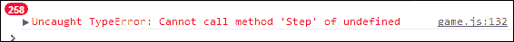
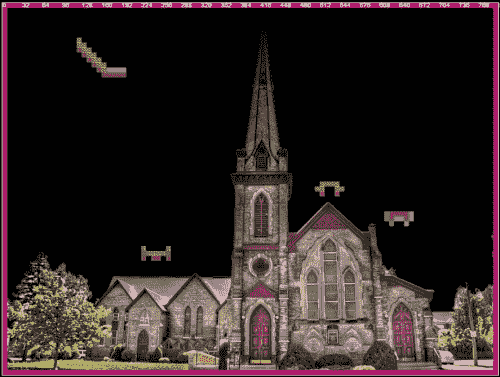
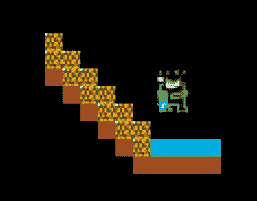
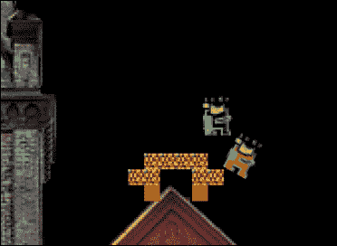
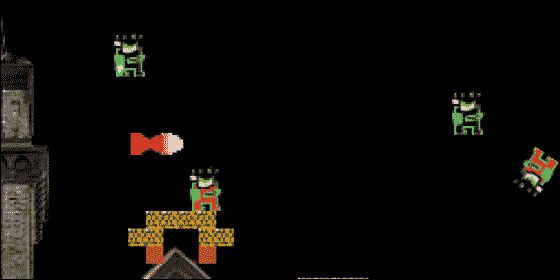

# 四、让我们建立一个侧滚游戏

在本章中，我们将使用 ImpactJS 和 Box2D 构建一个非常基本的侧滚游戏。Box2D 是一个开源的 C++物理引擎。有了它，重力和摩擦力就像你在愤怒的小鸟游戏中看到的那样被模拟了。虽然没有完全集成，但只要付出足够的努力，Box2D 可以在一个 ImpactJS 游戏中使用。就像前一章一样，一个游戏将从头开始构建。主要区别在于物理引擎的使用和侧边滚动条游戏的设置。

在本章中，我们将介绍:

*   侧滚游戏
*   将 Box2D 与 ImpactJS 一起使用
*   建立一个侧面的滚动关卡，用 Impact 关卡
*   引入一个可玩的角色
*   在侧卷轴上增加一些敌人
*   用子弹和炸弹武装玩家
*   用人工智能让敌人更聪明
*   创建玩家可以挑选的物品
*   每次敌人死了都要记分加分
*   连接两个不同的侧滚动条级别
*   以强敌结束比赛

# 侧滚游戏设置

一款侧滚动视频游戏是一款从侧面角度观看的游戏，玩家在玩关卡时一般会从左向右移动。屏幕基本上向侧面滚动，无论是从左向右还是任何其他方向，因此得名侧面滚动器。众所周知的侧滚游戏有 2D 马里奥、索尼克、金刚驴、老款 Mega Man 、超级任天堂和 Gameboy Metroid 游戏，以及古老但成功的双龙。

大多数这种类型的游戏都有一个长关卡，英雄需要通过这个关卡与怪物和死亡陷阱战斗或躲避来找到自己的路。当到达关卡的终点时，除了从头开始重放那个特定的关卡，通常没有回头的路。Metroid 在这方面有点奇怪，因为它是第一个以一个巨大的世界为特色的侧边滚动条，你可以像在标准角色扮演游戏中一样探索这个世界。Metroid 为思考侧阴囊的新方法创造了条件；你需要在虚拟的数英里洞穴中找到任何可能的方向，你偶尔会发现自己回到了起点。恶魔城是另一个侧滚冒险游戏的例子，这次使用了中世纪的设定。


现在我们已经了解了侧边滚动条是什么，让我们开始用 ImpactJS 构建一个侧边滚动条。

## 为 Box2D 准备游戏

在我们认真开始之前，我们需要确保所有文件都正确就位:

1.  从我们在[第 1 章](01.html "Chapter 1. Firing Up Your First Impact Game")*准备的原始 Impact 可下载文件夹中复制一份，启动您的第一个 Impact 游戏*。或者，你可以再次下载一个新的，并把它放在你的 XAMPP 服务器的`htdocs`目录。为您的文件夹命名；让我们完全原创，称之为`chapter4`。其他名字也可以。
2.  从 ImpactJS 网站下载物理演示，并进入其`plugins`文件夹。在这里你应该可以找到`Box2D`插件。创建您自己的`plugins`文件夹，并将`Box2D`扩展名放在那里。
3.  通过访问浏览器中的`localhost/chapter4`测试到目前为止是否一切正常。**它起作用了！**消息应该又一次在那里等着你。
4.  此外，我们需要更改一些 Box2D 核心文件。Box2D 并不是 ImpactJS 的产物，而是在 JavaScript 等价物开发出来之前，为基于 C++的游戏而发明的。多米尼克·萨伯斯基(ImpactJS 的创建者)将这个 JavaScript 版本与 ImpactJS 集成在一起。然而，也有一些缺陷，其中之一是错误的碰撞检测。因此，我们需要将其中一个原始文件换成一个解决这个问题的改编文件。从`chapter4`文件夹的可下载文件中取出`game.js`和`collision.js`脚本，并将其放入本地`Box2D`文件夹中。`collision.js`剧本是感谢亚伯拉罕·沃尔特斯提供的剧本。
5.  将`chapter4`文件夹的媒体文件复制到本地`media`文件夹。
6.  我们需要对主要剧本进行改编。我们的游戏将不再是标准 Impact 游戏类的扩展。

    ```html
    MyGame = ig.Game.extend({ 
    ```

7.  相反，它将是修改后的 Box2D 版本的扩展。因此，请务必更改以下代码:

    ```html
    MyGame = ig.Box2DGame.extend({
    ```

8.  我们需要 Box2D `game`文件来使用这个扩展名，所以在`main.js`脚本的开头包含它。

    ```html
    .requires(
      'impact.game',
      'impact.font',
      'plugins.box2d.game'
    )
    ```

9.  Finally, in order to test whether everything is working fine, we will need to load in a level with a collision layer. This is because Box2D needs the collision layer to create its world environment and their boundaries. Without a level, you will come across an error, that looks like the following:

    

10.  为此，从`chapter4`文件夹的`level`子文件夹中复制`testsetup.js`脚本，并将其放入本地`levels`文件夹中。将级别添加到所需的文件中。

    ```html
    'game.levels.testsetup'
    ```

11.  在主脚本的`init()`方法中插入一个`loadlevel()`函数。

    ```html
    init: function() {
        this.loadLevel( LevelTestsetup );
      },
    ```

12.  在你的浏览器中重新加载游戏，你应该会看到**它工作了！**消息。现在您已经看到了它，您可以将其从代码中删除。在主脚本的`draw()`方法里面。

    ```html
      var x = ig.system.width/2,
        y = ig.system.height/2;
        this.font.draw( 'It Works!', x, y, ig.Font.ALIGN.CENTER);
    ```

太好了。我们现在应该做好一切准备。我们要做的第一件事是建一个小的水平，有一个自己的操场。

# 建造一个侧滚关卡

为了建立等级，我们再次需要依靠 ImpactJS Weltmeister:

1.  在你的浏览器中打开日志`localhost/chapter4/Weltmeister.html`。我们没有任何实体可以玩，所以我们现在要添加的只是一些图形和一个碰撞层。这个碰撞层特别重要，因为 Box2D 扩展代码会寻找它，缺少它会使游戏崩溃。可以说，Box2D for ImpactJS 仍处于起步阶段，像这样的小错误是意料之中的。
2.  增加一层并命名为`collision`；Weltmeister 会自动将其识别为碰撞层。
3.  将其波形设置为`8`，图层尺寸设置为`100 x 75`。我们现在有一个 800 x 600 像素的画布可以玩。
4.  现在在边缘画一个方框，这样我们就有了一个封闭的环境，没有实体可以逃离。当重力发挥作用时，这将是非常重要的。没有坚实的基础，你肯定会得到一些意想不到的结果。
5.  现在添加一个新的层，并将其称为`background`。我们将使用一张图片作为这个级别的背景。
6.  从`media`文件夹中选择`church.png`文件作为波形图。我们的图片是 800 x 600 像素，所以它应该正好适合我们用碰撞层创建的区域。将波形设置为`100`，图层尺寸设置为`8 x 6`。在画布上画出教堂的图画。
7.  将你的等级保存为`level1`。

太好了，我们现在有了自己的基本水平。虽然它很空，一些额外的障碍会很好。只需按照以下步骤添加一些障碍:

1.  再增加一层叫做`platforms`。
2.  使用`tiles.png`文件作为波形图。它们在设计上很简单，但是可以作为你喜欢构建的任何平台的构建模块。将 tilesize 设置为`8`，将尺寸设置为`100 x 75`，与碰撞层完全相同。
3.  在开始绘制平台之前，打开与碰撞层链接的选项**。这样，以后就不需要用碰撞层追踪平台了。如果你不想让一个平台的每个部分都是实心的，你当然可以暂时关闭链接，给瓷砖上色，然后重新打开；这种联系不是追溯性的。**
4.  给关卡增加几个浮动平台；跟随你内心的渴望，看看它们应该是什么样子。
5.  当你觉得舞台已经摆好的时候，保存你的水平。
6.  将该级别添加到您的`main.js`脚本的`require()`功能中。

    ```html
    .requires(
      'impact.game',
      'impact.font',
      'plugins.box2d.game',

      'game.levels.testsetup',
      'game.levels.level1'
    )
    ```

7.  Make sure that the level called `level1` is loaded at the beginning, instead of our `testsetup` level, by changing the `loadLevel()` function parameter.

    ```html
        init: function() {
        // Initialize your game here; bind keys etc.
        this.loadLevel( LevelLevel1 );
      },
    ```

    

是时候给游戏增加一个可玩的实体了，这样我们就可以发现我们刚刚创造的惊人水平。

# 可玩角色

由于我们使用的是 Box2D，所以我们不会使用标准的 ImpactJS 实体，而是使用修改后的版本。尤其是一个实体在 Box2D 世界中的移动方式，才是最重要的。在标准的 ImpactJS 中，这是一个非常简单的过程，将你的角色图像向某个方向移动几个像素。然而，Box2D 与力一起工作；所以，为了移动，你需要克服重力甚至空气摩擦。但是让我们从建立一个基本的实体开始:

1.  打开一个新的 JavaScript 文件，保存为`entities`文件夹中的`player.js`。
2.  添加基本 Box2D 实体代码如下:

    ```html
    ig.module(
      'game.entities.player'
    )
    .requires(
      'plugins.box2d.entity'
    )
    .defines(function(){
      EntityPlayer = ig.Box2DEntity.extend({
      });
    });
    ```

3.  如您所见，术语`entity`是 Box2D 实体的扩展，因此需要 Box2D 实体插件文件。再一次，确保命名约定得到遵守，否则你的玩家实体不会出现在韦尔特米斯特。
4.  将`'game.entities.player'`参数添加到`main.js`脚本中。

如果你在做了这些修改后访问你的 Weltmeister，你会在你的实体层找到玩家。不过，他还不代表什么；目前它只不过是一个你无法控制的看不见的正方形。是时候通过添加动画表来改变他的隐形了。

```html
EntityPlayer = ig.Box2DEntity.extend({
  size: {x: 16, y:24},
  name: 'player',
  animSheet: new ig.AnimationSheet( 'media/player.png', 16, 24 ),
  init: function( x, y, settings ) {
    this.parent( x, y, settings );
    this.addAnim( 'idle', 1, [0] );
    this.addAnim( 'fly', 0.07, [1,2] );
  } 
});
```

有了前面的代码块，我们给了玩家一个尺寸和名字；但更重要的是，我们添加了图形。动画表仅包含两个图像，一个是玩家闲置时的图像，另一个是玩家飞行时的图像。这并不多，但对于一个简单的游戏来说已经足够了。当需要图形时，侧边滚动条游戏有相当大的优势。理论上，你只需要两个图像来代表一个角色；也就是说，一个用于静止的角色，另一个用于运动的角色。对于一个自上而下的游戏，你至少需要六张图片来完成同样的事情。这是因为，除了侧视，你还需要角色的正面和背面的图像。因此，如果你给玩家添加一个发射子弹的动画，这将导致侧边滚动条有一个额外的绘图，而自上而下的游戏有三个。很明显，如果你只有有限的资源来获得你的图形，侧边滚动游戏会更好。

我们现在可以把我们的球员加入到比赛中，他实际上是可见的，这太好了，但是我们还不能控制他。

添加玩家控制是在两个地方完成的，即主脚本和玩家脚本。在主脚本中，为游戏的`init()`方法添加控件。

```html
init: function() {
    // Bind keys
    ig.input.bind(ig.KEY.LEFT_ARROW, 'left' );
    ig.input.bind( ig.KEY.RIGHT_ARROW, 'right' );
    ig.input.bind( ig.KEY.X, fly);
//Load Level
    this.loadLevel( LevelLevel1 );
  },
```

在玩家脚本中，我们需要改变我们的`update()`功能，这样玩家就可以对我们的输入命令做出反应。

```html
update: function() {
  // move left or right
  if( ig.input.state('left') ) {
    this.body.ApplyForce( new b2.Vec2(-20,0),this.body.GetPosition() );
    this.flip = true;
  }
  else if( ig.input.state('right') ) {
    this.body.ApplyForce( new b2.Vec2(20,0),this.body.GetPosition() );
    this.flip = false;
  }
  // jetpack
  if( ig.input.state('fly') ) {
    this.body.ApplyForce( new b2.Vec2(0,-60),this.body.GetPosition() );
    this.currentAnim = this.anims.fly;
  }
  else {
    this.currentAnim = this.anims.idle;
  }
  this.currentAnim.flip.x = this.flip;
  this.parent();
}
```

在 Box2D 中，实体有一个额外的属性，即实体。为了移动身体，我们需要对它施加一个力。这正是我们使用身体`ApplyForce()`法时会发生的情况。我们在某个方向上施加一个力，所以我们实际上使用了一个矢量。向量的使用是 Box2D 的全部内容。只要我们保持按下右、左或飞行按钮，力就会被施加。然而，当被释放时，实体不会立即停止。不再施加力，但施加的力的效果需要一定的时间才能消失；这与我们在前面几章中使用的速度有很大的不同。

如果你将玩家添加到关卡中，确保他在左上角平台的顶部。左上角是默认可见的，我们还没有一个适应性强的视窗来跟随我们的玩家。准确地说，他现在还不需要一个可以站立的平台，因为我们的世界没有重力。让我们做点什么吧。在`main.js`脚本中将重力属性添加到您的游戏中，如下所示:

```html
MyGame = ig.Box2DGame.extend({
  gravity: 100,
```

让我们带我们的选手进行一次试飞，好吗？



你可能已经注意到，即使他飞得相当平稳，我们的喷气背包青蛙遇到的任何固体物体都会让他旋转。也许你真的不想这样。这尤其令人讨厌，因为他最终可能会头朝下，此时他的喷气背包火焰朝上。现在喷气背包的火焰朝上，如果激活喷气背包仍然会产生向上的推力，那就没什么意义了。因此，我们需要为他的稳定做点什么。这可以通过将车身固定在水平轴上来实现。将以下代码添加到青蛙的`update()`功能中:

```html
this.body.SetXForm(this.body.GetPosition(), 0);
```

现在玩家的身体被固定在与 x 轴成 0 度的角度。尝试将其更改为 45；你现在有一只疯狂的青蛙，总是身体向右倾斜飞行，即使是面向左边。

我们现在有一只飞翔而稳定的青蛙。只是太糟糕了，一旦我们向右移动太远，我们就看不到他了，否则重力会把我们带到水平面的底部。绝对是时候引进一个跟拍了。为此，我们需要对游戏的`update()`功能进行如下修改:

```html
update: function() {
    this.parent();
    var player = this.getEntitiesByType( EntityPlayer )[0];
    if( player ) {
      this.screen.x = player.pos.x - ig.system.width/2;
      this.screen.y = player.pos.y - ig.system.height/2;
    }
},
```

播放器被放入一个局部变量中，每帧检查一次它的位置，以更新屏幕的位置。因为我们从玩家的位置减去视口大小的一半，我们的玩家被整齐地保持在屏幕的中心。省略减法会使玩家停留在屏幕的左上角。

保存所有修改并绕过您创建的关卡；尽可能地享受宁静，因为敌人很快就会在这个地方挑起事端。

让我们快速回顾一下关于 Box2D 实体的内容，以及如何用它制作一个可玩的角色。Box2D 实体不同于 ImpactJS 实体，Box2D 利用矢量四处移动。矢量是方向和力的组合:

*   打开一个新的 JavaScript 文件，保存为`player.js`。
*   插入标准 Box2D 实体扩展代码。
*   在主脚本中包含玩家实体。
*   给播放器添加动画。也可以使用`flip`属性，该属性可以将你的图像翻转到一个垂直轴上，并将所需的角色图形切成两半，用于侧边滚动游戏。
*   添加玩家控制，可以向左、向右和向上移动。注意力是如何施加在物体上使其运动的。一旦输入按钮被释放并且没有施加更多的力，一旦力完全消散或者他撞上了坚固的墙，实体将继续前进并且完全停止。
*   引入重力作为游戏的属性。因为重力是一个恒定的向下的力，它会把所有的东西都拖到它遇到的第一个固体物体上，除非提供一个反作用力。对我们的飞行青蛙来说，他的喷气背包是他对抗重力的反作用力。
*   我们的青蛙还不知道如何稳定地飞行。把他固定在水平轴上，这样他就不会每次碰到固体时都旋转。
*   最后，我们需要一台照相机来跟踪我们要去的地方。在游戏的`update()`功能中加入自动跟随摄像头。

# 增加一个次要敌人

我们需要一些反对，一些一旦我们有武器就能从天而降的东西。因此，让我们再介绍一些青蛙吧！这次是敌对的:

1.  打开一个新文件，保存为`enemy.js`。
2.  将以下代码插入文件。这是获得我们的敌人在战场上的表现所必需的最低代码。因此，它已经包括动画表。

    ```html
    ig.module(
      'game.entities.enemy'
    )
    .requires(
      'plugins.box2d.entity'
    )
    .defines(function(){
    EntityEnemy = ig.Box2DEntity.extend({
    size: {x: 16, y:24},
    name: 'enemy',
    animSheet: new ig.AnimationSheet( 'media/enemy.png', 16, 24),
    init: function( x, y, settings ) {
      this.parent( x, y, settings );
      // Add the animations
      this.addAnim( 'idle', 1, [0] );
      this.addAnim( 'fly', 0.07, [1,2] );
      }
    })
    });
    ```

3.  在我们的`main.js`脚本中要求敌人实体。

    ```html
    'game.entities.enemy'
    ```

4.  将一个敌人添加到与威尔士人相同的等级。

由于我们的敌人目前非常没有防御能力，我们也可以把他从平台上击倒。



在正常的 ImpactJS 代码中，我们必须为这种情况的发生设置碰撞变量，否则，玩家和敌方青蛙将直接穿过对方。在 Box2D 中，这是不必要的，因为碰撞是自动假设的，力施加在我们用飞行青蛙撞击的每个可移动物体上。

因为我们有重力作用，把敌人放在某个位置的一个很好的选择是把他们放在水平的顶端。在游戏的`init()`功能中增加`spawnEntity()`功能。一个敌人会在那里产卵，重力会把它拖到底部。

```html
this.loadLevel( LevelLevel1 );
this.spawnEntity('EntityEnemy',300,30,null);
```

确保在液位加载或出现错误后使用`spawnEntity()`功能。一旦敌人有了自己的情报，在关卡顶端产卵敌人会更有意义。他们会掉下去，要么掉到最底部，要么直到他们到达一个平台，在那里他们会等待玩家并攻击它。

一旦我们为我们的红青蛙提供了一些基本的人工智能，我们就会把它变成一种非常讨厌的生物。但是，让我们首先通过在游戏中添加一些武器来为自己做准备。

让我们简要回顾一下我们是如何创造敌人的:

*   打开一个新的 JavaScript 文件，保存为`enemy.js`
*   插入标准 Box2D 实体扩展，附加动画表，并添加动画序列
*   在主脚本中包含敌方实体
*   用技能和`spawnentity()`方法增加一个敌人到关卡

# 引入强大的武器

武器是很棒的，尤其是当它们受到重力作用时，或者如果它们能对其他实体施加一些力的话。我们将在这里看两种类型的武器，即射弹和炸弹。

## 发射弹丸

抛射体将是我们对抗对手青蛙的主要武器，所以让我们从设置基础开始:

1.  打开一个新的 JavaScript 文件，保存为`entities`文件夹中的`projectile.js`。
2.  添加带有动画表和序列的基本 Box2D 实体代码，如以下代码片段所示:

    ```html
    ig.module(
      'game.entities.projectile'
    )
    .requires(
      'plugins.box2d.entity'
    )
    .defines(function(){
      EntityProjectile = ig.Box2DEntity.extend({
      size: {x: 8, y: 4},
      lifetime:60,
      name: 'projectile',
      animSheet: new ig.AnimationSheet( 'media/projectile.png', 8, 4),
      init: function( x, y, settings ) {
        this.parent( x, y, settings );
        this.addAnim( 'idle', 1, [0] );
      }
    });
    });
    ```

3.  除了名称、大小和执行动画的必要元素之外，我们已经包括了一个名为`lifetime`的属性。每一发炮弹都是从`60`的`lifetime`开始的。当子弹到达`0`时，我们将使其下落并将其杀死。这样我们就不会在一个游戏中获得过多的实体。每个实体都需要自己的计算，同时在屏幕上显示太多计算可能会显著降低游戏性能。可以使用 ImpactJS 调试器来保持对该性能的跟踪，该调试器可以通过在主脚本中包含`'impact.debug.debug'`命令来打开。
4.  将`game.entities.projectile`脚本添加到`main.js`脚本中。

如果我们愿意的话，我们现在可以通过使用韦尔特米斯特向游戏中添加投射物。然而，手动添加它们对我们没有太大的用处。让我们修改玩家的代码，这样我们的青蛙就可以产卵了。首先，将`'shoot'`状态绑定到主脚本中的一个键。

```html
ig.input.bind(ig.KEY.C, 'shoot' );
```

然后将以下代码添加到玩家的`update()`功能中。

```html
if(ig.input.pressed('shoot') ) {
  var x = this.pos.x + (this.flip ? -0 : 6);
  var y = this.pos.y + 6;
  ig.game.spawnEntity( EntityProjectile, x, y, {flip:this.flip} );
}
```

产生射弹需要在特定的位置进行，并且必须指向特定的方向，要么向左要么向右。我们任意将产卵点的 y 坐标设置为比我们玩家位置低`6`像素；我们也可以制作 10、20 或 200 像素。不过，在最后一个选项的情况下，看起来子弹好像是在玩家下方的某个地方产生的，这是相当不寻常的。然而，我们不要忘记，玩家的位置总是在其图像的左上角。考虑到我们青蛙的高度是 24 像素，看起来子弹就像是从嘴里生出的，这对青蛙来说相当酷。x 坐标是另一回事。如果青蛙朝左，我们不调整产卵坐标；如果他面朝右，我们会调整 6 个像素。玩家是否被翻转的信息不仅仅用于调整产卵坐标。它也作为可选的输入参数传递给射弹本身。在这里，它将被用来确定它应该面向哪一侧飞行。在发射子弹的时候，你可能会注意到青蛙被踢了一点，就像枪的后坐力一样。这是因为青蛙最初在产卵时占据了子弹要占据的空间。如果你想避免这种酷炫的效果，你所需要做的就是在离青蛙稍远的地方产卵子弹。如果你在此时加载游戏，你会注意到你的子弹会产生，但不会飞走。那是因为我们没有告诉子弹在它出现的时候这样做。

在射弹的`init()`功能中添加以下两行代码将纠正这种情况。

```html
this.currentAnim.flip.x = settings.flip;
var velocity = (settings.flip ? -10 : 10);
this.body.ApplyImpulse( new b2.Vec2(velocity,0),
this.body.GetPosition() );
```

在产生射弹时，我们现在施加脉冲而不是力。`ApplyImpulse()` 和`ApplyForce()`功能有显著区别。虽然`ApplyForce()`功能对身体施加恒定的力，`ApplyImpulse()`功能只施加一次，但是突然。你可以把它比作推一块石头，或者跑过去用你全部的力量和所有的动力撞上它。现实生活中的子弹和我们在这里模拟的一样；它被一次小爆炸扔掉，此后再也没有被推动过。本地变量`var.velocity`用于调整子弹的方向，就像动画取决于`settings.flip`参数的值一样。如果`flip`属性的值为假，则子弹将面向右侧并向右飞行。如果`flip`属性的值为真，动画将翻转，使其面向左侧。因为速度是负数，子弹也会飞向左边。

我们仍然可以在当前设置为`0`的 y 轴上调整我们的冲动。放一个负数会让我们的青蛙像高射炮一样向上射击。正数会让他像投弹手一样向下射击。试着玩玩这个看看效果。

我们的投射物还在四处徘徊，弄乱了屏幕，因为我们还没有很好地利用我们的`lifetime`属性。

让我们修改`update()`功能，以限制我们子弹的寿命。

```html
update: function(){
  this.lifetime -=1;
  if(this.lifetime< 0){this.kill();}
  this.parent();
}
```

每次游戏通过更新循环，每帧一次，射弹剩余寿命缩短 1。在每秒 60 帧的游戏中，给定总生命值 60，子弹在产生后还有 1 秒的生命。

我们可以用它向敌人射击，并用子弹的力量把他们推开，但我们还没有真正伤害他们。要做到这一点，我们需要检查我们是否击中了敌人。

```html
check: function(other){
  other.receiveDamage(10);
  this.kill();
}
```

增加这个修改后的`check()`功能，会让弹丸在杀死自己之前造成伤害，这还不够。即使碰撞是由 Box2D 自动处理的，但`check()`功能工作所需的参数却不是。我们还需要做一些事情:

1.  通过添加`TYPE`属性告诉敌人是 B 型实体，如下所示:

    ```html
    type: ig.Entity.TYPE.B,
    ```

2.  使用`checkAgainst`属性检查射弹是否与 B 型实体碰撞。

    ```html
    checkAgainst: ig.Entity.TYPE.B,
    ```

3.  现在保存并重新加载游戏。你现在可以杀死那些讨厌的红青蛙了。

试着让你的玩家成为一个 B 型实体。你的子弹会杀死你。这是因为我们让它们在已经被我们的青蛙占据的空间里产卵。正如我们之前看到的，这也是我们在发射子弹时有这种后坐力效应的原因。然而，这一次不仅仅是反冲；它实际上可以杀死玩家。所以我们最好不要让我们的玩家成为 B 型实体，否则我们应该在更远的地方产生我们的子弹，并失去后坐力效果。有东西保护我们自己是很棒的，即使其他青蛙还没有构成太大的威胁。在让它们起死回生之前，我们将很快看一看更具爆炸性的东西，炸弹。

在继续讨论炸弹之前，让我们再次快速了解一下我们是如何介绍我们的主要武器子弹的:

*   我们需要很多枪。
*   打开一个新的 JavaScript 文件，保存为`projectile.js`。
*   插入标准 Box2D 实体扩展，附加动画表，并添加动画序列。另外添加一个`lifetime`属性，它会记录子弹应该在游戏中停留多长时间。
*   在主脚本中包含投射实体。
*   在主脚本中向拍摄输入状态添加键绑定。
*   当玩家点击射击按钮时，让我们的飞行青蛙产生一个抛射体。
*   给子弹增加一点冲力，这样它就能真正地飞起来，而不是掉在地上。
*   检查子弹在空气中停留的时间，如果超过预设的寿命，就将其杀死。
*   让子弹检查敌人。如果遇到敌人，它应该造成伤害并杀死自己。
*   试着让子弹杀死玩家，但不要一直这样。

## 制造一枚真正的炸弹

制造炸弹的基础与射弹相同，事实上，它们与创建任何实体相同:

1.  打开一个新的 JavaScript 文件，并将其保存为`entities`文件夹中的`bomb.js`
2.  用动画表和序列添加基本的 Box2D 实体代码，如下所示:

    ```html
    ig.module(
      'game.entities.bomb'
    )
    .requires(
      'plugins.box2d.entity'
    )
    .defines(function(){
    EntityBomb = ig.Box2DEntity.extend({
      size: {x: 24, y: 10},
      type: ig.Entity.TYPE.A,
      checkAgainst: ig.Entity.TYPE.B,
      animSheet: new ig.AnimationSheet( 'media/bomb.png', 24, 10 ),
      lifespan: 100,
      init: function( x, y, settings ) {
        this.parent( x, y, settings );
        // Add the animations
        this.addAnim( 'idle', 1, [0] );
        this.currentAnim = this.anims.idle;
      }
    });
    });
    ```

3.  这一次我们已经给了我们的炸弹一个类型和一个类型来检查是否造成伤害
4.  将`game.entities.bomb`参数作为所需实体放入`main.js`脚本中

我们现在有一个炸弹，可以放在任何我们想放的地方。我们可以在接近我们的水平上限的地方增加一些炸弹，这样它们就会在水平载荷下落下来。如果真的会发生爆炸，那就太好了。我们将把那次爆炸作为一种只有我们的炸弹才能使用的单独方法。

```html
explosion:
function(minblastzone,maxblastzone,blastdamage,blastforcex,blastforcey){
  varEnemyList= ig.copy(ig.game.entities);
  var i = 0;
  //check every entity
  while(typeofEnemyList[i] != 'undefined'){
    Enemy = EnemyList[i];
    //calculate distance to entity
    distance = Math.sqrt((this.pos.x - Enemy.pos.x)*(this.pos.x -Enemy.pos.x) + (this.pos.y - Enemy.pos.y)*(this.pos.y -Enemy.pos.y));
    //adjust blastdirection depending on entity position
    if(this.pos.x - Enemy.pos.x< 0){adjustedblastforcex =blastforcex}
    else{adjustedblastforcex = - blastforcex}
    if(this.pos.y - Enemy.pos.y< 0){adjustedblastforcey = blastforcey}
    else{adjustedblastforcey = - blastforcey}//if within blastzone: blow up the targetif(minblastzone< distance && distance <maxblastzone){Enemy.body.ApplyImpulse(newb2.Vec2(adjustedblastforcex,adjustedblastforcey),this.body.GetPosition());
      Enemy.receiveDamage(blastdamage,this);}
      i++;
    }
}
```

就像`init()`、`update()`和`check()`方法一样，我们现在将`explosion()`方法插入到、炸弹实体中，这样它以后就可以使用它了。`explosion()`法取五个参数:

1.  **最小爆炸区**:如果一个实体比这个距离近，他不会被击中。这对于炸弹来说没有太大意义，除了它允许你在一枚炸弹中使用几次爆炸。这反过来使得当目标靠近炸弹时有可能有更高的伤害，而当他远离炸弹时有可能有更低的伤害。
2.  **最大爆炸区** : 任何比最大爆炸区更远的地方都不会受到爆炸的影响。
3.  **爆炸伤害**:这个是一个实体在爆炸区域内会受到的伤害。
4.  **Blastforcex** :这是 x 轴上的冲量，将应用于受影响的实体。它将决定目标向右或向左飞多远。
5.  **爆炸力**:这个是 y 轴上的冲量，将应用于受影响的实体。它将决定目标会飞多高。显然，如果炸弹爆炸时目标在炸弹下方，它会向下推动目标，而不是向上。

`explosion()`方法的工作方式如下。所有实体都被复制到一个局部变量中。然后一个接一个地检查实体，看它们与炸弹的距离。这里的距离计算为欧几里得距离。计算欧几里得距离或普通距离时，应用毕达哥拉斯公式。这个公式表明，如果已知另两条边的长度，可以计算出 90 度角三角形的任意边的长度。公式为 *a + b = c* ，其中 *c* 为三角形最长的边。根据倒霉的目标是位于炸弹的右侧还是左侧、上方还是下方，可以调整力的方向。最后，该功能检查距离是否在爆炸区的范围内。如果是这种情况，对目标施加伤害和脉冲。在这一点上，要么实体死亡，要么在空中飞行；不管怎样，这都不是好消息。

简单地加上这个`explosion()`方法，在我们真正使用之前是没有任何好处的。因此，我们需要修改我们的`update()`方法，这样我们就可以在炸弹寿命结束时将其炸毁。

```html
update: function(){
  //projectiles disappear after 100 frames
  this.lifespan -= 1;
  if(this.lifespan< 0){
    this.explosion(0,40,70,200,100);
    this.explosion(40,200,20,100,50);
    this.kill();
  }
  this.parent();
},
```

寿命部分的工作原理与射弹完全一样。然而，在这种情况下，我们不仅仅调用`kill()`函数，我们还使用了我们新开发的爆炸两次。我们可以只调用一次函数，并将爆炸范围值设置在 0 到 200 之间。如前所述，我们现在的优势是在炸弹附近的高伤害和压力之间进行划分，而在更远的地方则是低伤害和压力。技术上，我们可以使用任意多的爆炸；每一个都需要计算时间。不过，你想分多少取决于你自己。

在你真正开始在你的游戏中测试这种爆炸之前，确保把健康归因于你所有的实体。它们能否在爆炸的伤害中幸存下来，将取决于你是否给了它们足够的生命。由于默认值设置为 10，它们不会飞走，但如果使用以前的数字，它们会立即死亡。所以让我们给我们的玩家和敌人一个 100 的生命值，在他们各自的`init()`功能前加上这个属性。

```html
health: 100
```

作为最后的接触，当炸弹接触到我们的一只敌对青蛙时，我们可以让它爆炸。

```html
check: function(other){
    other.receiveDamage(30);
    this.explosion(0,40,70,200,100);
    this.explosion(40,200,20,100,50);
    this.kill();
}
```

我们已经通过设置`checkAgainst`属性来确保炸弹检查与 B 型实体的联系。把这块金属弄到脸上的直接伤害设定在`30`。接下来是爆炸本身，会造成价值 70 点的伤害，因为敌人距离太近了。第二次爆炸波会影响到更远的地方，直到炸弹最终自杀。

现在我们有一个炸弹，可以放在关卡中的任何地方，而且效果很好。然而，如果我们的玩家能自己生一个就更好了。在下面的步骤中，我们简单地重复我们对射弹做的事情，让玩家自己生成一个炸弹:

1.  给你的炸弹输入状态分配一个键盘按钮，如下面一行代码所示:

    ```html
    ig.input.bind(ig.KEY.V, 'bomb');
    ```

2.  改变玩家的`update()`功能，让玩家现在可以在以下代码的帮助下产卵炸弹:

    ```html
    if (ig.input.pressed('bomb')){
      var x = this.pos.x + (this.flip ? 0 : 8 );
      var y = this.pos.y + 25;
      ig.game.spawnEntity(EntityBomb,x,y, {flip:this.flip});
    }
    ```

3.  这里定义的产卵坐标不同于我们对抛射体所做的。`y`坐标很重要；设置在`25`是因为我们的飞蛙有`24`像素的高度。这样，炸弹总是在飞行青蛙的正下方产生。
4.  在炸弹的`init()`函数中添加下面一行代码，这样它就可以通过`flip`参数知道在产生炸弹时要面对哪一方。

    ```html
    this.currentAnim.flip.x = settings.flip;
    ```

5.  Save, reload, and bomb the hell out of those red frogs! Watch out though, bombs can kill you too.

    

炸弹是我们最大的武器；让我们快速回顾一下我们是如何构建它的:

*   打开一个新的 JavaScript 文件，保存为`bomb.js`。
*   插入标准 Box2D 实体扩展，附加动画表，并添加动画序列。增加一个寿命属性，可以记录炸弹爆炸前还有多长时间，如果不通过接触敌人提前引爆的话。
*   在主脚本中包含炸弹实体。
*   在关卡中加入炸弹。
*   介绍`explosion()`法；这是一个自定义功能，模拟爆炸的伤害和力的影响。
*   改变`update()`功能，让炸弹时间到了会爆炸。
*   使用`check()`功能检测与敌人的碰撞并立即引爆。
*   分配一个键盘快捷键来发射炸弹。
*   调整玩家的`update()`功能，这样当玩家命令它这样做时，炸弹就会产生。
*   让炸弹翻转到玩家正在看的方向。
*   乱来，开心地把青蛙吹成碎片！

# 人工智能

是时候让我们的红青蛙聪明一点了，这样它们至少有一点机会对抗我们新开发的武器库。在[第三章](03.html "Chapter 3. Let's Build a Role Playing Game")、*让我们建立一个角色扮演游戏*中，我们完全是按照书上说的做的，将决策与行为分开。我们制作了一个单独的人工智能(AI)文件用于决策，并且——一如既往——实际行为在实体的`update()`功能中。

这一次左右，我们会保持非常简单，把所有 AI 直接放到敌人的`update()`法中。这将证明，即使是一个简单的人工智能似乎也可以表现得相当聪明。

让我们用下面的代码修改敌人的`update()`功能:

```html
update: function(){
  var players = ig.game.getEntitiesByType('EntityPlayer');
  var player = players[0];
  // both distance on x axis and y axis are calculated
  var distanceX = this.pos.x - player.pos.x;
  var sign = Math.abs(distanceX)/distanceX;
  var distanceY = this.pos.y - player.pos.y;
  //try to move without flying, fly if necessary
  var col = ig.game.collisionMap.trace( this.pos.x, this.pos.y,player.pos.x, player.pos.y,16,8 );
  if (Math.abs(distanceX) < 110){
    var fY = distanceY> 0 ? -50: 0;
    this.body.ApplyForce( new b2.Vec2(sign * -20,fY),this.body.GetPosition() );
    if(distanceY>= 0){this.currentAnim = this.anims.fly;}
    else{this.currentAnim = this.anims.idle;}
  }
  this.body.SetXForm(this.body.GetPosition(), 0);
  if (distanceX> 0){this.currentAnim.flip.x = true;}
  else{this.currentAnim.flip.x = false;}
  this.parent();
  }
```

将这个功能插入你的敌人实体会让他试图抓住玩家。但是它是如何工作的呢？首先，玩家实体保存在名为`player`的函数局部变量中。计算敌人和玩家之间的水平距离和垂直距离。`sign`变量用于确定青蛙应该向左飞还是向右飞。他会一直向上飞；如果他需要下来是因为球员在他下面，他只会让重力做它的工作。飞行时，飞行动画处于活动状态，否则使用空闲动画，即使水平移动也是如此。

青蛙的身体被固定在 x 轴上，以防止它旋转，玩家也是如此。最后，动画向左或向右翻转，这取决于玩家相对于敌人的位置。

我们现在有一只青蛙，如果我们离它足够近，它会跟着我们。现在我们需要他对玩家造成一些伤害:

1.  确保敌人的类型和它需要检查的类型分别填写为 B 和 A。另外引入一个新的敌方属性`cooldowncounter`，如下代码所示:

    ```html
    type: ig.Entity.TYPE.B,
    checkAgainst: ig.Entity.TYPE.A,
    cooldowncounter: 0,
    ```

2.  `cooldowncounter`属性将记录自青蛙上次造成伤害以来已经过去了多少帧。
3.  `cooldowncounter`属性必须计数，因此将其添加到`update()`函数中:

    ```html
    this.cooldowncounter ++;
    ```

4.  扩展`check()`功能，使其检查自上次攻击以来是否经过了足够多的帧，如果是这种情况，则允许青蛙进行攻击，如以下代码所示:

    ```html
    check: function(other){
      if (this.cooldowncounter> 60){
        other.receiveDamage(10,this);
        this.cooldowncounter = 0;
      }
    }
    ```

青蛙现在可以对玩家使用讨厌的近战攻击。无论青蛙在近距离做了什么，每次攻击都会降低玩家的生命值 10。如果玩家不想很快失去生命，他现在肯定需要避开这些讨厌的生物。我们需要给球员一些额外的东西，让他在这场大屠杀中幸存下来。

AI 是让敌人值得对抗的东西。与我们在[第 3 章](03.html "Chapter 3. Let's Build a Role Playing Game")*中提到的不同，让我们构建一个角色扮演游戏*，尽管它并不总是需要成为一个复杂的事情。让我们快速了解一下我们是如何为侧边滚动条实现人工智能的:

*   改变`update()`功能，让敌人现在可以飞向玩家。这个新的`update()`功能就是敌方青蛙的 AI。与[第三章](03.html "Chapter 3. Let's Build a Role Playing Game")、*让我们构建一个角色扮演游戏*相反，这一次决策和行为都被包装在一段代码中。
*   引入一个冷却计数器，记录自上次攻击发生以来的帧数。还要确保敌方实体是 B 型，并检查它是否接触到 A 型实体。玩家应该是 A 型实体。
*   通过将其添加到修改后的`update()`函数中，使`cooldown`属性为通过的每一帧增加一个值 1。
*   将攻击纳入`check()`功能，让青蛙成为不可忽视的力量。

# 提货项目

我们的小青蛙现在可以被那些讨厌的红青蛙正式杀死了。这对他来说不是好消息，我们有责任提供一种方法来补充失去的健康。这是通过使用拾取项目来完成的，也就是说，实体在接触玩家时会消失，但在此过程中会产生有益的效果。

在我们添加一个实际的拾取物品之前，让我们先给游戏添加一个普通的箱子。

## 添加一个普通板条箱

我们的板条箱将作为我们能够发明的所有类型板条箱的原型。要创建板条箱，请执行以下步骤:

1.  打开一个新文件，保存为`crate.js`。
2.  将板条箱代码添加到文件中。

    ```html
    ig.module(
      'game.entities.crate'
    )
    .requires(
      'plugins.box2d.entity'
    )
    .defines(function(){
    EntityCrate = ig.Box2DEntity.extend({size: {x: 8, y: 8},
      health: 2000,
      name: 'crate',
      type: ig.Entity.TYPE.B,checkAgainst: ig.Entity.TYPE.A,
      animSheet: new ig.AnimationSheet( 'media/crate.png', 8, 8),
      init: function( x, y, settings ) {
        this.addAnim( 'idle', 1, [0] );
        this.parent( x, y, settings );
      }
    });
    });
    ```

3.  这个代码非常简单，因为板条箱只是一个没有生命的物体。不过这是一个坚硬无生命的物体，因为它的健康价值为`2000`。通过给予板条箱如此多的健康，它能够经受住多次炸弹爆炸。
4.  Save the file and add some to your game with the Weltmeister. Certainly try stacking a few of them before unleashing an explosion in their midst.

    

    

现在我们有了标准的板条箱；制作治疗板条箱只有几步之遥，因为我们将在普通板条箱的基础上建造它。

在查看我们的治疗板条箱之前，让我们快速了解一下我们是如何制作正常板条箱的:

*   创建一个新文件并保存为`crate.js`
*   实现标准 Box2D 实体代码
*   保存并添加一些箱子到游戏中

## 实施治疗箱

现在我们有了基本的原型箱，我们只需要在它的基础上创建健康箱。要构建健康箱，请执行以下步骤:

1.  打开一个新文件，保存为`crate.js`。
2.  添加`healthcrate`具体代码。健康板条箱是普通板条箱的扩展，而不是 Box2D 实体；因此，我们只需要指出健康箱与普通箱的不同之处:

    ```html
    ig.module(
      'game.entities.healthcrate'
    )
    .requires('game.entities.crate'
    ).defines(function(){
    EntityHealthcrate = EntityCrate.extend({
      name: 'healthcrate',
      animSheet: new ig.AnimationSheet( 'media/healthcrate.png', 8, 8),
      check: function(other){
        if(other.name == 'player'){
          other.health =  other.health + 100;
          this.kill();
        }
      }
    })
    });
    ```

3.  它有另一个名字和动画表。此外，它会治疗玩家，并在治疗玩家后摧毁自己。
4.  使用下面的代码将板条箱添加到主脚本中，这样你的游戏就知道它在那里了。

    ```html
    'game.entities.healthcrate'
    ```

5.  Save and add a crate to the game to check out its effects.

    

这个板条箱通过为玩家提供 **100** 的**生命值**来治疗玩家，如下图截图所示。因此，玩家最终的健康状况总是比游戏开始时要好。这只是一种选择；你可以通过实施生命值上限来改变这一点，以确保治疗不会让玩家比最初更强壮。


请记住，您始终可以使用 Firebug 加载项打开 Firefox，并在**文档对象模型** ( **DOM** ) 中查找玩家属性。在拿起板条箱之前，我们的玩家的生命值为 100，拿起板条箱后生命值升至 200。

治疗箱比普通的要复杂一些。让我们再一次看看我们制作治疗板条箱的步骤:

*   新建一个文件，保存为`healthcrate.js`。
*   扩展先前构建的板条箱，而不是 Box2D 实体。仅添加健康箱与原始箱不同的参数。这包括一个`check()`功能，查看它是否被玩家触摸过。
*   使用 Weltmeister 保存并添加一个箱子到游戏中。
*   在 DOM 中检查你的生命值箱是否真的增加了你的玩家的生命值。

# 记分

在游戏中记录分数是一件相当简单的事情。为了实现一个每次杀死一个敌人都保持和增加分数的系统，我们需要三样东西:

1.  我们需要一个保持跟踪的变量，它在游戏本身的边界内，但可以被视为某种开销变量。

    ```html
    .defines(function(){
    GameInfo = new function(){
     this.score = 0;
    },
    MyGame = ig.Box2DGame.extend({
    ```

2.  这真的很重要，因为正如我们将在[第 5 章](05.html "Chapter 5. Adding Some Advanced Features to Your Game")*中看到的那样，在你的游戏*中添加一些高级功能，开始和结束屏幕实际上是不同的游戏，正在被加载。当一个新游戏加载到内存中时，旧游戏会被丢弃，它的所有变量也会被丢弃。这就是为什么我们需要一个存在于游戏之外的变量。
3.  此功能用于将分数增加一定的分数。这一个被允许是游戏本身的一个方法。只需将此插入主脚本中`MyGame`文件的其他主要功能下面。

    ```html
    increaseScore: function(points){
      //increase score by certain amount of points
      GameInfo.score +=points;
    }
    ```

4.  我们覆盖敌人`kill()`功能如图所示，这样青蛙不仅不会死，还会给我们提供一些额外的点数。

    ```html
      kill: function(){
        ig.game.increaseScore(100);
        this.parent();
      }
    ```

从现在开始，每次一只红青蛙死了，我们都会得到额外的 100 分，这些都安全地保存在一个变量中，只要我们不刷新页面，这个变量就不会被擦除。然后，我们可以稍后使用这个变量在游戏结束时显示出来，为我们的游戏玩家提供一些关于他做得有多好或多差的反馈。

对于几乎任何游戏来说，保持分数都是一个非常重要的组成部分。这是一种挑战玩家重播你的游戏并做得更好的方式。实施起来也不太难；让我们看看我们做了什么:

*   在当前游戏之外创建一个变量，并调用该变量`score`
*   给游戏增加一个可以直接操控我们`score`变量的功能
*   当敌人死亡时，调用这个函数，给玩家的总得分增加点数

# 从一个级别过渡到另一个级别

为了有一个地图过渡，你首先需要一个第二级。你可以自己做一个，或者从本章的可下载文件中复制一个。您还需要触发结束`levelchange`实体。将两个实体复制到`entities`文件夹中，并将名为`level 2`的级别复制到本地计算机上的`levels`文件夹中。或者，您可以自己设计第二个级别并使用触发实体，该实体与您的 Impact 许可证一起提供。触发器实体不是实际引擎的一部分；它可以在 ImpactJS 网站上的可下载示例中找到。

在`levelchange`实体中，我们将进行以下代码更改:

```html
ig.module(
  'game.entities.levelchange'
)
.requires(
  'impact.entity'
)
.defines(function(){ 
EntityLevelchange = ig.Entity.extend({
  _wmDrawBox: true,
  _wmBoxColor: 'rgba(0, 0, 255, 0.7)',
  _wmScalable: true,
  size: {x: 8, y: 8},
  level: null,
  triggeredBy: function( entity, trigger ) {
    if(this.level) { 
      varlevelName = this.level.replace(/^(Level)?(\w)(\w*)/, function( m, l, a, b ) {
        return a.toUpperCase() + b;
        });
      var oldplayer = ig.game.getEntitiesByType( EntityPlayer )[0];
      ig.game.loadLevel( ig.global['Level'+levelName] );
      var newplayer = ig.game.getEntitiesByType( EntityPlayer )[0];
      newplayer = oldplayer;
    }
  },
  update: function(){}
});
});
```

您可能会注意到，它与我们在 RPG 中使用的不同，主要表现在以下两个方面:

*   它没有考虑到产卵点的使用。对于大多数侧阴囊来说，使用实际的产卵点并不是真正必要的。这是因为一旦一个关卡完成，你只能通过重新玩一遍来回到它。因此，我们不需要每个级别有多个产卵点，只需要一个产卵点。然而，如果我们只需要一个派生点，那么不使用 Void 实体就容易多了，就像我们在前面几章中所做的那样。相反，我们只需将玩家实体放在关卡中的某个位置，关卡就会一直从那里开始。
*   对`levelchange`实体的第二个改变是我们对玩家实体的备份。在加载关卡之前，我们将玩家实体复制到一个名为`oldplayer`的局部变量中。一旦游戏被加载，一个新的可玩角色被创建；这是我们手动添加到关卡中的一个，韦尔特米斯特中的`level 2`。然后，我们将这个新玩家分配给另一个名为`newplayer`的局部变量。通过用`oldplayer`覆盖`newplayer`，我们可以继续玩老青蛙。如果玩家被允许保留先前获得的辅助武器或生命值，这可能很重要。

我们现在所需要做的是在`level 1`正确地建立一个`trigger`和一个`levelchange`实体，我们有一个体面的等级转换。这应该按照以下步骤进行:

1.  一旦`trigger`和`levelchange`实体出现在`entities`文件夹中，将两者都添加到主脚本中。一旦您创建或复制了`level 2`，也要将其添加到脚本中。

    ```html
    'game.levels.level2',
    'game.entities.trigger',
    'game.entities.levelchange'
    ```

2.  使用 Weltmeister 将`trigger`和`levelchange`实体都放入`level 1`中。
3.  使用 Weltmeister 将值为`tolevel2`的`name`属性和值为`level2`的`level`属性添加到`levelchange`实体。
4.  使用 Weltmeister 向`trigger`实体添加一个名为`target.1`且值为`tolevel2`的属性。
5.  再次检查你的第二个关卡中是否有玩家实体，这个关卡的名字是`level2`。
6.  保存您所做的所有更改，并重新加载游戏进行测试运行。在使用等级转换之前，一定要试着收集一个健康箱。一旦你到达`level2`，你的健康增长应该会持续。

如果你从可下载的文件中复制 `level2`，注意恒星如何比宇宙飞船移动得慢，而宇宙飞船又比其他一些宇宙飞船移动得慢。这是因为这三层的距离。如果打开 Weltmeister，可以看到星层的距离值为 **5** ，最近的星舰的距离值为 **2** ，其他舰的距离值为 **3** 。处理距离可以给视差游戏带来非常好的效果；明智地使用它们。


增加一个等级转换可以以一种相对容易的方式完成，如果只是单向的话。让我们回顾一下我们是如何做到的:

*   复制`trigger`和`levelchange`实体。
*   建造或复制第二个关卡`level2`。确保在关卡中添加玩家实体。
*   在主脚本中包含新级别以及`trigger`和`levelchange`实体。
*   给`level 1`添加一个`trigger`和`levelchange`实体，连接它们，确保`levelchange`实体指向`level2`。
*   设计关卡时，尝试使用图层的`distance`属性。这可以给你一个美丽的结果，在一个侧滚动游戏。

# 最后的战斗

每一场好的游戏都以一场具有挑战性的最后战斗结束，在这场战斗中，正义战胜邪恶，反之亦然，这是你的决定。

为了进行一场具有挑战性的战斗，让我们创建一个单独的 `boss`实体，，它比我们其他的青蛙更强大。

1.  打开一个新文件，保存为`boss.js`。
2.  老板将是我们普通敌人的延伸，所以让我们首先定义他与红青蛙不同的特征。

    ```html
    ig.module(
      'game.entities.boss'
    )
    .requires(
      'game.entities.enemy'
    )
    .defines(function(){
      EntityBoss = EntityEnemy.extend({
      name: 'boss',
      size: {x: 32, y:48},
      health: 200,
      animSheet: new ig.AnimationSheet( 'media/Boss.png', 32,48 )
    });
    });
    ```

3.  他的名字不一样；但更重要的是，它会更健康，比其他青蛙大得多。
4.  使用以下代码行将 boss 添加到您的主脚本中:

    ```html
    'game.entities.boss'
    ```

5.  保存所有更改，并将老板放在您的一个级别中。

我们现在有了一个更大的敌人，有了更多的健康，他们基本上和较小的敌人做同样的事情。这并不能真正促成一场有趣的 boss 战斗，所以让我们像玩家一样给他发射子弹的能力。我们需要一个单独的子弹实体，因为我们的基本射弹只能伤害 B 型实体，而我们的玩家是 A 型；此外，我们可能希望它看起来有点不同:

1.  打开一个新文件，保存为`bossbullet.js`。
2.  除了类型检查和外观之外，此项目符号将是普通项目符号的直接扩展。编写以下代码来创建新的项目符号实体:

    ```html
    ig.module(
      'game.entities.bossbullet'
    )
    .requires(
      'game.entities.projectile'
    )
    .defines(function(){
      EntityBossbullet = EntityProjectile.extend({
      name: 'bossbullet',
      checkAgainst: ig.Entity.TYPE.A,
      animSheet: new ig.AnimationSheet( 'media/bossbullet.png',8, 4 )
      });
    });
    ```

3.  我们需要最后一次修改，如下代码所示，让老板自己发射子弹:

    ```html
    update: function(){
      var players = ig.game.getEntitiesByType('EntityPlayer');
      var player = players[0];
      // both distance on x axis and y axis are calculated
      var distanceX = this.pos.x - player.pos.x;
      var sign = Math.abs(distanceX)/distanceX;
      var distanceY = this.pos.y - player.pos.y;
      //try to move without flying, fly if necessary
      if (Math.abs(distanceX) < 1000 &&Math.abs(distanceX)>100){
        var fY = distanceY> 0 ? -350: 0;
        this.body.ApplyForce( new b2.Vec2(sign * -50,fY),this.body.GetPosition() );
        if(distanceX>0){this.flip = true;}
        else {this.flip = false;}
        if (Math.random() > 0.9){
          var x = this.pos.x + (this.flip ? -6 : 6 );
          var y = this.pos.y + 6;
          ig.game.spawnEntity( EntityBossbullet, x, y,{flip:this.flip} );
        }
        if(distanceY>= 0){this.currentAnim = this.anims.fly;}
        else{this.currentAnim = this.anims.idle;}
      }
      else if (Math.abs(distanceX) <= 100){
        if(Math.random() > 0.9){
          var x = this.pos.x + (this.flip ? -6 : 6 );
          var y = this.pos.y + 6;
          ig.game.spawnEntity( EntityBossbullet, x, y,{flip:this.flip} );
        }
      }
      this.body.SetXForm(this.body.GetPosition(), 0);
      if (distanceX> 0){this.currentAnim.flip.x = true;}
      else{this.currentAnim.flip.x = false;}
      this.cooldowncounter ++;
      this.parent();
    }
    ```

4.  boss 实体的`update()`功能在三个主要方面不同于其他功能:
    *   因为他是一个更大的生物，他使用更多的力量来移动。
    *   我们更喜欢他用子弹造成伤害，这样他就不会试图进入近战范围。当他在 x 轴上 1000 像素的距离内时，他就会靠近。一旦距离达到 100 像素，他就不再试图靠近。
    *   最后但并非最不重要的一点是，在每一帧中，他发射子弹的几率是十分之一。这应该平均导致每秒 6 发子弹，这是一个相当大的弹幕。如果你非常不幸，他可以在一秒钟内朝你发射多达 60 发子弹。

Box2D 碰撞的一个非常好的效果是，作为玩家，你自己的子弹可以偏转老板的子弹。然而，情况并非总是如此。Box2D 中的碰撞检测还不完善，有时两个实体可以直接穿过对方。这也是为什么你应该确保你的外部边界碰撞墙相当厚。否则，你会有实体飞出你的水平，可能会导致游戏崩溃。


杀死老板角色应该结束游戏，给玩家一个漂亮的胜利画面。死亡应该在游戏结束屏幕而不是游戏崩溃屏幕中结束。这些和许多其他的事情将在[第 5 章](05.html "Chapter 5. Adding Some Advanced Features to Your Game")、*增加一些高级功能到你的游戏*中解决，在这里我们将更深入地了解一些更高级的功能，你可以用它们来增强你的游戏。

当游戏快结束时，玩家期待高潮。这可以以史诗般的形式给予他，对抗一个值得尊敬的敌人。这正是我们在本章前面所做的。老板角色是玩家的终极敌人，也是他的胜利门票:

*   打开一个新文件，保存为`boss.js`。
*   创建 boss 角色的基础作为敌人实体的延伸。
*   介绍老板的子弹，也就是老板用来杀死玩家的弹丸。这是玩家自己使用的抛射体的延伸。
*   升级老板，让他可以使用致命的新子弹。
*   给你的游戏增加一个老板，看看你是否能打败他。

# 总结

在这一章中，我们了解了侧滚游戏，并看了一些著名的例子。我们用 Box2D 构建了自己的侧滚器，也就是一个集成了 ImpactJS 的物理引擎。

首先，我们用韦尔特米斯特建造了一个关卡，这样我们就可以用我们新创造的敌人和可玩的角色来填充他们。增加了无生命的板条箱，以充分展示 Box2D 的物理特性。为了武装玩家对抗暴力敌人，我们引入了拾取物品和两种有趣的武器，即子弹和炸弹。

我们的敌人被赋予了生命，一旦我们增加了轻微的人工智能。作为对玩家的最后挑战，令人生畏的老板被带到了现场。这个敌人比普通敌人更强，能够像玩家一样发射子弹。击败每一个敌人，玩家将获得额外的分数。

在下一章中，我们将探索一些新概念，如使用数据，并深入探讨我们已经触及的一些功能，如调试人工智能。