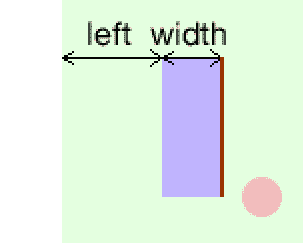

# 第二章：开始使用基于 DOM 的游戏开发

> 在第一章“介绍 HTML5 游戏”中，我们已经对整本书要学习的内容有了一个概念。从本章开始，我们将经历许多通过实践学习的部分，并且我们将在每个部分专注于一个主题。在深入研究尖端的 CSS3 动画和 HTML5 Canvas 游戏之前，让我们从传统的基于 DOM 的游戏开发开始。在本章中，我们将用一些基本技术热身。

在本章中，我们将：

+   准备开发工具

+   设置我们的第一个游戏-乒乓球

+   使用 jQuery JavaScript 库学习基本定位

+   获取键盘输入

+   使用记分的乒乓球游戏

以下屏幕截图显示了本章结束后我们将获得的游戏。这是一个由两名玩家同时使用一个键盘玩的乒乓球游戏：


所以，让我们开始制作我们的乒乓球。

# 准备开发环境

开发 HTML5 游戏的环境类似于设计网站。我们需要具有所需插件的 Web 浏览器和一个好的文本编辑器。哪个文本编辑器好是一个永无止境的争论。每个文本编辑器都有其自身的优势，所以只需选择您喜欢的即可。对于浏览器，我们将需要一个支持最新 HTML5、CSS3 规范并为我们提供方便的调试工具的现代浏览器。

现在互联网上有几种现代浏览器选择。它们是苹果 Safari（[`apple.com/safari/`](http://apple.com/safari/)）、Google Chrome（[`www.google.com/chrome/`](http://www.google.com/chrome/)）、Mozilla Firefox（[`mozilla.com/firefox/`](http://mozilla.com/firefox/)）和 Opera（[`opera.com`](http://opera.com)）。这些浏览器支持我们在整本书中讨论的大多数功能。我们将使用 Google Chrome 来演示本书中的大多数示例，因为它在 CSS3 过渡和 Canvas 上运行速度快且流畅。

# 为基于 DOM 的游戏准备 HTML 文档

每个网站、网页和 HTML5 游戏都以默认的 HTML 文档开始。此外，文档以基本的 HTML 代码开始。我们将从`index.html`开始我们的 HTML5 游戏开发之旅。

# 安装 jQuery 库的操作时间

我们将从头开始创建我们的 HTML5 乒乓球游戏。这可能听起来好像我们要自己准备所有的东西。幸运的是，至少我们可以使用一个 JavaScript 库来帮助我们。**jQuery**是我们将在整本书中使用的**JavaScript 库**。它将帮助我们简化我们的 JavaScript 逻辑：

1.  创建一个名为`pingpong`的新文件夹。

1.  在`pingpong`目录中创建一个名为`js`的新文件夹。

1.  现在是时候下载 jQuery 库了。转到[`jquery.com/`](http://jquery.com/)。

1.  选择**生产**并单击**下载 jQuery**。

1.  将`jquery-1.4.4.min.js`保存在我们在步骤 2 中创建的`js`文件夹中。

1.  创建一个名为`index.html`的新文档，并将其保存在第一个游戏文件夹中。

1.  在文本编辑器中打开`index.html`并插入一个空的 HTML 模板：

```js
<!DOCTYPE html>
<html lang="en">
<head>
<meta charset="utf-8">
<title>Ping Pong</title>
</head>
<body>
<header>
<h1>Ping Pong</h1>
</header>
<footer>
This is an example of creating a Ping Pong Game.
</footer>
</body>
</html>

```

1.  通过在 body 标签关闭之前添加以下行来包含 jQuery JavaScript 文件：

```js
<script src="img/jquery-1.4.4.min.js"></script>

```

1.  最后，我们必须确保 jQuery 已成功加载。我们将在 body 标签关闭之前并在 jQuery 之后放置以下代码：

```js
<script>
$(function(){
alert("Welcome to the Ping Pong battle.");
});
</script>

```

1.  保存`index.html`并在浏览器中打开它。我们应该看到以下警报窗口显示我们的文本。这意味着我们的 jQuery 已正确设置：


## 刚刚发生了什么？

我们刚刚创建了一个基本的带有 jQuery 的 HTML5 页面，并确保 jQuery 已正确加载。

## 新的 HTML5 doctype

在 HTML5 中，`DOCTYPE`和`meta`标签被简化了。

在 HTML4.01 中，我们声明 doctype 的代码如下：

```js
<!DOCTYPE HTML PUBLIC "-//W3C//DTD HTML 4.01//EN" "http://www.w3.org/TR/html4/strict.dtd">

```

这是一行很长的代码，对吧？在 HTML5 中，doctype 声明不能更简单：

```js
<!DOCTYPE html>

```

我们甚至没有在声明中使用 HTML 版本。这意味着 HTML5 将支持以前 HTML 版本的所有现有内容。未来的 HTML 版本也将支持 HTML5 的现有内容。

简化也适用于`meta`标签。现在我们可以使用以下简短的行来定义 HTML 的字符集：

```js
<meta charset=utf-8>

```

## 页眉和页脚

HTML5 带来了许多新功能和改进，其中之一就是语义。HTML5 添加了新元素来改进**语义**。我们刚刚使用了两个，`header`和`footer`。Header 为部分或整个页面提供了标题介绍。因此，我们将`h1`标题放在 header 内。Footer 与其名称相同，包含了部分或整个页面的页脚信息。

### 注意

语义 HTML 意味着标记本身提供了有意义的信息，而不仅仅定义了视觉外观。

## 放置 JavaScript 代码的最佳实践

我们将 JavaScript 代码放在所有页面内容之后和`</body>`标签之前。之所以将代码放在那里而不是放在`<head></head>`部分内，是有原因的。

通常，浏览器会从顶部到底部加载内容并呈现它们。如果将 JavaScript 代码放在`head`部分，那么直到所有 JavaScript 代码加载完毕，文档的内容才会被加载。实际上，如果浏览器在页面中间加载 JavaScript 代码，所有呈现和加载都将被阻塞。这就是为什么我们希望尽可能将 JavaScript 代码放在底部的原因。这样，我们可以以更高的性能提供内容。

在撰写本书时，最新的 jQuery 版本是 1.4.4。这就是为什么我们代码示例中的 jQuery 文件被命名为`jquery-1.4.4.min.js`。这个版本号会有所不同，但使用方式应该是相同的，除非 jQuery 发生了没有向后兼容的重大变化。

## 在页面准备就绪后运行我们的代码

我们需要确保页面在执行我们的 JavaScript 代码之前已经准备就绪。否则，当我们尝试访问尚未加载的元素时，可能会出现错误。jQuery 为我们提供了一种在页面准备就绪后执行代码的方法。以下是代码：

```js
jQuery(document).ready(function(){
// code here.
});

```

实际上，我们刚刚使用的是以下代码：

```js
$(function(){
// code here.
});

```

`$`符号是 jQuery 的快捷方式。当我们调用`$(something)`时，实际上是在调用`jQuery(something)`。

`$(function_callback)`是`ready`事件的另一个快捷方式。

这与以下内容相同：

```js
$(document).ready(function_callback);

```

同样，与以下内容相同：

```js
jQuery(document).ready(function_callback);

```

## 快速测验

1.  哪里是放置 JavaScript 代码的最佳位置？

a. 在`<head>`标签之前

b. 在`<head></head>`元素内

c. 在`<body>`标签之后

d. 在`</body>`标签之前

# 设置乒乓球游戏元素

我们已经准备好了准备工作，现在是设置乒乓球游戏的时候了。

# 行动时间 将乒乓球游戏元素放入 DOM

1.  我们将从 jQuery 安装示例继续。在文本编辑器中打开`index.html`。

1.  然后，在 body 中创建以下游乐场和 DIV 节点中的游戏对象。游乐场内有两个挡板和一个球。此外，游乐场位于游戏内：

```js
<div id="game">
<div id="playground">
<div id="paddleA" class="paddle"></div>
<div id="paddleB" class="paddle"></div>
<div id="ball"></div>
</div>
</div>

```

1.  我们现在已经准备好了游戏对象的结构，现在是给它们应用样式的时候了。将以下样式放在`head`元素内：

```js
<style>
#playground{
background: #e0ffe0;
width: 400px;
height: 200px;
position: relative;
overflow: hidden;
}
#ball {
background: #fbb;
position: absolute;
width: 20px;
height: 20px;
left: 150px;
top: 100px;
border-radius: 10px;
}
.paddle {
background: #bbf;
left: 50px;
top: 70px;
position: absolute;
width: 30px;
height: 70px;
}
#paddleB {
left: 320px;
}
</style>

```

1.  在最后一节中，我们将我们的 JavaScript 逻辑放在了 jQuery 包含之后。随着代码的不断增长，我们将把它放在一个单独的文件中。因此，在`js`文件夹中创建一个名为`html5games.pingpong.js`的文件。

1.  我们准备了 JavaScript 文件。现在是将它们链接到我们的 HTML 文件的时候了。在`index.html`中的`</body>`标签之前放入以下代码：

```js
<script src="img/jquery-1.4.4.js"></script>
<script src="img/html5games.pingpong.js"></script>

```

1.  我们将把游戏逻辑放在`html5games.pingpong.js`中。我们现在唯一的逻辑是以下挡板的初始化代码：

```js
// code inside $(function(){} will run after the DOM is loaded and ready
$(function(){
$("#paddleB").css("top", "20px");
$("#paddleA").css("top", "60px");
});

```

1.  我们将在浏览器中测试设置。在浏览器中打开`index.html`文件，我们应该看到与以下截图类似的屏幕：


## 刚刚发生了什么？

我们在乒乓球比赛中放了两个球拍和一个球。我们还使用 jQuery 来初始化两个球拍的位置。

## 介绍 jQuery

jQuery 是一个为了轻松浏览 DOM 元素、操作它们、处理事件和创建异步远程调用而设计的 JavaScript 库。

它包含两个主要部分：**选择**和**修改**。选择使用 CSS 选择器语法在网页中选择所有匹配的元素。修改操作修改所选元素，例如添加、删除子元素或样式。使用 jQuery 通常意味着将选择和修改操作链接在一起。

它包含两个主要部分：**选择**和**修改**。选择使用 CSS 选择器语法在网页中选择所有匹配的元素。修改操作修改所选元素，例如添加、删除子元素或样式。使用 jQuery 通常意味着将选择和修改操作链接在一起。

例如，以下代码选择所有具有`box`类的元素并设置 CSS 属性：

```js
$(".box").css({"top":"100px","left":"200px"});

```

## 理解基本的 jQuery 选择器

jQuery 是关于选择元素并对其执行操作。我们需要一种方法来在整个 DOM 树中选择我们需要的元素。jQuery 借用了 CSS 的选择器。选择器提供一组模式来匹配元素。以下表列出了我们在本书中将使用的最常见和有用的选择器：

| 选择器模式 | 含义 | 示例 |
| --- | --- | --- |
| $("Element") | 选择具有给定标签名称的所有元素 | `$("p")`选择所有的 p 标签。`$("body")`选择 body 标签。 |
| $("#id") | 选择具有给定属性 ID 的元素 | 提供以下代码：**<div id="box1"></div>**<div id="box2"></div>`$("#box1")`选择突出显示的元素。 |
| $(".className") | 选择具有给定类属性的所有元素 | 提供以下代码：**<div class="apple"></div>****<div class="apple"></div>**<div class="orange"></div><div class="banana"></div>`$(".apple")`选择具有设置为 apple 的类的突出显示的元素。 |
| $("selector1, selector2, selectorN") | 选择与给定选择器匹配的所有元素 | 提供以下代码：**<div class="apple"></div>****<div class="apple"></div>****<div class="orange"></div>**<div class="banana"></div>`$(".apple, .orange")`选择设置为 apple 或 orange 的突出显示的元素。 |

## 理解 jQuery CSS 函数

jQuery `css`是一个用于获取和设置所选元素的 CSS 属性的函数。

这是如何使用`css`函数的一般定义：

```js
.css(propertyName)
.css(propertyName, value)
.css(map)

```

`css`函数接受以下表中列出的几种类型的参数：

| 函数类型 | 参数定义 | 讨论 |
| --- | --- | --- |
| `.css(propertyName)` | `propertyName`是 CSS 属性 | 该函数返回所选元素的给定 CSS 属性的值。例如，以下代码返回`body`元素的`background-color`属性的值：`$("body").css("background-color")`它只会读取值，而不会修改属性值。 |
| `.css(propertyName, value)` | `propertyName`是 CSS 属性，`value`是要设置的值 | 该函数将给定的 CSS 属性修改为给定的值。例如，以下代码将所有具有`box`类的元素的背景颜色设置为红色：`$(".box").css("background-color","#ff0000")` |
| `.css(map)` | `map`是要更新的属性-值对集合 | 此函数用于同时将多个 CSS 属性设置为相同的选定元素。例如，以下代码将 ID 为`box1`的选定元素的左侧和顶部 CSS 属性都设置为：`$("#box1").css({"left" : "40px","top" : "100px"})` |

## 使用 jQuery 的好处

使用 jQuery 而不是纯 JavaScript 有几个优点，如下所示：

+   使用 jQuery 需要更短的代码来选择 DOM 节点并修改它们

+   更短的代码导致更清晰的代码阅读，这在通常包含大量代码的游戏开发中非常重要

+   编写更短的代码可以提高开发速度

+   使用 jQuery 库使得代码能够支持所有主要浏览器，无需额外的调整；jQuery 包装了纯 JavaScript 代码，并且自己处理跨浏览器的能力

## 使用 jQuery 在 DOM 中操作游戏元素

我们用 jQuery 初始化了球拍游戏元素。我们将进行一个实验，看看如何使用 jQuery 来放置游戏元素。

# 行动时间 使用 jQuery 改变元素的位置

让我们用网格背景检查一下我们的乒乓球游戏元素：

1.  我们将继续我们的乒乓球示例。

1.  我准备了一个网格图像。从以下 URL 下载`pixel_grid.jpg`图像：

[`gamedesign.cc/html5games/pixel_grid.jpg`](http://gamedesign.cc/html5games/pixel_grid.jpg )

1.  在示例目录中创建一个名为`images`的文件夹。

1.  将`pixel_grid.jpg`放入 images 文件夹中。这个图像可以帮助我们稍后检查像素位移。

1.  接下来，在文本编辑器中打开`index.html`文件。

1.  修改`playground` DIV 的`background`属性，包括像下面这样的像素网格图像：

```js
#playground{
background: #e0ffe0 url(images/pixel_grid.jpg);
width: 400px;
height: 200px;
position: relative;
overflow: hidden;
}

```

1.  现在在 web 浏览器中打开`index.html`，我们应该有以下的截图。游戏元素叠加在网格图像的顶部，所以我们可以看到元素的放置位置：


## 刚刚发生了什么？

我们通过放置一个名为`pixel_grid.jpg`的图像来开始示例。这是我为了方便调试而创建的图像。图像被分成小网格。每个 10 x 10 的网格形成一个 100 x 100 像素的大块。通过将这个图像作为 DIV 的背景，我们放置了一个标尺，使我们能够测量其子 DIV 在屏幕上的位置。

## 理解绝对位置的行为

当一个 DOM 节点被设置为`absolute`位置时，left 和 top 属性可以被视为**坐标**。我们可以将 left/top 属性视为 X/Y 坐标，Y 正方向向下。以下图表显示了它们之间的关系。左侧是实际的 CSS 值，右侧是我们在编程游戏时的坐标系：


默认情况下，left 和 top 属性是指网页的左上角。当这个 DOM 节点的任何父节点都显式设置了`position`样式时，这个参考点就会不同。left 和 top 属性的参考点变成了那个父节点的左上角。

这就是为什么我们需要将游乐场设置为相对位置，所有游戏元素都在绝对位置内。我们示例中的以下代码片段显示了它们的位置值：

```js
#playground{
position: relative;
}
#ball {
position: absolute;
}
.paddle {
position: absolute;
}

```

## 小测验

1.  使用哪个 jQuery 选择器，如果你想选择所有的标题元素？

a. $("#header")

b. $(".header")

c. $("header")

d. $(header)

# 从玩家那里获取键盘输入

这本书是关于游戏开发的。我们可以将游戏开发看作是以下循环：

1.  游戏状态被可视化显示。

1.  玩家输入他们的命令。

1.  游戏根据玩家的输入在设计好的游戏机制下运行。

1.  再次从步骤 1 开始循环该过程。

在之前的章节中，我们学会了如何用 CSS 和 jQuery 显示游戏对象。接下来我们需要在游戏中获取玩家的输入。在本章中我们将讨论键盘输入。

# 行动时间 通过键盘输入移动 DOM 对象

我们将创建一个传统的乒乓球游戏。左右两侧有两个球拍。球放在操场的中间。玩家可以通过使用*w*和*s*键来控制左球拍的上下移动，使用*箭头上*和*下*键来控制右球拍。我们将专注于键盘输入，将球的移动留到后面的部分：

1.  让我们继续进行`pingpong`目录。

1.  打开`html5games.pingpong.js`文件，其中包含我们的游戏逻辑。我们现在唯一的逻辑是监听按键按下事件并移动相应的球拍上下。用以下代码替换文件中的内容：

```js
var KEY = {
UP: 38,
DOWN: 40,
W: 87,
S: 83
}
$(function(){
// listen to the key down event
$(document).keydown(function(e){
switch(e.which){
case KEY.UP: // arrow-up
// get the current paddle B's top value in Int type
var top = parseInt($("#paddleB").css("top"));
// move the paddle B up 5 pixels
$("#paddleB").css("top",top-5);
break;
case KEY.DOWN: // arrow-down
var top = parseInt($("#paddleB").css("top"));
// move the paddle B down 5 pixels
$("#paddleB").css("top",top+5);
break;
case KEY.W: // w
var top = parseInt($("#paddleA").css("top"));
// move the paddle A up 5 pixels
$("#paddleA").css("top",top-5);
break;
case KEY.S: // s
var top = parseInt($("#paddleA").css("top"));
// move the paddle A drown 5 pixels
$("#paddleA").css("top",top+5);
break;
}
});
keyboard inputkeyboard inputDOM objects, moving});

```

1.  让我们测试游戏的球拍控制。在 Google Chrome 中打开`index.html`。尝试按下*w*键、*s*键和*箭头上*和*下*。两个球拍应该能够根据输入向上或向下移动，但现在它们不能同时移动。


## 刚刚发生了什么？

让我们看看我们刚刚使用的 HTML 代码。HTML 页面包含页眉、页脚信息和一个 ID 为`game`的 DIV。游戏节点包含一个名为 playground 的子节点。playground 包含三个子节点，两个球拍和一个球。

我们通常通过准备一个结构良好的 HTML 层次结构来开始 HTML5 游戏开发。HTML 层次结构帮助我们将类似的游戏对象（即一些 DIV）分组在一起。这有点像在 Adobe Flash 中将资产分组到电影剪辑中，如果你以前用过它制作动画的话。我们也可以将其视为游戏对象的图层，以便我们可以轻松地选择和样式化它们。

## 理解键码

键盘上的每个键都被分配一个数字。通过获取该数字，我们可以找出按下了哪个键。我们监听 jQuery 的`keydown`事件监听器。事件触发时，`event`对象包含**键码**。我们可以通过调用`which`函数来获取按下键的键码。

您可以尝试在`keydown`事件监听器中添加一个控制台日志函数，并观察每个键的表示整数：

```js
$(document).keydown(function(e){
console.log(e.which);
keyboard inputkeyboard inputkey code});

```

## 使常量更易读

在我们的例子中，我们使用键码来检查玩家是否按下我们感兴趣的键。以箭头上键为例。它的键码是 38。我们可以简单地将键码与数字直接进行比较，如下所示：

```js
$(document).keydown(function(e){
switch(e.which){
case 38:
// do something when pressed arrow-up
}
}

```

然而，这并不是一种推荐的做法，因为它使游戏代码更难以维护。想象一下，如果以后我们想要将动作从箭头上键映射到另一个键。我们可能不确定 38 是否表示箭头上。相反，我们可以使用以下代码为常量赋予一个有意义的名称：

```js
var KEY = {
UP: 38,
DOWN: 40,
W: 87,
S: 83
}
// listen to the key down event
$(document).keydown(function(e){
switch(e.which){
case KEY.UP:
// do something when pressed arrow-up
}
}

```

通过给 38 命名为`KEY.UP`，我们可以确保代码块与箭头上键相关联，因此在维护游戏时我们可以毫无疑问地进行修改。

## 使用 parseInt 函数将字符串转换为数字

在大多数情况下，我们通过使用格式如**100px**来将左侧和顶部的 CSS 样式应用于 DOM 元素。在设置属性时，我们指定单位。当获取属性的值时也是一样的。当我们调用`$("#paddleA").css("top")`时，我们得到的值是**100px**而不是**100**。这在我们想要对该值进行算术运算时会给我们带来问题。

在大多数情况下，我们通过使用格式如**100px**来将左侧和顶部的 CSS 样式应用于 DOM 元素。在设置属性时，我们指定单位。当获取属性的值时也是一样的。当我们调用`$("#paddleA").css("top")`时，我们得到的值是**100px**而不是**100**。这在我们想要对该值进行算术运算时会给我们带来问题。

在这个例子中，我们想通过将球拍的`top`属性设置为其当前位置减去五个像素来将球拍移动到上方。假设球拍 A 现在的`top`属性设置为 100px。如果我们使用以下表达式来添加五个像素，它会失败并返回`100px5`：

```js
$("#paddleA").css("top") + 5

```

这是因为 JavaScript 执行了`css`函数并得到了"100px"。然后它将"5"附加到"100px"字符串上。

在进行任何数学运算之前，我们需要一种方法来转换"100px"字符串。

JavaScript 为我们提供了`parseInt`函数。

这是如何使用`parseInt`函数的一般定义：

```js
parseInt(string, radix)

```

`parseInt`函数需要一个必需参数和一个可选参数：

| 参数 | 定义 | 讨论 |
| --- | --- | --- |
| 字符串 | 要解析的字符串 | 该函数解析字符串的第一个数字。如果给定的字符串无法转换为数字，则返回`NaN`，即非数字。它将默认以十六进制解析以"0x"开头的字符串。以下代码是例子：`parseInt("100px")`返回 100。`parseInt("5cm")`返回 5。`parseInt("0xF")`返回 15。 |
| 基数 | 可选。用于指示要使用的数字系统的数字 | 第二个参数强制`parseInt`函数解析给定数字系统中的字符串。例如：`parseInt("0x10")`返回 16`parseInt("0x10",10)`返回 0`parseInt("FF",16)`返回 255 |

## 在控制台面板中直接执行 JavaScript 表达式

你还应该知道，你可以通过直接在控制台窗口中输入 JavaScript 表达式来执行 JavaScript 表达式。控制台窗口是 Google Chrome 开发者工具中的一个工具。(其他浏览器中也有类似的工具)。我们可以通过点击**扳手图标 | 工具 | 开发者工具 | 控制台**来打开控制台。

这是一个方便的方法，在开发过程中，当你不确定一个简单表达式是否有效时，可以快速测试一下。以下截图测试了两个`parseInt`表达式的返回值：

在控制台面板中直接执行 JavaScript 表达式

## 试试吧

有时将字符串转换为整数可能会很棘手。你知道*10 秒 20*的`parseInt`结果是什么吗？*10x10*和*$20.5*呢？

现在是时候打开控制台面板，尝试将一些字符串转换为数字。

## 检查控制台窗口

我们现在正在编写更复杂的逻辑代码。在开发者工具的控制台上保持警惕是一个好习惯。如果代码中包含任何错误或警告，错误消息将会出现在那里。它报告发现的任何错误以及包含错误的代码行。在测试 HTML5 游戏时，保持控制台窗口打开非常有用和重要。我曾经看到很多人因为代码不起作用而束手无策。原因是他们有拼写错误或语法错误，而他们在与代码搏斗数小时后才检查控制台窗口。

以下截图显示了`html5games.pingpong.js`文件的第 25 行存在错误。错误消息是**赋值中的无效左侧**。检查代码后，我发现我在设置 jQuery 中的 CSS `top`属性时错误地使用了等号(=)：

```js
$("#paddleA").css("top"=top+5);
// instead of the correct code:
// $("#paddleA").css("top", top+5);

```


# 支持多个玩家的键盘输入

以前的输入方法只允许一次输入。键盘输入也不太顺畅。现在想象一下，两个玩家一起玩乒乓球游戏。他们无法很好地控制球拍，因为他们的输入会干扰对方。在本节中，我们将修改我们的代码，使其支持多个键盘输入。

# 行动时间 使用另一种方法监听键盘输入

我们将使用另一种方法来处理按键按下事件。这种方法会更加顺畅，并支持同时进行多个输入：

1.  打开我们在上一节中使用的`html5games.pingpong.js`。

1.  删除我们在那里编写的所有代码。从头开始会更简单。

1.  我们需要一个全局变量数组来存储按键的状态。在打开的 JavaScript 文件中输入以下代码：

```js
var pingpong = {}
pingpong.pressedKeys = [];

```

1.  接下来的事情是页面加载并准备就绪后执行代码。它将监听并标记按下的键。将以下代码放在我们刚刚编写的两行代码之后的 JavaScript 文件中：

```js
$(function(){
// set interval to call gameloop every 30 milliseconds
pingpong.timer = setInterval(gameloop,30);
// mark down what key is down and up into an array called "pressedKeys"
$(document).keydown(function(e){
pingpong.pressedKeys[e.which] = true;
});
$(document).keyup(function(e){
pingpong.pressedKeys[e.which] = false;
});
});

```

1.  我们已经存储了按下的键。我们缺少的是实际移动挡板。我们设置了一个定时器来连续调用一个移动挡板的函数。将以下代码粘贴到`html5games.pingpong.js`文件中：

```js
function gameloop() {
movePaddles();
}
function movePaddles() {
// use our custom timer to continuously check if a key is pressed.
if (pingpong.pressedKeys[KEY.UP]) { // arrow-up
// move the paddle B up 5 pixels
var top = parseInt($("#paddleB").css("top"));
$("#paddleB").css("top",top-5);
}
if (pingpong.pressedKeys[KEY.DOWN]) { // arrow-down
// move the paddle B down 5 pixels
var top = parseInt($("#paddleB").css("top"));
$("#paddleB").css("top",top+5);
}
if (pingpong.pressedKeys[KEY.W]) { // w
// move the paddle A up 5 pixels
var top = parseInt($("#paddleA").css("top"));
$("#paddleA").css("top",top-5);
}
if (pingpong.pressedKeys[KEY.S]) { // s
// move the paddle A down 5 pixels
var top = parseInt($("#paddleA").css("top"));
$("#paddleA").css("top",top+5);
}
}

```

1.  让我们测试一下我们刚刚编写的代码。保存所有文件，然后在 Web 浏览器中打开`index.html`。

1.  尝试按键控制两个挡板。两个挡板应该平稳移动，并且同时响应，没有中断。

## 刚刚发生了什么？

我们使用了另一种方法来捕获键盘输入。我们不是在检测到按键按下后立即执行动作，而是存储哪些键被按下，哪些没有。然后，我们使用 JavaScript 间隔每 30 毫秒检查按下的键。这种方法使我们能够同时知道当时按下的所有键，因此我们可以同时移动两个挡板。

## 更好地声明全局变量

**全局变量**是可以在整个文档中全局访问的变量。在任何函数外声明的变量都是全局变量。例如，在以下示例代码片段中，`a`和`b`是全局变量，而`c`是一个**局部变量**，只存在于函数内部：

```js
var a = 0;
var b = "xyz";
function something(){
var c = 1;
}

```

由于全局变量在整个文档中都可用，如果我们将不同的 JavaScript 库集成到网页中，可能会增加变量名冲突的可能性。作为良好的实践，我们应该将所有使用的全局变量放入一个对象中。

在*行动时间*部分，我们有一个全局数组来存储所有按下的键。我们不仅将这个数组放在全局范围内，而是创建了一个名为`pingpong`的全局对象，并将数组放在其中：

```js
var pingpong = {}
pingpong.pressedKeys = [];

```

将来，我们可能需要更多的全局变量，我们将把它们全部放在`pingpong`对象中。这样可以将名称冲突的机会减少到只有一个名称，`pingpong`。

## 使用 setInterval 函数创建 JavaScript 定时器

按下的键存储在数组中，我们有一个定时器定期循环和检查数组。这可以通过 JavaScript 中的`setInterval`函数来实现。

以下是`setInterval`函数的一般定义：

```js
setInterval(expression, milliseconds)

```

`setInterval`接受两个必需的参数：

| 参数 | 定义 | 讨论 |
| --- | --- | --- |
| 表达式 | 要执行的函数回调或代码表达式 | 表达式可以是函数回调的引用或内联代码表达式。内联代码表达式需要引号，而函数回调的引用则不需要。例如，以下代码每 100 毫秒调用`hello`函数：setInterval(hello,100);以下代码每 100 毫秒调用带参数的`hi`函数：setInterval("hi('Makzan')",100); |
| 毫秒 | 表达式每次执行之间的持续时间，以毫秒为单位 | 时间间隔的单位是毫秒。因此，将其设置为 1000 意味着每秒运行一次表达式。 |

## 理解游戏循环

我们有一个定时器，每 30 毫秒执行一些与游戏相关的代码，因此这段代码每秒执行 33.3 次。在游戏开发中，这称为**游戏循环**。

在游戏循环中，我们将执行几个常见的事情：

+   处理用户输入，我们刚刚做了

+   更新游戏对象的状态，包括位置和外观

+   检查游戏结束

在游戏循环中实际执行的内容因不同类型的游戏而异，但目的是相同的。游戏循环定期执行，以帮助游戏平稳运行。

# 使用 JavaScript 间隔移动 DOM 对象

现在想象一下，我们可以使小红球在操场上移动。当它击中球拍时，球会弹开。当球通过球拍并击中球拍后面的操场边缘时，玩家将失去得分。所有这些操作都是通过 jQuery 在 HTML 页面中操纵 DIV 的位置。要完成这个乒乓球游戏，我们的下一步是移动球。

# 用 JavaScript 间隔移动球的时间

我们刚刚学习并使用了`setInterval`函数来创建一个定时器。我们将使用定时器每 30 毫秒移动球一点。当球击中操场边缘时，我们还将改变球运动的方向。现在让球动起来：

1.  我们将使用我们上一个示例，监听多个键盘输入，作为起点。

1.  在文本编辑器中打开`html5games.pingpong.js`文件。

1.  我们现在正在移动球，我们需要全局存储球的状态。我们将把与球相关的变量放在`pingpong`对象中：

```js
pingpong.ball = {
speed: 5,
x: 150,
y: 100,
directionX: 1,
directionY: 1
}

```

1.  在每个游戏循环中，我们都会移动球拍。现在我们也会移动球。在`gameloop`函数中添加一个`moveBall`函数调用：

```js
function gameloop() {
moveBall();
movePaddles();
}

```

1.  是时候定义`moveBall`函数了。该函数分为四个部分，它获取当前球的位置，检查操场的边界，在击中边界时改变球的方向，并在所有这些计算之后实际移动球。让我们把以下`moveBall`函数定义放在 JavaScript 文件中：

```js
function moveBall() {
// reference useful variables
var playgroundHeight = parseInt($("#playground").height());
var playgroundWidth = parseInt($("#playground").width());
var ball = pingpong.ball;
// check playground boundary
// check bottom edge
if (ball.y + ball.speed*ball.directionY > playgroundHeight)
{
ball.directionY = -1;
}
// check top edge
if (ball.y + ball.speed*ball.directionY < 0)
{
ball.directionY = 1;
}
// check right edge
if (ball.x + ball.speed*ball.directionX > playgroundWidth)
{
ball.directionX = -1;
}
// check left edge
if (ball.x + ball.speed*ball.directionX < 0)
{
ball.directionX = 1;
}
ball.x += ball.speed * ball.directionX;
ball.y += ball.speed * ball.directionY;
// check moving paddle here, later.
// actually move the ball with speed and direction
$("#ball").css({
"left" : ball.x,
"top" : ball.y
});
}

```

1.  我们已经准备好了每 30 毫秒移动一次球的代码。保存所有文件并在 Google Chrome 中打开`index.html`进行测试。

1.  球拍的工作方式与上一个示例中的相同，球应该在操场上移动。

## 刚刚发生了什么？

我们刚刚成功地使球在操场上移动。我们有一个循环，每 30 毫秒运行一次常规游戏逻辑。在游戏循环中，我们每次移动球五个像素。

球的三个属性是速度和方向 X/Y。速度定义了球在每一步中移动多少像素。方向 X/Y 要么是 1，要么是-1。我们用以下方程移动球：

```js
new_ball_x = ball_x_position + speed * direction_x
new_ball_y = ball_y_position + speed * direction_y

```

方向值乘以移动。当方向为 1 时，球向轴的正方向移动。当方向为-1 时，球向负方向移动。通过切换 X 和 Y 方向，我们可以使球在四个方向上移动。

我们将球的 X 和 Y 与操场 DIV 元素的四个边缘进行比较。这将检查球的下一个位置是否超出边界，然后我们在 1 和-1 之间切换方向以创建弹跳效果。

# 开始碰撞检测

在上一节中移动球时，我们已经检查了操场的边界。现在我们可以用键盘控制球拍并观察球在操场上移动。现在还缺少什么？我们无法与球互动。我们可以控制球拍，但球却像它们不存在一样穿过它们。这是因为我们错过了球拍和移动球之间的碰撞检测。

# 与球拍击球的时间

我们将使用类似的方法来检查碰撞的边界：

1.  打开我们在上一节中使用的`html5games.pingpong.js`文件。

1.  在`moveball`函数中，我们已经预留了放置碰撞检测代码的位置。找到带有`// check moving paddle here`的行。

1.  让我们把以下代码放在那里。该代码检查球是否与任一球拍重叠，并在它们重叠时将球弹开：

```js
// check left paddle
var paddleAX = parseInt($("#paddleA").css("left"))+parseInt($("#paddleA").css("width"));
var paddleAYBottom = parseInt($("#paddleA").css("top"))+parseInt($("#paddleA").css("height"));
var paddleAYTop = parseInt($("#paddleA").css("top"));
if (ball.x + ball.speed*ball.directionX < paddleAX)
{
if (ball.y + ball.speed*ball.directionY <= paddleAYBottom &&
ball.y + ball.speed*ball.directionY >= paddleAYTop)
{
ball.directionX = 1;
}
}
// check right paddle
var paddleBX = parseInt($("#paddleB").css("left"));
var paddleBYBottom = parseInt($("#paddleB").css("top"))+parseInt($("#paddleB").css("height"));
var paddleBYTop = parseInt($("#paddleB").css("top"));
if (ball.x + ball.speed*ball.directionX >= paddleBX)
{
if (ball.y + ball.speed*ball.directionY <= paddleBYBottom &&
ball.y + ball.speed*ball.directionY >= paddleBYTop)
{
ball.directionX = -1;
}
}

```

1.  当球击中操场的左侧或右侧边缘后，我们还需要将球重置在中间区域。删除`check right`和`check left`代码部分中的弹球代码，并粘贴以下代码：

```js
// check right edge
if (ball.x +ball.speed*ball.directionX > playgroundWidth)
{
// player B lost.
// reset the ball;
ball.x = 250;
ball.y = 100;
$("#ball").css({
"left": ball.x,
"top" : ball.y
});
ball.directionX = -1;
}
// check left edge
if (ball.x + ball.speed*ball.directionX < 0)
{
// player A lost.
// reset the ball;
ball.x = 150;
ball.y = 100;
$("#ball").css({
"left": ball.x,
"top" : ball.y
});
ball.directionX = 1;
}

```

1.  在浏览器中测试游戏，现在球在击中左右球拍后会弹开。当击中左右边缘时，它也会重置到操场的中心。


## 刚刚发生了什么？

我们已经修改了球的检查，使其在与球拍重叠时弹开。此外，当击中左右边缘时，我们将球重新定位到操场的中心。

让我们看看如何检查球和左球拍之间的碰撞。

首先，我们检查球的 X 位置是否小于左球拍的右边缘。右边缘是`left`值加上球拍的`width`。



然后，我们检查球的 Y 位置是否在球拍的顶部边缘和底部边缘之间。顶部边缘是`top`值，底部边缘是`top`值加上球拍的`height`。


如果球的位置通过了两个检查，我们就会将球弹开。这就是我们检查它的方式，这只是一个基本的碰撞检测。

我们通过检查它们的位置和宽度/高度来确定这两个对象是否重叠。这种类型的碰撞检测对于矩形对象效果很好，但对于圆形和其他形状则不太好。以下截图说明了问题。以下图中显示的碰撞区域是误报。它们的边界框碰撞了，但实际形状并没有重叠。


对于特殊形状，我们将需要更高级的碰撞检测技术，我们将在后面讨论。

## 试试吧

我们检查球拍的三个边缘，以确定球是否与它们重叠。如果你玩游戏并仔细观察球的弹跳，你会发现现在它并不完美。球可能会在球拍后面弹跳。思考原因，并修改代码以实现更好的球和球拍的碰撞检测。

# 在 HTML 中动态显示文本

我们在前面的部分实现了基本的游戏机制。我们的乒乓球游戏现在缺少一个计分板，可以显示两名玩家的得分。我们讨论了如何使用 jQuery 来修改所选元素的 CSS 样式。我们是否也可以用 jQuery 来改变所选元素的内容？是的，我们可以。

# 进行操作，显示两名玩家的得分

我们将创建一个基于文本的计分板，并在任一玩家得分时更新得分：

1.  我们正在改进我们现有的游戏，所以我们将上一个示例作为起点。

1.  在文本编辑器中打开`index.html`。我们将添加计分板的 DOM 元素。

1.  在`index.html`的`game` DIV 内部之前添加以下 HTML 代码：

```js
<div id="scoreboard">
<div class="score">Player A : <span id="scoreA">0</span></div>
<div class="score">Player B : <span id="scoreB">0</span></div>
</div>

```

1.  让我们转到 JavaScript 部分。打开`html5games.pingpong.js`文件。

1.  我们需要两个全局变量来存储玩家的得分。在`pingpong`全局对象内添加他们的得分变量：

```js
var pingpong = {
scoreA : 0, // score for player A
scoreB : 0 // score for player B
}

```

1.  我们有一个地方来检查玩家 B 是否输掉了比赛。我们在那里增加了玩家 A 的得分，并用以下代码更新了计分板：

```js
// player B lost.
pingpong.scoreA++;
$("#scoreA").html(pingpong.scoreA);

```

1.  我们在第 6 步中有类似的代码，用于在玩家 A 输掉比赛时更新玩家 B 的得分：

```js
// player A lost.
pingpong.scoreB++;
$("#scoreB").html(pingpong.scoreB);

```

1.  现在是测试我们最新代码的时候了。在 Web 浏览器中打开`index.html`。尝试通过控制两个球拍来玩游戏，并失去一些分数。计分板应该正确计分：


## 刚刚发生了什么？

我们刚刚使用了另一个常见的 jQuery 函数：`html()`来动态改变游戏内容。

`html()`函数获取或更新所选元素的 HTML 内容。以下是`html()`函数的一般定义：

```js
.html()
.html(htmlString)

```

当我们使用`html()`函数时，如果没有参数，它会返回第一个匹配元素的 HTML 内容。如果带有参数使用，它会将 HTML 内容设置为所有匹配元素的给定 HTML 字符串。

例如，提供以下 HTML 结构：

```js
<p>My name is <span id="myname" class="name">Makzan</span>.</p>
<p>My pet's name is <span id="pet" class="name">

```

以下两个 jQuery 调用都返回 Makzan：

```js
$("#myname").html(); // returns Makzan
$(".name").html(); // returns Makzan

```

然而，在下面的 jQuery 调用中，它将所有匹配的元素设置为给定的 HTML 内容：

```js
$(".name").html("<small>Mr. Mystery</small>")

```

执行 jQuery 命令会产生以下 HTML 结果：

```js
<p>My name is <span id="myname" class="name"><small>Mr. Mystery</small></span></p>
<p>My pet's name is <span id="pet" class="name"><small>Mr. Mystery</small></span></p>

```

## 英雄尝试赢得比赛

我们现在有了得分。看看你是否可以修改游戏，使其在任何玩家得到 10 分后停止。然后显示一个获胜消息。

您可能还想尝试对游戏进行样式设置，使其更具吸引力。给记分牌和游乐场添加一些图像背景怎么样？用两个守门员角色替换球拍？

# 摘要

在本章中，我们学到了许多关于使用 HTML5 和 JavaScript 创建简单乒乓球游戏的基本技术。

具体来说，我们涵盖了：

+   创建我们的第一个 HTML5 游戏——乒乓球

+   使用 jQuery 操作 DOM 对象

+   获取支持多个按键按下的键盘输入

+   检测与边界框的碰撞

我们还讨论了如何创建游戏循环并移动球和球拍。

现在我们已经通过创建一个简单的基于 DOM 的游戏来热身，我们准备使用 CSS3 的新功能创建更高级的基于 DOM 的游戏。在下一章中，我们将创建具有 CSS3 动画、过渡和变换的游戏。
