# 第三章：在 CSS3 中构建记忆匹配游戏

> CSS3 引入了许多令人兴奋的功能。在本章中，我们将探索并使用其中一些功能来创建匹配记忆游戏。CSS3 样式显示游戏对象的外观和动画，而 jQuery 库帮助我们定义游戏逻辑。

在本章中，我们将：

+   使用动画转换扑克牌

+   使用新的 CSS3 属性翻转扑克牌

+   创建整个记忆匹配游戏

+   并将自定义网络字体嵌入我们的游戏

所以让我们继续吧。

# 使用 CSS3 过渡移动游戏对象

在*第一章，介绍 HTML5 游戏*中，我们曾经在概述新的 CSS3 功能时，简要了解了 CSS3 过渡模块和变换模块。我们经常希望通过缓和属性来使游戏对象动画化。过渡是为此目的设计的 CSS 属性。想象一下，我们在网页上有一张扑克牌，想要在五秒内将其移动到另一个位置。我们必须使用 JavaScript，设置计时器，并编写自己的函数来每隔几毫秒更改位置。通过使用`transition`属性，我们只需要指定起始和结束样式以及持续时间。浏览器会自动进行缓和和中间动画。

让我们看一些例子来理解它。

# 移动扑克牌的时间

在这个例子中，我们将在网页上放置两张扑克牌，并将它们转换到不同的位置、比例和旋转。我们将通过设置过渡来缓和变换：

1.  在以下层次结构中创建一个新文件夹，其中包含三个文件。现在，`css3transition.css`和`index.html`为空，我们将稍后添加代码。`jquery-1.6.min.js`是我们在上一章中使用的 jQuery 库。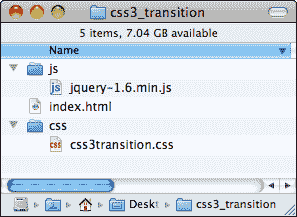

1.  在这个例子中，我们使用了两张扑克牌图像。这些图像可以在代码包中找到，或者您可以从[`gamedesign.cc/html5games/css3-basic-transition/images/AK.png`](http://gamedesign.cc/html5games/css3-basic-transition/images/AK.png)和[`gamedesign.cc/html5games/css3-basic-transition/images/AQ.png`](http://gamedesign.cc/html5games/css3-basic-transition/images/AQ.png)下载。

1.  创建一个名为`images`的新文件夹，并将两张卡片图像放在其中。

1.  接下来要做的是编写 HTML，其中包含两个卡片 DIV 元素。当页面加载时，我们将为这两个卡片元素应用 CSS 过渡样式：

```js
<!DOCTYPE html>
<html lang="en">
<head>
<meta charset="utf-8">
<title>Getting Familiar with CSS3 Transition</title>
<link rel="stylesheet" href="css/css3transition.css" />
</head>
<body>
<header>
<h1>Getting Familiar with CSS3 Transition</h1>
</header>
<section id="game">
<div id="cards">
<div id="card1" class="card cardAK"></div>
<div id="card2" class="card cardAQ"></div>
</div> <!-- #cards -->
</section> <!-- #game -->
<footer>
<p>This is an example of transitioning cards.</p>
</footer>
<script src="img/jquery-1.6.min.js"></script>
<script>
$(function(){
$("#card1").addClass("moveAndScale");
$("#card2").addClass("rotateRight");
});
</script>
CSS3 transition moduleCSS3 transition moduleplaying card, moving</body>
</html>

```

1.  是时候通过 CSS 定义扑克牌的视觉样式了。它包含基本的 CSS 2.1 属性和 CSS3 新属性。新的 CSS3 属性已经突出显示：

```js
body {
background: #aaa;
}
/* defines styles for each card */
.card {
width: 80px;
height: 120px;
margin: 20px;
background: #efefef;
position: absolute;
-webkit-transition: all 1s linear;
}
/* set the card to corresponding playing card graphics */
.cardAK {
background: url(../images/AK.png);
}
.cardAQ {
background: url(../images/AQ.png);
}
/* rotate the applied DOM element 90 degree */
.rotateRight {
-webkit-transform: rotate3d(0,0,1,90deg);
}
/* move and scale up the applied DOM element */
.moveAndScale {
-webkit-transform: translate3d(150px,150px,0) scale3d(1.5, 1.5, 1);
}

```

1.  让我们保存所有文件，并在浏览器中打开`index.html`。两张卡应该如下截图所示进行动画：

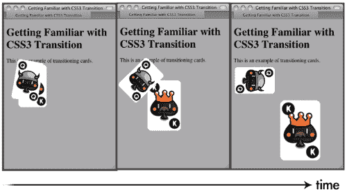

## 发生了什么？

我们刚刚通过使用 CSS3 过渡来创建了两个动画效果，以调整`transform`属性。

### 注意

请注意，新的 CSS3 过渡和变换属性尚未最终确定。Web 浏览器支持这些起草但稳定的属性，并带有供应商前缀。在我们的示例中，为了支持 Chrome 和 Safari，我们使用了`-webkit-`前缀。我们可以在代码中使用其他前缀来支持其他浏览器，例如为 Mozilla 使用`-moz-`，为 Opera 使用`-o-`。

这是 CSS 变换的用法：

```js
transform: transform-function1 transform-function2;

```

`transform`属性的参数是函数。有两组函数，2D`transform`函数和 3D。**CSS transform**函数旨在移动、缩放、旋转和扭曲目标 DOM 元素。以下显示了变换函数的用法。

### 2D 变换函数

2D`rotate`函数按给定的正参数顺时针旋转元素，并按给定的负参数逆时针旋转：

```js
rotate(angle)

```

translate 函数通过给定的 X 和 Y 位移移动元素：

```js
translate (tx, ty)

```

我们可以通过调用`translateX`和`translateY`函数来独立地沿 X 或 Y 轴进行平移，如下所示：

```js
translateX(number)
translateY(number)

```

`scale`函数按给定的`sx，sy`向量缩放元素。如果我们只传递第一个参数，那么`sy`将与`sx`的值相同：

```js
scale(sx, sy)

```

此外，我们可以独立地按如下方式缩放 X 和 Y 轴：

```js
scaleX(number)
scaleY(number)

```

### 3D 变换函数

3D 旋转功能通过给定的[x，y，z]单位向量在 3D 空间中旋转元素。例如，我们可以使用`rotate3d(0, 1, 0, 60deg)`将 Y 轴旋转 60 度：

```js
rotate3d(x, y, z, angle)

```

我们还可以通过调用以下方便的函数仅旋转一个轴：

```js
rotateX(angle)
rotateY(angle)
rotateZ(angle)

```

与 2D `translate`函数类似，`translate3d`允许我们在所有三个轴上移动元素：

```js
translate3d(tx, ty, tz)
translateX(tx)
translateY(ty)
translateZ(tz)

```

此外，`scale3d`在 3D 空间中缩放元素：

```js
scale3d(sx, sy, sz)
scaleX(sx)
scaleY(sy)
scaleZ(sz)

```

我们刚讨论的`transform`函数是常见的，我们会多次使用它们。还有一些其他未讨论的`transform`函数。它们是`matrix，skew`和`perspective`。

如果您想找到最新的 CSS 变换工作规范，可以访问 W3C 网站，网址如下。CSS 2D 变换模块（[`dev.w3.org/csswg/css3-3d-transforms/`](http://dev.w3.org/csswg/css3-3d-transforms/)）和 3D 变换模块（[`www.w3.org/TR/css3-2d-transforms/`](http://www.w3.org/TR/css3-2d-transforms/)）。

## 通过使用 CSS3 过渡来缓慢改变样式

CSS3 中有大量新功能。过渡模块是其中之一，对我们在游戏设计中影响最大。

什么是**CSS3 过渡**？W3C 用一句话解释了它：

> CSS 过渡允许 CSS 值中的属性更改在指定的持续时间内平滑发生。

通常，当我们改变元素的任何属性时，属性会立即更新为新值。过渡会减慢更改过程。它在给定的持续时间内创建从旧值到新值的平滑过渡。

这是`transition`属性的用法：

```js
transition: property_name duration timing_function delay.

```

| 参数 | 定义 |
| --- | --- |
| `property_name` | 过渡应用的属性名称。可以设置为`all`。 |
| `Duration` | 过渡所需的持续时间。 |
| `Timing_function` | `timing`函数定义了开始值和结束值之间的插值。默认值是`ease`。通常我们会使用`ease, ease-in, ease-out`和`linear`。 |
| `Delay` | 延迟参数延迟了给定秒数的过渡开始。 |

我们可以在一行中放置几个`transition`属性。例如，以下代码在 0.3 秒内过渡不透明度，0.5 秒内过渡背景颜色：

```js
transition: opacity 0.3s, background-color 0.5s

```

我们还可以使用以下属性单独定义每个过渡属性：

`transition-property，transition-duration，transition-timing-function`和`transition-delay`。

### 提示

**CSS3 模块**

根据 W3C，CSS3 不同于 CSS 2.1，因为 CSS 2.1 只有一个规范。CSS3 分为不同的模块。每个模块都会单独进行审查。例如，有过渡模块，2D/3D 变换模块和弹性盒布局模块。

将规范分成模块的原因是因为 CSS3 的每个部分的工作进度不同。一些 CSS3 功能相当稳定，例如边框半径，而有些尚未定型。通过将整个规范分成不同的部分，它允许浏览器供应商支持稳定的模块。在这种情况下，缓慢的功能不会减慢整个规范。CSS3 规范的目标是标准化网页设计中最常见的视觉用法，而这个模块符合这个目标。

## 试试看

我们已经翻译，缩放和旋转了扑克牌。在示例中尝试更改不同的值怎么样？`rotate3d`函数中有三个轴。如果我们旋转其他轴会发生什么？通过自己尝试代码来熟悉变换和过渡模块。

# 创建翻转卡片效果

现在想象一下，我们不仅仅是移动纸牌，而且还想翻转卡片元素，就像我们翻转真正的纸牌一样。通过使用`rotation transform`函数，现在可以创建翻牌效果。

# 使用 CSS3 翻牌的时间

当我们点击纸牌时，我们将开始一个新项目并创建一个翻牌效果：

1.  让我们继续我们之前的代码示例。

1.  卡片现在包含两个面，一个正面和一个背面。将以下代码替换为 HTML 中的`body`标签：

```js
<section id="game">
<div id="cards">
<div class="card">
<div class="face front"></div>
<div class="face back cardAK"></div>
</div> <!-- .card -->
<div class="card">
<div class="face front"></div>
<div class="face back cardAQ"></div>
</div> <!-- .card -->
</div> <!-- #cards -->
</section> <!-- #game -->
<script src="img/jquery-1.6.min.js"></script>

```

1.  然后将 CSS 外部链接更改为`css3flip.css`文件：

```js
<link rel="stylesheet" href="css/css3flip.css" />

```

1.  现在让我们将样式添加到`css3flip.css`中：

```js
#game {
background: #9c9;
padding: 5px;
}
/* Define the 3D perspective view and dimension of each card. */
.card {
-webkit-perspective: 600;
width: 80px;
height: 120px;
}

```

1.  每张卡上有两个面。我们将晚些时候旋转面。因此，我们通过 CSS3 的`transition`属性定义了面的过渡方式。我们还隐藏了背面的可见性。我们稍后会详细看一下这个属性：

```js
.face {
border-radius: 10px;
width: 100%;
height: 100%;
position: absolute;
-webkit-transition: all .3s;
-webkit-backface-visibility: hidden;
}

```

1.  现在是为每个单独的面样式。正面的 z-index 比背面高：

```js
.front {
background: #966;
z-index: 10;
}
.back {
background: #eaa;
-webkit-transform: rotate3d(0,1,0,-180deg);
z-index: 8;
}

```

1.  当我们翻转卡片时，我们将正面旋转到背面，背面旋转到正面。我们还交换了正面和背面的 z-index：

```js
.card-flipped .front {
-webkit-transform: rotate3d(0,1,0,180deg);
z-index: 8;
}
.card-flipped .back {
-webkit-transform: rotate3d(0,1,0,0deg);
z-index: 10;
}
.cardAK {
background: url(../images/AK.png);
}
.cardAQ {
background: url(../images/AQ.png);
}

```

1.  接下来，我们将在加载 jQuery 库后添加逻辑，以在单击卡片时切换卡片翻转状态：

```js
<script>
$(function(){
$("#cards").children().each(function(index) {
// listen the click event on each card DIV element.
$(this).click(function() {
// add the class "card-flipped".
// the browser will animate the styles between current state and card-flipped state.
$(this).toggleClass("card-flipped");
});
});
});
</script>

```

1.  现在样式和脚本都准备好了。让我们保存所有文件并在 Web 浏览器中预览。单击纸牌翻转它，再次单击翻转回来。

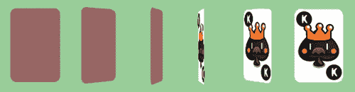

## 刚才发生了什么？

我们已经创建了一个通过鼠标单击切换的翻牌效果。该示例利用了几个 CSS 变换属性和 JavaScript 来处理鼠标单击事件。

## 使用 jQuery toggleClass 函数切换类

当鼠标单击卡片时，我们将`card-flipped`类应用于卡片元素。第二次单击时，我们希望删除已应用的`card-flipped`样式，以便卡片再次翻转。这称为**切换类**样式。

jQuery 为我们提供了一个方便的函数，名为`toggleClass`，可以根据类是否应用来自动添加或删除类。

要使用该函数，我们只需将要切换的类作为参数传递。

例如，以下代码向具有 ID`card1`的元素添加或删除`card-flipped`类：

```js
$("#card1").toggleClass("card-flipped");

```

`toggleClass`函数接受一次切换多个类。我们可以传递多个类名，并用空格分隔它们。以下是同时切换两个类的示例：

```js
$("#card1").toggleClass("card-flipped scale-up");

```

## 通过 z-index 控制重叠元素的可见性

通常，网页中的所有元素都是分布和呈现而不重叠的。设计游戏是另一回事。我们总是需要处理重叠的元素并有意隐藏它们（或其中的一部分）。`Z-index`是 CSS 2.1 属性，帮助我们控制多个重叠元素时的可见性行为。

在这个例子中，每张卡片有两个面，正面和背面。两个面放在完全相同的位置。它们彼此重叠。**Z-index**属性定义了哪个元素在顶部，哪个在后面。具有较高 z-index 的元素在较低 z-index 的元素前面。当它们重叠时，具有较高 z-index 的元素将覆盖具有较低 z-index 的元素。以下截图演示了 z-index 的行为：

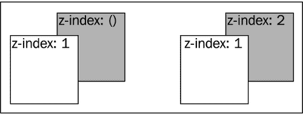

在翻牌示例中，我们交换了两个面的 z-index，以确保对应的面在正常状态和翻转状态下都在另一个面的上方。以下代码显示了交换。

在正常状态下，正面的 z-index 较高：

```js
.front {
z-index: 10;
}
.back {
z-index: 8;
}

```

在翻转状态下，正面的 z-index 变为低于背面的 z-index。现在背面覆盖了正面：

```js
.card-flipped .front {
z-index: 8;
}
.card-flipped .back {
z-index: 10;
}

```

## 介绍 CSS 透视属性

CSS3 让我们能够以 3D 形式呈现元素。我们已经能够在 3D 空间中转换元素。`perspective`属性定义了 3D 透视视图的外观。您可以将值视为您观察对象的距离。您越近，观察对象的透视失真就越大。

### 注意

在撰写本书时，只有 Safari 支持 3D 透视功能。Chrome 支持 3D 变换，但不支持`perspective`属性。因此，在 Safari 中效果最佳，在 Chrome 中效果也可以接受。

以下两个 3D 立方体演示了不同的透视值如何改变元素的透视视图：

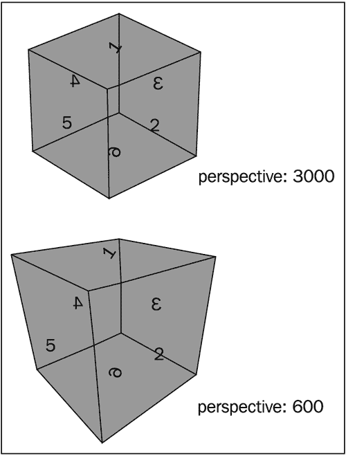

您可以在 Safari 中输入以下地址查看此实验：

[`gamedesign.cc/html5games/perspective-cube/`](http://gamedesign.cc/html5games/perspective-cube/)

## Have a go hero

立方体是通过将六个面放在一起，并对每个面应用 3D 变换来创建的。它使用了我们讨论过的技术。尝试创建一个立方体并尝试使用`perspective`属性进行实验。

以下网页对创建 CSS3 立方体进行了全面的解释，并讨论了通过键盘控制立方体的旋转：

[`www.paulrhayes.com/2009-07/animated-css3-cube-interface-using-3d-transforms/`](http://www.paulrhayes.com/2009-07/animated-css3-cube-interface-using-3d-transforms/)

## 介绍 backface-visibility

在引入`backface-visibility`之前，页面上的所有元素都向访问者展示它们的正面。实际上，元素的正面或背面没有概念，因为这是唯一的选择。而 CSS3 引入了三个轴的旋转，我们可以旋转一个元素，使其正面朝后。试着看看你的手掌并旋转你的手腕，你的手掌转过来，你看到了手掌的背面。这也发生在旋转的元素上。

CSS3 引入了一个名为`backface-visibility`的属性，用于定义我们是否可以看到元素的背面。默认情况下，它是可见的。以下截图演示了`backface-visibility`属性的两种不同行为。

### 注意

在撰写本书时，只有 Apple Safari 支持`backface-visibility`属性。

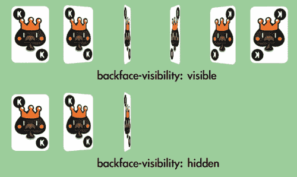

### 注意

您可以在官方 Webkit 博客上阅读有关 CSS 3D 变换中不同属性和函数的更详细信息：[`webkit.org/blog/386/3d-transforms/`](http://webkit.org/blog/386/3d-transforms/)。

# 创建一款卡片匹配记忆游戏

我们已经学习了一些 CSS 基本技术。让我们用这些技术制作一个游戏。我们将制作一款纸牌游戏。纸牌游戏利用变换来翻转纸牌，过渡来移动纸牌，JavaScript 来控制逻辑，以及一个名为自定义数据属性的新 HTML5 功能。别担心，我们将逐步讨论每个组件。

## 下载扑克牌的精灵表

在翻牌示例中，我们使用了两种不同的扑克牌图形。现在我们准备整副扑克牌的图形。尽管我们在匹配游戏中只使用了六张扑克牌，但我们准备整副扑克牌，这样我们可以在可能创建的其他扑克牌游戏中重复使用这些图形。

一副牌有 52 张，我们还有一张背面的图形。与使用 53 个单独的文件不同，将单独的图形放入一个大的精灵表文件是一个好的做法。精灵表这个术语来自于一种旧的计算机图形技术，它将一个图形纹理加载到内存中并显示部分图形。

使用大型精灵表而不是分离的图像文件的一个好处是可以减少**HTTP 请求的数量**。 当浏览器加载网页时，它会创建一个新的 HTTP 请求来加载每个外部资源，包括 JavaScript 文件，CSS 文件和图像。 为每个分离的小文件建立新的 HTTP 请求需要相当长的时间。 将图形合并到一个文件中，大大减少了请求的数量，从而提高了在浏览器中加载时游戏的响应性。

将图形放入一个文件的另一个好处是避免文件格式头的开销。 53 张图像精灵表的大小小于每个文件中带有文件头的 53 张不同图像的总和。

以下扑克牌图形是在 Adobe Illustrator 中绘制和对齐的。 您可以从[`gamedesign.cc/html5games/css3-matching-game/images/deck.png`](http://gamedesign.cc/html5games/css3-matching-game/images/deck.png)下载它。

### 注意

以下文章详细解释了为什么以及如何创建和使用 CSS 精灵表：

[`css-tricks.com/css-sprites/`](http://css-tricks.com/css-sprites/)

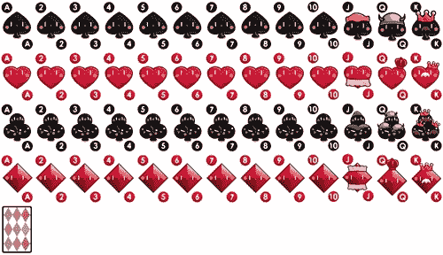

## 设置游戏环境

图形已准备就绪，然后我们需要在游戏区域上设置一个静态页面，并在游戏区域上准备和放置游戏对象。 这样以后添加游戏逻辑和交互会更容易：

# 执行动作准备卡片匹配游戏的时间

在将复杂的游戏逻辑添加到我们的匹配游戏之前，让我们准备 HTML 游戏结构并准备所有 CSS 样式：

1.  让我们继续我们的代码。 用以下 HTML 替换`index.html`文件：

```js
<!DOCTYPE html>
<html lang=en>
<head>
<meta charset=utf-8>
<title>CSS3 Matching Game</title>
<link rel="stylesheet" href="css/matchgame.css" />
</head>
<body>
<header>
<h1>CSS3 Matching Game</h1>
</header>
<section id="game">
<div id="cards">
<div class="card">
<div class="face front"></div>
<div class="face back"></div>
</div> <!-- .card -->
</div> <!-- #cards -->
</section> <!-- #game -->
<footer>
<p>This is an example of creating a matching game with CSS3.</p>
</footer>
<script src="img/jquery-1.6.min.js"></script>
<script src="img/html5games.matchgame.js"></script>
</body>
</html>

```

1.  为了使游戏更具吸引力，我为游戏桌和页面准备了背景图像。 这些图形资产可以在代码示例包中找到。 背景图像是可选的，它们不会影响匹配游戏的游戏过程和逻辑。

1.  我们还将把扑克牌精灵表图形放入 images 文件夹中。 从[`gamedesign.cc/html5games/css3-matching-game/images/deck.png`](http://gamedesign.cc/html5games/css3-matching-game/images/deck.png)下载`deck.png`文件，并将其保存到 images 文件夹中。

1.  在编写任何逻辑之前，让我们为匹配游戏添加样式。 打开`matchgame.css`并添加以下 body 样式：

```js
body {
text-align: center;
background: #a46740 url(../images/bg.jpg);
}

```

1.  继续向`game`元素添加样式。 它将是游戏的主要区域：

```js
#game {
border-radius: 10px;
border: 1px solid #666;
background: #232 url(../images/table.jpg);
width: 500px;
height: 460px;
margin: 0 auto;
display: box;
box-pack: center;
box-align: center;
}

```

1.  我们将所有卡片元素放入名为`cards`的父 DOM 中。 这样做可以轻松地将所有卡片居中到游戏区域：

```js
#cards {
position: relative;
width: 380px;
height: 400px;
}

```

1.  对于每张卡，我们定义了一个`perspective`属性，以赋予它视觉深度效果：

```js
.card {
-webkit-perspective: 600;
width: 80px;
height: 120px;
position: absolute;
-moz-transition: all .3s;
-webkit-transition: all .3s;
transition: all .3s;
}

```

1.  每张卡上有两个面。 面将稍后旋转，我们将定义过渡属性以动画显示样式更改。 我们还希望确保背面是隐藏的：

```js
.face {
border-radius: 10px;
width: 100%;
height: 100%;
position: absolute;
-webkit-transition-property: opacity, transform, box-shadow;
-webkit-transition-duration: .3s;
-webkit-backface-visibility: hidden;
}

```

1.  然后我们设置正面和背面样式。 它们与翻转卡片示例几乎相同，只是现在我们为它们提供了背景图像和盒子阴影：

```js
.front {
background: #999 url(../images/deck.png) 0 -480px;
z-index: 10;
card matching memory gamecard matching memory gamegame environment, setting up}
.back {
background: #efefef url(../images/deck.png);
-webkit-transform: rotate3d(0,1,0,-180deg);
z-index: 8;
}
.card:hover .face, .card-flipped .face {
-webkit-box-shadow: 0 0 10px #aaa;
}
.card-flipped .front {
-webkit-transform: rotate3d(0,1,0,180deg);
z-index: 8;
}
.card-flipped .back {
-webkit-transform: rotate3d(0,1,0,0deg);
z-index: 10;
}

```

1.  当任何卡被移除时，我们希望将其淡出。 因此，我们声明了一个带有 0 不透明度的 card-removed 类：

```js
.card-removed {
opacity: 0;
}

```

1.  为了从卡牌牌组的精灵表中显示不同的扑克牌图形，我们将卡的背景剪切成不同的背景位置：

```js
.cardAQ {background-position: -880px 0;}
.cardAK {background-position: -960px 0;}
.cardBQ {background-position: -880px -120px;}
.cardBK {background-position: -960px -120px;}
.cardCQ {background-position: -880px -240px;}
.cardCK {background-position: -960px -240px;}
.cardDQ {background-position: -880px -360px;}
.cardDK {background-position: -960px -360px;}

```

1.  我们已经定义了许多 CSS 样式。 现在是 JavaScript 逻辑的时候了。 打开`html5games.matchgame.js`文件，并将以下代码放入其中：

```js
$(function(){
// clone 12 copies of the card
for(var i=0;i<11;i++){
$(".card:first-child").clone().appendTo("#cards");
}
// initialize each card's position
$("#cards").children().each(function(index) {
// align the cards to be 4x3 ourselves.
$(this).css({
"left" : ($(this).width() + 20) * (index % 4),
"top" : ($(this).height() + 20) * Math.floor(index / 4)
});
});
});

```

1.  现在保存所有文件并在浏览器中预览游戏。 游戏应该有很好的样式，并且中央应该出现 12 张卡。 但是，我们还不能点击卡片，因为我们还没有为卡片设置任何交互逻辑。

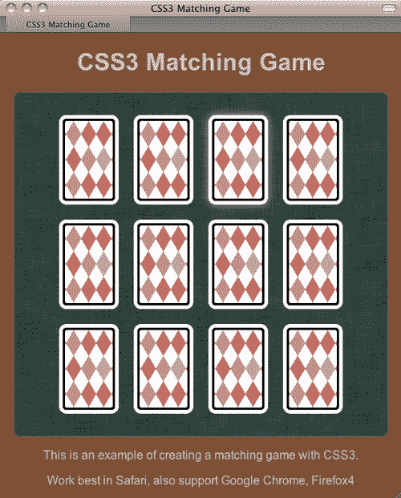

## 刚刚发生了什么？

我们在 HTML 中创建了游戏结构，并对 HTML 元素应用了样式。我们还使用 jQuery 在网页加载和准备好后在游戏区域创建了 12 张卡片。翻转和移除卡片的样式也已准备好，并可以在稍后使用游戏逻辑应用到卡片上。

由于我们为每张卡片使用绝对定位，我们需要自己将卡片对齐到 4x3 的瓷砖中。在 JavaScript 逻辑中，我们通过循环每张卡片并通过计算循环索引来对齐它：

```js
$("#cards").children().each(function(index) {
// align the cards to be 4x3 ourselves.
$(this).css({
"left" : ($(this).width() + 20) * (index % 4),
"top" : ($(this).height() + 20) * Math.floor(index / 4)
});
});

```

JavaScript 中的“%”是**模运算符**，它返回除法后剩下的余数。余数用于在循环卡片时获取列数。以下图表显示了行/列关系与索引号：

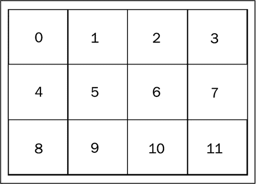

另一方面，除法用于获取行数，以便我们可以将卡片定位在相应的行上。

以索引 3 为例，3 % 4 是 3。所以索引 3 的卡片在第三列。而 3 / 4 是 0，所以它在第一行。

让我们选择另一个数字来看看公式是如何工作的。让我们看看索引 8。8 % 4 是 0，它在第一列。8 / 4 是 2，所以它在第三行。

## 使用 jQuery 克隆 DOM 元素

在我们的 HTML 结构中，我们只有一张卡片，在结果中，我们有 12 张卡片。这是因为我们在 jQuery 中使用了`clone`函数来克隆卡片元素。克隆目标元素后，我们调用`appendTo`函数将克隆的卡片元素附加为卡片元素的子元素：

```js
$(".card:first-child").clone().appendTo("#cards");

```

## 使用子筛选器在 jQuery 中选择元素的第一个子元素

当我们选择卡片元素并克隆它时，我们使用了以下选择器：

```js
$(".card:first-child")

```

`:first-child`是一个**子筛选器**，选择给定父元素的第一个子元素。

除了`:first-child`，我们还可以使用`:last-child`选择最后一个子元素。

### 注意

您还可以在 jQuery 文档中检查其他与子元素相关的选择器：

[`api.jquery.com/category/selectors/child-filter-selectors/`](http://api.jquery.com/category/selectors/child-filter-selectors/)

## 垂直对齐 DOM 元素

我们将卡片 DIV 放在游戏元素的中心。**CSS3 灵活的盒子布局模块**引入了一种实现**垂直居中对齐**的简单方法。由于这个模块仍在进行中，我们需要应用浏览器供应商前缀。我们将以 Webkit 为例：

```js
display: -webkit-box;
-webkit-box-pack: center;
-webkit-box-align: center;

```

灵活盒模块定义了元素在其容器中有额外空间时的对齐方式。我们可以通过使用`display`，一个 CSS2 属性，值为`box`，一个新的 CSS3 属性值，将元素设置为灵活盒容器的行为。

`box-pack`和`box-align`是两个属性，用于定义它如何在水平和垂直方向上对齐并使用额外的空间。我们可以通过将这两个属性都设置为`center`来使元素居中。

垂直对齐只是灵活盒子布局模块的一小部分。在网页设计中进行布局时非常强大。您可以在 W3C 模块的页面([`www.w3.org/TR/css3-flexbox/`](http://www.w3.org/TR/css3-flexbox/))或 CSS3 Info 网站([`www.css3.info/introducing-the-flexible-box-layout-module/`](http://www.css3.info/introducing-the-flexible-box-layout-module/))上找到更多信息。

## 使用 CSS 精灵和背景位置

**CSS 精灵**表是一个包含许多单独图形的大图像。大的精灵表图像被应用为元素的背景图像。我们可以通过移动固定宽度和高度元素的背景位置来剪裁每个图形。

我们的牌组图像包含总共 53 个图形。为了方便演示背景位置，让我们假设我们有一张包含三张卡片图像的图像，如下面的截图：

使用 CSS 精灵和背景位置

在 CSS 样式中，我们将卡片元素设置为 80 像素宽，120 像素高，背景图像设置为大牌组图像。如果我们想要左上角的图形，我们将背景位置的 X 和 Y 都应用为 0。如果我们想要第二个图形，我们将背景图像移动到左 80 像素。这意味着将 X 位置设置为-80 像素，Y 设置为 0。由于我们有固定的宽度和高度，只有裁剪的 80x120 区域显示背景图像。以下截图中的矩形显示了可视区域：

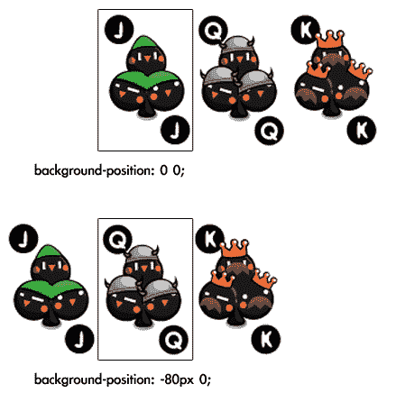

# 为匹配游戏添加游戏逻辑

现在让我们想象手中拿着一副真正的牌组并设置匹配游戏。

我们首先在手中洗牌，然后将每张卡片背面朝上放在桌子上。为了更容易玩游戏，我们将卡片排成 4x3 的数组。现在游戏已经准备好了。

现在我们要开始玩游戏了。我们拿起一张卡片并翻转它使其正面朝上。然后我们拿起另一张并将其朝上。之后，我们有两种可能的操作。如果它们是相同的图案，我们就把这两张卡片拿走。否则，我们将它们再次放回背面，就好像我们没有触摸过它们一样。游戏将继续，直到我们配对所有卡片并将它们全部拿走。

在我们脑海中有了逐步的情景之后，代码流程将会更加清晰。实际上，这个例子中的代码与我们玩真正的牌组的过程完全相同。我们只需要将人类语言替换为 JavaScript 代码。

# 执行为匹配游戏添加游戏逻辑的操作

在上一个示例中，我们准备了游戏环境，并决定了游戏逻辑与玩真正的牌组相同。现在是时候编写 JavaScript 逻辑了：

1.  让我们从上一个匹配游戏示例开始。我们已经设计了 CSS，现在是时候在`html5games.matchgame.js`文件中添加游戏逻辑了。

1.  游戏是匹配一对扑克牌。现在我们有 12 张卡片，所以我们需要六对扑克牌。以下全局数组声明了六对卡片图案：

```js
var matchingGame = {};
matchingGame.deck = [
'cardAK', 'cardAK',
'cardAQ', 'cardAQ',
'cardAJ', 'cardAJ',
'cardBK', 'cardBK',
'cardBQ', 'cardBQ',
'cardBJ', 'cardBJ',
];

```

1.  在上一章中，我们在 jQuery 的`ready`函数中排列了卡片。现在我们需要在`ready`函数中准备和初始化更多的代码。将`ready`函数更改为以下代码。更改后的代码已经突出显示：

```js
$(function(){
matchingGame.deck.sort(shuffle);
for(var i=0;i<11;i++){
$(".card:first-child").clone().appendTo("#cards");
}
$("#cards").children().each(function(index) {
$(this).css({
"left" : ($(this).width() + 20) * (index % 4),
"top" : ($(this).height() + 20) * Math.floor(index / 4)
});
// get a pattern from the shuffled deck
var pattern = matchingGame.deck.pop();
// visually apply the pattern on the card's back side.
$(this).find(".back").addClass(pattern);
// embed the pattern data into the DOM element.
$(this).attr("data-pattern",pattern);
// listen the click event on each card DIV element.
$(this).click(selectCard);
});
});

```

1.  与玩真正的牌组类似，我们想要做的第一件事就是洗牌。将以下`shuffle`函数添加到 JavaScript 文件中：

```js
function shuffle() {
return 0.5 - Math.random();
game logic, adding to matching gamegame logic, adding to matching gamesteps}

```

1.  当我们点击卡片时，我们翻转它并安排检查函数。将以下代码附加到 JavaScript 文件中：

```js
function selectCard() {
// we do nothing if there are already two card flipped.
if ($(".card-flipped").size() > 1) {
return;
}
$(this).addClass("card-flipped");
// check the pattern of both flipped card 0.7s later.
if ($(".card-flipped").size() == 2) {
setTimeout(checkPattern,700);
}
}

```

1.  当两张卡片被打开时，执行以下函数。它控制我们是移除卡片还是翻转卡片：

```js
function checkPattern() {
if (isMatchPattern()) {
$(".card-flipped").removeClass("card-flipped").addClass ("card-removed");
$(".card-removed").bind("webkitTransitionEnd", removeTookCards);
} else {
$(".card-flipped").removeClass("card-flipped");
}
}

```

1.  现在是检查图案的函数的时间。以下函数访问已打开卡片的自定义图案属性，并比较它们是否是相同的图案：

```js
function isMatchPattern() {
var cards = $(".card-flipped");
var pattern = $(cards[0]).data("pattern");
var anotherPattern = $(cards[1]).data("pattern");
return (pattern == anotherPattern);
}

```

1.  匹配的卡片淡出后，我们执行以下函数来移除卡片：

```js
function removeTookCards() {
$(".card-removed").remove();
}

```

1.  游戏逻辑现在已经准备好了。让我们在浏览器中打开游戏 HTML 并进行游戏。如果有任何错误，请记得检查开发者工具中的控制台窗口。

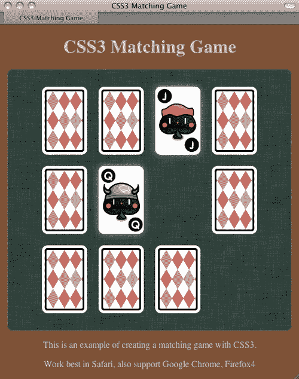

## 刚刚发生了什么？

我们编写了 CSS3 匹配游戏的游戏逻辑。该逻辑为玩牌添加了鼠标点击交互，并控制了图案检查的流程。

## 在 CSS 过渡结束后执行代码

在播放淡出过渡后，我们移除成对的卡片。我们可以通过使用`TransitionEnd`事件来安排在过渡结束后执行的函数。以下是我们代码示例中的代码片段，它向成对的卡片添加了`card-removed`类来开始过渡。然后，它绑定了`TransitionEnd`事件以在 DOM 中完全移除卡片。此外，请注意`webkit`供应商前缀，因为它尚未最终确定：

```js
$(".card-flipped").removeClass("card-flipped").addClass("card-removed");
$(".card-removed").bind("webkitTransitionEnd", removeTookCards);

```

## 延迟执行翻牌的代码

游戏逻辑流程的设计方式与玩一副真正的牌相同。一个很大的区别是我们使用了几个`setTimeout`函数来延迟代码的执行。当点击第二张卡时，我们在以下代码示例片段中安排`checkPattern`函数在 0.7 秒后执行：

```js
if ($(".card-flipped").size() == 2) {
setTimeout(checkPattern,700);
}

```

我们延迟函数调用的原因是为了给玩家时间来记忆卡片模式。这就是为什么我们在检查卡片模式之前延迟了 0.7 秒。

## 在 JavaScript 中对数组进行随机化

JavaScript 中没有内置的数组随机化函数。我们必须自己编写。幸运的是，我们可以从内置的数组排序函数中获得帮助。

以下是`sort`函数的用法：

```js
sort(compare_function);

```

`sort`函数接受一个可选参数。

| 参数 | 定义 | 讨论 |
| --- | --- | --- |
| `compare_function` | 定义数组的排序顺序的函数。`compare_function`需要两个参数 | `sort`函数通过使用`compare`函数比较数组中的两个元素。因此，`compare`函数需要两个参数。当`compare`函数返回大于 0 的任何值时，它会将第一个参数放在比第二个参数更低的索引处。当返回值小于 0 时，它会将第二个参数放在比第一个参数更低的索引处。 |

这里的诀窍是我们使用了`compare`函数，该函数返回-0.5 到 0.5 之间的随机数：

```js
anArray.sort(shuffle);
function shuffle(a, b) {
return 0.5 - Math.random();
}

```

通过在`compare`函数中返回一个随机数，`sort`函数以不一致的方式对相同的数组进行排序。换句话说，我们正在洗牌数组。

### 注意

来自 Mozilla 开发者网络的以下链接提供了关于使用`sort`函数的详细解释和示例：

[`developer.mozilla.org/en/JavaScript/Reference/Global_Objects/Array/sort`](http://https://developer.mozilla.org/en/JavaScript/Reference/Global_Objects/Array/sort)

## 使用 HTML5 自定义数据属性存储内部自定义数据

我们可以通过使用**自定义数据属性**将自定义数据存储在 DOM 元素内。我们可以使用`data-`前缀创建自定义属性名称并为其分配一个值。

例如，我们可以在以下代码中将自定义数据嵌入到列表元素中：

```js
<ul id="games">
<li data-chapter="2" data-difficulty="easy">Ping-Pong</li>
<li data-chapter="3" data-difficulty="medium">Matching Game</li>
</ul>

```

这是 HTML5 规范中提出的一个新功能。根据 W3C 的说法，自定义数据属性旨在存储页面或应用程序私有的自定义数据，对于这些数据没有更合适的属性或元素。

W3C 还指出，这个自定义数据属性是“用于网站自己的脚本使用，而不是用于公开可用的元数据的通用扩展机制。”

我们正在编写我们的匹配游戏并嵌入我们自己的数据到卡片元素中，因此，自定义数据属性符合我们的使用方式。

我们使用自定义属性来存储每张卡片内的卡片模式，因此我们可以通过比较模式值在 JavaScript 中检查两张翻转的卡片是否匹配。此外，该模式也用于将扑克牌样式化为相应的图形：

```js
$(this).find(".back").addClass(pattern);
$(this).attr("data-pattern",pattern);

```

## 弹出测验

1.  根据 W3C 关于自定义数据属性的指南，以下哪种说法是正确的？

a. 我们可以创建一个`data-href`属性来存储`a`标签的链接。

b. 我们可能希望在第三方游戏门户网站中访问自定义数据属性。

c. 我们可能希望在每个玩家的 DOM 元素中存储一个`data-score`属性，以便在我们的网页中对排名进行排序。

d. 我们可以在每个玩家的 DOM 元素中创建一个`ranking`属性来存储排名数据。

## 使用 jQuery 访问自定义数据属性

在匹配游戏示例中，我们使用了 jQuery 库中的`attr`函数来访问我们的自定义数据：

```js
pattern = $(this).attr("data-pattern");

```

`attr`函数返回给定属性名称的值。例如，我们可以通过调用以下代码获取所有`a`标签中的链接：

```js
$("a").attr("href");

```

对于 HTML5 自定义数据属性，jQuery 还为我们提供了另一个函数来访问 HTML5 自定义数据属性。这就是`data`函数。

`Data`函数旨在将自定义数据嵌入到 HTML 元素的 jQuery 对象中。它是在 HTML5 自定义数据属性之前设计的。

以下是`data`函数的用法：

```js
.data(key)
.data(key,value)

```

`data`函数接受两种类型的函数：

| 函数类型 | 参数定义 | 讨论 |
| --- | --- | --- |
| `.data(key)` | `key`是命名数据的字符串 | 当只给出键时，`data`函数读取与 jQuery 对象关联的数据并返回相应的值。在最近的 jQuery 更新中，此函数被扩展以支持 HTML5 自定义数据属性。 |
| `.data(key, value)` | `key`是命名数据的字符串`value`是要与 jQuery 对象关联的数据 | 当给出键和值参数时，`data`函数将新的数据条目设置为 jQuery 对象。值可以是任何 JavaScript 类型，包括数组和对象。 |

为了支持 HTML5 自定义数据属性，jQuery 扩展了`data`函数，使其能够访问 HTML 代码中定义的自定义数据。

以下代码解释了我们如何使用`data`函数。

给定以下 HTML 代码：

```js
<div id="target" data-custom-name="HTML5 Games"></div>

```

我们可以通过调用 jQuery 中的`data`函数访问`data-custom-name`属性：

```js
$("#target").data("customName")

```

它将返回"HTML5 Games"。

## 快速测验

1.  给定以下 HTML 代码：

```js
<div id="game" data-score="100"></div>

```

以下哪两个 jQuery 语句读取自定义分数数据并返回 100？

a. $("#game").attr("data-score");

b. $("#game").attr("score");

c. $("#game").data("data-score");

d. $("#game").data("score");

## 试试吧

我们已经创建了 CSS3 匹配游戏。这里缺少什么？游戏逻辑没有检查游戏是否结束。尝试在游戏结束时添加**你赢了**文本。您还可以使用本章讨论的技术来为文本添加动画。

## 制作其他纸牌游戏

这种 CSS3 纸牌方法适用于创建纸牌游戏。卡片上有两面适合翻转。过渡适合移动卡片。通过移动和翻转，我们可以定义玩法规则并充分利用纸牌游戏。

## 试试吧

您能否使用纸牌图形和翻转技术创建另一个游戏？比如扑克？

# 将网络字体嵌入到我们的游戏中

多年来，我们一直在使用有限的字体来设计网页。我们无法使用任何我们想要的字体，因为浏览器从访问者的本地机器加载字体。我们无法控制并确保访问者拥有我们想要的字体。

尽管我们可以将**网络字体**嵌入到 Internet Explorer 5 中，但格式受限，我们必须等到浏览器供应商支持嵌入最常见的 TrueType 字体格式。

想象一下，我们可以通过嵌入不同样式的网络字体来控制游戏的情绪。我们可以使用我们想要的字体设计游戏，并更好地控制游戏的吸引力。让我们尝试将网络字体嵌入到我们的匹配记忆游戏中。

# Time for action Embedding a font from Google Font Directory

**Google 字体目录**是一个列出可免费使用的网络字体的网络字体服务。我们将嵌入从 Google 字体目录中选择的网络字体：

1.  转到 Google 字体目录网站：[`code.google.com/webfonts`](http://code.google.com/webfonts)。

1.  在字体目录中，有一个列出了开源许可的可免费使用的网络字体列表。

1.  选择其中一个并单击字体名称以继续下一步。在此示例中，我使用了**Droid Serif**。

1.  单击字体后，字体目录会显示有关该字体的详细信息。我们可以在那里执行几项操作，例如预览字体、从变体中选择，最重要的是获取字体嵌入代码。

1.  单击**获取代码**选项卡，您将看到以下屏幕截图。它显示了如何将此字体嵌入到我们的网页中的指南：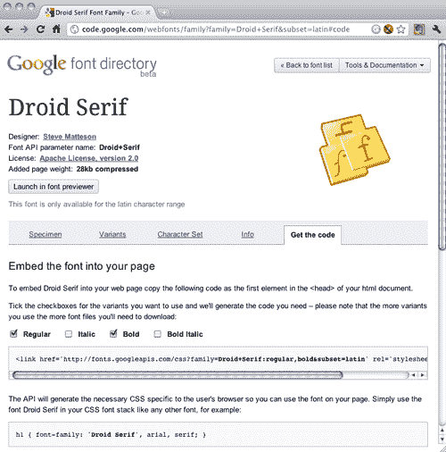

1.  复制谷歌提供的`link`标签，并将其粘贴到 HTML 代码中。它应该放在任何其他样式定义之前：

```js
<link href='http://fonts.googleapis.com/css?family=Droid+Serif:regular,bold&subset=latin' rel='stylesheet' type='text/css'>

```

1.  现在我们可以使用字体来为文本设置样式。将 body 的字体系列属性设置为以下代码：

```js
body {
font-family: 'Droid Serif', arial, serif;
}

```

1.  保存所有文件并打开`index.html`文件。浏览器将从谷歌服务器下载字体并嵌入到网页中。注意字体，它们应该被加载并呈现为我们选择的谷歌字体。

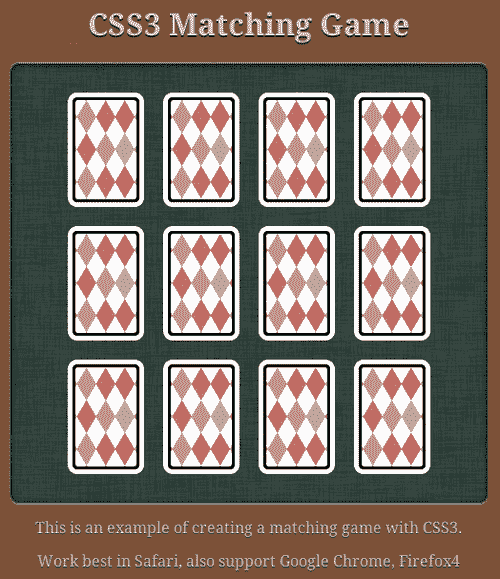

## 刚刚发生了什么？

我们刚刚用一种非常见的网络字体为我们的游戏添加了样式。该字体是通过谷歌字体目录托管和交付的。

### 注意

除了使用字体目录，我们还可以使用@font face 来嵌入我们的字体文件。以下链接提供了一种可靠的方法来嵌入字体：

[`www.fontspring.com/blog/the-new-bulletproof-font-face-syntax`](http://www.fontspring.com/blog/the-new-bulletproof-font-face-syntax)

### 提示

**在嵌入之前检查字体许可证**

通常，字体许可证不包括在网页上的使用。在嵌入字体之前，请务必检查许可证。谷歌字体目录中列出的所有字体都是根据开源许可证授权的，可以在任何网站上使用。

## 选择不同的字体交付服务

Google 字体目录只是其中一个字体交付服务。Typekit ([`typekit.com`](http://typekit.com)) 和 Fontdeck ([`fontdeck.com`](http://fontdeck.com)) 是另外两个提供数百种高质量字体的字体服务，通过年度订阅计划提供。

选择不同的字体交付服务

# 摘要

在本章中，我们学习了使用不同的 CSS3 新属性来创建游戏。

具体来说，我们涵盖了：

+   通过过渡模块转换和动画游戏对象

+   使用透视深度错觉来翻转卡片

+   基于 CSS3 样式和 jQuery 的动画和游戏逻辑创建匹配的记忆游戏

+   从在线字体交付服务中选择和嵌入网络字体

现在我们已经学会了如何使用 CSS3 功能创建基于 DOM 的 HTML5 游戏，我们将在下一章中探索另一种创建 HTML5 游戏的方法，即使用新的 Canvas 标签和绘图 API。
