# 第四章：使用 Canvas 和绘图 API 构建 Untangle 游戏

> HTML5 中一个突出的新功能是 Canvas 元素。我们可以将画布元素视为一个动态区域，可以使用脚本在上面绘制图形和形状。
> 
> 网站中的图像多年来一直是静态的。有动画 gif，但它无法与访问者进行交互。画布是动态的。我们可以通过 JavaScript 绘图 API 动态绘制和修改画布中的上下文。我们还可以向画布添加交互，从而制作游戏。

在过去的两章中，我们已经讨论了基于 DOM 的游戏开发与 CSS3 和一些 HTML5 功能。在接下来的两章中，我们将专注于使用新的 HTML5 功能来创建游戏。在本章中，我们将介绍一个核心功能，即画布，以及一些基本的绘图技术。

在本章中，我们将涵盖以下主题：

+   介绍 HTML5 画布元素

+   在画布中绘制圆

+   在画布元素中绘制线条

+   与画布中绘制的对象进行交互的鼠标事件

+   检测线交点

+   使用 Canvas 和绘图 API 构建 Untangle 解谜游戏

Untangle 解谜游戏是一个玩家被给予一些连接的圆的游戏。这些线可能会相交，玩家需要拖动圆圈，使得没有线再相交。

以下截图预览了我们将通过本章实现的游戏：

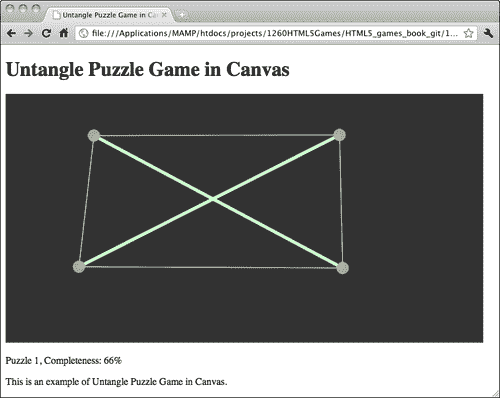

所以让我们从头开始制作我们的画布游戏。

# 介绍 HTML5 Canvas 元素

W3C 社区表示画布元素和绘图功能是：

> 一个分辨率相关的位图画布，可用于实时渲染图形、游戏图形或其他视觉图像。

画布元素包含用于绘制的上下文，实际的图形和形状是由 JavaScript 绘图 API 绘制的。

# 在画布中绘制圆

让我们从基本形状——圆开始在画布上绘制。

# 在画布上绘制彩色圆圈的时间

1.  首先，让我们为示例设置新环境。这是一个包含画布元素、一个帮助我们进行 JavaScript 的 jQuery 库、一个包含实际绘图逻辑的 JavaScript 文件和一个样式表的 HTML 文件。

1.  将以下 HTML 代码放入`index.html`中。这是一个包含画布元素的基本 HTML 文档：

```js
<!DOCTYPE html>
<html lang="en">
<head>
<meta charset="utf-8">
<title>Drawing Circles in Canvas</title>
<link rel="stylesheet" href="css/untangle.css" />
</head>
<body>
<header>
<h1>Drawing in Canvas</h1>
</header>
<canvas id="game" width="768" height="400">
Sorry, your web browser does not support Canvas content.
</canvas>
<script src="img/jquery-1.6.min.js"></script>
<script src="img/html5games.untangle.js"></script>
</body>
</html>

```

1.  使用 CSS 在`untangle.css`中设置画布的背景颜色：

```js
canvas {
background: #333;
}

```

1.  在`html5games.untangle.js` JavaScript 文件中，我们放置了一个 jQuery `ready`函数，并在其中绘制了一个彩色圆圈：

```js
$(function(){
var canvas = document.getElementById("game");
var ctx = canvas.getContext("2d");
ctx.fillStyle = "rgba(200, 200, 100, .6)";
ctx.beginPath();
ctx.arc(100, 100, 50 , 0, Math.PI*2, true);
ctx.closePath();
ctx.fill();
});

```

1.  在 Web 浏览器中打开`index.html`文件，我们将得到以下截图：

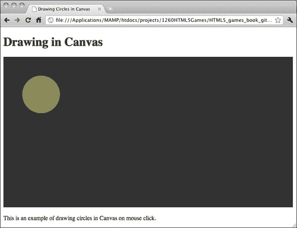

## 刚刚发生了什么？

我们刚刚在上面创建了一个简单的带有圆圈的画布**上下文**。

画布元素本身没有太多设置。我们设置了画布的宽度和高度，就像我们固定了真实绘图纸的尺寸一样。此外，我们为画布分配了一个 ID 属性，以便在 JavaScript 中更容易地引用它：

```js
<canvas id="game" width="768" height="400">
Sorry, your web browser does not support Canvas content.
</canvas>

```

## 当 Web 浏览器不支持画布时放置回退内容

并非所有的 Web 浏览器都支持画布元素。特别是那些古老的版本。Canvas 元素提供了一种简单的方法来提供**回退内容**，如果不支持画布元素。在画布的开放和关闭标记内的任何内容都是回退内容。如果 Web 浏览器支持该元素，则此内容将被隐藏。不支持画布的浏览器将显示该回退内容。在回退内容中提供有用的信息是一个好的做法。例如，如果画布的目的是动态图片，我们可以考虑在那里放置一个``的替代内容。或者我们还可以为访问者提供一些链接，以便轻松升级他们的浏览器。

在这个例子中，我们在画布元素内提供了一个句子。这个句子对于支持画布元素的任何浏览器都是隐藏的。如果他们的浏览器不支持新的 HTML5 画布功能，它将显示给访问者。以下截图显示了旧版本的 Internet Explorer 显示回退内容，而不是绘制画布元素：

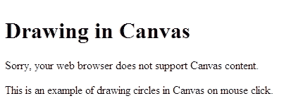

## 使用画布弧函数绘制圆圈和形状

没有绘制圆的圆函数。画布绘图 API 提供了一个绘制不同弧的函数，包括圆。弧函数接受以下参数

| 参数 | 讨论 |
| --- | --- |
| X | 弧的 x 轴中心点。 |
| Y | 弧的 y 轴中心点。 |
| 半径 | 半径是中心点和弧周围的距离。绘制圆时，较大的半径意味着较大的圆。 |
| startAngle | 起始点是弧度角。它定义了在周边开始绘制弧的位置。 |
| endAngle | 结束点是弧度角。弧是从起始角度的位置绘制到这个结束角度。 |
| 逆时针 | 这是一个布尔值，指示从`startingAngle`到`endingAngle`的弧是顺时针还是逆时针绘制的。这是一个可选参数，默认值为 false。 |

## 将度数转换为弧度

弧函数中使用的角度参数是**弧度**，而不是**度**。如果您熟悉度角，您可能需要在将值放入弧函数之前将度转换为弧度。我们可以使用以下公式转换角度单位：

```js
radians = π/180 x degrees

```

以下图表包含了一些常见的角度值，分别以度和弧度为单位。图表还指示了角度值的位置，以便我们在绘制画布中的弧时轻松选择起始角度和结束角度参数。

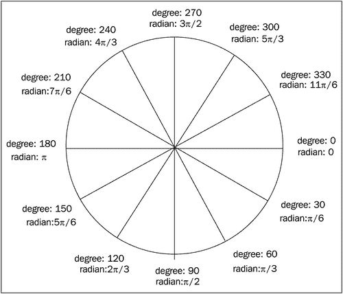

为了更清楚地绘制具有起始角度和结束角度的不同弧，让我们绘制一些弧。

# 采取行动 用弧函数绘制不同的弧

让我们通过给出不同的起始和结束角度来对`arc`函数进行一些实验：

1.  打开我们刚刚用来绘制圆的`html5games.untangle.js`文件。

1.  通过使用以下弧绘制代码替换圆绘制代码：

```js
$(function(){
var canvas = document.getElementById('game');
var ctx = canvas.getContext('2d');
ctx.fillStyle = "rgba(200, 200, 100, .6)";
// draw bottom half circle
ctx.beginPath();
ctx.arc(100, 110, 50 , 0, Math.PI);
ctx.closePath();
ctx.fill();
// draw top half circle
ctx.beginPath();
ctx.arc(100, 90, 50 , 0, Math.PI, true);
ctx.closePath();
ctx.fill();
// draw left half circle
ctx.beginPath();
ctx.arc(230, 100, 50 , Math.PI/2, Math.PI*3/2);
ctx.closePath();
ctx.fill();
// draw right half circle
ctx.beginPath();
ctx.arc(250, 100, 50 , Math.PI*3/2, Math.PI/2);
ctx.closePath();
ctx.fill();
// draw a shape that is almost a circle
ctx.beginPath();
ctx.arc(180, 240, 50 , Math.PI*7/6, Math.PI*2/3);
ctx.closePath();
ctx.fill();
// draw a small arc
ctx.beginPath();
ctx.arc(150, 250, 50 , Math.PI*7/6, Math.PI*2/3, true);
ctx.closePath();
ctx.fill();
});

```

1.  是时候在 Web 浏览器中测试它了。如下截图所示，画布上应该有六个不同的半圆和弧：

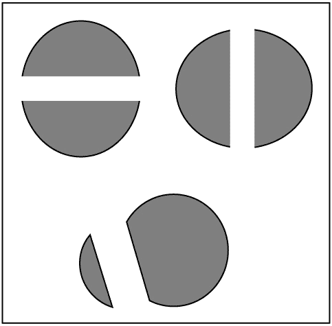

## 发生了什么？

我们在弧函数中使用了不同的`startAngle`和`endAngle`参数来绘制六种不同的弧形状。这些弧形状演示了弧函数的工作原理。

让我们回顾一下度和弧度的关系圆，并看一下顶部的半圆。顶部的半圆从角度 0 开始，到角度π结束，弧是逆时针绘制的。如果我们看一下圆，它看起来像下面的图表：

发生了什么？

如果我们从 210 度开始，到 120 度结束，顺时针方向，我们将得到以下弧：

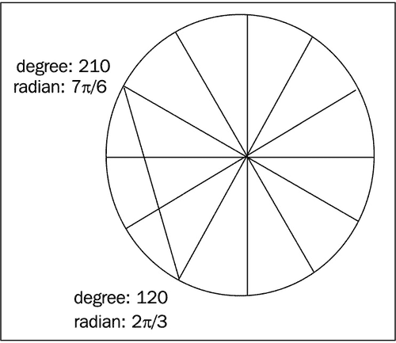

## 小测验

1.  我们可以使用哪个弧命令来绘制以下弧？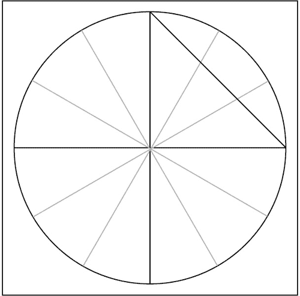

a. ctx.arc(300, 250, 50 , Math.PI*3/2, Math.PI/2, true);

b. ctx.arc(300, 250, 50 , Math.PI*3/2, Math.PI/2);

c. ctx.arc(300, 250, 50 , Math.PI*3/2, 0, true);

d. ctx.arc(300, 250, 50 , Math.PI*3/2, 0);

## 在画布中执行路径绘制

当我们调用弧函数或其他路径绘制函数时，我们并没有立即在画布上绘制路径。相反，我们将其添加到路径列表中。这些路径直到我们执行绘图命令才会被绘制。

有两个绘制执行命令。一个用于填充路径，另一个用于绘制描边。

我们通过调用`fill`函数填充路径，并通过调用`stroke`函数绘制路径的描边，这在绘制线条时会用到：

```js
ctx.fill();

```

## 为每种样式开始一个路径

`fill`和`stroke`函数填充和绘制画布上的路径，但不清除路径列表。以以下代码片段为例。在用红色填充我们的圆之后，我们添加其他圆并用绿色填充。代码的结果是两个圆都被绿色填充，而不仅仅是新圆被绿色填充：

```js
var canvas = document.getElementById('game');
var ctx = canvas.getContext('2d');
ctx.fillStyle = "red";
ctx.arc(100, 100, 50 , 0, Math.PI*2, true);
ctx.fill();
ctx.arc(210, 100, 50, 0, Math.PI*2, true);
ctx.fillStyle = "green";
ctx.fill();

```

这是因为在调用第二个`fill`命令时，画布中的路径列表包含两个圆。因此，`fill`命令会用绿色填充两个圆，并覆盖红色圆。

为了解决这个问题，我们希望确保每次绘制新形状时都调用`beginPath`。

`beginPath`清空路径列表，所以下次调用`fill`和`stroke`命令时，它只会应用于`beginPath`之后的所有路径。

## 试试看

我们刚刚讨论了一个代码片段，我们打算用红色绘制两个圆，另一个用绿色。结果代码绘制出来的两个圆都是绿色的。我们如何向代码添加`beginPath`命令，以便正确绘制一个红色圆和一个绿色圆？

## 关闭路径

`closePath`函数将从最新路径的最后一个点绘制一条直线到路径的第一个点。这是关闭路径。如果我们只打算填充路径而不打算绘制描边轮廓，`closePath`函数不会影响结果。以下屏幕截图比较了在半圆上调用`closePath`和不调用`closePath`的结果：

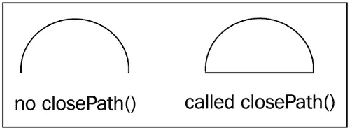

## 快速测验

1.  如果我们只想填充颜色而不绘制轮廓描边，我们需要在绘制的形状上使用`closePath`函数吗？

a. 是的，我们需要`closePath`函数。

b. 不，它不在乎我们是否有`closePath`函数。

## 将绘制圆形包装在函数中

绘制圆形是一个常见的函数，我们将经常使用它。最好创建一个绘制圆形的函数，而不是现在输入几行代码。

# 执行操作将绘制圆形的代码放入函数中

让我们为绘制圆形创建一个函数，并在画布上绘制一些圆圈：

1.  打开`html5games.untangle.js`文件。

1.  用以下代码替换 JavaScript 文件中的原始代码。它基本上将我们刚刚使用的绘制圆形的代码放入一个函数中，并使用 for 循环在画布上随机放置五个圆圈：

```js
var untangleGame = {};
function drawCircle(ctx, x, y, radius) {
ctx.fillStyle = "rgba(200, 200, 100, .9)";
ctx.beginPath();
ctx.arc(x, y, radius, 0, Math.PI*2, true);
ctx.closePath();
ctx.fill();
}
$(function(){
var canvas = document.getElementById('game');
var ctx = canvas.getContext('2d');
var circleRadius = 10;
var width = canvas.width;
var height = canvas.height;
// random 5 circles
var circlesCount = 5;
for (var i=0;i<circlesCount;i++) {
var x = Math.random()*width;
var y = Math.random()*height;
drawCircle(ctx, x, y, circleRadius);
}
});

```

1.  在 Web 浏览器中打开 HTML 文件以查看结果。

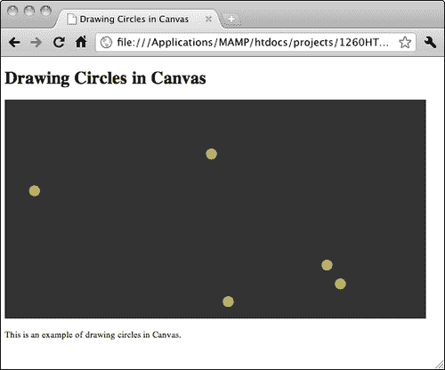

## 刚刚发生了什么？

绘制圆形的代码在页面加载和准备就绪后执行。我们使用循环在画布上随机绘制了几个圆圈。

## 在 JavaScript 中生成随机数

在游戏开发中，我们经常使用`random`函数。我们可能希望随机召唤一个怪物让玩家战斗，我们可能希望玩家取得进展时随机掉落奖励，我们可能希望随机数成为掷骰子的结果。在这段代码中，我们随机放置圆圈在画布上。

要在 JavaScript 中生成一个随机数，我们使用`Math.random()`函数。

`random`函数中没有参数。它总是返回一个介于 0 和 1 之间的浮点数。这个数字大于或等于 0，小于 1。

有两种常见的使用`random`函数的方式。一种方式是在给定范围内生成随机数。另一种方式是生成真或假值

| 用法 | 代码 | 讨论 |
| --- | --- | --- |
| 获取 A 和 B 之间的随机整数`Math.floor(Math.random()*B)+A` `Math.floor()`函数去掉给定数字的小数点。以`Math.floor(Math.random()*10)+5`为例。`Math.random()`返回 0 到 0.9999 之间的小数。`Math.random()*10`是 0 到 9.9999 之间的小数。`Math.floor(Math.random()*10)`是 0 到 9 之间的整数。最后，`Math.floor(Math.random()*10) + 5`是 5 到 14 之间的整数。 |
| 获取一个随机的布尔值（Math.random() > 0.495）`(Math.random() > 0.495)`意味着有 50%的假和 50%的真。我们可以进一步调整真/假比例。`(Math.random() > 0.7)`意味着几乎有 70%的假和 30%的真。 |

## 保存圆的位置

当我们开发基于 DOM 的游戏时，比如我们在前几章中构建的游戏，我们经常将游戏对象放入 DIV 元素中，并在代码逻辑中稍后访问它们。在基于画布的游戏开发中情况就不同了。

为了在画布上绘制游戏对象后访问它们，我们需要自己记住它们的状态。比如现在我们想知道有多少个圆被绘制了，它们在哪里，我们需要一个数组来存储它们的位置。

# 行动时间保存圆的位置

1.  在文本编辑器中打开`html5games.untangle.js`文件。

1.  在 JavaScript 文件的顶部添加以下`circle`对象定义代码：

```js
function Circle(x,y,radius){
this.x = x;
this.y = y;
this.radius = radius;
}

```

1.  现在我们需要一个数组来存储圆的位置。向`untangleGame`对象添加一个新数组：

```js
var untangleGame = {
circles: []
};

```

1.  在画布上绘制每个圆之后，我们将圆的位置保存到`circles`数组中。在调用`drawCircle`函数后添加突出显示的行：

```js
$(function(){
var canvas = document.getElementById('game');
var ctx = canvas.getContext('2d');
var circleRadius = 10;
var width = canvas.width;
var height = canvas.height;
// random 5 circles
var circlesCount = 5;
for (var i=0;i<circlesCount;i++) {
var x = Math.random()*width;
var y = Math.random()*height;
drawCircle(ctx, x, y, circleRadius); untangleGame.circles.push(new Circle(x,y,circleRadius));
}
});

```

1.  现在我们可以在 web 浏览器中测试代码。在画布上绘制随机圆时，这段代码与上一个示例之间没有视觉差异。这是因为我们保存了圆圈，但没有改变任何影响外观的代码。

## 刚刚发生了什么？

我们保存了每个圆的位置和颜色。这是因为我们无法直接访问画布中绘制的对象。所有线条和形状都是在画布上绘制的，我们无法将线条或形状作为单独的对象访问。绘制的项目都是在画布上绘制的。我们不能像在油画中移动房子一样，也不能直接操作画布元素中的任何绘制项目。

## 在 JavaScript 中定义一个基本的类定义

JavaScript 是**面向对象编程**语言。我们可以为我们的使用定义一些对象结构。`Circle`对象为我们提供了一个数据结构，可以轻松存储一组 x 和 y 位置以及半径。

在定义`Circle`对象之后，我们可以通过以下代码创建一个新的`Circle`实例，具有 x、y 和半径值：

```js
var circle1 = new Circle(100, 200, 10);

```

### 注意

有关面向对象编程 JavaScript 的更详细用法，请阅读以下链接中的 Mozilla Developer Center：

[`developer.mozilla.org/en/Introduction_to_Object-Oriented_JavaScript`](http://https://developer.mozilla.org/en/Introduction_to_Object-Oriented_JavaScript)

## 试一试

我们在画布上随机画了几个圆。它们是相同风格和相同大小的。我们如何随机绘制圆的大小？并用不同的颜色填充圆？尝试修改代码并使用绘图 API 进行操作。

# 在画布上绘制线条

现在我们这里有几个圆，怎么样用线连接它们？让我们在每个圆之间画一条直线。

# 行动时间在每个圆之间绘制直线

1.  打开我们刚刚在圆形绘制示例中使用的`index.html`。

1.  将**在 Canvas 中绘制圆**的措辞更改为**在 Canvas 中绘制线条**。

1.  打开`html5games.untangle.js` JavaScript 文件。

1.  我们将在现有圆形绘制代码的基础上添加线条绘制代码。用以下代码替换原始代码。修改后的代码已突出显示：

```js
function Circle(x,y,radius){
this.x = x;
this.y = y;
this.radius = radius;
}
function Line(startPoint,endpoint, thickness) {
this.startPoint = startPoint;
this.endPoint = endPoint;
this.thickness = thickness;
}
var untangleGame = {
circles: [],
thinLineThickness: 1,
lines: []
};
function drawLine(ctx, x1, y1, x2, y2, thickness) {
ctx.beginPath();
ctx.moveTo(x1,y1);
ctx.lineTo(x2,y2);
ctx.lineWidth = thickness;
ctx.strokeStyle = "#cfc";
ctx.stroke();
}
function drawCircle(ctx, x, y, radius) {
ctx.fillStyle = "rgba(200, 200, 100, .9)";
ctx.beginPath();
ctx.arc(x, y, radius, 0, Math.PI*2, true);
ctx.closePath();
ctx.fill();
}
$(function(){
var canvas = document.getElementById('game');
var ctx = canvas.getContext('2d');
var circleRadius = 10;
var width = canvas.width;
var height = canvas.height;
// random 5 circles
var circlesCount = 5;
for (var i=0;i<circlesCount;i++) {
var x = Math.random()*width;
var y = Math.random()*height;
drawCircle(ctx, x, y, circleRadius);
untangleGame.circles.push(new Circle(x,y,radius));
}
for (var i=0;i< untangleGame.circles.length;i++) {
var startPoint = untangleGame.circles[i];
for(var j=0;j<i;j++) {
var endPoint = untangleGame.circles[j];
drawLine(ctx, startPoint.x, startPoint.y, endPoint.x, endPoint.y, 1);
untangleGame.lines.push(new Line(startPoint, endpoint, untangleGame.thinLineThickness));
}
lines, in canvaslines, in canvasstraight lines, drawing}
});

```

1.  在 web 浏览器中测试代码。我们应该看到有线连接到每个随机放置的圆。

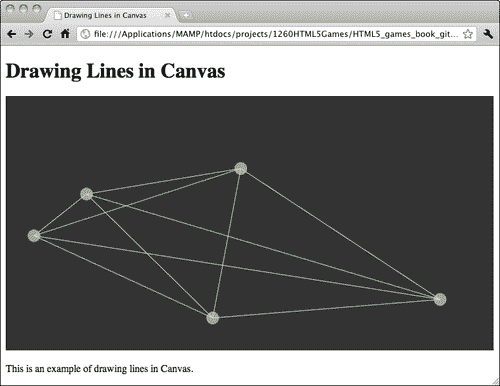

## 刚刚发生了什么？

与保存圆圈位置的方式类似，我们有一个数组来保存我们绘制的每个线段。我们声明一个线条类定义来存储线段的一些基本信息。也就是说，我们保存线段的起始点和终点以及线条的粗细。

## 介绍线条绘制 API

有一些绘制 API 供我们绘制和设置线条样式

| 线条绘制函数 | 讨论 |
| --- | --- |
| MoveTo | `Moveto`函数就像我们手中拿着笔在纸上移动而不用笔触到纸。 |
| LineTo | 这个函数就像在纸上放下笔并画一条直线到目标点。 |
| lineWidth | `LineWidth`设置我们之后绘制的线条的粗细。 |
| 描边 | `stroke`是执行绘制的函数。我们设置了一系列的`moveTo, lineTo`或样式函数，最后调用`stroke`函数在画布上执行它。 |

通常我们使用`moveTo`和`lineTo`对来绘制线条。就像在现实世界中，我们在纸上移动笔到线条的起始点并放下笔来绘制一条线。然后，继续绘制另一条线或在绘制之前移动到其他位置。这正是我们在画布上绘制线条的流程。

### 注意

我们刚刚演示了绘制一条简单的线。我们可以在画布中为线条设置不同的样式。有关更多线条样式的详细信息，请阅读 W3C 的样式指南（[`dev.w3.org/html5/2dcontext/#line-styles`](http://dev.w3.org/html5/2dcontext/#line-styles)）和 Mozilla 开发者中心（[`developer.mozilla.org/En/Canvas_tutorial/Applying_styles_and_colors`](https://developer.mozilla.org/En/Canvas_tutorial/Applying_styles_and_colors)）。

# 通过鼠标事件与画布中的绘制对象交互

到目前为止，我们已经展示了我们可以根据逻辑动态在画布中绘制形状。游戏开发中还有一个缺失的部分，那就是输入。

现在想象一下，我们可以在画布上拖动圆圈，连接的线条会跟随圆圈移动。在这一部分，我们将在画布上添加鼠标事件，使我们的圆圈**可拖动**。

# 拖动画布中的圆圈的时间

1.  让我们继续之前的代码。打开`html5games.untangle.js`文件。

1.  我们需要一个函数来清除画布中的所有绘制。将以下函数添加到 JavaScript 文件的末尾：

```js
function clear(ctx) {
ctx.clearRect(0,0,ctx.canvas.width,ctx.canvas.height);
}

```

1.  在 jQuery 的`ready`函数中删除线条绘制代码。我们将其分成两部分，线条数据和绘制。

1.  添加以下函数，为每个圆圈分配连接线。这些线将稍后绘制：

```js
function connectCircles()
{
// connect the circles to each other with lines
untangleGame.lines.length = 0;
for (var i=0;i< untangleGame.circles.length;i++) {
var startPoint = untangleGame.circles[i];
for(var j=0;j<i;j++) {
var endPoint = untangleGame.circles[j];
untangleGame.lines.push(new Line(startPoint, endPoint, untangleGame.thinLineThickness));
}
}
}

```

1.  将鼠标事件监听器代码添加到 jQuery 的`ready`函数中。以下是函数现在的样子。高亮显示的代码是鼠标事件处理程序：

```js
$(function(){
// get the reference of canvas element.
var canvas = document.getElementById("game");
var ctx = canvas.getContext("2d");
var circleRadius = 10;
var width = canvas.width;
var height = canvas.height;
// random 5 circles
var circlesCount = 5;
for (var i=0;i<circlesCount;i++) {
var x = Math.random()*width;
var y = Math.random()*height;
drawCircle(ctx, x, y, circleRadius);
untangleGame.circles.push(new Circle(x,y,circleRadius));
}
connectCircles();
// Add Mouse Event Listener to canvas
// we find if the mouse down position is on any circle
// and set that circle as target dragging circle.
$("#game").mousedown(function(e) {
var canvasPosition = $(this).offset();
var mouseX = e.layerX || 0;
var mouseY = e.layerY || 0;
for(var i=0;i<untangleGame.circles.length;i++)
{
var circleX = untangleGame.circles[i].x;
var circleY = untangleGame.circles[i].y;
var radius = untangleGame.circles[i].radius;
if (Math.pow(mouseX-circleX,2) + Math.pow(mouseY-circleY,2) < Math.pow(radius,2))
if (Math.pow(mouseX-circleX,2) + Math.pow(mouseY-circleY,2) < Math.pow(radius,2))
{
canvascanvascircles, dragginguntangleGame.targetCircle = i;
break;
}
}
});
// we move the target dragging circle when the mouse is moving
$("#game").mousemove(function(e) {
if (untangleGame.targetCircle != undefined)
{
var canvasPosition = $(this).offset();
var mouseX = e.layerX || 0;
var mouseY = e.layerY || 0;
var radius = untangleGame.circles[untangleGame.targetCircle]. radius;
untangleGame.circles[untangleGame.targetCircle] = new Circle(mouseX, mouseY,radius);
}
connectCircles();
});
// We clear the dragging circle data when mouse is up
$("#game").mouseup(function(e) {
untangleGame.targetCircle = undefined;
});
// setup an interval to loop the game loop
setInterval(gameloop, 30);
});

```

1.  然后我们添加`gameloop`函数，用于绘制更新后的圆圈和线条：

```js
function gameloop() {
// get the reference of the canvas element and the drawing context.
var canvas = document.getElementById('game');
var ctx = canvas.getContext('2d');
// clear the canvas before re-drawing.
clear(ctx);
// draw all remembered line
for(var i=0;i<untangleGame.lines.length;i++) {
var line = untangleGame.lines[i];
var startPoint = line.startPoint;
var endPoint = line.endPoint;
var thickness = line.thickness;
drawLine(ctx, startPoint.x, startPoint.y, endPoint.x, endPoint.y, thickness);
}
// draw all remembered circles
for(var i=0;i<untangleGame.circles.length;i++) {
var circle = untangleGame.circles[i];
drawCircle(ctx, point.x, point.y, circle.radius);
}
}

```

1.  在网络浏览器中打开`index.html`。应该有五个圆圈，它们之间有连线。尝试拖动圆圈。被拖动的圆圈会跟随鼠标光标移动，连接的线也会跟随移动。

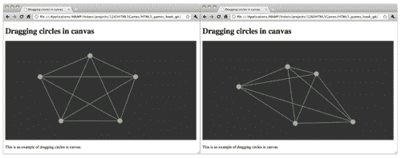

## 刚刚发生了什么？

我们在 jQuery 的`ready`函数中设置了三个鼠标事件监听器。它们是鼠标按下、移动和松开事件。

## 获取画布元素中的鼠标位置

我们可以通过鼠标事件中的`layerX`和`layerY`属性获取相对于元素的鼠标光标位置。以下是我们在代码示例中使用的代码片段。`|| 0`是为了在`layerX`或`layerY`未定义时使结果为 0：

```js
var mouseX = e.layerX || 0;
var mouseY = e.layerY || 0;

```

请注意，我们需要显式设置元素的位置属性，以便获取正确的`layerX`和`layerY`属性。

## 在画布中检测圆圈上的鼠标事件

在讨论了基于 DOM 开发和基于画布开发之间的区别之后，我们不能直接监听画布中任何绘制形状的鼠标事件。这是不可能的。我们不能监视画布中任何绘制形状的事件。我们只能获取画布元素的鼠标事件，并计算画布的相对位置。然后根据鼠标位置改变游戏对象的状态，最后在画布上重新绘制它。

我们如何知道我们点击了一个圆？

我们可以使用**点在圆内**的公式。这是为了检查圆的中心点与鼠标位置之间的距离。当距离小于圆的半径时，鼠标点击了圆。

我们使用以下公式来计算两点之间的距离：

```js
Distance = (x2-x1)2 + (y2-y1)2

```

以下图表显示了当中心点与鼠标光标之间的距离小于半径时，光标在圆内的情况：

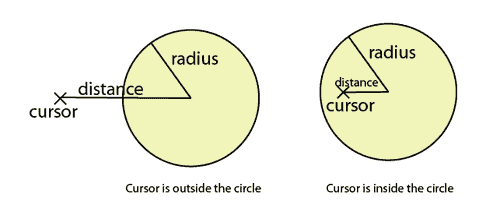

我们使用的以下代码解释了如何在鼠标按下事件处理程序中应用距离检查来知道鼠标光标是否在圆内：

```js
if (Math.pow(mouseX-circleX,2) + Math.pow(mouseY-circleY,2) < Math.pow(untangleGame.circleRadius,2))
{
untangleGame.targetCircle = i;
break;
}

```

当我们知道鼠标光标按在画布上的圆上时，我们将其标记为在鼠标移动事件上被拖动的目标圆。在鼠标移动事件处理程序中，我们将目标拖动的圆的位置更新为最新的光标位置。当鼠标松开时，我们清除目标圆的引用。

## 小测验

1.  我们能直接访问画布中已经绘制的形状吗？

a. 是的

b. 不

1.  我们可以使用哪种方法来检查一个点是否在圆内？

a. 点的坐标小于圆的中心点的坐标。

b. 点与圆的中心之间的距离小于圆的半径。

c. 点的 x 坐标小于圆的半径。

d. 点与圆的中心之间的距离大于圆的半径。

## 游戏循环

在第二章《使用基于 DOM 的游戏开发入门》中，我们讨论了游戏循环的方法。在第二章的乒乓球游戏中，**游戏循环**操作键盘输入并更新基于 DOM 的游戏对象的位置。

在这里，游戏循环用于重新绘制画布以呈现后来的游戏状态。如果我们在改变状态后不重新绘制画布，比如圆的位置，我们将看不到它。

这就像是在电视上刷新图像。电视每秒刷新屏幕 12 次。我们也会每秒重新绘制画布场景。在每次重绘中，我们根据当前圆的位置在画布上绘制游戏状态。

## 清除画布

当我们拖动圆时，我们重新绘制画布。问题是画布上已经绘制的形状不会自动消失。我们将继续向画布添加新路径，最终搞乱画布上的一切。如果我们在每次重绘时不清除画布，将会发生以下截图中的情况：

清除画布

由于我们已经在 JavaScript 中保存了所有游戏状态，我们可以安全地清除整个画布，并根据最新的游戏状态绘制更新的线条和圆。要清除画布，我们使用画布绘制 API 提供的`clearRect`函数。`clearRect`函数通过提供一个矩形裁剪区域来清除矩形区域。它接受以下参数作为裁剪区域：

ctx.clearRect(x,context.clearRect(x, y, width, height)

| Argument | Definition |
| --- | --- |
| x | 矩形裁剪区域的左上角点的 x 轴坐标。 |
| y | 矩形裁剪区域的左上角点的 y 轴坐标。 |
| width | 矩形区域的宽度。 |
| height | 矩形区域的高度。 |

`x`和`y`设置了要清除的区域的左上位置。`width`和`height`定义了要清除的区域大小。要清除整个画布，我们可以将(0,0)作为左上位置，并将画布的宽度和高度提供给`clearRect`函数。以下代码清除了整个画布上的所有绘制内容：

```js
ctx.clearRect(0, 0, ctx.canvas.width, ctx.canvas.height);

```

## 小测验

1.  我们可以使用`clearRect`函数清除画布的一部分吗？

a. 是

b. 否

1.  以下代码是否清除了画布上的绘制内容？

```js
ctx.clearRect(0, 0, ctx.canvas.width, 0);

```

a. 是

b. 否

# 在画布中检测线相交

我们在画布上有可拖动的圆圈和连接的线条。一些线相交，而另一些则不相交。现在想象我们想要区分相交的线。我们需要一些数学公式来检查它们，并加粗这些相交的线。

# 时间行动 区分相交的线

让我们增加这些相交线的粗细，这样我们就可以在画布中区分它们：

1.  在文本编辑器中打开`html5games.untangle.js`文件。

1.  我们将`thinLineThickness`设置为默认线条粗细。我们添加以下代码来定义粗线的粗细：

```js
var untangleGame = {
circles: [],
thinLineThickness: 1,
boldLineThickness: 5,
lines: []
};

```

1.  为了使代码更具可重用性和可读性，我们希望将线相交逻辑与游戏逻辑隔离开来。我们创建一个函数来检查给定的两条线是否相交。将以下函数添加到 JavaScript 文件的末尾：

```js
function isIntersect(line1, line2)
{
// convert line1 to general form of line: Ax+By = C
var a1 = line1.endPoint.y - line1.point1.y;
var b1 = line1.point1.x - line1.endPoint.x;
var c1 = a1 * line1.point1.x + b1 * line1.point1.y;
// convert line2 to general form of line: Ax+By = C
var a2 = line2.endPoint.y - line2.point1.y;
var b2 = line2.point1.x - line2.endPoint.x;
var c2 = a2 * line2.startPoint.x + b2 * line2.startPoint.y;
// calculate the intersection point
var d = a1*b2 - a2*b1;
// parallel when d is 0
if (d == 0) {
return false;
}else {
line intersectionline intersectiondetermining, in canvasvar x = (b2*c1 - b1*c2) / d;
var y = (a1*c2 - a2*c1) / d;
// check if the interception point is on both line segments
if ((isInBetween(line1.startPoint.x, x, line1.endPoint.x) || isInBetween(line1.startPoint.y, y, line1.endPoint.y)) &&
(isInBetween(line2.startPoint.x, x, line2.endPoint.x) || isInBetween(line2.startPoint.y, y, line2.endPoint.y)))
{
return true;
}
}
return false;
}
// return true if b is between a and c,
// we exclude the result when a==b or b==c
function isInBetween(a, b, c) {
// return false if b is almost equal to a or c.
// this is to eliminate some floating point when
// two value is equal to each other but different with 0.00000...0001
if (Math.abs(a-b) < 0.000001 || Math.abs(b-c) < 0.000001) {
return false;
}
// true when b is in between a and c
return (a < b && b < c) || (c < b && b < a);
}

```

1.  接下来，我们有一个函数来检查我们的线是否相交，并用粗体标记该线。将以下新函数添加到代码中：

```js
function updateLineIntersection()
{
// checking lines intersection and bold those lines.
for (var i=0;i<untangleGame.lines.length;i++) {
for(var j=0;j<i;j++) {
var line1 = untangleGame.lines[i];
var line2 = untangleGame.lines[j];
// we check if two lines are intersected,
// and bold the line if they are.
if (isIntersect(line1, line2)) {
line1.thickness = untangleGame.boldLineThickness;
line2.thickness = untangleGame.boldLineThickness;
}
}
}
}

```

1.  最后，我们通过在两个地方添加以下函数调用来更新线相交。一个是在连接我们的圆圈之后，另一个是在鼠标移动事件处理程序中：

updateLineIntersection();

1.  现在是在 Web 浏览器中测试相交的时间了。在画布中查看圆圈和线条，相交的线应该比没有相交的线更粗。尝试拖动圆圈以改变相交关系，线条将变细或变粗。

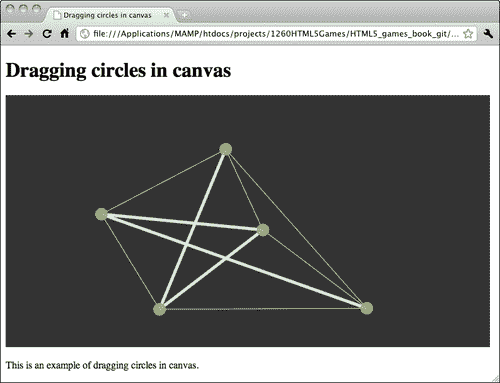

## 刚刚发生了什么？

我们刚刚在现有的拖动圆圈示例中添加了**线相交**检查代码。线相交代码涉及一些数学公式，以获得两条线的**交点**，并检查该点是否在我们提供的线段内。让我们看看数学部分，看看它是如何工作的。

## 确定两条线段是否相交

根据我们从几何学中学到的相交方程，对于一般形式中的两条给定线，我们可以得到交点。

**一般形式是什么？** 在我们的代码中，我们有线段的起点和终点的 x 和 y 坐标。这是一个**线段**，因为在数学中它只是线的一部分。线的一般形式由`Ax + By = C`表示。

以下图表解释了一般形式上的线段：

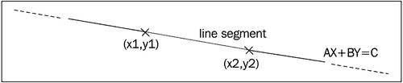

我们可以通过以下方程将具有点 1 的线段转换为 x1，y1 和具有点 2 的线段转换为 x2，y2 的一般形式：

```js
A = y2-y1
B = x1-x2
C = A * x1 + B * y2

```

现在我们有一个线方程`AX+BY = C`，其中`A，B，C`是已知的，`X`和`Y`是未知的。

我们正在检查两条相交的线。我们可以将两条线都转换为一般形式，并得到两条线方程：

```js
Line 1: A1X+B1Y = C1
Line 2: A2X+B2Y = C2

```

通过将两个一般形式方程放在一起，X 和 Y 是两个未知的变量。然后我们可以解这两个方程，得到 X 和 Y 的交点。

如果`A1 * B2 - A2 * B1`为零，则两条线是平行的，没有交点。否则，我们可以使用以下方程得到交点：

```js
X = (B2 * C1 B1 * C2) / (A1 * B2 A2 * B1)
Y = (A1 * C2 A2 * C1) / (A1 * B2 A2 * B1)

```

一般形式的交点只能说明两条线不相互平行，并且将在某一点相交。它并不保证交点在两条线段上。

以下图表显示了交点和给定线段的两种可能结果。在左图中，交点不在两条线段之间，在这种情况下，两条线段互不相交。在右侧图中，点在两条线段之间，因此这两条线段相互相交：

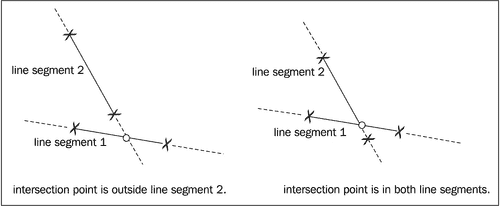

因此，我们需要另一个名为`isInBetween`的函数来确定提供的值是否在开始和结束值之间。然后我们使用这个函数来检查方程的交点是否在我们正在检查的两条线段之间。

在获得线条相交的结果后，我们绘制粗线以指示那些相交的线条。

# 制作解开谜题游戏

现在我们已经创建了一个交互画布，我们可以拖动圆圈和连接圆圈的线条与其他线条相交。我们来玩个游戏吧？有一些预定义的圆圈和线条，我们的目标是拖动圆圈，使没有线条与其他线条相交。这就是所谓的**解开谜题游戏**。

# 行动时间：在画布中制作解开谜题游戏

让我们在我们的线交点代码中添加游戏逻辑：

1.  在文本编辑器中打开`index.html`文件。

1.  首先，让我们将标题设置为以下内容：

```js
<header>
<h1>Untangle Puzzle Game in Canvas</h1>
</header>

```

1.  我们还需要向玩家显示当前级别和进度。在画布元素之后添加以下代码：

<p>谜题<span id="level">0</span>，完成度：<span id="progress">0</span>%</p>

1.  打开`html5games.untangle.js` JavaScript 文件以添加游戏逻辑。

1.  添加变量 info，`untangleGame`。它存储游戏的当前级别：

```js
var untangleGame = {
circles: [],
thinLineThickness: 1,
boldLineThickness: 5,
lines: [],
currentLevel: 0
};

```

1.  我们需要一些预定义的级别数据供玩家玩。这是一个定义圆圈放置位置以及它们最初如何连接到彼此的数据集合。将以下级别数据代码添加到`untangleGame`对象中：

```js
untangleGame.levels =
[
{
"level" : 0,
"circles" : [{"x" : 400, "y" : 156},
{"x" : 381, "y" : 241},
{"x" : 84, "y" : 233},
{"x" : 88, "y" : 73}],
"relationship" : {
"0" : {"connectedPoints" : [1,2]},
"1" : {"connectedPoints" : [0,3]},
"2" : {"connectedPoints" : [0,3]},
"3" : {"connectedPoints" : [1,2]}
}
},
{
"level" : 1,
"circles" : [{"x" : 401, "y" : 73},
{"x" : 400, "y" : 240},
{"x" : 88, "y" : 241},
{"x" : 84, "y" : 72}],
"relationship" : {
"0" : {"connectedPoints" : [1,2,3]},
"1" : {"connectedPoints" : [0,2,3]},
"2" : {"connectedPoints" : [0,1,3]},
"3" : {"connectedPoints" : [0,1,2]}
}
},
{
"level" : 2,
"circles" : [{"x" : 92, "y" : 85},
{"x" : 253, "y" : 13},
{"x" : 393, "y" : 86},
{"x" : 390, "y" : 214},
{"x" : 248, "y" : 275},
{"x" : 95, "y" : 216}],
"relationship" : {
"0" : {"connectedPoints" : [2,3,4]},
"1" : {"connectedPoints" : [3,5]},
"2" : {"connectedPoints" : [0,4,5]},
"3" : {"connectedPoints" : [0,1,5]},
"4" : {"connectedPoints" : [0,2]},
"5" : {"connectedPoints" : [1,2,3]}
}
}
];

```

1.  在每个级别开始时，我们需要设置初始级别数据。为了帮助使代码更易读，我们创建一个函数。在 JavaScript 文件的末尾添加以下代码：

```js
function setupCurrentLevel() {
untangleGame.circles = [];
var level = untangleGame.levels[untangleGame.currentLevel];
for (var i=0; i<level.circles.length; i++) {
untangleGame.circles.push(new Point(level.circles[i].x, level. circles[i].y, 10));
}
// setup line data after setup the circles.
connectCircles();
updateLineIntersection();
}

```

1.  这是一个有几个级别的游戏。我们需要检查玩家是否解决了当前级别的谜题并跳转到下一个谜题。在文件末尾添加以下函数：

```js
function checkLevelCompleteness() {
if ($("#progress").html() == "100") {
if (untangleGame.currentLevel+1 < untangleGame.levels.length)
untangleGame.currentLevel++;
setupCurrentLevel();
}
}

```

1.  我们更新原始的鼠标抬起事件处理程序以检查玩家是否完成了级别：

```js
$("#game").mouseup(function(e) {
untangleGame.targetCircle = undefined;
// on every mouse up, check if the untangle puzzle is solved.
checkLevelCompleteness();
});

```

1.  我们将根据级别数据绘制圆圈，而不是随机绘制它们。因此，我们删除 jQuery`ready`函数中的圆圈绘制代码。

1.  在我们删除 jQuery`ready`函数中的圆圈绘制代码的地方，我们添加以下代码来设置游戏循环使用的圆圈级别数据：

setupCurrentLevel();

1.  接下来，我们更新`connectCircles`函数以根据级别数据连接圆圈：

```js
function connectCircles()
{
// setup all lines based on the circles relationship
var level = untangleGame.levels[untangleGame.currentLevel];
untangleGame.lines.length = 0;
for (var i in level.relationship) {
var connectedPoints = level.relationship[i].connectedPoints;
var startPoint = untangleGame.circles[i];
for (var j in connectedPoints) {
var endPoint = untangleGame.circles[connectedPoints[j]];
untangleGame.lines.push(new Line(startPoint, endPoint));
}
}
}

```

1.  我们需要另一个函数来更新游戏进度。将以下函数添加到代码中：

```js
function updateLevelProgress()
{
// check the untangle progress of the level
var progress = 0;
for (var i=0;i<untangleGame.lines.length;i++) {
if (untangleGame.lines[i].thickness == untangleGame. thinLineThickness) {
progress++;
}
}
var progressPercentage = Math.floor(progress/untangleGame.lines. length*100);
$("#progress").html(progressPercentage);
// display the current level
$("#level").html(untangleGame.currentLevel);
}

```

1.  最后，我们需要在以下鼠标移动事件处理程序中更新级别进度。

```js
$("#game").mousemove(function(e) {
…
connectCircles();
updateLineIntersection();
updateLevelProgress();
…
});

```

1.  保存所有文件并在浏览器中测试游戏。我们可以拖动圆圈，线条的粗细将指示它是否与其他线条相交。在鼠标拖动期间，当检测到更多或更少的线交点时，级别完成百分比应该发生变化。如果我们解决了谜题，也就是说没有线条相交，游戏将跳转到下一个级别。当游戏达到最后一个级别时，它将继续显示最后一个级别。这是因为我们还没有添加游戏结束画面。

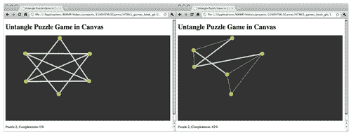

## 刚刚发生了什么？

我们已经在我们的画布中添加了游戏逻辑，以便我们可以玩我们在整章中创建的圆圈拖动代码。

让我们回顾一下我们添加到`untangleGame`对象的变量。以下表格列出了这些变量的描述和用法：

| 变量 | 描述 |
| --- | --- |
| circleRadius | 所有绘制圆圈的半径设置。 |
| thinLineThickness | 绘制细线时的线条粗细。 |
| boldLineThickness | 绘制粗线时的线条粗细。 |
| circles | 一个数组，用来存储画布中所有绘制的圆圈。 |
| lines | 一个数组，用来存储画布中所有绘制的线条。 |
| targetCircle | 跟踪我们正在拖动的圆圈。 |
| levels | 以 JSON 格式存储每个级别的所有初始数据。 |
| currentLevel | 一个数字，用来记录当前级别。 |

## 定义级别数据

在每个级别中，我们有解谜游戏中圆圈的初始位置。级别数据被设计为对象数组。每个对象包含每个级别的数据。在每个级别数据中，有三个属性：级别编号、圆圈和连接圆圈的线。下表显示了每个级别数据中的属性：

| 级别属性 | 定义 | 讨论 |
| --- | --- | --- |
| level | 对象的级别编号。 | 这是每个级别对象中的一个数字，让我们轻松地知道我们在哪个级别。 |
| circles | 一个数组，用来存储级别中圆圈的位置。 | 这定义了当级别设置时圆圈的初始位置。 |
| relationships | 一个定义哪些圆圈连接到彼此的关系数组。 | 每个级别中有一些连接圆圈的线。我们设计线条连接，使每个级别都有解决方案。线条关系定义了哪个圆圈连接到哪个圆圈。例如，以下代码表示圆圈 1 连接到圆圈 2：{"connectedPoints" : [1,2]} |

在每个级别数据都以我们自定义的结构定义好之后

## 确定升级

当没有线条相互交叉时，级别完成。我们遍历每条线，并查看有多少条线是细线。细线意味着它们没有与其他线条相交。我们可以使用细线与所有线条的比率来得到级别完成的百分比：

```js
var progress = 0;
for (var i in untangleGame.lines) {
if (untangleGame.lines[i].thickness == untangleGame. thinLineThickness) {
progress++;
}
}
var progressPercentage = Math.floor(progress/untangleGame.lines.length * 100);

```

当进度达到 100%时，我们可以简单地确定级别已经完成：

```js
if ($("#progress").html() == "100") {
// level complete, level up code
}

```

## 显示当前级别和完成进度

在画布游戏下方有一句话描述当前级别的状态和进度。它用于向玩家显示游戏状态，让他们知道他们在游戏中取得了进展：

```js
<p>Puzzle <span id="level">0</span>, Completeness: <span id="progress">0</span>%</p>

```

我们使用了我们在第二章中讨论的 jQuery HTML 函数，*开始 DOM 游戏开发*，来更新完成进度。

```js
$("#progress").html(progressPercentage);

```

## Have a go hero

在示例解谜游戏中，我们只定义了三个级别。只有三个级别是不够有趣的。要不要给游戏添加更多级别？如果你想不出级别，可以在互联网上搜索类似的解谜游戏，获取一些级别设计的灵感。

# 总结

在本章中，我们学到了很多关于绘制形状和与新的 HTML5 画布元素和绘图 API 交互的知识。

具体来说，我们涵盖了：

+   在画布中绘制不同的路径和形状，包括圆圈、弧线和直线。

+   添加鼠标事件和与画布中绘制的路径的交互。

+   在画布中拖动绘制的路径。

+   通过数学公式来检查线条的交叉。

+   创建一个解谜游戏，玩家需要拖动圆圈，使连接线不相交。

现在我们已经学习了关于画布和绘图 API 中的基本绘图功能，可以使用它们在画布中创建一个解谜游戏。我们准备学习一些高级的画布绘图技术。在下一章中，我们将使用更多的画布绘图 API 来增强我们的解谜游戏，比如绘制文本、绘制图像和绘制渐变。
