# 第五章：构建 Canvas 游戏大师班

> 在上一章中，我们探索了一些基本的画布上下文绘图 API，并创建了一个名为 Untangle 的游戏。在本章中，我们将通过使用其他一些上下文绘图 API 来增强游戏。

在本章中，我们将：

+   用渐变颜色填充我们的游戏对象

+   在画布中使用自定义网络字体填充文本

+   在 Canvas 中绘制图像

+   动画精灵表图像

+   并构建多个画布层

以下截图是我们将通过本章构建的最终结果的预览。它是一个基于 Canvas 的 Untangle 游戏，带有动画游戏指南和一些细微的细节：

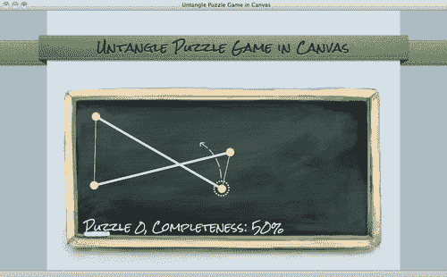

所以让我们开始吧...

# 用渐变颜色填充形状

在上一章中，我们介绍了填充纯色。Canvas 在填充形状时可以做得更多。我们可以用线性渐变和径向渐变填充形状。

# 行动时间 给 Untangle 游戏绘制渐变颜色背景

让我们改进一下我们现在的纯黑色背景。如何从上到下绘制一个渐变呢？

1.  我们将使用上一章中创建的 Untangle 游戏作为起点。在文本编辑器中打开`html5games.untangle.js` JavaScript 文件。

1.  在`gameloop`函数中清除画布后，添加以下代码以绘制**渐变**背景：

```js
var bg_gradient = ctx.createLinearGradient(0,0,0,ctx.canvas.height);
bg_gradient.addColorStop(0, "#000000");
bg_gradient.addColorStop(1, "#555555");
ctx.fillStyle = bg_gradient;
ctx.fillRect(0,0,ctx.canvas.width,ctx.canvas.height);

```

1.  保存文件并在浏览器中预览`index.html`。背景应该是一个线性渐变，顶部是黑色，逐渐变成底部的灰色。


## 刚刚发生了什么？

我们刚刚用**线性渐变**颜色填充了一个矩形。要填充线性渐变颜色，我们只需要设置渐变的起点和终点。然后在它们之间添加几个颜色停止。

以下是我们如何使用线性渐变函数的方式：

```js
createLinearGradient(x1, y1, x2, y2);

```

| 参数 | 定义 |
| --- | --- |
| x1 | 渐变的起点。 |
| y1 |   |
| x2 | 渐变的终点。 |
| y2 |   |

## 在渐变颜色中添加颜色停止

仅仅拥有起点和终点是不够的。我们还需要定义我们使用的颜色以及它如何应用到渐变中。这在渐变中被称为**颜色停止**。我们可以使用以下`gradient`函数向渐变中添加一个颜色停止：

```js
addColorStop(position, color);

```

| 参数 | 定义 | 讨论 |
| --- | --- | --- |
| 位置 | 0 到 1 之间的浮点数。 | 位置 0 表示颜色停在起点，1 表示它停在终点。0 到 1 之间的任何数字表示它停在起点和终点之间。例如，0.5 表示一半，0.33 表示离起点 30%。 |
| 颜色 | 那个颜色停止的颜色样式。 | 颜色样式与 CSS 颜色样式的语法相同。我们可以使用 HEX 表达式，如#FFDDAA。或其他颜色样式，如 RGBA 颜色名称。 |

下面的截图显示了线性渐变设置和结果绘制之间的并排比较。起点和终点定义了渐变的范围和角度。颜色停止定义了颜色在渐变范围之间的混合方式：


### 提示

**添加带不透明度的颜色停止**

我们可以使用 RGBA 函数为颜色停止设置不透明度值。以下代码告诉渐变从红色开始，不透明度为一半：

`gradient.addColorStop(0, "rgba(255, 0, 0, 0.5)")`;

## 填充径向渐变颜色

Canvas 绘图 API 中有两种渐变类型。我们刚刚使用的是线性渐变。另一种是**径向渐变**。径向渐变从一个圆到另一个圆填充渐变。

# 行动时间 用径向渐变颜色填充圆

想象一下，我们现在将我们拖动的圆填充为径向渐变。我们将把实心黄色圆改为白黄渐变：

1.  打开`html5game.untangle.js` JavaScript 文件。我们将修改用于在游戏中绘制圆的代码。

1.  在使用`arc`函数绘制圆形路径后，填充之前，我们将原始的实色样式设置替换为以下径向渐变颜色：

```js
function drawCircle(ctx, x, y) {
// prepare the radial gradients fill style
var circle_gradient = ctx.createRadialGradient(x-3,y- 3,1,x,y,untangleGame.circleRadius);
circle_gradient.addColorStop(0, "#fff");
circle_gradient.addColorStop(1, "#cc0");
ctx.fillStyle = circle_gradient;
// draw the path
ctx.beginPath();
ctx.arc(x, y, untangleGame.circleRadius, 0, Math.PI*2, true);
ctx.closePath();
// actually fill the circle path
ctx.fill();
}

```

1.  保存修改后的文件，并在 Web 浏览器中预览`index.html`。现在圆形填充了径向渐变颜色。

在下面的屏幕截图中，我将绘图放大到 200％，以更好地演示圆形中的径向渐变：

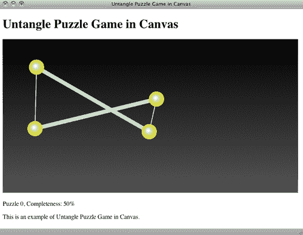

## 刚刚发生了什么？

我们通过填充径向渐变使拖动圆看起来更真实。

以下是我们创建径向渐变的方法：

```js
createRadialGradient(x1, y1, r1, x2, y2, r2);

```

| 参数 | 定义 |
| --- | --- |
| x1, y1 | 画布坐标中起始圆的中心 x 和 y。 |
| r1 | 起始圆的半径。 |
| x2, y2 | 画布坐标中结束圆的中心 x 和 y。 |
| r2 | 结束圆的半径。 |

下面的屏幕截图显示了径向渐变设置和画布中的最终结果之间的并排比较：

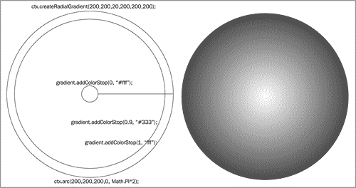

径向渐变将颜色从起始圆到结束圆进行混合。在这个渐变圆中，起始圆是中心的小圆，结束圆是最外面的圆。有三个颜色停止点。白色在起始和结束圆处停止；另一种深色在离起始圆 90％的地方停止。

## 尝试一下英雄填充渐变

我们向渐变中添加颜色停止点来定义颜色的混合方式。如果我们忘记向渐变中添加任何颜色停止点并填充一个矩形会发生什么？如果我们只定义一个颜色停止点会怎样？尝试实验颜色停止点设置。

在径向渐变示例中，小的起始圆在较大的结束圆内。如果起始圆比结束圆大会发生什么？如果起始圆不在结束圆内会怎么样？也就是说，如果两个圆不重叠会发生什么？

# 在画布中绘制文本

现在想象一下，我们想直接在画布内显示进度级别。画布为我们提供了在画布内绘制文本的方法。

# 行动时间 在画布元素内显示进度级别文本

1.  我们将继续使用我们的 Untangle 游戏。在文本编辑器中打开`html5games.untangle.js` JavaScript 文件。

1.  首先，让我们将级别进度百分比设为全局变量，这样我们可以在不同的地方使用它：

```js
var untangleGame = {
circles: [],
thinLineThickness: 1,
boldLineThickness: 5,
lines: [],
currentLevel: 0,
progressPercentage: 0
};

```

1.  在`gameloop`函数中的画布绘制代码之后添加以下代码：

```js
// draw the title text
ctx.font = "26px Arial";
ctx.textAlign = "center";
ctx.fillStyle = "#ffffff";
ctx.fillText("Untangle Game",ctx.canvas.width/2,50);
// draw the level progress text
ctx.textAlign = "left";
ctx.textBaseline = "bottom";
ctx.fillText("Puzzle "+untangleGame.currentLevel+", Completeness: " + untangleGame.progressPercentage + "%", 20,ctx.canvas.height-5);

```

1.  保存文件并在 Web 浏览器中预览`index.html`。我们会看到文本现在绘制在画布内。

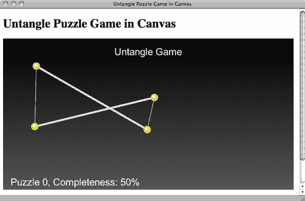

## 刚刚发生了什么？

我们刚刚在基于画布的游戏中绘制了标题和级别进度文本。我们使用**fillText**函数在画布中绘制文本。以下表格显示了我们如何使用该函数：

```js
fillText(string, x, y);

```

| 参数 | 定义 |
| --- | --- |
| string | 我们要绘制的文本。 |
| x | 文本绘制的 x 坐标。 |
| y | 文本绘制的 y 坐标。 |

这是绘制文本的基本设置。还有几个绘图上下文属性需要设置文本绘制。

| 上下文属性 | 定义 | 讨论 |
| --- | --- | --- |
| `context.font` | 文本的字体样式。 | 它与我们在 CSS 中声明字体样式所使用的语法相同。例如，以下代码将字体样式设置为 20 像素的 Arial 粗体：ctx.font = "bold 20px Arial"; |
| `context.textAlign` | 文本对齐。 | **对齐**定义了文本的对齐方式。可以是以下值之一：startendleftrightcenter 例如，如果我们要将文本放在画布的右边缘。使用`left`对齐意味着我们需要计算文本宽度以知道文本的 x 坐标。在这种情况下使用右对齐，我们只需要将 x 位置直接设置为画布宽度。文本将自动放置在画布的右边缘。 |
| `context.textBaseline` | 文本基线。 | 以下列出了**textBaseline**的常见值：topmiddlebottomalphabet 与文本对齐类似，当我们想要将文本放在画布底部时，`bottom` **基线**是有用的。`fillText`函数的 y 位置是基于文本的底部基线而不是顶部。`alphabet`基线根据小写字母表对齐 y 位置。以下截图显示了我们使用**alphabet**基线的文本绘制。 |

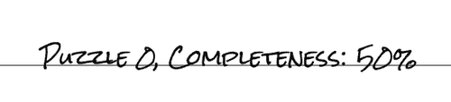

### 注意

请注意，画布中的文本绘制被视为位图图像数据。这意味着访问者无法选择文本；搜索引擎无法索引文本；我们无法搜索它们。因此，我们应该仔细考虑是否要在画布中绘制文本，还是直接将它们放在 DOM 中。

## 快速测验在画布中绘制文本

1.  如果我们要在画布的右下角附近绘制文本，哪种对齐和基线设置更好？

a. 左对齐，底部基线。

b. 居中对齐，字母基线。

c. 右对齐，底部基线。

d. 居中对齐，中间基线。

1.  我们将使用最新的开放网络标准制作一个具有翻页效果的逼真书籍。以下哪种设置更好？

a. 在画布中绘制逼真的书籍，包括所有文本和翻页效果。

b. 将所有文本和内容放在 DOM 中，并在画布中绘制逼真的翻页效果。

## 在画布中使用嵌入的 Web 字体

在上一章的记忆匹配游戏中，我们使用了自定义字体。自定义字体嵌入也适用于画布。让我们在画布中的 Untangle 游戏中进行一个绘制自定义字体的实验。

# 执行嵌入 Google Web 字体到画布元素的时间

让我们用手写风格字体绘制画布文本：

1.  首先，转到 Google 字体目录，选择手写风格字体。我使用了字体**Rock Salt**，你可以从以下 URL 获取：

```js
http://code.google.com/webfonts/family?family=Rock+Salt&subset=latin#code.

```

1.  Google 字体目录提供了一个 CSS 链接代码，我们可以将其添加到游戏中以嵌入字体。将以下 CSS 链接添加到`index.html`的头部：

```js
<link href='http://fonts.googleapis.com/css?family=Rock+Salt' rel='stylesheet' type='text/css'>

```

1.  接下来要做的是使用字体。我们打开`html5games.untangle.js` JavaScript 文件，并将上下文`font`属性修改为以下内容：

```js
ctx.font = "26px 'Rock Salt'";

```

1.  现在是时候在网络浏览器中打开我们的游戏来测试结果了。现在在画布中绘制的文本使用了我们在 Google 字体目录中选择的字体。

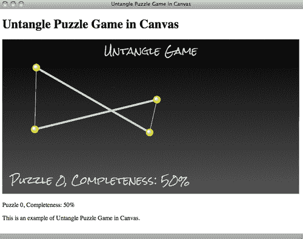

## 刚刚发生了什么？

我们刚刚选择了一个网络字体，并将其嵌入到画布中绘制文本时。这表明我们可以像其他 DOM 元素一样为画布中填充的文本设置字体系列。

### 提示

有时，不同字体系列的文本宽度会有所不同，尽管它们具有相同的字数。在这种情况下，我们可以使用`measureText`函数来获取我们绘制的文本的宽度。以下链接到 Mozilla 开发者网络解释了我们如何使用该函数：

[`developer.mozilla.org/en/Drawing_text_using_a_canvas#measureText()`](http://https://developer.mozilla.org/en/Drawing_text_using_a_canvas#measureText())

# 在画布中绘制图像

我们已经在画布内绘制了一些文本。那么绘制图像呢？是的。在画布中绘制图像和图像处理是画布具有的一个重要功能。

# 执行添加图形到游戏的时间

我们将在游戏中绘制一个黑板背景：

1.  从代码示例包或以下 URL 下载图形文件。图形文件包括我们在本章中需要的所有图形：

```js
http://gamedesign.cc/html5games/1260_05_example_graphics.zip

```

1.  将新下载的图形文件放入名为`images`的文件夹中。

1.  我们将加载一幅图像，加载意味着可能需要一段时间直到图像加载完成。理想情况下，我们不应该在所有游戏资源加载完成之前开始游戏。在这种情况下，我们可以准备一个带有加载文字的启动画面，让玩家知道游戏将在稍后开始。在 jQuery 的`ready`函数中清除画布上下文后，添加以下代码：

```js
// draw a splash screen when loading the game background
// draw gradients background
var bg_gradient = ctx.createLinearGradient(0,0,0,ctx.canvas.height);
bg_gradient.addColorStop(0, "#cccccc");
bg_gradient.addColorStop(1, "#efefef");
ctx.fillStyle = bg_gradient;
ctx.fillRect(0, 0, ctx.canvas.width, ctx.canvas.height);
// draw the loading text
ctx.font = "34px 'Rock Salt'";
ctx.textAlign = "center";
ctx.fillStyle = "#333333";
ctx.fillText("loading...",ctx.canvas.width/2,canvas.height/2);

```

1.  现在是真正加载图像的时候了。我们刚刚下载了一个名为`board.png`的图形文件。这是一个我们将绘制到画布上的黑板图形背景。在我们刚刚添加的代码之后添加以下代码：

```js
// load the background image
untangleGame.background = new Image();
untangleGame.background.onload = function() {
// setup an interval to loop the game loop
setInterval(gameloop, 30);
}
untangleGame.background.onerror = function() {
console.log("Error loading the image.");
}
untangleGame.background.src = "images/board.png";

```

1.  在`gameloop`函数中，我们在清除上下文并在绘制任何其他内容之前将图像绘制到画布中。由于图像加载需要时间，我们还需要确保在绘制之前加载它：

```js
// draw the image background
ctx.drawImage(untangleGame.background, 0, 0);

```

1.  我们设置了一个`levels`数组来存储包括初始圆位置在内的级别数据。现在一些圆与背景图像的边框重叠，所以我们可能需要改变圆的位置。使用以下新值更新级别 2 的圆数组：

```js
"circles" : [{"x" : 192, "y" : 155},
{"x" : 353, "y" : 109},
{"x" : 493, "y" : 156},
{"x" : 490, "y" : 236},
{"x" : 348, "y" : 276},
{"x" : 195, "y" : 228}],

```

1.  我们还需要调整级别进度文本的位置。修改`fill text`函数调用为以下代码，使用不同的位置值：

```js
ctx.fillText("Puzzle "+untangleGame.currentLevel+", Completeness: " + untangleGame.progressPercentage + "%", 60, ctx.canvas.height- 80);

```

1.  接下来，我们不希望为画布设置背景颜色，因为我们有一个带有透明边框的 PNG 背景。打开`untangle.css`文件并删除画布中的背景属性。

1.  现在保存所有文件并在 Web 浏览器中打开`index.html`。背景应该在那里，手写字体应该与我们的黑板主题相匹配。

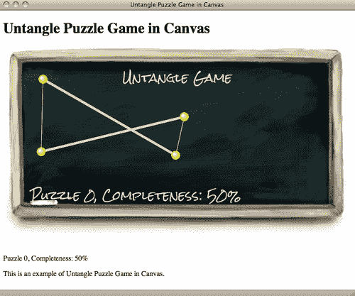

## 刚刚发生了什么？

我们刚刚在画布元素内绘制了一幅图像。

在画布上绘制图像有两种常见的方法。我们可以引用现有的`img`标签，也可以在 JavaScript 中动态加载图像。

这是我们在画布中引用现有图像标签的方式。

假设我们在 HTML 中有以下`img`标签：

```js


```

我们可以使用以下 JavaScript 代码在画布中绘制图像：

```js
var img = document.getElementById('board');
context.drawImage(img, x, y);

```

这是另一个加载图像的代码片段，而不将`img`标签附加到 DOM 中。如果我们在 JavaScript 中加载图像，我们需要确保图像在绘制到画布上之前已加载。因此，我们在图像的`onload`事件之后绘制图像：

```js
var board = new Image();
board.onload = function() {
context.drawImage(board, x, y);
images, inside canvasimages, inside canvasdrawing}
board.src = "images/board.png";

```

### 提示

**设置 onload 事件处理程序和分配图像 src 时的顺序很重要**

当我们将`src`属性分配给图像并且如果图像被浏览器缓存，一些浏览器会立即触发`onload`事件。如果我们在分配`src`属性后放置`onload`事件处理程序，我们可能会错过它，因为它是在我们设置事件处理程序之前触发的。

在我们的示例中，我们使用了后一种方法。我们创建了一个 Image 对象并加载了背景。当图像加载完成时，我们启动游戏循环，从而开始游戏。

加载图像时我们还应该处理的另一个事件是`onerror`事件。当我们访问额外的网络数据时，这是特别有用的。我们有以下代码片段来检查我们示例中的错误：

```js
untangleGame.background.onerror = function() {
console.log("Error loading the image.");
}

```

## 试一试

现在加载错误只在控制台中显示消息。玩家通常不会查看控制台。设计一个警报对话框或其他方法来告诉玩家游戏未能加载游戏资源，如何？

## 使用 drawImage 函数

有三种在画布中绘制图像的行为。我们可以在给定的坐标上绘制图像而不进行任何修改，我们还可以在给定的坐标上绘制具有缩放因子的图像，或者我们甚至可以裁剪图像并仅绘制裁剪区域。

`drawImage`函数接受几个参数：

```js
drawImage(image, x, y);

```

| 参数 | 定义 | 讨论 |
| --- | --- | --- |
| 图像 | 我们要绘制的图像引用。 | 我们可以通过获取现有的`img`元素或创建 JavaScript`Image`对象来获取图像引用。 |
| x | 在画布坐标中放置图像的 x 位置。 | x 和 y 坐标是我们放置图像的位置，相对于其左上角。 |
| y | 在画布坐标中放置图像的 y 位置。 |   |

```js
drawImage(image, x, y, width, height);

```

| 参数 | 定义 | 讨论 |
| --- | --- | --- |
| 图像 | 我们要绘制的图像引用。 | 我们可以通过获取现有的`img`元素或创建 JavaScript`Image`对象来获取图像引用。 |
| x | 在画布坐标中放置图像的 x 位置。 | x 和 y 坐标是我们放置图像的位置，相对于其左上角。 |
| y | 在画布坐标中放置图像的 y 位置。 |   |
| 宽度 | 最终绘制图像的宽度。 | 如果宽度和高度与原始图像不同，我们会对图像应用比例。 |
| 高度 | 最终绘制图像的高度。 |   |

```js
drawImage(image, sx, sy, sWidth, sHeight, dx, dy, width, height);

```

| 参数 | 定义 | 讨论 |
| --- | --- | --- |
| 图像 | 我们要绘制的图像引用。 | 我们可以通过获取现有的`img`元素或创建 JavaScript`Image`对象来获取图像引用。 |
| sx | 裁剪区域左上角的 x 坐标。 | 裁剪 x、y、宽度、高度一起定义了一个矩形裁剪区域。给定的图像将被此矩形裁剪。 |
| sy | 裁剪区域左上角的 y 坐标。 |   |
| sWidth | 裁剪区域的宽度。 |   |
| sHeight | 裁剪区域的高度。 |   |
| 参数 | 定义 | 讨论 |
| dx | 在画布坐标中放置图像的 x 位置。 | x 和 y 坐标是我们放置图像的位置，相对于其左上角。 |
| dy | 在画布坐标中放置图像的 y 位置。 |   |
| 宽度 | 最终绘制图像的宽度。 | 如果宽度和高度与裁剪尺寸不同，我们会对裁剪后的图像应用比例。 |
| 高度 | 最终绘制图像的高度。 |   |

## 试试看英雄 优化背景图像

在示例中，我们在每次调用`gameloop`函数时将黑板图像作为背景绘制。由于我们的背景是静态的，不会随时间变化，所以一遍又一遍地清除并重新绘制会浪费 CPU 资源。我们如何优化这个性能问题？

## 装饰基于画布的游戏

我们已经用渐变和图像增强了画布游戏。在继续之前，让我们装饰一下画布游戏的网页。

# 行动时间为游戏添加 CSS 样式和图像装饰

我们将建立一个居中对齐的布局，带有一个游戏标题：

1.  我们从 Google 字体目录嵌入了另一种字体来为正常的正文文本设置样式。在`index.html`的`head`中添加以下 CSS 链接：

```js
<link href='http://fonts.googleapis.com/css?family=Josefin+Sans:600' rel='stylesheet' type='text/css'>

```

1.  使用一个分组 DOM 元素来为布局设置样式更容易。我们将所有元素放入一个带有`id`页面的部分中：

```js
<section id="page">
...
</section>

```

1.  让我们对页面布局应用 CSS。用以下代码替换`untangle.css`文件中的现有内容：

```js
html, body {
background: url(../images/title_bg.png) 50% 0 no-repeat, url(../ images/bg_repeat.png) 50% 0 repeat-y #889ba7;
margin: 0;
font-family: 'Josefin Sans', arial, serif;
color: #111;
}
#game{
position:relative;
}
#page {
width: 821px;
min-height: 800px;
margin: 0 auto;
padding: 0;
text-align: center;
text-shadow: 0 1px 5px rgba(60,60,60,.6);
}
header {
height: 88px;
padding-top: 36px;
margin-bottom: 50px;
font-family: "Rock Salt", Arial, sans-serif;
font-size: 14px;
text-shadow: 0 1px 0 rgba(200,200,200,.5);
color: #121;
}

```

1.  现在我们在带上有标题的带子中有了标题文本。在画布中再次显示标题似乎是多余的。让我们删除以下绘制标题的代码行：

```js
ctx.fillText("Untangle Game",ctx.canvas.width/2,50);

```

1.  是时候保存所有文件并在 Web 浏览器中预览了。我们应该看到一个居中对齐的标题带和精心设计的布局。以下截图显示了结果：

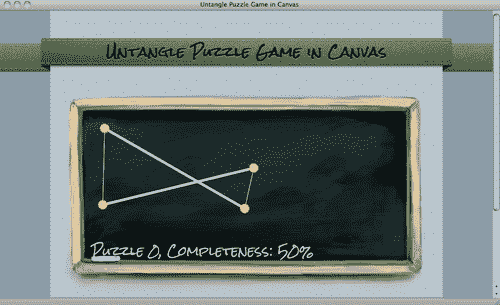

## 刚刚发生了什么？

我们刚刚装饰了包含基于画布的游戏的网页。虽然我们的游戏是基于画布绘制的，但这并不限制我们用图形和 CSS 样式装饰整个网页。

### 注意

画布元素的默认背景

画布元素的默认背景是透明的。如果我们不设置画布的任何背景 CSS 样式，它将是透明的。当我们的绘图不是矩形时，这是有用的。在这个例子中，纹理布局背景显示在画布区域内。

## 快速测验 设置画布背景

1.  我们如何将画布背景设置为透明？

a. 将背景颜色设置为#ffffff。

b. 什么也不做。默认情况下是透明的。

# 在 canvas 中制作精灵表动画

我们在第三章“在 CSS3 中构建记忆匹配游戏”中首次使用了**精灵表**图像，用于显示一副扑克牌。

# 行动时间 制作游戏指南动画

在 images 文件夹中有一个名为`guide_sprite.png`的图形文件。这是一个包含动画每一步的游戏指南图形。

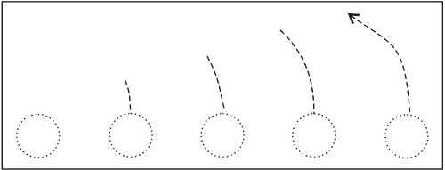

让我们用**动画**将这个指南画到我们的游戏中：

1.  在文本编辑器中打开`html5games.untangle.js` JavaScript 文件。

1.  在 jQuery 的`ready`函数中添加以下代码：

```js
// load the guide sprite image
untangleGame.guide = new Image();
untangleGame.guide.onload = function() {
untangleGame.guideReady = true;
// setup timer to switch the display frame of the guide sprite
untangleGame.guideFrame = 0;
setInterval(guideNextFrame, 500);
}
untangleGame.guide.src = "images/guide_sprite.png";

```

1.  我们添加以下函数，以便每 500 米将当前帧移动到下一帧：

```js
function guideNextFrame()
{
untangleGame.guideFrame++;
// there are only 6 frames (0-5) in the guide animation.
// we loop back the frame number to frame 0 after frame 5.
if (untangleGame.guideFrame > 5)
{
untangleGame.guideFrame = 0;
}
}

```

1.  在`gameloop`函数中，我们根据当前帧绘制指南动画。

```js
// draw the guide animation
if (untangleGame.currentLevel == 0 && untangleGame.guideReady)
{
// the dimension of each frame is 80x130.
var nextFrameX = untangleGame.guideFrame * 80;
ctx.drawImage(untangleGame.guide, nextFrameX, 0, 80, 130, 325,
130, 80, 130);
}

```

1.  通过打开`index.html`在 Web 浏览器中观看动画。以下截图演示了游戏指南动画的动画。指南动画将播放并循环，直到玩家升级：

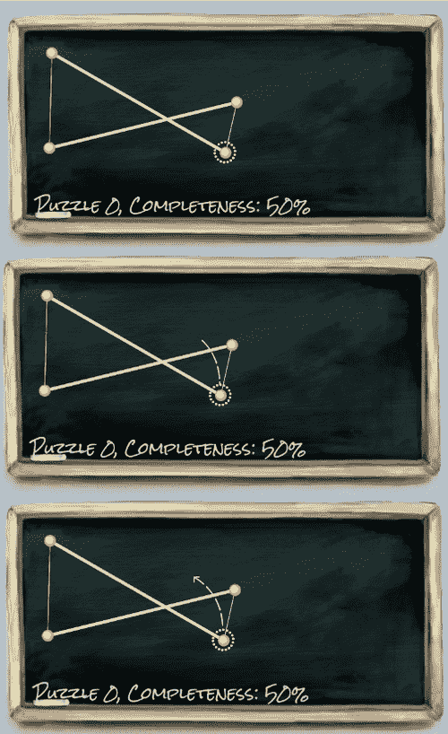

## 刚刚发生了什么？

在使用`drawImage`上下文函数时，我们可以只绘制图像的一部分区域。

以下截图逐步演示了动画的过程。矩形是裁剪区域。我们使用一个名为`guideFrame`的变量来控制显示哪一帧。每帧的宽度为 80。因此，我们通过将宽度和当前帧数相乘来获得裁剪区域的 x 位置：

```js
var nextFrameX = untangleGame.guideFrame * 80;
ctx.drawImage(untangleGame.guide, nextFrameX, 0, 80, 130, 325, 130, 80, 130);

```

`guideFrame`变量每 500 米通过以下`guideNextFrame`函数进行更新：

```js
function guideNextFrame()
{
untangleGame.guideFrame++;
// there are only 6 frames (0-5) in the guide animation.
// we loop back the frame number to frame 0 after frame 5.
if (untangleGame.guideFrame > 5)
{
untangleGame.guideFrame = 0;
}
}

```

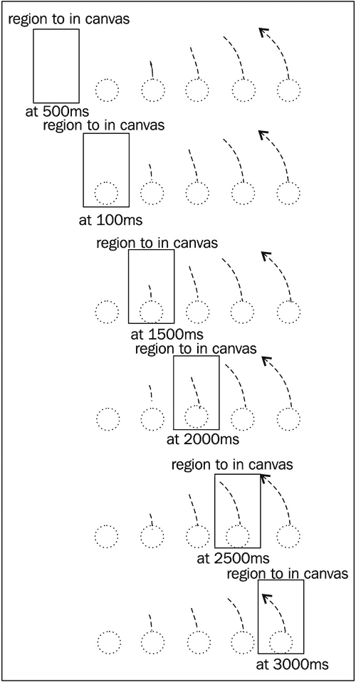

在开发游戏时，制作精灵动画是一种常用的技术。在传统视频游戏中使用精灵动画有一些好处。这些原因可能不适用于网页游戏开发，但我们在使用精灵表动画时有其他好处：

+   所有帧都加载为一个文件，因此一旦精灵文件加载完毕，整个动画就准备就绪。

+   将所有帧放入一个文件中意味着我们可以减少 Web 浏览器向服务器的 HTTP 请求。如果每一帧都是一个文件，那么浏览器会多次请求文件，而现在它只请求一个文件并使用一个 HTTP 请求。

+   将不同的图像放入一个文件中还有助于减少重复文件的页眉、页脚和元数据。

+   将所有帧放入一张图像中意味着我们可以轻松裁剪图像以显示任何帧，而无需复杂的代码来更改图像源。

它通常用于角色动画。以下截图是我在名为邻居的 HTML5 游戏中使用的愤怒猫的**精灵动画**：

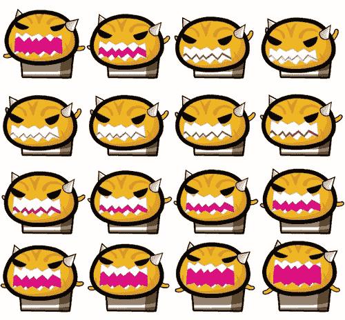

在这个例子中，我们通过裁剪帧并自行设置定时器来构建精灵表动画。当处理大量动画时，我们可能希望使用一些第三方精灵动画插件或创建自己的画布精灵动画，以更好地重用和管理逻辑代码。

### 注意

**精灵动画**是 HTML5 游戏开发中的重要主题，有许多在线资源讨论这个主题。以下链接是其中一些：

CodeUtopia 的精灵动画教程（[`codeutopia.net/blog/2009/08/21/using-canvas-to-do-bitmap-sprite-animation-in-javascript/`](http://codeutopia.net/blog/2009/08/21/using-canvas-to-do-bitmap-sprite-animation-in-javascript/)）讨论了如何从头开始制作精灵对象并使用它来动画显示精灵。

John Graham 的精灵动画演示（[`www.johnegraham2.com/web-technology/html-5-canvas-tag-sprite-animation-demo/`](http://www.johnegraham2.com/web-technology/html-5-canvas-tag-sprite-animation-demo/)）提供了另一个精灵对象，用于在画布中动画显示精灵。

另一方面，Spritely（[`www.spritely.net/`](http://www.spritely.net/)）提供了在 DOM 元素上使用 CSS 进行精灵动画。当我们想要在不使用画布的情况下动画显示精灵时，这是很有用的。

# 创建多层画布游戏

现在所有的东西都绘制到上下文中，它没有其他状态来区分已绘制的项目。我们可以将画布游戏分成不同的图层，并编写逻辑来控制和绘制每个图层。

# 行动时间将游戏分成四个图层

我们将把 Untangle 游戏分成四个图层：

1.  在`index.htm`中，我们将画布 HTML 更改为以下代码。它包含一个部分内的几个画布：

```js
<section id="layers">
<canvas id="bg" width="768" height="440">
Sorry, your web browser does not support canvas content.
</canvas>
<canvas id="guide" width="768" height="440"></canvas>
<canvas id="game" width="768" height="440"></canvas>
<canvas id="ui" width="768" height="440"></canvas>
</section>

```

1.  我们还需要对画布应用一些样式，使它们重叠在一起，以创建多层效果。此外，我们还需要准备一个`fadeout`类和`dim`类，使目标变得透明。将以下代码添加到`untangle.css`文件中：

```js
#layers {
height: 440px;
position: relative;
margin: 0 auto;
width:768px;
height: 440px;
}
#layers canvas{
left: 50%;
margin-left: -384px;
position: absolute;
}
#guide {
opacity: .7;
}
#guide.fadeout {
opacity: 0;
-webkit-transition: opacity .5s linear;
transition: opacity .5s linear;
}
#ui {
-webkit-transition: opacity .3s linear;
transition: opacity .3s linear;
}
#ui.dim {
opacity: .3;
}

```

1.  在`html5games.untangle.js` JavaScript 文件中，我们修改代码以支持图层功能。首先，我们添加一个数组来存储每个画布的上下文引用：

```js
untangleGame.layers = new Array();

```

1.  然后，我们获取上下文引用并将它们存储在数组中：

```js
// prepare layer 0 (bg)
var canvas_bg = document.getElementById("bg");
untangleGame.layers[0] = canvas_bg.getContext("2d");
// prepare layer 1 (guide)
var canvas_guide = document.getElementById("guide");
untangleGame.layers[1] = canvas_guide.getContext("2d");
// prepare layer 2 (game)
var canvas = document.getElementById("game");
var ctx = canvas.getContext("2d");
untangleGame.layers[2] = ctx;
// prepare layer 3 (ui)
var canvas_ui = document.getElementById("ui");
untangleGame.layers[3] = canvas_ui.getContext("2d");

```

1.  由于现在游戏画布重叠在一起，我们在`game`画布中的鼠标事件监听器不再起作用。我们可以从父`layers` DIV 中监听事件，该 DIV 具有与画布相同的位置和尺寸：

```js
$("#layers").mousedown(function(e)
$("#layers").mousemove(function(e)
$("#layers").mouseup(function(e)

```

1.  我们将绘图部分分成不同的函数，用于不同的图层。在以下的`drawLayerBG`函数中，它只负责绘制背景：

```js
function drawLayerBG()
{
var ctx = untangleGame.layers[0];
clear(ctx);
// draw the image background
ctx.drawImage(untangleGame.background, 0, 0);
}

```

1.  当背景图像加载时，我们绘制背景层。将以下突出显示的代码添加到背景的`onload`事件中：

```js
untangleGame.background.onload = function() {
drawLayerBG();
// setup an interval to loop the game loop
setInterval(gameloop, 30);
}

```

1.  我们将游戏循环分成三个不同的函数，用于指定的图层：

```js
function gameloop() {
drawLayerGuide();
drawLayerGame();
drawLayerUI();
}

```

1.  现在我们将指导线动画放入一个专用画布中，这样我们就可以轻松地应用 CSS 样式来淡出指导线：

```js
function drawLayerGuide()
{
var ctx = untangleGame.layers[1];
clear(ctx);
// draw the guide animation
if (untangleGame.guideReady)
{
// the dimension of each frame is 80x130.
var nextFrameX = untangleGame.guideFrame * 80;
ctx.drawImage(untangleGame.guide, nextFrameX, 0, 80, 130, 325, 130, 80, 130);
}
// fade out the guideline after level 0
if (untangleGame.currentLevel == 1)
{
$("#guide").addClass('fadeout');
}
}

```

1.  以下的`drawLayerGame`保留了我们在游戏中使用的所有绘图代码。大部分代码来自原始的`gameloop`函数：

```js
function drawLayerGame()
{
// get the reference of the canvas element and the drawing context.
var ctx = untangleGame.layers[2];
// draw the game state visually
// clear the canvas before drawing.
clear(ctx);
// draw all remembered line
for(var i=0;i<untangleGame.lines.length;i++) {
var line = untangleGame.lines[i];
var startPoint = line.startPoint;
var endPoint = line.endPoint;
var thickness = line.thickness;
drawLine(ctx, startPoint.x, startPoint.y, endPoint.x, endPoint.y, thickness);
}
// draw all remembered circles
for(var i=0;i<untangleGame.circles.length;i++) {
var circle = untangleGame.circles[i];
drawCircle(ctx, circle.x, circle.y, circle.radius);
}
}

```

1.  级别进度文本现在放置在 UI 层中，并由`drawLayerUI`函数绘制。它使用一个专用层，因此当文本与游戏对象（如圆圈）重叠时，我们可以轻松地降低不透明度：

```js
function drawLayerUI()
multi-layers canvas gamemulti-layers canvas gamefour layers, dividing into{
var ctx = untangleGame.layers[3];
clear(ctx);
// draw the level progress text
ctx.font = "26px 'Rock Salt'";
ctx.fillStyle = "#dddddd";
ctx.textAlign = "left";
ctx.textBaseline = "bottom";
ctx.fillText("Puzzle "+untangleGame.currentLevel+", Completeness: ", 60,ctx.canvas.height-80);
ctx.fillText(untangleGame.progressPercentage+"%",450, ctx.canvas.height-80);
// get all circles, check if the ui overlap with the game objects
var isOverlappedWithCircle = false;
for(var i in untangleGame.circles) {
var point = untangleGame.circles[i];
if (point.y > 310)
{
isOverlappedWithCircle = true;
}
}
if (isOverlappedWithCircle)
{
$("#ui").addClass('dim');
}
else
{
$("#ui").removeClass('dim');
}
}

```

1.  保存所有文件，并在 Web 浏览器中检查我们的大量代码更改。游戏应该显示得好像我们什么都没改变一样。尝试将圆圈拖动到靠近黑板的底部边缘。级别进度文本应该变得不透明。完成第一级时，指导线动画将优雅地淡出。以下截图显示了半透明的级别进度：

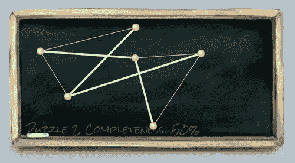

## 刚刚发生了什么？

现在总共有四个画布。每个画布负责一个图层。图层分为背景、游戏指导线、游戏本身和显示级别进度的用户界面。

默认情况下，画布和其他元素一样，是依次排列的。为了重叠所有画布以构建图层效果，我们对它们应用了`absolute`位置。

以下截图显示了我们游戏中现在设置的四个层。默认情况下，后添加的 DOM 位于之前添加的 DOM 之上。因此，`bg`画布位于底部，`ui`位于顶部：

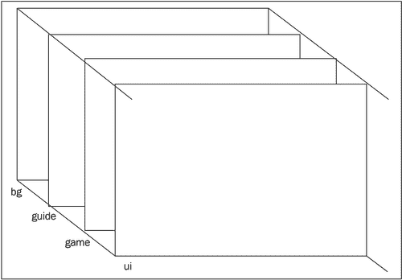

## 将 CSS 技术与画布绘制混合

我们正在创建一个基于画布的游戏，但我们并不局限于只使用画布绘图 API。级别进度信息现在在另一个 ID 为`ui`的画布中。在这个示例中，我们混合了我们在第三章中讨论的 CSS 技术，*在 CSS3 中构建记忆匹配游戏*。

当我们在画布上拖动圆圈时，它们可能会重叠在级别信息上。在绘制 UI 画布层时，我们会检查是否有任何圆圈的坐标过低并且重叠在文本上。然后我们会淡化 UI 画布的 CSS 不透明度，这样就不会分散玩家对圆圈的注意力。

在玩家升级后，我们还会淡出指南动画。这是通过将整个`guide`画布淡出到 CSS 过渡缓和为 0 不透明度来实现的。由于`guide`画布只负责该动画，隐藏该画布不会影响其他元素：

```js
if (untangleGame.currentLevel == 1)
{
$("#guide").addClass('fadeout');
}

```

### 提示

**只清除改变的区域以提高画布性能**

我们可以使用`clear`函数来清除画布上下文的一部分。这将提高性能，因为它避免了每次重新绘制整个画布上下文。这是通过标记自上次绘制以来状态发生变化的上下文的“脏”区域来实现的。

在我们的示例中的指南画布层，我们可以考虑只清除精灵表图像绘制的区域，而不是整个画布。

在简单的画布示例中，我们可能看不到明显的差异，但是当我们有一个包含许多精灵图像动画和复杂形状绘制的复杂画布游戏时，它有助于提高性能。

## 试试吧

当玩家进入第 2 级时，我们会淡出指南。当玩家拖动任何圆圈时，我们如何淡出指南动画？我们怎么做？

# 总结

在本章中，我们学到了很多关于在画布中绘制渐变、文本和图像的知识。

具体来说，我们涵盖了：

+   用线性或径向渐变填充形状

+   用字体嵌入和其他文本样式在画布中填充文本

+   将图像绘制到画布中

+   通过`clipping`函数在绘制图像时对精灵表进行动画处理

+   通过堆叠多个画布元素将游戏分成几个层

+   在基于画布的游戏中混合 CSS 过渡动画

在这本书中我们没有提到的一件事是画布中的位图操作。画布上下文是一个位图数据，我们可以在每个像素上应用操作。例如，我们可以在画布上绘制图像并对图像应用类似于 Photoshop 的滤镜。我们不会在书中涵盖这个内容，因为图像处理是一个高级话题，而且应用可能与游戏开发无关。

在互联网上有一些很好的画布游戏示例。Canvas Demo ([`www.canvasdemos.com/type/games/`](http://www.canvasdemos.com/type/games/))链接了其他网站上最新的画布游戏。Mozilla 的 Game On 2010 画廊([`gaming.mozillalabs.com/games/`](https://gaming.mozillalabs.com/games/))列出了他们游戏开发竞赛的一系列游戏条目。其中一些是用画布制作的。

现在我们已经学会了在画布中构建游戏并为游戏对象制作动画，比如游戏角色，我们准备在下一章为我们的游戏添加音频组件和音效。

我们将在第九章中回到基于画布的游戏，
