# 第六章：为你的游戏添加声音效果

> 我们已经讨论了几种以视觉方式绘制游戏对象的技术。在本章中，我们将专注于使用 HTML5 规范中引入的`audio`标签。我们可以通过 JavaScript API 添加声音效果、背景音乐，并控制音频。此外，我们将在本章中构建一个音乐游戏。这是一个需要玩家在正确的时间击中正确的琴弦以产生音乐的游戏。

在本章中，我们将学习以下主题：

+   为播放按钮添加声音效果

+   构建一个迷你钢琴音乐游戏

+   链接音乐游戏和播放按钮

+   为游戏添加键盘驱动

+   创建一个键盘驱动的音乐游戏

+   完成具有级别数据记录和游戏结束事件的音乐游戏

以下截图显示了我们将通过本章创建的最终结果：

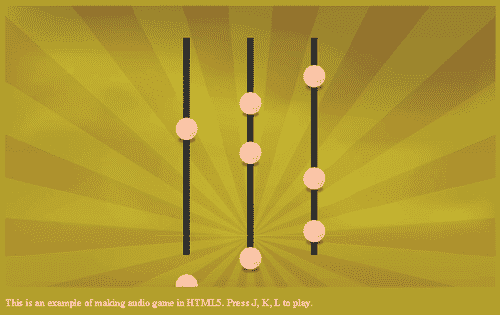

所以，让我们开始吧。

# 为播放按钮添加声音效果

在之前的章节中，我们在 Untangle 游戏示例中有几种鼠标交互。现在想象一下，我们希望在鼠标交互时有声音效果。这要求我们指示游戏使用哪个音频文件。我们将使用`audio`标签在按钮上创建声音效果。

# 执行添加声音效果到播放按钮的操作

我们将从代码包中提供的代码示例开始。我们将有类似以下截图所示的文件夹结构：

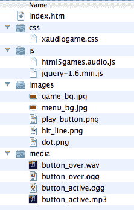

1.  `index.htm`文件包含了 HTML 的基本结构。现在让我们在`index.htm`文件的 body 部分添加以下代码：

```js
<div id="game">
<section id="menu-scene" class="scene">
<a href="#game"><span>Play</span></a>
</section>
</div>
<audio id="buttonover">
<source src="img/button_over.wav" />
<source src="img/button_over.ogg" />
</audio>
<audio id="buttonactive">
<source src="img/button_active.mp3" />
<source src="img/button_active.ogg" />
</audio>

```

1.  HTML 文件使用样式表完成。该文件可以在名为`audiogame.css`的代码包中找到。

1.  接下来，我们将在 JavaScript 文件中为按钮添加声音效果。在`html5games.audio.js`文件中添加以下 JavaScript：

```js
//a global object variable to store all game scope variable.
var audiogame = {};
// init function when the DOM is ready
$(function(){
// get the references of the audio element.
audiogame.buttonOverSound = document.getElementById("buttonover");
audiogame.buttonOverSound.volume = 0.3;
audiogame.buttonActiveSound = document.getElementById("buttonactive");
audiogame.buttonActiveSound.volume = 0.3;
// listen the button event that links to #game
$("a[href='#game']")
.hover(function(){
audiogame.buttonOverSound.currentTime = 0;
audiogame.buttonOverSound.play();
},function(){
audiogame.buttonOverSound.pause();
sound effect, adding to Play buttonsound effect, adding to Play buttonsteps});
.click(function(){
audiogame.buttonActiveSound.currentTime = 0;
audiogame.buttonActiveSound.play();
return false;
});
});

```

1.  在浏览器中打开`index.htm`文件。在那里，你应该看到一个黄色背景上的**PLAY**按钮，如下截图所示。尝试将鼠标移动到按钮上并点击它。当你悬停在按钮上时，你应该能听到声音，当你点击它时，你应该能听到另一个声音：

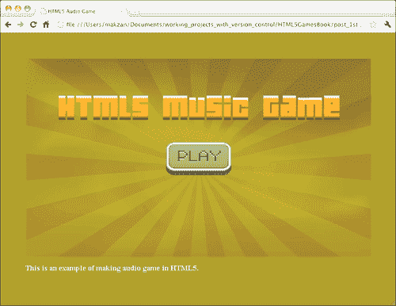

## 刚刚发生了什么？

我们刚刚创建了一个基本的 HTML5 游戏布局，其中播放按钮放置在页面中间。JavaScript 文件处理按钮的鼠标悬停和点击，并播放相应的声音效果。

## 定义一个音频元素

使用`audio`标签的最简单方法是提供一个源文件。以下代码片段显示了如何定义音频元素：

```js
<audio>
<source src="img/button_active.mp3" />
<source src="img/button_active.ogg" />
<!-- Any code for browser that does not support audio tag -->
</audio>

```

### 提示

**在音频标签中显示回退内容**

`audio`标签是 HTML5 规范中新引入的。我们可以在`audio`标签内放置回退内容，例如 Flash 电影来播放音频。以下来自 HTML5 Rocks 的链接显示了如何使用具有 Flash 回退的`audio`标签的快速指南：

[`www.html5rocks.com/tutorials/audio/quick/`](http://www.html5rocks.com/tutorials/audio/quick/)

除了设置`audio`标签的源文件外，我们还可以使用几个属性来进行额外的控制。以下表格显示了我们可以为音频元素设置的属性：

| 参数 | 定义 | 解释 |
| --- | --- | --- |
| `src` | 定义音频元素的源文件 | 当我们在`audio`标签中使用`src`属性时，它指定了音频文件的一个源文件。例如，我们在以下代码中加载一个声音效果`Ogg`文件：<audio src='sound.ogg'>如果我们想要指定多个具有不同格式的文件，那么我们可以在音频元素内使用`source`标签。以下代码指定了具有不同格式的`audio`标签，以支持不同的网络浏览器：<audio><source src='sound.ogg'><source src='sound.mp3'><source src='sound.wav'></audio> |
| 参数 | 定义 | 解释 |
| `autoplay` | 指定音频一旦加载就自动播放 | Autoplay 用作独立属性。这意味着以下两行代码没有区别：<audio src='file.ogg' autoplay><audio src='file.ogg autoplay="autoplay"> |
| `loop` | 指定音频在播放完成后从头开始再次播放 | 这也用作独立属性。 |
| `preload` | 指定音频源在页面加载后加载 | `preload`属性可以取以下任一值：`preload="auto"``preload="metadata"``preload="none"`当`preload`用作独立属性时，它的作用类似于设置为`auto`，浏览器将预加载音频。当设置为`metadata`时，浏览器不会预加载音频的内容。但是，它会加载音频的元数据，如持续时间和大小。当设置为`none`时，浏览器根本不会预加载音频。内容和元数据在播放时加载。 |
| `controls` | 显示音频的播放控件 | `controls`属性是一个独立的属性。它指示浏览器在音频位置显示播放控件。 |

以下屏幕截图显示 Chrome 显示控件：

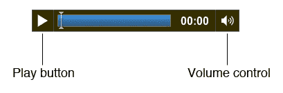

## 播放声音

我们可以通过调用`getElementById`函数来获取音频元素的引用。然后，我们通过调用`play`函数来播放它。以下代码播放`buttonactive`音频：

```js
<audio id="buttonactive">
<source src="img/button_active.mp3" />
<source src="img/button_active.ogg" />
</audio>
<script>
document.getElementById("buttonactive").play();
</script>

```

`play`函数从存储在`currentTime`属性中的经过的时间播放音频。`currentTime`的默认值为零。以下代码从 3.5 秒开始播放音频：

```js
<script>
document.getElementById("buttonactive").currentTime = 3.5;
document.getElementById("buttonactive").play();
</script>

```

## 暂停声音

与播放按钮类似，我们也可以通过使用`pause`函数暂停音频元素的播放。以下代码暂停`buttonactive`音频元素：

```js
<script>
document.getElementById("buttonactive").pause();
</script>

```

### 注意

没有`stop`函数来停止音频元素。相反，我们可以暂停音频并将元素的`currentTime`属性重置为零。以下代码显示了如何停止音频元素：

`<script>`

`document.getElementById("buttonactive").pause()`;

`document.getElementById("buttonactive").currentTime = 0`;

`</script>`

## 调整音量

我们还可以设置音频元素的音量。音量必须在 0 和 1 之间。我们可以将音量设置为 0 来静音，将其设置为 1 来达到最大音量。以下代码片段将`buttonactive`音频的音量设置为 30%：

```js
<script>
document.getElementById("buttonactive").volume = 0.3;
</script>

```

## 使用 jQuery hover 事件

jQuery 提供了一个`hover`函数来定义当我们鼠标悬停和移出 DOM 元素时的行为。以下是我们如何使用`hover`函数：

```js
.hover(function1, function2);

```

| 参数 | 讨论 |
| --- | --- |
| `function1` | 当鼠标移入时执行该函数。 |
| `function2` | 这是可选的。当鼠标移出时执行该函数。当未提供此函数时，移出行为与 function1 相同。 |

在以下代码中，当鼠标移动时，我们播放鼠标悬停音效，并在鼠标移出时暂停音效：

```js
$("a[href='#game']").hover(function(){
audiogame.buttonOverSound.currentTime = 0;
audiogame.buttonOverSound.play();
},function(){
audiogame.buttonOverSound.pause();
});

```

## 创建 Ogg 格式音频以支持 Mozilla Firefox

当我们定义音频元素的来源时，我们使用 MP3 格式和**Ogg**格式文件。Ogg 是一种免费开源的媒体容器格式，受到 Mozilla Firefox 的支持。我们将使用免费音频转换器将我们的 MP3 文件转换为 Ogg 文件。

### 注意

维基百科在以下网址包含了有关 Ogg 格式的详细解释：

[`en.wikipedia.org/wiki/Ogg`](http://en.wikipedia.org/wiki/Ogg)

# 执行操作 将 MP3 声音转换为 Ogg 格式使用 Audacity

Ogg 是一个开源标准，可以免费使用。有许多支持它的音乐播放器和转换器。我们将使用名为**Audacity**的免费软件将我们的 MP3 文件转换为 Ogg 格式：

1.  转到以下网址下载 Audacity：

[`audacity.sourceforge.net/download/`](http://audacity.sourceforge.net/download/)

1.  按照安装程序的说明安装 Audacity。

1.  在 Audacity 中打开`button_over.mp3`。以下截图显示了打开了 MP3 文件的 Audacity，等待我们开始转换：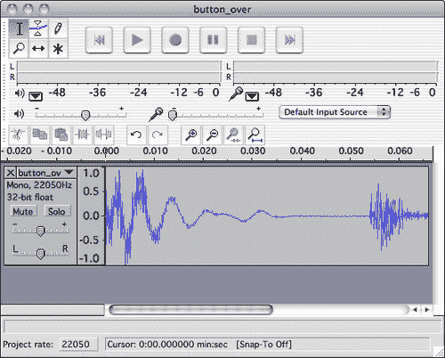

1.  单击**文件** | **导出为 Ogg Vorbis**以打开导出对话框。

### 注意

在撰写本书时，Audacity 1.3 beta 版本已发布，导出布局发生了变化。单击**文件** | **导出…**，并在导出对话框中选择 Ogg 格式。

1.  在工作目录中保存 Ogg 格式文件。

## 刚刚发生了什么？

我们刚刚将一个 MP3 格式的音效转换为 Ogg 格式，以使音频在不支持 MP3 格式的浏览器中工作。

## 支持不同的网络浏览器和不同的音频格式

以下表格显示了撰写本书时最受欢迎的网络浏览器支持的音频格式：

| 浏览器 | Ogg | MP3 | WAV |
| --- | --- | --- | --- |
| Firefox 3.6+ | 是 | - | 是 |
| Safari 5+ | - | 是 | 是 |
| Chrome | 是 | 是 | - |
| Opera 10.5+ | 是 | - | 是 |
| Internet Explorer 9 | - | 是 | 是 |

## 小测验 使用音频标签

1.  我们如何停止正在播放的音频元素？

a. 使用`stop`函数

b. 使用`pause`函数并将`currentTime`重置为 0

c. 将`currentTime`重置为 0

1.  我们如何在不支持`audio`标签的浏览器中放置回退内容以显示？

# 构建一个迷你钢琴音乐游戏

现在想象一下，我们不仅播放音效，还使用`audio`标签播放整首歌曲。随着歌曲的播放，有一些音乐点向下移动，作为音乐的可视化。

# 创建音乐游戏的基本背景

首先，我们将在画布上绘制一些路径作为音乐播放的背景。

1.  我们将继续处理示例并绘制背景。在文本编辑器中打开`index.htm`文件，并添加以下突出显示的代码，定义了具有两个设置的画布的游戏场景：

```js
<div id="game">
<section id="menu-scene" class="scene">
<a href="#game"><span>Play</span></a>
</section>
<section id="game-scene" class="scene">
<canvas id="game-background-canvas" width="768" height="440">
Sorry, your web browser does not support canvas content.
</canvas>
<canvas id="game-canvas" width="768" height="440"></canvas>
</section>
</div>

```

1.  我们在 HTML 文件中添加了一个游戏场景。我们希望将其放在菜单场景的上方，因此我们通过在`audiogame.css`中添加以下内容来将游戏场景设置为`absolute`位置：

```js
#game-scene {
background: #efefef url(../images/game_bg.jpg);
}
#game-canvas, #game-background-canvas {
position: absolute;
}

```

1.  是时候编写背景绘制代码了。打开`html5games.audio.js` JavaScript 文件。

1.  在 jQuery 的`ready`函数中，我们调用`drawBackground`函数来绘制背景，如下所示：

```js
drawBackground();

```

1.  在 JavaScript 文件的末尾添加以下`drawBackground`函数。该代码在`game-background-canvas`画布中绘制了三条黑线和一条灰线：

```js
function drawBackground()
{
// get the reference of the canvas and the context.
var game = document.getElementById("game-background-canvas");
var ctx = game.getContext('2d');
// set the line style of the three vertical lines.
ctx.lineWidth = 10;
ctx.strokeStyle = "#000";
var center = game.width/2;
// draw the three lines
// the left line is placed 100 pixels on the left of center.
ctx.beginPath();
ctx.moveTo(center-100, 50);
ctx.lineTo(center-100, ctx.canvas.height - 50);
ctx.stroke();
// the middle line is placed at the center
ctx.beginPath();
ctx.moveTo(center, 50);
ctx.lineTo(center, ctx.canvas.height - 50);
ctx.stroke();
// the right line is placed 100 pixels on the right of center.
ctx.beginPath();
ctx.moveTo(center+100, 50);
ctx.lineTo(center+100, ctx.canvas.height - 50);
ctx.stroke();
mini piano gamemini piano gamebasic background, creating// draw the horizontal line
ctx.beginPath();
ctx.moveTo(center-150, ctx.canvas.height - 80);
ctx.lineTo(center+150, ctx.canvas.height - 80);
// reset the line style to 1px width and grey before actually drawing the horizontal line.
ctx.lineWidth = 1;
ctx.strokeStyle = "rgba(50,50,50,.8)";
ctx.stroke();
}

```

1.  当我们在浏览器中打开`index.htm`文件时，将会看到四条带有背景的线，如下截图所示。现在不用担心播放按钮被隐藏，稍后我们会再次显示它：

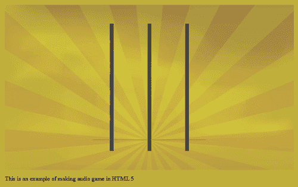

## 刚刚发生了什么？

我们创建了一个画布，在这个音乐游戏示例中，我们介绍了 HTML5 游戏中的基本场景管理。

## 在 HTML5 游戏中创建场景

在 HTML5 中创建**场景**类似于在上一章中创建**图层**。它是一个包含多个子元素的 DOM 元素。所有子元素都是绝对定位的。我们的示例中现在有两个场景。以下代码片段显示了整个游戏中可能的场景结构，包括游戏结束场景、信用场景和排行榜场景：

```js
<div id="game">
<section id="menu-scene" class="scene"></section>
<section id="game-scene" class="scene"></section>
<section id="gameover-scene" class="scene"></section>
<section id="credit-scene" class="scene"></section>
<section id="leaderboard-scene" class="scene"></section>
</div>

```

以下截图显示了场景在网页中放置在同一位置。这与图层结构非常相似。不同之处在于我们将通过显示和隐藏每个场景来控制场景：

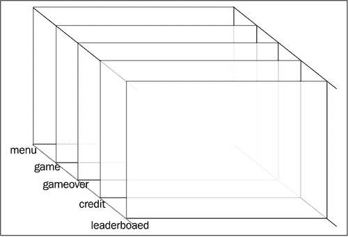

## 可视化音乐播放

如果您曾经玩过舞动革命、吉他英雄或触觉复仇游戏，那么您可能熟悉音乐点向下或向上移动，玩家在音乐点移动到正确位置时击中音乐点。以下截图展示了触觉复仇游戏：

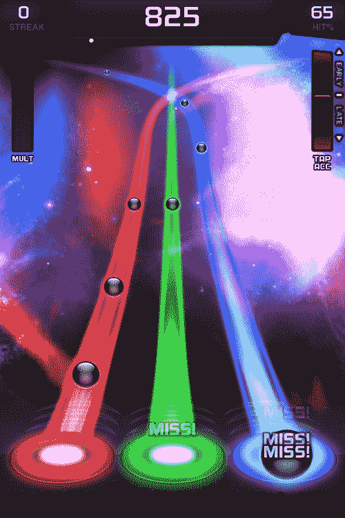

我们将在画布中以类似的音乐可视化方式播放`audio`标签中的歌曲。

# 进行操作在音乐游戏中创建播放可视化

执行以下步骤：

1.  我们需要一首旋律部分和一个基础部分的歌曲。从下载的文件或`media`文件夹中的代码捆绑包中复制`minuet_in_g.ogg, minuet_in_g.mp3, minuet_in_g_melody.ogg`和`minuet_in_g_melody.mp3`文件。

1.  然后，添加带有歌曲作为源文件的`audio`标签。打开`index.htm`文件并添加以下代码：

```js
<audio id="melody">
<source src="img/minuet_in_g_melody.mp3" />
<source src="img/minuet_in_g_melody.ogg" />
</audio>
<audio id="base">
<source src="img/minuet_in_g.mp3" />
<source src="img/minuet_in_g.ogg" />
</audio>

```

1.  音乐可视化主要是用 JavaScript 完成的。在文本编辑器中打开`html5games.audio.js` JavaScript 文件。

1.  添加`MusicNote`对象类型来表示音乐数据，添加`Dot`对象类型来表示画布中音乐音符的可视点，如下所示：

```js
function MusicNote(time,line){
this.time = time;
this.line = line;
}
function Dot(distance, line) {
this.distance = distance;
this.line = line;
this.missed = false;
}

```

1.  然后，我们需要几个游戏变量来存储`MusicNote`实例、`Dot`实例和其他信息。级别数据是一个以分号分隔的时间和出现线的序列。级别数据表示音乐音符应该出现的时间和线：

```js
// an array to store all music notes data.
audiogame.musicNotes = [];
audiogame.leveldata = "1.592,3;1.984,2;2.466,1;2.949,2;4.022,3;";
// the visual dots drawn on the canvas.
audiogame.dots = [];
// for storing the starting time
audiogame.startingTime = 0;
// reference of the dot image
audiogame.dotImage = new Image();

```

1.  级别数据以字符串格式存储。我们有以下函数来提取`MusicNote`对象实例中的字符串并存储在数组中：

```js
function setupLevelData()
{
var notes = audiogame.leveldata.split(";");
for(var i in notes)
{
var note = notes[i].split(",");
var time = parseFloat(note[0]);
var line = parseInt(note[1]);
var musicNote = new MusicNote(time,line);
audiogame.musicNotes.push(musicNote);
}
}

```

1.  在 jQuery`ready`函数的开头添加以下代码。它引用`melody`和`base`音频标签，并加载点图像以供以后使用：

```js
audiogame.melody = document.getElementById("melody");
audiogame.base = document.getElementById("base");
// load the dot image
audiogame.dotImage.src = "images/dot.png";

```

1.  然后，在 jQuery`ready`函数的末尾添加以下代码：

```js
setupLevelData();
setInterval(gameloop, 30);
startGame();

```

1.  在 JavaScript 文件中添加以下两个函数。`startGame`函数设置开始时间，并延迟执行`playMusic`函数。后者播放旋律和基础音频：

```js
function startGame()
{
// starting game
var date = new Date();
audiogame.startingTime = date.getTime();
setTimeout(playMusic, 3550);
}
function playMusic()
{
// play both the melody and base
audiogame.melody.play();
audiogame.base.play();
}

```

1.  将`gameloop`函数添加到 JavaScript 中。`gameloop`函数在游戏顶部创建新的点，并将现有的音符向下移动：

```js
// logic that run every 30ms.
music play back visualizationmusic play back visualizationcreating, stepsfunction gameloop()
{
var game = document.getElementById("game-canvas");
var ctx = game.getContext('2d');
// show new dots
// if the game is started
if (audiogame.startingTime != 0)
{
for(var i in audiogame.musicNotes)
{
// get the elapsed time from beginning of the melody
var date = new Date();
var elapsedTime = (date.getTime() - audiogame.startingTime)/1000;
var note = audiogame.musicNotes[i];
// check if the dot appear time is as same as the elapsed time
var timeDiff = note.time - elapsedTime;
if (timeDiff >= 0 && timeDiff <= .03)
{
// create the dot when the appear time is within one frame of the elapsed time
var dot = new Dot(ctx.canvas.height-150, note.line);
audiogame.dots.push(dot);
}
}
}
// move the dots
for(var i in audiogame.dots)
{
audiogame.dots[i].distance -= 2.5;
}
// only clear the dirty area, that is the middle area
ctx.clearRect(ctx.canvas.width/2-200, 0, 400, ctx.canvas.height);
// draw the music note dots
for(var i in audiogame.dots)
{
// prepare the radial gradients fill style
var circle_gradient = ctx.createRadialGradient (-3,-3,1,0,0,20);
circle_gradient.addColorStop(0, "#fff");
circle_gradient.addColorStop(1, "#cc0");
ctx.fillStyle = circle_gradient;
// prepare the dot position to draw
ctx.save();
var center = game.width/2;
var dot = audiogame.dots[i];
var x = center-100
if (dot.line == 2)
{
x = center;
}
else if (dot.line == 3)
{
x = center+100;
}
// draw the dot at position according to the line and distance
ctx.translate(x, ctx.canvas.height-80- audiogame.dots[i].distance);
ctx.drawImage(audiogame.dotImage, -audiogame.dotImage.width/2, -audiogame.dotImage.height/2);
ctx.restore();
music play back visualizationmusic play back visualizationcreating, steps}
}

```

1.  保存所有文件，并在 Web 浏览器中打开`index.htm`文件。以下截图显示了音乐播放时顶部出现的音乐点并向下移动：

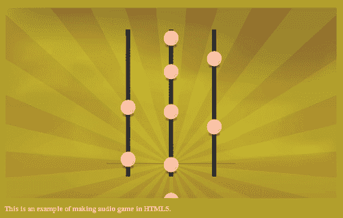

## 刚刚发生了什么？

我们刚刚构建了一个完全功能的音乐游戏，这是基本的播放功能。它播放旋律和基础部分的歌曲，并有一些音乐点向下移动。

## 选择音乐游戏的合适歌曲

在选择音乐游戏的歌曲时，我们必须小心版权问题。通常需要支付使用费或与歌曲版权所有者达成协议以使用有版权的歌曲。如果您正在制作一个商业音乐游戏，并且收入可以弥补版权使用费，那就没问题。但是，作为一个书本示例，我们将使用无版权的歌曲。这就是为什么我们使用古典曲目《G 大调小步舞曲》，它是免费的公共领域。

## 存储和提取歌曲级别数据

*进行操作*部分显示的级别数据只是整个级别数据的一部分。它是一个非常长的字符串，存储音乐音符信息，包括时间和线。它以以下格式存储：

```js
music_current_time, line; music_current_time, line; …

```

每个音乐点数据包含显示时间和显示的线。这些数据由逗号分隔。每个音乐点数据由分号分隔。以下代码将级别字符串提取为`MusicNote`对象，通过分号和逗号进行分割：

```js
audiogame.musicNotes = [];
audiogame.leveldata = "1.592,3;1.984,2;2.466,1;2.949,2;4.022,3;";
function setupLevelData()
{
var notes = audiogame.leveldata.split(";");
for(var i in notes)
{
var note = notes[i].split(",");
var time = parseFloat(note[0]);
var line = parseInt(note[1]);
var musicNote = new MusicNote(time,line);
audiogame.musicNotes.push(musicNote);
}
}

```

级别数据字符串由键盘记录，我们将在本章后面讨论录制。

### 提示

在这里，级别数据只包含几个音符。在代码包中，有完整歌曲的整个级别数据。

### 注意

JavaScript `parseInt`函数有一个可选的第二个参数。它定义要解析的数字的基数。默认情况下，它使用十进制，但当字符串以零开头时，`parseInt`将解析字符串为八进制。例如，`parseInt("010")`返回结果 8 而不是 10。如果我们想要十进制数，那么我们可以使用`parseInt("010",10)`来指定基数。

## 获取游戏经过的时间

尽管我们可以通过访问`currentTime`属性来获取音频元素的经过时间，但我们想要从游戏开始时获取时间。

我们可以通过存储开始游戏时的当前计算机时间，并减去当前时间值来获得经过的时间。

我们通过使用`Date`对象来获取当前计算机时间。以下代码片段显示了我们如何使用`startingTime`来获取经过的时间：

```js
// starting game
var date = new Date();
audiogame.startingTime = date.getTime();
// some time later
var date = new Date();
var elapsedTime = (date.getTime() - audiogame.startingTime)/1000;

```

以下截图显示了前面的代码片段在控制台中运行：


## 创建音乐点

在`gameloop`函数中，我们检查所有`MusicNote`实例，并查看是否是创建该音乐音符的可视点的时间。以下代码显示了我们用来创建可视音乐点的逻辑。基本上，我们获取游戏的经过时间，并将其与每个音乐音符的当前时间进行比较。如果音符的当前时间和经过时间之间的时间差在 30 毫秒内，那么我们就创建可视点实例，并让`gameloop`函数绘制它：

```js
if (audiogame.startingTime != 0)
{
for(var i in audiogame.musicNotes)
{
// get the elapsed time from beginning of the melody
var date = new Date();
var elapsedTime = (date.getTime() - audiogame.startingTime)/1000;
var note = audiogame.musicNotes[i];
// check if the dot appear time is as same as the elapsed time
var timeDiff = note.time - elapsedTime;
if (timeDiff >= 0 && timeDiff <= .03)
{
// create the dot when the appear time is within one frame of the elapsed time
var dot = new Dot(ctx.canvas.height-150, note.line);
audiogame.dots.push(dot);
}
}
music play back visualizationmusic play back visualizationmusic dots, creating}

```

## 移动音乐点

游戏开始和音乐开始之间存在时间差。游戏在音乐开始播放前几秒钟开始。这是因为我们需要在音乐开始之前显示音乐点并将其向下移动。

当点在灰线上时，音乐点应该与歌曲相匹配。音乐点从游戏顶部出现并向下移动到灰线。我们延迟音乐播放以等待点从上到下移动。在这个例子中大约是 3.55 秒，所以我们延迟音乐播放 3.55 秒。

当点被创建时，它被放置在给定的距离处。每次`gameloop`函数执行时，我们将所有点的距离减少 2.5。距离存储在每个代表它距离灰线有多远的`dot`对象中：

```js
for(var i in audiogame.dots)
{
audiogame.dots[i].distance -= 2.5;
}

```

点的 y 位置由灰线减去距离计算如下：

```js
// draw the dot
ctx.save();
var x = ctx.canvas.width/2-100
if (audiogame.dots[i].line == 2)
{
x = ctx.canvas.width/2;
}
else if (audiogame.dots[i].line == 3)
{
x = ctx.canvas.width/2+100;
}
ctx.translate(x, ctx.canvas.height-80-audiogame.dots[i].distance);
ctx.drawImage(audiogame.dotImage, -audiogame.dotImage.width/2, - audiogame.dotImage.height/2);

```

以下截图显示了灰线和每个点之间的距离。当距离为零时，它恰好在灰线上：

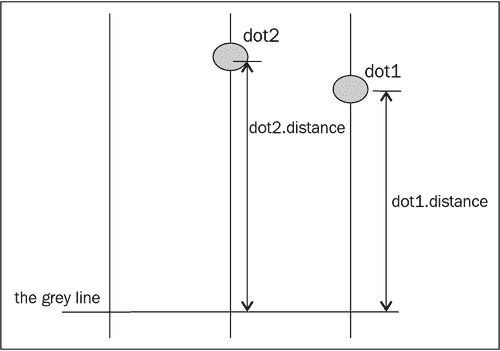

# 将播放按钮链接到音乐游戏场景

现在我们有一个游戏场景正在播放我们的歌曲。但是，它覆盖了我们用播放按钮制作的菜单场景。现在想象一下，我们打开游戏时，播放按钮被显示，然后我们点击按钮，游戏场景滑入并开始播放音乐。

# 行动时间 动画场景过渡

我们将默认隐藏游戏场景，并在点击播放按钮后显示它：

1.  首先，我们必须修改样式表。打开`audiogame.css`文件。

1.  将以下突出显示的 overflow 属性添加到`#game`。它有助于将游戏剪切成 768x440px 的蒙版：

```js
#game {
position: relative;
width: 768px;
height: 440px;
overflow: hidden;
}

```

1.  接下来，我们添加以下突出显示的代码来样式化游戏场景：

```js
#game-scene {
background: #efefef url(../images/game_bg.jpg);
top: -440px;
}
#game-scene.show-scene {
top: 0;
-webkit-transition: top .3s linear;
-moz-transition: top .3s linear;
transition: top .3s linear;
}

```

1.  然后，我们将转到 JavaScript 部分。打开`html5games.audio.js` JavaScript 文件。

1.  在 jQuery 的 ready 函数中删除`startGame`函数的调用。我们将在点击播放按钮时调用它。

1.  在播放按钮点击处理程序中，我们添加以下突出显示的代码：

```js
$("a[href='#game']").click(function(){
audiogame.buttonActiveSound.currentTime = 0;
audiogame.buttonActiveSound.play();
$("#game-scene").addClass('show-scene');
startGame();
return false;
});

```

保存所有文件并在浏览器中打开`index.htm`。当我们点击播放按钮时，应该有一个滑入动画来显示音乐播放场景。以下截图序列显示了滑入动画：

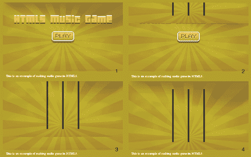

## 刚刚发生了什么？

我们刚刚在菜单场景和游戏场景之间创建了一个过渡。

## 在 CSS3 中创建滑入效果

点击播放按钮时，游戏场景从顶部滑入。这种场景过渡效果是通过 CSS3 过渡来实现的。游戏场景的位置最初是放置在负的顶部数值上。然后我们通过过渡将顶部位置从负值改变为零，这样它就从顶部动画到正确的位置。

使滑动效果生效的另一重要事项是将场景的父 DIV 的溢出设置为隐藏。如果没有隐藏的溢出，即使顶部位置为负值，游戏场景也是可见的。因此，将场景的父 DIV 设置为隐藏的溢出是很重要的。

以下截图展示了游戏场景的滑入过渡。`#game` DIV 是菜单场景和游戏场景的父级。当我们添加`.show-scene`类时，游戏场景从顶部移动，将顶部值设置为 0 并进行过渡：

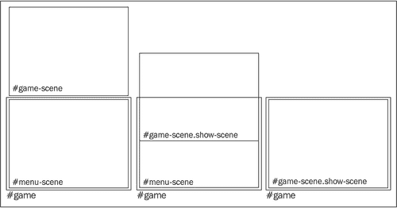

## 尝试一下 创建不同的场景过渡效果

当显示游戏时，我们为场景过渡创建了一个滑入效果。通过使用 JavaScript 和 CSS3，我们可以创造许多不同的场景过渡效果。尝试制作自己的过渡效果，比如淡入、从右侧推入，甚至是带有 3D 旋转的翻转效果。

# 创建一个以键盘驱动的迷你钢琴音乐游戏

现在我们可以点击**播放**按钮。音乐游戏滑入并播放带有音符下落的歌曲。接下来，我们将为音乐音符添加交互。因此，我们将添加键盘事件来控制三条线击中音乐音符。

# 行动时间 创建一个迷你钢琴音乐游戏

执行以下步骤：

1.  我们希望在按键时显示指示。打开`index.htm`文件，并添加以下突出显示的 HTML：

```js
<section id="game-scene" class="scene">
<canvas id="game-background-canvas" width="768" height="440">
Sorry, your web browser does not support canvas content.
</canvas>
<canvas id="game-canvas" width="768" height="440">
Sorry, your web browser does not support canvas content.
</canvas>
<div id="hit-line-1" class="hit-line hide"></div>
<div id="hit-line-2" class="hit-line hide"></div>
<div id="hit-line-3" class="hit-line hide"></div>
</section>

```

1.  然后，我们可能希望通知访问者他们可以通过按**J，K**和**L**键来玩游戏。将页脚内容修改如下：

```js
<footer>
<p>This is an example of making audio game in HTML5\. Press J, K, L to play.
</p>
</footer>

```

1.  现在，我们将转移到样式表。样式表包含在名为`audio_game_scene_transition`的文件夹中。

1.  接下来，我们将在 JavaScript 部分添加键盘事件。打开`html5games.audio.js` JavaScript 文件，并在 jQuery 准备好的函数内添加以下代码：

```js
// keydown
$(document).keydown(function(e){
var line = e.which-73;
$('#hit-line-'+line).removeClass('hide');
$('#hit-line-'+line).addClass('show');
// our target is J(74), K(75), L(76)
var hitLine = e.which-73;
// check if hit a music note dot
for(var i in audiogame.dots)
{
if (hitLine == audiogame.dots[i].line && Math.abs(audiogame.dots[i].distance) < 20)
{
// remove the hit dot from the dots array
audiogame.dots.splice(i, 1);
}
}
});
$(document).keyup(function(e){
var line = e.which-73;
$('#hit-line-'+line).removeClass('show');
$('#hit-line-'+line).addClass('hide');
});

```

1.  现在保存所有文件并在浏览器中打开游戏。尝试按下**J，K**和**L**键。三条击中线指示应该在按下键时出现并消失。如果音乐点在击中正确键时经过灰线，则会消失。

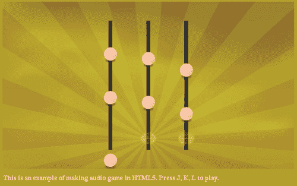

## 刚刚发生了什么？

我们刚刚为我们的音乐游戏添加了键盘交互。击打键时会有发光动画。当在正确时刻按下正确的键时，音乐点会消失。

## 按键时击中三条音乐线

我们使用**J，K**和**L**键来击打游戏中的三条音乐线。**J**键控制左线，**K**键控制中线，**L**键控制右线。

还有一个指示，显示我们刚刚击中了音乐线。这是通过在灰线和音乐线的交叉点放置以下图像来实现的：


然后，我们可以使用以下 jQuery 代码来控制击中指示图形的显示和隐藏：

```js
$(document).keydown(function(e){
var line = e.which-73;
$('#hit-line-'+line).removeClass('hide');
$('#hit-line-'+line).addClass('show');
});
$(document).keyup(function(e){
var line = e.which-73;
$('#hit-line-'+line).removeClass('show');
$('#hit-line-'+line).addClass('hide');
});

```

**J，K**和**L**键控制音乐线 1 到 3。由于 J，K 和 L 的键码分别为 74、75 和 76，我们可以通过将键码减去 73 来知道它是哪条线。

## 确定按键时的音乐点击中

如果音符几乎在灰色水平线上，距离接近零。这有助于我们确定音符是否击中了灰线。通过检查按键按下事件和音符距离，我们可以确定是否成功击中了音符。以下代码片段显示了当距离在 20 像素内时，我们认为音符被击中：

```js
$(document).keydown(function(e){
var line = e.which-73;
$('#hit-line-'+line).removeClass('hide');
$('#hit-line-'+line).addClass('show');
// our target is J(74), K(75), L(76)
var hitLine = e.which-73;
// check if hit a music note dot
for(var i in audiogame.dots)
{
if (hitLine == audiogame.dots[i].line && Math.abs(audiogame.dots[i].distance) < 20)
{
// remove the hit dot from the dots array
audiogame.dots.splice(i, 1);
}
}
});

```

坚定决心，我们在击中时移除音乐点。错过的点仍然会穿过灰线并向底部移动。这创造了一个基本的游戏玩法，玩家必须在歌曲播放时在正确的时刻正确击中所有音乐点。

## 使用给定索引从数组中删除一个元素

我们在音乐点被击中时（因此不再绘制）从数组中删除音乐点数据。要从数组中删除一个元素，我们使用`splice`函数。以下代码行从给定索引处的数组中删除一个元素：

```js
array.splice(index, 1);

```

`splice`函数有点棘手。这是因为它允许我们在数组中添加或删除元素。然后，它会将删除的元素作为另一个数组返回。听起来很复杂。因此，我们将进行一些实验。

# 使用 splice 函数删除音乐点的时间

我们将在 Web 浏览器中打开 JavaScript 控制台，对`splice`函数进行一些测试：

1.  打开 JavaScript 控制台。

1.  逐行输入以下命令到控制台。也就是说，在每个命令行上按**Enter**。这些命令创建一个数组，并使用`splice`函数对其进行操作。

1.  我们应该得到类似以下截图中显示的结果：

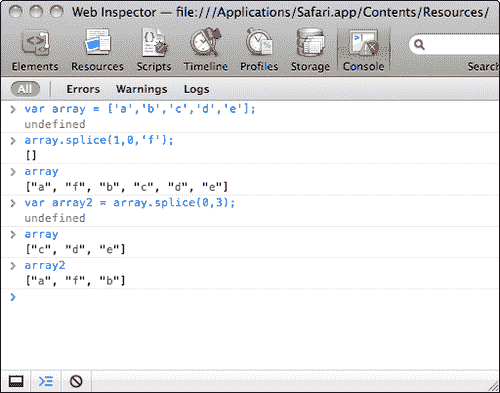

## 刚刚发生了什么？

我们刚刚创建了一个数组，并尝试使用`splice`函数添加和删除元素。请注意，splice 数组会返回另一个包含已删除元素的数组。

以下是我们如何使用`splice`函数：

```js
array.splice(index, length, element1, element2, …, elementN);

```

以下表格显示了我们如何使用这些参数：

| 参数 | 定义 | 讨论 |
| --- | --- | --- |
| `index` | 指定要添加或删除的元素在数组中的索引 | 索引从 0 开始。0 表示第一个元素，1 表示第二个元素，依此类推。我们还可以使用负索引，比如-1 表示最后一个元素，-2 表示倒数第二个元素，依此类推。 |
| `length` | 指定要删除的元素数量 | 放入 0 意味着我们不删除任何元素。 |
| `element1, element2` … `elementN` | 要添加到数组中的新元素；这是可选的 | 这是可选的。在这里放入一系列元素意味着我们在给定的索引处添加元素。 |

### 注意

以下是 Mozilla 开发者网络链接，讨论了`splice`函数的不同用法：

[`developer.mozilla.org/en/JavaScript/Reference/Global_Objects/Array/splice`](http://https://developer.mozilla.org/en/JavaScript/Reference/Global_Objects/Array/splice)

## 尝试一下

在类似的商业音乐游戏中，当玩家击中或错过音乐点时会显示一些字。我们如何将这个功能添加到我们的游戏中？

# 为迷你钢琴游戏添加额外功能

我们已经为游戏创建了基本的交互。我们可以进一步改进游戏，通过添加旋律音量反馈来使表演更加逼真，并计算表演的成功率。

## 根据玩家调整音乐音量

现在想象我们正在表演音乐。我们击中音乐点演奏旋律。如果我们错过了其中任何一个，那么我们就无法演奏好，旋律就会消失。

# 使用 splice 函数删除错过的旋律音符的时间

我们将存储一些游戏统计数据，并用它来调整旋律音量。我们将继续进行 JavaScript 文件：

1.  首先，在变量声明区域中添加以下变量：

```js
audiogame.totalDotsCount = 0;
audiogame.totalSuccessCount = 0;
// storing the success count of last 5 results.
audiogame.successCount = 5;

```

1.  在`setupLevelData`函数中，我们使用以下突出显示的代码获取了点的总数：

```js
function setupLevelData()
{
var notes = audiogame.leveldata.split(";");
// store the total number of dots
audiogame.totalDotsCount = notes.length;
for(var i in notes)
{
var note = notes[i].split(",");
var time = parseFloat(note[0]);
var line = parseInt(note[1]);
var musicNote = new MusicNote(time,line);
audiogame.musicNotes.push(musicNote);
}
}

```

1.  我们不仅想要移除一个点，还想在击中它时跟踪结果。在 jQuery 的 ready 函数中的键盘处理程序中添加以下代码：

```js
// check if hit a music note dot
for(var i in audiogame.dots)
{
if (hitLine == audiogame.dots[i].line && Math.abs(audiogame.dots[i].distance) < 20)
if (hitLine == audiogame.dots[i].line && Math.abs(audiogame.dots[i].distance) < 20)
{
// remove the hit dot from the dots array
audiogame.dots.splice(i, 1);
// increase the success count
audiogame.successCount++;
// keep only 5 success count max.
audiogame.successCount = Math.min (5, audiogame.successCount);
// increase the total success count
audiogame.totalSuccessCount ++;
}
}

```

1.  在`gameloop`函数中，我们计算所有未击中的点并存储结果。然后，我们可以使用这些统计数据来获得游戏的成功率。在`gameloop`函数中添加以下代码：

```js
// check missed dots
for(var i in audiogame.dots)
{
if (!audiogame.dots[i].missed && audiogame.dots[i].distance < -10)
{
// mark the dot as missed if it is not mark before
audiogame.dots[i].missed = true;
// reduce the success count
audiogame.successCount--;
// reset the success count to 0 if it is lower than 0.
audiogame.successCount = Math.max (0, audiogame.successCount);
}
// remove missed dots after moved to the bottom
if (audiogame.dots[i].distance < -100)
{
audiogame.dots.splice(i, 1);
}
}
// calculate the percentage of the success in last 5 music dots
var successPercent = audiogame.successCount / 5;
// prevent the successPercent to exceed range(fail safe)
successPercent = Math.max(0, Math.min(1, successPercent));

```

1.  最后，我们通过成功率来调整旋律音量。在`gameloop`函数中刚刚添加的代码之后添加以下代码：

```js
audiogame.melody.volume = successPercent;

```

1.  保存所有文件并在浏览器中测试我们的游戏。当玩家继续游戏时，旋律会继续播放。当玩家错过几个音乐点时，旋律消失，只剩下低音播放。

## 刚刚发生了什么？

我们刚刚使用了玩家表现作为旋律音量的反馈。这给人一种我们真的在演奏音乐的感觉。当我们表现不佳时，旋律音量很低，歌曲听起来也很差。

## 从游戏中移除点

我们想要移除点，要么是在它掉落到底部边界下方时，要么是在玩家击中它时。游戏循环在游戏画布上显示点列表中的所有点。我们可以通过从点数组中移除其数据来移除点图形。

我们使用以下的`splice`函数来移除数组中目标索引处的条目：

```js
audiogame.dots.splice(index, 1);

```

## 存储最近五次结果中的成功次数

在我们的游戏中，我们需要存储最近五次结果中的成功次数以计算成功率。我们可以通过使用一个代表这个的计数器来实现。当成功击中一个点时，计数器增加 1，但当玩家未能击中一个点时，计数器减少 1。

如果我们将计数器限制在一个范围内，比如在我们的例子中是 0 到 5，那么计数器就代表了最近几次结果中的成功次数。

## 试试看

在上一章中，我们讨论了如何在 Untangle 游戏中显示游戏进度。我们能否在音乐游戏中应用类似的技术？我们有玩家在游戏过程中的成功百分比。在游戏顶部显示为百分比条形图如何？

## 记录音符作为级别数据

游戏依赖级别数据进行播放。如果没有级别数据，回放可视化将无法工作。如果回放可视化不起作用，我们也无法进行播放。那么我们如何记录级别数据呢？

现在想象一下，音乐正在播放，游戏中没有任何音乐点出现。我们仔细听音乐，当音乐播放时按下**J，K，L**键。音乐结束后，我们打印出所有按下的键和时间。这些数据将在音乐的回放可视化中使用。

# 添加功能记录音乐级别数据的时间

执行以下步骤：

1.  首先，我们创建一个变量来在录制模式和正常播放模式之间切换。打开`html5games.audio.js`文件并添加以下代码：

```js
audiogame.isRecordMode = true;

```

1.  接下来，在`keydown`事件处理程序中添加以下突出显示的代码。这段代码将我们按下的所有键存储在一个数组中，并在按下分号键时将它们打印到控制台上：

```js
$(document).keydown(function(e){
var line = e.which-73;
$('#hit-line-'+line).removeClass('hide');
$('#hit-line-'+line).addClass('show');
if (audiogame.isRecordMode)
{
// print the stored music notes data when press ";" (186)
if (e.which == 186)
{
var musicNotesString = "";
for(var i in audiogame.musicNotes)
{
musicNotesString += audiogame.musicNotes[i].time+", "+audiogame.musicNotes[i].line+";";
musicNotesString += audiogame.musicNotes[i].time+", "+audiogame.musicNotes[i].line+";";
}
console.log(musicNotesString);
}
var currentTime = parseInt (audiogame.melody.currentTime * 1000)/1000;
var note = new MusicNote(currentTime, e.which-73);
audiogame.musicNotes.push(note);
}
else
{
// our target is J(74), K(75), L(76)
var hitLine = e.which-73;
// check if hit a music note dot
…
}
});

```

1.  最后，我们要确保`setupLevelData`和`gameloop`函数在录制模式下不被执行。这些函数仅用于播放模式：

```js
if (!audiogame.isRecordMode) {
setupLevelData();
setInterval(gameloop, 30);
}

```

1.  现在在浏览器中打开`index.htm`。点击**play**按钮后，游戏开始，音乐播放，但没有音乐音符。尝试按照音乐节奏按下**J，K**和**L**键。音乐结束后，按分号键在控制台中打印出级别数据。以下截图显示了控制台显示级别数据字符串：

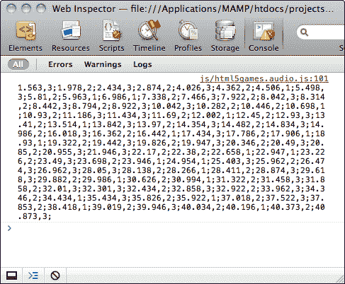

## 刚刚发生了什么？

我们刚刚为游戏添加了录音功能。现在我们可以录制我们的音符。我们可以通过将`audiogame.isRecordMode`变量设置为 true 和 false 来切换录制模式和播放模式。

在每次按键时，我们获取旋律的经过时间，并创建一个带有时间和行号的`MusicNote`实例。以下代码显示了我们如何记录按下的键。在保存之前，`currentTime`被截断为两位小数：

```js
var currentTime = audiogame.melody.currentTime.toFixed(3);
var note = new MusicNote(currentTime, e.which-73);
audiogame.musicNotes.push(note);

```

我们还捕获了分号键，以便将所有记录的`MusicNote`数据打印成字符串。字符串遵循`time,line;time,line`的格式，因此我们可以直接复制打印的字符串，并将其粘贴为级别数据以进行播放。

### 注意

`toFixed`函数用给定的小数位数格式化数字。在我们的例子中，我们用它来获得带有`3`位小数的当前时间。

# 处理音频事件播放完成

我们现在可以玩游戏了，但是游戏结束时没有指示。现在想象一下，当游戏完成时，我们想知道我们玩得有多好。我们将捕获旋律结束信号，并显示游戏的成功率。

# 执行指示在控制台中指示游戏结束事件

执行以下步骤：

1.  打开`html5games.audio.js` JavaScript 文件。

1.  在 jQuery ready 函数中添加以下代码：

```js
$(audiogame.melody).bind('ended', onMelodyEnded);

```

1.  在文件末尾添加以下事件处理程序函数：

```js
// show game over scene on melody ended.
function onMelodyEnded()
{
console.log('song ended');
console.log('success percent: ',audiogame.totalSuccessCount / audiogame.totalDotsCount * 100 + '%');
}

```

1.  现在是时候保存所有文件并在 Web 浏览器中玩游戏了。游戏结束时，我们应该看到成功率打印在控制台中，如下截图所示：

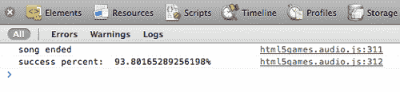

## 刚刚发生了什么？

我们刚刚监听了音频元素的`ended`事件，并用处理程序函数处理了它。

## 处理音频事件

音频元素中还有许多其他事件。以下表格列出了一些常用的音频事件：

| 事件 | 讨论 |
| --- | --- |
| `ended` | 当音频元素完成播放时发送 |
| `play` | 当音频元素播放或恢复时发送 |
| `pause` | 当音频元素暂停时发送 |
| 定期发送`progress`事件，当音频元素正在下载时 |
| `timeupdate` | 当`currentTime`属性改变时发送 |

这里我们列出了一些常用事件；您可以在 Mozilla 开发者中心的以下网址上查看完整的音频事件列表：

[`developer.mozilla.org/En/Using_audio_and_video_in_Firefox#Media_events`](http://https://developer.mozilla.org/En/Using_audio_and_video_in_Firefox#Media_events)

## 试试吧

在我们的音乐游戏中，当游戏结束时，我们在控制台中打印出成功率。当游戏结束时，添加一个游戏结束场景，并在游戏结束时显示它会怎样？在显示游戏结束场景时，使用动画过渡也是不错的。

# 总结

在本章中，我们学到了如何使用 HTML5 音频元素，并制作了一个音乐游戏。

具体来说，我们涵盖了以下主题：

+   将音频标签添加到 HTML 中。我们可以设置不同的属性来定义音频标签的行为和加载不同格式的源。

+   使用 JavaScript API 控制音频播放和音量。

+   使用 jQuery 在鼠标悬停和激活时添加声音效果。

+   使用键盘输入在画布中创建音乐游戏。

+   处理音频事件；音频元素在其状态改变时发送多个事件。

我们还讨论了管理场景和动画过渡。

我们已经学习了如何在 HTML5 游戏中添加音乐和音效。现在我们准备在下一章中通过添加排行榜来存储游戏得分，构建一个更完整的游戏。
