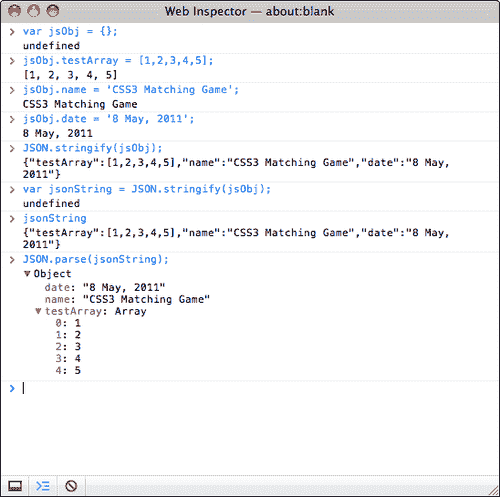
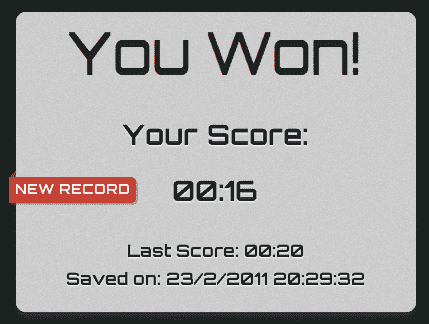

# 第七章：使用本地存储存储游戏数据

> 本地存储是 HTML5 的一个新规范。它允许网站在浏览器中本地存储信息，并在以后访问存储的数据。这是游戏开发中的一个有用功能，因为我们可以将其用作内存插槽，在 Web 浏览器中本地保存任何游戏数据。

我们将在我们在*第三章构建 CSS3 记忆匹配游戏*中构建的游戏中添加游戏数据存储。除了存储和加载游戏数据，我们还将使用纯 CSS3 样式向玩家通知打破记录的好消息，通过一个漂亮的 3D 丝带。

在本章中，我们将涵盖以下主题：

+   使用 HTML5 本地存储存储数据

+   在本地存储中保存对象

+   使用漂亮的丝带效果通知玩家打破新纪录

+   保存整个游戏进度

以下截图显示了我们将通过本章创建的最终结果。那么，让我们开始吧：


# 使用 HTML5 本地存储存储数据

还记得我们在*第三章*中制作的 CSS3 记忆匹配游戏吗？现在想象一下我们已经发布了我们的游戏，玩家们正在努力表现得很好。

我们想告诉玩家他们是否比上次玩得更好或更差。我们将保存最新的分数，并通过比较分数来告知玩家这次是否比上次更好。

当他们表现更好时，他们可能会感到自豪。这可能使他们上瘾，他们可能会继续努力获得更高的分数。

## 创建游戏结束对话框

在本地存储中实际保存任何内容之前，我们需要一个游戏结束画面。在之前的章节中，我们制作了一些游戏。我们制作了一个乒乓球游戏，记忆匹配游戏，解开谜题游戏和音乐游戏。在这些游戏中，我们没有创建游戏结束画面。现在想象一下我们正在玩我们在*第三章*中构建的 CSS3 记忆匹配游戏。我们成功匹配并移除了所有卡片。一旦我们完成，游戏结束画面弹出并显示我们用来完成游戏的时间。

# 执行操作-使用经过的播放时间创建游戏结束对话框

我们将继续使用*第三章*中制作的记忆匹配游戏的代码。执行以下步骤：

1.  将 CSS3 匹配游戏文件夹作为我们的工作目录。

1.  从以下网址下载背景图片（我们将用它作为弹出窗口的背景）：

[`gamedesign.cc/html5games/popup_bg.jpg`](http://gamedesign.cc/html5games/popup_bg.jpg )

1.  将图像放在`images`文件夹中。

1.  将`index.html`打开到任何文本编辑器中。

1.  我们需要一个字体用于游戏结束弹出窗口。将以下字体嵌入 CSS 添加到`head`部分中：

```js
<link href="http://fonts.googleapis.com/css?family=Orbitron:400,700" rel="stylesheet" type="text/css" >

```

1.  在`game`部分之前，我们添加一个名为`timer`的`div`，以显示经过的游戏时间。此外，我们添加一个包含弹出窗口对话框的 HTML 标记的新`popup`部分：

```js
<div id="timer">
Elapsed time: <span id="elapsed-time">00:00</span>
</div>
<section id="game">
<div id="cards">
<div class="card">
<div class="face front"></div>
<div class="face back"></div>
</div> <!-- .card -->
</div> <!-- #cards -->
</section> <!-- #game -->
<section id="popup" class="hide">
<div id="popup-bg">
</div>
<div id="popup-box">
<div id="popup-box-content">
<h1>You Won!</h1>
<p>Your Score:</p>
<p><span class='score'>13</span></p>
</div>
</div>
</section>

```

1.  现在我们将转移到样式表。因为它只是用于样式，与我们的逻辑无关，所以我们可以简单地从代码示例包中的`matching_game_with_game_over`中复制`matchgame.css`文件。

1.  现在是编辑游戏逻辑部分的时候了。在编辑器中打开`html5games.matchgame.js`文件。

1.  在 jQuery ready 函数中，我们需要一个变量来存储游戏的经过时间。然后，我们创建一个计时器，每秒计算游戏时间，如下所示：

```js
$(function(){
...
// reset the elapsed time to 0.
matchingGame.elapsedTime = 0;
// start the timer
matchingGame.timer = setInterval(countTimer, 1000);
}

```

1.  接下来，添加一个`countTimer`函数，每秒执行一次。它以分钟和秒的格式显示经过的秒数：

```js
function countTimer()
{
matchingGame.elapsedTime++;
// calculate the minutes and seconds from elapsed time
var minute = Math.floor(matchingGame.elapsedTime / 60);
var second = matchingGame.elapsedTime % 60;
// add padding 0 if minute and second is less then 10
if (minute < 10) minute = "0" + minute;
if (second < 10) second = "0" + second;
// display the elapsed time
$("#elapsed-time").html(minute+":"+second);
}

```

1.  在我们之前编写的`removeTookCards`函数中，添加以下突出显示的代码，以在移除所有卡片后执行游戏结束逻辑：

```js
function removeTookCards()
{
$(".card-removed").remove();
// check if all cards are removed and show game over
if ($(".card").length == 0)
{
gameover();
}
}

```

1.  最后，我们创建以下`gameover`函数。它停止计时器，显示游戏结束弹出窗口中的经过时间，并最终显示弹出窗口：

```js
function gameover()
{
// stop the timer
clearInterval(matchingGame.timer);
// set the score in the game over popup
$(".score").html($("#elapsed-time").html());
// show the game over popup
$("#popup").removeClass("hide");
}

```

1.  现在，保存所有文件并在浏览器中打开游戏。尝试完成记忆匹配游戏，游戏结束画面将弹出，如下截图所示：


## 刚刚发生了什么？

我们使用 CSS3 过渡动画来显示游戏结束弹出窗口。我们通过玩家完成游戏所用的时间来评估得分。

## 在浏览器中保存得分

现在，我们将展示玩家上次的游戏表现。游戏结束画面包括上次的经过时间和当前游戏得分。玩家可以看到这次和上次的表现有多大差异。

# 执行保存游戏得分的操作

1.  首先，我们需要在`popup`部分添加一些标记，以显示上次的得分。在`index.html`的`popup`部分中添加以下 HTML：

```js
<p>
<small>Last Score: <span class='last-score'>20</span>
</small>
</p>

```

1.  然后，我们打开`html5games.matchgame.js`文件，修改`gameover`函数中的一些游戏逻辑。

1.  在`gameover`函数中添加以下突出显示的代码。它从本地存储加载保存的得分，并将其显示为上次的得分。然后，将当前得分保存在本地存储中：

```js
function gameover()
{
// stop the timer
clearInterval(matchingGame.timer);
// display the elapsed time in the game over popup
$(".score").html($("#elapsed-time"));
// load the saved last score from local storage
var lastElapsedTime = localStorage.getItem ("last-elapsed-time");
// convert the elapsed seconds into minute:second format
// calculate the minutes and seconds from elapsed time
var minute = Math.floor(lastElapsedTime / 60);
var second = lastElapsedTime % 60;
// add padding 0 if minute and second is less then 10
if (minute < 10) minute = "0" + minute;
if (second < 10) second = "0" + second;
// display the last elapsed time in game over popup
$(".last-score").html(minute+":"+second);
// save the score into local storage
localStorage.setItem ("last-elapsed-time", matchingGame.elapsedTime);
// show the game over popup
$("#popup").removeClass("hide");
}

```

1.  现在是时候保存所有文件并在浏览器中测试游戏了。当您第一次完成游戏时，上次的得分应该是`00:00`。然后，尝试第二次完成游戏。游戏结束弹出窗口将显示您上次玩游戏的经过时间。以下截图显示了游戏结束画面与当前和上次得分：


## 刚刚发生了什么？

我们刚刚建立了一个基本的得分系统，用于比较玩家的得分和上次的得分。

## 使用本地存储存储和加载数据

我们可以使用`localStorage`对象的`setItem`函数来存储数据。以下表格显示了该函数的用法：

```js
localStorage.setItem(key, value);

```

| 参数 | 定义 | 描述 |
| --- | --- | --- |
| `key` | 键是我们用来标识条目的记录名称。 | 键是一个字符串，每个记录都有一个唯一的键。向现有键写入新值会覆盖旧值。 |
| `value` | 值是要存储的任何数据。 | 它可以是任何数据，但最终存储的是一个字符串。我们将很快讨论这一点。 |

在我们的例子中，我们使用以下代码将游戏经过的时间保存为得分，使用键`last-elapsed-item`：

```js
localStorage.setItem("last-elapsed-time", matchingGame.elapsedTime);

```

与`setItem`相辅相成，我们可以通过以下方式使用`getItem`函数获取存储的数据：

```js
localStorage.getItem(key);

```

该函数返回给定键的存储值。当尝试获取一个不存在的键时，它会返回`null`。这可以用来检查我们是否为特定键存储了任何数据。

## 本地存储保存了字符串值

本地存储以键值对的形式存储数据。键和值都是字符串。如果我们保存数字、布尔值或任何类型的数据而不是字符串，那么在保存时它会将值转换为字符串。

通常，当我们从本地存储加载保存的值时会出现问题。加载的值是一个字符串，而不管我们保存的类型是什么。在使用之前，我们需要明确将值解析为正确的类型。

例如，如果我们将一个浮点数保存到本地存储中，那么在加载时我们需要使用`parseFloat`函数。以下代码片段显示了如何使用`parseFloat`来检索存储的浮点数：

```js
var score = 13.234;
localStorage.setItem("game-score",score);
// result: stored "13.234".
var gameScore = localStorage.getItem("game-score");
// result: get "13.234" into gameScore;
gameScore = parseFloat(gameScore);
// result: 13.234 floating value

```

在前面的代码片段中，如果我们忘记将`gameScore`从字符串转换为浮点数，操作可能是不正确的。例如，如果我们在没有使用`parseFloat`函数的情况下将`gameScore`增加 1，结果将是**13.2341**而不是**14.234**。因此，请确保将值从本地存储转换为其正确的类型。

### 提示

**本地存储的大小限制**

对于每个域通过`localStorage`存储的数据都有大小限制。这个大小限制在不同的浏览器中可能略有不同。通常，大小限制为 5MB。如果超过了限制，那么当向`localStorage`设置键值时，浏览器会抛出`QUOTA_EXCEEDED_ERR`异常。

## 将本地存储对象视为关联数组

除了使用`setItem`和`getItem`函数外，我们还可以将`localStorage`对象视为关联数组，并通过使用方括号访问存储的条目。

例如，我们可以用后一种版本替换以下代码：

使用`setItem`和`getItem：`

```js
localStorage.setItem("last-elapsed-time", elapsedTime);
var lastElapsedTime = localStorage.getItem("last-elapsed-time");

```

访问`localStorage`的方式如下：

```js
localStorage["last-elapsed-time"] = elapsedTime;
var lastElapsedTime = localStorage["last-elapsed-time"];

```

# 在本地存储中保存对象

现在，想象一下我们不仅保存分数，还保存排名创建时的日期和时间。我们可以保存分数和游戏时间的两个单独的键，或者将两个值打包到一个对象中并将其存储在本地存储中。

我们将所有游戏数据打包到一个对象中并进行存储。

# 行动时间保存得分的时间

执行以下步骤：

1.  首先，从我们的 CSS3 记忆匹配游戏中打开`index.html`文件。

1.  用以下 HTML 替换最后得分的 HTML（它显示游戏结束弹出窗口中的得分和日期时间）：

```js
<p>
<small>Last Score: <span class='last-score'>20</span><br>
Saved on: <span class='saved-time'>13/4/2011 3:14pm</span>
</small>
</p>

```

1.  HTML 标记现在已经准备好。我们将继续进行游戏逻辑。在文本编辑器中打开`html5games.matchgame.js`文件。

1.  我们将修改`gameover`函数。将以下突出显示的代码添加到`gameover`函数中。当游戏结束时，它获取当前日期时间并将格式化的日期时间与经过的时间一起打包到本地存储中：

```js
function gameover()
{
// stop the timer
clearInterval(matchingGame.timer);
// display the elapsed time in the game over popup
$(".score").html($("#elapsed-time"));
// load the saved last score and save time from local storage
var lastScore = localStorage.getItem("last-score");
// check if there is no any saved record
lastScoreObj = JSON.parse(lastScore);
if (lastScoreObj == null)
{
// create an empty record if there is no any saved record
lastScoreObj = {"savedTime": "no record", "score": 0};
}
var lastElapsedTime = lastScoreObj.score;
// convert the elapsed seconds into minute:second format
// calculate the minutes and seconds from elapsed time
var minute = Math.floor(lastElapsedTime / 60);
var second = lastElapsedTime % 60;
local storagelocal storageobject, saving// add padding 0 if minute and second is less then 10
if (minute < 10) minute = "0" + minute;
if (second < 10) second = "0" + second;
// display the last elapsed time in game over popup
$(".last-score").html(minute+":"+second);
// display the saved time of last score
var savedTime = lastScoreObj.savedTime;
$(".saved-time").html(savedTime);
// get the current datetime
var currentTime = new Date();
var month = currentTime.getMonth() + 1;
var day = currentTime.getDate();
var year = currentTime.getFullYear();
var hours = currentTime.getHours();
var minutes = currentTime.getMinutes();
// add padding 0 to minutes
if (minutes < 10) minutes = "0" + minutes;
var seconds = currentTime.getSeconds();
// add padding 0 to seconds
if (seconds < 10) seconds = "0" + seconds;
var now = day+"/"+month+"/"+year+" "+hours+":"+minutes+":"+seconds;
//construct the object of datetime and game score
var obj = { "savedTime": now, "score": matchingGame.elapsedTime};
// save the score into local storage
localStorage.setItem("last-score", JSON.stringify(obj));
// show the game over popup
$("#popup").removeClass("hide");
}

```

1.  我们将保存文件并在 Web 浏览器中打开游戏。

1.  当我们第一次完成游戏时，我们将得到一个类似以下截图的屏幕，它将显示我们的游戏得分并指出没有先前的记录：

1.  现在尝试重新加载页面并再次玩游戏。当我们第二次完成游戏时，游戏结束对话框将显示我们保存的记录。以下截图显示了它应该是什么样子的：


## 刚刚发生了什么？

我们刚刚使用了 JavaScript 中的`Date`对象来获取游戏结束时的当前日期和时间。此外，我们将游戏结束的日期和时间以及游戏经过的时间打包到一个对象中并保存到本地存储中。保存的对象被编码为 JSON 字符串。它还将从存储中加载上次保存的日期和时间以及游戏经过的时间，并将其从字符串解析回 JavaScript 对象。

## 在 JavaScript 中获取当前日期和时间

JavaScript 中的`Date`对象用于处理日期和时间。当我们从`Date`对象创建一个实例时，默认情况下它会存储当前的日期和时间。因此，我们可以通过以下代码片段轻松地获取当前的日期和时间信息：

```js
var currentTime = new Date();
var month = currentTime.getMonth() + 1;
var day = currentTime.getDate();
var year = currentTime.getFullYear();
var hours = currentTime.getHours();
var minutes = currentTime.getMinutes();
var seconds = currentTime.getSeconds();

```

当我们以人类友好的格式显示日期和时间时，当分钟和秒钟小于 10 时，我们还需要添加零填充。我们可以这样做：

```js
if (minutes < 10) minutes = "0" + minutes;
if (seconds < 10) seconds = "0" + seconds;
var now = day+"/"+month+"/"+year+" "+hours+":"+minutes+":"+seconds;

```

以下表格列出了`Date`对象中一些有用的函数以获取日期和时间：

| 功能 | 描述 |
| --- | --- |
| `getFullYear` | 返回四位数的年份 |
| `getMonth` | 返回整数月份，从 0 开始（1 月为 0，12 月为 11） |
| `getDate` | 返回月份的日期，从 1 开始 |
| `getDay` | 返回星期几，从 0 开始（星期日为 0，星期六为 6） |
| `getHours` | 返回小时，从 0 到 23 |
| `getMinutes` | 返回分钟 |
| `getSeconds` | 返回秒数 |
| `getMilliseconds` | 返回 3 位数的毫秒 |
| `getTime` | 返回自 1970 年 1 月 1 日 00:00 以来的毫秒数 |

### 注意

Mozilla 开发者网络提供了使用`Date`对象的详细参考，网址如下：

[`developer.mozilla.org/en/JavaScript/Reference/Global_Objects/Date`](http://https://developer.mozilla.org/en/JavaScript/Reference/Global_Objects/Date)

## 使用本机 JSON 将对象编码为字符串

我们在*第四章，使用 Canvas 和 Drawing API 构建 Untangle 游戏*中使用 JSON 表示游戏级别数据。

JSON 是一种友好的对象表示格式，便于机器解析和生成。在这个例子中，我们将最终经过的时间和日期时间打包到一个对象中。然后，我们将对象编码为 JSON。现代 Web 浏览器都具有本机的 JSON 支持。我们可以通过使用`stringify`函数轻松地将任何 JavaScript 对象编码为 JSON。

```js
JSON.stringify(anyObject);

```

通常，我们只使用`stringify`函数的第一个参数。这是我们要编码为字符串的对象。以下代码片段演示了编码为 JavaScript 对象的结果：

```js
var jsObj = {};
jsObj.testArray = [1,2,3,4,5];
jsObj.name = 'CSS3 Matching Game';
jsObj.date = '8 May, 2011';
JSON.stringify(jsObj);
// result: {"testArray":[1,2,3,4,5],"name":"CSS3 Matching Game","date":"8 May, 2011"}

```

### 注意

`stringify`方法可以很好地将具有数据结构的对象解析为字符串。但是，它无法将任何对象转换为字符串。例如，如果我们尝试将 DOM 元素传递给它，它将返回错误。如果我们传递一个日期对象，它将返回表示日期的字符串。或者，它将删除解析对象的所有方法定义。

## 从 JSON 字符串中加载存储的对象

**JSON**的完整形式是**JavaScript 对象表示法**。从名称上我们知道它使用 JavaScript 的语法来表示对象。因此，将 JSON 格式的字符串解析回 JavaScript 对象非常容易。

以下代码片段显示了我们如何在 JSON 对象中使用解析函数：

```js
JSON.parse(jsonFormattedString);

```

我们可以在 Web Inspector 中打开控制台来测试 JSON JavaScript 函数。以下屏幕截图显示了我们刚刚讨论的代码片段在编码对象和解析它们时的运行结果：



## 在控制台窗口中检查本地存储

在我们将某些内容保存在本地存储后，我们可能想知道在编写加载部分之前究竟保存了什么。我们可以使用 Web Inspector 中的存储面板来检查我们保存了什么。它列出了同一域下保存的所有键值对。以下屏幕截图显示了我们保存了**last-score**，值为**{"savedTime":"23/2/2011 19:27:02","score":23}**。

该值是我们用于将对象编码为 JSON 的`JSON.stringify`函数的结果。您也可以尝试直接将对象保存到本地存储中：


### 注意

除了`localStorage`，还有其他未讨论的存储方法。这些方法包括**Web SQL Database**（[`www.w3.org/TR/webdatabase/`](http://www.w3.org/TR/webdatabase/)），它使用 SQLite 来存储数据，以及**IndexedDB**（[`developer.mozilla.org/en/IndexedDB`](https://developer.mozilla.org/en/IndexedDB)）。

# 通过一个漂亮的缎带效果通知玩家打破了新纪录

假设我们想通过通知玩家他们打破了与上次得分相比的新纪录来鼓励他们。我们想在上面显示一个带有`New Record`文本的缎带。由于新的 CSS3 属性，我们可以完全在 CSS 中创建缎带效果。

# 创建 CSS3 中的缎带的操作时间

当玩家打破上次得分时，我们将创建一个新的记录缎带并显示它。因此，请执行以下步骤：

1.  首先，打开`index.html`，我们将在那里添加缎带 HTML 标记。

1.  在`popup-box`后面和`popup-box-content`前面添加以下突出显示的 HTML：

```js
<div id="popup-box">
<div class="ribbon hide">
<div class="ribbon-body">
<span>New Record</span>
</div>
<div class="triangle"></div>
</div>
<div id="popup-box-content">
…

```

1.  接下来，我们需要关注样式表。整个缎带效果是通过 CSS 完成的。在文本编辑器中打开`matchgame.css`文件。

1.  在`popup-box`样式中，我们需要为其添加相对位置。我们可以这样做：

```js
#popup-box {
position: relative;
...
}

```

1.  然后，我们需要添加以下样式，以在 CSS 文件中创建缎带效果：

```js
.ribbon.hide {
display: none;
}
.ribbon {
float: left;
position: absolute;
left: -7px;
top: 165px;
z-index: 0;
font-size: .5em;
text-transform: uppercase;
text-align: right;
}
.ribbon-body {
height: 14px;
background: #ca3d33;
padding: 6px;
z-index: 100;
-webkit-box-shadow: 2px 2px 0 rgba(150,120,70,.4);
border-radius: 0 5px 5px 0;
color: #fff;
text-shadow: 0px 1px 1px rgba(0,0,0,.3);
}
.triangle{
position: relative;
height: 0px;
width: 0;
left: -5px;
top: -32px;
border-style: solid;
border-width: 6px;
border-color: transparent #882011 transparent transparent;
z-index: -1;
}

```

1.  最后，我们需要稍微修改游戏结束逻辑。打开`html5games.matchgame.js`文件，找到`gameover`函数。

1.  将以下代码添加到`gameover`函数中，用于比较当前得分和上次得分以确定新纪录：

```js
if (lastElapsedTime == 0 || matchingGame.elapsedTime < lastElapsedTime)
{
$(".ribbon").removeClass("hide");
}

```

1.  我们将在 Web 浏览器中测试游戏。尝试慢慢完成一局游戏，然后再快速完成一局游戏。当你打破最高分时，游戏结束弹出窗口会显示一个漂亮的**NEW RECORD**丝带，如下面的屏幕截图所示：



## 刚刚发生了什么？

我们刚刚以纯 CSS3 样式创建了一个丝带效果，并借助 JavaScript 来显示和隐藏它。丝带由一个小三角形叠加在一个矩形上组成，如下面的屏幕截图所示：


现在，我们如何在 CSS 中创建一个三角形？我们可以通过将宽度和高度都设置为 0，并只绘制一个边框来创建一个三角形。然后，三角形的大小由边框宽度决定。以下代码是我们在新记录丝带中使用的三角形 CSS：

```js
.triangle{
position: relative;
height: 0px;
width: 0;
left: -5px;
top: -32px;
border-style: solid;
border-width: 6px;
border-color: transparent #882011 transparent transparent;
z-index: -1;
}

```

### 注意

以下 PVM Garage 网站提供了关于纯 CSS3 丝带使用的详细解释：

[`www.pvmgarage.com/2010/01/how-to-create-depth-and-nice-3d-ribbons-only-using-css3/`](http://www.pvmgarage.com/2010/01/how-to-create-depth-and-nice-3d-ribbons-only-using-css3/)

## 试试看英雄 只保存和比较最快时间

每次游戏结束时，它会将最后得分与当前得分进行比较。然后，它保存当前得分。

如何修改代码以保存最高分并在打破最高分时显示新记录丝带？

# 保存整个游戏进度

我们通过添加游戏结束画面和存储游戏记录来增强了我们的 CSS3 记忆匹配游戏。现在想象一下，玩家正在进行游戏，然后意外关闭了 Web 浏览器。一旦玩家再次打开游戏，游戏将从头开始，玩家正在玩的游戏将丢失。通过本地存储，我们可以将整个游戏数据编码为 JSON 并存储起来。这样，玩家可以稍后恢复他们的游戏。

## 保存游戏进度

我们将把游戏数据打包到一个对象中，并在每秒保存到本地存储中。

# 操作时间 在本地存储中保存所有必要的游戏数据

我们将继续使用我们的 CSS3 记忆匹配游戏：

1.  打开`html5games.matchgame.js` JavaScript 文件。

1.  在声明`matchingGame`变量后，在 JavaScript 文件的顶部添加以下代码。此代码创建一个名为`savingObject`的对象，用于保存牌组和移除的卡片数组以及当前经过的时间：

```js
matchingGame.savingObject = {};
matchingGame.savingObject.deck = [];
// an array to store which card is removed by storing their index.
matchingGame.savingObject.removedCards = [];
// store the counting elapsed time.
matchingGame.savingObject.currentElapsedTime = 0;

```

1.  在 jQuery 函数中添加以下突出显示的代码。它将牌组的顺序克隆到`savingObject`中。此外，它为 DOM 数据属性中的每张卡分配一个索引：

```js
$(function(){
// shuffling the deck
matchingGame.deck.sort(shuffle);
// copying the deck into saving object.
matchingGame.savingObject.deck = matchingGame.deck.slice();
// clone 12 copies of the card DOM
for(var i=0;i<11;i++){
$(".card:first-child").clone().appendTo("#cards");
}
...
// embed the pattern data into the DOM element.
$(this).attr("data-pattern",pattern);
// save the index into the DOM element, so we know which is the next card.
$(this).attr("data-card-index",index);
...

```

1.  我们有一个`countTimer`函数，每秒执行一次。我们在`countTimer`函数中添加了以下突出显示的代码。它将当前经过的时间保存在`savingObject`中，并将对象保存在本地存储中：

```js
function countTimer()
{
matchingGame.elapsedTime++;
// save the current elapsed time into savingObject.
matchingGame.savingObject.currentElapsedTime = matchingGame.elapsedTime;
...
// save the game progress
saveSavingObject();
}

```

1.  当玩家找到一对匹配的卡片时，游戏会移除卡片。我们将原始的`$(".card-removed").remove()`代码替换为`removeTookCards`函数中的以下突出显示的代码。它记住了`savingObject`中移除的卡片：

```js
function removeTookCards()
{
// add each removed card into the array which store which cards are removed
$(".card-removed").each(function(){
matchingGame.savingObject.removedCards.push ($(this).data("card-index"));
$(this).remove();
});
// check if all cards are removed and show game over
if ($(".card").length == 0)
{
gameover();
}
}

```

1.  当游戏结束时，我们必须删除本地存储中保存的游戏数据。在`gameover`函数中添加以下代码：

```js
function gameover()
{
//at last, we clear the saved savingObject
localStorage.removeItem("savingObject");
}

```

1.  最后，我们有一个函数将`savingObject`保存在本地存储中：

```js
function saveSavingObject()
{
// save the encoded saving object into local storage
localStorage["savingObject"] = JSON.stringify(matchingGame.savingObject);
}

```

1.  我们已经修改了很多代码，现在是时候在 Web 浏览器中测试游戏了。游戏运行后，尝试清除几张匹配的卡片。然后，在 Web 检查器中打开存储面板。本地存储应该包含类似于下面屏幕截图中所示的条目。它是一个具有键`savingObject`和值为 JSON 格式的长字符串的记录。JSON 字符串包含洗牌后的牌组、移除的卡片和当前经过的时间：


## 刚刚发生了什么？

我们刚刚将所有必要的游戏数据输入到一个名为`savingObject`的对象中。这个`savingObject`包含了我们以后重建游戏所需的所有信息。它包括卡片的顺序、已删除的卡片和当前经过的时间。

最后，我们在每秒钟将`savingObject`保存在`localStorage`中。该对象使用我们在本章前面使用的`stringify`函数进行 JSON 编码。然后，我们通过解析来自本地存储的 JSON 字符串来重新创建游戏。

## 从本地存储中删除记录

当游戏结束时，我们需要删除保存的记录。否则，新游戏将无法开始。本地存储提供了一个`remoteItem`函数来删除特定记录。

以下是我们如何使用该函数来删除具有给定键的记录：

```js
localStorage.removeItem(key);

```

### 提示

如果要删除所有存储的记录，可以使用`localStorage.clear()`函数。

## 在 JavaScript 中克隆数组

我们在`savingObject`中克隆了洗过的牌组，这样我们就可以在恢复游戏时使用牌组的顺序来重新创建卡片。但是，我们不能通过将数组分配给另一个变量来复制数组。以下代码无法将数组 A 复制到数组 B：

```js
var a = [1,2,3,4,5];
var b = a;
a.pop();
// result:
// a: [1,2,3,4]
// b: [1,2,3,4]

```

`slice`函数提供了一种简单的方法来克隆只包含基本类型元素的数组。只要数组不包含另一个数组或对象作为元素，我们就可以使用`slice`函数来克隆数组。以下代码成功地将数组 A 克隆到 B：

```js
var a = [1,2,3,4,5];
var b = a.slice();
a.pop();
// result:
// a: [1,2,3,4]
// b: [1,2,3,4,5]

```

`slice`函数通常用于通过从现有数组中选择一系列元素来创建一个新数组。当使用`slice`函数而没有任何参数时，它会克隆整个数组。Mozilla 开发者网络在以下 URL 提供了有关`slice`函数的详细用法：

[`developer.mozilla.org/en/JavaScript/Reference/Global_Objects/Array/slice`](http://https://developer.mozilla.org/en/JavaScript/Reference/Global_Objects/Array/slice)

## 恢复游戏进度

我们已保存了游戏进度，但尚未编写恢复游戏的逻辑。所以，让我们继续进行恢复部分。

# 行动时间 从本地存储中恢复游戏

执行以下步骤：

1.  打开`html5games.matchgame.js` JavaScript 文件。

1.  在 jQuery 的 ready 函数中，我们使用了上一局游戏中牌组的保存顺序，而不是洗牌一个新的牌组。将以下突出显示的代码添加到`ready`函数中：

```js
$(function(){
// shuffling the deck
matchingGame.deck.sort(shuffle);
// re-create the saved deck
var savedObject = savedSavingObject();
if (savedObject != undefined)
{
matchingGame.deck = savedObject.deck;
}
...

```

1.  在 ready 函数中初始化卡片后，我们删除了上一局游戏中删除的卡片。我们还从保存的值中恢复了经过的时间。在 jQuery 的 ready 函数中添加以下突出显示的代码：

```js
// removed cards that were removed in savedObject.
if (savedObject != undefined)
{
matchingGame.savingObject.removedCards = savedObject.removedCards;
// find those cards and remove them.
for(var i in matchingGame.savingObject.removedCards)
{
$(".card[data-card-index="+matchingGame.savingObject. removedCards[i]+"]").remove();
}
}
// reset the elapsed time to 0.
matchingGame.elapsedTime = 0;
// restore the saved elapsed time
if (savedObject != undefined)
{
matchingGame.elapsedTime = savedObject.currentElapsedTime;
matchingGame.savingObject.currentElapsedTime = savedObject. currentElapsedTime;
}

```

1.  最后，我们创建了以下函数来从本地存储中检索`savingObject`：

```js
// Returns the saved savingObject from the local storage.
function savedSavingObject()
{
// returns the saved saving object from local storage
var savingObject = localStorage["savingObject"];
if (savingObject != undefined)
{
savingObject = JSON.parse(savingObject);
}
return savingObject;
}

```

1.  保存所有文件并在 web 浏览器中打开游戏。尝试通过移除几张匹配的卡片来玩游戏。然后关闭浏览器窗口并再次打开游戏。游戏应该从我们关闭窗口的状态恢复，如下图所示：


## 刚刚发生了什么？

我们刚刚通过解析整个游戏状态的保存 JSON 字符串完成了游戏加载部分。

然后，我们从加载的`savingObject`中恢复了经过的时间和牌组的顺序。恢复这两个属性只是简单的变量赋值。棘手的部分是重新创建卡片的移除。在游戏保存部分，我们为每张卡片 DOM 分配了一个索引，使用**自定义数据属性** `data-card-index`。当保存游戏时，我们存储了每张已移除卡片的索引，因此我们可以在加载游戏时知道哪些卡片已被移除。然后，我们可以在游戏设置时移除这些卡片。以下代码在 jQuery 游戏`ready`函数中移除卡片：

```js
if (savedObject != undefined)
{
matchingGame.savingObject.removedCards = savedObject.removedCards;
// find those cards and remove them.
for(var i in matchingGame.savingObject.removedCards)
{
$(".card[data-card-index="+matchingGame.savingObject. removedCards[i]+"]").remove();
}
}

```

### 提示

**使用存储事件跟踪存储更改**

有时，我们可能想要监听`localStorage`的变化。我们可以通过监听`storage`事件来实现。当`localStorage`中的任何内容发生变化时，该事件将被触发。来自*Dive into HTML5*的以下链接提供了关于如何使用该事件的详细讨论：

[`diveintohtml5.org/storage.html#storage-event`](http://diveintohtml5.org/storage.html#storage-event)

## 小测验 使用本地存储

考虑以下每个陈述是否为真：

1.  我们可以直接将整数或对象保存在本地存储中。

1.  我们可以通过将对象编码为字符串来将对象的数据保存到本地存储中。

1.  我们可以使用`localStorage["hello"] = "world"`将值"world"与键"hello"保存在本地存储中。

# 总结

在本章中，我们学到了如何使用本地存储在 Web 浏览器中保存游戏数据。

具体来说，我们涵盖了：

+   将基本数据保存和检索到键值对本地存储中

+   将对象编码为 JSON 格式的字符串，然后将字符串解析回 JavaScript 对象

+   保存整个游戏进度，以便即使中途离开，游戏也可以恢复

我们还使用纯 CSS3 样式创建了一个漂亮的 3D 丝带作为**新记录**徽章。

现在我们已经学会了如何通过使用本地存储来改进我们以前的游戏，我们准备进入一个名为**WebSocket**的高级功能，它可以在实时互动中连接玩家。
