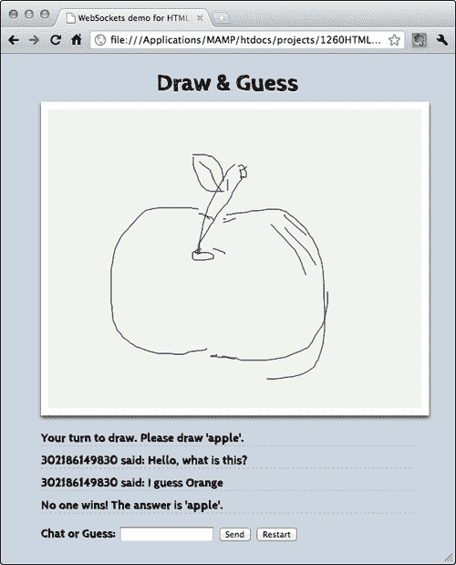
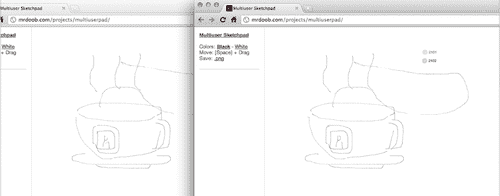
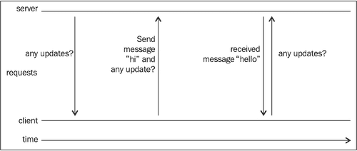
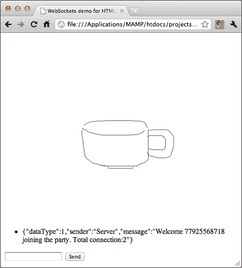
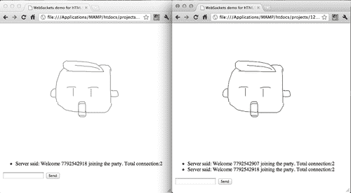
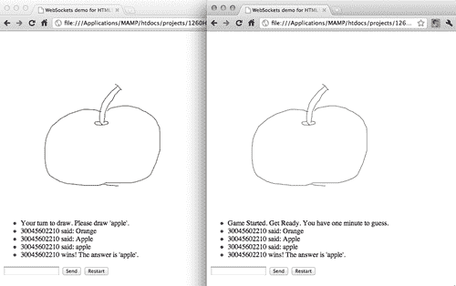
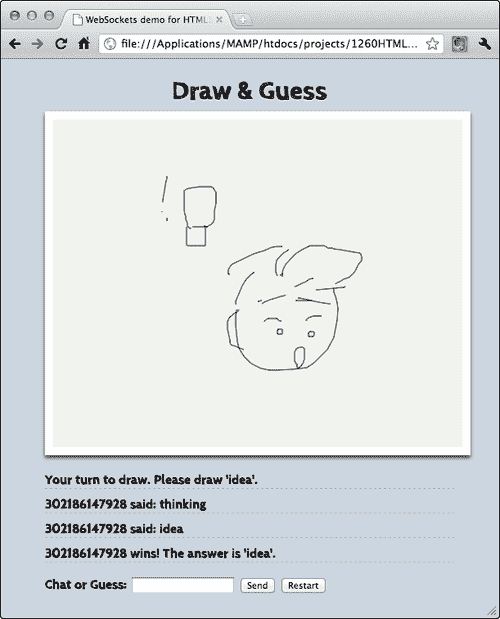

# 第八章：使用 WebSockets 构建多人绘画和猜词游戏

> 在之前的章节中，我们构建了几个本地单人游戏。在本章中，我们将借助 WebSockets 构建一个多人游戏。WebSockets 使我们能够创建基于事件的服务器-客户端架构。所有连接的浏览器之间传递的消息都是即时的。我们将结合 Canvas 绘图、JSON 数据打包和在之前章节中学到的几种技术来构建绘画和猜词游戏。

在本章中，我们将学习以下主题：

+   尝试现有的多用户绘图板，通过 WebSockets 显示来自不同连接用户的绘画

+   安装由`node.js`实现的 WebSockets 服务器

+   从浏览器连接服务器

+   使用 WebSocket API 创建一个即时聊天室

+   在 Canvas 中创建一个多用户绘图板

+   通过集成聊天室和游戏逻辑进行绘画和猜词游戏的构建

以下屏幕截图显示了我们将在本章中创建的绘画和猜词游戏：



所以，让我们开始吧。

# 尝试现有的 WebSockets 网络应用程序

在我们开始构建 WebSockets 示例之前，我们将看一下现有的多用户绘图板示例。这个示例让我们知道如何使用 WebSockets 服务器立即在浏览器之间发送数据。

### 提示

**浏览器使用 WebSockets 的能力**

在撰写本书时，只有苹果 Safari 和 Google Chrome 支持 WebSockets API。Mozilla Firefox 和 Opera 因协议上的潜在安全问题而放弃了对 WebSockets 的支持。Google Chrome 也计划在安全漏洞修复之前放弃 WebSockets。

Mozilla 的以下链接解释了他们为什么禁用了 WebSockets：

[`hacks.mozilla.org/2010/12/websockets-disabled-in-firefox-4/`](http://hacks.mozilla.org/2010/12/websockets-disabled-in-firefox-4/)

# 尝试多用户绘图板的时间

执行以下步骤：

1.  在 Web 浏览器中打开以下链接：

1.  [`www.chromeexperiments.com/detail/multiuser-sketchpad/`](http://www.chromeexperiments.com/detail/multiuser-sketchpad/)

1.  您将看到一个多用户绘图板的介绍页面。右键单击**启动实验**选项，选择**在新窗口中打开链接**。

1.  浏览器会提示一个新窗口，显示绘图板应用程序。然后，我们重复上一步，再次打开绘图板的另一个实例。

1.  将两个浏览器并排放在桌面上。

1.  尝试在任一绘图板上画些东西。绘画应该会出现在两个绘图板上。此外，绘图板是与所有连接的人共享的。您还可以看到其他用户的绘画。

1.  以下屏幕截图显示了两个用户在绘图板上画的一个杯子：



## 刚刚发生了什么？

我们刚刚看到浏览器如何实时连接在一起。我们在绘图板上画了些东西，所有其他连接的用户都可以看到这些图画。此外，我们也可以看到其他人正在画什么。

该示例是使用 HTML5 WebSockets 功能与后端服务器制作的，以向所有连接的浏览器广播绘图数据。

绘画部分是建立在 Canvas 上的，我们已经在*第四章，使用 Canvas 和绘图 API 构建 Untangle 游戏*中介绍过。WebSocket API 使浏览器能够与服务器建立持久连接。后端是一个名为`node.js`的基于事件的服务器，我们将在本章中安装和使用。

# 安装 WebSocket 服务器

HTML5 的 WebSockets 提供了一个客户端 API，用于将浏览器连接到后端服务器。该服务器必须支持 WebSockets 协议，以保持连接持久。

## 安装 Node.JS WebSocket 服务器

在这一部分，我们将下载并安装一个名为`Node.JS`的服务器，我们可以在上面安装一个 WebSockets 模块。

# 安装 Node.JS 的时间

执行以下步骤：

1.  转到包含`Node.JS`服务器源代码的以下 URL：

1.  [`github.com/joyent/node`](https://github.com/joyent/node)

1.  单击页面上的**下载**按钮。它会提示一个对话框询问要下载哪种格式。只需选择 ZIP 格式。

1.  在工作目录中解压 ZIP 文件。

1.  在 Linux 或 Mac OSX 中，使用终端并切换到`node.js`文件所在的目录。

### 注意

`Node.JS`在 Linux 和 Mac 上可以直接使用。以下链接提供了一个安装程序，用于在 Windows 上安装`Node.JS`：

[`node-js.prcn.co.cc/`](http://node-js.prcn.co.cc/)

1.  运行以下命令：

```js
$ ./configure
$ sudo make install

```

使用`sudo make install`命令以 root 权限安装`Node.JS`，并以 root 访问权限安装所需的第三方库。以下链接讨论了如何在不使用`sudo`的情况下安装`Node.JS`：

### 提示

[`increaseyourgeek.wordpress.com/2010/08/18/install-node-js-without-using-sudo/`](http://increaseyourgeek.wordpress.com/2010/08/18/install-node-js-without-using-sudo/)

1.  `sudo make install`命令需要输入具有管理员特权的系统用户的密码。输入密码以继续安装。

1.  安装完成后，可以使用以下命令检查`node.js`是否已安装：

```js
$ node --version

```

1.  上述命令应该打印出`node.js`的版本号。在我的情况下，它是 0.5 预发布版：

```js
v0.5.0-pre

```

1.  接下来，我们将为`Node.JS`服务器安装 WebSockets 库。在浏览器中转到以下 URL：

1.  [`github.com/miksago/node-websocket-server`](http://https://github.com/miksago/node-websocket-server)

1.  单击页面上的**下载**按钮并下载 ZIP 文件。

1.  在一个目录中解压 ZIP 文件。我们稍后会需要这个包中的`lib`目录。

## 刚刚发生了什么？

我们刚刚下载并安装了`Node.JS`服务器。我们还下载了`node.js`服务器的 WebSockets 库。通过本章的示例，我们将在此服务器和 WebSockets 库的基础上构建服务器逻辑。

### 注意

`Node.js`服务器安装在 Unix 或 Linux 操作系统上运行良好。但是，在 Windows 上安装和运行`node.js`服务器需要更多步骤。以下链接显示了如何在 Windows 上安装`node.js`服务器：

[`github.com/joyent/node/wiki/Building-node.js-on-Cygwin-(Windows)`](http://https://github.com/joyent/node/wiki/Building-node.js-on-Cygwin-(Windows))

## 创建一个用于广播连接计数的 WebSockets 服务器

我们刚刚安装了带有 WebSockets 库的`node.js`服务器。现在，我们将构建一些内容来测试 WebSockets。现在想象一下，我们需要一个服务器来接受浏览器的连接，然后向所有用户广播连接计数。

# 执行以下操作创建一个发送连接总数的 WebSocket 服务器

执行以下步骤：

1.  创建一个名为`server`的新目录。

1.  将`node-websocket-server`包中的整个`lib`文件夹复制到`server`目录中。

1.  在`server`目录下创建一个名为`server.js`的新文件，并包含以下内容：

```js
var ws = require(__dirname + '/lib/ws/server');
var server = ws.createServer();
server.addListener("connection", function(conn){
// init stuff on connection
console.log("A connection established with id",conn.id);
var message = "Welcome "+conn.id+" joining the party. Total connection:"+server.manager.length;
server.broadcast(message);
});
server.listen(8000);
console.log("WebSocket server is running.");
console.log("Listening to port 8000.");

```

1.  打开终端并切换到服务器目录。

1.  输入以下命令以执行服务器：

```js
node server.js

```

1.  如果成功，应该得到以下结果：

```js
$ node server.js
WebSocket server is running.
Listening to port 8000.

```

## 刚刚发生了什么？

我们刚刚创建了一个简单的服务器逻辑，初始化了 WebSockets 库，并监听了连接事件。

## 初始化 WebSockets 服务器

在`Node.JS`中，不同的功能被打包到模块中。当我们需要特定模块中的功能时，我们使用`require`进行加载。我们加载 WebSockets 模块，然后在服务器逻辑中使用以下代码初始化服务器：

```js
var ws = require(__dirname + '/lib/ws/server');
var server = ws.createServer();

```

`__dirname`表示正在执行的服务器 JavaScript 文件的当前目录。我们将`lib`文件夹放在服务器逻辑文件的同一文件夹下。因此，WebSockets 服务器位于**当前目录** | **lib** | **ws** | **server**。

最后，我们需要为服务器分配一个端口来监听以下代码：

```js
server.listen(8000);

```

在上述代码片段中，`8000`是客户端连接到此服务器的端口号。 我们可以选择不同的端口号，但必须确保所选的端口号不会与其他常见服务器服务重叠。

### 注意

为了获取有关`node.js`服务器的全局范围对象和变量的更多信息，请访问以下链接的官方文档：

[`nodejs.org/docs/v0.4.3/api/globals.html`](http://nodejs.org/docs/v0.4.3/api/globals.html)

## 在服务器端监听连接事件

`node.js`服务器是基于事件的。 这意味着大多数逻辑是在触发某个事件时执行的。 我们在示例中使用的以下代码监听`connection`事件并处理它：

```js
server.addListener("connection", function(conn){
console.log("A connection established with id",conn.id);
…
});

```

`connection`事件带有一个连接参数。 我们在连接实例中有一个`id`属性，我们可以用它来区分每个连接的客户端。

以下表列出了两个常用的服务器事件：

| WebSockets node.js 的服务器端事件 | 描述 |
| --- | --- |
| `connection` | 当客户端建立新连接时触发事件 |
| `close` | 当连接关闭时触发事件 |

## 获取服务器端连接的客户端计数

我们可以通过访问服务器管理器来获取 WebSockets `node.js`服务器中连接的客户端数。 我们可以使用以下代码获取计数：

```js
var totalConnectedClients = server.manager.length;

```

## 向所有连接的浏览器广播消息

一旦服务器收到新的`connection`事件，我们就会向所有客户端广播连接的更新计数。 向客户端广播消息很容易。 我们只需要在`server`实例中使用`string`参数调用`broadcast`函数。

以下代码片段向所有连接的浏览器广播服务器消息：

```js
var message = "a message from server";
server.broadcast(message);

```

## 创建一个连接到 WebSocket 服务器并获取总连接数的客户端

我们在上一个示例中构建了服务器，现在我们将构建一个客户端，连接到我们的 WebSocket 服务器并从服务器接收消息。 该消息将包含来自服务器的总连接计数。

# 行动时间在 WebSocket 应用程序中显示连接计数

执行以下步骤：

1.  创建一个名为`client`的新目录。

1.  在`client`文件夹中创建一个名为`index.htm`的 HTML 文件。

1.  我们将在我们的 HTML 文件中添加一些标记。 将以下代码放入`index.htm`文件中：

```js
<!DOCTYPE html>
<html lang="en">
<head>
<meta charset="utf-8">
<title>WebSockets demo for HTML5 Games Development: A Beginner's Guide</title>
<meta name="description" content="This is a WebSockets demo for the book HTML5 Games Development: A Beginner's Guide by Makzan">
<meta name="author" content="Makzan">
</head>
<body>
<script src="img/jquery-1.6.min.js"></script>
<script src="img/html5games.websocket.js"></script>
</body>
</html>

```

1.  创建一个名为`js`的目录，并将 jQuery JavaScript 文件放入其中。

1.  创建一个名为`html5games.websockets.js`的新文件，如下所示：

```js
var websocketGame = {
}
// init script when the DOM is ready.
$(function(){
// check if existence of WebSockets in browser
if (window["WebSocket"]) {
// create connection
websocketGame.socket = new WebSocket("ws://127.0.0.1:8000");
// on open event
websocketGame.socket.onopen = function(e) {
console.log('WebSocket connection established.');
};
// on message event
websocketGame.socket.onmessage = function(e) {
console.log(e.data);
};
// on close event
websocketGame.socket.onclose = function(e) {
console.log('WebSocket connection closed.');
};
}
});

```

1.  我们将测试代码。 首先，我们需要通过`node server.js`运行带有我们的`server.js`代码的节点服务器。

1.  接下来，在 Web 浏览器中的客户端目录中打开`index.htm`文件两次。

1.  检查服务器终端。 应该有类似以下的日志消息，指示连接信息和总连接数：

```js
$ node server.js
WebSocket server is running.
Listening to port 8000.
A connection established with id 3863522640
A connection established with id 3863522651

```

1.  然后，我们在浏览器中检查控制台面板。 一旦加载页面，我们就可以获得总连接数。 以下屏幕截图显示了客户端端的结果：


## 刚刚发生了什么？

我们刚刚构建了一个客户端，它与我们在上一节中构建的服务器建立了 WebSockets 连接。 然后，客户端将从服务器接收的任何消息打印到检查器中的控制台面板中。

## 建立 WebSocket 连接

在支持 WebSockets 的任何浏览器中，我们可以通过使用以下代码创建一个新的 WebSocket 实例来建立连接：

```js
var socket = new WebSocket(url);

```

`url`参数是一个带有 WebSockets URL 的字符串。 在我们的示例中，我们正在本地运行我们的服务器。 因此，我们使用的 URL 是`ws://127.0.0.1:8000`，其中 8000 表示我们正在连接的服务器的端口号。 这是 8000，因为当我们构建服务器端逻辑时，服务器正在监听端口 8000。

## WebSockets 客户端事件

与服务器类似，客户端端有几个 WebSockets 事件。以下表格列出了我们将用于处理 WebSockets 的事件：

| 事件名称 | 描述 |
| --- | --- |
| `onopen` | 当与服务器的连接建立时触发 |
| `onmessage` | 当从服务器接收到任何消息时触发 |
| `onclose` | 当服务器关闭连接时触发 |
| `onerror` | 当连接出现任何错误时触发 |

# 使用 WebSockets 构建聊天应用程序

我们现在知道有多少浏览器连接。假设我们想要构建一个聊天室，用户可以在各自的浏览器中输入消息，并立即将消息广播给所有连接的用户。

## 向服务器发送消息

我们将让用户输入消息，然后将消息发送到`node.js`服务器。然后服务器将消息转发到所有连接的浏览器。一旦浏览器接收到消息，它就会在聊天区域显示出来。在这种情况下，用户一旦加载网页就连接到即时聊天室。

# 采取行动 通过 WebSockets 向服务器发送消息

执行以下步骤：

1.  首先，编写服务器逻辑。

1.  打开`server.js`并添加以下突出显示的代码：

```js
server.addListener("connection", function(conn){
// init stuff on connection
console.log("A connection established with id",conn.id);
var message = "Welcome "+conn.id+" joining the party. Total connection:"+server.manager.length;
server.broadcast(message);
// listen to the message
conn.addListener("message", function(message){
console.log("Got data '"+message+"' from connection "+conn.id);
});
});

```

1.  现在转到`client`文件夹。

1.  打开`index.htm`文件，并在`body`部分中添加以下标记。它为用户提供了输入并发送消息到服务器的输入：

```js
<input type='text' id="chat-input">
<input type='button' value="Send" id="send">

```

1.  然后，将以下代码添加到`html5games.websocket.js` JavaScript 文件中。当用户单击`send`按钮或按**Enter**键时，它将消息发送到服务器：

```js
$("#send").click(sendMessage);
$("#chat-input").keypress(function(event) {
if (event.keyCode == '13') {
sendMessage();
}
});
function sendMessage()
{
var message = $("#chat-input").val();
websocketGame.socket.send(message);
$("#chat-input").val("");
}

```

1.  在测试我们的代码之前，检查服务器终端，看看 node 服务器是否仍在运行。按**Ctrl+C**终止它，然后使用`node server.js`命令再次运行它。

1.  在 Web 浏览器中打开`index.htm`。您应该看到一个带有**Send**按钮的输入文本字段，如下面的屏幕截图所示：

1.  尝试在输入文本字段中输入一些内容，然后单击**Send**按钮或按**Enter**。输入文本将被清除。

1.  现在，切换到服务器终端，我们将看到服务器打印我们刚刚发送的文本。您还可以将浏览器和服务器终端并排放置，以查看消息从客户端发送到服务器的实时性。以下屏幕截图显示了服务器终端上来自两个连接的浏览器的消息：


## 刚刚发生了什么？

我们刚刚通过添加一个输入文本字段来扩展了我们的连接示例，让用户在其中输入一些文本并将其发送出去。文本作为消息发送到 WebSockets 服务器。然后服务器将在终端中打印接收到的消息。

## 从客户端向服务器发送消息

为了从客户端向服务器发送消息，我们在`WebSocket`实例中调用以下`send`方法：

```js
websocketGame.socket.send(message);

```

在我们的示例中，以下代码片段从输入文本字段中获取消息并将其发送到服务器：

```js
var message = $("#chat-input").val();
websocketGame.socket.send(message);

```

## 在服务器端接收消息

在服务器端，我们需要处理刚刚从客户端发送的消息。在 WebSocket `node.js`库中的连接实例中有一个名为`message`的事件。我们可以监听连接消息事件以接收来自每个客户端连接的消息。

以下代码片段显示了我们如何使用消息事件监听器在服务器终端上打印消息和唯一连接 ID：

```js
conn.addListener("message", function(message){
console.log("Got data '"+message+"' from connection "+conn.id);
});

```

### 注意

在服务器和客户端之间发送和接收消息时，只接受字符串。我们不能直接发送对象。但是，我们可以在传输之前将数据转换为 JSON 格式的字符串。我们将在本章后面展示发送数据对象的示例。

# 在服务器端广播每条接收到的消息以创建聊天室

在上一个示例中，服务器可以接收来自浏览器的消息。但是，服务器除了在终端中打印接收到的消息之外，什么也不做。因此，我们将向服务器添加一些逻辑，以广播消息。

# 执行广播消息到所有连接的浏览器的操作

执行以下步骤：

1.  打开服务器端逻辑的`server.js`文件。

1.  将以下突出显示的代码添加到消息事件监听器处理程序中：

```js
conn.addListener("message", function(message){
console.log("Got data '"+message+"' from connection "+conn.id);
var displayMessage = conn.id + " says: "+message;
server.broadcast(displayMessage);
});

```

1.  服务器端就是这样。转到`client`文件夹并打开`index.htm`文件。

1.  我们想在聊天历史区域显示聊天消息。将以下代码添加到 HTML 文件中：

```js
<ul id="chat-history"></ul>

```

1.  接下来，我们需要客户端 JavaScript 来处理从服务器接收的消息。我们用它将消息打印到控制台面板中，用以下突出显示的代码替换`onmessage`事件处理程序中的`console.log`代码：

```js
socket.onmessage = function(e) {
$("#chat-history").append("<li>"+e.data+"</li>");
};

```

1.  让我们测试我们的代码。通过**Ctrl + C**终止任何正在运行的 node 服务器。然后再次运行服务器。

1.  打开`index.htm`文件两次，将它们并排放置。在文本字段中输入一些内容，然后按**Enter**。消息将出现在所有打开的浏览器上。如果打开多个 HTML 文件实例，则消息应该出现在所有浏览器上。下面的截图显示了两个并排显示聊天历史记录的浏览器：


## 刚才发生了什么？

这是我们之前示例的延伸。我们讨论了服务器如何向所有连接的客户端广播连接计数。我们还讨论了客户端如何向服务器发送消息。在这个例子中，我们将这两种技术结合起来，让服务器将接收到的消息广播给所有连接的用户。

## 比较 WebSocket 和轮询方法

如果您曾经使用服务器端语言和数据库构建过网页聊天室，那么您可能会想知道 WebSocket 实现和传统实现之间有什么区别。

传统的聊天室方法通常使用**轮询**方法实现。客户端定期向服务器请求更新。服务器会用没有更新或更新的数据来响应客户端。然而，传统方法存在一些问题。客户端直到下一次向服务器请求之前，才能从服务器获取新的更新数据。这意味着数据更新会延迟一段时间，响应不够即时。如果我们想通过缩短轮询持续时间来改善这个问题，那么会利用更多的带宽，因为客户端需要不断向服务器发送请求。

下图显示了客户端和服务器之间的请求。它显示了许多无用的请求被发送，但服务器在没有新数据的情况下响应客户端：


还有一种更好的轮询方法叫做**长轮询**。客户端向服务器发送请求并等待响应。与传统的轮询方法不同，服务器不会以“没有更新”的方式响应，直到有需要推送给服务器的内容。在这种方法中，服务器可以在有更新时向客户端推送内容。一旦客户端从服务器收到响应，它会创建另一个请求并等待下一个服务器通知。下面的图显示了长轮询方法，客户端请求更新，服务器只在有更新时响应：



在 WebSockets 方法中，请求的数量远少于轮询方法。这是因为客户端和服务器之间的连接是持久的。一旦建立连接，只有在有任何更新时才会从客户端或服务器端发送请求。例如，当客户端想要向服务器更新某些内容时，客户端向服务器发送消息。服务器也只在需要通知客户端数据更新时才向客户端发送消息。在连接期间不会发送其他无用的请求。因此，利用的带宽更少。以下图显示了 WebSockets 方法：


## 小测验：WebSockets 相对于轮询方法的好处

使用基于事件的 WebSockets 方法实现多用户聊天室的好处是什么？这些好处如何使消息传递如此即时？

# 使用 Canvas 和 WebSockets 制作共享绘图白板

假设我们想要一个共享的素描本。任何人都可以在素描本上画东西，所有其他人都可以查看，就像我们在本章开头玩的素描本示例一样。我们学习了如何在客户端和服务器之间传递消息。我们将进一步发送绘图数据。

## 构建本地绘图素描本

在处理数据发送和服务器处理之前，让我们专注于制作一个绘图白板。我们将使用画布来构建一个本地绘图素描本。

# 行动时间：使用 Canvas 制作本地绘图白板

执行以下步骤：

1.  在本节中，我们只关注客户端。打开`index.htm`文件并添加以下`canvas`标记：

```js
<canvas id='drawing-pad' width='500' height='400'>
</canvas>

```

1.  我们将在画布上画一些东西，我们将需要相对于画布的鼠标位置。我们在*第四章，使用 Canvas 和 Drawing API 构建 Untangle 游戏*中做到了这一点。将以下样式添加到画布：

```js
<style>
canvas{position:relative;}
</style>

```

1.  然后，我们打开`html5games.websocket.js` JavaScript 文件来添加绘图逻辑。

1.  在 JavaScript 文件的顶部用以下变量替换`websocketGame`全局对象：

```js
var websocketGame = {
// indicates if it is drawing now.
isDrawing : false,
// the starting point of next line drawing.
startX : 0,
startY : 0,
}
// canvas context
var canvas = document.getElementById('drawing-pad');
var ctx = canvas.getContext('2d');

```

1.  在 jQuery 的`ready`函数中，我们添加以下鼠标事件处理程序代码。该代码处理鼠标按下、移动和松开事件：

```js
// the logic of drawing on canvas
$("#drawing-pad").mousedown(function(e) {
// get the mouse x and y relative to the canvas top-left point.
var mouseX = e.layerX || 0;
var mouseY = e.layerY || 0;
startX = mouseX;
startY = mouseY;
isDrawing = true;
});
$("#drawing-pad").mousemove(function(e) {
// draw lines when is drawing
if (websocketGame.isDrawing) {
// get the mouse x and y relative to the canvas top-left point.
var mouseX = e.layerX || 0;
var mouseY = e.layerY || 0;
if (!(mouseX == websocketGame.startX && mouseY == websocketGame.startY)) {
drawLine(ctx, websocketGame.startX, websocketGame.startY,mouseX,mouseY,1);
websocketGame.startX = mouseX;
websocketGame.startY = mouseY;
}
}
});
$("#drawing-pad").mouseup(function(e) {
websocketGame.isDrawing = false;
});

```

1.  最后，我们有以下函数来在画布上画一条线，给定起点和终点：

```js
function drawLine(ctx, x1, y1, x2, y2, thickness) {
ctx.beginPath();
ctx.moveTo(x1,y1);
ctx.lineTo(x2,y2);
ctx.lineWidth = thickness;
ctx.strokeStyle = "#444";
ctx.stroke();
}

```

1.  保存所有文件并打开`index.htm`文件。我们应该看到一个空白的空间，我们可以使用鼠标绘制一些东西。绘图尚未发送到服务器，因此其他人无法查看我们的绘图：



## 刚刚发生了什么？

我们刚刚创建了一个本地绘图板。这就像一个白板，玩家可以通过拖动鼠标在画布上绘图。但是，绘图数据尚未发送到服务器；所有绘图只在本地显示。

`画线`函数与我们在*第四章*中使用的相同。我们还使用相同的代码来获取鼠标相对于画布元素的位置。但是，鼠标事件的逻辑与*第四章*不同。

### 在画布上绘制

当我们在计算机上画东西时，通常意味着我们点击画布并拖动鼠标（或笔）。直到鼠标按钮松开为止才画线。然后，用户再次点击另一个地方并拖动以绘制线条。

在我们的示例中，我们有一个名为`isDrawing`的布尔标志，用于指示用户是否正在绘图。`isDrawing`标志默认为 false。当鼠标按钮按下时，我们将标志设置为 true。当鼠标移动时，我们在鼠标按钮按下时的移动点和上一个点之间画一条线。然后，当鼠标按钮松开时，我们再次将`isDrawing`标志设置为 false。

这就是绘图逻辑的工作方式。

## 尝试一下：使用颜色绘图

我们能否通过添加颜色支持来修改绘图画板？再加上五个按钮，分别是红色、蓝色、绿色、黑色和白色？玩家可以在绘图时选择颜色。

## 将绘图广播到所有连接的浏览器

我们将进一步通过将我们的绘图数据发送到服务器，并让服务器将绘图广播到所有连接的浏览器。

# 通过 WebSockets 发送绘图的时间

执行以下步骤：

1.  首先，我们需要修改服务器逻辑。打开`server.js`文件并替换以下代码。它使用 JSON 格式的字符串进行广播，因此我们可以发送和接收数据对象：

```js
// Constants
var LINE_SEGMENT = 0;
var CHAT_MESSAGE = 1;
var ws = require(__dirname + '/lib/ws/server');
var server = ws.createServer();
server.addListener("connection", function(conn){
// init stuff on connection
console.log("A connection established with id",conn.id);
var message = "Welcome "+conn.id+" joining the party. Total connection:"+server.manager.length;
var data = {};
data.dataType = CHAT_MESSAGE;
data.sender = "Server";
data.message = message;
shared drawing whiteboardshared drawing whiteboardconnected browsers drawings, broadcastingserver.broadcast(JSON.stringify(data));
// listen to the message
shared drawing whiteboardshared drawing whiteboardconnected browsers drawings, broadcastingconn.addListener("message", function(message){
console.log("Got data '"+message+"' from connection "+conn.id);
var data = JSON.parse(message);
if (data.dataType == CHAT_MESSAGE) {
// add the sender information into the message data object
data.sender = conn.id;
}
server.broadcast(JSON.stringify(data));
});
});
server.listen(8000);
console.log("WebSocket server is running.");
console.log("Listening to port 8000.");

```

1.  在客户端，我们需要逻辑来对服务器做出相同的数据对象定义的响应。在**client** | **js**目录中打开`html5games.websocket.js` JavaScript 文件。

1.  将以下常量添加到`websocketGame`全局变量中。相同的常量与相同的值也在服务器端逻辑中定义。

```js
// Contants
LINE_SEGMENT : 0,
CHAT_MESSAGE : 1,

```

1.  在客户端处理消息事件时，我们将 JSON 格式的字符串转换回数据对象。如果数据是聊天消息，那么我们将其显示为聊天历史记录，否则我们将其绘制在画布上作为线段。用以下代码替换`onmessage`事件处理程序：

```js
socket.onmessage = function(e) {
// check if the received data is chat message or line segment
console.log("onmessage event:",e.data);
var data = JSON.parse(e.data);
if (data.dataType == websocketGame.CHAT_MESSAGE) {
$("#chat-history").append("<li>"+data.sender+" said: "+data.message+"</li>");
}
else if (data.dataType == websocketGame.LINE_SEGMENT) {
drawLine(ctx, data.startX, data.startY, data.endX, data.endY, 1);
}
};

```

1.  当鼠标移动时，我们不仅在画布上绘制线条，还将线条数据发送到服务器。将以下突出显示的代码添加到鼠标移动事件处理程序中：

```js
$("#drawing-pad").mousemove(function(e) {
// draw lines when is drawing
if (websocketGame.isDrawing) {
// get the mouse x and y relative to the canvas top-left point.
var mouseX = e.layerX || 0;
var mouseY = e.layerY || 0;
if (!(mouseX == websocketGame.startX && mouseY == websocketGame.startY)) {
drawLine(ctx,startX,startY,mouseX,mouseY,1);
// send the line segment to server
var data = {};
data.dataType = websocketGame.LINE_SEGMENT;
data.startX = startX;
data.startY = startY;
data.endX = mouseX;
data.endY = mouseY;
websocketGame.socket.send(JSON.stringify(data));
websocketGame.startX = mouseX;
websocketGame.startY = mouseY;
}
}
});

```

1.  最后，我们需要修改发送消息的逻辑。现在，当将消息发送到服务器时，我们将消息打包成一个对象并格式化为 JSON。将`sendMessage`函数更改为以下代码：

```js
function sendMessage() {
var message = $("#chat-input").val();
// pack the message into an object.
var data = {};
data.dataType = websocketGame.CHAT_MESSAGE;
data.message = message;
websocketGame.socket.send(JSON.stringify(data));
$("#chat-input").val("");
}

```

1.  保存所有文件并重新启动服务器。

1.  在两个浏览器实例中打开`index.htm`文件。

1.  首先，通过输入一些消息并发送它们来尝试聊天室功能。然后，在画布上画一些东西。两个浏览器应该显示与以下截图中相同的绘图：



## 刚刚发生了什么？

我们刚刚构建了一个多用户绘图画板。这类似于我们在本章开头尝试的绘图画板。我们通过发送一个复杂的数据对象作为消息，扩展了构建聊天室时所学到的内容。

## 定义一个数据对象来在客户端和服务器之间通信

为了正确地在服务器和客户端之间传递多个数据，我们必须定义一个数据对象，服务器和客户端都能理解。

数据对象中有几个属性。以下表格列出了这些属性以及我们为什么需要它们：

| 属性名称 | 我们为什么需要这个属性 |
| --- | --- |
| `dataType` | 这是一个重要的属性，帮助我们了解整个数据。数据要么是聊天消息，要么是绘图线段数据。 |
| `sender` | 如果数据是聊天消息，客户端需要知道谁发送了消息。 |
| `message` | 当数据类型是聊天消息时，我们肯定需要将消息内容本身包含到数据对象中。 |
| `startX` | 当数据类型是绘图线段时，我们包含线的起点的 x/y 坐标。 |
| `startY` |   |
| `endX` | 当数据类型是绘图线段时，我们包含线的终点的 x/y 坐标。 |
| `endY` |   |

此外，我们在客户端和服务器端都定义了以下常量。这些常量是用于`dataType`属性的：

```js
// Contants
LINE_SEGMENT : 0,
CHAT_MESSAGE : 1,

```

有了这些常量，我们可以通过以下可读的代码来比较`dataType`，而不是使用无意义的整数：

```js
if (data.dataType == websocketGame.CHAT_MESSAGE) {…}

```

## 将绘图线数据打包成 JSON 进行广播

在上一章中，当将 JavaScript 对象存储到本地存储中时，我们使用了`JSON.stringify`函数将其转换为 JSON 格式的字符串。现在，我们需要在服务器和客户端之间以字符串格式发送数据。我们使用了相同的方法将绘画线条数据打包成对象，并将其作为 JSON 字符串发送。

以下代码片段显示了我们如何在客户端打包线段数据并以 JSON 格式的字符串发送到服务器：

```js
// send the line segment to server
var data = {};
data.dataType = websocketGame.LINE_SEGMENT;
data.startX = startX;
data.startY = startY;
data.endX = mouseX;
data.endY = mouseY;
websocketGame.socket.send(JSON.stringify(data));

```

## 在从其他客户端接收到绘画线条后重新创建它们

JSON 解析通常成对出现，与`stringify`一起使用。当我们从服务器接收到消息时，我们必须将其解析为 JavaScript 对象。以下是客户端上的代码，它解析数据并根据数据更新聊天历史或绘制线条：

```js
var data = JSON.parse(e.data);
if (data.dataType == websocketGame.CHAT_MESSAGE) {
$("#chat-history").append("<li>"+data.sender+" said: "+data.message+"</li>");
}
else if (data.dataType == websocketGame.LINE_SEGMENT) {
drawLine(ctx, data.startX, data.startY, data.endX, data.endY, 1);
}

```

# 构建多人绘画和猜词游戏

在本章的早些时候，我们构建了一个即时聊天室。此外，我们刚刚构建了一个多用户草图本。那么，如何将这两种技术结合起来构建一个绘画和猜词游戏呢？绘画和猜词游戏是一种游戏，其中一个玩家被给予一个词来绘制。所有其他玩家不知道这个词，并根据绘画猜测这个词。绘画者和正确猜测词语的玩家将获得积分。

# 采取行动构建绘画和猜词游戏

我们将按照以下方式实现绘画和猜词游戏的游戏流程：

1.  首先，我们将在客户端添加游戏逻辑。

1.  在客户端目录中打开`index.htm`文件。在*发送*按钮之后添加以下重新启动按钮：

```js
<input type='button' value="Restart" id="restart">

```

1.  打开`html5games.websocket.js` JavaScript 文件。

1.  我们需要一些额外的常量来确定游戏进行过程中的不同状态。将以下突出显示的代码添加到文件顶部：

```js
// Constants
LINE_SEGMENT : 0,
CHAT_MESSAGE : 1,
GAME_LOGIC : 2,
// Constant for game logic state
WAITING_TO_START : 0,
GAME_START : 1,
GAME_OVER : 2,
GAME_RESTART : 3,

```

1.  此外，我们需要一个标志来指示此玩家负责绘制。将以下布尔全局变量添加到代码中：

```js
isTurnToDraw : false,

```

1.  当客户端从服务器接收到消息时，它会解析并检查是否是一条线条绘制的聊天消息。现在我们有另一种处理游戏逻辑的消息类型，名为`GAME_LOGIC`。游戏逻辑消息包含不同的数据，用于不同的游戏状态。将以下代码添加到`onmessage`事件处理程序中：

```js
else if (data.dataType == websocketGame.GAME_LOGIC) {
if (data.gameState == websocketGame.GAME_OVER) {
websocketGame.isTurnToDraw = false;
$("#chat-history").append("<li>"+data.winner+" wins! The answer is '"+data.answer+"'.</li>");
$("#restart").show();
}
if (data.gameState == websocketGame.GAME_START) {
// clear the canvas.
canvas.width = canvas.width;
// hide the restart button.
$("#restart").hide();
// clear the chat history
$("#chat-history").html("");
if (data.isPlayerTurn) {
isTurnToDraw = true;
$("#chat-history").append("<li>Your turn to draw. Please draw '"+data.answer+"'.</li>");
}
else {
$("#chat-history").append("<li>Game Started. Get Ready. You have one minute to guess.</li>");
}
}
}

```

1.  我们已经在客户端添加了游戏逻辑。客户端上有一些包含重新启动逻辑和防止非绘图玩家在画布上绘制的小代码。这些代码可以在代码包中找到。

1.  是时候转向服务器端了。

1.  在先前的示例中，服务器端只负责将任何传入的消息广播给所有连接的浏览器。这对于多人游戏来说是不够的。服务器将充当控制游戏流程和确定胜利的游戏主持人。因此，请删除`server.js`中的现有代码，并使用以下代码。更改部分已经突出显示：

```js
// Constants
var LINE_SEGMENT = 0;
var CHAT_MESSAGE = 1;
var GAME_LOGIC = 2;
// Constant for game logic state
var WAITING_TO_START = 0;
var GAME_START = 1;
var GAME_OVER = 2;
var GAME_RESTART = 3;
var ws = require(__dirname + '/lib/ws/server');
var server = ws.createServer();
// the current turn of player index.
var playerTurn = 0;
var wordsList = ['apple','idea','wisdom','angry'];
var currentAnswer = undefined;
var currentGameState = WAITING_TO_START;
var gameOverTimeout;
server.addListener("connection", function(conn){
// init stuff on connection
console.log("A connection established with id",conn.id);
var message = "Welcome "+conn.id+" joining the party. Total connection:"+server.manager.length;
var data = {};
data.dataType = CHAT_MESSAGE;
data.sender = "Server";
data.message = message;
server.broadcast(JSON.stringify(data));
// send the game state to all players.
var gameLogicData = {};
gameLogicData.dataType = GAME_LOGIC;
gameLogicData.gameState = WAITING_TO_START;
server.broadcast(JSON.stringify(gameLogicData));
// start the game if there are 2 or more connections
if (currentGameState == WAITING_TO_START && server.manager.length >= 2)
{
startGame();
}
// listen to the message
conn.addListener("message", function(message){
console.log("Got data '"+message+"' from connection "+conn.id);
var data = JSON.parse(message);
if (data.dataType == CHAT_MESSAGE)
{
// add the sender information into the message data object.
data.sender = conn.id;
multiplayer draw-and-guess gamemultiplayer draw-and-guess gamebuilding}
server.broadcast(JSON.stringify(data));
// check if the message is guessing right or wrong
if (data.dataType == CHAT_MESSAGE)
{
if (currentGameState == GAME_START && data.message == currentAnswer)
{
var gameLogicData = {};
gameLogicData.dataType = GAME_LOGIC;
gameLogicData.gameState = GAME_OVER;
gameLogicData.winner = conn.id;
gameLogicData.answer = currentAnswer;
server.broadcast(JSON.stringify(gameLogicData));
currentGameState = WAITING_TO_START;
// clear the game over timeout
clearTimeout(gameOverTimeout);
}
}
if (data.dataType == GAME_LOGIC && data.gameState == GAME_RESTART)
{
startGame();
}
});
});
function startGame()
{
// pick a player to draw
playerTurn = (playerTurn+1) % server.manager.length;
// pick an answer
var answerIndex = Math.floor(Math.random() * wordsList.length);
currentAnswer = wordsList[answerIndex];
// game start for all players
multiplayer draw-and-guess gamemultiplayer draw-and-guess gamebuildingvar gameLogicData1 = {};
gameLogicData1.dataType = GAME_LOGIC;
gameLogicData1.gameState = GAME_START;
gameLogicData1.isPlayerTurn = false;
server.broadcast(JSON.stringify(gameLogicData1));
// game start with answer to the player in turn
var index = 0;
server.manager.forEach(function(connection){
if (index == playerTurn)
{
var gameLogicData2 = {};
gameLogicData2.dataType = GAME_LOGIC;
gameLogicData2.gameState = GAME_START;
gameLogicData2.answer = currentAnswer;
gameLogicData2.isPlayerTurn = true;
server.send(connection.id, JSON.stringify(gameLogicData2));
}
index++;
});
// game over the game after 1 minute.
gameOverTimeout = setTimeout(function(){
var gameLogicData = {};
gameLogicData.dataType = GAME_LOGIC;
gameLogicData.gameState = GAME_OVER;
gameLogicData.winner = "No one";
gameLogicData.answer = currentAnswer;
server.broadcast(JSON.stringify(gameLogicData));
currentGameState = WAITING_TO_START;
},60*1000);
currentGameState = GAME_START;
}
server.listen(8000);
console.log("WebSocket server is running.");
console.log("Listening to port 8000.");

```

1.  我们将保存所有文件并重新启动服务器。然后，在两个浏览器实例中启动`index.htm`文件。一个浏览器收到来自服务器的消息，通知玩家绘制某物。另一个浏览器则通知玩家在一分钟内猜测其他人正在绘制什么。

1.  被告知绘制某物的玩家可以在画布上绘制。绘画将广播给其他连接的玩家。被告知猜测的玩家不能在画布上绘制任何东西。相反，玩家在文本字段中输入他们的猜测并发送到服务器。如果猜测正确，则游戏结束。否则，游戏将持续直到一分钟倒计时结束。



## 刚刚发生了什么？

我们刚刚在 WebSockets 和 Canvas 中创建了一个多人绘画和猜词游戏。游戏和多用户草图本之间的主要区别在于，服务器现在控制游戏流程，而不是让所有用户绘制。

## 控制多人游戏的游戏流程

控制多人游戏的游戏流程比单人游戏要困难得多。我们可以简单地使用几个变量来控制单人游戏的游戏流程，但是我们必须使用消息传递来通知每个玩家特定的更新游戏流程。

首先，我们需要以下突出显示的常量`GAME_LOGIC`用于`dataType`。我们使用这个`dataType`来发送和接收与游戏逻辑控制相关的消息：

```js
// Constants
var LINE_SEGMENT = 0;
var CHAT_MESSAGE = 1;
var GAME_LOGIC = 2;

```

游戏流程中有几种状态。在游戏开始之前，连接的玩家正在等待游戏开始。一旦有足够的连接进行多人游戏，服务器向所有玩家发送游戏逻辑消息，通知他们开始游戏。

当游戏结束时，服务器向所有玩家发送游戏结束状态。然后，游戏结束，游戏逻辑暂停，直到有玩家点击重新开始按钮。一旦重新开始按钮被点击，客户端向服务器发送游戏重新开始状态，指示服务器准备新游戏。然后，游戏重新开始。

我们在客户端和服务器中将四个游戏状态声明为以下常量，以便它们理解：

```js
// Constant for game logic state
var WAITING_TO_START = 0;
var GAME_START = 1;
var GAME_OVER = 2;
var GAME_RESTART = 3;

```

服务器端的以下代码保存了一个指示哪个玩家轮到的索引：

```js
var playerTurn = 0;

```

发送到玩家（轮到他的回合）的数据与发送到其他玩家的数据不同。其他玩家只收到一个游戏开始信号的数据：

```js
var gameLogicData1 = {};
gameLogicData1.dataType = GAME_LOGIC;
gameLogicData1.gameState = GAME_START;
gameLogicData1.isPlayerTurn = false;

```

另一方面，玩家（轮到他画画）收到以下包含单词信息的数据：

```js
var gameLogicData2 = {};
gameLogicData2.dataType = GAME_LOGIC;
gameLogicData2.gameState = GAME_START;
gameLogicData2.answer = currentAnswer;
gameLogicData2.isPlayerTurn = true;

```

## 在服务器端枚举连接的客户端

我们可以使用`server manager`类中的`forEach`方法枚举所有连接的客户端。以下代码显示了用法。它循环遍历每个连接，并调用给定的`callback`函数，如下所示：

```js
server.manager.forEach(function);

```

例如，以下代码片段在服务器终端上打印所有连接的 ID：

```js
server.manager.forEach(function(connection){
console.log("This is connection",connection.id);
}
}

```

## 在服务器端向特定连接发送消息

在我们之前的示例中，我们使用广播向所有连接的客户端发送消息。除了向每个人发送消息，我们可以使用`send`方法将消息发送到特定的连接，如下所示：

```js
server.send(connectionID, message);

```

`send`方法需要两个参数。`connectionID`是目标连接的唯一 ID，`message`是我们要发送的字符串。

在我们从画画和猜图游戏中提取的以下代码中，我们向现在必须画画的玩家的浏览器发送特殊数据。我们使用`forEach`函数循环遍历连接，并检查连接是否轮到画画。然后，我们打包答案并将这些数据发送给目标连接，如下所示：

```js
server.manager.forEach(function(connection){
if (index == playerTurn)
{
var gameLogicData2 = {};
gameLogicData2.dataType = GAME_LOGIC;
gameLogicData2.gameState = GAME_START;
gameLogicData2.answer = currentAnswer;
gameLogicData2.isPlayerTurn = true;
server.send(connection.id, JSON.stringify(gameLogicData2));
}
index++;
});

```

## 改进游戏

我们刚刚创建了一个可玩的多人游戏。但是，还有很多需要改进的地方。在接下来的几节中，我们列出了游戏中的两个可能的改进。

### 在每个游戏中存储绘制的线条

在游戏中，画画者画线，其他玩家猜图。现在，想象两个玩家在玩，第三个玩家加入。由于没有任何地方存储绘制的线条，第三个玩家无法看到画画者画了什么。这意味着第三个玩家必须等到游戏结束才能玩。

## 尝试一下

我们如何让晚加入的玩家继续游戏而不丢失那些绘制的线条？我们如何为新连接的玩家重建绘图？在服务器上存储当前游戏的所有绘图数据怎么样？

### 改进答案检查机制

服务器端的答案检查与`currentAnswer`变量比较消息，以确定玩家是否猜对。如果情况不匹配，答案将被视为不正确。当答案是“apples”时，玩家猜“apple”时被告知错误，这看起来很奇怪。

## 尝试一下

我们如何改进答案检查机制？如果使用不同的大小写或者相似的单词来改进答案检查逻辑，会怎么样？

# 用 CSS 装饰猜画游戏

游戏逻辑基本上已经完成，游戏已经可以玩了。但是，我们忘记了装饰游戏以使其看起来更吸引人。我们将使用 CSS 样式来装饰我们的猜画游戏。

# 装饰游戏的时间

执行以下步骤：

1.  装饰只适用于客户端。打开`index.htm`文件。

1.  在头部添加以下 CSS 样式链接：

```js
<link href='http://fonts.googleapis.com/css?family=Cabin+Sketch: bold' rel='stylesheet' type='text/css'>
<link rel="stylesheet" type="text/css" media="all" href="css/drawguess.css">

```

1.  将所有标记放在`body`中的`id=game`的`section`内。此外，我们添加了一个游戏的`h1`标题，如下所示：

```js
<section id="game">
<h1>Draw & Guess</h1>
...
</section>

```

1.  在文本字段输入前添加一个**聊天或猜测：**，这样玩家就知道在哪里输入他们的猜测词。

1.  接下来，在`client`文件夹内创建一个名为`css`的目录。

1.  创建一个名为`drawguess.css`的新文件，并将其保存在`css`目录中。

1.  将以下样式放入 CSS 文件中：

```js
body {
background: #ccd6e1;
font-family: 'Cabin Sketch', arial, serif;
}
#game {
width: 500px;
margin: 0 auto;
}
#game h1 {
text-align: center;
margin-bottom: 5px;
text-shadow: 0px 1px 0px #fff;
}
#drawing-pad {
border: 10px solid #fffeff;
background: #f1f3ef;
box-shadow:0px 3px 5px #333;
}
#chat-history {
list-style: none;
padding: 0;
}
#chat-history li {
border-bottom: 1px dashed rgba(20,20,20,.2);
margin: 10px 0;
}

```

1.  保存所有文件，并在两个浏览器中再次打开`index.htm`文件以开始游戏。由于我们只改变了装饰代码，游戏现在应该看起来更好，如下面的截图所示：



## 刚刚发生了什么？

我们刚刚为我们的游戏应用了样式，并嵌入了一个来自**Google Font Directory**的字体，看起来像是涂鸦文本。画布现在被设计成更像是一个带有粗边框和微妙阴影的画布。

# 总结

在这一章中，我们学到了很多关于将浏览器连接到 WebSockets 的知识。一个浏览器的消息和事件会几乎实时地广播到另一个浏览器。

具体来说，我们：

+   学会了 WebSockets 如何通过在现有的多人涂鸦板上绘制来提供实时事件。它显示了其他连接用户的绘画。

+   安装了一个带有 WebSocket 库的`Node.js`服务器。通过使用这个服务器，我们可以轻松地构建一个基于事件的服务器来处理来自浏览器的 WebSocket 请求。

+   讨论了服务器和客户端之间的关系。

+   构建了一个即时聊天室应用程序。我们学会了如何实现一个服务器脚本来将传入的消息广播到其他连接的浏览器。我们还学会了如何在客户端上显示从服务器接收到的消息。

+   构建了一个多用户绘图板。我们学会了如何将数据打包成 JSON 格式，以在服务器和浏览器之间传递消息。

+   通过整合聊天和绘图板来构建一个猜画游戏。我们还学会了如何在多人游戏中创建游戏逻辑。

现在我们已经学会了如何构建一个多人游戏，我们准备在下一章中借助物理引擎来构建物理游戏。
