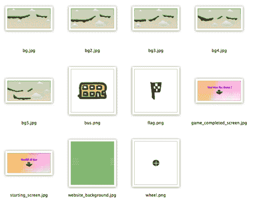

# 第九章：使用 Box2D 和 Canvas 构建物理汽车游戏

> 2D 物理引擎是游戏开发中的热门话题。借助物理引擎，我们可以通过定义环境和简单规则轻松创建可玩的游戏。以现有游戏为例，愤怒的小鸟游戏中的玩家将小鸟飞向敌人的城堡以摧毁它。在《切断绳子》中，糖果掉进怪物的嘴里以进入下一关。

在本章中，我们将学习以下主题：

+   安装 Box2D JavaScript 库

+   在物理世界中创建一个静态地面实体

+   在 Canvas 上绘制物理世界

+   在物理世界中创建一个动态方块

+   推进世界时间

+   为游戏添加车轮

+   创建物理汽车

+   通过键盘输入向汽车施加力

+   在 Box2D 世界中检查碰撞

+   重新启动游戏

+   为我们的汽车游戏添加关卡支持

+   用图形替换 Box2D 轮廓绘制

+   添加最后一点以使游戏有趣

以下屏幕截图显示了本章结束时我们将获得的内容。这是一个汽车游戏，玩家将汽车移向目的地点：


所以，让我们开始吧。

# 安装 Box2D JavaScript 库

现在，假设我们想创建一个汽车游戏。我们对汽车施加力使其向前移动。汽车在坡道上移动，然后飞过空中。之后，汽车落在目的地坡道上，游戏结束。物理世界的每个部分的每次碰撞都会影响这一运动。如果我们必须从头开始制作这个游戏，那么我们至少要计算每个部分的速度和角度。幸运的是，物理库帮助我们处理所有这些物理问题。我们所要做的就是创建物理模型并在画布中呈现它。

# 行动时间 安装 Box2D 物理库

执行以下步骤：

1.  我们将获得 Box2D JavaScript 库。原始的 Box2D JavaScript 库基于原型 JavaScript 库。原型库提供了类似于 jQuery 的函数，但 API 略有不同。由于 KJ（[`kjam.org/post/105`](http://kjam.org/post/105)）将其移植为适用于 jQuery 的版本，我们可以使用 jQuery 库，而我们的整本书都是基于它的。Box2D 库与起始代码可以在名为`box2d_game`的代码包中找到。

1.  现在，我们应该有以下设置：

### 提示

我们已经导入了必要的 JavaScript 文件。值得记住的是，如果您以后想使用此基础创建另一个物理游戏，Box2D JS 建议按照完全相同的顺序复制 JavaScript 导入代码，因为文件之间存在依赖关系。

1.  现在，我们将创建一个空世界来测试我们的 Box2D 库安装。打开`html5games.box2dcargame.js` JavaScript 文件，并将以下代码放入文件中以创建世界：

```js
// the global object that contains the variable needed for the car game.
var carGame = {
}
var canvas;
var ctx;
var canvasWidth;
var canvasHeight;
$(function() {
carGame.world = createWorld();
console.log("The world is created. ",carGame.world);
// get the reference of the context
canvas = document.getElementById('game');
ctx = canvas.getContext('2d');
canvasWidth = parseInt(canvas.width);
canvasHeight = parseInt(canvas.height);
});
function createWorld() {
// set the size of the world
var worldAABB = new b2AABB();
worldAABB.minVertex.Set(-4000, -4000);
worldAABB.maxVertex.Set(4000, 4000);
// Define the gravity
var gravity = new b2Vec2(0, 300);
// set to ignore sleeping object
var doSleep = false;
// finally create the world with the size, gravity, and sleep object parameter.
var world = new b2World(worldAABB, gravity, doSleep);
return world;
}

```

1.  在网络浏览器中打开`index.html`文件。我们应该看到一个灰色的画布，什么也没有。

我们还没有在画布中呈现物理世界。这就是为什么我们在页面上只看到一个空白画布。但是，我们已经在控制台日志中打印了新创建的世界。以下屏幕截图显示了控制台跟踪带有许多以`m_`开头的属性的世界对象。这些是世界的物理状态：


## 刚刚发生了什么？

我们刚刚安装了 Box2D JavaScript 库，并创建了一个空世界来测试安装。

## 使用 b2World 创建新世界

`b2World`是 Box2D 环境中的核心类。我们所有的物理实体，包括地面和汽车，都是在这个世界中创建的。以下代码显示了如何创建一个世界：

```js
var world = new b2World(worldAABB, gravity, doSleep);

```

`b2World`类需要三个参数来初始化，这些参数在下表中列出并附有描述：

| 参数 | 类型 | 讨论 |
| --- | --- | --- |
| `worldAABB` | b2AABB | 代表世界的边界区域 |
| `gravity` | b2Vec2 | 代表世界的重力 |
| `doSleep` | Bool | 定义世界是否忽略休眠的物体 |

## 使用 b2AABB 定义边界区域

在物理世界中，我们需要很多边界区域。我们需要的第一个边界是世界边界。世界边界内的所有物体都将被计算，而边界外的物体将被销毁。

我们可以将`b2AABB`视为具有最低边界点和最高边界点的矩形。以下代码片段显示了如何使用`b2AABB`类。`minVertex`是边界的左上角点，而`maxVertex`是右下角点。以下世界定义了一个 8000x8000 的世界：

```js
var worldAABB = new b2AABB();
worldAABB.minVertex.Set(-4000, -4000);
worldAABB.maxVertex.Set(4000, 4000);

```

### 注意

Box2D 数学模型中的单位与我们在计算机世界中通常使用的不同。长度单位是米，而不是像素。此外，旋转单位是弧度。

## 设置世界的重力

我们必须定义世界的重力。重力由`b2Vec2`定义。`b2Vec2`是一个 1x2 矩阵的向量。我们可以将其视为 X 和 Y 轴的向量。因此，以下代码定义了向下 300 个单位的重力：

```js
var gravity = new b2Vec2(0, 300);

```

## 设置 Box2D 忽略休眠的物体

休眠的物体是一个不再移动或改变状态的动态物体。

物理库计算世界中所有物体的数学数据和碰撞。当世界中有更多物体需要在每一帧中计算时，性能会变慢。在创建物理世界时，我们需要设置库来忽略休眠的物体或计算所有物体。

在我们的游戏中，只有很少的物体，所以性能还不是问题。此外，如果以后我们创建的物体进入空闲或休眠状态，我们将无法再与它们交互。因此，在本例中，我们将此标志设置为 false。

### 提示

在撰写本书时，只有 Google Chrome 可以在画布中流畅运行 Box2D JavaScript 库。因此，建议在 Google Chrome 中测试游戏，直到其他网络浏览器可以流畅运行为止。

# 在物理世界中创建一个静态地面物体

现在世界是空的。如果我们要放置物体，那些物体将会掉下来，最终离开我们的视线。现在假设我们想在世界中创建一个静态地面物体，以便物体可以站在那里。我们可以在 Box2D 中做到这一点。

# 执行在世界中创建地面的操作

执行以下步骤：

1.  打开`html5games.box2dcargame.js` JavaScript 文件。

1.  将以下函数添加到 JavaScript 文件的末尾。它创建一个固定的物体作为游乐场：

```js
function createGround() {
// box shape definition
var groundSd = new b2BoxDef();
groundSd.extents.Set(250, 25);
groundSd.restitution = 0.4;
// body definition with the given shape we just created.
var groundBd = new b2BodyDef();
groundBd.AddShape(groundSd);
groundBd.position.Set(250, 370);
var body = carGame.world.CreateBody(groundBd);
return body;
}

```

1.  在创建世界后调用`createGround`函数如下：

```js
createGround();

```

1.  由于我们仍在定义逻辑，并且尚未以可视化的方式呈现物理世界，所以如果我们打开浏览器，我们将看不到任何东西。但是，如果有错误消息，尝试并检查控制台窗口是一个好习惯。

## 刚才发生了什么？

我们已经使用形状和物体定义创建了一个地面物体。这是一个我们将经常使用的常见过程，用来在世界中创建不同类型的物体。因此，让我们详细了解一下我们是如何做到的。

## 创建形状

形状定义了几何数据。在 Box2D 的 JavaScript 端口中，形状还定义了密度、摩擦和恢复等材料属性。形状可以是圆形、矩形或多边形。在前面的示例中使用的以下代码定义了一个框形状定义。在框形状中，我们必须通过设置`extents`属性来定义框的大小。`extents`属性接受两个参数：半宽和半高。这是一个半值，因此形状的最终面积是该值的四倍：

```js
// box shape definition
var groundSd = new b2BoxDef();
groundSd.extents.Set(250, 25);
groundSd.restitution = 0.4;

```

## 创建一个物体

在定义形状之后，我们可以使用给定的形状定义创建一个物体定义。然后，我们设置物体的初始位置，最后要求世界实例根据我们的物体定义创建一个物体。下面的代码显示了我们如何在世界中创建一个物体，给定形状定义：

```js
var groundBd = new b2BodyDef();
groundBd.AddShape(groundSd);
groundBd.position.Set(250, 370);
var body = carGame.world.CreateBody(groundBd);

```

没有质量的物体被视为静态物体，或固定物体。这些物体是不可移动的，不会与其他静态物体发生碰撞。因此，这些物体可以用作地面或墙壁，成为关卡环境。另一方面，动态物体将根据重力移动并与其他物体发生碰撞。我们稍后将创建一个动态箱子物体。

# 在画布中绘制物理世界

我们已经创建了一个地面，但它只存在于数学模型中。我们在画布上看不到任何东西，因为我们还没有在上面画任何东西。为了展示物理世界的样子，我们必须根据物理世界画一些东西。

# 行动时间将物理世界绘制到画布中

执行以下步骤：

1.  首先，打开`html5games.box2dcargame.js` JavaScript 文件。

1.  在页面加载事件处理程序中添加`drawWorld`函数调用，如下面的代码所示：

```js
$(function() {
// create the world
carGame.world = createWorld();
// create the ground
createGround();
// get the reference of the context
canvas = document.getElementById('game');
ctx = canvas.getContext('2d');
canvasWidth = parseInt(canvas.width);
canvasHeight = parseInt(canvas.height);
// draw the world
drawWorld(carGame.world, ctx);
});

```

1.  接下来，打开 Box2D JavaScript 示例代码中的`draw_world.js` JavaScript 文件。有两个名为`drawWorld`和`drawShapes`的函数。将下面的整个文件复制到我们的 JavaScript 文件的末尾：

```js
// drawing functions
function drawWorld(world, context) {
for (var b = world.m_bodyList; b != null; b = b.m_next) {
for (var s = b.GetShapeList(); s != null; s = s.GetNext()) {
drawShape(s, context);
}
}
}
// drawShape function directly copy from draw_world.js in Box2dJS library
function drawShape(shape, context) {
physics worldphysics worlddrawing, in canvascontext.strokeStyle = '#003300';
context.beginPath();
switch (shape.m_type) {
case b2Shape.e_circleShape:
var circle = shape;
var pos = circle.m_position;
var r = circle.m_radius;
var segments = 16.0;
var theta = 0.0;
var dtheta = 2.0 * Math.PI / segments;
// draw circle
context.moveTo(pos.x + r, pos.y);
for (var i = 0; i < segments; i++) {
var d = new b2Vec2(r * Math.cos(theta), r * Math.sin(theta));
var v = b2Math.AddVV(pos, d);
context.lineTo(v.x, v.y);
theta += dtheta;
}
context.lineTo(pos.x + r, pos.y);
// draw radius
context.moveTo(pos.x, pos.y);
var ax = circle.m_R.col1;
var pos2 = new b2Vec2(pos.x + r * ax.x, pos.y + r * ax.y);
context.lineTo(pos2.x, pos2.y);
break;
case b2Shape.e_polyShape:
var poly = shape;
var tV = b2Math.AddVV(poly.m_position, b2Math.b2MulMV(poly.m_R, poly.m_vertices[0]));
context.moveTo(tV.x, tV.y);
for (var i = 0; i < poly.m_vertexCount; i++) {
var v = b2Math.AddVV(poly.m_position, b2Math.b2MulMV(poly.m_R, poly.m_vertices[i]));
context.lineTo(v.x, v.y);
}
context.lineTo(tV.x, tV.y);
break;
}
context.stroke();
}

```

1.  现在重新在浏览器中打开游戏，我们应该在画布中看到地面物体的轮廓，如下面的屏幕截图所示：


## 刚才发生了什么？

我们刚刚创建了一个函数，用于将世界中的每个形状绘制为带有深绿色轮廓的框。

以下代码显示了我们如何循环遍历世界中的每个形状进行绘制：

```js
function drawWorld(world, context) {
for (var b = world.m_bodyList; b != null; b = b.m_next) {
for (var s = b.GetShapeList(); s != null; s = s.GetNext()) {
drawShape(s, context);
}
}
}

```

### 注意

`drawJoint`函数和 Box2D JS 库中的相关代码也是如此。这个关节绘制函数对于我们的示例来说是可选的。添加关节绘制函数可以让我们看到连接两个物体之间的不可见关节。

现在我们将看一下`drawShape`函数。

在每个形状上，我们想在画布中绘制对象的轮廓。在绘制任何东西之前，我们将线条样式设置为深绿色。然后，我们检查形状是圆形、矩形框还是多边形。如果是圆形，我们就使用极坐标来绘制给定形状的半径的圆。如果是多边形，我们就按照以下方式绘制多边形的每一条边：

```js
function drawShape(shape, context) {
context.strokeStyle = '#003300';
context.beginPath();
switch (shape.m_type) {
case b2Shape.e_circleShape:
// Draw the circle in canvas bases on the physics object shape
break;
case b2Shape.e_polyShape:
// Draw the polygon in canvas bases on the physics object shape
break;
}
context.stroke();
}

```

# 在物理世界中创建一个动态框

现在想象我们把一个箱子放入世界中。箱子从空中掉下来，最后撞到地面。箱子会弹起一点，最后停在地面上。这与我们在上一节中创建的不同。在上一节中，我们创建了一个静态地面，它是不可移动的，不会受到重力的影响。现在我们将创建一个动态框。

# 行动时间将动态框放入世界中

执行以下步骤：

1.  打开我们的 JavaScript 逻辑文件，并将以下框创建代码添加到页面加载事件处理程序中。将代码放在`createGround`函数之后：

```js
// create a box
var boxSd = new b2BoxDef();
boxSd.density = 1.0;
boxSd.friction = 1.5;
boxSd.restitution = .4;
boxSd.extents.Set(40, 20);
var boxBd = new b2BodyDef();
boxBd.AddShape(boxSd);
boxBd.position.Set(50,210);
carGame.world.CreateBody(boxBd);

```

1.  现在我们将在浏览器中测试物理世界。我们应该看到一个箱子被创建在给定的初始位置。然而，箱子并没有掉下来；这是因为我们还有一些事情要做才能让它掉下来：


## 刚才发生了什么？

我们刚刚在世界中创建了一个动态物体。与不可移动的地面物体相比，这个箱子受到重力的影响，并且在碰撞过程中速度会发生变化。当一个物体包含有质量或密度的形状时，它是一个动态物体。否则，它是静态的。因此，我们为我们的箱子定义了一个密度。Box2D 会使它成为动态的，并根据密度和物体的大小自动计算质量。

## 使用恢复属性设置弹跳效果

恢复值在 0 和 1 之间。在我们的情况下，箱子掉在地面上。当地面和箱子的恢复值都为 0 时，箱子根本不会弹跳。当箱子或地面中的一个恢复值为 1 时，碰撞是完全弹性的。

### 提示

当两个物体发生碰撞时，碰撞的恢复值是两个物体的恢复值中的最大值。因此，如果一个恢复值为 0.4 的箱子掉在恢复值为 0.6 的地面上，这次碰撞会使用 0.6 来计算弹跳速度。

# 推进世界时间

箱子是动态的，但它不会掉下来。我们做错了什么吗？答案是否定的。我们已经正确设置了箱子，但是忘记在物理世界中推进时间。

在 Box2D 物理世界中，所有计算都是按照系统化的迭代进行的。世界根据当前步骤计算所有事物的物理变换。当我们将“步骤”移动到下一个级别时，世界会根据新状态再次进行计算。

# 进行操作 设置世界步骤循环

我们将通过以下步骤推进世界时间：

1.  为了推进世界步骤，我们必须定期调用世界实例中的`step`函数。我们使用`setTimeout`来不断调用`step`函数。将以下函数放入我们的 JavaScript 逻辑文件中：

```js
function step() {
world.Step(1.0/60, 1);
ctx.clearRect(0, 0, canvasWidth, canvasHeight);
drawWorld(carGame.world, ctx);
setTimeout(step, 10);
}

```

1.  接下来，我们将通过在文档准备好的事件处理程序中调用第一个`step`函数来启动世界。将以下突出显示的代码添加到加载处理程序函数中：

```js
$(function() {
…
// start advancing the step
step();
});

```

1.  我们将在浏览器中再次模拟世界。箱子被创建在初始化位置并正确地落在地面上。以下截图显示了箱子落在地面上的顺序：


## 刚才发生了什么？

我们已经推进了世界的时间。现在物理库每 10 毫秒模拟一次世界。

`step`函数类似于我们在*第二章，使用基于 DOM 的游戏开发入门*中的`gameloop`函数。它定期执行以计算游戏的新状态。

# 为游戏添加车轮

现在我们在游戏中有一个箱子。现在想象我们创建两个圆形的车轮。然后，我们将拥有汽车的基本组件，车身和车轮。

# 进行操作 将两个圆放入世界中

我们将通过以下步骤向世界中添加两个圆：

1.  打开`html5games.box2dcargame.js` JavaScript 文件以添加车轮物体。

1.  在箱子创建代码之后添加以下代码。它调用了我们将编写的`createWheel`函数来创建一个圆形的物体：

```js
// create two wheels in the world
createWheel(carGame.world, 25, 230);
createWheel(carGame.world, 75, 230);

```

1.  现在让我们来处理`createWheel`函数。我们设计这个函数在给定的世界中以给定的 x 和 y 坐标创建一个圆形的物体。将以下函数放入我们的 JavaScript 逻辑文件中：

```js
function createWheel(world, x, y) {
// wheel circle definition
var ballSd = new b2CircleDef();
ballSd.density = 1.0;
ballSd.radius = 10;
ballSd.restitution = 0.1;
ballSd.friction = 4.3;
// body definition
var ballBd = new b2BodyDef();
ballBd.AddShape(ballSd);
ballBd.position.Set(x,y);
return world.CreateBody(ballBd);
}

```

1.  现在我们将在 Web 浏览器中重新加载物理世界。这次，我们应该看到类似以下截图的结果，其中有一个箱子和两个车轮从空中掉下来。这些物体与其他物体碰撞并在撞到墙壁时弹开：


## 刚才发生了什么？

在模拟物理世界时，箱子和车轮都会掉下来并相互碰撞以及与地面碰撞。

创建圆形物体类似于创建方形物体。唯一的区别是我们使用`CircleDef`类而不是方形形状定义。在圆形定义中，我们使用`radius`属性而不是`extents`属性来定义圆的大小。

# 创建一个物理汽车

我们已经准备好了汽车箱体和两个轮子箱体。我们离制作汽车只差一步。现在想象我们有一种胶水可以把车轮粘在车身上。然后，汽车和轮子就不会再分开，我们就会有一辆车。我们可以使用**关节**来实现这一点。在本节中，我们将使用`joint`将车轮和车身粘在一起。

# 执行连接框和两个圆的旋转关节的操作的时间

执行以下步骤：

1.  我们仍然只在逻辑部分工作。在文本编辑器中打开我们的 JavaScript 逻辑文件。

1.  在文档顶部添加以下全局变量，以引用汽车车身：

```js
var car;

```

1.  创建一个名为`createCarAt`的函数，它接受坐标作为参数。然后，我们将身体和轮子创建代码移到这个函数中。然后，添加以下突出显示的关节创建代码。最后，返回汽车车身：

```js
function createCarAt(x, y) {
// the car box definition
var boxSd = new b2BoxDef();
boxSd.density = 1.0;
boxSd.friction = 1.5;
boxSd.restitution = .4;
boxSd.extents.Set(40, 20);
// the car body definition
var boxBd = new b2BodyDef();
boxBd.AddShape(boxSd);
boxBd.position.Set(x,y);
var carBody = carGame.world.CreateBody(boxBd);
// creating the wheels
var wheelBody1 = createWheel(carGame.world, x-25, y+20);
var wheelBody2 = createWheel(carGame.world, x+25, y+20);
// create a joint to connect left wheel with the car body
var jointDef = new b2RevoluteJointDef();
jointDef.anchorPoint.Set(x-25, y+20);
jointDef.body1 = carBody;
jointDef.body2 = wheelBody1;
carGame.world.CreateJoint(jointDef);
// create a joint to connect right wheel with the car body
var jointDef = new b2RevoluteJointDef();
jointDef.anchorPoint.Set(x+25, y+20);
jointDef.body1 = carBody;
jointDef.body2 = wheelBody2;
carGame.world.CreateJoint(jointDef);
return carBody;
}

```

1.  然后，我们只需要创建一个具有初始位置的汽车。在创建世界之后，将以下代码添加到页面加载事件处理程序中：

```js
// create a car
car = createCarAt(50, 210);

```

1.  是时候保存文件并在浏览器中运行物理世界了。此时，车轮和车身不是分开的部分。它们像一辆车一样粘在一起，正确地掉在地面上，如下面的截图所示：


## 刚才发生了什么？

关节对于在两个身体之间（或者在一个身体和世界之间）添加约束很有用。有许多种类型的关节，我们在这个例子中使用的是**旋转关节**。

## 使用旋转关节在两个身体之间创建一个锚点

旋转关节使用一个公共锚点将两个身体粘在一起。然后，这两个身体被粘在一起，只允许基于公共锚点旋转。下面截图的左侧显示了两个身体是如何连接的。在我们的代码示例中，我们将锚点设置为轮子的中心点。下面截图的右侧显示了我们如何设置关节。轮子因为旋转原点在中心而旋转。这种设置使得汽车和轮子看起来很真实：


还有其他类型的关节，它们以不同的方式很有用。关节在创建游戏环境中很有用，因为有几种类型的关节，每种关节类型都值得一试，你应该考虑如何使用它们。以下链接是 Box2D 手册，解释了每种类型的关节以及我们如何在不同的环境设置中使用它们：

[`www.box2d.org/manual.html#_Toc258082974`](http://www.box2d.org/manual.html#_Toc258082974)

# 通过键盘输入对汽车施加力

现在我们已经准备好了汽车。让我们用键盘移动它。

# 执行对汽车施加力的操作

执行以下步骤：

1.  在文本编辑器中打开`html5games.box2dcargame.js` JavaScript 文件。

1.  在页面加载事件处理程序中，我们在开头添加了以下`keydown`事件处理程序。它监听**X**键和**Z**键以在不同方向施加力：

```js
// Keyboard event
$(document).keydown(function(e) {
switch(e.keyCode) {
case 88: // x key to apply force towards right
var force = new b2Vec2(10000000, 0);
carGame.car.ApplyForce (force, carGame.car.GetCenterPosition());
break;
case 90: // z key to apply force towards left
var force = new b2Vec2(-10000000, 0);
carGame.car.ApplyForce (force, carGame.car.GetCenterPosition());
break;
}
});

```

1.  就是这样。保存文件并在浏览器中运行我们的游戏。当你按下**X**或**Z**键时，汽车就会开始移动。如果你一直按着键，世界就会不断给汽车施加力量，让它飞走：


## 刚才发生了什么？

我们刚刚创建了与我们的汽车车身的交互。我们可以通过按下**Z**和**X**键来左右移动汽车。现在游戏似乎变得有趣起来了。

## 对身体施加力

我们可以通过调用`ApplyForce`函数向任何身体施加力。以下代码显示了该函数的用法：

```js
body.ApplyForce(force, point);

```

这个函数接受两个参数，列在下表中：

| 参数 | 类型 | 讨论 |
| --- | --- | --- |
| `force` | `b2Vec2` | 要施加到物体上的力向量 |
| `point` | `b2Vec2` | 施加力的点 |

## 理解 ApplyForce 和 ApplyImpulse 之间的区别

除了`ApplyForce`函数，我们还可以使用`ApplyImpulse`函数移动任何物体。这两个函数都可以移动物体，但它们的移动方式不同。如果我们想改变物体的瞬时速度，那么我们可以在物体上使用`ApplyImpulse`一次，将速度改变为目标值。另一方面，我们需要不断地对物体施加力以增加速度。

例如，我们想要增加汽车的速度，就像踩油门一样。在这种情况下，我们对汽车施加力。如果我们正在创建一个需要启动球的球类游戏，我们可以使用`ApplyImpulse`函数向球体添加一个瞬时冲量。

## 试一试吧

你能想到另一种情况吗，我们需要对物体施加力或冲量吗？

## 向我们的游戏环境添加坡道

现在我们可以移动汽车。然而，环境还不够有趣。现在想象一下，有一些坡道供汽车跳跃，两个平台之间有一个间隙，玩家必须飞过汽车。使用不同的坡道设置玩起来会更有趣。

# 时间行动 创建具有坡道的世界

执行以下步骤：

1.  我们将打开游戏逻辑 JavaScript 文件。

1.  将当前的地面创建代码移入一个名为`createGround`的新函数中。然后，更改代码以使用给定的四个参数，如下所示：

```js
function createGround(x, y, width, height, rotation) {
// box shape definition
var groundSd = new b2BoxDef();
groundSd.extents.Set(width, height);
groundSd.restitution = 0.4;
// body definition with the given shape we just created.
var groundBd = new b2BodyDef();
groundBd.AddShape(groundSd);
groundBd.position.Set(x, y);
groundBd.rotation = rotation * Math.PI / 180;
var body = carGame.world.CreateBody(groundBd);
return body;
}

```

1.  现在我们有一个创建地面物体的函数。我们将用以下代码替换页面加载处理程序函数中的地面创建代码：

```js
// create the ground
createGround(250, 270, 250, 25, 0);
// create a ramp
createGround(500, 250, 65, 15, -10);
createGround(600, 225, 80, 15, -20);
createGround(1100, 250, 100, 15, 0);

```

1.  保存文件并在浏览器中预览游戏。我们应该看到一个坡道和一个目的地平台，如下截图所示。尝试控制汽车，跳过坡道，到达目的地而不掉下来。如果失败，刷新页面重新开始游戏：


## 刚才发生了什么？

我们刚刚将地面箱子创建代码封装到一个函数中，这样我们就可以轻松地创建一组地面物体。这些地面物体构成了游戏的级别环境。

此外，这是我们第一次旋转物体。我们使用`rotation`属性设置物体的旋转，该属性以弧度值为参数。大多数人可能习惯于度单位；我们可以使用以下公式从度获取弧度值：

```js
groundBd.rotation = degree * Math.PI / 180;

```

通过设置箱子的旋转，我们可以在游戏中设置不同坡度的坡道。

## 试一试吧 创建具有不同连接器的不同环境

现在我们已经设置了一个坡道，并且可以在环境中玩汽车。如何使用不同类型的连接器来设置游乐场？例如，使用滑轮连接器作为升降机怎么样？另一方面，包括一个带有中心连接器的动态板怎么样？

# 在 Box2D 世界中检查碰撞

Box2D 物理库会自动计算所有碰撞。现在想象一下，我们设置了一个地面物体作为目的地。玩家成功将汽车移动到目的地时获胜。由于 Box2D 已经计算了所有碰撞，我们所要做的就是获取检测到的碰撞列表，并确定我们的汽车是否撞到了目的地地面。

# 时间行动 检查汽车和目的地物体之间的碰撞

执行以下步骤：

1.  同样，我们从游戏逻辑开始。在文本编辑器中打开`html5games.box2dcargame.js` JavaScript 文件。

1.  我们在地面创建代码中设置了一个目标地面，并将其分配给`carGame`全局对象实例内的`gamewinWall`引用，如下所示：

```js
carGame.gamewinWall = createGround(1200, 215, 15, 25, 0);

```

1.  接下来，我们转向`step`函数。在每一步中，我们从世界中获取完整的接触列表，并检查是否有任何两个相互碰撞的对象是汽车和目标地面：

```js
function step() {
carGame.world.Step(1.0/60, 1);
ctx.clearRect(0, 0, canvasWidth, canvasHeight);
drawWorld(carGame.world, ctx);
setTimeout(step, 10);
//loop all contact list to check if the car hits the winning wall
for (var cn = carGame.world.GetContactList(); cn != null; cn = cn.GetNext()) {
var body1 = cn.GetShape1().GetBody();
var body2 = cn.GetShape2().GetBody();
if ((body1 == carGame.car && body2 == carGame.gamewinWall) ||
(body2 == carGame.car && body1 == carGame.gamewinWall))
{
console.log("Level Passed!");
}
}
}

```

1.  现在保存代码并再次在浏览器中打开游戏。这一次，我们必须打开控制台窗口，以跟踪当汽车撞到墙时是否获得**Level Passed!**输出。尝试完成游戏，我们应该在汽车到达目的地后在控制台中看到输出：


## 刚刚发生了什么？

我们刚刚通过检查碰撞联系人创建了游戏获胜逻辑。当汽车成功到达目的地地面物体时，玩家获胜。

## 获取碰撞联系人列表

在每个步骤中，Box2D 计算所有碰撞并将它们放入`world`实例中的**contact list**中。我们可以使用`carGame.world.GetContactList()`函数获取联系人列表。返回的联系人列表是一个**链接列表**。我们可以通过以下 for 循环遍历整个链接列表：

```js
for (var cn = carGame.world.GetContactList(); cn != null; cn = cn.GetNext()) {
// We have shape 1 and shape 2 of each contact node.
// cn.GetShape1();
// cn.GetShape2();
}

```

当我们获得碰撞的形状时，我们检查该形状的主体是否是汽车或目的地主体。由于汽车形状可能在形状 1 或形状 2 中，`gamewinWall`也是如此，我们使用以下代码来检查两种组合：

```js
var body1 = cn.GetShape1().GetBody();
var body2 = cn.GetShape2().GetBody();
if ((body1 == carGame.car && body2 == carGame.gamewinWall) ||
(body2 == carGame.car && body1 == carGame.gamewinWall))
{
console.log("Level Passed!");
}

```

## 试试看英雄

我们在*第七章，使用本地存储存储游戏数据*中创建了一个游戏结束对话框。在这里使用该技术创建一个对话框，显示玩家通过了级别，怎么样？当我们向游戏添加不同的级别设置时，它也将作为级别过渡的工具。

# 重新开始游戏

您可能已经尝试在上一个示例中多次刷新页面，以使汽车成功跳到目的地。现在想象一下，我们可以按键重新初始化世界。然后，我们可以按照试错的方法直到成功。

# 按下 R 键重新启动游戏的时间

我们将**R**键指定为游戏的重新启动键：

1.  再次，我们只需要更改 JavaScript 文件。在文本编辑器中打开`html5games.box2dcargame.js` JavaScript 文件。

1.  我们将创建世界、坡道和汽车代码移入名为`restartGame`的函数中。它们最初位于页面加载处理程序函数中：

```js
function restartGame() {
// create the world
carGame.world = createWorld();
// create the ground
createGround(250, 270, 250, 25, 0);
// create a ramp
createGround(500, 250, 65, 15, -10);
createGround(600, 225, 80, 15, -20);
createGround(1100, 250, 100, 15, 0);
// create a destination ground
carGame.gamewinWall = createGround(1200, 215, 15, 25, 0);
// create a car
carGame.car = createCarAt(50, 210);
}

```

1.  然后，在页面加载事件处理程序中，我们调用`restartGame`函数来初始化游戏，如下所示：

```js
restartGame();

```

1.  最后，我们将以下突出显示的代码添加到`keydown`处理程序中，以在按下**R**键时重新启动游戏：

```js
$(document).keydown(function(e) {
switch(e.keyCode) {
case 88: // x key to apply force towards right
var force = new b2Vec2(10000000, 0);
carGame.car.ApplyForce (force, carGame.car.GetCenterPosition());
break;
case 90: // z key to apply force towards left
var force = new b2Vec2(-10000000, 0);
carGame.car.ApplyForce (force, carGame.car.GetCenterPosition());
break;
case 82: // r key to restart the game
restartGame();
break;
}
});

```

1.  当玩家通过级别时，怎么样重新开始游戏？将以下突出显示的代码添加到游戏获胜逻辑中：

```js
if ((cn.GetShape1().GetBody() == carGame.car && cn.GetShape2().GetBody() == carGame.gamewinWall) ||
(cn.GetShape2().GetBody() == carGame.car && cn.GetShape1().GetBody() == carGame.gamewinWall))
{
console.log("Level Passed!");
restartGame();
}

```

1.  现在是时候在浏览器中测试游戏了。尝试玩游戏并按**R**键重新启动游戏。

## 刚刚发生了什么？

我们重构我们的代码来创建一个`restartGame`函数。每次调用此函数时，世界都会被销毁并重新初始化。我们可以通过创建我们的世界变量的新世界实例来销毁现有世界并创建一个新的空世界，如下所示：

```js
carGame.world = createWorld();

```

## 试试看英雄 创建游戏结束墙

现在重新启动游戏的唯一方法是按重新启动键。在世界底部创建一个地面，检查任何下落的汽车怎么样？当汽车掉落并撞到底部地面时，我们知道玩家失败了，然后重新开始游戏。

# 为我们的汽车游戏添加级别支持

现在想象一下，当完成每个游戏时，我们可以升级到下一个环境设置。对于每个级别，我们将需要几个环境设置。

# 加载具有级别数据的游戏的时间

我们将重构我们的代码以支持从级别数据结构加载静态地面物体。让我们通过以下步骤来完成它：

1.  在文本编辑器中打开`html5games.box2dcargame.js` JavaScript 文件。

1.  我们将需要每个级别的地面设置。将以下代码放在 JavaScript 文件的顶部。这是一个级别数组。每个级别都是另一个对象数组，其中包含静态地面物体的位置、尺寸和旋转：

```js
carGame.levels = new Array();
carGame.levels[0] = [{"type":"car","x":50,"y":210,"fuel":20},
{"type":"box","x":250, "y":270, "width":250, "height":25, "rotation":0},
{"type":"box","x":500,"y":250,"width":65,"height":15, "rotation":-10},
{"type":"box","x":600,"y":225,"width":80,"height":15, "rotation":-20},
{"type":"box","x":950,"y":225,"width":80,"height":15, "rotation":20},
{"type":"box","x":1100,"y":250,"width":100,"height":15, "rotation":0},
{"type":"box","x":1100,"y":250,"width":100,"height":15, "rotation":0},
{"type":"win","x":1200,"y":215,"width":15,"height":25, "rotation":0}];
carGame.levels[1] = [{"type":"car","x":50,"y":210,"fuel":20},
{"type":"box","x":100, "y":270, "width":190, "height":15, "rotation":20},
{"type":"box","x":380, "y":320, "width":100, "height":15, "rotation":-10},
{"type":"box","x":666,"y":285,"width":80,"height":15, "rotation":-32},
{"type":"box","x":950,"y":295,"width":80,"height":15, "rotation":20},
{"type":"box","x":1100,"y":310,"width":100,"height":15, "rotation":0},
{"type":"win","x":1200,"y":275,"width":15,"height":25, "rotation":0}];
car gamecar gamelevels data, loadingcarGame.levels[2] = [{"type":"car","x":50,"y":210,"fuel":20},
{"type":"box","x":100, "y":270, "width":190, "height":15, "rotation":20},
{"type":"box","x":380, "y":320, "width":100, "height":15, "rotation":-10},
{"type":"box","x":686,"y":285,"width":80,"height":15, "rotation":-32},
{"type":"box","x":250,"y":495,"width":80,"height":15, "rotation":40},
{"type":"box","x":500,"y":540,"width":200,"height":15, "rotation":0},
{"type":"win","x":220,"y":425,"width":15,"height":25, "rotation":23}];

```

1.  然后，我们使用`carGame`对象实例中的以下变量来存储当前级别：

```js
var carGame = {
currentLevel: 0
}

```

1.  用以下代码替换`restartGame`函数。它将函数更改为接受一个`level`参数。然后，根据关卡数据创建地面或汽车：

```js
function restartGame(level) {
carGame.currentLevel = level;
// create the world
carGame.world = createWorld();
// create a ground in our newly created world
// load the ground info from level data
for(var i=0;i<carGame.levels[level].length;i++) {
var obj = carGame.levels[level][i];
// create car
if (obj.type == "car") {
carGame.car = createCarAt(obj.x,obj.y);
continue;
}
var groundBody = createGround(obj.x, obj.y, obj.width, obj.height, obj.rotation);
if (obj.type == "win") {
carGame.gamewinWall = groundBody;
}
}
}

```

1.  在页面加载处理程序函数中，我们通过提供`currentLevel`来更改`restartGame`函数的调用：

```js
restartGame(carGame.currentLevel);

```

1.  我们还需要在重启键处理程序中提供`currentLevel`值：

```js
case 82: // r key to restart the game
restartGame(carGame.currentLevel);
break;

```

1.  最后，在游戏获胜逻辑中更改以下突出显示的代码。当汽车撞到目的地时，我们升级游戏：

```js
if ((body1 == carGame.car && body2 == carGame.gamewinWall) ||
(body2 == carGame.car && body1 == carGame.gamewinWall))
{
console.log("Level Passed!");
restartGame(carGame.currentLevel+1);
}

```

1.  我们现在将在 Web 浏览器中运行游戏。完成关卡后，游戏应该重新开始下一关：


## 刚刚发生了什么？

我们刚刚创建了一个数据结构来存储关卡。然后，我们根据给定的关卡号创建了游戏，并使用关卡数据构建了世界。

每个关卡数据都是一个对象数组。每个对象包含世界中每个地面物体的属性。这包括基本属性，如位置、大小和旋转。还有一个名为`type`的属性。它定义了物体是普通的箱子物体、汽车数据，还是获胜的目的地地面：

```js
carGame.levels[0] = [{"type":"car","x":50,"y":210,"fuel":20},
{"type":"box","x":250, "y":270, "width":250, "height":25, "rotation":0},
{"type":"box","x":500,"y":250,"width":65,"height":15,"rotation":-10},
{"type":"box","x":600,"y":225,"width":80,"height":15,"rotation":-20},
{"type":"box","x":950,"y":225,"width":80,"height":15,"rotation":20},
{"type":"box","x":1100,"y":250,"width":100,"height":15,"rotation":0},
{"type":"win","x":1200,"y":215,"width":15,"height":25,"rotation":0}];

```

在创建世界时，我们使用以下代码循环遍历关卡数组中的所有对象。然后根据类型创建汽车和地面物体，并引用游戏获胜的地面：

```js
for(var i=0;i<carGame.levels[level].length;i++) {
var obj = carGame.levels[level][i];
// create car
if (obj.type == "car") {
carGame.car = createCarAt(obj.x,obj.y);
continue;
}
var groundBody = createGround(obj.x, obj.y, obj.width, obj.height, obj.rotation);
if (obj.type == "win") {
carGame.gamewinWall = groundBody;
car gamecar gamelevels data, loading}
}

```

## 尝试创建更多关卡

现在我们已经为游戏设置了几个关卡。如何复制关卡数据以创建更有趣的关卡来玩？创建你自己的关卡并玩耍。就像一个孩子搭积木玩一样。

# 用图形替换 Box2D 轮廓绘图

我们已经创建了一个至少可以玩几个关卡的游戏。然而，它们只是一些轮廓框。我们甚至无法区分游戏中的目的地和其他地面物体。现在想象一下，目的地是一个赛车旗，有一辆汽车图形来代表它。这将使游戏目的更加清晰。

# 添加旗帜图形和汽车图形到游戏

执行以下步骤：

1.  首先，我们需要下载这个示例所需的图形。转到以下链接下载图形：

[`gamedesign.cc/html5games/1260_09_example_graphics.zip`](http://gamedesign.cc/html5games/1260_09_example_graphics.zip )

1.  在`images`文件夹中提取 ZIP 文件。

1.  现在是时候编辑`index.htm`文件了。在 body 中添加以下 HTML 标记：

```js
<div id="asset">


</div>

```

1.  我们想要隐藏包含我们`img`标签的资产 DIV。打开`cargame.css`文件，并添加以下 CSS 规则以使资产 DIV 不可见：

```js
#asset {
position: absolute;
top: -99999px;
}

```

1.  现在我们将进入逻辑部分。打开`html5games.box2dcargame.js` JavaScript 文件。

1.  在`createGround`函数中，我们添加一个名为`type`的新参数以传递类型。然后，如果是获胜的目的地地面，我们添加了突出显示的代码来分配`flag`图像的引用给地面形状的用户数据：

```js
function createGround(x, y, width, height, rotation, type) {
// box shape definition
var groundSd = new b2BoxDef();
groundSd.extents.Set(width, height);
groundSd.restitution = 0.4;
if (type == "win") {
groundSd.userData = document.getElementById('flag');
}
…
}

```

1.  在创建地面时，现在需要传递`type`属性。用以下代码替换地面创建代码：

```js
var groundBody = createGround(obj.x, obj.y, obj.width, obj.height, obj.rotation, obj.type);

```

1.  接下来，我们将`bus`图像标签的引用分配给汽车形状的用户数据。将以下突出显示的代码添加到汽车框定义创建中：

```js
// the car box definition
var boxSd = new b2BoxDef();
boxSd.density = 1.0;
boxSd.friction = 1.5;
boxSd.restitution = .4;
boxSd.extents.Set(40, 20);
boxSd.userData = document.getElementById('bus');

```

我们曾经通过 jQuery 的`$(selector)`方法获取元素的引用。jQuery 选择器返回一个带有额外 jQuery 数据包装的元素对象数组。如果我们想要获取原始文档元素引用，那么我们可以使用`document.getElementById`方法或`$(selector).get(0)`。由于`$(selector)`返回一个数组，`get(0)`给出列表中的第一个原始文档元素

1.  然后，我们需要处理车轮。我们将`wheel`图像标签分配给车轮的`userData`属性。将以下突出显示的代码添加到`createWheel`函数中：

```js
function createWheel(world, x, y) {
// wheel circle definition
var ballSd = new b2CircleDef();
ballSd.density = 1.0;
ballSd.radius = 10;
ballSd.restitution = 0.1;
ballSd.friction = 4.3;
ballSd.userData = document.getElementById('wheel');
…
}

```

1.  最后，我们必须在画布中绘制图像。用以下代码替换`drawWorld`函数。突出显示的代码是更改的部分：

```js
function drawWorld(world, context) {
for (var b = world.m_bodyList; b != null; b = b.m_next) {
for (var s = b.GetShapeList(); s != null; s = s.GetNext()) {
if (s.GetUserData() != undefined) {
// the user data contains the reference to the image
var img = s.GetUserData();
// the x and y of the image.
// We have to substract the half width/height
var x = s.GetPosition().x;
var y = s.GetPosition().y;
var topleftX = - $(img).width()/2;
var topleftY = - $(img).height()/2;
context.save();
context.translate(x,y);
context.rotate(s.GetBody().GetRotation());
context.drawImage(img, topleftX, topleftY);
context.restore();
} else {
drawShape(s, context);
}
}
}
}

```

1.  最后，保存所有文件并在 Web 浏览器中运行游戏。我们应该看到一个黄色的公共汽车图形，两个车轮和一个旗帜作为目的地。现在玩游戏，当公共汽车撞到旗帜时游戏应该进入下一关：


## 刚才发生了什么？

我们现在以最少的图形呈现我们的游戏。至少，玩家可以轻松知道他们在控制什么，以及他们应该去哪里。

Box2D 库使用画布来渲染物理世界。因此，我们学到的所有关于画布的技术都可以应用在这里。在*第五章，构建*一个*Canvas Games Masterclass*中，我们学习了使用`drawImage`函数在画布中显示图像。我们使用这种技术在物理世界的画布上绘制旗帜图形。

## 在形状和物体中使用 userData

我们如何知道哪个物理体需要显示为旗帜图像？每个 Box2D 形状和物体中都有一个名为`userData`的属性。此属性用于存储与该形状或物体相关的任何自定义数据。例如，我们可以存储图形文件的文件名，或者直接存储图像标签的引用。

我们有一个图像标签列表，引用了游戏中需要的图形资源。然而，我们不想显示这些图像标签，它们只是用于加载和引用。我们通过以下 CSS 样式将这些资源图像标签隐藏在 HTML 边界之外。我们不使用`display:none`，因为我们无法获取根本没有显示的元素的宽度和高度。我们需要宽度和高度来正确定位物理世界中的图形：

```js
#asset {
position: absolute;
top: -99999px;
}

```

## 根据其物理体的状态在每帧绘制图形

从 Box2D 绘制只是用于开发，然后我们用我们的图形替换它。

以下代码检查形状是否分配了用户数据。在我们的示例中，用户数据用于引用该图形资源的`image`标签。我们获取图像标签并将其传递给画布上下文的`drawImage`函数进行绘制。

Box2D 中的所有盒形和圆形形状的原点都在中心。然而，在画布中绘制图像需要左上角点。因此，我们有 x/y 坐标和左上角 x/y 点的偏移量，这是图像宽度和高度的负一半：

```js
if (s.GetUserData() != undefined) {
// the user data contains the reference to the image
var img = s.GetUserData();
// the x and y of the image.
// We have to substract the half width/height
var x = s.GetPosition().x;
var y = s.GetPosition().y;
var topleftX = - $(img).width()/2;
var topleftY = - $(img).height()/2;
context.save();
context.translate(x,y);
context.rotate(s.GetBody().GetRotation());
context.drawImage(img, topleftX, topleftY);
context.restore();
}

```

## 在画布中旋转和平移图像

我们使用`drawImage`函数直接绘制图像与坐标。然而，在这里情况不同。我们需要旋转绘制的图像。这是通过在绘制之前旋转上下文，然后在绘制后恢复旋转来完成的。我们可以通过保存上下文状态，平移它，旋转它，然后调用`restore`函数来实现这一点。以下代码显示了我们如何在给定位置和旋转角度绘制图像。`topleftX`和`topleftY`是从图像中心原点到左上角点的偏移距离：

```js
context.save();
context.translate(x,y);
context.rotate(s.GetBody().GetRotation());
context.drawImage(img, topleftX, topleftY);
context.restore();

```

### 提示

我们不需要使物理体积与其图形完全相同。例如，如果我们有一个圆形的鸡，我们可以通过一个球体来在物理世界中表示它。使用简单的物理体可以大大提高性能。

## 尝试一下，将之前学到的技术应用到汽车游戏中

我们已经学会了使用 CSS3 过渡来为记分牌添加动画。将它应用到这个汽车游戏怎么样？此外，怎么样给汽车添加一些引擎声音？尝试应用我们通过这本书学到的知识，为玩家提供完整的游戏体验。

# 添加最后的修饰，使游戏更有趣

现在想象我们想要发布游戏。游戏逻辑基本上已经完成，但是在黑白环境下看起来相当丑陋。在本节中，我们将为游戏添加一些最后的修饰，使其更具吸引力。我们还将应用一些限制来限制 ApplyForce 的时间。这种限制使游戏更有趣，因为它要求玩家在对汽车施加过多力之前先考虑。

# 行动时间 装饰游戏并添加燃料限制

执行以下步骤：

1.  首先，我们需要一些起始画面、游戏获胜画面和每个级别的环境背景的背景图像。这些图形可以从名为`box2d_final_game`的代码包中找到。以下截图显示了本节中所需的图形：

1.  打开`index.htm`文件，并用以下标记替换画布元素。它创建了两个更多的游戏组件，名为当前级别和剩余燃料，并将游戏组件分组到一个`game-container` DIV 中：

```js
<section id="game-container">
<canvas id="game" width='1300' height='600' class="startscreen"></canvas>
<div id="fuel" class="progressbar">
<div class="fuel-value" style="width: 100%;"></div>
</div>
<div id="level"></div>
</section>

```

1.  接下来，我们将从代码包中复制`cargame.css`文件。它包含了游戏的几个类样式定义。当我们应用新的样式表时，游戏应该看起来类似于以下截图中显示的游戏：

1.  现在我们将继续进行 JavaScript 部分。打开`html5games.box2dcargame.js`文件。

1.  使用以下额外变量更新`carGame`对象声明：

```js
var carGame = {
// game state constant
STATE_STARTING_SCREEN : 1,
STATE_PLAYING : 2,
STATE_GAMEOVER_SCREEN : 3,
state : 0,
fuel: 0,
fuelMax: 0,
currentLevel: 0
}

```

1.  现在我们有了起始画面。页面加载后不再立即开始游戏。我们显示起始画面，并等待玩家点击游戏画布。在页面`ready`函数中添加以下逻辑：

```js
// set the game state as "starting screen"
carGame.state = carGame.STATE_STARTING_SCREEN;
// start the game when clicking anywhere in starting screen
$('#game').click(function(){
if (carGame.state == carGame.STATE_STARTING_SCREEN)
{
// change the state to playing.
carGame.state = carGame.STATE_PLAYING;
// start new game
restartGame(carGame.currentLevel);
// start advancing the step
step();
}
});

```

1.  我们需要在页面`ready`函数的末尾删除原始的`step()`函数调用，因为我们在鼠标点击时调用它。

1.  接下来，我们需要处理玩家通过所有级别时的游戏获胜画面。在获胜旗帜碰撞检查逻辑中，我们用以下逻辑替换了原始的`restartGame`函数调用，该逻辑检查我们是显示下一个级别还是结束画面：

```js
if (currentLevel < 4)
{
restartGame(currentLevel+1);
}
else
{
// show game over screen
$('#game').removeClass().addClass('gamebg_won');
// clear the physics world
world = createWorld();
}

```

1.  然后，我们将处理游戏播放背景。我们为每个级别设置准备了每个游戏背景。我们将在`restartGame`函数中切换背景，该函数响应重构世界：

```js
$("#level").html("Level " + (level+1));
// change the background image to fit the level
$('#game').removeClass().addClass('gamebg_level'+level);

```

1.  现在游戏图形已经完成，我们不再需要物理对象轮廓绘制。我们可以在`drawWorld`函数中删除`drawShape(s, context)`的代码。

1.  最后，让我们添加一些限制。请记住，在我们的级别数据中，我们包括了一些神秘的燃料数据给汽车。它是一个指示器，指示汽车包含多少燃料。我们将使用这个燃料来限制玩家的输入。每次对汽车施加力时，燃料都会减少。一旦燃料用完，玩家就不能再施加额外的力。这种限制使游戏更有趣：

1.  使用以下逻辑更新**x**和**z**的`keydown`函数：

```js
case 88: // x key to apply force towards right
if (carGame.fuel > 0)
{
var force = new b2Vec2(10000000, 0);
carGame.car.ApplyForce (force, carGame.car.GetCenterPosition());
carGame.fuel--;
$(".fuel-value").width(carGame.fuel/carGame.fuelMax * 100 +'%');
}
break;
case 90: // z key to apply force towards left
if (carGame.fuel > 0)
{
var force = new b2Vec2(-10000000, 0);
carGame.car.ApplyForce (force, carGame.car.GetCenterPosition());
carGame.fuel--;
$(".fuel-value").width(carGame.fuel/carGame.fuelMax * 100 +'%');
}
break;

```

1.  此外，在重新开始游戏函数中的汽车创建逻辑中，我们初始化燃料如下：

```js
// create car
if (obj.type == "car")
{
carGame.car = createCarAt(obj.x,obj.y);
carGame.fuel = obj.fuel;
carGame.fuelMax = obj.fuel;
$(".fuel-value").width('100%');
continue;
}

```

1.  现在在浏览器中运行游戏。我们应该得到五个图形级别。以下截图显示了最后四个级别的外观：

1.  通过所有级别后，我们得到以下获胜画面：


## 刚刚发生了什么？

我们刚刚用更多的图形装饰了我们的游戏。我们还为每个级别环境绘制了背景图像。以下截图说明了视觉地面如何表示逻辑物理框。与汽车和获胜旗帜不同，地面图形与物理地面无关。它只是一个背景图像，其图形位于各自的位置。我们可以使用这种方法，因为这些框永远不会移动：


然后，我们可以为每个级别准备几种 CSS 样式，类名中带有级别编号，例如`.gamebg_level_1`和`.gamebg_level_2`。通过将每个类与每个级别的背景链接起来，我们可以在切换级别时更改背景，如下代码所示：

```js
$('#game').removeClass().addClass('gamebg_level'+level);

```

## 添加燃料以在施加力时增加约束

现在我们通过提供有限的燃料来限制玩家的输入。当玩家对汽车施加力时，燃料会减少。我们使用以下`keydown`逻辑来减少燃料并在燃料耗尽时阻止额外的力量：

```js
case 88: // x key to apply force towards right
if (carGame.fuel > 0)
{
var force = new b2Vec2(10000000, 0);
carGame.car.ApplyForce(force, carGame.car.GetCenterPosition());
carGame.fuel--;
$(".fuel-value").width(carGame.fuel/carGame.fuelMax * 100 +'%');
}

```

## 在 CSS3 进度条中呈现剩余燃料

在我们的游戏中，我们将剩余燃料呈现为进度条。进度条实际上是另一个`DIV`内部的`DIV`。以下标记显示了进度条的结构。外部`DIV`定义了最大值，内部`DIV`显示了实际值：

```js
<div id="fuel" class="progressbar">
<div class="fuel-value" style="width: 100%;"></div>
</div>

```

以下截图说明了进度条的结构：


有了这个结构，我们可以通过将宽度设置为百分比值来显示特定的进度。我们使用以下代码根据燃料的百分比来更新进度条：

```js
$(".fuel-value").width(carGame.fuel/carGame.fuelMax * 100 +'%');

```

这是设置进度条并使用宽度样式控制的基本逻辑。此外，我们给进度条的背景添加了漂亮的渐变，如下截图所示：


这是在样式表中完成的，使用以下 CSS3 渐变背景定义：

```js
.progressbar {
background: -webkit-gradient(linear, left top, left bottom, color-stop(0%,#8C906F), color-stop(48%,#8C906F), color-stop(51%,#323721), color-stop(54%,#55624F), color-stop(100%,#55624F));
}
.progressbar .fuel-value {
background: -webkit-gradient(linear, left top, left bottom, color-stop(0%,#A8D751), color-stop(48%,#A8D751), color-stop(51%,#275606), color-stop(54%,#4A8A49), color-stop(100%,#4A8A49));
}

```

# 总结

在本章中，我们学到了如何使用 Box2D 物理引擎在画布中创建汽车冒险游戏。

具体来说，我们涵盖了以下主题：

+   安装 JavaScript 移植的物理引擎

+   在物理世界中创建静态和动态物体

+   使用关节来设置汽车的约束和车轮

+   使用原型库获取键盘输入

+   通过向汽车添加力与其进行交互

+   在物理世界中检查碰撞作为级别目的地

+   将图像绘制为替换我们的物理游戏对象轮廓

我们还讨论了添加燃料条以限制玩家的输入，增加游戏乐趣。

我们现在已经学会了使用 Box2D 物理库来创建基于画布的物理游戏。

我们通过九章讨论了使用 CSS3 和 JavaScript 制作 HTML5 游戏的不同方面。我们学会了在 DOM 中构建传统的乒乓球游戏，在 CSS3 中构建卡片匹配游戏，并在画布中创建了一个解谜游戏。然后，我们探索了向游戏添加声音，并围绕它创建了一个迷你钢琴音乐游戏。接下来，我们讨论了使用本地存储保存和加载游戏状态。此外，我们尝试使用 WebSockets 构建了一个实时多人游戏。最后，在本章中，我们创建了一个带有物理引擎的汽车游戏。

在整本书中，我们构建了不同类型的游戏，并学习了一些制作 HTML5 游戏所需的基本技术。下一步是继续开发自己的游戏。为了帮助开发自己的游戏，有一些资源可以提供帮助。以下列表提供了一些 HTML5 游戏开发的有用链接：

## HTML5 游戏引擎

+   Impact ([`impactjs.com/`](http://impactjs.com/))

+   Rocket Engine ([`rocketpack.fi/engine/`](http://rocketpack.fi/engine/))

+   LimeJS ([`www.limejs.com/`](http://www.limejs.com/))

## 游戏精灵和纹理

+   Lost Garden（[`lunar.lostgarden.com/labels/free%20game%20graphics.html`](http://lunar.lostgarden.com/labels/free%20game%20graphics.html)）

+   来自 The_Protagonist's Domain 的一些免费精灵（[`www.freewebs.com/teh_pro/sprites.htm`](http://www.freewebs.com/teh_pro/sprites.htm)）

+   HasGraphics 精灵、纹理和瓦片集（[`hasgraphics.com/category/sprites/`](http://hasgraphics.com/category/sprites/)）

+   CG 纹理（[`cgtextures.com/`](http://cgtextures.com/)）

## 音效

+   PacDV（[`www.pacdv.com/sounds/`](http://www.pacdv.com/sounds/)）

+   FlashKit 音效（[`www.flashkit.com/soundfx/`](http://www.flashkit.com/soundfx/)）

+   FlashKit 声音循环（[`www.flashkit.com/loops/`](http://www.flashkit.com/loops/)）
