# 第一章：通过您的第一个游戏了解 Studio

欢迎来到*使用 GameMaker 进行 HTML5 游戏开发*！您即将进入令人兴奋的网络游戏开发世界。如果您以前从未使用过**GameMaker：Studio**，本书将向您展示有关使用该软件、制作游戏以及将其上载到互联网的一切。如果您以前有 GameMaker：Studio 的经验，但这是您首次尝试 HTML5，本书将帮助您更好地了解开发独立游戏和基于浏览器的游戏之间的区别。随意浏览本章并转到项目。

现在，如果您仍在阅读本文，我们可以假设您想了解更多关于这个软件的信息。您可能会问自己，“为什么我应该使用 GameMaker：Studio？HTML5 模块给我什么功能？说到底，HTML5 是什么，我为什么要关心？”所有这些都是很好的问题，让我们试着回答它们。

# 使 HTML 游戏开发变得简单

GameMaker：Studio 是一个非常强大且易于使用的开发工具，用于制作游戏。该软件最初是设计用于课堂环境，作为学生学习基本编程概念、了解游戏架构和创建功能齐全的游戏的方式。因此，由于拖放式编码系统，开发环境对于初次使用者来说非常直观。与许多其他具有类似功能的竞争开发工具不同，GameMaker：Studio 具有非常强大的脚本语言，允许用户创建几乎可以想象的任何东西。再加上您可以轻松导入和管理图形和音频资源，集成了出色的 Box2D 物理库以及内置的源代码控制，为什么不使用它呢？直到现在，制作游戏通常意味着您正在创建一个独立的产品。

互联网并不是真正的考虑，因为它相当静态，并且需要一堆专有插件来显示动态内容，例如游戏、电影和音频。然后，HTML5 出现并改变了一切。HTML5 是一组开放标准的代码语言，允许任何人开发交互式体验，并能够在具有现代浏览器和互联网连接的任何设备上本地运行。开发人员现在能够使用尖端功能，例如 WebGL（一种允许进行 3D 渲染的图形库）、音频 API 和资产管理，来推动在浏览器中所能做的事情的边界。

### 注意

并非所有浏览器都是相同的！虽然 HTML5 标准由 W3C 制定，但每个供应商的实现方式都不同。此外，目前还没有制定所有标准，这意味着某些功能可能在某些浏览器中无法正常工作。例如，有多个音频 API 竞相成为标准。随着标准的确定和浏览器的更加兼容，这些问题应该会消失。要查看您喜欢的浏览器对 HTML5 的支持程度，可以访问[`html5test.com`](http://html5test.com)。

通常，为 HTML5 开发游戏需要对三种不同的编码语言有所了解：**HTML5**（超文本标记语言），用于创建网页结构的代码语言，**CSS3**（层叠样式表 3），用于确定网站的呈现方式，以及实际实现魔术的**JavaScript**。GameMaker: Studio HTML5 导出模块通过允许开发人员在集成环境中工作并通过按下按钮导出到这些语言，使所有这些变得简单。除了作为游戏引擎之外，HTML 导出模块还包括用于处理 URL 和浏览器信息的特定功能。它还配备了自己的本地服务器软件，可以让您测试游戏，就好像它实时上网一样。最后，您可以进一步扩展 GameMaker: Studio，因为它允许您导入外部 JavaScript 库，以获取您可能需要或想要的任何功能。听起来很棒，不是吗？现在让我们启动 Studio。

# 设置软件

为了使用本书，我们需要一些软件。首先，我们需要一个 HTML5 兼容的浏览器，如 Mozilla Firefox，Microsoft Internet Explorer 9.0，或者为了获得最佳效果，Google Chrome。其次，我们需要购买并安装 GameMaker: Studio 专业版和 HTML5 导出模块。一旦我们拥有了所有这些，我们就可以开始制作游戏了！

### 注意

请注意，GameMaker: Studio 专业版和 HTML5 导出模块是两个单独的项目，您需要拥有两者才能为网络创建游戏。

1.  从[`www.yoyogames.com/buy/studio/professional`](https://www.yoyogames.com/buy/studio/professional)购买并下载 GameMaker: Studio 专业版和 HTML5 导出模块。

1.  下载完成后，运行程序`GMStudio-Installer.exe`。

1.  按照屏幕上的说明操作，然后启动程序。

1.  输入您的许可密钥。这将解锁已购买的软件和模块。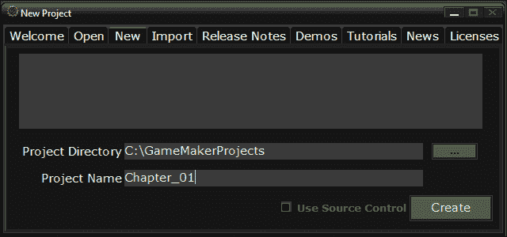

GameMaker: Studio 已经准备就绪，让我们开始一个项目吧！

1.  在**新项目**窗口中，选择**新**选项卡。它应该看起来像前面的屏幕截图。

1.  GameMaker: Studio 通过为每个资源创建文件夹以及项目文件来管理项目。为此，您需要指定游戏文件存储的目录。将**项目名称**字段设置为`Chapter_01`，然后单击**创建**。

# 我们第一次看到 Studio

现在我们已经安装并运行了软件，让我们来看看界面。GameMaker: Studio 的基本布局可以分为四个组件：菜单、工具栏、资源树和工作区。我们将在本书中探索这些组件，所以不要期望对每个项目进行详细分解。这不仅会让阅读变得枯燥无味，还会延迟我们制作游戏。相反，让我们专注于我们现在需要知道的东西。

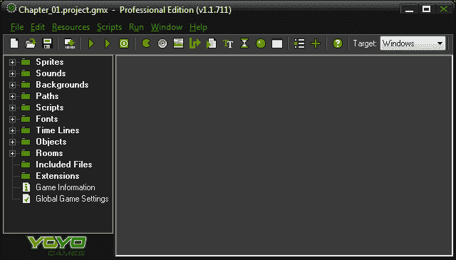

首先，与大多数复杂软件一样，每个组件都有自己的方式让用户执行最常见的任务。例如，如果要创建一个精灵，可以导航到**菜单** | **资源** | **创建精灵**，或者单击工具栏中的**创建精灵**按钮，或者在资源树中右键单击**精灵**组，或者使用*Shift* + *Ctrl* + *S*在工作区中打开**精灵编辑器**窗口。实际上，还有更多的方法可以做到这一点，但您明白了。

虽然有很多重叠的功能，但也有许多事情只能在每个特定的组件中完成。以下是我们需要知道的内容。

## 菜单

**菜单**是您将找到每个编辑器和工具所需的地方。有一些非常有用的工具，比如**在脚本中搜索**和**定义常量**，这些只能在这里找到。为什么不花点时间看看每个菜单选项，以便了解您可以使用的所有内容呢。我们会等一下。

## 工具栏

**工具栏**使用简单的图形图标来表示我们将要使用的最常见的编辑器和工具。这些按钮是创建新资产和运行游戏的最简单、最快速的方式，所以预计会经常使用这些按钮。工具栏上有一个非常重要的独特元素：**目标**下拉菜单。**目标**确定我们将编译和导出到哪种格式。将其设置为**HTML5**。

### 注意

**目标**菜单的默认设置是**Windows**，所以确保将其更改为**HTML5**。

## 资源树

资源树显示和组织了为游戏创建的所有资产。保持项目有条不紊不会影响软件的性能，但会节省我们的时间，并在长期内减少挫折感。

## 工作区

**工作区**是各种编辑器将打开的地方。运行游戏时，**编译器信息**框将出现在底部，并在运行游戏时显示正在编译的所有内容。还有一个**源控制**选项卡，如果您有一个 SVN 客户端和用于团队合作的存储库，可以使用它。

### 注意

如果您想了解更多关于源控制的信息，请查看以下 GameMaker: Studio 维基页面：[`wiki.yoyogames.com/index.php/Source_Control_and_GameMaker:Studio`](http://wiki.yoyogames.com/index.php/Source_Control_and_GameMaker:Studio)

# 探索资源编辑器

为了在 GameMaker: Studio 中创建游戏，您需要至少三种类型的资源资产：**精灵**（您所看到的）、**对象**（它的功能）和**房间**（发生的地方）。除此之外，您还可以拥有**脚本、背景、声音、字体、路径**和**时间轴**。

您可以将每个可以引入 GameMaker: Studio 的资源都有自己的属性编辑器。为了熟悉它们中的每一个，我们将构建一个非常简单的猫鼠游戏。我们将创建一个玩家角色（一只老鼠），可以在房间中移动，收集物品（奶酪），并避开敌人（一只猫）。让我们立即开始创建一些精灵。

## 使用精灵属性编辑器加载您的艺术资产

精灵是用于对象的图形表示的位图图像。这些可以是单个图像或一系列动画图像。GameMaker 有自己的图像编辑器来创建这些，但也允许导入 JPG、GIF、PNG 和 BMP 文件。

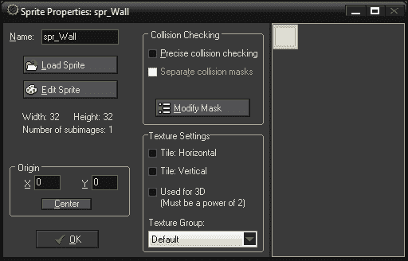

在我们的示例中，我们将首先创建两个精灵；一个用于墙，一个用于玩家角色。如果您已经下载了支持文件，我们在`Chapter_01`文件夹中提供了这些图像文件。

### 墙精灵

我们将从一个简单的精灵开始，它将代表我们游戏的墙。

1.  通过导航到**资源** | **创建精灵**来创建一个新精灵。这将在资源树中创建一个精灵，并打开**精灵属性**编辑器。

1.  将精灵命名为`spr_Wall`。

1.  单击**加载精灵**以打开精灵图像。在窗口的一侧有一个**图像信息**部分，我们可以在那里预览所选图像并选择激活几个选项。**使不透明**将从所选精灵中删除所有透明度。**删除背景**将删除图像左下角像素中找到的颜色的所有像素。**平滑边缘**将平滑图像的透明边缘，在导入动画 GIF 文件时非常有用，可以去除硬边缘。

1.  在没有选中任何选项的情况下，打开`Chapter 1/Sprites/Wall.png`，然后单击**确定**。

1.  如下截图所示，它的宽度和高度为 32 像素，有一个子图像。没有其他需要改变的地方，所以点击**确定**：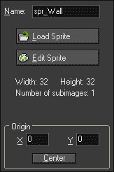

### 玩家精灵

这个游戏中的玩家将是一个鼠标，精灵由两帧动画组成。

1.  创建一个新的精灵。

1.  将精灵命名为`spr_Player`。

1.  点击**加载精灵**，选择`Chapter 1/Sprites/Player.gif`。勾选**去除背景和平滑边缘**。点击**确定**。

1.  再次，它的宽度和高度为 32 像素，但是有两个子图像，如下一截图所示。这意味着它有动画！让我们点击**显示**旁边的箭头来看看每一帧的样子。加载动画图像时这样做是有用的，以确保所有帧都按适当的顺序排列并且对齐正确。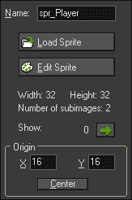

1.  在**原点**中将**X**设置为`16`，**Y**设置为`16`，或者你可以直接点击**中心**按钮。

1.  点击**确定**按钮。

恭喜！你已经创建了你的第一个精灵。在下一章中，我们将更深入地探讨艺术资源的创建，所以让我们继续到对象。

## 使用对象属性编辑器创建游戏对象

这就是 GameMaker: Studio 真正展示其实力的地方。**对象**可以被看作是容器，其中包含了我们希望游戏中的每个项目执行的属性、事件和功能。当我们将一个对象放入游戏世界时，它被称为**实例**，它将独立于该对象的所有其他实例运行。

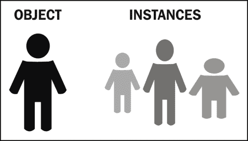

在我们继续之前，理解**对象**和**对象的实例**之间的区别是很重要的。对象是描述某物的一组规则，而实例是该某物的独特表示。一个现实世界的例子是*你*是*人*对象的一个实例。*人*是有手臂、腿、说话、睡觉等特征的东西。*你*是这些元素的独特解释。这个概念的一个例子可以在前面的图表中看到。

这很重要的原因是，根据所使用的功能，效果将被应用于该类型的所有项目或个别项目。一般来说，你不会希望射击一个敌人然后世界上所有的敌人都死掉，对吧？

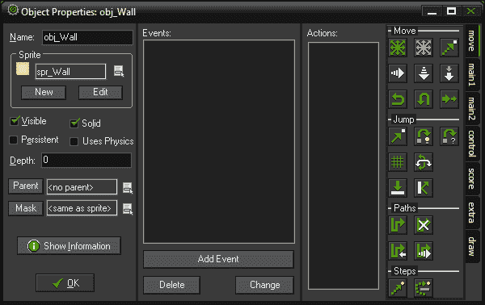

继续我们的例子，我们将创建一个墙对象和一个玩家对象。墙将是一个固定的障碍物，而玩家将有控制，使其能够在世界中移动并与墙碰撞。

### 墙对象

我们将从实体墙对象开始，我们可以用它来创建迷宫供玩家使用。

1.  通过导航到**资源** | **创建对象**来创建一个新对象。这将在资源树中创建一个新对象，并打开**对象属性**编辑器。

1.  将此对象命名为`obj_Wall`。

1.  点击**精灵**中的输入框，选择`spr_Wall`。

GameMaker 处理与实体对象的碰撞与非实体对象的碰撞方式不同。如果实体对象和非实体对象发生碰撞，GameMaker 会尝试通过将非实体对象移回其先前的位置来防止它们重叠。当然，为了正确地做到这一点，实体对象必须是静止的。因此，我们应该将实体属性添加到墙上。

1.  点击**实体**复选框，然后点击**确定**。

### 注意

**实体**属性应该只用于不移动的对象。

### 玩家对象

玩家对象将向我们介绍使用**事件**和**动作**来进行移动和碰撞等操作。

1.  创建一个新对象并命名为`obj_Player`。

1.  选择`spr_Player`作为精灵。

GameMaker 的强大之处在于其事件驱动系统。事件是游戏运行过程中发生的时刻和动作。当您向对象添加事件时，您要求该项在发生该动作时做出响应，然后应用指定的指令。

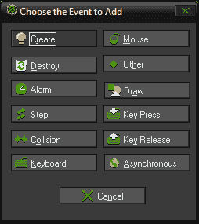

听起来相当简单，不是吗？但是当涉及到事件顺序时可能会有点混乱。GameMaker 将游戏分解为步骤（有限的时间段），每秒运行多次事件。一些事件按照预设顺序发生，比如开始步骤，它总是从步骤的最开始开始。其他事件在被调用时发生，比如创建，它会立即在对象的实例创建时运行，以检查该代码是在步骤的开始还是结束时发生。

### 注意

访问[`wiki.yoyogames.com/index.php/Order_of_events`](http://wiki.yoyogames.com/index.php/Order_of_events)了解更多关于 GameMaker: Studio 事件顺序的信息。

1.  在**事件：**区域，单击**添加事件**，然后导航到**键盘** | **左**。这个事件将在按住左箭头键的每一步中运行代码。

**事件**需要**动作**来应用它们才能发挥作用。GameMaker: Studio 使用**拖放**（**DnD**）系统，其中代表常见行为的图标可以很容易地实现。这些行为根据功能分为七个不同的选项卡。在本书的绝大部分内容中，我们将只使用在**常见**选项卡中找到的**执行脚本**图标，因为我们将编写放置在**脚本**中的代码。然而，在本章中，我们将使用 DnD 动作，以便您了解它们的作用。

1.  从**移动**选项卡中，选择并将移动固定图标拖放到左键事件的**动作**区域。

移动固定图标

1.  在**移动固定**选项框中，有一个选项，用于指定要应用此动作的对象。我们希望将其设置为**自身**，以便将其应用于玩家的实例。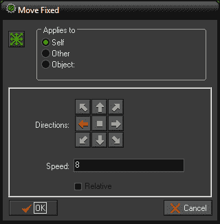

1.  单击左箭头以指示我们希望移动的方向。

1.  将**速度**字段设置为`8`。这将每步应用 8 像素的速度。

1.  确保**相对**未被选中。相对会将该值添加到当前值。

1.  单击**确定**。

1.  对于其他键盘箭头（右，上，下），重复步骤 4 到 9，使用相同的**速度**和适当的方向。

现在我们有一个对象，当按下箭头键时会在世界中移动。但是，如果我们运行这个程序，一旦开始移动，我们将无法停止。这是因为我们正在给对象应用速度。为了停止对象，我们需要给它一个速度为零。

1.  在**事件：**区域，单击**添加事件**，然后导航到**键盘** | **无键**。这是一个特殊的键盘事件，只有在没有按键时才会发生。

1.  选择并将移动固定图标拖放到**动作**区域。

1.  将方向设置为中心，将**速度**字段设置为`0`。

我们需要做的最后一件事是添加碰撞检测。在 GameMaker: Studio 中，碰撞是由两个实例组成的单个事件。每个实例都能在这个单一碰撞上执行一个事件调用，尽管通常将代码放在其中一个上更有效。在我们的情况下，将碰撞事件放在玩家身上，当它与墙碰撞时，这是有意义的，因为玩家将是执行动作的实例。墙将保持原样，什么也不做。

1.  单击**添加事件**，然后导航到**碰撞** | **obj_Wall**。

1.  将移动固定图标拖放到**动作：**区域。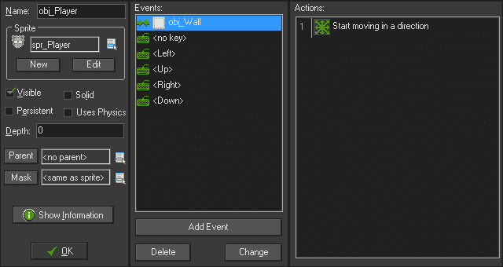

1.  将方向设置为中心，**速度**字段设置为`0`。单击**确定**。

演员已经准备好了；我们有一些可以看到并且可以做一些事情的对象。现在我们需要做的就是把它们放到一个房间里。

## 使用房间属性编辑器创建世界

房间代表我们对象实例所在的世界。您创建的大多数房间可能会被用作各种级别，但房间也可以用于：

+   前端菜单屏幕

+   非交互式场景

+   您需要的任何自包含环境！使用房间属性编辑器创建世界

我们想要布置一个包含玩家并呈现一些障碍物的世界。为此，我们将在房间的外缘放置墙对象，并在中心放置几条线。

1.  通过导航到**资源** | **创建房间**来创建一个新房间。这将在资源树中创建一个新房间，并打开**房间属性**编辑器。

1.  为了使放置变得更容易，将**Snap X**和**Snap Y**字段设置为`32`。这将创建一个每 32 像素一个捕捉点的放置网格。

1.  选择**设置**选项卡。在这里，我们可以更改基本的房间属性，大小，每秒步数和房间的名称。

1.  将房间命名为`rm_GameArea`。

1.  我们将保留房间**宽度**，**高度**和**速度**字段的默认值，如下面的截图所示：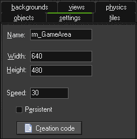

1.  选择**对象**选项卡，在**用鼠标左键添加的对象**下，选择`obj_Wall`。

1.  在房间的左上角，用鼠标左键单击放置一个墙的实例。

现在你可能会认为这将需要非常长的时间来逐个点击构建房间。别担心，有一个更简单的方法。如果你按住*Shift* + *Ctrl*，你就可以用实例来绘制世界。如果你犯了一个错误并想要删除一个实例，只需右键单击以删除一个实例，或者按住*Shift*键来取消绘制实例。如果你只想移动实例一点点，而不是整个网格单元，按住*Alt*键。

1.  按住*Shift* + *Ctrl*键和鼠标左键，绘制周边墙壁。还要放下两个凸出的部分，如下面的示例截图所示：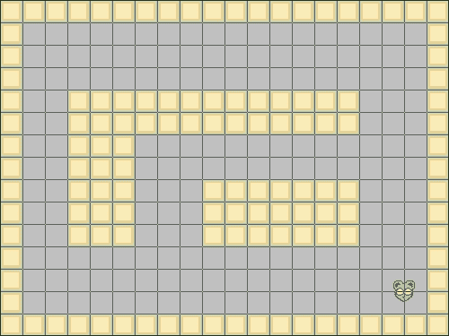

不要忘记添加玩家！

1.  在**对象**选项卡中，选择`obj_Player`。

1.  在房间的右下角放置一个`obj_Player`的单个实例。

1.  通过单击**房间属性**编辑器左上角的复选标记来关闭房间。

1.  在这一点上，我们已经拥有了在 GameMaker: Studio 中运行游戏所需的所有必要元素。在我们测试游戏之前，我们应该通过导航到**文件** | **保存**来保存我们的工作。

## 运行游戏

在创建游戏时，有三种不同类型的编译可以进行。如果游戏已经完成了 100%，您可以选择**创建应用程序**以用于目标平台。如果游戏仍在开发中，有**正常运行**，它将编译并运行游戏，就像它是一个应用程序一样，还有**调试模式运行**，它运行调试工具。

让我们不再等待。通过导航到**运行** | **运行游戏**，或者按下*F5*来运行游戏。

如果一切正常，玩家对象应该能够使用箭头键在世界中移动，但不能通过任何墙对象。然而，有一些地方不太对。玩家对象似乎在闪烁，因为它是动画的。让我们在查看脚本属性编辑器时修复这个问题。

## 使用脚本属性编辑器引入代码

GameMaker: Studio 利用自己的专有脚本语言称为**GameMaker Language**，又称为**GML**。这种语言被开发成非常适合初学者使用，并利用了一些在其他脚本语言中可能找不到的功能。例如，GML 将接受标准表达式`&&`来组合两个比较，或者替代地使用单词`and`。GameMaker: Studio 通过提供一组出色的函数、变量和常量，在创建游戏时做了大量的工作。

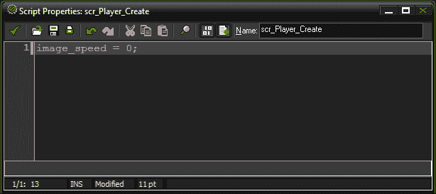

如前所述，我们希望停止玩家对象的动画。使用脚本非常容易实现这一点。

1.  通过导航到**资源** | **创建脚本**来创建一个新脚本。这将在资源树中创建一个新脚本，并打开**脚本属性**编辑器。

1.  将其命名为`scr_Player_Create`。在本书中，我们将大部分脚本命名为事件名称的结尾。在这种情况下，我们将把这段代码放入一个`创建`事件中。

1.  要停止精灵动画，我们只需要将精灵的播放速度设置为零。在第**1**行，输入以下内容：

```js
image_speed = 0;
```

1.  通过点击编辑器左上角的复选标记来关闭脚本。

为了使脚本运行，我们需要将其附加到一个对象上。

1.  重新打开`obj_Player`的**对象属性**编辑器。

1.  添加一个**创建**事件。

1.  导航到**操作** | **控制**，并选择并拖动执行脚本图标到**操作：**区域。

执行脚本图标

1.  选择`scr_Player_Create`作为要执行的脚本，然后点击**确定**。

现在我们可以运行游戏，我们会发现玩家对象不再动画。

## 使用背景属性编辑器填充场景

背景是一种特殊的艺术资源，有两种不同的类型：背景图片和瓷砖集。与精灵不同，背景从不作为艺术资源的一部分进行任何动画。**背景图片**主要用作房间的大背景，并且在需要背景移动时非常有用。**瓷砖集**是可以用来绘制背景的小艺术片段，非常适合创建大型、独特的世界，并且可以保持图形成本的计算低。

### 注意

如果需要，可以使用背景图片：

+   背景中的一个大图像

+   背景移动

### 注意

如果需要，可以使用瓷砖集：

+   只需少量的艺术资源就可以创建大型世界

+   为背景添加独特的细节

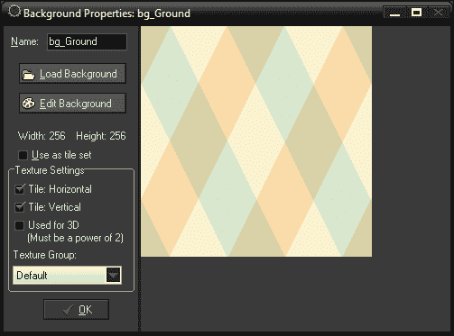

对于这个简单的例子，我们将只创建一个静态背景。我们将在下一章更深入地了解瓷砖集：

1.  通过导航到**资源** | **创建背景**来创建一个新背景。这将在资源树中创建一个新背景，并打开**背景属性**编辑器。

1.  将其命名为`bg_Ground`。

1.  点击**加载背景**，打开`Chapter 1/Backgrounds/Ground.png`。

1.  然后点击**确定**。

现在我们已经准备好艺术资源，只需要将其放置到房间中。

1.  重新打开`rm_GameArea`。

1.  点击`背景`选项卡。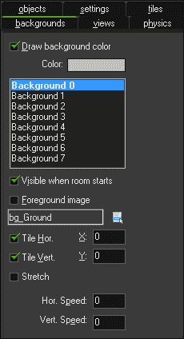

每个房间最多可以同时显示八个背景。这些背景也可以用作前景元素。如果没有激活背景，它将显示为纯色。

1.  选择**背景 0**，然后勾选**游戏开始时可见**的复选框。这必须激活才能在游戏过程中看到背景。

1.  选择`bg_Ground`作为要显示的背景。

1.  其他所有内容都可以保持默认。**水平平铺**和**垂直平铺**应该被选中，所有其他值应该设置为`0`。

1.  通过点击编辑器左上角的复选标记来关闭房间。

让我们再次运行游戏，现在我们可以看到我们有了一个背景。事情看起来确实更好了，但是缺少了一些东西。让我们给游戏加点声音。

## 用声音属性编辑器带来噪音

声音属性编辑器是您可以引入用于游戏的声音的地方。GameMaker 只允许引入 MP3 和 WAV 文件。您可以使用两种类型的声音：

+   正常声音

+   背景音乐

正常声音都是你听到的小声音效，比如枪声和脚步声。这些通常应该是 WAV 文件。背景音乐是指较长的声音，比如游戏音乐，还有一些像口语对话之类的东西。这些应该是 MP3 格式。

当 GameMaker: Studio 为 HTML5 导出游戏音频时，所有声音都将转换为 MP3 和 OGG 格式。这是因为不同的浏览器在实现 HTML5 音频标签时使用不同的音频文件格式。幸运的是，GameMaker: Studio 会自动将浏览器识别代码添加到游戏中，所以游戏知道正在使用哪些文件。

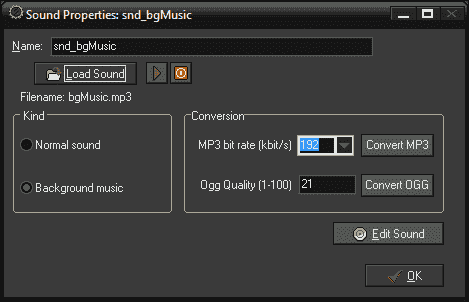

我们将为游戏创建两种声音，一些背景音乐和一个可收集物品的音效。

### 一点背景音乐

让我们为我们的游戏引入一些音乐，以帮助营造一些氛围。

1.  通过导航到**资源** | **创建声音**来创建一个新声音。这将在资源树中创建一个新声音，并打开**声音属性**编辑器。

1.  将其命名为`snd_bgMusic`。

1.  加载`Chapter 1/Sounds/bgMusic.mp3`文件。如果你想听音乐，只需点击播放按钮。听完后，点击停止按钮。

1.  在**种类**下选择**背景音乐**作为类型，然后点击**确定**。

我们希望音乐在游戏开始时立即开始。为此，我们将创建一个名为**霸主**的**数据对象**。数据对象通常不会在游戏中显示，所以我们不需要为它分配一个精灵。

### 用霸主控制游戏

我们将使用一个霸主对象来监视游戏并控制一些东西，比如音乐和胜利/失败条件。

1.  创建一个新对象，命名为`obj_Overlord`。

1.  添加一个事件，然后导航到**其他** | **游戏开始**。这是一个特殊的函数，只有在游戏开始时才会运行。

1.  导航到**操作** | **主 1**，并选择并拖动播放声音图标到**操作：**区域。

播放声音图标

1.  将**声音：**字段设置为`snd_bgMusic`，将**循环：**设置为`true`，然后点击**确定**。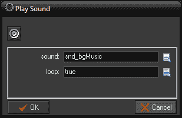

在我们测试之前，我们需要确保霸主在世界中。当你把它放在一个房间里时，它将被一个小蓝色圆圈图标代表，如下面的截图所示：

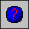

1.  重新打开`rm_GameArea`。

1.  从**对象**选项卡中选择`obj_Overlord`，并将一个实例放在房间里。

让我们运行游戏并听一下。音乐应该立即开始播放并无限循环。让我们继续创建一个可收集的物品。

### 可收集的物品

我们将创建一个玩家在游戏中可以收集的物品。当玩家与其碰撞时，声音将被播放一次。

1.  创建一个新声音，命名为`snd_Collect`。

1.  加载`Chapter 1/Sounds/Collect.wav`文件，并将其设置为**正常声音**，然后点击**确定**。

我们还没有为此创建一个对象，也没有引入一个精灵。现在是你测试记忆的机会。我们只会快速地复习一下我们需要的东西。

1.  创建一个新精灵，命名为`spr_Collect`。

1.  选择**删除背景**和**平滑边缘**，加载文件`Chapter 1/Sprites/Collect.png`并将其中心设置为原点。

1.  创建一个新对象，命名为`obj_Collect`。

1.  将`spr_Collect`分配为其**精灵**。

1.  添加一个与`obj_Player`的**碰撞事件**。

1.  导航到**操作** | **Main1**，并将播放声音图标拖放到**操作：**区域。

1.  将`声音：`字段设置为`snd_Collect`，并将**循环：**设置为`false`。

现在，当玩家与对象发生碰撞时，它将播放一次声音。这是一个良好的开始，但为什么我们不给玩家更多的奖励呢？

1.  导航到**操作** | **分数**，并将设置分数图标拖放到**操作：**区域。

设置分数图标

1.  如下截图所示，将新的**分数：**字段设置为`50`，勾选**相对**框，然后点击**确定**。这将在每次收集对象时为我们的分数增加 50 分。**相对**使得分数增加到先前的分数。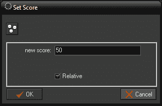

现在我们有值得收集的东西。只剩下一个问题，那就是我们只是碰到对象就得到了分数和声音。我们不能让这种情况永远持续下去！

1.  导航到**操作** | **Main1**，并将销毁实例图标拖放到**操作：**区域。此操作将从世界中移除实例。保持值不变，然后点击**确定**。

销毁实例图标

1.  我们已经完成了这个对象，如果构建正确，它应该看起来像下面的截图。点击**确定**。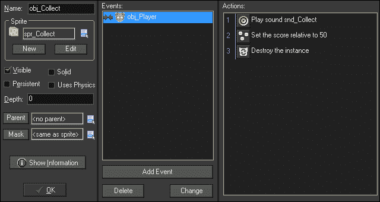

让我们在房间里放置一些这些可收集物，并运行游戏。我们应该能够在世界中移动玩家并与可收集物发生碰撞。我们应该听到声音播放并且对象消失。但是，我们的分数在哪里呢？嗯，在显示它之前，我们需要引入一些文本。

## 编写文本和字体属性编辑器

您可以导入字体以在游戏中使用它们作为文本。这些字体需要安装在您的机器上，以便在开发过程中使用。每个字体资源都设置为特定的字体类型、大小，以及是否为粗体/斜体。如果您想要稍微变化，比如一个字体大两个点，那么必须创建一个单独的字体资源。这是因为在导出时，GameMaker 将把字体转换为图像，这样就可以在用户的机器上使用而不需要预先安装字体。

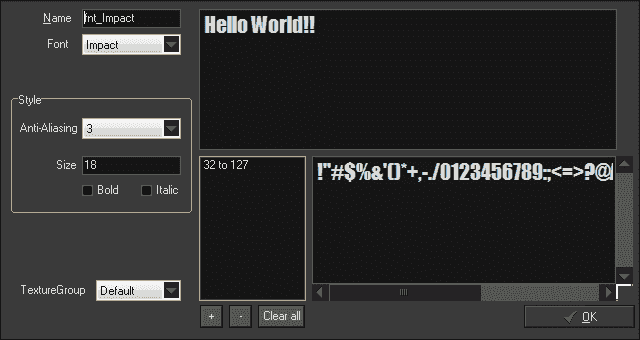

我们将创建一个用于显示游戏分数的字体。

1.  通过导航到**资源** | **创建字体**，创建一个新的字体。这将在资源树中创建一个新的字体，并打开**字体属性**编辑器。

1.  将其命名为`fnt_Impact`。

1.  从**字体**下拉菜单中选择**Impact**。这是一个默认的 Windows 字体。

1.  将**大小**设置为`16`。然后点击**确定**。

现在我们有一个可以在游戏中使用的字体。为此，我们将让 Overlord 对象在屏幕顶部绘制游戏分数。我们还将使文本为白色，并将其居中对齐。

1.  重新打开`obj_Overlord`。

1.  通过导航到**绘制** | **绘制 GUI**，添加一个绘制 GUI 事件。

### 注意

绘制事件发生在每个步骤的最后，在所有计算完成并需要在屏幕上显示之后。绘制 GUI 事件用于显示游戏中的悬浮显示，并始终呈现在所有其他游戏图形的顶部。

1.  导航到**操作** | **绘制**，并将设置颜色图标拖放到**操作：**区域。这将打开一个对话框，您可以在其中设置颜色。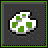

设置颜色图标

1.  我们想要将**颜色**设置为青色。在弹出的颜色调色板中，选择左起第五列底部的青色。点击**确定**。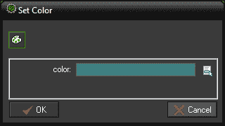

1.  导航到**动作** | **绘制**，并将设置字体图标拖放到**动作：**区域。这将打开一个带有两个参数的对话框：要使用的字体以及它应该如何对齐。

设置字体图标

1.  将**字体：**字段设置为`fnt_Impact`并将其对齐到`中心`。点击**确定**。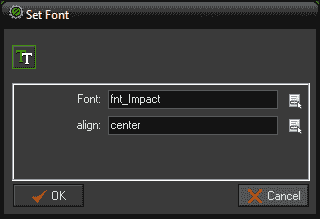

1.  最后，导航到**动作** | **得分**，并将绘制得分图标拖放到**动作：**区域。这将打开一个带有三个参数的对话框：x 和 y 坐标，以及一个可选的标题，可以放在实际得分前面。

1.  将**x：**字段设置为`320`，**y：**字段可以保持为`0`，并从**标题：**字段中删除`得分：`，使其为空，如下面的屏幕截图所示。点击**确定**。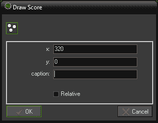

现在我们可以运行游戏，得分现在将显示在屏幕顶部的中心位置。现在，当您与可收集物品碰撞时，您应该看到得分增加。

## 使用路径属性编辑器创建复杂移动

路径是为对象创建复杂移动模式的最佳方式。路径由一系列点组成，对象可以沿着这些点移动。点之间的过渡可以是直线的，这意味着对象将精确地到达每个点，也可以是曲线的，是三个点之间的插值。路径可以是开放线或闭合循环。以下屏幕截图将在本节中用作参考图像。

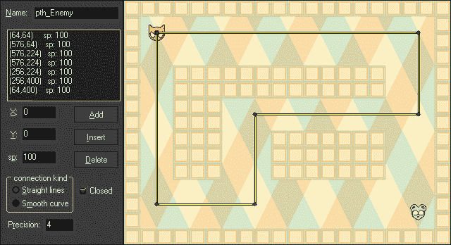

我们将创建一个简单的敌人，它将沿着房间周围的路径移动。如果玩家与敌人碰撞，玩家将被销毁。让我们从创建路径开始。

1.  通过导航到**资源** | **创建路径**来创建一个新路径。这将在资源树中创建一个新路径，并打开**路径属性**编辑器。

1.  将其命名为`pth_Enemy`。

1.  在编辑器工具栏的末尾，我们可以设置显示哪个房间。这对于按房间基础创建准确路径非常有用。将其设置为`rm_GameArea`。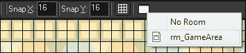

要为路径添加一个点，您可以在地图的任何位置单击左键。第一个点将由绿色方块表示，其后的所有点将是圆圈。

1.  将第一个点放在地图的`64`，`64`处。如果出现错误，您可以随时将点拖动到正确的位置，或者您可以手动设置 X 和 Y 值。

1.  在这条路径上，我们将添加另外五个点，如参考图像所示。

1.  我们将保留所有其他设置为默认值，所以点击**确定**。

路径已准备就绪，现在我们只需要创建一个敌人并将路径附加到它。这个敌人将简单地沿着路径移动，如果它与玩家碰撞，它将重新开始游戏。

1.  创建一个新精灵并命名为`spr_Enemy`。

1.  选择**删除背景**和**平滑边缘**，加载`Chapter 1/Sprites/Enemy.png`并将原点居中。

1.  创建一个新对象并命名为`obj_Enemy`。

1.  添加一个**创建**事件，导航到**动作** | **移动**，并将设置路径图标拖放到**动作：**区域。这将打开设置路径选项对话框。

设置路径图标

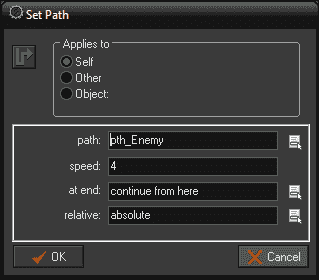

1.  将**路径：**设置为`pth_Enemy`。

1.  将**速度：**字段设置为`4`。

1.  下一个选项确定实例到达路径末端时应该发生什么。有选项可以**停止**，**从头继续**（对于开放路径），**从这里继续**（对于闭合路径），和**反向**方向。将**在末端：**设置为**从这里继续**。

1.  这里的**相对:**选项确定路径是从实例开始（相对）还是实例从路径的第一个点开始（绝对）。由于我们建立它来适应房间，所以将**相对:**设置为**绝对**。然后点击**确定**。

我们现在有一个准备好跟随路径的敌人，但它对玩家并不构成威胁。让我们在敌人上添加一个碰撞事件，并使其在接触时重新开始游戏。

1.  添加一个与`obj_Player`的**碰撞**事件，导航到**动作** | **主要 2**，并将重新开始游戏图标拖放到**动作:**区域。

重新开始游戏图标

1.  敌人现在已经完成，所以点击**确定**关闭它。

1.  在房间中的任何位置放置一个敌人的单个实例。确切的位置并不重要，因为游戏运行时它会重新定位到正确的位置。

1.  保存游戏并运行。我们应该看到敌人沿着房间周围的路径移动。如果玩家对象与其发生碰撞，游戏将重新开始。

现在游戏中有一些风险，但奖励还不够。让我们来解决这个问题，好吗？

## 使用时间轴属性编辑器生成可收集物品

时间轴是一个高级的时间跟踪系统，允许对游戏过程中发生的事情进行有限控制。时间轴由一系列时刻组成。每个时刻代表时间轴开始后的步数。

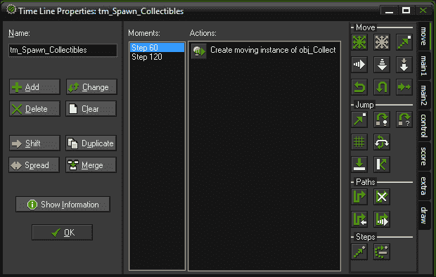

时间轴几乎可以用于任何事情，其中最常见的用途之一是生成实例。在这个游戏中，我们将使用它来生成我们的可收集物品，以便玩家有东西可以追逐。

1.  通过导航到**资源** | **创建时间轴**来创建一个新的时间轴。这将在资源树中创建一个新的时间轴，并打开**时间轴属性**编辑器。

1.  将其命名为`tm_Spawn_Collectibles`。

1.  点击**添加**按钮，并将**步数**设置为`60`。

1.  我们将通过给它们施加速度来使这些可收集物品移动。导航到**动作** | **主要 1**，并将创建移动图标拖放到**动作:**区域。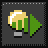

创建移动图标

1.  将对象设置为`obj_Collect`。

1.  我们希望生成发生在屏幕外，这样玩家就看不到它突然出现。我们将使这个可收集物品水平移动，所以我们将从游戏区域的左侧开始。将**x:**字段设置为`-64`。

1.  我们不希望可收集物品总是在完全相同的位置生成，所以我们要为其添加一个随机元素。我们将在屏幕顶部和底部之间的随机垂直位置创建实例。将**y:**字段设置为`random(394) + 48`。

1.  给它一个**速度**为`4`，并将**方向:**字段设置为`0`。它应该看起来像下面的截图。点击**确定**。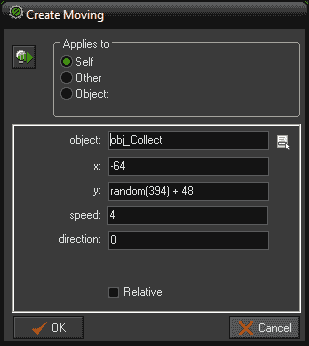

1.  在`120`处添加另一个**时刻**，并重复上述步骤，不过这次是垂直的。为此，**x:**字段应设置为`random(546) + 48`，**y:**字段应为`-64`，**速度:**字段应为`4`，**方向:**字段应为`270`。

我们现在有一个时间轴，每两秒钟就会生成一个新的可移动的可收集物品。但是，我们需要将其附加到一个对象上，所以让我们将其应用到`obj_Overlord`上。

1.  重新打开`obj_Overlord`。

1.  在已经存在的**游戏开始**事件中，通过导航到**动作** | **主要 2**，将设置时间轴图标拖放到**动作:**区域。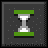

设置时间轴图标

1.  将**时间轴:**字段设置为`tm_Spawn_Collectibles`。

1.  将**位置:**保留为`0`；这将从开始位置开始。

1.  将**开始:**设置为**立即开始**。

1.  我们希望它无限重复，所以将**循环：**设置为`Loop`。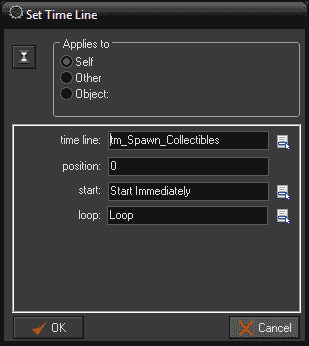

就是这样！运行游戏，您应该看到可收集物品在两秒后开始生成，并将继续无限地生成。正如您从下一张截图中看到的，我们的游戏已经完成，但还有一个组件我们需要看一看。

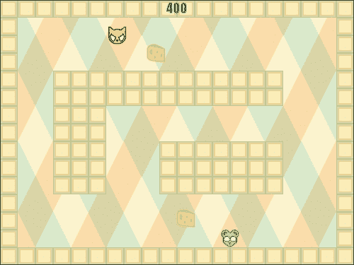

# 调试游戏的工具

无论您在脚本编写和制作游戏方面有多么经验，错误总是会发生。有时可能是拼写错误或缺少变量，在这种情况下，GameMaker: Studio 会捕捉到并显示代码错误对话框。其他时候，游戏可能不会按照您的期望进行，比如在不应该通过墙壁时却通过了。在这种情况下，代码在技术上没有问题，只是构造不当。追踪这些错误可能非常乏味，如果没有调试工具，可能会是不可能的。为了使用这些工具，游戏必须在调试模式下运行，您可以通过单击工具栏中的**运行调试模式**按钮或转到菜单并导航到**运行** | **运行调试模式**来访问。

在调试模式下，我们可以利用**调试消息**来帮助我们理解游戏中发生的情况。这些消息只能通过脚本编写时使用`show_debug_message()`函数实现（没有拖放选项），并且每当执行该函数时，它们将出现在控制台窗口中。您可以使用这个来传递一个字符串或显示一个变量，以便您可以将结果与您期望的结果进行比较。这是您在尝试解决问题时的第一道防线。

## 使用 HTML5 调试控制台

我们应该使用的第一个控制台是 GameMaker: Studio 的 HTML5 调试控制台。当游戏以 HTML5 为目标并在调试模式下运行时，将会创建一个弹出窗口，其中包含调试输出，所有调试消息都将显示在其中，以及实例列表和它们的基本数据信息。让我们测试一下这个控制台！

1.  我们将从在玩家创建时添加传统的`Hello World`调试消息开始。重新打开`scr_Player_Create`并在脚本的末尾添加以下代码：

```js
myText = "Hello World";
show_debug_message(myText);
```

### 提示

**下载示例代码**

您可以从您在[`www.packtpub.com`](http://www.packtpub.com)购买的所有 Packt 图书的帐户中下载示例代码文件。如果您在其他地方购买了本书，您可以访问[`www.packtpub.com/support`](http://www.packtpub.com/support)并注册以直接通过电子邮件接收文件。

我们首先创建一个变量来保存字符串。虽然我们可以直接通过`show_debug_message`函数传递字符串而不使用变量，但我们将在以后的调试测试中使用这个变量。

1.  由于此脚本已经附加到我们的玩家创建事件，我们可以直接运行游戏。单击运行调试模式图标。

1.  当游戏在浏览器中启动时，将会弹出一个带有**调试控制台**的第二个窗口，如下一张截图所示。如果您没有看到此窗口，请检查浏览器是否允许弹出窗口。滚动到**调试输出**列的底部。在这里，您应该看到调试消息`Hello World`。这表明我们的代码已成功执行。如果我们没有如预期看到它，那么我们就会知道游戏出了问题的地方。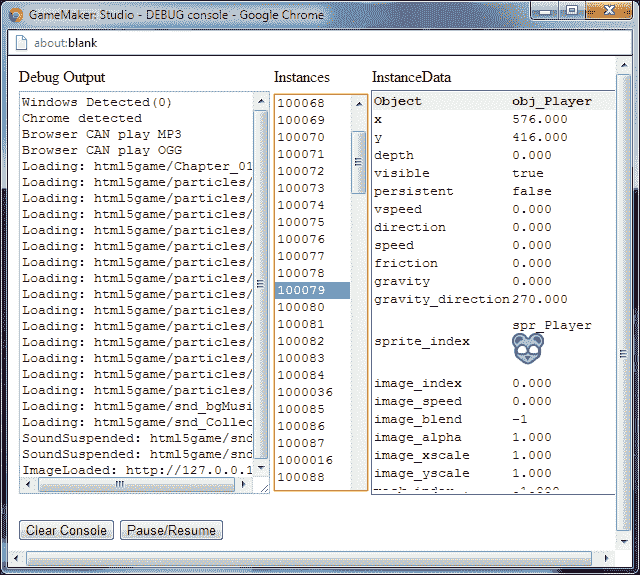

1.  我们还可以看到游戏中每个实例的所有属性，包括它们的实例编号，当前在房间中的位置，它正在显示的精灵等。单击**实例**列中的任何一个数字，然后查看**实例数据**列中的属性。

1.  点击**暂停/恢复**按钮。这样我们就可以暂停游戏，如果你有很多调试消息涌入控制台，并且想要花时间看看发生了什么，这是很有用的。

1.  最后，我们可以点击**清除控制台**按钮，从**调试输出**列中删除所有内容。

恭喜！现在你可以开始调试你的脚本了。虽然在游戏开发过程中你会经常使用`show_debug_message`，但是保持活跃消息的数量最少是很重要的。有太多调试消息发生，以至于你看不到发生了什么是没有意义的！

## 使用 Windows 版本调试器

虽然你可以通过调试消息解决大部分问题，但有时你需要更详细的了解游戏中发生了什么。GameMaker: Studio 有一个更高级的调试器，只有在游戏被定位为 Windows 版本时才会运行。如果我们不至少粗略地看一下这个精彩的工具，那就不够意思了。

1.  将**目标**更改为`Windows`，并以调试模式运行游戏。游戏打开时，**GameMaker 调试器**将显示在一个单独的窗口中，如下图所示：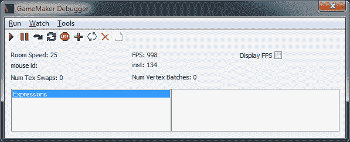

一些基本信息会立即显示出来，比如它的表现如何，通过查看**房间速度：**（每秒步数）和每秒帧数（**FPS：**）。如果你把鼠标光标移到游戏中的实例上，你会注意到**鼠标 id：**会改变。这个 ID 是该特定实例的唯一标识符，非常方便。

**GameMaker 调试器**窗口有更多选项可用于调试游戏。**运行**菜单不仅允许我们暂停游戏，还可以一步一步地向前走。**监视**菜单允许您跟踪特定表达式，比如函数调用或属性。**工具**菜单不仅可以访问调试消息，还可以显示所有全局变量、每个实例的变量，以及当前存在的所有实例的列表。让我们看看这个控制台中实例有什么信息。

1.  导航到**工具** | **显示实例**。这将打开一个窗口，显示游戏中的所有实例。

1.  滚动列表，直到找到`obj_Player`。双击它，这样我们就可以看到它的所有属性。就像 HTML5 调试控制台一样，我们可以看到它在世界上的位置以及它有哪个精灵（通过精灵索引号）。然而，如果你滚动列表，还有许多其他属性。事实上，如果我们看列表底部，我们可以看到`myText`变量。太棒了！

## 查看 JavaScript 代码

我们要看的最后一件事是编译后的 JavaScript 代码。所有现代浏览器，比如 Mozilla Firefox、Microsoft Internet Explorer 9.0 和 Google Chrome 都带有内置的调试控制台，允许任何人查看任何网站的源代码，甚至影响本地屏幕上显示的内容。没错。每个人都可以看到游戏的代码。虽然这可能吓到你，但不用担心！当 GameMaker: Studio 导出游戏或正常运行时，它会对代码进行混淆，使其非常难以解读。另一方面，在调试模式下运行时，除了引擎本身，它不会进行任何混淆。

让我们快速看一下这段代码是什么样子的。我们将从调试版本开始，这样我们就可以看到没有混淆时它是什么样子的。在这个例子中，我们将使用 Chrome，因为它有最强大的调试控制台。

1.  将**目标**平台设置为`HTML5`，以调试模式运行游戏。

1.  在游戏下方的浏览器窗口中，右键单击并选择**检查元素**。这将为 Chrome 打开**开发者工具**。

1.  选择**源代码**选项卡，在左上角点击名为**显示导航器**的小图标。

1.  在导航器中有一个目录树。打开文件夹，直到找到`html5`文件夹。在这个文件夹里是游戏。点击游戏，我们应该看到所有的代码，就像下一个屏幕截图中所看到的那样。如果我们浏览代码，我们可以清楚地看到我们创建的脚本，对象的属性等。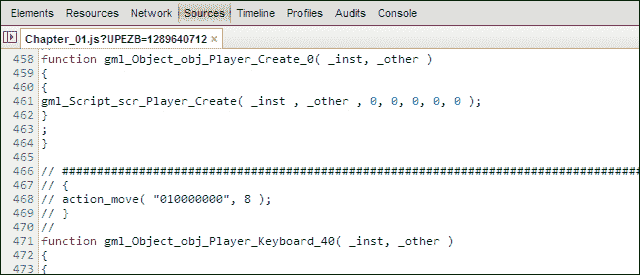

1.  现在让我们看看混淆版本。关闭浏览器标签，然后以正常模式运行游戏。重复相同的过程并查看代码。它应该看起来像下一个屏幕截图。我们仍然可以读取一些片段，但其中没有任何意义。您可以相当确信，很少有人会想要干预这个。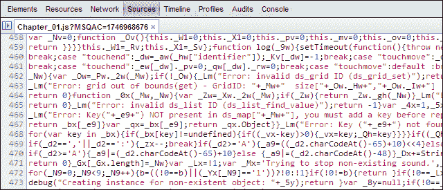

# 摘要

嗯，就是这样。在本书的第一章中，您已经制作了自己的第一个 HTML5 游戏。这样做，您有机会探索 GameMaker: Studio 界面并熟悉它。您还创建并实现了所有类型的资源，同时利用了各种资源编辑器。希望您已经意识到，这款软件让您轻松地为网络制作游戏。凭借您已经获得的知识，您可以开始制作更高级的游戏。例如，为什么不添加射击，因为您知道如何使用按键事件，使对象移动，并在碰撞时执行操作？

在下一章中，我们将深入研究资产创建。游戏的好坏取决于它的外观和声音。我们将学习如何创建动画角色，构建一个瓷砖集来装饰一个房间，并使用音频来增加氛围。让我们继续前进，因为事情即将变得更加令人兴奋！
