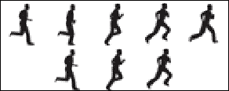

# 第二章：AAA 游戏：艺术和音频

现在我们已经熟悉了界面导航，并建立了一个简单的游戏，我们可以开始创建更复杂的项目。在本章中，我们将专注于创建艺术作品，添加动画，并实现音频音景。这三个元素对于游戏的创建非常重要，因为它们每个都有助于玩家理解发生了什么，并使体验更加沉浸。我们构建游戏的方式可能会受到我们使用的资产类型以及它们的实施方式的极大影响。我们将首先看看如何导入外部图像，然后进行一些实际示例，如如何创建一个瓷砖集并制作一个动画角色。然后我们将转向音频文件，以及如何为游戏添加环境氛围。最后，我们将简要讨论如何使游戏看起来更专业。让我们开始吧！

# 制造艺术资源

在创建游戏时，大多数艺术资源都将在外部程序中创建，并且需要导入。GameMaker: Studio 确实有一个内置的图像编辑器，我们稍后会进行调查，但其功能相当有限。它非常适合创建简单的艺术作品，但还有许多其他工具可以为我们提供更高级的复杂艺术创作技术。

有许多受欢迎的软件选项供您考虑。最全面的选择和最昂贵的选择是 Adobe Photoshop，这是大多数专业艺术家的首选，可以在[`www.photoshop.com/`](http://www.photoshop.com/)购买。一个具有许多类似功能的免费替代品是 GIMP，可在[`www.gimp.org/`](http://www.gimp.org/)下载。这两个软件包都提供了一套高级工具，用于创建图像。还有许多其他更简单的工具可供选择，例如 Pickle [`www.pickleeditor.com/`](http://www.pickleeditor.com/)，Spriter [`www.brashmonkey.com/`](http://www.brashmonkey.com/)和 PyxelEdit [`pyxeledit.com/`](http://pyxeledit.com/)，所有这些工具都是免费的，值得一试。

如果您只想跳过艺术创作，而更喜欢一些预制的作品，有很多地方可以下载精灵。最受欢迎的精灵网站之一是 Spriters Resource [`spriters-resource.com/`](http://spriters-resource.com/)。他们拥有您能想象到的各种类型游戏的资源。您还可以查看 GameMaker 论坛[`gmc.yoyogames.com/`](http://gmc.yoyogames.com/)。在这里，您会找到许多愿意制作或分享他们的艺术资源的活跃人士。

## 了解图像文件格式

GameMaker: Studio 能够导入四种图像类型：BMP、GIF、JPG 和 PNG。每种格式都有其独特的功能和缺点，这将决定它们应该如何使用。BMP 格式是如今最不常用的格式，因为数据未经压缩。未经压缩的图像通常被认为效率低下，因为它们的文件大小很大。GIF 是唯一可以制作动画的格式，但限于 256 种颜色和单一透明级别。这非常适合经典的 8 位风格艺术，其中所有内容都有硬边缘。JPG 图像由于没有任何透明度和其有损压缩格式，具有最小的文件大小。这是背景和不透明精灵的不错选择。PNG 图像格式最有用，因为它们比 BMP 更有效，具有 1600 万种颜色和完全透明度，并且这是 GameMaker: Studio 在编译游戏时输出为纹理页的格式。

在本书中，我们将只使用两种图像格式，GIF 和 PNG。我们将使用 GIF 图像来制作所有动画，因为这是导入动画的最简单方式。与上一章一样，如果我们加载一个动画 GIF 图像，每一帧动画都将在**精灵属性编辑器**中分开。不幸的是，这意味着我们在角色的艺术风格上受到了限制，由于单一的透明度水平，我们的角色边缘会有硬边。如果我们想要更平滑、更清晰的外观，我们需要使用 PNG 图像来进行反锯齿处理。试图在 GIF 图像中获得平滑的边缘是艺术家可能犯的最常见的错误之一。正如我们将在下面的截图中看到的，左侧是一个具有清晰硬边的 8 位艺术风格的 GIF 图像，右侧是一个具有平滑、反锯齿边缘的 PNG 图像。

在中间，我们有相同的平滑精灵，使用 PNG 保存，但保存为 GIF。注意曾经略微透明的边缘像素现在是一个实心的白色轮廓。


# 导入精灵表

尽管本书中的所有动画都将使用 GIF 图像出于便利性的考虑，但如果我们不介绍如何导入**精灵表**，那就有失职了。精灵表通常是一个 PNG 文件，其中包含一个对象（如角色）的所有动画帧，均匀地放置在一个网格中。然后我们可以快速地在 GameMaker 中剪切出每一帧动画，以构建我们需要的单个精灵。让我们试一试！

1.  让我们从打开一个名为`Chapter_02`的**新项目**开始。

1.  创建一个新的精灵，并命名为`spr_PlayerSpriteSheet`。

1.  点击**编辑精灵**按钮打开**精灵编辑器**。

1.  在**文件**下，选择**从条带创建**，然后在**图像信息**部分中不选择任何内容，打开`Chapter 2/Sprites/PlayerSpriteSheet.png`。这将打开**加载条带图像**编辑器。

1.  我们刚刚加载的精灵表包含了一个六帧的奔跑循环。由于我们需要所有的帧，所以我们需要将**图像数量**设置为`6`。

1.  精灵表的布局有两行三个图像。将**每行图像数**设置为`3`。

1.  由于每个图像的大小为 64 x 64 像素，我们需要将**图像宽度**和**图像高度**设置为`64`。对于如此小的精灵表来说，偏移和分离的其他选项并不是必要的，但如果我们有这个角色的完整动画集，它们将会很有用。设置应该如下图所示：

1.  点击**确定**。我们现在有一个带有平滑边缘的动画精灵！

1.  我们已经完成了这个精灵。现在点击**精灵编辑器**和**精灵属性**编辑器的复选标记，然后点击**确定**按钮关闭它。

# 介绍图像编辑器

使用 GameMaker: Studio 开发的一个重要好处是它内置了一个用于创建精灵和背景的**图像编辑器**。这个编辑器可能看起来非常基础，但有很多优秀的可用工具。有各种不同的绘图工具，包括标准工具，如铅笔、橡皮擦和填充。编辑器中一个非常有用且独特的功能是能够用鼠标的两个按钮进行绘画。**颜色** | **左**和**颜色** | **右**颜色选项，如下图所示，表示根据使用左键或右键，将使用的颜色。我们还可以通过**变换**和**图像**菜单调整各种东西。**变换**菜单包含影响图像中像素大小和位置的能力。**图像**菜单包含图像修改工具，如改变颜色、模糊图像和添加发光效果。

与其谈论图像编辑器，不如在其中构建一些艺术资源。我们将首先创建一个图块集，然后转移到一个动画角色，这两者都可以在第四章中稍后使用，*冒险开始*。如果您更愿意在外部编辑器中工作，也可以跟着做，因为创建这些资源的一般理论是普遍适用的。


## 使用图块集创建背景

**图块集**是一种特殊类型的背景资源，允许游戏在不使用大量计算机内存的情况下在环境中拥有巨大的变化。保持文件大小和内存使用量小是非常重要的，特别是对于 HTML5 游戏。浏览器需要下载所有这些资源，因为我们不知道用户有多强大的计算机。

创建自然外观的图块集主要是为了欺骗眼睛。我们的眼睛非常擅长发现模式；当有重复时，它们会识别形状、对比和颜色的差异。知道我们的大脑是这样硬编码的，让我们能够利用这一点。我们可以通过使用奇怪的形状、最小化对比和在艺术作品中使用类似的颜色来打破模式。

我们将为游戏中最常见的表面之一创建一个图块集：石头地板。现在这可能看起来很容易，但惊人的是这经常被错误地完成。


1.  创建一个新的背景资源，并命名为`bg_StoneFloor`。

1.  由于我们希望这是一个图块集，请确保勾选**用作图块集**的复选框。这将显示**图块属性**，允许您设置图块的宽度和高度、偏移和间隔。

1.  将**图块宽度**和**图块高度**设置为`32`，如前面的图像所示。我们现在准备开始构建图块。

1.  点击**编辑背景**按钮。这将打开**图像编辑器**。

1.  我们将从创建所有其他图块将基于的主图块开始。在**图像编辑器**中，选择**文件** | **新建**，并将**宽度**和**高度**设置为`32`。

1.  选择**填充区域**工具，并将浅灰色应用到整个精灵上。这是基础，我们稍后会更改颜色。

在开始绘制一堆石头之前，我们需要首先考虑潜在的问题和解决方案。人们在创建平铺图块时最常见的问题是他们试图直接创建最终产品，而不是逐步构建。这包括在确保可以正确平铺之前选择颜色和添加细节。

在查看平铺纹理时，我们需要确保尽量打破网格。整个世界将基于小的 32 x 32 像素图块，但我们不希望观察者注意到这一点。因此，我们的目标是使用不规则的形状，并尽量避免水平和垂直对齐。


1.  选择**在图像上绘制**工具和深灰色。

1.  为了让生活变得更容易，我们可以放大图像。这可以通过放大镜或中间鼠标滚动按钮来完成。

1.  绘制小石头的轮廓，但记得保持一定的大小和形状的变化。另外，不要忘记将对角线线条保持在一个像素的宽度上！一旦你做到了这一点，它应该看起来类似于前面的示例截图。

1.  从**图像编辑器**菜单中，选择**转换** | **移动**。这将打开**移动图像**对话框，允许您水平或垂直移动像素。

1.  将**水平**和**垂直**值设置为`16`，并勾选**水平包裹**和**垂直包裹**框。这将使图像向下和向右移动 16 像素（瓷砖大小的一半），并将剩余的像素包裹起来，如前面的屏幕截图所示。

1.  点击**确定**。

通过移动像素，我们现在可以看到边缘是如何铺砌的。你可能会注意到它并不完美。在下面的示例截图中，你可以看到有几条线只是结束了，没有形成完整的石头。你可能也不喜欢某些石头的大小，或者看到一些线条太粗。目标是修复这些问题，并重复这个过程，直到一切都符合你的要求。


1.  在必要的地方画线并覆盖旧线，以修复任何看起来不正确的石头。

1.  使用相同的设置重新应用**变换** | **移动**工具。如果看到错误，修复它们并重复，直到你满意。

一旦我们对瓷砖图案和沿边缘正确重复感到满意，我们就可以开始添加颜色了。一般来说，最好不要使用完全脱饱和的灰色调来代表石头，因为大多数石头都有一些颜色。在选择颜色时，目标是避免只使用单一颜色和明暗变化，而是选择一系列相似的颜色。为此，首先选择一个中性的基础颜色，比如米色。然后，每种额外的颜色都应该在**色调**、**饱和度**和**亮度**上略有变化。例如，第二种颜色可以比第一个米色略微偏红，略微不那么鲜艳，比第一个米色暗一些。

1.  选择浅褐色，并使用**填充区域**工具填充一些石头。

1.  使用其他褐色变种重复这个过程，直到没有灰色的石头剩下。

1.  填满所有的石头后，我们需要确保它仍然可以铺砌。使用**变换** | **移动** 来查看颜色是否正确对齐。如果有任何问题（如前面的截图所示），只需调整颜色，直到你再次满意。

基础瓷砖的最后一步是将深灰色线条改为深褐色。现在你可能会认为这将是非常乏味的，但幸运的是，图像编辑器有一个工具可以让这变得容易。

1.  用鼠标左键选择深褐色。这种颜色应该出现在**颜色** | **左**下方。

1.  选择**更改所有相同颜色的像素**工具，如前所示，然后在一个深灰色像素上单击左键。现在石头的轮廓应该都是深褐色，就像我们将在下面的截图中看到的那样：

干得好！现在我们有了一个基础瓷砖，可以用来制作其他所有瓷砖。下一步是添加边框瓷砖，以便有一个用于分隔不同材料的边缘。如果我们要有一个正方形房间，我们将需要总共九块瓷砖：基础瓷砖和代表边缘和角落的八块瓷砖。让我们给我们的画布增加一些空间，并用我们的瓷砖填满它。

1.  选择**变换** | **调整画布**。

1.  将**新尺寸** | **宽度**和**新尺寸** | **高度**增加`300`％或`96`像素。然后在**位置**下点击中心方块，使画布在我们创建的瓷砖周围扩展。设置如下屏幕截图所示。

1.  你需要确保一切都正确对齐，所以打开网格。选择**视图** | **切换网格** 或点击**切换网格**图标。

1.  此时您可能看不到任何网格。这是因为默认网格设置为 1 x 1 像素。选择**视图** | **网格选项**打开**网格设置**。将**水平大小**和**垂直大小**更改为`32`，并选中**对齐到网格**。如果需要，可以随意更改**颜色**，就像我们在之前的屏幕截图中所做的那样。然后点击**确定**。

1.  使用**选择区域**工具，拖动以选择整个基础瓷砖。

1.  **复制**（*Ctrl* + *C*）和**粘贴**（*Ctrl* + *V*）瓷砖，然后将其拖放到一个可用的空间中。重复此步骤，直到所有九个位置都有一个基础瓷砖，就像以下的屏幕截图中所示：

1.  返回到**视图** | **网格选项**，关闭**对齐到网格**。否则，您将在尝试绘制边框时感到非常沮丧！使用瓷砖集创建背景

1.  我们希望边框厚度为八个像素。使用与石头相同的颜色，使用**绘制线条**工具在瓷砖集的外围创建一个边框，就像之前看到的那样。

太棒了！我们现在有了一个基本的瓷砖集，让我们来测试一下。

1.  如果您还没有一个，创建一个新房间。

1.  在**房间属性**编辑器中，选择**瓷砖**选项卡。

1.  如果尚未选择，请将背景图像设置为`bg_StoneFloor`。

1.  要选择一个瓷砖，只需在预览区域左键单击要使用的瓷砖，如前面的屏幕截图所示。

可以有多个层的瓷砖，这在您想要放置奇形怪状的瓷砖（树木、路标）时非常有用，而无需为每种表面类型（石地板、草地）创建新的瓷砖。它还可用于编译多个瓷砖以创建更自然的表面，例如在石地板上放置一个泥土瓷砖组。

1.  我们将保持简单，所以让我们将**当前瓷砖图层**保留在`1000000`。

1.  在房间中，使用左键单击放置单个瓷砖，或按住*Shift*在房间中绘制瓷砖。尝试布置瓷砖，就好像有多个带走廊的房间，就像以下屏幕截图一样。

看起来相当不错，但有一些明显的问题，特别是内角没有边框。您可能还会觉得在这么大的区域里，瓷砖重复得有点太多了。由于我们将为第一个问题创建更多的瓷砖，我们也可以为第二个问题添加一些！

1.  如果尚未打开，请重新打开`bg_StoneFloor`并选择**变换** | **调整画布大小**。

1.  将大小增加`133`%，或者到`128`像素。在**位置**下点击左上角箭头，然后点击**确定**。现在它应该看起来像以下的屏幕截图。

1.  选择**视图** | **切换网格**，这样我们就可以看到网格。我们需要复制原始的基础瓷砖，可以在第二行和第二列找到。

1.  使用**选择区域**工具，选择原始基础瓷砖的像素。

1.  将此瓷砖复制并粘贴到图像外边缘的每个空单元格中。

1.  我们需要创建四个角瓷砖来修复我们的房间布局。为此，我们将使用刚刚放置的右侧边缘的四个瓷砖。使用**在图像上绘制**工具绘制角落的修饰，并对所有四个角瓷砖重复此操作。

我们还有三个沿底部的瓷砖，我们将用作基础瓷砖的替代品。只要不影响外边缘周围的一个像素边框，我们可以随意更改内部，它仍然可以正确平铺。

1.  更改内部每个剩余瓷砖的一些石头的形状并交替颜色。如下截图所示，平铺集现在完成了！使用平铺集创建背景

1.  最后，回到房间，根据需要放置角落瓷砖，并铺设备选瓷砖的随机变化。

正如您所看到的，使用一个小小的 128 x 128 纹理，我们可以轻松填满一个大区域，同时提供随机性的错觉。为了增加更多变化，我们可以轻松地创建调色板交换版本，从而可以调整色调和饱和度。因此，我们可以有一个蓝灰色的平铺集。通过更多的练习，我们可以开始添加诸如阴影之类的细节，以增加世界的透视。对于您未来的平铺集，只需记住使用非均匀形状，最小化对比度，并仅轻微变化颜色。更重要的是，始终确保基本平铺正确重复，然后再构建边缘和备选！

# 动画和创建精灵

动画精灵是一系列静态图像，播放时看起来有动作。它让玩家知道他们正在奔跑，当他们用剑攻击时，以及按钮是可点击的。好的游戏在所有互动元素上都有动画，通常还有许多背景元素上也有动画，以至于您可能甚至都没有注意到。正是诸如动画之类的微小细节真正为游戏注入了生命。

## 行动的错觉

创建动画需要时间和敏锐的眼光，但基本的动画，甚至是角色的动画，每个人都可以做到。有一些重要的规则可以让动画变得更容易。首先，它关乎动作的外观，而不是动作的准确性。如下截图所示，第一个挥剑动画在技术上是准确的；剑会在每个位置。然而，第二个集会看起来更自然，因为它包括了人们在挥剑时所期望看到的模糊效果。


## 最大化精灵空间

第二条规则是最大化精灵空间。大多数游戏使用基于框的碰撞而不是像素完美的碰撞。因此，您希望尽可能多地利用精灵可用于所需动画的空间。通常开发人员会浪费很多空间，因为他们在考虑现实世界而不是游戏世界。例如，一个常见的问题可以在跳跃动画中看到。在下面的截图中，第一个跳跃动画中的角色从地面起跳，跳到空中，落下并着陆。第二个跳跃动画是一样的，但所有空白空间都被移除了。这不仅更有效，而且还可以帮助防止碰撞错误，因为我们始终知道碰撞框的位置。


## 循环动画

最后一个重要规则，可能也是最重要的规则是可重复性。大多数游戏动画在某个时候都会循环，而有一个明显重复的序列对玩家来说会非常刺眼。这种可重复性问题的一个常见原因是动画太多。动画帧数越多，出现问题的可能性就越大。关键在于简单化并删除不需要的帧。在下面的截图中，您可以看到两个奔跑动画，第一个有五帧，第二个只有三帧。顶部的看起来会更流畅一些，但由于步幅的轻微差异，重复性会稍微差一些。第二个最终看起来会更好，因为它的帧数更少，步幅的差异也更小。



牢记这三条规则，让我们来制作一个简单的角色奔跑循环：

1.  创建一个新的精灵，并命名为`spr_WalkCycle`。

1.  点击**编辑精灵**；这将打开**精灵编辑器**。这个编辑器用于处理组成动画精灵的所有单个图像。

1.  在**精灵编辑器**中，选择**文件** | **新建**，这将打开一个新图像尺寸的对话框。保持为`32` x `32`，然后点击**确定**。

1.  现在你应该看到，就像之前的截图一样，在**精灵编辑器**中有一个名为**图像 0**的空图像。双击图像打开**图像编辑器**。

现在我们需要一个角色设计。在设计角色时，你需要考虑角色要做什么，他们存在的世界以及碰撞区域。在我们的情况下，角色只会行走，世界将是一个户外冒险游戏，并且会有一个大的方形碰撞框。

### 注意

如果你不想自己设计角色，我们提供了一个精灵，`Chapter_02/Sprites/WalkCycle.gif`，其中包含了动画的第一帧。

1.  我们将创建的第一帧动画应该是角色在行走循环的最大伸展，腿之间距离很远，触及精灵的底部。角色在这一帧上将处于迈步的最低点，所以确保头部距离精灵顶部至少一个像素，最好是两个像素。

在前面的截图中设计的角色是一种穿着夹克的猿类生物。穿夹克的原因是在摆动时使手臂更易读。我们可以看到这个角色相当厚，这使得大碰撞区域更加真实。最后，后腿稍微更暗，好像有一个阴影。再次强调，这是为了帮助可读性。

一旦我们对第一帧满意，我们需要继续下一个关键帧。**关键帧**是动画中发生最大变化的点。在这种情况下，当角色处于最高点时，手臂和腿交叉时就是关键帧。


1.  在**精灵编辑器**中，选择**动画** | **设置长度**，将**帧数**设置为`3`，如前面的截图所示。这将复制第一帧两次，给我们增加两帧动画。

1.  打开**图像 1**并使用**选择区域**工具将身体的上半部分提高到精灵的顶部，如下截图所示。这一帧将代表迈步的最高点，角色站在一只脚上，另一只脚越过。我们还可以选择并移动手和脚，快速将它们放到正确的位置。

1.  使用铅笔和橡皮擦工具，将手臂和腿画到适当的位置，前腿着地，后腿抬起，只有一只手臂显示。一旦你对外观满意，关闭图像。

1.  打开**图像 2**。这是第一帧的相反运动，这样改变起来相当容易。手和脚已经在正确的位置，所以我们只需要相应地重新绘制手臂和腿，如左侧截图所示。完成后关闭图像。

1.  现在我们需要复制**图像 1**并将其放在末尾，以便行走循环。选择**图像 1**并复制并粘贴帧。这将复制帧，并标记为**图像 2**。

1.  选择**图像 2**并点击**精灵编辑器**工具栏中的右箭头。这将把帧移到动画的末尾。选择并打开**图像 3**，这样我们就可以重新绘制腿，使后腿着地，前腿在空中越过。完成后关闭编辑器。

1.  要查看动画的播放情况，请在**Sprite Editor**中选中**Show Preview**复选框，并将**Speed**设置为`5`。请参阅以下截图。

就是这样！一个不错的循环行走动画，虽然有点生硬。如果我们想要稍微平滑这个动画，只需在关键帧之间添加一帧动画，然后按照刚才进行的相同步骤进行。最终应该看起来类似于以下截图：


# 制作音频

音频对于创建专业质量的游戏非常重要。不幸的是，它通常是最被忽视的元素，也是最后实施的。其中一个原因是我们可以在没有音频的情况下玩游戏，仍然享受体验。然而，游戏中良好的声音景观将使其更具沉浸感，并有助于改善用户反馈。

为了创建音频，我们需要使用外部软件，因为 GameMaker: Studio 没有内置的音频创建工具。有各种软件选择可供选择。用于创建音效和音乐的流行程序包括非常全面的**Reason**，[`www.propellerheads.se/`](http://www.propellerheads.se/)，它模拟了一台合成器、混音台和其他组件的机架。在免费方面，还有**BFXR**，[`www.bfxr.net/`](http://www.bfxr.net/)，可以让您在线创建游戏音效，还有**Sonant**，[`sonantlive.bitsnbites.eu/`](http://sonantlive.bitsnbites.eu/)，用于制作音乐。所有这些软件包都很有趣且易于使用。需要记住的一点是，音频的创建非常具有挑战性。有时最好只是下载一些免费音乐或音效，有很多网站提供免费和可购买的音频。**Freesound**，`http://www.freesound.org`，有成千上万的音频剪辑可供下载和使用。对于更经典的 8 位风格音乐和音效，还有**8-bit Collective**，`http://8bc.org/`，这是一个专门用于游戏音频的网站。

## 了解音频文件格式

如果添加音频还不够具有挑战性，HTML5 会使它变得更加困难。我们将遇到的第一个困难是 HTML5 音频标签尚未标准化。有两种文件格式竞相成为官方 HTML5 标准：MP3 和 OGG。**MP3**文件格式是最常用的格式之一，但缺点是需要许可和专利，这可能导致支付大额费用。**OGG**文件格式既是开源又不受专利保护，因此是一个可行的替代方案。除此之外，各种浏览器对文件类型有自己的偏好。例如，Internet Explorer 接受 MP3 但不接受 OGG，而 Opera 接受 OGG 但不接受 MP3。Google Chrome 和 Mozilla Firefox 则支持两种格式。GameMaker: Studio 通过在游戏导出时将所有音频转换为 MP3 和 OGG 文件格式来解决这个问题。

# 使用 GM:S 音频引擎

GameMaker: Studio 配备了两种不同的声音引擎来控制游戏中的各种音频：**GM:S 音频**和**传统声音**。这些系统彼此完全独立，您可以在游戏中使用其中一个系统。

GM:S 音频引擎是新的、更强大的声音系统，旨在通过发射器和听者实现完整的 3D 声音景观。**发射器**允许在游戏空间中定位声音发生的位置。有添加声音衰减、模拟移动的速度等功能。**听者**通过根据玩家在游戏中的位置、包括他们的方向和速度来播放声音，提供更多的控制。如果您不声明一个听者，那么声音将变得普遍。这将最终成为 GameMaker: Studio 中的主要音频引擎，但由于 HTML5 音频问题，它在所有浏览器中都无法正常工作。

Legacy Sound 引擎是 GameMaker 使用的原始声音系统，正如其名称所示，这个引擎已不再得到积极开发，并且许多功能已经过时。这是一个更简单的系统，没有 3D 功能，尽管对于大多数游戏来说这将是足够的。这个引擎的一个很大的好处是音频应该在所有浏览器中都能工作。

在本书中，我们将一直使用 Legacy Sound 引擎以确保最大的功能，但我们需要知道如何使用 GM:S 音频引擎以备将来使用。让我们通过创建一个非常简单的定位声音演示来测试这些功能。我们将在房间中创建一个对象，并使其播放一个只有当鼠标接近位置时才能听到的声音。


1.  要选择使用哪个系统，请单击**资源** | **更改全局游戏设置**。在**常规选项卡**中，有一个**使用新音频引擎**复选框；确保您选中它。如果选中，它将使用 GM:S 音频引擎；如果没有，则使用 Legacy Sound。

1.  创建一个新声音并命名为`snd_Effect`。

1.  加载`Chapter 2/Sounds/Effect.wav`。确保**类型**设置为**普通声音**。

1.  创建一个新对象并命名为`obj_Sound`。

1.  创建一个新脚本并命名为`scr_Sound_Create`。首先，我们需要创建一个发射器并将其捕获在一个变量中：

```js
sem = audio_emitter_create();
```

1.  接下来，我们将发射器定位到我们对象的位置。此函数的参数是：要应用此函数的发射器和 X/Y/Z 坐标。我们将使用对象的 X 和 Y，但由于这是一个 2D 示例，我们将 Z 设置为 0：

```js
audio_emitter_position(sem, x, y, 0);
```

1.  我们还希望在发射器上有一个**衰减**，使得随着听者的接近声音变得更大。我们拥有的参数是：发射器、声音在一半音量时的距离、总的衰减距离和衰减因子：

```js
audio_emitter_falloff(sem, 96, 320, 1);
```

1.  发射器已经设置好了；现在让我们在发射器上播放声音。此函数的参数是：发射器、要播放的声音、是否应该循环以及其优先级。我们希望这个**循环**，这样我们就可以听到声音：

```js
audio_play_sound_on(sem, snd_Effect, true, 1);
```

1.  当所有内容放在一起时，此代码已完成并应如下所示：

```js
sem = audio_emitter_create();
audio_emitter_position(sem, x, y, 0);
audio_emitter_falloff(sem, 96, 320, 1);
audio_play_sound_on(sem, snd_Effect, true, 1);
```

1.  添加一个**创建**事件，并将一个**控制** | **执行脚本**图标拖放到附有此脚本的操作中。

1.  现在声音将播放，但在我们有**听者**之前，它将没有方向。我们将根据鼠标的位置在每一步上移动听者的位置。创建一个新脚本并命名为`scr_Sound_Step`。

1.  我们只需要一行代码来定位听者的 X/Y/Z 坐标。X 和 Y 将设置为鼠标的 X 和 Y，再次 Z 设置为`0`。

```js
audio_listener_position(mouse_x, mouse_y, 0);
```

1.  在`obj_Sound`对象上，添加一个**Step** | **Step**事件，并将一个**Execute Script**图标拖放到附有步骤脚本的操作中。

1.  打开房间，并将`obj_Sound`对象的实例放在房间的中心。

1.  运行游戏。

你应该能够听到声音很轻，并且当你把鼠标移到屏幕中心附近时，声音应该变得更大声。如果你有环绕声或耳机，你还会注意到声音从左到右的声道移动。这只是 GM:S 音频引擎可以做的一些示例，一旦它在所有浏览器中都能正常工作，就会变得令人兴奋。

# 提高质量标准

当我们看着成千上万的游戏时，很容易辨认出顶尖游戏和底层游戏。然而，当我们在整个光谱上看所有最好的游戏时，它们之间存在着明显的差异。有些游戏非常简约，有些是逼真的，而有些是奇幻的。这些游戏可能是由少数人制作的，也可能是由一大队专家团队制作的。是什么让根本上如此不同的游戏仍然能够达到相同的质量定义呢？答案非常简单，可以用三个一般原则来概括：一致性、可读性和抛光。虽然创作高水准的艺术和音频确实需要通过多年的学习和实践获得的技能，但遵循这些几条规则将有助于使任何游戏看起来更加专业。

## 一致性

一致性听起来很明显，但实际上比人们预期的要具有挑战性得多。每个精灵、背景或其他艺术资源都需要按照相同的规则集构建。在下面的截图中，你可以看到飞机在城市背景下飞行的三种变化。第一张图片完全不一致，因为它有一个平面阴影和像素块风格的飞机，以及一个逼真的背景。下一张图片比第一张图片更一致，因为城市是平面阴影的，但缺乏像素块风格的清晰度。这是大多数人可能会停下来的地方，因为它已经足够接近了，但仍然有改进的空间。最后一张图片是最一致的，因为所有东西都有平面阴影和像素块风格。

这个过程同样可以轻松地朝相反方向进行，让飞机变得更加逼真。所需的只是选择一组选项，并将其均匀应用到所有内容上。


## 可读性

可读性就是确保向用户传达正确的信息。这可能意味着很多事情，比如确保背景与前景分离，或者确保可收集的物品不像危险物品。在下面的图片中，有两组药水；一种是毒药，另一种是治疗药水。仅仅改变颜色对玩家来说并不那么可读，而用骷髅头表示毒药，用心脏表示治疗药水则更容易让玩家理解。重要的是让玩家能够轻松理解发生了什么，以便他们能够做出反应而不是思考。


## 抛光

最后，尽管通常不太显眼，但最重要的因素是抛光。抛光关乎细节。它涵盖了很多方面，从收集物品时产生粒子效果到确保记分牌正确居中。在下面的图片中，我们有两个带有统计条的头像图标。左边的那个在功能上是正确的，看起来还不错。然而，右边的那个似乎更加抛光。统计条被移到左边，这样它们和头像图标之间就没有间隙了，头像图标也被正确地居中了。希望你能看到一些微小的调整如何能够大大提高抛光的质量。


# 总结

为游戏创建艺术和音频是一项巨大的任务，无论是在所需的时间还是要制作的资源方面。作为游戏开发者，您有责任确保一切都是连贯的和美观的，无论是创建资源还是与艺术家和音效设计师合作。在本章中，您已经开始了解在 GameMaker: Studio 中艺术和音频是如何工作的，以及好和足够好之间的区别。您了解了可接受的图像格式以及如何导入精灵表。您创建了一个将更好地利用计算机内存并允许创建大型独特世界的平铺集。您对精灵进行了动画处理，并使其正确循环。您还学会了如何控制声音以及它们的听觉方向。现在，您已经准备好开始制作真正的游戏了！

在下一章中，我们将构建我们的第二个游戏，一个横向卷轴射击游戏。我们将创建一个在屏幕上移动的玩家，建立几个射击武器的敌人，创建移动背景，并实现胜利/失败的条件。最令人兴奋的是，我们将在学习**GameMaker 语言**（**GML**）的同时完成所有这些工作。
