# 第三章：射击游戏：创建横向卷轴射击游戏

在本章中，我们将创建一个非常简单的横向卷轴射击游戏，这将使我们了解使用 GML 代码制作完整游戏的基础知识。我们将有一个玩家角色，可以在游戏区域内移动并发射武器。如果他们与敌人或敌人的子弹相撞，他们将被摧毁，并且如果他们还有剩余生命，可以重新生成。

我们将创建三种不同类型的飞越屏幕的敌人：

+   **FloatBot**：它没有武器，但很难击中，因为它在移动时上下浮动。

+   **SpaceMine**：它是最慢的敌人，如果玩家靠得太近，它会发射一圈子弹。

+   **Strafer**：它是飞行速度最快的敌人，直线飞行并直接朝玩家位置发射子弹。

我们将通过显示得分和玩家生命，滚动背景以营造移动的错觉，播放音乐并添加爆炸效果来完善游戏。最后，我们将通过实现胜利/失败条件来重新开始游戏。游戏将如下截图所示：

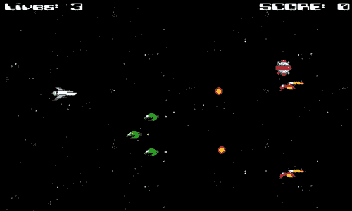

# 编码约定

为了编写有效的代码，无论编程语言如何，遵循推荐的编码约定是很重要的。这将有助于确保其他人可以阅读和理解代码尝试做什么并对其进行调试。虽然许多语言遵循类似的指南，但编程实践没有通用标准。**GameMaker 语言**（**GML**）没有官方推荐的约定集，部分原因是它被开发为学习工具，因此非常宽容。

对于本书，我们将根据常见做法和学习的便利性来定义自己的约定。

+   除了房间外，所有资产都将以简单的类型标识符和下划线开头。例如：

+   **精灵**：`spr_`

+   **对象**：`obj_`

+   **脚本**：`scr_`

+   即使可以使用执行代码 DnD 直接在事件上编写代码，所有代码都将放置在脚本中，并且命名约定将指示其附加到的对象和应用的事件。这将使以后更容易找到以进行调试。例如，放置在玩家对象的**创建**事件上的代码将具有名为`scr_Player_Create`的脚本。

+   如果脚本打算由多个对象使用，则名称应使用清晰描述其功能的名称。例如：要在物体离开屏幕后移除物体，脚本将被命名为`scr_OffScreenRemoval`。

+   变量将使用驼峰命名法编写，其中使用多个单词；第一个单词以小写字母开头，每个后续单词以大写字母开头，例如：`variableWithManyWords`。

+   布尔变量应该以问题的形式提出，例如：`canShoot`，`isPlaying`。

+   常量使用全大写字母和下划线来分隔单词，例如：`LEFT`，`MAX_GRAVITY`。

+   `if`语句中的表达式始终用括号括起来。GameMaker 不要求这样做，但这样做可以更容易阅读代码；例如：`if (x > 320)`。

# 建造玩家

我们将从构建我们的玩家对象开始。我们已经简要描述了设计，但我们还没有将设计分解为可以开始创建的内容。首先，我们应该列出每个功能及其包含的内容，以确保我们拥有所有我们需要的**变量**和**事件**。

+   箭头键将使玩家在游戏区域内移动

+   必须保持在游戏区域内

+   空格键将发射武器

+   每次按下按钮都会发射一颗子弹

+   与子弹或敌人碰撞会造成伤害

+   应该根据类型有不同的值

## 设置玩家精灵

让我们创建玩家精灵并为游戏做好准备：

1.  创建一个新项目并将其命名为`Chapter_03`。

1.  创建一个新的精灵并命名为`spr_Player`。

1.  点击**加载精灵**，加载`Chapter 3/Sprites/Player.gif`，勾选**移除背景**。这个`.art`文件有一个带有透明度和几帧动画的太空飞船。

接下来，我们要调整太空飞船的碰撞区域。默认的碰撞是一个覆盖具有像素数据的精灵整个区域的矩形。这意味着即使外观上没有接触任何东西，飞船也会受到伤害。我们希望的是有一个非常小的碰撞区域。

1.  点击**修改遮罩**。这将打开**遮罩属性**编辑器，如下截图所示：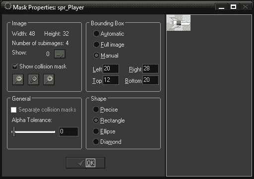

在**遮罩属性**编辑器中，我们可以控制碰撞遮罩的大小、形状和位置，即精灵中进行碰撞检测的区域。一些游戏需要像素级的碰撞检测，即根据单个像素确定碰撞。这是最精确的碰撞检测，但也需要大量计算。然而，大多数游戏可以使用简单得多的形状，比如矩形。这种方法更有效，但限制了碰撞的视觉准确性。选择哪种方法取决于游戏的设计以及为实现期望的结果需要多少控制。

1.  我们希望完全控制碰撞区域，所以将**边界框**设置为**手动**，并将**形状**保留为**矩形**。

1.  调整**边界框**参数有两种方法。我们可以输入框的角落的确切位置，或者直接在精灵图像上绘制框。用鼠标左键拖动一个小框，大致位于太空飞船的中心，如前一个截图所示。

1.  点击**确定**。

现在我们回到**精灵属性**编辑器，可以看到**碰撞检测**现在显示为**已修改**。我们要做的最后一件事是将原点移动到太空飞船枪的尖端。这样做，我们就不必担心通过代码在创建时偏移子弹。

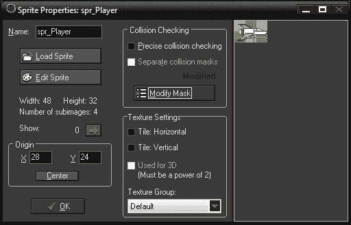

1.  将**原点**设置为**X**:`28`，**Y**:`24`，然后点击**确定**。

## 控制玩家对象

让我们创建玩家对象，并让它在世界中移动。

1.  创建一个新对象，命名为`obj_Player`。

1.  将`spr_Player`指定为其精灵。

1.  我们需要初始化一个变量，用于控制玩家移动的速度。这样以后更改数值会更容易，并且`obj_Player`中的所有脚本都可以引用它。创建一个新的脚本，命名为`scr_Player_Create`。

```js
mySpeed = 8; 
```

1.  在`obj_Player`中，添加一个**创建**事件。

1.  从**控制**中拖动一个执行脚本图标到**操作：**区域，并将`scr_Player_Create`应用到脚本选项。点击**确定**。

1.  创建一个新的脚本，命名为`scr_Player_Key_Left`。这个脚本将包含左箭头键的代码。

1.  虽然我们希望玩家能向左移动，但我们也希望防止玩家离开屏幕。将以下代码写入脚本：

```js
if ( x >= sprite_width )
{
    x -= mySpeed;
}
```

我们首先使用条件`if`语句查询玩家当前的`x`位置是否大于或等于精灵的宽度。在这种情况下，这意味着玩家的原点大于 48 像素的图像宽度。如果大于，我们将对象放在当前位置的左侧八个像素处。

我们在这里使用的移动方法不是传统意义上的移动。对象没有施加速度，而是我们将对象从一个位置瞬间传送到另一个位置。使用这种方法的好处是，如果没有按键，对象就不会移动。这在这个游戏中是必要的，因为我们不能使用**无按键**事件来射击武器。

1.  在`obj_Player`中，在**键盘**下添加一个**左**事件。

1.  从**控制**中拖动一个执行脚本图标到**操作：**区域，并将 scr`_Player_Key_Left`应用到**脚本**选项中。点击**确定**。

在继续处理所有其他键及其脚本之前，最好检查对象是否按预期工作。

1.  创建一个新的房间。

1.  在**设置**选项卡中，将名称更改为`TheGame`，**宽度**更改为`800`。使房间变宽将为玩家提供更多的操纵空间，并更容易识别敌人。

1.  在**对象**选项卡中，选择`obj_Player`并在房间中心附近放置一个单个实例，如下截屏所示：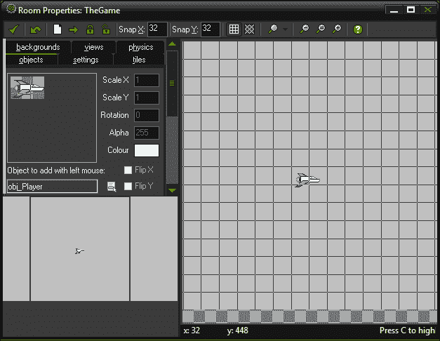

1.  运行游戏。

如果一切设置正确，玩家应该只在按下左箭头时向左移动，并且应该保持在游戏区域内。现在我们可以继续处理其他控制。

1.  创建一个新的脚本，并将其命名为`scr_Player_Key_Right`。这将用于右箭头键。

1.  脚本将类似于左侧，只是我们还需要考虑房间的宽度。编写以下代码：

```js
if (x <= room_width - sprite_width)
{
    x += mySpeed;
}
```

在这里，我们正在测试玩家当前的`x`位置是否小于房间宽度减去精灵的宽度。如果小于这个值，我们将`mySpeed`添加到当前位置。这将确保玩家在向右移动时保持在屏幕上。

1.  在`obj_Player`中，在**键盘**下添加一个**右**事件。

1.  从**控制**中拖动一个执行脚本图标到**操作：**区域，并应用`scr_Player_Key_Right`。点击**确定**。

我们现在有了水平控制，并且需要添加垂直移动。我们将介绍上键和下键脚本的代码，但现在您应该能够将它们实现到对象中。

1.  对于上箭头键，创建一个新的脚本，并将其命名为`scr_Player_Key_Up`，并编写以下代码：

```js
if (y >= sprite_height)
{
    y -= mySpeed;
}
```

这与水平代码类似，只是现在我们要考虑`y`位置和精灵的高度。

1.  对于下箭头键，创建一个新的脚本，并将其命名为`scr_Player_Key_Down`，并编写以下代码：

```js
if (y <= room_height - sprite_height)
{
    y += mySpeed;
}
```

同样，在这里，我们要考虑的是房间的高度减去精灵的高度作为我们可以向下移动的最远点。移动控制现在已经完成，对象属性应该如下截屏所示：

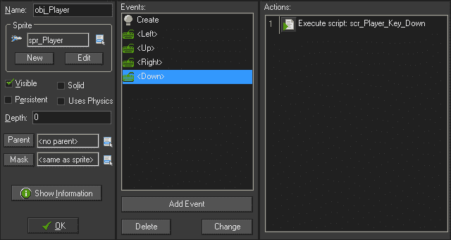

1.  运行游戏。

玩家应该能够在整个屏幕上移动，但永远不会离开屏幕。我们剩下的唯一控制是开枪的按钮。然而，在实现这一点之前，我们需要一颗子弹！

## 创建子弹

制作子弹很容易，因为它们通常一旦被发射就沿着直线移动。

1.  创建一个新的精灵，并将其命名为`spr_Bullet_Player`。

1.  点击**加载精灵**，加载`Chapter 3/Sprites /Bullet_Player.gif`。

1.  由于我们当前将玩家对象的原点设置为枪口，我们希望子弹的**原点**在前面。这将有助于使子弹看起来是从枪口射出，而无需直接编码。将值设置为**X**：`17`，**Y**：`4`。

1.  其他所有内容保持不变，然后点击**确定**。

1.  子弹发射时也应该发出声音，所以让我们加入一个声音。我们需要切换回传统声音引擎，以确保在所有浏览器中都能听到音频。导航到**资源** | **更改全局游戏设置**，在**常规**选项卡下，取消**使用新音频引擎**的复选框。

1.  创建一个新的声音，并将其命名为`snd_Bullet_Player`。

1.  点击**加载声音**，加载`Chapter 3/Sounds/Bullet_Player.wav`。

1.  确保**类型**设置为**普通声音**。然后点击**确定**。

1.  现在是时候让子弹自行移动了。创建一个新的脚本，并将其命名为`scr_Bullet_Player_Create`。

1.  我们希望子弹向右水平移动。使用以下代码很容易实现：

```js
hspeed = 16;
sound_play(snd_Bullet_01); 
```

**Hspeed**是 GameMaker: Studio 中表示对象水平速度的属性。我们需要在子弹实例化到世界中的那一刻应用这段代码。我们还会播放子弹的声音一次。

1.  创建一个新对象，命名为`obj_Bullet_Player`，并将精灵设置为`spr_Bullet_Player`。

1.  添加一个**Create**事件。**Create**事件只在创建时执行一次。

1.  应用`scr_Bullet_Player_Create`并点击**OK**。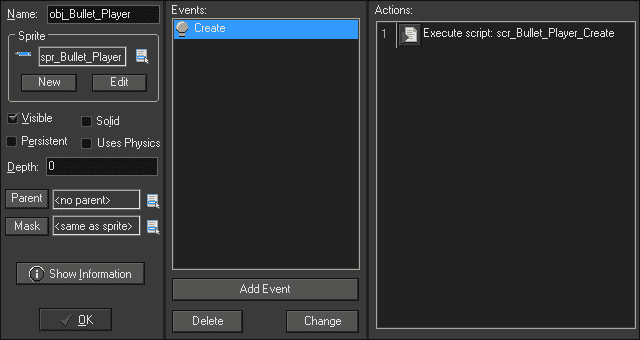

如前面的截图所示，子弹现在已经完成，准备好发射。让我们回到太空船！

## 发射子弹

子弹只有在被发射后才对敌人构成威胁。玩家飞船将处理这段代码。

1.  创建一个新的脚本，命名为`scr_Player_KeyPress_Space`。

1.  写下以下代码：

```js
instance_create(x, y, obj_Bullet_Player);
```

通过这段代码，我们只是在玩家飞船当前位置，或者更具体地说，玩家飞船精灵的原点处创建一个子弹实例。这将使子弹看起来是从飞船的枪中射出的。

1.  在`obj_Player`中，添加一个**Space**事件从**Key Press**并应用`scr_Player_KeyPress_Space`。**Key Press**事件检查指定的键是否被按下。这将运行一次，并需要释放键才能再次运行。

1.  运行游戏。

如果一切正常，我们应该能够在屏幕上四处移动并尽可能快地射击子弹，如下图所示。我们几乎可以开始添加游戏玩法了，但在这之前，我们还有一点清理工作要做。

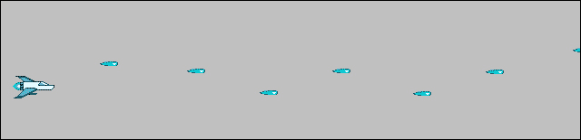

### 注意

如果一切看起来正确，但仍然无法看到预期的结果，请尝试刷新您的浏览器。偶尔，浏览器会将游戏保存在内存中，并不会立即加载更新的版本。

## 从世界中移除子弹

每次创建一个对象实例，都需要将其放入内存，并且计算机需要跟踪它。我们有所有这些子弹离开屏幕再也看不到了，但计算机看到了。这意味着随着时间的推移，计算机可能会试图观察数百万个浪费的子弹，这反过来意味着游戏会开始变慢。由于我们不希望发生这种情况，我们需要摆脱所有这些离开屏幕的子弹。

1.  创建一个新的脚本，命名为`scr_OffScreenRemoval`。这个脚本可以应用于游戏中任何离开屏幕并且我们想要摆脱的对象。

1.  要从世界中移除一个实例，写下以下代码：

```js
instance_destroy();
```

1.  在`obj_Bullet_Player`中，添加一个**Outside Room**事件从**Other**并应用脚本。**Outside Room**事件是一个特殊事件，检查实例化对象的整个精灵是否完全在房间外。

好了！现在我们有一个在屏幕上移动、射击子弹并且内存使用率低的太空船。让我们制作一些敌人！

# 构建三个小敌人

在这个游戏中，我们将有三种独特类型的敌人供玩家对抗：FloatBot，SpaceMine 和 Strafer。这些敌人每个都会以不同的方式移动并具有独特的攻击。然而，它们也有一些共同的元素，比如它们都会与子弹和玩家发生碰撞，但彼此之间不会发生碰撞。

考虑各种对象的共同点总是有用的，因为可能有简化和减少所需工作量的方法。在这种情况下，由于我们正在处理碰撞，我们可以使用一个**父**对象。

## 制作敌人父对象

父对象是 GameMaker: Studio 中非常有用的功能。它允许一个对象，**父对象**，将其属性传递给其他对象，称为**子对象**，通常被称为**继承**。最好的理解这种关系的方式是，父对象是一个群体，子对象是个体。这意味着我们可以告诉一个群体做某事，每个个体都会去做。

我们将创建一个父对象，并将其用于所有常见的碰撞事件。这样我们就不必为每个不同的敌人应用新的碰撞事件。

1.  创建一个新对象，命名为`obj_Enemy_Parent`。我们不需要为这个对象添加精灵，因为它在游戏中永远不会被看到。

1.  创建一个新脚本，命名为`scr_Enemy_Collision_Player`。

1.  编写以下代码：

```js
with (other)
{
       instance_destroy();
}
instance_destroy();
```

在这里，我们使用了一个`with`语句，它允许我们对另一个对象应用代码。在这种情况下，我们还可以使用一个特殊的变量叫做`other`，它只在碰撞事件中可用。这是因为总是涉及两个实例，两者之间只有一个碰撞。谁拥有代码被标识为`self`，然后是另一个。当`obj_Enemy_Parent`或其任何子对象与`obj_Player`发生碰撞时，我们将移除玩家，然后移除它碰撞的实例。

1.  在`obj_Enemy_Parent`中，从**碰撞**中添加一个`obj_Player`事件，并应用此碰撞脚本。

玩家碰撞现在可以工作了，但是当子弹碰撞时目前什么也不会发生。如果所有实例都将被移除，我们可以使用相同的脚本。在这种情况下，如果敌人被玩家子弹击中，我们希望做一些不同的事情。我们想要奖励分数。

1.  与其创建一个新脚本，不如直接复制我们刚刚创建的碰撞脚本。在资源树中，右键单击`scr_Enemy_Collision_Player`，然后选择**复制**。

1.  将此脚本命名为`scr_Enemy_Collision_Bullet`，并在脚本顶部添加以下代码行：

```js
score += 20;
```

这将为游戏的总分数增加 20 分。为了确保一切设置正确，此脚本的整个代码应该如下所示：

```js
score += 20;
with (other)
{
       instance_destroy();
}
instance_destroy();
```

1.  在`obj_Enemy_Parent`中，从**碰撞**中添加一个`obj_Bullet`事件，并应用`scr_Enemy_Collision_Bullet`。当敌人与子弹碰撞时，敌人现在将被摧毁并奖励分数！

我们需要父对象监视的最后一个事件是，如果敌人离开屏幕，将其移除。我们不能使用与我们的子弹清理脚本相同的脚本，因为我们将在屏幕右侧生成敌人。因此，我们需要确保它们只在离开左侧时被移除。

1.  创建一个新脚本，命名为`scr_Enemy_Removal`。

1.  编写以下代码：

```js
if (x < 0)
{
    instance_destroy();
}
```

首先，我们检查实例的`x`位置是否小于`0`，或者在屏幕左侧。如果是，我们将其从游戏中移除。

1.  在`obj_Enemy_Parent`中，从**其他**中添加一个**外部房间**事件，并应用此脚本。我们已经完成了父对象，它应该看起来像下面的截图：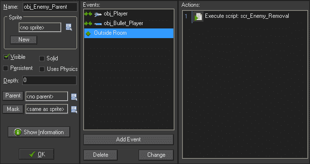

现在我们有了一个父对象，它将处理子弹碰撞并在敌人离开屏幕时移除它们。让我们通过创建一些子对象来测试它。

## 构建 FloatBot

FloatBot 是游戏中最基本的敌人。它不会发射武器，这使它更像是要避开的障碍物。FloatBot 将横穿屏幕向左移动，同时上下浮动。

1.  创建一个新精灵，命名为`spr_FloatBot`。

1.  加载精灵`Chapter 3/Sprites/FloatBot.gif`，勾选**删除背景**。

1.  这是一个动画精灵，每一帧形状都会改变。因此，我们希望确保碰撞相应地改变。在**碰撞检查**中，勾选**精确碰撞检查**。

1.  我们希望将原点设置在此精灵的中心，这样当我们添加摆动运动时，它就会正确移动。将**原点**设置为**X**:`16`，**Y**:`16`。然后单击**确定**。

我们需要两个脚本来使 FloatBot 以我们想要的方式飞行。在创建时，我们将应用水平移动，然后在每一步之后我们将调整垂直摆动运动。

1.  创建一个新的脚本，并将其命名为`scr_FloatBot_Create`。

1.  编写以下代码：

```js
hspeed = -4;
angle = 0;
```

水平速度的负值意味着它将向左移动。`angle`是我们将在下一个脚本中使用的变量，用于摆动运动。

1.  创建一个新脚本，并将其命名为`scr_FloatBot_Step`。

1.  为了获得我们想要的垂直运动，我们将使用一些简单的三角学。编写以下代码：

```js
vspeed = sin(angle) * 8;
angle += 0.1
```

在这里，我们根据变量角的正弦值（以弧度为单位）乘以基本速度`8`来改变垂直速度。我们还每一步增加`angle`的值，这是必要的，以便它遵循正弦波。

1.  创建一个新对象，命名为`obj_FloatBot`，并将`spr_FloatBot`设置为精灵。

1.  我们希望将此对象设置为子对象，因此在**父对象**下拉框中，选择`obj_Enemy Parent`。

1.  添加一个**创建**事件并应用`scr_FloatBot_Create`脚本。

1.  添加一个**步骤**事件并应用`scr_FloatBot_Step`脚本。FloatBot 现在已经准备好测试，应该看起来像下面的截图：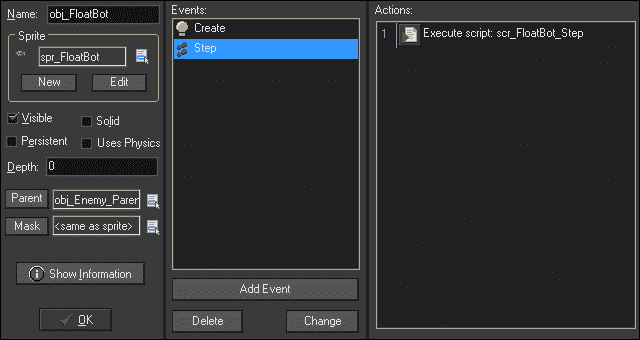

1.  重新打开房间`TheGame`，并在屏幕右侧的某个地方放置一个`obj_FloatBot`的实例。

1.  运行游戏。

如果一切正常，FloatBot 应该沿着屏幕向左移动，并在大约 240 像素的高度上上下摆动，模式与下一个截图中显示的类似。如果我们用子弹击中 FloatBot，子弹和 FloatBot 都将消失。我们还成功创建了父子关系。让我们再创建一个！

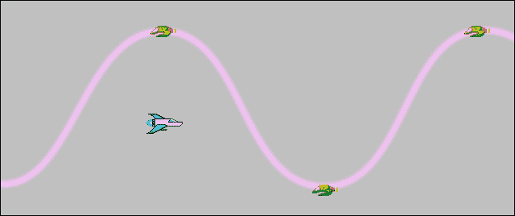

## 创建 SpaceMine

SpaceMine 将是一个缓慢移动的对象，如果玩家靠近，它将发射一圈子弹。由于这将需要两个对象，我们应该始终从最简单的对象开始，即子弹。

1.  创建一个新精灵，命名为`spr_Bullet_SpaceMine`。加载`Chapter 3/Sprites/Bullet_SpaceMine.gif`，勾选**删除背景**。

1.  将原点居中。我们不需要改变**碰撞检查**，因为正方形对于这个对象来说效果很好。

1.  创建一个新对象，命名为`obj_Bullet_SpaceMine`，并将精灵设置为`spr_Bullet_SpaceMine`。

1.  创建一个新脚本，并将其命名为`scr_Bullet_SpaceMine_Create`。

1.  这次我们希望使用`speed`和`direction`的实例属性，因为我们稍后需要设置方向。编写以下代码：

```js
speed = 16;
direction = 180;
```

1.  在`obj_Bullet_SpaceMine`中，添加一个**创建**事件并应用此脚本。

1.  我们需要为子弹添加碰撞，为了快速完成这个过程，我们可以重用`scr_Enemy_Collision_Player`脚本。从**碰撞**中添加一个`obj_Player`事件并应用脚本。目前我们已经完成了子弹，如下截图所示：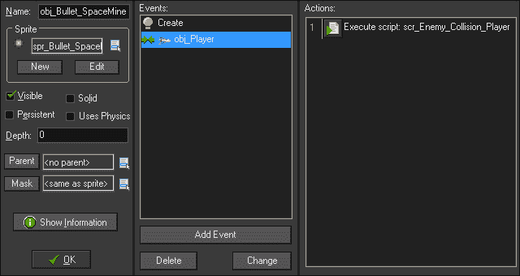

1.  是时候建立 SpaceMine 本身了。创建一个新精灵，命名为`spr_SpaceMine`，并加载`Chapter 3/Sprites/SpaceMine.gif`，勾选**删除背景**。正如你所看到的，SpaceMine 有动画闪烁的灯光。

1.  将原点居中并检查**精确碰撞检查**。

1.  当 SpaceMine 发射时，我们希望有射击声音，因此创建一个新声音，`snd_Bullet_SpaceMine`，并加载`Chapter 3/Sounds/Bullet_SpaceMine.wav`。我们不会将其附加到子弹本身，因为我们将创建八颗子弹，但我们只需要播放一次声音。

1.  如果尚未设置，将**类型**设置为**普通声音**，然后单击**确定**。创建一个新对象，命名为`obj_SpaceMine`。

1.  将**精灵**设置为`spr_SpaceMine`，**父对象**设置为`obj_Enemy_Parent`。

1.  创建一个新脚本，并将其命名为`scr_SpaceMine_Create`。

我们需要 SpaceMine 做一些事情。它将发射子弹，所以我们需要一个变量来控制何时射击。它需要在屏幕上移动，所以我们需要应用速度。最后，我们希望减慢动画的速度，以免闪烁太快。

1.  写下以下代码：

```js
hspeed = -2;
canFire = false;
image_speed = 0.2;
```

首先，我们将水平速度设置为向左缓慢移动。`canFire`是一个布尔变量，将决定是否射击。最后，`image_speed`设置了动画的速度。以`0.2`的速度，它以正常速度的 20%进行动画，换句话说，每一帧动画将保持五个步骤。

1.  在`obj_SpaceMine`中，添加一个**Create**事件并应用这个脚本。

1.  创建另一个新的脚本，命名为`scr_SpaceMine_Step`。

每一步，我们都希望查看玩家是否在 SpaceMine 的附近。如果玩家离得太近，SpaceMine 将开始发射子弹环。我们不希望有一串子弹，所以我们需要在每次射击之间添加延迟。

1.  写下以下代码：

```js
if ( distance_to_object( obj_Player ) <= 200 && canFire == false )
{
    alarm[0] = 60;
    sound_play(snd_Bullet_SpaceMine)
    for (i = 0; i < 8; i += 1)
    {
        bullet = instance_create(x,y,obj_Bullet_SpaceMine);
        bullet.direction = 45 * i;
           bullet.hspeed -= 2;
    }
    canFire = true;
}
```

我们首先检查两个语句；SpaceMine 和`obj_Player`之间的距离，以及我们是否能够射击。我们选择的距离是`200`像素，这应该足够让玩家偶尔避免触发它。如果玩家在范围内并且我们能够射击，我们将`alarm`设置为`60`步（2 秒），并播放一次子弹声音。

### 注意

警报是一个事件，当触发时，将执行一次代码。

为了创建子弹环，我们将使用一个`for`循环。当我们创建一个对象的实例时，它会返回该实例的唯一 ID。我们需要将这个 ID 捕获在一个变量中，这样我们才能与对象交互并影响它。在这里，我们使用一个名为`bullet`的变量，它是`obj_Bullet_SpaceMine`的一个实例。然后我们可以改变子弹的属性，比如方向。在这种情况下，每颗子弹的偏移角度为 45 度。我们还给子弹添加了一些额外的`hspeed`，这样它们就可以跟随 SpaceMine 移动。最后，我们将`canFire`变量设置为`true`，表示我们已经发射了子弹。

1.  在`obj_SpaceMine`中，添加一个**Step**事件并应用这个脚本。

1.  我们几乎完成了 SpaceMine，我们只需要在一个可以触发的警报中添加一些代码，这样它就可以多次射击。创建一个新的脚本，命名为`scr_SpaceMine_Alarm0`。

1.  将`canFire`变量设置回`false`：

```js
canFire = false;
```

1.  在`obj_SpaceMine`中，添加一个**Alarm 0**事件并应用这个脚本。现在我们已经完成了 SpaceMine，它应该看起来像下面的截图：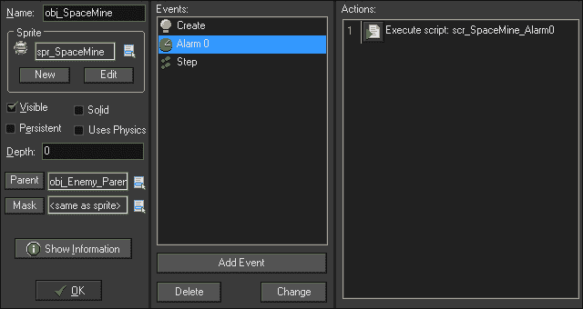

1.  打开`TheGame`，在屏幕的右侧添加一个`obj_SpaceMine`的实例，然后运行游戏。

如果一切设置正确，SpaceMine 将缓慢地向左移动并闪烁。当玩家靠近 SpaceMine 时，应该会有八颗子弹从中射出，就像下一个截图中所示。每两秒，这个实例将发射另一个子弹环，只要玩家仍然在范围内。如果 SpaceMine 被玩家的子弹击中，它将被摧毁。最后，如果玩家与敌人的子弹相撞，玩家就会消失。让我们继续我们的最终敌人！

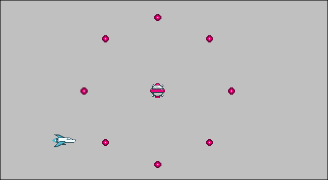

## 制作 Strafer

Strafer 是游戏中最危险的敌人。它以直线非常快速移动，并且会瞄准玩家无论他们在哪里。再次，我们需要两个对象，所以让我们从子弹开始。

1.  创建一个新的精灵，命名为`spr_Bullet_Strafer`。加载`Chapter 3/Sprites/Bullet_Strafer.gif`，并勾选**Remove Background**。

1.  将原点居中。

1.  创建一个新的对象，命名为`obj_Bullet_Strafer`，并将精灵设置为`spr_Bullet_Strafer`。

1.  我们想要一个独特的射击声音，所以创建一个新的声音，`snd_Bullet_Strafer`，并加载`Chapter 3/Sounds/Bullet_Strafer.wav`。

1.  如果尚未将**种类**设置为**普通声音**，请点击**确定**。

1.  创建一个新的脚本，并将其命名为`scr_Bullet_Strafer_Create`。

1.  这个脚本与`scr_Bullet_SpaceMine_Create`类似，只是这颗子弹速度更快，并播放子弹声音。编写以下代码：

```js
speed = 20;
direction = 180;
sound_play(snd_Bullet_Strafer);
```

1.  在`obj_Bullet_Strafer`中，添加一个**创建**事件，并应用此脚本。

1.  与其他敌人子弹一样，让我们通过重用`scr_Enemy_Collision_Player`脚本为子弹添加碰撞。从**碰撞**中添加一个`obj_Player`事件，并应用该脚本。子弹部分完成后，让我们构建敌人。

1.  创建一个新的精灵，并将其命名为`spr_Strafer`，并加载`Chapter 3/Sprites/Strafer.gif`，勾选**删除背景**。

1.  我们希望子弹从飞船的前方发射，因此我们需要手动将原点移动到正确的位置。将**原点**设置为**X**：`0`，**Y**：`19`。

1.  创建一个新的对象，并将其命名为`obj_Strafer`。

1.  将**精灵**设置为`spr_Strafer`，**父对象**设置为`obj_Enemy_Parent`。

1.  创建一个新的脚本，并将其命名为`scr_Strafer_Create`。

1.  Strafer 将快速在屏幕上移动并不断向玩家发射子弹。编写以下代码：

```js
hspeed = -10;
alarm[0] = 10;
```

与 SpaceMine 类似，我们将`hspeed`设置为向左移动，并设置一个警报，以便 Strafer 立即开始射击。

1.  在`obj_Strafer`中，添加一个**创建**事件，并应用此脚本。

1.  我们只需要再创建一个脚本，那就是用于警报的脚本。创建一个新的脚本，并将其命名为`scr_Strafer_Alarm0`。

1.  当警报响起时，我们需要创建一个子弹，将其发射到玩家，并重置警报，以便它可以再次发射。编写以下代码：

```js
bullet = instance_create(x, y, obj_Bullet_Strafer);
if (instance_exists(obj_Player))
{
    bullet.direction = point_direction(x,y, obj_Player.x,obj_Player.x, obj_Player.y);
} 
alarm[0] = irandom(30) + 15;
```

我们首先创建`obj_Bullet_Strafer`的一个实例。当创建一个实例时，该函数会返回该实例的唯一 ID；然后我们将其捕获在一个变量中，比如`bullet`。接下来，我们查询玩家是否存在。这是一个非常重要的步骤，因为如果没有这个检查，如果玩家死亡并且 Strafer 试图瞄准它，游戏将出错并崩溃。

如果玩家存在，我们将设置子弹的方向指向玩家。这是通过`point_direction`函数完成的，该函数接受空间中的任意两点（x1，y1）和（x2，y2），并返回角度（以度为单位）。

最后，我们重置警报。在这种情况下，为了增加趣味性，我们添加了一些随机性。`irandom`函数将返回一个介于零和传递给它的数字之间的整数。我们这里的代码将给我们一个介于`0`和`30`之间的随机值，然后我们将其加上`15`。这意味着每隔半秒到一秒半之间将创建一个新的子弹。

1.  在`obj_Strafer`中，添加一个**Alarm 0**事件，并应用此脚本。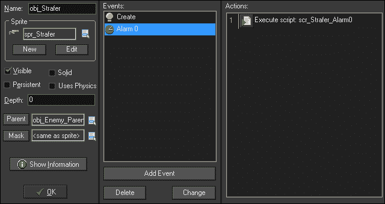

1.  Strafer 现在已经完成，让我们测试一下，并将其放置在`TheGame`的左侧。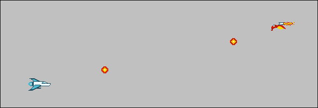

如果一切正常，Strafer 将快速横穿屏幕，并直接朝向玩家位置发射子弹。确保您将玩家移动到房间的各个方向，以确保它可以朝各个方向射击！玩家应该能够射击并摧毁 Strafer。如果被 Strafer 的子弹击中，玩家应该消失。

游戏的敌人都已经完成；现在我们只需要一种方法来填充游戏世界。让我们引入一个 Overlord！

# 通过 Overlord 控制游戏

在这个游戏中，我们将使用 Overlord，游戏的主控制器，来控制敌人的生成，监视玩家的生命，并处理胜利/失败条件。胜利条件很简单，就是在两分钟内生存下来，抵御敌人的波浪。失败条件是玩家耗尽生命。

## 生成敌人的波浪

我们需要首先创建敌人的波动，以便游戏可玩。为此，我们将利用循环时间线来生成各种敌人。我们将有三个不同的波动，每两秒生成一个不同的敌人。

1.  创建三个新脚本，并命名为：`scr_Wave_Strafer`，`scr_Wave_SpaceMine`和`scr_Wave_FloatBot`。

1.  我们将从 Strafer 的波动开始，因为它将是最简单的波动。在`scr_Wave_Strafer`中编写以下代码：

```js
instance_create(room_width - 64, room_height/2 - 64, obj_Strafer);
instance_create(room_width - 64, room_height/2 + 64, obj_Strafer);
```

在这里，我们生成两个 Strafer 的实例，位于屏幕右侧`64`像素处。这将确保我们看不到它们突然出现。我们还将它们偏移了`64`像素，使其与房间的垂直中心相差`64`像素。

1.  对于 SpaceMine，我们希望它们在随机位置垂直放置，以保持事情的趣味性。在`scr_Wave_SpaceMine`中编写以下代码：

```js
placeY = irandom_range(64, room_height - 64);
instance_create(room_width - 64, placeY, obj_SpaceMine);
```

我们创建一个名为`placeY`的变量来保存垂直位置的值。GameMaker: Studio 有一个特殊的函数`irandom_range`，它将返回传递给它的两个数字之间的整数。我们使用的数字将确保 SpaceMine 距离屏幕顶部和底部至少 64 像素。然后我们在创建实例时使用`placeY`变量。

1.  FloatBot 将使用类似的垂直轴放置设置，但我们希望有三个实例以“V”形式飞行。在`scr_Wave_FloatBot`中编写以下代码：

```js
placeY = irandom_range(80, room_height - 80);
instance_create(room_width - 32, placeY, obj_FloatBot);
instance_create(room_width - 64,placeY - 32, obj_FloatBot);
instance_create(room_width - 64, placeY + 32, obj_FloatBot);
```

在这里，我们再次使用`placeY`变量，但数字范围更窄。我们需要一些额外的填充，以便所有三个飞机都保持在屏幕上。创建的第一个实例是编队的前部单位。接下来的两个实例在第一个实例的后面生成，偏移了 32 像素，并分别在第一个实例的上方和下方偏移了 32 像素。

1.  所有波动都已编写脚本，因此我们现在可以在时间线中实现它们。首次实现时间线时，保持数字简单是有用的，例如相隔两秒。适当平衡时间是在游戏开发的打磨阶段进行的，花费太多时间试图在所有内容都在位之前就把这个问题解决好，很可能是浪费时间。创建一个新的时间线，命名为`tm_Wave_Spawning`。

1.  点击**Add**，将**Indicate the Moment**设置为`60`，并应用`scr_Wave_FloatBot`脚本。这将在游戏中生成第一个敌人，持续两秒。

1.  两秒后我们将添加 SpaceMines。点击**Add**，将**Indicate the Moment**设置为`120`，并应用`scr_Wave_SpaceMine`脚本。

1.  最后，六秒后我们将带入 Strafer。点击**Add**，将**Indicate the Moment**设置为`180`，并应用`scr_Wave_Strafer`脚本。时间线现在已准备好使用，并且应该如下截图所示：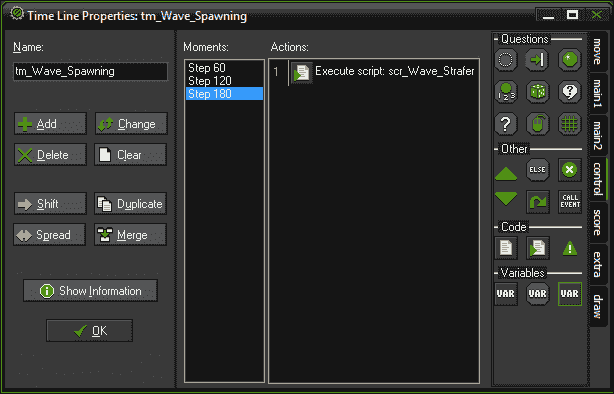

## 构建 Overlord

我们现在准备开始构建 Overlord 并应用我们的生成系统。

1.  创建一个新对象，命名为`obj_Overlord`。

1.  不需要精灵，所以将**Sprite**设置为**no sprite**。

1.  我们将在创建 Overlord 时立即开始时间线。创建一个新脚本，命名为`scr_Overlord_Create`，并编写以下代码：

```js
timeline_index = tm_Wave_Spawning;
timeline_running = true;
timeline_loop = true;
```

代码的第一行定义了我们要运行的时间线，我们只有一个：`tm_Wave_Spawning`。接下来，我们启动时间线，然后告诉它循环。这最后两个是布尔变量，这意味着它们只能打开和关闭。

1.  在 Overlord 中，添加一个**Create**事件并应用此脚本。

1.  打开**TheGame**，并在房间中放置一个 Overlord 的实例。位置无关紧要，但左上角是一个常见的放置位置。

1.  删除房间中剩余的敌人实例。如下截图所示，房间中应该只有一个 Player 的实例和一个 Overlord 的实例：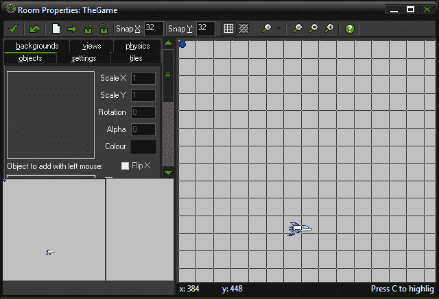

1.  运行游戏。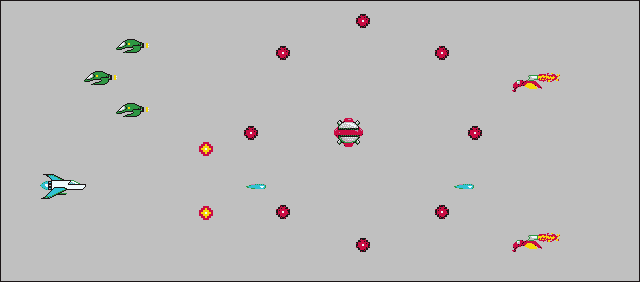

游戏现在有敌人！第一个敌人 FloatBots 出现需要几秒钟，但之后敌人将会不断生成。到目前为止，我们已经实现了大部分核心游戏玩法，如下所示：

+   我们可以在屏幕上移动玩家，但不能移出屏幕

+   我们可以射击和摧毁敌人

+   敌人可以射击和摧毁玩家

+   敌人将不断生成

在这个阶段玩游戏时，唯一剩下的元素非常明显；玩家可以死亡，但游戏不会停止。我们需要实现胜利/失败条件。

# 处理玩家的生死

由于这是一个关于生存的游戏，我们希望胜利/失败条件相对简单。对于胜利条件，我们将使玩家生存一段时间。失败条件是玩家死亡，但我们不希望游戏太难玩，所以我们给玩家三条生命。这意味着我们需要重新生成玩家。最后，为了使这个功能正常工作，我们需要给 Overlord 一些额外的职责。

## 设置胜利条件

这个游戏的胜利条件是生存一段时间。我们可以通过使用警报和一个变量来实现这一点，向 Overlord 发出信号，玩家已经生存下来。

1.  我们需要为生命、胜利和失败条件设置一些变量。重新打开`scr_Overlord_Create`，在底部添加以下代码：

```js
lives = 3;
isVictory = false;
isDefeat = false;
```

GameMaker: Studio 有一些内置的全局变量，包括`lives`。这个变量可以被游戏中的每个实例访问，永远不会消失。在这里，我们将其设置为`3`，并将其用作我们的起点。我们还创建了另外两个变量，`isVictory`和`isDefeat`，我们将其设置为`false`。我们之所以使用两个变量来表示游戏的胜利和失败，而不是一个，是因为我们希望在游戏过程中检查它们，当他们既没有赢也没有输时。

1.  我们还可以通过在这个脚本中设置一个 90 秒的警报来设置我们的胜利条件。为此，在步骤 1 的代码之后添加以下代码行：

```js
alarm[0] = 2700;
```

`scr_Overlord_Create`脚本现在应该总共如下所示：

```js
timeline_index = tm_Wave_Spawning;
timeline_running = true;
timeline_loop = true;

lives = 3;
isVictory = false;
isDefeat = false;

alarm[0] = 2700;

```

1.  接下来，我们需要为胜利条件的警报事件设置一个脚本。创建一个新脚本，命名为`scr_Overlord_Victory`，并编写以下代码：

```js
timeline_running = false;
with ( obj_Enemy_Parent )
{
    instance_destroy();
}
alarm[1] = 90; 
isVictory = true;
```

我们要做的第一件事是停止时间线，因为我们不希望再生成更多的敌人。下一步是移除游戏中仍然存活的所有敌人。我们通过使用`with`语句来执行`obj_Enemy_Parent`的所有实例的代码来实现这一点。因为所有的敌人都是这个对象的子对象，它们也会被销毁。最后，我们为三秒钟设置另一个警报。最后，我们将`isVictory`变量设置为 true。

1.  在`obj_Overlord`中，添加一个**Alarm 0**事件并应用胜利脚本。

1.  让我们通过创建重新启动脚本来结束这一切。创建一个新脚本，命名为`scr_Overlord_GameRestart`，并编写以下代码：

```js
game_restart();
```

1.  添加一个**Alarm 1**事件并应用重新启动脚本。现在胜利条件已经生效，随时可以尝试。

## 使用 Ghost 对象重新生成

现在我们可以转向失败条件和重新生成。当玩家死亡时，我们不希望玩家立即重新生成，而是有一个较短的无敌时间。为此，我们需要创建一个 Ghost 对象，暂时代替玩家。

1.  创建一个新精灵，命名为`spr_Ghost`，并加载`Chapter 3/Sprites/Ghost.gif`，勾选**删除背景**。它看起来就像飞机，但是略微透明，在动画时会闪烁。

1.  我们需要将原点设置为与`spr_Player`的原点完全相同。将**原点**设置为**X**:`43`，**Y**:`22`，然后点击**确定**。

1.  创建一个新对象，命名为`obj_Ghost`，并将`spr_Ghost`应用为精灵。

1.  当玩家死亡时，我们将让 Ghost 出现在屏幕左侧并移入游戏区域。创建一个新的脚本，命名为`scr_Ghost_Create`，并编写以下代码：

```js
x = -64;
y = room_height * 0.5;
hspeed = 4;
```

我们首先将`x`坐标设置为屏幕外`64`像素。然后通过将`y`坐标设置为房间高度的一半来垂直居中 Ghost。最后，我们对 Ghost 施加正向速度，使其开始自行移动。

1.  为`obj_Ghost`添加一个**Create**事件并应用此脚本。

1.  Ghost 将在屏幕上移动，我们需要在某个时候将其转换为玩家。在我们的情况下，一旦 Ghost 通过了游戏区域的四分之一，我们将进行切换。创建一个新的脚本，命名为`scr_Ghost_Step`，并编写以下代码：

```js
if ( x >= 200 )
{
    hspeed = 0;
    instance_change(obj_Player, true);
}
```

在这里，我们检查 Ghost 的`x`坐标是否已经越过了`200`像素。如果是，我们停止向前的速度，然后转换为玩家。`instance_change`函数需要两个参数：要转换为的对象以及是否要运行此新对象的**Create**事件。

1.  为`obj_Ghost`添加一个**Step**事件并应用此脚本。

1.  我们将在这种设置中遇到一个问题，那就是玩家无法控制 Ghost，并且在变换时可能会出现在靠近敌人的危险位置。我们不希望出现这种情况，所以让我们给玩家一些有限的控制权。我们可以重用现有的`scr_Player_Key_Up`和`scr_Player_Key_Down`脚本，以便玩家具有垂直移动。添加适当的键盘事件并附加这些脚本。

Ghost 对象的属性应该如下截图所示，现在已经准备好成为游戏的一部分。我们只需要改变玩家被击中时发生的事情。

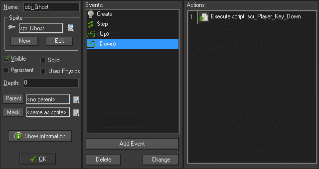

1.  重新打开`scr_Enemy_Collision_Player`。

1.  目前，我们正在销毁子弹和玩家。我们需要更改`with`语句以允许重新生成。删除第**3**行：

```js
instance_destroy();
```

并替换为：

```js
if ( lives > 0 )
{
    instance_change(obj_Ghost, true);
}
else
{
    instance_destroy();
}
lives -= 1;
```

我们只想在有生命可用时变成 Ghost，因此我们首先要检查这一点。如果我们至少有一条生命，我们就将玩家变成 Ghost。否则，我们只是销毁玩家，玩家将永远死亡。最后，无论我们是否有生命，每次都要减少一条生命。最终的代码应该如下所示：

```js
with ( other ) 
{
 if ( lives > 0 )
 {
 instance_change(obj_Ghost, true);
 }
 else
 {
 instance_destroy();
 }
 lives -= 1;
}
instance_destroy();
```

此时我们可以玩游戏。请注意，当玩家死亡时：

+   玩家消失

+   创建一个 Ghost 并移入游戏区域

+   Ghost 可以上下移动

+   Ghost 变回 Player

当然，这会发生三次，然后玩家永远消失。然而，游戏的其余部分正在继续，就好像什么都没有发生。我们需要添加失败条件。

1.  创建一个新的脚本，`scr_Overlord_Step`，并编写以下代码：

```js
if ( lives < 0 && isDefeat == false ) {
    alarm[1] = 90;    
    isDefeat = true;
}
```

这段代码中的每一步都会检查玩家是否还有生命。如果玩家没有生命了，而变量`isDefeat`仍然为`false`，它将为*重新开始游戏*警报设置三秒。最后，我们将`isDefeat`变量设置为`true`，这样我们就不会再运行这段代码了。

1.  在`obj_Overlord`中，添加一个**Step**事件并应用此脚本。玩家死亡三次后游戏将重新开始。

游戏的核心机制现在已经完成，但对于玩家来说，发生了什么并不是很清楚。玩家可以死亡并重新生成几次，但没有显示剩余生命的指示。也没有显示玩家是赢了还是输了。让我们来解决这个问题！

# 绘制用户界面

创建一个伟大游戏的最重要元素之一是确保玩家拥有玩游戏所需的所有信息。其中很多通常显示在**HUD**中，也就是**heads-up display**。每个游戏都有不同的组件可以成为 HUD 的一部分，包括我们需要的记分牌和生命计数器等。

1.  首先，我们需要一个用于显示文本的字体。我们提供了一个名为**Retroheavyfuture**的字体供本游戏使用，需要在您的计算机上安装。要在 Windows 7 计算机上安装此字体，请右键单击`Chapter 3/Fonts/RETRRG__.ttf`，然后单击**安装**。然后按照提示进行操作。

1.  回到 GameMaker: Studio，创建一个新的字体，命名为`fnt_Scoreboard`。

1.  选择**Retroheavyfuture**作为**字体**。

1.  在**样式**下将**大小**设置为`16`。

1.  我们需要一个适当大小的字体来显示游戏中的得分和生命。它应该看起来像下面的截图，所以点击**确定**：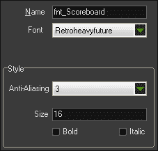

1.  当我们显示胜利/失败条件时，我们将需要字体的第二个版本。创建一个新的字体，命名为`fnt_WinLose`。

1.  再次选择**Retroheavyfuture**作为**字体**，但这次将**大小**设置为`32`。现在我们已经拥有了所有游戏中需要的字体，所以点击**确定**。

1.  让我们继续进行新的脚本`scr_Overlord_Draw`。我们将从以下代码开始设置记分牌文本的颜色和字体：

```js
draw_set_color(c_white);
draw_set_font(fnt_Scoreboard);
```

第一行代码设置了一个 GameMaker: Studio 预设颜色`c_white`。接下来的一行将记分牌设置为字体。

### 注意

设置颜色是全局应用于`draw`事件的。这意味着如果您不设置颜色，它将使用上次设置的颜色，而不管对象如何。

1.  设置字体后，我们可以开始应用 HUD。我们将从玩家生命开始。将以下代码添加到脚本中：

```js
draw_set_halign(fa_left);
if ( lives >= 0 )
{
    draw_text(8, 0, "Lives: " + string(lives));
} else {
    draw_text(8, 0, "Lives: " );
}
```

为了确保文本格式正确，我们将文本的水平对齐设置为左对齐。文本本身需要是一个字符串，可以通过两种方式完成。首先，任何用引号括起来的内容都被视为字符串，比如`"生命："`。如果我们想传递一个数字，比如我们拥有的生命数量，我们需要通过字符串函数进行转换。如下所示，如果我们还有剩余的生命，我们可以将这两个东西连接起来创建一个句子“生命：3”，并将其绘制在屏幕的左上角。如果我们没有生命了，我们就绘制不带连接值的文本。

1.  我们想要的另一个 HUD 元素是得分，我们将其放在屏幕的对面，即右上角。添加以下代码：

```js
draw_set_halign(fa_right);
draw_text(room_width-8, 0, "SCORE: " + string(score));
```

与之前的文本一样，我们设置了水平对齐，这次是右对齐。然后使用相同的连接方法将文本放在正确的位置。

1.  现在让我们通过向`obj_Overlord`添加**绘制 GUI**事件并应用此脚本来测试一下。

1.  运行游戏。如下截图所示，游戏现在应该在左上角显示生命，并在玩家死亡时更新。它还应该在右上角显示得分，并随着每个敌人被杀而增加。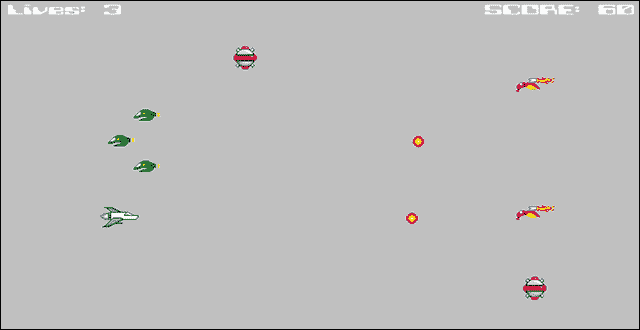

1.  现在我们需要添加玩家赢或输时的显示。在`scr_Overlord_Draw`的末尾添加以下代码：

```js
draw_set_font(fnt_WinLose);
draw_set_halign(fa_center);
if ( isVictory == true )
{
    draw_text(room_width / 2, room_height/2, "VICTORY");
}
if ( isDefeat == true )
{
    draw_text(room_width / 2, room_height/2, "DEFEAT");
}
```

我们将字体更改为`fnt_WinLose`，并将水平对齐设置为居中。我们不希望文本一直显示，而是应该在适当时只显示**VICTORY**或**DEFEAT**。我们已经在 Overlord 中实现了游戏条件的代码，所以我们只需要在每一步检查`isVictory`是否为`true`或`isDefeat`是否为`true`。一旦游戏赢了或输了，我们就在房间的中心绘制适当的文本。

完整的`scr_Overlord_Draw`脚本应该如下所示：

```js
draw_set_color(c_white);
draw_set_font(fnt_Scoreboard);

draw_set_halign(fa_left);
draw_text(8, 0, "LIVES: " + string(lives));

draw_set_halign(fa_right);
draw_text(room_width-8, 0, "SCORE: " + string(score));

draw_set_font(fnt_WinLose);
draw_set_halign(fa_center);
if ( isVictory == true )
{
    draw_text(room_width / 2, room_height/2, "VICTORY");
}
if ( isDefeat == true )
{
    draw_text(room_width / 2, room_height/2, "DEFEAT");
}
```

# 为游戏添加完成细节

游戏现在在功能上已经完成，但它没有任何光泽或我们期望的完整游戏的完成细节。没有音乐，没有背景艺术，也没有爆炸！让我们立即解决这个问题。

## 添加游戏音乐

我们希望音乐从头开始播放，并在游戏持续时间内播放。当发生胜利/失败条件时，我们希望音乐渐渐消失，以让玩家知道游戏已经结束。

1.  创建一个新的声音并命名为`snd_Music`。

1.  加载`Chapter 3/Sounds/Music.mp3`。**种类**应设置为**背景音乐**。

1.  重新打开`scr_Overlord_Create`。由于霸主控制整个游戏，我们将使用它来控制音乐。在最后一行代码之后，添加以下内容：

```js
sound_play(snd_Music);
sound_loop(snd_Music);
volume = 1;
sound_global_volume(volume);
```

我们首先播放音乐并设置为循环。然后创建一个名为`volume`的变量，我们将用它来控制音量和淡出。我们已将音量设置为`1`，即最大音量。最后，我们将全局音量，或主增益级别，设置为变量`volume`。

1.  重新打开`scr_Overlord_Step`。为了淡出音乐，我们需要在几个步骤内降低全局音量，但只有在游戏结束时才这样做。在最后一行代码之后，添加以下内容：

```js
if ( isDefeat == true || isVictory == true )
{
    volume -= 0.02;
    sound_global_volume(volume);
}
```

在这里，我们检查是否已将胜利或失败条件设置为`true`。如果是，我们将通过`0.02`减少音量变量并将其应用于主增益级别。声音级别从最大音量降至静音需要 50 步，大约是游戏重新开始之前的一半时间。

1.  运行游戏。现在你应该听到背景音乐正在播放。如果玩家快速死亡三次并触发了失败条件，你应该听到声音渐渐消失。

## 使背景移动

这个游戏发生在外太空，所以我们需要添加一个太空背景。为了让游戏宇宙感觉玩家在移动，我们需要使背景不断向左移动。

1.  创建一个新的背景并命名为`bg_Starscape`。

1.  加载`Chapter 3/Backgrounds/Starscape.gif`，不勾选**删除背景**。这就是我们需要做的一切，所以点击**确定**。

1.  打开`TheGame`并选择**背景**选项卡。

1.  将`bg_Starscape`设置为**背景图像**。这应该会自动发生，但确保**背景 0**被突出显示，并且在房间开始时**可见**已被选中。

1.  星空只会水平移动，因此我们只需要勾选**水平平铺**，以便图像环绕。

1.  要移动背景，将**水平速度**设置为`-2`。这将使其向左移动，从而使玩家看起来向右移动。设置应如下截图所示：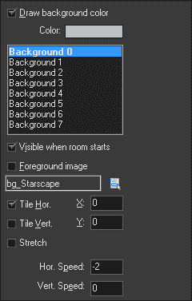

1.  运行游戏。现在你应该看到一个移动的星空！查看以下截图：

## 创建爆炸

让敌人突然消失不仅看起来很糟糕，而且对玩家来说也不是很有意义。让我们通过添加一些爆炸效果来使游戏更加令人兴奋！

1.  创建一个新的精灵，`spr_Explosion`，并加载`Chapter 3/Sprites/Explosion.gif`，勾选**删除背景**。

1.  将原点设置为中心，然后点击**确定**。

1.  创建一个新的声音，`snd_Explosion`，并加载`Chapter 3/Sounds/Explosion.wav`。

1.  如果尚未设置**种类**为**普通声音**，请设置为**普通声音**，然后点击**确定**。

1.  创建一个新的对象，`obj_Explosion`，并将精灵设置为`spr_Explosion`。

我们希望爆炸发出声音，播放其动画，然后从游戏中移除自身。

1.  创建一个新的脚本，`scr_Explosion_Create`，并编写以下代码以播放爆炸声音一次：

```js
sound_play(snd_Explosion);
```

1.  添加一个**创建**事件并应用此脚本。

1.  要使爆炸自行消失，最好在动画完成时执行。幸运的是，GameMaker: Studio 有一个事件可以做到这一点。从**其他**中添加一个**动画结束**事件，然后创建一个名为`scr_Explosion_AnimEnd`的新脚本，并添加以下代码以删除实例：

```js
instance_destroy();
```

1.  爆炸现在已经准备好了，我们所要做的就是在摧毁敌人时生成它。打开`scr_Enemy_Collision_Bullet`，并在脚本的第一行添加以下代码：

```js
instance_create(x,y, obj_Explosion);
```

这将在敌人所在的位置创建一个爆炸。这需要在我们将敌人从游戏中移除之前发生。

1.  使用`scr_Enemy_Collision_Player`重复这段代码添加。

1.  运行游戏。现在，每当有东西被摧毁时，你应该看到爆炸，就像下面的截图所示：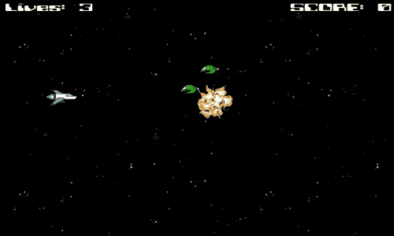

# 总结

恭喜！你刚刚完成了创建你的第一个横向卷轴射击游戏。在本章中，我们涵盖了相当多的内容。我们应用了移动的三种方法：手动调整 X 和 Y 坐标，使用`hspeed`和`vspeed`，以及设置`speed`和`direction`变量。我们现在能够动态地向游戏世界添加和移除实例。通过子弹，我们学会了将信息从一个实例传输到另一个实例，比如移动的方向，通过捕获实例的 ID 并通过点运算符访问它。

我们发现了美妙的`with`语句，它使我们能够影响单个实例、对象的所有实例，甚至是碰撞中涉及的`other`实例。我们研究了全局变量，比如`lives`和`score`，并使用**Draw**事件来显示它。敌人的波浪是使用时间轴生成的。通过滚动背景图像创建了移动的错觉。声音被应用，并调整音量以创建淡出效果。我们甚至使用了一点三角学！

有了本章中所学的技能和知识，现在轮到你来接管这个游戏，并进一步扩展它。尝试添加你自己的敌人、可收集物品和武器升级。玩得开心吧！

在下一章中，我们将通过制作一个恐怖冒险游戏，更多地了解碰撞和玩家控制。我们还将研究人工智能，并使用路径使敌人看起来像在自己思考和行动。
