# 第四章：冒险开始

在本章中，我们将创建一个有趣的小动作冒险游戏，这将建立在我们的基础知识之上。我们将从一个可以在世界中导航并具有短程近战攻击的动画玩家角色开始。游戏世界将由多个房间组成，玩家将能够从一个房间移动到另一个房间，同时保留所有他们的统计数据。我们将把所有玩家控制的代码和处理墙壁碰撞的代码放在一个脚本中，以创建一个更高效的项目。

如下截图所示，这个游戏的主题是高中的恐怖，世界里会有三个基本人工智能的敌人：一个幽灵图书管理员，一个乱斗，和一个教练。幽灵图书管理员会在玩家接近它的休息地点时出现，并追逐玩家直到距离太远，然后返回原来的位置。乱斗会在房间里漫游，如果它发现玩家，它会增加体积和速度。教练是奖杯的守护者，会独自在世界中导航。如果它看到玩家，它会追击并避开墙壁和其他教练，如果足够接近，它会对玩家进行近战攻击。

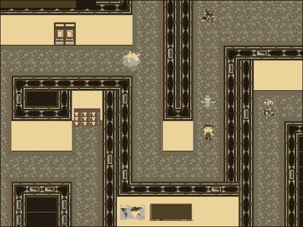

# 创建动画角色

到目前为止，我们创建的玩家对象非常基本。在第一章中，*与您的第一个游戏一起了解 Studio*，玩家没有动画。在第三章中，*射击游戏：创建一个横向卷轴射击游戏*，飞船有动画，但始终面向右侧。在本章中，我们将拥有一个可以朝四个方向移动并具有每个方向的动画精灵的角色。我们还将实现一个近战攻击，可以在角色面对的方向上使用。

## 简化角色移动

玩家角色的行走循环需要四个单独的精灵。我们将先介绍第一个，然后您可以创建其他三个。

1.  让我们从创建一个名为`Chapter_04`的新项目开始。

1.  创建一个精灵，命名为`spr_Player_WalkRight`。

1.  加载`第四章/精灵/Player_WalkRight.gif`，并勾选**删除背景**。

1.  将**原点**设置为**中心**。

1.  单击**修改掩码**以打开**掩码属性**编辑器，并在**边界框**下选择**完整图像**的单选按钮。这将设置碰撞框为整个精灵，如下截图所示：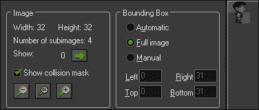

1.  点击**确定**。重复此过程以加载`spr_Player_WalkLeft`，`spr_Player_WalkUp`和`spr_Player_WalkDown`。

1.  创建一个对象，`obj_Player`，并将`spr_Player_WalkRight`分配为精灵。实际上，在这里设置玩家精灵的哪一个并不重要，因为我们将使用代码来改变显示的精灵。

1.  我们需要设置一些初始变量，因此创建一个新脚本，`scr_Player_Create`，并编写以下代码：

```js
mySpeed = 4;
myDirection = 0;
isAttacking = false;
isWalking = false;
health = 100;
image_speed = 0.5;
```

前两个变量是玩家速度和方向的占位符。这将很有用，因为我们可以影响这些值，而不影响对象的本地`mySpeed`和`myDirection`变量，比如在对象面对一个方向移动时产生的击退效果。变量`isAttacking`将用于指示我们何时发起战斗，`isWalking`将指示玩家何时移动。接下来，我们有全局变量`health`，设置为 100%。最后，我们将动画速度设置为 50%，以便行走循环播放正确。

### 注意

要了解更多关于 GameMaker: Studio 内置变量和函数的信息，请点击**帮助** | **目录**查看 GameMaker 用户手册。

1.  现在我们可以开始玩家的移动了。我们不再为每个键创建多个脚本，而是将所有控件放入一个单独的脚本中，简化代码。创建一个新脚本，`scr_Player_Step`，并从以下代码开始：

```js
isWalking = false;
if (keyboard_check(vk_right) && place_free(x + mySpeed, y))
{
    x += mySpeed;
    myDirection = 0;
    sprite_index = spr_Player_WalkRight;
    isWalking = true;
}
```

我们首先将`isWalking`设置为`false`，使其成为玩家正在进行的默认状态。之后，我们检查键盘是否按下右箭头键（`vk_right`），并检查当前位置右侧是否有实体物体。`place_free`函数将返回指定点是否无碰撞。如果玩家能够移动并且按下了键，我们就向右移动，并将方向设置为零以表示向右。我们将精灵更改为面向右侧的行走循环，然后将`isWalking`更改为`true`，这将覆盖我们将其设置为`false`的第一行代码。

1.  重复这段代码，针对剩下的三个方向进行调整。每个方向都应该查看哪个键被按下，并查看从该位置是否有任何碰撞。

1.  在移动控件完成之前，我们还有一件事要做。如果玩家没有移动，我们希望动画停止，并在开始移动时重新开始播放。在脚本的末尾，添加以下代码：

```js
if (isWalking == true)
{
    image_speed = 0.5;
} else {
    image_speed = 0;
}
```

我们创建了变量`isWalking`来在行走和停止状态之间切换。如果玩家在移动，精灵将播放动画。如果玩家没有移动，我们也停止动画。

当代码完成时，应该如下所示：

```js
isWalking = false;
if (keyboard_check(vk_right) && place_free(x + mySpeed, y))
{
    x += mySpeed;
    myDirection = 0;
    sprite_index = spr_Player_WalkRight;
    isWalking = true;
}
if (keyboard_check(vk_up) && place_free(x, y - mySpeed))
{
    y -= mySpeed;
    myDirection = 90;
    sprite_index = spr_Player_WalkUp;
    isWalking = true;
}
if (keyboard_check(vk_left) && place_free(x - mySpeed, y))
{
    x -= mySpeed;
    myDirection = 180;
    sprite_index = spr_Player_WalkLeft;
    isWalking = true;
}
if (keyboard_check(vk_down) && place_free(x, y + mySpeed))
{
    y += mySpeed;
    myDirection = 270;
    sprite_index = spr_Player_WalkDown;
    isWalking = true;
}
if (isWalking == true)
{
    image_speed = 0.5;
} else {
    image_speed = 0;
} 
```

1.  将这些脚本应用到适当的事件中，`scr_Player_Create`的**创建**事件，以及`scr_Player_Step`的**步进**事件。

玩家已经准备好移动和正确播放动画了，但如果没有添加一些实体障碍物，我们将无法完全测试代码。让我们建一堵墙。

1.  创建一个精灵，`spr_Wall`，加载`第四章/精灵/墙.png`，并取消选中**删除背景**。我们使用 PNG 文件，因为这堵墙略微透明，这在以后装饰房间时会很有用。

1.  创建一个新对象，`obj_Wall`，并将精灵设置为`spr_Wall`。

1.  勾选**实体**框。现在这堵墙被标识为可碰撞的对象。

1.  创建一个新的房间，命名为`沙盒`。我们将使用这个房间来测试功能。

1.  在房间的中心某处放置一个`obj_Player`的实例。

1.  在房间的周边放置`obj_Wall`的实例，并添加一些额外的部分，如下屏幕截图所示：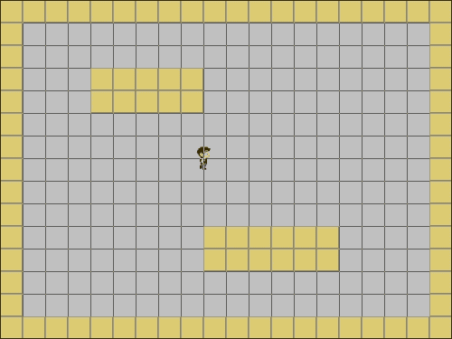

1.  运行游戏。此时玩家应该能够在开放区域自由移动，并在与墙碰撞时停止。

## 实施近战攻击

现在我们已经让玩家移动正常了，我们可以开始进行攻击了。我们正在创建的攻击只需要影响玩家角色前面的物体。为了实现这一点，我们将创建一个近战攻击对象，它将在命令下生成并在游戏中自行移除。

1.  创建一个精灵，`spr_Player_Attack`，加载`第四章/精灵/Player_Attack.gif`，并选中**删除背景**。这是一个动画精灵，代表挥动的近战攻击。

1.  我们希望碰撞区域影响精灵的整个高度，但不影响整个宽度。点击**修改掩码**，在**掩码属性**编辑器中，选择**边界框**下的**手动**单选按钮。

1.  调整**边界框**的值为**左**：`0`，**右**：`24`，**顶部**：`0`和**底部**：`4`。最终结果应该看起来像以下的屏幕截图。点击**确定**。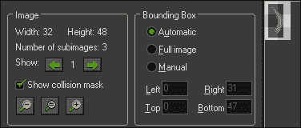

1.  我们希望这个对象始终出现在玩家的前面。确保这一点的最简单方法之一是让这个对象随着玩家一起旋转。为了实现这一点，将**原点**设置为**X:** `-16` **Y:** `24`。将 X 坐标设置为左侧意味着这个对象在生成时将有 16 像素的偏移。然后我们可以旋转攻击以匹配玩家的方向。

1.  创建一个对象，`obj_Player_Attack`，并将`spr_Player Attack`分配为其精灵。

1.  将**深度**设置为`-100`。**深度**决定了一个对象实例在屏幕上是在另一个对象的后面还是上面。将其设置为负值意味着它将在具有更高深度值的任何对象上绘制。将值设置为`-100`允许我们在默认的`0`和`-99`之间拥有其他深度的对象，而无需担心以后需要重新调整事物。

1.  创建一个新的脚本，`scr_Player_Attack_Create`，其中包含以下代码：

```js
image_angle = obj_Player.myDirection;
image_speed = 0.3;
alarm[0] = 6;
obj_Player.isAttacking = true;
```

这就是我们将图像旋转到与玩家面向相同方向的地方，结合我们设置的偏移原点，这意味着它将出现在玩家的前面。我们还会减慢动画速度，并设置一个六帧的警报。这个警报将在触发时移除攻击对象。最后，我们告诉玩家正在进行攻击。

1.  在`obj_Player_Attack`中添加一个**创建**事件，并附上这个脚本。

1.  让我们继续进行警报脚本，`scr_Player_Attack_Alarm`。它不仅需要移除攻击，还需要让玩家知道它已经消失，他们可以再次进行攻击。我们只需要两行代码就可以做到这一切：

```js
obj_Player.isAttacking = false;
instance_destroy();
```

我们可以直接与玩家的`isAttacking`变量交谈，并将其设置回`false`。然后我们销毁近战攻击的实例。将这个脚本附加到**Alarm 0**事件。

1.  现在我们只需要让玩家生成一个攻击的实例。重新打开`scr_Player_Step`，在底部添加以下代码：

```js
if (keyboard_check_pressed(ord('Z')) && isAttacking == false)
{
    instance_create(x, y, obj_Player_Attack);
}
```

`keyboard_check_pressed`函数只在按下键时激活，而不是在按下位置，而在这种情况下，我们正在检查*Z*键。键盘上的各种字母没有特殊命令，因此我们需要使用`ord`函数，它返回传递给它的字符的相应 ASCII 代码。我们还检查玩家当前是否没有进行攻击。如果一切顺利，我们生成攻击，攻击将改变`isAttacking`变量为 true，这样就只会发生一次。

### 注意

在使用`ord`函数时，始终使用大写字母，否则可能会得到错误的数字！

1.  运行游戏。你应该能够按下*Z*键，无论角色面向哪个方向，都能看到玩家面前独特的挥动动作，如下截图所示。玩家现在已经准备好战斗了！实施近战攻击

# 在房间之间导航

如果一切都发生在一个非常大的房间里，冒险游戏会变得相当无聊。这不仅效率低下，而且世界也会缺乏探索的感觉。从一个房间切换到另一个房间很容易，但确实会带来问题。

第一个问题是保留玩家的统计数据，比如健康，从一个房间到另一个房间。解决这个问题的一个方法是在玩家身上激活**持久性**。持久性意味着我们只需要在一个房间放置一个对象的单个实例，从那时起它将一直存在于游戏世界中。

第二个问题是在一个有多个入口点的房间中放置玩家。如果玩家不是持久的，我们可以将玩家放在房间里，但它总是从同一个地方开始。如果玩家是持久的，那么当他们切换房间时，他们将保持在上一个房间中的完全相同的坐标。这意味着我们需要将玩家重新定位到每个房间中我们选择的位置。

如果您的游戏将有很多房间，这可能会成为很多工作。通过创建自我感知的传送门和使用房间创建代码，有一种简单的解决方法。

## 设置房间

让我们从构建一些房间开始，首先是标题屏幕。

1.  创建一个新房间，在**设置**中命名为`TitleScreen`。

1.  创建一个新的背景，`bg_Title`，并加载`Chapter 4/Backgrounds/Title.png`，不勾选**Remove Background**。

1.  在`TitleScreen`的**Backgrounds**选项卡中，将`bg_Title`应用为**Background 0**，并勾选**Visible at Start**。

1.  创建另一个房间，命名为`C04_R01`。这里的名称代表章节和房间，如第四章，第 1 房间。

1.  将**Width**和**Height**设置为`1024`。这将允许我们有很多探索空间。

1.  我们不希望一次看到房间中的所有东西，因此我们需要限制视图。点击**Views**选项卡，勾选**Enable the Use of Views**。选择**View 0**，并勾选**Visible when room starts**。这将激活房间的摄像机系统。

1.  我们还希望视图关注玩家并随之移动。在**Views**选项卡中，选择**Object following**下的`obj_Player`，并将**Vbor:**和**Hbor:**设置为`200`。这将使摄像机跟随玩家，并在视图边缘留下 200 像素的缓冲区。查看以下截图，确保一切设置正确：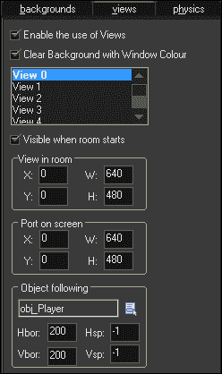

1.  使用刚才与`C04_R01`相同的设置，创建另外两个房间`C04_R02`和`C04_R03`。

1.  在资源树中，通过将`Sandbox`拖动到底部和`TitleScreen`拖动到最顶部来重新排序房间。它应该看起来像以下截图：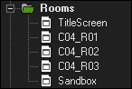

1.  最后，使用墙对象创建一个迷宫，包括所有三个房间。设计目前并不重要；只需确保玩家能够从一边到达另一边。可以在以下截图中看到它可能的样子：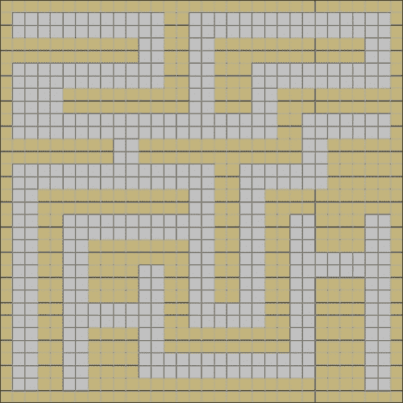

## 创建房间传送门

为了改变房间，我们将创建可重复使用的传送门。每个传送门实际上由两个单独的对象组成，一个是**Start**对象，一个是**Exit**对象。**Start**对象将代表玩家进入房间时应该放置的着陆点。**Exit**对象是改变玩家所在房间的传送器。我们将利用四个独特的传送门，这将允许我们在地图的每一侧都有一个门。

1.  为了使房间传送系统工作，我们需要使用一些全局变量，这些变量需要在游戏开始时初始化。创建一个新脚本，`scr_Globals_StartGame`，并使用以下代码：

```js
global.portalA = 0;
global.portalB = 0;
global.portalC = 0;
global.portalD = 0;
global.lastRoom = C04_R01;
```

我们为四个传送门创建全局变量，并给它们一个零值。我们还跟踪我们上次所在的房间，这样我们就知道我们需要去新房间的哪个传送门。

1.  创建一个新对象，`obj_Globals`，添加一个**Game Start**事件，并附加此脚本。这个对象不需要精灵，因为它只是一个数据对象。

1.  将一个`obj_Globals`的实例放入`TitleScreen`。

1.  我们需要能够从标题屏幕进入游戏，因此让我们通过添加**Draw**事件并创建一个新脚本`scr_Globals_Draw`来快速修复，并使用以下代码添加以下内容：

```js
draw_set_color(c_white);
draw_set_halign(fa_center);
draw_text(room_width/2, 360, "Press ANY key");
if (keyboard_check_pressed(vk_anykey))
{
    room_goto_next();
}
```

在这里，我们只是编写一些白色的居中文本，让玩家知道他们如何开始游戏。我们使用特殊变量`vk_anykey`来查看键盘是否被按下，如果按下了，我们就按照资源树中的顺序进入下一个房间。

### 注意

您不必总是关闭脚本，因为即使打开多个脚本窗口，游戏也会运行。

1.  让我们制作一些传送门！创建一个新精灵，`spr_Portal_A_Start`，加载`Chapter 4/Sprites/Portal_A_Start.png`，并取消勾选**Remove Background**。居中原点，然后点击**OK**。

1.  创建一个新的对象，`obj_Portal_A_Start`，将精灵设置为`spr_Portal_A_Start`。这是我们将玩家移动到的着陆点，当他们进入房间时。它不需要任何代码，所以点击**确定**。

1.  创建一个新的精灵，`spr_Portal_A_Exit`，并加载`Chapter 4/Sprites/Portal_A_Exit.png`，取消**删除背景**，并将原点居中。

1.  创建一个新的对象，`obj_Portal_A_Exit`，并相应地设置精灵。这是实际的传送门，当玩家与之碰撞时，我们将改变房间。

1.  对于`obj_Player`事件，创建一个新的脚本，`scr_Portal_A_Exit_Collision`，并编写以下代码：

```js
global.lastRoom = room;
room_goto(global.portalA);
```

在我们可以传送之前，我们需要将上一个房间设置为玩家当前所在的房间。为此，我们使用内置变量`room`，它存储游戏当前显示的房间的索引号。之后，我们去到这个传送门的全局变量指示我们应该去的房间。

1.  重复步骤 5 到 9，为传送门 B、C 和 D 做同样的操作，确保更改所有适当的值以反映正确的传送门名称。

传送门已经完成，我们可以将它们添加到房间中。在每个房间中不必使用所有四个传送门；您只需要至少一个起点和一个终点。在放置这些对象时，重要的是同一类型的传送门只能有一个。起点传送门应始终放置在可玩区域，并确保只能从一个方向访问终点。您还应确保，如果一个房间的**PORTAL A**在底部，那么它要进入的房间应该在顶部有**PORTAL A**，如下面的截图所示。这将帮助玩家理解他们在世界中的位置。

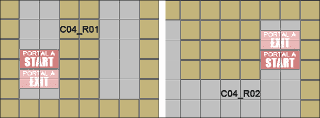

现在是有趣的部分。我们需要在每个房间中更改全局传送门数值，我们不想有一个检查所有房间发生情况的大型脚本。相反，我们可以在房间本身使用**创建代码**来在玩家进入时更改这些值。让我们尝试一下，通过使`C04_R01`中的传送门 A 去到`C04_R02`，反之亦然。

1.  在`C04_R01`的**设置**选项卡中，单击**创建代码**以打开代码编辑器，并编写以下代码：

```js
global.portalA = C04_R02;
global.portalB = 0;
global.portalC = 0;
global.portalD = 0;
```

我们将**PORTAL A**设置为第二个房间。所有其他传送门都没有被使用，所以我们将变量设置为零。每个房间都需要将所有这些变量设置为某个值，要么是特定的房间，要么是零，否则可能会导致错误。

1.  在`C04_R02`的**设置**选项卡中，单击**创建代码**以打开代码编辑器，并编写以下代码：

```js
global.portalA = C04_R01;
global.portalB = 0;
global.portalC = 0;
global.portalD = 0;
```

现在我们已经将 PORTAL A 设置为第一个房间，这是有道理的。如果我们通过那个传送门，我们应该能够再次通过它回去。随意更改这些设置，以适用于您想要的所有传送门。

## 传送持久玩家

房间都已经建好，准备就绪。我们唯一需要做的就是让玩家从一个房间移动到另一个房间。让我们首先使玩家持久，这样我们在游戏中只需要一个玩家。

1.  打开`obj_Player`并勾选**持久**。

1.  接下来，我们需要将玩家重新定位到正确的传送门。我们将创建一个新的脚本，`scr_Player_RoomStart`，并在`obj_Player`的**房间开始**事件中使用以下代码。

```js
if (global.lastRoom == global.portalA)
{
    obj_Player.x = obj_Portal_A_Start.x;
    obj_Player.y = obj_Portal_A_Start.y;
} else if (global.lastRoom == global.portalB) {
    obj_Player.x = obj_Portal_B_Start.x;
    obj_Player.y = obj_Portal_B_Start.y;
} else if (global.lastRoom == global.portalC) {
    obj_Player.x = obj_Portal_C_Start.x;
    obj_Player.y = obj_Portal_C_Start.y;
} else if (global.lastRoom == global.portalD) {
    obj_Player.x = obj_Portal_D_Start.x;
    obj_Player.y = obj_Portal_D_Start.y;
} 
```

当玩家进入一个房间时，我们检查玩家刚刚离开的房间与哪个传送门相关联。然后将玩家移动到适当的着陆点。为了确保玩家被正确构建，其属性应如下截图所示：

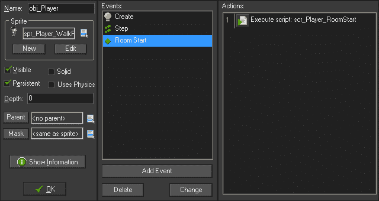

1.  将玩家实例放入`C04_R01`。不要将玩家放入其他任何房间，否则游戏中将会出现多个玩家实例。

1.  运行游戏。我们应该能够在第一个房间四处移动，并通过 A 门，这将把我们带到第二个房间的 A 门着陆点。有了这个系统，一个游戏可以有数百个房间，只需要四个传送门来管理。

# 给敌人生命

敌人不仅仅是要避免的障碍物。好的敌人让玩家感到有一些潜在的**人工智能**（**AI**）。敌人似乎知道你何时靠近，可以在墙上追逐你，并且可以自行徘徊。在本章中，我们将创建三种生物，它们将在世界中生存，每种都有自己独特的 AI。

## 召唤幽灵图书管理员

第一个生物将由两部分组成：过期的 BookPile 和保护它的幽灵图书管理员。如果玩家靠近一个 BookPile，幽灵将生成并追逐玩家。如果玩家离幽灵太远，幽灵将返回生成它的 BookPile。如果玩家攻击幽灵，它将消失并从 BookPile 重新生成。如果玩家摧毁 BookPile，生成的幽灵也将被摧毁。

1.  让我们从 BookPile 开始。创建一个新的精灵，`spr_BookPile`，并加载`Chapter 4/Sprites/BookPile.gif`，勾选**删除背景**。

1.  将原点居中，然后点击**确定**。

1.  我们还需要一个可怕的声音来警告玩家危险。创建一个新的声音，`snd_GhostMoan`，并加载`Chapter 4/Sounds/GhostMoan.wav`。点击**确定**。

1.  创建一个新的对象，`obj_BookPile`，并分配`spr_BookPile`作为精灵。

1.  我们不希望玩家能够穿过 BookPile，所以勾选**固体**。

1.  我们需要初始化一些变量，所以创建一个新的脚本，`scr_BookPile_Create`，并编写以下代码：

```js
myRange = 100;
hasSpawned = false;
```

第一个变量设置玩家需要多接近才能变得活跃，第二个变量是布尔值，将确定这个 BookPile 是否生成了幽灵。

1.  添加一个**创建**事件并应用此脚本。

1.  接下来我们需要一个新的脚本，`scr_BookPile_Step`，它将应用于**步骤**事件，并包含以下代码：

```js
if (instance_exists(obj_Player))
{  
    if (distance_to_object(obj_Player) < myRange && hasSpawned == false)
    {
        ghost = instance_create(x, y, obj_Ghost);
        ghost.myBooks = self.id;
        sound_play(snd_GhostMoan);
        hasSpawned = true;
    }     
}
```

代码的第一行非常重要。在这里，我们首先检查玩家是否存在，然后再进行其他操作。如果玩家存在，我们检查玩家对象的距离是否在范围内，以及这个 BookPile 是否已经生成了幽灵。如果玩家在范围内并且还没有生成任何东西，我们就生成一个幽灵。我们还会将这个 BookPile 的唯一 ID 使用`self`变量发送到幽灵中，这样它就知道自己来自哪里。接下来播放幽灵的呻吟声音，确保不要循环播放。最后，我们通过将`hasSpawned`变量更改为`true`来指示我们已经生成了一个幽灵。

1.  唯一剩下的元素是添加一个`obj_Player_Attack`事件，使用一个新的脚本，`scr_BookPile_Collision`，并编写以下代码：

```js
if (instance_exists(ghost))
{
    with (ghost)
    {
        instance_destroy();
    }
}
instance_destroy();
```

再次，我们首先检查是否有幽灵从这个 BookPile 生成并且仍然存在。如果是，我们销毁那个幽灵，然后移除 BookPile 本身。BookPile 现在已经完成，应该看起来像以下截图：

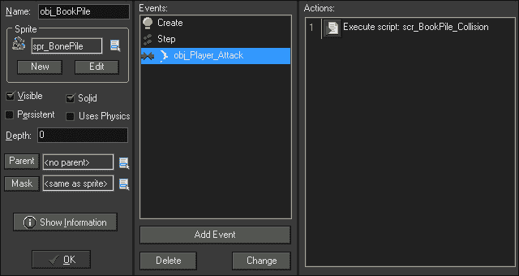

1.  现在我们需要构建幽灵。为此，我们需要引入两个精灵，一个用于生成，一个用于追逐。创建精灵时勾选**删除背景**，分别为`spr_Ghost`和`spr_Ghost_Spawn`，并加载`Chapter 4/Sprites/Ghost.gif`和`Chapter 4/Sprites/Ghost_spawn.gif`。

1.  在两个精灵中，将原点居中。

1.  将**深度：**字段设置为`-50`，这样幽灵将出现在大多数物体上方，但在玩家攻击物体下方。没有其他需要做的事情，所以点击**确定**。

1.  创建一个新的对象，`obj_Ghost`，并应用`spr_Ghost_Spawn`作为精灵。这将使生成动画成为初始精灵，然后我们将通过代码将其更改为常规幽灵。

1.  我们有几个变量需要在一个新的脚本`scr_Ghost_Create`中初始化，如下所示的代码：

```js
mySpeed = 2;
myRange = 150;
myBooks = 0;
isDissolving = false;
image_speed = 0.3; 
   alarm[0] = 6;
```

1.  我们设置了移动速度的变量，幽灵将在其中追踪的范围，生成幽灵的人（我们将通过书堆改变），以及幽灵是否已经返回到书堆的变量。请注意，幽灵的范围比书堆的范围大。这将确保幽灵立即开始追逐玩家。然后我们设置了动画速度，并设置了一个六步的警报，我们将用它来改变精灵。

1.  添加一个**Alarm0**事件，然后应用一个新的脚本，`scr_Ghost_Alarm0`，其中包含以下代码来改变精灵：

```js
sprite_index = spr_Ghost;
```

现在我们准备开始实现一些人工智能。幽灵将是最基本的敌人，会追逐玩家穿过房间，包括穿过墙壁和其他敌人，直到玩家超出范围。在那时，幽灵将漂浮回到它来自的书堆。

1.  我们将从追逐玩家开始。创建一个新的脚本，`scr_Ghost_Step`，并编写以下代码：

```js
if (instance_exists(obj_Player))
{
    targetDist = distance_to_object(obj_Player)
    if (targetDist < myRange)
    {       
        move_towards_point(obj_Player.x, obj_Player.y, mySpeed);
    }   
}
```

在确保玩家还活着之后，我们创建一个变量来保存幽灵到玩家的距离。我们创建`targetDist`变量的原因是我们将需要这个信息几次，这样可以避免每次有`if`语句时都重新检查距离。然后我们比较距离和追逐范围，如果玩家在范围内，我们就朝着玩家移动。`move_towards_point`函数会计算方向并将速度应用到该方向的对象上。

1.  添加一个**Step**事件并应用这个脚本。我们将继续向这个脚本添加代码，但它已经可以正常运行了。

1.  让我们花一点时间来测试我们到目前为止所做的一切。首先，在资源树中，将`Sandbox`移到接近顶部，这样它就是标题屏幕后的房间。打开`Sandbox`房间，并像以下截图所示，在边缘放置几个`obj_BookPile`的实例：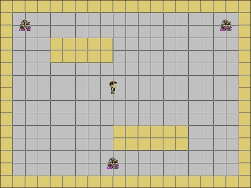

1.  运行游戏。如果你离书堆太近，一个幽灵会从中产生，并慢慢追逐玩家。如果玩家离幽灵太远，幽灵将继续朝着它最后的方向移动，并最终消失在屏幕外。

1.  让幽灵返回到它的书堆。在`scr_Ghost_Step`中，添加以下代码到玩家存在检查的大括号内：

```js
else if (targetDist > myRange && distance_to_point(myBooks.x, myBooks.y) > 4)
{      
move_towards_point(myBooks.x, myBooks.y, mySpeed);
}
```

首先我们检查玩家是否超出范围，而幽灵又不靠近自己的书堆。在这里，我们使用`distance_to_point`，这样我们就是检查书堆的原点而不是`distance_to_object`会寻找的碰撞区域的边缘。如果这一切都是真的，幽灵将开始向它的书堆移动。

1.  让我们再次运行游戏。和以前一样，幽灵会追逐玩家，如果玩家离得太远，幽灵将返回到它的书堆。

1.  幽灵最终会在书堆的顶部来回移动，这是一个问题。这是因为幽灵具有基于速度的速度，并且没有任何代码告诉它停下来。我们可以通过在最后的`else if`语句后添加以下代码来解决这个问题：

```js
else 
{
speed = 0;
if (isDissolving == false)
{
      myBooks.hasSpawned = false;
sprite_index = spr_Ghost_Spawn;
image_speed = -1;
alarm[1] = 6;
isDissolving = true;
}
}
```

这里有一个最终的`else`语句，如果玩家超出范围，幽灵靠近它的书堆，将执行。我们首先停止幽灵的速度。然后我们检查它是否可以溶解。如果可以，我们告诉书堆可以再次生成幽灵，我们将精灵改回生成动画，并通过将`image_speed`设置为`-1`来以相反的方式播放该动画。我们还设置了另一个警报，这样我们就可以将幽灵从世界中移除并停用溶解检查。

整个`scr_Ghost_Step`应该如下所示的代码：

```js
 if (instance_exists(obj_Player))
{
    targetDist = distance_to_object(obj_Player)
    if (targetDist < myRange)
    {       
        move_towards_point(obj_Player.x, obj_Player.y, mySpeed);
    } else if (targetDist > myRange && distance_to_point(myBooks.x, myBooks.y) > 4) {      
        move_towards_point(myBooks.x, myBooks.y, mySpeed);
    } else {
        speed = 0;
        if (isDissolving == false)
        {
            myBooks.hasSpawned = false;
            sprite_index = spr_Ghost_Spawn;
            image_speed = -1;
            alarm[1] = 6;
            isDissolving = true;
        }
    }
}
```

1.  需要一个最后的脚本，`scr_Ghost_Alarm1`，它附加在**Alarm 1**事件上，并有一行代码来移除实例：

```js
instance_destroy();
```

幽灵几乎完成了。它生成，追逐玩家，然后返回到它的 BookPile，但是如果它抓住了玩家会发生什么？对于这个幽灵，我们希望它撞到玩家，造成一些伤害，然后在一团烟雾中消失。为此，我们需要为死去的幽灵创建一个新的资源。

1.  创建一个新精灵`spr_Ghost_Dead`，并加载`Chapter 4/Sprites/Ghost_Dead.gif`，勾选**删除背景**。

1.  居中原点，然后点击**确定**。

1.  创建一个新的对象`obj_Ghost_Dead`，并应用该精灵。

1.  在一个新的脚本`scr_Ghost_Dead_AnimEnd`中，编写以下代码并将其附加到**动画结束**事件上：

```js
instance_destroy();
```

**动画结束**事件将在播放精灵的最后一帧图像时执行代码。在这种情况下，我们有一个烟雾的动画，在结束时将从游戏中移除对象。

1.  现在我们只需要重新打开`obj_Ghost`，并添加一个带有新脚本`scr_Ghost_Collision`的**obj_Player**事件，其中包含以下代码：

```js
health -= 5;
myBooks.hasSpawned = false;
instance_create(x, y, obj_Ghost_Dead);
instance_destroy();
```

我们首先减少五点生命值，然后告诉幽灵的 BookPile 它可以重新生成。接下来，我们创建幽灵死亡对象，当我们将其从游戏中移除时，它将隐藏真正的幽灵。如果一切构建正确，它应该看起来像以下截图：

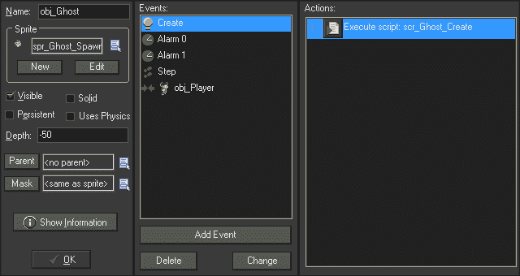

1.  运行游戏。现在，幽灵应该能够完全按照设计的方式运行。它会生成并追逐玩家。如果它抓住了玩家，它会造成伤害并消失。如果玩家逃脱，幽灵将返回到它的 BookPile 并消失。干得好！

最后一件事，由于房间是用来进行实验而不是实际游戏的一部分，我们应该清理房间，为下一个敌人做准备。

1.  打开`Sandbox`房间，并删除所有的 BookPiles 实例。

## 创建一个漫游的 Brawl

我们将创建的下一个敌人是一个 Brawl，它将在房间里漫游。如果玩家离这个敌人太近，Brawl 会变得愤怒，变得更大并移动得更快，尽管它不会离开它的路径。一旦玩家离开范围，它会恢复冷静，并缩小到原来的大小和速度。玩家无法杀死这个敌人，但是如果接触到 Brawl，它会对玩家造成伤害。

对于 Brawl，我们将利用一个路径，并且我们需要三个精灵：一个用于正常状态，一个用于状态转换，另一个用于愤怒状态。

1.  创建一个新精灵`spr_Brawl_Small`，并加载`Chapter 4/Sprites/Brawl_Small.gif`，勾选**删除背景**。这是正常状态的精灵。居中原点，然后点击**确定**。

1.  创建另一个新的精灵`spr_Brawl_Large`，并加载`Chapter 4/Sprites/Brawl_Large.gif`，勾选**删除背景**。我们需要将原点居中，以便 Brawl 能够正确缩放这个图像。愤怒状态是正常状态的两倍大小。

1.  我们还需要在这两种状态之间进行转换，因此让我们创建一个新的精灵`spr_Brawl_Change`，并加载`Chapter 4/Sprites/Brawl_Change.gif`，仍然勾选**删除背景**。不要忘记居中原点。

1.  接下来，我们需要一个 Brawl 要遵循的路径。创建一个新路径，并命名为`pth_Brawl_01`。

1.  我们希望 Brawl 移动起来更加平滑，因此在**连接类型**下勾选**平滑曲线**，并将**精度**更改为`8`。

1.  要看看我们可以用路径做些什么，让我们制作一个八字形状的路径，如下截图所示：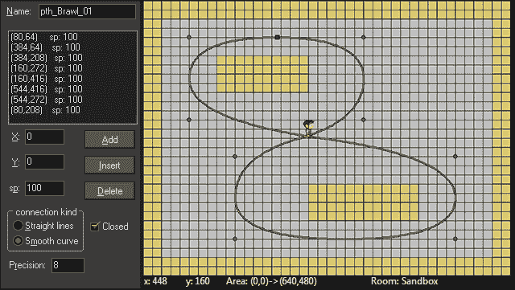

1.  让我们还创建一个新声音`snd_Brawl`，并加载`Chapter 4/Sounds/Brawl.wav`。

1.  创建一个新对象`obj_Brawl`，并将`spr_Brawl_S`应用为默认精灵。

1.  我们将从一个创建事件脚本`scr_Brawl_Create`中初始化一些变量。

```js
mySpeed = 2;
canGrow = false;
isBig = false;
isAttacking = false;
image_speed = 0.5;
sound_play(snd_Brawl);
sound_loop(snd_Brawl);
path_start(pth_Brawl_01, mySpeed, 1, true);
```

第一个变量设置了 Brawl 的基本速度。接下来的三个变量是变身和愤怒状态以及是否已攻击的检查。接下来，我们设置了动画速度，然后播放了 Brawl 声音，在这种情况下，我们希望声音循环。最后，我们将 Brawl 设置到速度为 2 的路径上；当它到达路径的尽头时，它将循环，最重要的是，路径设置为绝对，这意味着它将按照路径编辑器中设计的方式运行。

1.  现在我们可以开始处理 Brawl 的人工智能。为**Step**事件创建一个名为`scr_Brawl_Step`的新脚本，我们将从使移动工作开始。

```js
image_angle = direction;
if (isBig == true)
{
    path_speed = mySpeed * 2;
} else {
    path_speed = mySpeed;
}
```

我们首先通过旋转 Sprite 本身来使其面向正确的方向。这将起作用，因为我们的 Sprite 图像面向右侧，这与零度相同。接下来，我们检查 Brawl 是否变大。如果 Brawl 是愤怒版本，我们将路径速度设置为基本速度的两倍。否则，我们将速度设置为默认的基本速度。

1.  在房间的任何位置放置一个 Brawl 实例并运行游戏。Brawl 应该围绕数字八移动，并正确面向正确的方向。

1.  接下来，我们将添加第一个变身，变得愤怒。在上一行代码之后，添加：

```js
if (instance_exists(obj_Player))
{
    if (distance_to_object(obj_Player) <= 200) 
    {
        if (canGrow == false)
        {
            if (!collision_line(x, y, obj_Player.x, obj_Player.y, obj_Wall, false, true))
            {
                sprite_index = spr_Brawl_Change;
                alarm[0] = 12;
                canGrow = true;
            }      
        }
    }
}
```

我们首先确保玩家存在，然后检查玩家是否在范围内。如果玩家在范围内，我们检查自己是否已经愤怒。如果 Brawl 还没有变大，我们使用`collision_line`函数来查看 Brawl 是否真的能看到玩家。这个函数在两个点之间绘制一条线，即 Brawl 和玩家位置，然后确定一个对象实例或墙壁是否穿过了该线。如果 Brawl 能看到玩家，我们将 Sprite 更改为变身 Sprite，设置一个警报以便我们可以完成变身，并指示 Brawl 已经变大。

1.  让我们为**Alarm 0**事件创建一个名为`scr_Brawl_Alarm0`的脚本，其中包含将切换到愤怒的 sprite 并指示 Brawl 现在已经完全大小的代码。

```js
sprite_index = spr_Brawl_Large;
isBig = true;
```

1.  运行游戏以确保代码正常工作。Brawl 应该保持小尺寸，直到能清楚看到玩家，此时它将变换为大型、愤怒的 Brawl。

1.  Brawl 正在变大，现在我们需要让它平静下来并缩小。在`scr_Brawl_Step`中，添加一个距离检查的`else`语句，该语句将位于最终大括号之前，并添加以下代码：

```js
else 
{
if (canGrow == true)
{
sprite_index = spr_Brawl_Change;
alarm[1] = 12;
canGrow = false;
}
}
```

如果玩家超出范围，这个`else`语句将变为活动状态。我们检查 Brawl 是否仍然处于愤怒状态。如果是，我们将 Sprite 更改为变身状态，设置第二个警报，并指示 Brawl 已恢复正常。

以下是完整的`scr_Brawl_Step`脚本：

```js
image_angle = direction;
if (isBig == true)
{
    path_speed = mySpeed * 2;
} else {
    path_speed = mySpeed;
}

if (instance_exists(obj_Player))
{
    if (distance_to_object(obj_Player) <= 200) 
    {
        if (canGrow == false)
        {
            if (!collision_line(x, y, obj_Player.x, obj_Player.y, obj_Wall, false, true))
            {
                sprite_index = spr_Brawl_Change;
                alarm[0] = 12;
                canGrow = true;
            }      
        }
    } 
    else 
    {
        if (canGrow == true)
        {
            sprite_index = spr_Brawl_Change;
            alarm[1] = 12;
            canGrow = false;
        }
    }
}
```

1.  复制`scr_Brawl_Alarm0`脚本，将其命名为`scr_Brawl_Alarm1`，并根据以下代码调整值。记得将其添加为**Alarm 1**事件。

```js
sprite_index = spr_Brawl_Small;
isBig = false;
```

1.  运行游戏并确认，当玩家接近并在视线范围内时，Brawl 会变得更大更快，并在超出范围时恢复正常。

1.  我们唯一剩下的就是攻击。为**obj_Player**事件创建一个名为`scr_Brawl_Collision`的新脚本，其中包含以下代码：

```js
if (isAttacking == false)
{
    health -= 10;
    alarm[2] = 60;
    isAttacking = true;
}
```

如果玩家第一次与 Brawl 碰撞，我们会减少 10 点生命值并设置一个两秒的警报，让 Brawl 可以再次攻击。

1.  为了完成 Brawl，我们只需要最终的**Alarm 2**事件和一个新的脚本`scr_Brawl_Alarm2`，其中包含以下代码行：

```js
isAttacking = false;
```

Brawl 现在已经完成并按设计进行。如果一切实现正确，对象属性应该如下截图所示：

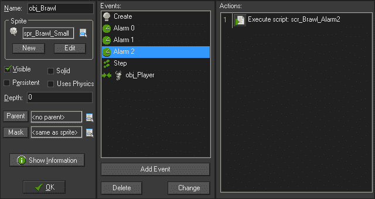

1.  从`Sandbox`房间中删除任何`obj_Brawl`实例，以便我们可以为最终敌人重新开始。

## 创建教练

我们将创建的最后一个敌人，教练，将是迄今为止最具挑战性的对手。这个敌人将在房间中四处移动，随机地从一个奖杯到另一个奖杯，以确保奖杯仍在那里。如果它看到玩家，它会追逐他们，如果足够接近，它会进行近战攻击。如果玩家逃脱，它会等一会儿然后返回岗位。教练有一个身体，所以它需要绕过障碍物，甚至避开其他教练。这也意味着如果玩家能够攻击它，它可能会死亡。

1.  由于这个敌人正在守卫某物，我们将从创建奖杯开始。创建一个新的精灵，`spr_Trophy`，并加载`Chapter 4/Sprites/Trophy.gif`，勾选**移除背景**。

1.  创建一个新的对象，`obj_Trophy`，并将`scr_Trophy`应用为其精灵。

1.  由于这是一个动画精灵，我们将添加一个**创建**事件，并通过在新脚本`scr_Trophy_Create`中编写以下代码来使其不进行动画：

```js
image_speed = 0;
image_index = 0;
```

1.  现在对于奖杯来说，这就是我们需要的全部，所以点击**确定**。

与玩家一样，我们需要四个精灵，代表敌人将移动的四个方向。

1.  创建一个新的精灵，`spr_Coach_WalkRight`，并加载`Chapter 4/Sprites/Coach_WalkRight.gif`，勾选**移除背景**。

1.  将原点居中，点击**修改掩码**，并在**边界框**下勾选**完整图像**。

1.  对于`spr_Coach_LWalkLeft`、`spr_Coach_WalkDown`和`spr_Coach_WalkUp`精灵，重复此过程。

1.  创建一个新的对象，`obj_Coach`，并将`spr_Coach_WalkRight`应用为其精灵。

我们将为这个敌人动态创建路径，以便它可以自行导航到奖杯。我们还希望它避开障碍物和其他敌人。这并不难实现，但在初始化时需要进行大量设置。

1.  创建一个新的脚本，`scr_Coach_Create`，将其应用于**创建**事件，然后我们将从一些基本变量开始：

```js
mySpeed = 4;
isChasing = false;
isWaiting = false;
isAvoiding = false;
isAttacking = false;
image_speed = 0.3;
```

再次，我们首先设置对象的速度。然后我们有四个变量，表示我们需要检查的各种状态，全部设置为`false`。我们还设置了精灵的动画速度。

接下来，我们需要设置路径系统，该系统将利用 GameMaker 的一些**运动规划**功能。基本概念是我们创建一个覆盖敌人移动区域的网格。然后我们找到所有我们希望敌人避开的对象，比如墙壁，并将网格的这些区域标记为禁区。然后我们可以在自由区域中分配起点和目标位置，并在避开障碍物的情况下创建路径。

1.  在`scr_Coach_Create`中，将以下代码添加到脚本的末尾：

```js
myPath = path_add();
myPathGrid = mp_grid_create(0, 0, room_width/32, room_height/32, 32, 32);
mp_grid_add_instances(myPathGrid, obj_Wall, false);
```

首先需要一个空路径，我们可以用于所有未来的路径。接下来，我们创建一个网格，该网格将设置路径地图的尺寸。`mp_grid_create`属性有参数，用于确定其在世界中的位置，宽度和高度有多少个网格，以及每个网格单元的大小。在这种情况下，我们从左上角的网格开始，以 32 像素的增量覆盖整个房间。将房间尺寸除以 32 意味着这将适用于任何尺寸的房间，而无需调整代码。最后，我们将在房间中找到的所有墙的实例添加到网格中，作为不允许路径的区域。

1.  现在，我们需要为教练找到一个目的地。继续在脚本的末尾添加以下代码：

```js
nextLocation = irandom(instance_number(obj_Trophy)-1);
target = instance_find(obj_Trophy, nextLocation);
currentLocation = nextLocation;
```

我们首先得到一个基于房间中奖杯数量的四舍五入随机数。请注意，我们从奖杯数量中减去了一个。我们需要这样做，因为在下一行代码中，我们使用`instance_find`函数搜索特定实例。这个函数是从数组中提取的，数组中的第一项总是从零开始。最后，我们创建了第二个变量，用于当我们想要改变目的地时。

1.  现在我们所要做的就是创建路径并使用它。在脚本的末尾添加以下代码：

```js
mp_grid_path(myPathGrid, myPath, x, y, target.x, target.y, false);
path_start(myPath, mySpeed, 0, true);
```

在这里，我们选择了我们创建的网格和空路径，并创建了一个新的路径，该路径从教练的位置到目标位置，并且不会对角线移动。然后我们让教练动起来，这一次，当它到达路径的尽头时，它将停下来。`path_start`函数中的最终值将路径设置为绝对值，在这种情况下我们需要这样做，因为路径是动态创建的。

这是整个`scr_Coach_Create`脚本：

```js
mySpeed = 4;
isChasing = false;
isWaiting = false;
isAvoiding = false;
isAttacking = false;
image_speed = 0.3;

myPath = path_add();
myPathGrid = mp_grid_create(0, 0, room_width/32, room_height/32, 32, 32);
mp_grid_add_instances(myPathGrid, obj_Wall, false);

nextLocation = irandom(instance_number(obj_Trophy)-1);
target = instance_find(obj_Trophy, nextLocation);
currentLocation = nextLocation;

mp_grid_path(myPathGrid, myPath, x, y, target.x, target.y, false);
path_start(myPath, mySpeed, 0, true); 
```

1.  打开 Sandbox，在角落放置两个`obj_Coach`实例，以及三个`obj_Trophy`实例，如下截图所示：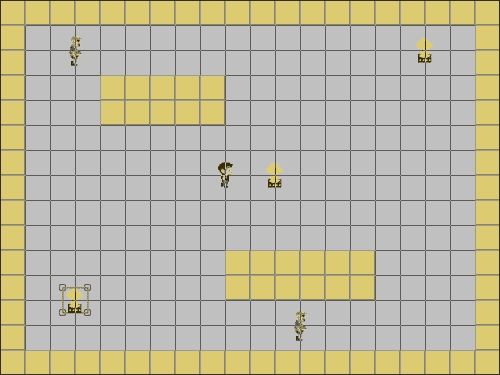

1.  运行游戏。您应该看到教练们随机选择一个奖杯并朝它移动。尝试重新启动几次，看看每个教练所采取的不同路径。

1.  基本设置完成后，我们可以继续进行 AI。我们将从根据移动方向切换精灵开始。创建一个新的脚本`scr_Coach_Step`，将其应用于**Step**事件，并编写以下代码：

```js
if (direction > 45 && direction <= 135) { sprite_index = spr_Coach_WalkUp; }
else if (direction > 135 && direction <= 225) { sprite_index = spr_Coach_WalkLeft; }
else if (direction > 225 && direction <= 315) { sprite_index = spr_Coach_WalkDown; }
else { sprite_index = spr_Coach_WalkRight; }
```

在这里，我们根据实例移动的方向更改精灵。我们可以在这里做到这一点，因为我们不允许在路径上进行对角线移动。

1.  接下来，我们将让教练观察玩家，如果被发现，他们将离开原来的路径进行追逐。在精灵更改代码之后添加以下代码：

```js
targetDist = distance_to_object(obj_Player);
if (targetDist < 150  && targetDist > 16)
{
    canSee = collision_line(x, y, obj_Player.x, obj_Player.y, obj_Wall, false, false)
    if (canSee == noone)
    {
        path_end();
        mp_potential_step(obj_Player.x, obj_Player.y, 4, all);
        isChasing = true;
    }
 }
```

我们再次使用一个变量来保存玩家距离的值，以节省编码时间并最小化函数调用。如果玩家在范围内且不在攻击距离内，我们进行视线检查。`collision_line`函数返回线穿过的任何墙实例的 ID。如果它不与任何墙实例相交，它将返回一个名为`noone`的特殊变量。如果玩家在视线中，我们结束教练正在遵循的路径，并开始朝玩家移动。`mp_potential_step`函数将使对象朝着期望的方向移动，同时避开障碍物，在这种情况下，我们避开所有实例。最后，我们指示教练正在追逐玩家。

1.  这对于开始追逐很有效，但是如果玩家逃脱了怎么办？让教练等待一会儿，然后回到巡逻。在进行视线检查的`else`语句中添加以下代码：

```js
else if (canSee != noone && isChasing == true)
{
    alarm[0] = 60;
    isWaiting = true;
    isChasing = false;
}
```

这个`else`语句表示，如果玩家看不见并且教练正在追逐，它将设置一个警报以寻找新目的地，告诉它等待，追逐结束。

1.  我们设置了一个警报，因此让我们创建一个新的脚本`scr_Coach_Alarm0`，并将其应用于**Alarm 0**事件。在脚本中写入以下代码：

```js
while (nextLocation == currentLocation)
{
    nextLocation = irandom(instance_number(obj_Trophy)-1);
}

target = instance_find(obj_Trophy, nextLocation);
currentLocation = nextLocation;

mp_grid_path(myPathGrid, myPath, x, y, target.x, target.y, false);
path_start(myPath, mySpeed, 1, false);

isWaiting = false;
```

我们首先使用一个`while`循环来检查下一个位置是否与旧位置相同。这将确保教练总是移动到另一个奖杯。就像我们在初始设置中所做的那样，我们选择一个新的目标并设置当前位置变量。我们还创建一个路径并开始在其上移动，这意味着教练不再等待。

1.  我们还需要添加一个元素到追逐序列中，即攻击。如果教练靠近玩家，它应该对玩家进行近战攻击。为此，我们首先需要创建一个新的精灵`spr_Coach_Attack`，加载`Chapter 4/Sprites/Coach_Attack.gif`并勾选**Remove Background**。

1.  就像玩家的攻击一样，将**Origin**设置为**X:**`-16`，**Y:**`24`，并调整**Bounding Box**的值为**Left:**`0`，**Right:**`24`，**Top:**`0`，和**Bottom:**`4`。

1.  创建一个新的对象`obj_Coach_Attack`，应用精灵，并将**Depth**设置为`-100`。

1.  添加一个**Create**事件，并应用一个新的脚本`scr_Coach_Attack_Create`，其中包含控制动画速度的代码，设置一个用于移除实例的警报，并一个我们可以打开的变量。

```js
image_speed = 0.3;
alarm[0] = 6;
isHit = false;
```

1.  使用新的脚本`scr_Coach_Attack_Alarm0`添加一个**Alarm 0**事件，该脚本会移除实例。

```js
instance_destroy();
```

1.  最后，添加一个**obj_Player**事件，并应用一个新的脚本`scr_Coach_Attack_Collision`，其中包含以下代码：

```js
if (isHit == false)
{
    health -= 15;
    isHit = true;
}
```

如果这是第一次碰撞，我们减少一点生命值，然后停用此检查。

1.  攻击已经完成。现在要在教练中激活它，重新打开`scr_Coach_Step`，并在最后的大括号后添加攻击代码作为`else if`语句：

```js
else if (targetDist <= 16)
{
    if (isAttacking == false)
    {
        swing = instance_create(x, y, obj_Coach_Attack);
        swing.image_angle = direction;
        alarm[1] = 90;
        isAttacking = true;
    }
}
```

如果教练靠近玩家但尚未发动攻击，我们创建一个教练攻击的实例。然后我们旋转攻击精灵，使其面向与教练相同的方向。设置一个三秒的闹钟，以便在再次运行此代码之前有时间喘口气。

1.  我们需要一个**Alarm 1**事件来重置攻击，因此创建一个新脚本，`scr_Coach_Alarm1`，并关闭攻击。

```js
isAttacking = false;
```

1.  运行游戏。现在教练会追逐玩家，如果它靠近玩家足够近，它就会发动攻击。

教练现在只完成了一半的工作，追逐玩家。我们还需要添加正常的巡逻任务。目前，如果教练看不到玩家并且到达路径的尽头，它就会停下来再次什么都不做。它应该只等几秒，然后继续移动到下一个奖杯。

1.  重新打开`scr_Coach_Step`，并在脚本的最后添加一个`else`语句，包含以下代码：

```js
else 
{
    if (isWaiting == false)
    {
        if (distance_to_object(target) <= 8) 
        {
            alarm[0] = 60;
            path_end();
            isWaiting = true;
        }
    }
}
```

这个`else`语句表示玩家超出范围。然后我们检查教练是否在等待。如果它不在等待，但距离目标奖杯不到八个像素，我们设置两秒钟的选择新目的地的闹钟，结束路径以停止移动，并声明我们现在在等待。

1.  运行游戏，你会看到教练在不追逐玩家时，停在奖杯附近，停顿片刻，然后移动到另一个奖杯。

1.  然而，如果两个教练都去同一个奖杯，就会出现问题。让我们通过在检查奖杯的距离后添加以下代码来解决这个问题：

```js
if (isAvoiding == true)
{
     mp_potential_step (target.x, target.y, 4, all);
}
```

我们需要做的第一件事是检查变量，看教练是否需要避让。如果需要，我们使用`mp_potential_step`函数，该函数将使实例朝着指定目标移动，同时尝试避开某些对象，或者在这种情况下，避开所有实例。

1.  现在，我们需要设置避让发生的条件。在最后的代码之后立即插入以下内容：

```js
 if (distance_to_object(obj_Coach) <= 32 && isAvoiding == false)
 {
     path_end();
     isAvoiding = true;
 }
 else if (distance_to_object(obj_Coach) > 32 && isAvoiding == true)
 {
     mp_grid_path(myPathGrid, myPath, x, y, target.x, target.y, false);
     path_start(myPath, mySpeed, 1, true);
     isAvoiding = false;
 }
```

首先，我们检查教练实例是否附近，且尚未尝试避让。如果是，则我们让教练脱离路径并开始避让。接着是一个`else if`语句，检查我们是否与另一个教练足够远，以便我们可以避让。如果是，我们为目的地设置一个新路径，开始移动，并结束避让。

1.  还有一个小问题尚未解决，如果你运行游戏一段时间就会发现。有时两辆教练会靠得太近，它们就会停下来。这是因为它们试图避开彼此，但实际上它们是在接触并且无法分开。在`scr_Coach_Step`脚本的最后，写入以下内容：

```js
if (place_meeting(x, y, obj_Coach))
{
    x = xprevious;
    y = yprevious;
    mp_potential_step(target.x, target.y, 4, all);
}
```

这将检查两个教练实例是否相互碰撞。如果是，我们将`x`和`y`坐标设置为特殊变量`xprevious`和`yprevious`，它们代表实例在上一步中的位置。一旦它们退后一步，我们就可以再次尝试绕过它们。

教练现在已经完成。要检查`scr_Coach_Step`的所有代码是否都写正确，这里是完整的代码：

```js
if (direction > 45 && direction <= 135) { sprite_index = spr_Coach_WalkUp; }
else if (direction > 135 && direction <= 225) { sprite_index = spr_Coach_WalkLeft; }
else if (direction > 225 && direction <= 315) { sprite_index = spr_Coach_WalkDown; }
else { sprite_index = spr_Coach_WalkRight; }

targetDist = distance_to_object(obj_Player);
if (targetDist < 150  && targetDist > 16)
{
    canSee = collision_line(x, y, obj_Player.x, obj_Player.y, obj_Wall, false, false)
    if (canSee == noone)
    {
        path_end();
        mp_potential_step(obj_Player.x, obj_Player.y, 4, all);
        isChasing = true;
    }
    else if (canSee != noone && isChasing == true)
    {
        alarm[0] = 60;
        isWaiting = true;
        isChasing = false;
    }
}
else if (targetDist <= 16)
{
    if (isAttacking == false)
    {
        swing = instance_create(x, y, obj_Coach_Attack);
        swing.image_angle = direction;
        alarm[1] = 90;
        isAttacking = true;
    }
}
else 
{
    if (isWaiting == false)
    {
        if (distance_to_object(target) <= 8)
        {
            alarm[0] = 60;
            path_end();
            isWaiting = true;
        }
        if (isAvoiding == true)
        {
            mp_potential_step(target.x, target.y, 4, all);
        }
        if (distance_to_object(obj_Coach) <= 32 && isAvoiding == false)
        {
            path_end();
            isAvoiding = true;
        }
        else if (distance_to_object(obj_Coach) > 32 && isAvoiding == true)
        {
            mp_grid_path(myPathGrid, myPath, x, y, target.x, target.y, false);
            path_start(myPath, mySpeed, 1, true);
            isAvoiding = false;
        }
    }
}
if (place_meeting(x, y, obj_Coach))
{
    x = xprevious;
    y = yprevious;
    mp_potential_step(target.x, target.y, 4, all);
}
```

# 为游戏添加最后的细节

游戏现在在功能上已经完成，但还有一些元素需要完善。首先，玩家会受到伤害，但从不会死亡，也没有**头顶显示**（**HUD**）来显示这一点。让我们快速创建一个 Overlord。

1.  创建一个新对象，`obj_Overlord`，不应用精灵并检查持久性。

1.  添加一个**Draw GUI**事件和一个新的脚本，`scr_Overlord_DrawGUI`，其中包含以下代码：

```js
draw_healthbar(0, 0, 200, 16, health, c_black, c_red, c_green, 0, true, true);

if (health <= 0)
{
    with (obj_Player) { instance_destroy(); }
    room_goto(TitleScreen);
    instance_destroy();
}
```

首先，我们使用了函数`draw_healthbar`，你可以看到它有很多参数。前四个是矩形条的大小和位置。接下来是用于控制条的满度的变量，在我们的例子中是全局健康变量。接下来的三个是背景颜色和最小/最大颜色。接下来是条应该下降的方向，零表示向左。最后两个布尔值是用于绘制我们想要的背景和边框。

之后，我们进行健康检查，如果玩家应该死了，我们移除玩家，返回前端，然后移除 Overlord 本身。移除世界中的任何持久实例是很重要的，否则它们就不会消失！

1.  将一个`obj_Overlord`的实例放入`C04_R01`中。

1.  用各种敌人填充房间。如果我们使用 Brawl，我们要么需要创建一个适用于我们创建的路径的房间，要么更好的是重新绘制路径以适应我们的房间布局。

1.  确保`Sandbox`房间被移回到资源树的底部并运行游戏。我们应该在屏幕顶部看到健康条，如果受到伤害，健康条应该下降。如果玩家受到了太多伤害，游戏将结束并返回到前端。

所有剩下的就是创建关卡，用瓷砖集来绘制世界，并添加一些背景音乐。在这一点上，你应该知道如何做了，所以我们会把它留给你。我们已经在“第四章”文件夹中提供了一些额外的资源。完成后，你应该会看到类似以下截图的东西：


# 摘要

恭喜你完成了你的第二个游戏！我们学会了通过将键盘检查和碰撞预测放入一个脚本来简化玩家控制。我们涵盖了处理精灵动画的几种方法，从旋转图像到设置应该显示哪些精灵。我们处理了全局变量，并用它们来实现了一个房间过渡系统。我们深入讨论了一些新的对象属性和持久性。然后我们花了一些时间处理人工智能，通过接近检测和路径查找。我们甚至发现了如何使一个对象在避开障碍物的同时自己导航到一个房间。

通过本章中所学的技能，你现在可以构建具有多个房间和敌人的游戏，这些敌人看起来会思考。现在轮到你通过添加更多独特的敌人、打开奖杯并生成战利品来扩展这个游戏了。玩得开心，探索你新发现的能力！

在下一章中，我们将为平台游戏构建一场史诗般的 boss 战。将会有枪支和激光，还有很多乐趣。我们将开始通过创建可重复使用的脚本，以及学习如何系统地构建我们的代码来提高代码的效率。所有这些都将帮助我们使游戏变得更快更容易，所以让我们开始吧！
