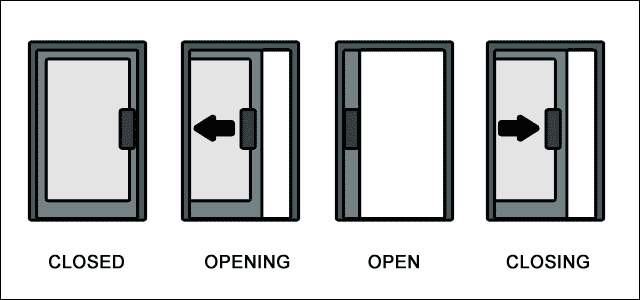
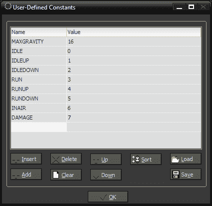
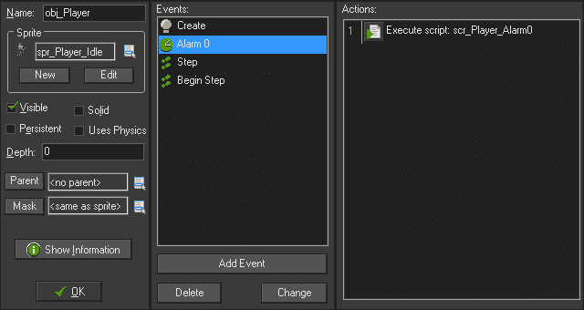
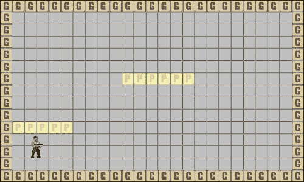
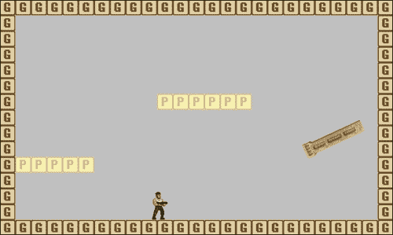
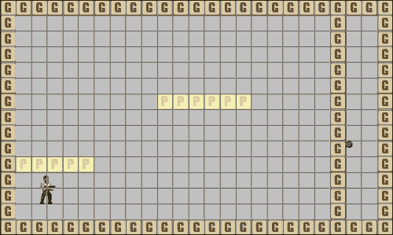
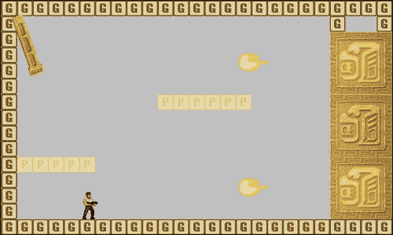
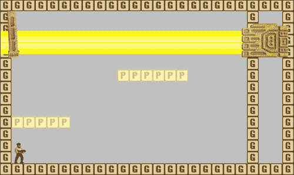
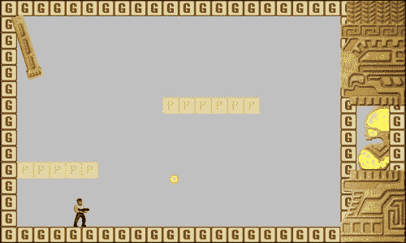
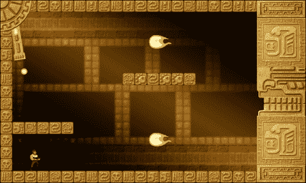

# 第五章：平台乐趣

现在我们对构建游戏的基础有了很好的基础，我们准备创建更复杂和更高效的项目。在本章中，我们将开发一个经典的平台游戏，其中包括一场史诗般的 Boss 战。我们将专注于构建系统，并利用可重复使用的脚本简化我们的代码并节省时间。这也将减少游戏的总体大小，使其下载速度更快。

游戏本身将包括一个玩家角色，可以在世界中奔跑，跳上平台，并朝多个方向射击。玩家需要击败一个巨型机器 Boss，它将有三个不同的阶段。在第一阶段，玩家需要摧毁三门暴露一小段时间的强大火炮。第二阶段需要摧毁一个大型激光炮，它会上下移动，不时地发射巨大的激光束。最后一个阶段将有护盾保护 Boss 核心，偶尔打开以允许玩家消灭 Boss 的核心。所有这些都将发生在玩家试图避免被一门不可摧毁的炮塔击中的情况下。

# 构建基于系统的代码结构

制作游戏时，通常会单独构建每个组件，而不考虑它将如何影响整个游戏。开发人员将构建一个基本框架，然后在需要时添加功能，通常会使用特殊的条件语句使代码能够正常工作而不破坏游戏。这种方法最终会在软件中产生错误，需要更多的时间和精力来修复每一个错误。游戏越大，出现问题的可能性就越大。这可能是一种令人沮丧的经历。

将代码分解为单独的系统可以真正节省时间和精力。我们可以将代码的各个元素写入脚本中，以便共享，而不是为每个对象一遍又一遍地重写代码。对于这个游戏，我们将把一些更基本的组件，比如重力和动画，分离成它们自己的系统。

## 创建重力

我们要构建的第一个系统是处理重力的系统。虽然 GameMaker: Studio 确实有一个重力属性，但在平台游戏中并不需要这种复杂性。重力是一个作用于物体速度的力，这意味着物体下落的时间越长，速度就越快。我们的问题是将重力设置为零只意味着它不会移动得更快。我们需要物体完全停下来。因此，我们将创建自己的重力系统，不仅使物体下落，还将处理着陆的情况。我们将创建自己的重力系统，不仅使物体下落，还将处理着陆的情况。

我们将首先介绍**常量**。常量允许我们使用名称来表示永远不会改变的值。这不仅使我们更容易阅读代码，还有助于提高性能，与变量相比：

1.  让我们开始创建一个名为`Chapter_03`的**新项目**。

1.  打开**资源** | **定义常量**编辑器。在**名称**列中写入`MAXGRAVITY`，**值**为`16`。以这个速度，我们可以确保下落的物体不会移动得太快，以至于错过游戏中另一个物体的边界框。从现在开始，每当我们看到`MAXGRAVITY`，计算机将看到`16`。

### 注

按照惯例，将所有常量都用大写字母写出，尽管如果不遵循惯例，也不会出错。

1.  接下来，我们可以创建一个新的脚本，`scr_Gravity`，并编写以下代码来创建重力：

```js
if (place_free( x, y + vspeed + 1))
{
    vspeed  += 1;
} else {    
    move_contact_solid(direction, MAXGRAVITY);
    vspeed = 0;
}
```

首先，我们检查实例下方的区域是否没有任何可碰撞的对象以当前速度行进。如果清晰，那么我们知道我们在空中，应该施加重力。我们通过每一步增加垂直速度的小量来实现这一点。如果有可碰撞的对象，那么我们即将着地，所以我们将实例移动到对象表面，以实例当前向上行进的方向到我们的`MAXGRAVITY`，即 16 像素。在那一点，实例在地面上，所以我们将垂直速度设为零。

1.  现在我们已经让重力起作用了，但如果我们不限制实例下落的速度，它将会加速得太快。将以下代码添加到脚本的底部：

```js
vspeed = min(vspeed, MAXGRAVITY);
```

在这里，我们将`vspeed`值设置为当前`vspeed`和`MAXGRAVITY`之间的较小值。如果实例移动得太快，这段代码将使其减速到允许的最大速度。现在我们有了一个简单的重力系统，游戏中的所有对象都可以利用它。

## 构建动画系统

我们将创建的下一个系统是动画系统，它将作为状态机实现。状态机将所有对象的条件分解为不同的状态。一个对象在任何时候只能处于一个阶段，因此与之相关的代码可以更有效地被包含和管理。

为了更好地理解这个概念，想想一扇门。一扇门有几种独特的状态。可能首先想到的两种状态是门可以打开或者关闭。还有两种其他状态，即打开和关闭，如下图所示。如果门正在打开，它既不是打开的，也不是关闭的，而是处于一种独特的动作状态。这使得状态机非常适合动画。游戏中几乎每个可交互的对象都可能有一些动画或利用几个不同的图像。



由于玩家角色通常是在不同动画方面最强大的对象，我们将首先分解其独特的状态。我们的玩家可以在空中或地面上，所以我们希望确保分开这些控制。我们还希望玩家能够朝多个方向射击并受到伤害。总共我们将有八种不同的状态：

+   空闲

+   空闲向上瞄准

+   空闲向下瞄准

+   奔跑

+   奔跑向上瞄准

+   向下瞄准

+   在空中

+   伤害

让我们首先将这些状态定义为常量：

1.  打开**资源** | **定义常量**编辑器，在**名称**列中写入`IDLE`，**值**为`0`。

1.  点击**添加**或直接按*Enter*添加新行，并写入`IDLEUP`，值为`1`。重复这个过程，为所有状态添加递增的数字，如下截图所示。然后点击**确定**。

1.  创建一个新的脚本，命名为`scr_Animation_Control`。我们将首先使用`switch`语句来控制各种状态。我们还希望这个脚本是可重用的，所以我们将使用一些通用变量来使代码更通用。让我们首先添加空闲状态的以下代码：

```js
switch (action)
{
    case IDLE :
        sprite_index = myIdle;
        image_speed = 0.1;
    break;
}
```

在这里，我们将使用一个名为`action`的变量来切换状态。如果动作恰好是`IDLE`，那么我们就改变精灵；在这种情况下，我们使用另一个变量`myIdle`，我们将在每个对象中定义它，这将允许我们重用这个脚本。我们还设置了动画速率，这将允许我们对不同的动作有不同的播放速度。

1.  我们需要将所有的情况插入到这个脚本中，并设置改变精灵和设置图像播放速度的类似设置。以下是其他状态的代码：

```js
    case IDLEUP :
        sprite_index = myIdleUp;
        image_speed = 0.1;
    break;
    case IDLEDOWN :
        sprite_index = myIdleDown;
        image_speed = 0.1;
    break;
    case RUN :
        sprite_index = myRun;
        image_speed = 0.5;
    break; 
    case RUNUP :
        sprite_index = myRunUp;
        image_speed = 0.5;
    break; 
    case RUNDOWN :
        sprite_index = myRunDown;
        image_speed = 0.5;
    break; 
    case INAIR :
        sprite_index = myInAir;
        image_speed = 0.5;
    break; 
    case DAMAGE :
        sprite_index = myDamage;
        image_speed = 0.5;
    break; 
```

1.  我们已经拥有了所有需要的状态，但是如何处理玩家面对的方向呢？这是一个平台游戏，所以他们需要向左和向右移动。为此，我们将通过以下代码在 switch 语句结束括号后翻转图像：

```js
image_xscale = facing;
```

我们再次利用一个变量`facing`，使脚本更通用。我们现在已经完成了这个脚本，动画系统已经准备好实施了。

## 创建碰撞预测系统

接下来我们要构建的系统是处理世界碰撞。我们希望摆脱使用 GameMaker: Studio 的碰撞系统，因为它需要两个实例相互交叉。这对于子弹与玩家的碰撞效果很好，但如果玩家需要陷入地面以知道何时停止，这种方法就不太有效。相反，我们希望在实例移动之前预测碰撞是否会发生：

1.  我们将从预测实例左右两侧的墙壁碰撞开始。创建一个新的脚本，`scr_Collision_Forecasting`，并写入以下代码：

```js
if (place_free(x - mySpeed, y))
{
    canGoLeft = true;
} else {
    canGoLeft = false;
    hspeed = 0;
}

if (place_free(x + mySpeed, y))
{
    canGoRight = true;
} else {
    canGoRight = false;
    hspeed = 0;
}
```

我们首先检查实例左侧的区域是否没有可碰撞的对象。我们正在查看的距离由变量`mySpeed`确定，这将允许此检查根据实例可能的移动速度进行调整。如果区域清晰，我们将`canGoLeft`变量设置为`true`，否则该区域被阻塞，我们将停止实例的水平速度。然后我们重复此检查以检查右侧的碰撞。

1.  接下来我们需要检查地面碰撞。在上一段代码之后，我们需要添加：

```js
if (!place_free(x, y+1))
{
    isOnGround = true;
    vspeed = 0;
    action = IDLE;
} else {
    isOnGround = false;
}
```

在这里，我们正在检查实例正下方是否有可碰撞的对象。如果发生碰撞，我们将变量`isOnGround`设置为`true`，以停止垂直速度，然后将实例的状态更改为`IDLE`。像这样更改状态将确保实例从`INAIR`状态中逃脱。

此时，我们已经构建了大部分碰撞检测，但我们还没有涵盖所有边缘情况。我们目前只检查实例的左侧、右侧和下方，而不是对角线。问题在于所有条件可能都成立，但当实例以角度移动时，可能导致实例被卡在可碰撞的对象内。

1.  与其为所有角度构建条件检查，我们将允许碰撞发生，然后将其弹回到正确的位置。在脚本的末尾添加下面的代码：

```js
if (!place_free(x, y)) 
{ 
    x = xprevious;
    y = yprevious;
    move_contact_solid(direction, MAXGRAVITY);
    vspeed = 0;
}
```

在这里，我们正在检查实例当前是否与可碰撞的对象相交。如果是，我们将 X 和 Y 坐标设置为上一步的位置，然后将其捕捉到移动方向的表面并将垂直速度设置为零。这将以一种现实的方式清理边缘情况。整个脚本应该如下所示：

```js
if (place_free(x - mySpeed, y))
{
    canGoLeft = true;
} else {
    canGoLeft = false;
    hspeed = 0;
}

if place_free(x + mySpeed, y)
{
    canGoRight = true;
} else {
    canGoRight = false;
    hspeed = 0;
}

if (!place_free(x, y+1))
{
    isOnGround = true;
    vspeed = 0;
    action = IDLE;
} else {
    isOnGround = false;
}

if (!place_free(x, y)) 
{ 
    x = xprevious;
    y = yprevious;
    move_contact_solid(direction, MAXGRAVITY);
    vspeed = 0;
}
```

## 检查键盘

当我们将系统分解为更可用的脚本时，我们也可以将所有键盘控件放入一个单独的脚本中。这将简化我们将来要创建的代码，并且还可以轻松更改控件或提供替代控件。

创建一个新的脚本，`scr_Keyboard_Input`，并写入以下代码：

```js
keyLeft  = keyboard_check(vk_left);
keyRight  = keyboard_check(vk_right);
keyDown  = keyboard_check(vk_down);
keyUp  = keyboard_check(vk_up);
keyJump = keyboard_check(ord('X'));
keyShoot = keyboard_check(ord('Z'));
```

我们的代码将更容易阅读，例如使用`keyJump`和`keyShoot`等变量来表示控件，而不是实际的键名。为了在键盘上使用字母键，我们需要相关的 ASCII 编号。我们可以使用`ord`函数，而不必查找每个键的编号，它将把字母转换为正确的数字。

### 注意

在使用`ord`函数时，始终使用大写字母，否则可能会得到错误的数字！

我们现在已经拥有了这个游戏所需的所有通用系统。接下来我们将实施它们。

# 构建玩家

我们正在构建的玩家角色是我们迄今为止创建的最复杂的对象。玩家不仅会奔跑和跳跃，控制本身也会因玩家是在地面上还是在空中而略有不同。玩家需要知道他们面向的方向，要播放什么动画，是否可以射击武器以及射击的角度。让我们从导入所有精灵开始构建这个：

1.  创建一个新精灵，`spr_Player_Idle`，并加载`Chapter 5/Sprites/Player_Idle.gif`，勾选**删除背景**。

1.  将**原点**设置为**X**：`32` **Y**：`63`，使其在水平中心和垂直底部休息。

1.  单击**修改蒙版**以打开**蒙版属性**编辑器，并选择**边界框**|**手动**。将值设置为**左**：`16`，**右**：`48`，**上**：`8`，**下**：`63`。

1.  重复此过程，包括以下精灵的相同**原点**和**蒙版属性**：

+   `spr_Player_IdleUp`

+   `spr_Player_IdleDown`

+   `spr_Player_Run`

+   `spr_Player_RunUp`

+   `spr_Player_RunDown`

+   `spr_Player_InAir`

+   `spr_Player_Damage`

1.  创建一个对象，`obj_Player`，并将`spr_Player_Idle`分配为**精灵**。

1.  首先，我们需要初始化玩家角色所需的所有变量，从必要的动画变量开始。创建一个新脚本，`scr_Player_Create`，并使用以下代码：

```js
myIdle = spr_Player_Idle;
myIdleUp = spr_Player_IdleUp;
myIdleDown = spr_Player_IdleDown;
myRun = spr_Player_Run;
myRunUp = spr_Player_RunUp;
myRunDown = spr_Player_RunDown;
myInAir = spr_Player_InAir;
myDamage = spr_Player_Damage;
```

在这里，我们正在确定要用于各种动画状态的精灵。我们在这里使用的变量必须与我们在`scr_Animation_Control`中声明的变量相同，以便使用我们创建的动画系统。

1.  接下来，我们将为碰撞系统添加变量，但在这之前，我们应该添加两个用于面向方向的常量。打开**资源**|**定义常量**，并添加`RIGHT`，值为`1`，和`LEFT`，值为`-1`。这些数字将代表绘制图像的比例，负值将反转精灵。

1.  在`scr_Player_Create`的末尾添加我们需要的其余变量：

```js
mySpeed = 8;
myAim = 0;
facing = RIGHT;
action = IDLE;
isDamaged = false;
canFire = true;
```

这里有玩家速度、玩家瞄准方向、玩家面向方向和玩家状态的变量。我们还添加了玩家是否能受到伤害或无敌，以及是否能射击的变量。现在我们已经初始化了所有变量。

1.  在`obj_Player`中，添加一个**创建**事件并应用`scr_Player_Create`脚本。

1.  我们已经准备好了一个碰撞预测系统，我们只需要适当地使用它。创建一个新脚本，`scr_Player_BeginStep`，并使用它来调用预测脚本和键盘检查：

```js
scr_Collision_Forecasting();
scr_Keyboard_Input();
```

您创建的每个脚本实际上都是一个可执行函数。如您在这里所见，您只需编写脚本的名称并在末尾放置括号，即可运行该代码。我们将经常使用这种方法。

1.  在`obj_Player`中添加一个**步骤**|**开始步骤**事件，并应用`scr_Player_BeginStep`。**开始步骤**事件是每个步骤中要执行的第一个事件。**步骤**事件紧随其后，**结束步骤**是在实例被绘制在屏幕上之前的最后一个事件。这使我们能够更好地控制代码的运行时间。

1.  接下来，我们需要创建控件。正如我们之前提到的，实际上有两个独立的控制系统，一个用于在地面上，一个用于在空中。我们将从后者开始，因为它最简单。创建一个新脚本，命名为`scr_Player_AirControls`，并使用以下代码：

```js
scr_Gravity();

if (keyLeft && canGoLeft) 
{
    if (hspeed > -mySpeed) { hspeed -= 1; }
    facing = LEFT;
    myAim = 180;
}
if (keyRight && canGoRight) 
{
    if (hspeed < mySpeed) { hspeed += 1; }
    facing = RIGHT;
    myAim = 0;
}
```

您应该注意到的第一件事是，我们不再在代码中使用`==`等运算符。这些变量都是布尔变量，因此它们只能是真或假。编写`keyLeft`与编写`keyLeft == true`是相同的，但更有效率。

现在，由于玩家在空中，我们首先要做的是施加重力。接下来是水平移动的控制。我们检查适当的键是否被按下，以及玩家是否能够朝着该方向移动。如果这些条件成立，我们就检查水平速度是否达到了最大速度。如果玩家能够增加速度，我们就稍微增加它。这可以防止玩家在空中太快地改变方向。然后我们设置面向和瞄准方向。

1.  现在我们可以转向更加复杂的地面控制。创建一个新的脚本，命名为`scr_Player_GroundControls`。我们将从编写空闲状态开始：

```js
if (!keyLeft && !keyRight) 
{
    if (hspeed >= 1) { hspeed -= 1; }
    if (hspeed <= -1) { hspeed += 1; }
}
```

我们首先检查左右键是否都没有被按下。如果键没有被按下而玩家正在移动，我们就检查他们的移动方向，然后相应地减少速度。这实际上意味着玩家会滑行停下来。

1.  玩家已经停下来，但还没有进入空闲状态。为了做到这一点，我们需要确定玩家是否正在使用上下键，因为这将影响玩家瞄准的方向。在最后一行代码之后，但在最后一个大括号内立即插入下一个代码：

```js
if (keyUp) 
{ 
    action = IDLEUP; 
    myAim = 45;
} else if (keyDown) {   
    action = IDLEDOWN; 
    myAim = 315;
} else { 
    action = IDLE;
    if (facing == LEFT) { myAim = 180; }
    if (facing == RIGHT) { myAim = 0; }
}
```

我们首先检查上键是否被按下，如果是，我们将动作更改为`IDLEUP`，并将瞄准设置为 45 度，这样玩家就会向上射击。如果不是，我们检查下键，如果合适的话，更改动作和瞄准。最后，如果这两个键都没有被按下，我们就进入标准的`IDLE`状态。不过，对于瞄准，我们需要先看一下玩家面对的方向。从现在开始，玩家将正确地进入空闲状态。

1.  接下来我们可以添加左右控制。在最后一个大括号之后，写下以下代码：

```js
if (keyLeft && canGoLeft)
{
    hspeed = -mySpeed;
    facing = LEFT;
    if (keyUp) 
    { 
        action = RUNUP; 
        myAim = 150; 
    } else if (keyDown) {
        action = RUNDOWN;
        myAim = 205; 
    } else { 
        action = RUN;
        myAim = 180;
    }
}
```

我们检查左键是否被按下，以及玩家是否能够向左移动。如果是，我们就设置水平速度，并将面向方向设置为向左。再次检查当前是否按下了上下键，然后将动作和瞄准设置为适当的值。

1.  使用相应的值重复上一步，为右键添加相同的检查。玩家现在可以向左和向右移动了。

1.  现在我们只需要添加跳跃。在上一个代码之后立即添加：

```js
if (keyJump && isOnGround)
{
    vspeed = -MAXGRAVITY;
    action = INAIR;
}
```

我们检查跳跃键是否被按下，以及玩家是否在地面上。如果是，我们就将垂直速度向上设置为最大重力，并将动作设置为`INAIR`。

1.  地面控制现在已经完成；这就是`scr_Player_GroundControls`应该看起来的样子：

```js
if (!keyLeft && !keyRight)
{
    if (hspeed >= 1) { hspeed -= 1; }
    if (hspeed <= -1) { hspeed += 1; }

    if (keyUp) 
    { 
        action = IDLEUP; 
        myAim = 45;
    } else if (keyDown) {   
        action = IDLEDOWN; 
        myAim = 315;
    } else { 
        action = IDLE;
        if (facing == LEFT) { myAim = 180; }
        if (facing == RIGHT) { myAim = 0; }
    }
}
if (keyLeft && canGoLeft)
{
    hspeed = -mySpeed;
    facing = LEFT;
    if (keyUp) 
    { 
        action = RUNUP; 
        myAim = 150; 
    } else if (keyDown) { 
        action = RUNDOWN; 
        myAim = 205; 
    } else { 
        action = RUN; 
        myAim = 180; 
    }
}
if (keyRight && canGoRight)
{
    hspeed = mySpeed;
    facing = RIGHT;
    if (keyUp) 
    { 
        action = RUNUP; 
        myAim = 30;
    } else if (keyDown) { 
        action = RUNDOWN; 
        myAim = 335;
    } else { 
        action = RUN; 
        myAim = 0;
    }
}
if (keyJump && isOnGround)
{
    vspeed = -MAXGRAVITY;
    action = INAIR;
}
```

1.  让我们继续进行玩家攻击。首先我们需要构建子弹，所以创建一个新的精灵，`spr_Bullet`，并加载`Chapter 5/Sprites/Bullet.gif`，勾选**去除背景**。居中**原点**，然后点击**确定**。

1.  创建一个新的对象，`obj_Bullet`，并将`spr_Bullet`应用为**精灵**。

1.  我们希望子弹始终在所有物体的前面，所以将**深度**设置为`-2000`。

1.  我们现在已经完成了子弹，可以编写攻击代码了。创建一个新的脚本，`scr_Player_Attack`，并写下以下内容：

```js
if (keyShoot && canFire)  
{
    bullet = instance_create(x + (8 * facing), y-32, obj_Bullet) 
    bullet.speed = 16;
    bullet.direction = myAim;
 bullet.image_angle = myAim;
    alarm[0] = 10;
    canFire = false;
}
```

我们首先检查攻击键是否被按下，以及玩家是否被允许射击。如果是，我们就从枪口创建一个子弹实例，并将唯一的 ID 捕获到一个变量中。这个子弹的水平位置使用面向变量来偏移它向左或向右。我们设置子弹的速度，然后设置方向和图像旋转到玩家瞄准的位置。然后我们设置一个警报，用于重置`canFire`变量，我们将其更改为`false`。

1.  此时，我们已经有了几个用于移动、攻击和动画的脚本，但还没有应用它们。为了做到这一点，我们需要另一个脚本，`scr_Player_Step`，调用其他脚本如下：

```js
if (isOnGround)
{
    scr_Player_GroundControls();
} else {
    scr_Player_AirControls();
}
scr_Player_Attack();
scr_Animation_Control();
```

首先，我们通过检查玩家是否在地面上来确定需要使用哪些控制。然后我们运行适当的控制脚本，然后是攻击脚本，最后是动画控制。

1.  在`obj_Player`中，添加一个**Step** | **Step**事件，并应用`scr_Player_Step`。

1.  在测试之前，我们仍然需要重置那个警报。创建一个新脚本，`scr_Player_Alarm0`，并将`canFire`设置为`true`。

```js
canFire = true;
```

1.  添加一个**Alarm** | **Alarm 0**事件，并应用此脚本。

玩家已经准备好测试。为了确保您已经正确设置了玩家，它应该看起来像下面的截图：



# 设置房间

我们已经有了玩家，现在我们需要一个世界来放置它。由于我们正在制作一个平台游戏，我们将使用两种类型的构建块：地面对象和平台对象。地面将对玩家不可通过，并将用于外围。平台对象将允许玩家跳过并着陆在上面：

1.  创建一个新的精灵，`spr_Ground`，并加载`Chapter 5/Sprites/Ground.gif`，不勾选**Remove Background**。点击**OK**。

1.  创建一个新对象，`obj_Ground`，并将`spr_Ground`分配为**Sprite**。

1.  勾选**Solid**框。这是必要的，因为我们的碰撞代码正在寻找实心物体。

1.  让我们来测试一下。创建一个新房间，在**Settings**选项卡下，将名称更改为`BossArena`，将**Width**更改为`800`。我们希望有一个足够大的房间来进行战斗。

1.  在房间的边界周围添加`obj_Ground`的实例。还在房间的地板附近添加一个`obj_Player`的单个实例。

1.  运行游戏。此时，玩家应该能够在房间内奔跑和跳跃，但不能穿过墙壁或地板。您还应该能够以各种方向射击武器。还要注意，动画系统正在按预期工作，精灵根据玩家的动作而改变。

1.  现在来构建平台。创建一个新的精灵，`spr_Platform`，并加载`Chapter 5/Sprites/Platform.gif`，不勾选**Remove Background**。点击**OK**。

1.  创建一个新对象，`obj_Platform`，并将`spr_Platform`分配为**Sprite**。

1.  我们希望平台只在玩家在其上方时才是实心的。为此，我们需要创建一个新脚本，`scr_Platform_EndStep`，其中包含以下代码：

```js
if (obj_Player.y < y) 
{
    solid = true;
} else {
    solid = false;
}
```

在这里，我们将玩家的 Y 坐标与实例的 Y 坐标进行比较。如果玩家在上面，那么平台应该是实心的。否则它不是实心的，玩家可以跳过它。

1.  在`obj_Platform`中，添加一个**Step** | **End Step**事件，并应用此脚本。我们在步骤结束时运行此代码，因为我们只想在玩家实际移动之后，但在它进行另一个预测之前进行更改。

1.  返回到`BossArena`并添加一些玩家可以跳上的平台。玩家只能跳大约 128 像素，因此确保平台放置得当，如下所示。

1.  运行游戏。玩家应该能够跳过平台并站在上面。

我们已经成功为平台游戏开发了一系列系统。这要求我们将动画系统和控制等常见元素分离为独特的脚本。如果我们停在这里，可能会感觉做了很多额外的工作却毫无意义。然而，当我们开始构建 Boss 战时，我们将开始收获这一努力的回报。

# 构建 Boss 战

Boss 战是游戏中最令人愉快的体验之一。构建一个好的 Boss 战总是一个挑战，但其背后的理论却非常简单。遵循的第一条规则是，Boss 应该由三个不断增加难度的独特阶段组成。第二条规则是，Boss 应该强调用户最新掌握的技能。第三条也是最后一条规则是，玩家应该始终有事可做。

我们的 boss 战将不是与另一个角色对抗，而是与一座堡垒对抗。第一阶段将包括三门可伸缩的大炮，它们将在房间各处发射炮弹。必须摧毁所有三门大炮才能进入第二阶段。第二阶段将有一门强大的激光炮，它将上下移动并发射全屋范围的激光束，玩家需要避开。最后一阶段将是摧毁由两个护盾保护的 boss 核心。护盾只会在短时间内打开。在整个 boss 战中，将有一把不可摧毁的枪，它将在房间中的任何位置向玩家射击子弹。随着每个阶段的进行，这把枪将射击得更加频繁，使游戏更具挑战性。让我们开始建立 boss！

## 创建不可摧毁的枪

我们将从不可摧毁的枪开始，因为它将是整个战斗中的主要 boss 攻击。枪需要旋转，以便始终指向玩家。当它射出枪子弹时，枪子弹的实例将从枪的尖端出现，并朝着枪指向的方向移动。

1.  让我们从构建枪子弹开始。创建一个新精灵，`spr_Gun_Bullet`，并加载`Chapter 5/Sprites/Gun_Bullet.gif`，勾选**删除背景**。将**原点**居中，然后点击**确定**。

1.  创建一个新对象，`obj_Gun_Bullet`，并将`spr_Gun_Bullet`分配为**精灵**。

1.  我们希望子弹始终出现在地面和平台的上方。将**深度**设置为-`2000`。

1.  枪子弹将在接触时对玩家造成伤害，所有其他抛射物也是如此。让我们再次建立一个所有武器都可以使用的单一系统。创建一个新脚本，`scr_Damage`，其中包含以下代码：

```js
if (obj_Player.action != DAMAGE)
{
    health -= myDamage;
    with (obj_Player) 
    { 
        y -= 1;
        vspeed = -MAXGRAVITY;
        hspeed = 8 * -facing;
        action = DAMAGE;
        isDamaged = true; 
    }
}
```

这个脚本专门用于敌人的武器。我们首先检查玩家是否已经受伤，以免玩家受到重复惩罚。然后我们通过变量`myDamage`减少全局生命值。通过使用这样的变量，我们可以让不同的武器造成不同数量的伤害。然后我们通过`with`语句直接影响玩家。我们想要将玩家抛入空中，但首先我们需要将玩家提高一像素以确保地面碰撞代码不会将其弹回。接下来我们施加垂直速度和水平速度，以相反的方向推开。我们将玩家的动作设置为`DAMAGE`状态，并指示发生了伤害。

1.  创建另一个新脚本，`scr_Gun_Bullet_Create`，并初始化`myDamage`变量。然后将其应用于`obj_Gun_Bullet`的**创建**事件。

```js
myDamage = 5;
```

1.  接下来让我们创建一个碰撞脚本，`scr_Gun_Bullet_Collision`，它调用伤害脚本并移除子弹。我们没有将实例的销毁放入`scr_Damage`中，这样我们就可以选择无法被摧毁的武器使用这个脚本：

```js
scr_Damage();
instance_destroy();
```

1.  现在我们可以在附有此脚本的`obj_Gun_Bullet`上添加一个**碰撞**|**obj_Player**事件。枪子弹现在已经完成。

1.  现在我们可以移动到枪本身。首先创建两个新的精灵，`spr_Gun_Idle`和`spr_Gun_Run`。加载`Chapter 5/Sprites/Gun_Idle.gif`和`Chapter 5/Sprites/Gun_Run.gif`到它们关联的精灵中，勾选**删除背景**。

1.  枪精灵的枪管朝右，所以我们需要在左侧设置原点，以便正确地进行旋转。在两个精灵上将**原点**设置为**X**:`0`和**Y**:`16`，然后点击**确定**。

1.  创建一个新对象，`obj_Gun`，并将`spr_Gun_Idle`分配为**精灵**。

1.  我们希望确保枪始终在 boss 的视觉上方，所以将**深度**设置为`-1000`。

1.  我们需要在一个新脚本`scr_Gun_Create`中初始化一些变量，然后将其添加到`obj_Gun`作为**创建**事件：

```js
action = IDLE;
facing = RIGHT;
tipOfGun = sprite_width;
canFire = false;
delay = 90;
alarm[0] = delay;

myIdle = spr_Gun_Idle;
myRun = spr_Gun_Run;
```

我们将在这里使用动画系统，因此需要设置所需的动作和面向变量的值。以下四个变量与枪的射击有关。首先是`tipOfGun`，用于确定枪口的位置，`canFire`是触发器，`delay`是射击间隔时间，警报将发射枪子弹。最后，我们有两种动画状态需要应用。除非对象使用该状态，否则我们不需要添加所有其他变量，如`myDamage`。

1.  接下来，我们将让枪跟踪玩家并确定何时射击。创建一个新的脚本，`scr_Gun_Step`，将其放置在**步骤** | **步骤**事件中。以下是我们需要的代码：

```js
scr_Animation_Control();

if (image_index > image_number-1)
{
    action = IDLE;
}

if (canFire) 
{
    action = RUN;
    alarm[1] = 5;
    canFire = false;
}

image_angle = point_direction(x, y, obj_Player.x, obj_Player.y);
```

我们首先运行动画脚本。我们希望枪只播放一次射击动画，因此我们将当前显示的图像与精灵的最后一个图像进行比较。使用`image_number`可以得到帧数，但由于动画帧从零开始，我们需要减去一。如果是最后一帧，那么枪就进入“空闲”状态。接下来，我们检查枪是否要射击。如果是，我们改变状态以播放射击动画，设置第二个警报为 5 帧，然后关闭`canFire`。最后，我们通过根据枪和玩家之间的角度旋转精灵来跟踪玩家。

1.  我们在这个对象上使用了两个警报。第一个警报开始射击动画，第二个创建枪子弹。让我们从第一个警报开始，创建一个新的脚本，`scr_Gun_Alarm0`，用于**警报** | **警报 0**事件：

```js
canFire = true;
```

1.  第二个警报包含了开枪的代码。创建一个新的脚本，`scr_Gun_Alarm1`，将其添加为**警报** | **警报 1**事件：

```js
myX = x + lengthdir_x(tipOfGun, image_angle);
myY = y + lengthdir_y(tipOfGun, image_angle); 
bullet = instance_create(myX, myY, obj_Gun_Bullet);
bullet.speed = 16;
bullet.direction = image_angle;
alarm[0] = delay;
```

由于我们需要子弹离开枪口，我们需要一些三角函数。我们可以使用正弦和余弦来计算 X 和 Y 值，但有一个更简单的方法。在这里，我们使用`lengthdir_x`和`lengthdir_y`来为我们进行数学计算。它所需要的只是径向距离和角度，然后我们可以将其添加到枪的本地坐标中。一旦我们有了这些变量，我们就可以在正确的位置创建子弹，设置其速度和方向。最后，我们重置第一个警报，以便枪再次开火。

1.  我们准备测试枪。打开 BossArena 并在房间的最右侧放置一把枪的实例。一旦测试完成，我们将从房间中移除枪，因此此时确切的放置位置并不重要。

1.  运行游戏。枪应该会跟随玩家在房间中的任何位置，并且每三秒发射一次枪子弹。如果玩家被枪子弹击中，他们将被击飞并受到伤害动画的影响，就像在之前的截图中看到的那样。

1.  然而，玩家的伤害状态存在一个问题；玩家仍然可以移动和射击。这对于被射击并不是多大的威慑力，因此让我们解决这个问题。创建一个新的脚本，`scr_Player_Damage`，其中包含以下代码：

```js
if (isOnGround)
{
    isDamaged = false;
} else {
    scr_Gravity();
}
```

我们检查玩家是否在地面上，因为这将停用伤害状态。如果玩家在空中，我们施加重力，就这样。

1.  现在我们需要调用这个脚本。重新打开`scr_Player_Step`，并添加一个条件语句，用于判断玩家是否受伤。以下是包含新代码的整个脚本，新代码用粗体标出：

```js
if (isDamaged)
{
 scr_Player_Damage();
} else {
    if (isOnGround)
    {
        scr_Player_GroundControls();
    } else {
        scr_Player_AirControls();
    }
    scr_Player_Attack(); 
}
scr_Animation_Control();
```

我们检查玩家是否处于伤害模式，如果是，我们运行伤害脚本。否则，我们像平常一样使用所有控制系统在`else`语句中。无论是否受伤，动画脚本都会被调用。

1.  运行游戏。现在当玩家被击中时，冲击效果非常明显。

## 构建第一阶段：大炮

第一阶段的武器是一个大炮，它会隐藏自己以保护自己，只有在射击时才会暴露出来。我们将有三门大炮堆叠在一起，使玩家必须跳上平台。要摧毁大炮，玩家需要在大炮暴露时射击每门大炮：

1.  从 Cannonball 开始，创建一个新的精灵`spr_Cannonball`，并加载`Chapter 5/Sprites/Cannonball.gif`，勾选**Remove Background**。

1.  将**Origin**设置为**X**:`12`，**Y**:`32`，然后点击**OK**。

1.  创建一个新的对象`obj_Cannonball`，并将`spr_Cannonball`分配为**Sprite**。

1.  将**Depth**设置为`-900`，这样它将出现在大多数对象的前面。

1.  为了使用伤害系统，我们需要在**Create**事件中设置正确的变量，使用一个新的脚本`scr_Cannonball_Create`：

```js
myDamage = 10;
hspeed = -24;
```

这个武器很强大，会造成 10 点伤害。我们还设置了水平速度，以便它可以快速穿过房间。

1.  如果 Cannonball 接触到玩家，我们不会摧毁它，所以我们只需要在**Collision** | **obj_Player**事件中应用`scr_Damage`。Cannonball 现在已经准备好被射击。

1.  大炮将需要五个精灵，`spr_Cannon_IdleDown`，`spr_Cannon_IdleUp`，`spr_Cannon_RunDown`，`spr_Cannon_RunUp`和`spr_Cannon_Damage`。从`Chapter 5/Sprites/`文件夹加载相关文件，不勾选**Remove Background**。

1.  创建一个新的对象`obj_Cannon`，并将`spr_Cannon_IdleDown`分配为**Sprite**。

1.  将**Depth**设置为`-1000`，这样大炮将位于其他 Boss 部件的前面。

1.  像往常一样，让我们创建一个新的脚本`scr_Cannon_Create`，在**Create**事件中初始化所有变量。

```js
myHealth = 20;
action = IDLEDOWN;
facing = RIGHT;
canFire = false;

myIdleUp = spr_Cannon_IdleUp;
myIdleDown = spr_Cannon_IdleDown;
myRunUp = spr_Cannon_RunUp;
myRunDown = spr_Cannon_RunDown;
myDamage = spr_Cannon_Damage;
```

大炮在被摧毁之前需要承受多次打击，所以我们有一个`myHealth`变量来跟踪伤害。然后通过面向右侧来设置动作状态，因为我们不会翻转精灵，并建立一个射击变量。然后我们有了大炮工作所需的所有动画状态。

1.  接下来我们可以创建一个新的脚本`scr_Cannon_Step`，在**Step** | **Step**事件中实现切换状态和发射 Cannonballs 的功能：

```js
scr_Animation_Control();

if (image_index > image_number-1)
{
    if (action == RUNUP) { action = IDLEUP;}
    else if (action == RUNDOWN) { action = IDLEDOWN;} 
}

if (canFire) 
{
    action = RUNUP;
    alarm[0] = 60;
    canFire = false;
}

if (myHealth <= 0)
{
    instance_destroy();
}
```

与枪类似，我们首先调用动画系统脚本。然后检查大炮是否在动画的最后一帧。这里有两种不同的空闲状态，取决于大炮是否暴露出来。我们检查我们处于哪种状态，并设置适当的空闲状态。接下来，我们检查大炮是否应该射击，如果应该，我们就会暴露大炮，并设置一个警报，在两秒后创建 Cannonball。最后，我们进行健康检查，如果大炮没有生命力了，它就会从游戏中移除。

1.  创建一个新的脚本`scr_Cannon_Alarm0`，并将其添加到**Alarm** | **Alarm 0**事件中，使用以下代码：

```js
instance_create(x, y, obj_Cannonball);
action = RUNDOWN;
```

在这里我们只是创建一个 Cannonball，然后设置动画以收回大炮。

1.  大炮的最后一件事是承受伤害。创建一个新的脚本`scr_Cannon_Collision`，并将其应用到**Collision** | **obj_Bullet**事件中，使用以下代码：

```js
if (action == IDLEUP)
{
    myHealth -= 10;
    action = DAMAGE;
    with (other) {instance_destroy();}
}
```

我们首先确保只有在大炮暴露时才会应用伤害。如果是的话，我们就会减少它的 10 点生命值，切换到伤害动画，并移除子弹。大炮现在已经完成。

1.  在我们尝试测试大炮之前，我们将开始构建 Boss。大炮不能自行运行，而是由 Boss 控制。创建一个名为`obj_Boss`的新对象。没有精灵可分配，因为 Boss 由其他对象组成。

1.  创建一个新的脚本`scr_Boss_Create`，在**Create**事件中初始化变量：

```js
isPhase_01 = true;
isPhase_02 = false;
isPhase_03 = false;
isBossDefeated = false;

boss_X = 672;
gun = instance_create(32, 32, obj_Gun);
cannonA = instance_create(boss_X, 64, obj_Cannon);
cannonB = instance_create(boss_X, 192, obj_Cannon);
cannonC = instance_create(boss_X, 320, obj_Cannon); 
```

我们首先建立了三个阶段和 Boss 是否被击败的变量。然后创建了一个 Boss 的 X 位置变量，其中包括不可摧毁的位于房间左上角的枪和 Boss 所在位置的一堆大炮。我们为 Boss 的每个武器建立变量，以便 Boss 可以控制它们。

1.  我们希望大炮按顺序射击，而不是一起射击。为此，我们将使用时间轴。创建一个新的时间轴并命名为`tm_Boss_Phase01`。

1.  添加一个**时刻**，并将**指示时刻**设置为`180`。这将在战斗开始后的六秒钟内开始。

1.  创建一个新的脚本，`scr_Phase01_180`，并发射中间的大炮。将此脚本应用于时间轴：

```js
if (instance_exists(cannonB)) { cannonB.canFire = true;}
```

由于玩家可以摧毁大炮，我们需要检查大炮是否仍然存在。如果是，我们将大炮的`canFire`变量设置为 true，大炮的代码将处理其余部分。

1.  在`360`处添加另一个**时刻**。

1.  创建一个脚本，`scr_Phase01_360`，并激活另外两门大炮：

```js
if (instance_exists(cannonA)) { cannonA.canFire = true; }
if (instance_exists(cannonC)) { cannonC.canFire = true; }
```

我们需要分别检查两门大炮，以便如果其中一门被摧毁，另一门仍然会射击。

1.  重新打开`scr_Boss_Create`，并在代码的最后开始一个循环时间轴：

```js
timeline_index = tm_Boss_Phase01;
timeline_running = true;
timeline_loop = true;
```

1.  重新打开`BossArena`，确保如果房间内仍有枪的实例，则将其移除。

1.  在地图的右侧放置一个`obj_Boss`的实例，实际位置并不重要。

1.  Boss 的任何部分都没有**固体**属性，这意味着玩家可以穿过它们。为了解决这个问题，在 Boss 的前面创建一个障碍墙，使用`obj_Ground`的实例，如下截图所示：

1.  运行游戏。在开始时，我们应该看到三门大炮堆叠在一起，还有一个不可摧毁的枪。枪应该瞄准玩家，并每隔几秒钟射出一颗子弹。游戏进行到第六秒时，我们应该看到中间的大炮开始充能，并很快射出一颗炮弹。再过六秒，上下两门大炮也应该做同样的动作。如果玩家被敌人的抛射物击中，他们会被击退。玩家的子弹会从大炮旁边飞过，除非它们被暴露，此时大炮将进入受损状态，子弹会消失。如果任何一门大炮被击中两次，它将消失。第一阶段现在已经完成，应该看起来像下面的截图：

## 构建第二阶段：巨大的激光炮

一旦玩家摧毁了所有的大炮，第二阶段就会开始。在这里，我们将有一个巨大的激光炮，不断上下移动。每隔几秒钟，它将发射一道横跨整个房间的巨大激光束。玩家可以随时对激光炮造成伤害，尽管它的生命值要多得多：

1.  首先我们将创建激光束。创建一个新的精灵，`spr_LaserBeam`，并加载`Chapter 5/Sprites/LaserBeam.gif`，不勾选**移除背景**。精灵可能看起来很小，只有八个像素宽，但我们将把这个精灵拉伸到整个屏幕，这样它可以在任何房间中使用。

1.  我们需要将原点放在右侧，以便与激光炮的枪管正确对齐。将**原点**设置为**X**：`8`，**Y**：`32`。

1.  创建一个新的对象，`obj_LaserBeam`，应用`spr_LaserBeam`作为**精灵**，并将**深度**设置为`-600`。

1.  创建一个新的脚本，`scr_LaserBeam_Create`，在**创建**事件中初始化变量：

```js
myDamage = 20;
myLaserCannon = 0; 
image_xscale = room_width / 8;
```

这个武器的伤害量比其他武器高得多，这非常适合第二阶段。我们还有一个`myLaserCannon`变量，将用于使激光束与移动的激光炮保持对齐。该值已设置为零，尽管这将成为生成它的激光炮的 ID，我们稍后会讨论。最后，我们将精灵拉伸到整个房间。变量`image_xscale`是一个乘数，这就是为什么我们要将房间宽度除以八，即精灵的宽度。

1.  接下来，我们将使用一个**步骤** | **结束步骤**事件，使用一个新的脚本`scr_LaserBeam_EndStep`，使激光炮的激光束移动。

```js
x = myLaserCannon.x;
y = myLaserCannon.y;
```

我们使用创建激光束的激光炮的 X 和 Y 坐标。我们将其放入**End Step**事件中，因为激光炮将在**Step**事件中移动，这将确保它始终处于正确的位置。

1.  现在只剩下将`scr_Damage`添加到**Collision** | **obj_Player**事件中。激光束现在已经完成。

1.  接下来是激光炮，我们需要创建三个精灵：`spr_LaserCannon_Idle`，`spr_LaserCannon_Run`和`spr_LaserCannon_Damage`。从`Chapter 5/Sprites/`文件夹中加载相关文件，所有文件都需要勾选**Remove Background**。

1.  将所有三个精灵的**Origin**设置为**X**：`16`和**Y**：`56`。这将有助于将激光束放置在我们想要的位置。

1.  创建一个新对象，`obj_LaserCannon`，并将`spr_LaserCannon _Idle`分配为**Sprite**。

1.  将**Depth**设置为`-700`，以便激光炮位于炮台和枪的后面，但在激光束的前面。

1.  在**Create**事件中初始化变量，创建一个新脚本，`scr_Laser_Create`，代码如下：

```js
myHealth = 50;
mySpeed = 2;
myBuffer = 64;
action = IDLE;
facing = RIGHT;
canFire = false;

myIdle = spr_LaserCannon _Idle;
myRun = spr_LaserCannon _Run;
myDamage = spr_LaserCannon _Damage;
```

我们首先设置激光炮的健康、当前状态、面向方向和非射击的所有标准变量。然后设置激光炮的三种状态的所有动画系统变量。

1.  接下来是构建激光的功能。创建一个新脚本，`scr_LaserCannon_Step`，并将其添加到**Step** | **Step**事件中，代码如下：

```js
scr_Animation_Control();

if (image_index > image_number-1)
{
    action = IDLE;
}

if (canFire) 
{
    action = RUN;
    alarm[0] = 5;
    canFire = false;
}

if (myHealth <= 0)
{
    instance_destroy();
}
```

这应该开始看起来相当熟悉了。我们首先运行动画系统脚本。然后检查动画的最后一帧是否已播放，如果是，则将激光炮设置为待机状态。接下来，如果激光炮要射击，我们改变状态并设置一个短暂的警报，以便在射击动画播放后创建激光束。最后，我们进行健康检查，并在健康状况不佳时移除激光炮。

这个脚本还没有完成。我们仍然需要添加移动。当激光炮首次创建时，它不会移动。我们希望它在第二阶段开始后才开始移动。在那之后，我们希望激光炮负责垂直运动。

1.  为了让激光炮上下移动，我们只需要在它通过终点时发送相反方向的指令。在`scr_LaserCannon_Step`的最后一行代码之后立即添加以下代码：

```js
if (y < myBuffer)
{
    vspeed = mySpeed;
}
if (y > room_height - myBuffer)
{
    vspeed = -mySpeed;
} 
```

1.  我们将让激光炮在整个房间的高度上移动。如果 Y 坐标距离顶部小于 64 像素，我们将其向下移动。如果距离房间底部大于 64 像素，我们将其向上移动。我们将在 Boss 脚本中开始移动。

1.  让激光炮射出激光束！激光束将在**Alarm** | **Alarm 0**事件中创建，附加一个新脚本`scr_LaserCannon_Alarm0`，其中包含激光束创建的代码：

```js
beam = instance_create(x, y, obj_LaserBeam);
beam.myLaserCannon = self.id;
```

我们在激光炮的尖端创建一个激光束的实例，然后将激光束的`myLaserCannon`变量设置为创建它的激光炮的唯一 ID。这样做的好处是，如果需要，我们可以在房间中放置多个激光炮。

1.  我们需要构建的最后一个元素是伤害状态。创建一个新脚本，`scr_LaserCannon_Collision`，并将其放入**Collision** | **obj_Bullet**事件中：

```js
if (obj_Boss.isPhase_02)
{
    myHealth -= 5;
    action = DAMAGE;
    with (other) { instance_destroy(); }
}
```

由于我们不希望玩家在第二阶段之前就能摧毁激光炮，因此我们检查 Boss 当前所处的阶段，以确定是否应该施加伤害。如果 Boss 处于第二阶段，我们会减少激光炮的生命值，将其改为受损状态并移除子弹。激光炮现在已经完整，并准备好实现到 Boss 中。

1.  我们需要做的第一件事是添加一个激光炮的实例。重新打开`scr_Boss_Create`，并在运行时间轴之前插入以下代码：

```js
laser = instance_create(boss_X, 352, obj_LaserCannon);
```

1.  接下来，我们将通过创建一个新的时间轴并命名为`tm_Boss_Phase02`来构建 LaserCannon 的功能。

1.  要发射激光束，添加一个**时刻**并将**指示时刻**设置为`210`。

1.  创建一个新的脚本，`scr_Phase02_210`，并将其与激活 LaserCannon 的代码分配：

```js
laser.canFire = true;
```

1.  我们希望完全控制 LaserCannon 的持续时间，因此我们将使用时间轴来移除激光束。在`270`处添加一个**时刻**。这将给我们一个持续两秒的激光束。

1.  创建一个新的脚本，`scr_Phase02_270`，并移除激光束。

```js
with (laser.beam) { instance_destroy(); }
```

当 LaserCannon 射击时，它会创建`beam`变量，现在我们可以使用它来移除它。

1.  唯一剩下的就是让 Boss 从第一阶段变为第二阶段。为此，我们需要在`obj_Boss`上添加一个**步骤**|**步骤**事件，分配一个新的脚本`scr_Boss_Step`，其中包含以下代码：

```js
if (!instance_exists(obj_Cannon) && !isPhase_02)
{
    laser.vspeed = laser.mySpeed;
    timeline_index = tm_Boss_Phase02;
    timeline_position = 0;
    gun.delay = 45;
    isPhase_02 = true;
}
```

我们首先检查世界中是否还有 Cannon 的实例，如果它们都被摧毁了，我们检查第二阶段是否已经开始。第二阶段开始时，我们将 LaserCannon 向下移动，并切换时间轴到新阶段，并将时间轴重置到开始。我们还将通过减少 Gun 射击之间的延迟来增加挑战的难度。最后，我们将`isPhase_02`更改为 true，以便这个代码只执行一次。

1.  运行游戏。游戏玩法开始与以前相同，但在三个 Cannon 被摧毁后，我们应该看到 LaserCannon 开始上下移动，并且每七秒发射一次激光束。LaserCannon 可以在任何时候被击中，并且需要多次击中才能被摧毁。无法摧毁的 Gun 应该仍然像以前一样运行，但是射击频率增加了一倍。第二阶段现在已经完成，并且应该看起来像以下截图：

## 设置最终阶段：有护盾的 Boss Core

对于最后阶段，我们不会添加另一种武器，而是创建一个受到两个护盾保护的可摧毁的 Boss Core。护盾将每隔几秒打开一次，以暴露 Boss Core。我们还将改变 Gun，使其快速连发：

1.  我们将从 Boss Core 开始。我们需要创建两个新的精灵，`spr_BossCore_Idle`和`spr_BossCore_Damage`。勾选**移除背景**，加载`Chapter 5/Sprites/BossCore_Idle.gif`和`Chapter 5/Sprites/BossCore_Damage.gif`到相应的精灵上。

1.  将两个精灵的**原点**设置为**X**：`-32`和**Y**：`64`，这样它们将正确地位于护盾后面。

1.  创建一个新的对象，`obj_BossCore`，并将`spr_BossCore_Idle`分配为**精灵**。

1.  Boss Core 是一个简单的对象，只需要一些动画状态和生命值。创建一个新的脚本，`scr_BossCore_Create`，并初始化所需的变量如下。记得将其分配给**创建**事件：

```js
myHealth = 100;
action = IDLE;
facing = RIGHT;

myIdle = spr_BossCore_Idle;
myDamage = spr_BossCore_Damage;
```

1.  我们需要一个**步骤**|**步骤**事件来控制动画状态和处理生命值，因此创建另一个新脚本，`scr_BossCore_Step`，其中包含以下代码：

```js
scr_Animation_Control();

if (action == DAMAGE) 
{
    if (image_index > image_number-1)
    {
        action = IDLE;
    }
}

if (myHealth <= 0)
{
    instance_destroy();
}
```

1.  Boss Core 现在所需要的就是一个**碰撞**|**obj_Bullet**事件来处理伤害。创建一个新的脚本，`scr_BossCore_Collision`，并编写以下代码：

```js
if (obj_Boss.isPhase_03 && action == IDLE)
{
    myHealth -= 2;
    action = DAMAGE;
    with (other) { instance_destroy(); }
}
```

我们首先检查 Boss 是否处于最终阶段，并且 Boss Core 处于空闲状态。如果是，我们减少生命值并切换到受损动画。我们还确保子弹被移除。Boss Core 现在已经完成，我们可以转移到护盾。

1.  我们将有两个护盾，一个是上升的，另一个是下降的。让我们引入我们需要的两个精灵。创建两个新的精灵，`spr_Shield_Upper`和`spr_Shield_Lower`。加载`Chapter 5/Sprites/Shield_Upper.gif`和`Chapter 5/Sprites/Shield_Lower.gif`到相应的精灵上。记得勾选**移除背景**。

1.  将`spr_Shield_Upper`的**Origin**设置为**X**：`0`和**Y**：`269`，以便原点位于图像底部。我们不需要更改`spr_Shield_Lower`的**Origin**。

1.  创建两个新对象，`obj_Shield_Upper`和`obj_Shield_Lower`，并分配适当的精灵。

1.  在两个护盾上，将**深度**设置为`-500`，这样它们就在 Boss 核心的前面，但在 Boss 的所有其他部分的后面。

1.  我们将首先建造上层护盾，并且我们需要在一个新的脚本`scr_ShieldUpper_Create`中初始化一些变量，应用于`obj_Shield_Upper`的**Create**事件：

```js
isShielding = true;
openPosition = y-64;
mySpeed = 2;
```

第一个变量将激活护盾是上升还是下降。第二个变量设置抬起护盾的高度值；在这种情况下，它将上升 64 像素。最后，我们设置一个移动速度的变量。

1.  下层护盾几乎完全相同，只是移动方向相反。再次创建一个新脚本`scr_ShieldLower_Create`，并将其应用于`obj_Shield_Lower`的**Create**事件：

```js
isShielding = true;
openPosition = y+64;
mySpeed = 2;
```

1.  接下来，我们将在`obj_Shield_Upper`上添加一个**Step** | **Step**事件，附加一个新脚本`scr_ShieldUpper_Step`，其中包含以下代码来控制护盾的移动：

```js
if (isShielding && y < ystart) { y += mySpeed; }
if (!isShielding && y > openPosition) { y -= mySpeed; } 
```

我们首先检查护盾是否应该关闭，以及它是否完全关闭。如果没有完全关闭，我们将护盾稍微关闭一点。第二个`if`语句则相反，检查护盾是否应该打开，以及它是否完全打开。如果没有，我们将抬起护盾一点。

1.  下层护盾几乎完全相同。在`obj_Shield_Lower`的**Step** | **Step**事件中再次创建一个新脚本`scr_ShieldLower_Step`，附加以下代码：

```js
if (isShielding && y > ystart) { y -= 2; }
if (!isShielding && y < openPosition) { y += 2; }
```

1.  我们需要处理的最后一个元素是**Collision** | **obj_Bullet**事件，两个护盾都可以使用。创建一个新脚本`scr_Shield_Collision`，其中包含以下代码：

```js
if (obj_Boss.isPhase_03)
{
    with (other) { instance_destroy(); }
}
```

护盾永远不会受到伤害，但它们只应在最后阶段检测碰撞。

1.  现在所有对象都已准备就绪，是时候将它们实现到 Boss 中了。重新打开`scr_Boss_Create`，并在最后一个武器后插入以下代码：

```js
core = instance_create(boss_X, 272, obj_BossCore);
shieldUpper = instance_create(boss_X, 272, obj_Shield_Upper);
shieldLower = instance_create(boss_X, 272, obj_Shield_Lower);
```

我们在同一位置创建 Boss 核心和护盾。

1.  接下来，我们将创建一个时间轴`tm_Boss_Phase03`来处理护盾和枪的功能。

1.  在`120`处添加一个**Moment**，然后创建一个新脚本`scr_Phase03_120`，其中包含以下代码：

```js
shieldUpper.isShielding = false;
shieldLower.isShielding = false; 
gun.delay = 10;
```

在这里，我们正在设置护盾打开，并增加枪的射击速率。

1.  在`180`处添加一个**Moment**，并创建一个新脚本`scr_Phase03_180`。我们要做的就是关闭枪的警报，以便射击有一个短暂的休息。这是通过将延迟设置为-1 来实现的。

```js
gun.delay = -1;
```

1.  在`300`处添加另一个**Moment**，并创建一个新脚本`scr_Phase03_300`。现在我们重新激活枪的警报。

```js
gun.delay = 10;
```

1.  最后，我们在`360`处添加一个**Moment**，使用另一个新脚本`scr_Phase03_360`，在那里我们降低护盾并将枪的射击速率恢复正常：

```js
shieldUpper.isShielding = true;
shieldLower.isShielding = true; 
gun.delay = 45;
```

1.  现在我们需要添加从第二阶段到最后阶段的切换。重新打开`scr_Boss_Step`，并在末尾添加以下代码：

```js
if (!instance_exists(obj_LaserCannon) && !isPhase_03)
{
    timeline_index = tm_Boss_Phase03;
    timeline_position = 0;
    isPhase_03 = true;
}
```

我们检查激光炮是否被摧毁，以及我们是否应该处于最后阶段。如果是，我们需要做的就是切换`timeline`，将其设置为开始，并设置为最后阶段。

1.  现在我们只需要一个胜利条件，我们将把它添加到同一个脚本中。在`scr_Boss_Step`的末尾写上最后的条件语句：

```js
if (!instance_exists(obj_BossCore) && !isBossDefeated)
{
    timeline_running = false;
    with (gun) { instance_destroy(); }
    isBossDefeated = true;
}
```

我们检查 Boss 核心是否被摧毁，以及是否已调用胜利条件。如果 Boss 被打败，我们停止时间轴并宣布失败。

1.  运行游戏。这会花费一些时间，但前两个阶段应该与以前一样，一旦激光炮被摧毁，最后一个阶段就会激活。护盾应该会打开，枪会射出一连串的子弹。然后应该会有一个安静的时刻，玩家可以攻击 Boss 核心。几秒钟后，枪应该开始射击，护盾会关闭。这将重复，直到玩家击败 Boss。这个阶段应该看起来像下面的截图：

# 结束

我们正在结束这一章，还有一些未完成的元素，但你已经有能力自己完成。仍然有所有的声音、背景艺术和前端要构建。不仅如此，你可能已经注意到玩家无法被杀死。让玩家无敌使我们更容易测试 Boss 战斗，所以在添加后再试一次战斗。Boss 战斗非常困难，但也很容易改变。为什么不尝试改变每个阶段的时间或尝试调整伤害的值。为了更进一步，你可以构建导致战斗的关卡和敌人。玩得开心，它可能看起来像下面的截图！



# 总结

恭喜，你刚刚建立了一场史诗般的 Boss 战！我们从探讨系统设计和创建一些非常有用的脚本开始这一章。我们建立了一个动画系统，游戏中的大多数对象都使用了它。我们学会了预测碰撞并在玩家身上应用我们自己的自定义重力。我们甚至创建了玩家可以跳跃和着陆的平台。我们介绍了常量，这使得代码对我们来说更容易阅读，对计算机更有效。然后，我们继续构建了一个利用我们之前的知识和新系统的三阶段 Boss 战斗。

在下一章中，我们将开始创建一个基于物理的游戏，利用 GameMaker: Studio 的 Box2D 实现。这将使用完全不同的碰撞检测和物理系统的方法。这也将允许我们拥有对世界做出反应的对象，几乎不需要编写代码！
