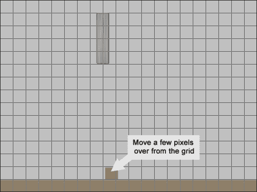
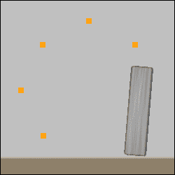

# 第六章：倾倒的塔

在本书的其余部分，我们将专注于从概念到完成、发布的单个游戏的创建。我们将利用到目前为止学到的一切，并将介绍各种其他功能，如 GameMaker: Studio 的物理和粒子系统。我们将构建一些系统来允许角色对话和一个库存。最后，我们将探讨发布游戏的不同方式，包括发布到 Facebook。

在本章中，我们将构建一个基于物理的塔倾倒游戏，展示 GameMaker: Studio 对 Box2D 开源物理引擎的实现。游戏将包括由各种不同材料制成的塔，如玻璃、木头和钢铁。游戏的目标是通过摧毁这些塔来清除受限区域，利用各种工具。我们将创建 TNT 来爆炸，一个会摆动的破坏球，以及一个会吸引松散部件的磁铁。最重要的是，所有的碰撞和移动都将由引擎自己完成！

# 理解物理引擎

在构建基于物理的游戏时，需要以不同的方式思考如何创建事物。到目前为止，我们专注于通过 X/Y 坐标来对实例应用移动，或者通过改变`speed`、`vspeed`和`hspeed`变量来实现。当我们使用物理引擎时，这些属性将被忽略。相反，系统本身通过对实例施加力来处理移动。实例将根据自身的属性对力做出反应，并相应地行动。

此外，世界坐标的方向在物理世界中并不相同。在 GameMaker 标准物理世界中，零度表示右方向，而在 Box2D 物理世界中，零度表示向上，如下图所示：


要完全理解 Box2D 物理引擎的工作原理，我们需要看一下它由以下四个组件组成：

+   物理世界

+   Fixture

+   连接

+   力

## 激活世界

就像现实世界一样，物理世界从施加重力开始。重力的大小将决定物体下落的速度以及抵消它所需的力量。在游戏中使用任何物理函数之前，我们需要激活世界物理。

1.  让我们开始一个名为`Chapter_06`的新项目。

1.  创建一个新的房间，命名为`Sandbox`。我们将只用这个房间进行测试。

1.  点击**物理**选项卡，勾选**房间是物理世界**。

1.  在**物理世界属性**中，将**重力**设置为**X:** `0.0` 和 **Y:** `20.0`。这将设置世界中重力的方向和强度。如果你想让重力像地球上一样，我们会将值设置为**Y:** `9.8`。我们将其设置为`20.0`，这样物体看起来会下落得更快。

1.  最后，还有一个选项可以设置**像素到米**。整个物理系统都是基于真实世界的测量，所以我们需要确定一个像素代表多少米，以便计算准确。我们将保持默认值为每像素 0.1 米，或约 10 厘米。

世界现在已经准备好使用物理引擎了！房间的物理设置应该如下截图所示：


## 使用 Fixture 定义属性

为了让物体受到重力和其他力的影响，物体需要一个**Fixture**。Fixture 定义了物理对象的形状和属性。我们需要构建两个对象：一个永远不会移动的地面对象，和一个会受到重力影响的钢柱。

1.  我们将从创建地面对象开始。创建一个新的精灵，`spr_Ground`，并加载`Chapter 6/Sprites/Ground.png`，取消**删除背景**的勾选。将**原点**保留在**X**：`0`，**Y**：`0`，然后点击**确定**。

1.  创建一个新的对象，`obj_Ground`，并将`spr_Ground`分配为精灵。

1.  为了使物体在物理引擎中响应，我们需要勾选**使用物理**。这将显示**物理属性**，如下面的屏幕截图所示：

我们需要设置的第一个元素是**碰撞形状**。有三个选项可供选择：**圆形**，**矩形**和**形状**。最常见的形状是**矩形**，它只有四个点，总是呈矩形形状。**圆形**形状适用于完全圆形的物体，因为它是由半径确定的，因此不适用于像鸡蛋这样的圆形。**形状**是最有用的选项，因为你可以有多达八个碰撞点。这种形状的一个缺点是所有形状必须是凸的，否则将无法工作。请参考下面的屏幕截图，以更好地理解什么是可接受的：


1.  地面是一个矩形物体，所以在**物理属性**下的**碰撞形状**中选择**矩形**。

1.  默认形状将根据精灵的原点创建，这种情况下是在左上角。这意味着我们需要调整**原点**或**物理形状**以使其正确适配。对于这个对象，我们将选择后者。点击**修改碰撞形状**以打开**物理形状**编辑器。将点放置在精灵上正确的位置，如下面的屏幕截图所示，然后点击**确定**。

现在形状已经完成，我们可以设置其他物理属性。这里有六个可调整的属性可供我们使用：

+   **密度**：这代表单位体积内物体的质量。你可以把它想象成物体相对于其整体大小有多重。

+   **弹性**：这代表物体有多有弹性。数字越高，物体在碰撞时弹跳得越多。这并不意味着物体的形状会变形。因为这是一个刚体物理模拟。

+   **碰撞组**：这些组有助于简化物体之间的碰撞。这里的正数意味着该组编号内的所有物体将始终发生碰撞。负数意味着该组编号内的物体永远不会相互碰撞。如果设置为零，碰撞事件将需要放置到每个物体中才能发生碰撞。使用组应该尽量减少，因为它会大大增加处理时间。

+   **线性阻尼**：这代表了物体运动速度的减小。你可以把它想象成空气摩擦，因为物体不需要与其他物体接触就会减速。

+   **角阻尼**：与**线性阻尼**类似，这是物体旋转运动的减小。

+   **摩擦力**：摩擦力是在碰撞过程中与运动物体相反的力。这与**线性阻尼**类似，因为它会减慢物体的速度。不同之处在于它需要发生碰撞。

现实世界中的不同材料将具有这些属性的不同值。有许多图表可以显示许多类型材料的值，例如钢的密度为每立方米 7,820 千克，与其他钢接触时的摩擦系数为 0.78。试图考虑这些值与游戏中的对象对应时，可能会很快变得令人不知所措。幸运的是，游戏不需要使用现实世界的值，而是可以使用材料的一般概念，例如钢的密度很高，而冰的密度很低。下面是一个图表，其中包含了我们需要处理**密度**、**恢复**和**摩擦**值的一些基本概念。对于**线性阻尼**和**角阻尼**来说，情况会有些棘手，因为它们更多地与物体的形状有关。例如，一个圆形的钢钉的**角阻尼**会比一个方形的钢钉小。无论我们将这些材料的值设置为多少，都应该始终调整，直到它们在游戏中感觉正确。在一个游戏中，金属棒的密度为 3，在另一个游戏中为 300，这是完全有效的，只要它符合开发者的意图。

| 材料 | 密度 | 恢复 | 摩擦 |
| --- | --- | --- | --- |
| 钢 | 高 | 低 | 中等 |
| 玻璃 | 低 | 中等 | 低 |
| 木材 | 中等 | 中等 | 中等 |
| 橡胶 | 中等 | 高 | 中等 |
| 石头 | 高 | 低 | 高 |

1.  由于这个地面永远不会移动或感受到重力的影响，我们需要将**密度**设置为`0`。当一个物体没有密度时，它被认为是一个静态物体。

1.  我们不希望地面有弹性，所以将**恢复**设置为`0`。

1.  我们将**碰撞组**保留为默认值`0`。

1.  由于物体不会移动，我们可能会将**线性阻尼**和**角阻尼**设置为`0`。

1.  最后，我们确实希望物体在地面上迅速停止，所以让我们将**摩擦**设置为`1`。我们已经完成了`obj_Ground`，所以点击**确定**。

1.  接下来，我们将制作钢柱。创建一个新的精灵，`spr_Pillar_Steel`，并加载`Chapter 6/Sprites/Pillar_Steel.png`，勾选**去除背景**。居中原点，然后点击**确定**。

1.  创建一个新的对象，`obj_Pillar_Steel`，并将`spr_Pillar_Steel`设置为其**精灵**。

1.  勾选**使用物理**的复选框。

1.  在**物理属性**下的**碰撞形状**中，选择**方块**。由于我们将原点放置在精灵的中心，因此形状应该正确地符合精灵，这样我们就不必修改它。然而，我们应该始终打开**物理形状**编辑器，以确保它正确地定位，以防止任何重大问题。

1.  我们希望这个对象相当重，所以将**密度**设置为`20`。

1.  钢柱也不应该很滑，所以将**摩擦**设置为`2`。

1.  将所有其他属性设置为`0`，因为我们不希望减慢这个物体的速度或使其弹跳。我们现在已经完成了设置这个对象的属性。

1.  我们唯一剩下要做的就是添加一个`obj_Ground`事件。如下截图所示，我们不需要任何代码，只需要一个注释。从**控件**选项卡下的**动作**中拖动一个**注释**，并写上`与地面碰撞`。通过这个小技巧，钢柱现在将与地面发生主动碰撞。

1.  重新打开`Sandbox`房间，并在水平中心附近放置一个`obj_Pillar_Steel`的实例。此外，在底部放置`obj_Ground`的实例，其中一个额外的实例位于地板上方，略低于钢柱将要掉落的位置，如下截图所示。在**房间属性**编辑器中自由移动实例，按住*Alt*键同时按住鼠标左键。

1.  运行游戏。钢柱应该会倒下并与地面上的小树桩碰撞。然后它应该倒在一边并停下来。

我们刚刚完成了我们的第一个物理模拟！现在让我们来看看关节。

## 用关节连接对象

有时我们希望两个或更多的对象相互约束，比如链条或布娃娃身体。在物理引擎中，这是通过使用**关节**来实现的。我们可以使用五种不同类型的关节：

+   **距离关节**：这些将保持两个实例相互连接，并保持一定距离。例如，手推车会有一个距离关节，以保持前轮与把手一定距离，无论如何推动它。

+   **旋转关节**：这些将使一个实例围绕另一个旋转。例如，门铰链是一个旋转关节，它会使门围绕门框旋转。

+   **滑动关节**：这些将允许一个实例在相对于另一个的单个方向上移动。例如，弹球弹簧会有一个滑动关节，因为它只能向后拉或向前推入机器中。

+   **滑轮关节**：这些将允许一个实例影响另一个与其运动相关的关系。例如，一套天平使用滑轮关节来称重。如果一边更重，它会下降，而另一边会上升。

+   **齿轮关节**：这些将根据另一个实例的旋转影响一个实例的运动。例如，钓鱼竿的旋转卷轴是一个齿轮关节；当它旋转时，它会拉进鱼。

让我们通过创建一个简单的链条来看看关节是如何工作的，它连接到一个锚点上。

1.  我们将从构建锚点开始，这将是世界中的一个静止静态对象。创建一个新的精灵，`spr_Anchor`，并加载`Chapter 6/Sprites/Anchor.png`，勾选**删除背景**。居中原点，然后点击**确定**。

1.  创建一个新对象，`obj_Anchor`，并将`spr_Anchor`设置为精灵。

1.  勾选**使用物理**并将**碰撞形状**更改为**方块**。

1.  将**密度**和**弹性**设置为`0`。我们可以将其他属性保留为默认值，应该看起来像下面的截图：

1.  接下来，我们需要创建链条链接。创建一个新的精灵，`spr_ChainLink`，并加载`Chapter 6/Sprites/ChainLink.png`，勾选**删除背景**。居中原点，然后点击**确定**。

1.  创建一个新对象，`obj_ChainLink`，并将`spr_ChainLink`设置为**精灵**。

1.  勾选**使用物理**并将**碰撞形状**更改为**方块**。

1.  我们希望链条非常坚固和沉重，所以将**密度**设置为`50`。

1.  链条不应该伸展并且应该自由摆动，因此我们需要将**弹性**、**线性阻尼**、**角阻尼**和**摩擦**设置为`0`。最终设置应该看起来像下面的截图：

1.  组件部分现在已经完成；我们只需要构建整个链条并将其连接到锚点。创建一个新脚本，`scr_Anchor_Create`，编写以下代码，并将其添加到`obj_Anchor`的**创建**事件中：

```js
for (i = 1; i < 10; i++)
{   
    chain[i] = instance_create(x+ (i * 16), y, obj_ChainLink);
}
```

为了构建链条，我们运行一个循环，开始创建九个链条链接。我们从`1`开始循环，以便正确偏移链条。我们使用一个基本的一维数组来存储每个链条链接的 ID，因为当我们添加关节时会需要这个。我们在创建中的`x`偏移将使每个链接在水平方向上等距离分开。

1.  接下来，我们需要在链条的第一个链接上应用旋转关节。在上一个代码之后，添加：

```js
physics_joint_revolute_create(self, chain[1], self.x, self.y, 0, 0, false, 0, 0, false, false);
```

我们首先要创建一个旋转关节，从锚点到第一个链条链接。旋转将围绕锚点的 X 和 Y 轴发生。接下来的三个参数与旋转的限制有关：旋转的最小和最大角度，以及这些限制是否生效。在这种情况下，我们不关心，所以我们关闭了任何角度限制。接下来的三个参数是关节是否会自行旋转，以及最大速度、设定速度和是否生效的值。同样，我们关闭了它，所以链条将悬挂在空中。最后一个参数是锚点是否可以与链条发生碰撞，我们不希望发生碰撞。

1.  现在我们已经连接了第一个链接，让我们把剩下的链条连接起来。仍然在同一个脚本中，在最后添加：

```js
for (i = 1; i < 9; i++)
{    
    physics_joint_revolute_create(chain[i], chain[i+1], chain[i].x, chain[i].y, -20, 20, true, 0, 0, false, false);
}
```

这里我们再次使用循环，这样我们可以遍历每个链接并连接下一个链接。注意循环停在`9`，因为我们已经连接了一段链条。对于链条来说，我们不希望每个链接都有完全的旋转自由度。我们激活了旋转限制，并将其设置为 20 度的两个方向。

1.  现在我们有一个小链条连接到一个锚点。让我们把它添加到世界中。重新打开`Sandbox`，在房间的顶部附近添加一个`obj_Anchor`的实例。

1.  运行游戏。锚点应该保持在房间的顶部，链条链接向右延伸。由于房间中的重力，链条会下落，但每个链接都会保持连接在上面的链接上，顶部链接仍然连接在锚点上。它应该看起来像下面的截图：

## 对物体施加力

为了在物理世界中移动一个物体，除了由于重力而产生的运动，需要对其施加**力**。这些力可以从世界中的某一点施加，也可以局部施加到实例上。物体对力的反应取决于它的属性。就像现实世界一样，物体越重，移动它所需的力就越大。

为了查看力，我们将创建 TNT，它将爆炸，射出八个碎片。这些碎片将非常密集，需要大量的力才能使它们移动。

1.  让我们先从碎片开始。创建一个新的精灵，`spr_TNT_Fragment`，并加载`Chapter 6/Sprites/TNT_Fragment.png`，取消**删除背景**的勾选。将原点居中，然后点击**确定**。

1.  创建一个新的对象，`obj_TNT_Fragment`，并将`spr_TNT_Fragment`分配为**精灵**。

1.  勾选**使用物理**，并将**碰撞形状**更改为**矩形**。

1.  将**密度**设置为`10`。我们将这个值设置得很高，这样当它与物体碰撞时，比如钢柱，它就能够移动它。

1.  将所有剩余的属性设置为`0`。

1.  由于我们需要从 TNT 中射出多个碎片，我们需要能够控制它移动的方向。因此，我们需要建立一些变量。创建一个新的脚本，`scr_TNT_Fragment_Create`，包含以下变量：

```js
mySpeedX = 0;
mySpeedY = 0;
```

力的强度和方向由矢量确定，这就是为什么我们需要 X 和 Y 变量。我们将其设置为零，这样它默认不会移动。不要忘记将其应用到`obj_TNT_Fragment`的**创建**事件中。

1.  由于这些碎片是用来表示爆炸的，我们希望不断地对它们施加力，这样它们就不会受到过多的重力影响。创建一个新的脚本，`scr_TNT_Fragment_Step`，并施加一些力。将这个脚本添加到**Step**事件中。

```js
physics_apply_force(x, y, mySpeedX, mySpeedY);
```

函数`physics_apply_force`是一个基于世界的力，前两个参数表示力来自世界的哪个位置，后两个参数是要施加的力的矢量。

1.  目前，这些碎片永远不会停止移动，这是一个问题。我们需要限制它们可以移动的距离。在脚本的末尾添加以下代码：

```js
if (point_distance(x, y, xstart, ystart) > 128)
{
    instance_destroy();    
}
```

我们在这里所做的就是检查碎片是否从创建时移动了超过 128 像素。如果是，我们就将其从世界中移除。

1.  我们希望这些碎片与游戏中的其他元素发生碰撞。与此同时，我们不希望它们穿过任何东西，所以我们会销毁它们。创建一个新的脚本，`scr_TNT_Fragment_Collision`并删除实例。

```js
instance_destroy();
```

1.  添加一个`obj_Ground`事件并添加这个脚本。这将在碰到地面时移除碎片。

1.  我们希望它影响钢柱，但由于我们计划创建更多类型的柱子，让我们为柱子构建一个父对象进行碰撞检测。创建一个新对象，`obj_Pillar_Parent`。现在它只需要这些，所以点击**确定**。

1.  重新打开`obj_Steel_Pillar`并将**父级**设置为`obj_Pillar_Parent`。

1.  当我们在`obj_Steel_Pillar`中时，我们也可以让它对其他柱子做出反应。从**控件**中添加一个**注释**到**操作**区域，并输入`与柱子碰撞`作为注释。

1.  回到 obj_TNT_Fragment 并添加一个`obj_Pillar_Parent`并应用`scr_TNT_Fragment_Collision`。现在我们将与所有柱子发生碰撞！

1.  现在我们所需要做的就是创建 TNT 并让它爆炸。创建一个新的精灵，`spr_TNT`，并加载`Chapter 6/Sprites/TNT.png`，勾选**去除背景**。居中原点，然后点击**确定**。

1.  创建一个新对象，`obj_TNT`，并应用`spr_TNT`作为精灵。我们将手动放置 TNT 在游戏中，我们不需要它对世界物理做出反应，所以我们*不*需要打开**使用物理**。

1.  让我们创建一个新的脚本，`scr_TNT_Activate`，并为测试目的，在**按键按下**下的**空格**事件中添加它。我们将只创建一个碎片，并让它向右发射，这样我们就可以看到世界中的力量是如何工作的。

```js
frag_01 = instance_create(x, y, obj_TNT_Fragment);
frag_01.mySpeedX = 100;
```

我们首先创建一个碎片并将其 ID 存储在一个变量中。然后我们将水平力设置为 100 单位。这个值似乎足够推动这个物体向右移动。

1.  让我们来测试一下。重新打开`Sandbox`并将一个单独的实例放在钢柱将要倒下的位置的左侧，离地面三个网格空间。另外，让我们移除多余的地面实例和链条。房间应该看起来像下面的截图：

1.  运行游戏，按空格键生成一个碎片。你应该看到碎片向右移动，但也向下掉落。当碎片与钢柱碰撞时，碎片消失，钢柱没有任何变化。所有这些都是由于碎片没有足够的力量。

1.  增加力量。重新打开`scr_TNT_Activate`并将第二行更改为：

```js
frag_01.mySpeedX = 1000;
```

1.  运行游戏并按空格键查看这些变化。碎片现在似乎只向右移动，并在与钢柱接触时使其摇晃了一下。然而，无论我们多少次击中钢柱，它都不会倒下。这是因为钢柱的密度是碎片的两倍，它需要更大的力量才能将其击倒。

1.  再次调整数字，将力量改为：

```js
frag_01.mySpeedX = 10000;
```

1.  再次运行游戏，尝试把钢柱撞倒。应该需要三次快速点击，它就会倒下。正如我们所看到的，像碎片这样的小物体需要非常大的力量才能移动像钢柱这样的大物体。

1.  现在我们有一个碎片在工作，让我们把其他的也加进来。我们需要再加入七个碎片，每个以 45 度的增量移动。我们还希望移除 TNT，这样它只能被触发一次。

```js
frag_01 = instance_create(x, y, obj_TNT_Fragment);
frag_01.mySpeedX = 10000;
frag_02 = instance_create(x, y, obj_TNT_Fragment);
frag_02.mySpeedX = -10000;
frag_03 = instance_create(x, y, obj_TNT_Fragment);
frag_03.mySpeedY = 10000;
frag_04 = instance_create(x, y, obj_TNT_Fragment);
frag_04.mySpeedY = -10000;
frag_05 = instance_create(x, y, obj_TNT_Fragment);
frag_05.mySpeedX = 5000;
frag_05.mySpeedY = 5000;
frag_06 = instance_create(x, y, obj_TNT_Fragment);
frag_06.mySpeedX = 5000;
frag_06.mySpeedY = -5000;
frag_07 = instance_create(x, y, obj_TNT_Fragment);
frag_07.mySpeedX = -5000;
frag_07.mySpeedY = -5000;
frag_08 = instance_create(x, y, obj_TNT_Fragment);
frag_08.mySpeedX = -5000;
frag_08.mySpeedY = 5000;
instance_destroy();
```

正如我们所看到的，对于每个碎片，我们在 X 和 Y 方向上应用适当的力值。我们无需拿出计算器和一些花哨的方程来准确计算需要多少力量，尤其是在倾斜的部分。记住，这是一个视频游戏，我们只需要担心玩家所看到的整体效果和体验，以确定结果是否正确。当你运行游戏时，它应该看起来像以下的截图：



目前，我们对 Box2D 物理引擎的工作原理有了良好的基础知识。我们已经建立了一个启用了物理的房间，并创建了几个具有夹具和物理属性的对象。我们使用关节将一系列实例连接在一起，并对一个对象施加力以使其移动。现在我们准备开始建立推倒塔游戏！

# 建立推倒塔游戏

为了建立一个推倒塔游戏，我们需要创建的第一个元素是支撑结构。我们已经有了一个钢柱，它将是最坚固的部分，但我们还需要几个。将有三种材料类型，每种材料都具有独特的物理属性：钢、木和玻璃。还需要两种不同的尺寸，大和小，以便变化。最后，我们希望大型结构能够分解成小块的碎片。

## 构建柱子和碎片

我们将首先建立所有额外的钢柱和碎片。

1.  创建一个新的精灵，`spr_Pillar_Steel_Small`，并加载`Chapter 6/Sprites/Pillar_Steel_Small.png`，勾选**Remove Background**。将原点居中，然后点击**OK**。

1.  而不是创建一个新对象，右键单击`obj_Pillar_Steel`，然后**Duplicate**该对象。这样可以保持属性不变，因此我们不必重复大部分工作。将其重命名为`obj_Pillar_Steel_Small`。

1.  将精灵更改为`spr_Pillar_Steel_Small`。

1.  由于这是一个较大对象的副本，我们需要调整夹具。点击**Modify Collision Shape**以打开**Physics Shape**编辑器，并移动点以适当地适应较小的精灵。我们已经完成了这个柱子，**Object Properties**应该看起来像以下的截图：

1.  创建一个新的精灵，`spr_Debris_Steel_01`，并加载`Chapter 6/Sprites/Debris_Steel_01.png`，勾选**Remove Background**。

1.  当柱子变成碎片时，我们希望确保每个部分都被正确放置和旋转。为了做到这一点，我们需要将原点放置在与柱子原点对应的位置。这些碎片来自左上角，因此将原点设置为**X**：`16`，**Y**：`64`，然后点击**OK**。

1.  让我们再次复制`obj_Pillar_Steel`，将其命名为`obj_Debris_Steel_01`，并将精灵更改为`spr_Debris_Steel_01`。

1.  所有碎片都呈奇怪的形状，我们希望碰撞反映出这一点。在**Physics Properties**编辑器中，将**Collision Shape**更改为**Shape**。

1.  点击**Modify Collision Shape**以打开**Physics Shape**编辑器，并移动点以适当地适应碎片。您会注意到它可能已经给了您一个三角形的起点。要添加额外的点，只需点击远离现有点的位置。另一个重要的注意事项是，为了使物理正常工作，形状夹具必须始终按顺时针的方式构建。碰撞形状应该看起来像以下的截图：

1.  创建一个新的精灵，`spr_Debris_Steel_02`，并加载`Chapter 6/Sprites/Debris_Steel_02.png`，勾选**Remove Background**。

1.  将原点设置为**X**：`0`，**Y**：`64`，然后点击**OK**。

1.  复制`obj_Debris_Steel_01`，将其重命名为`obj_Debris_Steel_02`，并将**Sprite**设置为`spr_Debris_Steel_02`。

1.  再次点击“修改碰撞形状”，并根据以下屏幕截图调整点的位置：

1.  我们还需要制作最后一个碎片，创建一个新精灵，`spr_Debris_Steel_03`，并加载“第六章/精灵/Debris_Steel_03.png”，勾选“去除背景”。

1.  将原点设置为“X”：`16`，“Y”：`0`，然后点击“确定”。

1.  复制`obj_Debris_Steel_01`，将其重命名为`obj_Debris_Steel_03`，并将“精灵”更改为`spr_Debris_Steel_03`。

1.  这个对象需要五个点，因此点击“修改碰撞形状”，并根据以下屏幕截图调整点的位置。我们已完成钢碎片：

1.  接下来，我们将构建木支柱及其相关部分。我们不会逐步介绍每个步骤，因为这只是重复我们刚刚用钢支柱进行的过程。但是，我们将构建其他材料类型的第一个支柱。创建一个新精灵，`spr_Pillar_Wood`，并加载“第六章/精灵/Pillar_Wood.png”，勾选“去除背景”。将原点居中，然后点击“确定”。

1.  创建一个新对象，`obj_Pillar_Wood`，并将`spr_Pillar_Wood`分配为“精灵”。

1.  将“父对象”设置为`obj_Pillar_Parent`。

1.  勾选“使用物理”。

1.  将“碰撞形状”更改为“矩形”。由于这是一个新对象，碰撞形状应自动适应精灵，因此我们不需要修改形状。

1.  木材比钢轻得多，因此我们希望它只需很小的力就能移动。将“密度”设置为`8`。

1.  木材弹性更大，因此应将“恢复”设置为`0.2`。

1.  我们将说这种木材比钢更不粗糙，并将“摩擦”设置为`0.5`。

1.  将“碰撞组”、“线性阻尼”和“角阻尼”的值设置为`0`，因为我们不希望支柱受到它们的影响。

1.  我们需要为`obj_Ground`和`obj_Pillar_Parent`添加事件，并附上注释以使碰撞检测起作用。如果你想知道为什么我们不直接将其放在`obj_Pillar_Parent`中，那是因为我们稍后将为这些事件添加碎片脚本。

1.  木支柱已完成，这意味着我们现在可以创建小木支柱和木碎片。继续使用“第六章/精灵/”中提供的文件构建所有这些部分。确保对象属性与以下屏幕截图中所示的相同：

1.  我们的最后一个支柱，也是最脆弱的支柱，是由玻璃制成的。创建一个新精灵，`spr_Pillar_Glass`，并加载“第六章/精灵/Pillar_Glass.png”，勾选“去除背景”。将原点居中，然后点击“确定”。

1.  创建一个新对象，`obj_Pillar_Glass`，其“精灵”设置为`spr_Pillar_Glass`。

1.  将父对象设置为`obj_Pillar_Parent`。

1.  勾选“使用物理”并将“碰撞形状”更改为“矩形”。

1.  玻璃是最轻的材料，我们希望它只需很小的力就能移动。将“密度”设置为`2`。

1.  我们希望玻璃会发出很多声音，因此将“恢复”设置为`0.3`。

1.  玻璃应该非常光滑，具有摩擦值`0.07`。

1.  与其他支柱一样，将“碰撞组”、“线性阻尼”和“角阻尼”的值设置为`0`，因为我们不希望支柱受到它们的影响。

1.  最后，我们需要为`obj_Ground`和`obj_Pillar_Parent`添加事件，并附上注释以使碰撞检测起作用。最终设置应如以下屏幕截图所示：

1.  与其他支柱一样，使用“第六章/精灵/”中提供的资源创建剩余的玻璃碎片。

1.  现在所有的柱子都已经创建好了，重新打开沙盒并放置一些柱子和一些 TNT。运行游戏，注意各种材料的反应。玻璃会轻易移动，而钢是相当坚固的。木头似乎在这两者之间有所反应。

## 将柱子打碎成碎片

我们已经创建了从柱子生成碎片所需的所有对象；我们只需要编写两者之间切换的功能。为此，我们将构建一个简单的系统，可以用于所有柱子。在这个游戏中，我们只会打碎较大的柱子。如果施加了足够的力，小柱子和碎片将被销毁。

1.  我们将从最脆弱的物体，玻璃柱开始，初始化一些变量。创建一个新的脚本，`scr_Pillar_Glass_Create`，并将其应用于`obj_Pillar_Glass`的**创建**事件。

```js
myDamage = 5;
debris01 = obj_Debris_Glass_01;
debris02 = obj_Debris_Glass_02;
debris03 = obj_Debris_Glass_03;
```

我们首先要使用的变量将用于柱子可以承受的伤害量。在这种情况下，玻璃柱需要至少五点伤害才能分解。接下来，我们为需要生成的每个碎片设置变量。

1.  创建一个新的脚本，`scr_Pillar_BreakApart`，其中包含以下代码：

```js
if (abs(other.phy_linear_velocity_x) > myDamage || abs(other.phy_linear_velocity_y) > myDamage)
{
    if (phy_mass <= other.phy_mass)
    {     
        p1 =instance_create(x, y, debris01);
        p1.phy_speed_x = phy_speed_x;
        p1.phy_speed_y = phy_speed_y;
        p1.phy_rotation = phy_rotation;

        p2 =instance_create(x, y, debris02);
        p2.phy_speed_x = phy_speed_x;
        p2.phy_speed_y = phy_speed_y;
        p2.phy_rotation = phy_rotation;

        p3 =instance_create(x, y, debris03);
        p3.phy_speed_x = phy_speed_x;
        p3.phy_speed_y = phy_speed_y;
        p3.phy_rotation = phy_rotation;

        instance_destroy();
    } 
} 
```

我们首先确定碰撞的速度，这样它只适用于移动的物体，而不是静止的物体。我们使用一个叫做 abs 的函数，它将确保我们得到的速度始终是一个正数。这将使比较变得更容易，因为我们不需要考虑运动的方向。如果碰撞物体的速度比柱子的伤害量快，那么我们就检查第二个条件语句，比较碰撞中涉及的两个实例的质量。我们只希望柱子在被比自身更强的东西击中时分解。让玻璃柱摧毁钢柱是毫无意义的。如果柱子被更重的物体击中，我们就生成碎片。对于每个碎片，我们需要根据柱子的物理速度和旋转将其放在适当的位置。创建了碎片后，我们销毁了柱子。

1.  将此脚本添加到`obj_Pillar_Glass`中的`obj_Pillar_Parent`事件。我们可以删除注释，因为它不再需要用于碰撞。

1.  重新打开`Sandbox`，在两侧分别放置一个玻璃柱和钢柱的单个 TNT 实例。它应该看起来像下面的截图：

1.  运行游戏并引爆 TNT。我们应该看到玻璃柱向外推，与钢柱碰撞，然后分解成一堆碎片，就像下面的截图：

1.  让我们继续进行木柱。创建一个新的脚本，`scr_Pillar_Wood_Create`，并初始化必要的变量。将它们添加到`obj_Pillar_Wood`的**创建**事件中。

```js
myDamage = 16;
debris01 = obj_Debris_Wood_01;
debris02 = obj_Debris_Wood_02;
debris03 = obj_Debris_Wood_03;
```

我们已经增加了需要施加的伤害速度，以便它能够分解的要求。玻璃容易破碎，而木头不容易。我们还为木头分配了适当的碎片。

1.  从`obj_Pillar_Parent`中删除注释，并添加`scr_Pillar_BreakApart`。

1.  重新打开`Sandbox`，用木柱替换玻璃柱。

1.  运行游戏并引爆 TNT。木头会向外移动，但不会破碎。这个结果是有意的，因为我们说需要更大的力量才能打破它。

1.  在`Sandbox`中添加另一个 TNT 实例，放在现有的 TNT 下方。这样在引爆时会施加更大的力。

1.  运行游戏。如下一张截图所示，这次木柱向外移动并在接触时破碎。钢柱也会因为这种力量而倒下！

1.  现在只剩下钢柱了。我们将设置它以正常运行，尽管在这一点上我们将无法测试它，因为没有比它更密度大的物体。创建一个新的脚本，`scr_Pillar_Steel_Create`，并将其添加到`obj_Pillar_Steel`的**Create**事件中。

```js
myDamage = 25;
debris01 = obj_Debris_Steel_01;
debris02 = obj_Debris_Steel_02;
debris03 = obj_Debris_Steel_03;
```

与以前一样，我们增加了造成伤害所需的速度，并设置了正确的碎片生成。

1.  我们还需要从`obj_Pillar_Parent`中删除注释，并替换为`scr_Pillar_BreakApart`。

1.  现在我们已经让柱子在受到足够的力量时分解成小块。接下来，我们需要在足够的力量碰撞到它们时摧毁小柱子和碎片。创建一个新的脚本，`scr_Pillar_Destroy`，并添加以下代码：

```js
if (abs(other.phy_linear_velocity_x) > myDamage || abs(other.phy_linear_velocity_y) > myDamage)
{ 
    if (phy_mass < other.phy_mass)
    { 
        instance_destroy();
    }
}
```

与`scr_Pillar_BreakApart`类似，我们检查碰撞物体的速度，然后比较质量，看看是否应该被摧毁。这里是密度和质量之间的差异变得明显的地方。所有的碎片都有与生成它的柱子相同的密度，这意味着它们的坚固度是相同的。然而，物体越大，质量就越大。这意味着较小的碎片可以被较大的碎片摧毁。

1.  将此脚本应用于它们各自的`obj_Pillar_Parent`事件中的所有小柱子和碎片。

1.  这个脚本使用与其类型相同的变量，这意味着我们需要初始化它们。我们可以重用现有的脚本来节省时间。对于每个小柱子和碎片，添加一个**Create**事件，并应用适当的柱子创建脚本，就像所有玻璃都应该分配`scr_Pillar_Glass_Create`一样。

1.  是时候测试一下了。重新打开`Sandbox`，并在木柱顶部放置两个玻璃柱，使其看起来像下面的截图：

1.  运行游戏并引爆 TNT。玻璃柱应该很容易破碎，大部分碎片会很快消失。木柱也会有些裂痕，大部分碎片会消失。钢柱会稍微摇晃，但不会受损。

# 添加碰撞声音

一切都运行正常，尽管有点无聊，因为缺少声音。碎片被很快摧毁也不太令人满意。让我们解决这两个问题。

1.  首先我们需要引入一些声音。创建一个新的声音，`snd_Shatter_Glass`，并加载`Chapter 6/Sounds/Shatter_Glass.wav`。默认值将起作用，只需确保**Kind**设置为**Normal Sound**。这个效果是当玻璃破碎时使用的。

1.  我们还希望在玻璃柱不破裂时有声音。创建另一个新声音，`snd_Impact_Glass`，并加载`Chapter 6/Sounds/Impact_Glass.wav`。

1.  为木头和钢铁的声音效果重复这个过程。

1.  我们需要初始化一些变量，所以重新打开`scr_Pillar_Glass_Create`，并在脚本的末尾添加以下内容：

```js
impact = snd_Impact_Glass;
shatter = snd_Shatter_Glass;

isTapped = false;
isActive = false;
alarm[0] = room_speed;
```

我们首先为`Impact`和`Shatter`声音分配变量。我们只希望允许撞击声音播放一次，所以我们创建了`isTapped`变量。`isActive`变量和警报将被使用，以便在游戏开始时不会发出声音。当物理系统开始时，世界中的所有活动实例都将受到重力的影响，这将导致碰撞。这反过来意味着当似乎没有东西在移动时，撞击声音会发生。

1.  重新打开`scr_Pillar_Wood_Create`和`scr_Pillar_Steel_Create`，并添加相同的代码和适当的声音。

1.  现在我们可以开始实现声音了。打开`scr_Pillar_BreakApart`，并在实例被销毁之前插入以下代码行：

```js
sound_play(shatter);
```

当碎片生成时，我们将播放一次 Shatter 声音。请注意，我们已经给这个声音设置了优先级为 10，这意味着如果需要播放太多声音，这个声音将优先于优先级较低的声音。

1.  在脚本中，如果发生碰撞但没有破坏支柱，我们需要播放碰撞声音。在实例被销毁后立即添加一个`else`语句。

```js
} else {
    if (!isTapped)
    {
        sound_play(impact);
        isTapped = true;
    }
}
```

如果只发生了轻微的碰撞，我们会检查是否之前已经播放了声音。如果没有，那么我们会播放撞击声音，优先级较低，并阻止该代码再次执行。

1.  在这个脚本中，我们只剩下一件事要做，那就是将所有的代码放入条件语句中，这样它只有在实例处于活动状态时才会执行。在脚本顶部添加检查，并在所有现有代码周围加上大括号。完成后，整个脚本将如下所示：

```js
if (isActive)
{
    if (abs(other.phy_linear_velocity_x) > myDamage || abs(other.phy_linear_velocity_y) > myDamage)
    {
        if (phy_mass < other.phy_mass)
        {     
            p1 =instance_create(x, y, debris01);
            p1.phy_speed_x = phy_speed_x;
            p1.phy_speed_y = phy_speed_y;
            p1.phy_rotation = phy_rotation;

            p2 =instance_create(x, y, debris02);
            p2.phy_speed_x = phy_speed_x;
            p2.phy_speed_y = phy_speed_y;
            p2.phy_rotation = phy_rotation;

            p3 =instance_create(x, y, debris03);
            p3.phy_speed_x = phy_speed_x;
            p3.phy_speed_y = phy_speed_y;
            p3.phy_rotation = phy_rotation;

            sound_play(shatter);

            instance_destroy();
        } else {
            if (!isTapped)
            {
                sound_play(impact);
                isTapped = true;
            }
        }
    } 
}
```

1.  我们需要重复这个过程，对`scr_Pillar_Destroy`进行修改，以便在销毁时播放粉碎声音，在轻微碰撞时播放碰撞声音，并且在实例处于活动状态时执行所有这些操作。以下是完整的代码：

```js
if (isActive)
{
    if (abs(other.phy_linear_velocity_x) > myDamage || abs(other.phy_linear_velocity_y) > myDamage)
    { 
        if (phy_mass < other.phy_mass)
        { 
            sound_play(shatter);
            instance_destroy();
        }        else {
            if (!isTapped)
            {
                sound_play(impact);
                isTapped = true;
            }
        }
    }
}
```

1.  为了使声音正常工作，我们需要使它们处于活动状态。创建一个新的脚本，`scr_Pillar_Alarm0`，并将`isActive`设置为`true`。

1.  我们不需要为每个支柱和碎片都添加一个警报，只需在`obj_Pillar_Parent`中添加一个**警报 0**事件。这不会引起任何冲突，因为警报每个实例只运行一次，并且只改变一个变量。

1.  运行游戏，引爆 TNT 并听着。我们可以听到不同的声音，因为支柱破碎并相互碰撞。还要注意现在剩下更多的碎片。这是因为现在它们在销毁自己之前有一秒的延迟，这样就有时间让碎片逃离在创建时发生的任何碰撞。

# 建造拆迁设备

我们已经拥有了建造塔所需的一切，但这个游戏的重点是拆除。如果玩家只能使用 TNT 来摧毁塔，他们会感到无聊。我们将利用一些更多的物理函数，并创建一些新的设备：破坏球和磁吊机。

## 创建一个破坏球

让我们从破坏球开始，因为我们已经建造了它的大部分。我们将利用链条和锚点，并在其上添加一个球。

1.  创建一个新的精灵，`spr_WreckingBall`，并加载`Chapter 6/Sprites/WreckingBall.png`，勾选**去除背景**。居中原点，然后点击**确定**。

1.  创建一个新的对象，`obj_WreckingBall`，并将`spr_WreckingBall`应用为其**Sprite**。

1.  我们希望破坏球始终显示在支撑它的链条前面。将**深度**设置为`-100`。

1.  勾选**使用物理**。我们不需要更改碰撞形状，因为破坏球是一个圆形。

1.  我们希望这个破坏球非常强大，所以将**密度**设置为`50`。

1.  由于它是一个如此沉重的物体，悬挂在链条上，它不应该能够旋转太多。为了减慢旋转速度，将**AngularDamping**设置为`5`。

1.  该对象的所有其他物理值都应设置为`0`。

1.  我们已经建造了破坏球，现在需要将其添加到锚点和链条上。重新打开`scr_Anchor_Create`，并在脚本末尾添加以下代码：

```js
ball = instance_create(chain[9].x +24, y, obj_WreckingBall);
physics_joint_revolute_create(chain[9], ball , chain[9].x, chain[9].y, -30, 30, true, 0, 0, false, false);
```

在链条末端创建一个破坏球，偏移 24 像素以便正确定位。然后在链条的最后一个链接和破坏球之间添加一个旋转关节，旋转限制为每个方向 30 度。

1.  接下来，我们需要添加碰撞。我们不会在破坏球上放置碰撞，因为现有的脚本将查找破坏球不会有的变量。相反，我们将从重新打开`obj_Pillar_Parent`开始，添加一个`obj_WreckingBall`事件，并附加`scr_Pillar_Destroy`。因为所有支柱和碎片都是该对象的子对象，它们都会响应这个事件。

1.  虽然最后一步将正常工作，但这也意味着大柱子也会在接触时被摧毁。我们希望大柱子始终首先破裂。我们仍然可以通过重新打开三个柱子`obj_Pillar_Glass`，`obj_Pillar_Wood`和`obj_Pillar_Steel`，并添加一个带有`scr_Pillar_BreakApart`的`obj_WreckingBall`事件来实现这一点。如果父对象和其子对象都具有相同类型的事件，无论是碰撞、步进还是其他事件，子对象的事件将被执行，父对象的事件将被忽略。

### 注意

可以通过在子事件代码中使用函数`event_inherited()`同时执行父事件和子事件。

1.  让我们测试一下。重新打开`Sandbox`，并在房间中放置一个`obj_Anchor`的实例，就在现有柱子的右侧。我们还可以移除 TNT，因为我们不需要它进行测试。设置应该看起来像以下屏幕截图：

1.  运行游戏。我们应该看到破坏球挂在链和锚上摆动。当破坏球与钢柱碰撞时，柱子会破裂，其他许多柱子也会破裂。一切都运行正常，但存在一些问题。破坏球立即下落，而它应该等待被触发。让我们修复所有这些。

1.  为了使我们能够立即停止破坏球的移动，我们需要从世界物理中停用。这只需将`phy_active`变量设置为 false，以停止我们想要停止的每个实例。重新打开`scr_Anchor_Create`，并对破坏球和每个链应用此更改。整个脚本可以在以下代码中看到：

```js
for (i = 1; i < 10; i++)
{   
    chain[i] = instance_create(x+(i * 16), y, obj_ChainLink);
    chain[i].phy_active = false;
}

physics_joint_revolute_create(self, chain[1], self.x, self.y, 0, 0, false, 0, 0, false, false);

for (i = 1; i < 9; i++)
{    
    physics_joint_revolute_create(chain[i], chain[i+1], chain[i].x, chain[i].y, -20, 20, true, 0, 0, false, false);
}

ball = instance_create(chain[9].x +24, y, obj_WreckingBall);
ball.phy_active = false;
physics_joint_revolute_create(chain[9], ball , chain[9].x, chain[9].y, -30, 30, true, 0, 0, false, false);
```

1.  破坏球和链将不再在开始时移动，但我们仍然需要在某个时候触发它。创建一个新脚本，`scr_Anchor_Activate`，并将其附加到**按键按下**下的**空格**事件以进行测试。

```js
for (i = 1; i < 10; i++)
{
    chain[i].phy_active = true; 
}
ball.phy_active = true; 
```

当运行此脚本时，一个简单的`for`循环会激活每个链，然后激活破坏球。

1.  运行游戏。破坏球应该向右延伸并保持静止。当我们按下空格键时，破坏球和链应该变得活跃并摆动下来，撞击到塔上。碰撞本身在塔上更高，因为链现在相当刚硬，只有一点弹性。看起来我们已经完成了！

## 制作磁吊车

我们的第三个拆迁设备将是一个磁吊车。这个吊车将下降并拾起任何由钢制成的小柱子和碎片。然后它将带着它收集到的任何东西抬起来。

1.  我们将首先建立磁铁本身。创建一个新的精灵，`spr_Magnet`，并加载`Chapter 6/Sprites/Magnet.png`，并勾选**删除背景**。居中原点，然后点击**确定**。

1.  创建一个新对象，`obj_Magnet`，并将`spr_Magnet`分配为**精灵**。

1.  勾选**使用物理**并将**碰撞形状**设置为**矩形**。

1.  我们希望将碰撞区域变小，这样当它吸起物体时，效果看起来更真实。点击**修改碰撞形状**，将侧面拉进，使其看起来像以下屏幕截图：

1.  磁铁需要相当重，这样其他物体就无法推动它。将**密度**设置为`50`。

1.  将所有其他属性设置为`0`，因为我们不希望它们影响磁铁的运动。

1.  由于我们的意图是让磁铁只吸起由钢制成的小物体，我们应该改变钢屑的父级关系。目前，它是为了碰撞目的而与`obj_Pillar_Parent`相关联的。我们仍然需要具有这种能力，但我们希望磁性吸引对一些物体是独特的。为了做到这一点，我们可以将碎片与任何具有`obj_Pillar_Parent`作为其父级的对象相关联。让我们将所有钢屑的父级设置为`obj_Pillar_Steel_Small`。

1.  我们还需要为所有钢制品添加一个变量，以便我们知道它是否已被收集。重新打开`scr_Pillar_Steel_Create`，并在脚本的末尾添加以下代码行：

```js
isCollected = false;
```

1.  现在我们可以为磁性吸引力编写脚本。创建一个新的脚本，`scr_Magnet_Step`，并将其附加到`obj_Magnet`的**Step**事件上。

```js
if (phy_active)
{
    if (instance_exists(obj_Pillar_Steel_Small))
    {
        with (obj_Pillar_Steel_Small)
        {
            if (!isCollected)
            {
                myMagnet = instance_nearest(x,y,obj_Magnet)
                myDist = point_distance(phy_position_x, phy_position_y, myMagnet.x, myMagnet.y);
                myDir = point_direction(phy_position_x, phy_position_y, myMagnet.x, myMagnet.y);
                if (myDist < 200 && myDir > 60 && myDir < 120)
                {
                    physics_apply_impulse(x, y, 0, -2000)
                }
            }
        }
    }
}
```

我们首先要看磁铁是否活动并开始收集废金属。接下来，我们检查世界中是否有任何小型钢柱，或者任何与之相关的实例。如果存在实例，我们通过`with`语句直接对它们应用代码。如果实例尚未被收集，我们找到最近的磁铁，看看它离磁铁有多远，以及在什么方向。在物理游戏中检查对象的 X 和 Y 坐标时，我们需要使用`phy_position_x`和`phy_position_y`值来准确地知道它们在世界空间中的位置。接下来，我们看实例是否在磁力范围内，以及它是否在磁铁下方。如果是的话，我们会向上施加一个强大的冲量，使其向磁铁移动。

1.  一旦一个小型钢柱或碎片接触到磁铁，我们希望将其视为已收集，并始终与其一起移动。为此，我们将动态地创建一个关节，使其与磁铁碰撞的任何实例连接。创建一个新的脚本，`scr_Magnet_Collsion`，并将其附加到`obj_Magnet`中的`obj_Pillar_Steel_Small`事件。

```js
physics_joint_prismatic_create(id, other, x, y, 0, 1, 0, 0, true, 0, 0, false, false);
other.isCollected = true;
```

在这里，我们使用磁铁和与之碰撞的实例创建了一个棱柱关节。前两个参数是要连接的两个实例，然后是它们在世界中连接的位置。第五和第六个参数是它可以移动的方向，在这种情况下只能垂直移动。接下来的三个是移动的限制。我们不希望它移动，所以将最小/最大值设置为零。限制需要启用，否则它们将不会随着磁铁一起升起。接下来的三个是用于移动这个关节的电机。最后一个参数是与我们想要避免碰撞的对象的碰撞。关节创建后，我们将收集变量设置为`false`。

1.  接下来，我们需要为起重机创建一个基座，它将类似于锚。创建一个新的 Sprite，`spr_CraneBase`，并加载`Chapter 6/Sprites/CraneBase.png`，勾选**Remove Background**。将原点居中，然后点击**OK**。

1.  创建一个新的对象，`obj_CraneBase`，并将`spr_CraneBase`应用为**Sprite**。

1.  勾选**Uses Physics**框，并将**Collision Shape**设置为**Box**。

1.  这个对象在物理世界中是静态的，所以我们需要将**Density**设置为`0`。所有其他属性都可以保留其默认值。

1.  我们希望起重机基座生成磁铁并设置关节。创建一个新的脚本，`scr_CraneBase_Create`，并将其附加到**Create**事件上。

```js
magnet = instance_create(x, y+160, obj_Magnet);
magnet.phy_active = false;
crane = physics_joint_prismatic_create(id, magnet, x, y, 0, 1, -128, 128, true, 100000, 20000, true, false);
```

我们将磁铁创建在起重机基座下方，并将其从物理世界中取消激活。然后我们在两个实例之间应用了一个棱柱关节。这次我们允许在垂直方向上移动 128 像素。我们还运行一个电机，这样磁铁就可以自己上下移动。电机可以施加的最大力是`100000`，我们让电机以`20000`的速度下降磁铁。正如你所看到的，我们使用的值非常高，这是为了确保重磁铁可以吊起大量的钢渣。

1.  与拆迁球一样，我们需要激活起重机基座。创建一个新的脚本，`scr_CraneBase_Activate`，并将其附加到**Key Press**下的**Space**事件以进行测试。

```js
magnet.phy_active = true;
alarm[0] = 5 * room_speed;
```

我们希望磁铁首先下降，因此我们在物理世界中使其活动。我们使用了一个设置为五秒的闹钟，这将使磁铁重新上升。

1.  创建一个新的脚本，`scr_CraneBase_Alarm0`，并将其附加到**Alarm 0**事件上。

```js
physics_joint_set_value(crane, phy_joint_motor_speed, -20000);
```

我们将电机速度的值设置为`-20000`。同样，我们使用一个非常大的数字来确保在柱子碎片的额外重量下再次上升。

1.  起重机的最后一件事是在起重机底座和磁铁之间添加一根电缆。为此，我们将简单地在两者之间画一条线。创建一个新的脚本，`scr_CraneBase_Draw`，并将其应用于**Draw**事件。

```js
draw_self();
draw_set_color(c_dkgray);
draw_line_width(x, y, magnet.x, magnet.y-16, 8);
```

每当使用**Draw**事件时，它会覆盖对象的默认精灵绘制。因此，我们使用`draw_self`来纠正该覆盖。接下来，我们设置要使用的颜色，这里我们使用默认的深灰色，然后在起重机底座和磁铁顶部之间绘制一条 8 像素宽的线。

1.  现在我们只需要在`Sandbox`中添加一个起重机底座的实例。将实例放在现有柱子的左侧。还要添加一些碎片和小钢柱的实例，如下图所示：

1.  运行游戏。磁铁应该悬浮在空中，我们应该注意到碎片有些摇晃，好像发生了一些磁吸。当我们按下空格键时，磁铁应该下降并收集一些碎片。几秒钟后，磁铁将再次上升，带着收集到的碎片。还要注意，其他碎片或柱子都不受磁铁的影响。

# 完成游戏

到目前为止，我们已经建立了一个有趣的小玩具，但它还不是一个游戏。我们没有赢或输的条件，没有挑战，也没有奖励。我们需要给玩家一些事情去做，并挑战自己。我们将从实现赢的条件开始；清除预设区域内的所有柱子。我们将创建一些具有各种塔和区域的关卡来清理。我们还将创建一个装备菜单，让玩家可以选择他们想要使用的物品，并将它们放置在世界中。

## 设置赢的条件

这个游戏的赢的条件是清除特定区域内的所有柱子和碎片。玩家只能激活设备一次，并且有一小段时间来清理区域。如果他们清理了，他们就赢了并继续前进。如果没有清理，他们就输了，然后再试一次。

1.  我们将首先创建一个父区域，其中包含所有代码，但实际上从未放置到世界中。创建一个新对象，`obj_Zone_Parent`。没有精灵可以附加。

1.  创建一个新的脚本，`scr_Zone_Create`，并将其添加到**Create**事件。

```js
image_speed = 0;
isTouching = true;
```

我们首先停止分配精灵的动画。所有区域都将包括两帧动画的精灵。第一帧表示碰撞，第二帧是全清信号。我们还有一个变量，用于识别柱子或碎片是否与区域接触。

1.  区域将需要不断更新是否清除碰撞。创建一个新的脚本，`scr_Zone_Step`，并将其附加到**Step**事件，并使用以下代码：

```js
if (collision_rectangle(bbox_left, bbox_top, bbox_right , bbox_bottom, obj_Pillar_Parent, false, false))
{
    image_index = 0;
    isTouching = true;
} else {
    image_index = 1;
    isTouching = false;
}
```

在这里，我们使用一个函数`collision_rectangle`来确定柱子父对象当前是否与区域接触。我们不能使用碰撞事件来检查接触，因为我们需要观察缺乏碰撞的发生。我们使用精灵的边界框参数来确定碰撞区域的大小。这将允许我们拥有多个区域精灵，而无需任何额外的代码。如果发生碰撞，我们切换到动画的第一帧，并指示当前正在发生碰撞。否则，我们切换到动画的第二帧，并指示区域当前没有碰撞。

1.  现在我们已经建立了父区域，我们可以建立子区域，这些区域将放置在世界中。创建一个新的精灵，`spr_Zone_01`，并加载`Chapter 6/Sprites/Zone_01.gif`，勾选**删除背景**。将原点保留在**X**：`0` **Y**：`0`，以便碰撞可以正常工作。点击**确定**。

1.  创建一个新对象，`obj_Zone_01`，并将`spr_Zone_01`应用为其**精灵**。

1.  我们希望区域始终绘制在塔的后面，所以将**深度**设置为`100`。

1.  将父对象设置为`obj_Zone_Parent`，然后点击**确定**。

1.  我们在`Chapter 6`中提供了一些额外的精灵以增加变化。使用适当的命名约定重复步骤 4 到 6 来创建额外区域。

1.  打开`Sandbox`并放置一个`obj_Zone_01`的实例，以便它只覆盖一些玻璃柱，如下截图所示：

1.  运行游戏并激活设备。只要柱子或碎片在区域内，你应该看到区域保持红色。一旦清除，它将变成浅蓝色，表示它没有碰撞。

1.  接下来，我们需要创建一个最高指挥官来检查胜利条件。创建一个新对象，命名为`obj_Overlord`。

1.  创建一个新脚本，`scr_Overlord_Create`，并将其附加到**创建**事件中，以便我们可以初始化一些变量。

```js
isTriggered = false;
isVictory = false;
```

我们将使用两个变量。我们将使用`isTriggered`来检查设备是否已被激活。`isVictory`变量将确定胜利条件是否发生。

1.  我们将取消对各个设备单独激活的操作，并将其放入最高指挥官中。重新打开`obj_TNT`，`obj_Anchor`和`obj_CraneBase`，并删除**按键按下**事件下的**空格**事件。

1.  创建一个新脚本，`scr_Overlord_Step`，并将其添加到`obj_Overlord`的**Step**事件中。

```js
if (isTriggered) 
{
    if (instance_exists(obj_TNT))
    {
        with(obj_TNT) { scr_TNT_Activate(); }
    }
    if (instance_exists(obj_Anchor))
    {
        with(obj_Anchor) { scr_Anchor_Activate(); }
    }
    if (instance_exists(obj_CraneBase))
    {
        with(obj_CraneBase) { scr_CraneBase_Activate(); }
    }
    alarm[0] = 8 * room_speed;
    isTriggered = false;
}
```

这段代码只有在变量`isTriggered`为`true`时才会执行。如果是，我们检查是否存在 TNT 的实例。如果有实例，我们使用`with`语句来运行每个实例的激活脚本。对于 Anchor 和 Crane Base，我们也做同样的操作。我们还设置了一个 8 秒的警报，这时我们将检查胜利条件。最后，我们将`isTriggered`设置回`false`，这样它就会第二次运行。

1.  让我们激活设备。创建一个新脚本，`scr_Overlord_KeyPress`，并将其添加到**按键按下**事件的**空格**事件下。

```js
isTriggered = true;
```

1.  在某些时候，我们可能希望在需要清除的关卡中有多个区域。这会带来一个小问题，我们需要确保所有区域都清除，但又不知道我们将以什么顺序检查每个区域。我们需要做的是让任何有碰撞的区域停止检查过程，并将胜利条件设置为`false`。创建一个新脚本，`scr_WinCondition`，并添加以下代码：

```js
with (obj_Zone_Parent)
{
    if (isTouching)
    {
        return false;
    }
}
return true;
```

通过使用`with`语句来检查`obj_Zone_Parent`，我们能够查找该对象及其所有子对象的所有实例。我们将在这里使用`return`语句来帮助我们退出脚本。当执行返回时，脚本将立即停止，之后的任何代码都不会运行。如果任何实例有碰撞，我们返回`false`；否则，如果没有实例有碰撞，我们返回`true`。

1.  现在我们可以在警报事件中使用`scr_WinCondition`。创建一个新脚本，`scr_Overlord_Alarm0`，并将其添加到**警报 0**事件中。

```js
isVictory = scr_WinCondition();
if (isVictory)
{
    if (room_exists(room_next(room)))
    {
        room_goto_next();
    }
} else {
    room_restart();
}
```

我们首先捕获从`scr_WinCondition`返回的`boolean`，并将其存储在`isVictory`变量中。如果它是`true`，我们检查当前房间之后是否有另一个房间。房间的顺序由它们在资源树中的位置决定，下一个房间是资源树中它下面的房间。如果有另一个房间，我们就进入它。如果胜利条件是`false`，我们重新开始这个房间。

1.  重新打开`Sandbox`并在房间中的任何位置放置一个`obj_Overlord`的单个实例。

1.  我们不能只用一个房间来测试获胜条件，所以让我们复制“沙盒”并将其命名为`Sandbox_02`。

1.  重新排列房间中的柱子和设备，以便您可以确定它不是与沙盒相同的房间。还将区域移到离地面更近的位置，以确保获胜条件不会发生，如下面的截图所示：

1.  运行游戏并按空格键。在第一个房间中，我们应该看到一些破坏清除区域，几秒钟后，房间将切换到`Sandbox_02`。这次激活设备时，会有一些破坏，但区域中仍然会有柱子和碎片。几秒钟后，这个房间将重新开始。获胜条件达成！

## 创建装备菜单

虽然我们现在有了获胜条件，但玩家还没有任何事情可做。我们将通过添加一个**装备菜单**来解决这个问题。该菜单将放置在游戏屏幕的底部，并具有 TNT、挖掘机和磁吊机的可选择图标。当点击图标时，它将创建相应设备的可放置幽灵版本。要放置设备，玩家只需在世界的某个地方点击，幽灵就会变成真正的物品。

1.  为了构建装备菜单，我们需要几个精灵。创建新精灵，并从“第六章/精灵/”中加载适当的文件，对以下精灵进行**取消背景**的检查。将原点保留在**X：**0 和**Y：**`0`。

+   `spr_Menu_BG`

+   `spr_Menu_TNT`

+   `spr_Menu_WreckingBall`

+   `spr_Menu_MagneticCrane`

1.  创建一个新对象并将其命名为`obj_Menu`。我们不会为这个对象应用精灵。

1.  我们只需要初始化一个变量来指示菜单何时处于活动状态。创建一个新脚本`scr_Menu_Create`，并将其应用到一个**创建**事件。

```js
isActive = false;
```

1.  在这个游戏中，我们需要不同大小的房间，这样我们就可以有高或宽的塔。这意味着菜单需要适应合适的大小。除非我们始终将屏幕大小设置为 640 x 480，否则这可能会非常令人沮丧。如果我们使用 GameMaker 的**绘制 GUI**事件，它会忽略世界定位，并使用基于窗口大小的坐标。创建一个新脚本`scr_Menu_DrawGUI`，并将其应用到一个**绘制 GUI**事件。

```js
draw_sprite(spr_Menu_BG, 0, 0, 400);

menuItem_Zone = 32;
menuItems_Y = 440;
menuItem1_X = 40;
draw_sprite(spr_Menu_TNT, 0, menuItem1_X, menuItems_Y);

menuItem2_X = 104;
draw_sprite(spr_Menu_WreckingBall, 0, menuItem2_X, menuItems_Y);

menuItem3_X = 168;
draw_sprite(spr_Menu_MagneticCrane, 0, menuItem3_X, menuItems_Y);
```

由于我们知道每个房间都将以 640 x 480 的分辨率显示，所以我们首先在屏幕底部绘制背景精灵。我们将使用一个变量`menuItem_Zone`来帮助确定鼠标在精灵上的坐标。在未来的编码中，我们需要确切地知道图标放置的位置，因此我们为每个菜单项的坐标创建变量，然后在屏幕上绘制精灵。

1.  重新打开“沙盒”并将房间的**设置**更改为**宽度：**`800`，**高度：**`600`。

1.  在**视图**选项卡下，勾选**启用视图使用**和**房间启动时可见**的复选框。

1.  将**在房间中查看**更改为**W：**`800` **H：**`600`。不要更改**屏幕上的端口**的值。通过这样做，我们将能够看到整个房间，并且它将以标准的 640 x 480 分辨率显示。

1.  现在在房间中的任何位置放置一个`obj_Menu`的单个实例。

1.  运行游戏。您应该看到屏幕底部有三个图标的菜单，如下面的截图所示：

1.  为了使菜单功能正常，我们首先需要创建所有的幽灵对象。我们不需要引入任何新的精灵，因为我们将使用每个设备部件的现有精灵。让我们首先创建一个新对象`obj_Ghost_TNT`，并将`spr_TNT`应用为**精灵**。

1.  创建一个新的脚本`scr_Ghost_TNT_Create`，并将其应用到一个**Create**事件，其中包含以下代码：

```js
image_alpha = 0.5;
myTool = obj_TNT;
```

为了区分幽灵 TNT 和真实 TNT，我们首先将透明度设置为 50％。我们将使用一些通用脚本来处理所有幽灵，因此我们需要一个变量来指示这个幽灵代表什么。

1.  接下来，我们需要能够使用鼠标将此对象在房间中移动以进行放置。为此，我们将编写一个可以供所有幽灵使用的脚本。创建一个新脚本，`scr_Ghost_Step`，并将其应用于**Step**事件。

```js
x = mouse_x;
y = mouse_y;
```

1.  创建另一个新脚本，`scr_Ghost_Released`，并将其添加到**鼠标**下的**左释放**事件。

```js
winHeight = window_get_height();
winMouse = window_mouse_get_y();
if (!place_meeting(x, y, obj_Pillar_Parent) &&  winMouse < winHeight - 64) 
{
    instance_create(x, y, myTool);
    obj_Menu.isActive = false;
    instance_destroy();
}
```

我们不希望能够将物品放在菜单顶部或其他我们试图摧毁的实例顶部。为了实现这一点，我们首先需要获取显示区域的高度和鼠标在显示区域内的位置。重要的是要注意，我们不能使用标准的`mouseY`变量，因为它与世界内的位置有关，而我们需要知道它在屏幕上的位置。我们检查当前位置在房间内是否与任何柱子发生碰撞，并且屏幕上的鼠标距离底部 64 像素，这确保它在菜单上方。如果这一切都是真的，我们创建一个要放置的物品实例，告诉菜单它不再活动，并从世界中移除幽灵。我们现在完成了幽灵 TNT。

1.  接下来是幽灵挖掘球。创建一个新对象，`obj_Ghost_WreckingBall`，并将`spr_Anchor`指定为其**精灵**。

1.  我们有一些通用脚本，所以让我们快速应用它们。添加一个**Step**事件，应用`scr_Ghost_Step`，并在**鼠标**下添加一个**左释放**事件，附加`scr_Ghost_Released`。

1.  创建一个新脚本，`scr_Ghost_WreckingBall_Create`，并将其添加到**Create**事件。我们在这里只需要初始化放置时将创建的物品。

```js
myTool = obj_Anchor;
```

1.  我们无法像 TNT 那样完全构建这个，因为挖掘球由几个部分组成。对于这个幽灵，我们将需要一个**Draw**事件和一个新脚本，`scr_Ghost_WreckingBall_Draw`，其中包含以下代码：

```js
draw_set_alpha(0.5);
draw_sprite(spr_Anchor, 0, x, y)
for (i = 1; i < 10; i++)
{
    draw_sprite(spr_ChainLink, 0, x + i * 16, y)    
}
draw_sprite(spr_WreckingBall, 0, x + (9 * 16 + 24), y);
draw_set_alpha(1);
```

我们首先将实例设置为半透明，使其看起来像幽灵。然后绘制锚，运行一个`for`循环来绘制链条，然后挖掘球在链条末端绘制。最后，我们需要在代码末尾将透明度重置为完整。这一点非常重要，因为绘制事件会影响屏幕上绘制的所有内容。如果我们不重置它，世界中的每个对象都会有半透明度。

1.  现在是幽灵磁吊机的时候了。创建一个新对象，`obj_Ghost_MagneticCrane`，并将`spr_CraneBase`应用为**精灵**。

1.  与其他幽灵一样，添加一个**Step**事件和一个**左释放**事件在**鼠标**下，并应用适当的脚本。

1.  创建一个新脚本，`scr_Ghost_MagneticCrane_Create`，并初始化必要的变量。

```js
myTool = obj_CraneBase;
```

1.  现在绘制部件。创建另一个脚本，`scr_Ghost_MagneticCrane_Draw`，并将其添加为**Draw**事件。

```js
draw_set_alpha(0.5);
draw_sprite(spr_CraneBase, 0, x, y)
draw_set_color(c_dkgray);
draw_line_width(x, y, x, y + 144, 8);
draw_sprite(spr_Magnet, 0, x, y + 160);
draw_set_alpha(1);
```

与幽灵挖掘球类似，我们首先将透明度设置为 50％。然后绘制起重机底座，绘制一条粗灰色线和磁铁，位置与放置时相同。然后将透明度恢复到完整。

1.  幽灵现在全部完成了；我们只需要生成它们。重新打开`scr_Menu_DrawGUI`，并在末尾添加以下代码：

```js
if (!isActive)
{
    win_X = window_mouse_get_x();
    win_Y = window_mouse_get_y();
    if ((win_Y > menuItems_Y - menuItem_Zone && win_Y < menuItems_Y + menuItem_Zone))
    {
        if ((win_X > menuItem1_X - menuItem_Zone && win_X < menuItem1_X + menuItem_Zone))
        {
            draw_sprite(spr_Menu_TNT, 1, menuItem1_X, menuItems_Y);
            if (mouse_check_button_pressed(mb_left))
            {        
                instance_create(menuItem1_X, menuItems_Y, obj_Ghost_TNT);
                isActive = true;
            }
        }
        if ((win_X > menuItem2_X - menuItem_Zone && win_X < menuItem2_X + menuItem_Zone))
        {
            draw_sprite(spr_Menu_WreckingBall, 1, menuItem2_X, menuItems_Y);
            if (mouse_check_button_pressed(mb_left))
            {        
                instance_create(menuItem1_X, menuItems_Y, obj_Ghost_WreckingBall);
                isActive = true;
            }
        }
        if ((win_X > menuItem3_X - menuItem_Zone && win_X < menuItem3_X + menuItem_Zone))
        {
            draw_sprite(spr_Menu_MagneticCrane, 1, menuItem3_X, menuItems_Y);
            if (mouse_check_button_pressed(mb_left))
            {        
                instance_create(menuItem1_X, menuItems_Y, obj_Ghost_MagneticCrane);
                isActive = true;
            }
        }
    }
}
```

我们首先检查菜单是否处于活动状态。如果选择了菜单项并且尚未放置，菜单将被视为活动状态。如果我们能够选择菜单项，我们就会在屏幕上抓取鼠标位置。我们首先检查屏幕上的鼠标位置，首先是 Y 坐标和区域偏移量，看看鼠标是否在菜单上方，然后是 X 坐标和每个项目的区域。如果鼠标在图标的顶部，我们会在第二帧动画上重绘精灵以指示悬停状态。然后我们检查左鼠标按钮是否被按下，如果是，我们就会生成相应的幽灵物品，菜单现在是活动的。现在我们可以生成 TNT、毁坏球和磁吊机。

1.  运行游戏。我们已经在屏幕上有了菜单，但现在当你悬停在图标上时，它们应该会被突出显示。当你点击一个图标时，它会创建相应的幽灵物品，它会随鼠标移动。当你在可玩区域点击时，会创建一个物品的实例，并且可以使用。

## 构建塔楼

现在我们有一个可用的游戏，剩下的就是创建一些可以玩的关卡。我们将建立一些具有不同塔和房间大小的关卡，以确保我们的所有代码都能正常工作。

1.  创建一个新的房间，在**设置**选项卡中，命名为`Level_01`。确保这个房间移动到资源树中房间部分的顶部。

1.  打开**物理**选项卡，勾选**房间是物理世界**的框，并将**重力**设置为**X：**`0` **Y：**`20`。

1.  在**对象**选项卡中，选择`obj_Ground`并将实例放置在距离底部 64 像素的位置，横跨整个房间的宽度。菜单将占据底部 64 像素，所以我们不需要在那里放任何地面。

1.  在地面下方的区域中添加`obj_Overlord`和`obj_Menu`的单个实例。尽管从技术上讲它们可以放在房间的任何地方，但这样做会使事情更有条理。

由于这是第一关，让我们为玩家设置简单一点，只使用玻璃柱。在本书的这一部分，我们一直在按照创建的顺序放置对象。在放置柱子时，我们可以轻松地旋转它们并将它们放置在世界中。要在**房间属性**编辑器中旋转一个实例，首先将实例正常放置在房间中，然后在仍然选中的情况下，在**对象**选项卡中更改**旋转**值。有缩放实例的选项，但我们不能在物理模拟中使用这些选项，因为它不会影响夹具大小。

1.  只使用`obj_Pillar_Glass`和`obj_Pillar_Glass_Small`，构建一个简单的两层塔，如下截图所示：

1.  最后，在塔后面大致垂直中心放置一个`obj_Zone_01`的实例。这个房间现在完成了。

1.  让我们建造游戏中更晚的最终房间，但这次要大得多，并且有多个区域。创建一个新的房间，在**设置**中命名为`Level_12`，将**宽度**更改为`1280`，**高度**更改为`960`。

1.  在资源树中，将这个房间移动到`Level_01`之后。

1.  这个房间现在是`Level_01`的两倍大，但我们希望以相同的大小在屏幕上显示它。在**视图**选项卡中，勾选**启用视图**和**房间开始时可见**的框。

1.  将**在房间中查看**更改为**W：**`1280` **H：**`960`。不要更改**屏幕上的端口**的值。通过这样做，我们将能够以标准的 640 x 480 分辨率看到整个房间。

1.  在**物理**选项卡中，勾选**房间是物理世界**的框，并将**重力**设置为**X：**`0` **Y：**`20`。

1.  我们将从使用`obj_Ground`铺设地面开始。由于房间的大小加倍，我们的数字也需要加倍。在这个房间中，菜单将以 64 像素的屏幕分辨率高度显示，这意味着地面应该距离底部 128 像素。

1.  在地面实例下方放置单个`obj_Overlord`和`obj_Menu`。

1.  由于这个关卡意味着是游戏中的后期关卡，我们可以使用所有类型的小型和常规尺寸的柱子。建造几座高度和建筑材料不同的塔。

1.  在每个塔后面添加一个`obj_Zone_01`的实例。关卡可能看起来像下面的截图所示：

1.  运行游戏。第一关只需要几个放置得当的 TNT 就能成功摧毁它。下一关应该更难完成，并需要所有三种类型的装备。现在的挑战是看看需要多少装备才能摧毁一切。尽情地摧毁东西，就像下面的截图所示：

# 摘要

我们在本章涵盖了很多内容。我们从使用 Box2D 物理系统的基础知识开始。我们学会了如何为对象分配 Fixture 以及可以更改的不同属性。我们创建了一个利用旋转关节的链条和破坏球，使每个部分都会随着前面的部分旋转。我们建造了使用力来移动世界中的物体的 TNT 和磁吊机。当它们与更重、更坚固的物体碰撞时，我们还制造了从大柱子上产生碎片的效果。此外，我们了解了 Draw GUI 事件以及精灵在房间中的位置与屏幕上的位置之间的区别。这使我们能够创建一个菜单，无论房间的大小如何，都能在屏幕上正确显示。

我们将在下一章继续开发这个游戏。我们将创建一个商店和库存系统，以便玩家拥有有限数量的装备，并可以购买额外的物品。我们还将深入探讨显示对话，以便我们可以向游戏添加一些基本的故事元素，激励玩家摧毁更多的东西！
