# 第七章：动态前端

在上一章中，我们构建了一个塔倒塌的物理游戏，玩家可以使用 TNT、挖掘球和磁吊机来摧毁由玻璃、木材和钢柱构建的塔。在本章中，我们将通过实现商店、得分屏幕和级别介绍对这个游戏进行构建。我们还将重新设计 HUD，以便只有可用的设备可以用于实现倒计时器，并添加重新开始级别和前往商店的按钮。为了完成所有这些，我们将花一些时间研究用于存储信息和使用全局变量的数组和数据结构。

# 设置房间

在上一章中，我们为测试 HUD 和游戏难度构建了两个房间，`Level_01`和`Level_12`。现在我们需要为这两个之间的所有级别制作房间，以及为前端、商店和级别选择制作一些额外的房间：

1.  为从`Level_02`到`Level_11`的每个级别创建一个新房间。将房间的大小设置如下：

+   `Level_02` – `Level_04`的设置为**宽度**：`640`和**高度**：`480`

+   `Level_05` – `Level_08`的设置为**宽度**：`960`和**高度**：`720`

+   `Level_09` – `Level_11`的设置为**宽度**：`1280`和**高度**：`960`

1.  每个房间都需要在**物理**选项卡中勾选**房间是物理世界**。

1.  确保**视图** | **屏幕上的端口**设置为**X**：`0`，**Y**：`0`，**W**：`640`，和**H**：`480`，以便每个房间在屏幕上正确显示。

1.  我们为每个级别提供了背景，可以在`第七章/背景/`中找到。确保没有勾选**删除背景**。

1.  每个级别应该有一个独特的塔，由各种柱子构建，理想情况下比上一个级别更难。首先在需要不同 Y 坐标的房间中放置地面，具体取决于房间的大小。Y 的放置如下所示：

+   `Level_02` – `Level_04`: **384**

+   `Level_05` – `Level_08`: **576**

+   `Level_09` – `Level_11`: **784**

1.  在每个房间中放置一个`obj_Overlord`和一个`obj_Menu`的实例。每个房间应该看起来像下面的截图：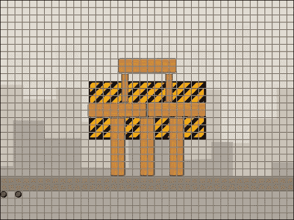

1.  建立了级别之后，我们可以继续进行前端的工作。创建一个新房间，在**设置**中，命名为`MainMenu`，宽度为`640`，高度为`480`。将其移动到资源树中`Rooms`文件夹的顶部。

1.  创建一个新的背景，`bg_MainMenu`，并加载`第七章/背景/BG_MainMenu.png`。确保没有勾选**删除背景**。

1.  在**房间属性** | **背景**选项卡中，将**背景 0**设置为`bg_MainMenu`。应该勾选**房间开始时可见**的框。现在我们暂时完成了这个房间，点击**确定**。

1.  我们需要为前端再添加两个房间：`LevelSelect`和`Shop`，并应用适当的背景。资源树中的位置并不重要。现在我们已经拥有了游戏所需的所有房间。

## 初始化主菜单

主菜单是玩家将看到的第一个屏幕，它由两个对象组成：一个开始游戏的按钮和一个包含所有全局变量的游戏初始化对象：

1.  让我们从一个用于初始化游戏的对象开始。创建一个新对象，命名为`obj_Global`。

1.  创建一个名为`scr_Global_GameStart`的新脚本。随着我们的进行，我们将向其中添加代码，但现在我们只需要初始化分数：

```js
score = 0;
```

1.  添加一个**其他** | **游戏开始**事件，并应用`scr_Global_GameStart`。点击**确定**。

1.  重新打开`MainMenu`，在房间中放置一个`obj_Global`的实例。

1.  我们将创建一些按钮，因此让我们建立一个父对象来运行悬停状态的公共功能。创建一个名为`obj_Button_Parent`的新对象。

1.  所有按钮都将有多个动画帧用于悬停状态，因此我们需要停止它们的播放。创建一个新的脚本，`scr_Button_Parent_Create`，并将其附加到**创建**事件，并使用以下代码：

```js
image_speed = 0;
image_index = 0;
```

1.  创建一个新的脚本，`scr_Button_Parent_MouseEnter`，并将其附加到**鼠标** | **鼠标进入**事件，代码用于将其更改为动画的第二帧：

```js
image_index = 1;
```

1.  我们还需要通过创建另一个新的脚本`scr_Button_Parent_MouseLeave`并将其附加到**鼠标** | **鼠标离开**事件来重置它。

```js
image_index = 0;
```

父对象现在已经完成，设置应该如下截图所示：

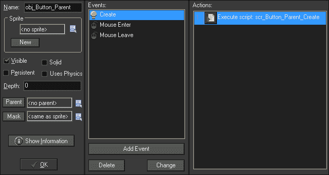

1.  接下来，我们可以构建第一个真正的按钮。创建一个新的精灵，`spr_Button_Start`，关闭**删除背景**，加载`Chapter 7/Sprites/Button_Start.gif`。**居中** **原点**，然后点击**确定**。

1.  创建一个新的对象，`obj_Button_Start`，并将`spr_Button_Start`应用为**精灵**。

1.  将**父对象**设置为`obj_Button_Parent`，以便悬停状态能够正常工作。

1.  由于每个按钮都会执行不同的操作，我们需要为每个按钮分配自己的点击事件。创建一个新的脚本，`scr_Button_Start_MousePressed`，并将其附加到**鼠标** | **左键按下**事件，使用以下代码前往房间`LevelSelect`：

```js
room_goto(LevelSelect);
```

1.  这个按钮现在已经完成。将`obj_Button_Start`的单个实例放入`MainMenu`靠近屏幕底部的位置，**X**：`320`和**Y**：`416`。房间应该看起来像下面的截图：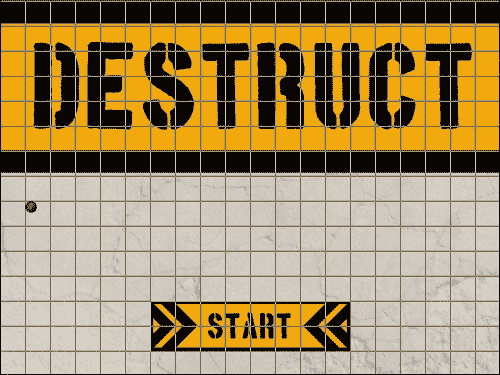

1.  运行游戏，确保它从`MainMenu`开始，并且**Start**按钮按预期工作。

## 使用 2D 数组选择级别

我们要构建的下一个房间是`LevelSelect`。在这个房间中，将有一个用于前往商店的按钮，以及游戏中每个级别的按钮，但一开始只有第一个级别是解锁的。随着玩家的进展，按钮将会解锁，玩家将可以访问所有以前的级别。为了实现这一点，我们将动态创建游戏中每个级别的按钮，并使用 2D 数组来存储所有这些信息。

2D 数组就像我们在书中已经使用过的数组一样。它是一个静态的数据列表，但它允许每行有多个值，就像电子表格一样。这是我们可以使用的一个非常强大的工具，因为它使得将几个不同的元素组合在一起变得更加简单：

1.  创建一个新的脚本，`scr_Global_Levels`，并开始初始化一些全局变量：

```js
globalvar level, totalLevels;
```

由于我们一直在试图简化我们的代码，我们可以使用`globalvar`来声明全局变量的替代方法。这种声明方法与`global`完全相同，但它允许我们编写`level`而不是`global.level`。虽然这将为我们节省大量按键，但我们必须记住它是一个全局变量，因为它并不那么明显。

1.  接下来，我们需要创建一个 2D 数组，其中一列保存级别，另一列保存它是否被锁定。让我们先添加第一个级别：

```js
level[0, 0] = Level_01;
level[0, 1] = false;
```

要创建一个 2D 数组，只需要在括号内放入两个数字。第一个数字是行数，第二个是列数。这里我们只有一行，有两列。第一列将保存房间名称，第二列将保存该房间是否被锁定；在这种情况下，`Level_01`是解锁的。

1.  在 GameMaker: Studio 中使用简单数组的一个缺点是没有函数可以找出数组的大小。我们需要知道这个数组的大小，以便我们可以动态创建所有的按钮。我们已经创建了一个全局变量来保存级别的总数；我们只需要手动设置它的值。让我们将所有级别添加到数组中，锁定它们，并设置`totalLevels`变量。以下是所有 12 个级别的完整脚本：

```js
globalvar level, totalLevels;
level[0, 0] = Level_01;
level[0, 1] = false;
level[1, 0] = Level_02;
level[1, 1] = true;
level[2, 0] = Level_03;
level[2, 1] = true;
level[3, 0] = Level_04;
level[3, 1] = true;
level[4, 0] = Level_05;
level[4, 1] = true;
level[5, 0] = Level_06;
level[5, 1] = true;
level[6, 0] = Level_07;
level[6, 1] = true;
level[7, 0] = Level_08;
level[7, 1] = true;
level[8, 0] = Level_09;
level[8, 1] = true;
level[9, 0] = Level_10;
level[9, 1] = true;
level[10, 0] = Level_11;
level[10, 1] = true;
level[11, 0] = Level_12;
level[11, 1] = true;
totalLevels = 12;
```

1.  我们需要在游戏开始时初始化这个数组。重新打开`scr_Global_GameStart`，并在分数变量之后执行此脚本。

```js
scr_Global_Levels();
```

1.  让我们继续构建前往商店的按钮。创建一个新的精灵`spr_Button_Shop`，并关闭**Remove Background**，加载`Chapter 7/Sprites/Button_Shop.gif`。**Center** **Origin**并单击**OK**。

1.  创建一个新对象`obj_Button_Shop`，并将`spr_Button_Shop`应用为**Sprite**。

1.  这是一个标准按钮，所以将**Parent**设置为`obj_Button_Parent`。

1.  对于这个对象，我们需要做的最后一件事是添加一个**Mouse** | **Left Pressed**事件，并应用一个新的脚本`scr_Button_Shop_MousePressed`，其中包含切换房间的代码。

```js
room_goto(Shop);
```

1.  我们将在这些按钮上绘制一些文本，这意味着我们需要引入一些字体。我们在这个游戏中提供了一个名为 Boston Traffic 的字体，需要安装在您的计算机上。要在 Windows 计算机上安装此字体，请右键单击`Chapter 7/Fonts/boston.ttf`，然后选择**安装**。然后按照提示进行操作。

1.  在 GameMaker: Studio 中，我们需要创建三种新字体：`fnt_Large`，`fnt_Medium`和`fnt_Small`。所有三种字体都将使用`Boston Traffic`字体。将`fnt_Large`的大小设置为`20`，`fnt_Medium`设置为`16`，`fnt_Small`设置为`10`。

1.  接下来，我们可以继续创建用于选择关卡的按钮。我们将动态创建这些按钮，并在每个按钮上绘制一个数字，这样我们只需要一个单一的艺术资源。创建一个新的精灵`spr_Button_LevelSelect`，并关闭**Remove Background**，加载`Chapter 7/Sprites/Button_LevelSelect.gif`。**Center** **Origin**并单击**OK**。

1.  创建一个新对象`obj_Button_LevelSelect`，并将`spr_Button_LevelSelect`应用为**Sprite**。这些按钮不能作为`obj_Button_Parent`的子对象，因为它们需要具有锁定状态的能力，这将影响悬停状态。

1.  由于这种按钮类型是独特的，我们需要初始化一些变量。创建一个新脚本`scr_Button_LevelSelect_Create`，并将其附加到**Create**事件中。

```js
isLocked = true;
myLevel = MainMenu;
myNum = 0;
image_speed = 0;
alarm[0] = 1;
```

我们首先将所有按钮默认设置为锁定状态。我们为点击时应该转到的默认房间设置一个默认房间，并在顶部绘制一个数字。最后，我们停止精灵动画，并设置一个步骤的警报。

1.  我们使用一个警报，以确保关卡是否被锁定都能正确显示。创建一个新脚本`scr_Button_LevelSelect_Alarm0`，并将其附加到**Alarm** | **Alarm 0**事件中。

```js
if (isLocked)
{
    image_index = 2;
} else {
    image_index = 0;
}
```

如果按钮被锁定，我们将设置精灵显示锁定帧。否则，它是解锁的，我们显示第一帧。

1.  创建一个新脚本`scr_Button_LevelSelect_MouseEnter`，并将其应用到**Mouse** | **Mouse Enter**事件中。

```js
if (isLocked)
{   
    exit;
} else {
    image_index = 1;
}
```

对于按钮的悬停状态，我们首先检查它是否被锁定。如果是，我们立即退出脚本。如果未锁定，我们切换到悬停帧。

1.  同样的逻辑需要应用到鼠标离开按钮时。创建另一个新脚本`scr_Button_LevelSelect_MouseLeave`，并将其应用到**Mouse** | **Mouse Leave**事件中。

```js
if (isLocked)
{   
    exit;
} else {
    image_index = 0;
}
```

1.  接下来，我们将添加一个**Mouse** | **Left Pressed**事件，并附加一个新的脚本`scr_Button_LevelSelect_MousePressed`，其中包含仅在解锁时更改房间的代码。

```js
if (isLocked)
{
    exit;
} else {
    room_goto(myLevel);
}
```

1.  最后，我们只需要一个新的脚本`scr_Button_LevelSelect_Draw`，我们可以用它来在按钮上绘制适当的数字。将其添加到**Draw** | **Draw**事件中。

```js
draw_self();
draw_set_color(c_black);
draw_set_font(fnt_Large);
draw_set_halign(fa_center);
draw_text(x, y-12, myNum);
draw_set_font(-1);
```

首先，我们需要绘制应用于对象本身的精灵。接下来，我们将绘图颜色设置为黑色，设置字体，并居中对齐文本。然后，我们绘制`myNum`变量中保存的文本，将其在 Y 轴上下降一点，使其在垂直方向上居中。由于我们将在这个游戏中绘制大量文本，我们应该通过将字体设置为`-1`值来强制使用默认字体。这将有助于防止此字体影响游戏中的任何其他绘制字体：

1.  现在我们已经完成了级别选择按钮，属性应该看起来像以下截图：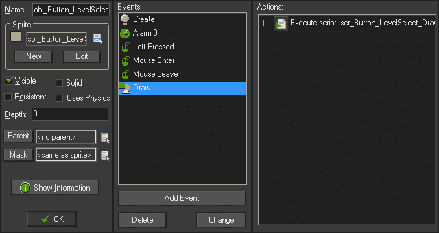

1.  我们现在拥有了级别选择屏幕所需的所有组件，我们只需要生成所有内容。为此，我们将创建一个新对象，`obj_LevelSelect_Overlord`，以在进入房间时构建菜单。

1.  添加一个**其他** | **房间开始**事件，并附加一个新的脚本，`scr_LevelSelect_Overlord_RoomStart`，其中包含以下代码：

```js
column = 0;
row = 1;
for ( i = 0; i < totalLevels ; i++ )
{
    lvl = instance_create((72 * column) + 128, 80 * row + 128, obj_Button_LevelSelect);
    lvl.myLevel = level[i, 0];
    lvl.isLocked = level[i, 1];
    lvl.myNum = (i + 1);
    column++;
    if (column > 5)
    { 
        row++; 
        column = 0;
    }
}
instance_create(320, 440, obj_Button_Shop);
```

我们首先为按钮布局所需的行和列建立变量。然后我们从零开始运行一个循环，运行总级数我们在全局变量`totalLevels`中声明的次数。在这个循环中，我们首先创建一个`obj_Button_LevelSelect`的实例，并在水平和垂直方向上偏移它，额外增加 128 像素的填充，以便在屏幕边缘和按钮之间留出边距。然后我们通过设置`level`全局数组中的值来改变按钮的`myLevel`和`isLocked`变量。接下来，我们改变`myNum`变量以指示按钮上将绘制的数字。代码的最后几行是我们如何限制列数并添加额外的按钮行。每次循环我们增加列数，一旦超过五，就将其重置为零。这将给我们一行六个按钮。如果我们有超过六个按钮，将创建一个新行，可以有另外六个按钮。这意味着我们可以稍后向数组中添加级别，并且它们将自动添加到此菜单中，为每六个级别创建新行。最后但并非最不重要的是，在屏幕底部生成一个**SHOP**按钮的实例。

1.  打开`LevelSelect`，并在房间中放置一个`obj_LevelSelect_Overlord`的实例。这就是我们需要的全部，要这样做，请点击复选标记。

1.  运行游戏。点击开始游戏后，您应该进入`LevelSelect`，并且它应该看起来像以下截图。目前只有 1 级可访问，按钮是黄色的。所有其他按钮都是灰色的，表示它们被锁定。点击**Level 1**按钮将带您到该级别，**SHOP**按钮应该带您到商店。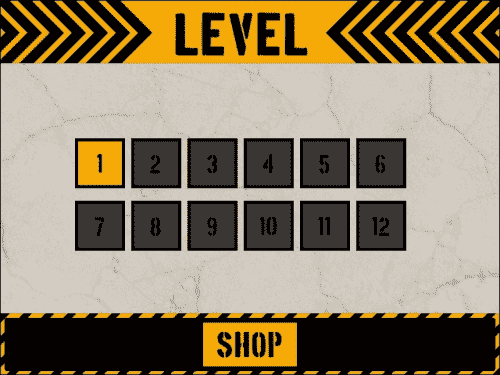

## 使用数据结构准备商店

我们唯一剩下要构建的房间是商店，玩家将能够购买用于每个级别的装备。房间将包括每种装备的图标、价格列表和购买装备的按钮。我们还将有一个显示当前玩家拥有多少现金的显示，并且当他们花钱时，这将更新：

1.  在构建任何东西之前，我们需要做的第一件事是建立一些常量，以使我们的代码更易于阅读。打开**资源** | **定义常量**编辑器，并为装备设置值：`TNT`：`0`，`WRECKINGBALL`：`1`，`MAGNET`：`2`。

1.  我们还需要一些常量来描述组成装备的所有元素。添加`SPRITE`：`0`，`OBJECT`：`1`，`AMOUNT`：`2`和`COST`：`3`。完成后，编辑器中的设置应该如下截图所示：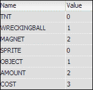

1.  为了保持游戏的颜色方案，我们需要创建一个全局访问的独特黄色。创建一个新脚本，`scr_Global_Colors`，其中包含以下代码：

```js
globalvar yellow;
yellow = make_color_rgb(249, 170, 0);
```

我们为我们的颜色创建一个全局变量，然后使用一个带有红色、绿色和蓝色数量参数的函数来制作我们特殊的黄色。

1.  打开`scr_Global_GameStart`并执行`scr_Global_Colors()`。

为了构建一个合适的商店和库存系统，我们需要比静态数组更多的数据控制。我们需要更加灵活和可搜索的东西。这就是**数据结构**的用武之地。数据结构是特殊的动态结构，类似于数组，但具有使用特定函数操纵数据的能力，例如洗牌或重新排序数据。GameMaker: Studio 带有六种不同类型的数据结构，每种都有自己的一套函数和好处：

+   **栈**：这种结构是后进先出的，意味着每个新的数据都被放置在前一个数据的顶部，当读取时，最新的数据首先被读取。可以把它想象成一叠盘子，你将使用最后放在架子上的那个。

+   **队列**：这种结构是先进先出的，意味着每个新的数据都被放置在前一个数据的后面，当读取时，最旧的数据首先被读取。可以把它想象成商店里的排队，排在最前面的人将首先被服务。

+   **列表**：这种结构更加灵活。在这种结构中，数据可以放置在列表中的任何位置，并且可以进行排序、修改和搜索。可以把它想象成一副扑克牌，可以以任何顺序放置，并且随时可以改变。

+   **映射**：这种结构允许使用键和值的链接对存储信息，尽管它不能被排序，所有键必须是唯一的。可以把它想象成一组钥匙，每个钥匙只能打开相应的门。

+   **优先队列**：这种结构类似于队列，但每个值都被分配了一个优先级。可以把它想象成夜店里的排队，VIP 有更高的优先级，先被放行。

+   **网格**：这种结构是最健壮的，类似于 2D 数组。它有行和列，但有许多用于排序、搜索和操纵数据的函数。可以把它想象成一个可搜索的机场出发时间表，你可以看到所有的飞机、公司、飞行时间等，并根据自己的喜好进行排序。

我们将从网格数据结构开始，因为我们需要每个物品的几行和列的信息。创建一个新的脚本，`scr_Global_Equipment`，并编写以下代码来构建网格：

```js
globalvar equip;
equip = ds_grid_create(3,4);
ds_grid_set(equip, TNT, SPRITE, spr_Menu_TNT);
ds_grid_set(equip, TNT, OBJECT, obj_Ghost_TNT);
ds_grid_set(equip, TNT, AMOUNT, 1);
ds_grid_set(equip, TNT, COST, 100);
ds_grid_set(equip, WRECKINGBALL, SPRITE, spr_Menu_WreckingBall);
ds_grid_set(equip, WRECKINGBALL, OBJECT, obj_Ghost_WreckingBall);
ds_grid_set(equip, WRECKINGBALL, AMOUNT, 0);
ds_grid_set(equip, WRECKINGBALL, COST, 1000);
ds_grid_set(equip, MAGNET, SPRITE, spr_Menu_MagneticCrane);
ds_grid_set(equip, MAGNET, OBJECT, obj_Ghost_MagneticCrane);
ds_grid_set(equip, MAGNET, AMOUNT, 0);
ds_grid_set(equip, MAGNET, COST, 3000);
```

我们首先声明一个全局变量，然后使用它来保存网格的 ID。创建网格时，我们需要声明它需要多少行和列。对于这个游戏，我们有三行装备，每个装备有四列数据。我们分别为每个网格单元设置了值，所以槽 0 是要使用的精灵，槽 1 是要生成的对象，槽 2 是玩家起始的数量，最后，槽 3 是购买的成本。我们已经为每个装备做了这个设置，我们（玩家）将在游戏开始时只拥有单个 TNT。

1.  重新打开`scr_Global_GameStart`并调用这个脚本。现在我们已经对所有的装备进行了分类，并为商店做好了准备。

1.  接下来，我们需要为玩家创建一个库存，以跟踪他们购买了什么装备。由于玩家需要将装备添加到库存中，并且还将使用这些装备，我们需要一个易于改变的数据结构。我们将使用列表来实现这个目的。创建一个新的脚本，`scr_Global_Inventory`，并开始一个列表：

```js
globalvar inventory;
inventory = ds_list_create();
ds_list_add(inventory, TNT);
```

我们声明一个全局变量，然后使用它来保存我们创建的列表的 ID。在游戏开始时，我们已经确定玩家将拥有一些 TNT，所以这就是我们在库存中需要的全部。

1.  再次在`scr_Global_GameStart`中调用这个脚本。以下是完整的代码：

```js
score  = 0;
scr_Global_Levels();
scr_Global_Colors();
scr_Global_Equipment();
scr_Global_Inventory();
```

1.  现在我们已经存储了所有的数据，我们可以继续构建物品菜单。我们需要创建的第一个元素是一个购买按钮。创建一个新的精灵，`spr_Button_Buy`，并关闭**删除背景**，加载`Chapter 7/Sprites/Button_Buy.gif`。**居中** **原点**，然后点击**确定**。

1.  创建一个新对象，`obj_Button_Buy`，并将`spr_Button_Buy`分配为**Sprite**。

1.  这是一个标准按钮，所以将**Parent**设置为`obj_Button_Parent`。

1.  添加一个**Mouse** | **Left Pressed**事件，并应用一个新脚本，`scr_Button_Buy_MousePressed`，其中包含以下代码：

```js
if (score > ds_grid_get(equip, myItem, COST))
{
    ds_grid_add(equip, myItem, AMOUNT, 1);
    score -= ds_grid_get(equip, myItem, COST);
    if (ds_list_find_index(inventory, myItem) == -1)
    {
        ds_list_add(inventory, myItem);
    }
}
```

为了购买物品，我们首先需要检查玩家是否有足够的钱。为此，我们将`score`与我们创建的网格中保存的数据进行比较。您会注意到我们有一个变量`myItem`，它在按钮本身中尚未初始化。稍后，当我们生成按钮时，我们将动态创建该变量。如果玩家可以购买该物品，我们增加玩家拥有的物品数量，并将金钱减去物品的价格。最后，我们检查玩家当前库存中是否已经有该物品。如果这是其类型的第一个物品，我们将其添加到库存列表中。

1.  现在我们已经准备好用一个名为`obj_Shop_Overlord`的新对象在房间中生成所有东西。

1.  添加一个**Other** | **Room Start**事件，并附加一个新脚本，`scr_Shop_Overlord_RoomStart`，其中包含在商店中生成所需按钮的代码：

```js
for ( i = 0; i < ds_grid_width(equip); i++ )
{
    buyButton = instance_create(512, (96 * i) + 152, obj_Button_Buy);
    buyButton.myItem = i;   
}

instance_create(502, 440, obj_Button_Start);
```

我们首先通过每一行的装备网格运行一个循环，以便我们知道需要创建多少按钮。然后我们生成一个购买按钮，它将垂直堆叠在屏幕上。接下来，我们传递在鼠标按下事件中使用的`myItem`变量。我们做的最后一件事是在屏幕的右下角创建一个开始按钮，以便玩家可以返回到`LevelSelect`选项。

1.  现在我们已经放置了所有的按钮，但我们仍然需要绘制所有其他必要的信息。创建一个新脚本，`scr_Shop_Overlord_Draw`，并将其添加到**Draw** | **Draw**事件中：

```js
draw_set_color(c_black);
draw_set_halign(fa_center);

for ( i = 0; i < ds_grid_width(equip); i++ )
{
    draw_sprite(ds_grid_get(equip, i, SPRITE), 0, 96, (96 * i) + 152);
    draw_set_font(fnt_Small);
    draw_text(116, (96 * i) + 166, ds_grid_get(equip, i, AMOUNT));
    draw_set_font(fnt_Large);
    draw_text(300, (96 * i) + 140, ds_grid_get(equip, i, COST));    
}
```

首先，我们需要将字体颜色设置为黑色，并将文本居中对齐。然后我们通过装备网格运行一个循环来绘制每个组件。我们首先在正确的位置绘制正确的精灵，以与按钮对齐。在这里，我们使用小字体在精灵右下角的小空间中绘制玩家拥有的物品数量。然后我们改为大字体，并显示物品的价格。

1.  菜单现在已经建好了，但仍然缺少一个重要的信息；玩家有多少现金。在脚本的末尾添加以下内容：

```js
draw_set_color(yellow);
draw_set_font(fnt_Medium);
draw_text(96, 416, "Cash");
draw_set_font(fnt_Large);
draw_text(96, 440, score);
draw_set_font(-1);
```

我们将颜色设置为我们特殊的黄色，用于本文的其余部分。我们设置一个中等字体来显示单词`现金`，然后改为大字体显示实际金额。最后，我们将字体重置为默认值。

1.  打开`商店`，并在房间的某个地方放置一个`obj_Shop_Overlord`对象的单个实例。我们已经完成了这个房间，所以点击**确定**。

1.  运行游戏并前往商店。此时您将无法购买任何物品，但您应该能够看到图标、按钮和信息正确显示。它应该看起来像下面的截图：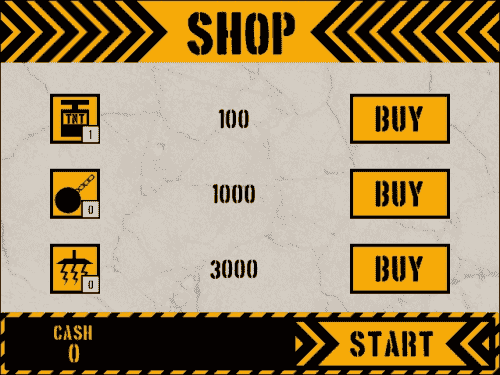

# 重建 HUD

游戏开发是一个迭代的过程，元素在需要时被添加进去，通常会被重新制作多次，因为功能被实现并且用户的反馈改变了项目的方向。以这种方式构建游戏可以节省时间，因为它允许我们快速完成任务，看到结果，并在进行中进行调整。在上一章中，我们专注于基本游戏玩法的功能。我们建立了一个简单的 HUD，允许我们通过点击生成每个装备。然而，我们没有限制玩家可以访问的装备，也没有能力重新开始级别或显示倒计时计时器，显示剩余多少时间来清除区域。我们需要修复所有这些，另外我们应该允许玩家前往商店，以防他们的供应不足。所有这些可以按以下方式完成：

1.  我们将首先添加一些全局变量。创建一个新的脚本`scr_Global_Gameplay`，并声明必要的全局变量：

```js
globalvar isGameActive, isTimerStarted;
isGameActive = true;
isTimerStarted = false;
```

在这里，我们初始化了两个变量，这些变量将改进游戏的功能。变量`isGameActive`将在每个级别开始时设置为`true`，以开始游戏。它还将使我们能够在关卡结束时显示信息，同时防止玩家使用菜单。`isTimerStarted`变量将用于倒计时清除区域。

1.  打开`scr_Global_GameStart`并调用此脚本。

1.  菜单还需要一些新的变量。打开`scr_Menu_Create`并添加以下代码：

```js
timer = 10;
isTimerStarted = false;
menuItem_Zone = 32;
menuItems_Y = 440;
restartX = 468;
shopX = 564;
tempCost = 0;
tempScore = 0;
startEquip = ds_grid_create(3, 4);
ds_grid_copy(startEquip, equip);
```

第一个变量是玩家进行倒计时的时间。在这里，我们将给予区域被清除的十秒钟。然后我们将菜单的垂直位置设置在屏幕底部附近。接下来的两个变量是重启和商店按钮的水平位置。我们需要一些临时变量来保存使用的装备的值以及玩家在关卡中赚取的金额，因为我们不希望在玩家赢得关卡之前改变全局得分。最后，我们创建另一个网格并复制`equip`网格中的数据，以便如果关卡重新开始，我们仍然拥有原始设置。

1.  我们还希望确保玩家如果库存中没有装备，则无法玩关卡。如果发生这种情况，我们将自动去商店。在脚本的顶部，添加以下代码：

```js
if (ds_list_size(inventory) == 0)
{
    room_goto(Shop);
}
```

我们检查库存的大小，如果里面什么都没有，我们就去商店。

1.  我们之前用于菜单的绘制脚本在当时的需求下运行得很好。然而，现在我们有了数据结构，我们可以简化系统并添加新功能。我们将首先创建一个新的脚本`scr_Menu_Equipment`，我们需要接受一些参数：

```js
slot = argument0;
item = argument1;

if (slot == 0) { myX = 40; }
if (slot == 1) { myX = 104; }
if (slot == 2) { myX = 168; }
```

我们首先声明两个变量，这两个参数在调用此脚本时必须提供。**参数**只是在调用脚本或函数时从脚本或函数传递信息的变量。在这里，我们将在菜单上有一个插槽位置和一个要在插槽中显示的物品的声明。由于我们在菜单上有一个预定数量的插槽，为了是三个，我们可以检查传递的是哪个插槽并应用适当的水平偏移。

1.  接下来，我们将添加菜单装备按钮的功能。添加以下代码：

```js
draw_sprite(ds_grid_get(startEquip, item, SPRITE), 0, myX, menuItems_Y);
if (!isActive)
{   
    if (win_Y > menuItems_Y - menuItem_Zone && win_Y < menuItems_Y + menuItem_Zone)
    {
        if (win_X > myX - menuItem_Zone && win_X < myX + menuItem_Zone) 
        {
            draw_sprite(ds_grid_get(startEquip, item, SPRITE), 1, myX, menuItems_Y);
            if (mouse_check_button_pressed(mb_left) && ds_grid_get(startEquip, item, AMOUNT) > 0)
            {        
                instance_create(myX, menuItems_Y, ds_grid_get(startEquip, item, OBJECT));
                ds_grid_add(startEquip, item, AMOUNT, -1);
                tempCost += ds_grid_get(startEquip, item, COST);
                isActive = true;
            }
        }
    }
}
```

以前，我们为每个装备都有类似的代码。现在我们有了数据结构，我们可以使用信息动态创建所有的装备。我们首先绘制从本地`startEquip`网格中提取的精灵。然后我们检查菜单是否处于活动状态，因为玩家试图放置物品。我们检查鼠标在屏幕上的位置，看它是否悬停在按钮上，并更改为适当的动画帧。如果点击按钮，我们创建所选的物品，从网格中减去一个物品单位，将物品的价值添加到玩家的支出中，并使菜单处于活动状态。

1.  我们已经绘制了所有的装备按钮，但我们没有显示玩家在他们的库存中有多少物品。为了解决这个问题，在脚本的末尾添加以下代码：

```js
draw_set_color(c_black);
draw_set_halign(fa_center);
draw_set_font(fnt_Small);
draw_text(myX + 20, menuY + 14, ds_grid_get(startEquip, item, AMOUNT));
```

我们在这里所做的只是设置文本的颜色、水平对齐和字体。然后我们像在商店里一样在右下角绘制每个物品的单位数量。

1.  现在我们有了改进和简化的装备按钮代码，我们可以回到`scr_Menu_DrawGUI`并删除所有旧的笨重代码。删除除绘制菜单背景的第一行代码之外的所有代码。一旦删除了，添加以下代码来绘制菜单：

```js
if (isGameActive)
{
    Win_X = window_mouse_get_x();
    Win_Y = window_mouse_get_y();
    for (i = 0; i < ds_list_size(inventory); i++)
    {
        scr_Menu_Equipment(i, ds_list_find_value(inventory, i));
    }
}
draw_set_font(-1);
```

我们首先检查全局变量`isGameActive`是否为 true。如果为 true，我们获取鼠标的屏幕位置，以便正确放置菜单的位置。然后，我们为玩家在库存中拥有的物品运行一个循环，然后执行菜单装备脚本以绘制所有按钮。在脚本的最后，我们再次将字体设置回默认值。

1.  HUD 不仅需要装备按钮，还需要其他内容。对于这样的游戏，我们肯定需要一个允许玩家重新开始关卡的按钮。让我们快速创建一个新的精灵，`spr_Button_Restart`，并关闭**Remove Background**，加载`Chapter 7/Sprites/Button_Restart.gif`。**Center** **Origin**，然后单击**OK**。

1.  我们不需要为此按钮创建对象，因为它将绘制在菜单上。创建一个新的脚本，`scr_Menu_Button_Restart`，并编写以下代码：

```js
draw_sprite(spr_Button_Restart, 0, restartX, menuItems_Y);
if (win_Y > menuItems_Y - menuItem_Zone && win_Y < menuItems_Y + menuItem_Zone)
{
    if (win_X > restartX - menuItem_Zone && win_X < restartX + menuItem_Zone)
    {
        draw_sprite(spr_Button_Restart, 1, restartX, menuItems_Y);
        if (mouse_check_button_pressed(mb_left))
        {        
            room_restart();
        }
    }
}
```

与装备按钮一样，我们首先以非悬停状态绘制按钮。然后检查鼠标是否悬停在按钮上，如果是，则将动画更改为悬停状态。如果点击按钮，我们重新启动房间。

1.  重新打开`scr_Menu_DrawGUI`，并在创建装备按钮的循环之后调用此脚本。

1.  我们还需要一个按钮，允许玩家访问商店。我们不能使用先前创建的按钮，因为我们需要它绘制在菜单上，而不是在世界中生成。幸运的是，我们可以使用它的精灵，所以我们只需要创建一个新的脚本，`scr_Menu_Button_Shop`，代码类似于所有其他菜单按钮：

```js
draw_sprite(spr_Button_Shop, 0, shopX, menuItems_Y);
if (win_Y > menuItems_Y - menuItem_Zone && win_Y < menuItems_Y + menuItem_Zone)
{
    if (win_X > shopX - menuItem_Zone*2 && win_X < shopX + menuItem_Zone*2)
    {
        draw_sprite(spr_Button_Shop, 1, shopX, menuItems_Y);    
        if (mouse_check_button_pressed(mb_left)) 
        {        
            room_goto(Shop);
        }
    }
}
```

与以前一样，我们绘制精灵，然后检查鼠标是否悬停，确保我们将宽度更改为此精灵的较大尺寸。如果点击按钮，我们就会进入商店。

1.  再次打开`scr_Menu_DrawGUI`，并在重新启动按钮之后立即调用此脚本。

1.  我们几乎已经完成了 HUD，我们只需要向玩家显示一个非常重要的信息：剩余多少时间。这将完全通过文本完成，所以我们只需要创建一个新的脚本，`scr_Menu_Clock`：

```js
draw_set_color(yellow);
if (isTimerStarted)
{
    draw_set_font(fnt_Small);
    draw_text(320, 416,"COUNTDOWN");
    draw_set_font(fnt_Large);
    draw_text(320, 436, timer);
} else {
    draw_set_font(fnt_Small);
    draw_text(320,416,"PRESS SPACE TO");    
    draw_set_font(fnt_Large);
    draw_text(320,436,"DESTROY")
} 
```

背景是黑色的，所以我们将使用我们为所有文本创建的黄色。如果全局变量`isTimerStarted`为 true，我们以小写字母绘制单词`"COUNTDOWN"`，并在其下方以大字体显示剩余时间。如果`isTimerStarted`为 false，我们将以类似的方式绘制文本，以指示玩家他们应该做什么。

1.  重新打开`scr_Menu_DrawGUI`，并在商店按钮调用之后调用此脚本。完成的脚本应如下所示：

```js
draw_sprite(spr_Menu_BG, 0, 0, 400);
if (isGameActive)
{
    Win_X = window_mouse_get_x();
    Win_Y = window_mouse_get_y();

    for (i = 0; i < ds_list_size(inventory); i++)
    {
        scr_Menu_Equipment(i, ds_list_find_value(inventory, i));
    }
    scr_Menu_Button_Restart();
    scr_Menu_Button_Shop();
    scr_Menu_Clock();
}
draw_set_font(-1);
```

1.  要启动倒计时，我们需要激活它，在`scr_Overlord_KeyPress`中可以这样做。添加以下代码：

```js
if (!isTimerStarted)
{
    obj_Menu.alarm[0] = room_speed;
    isTimerStarted = true;
}
```

我们检查`isTimerStarted`变量，看它是否已经被激活，因为我们只希望它发生一次。如果计时器尚未启动，它将在一秒钟内在菜单中打开一个警报。

1.  我们需要做的最后一件事是打开`obj_Menu`，并添加一个**Alarm** | **Alarm 0**事件，附加一个新的脚本`scr_Menu_Alarm0`。

```js
if (timer > 0)
{
    timer -= 1;
    alarm[0] = room_speed;
} else {
    obj_Overlord.alarm[0] = 1;
}
```

菜单已经初始化了一个为十秒的计时器，在这个警报中，我们检查是否还有剩余时间。如果有，我们将时间减少一秒，并重置另一个秒的警报。这将重复直到时间到期，此时我们告诉 Overlord 立即运行胜利条件警报。

1.  HUD 现在正在控制时间，所以我们需要从 Overlord 中删除该功能。重新打开`scr_Overlord_Step`，并删除设置警报的代码行。

1.  运行游戏并玩第一关。菜单有一个 TNT 的单个装备按钮，一个重新开始按钮和一个商店按钮。一旦按下空格键，倒计时器就会开始倒计时，直到为零。当时间到期时，房间将根据区域是否清除而重新启动或进入下一个房间。游戏应该看起来像下面的截图：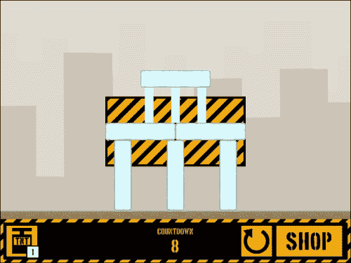

# 添加破坏的风险和回报

到目前为止，游戏中几乎没有任何风险或回报。我们已经在游戏中添加了商店，可以购买物品，但我们还不能赚取任何现金。只要物品在我们的库存中，我们可以使用尽可能多的装备，这意味着没有必要进行策略。如果玩家用完所有的钱或完成所有的关卡，我们需要添加一个游戏结束屏幕。由于目前玩家不知道自己的表现如何，我们还需要一个得分屏幕来显示。现在是时候添加这些功能了，首先是奖励玩家分数：

1.  我们将从游戏结束屏幕开始。创建一个名为`GameOver`的新房间，并将`bg_MainMenu`应用为其背景。

1.  创建一个新对象，`obj_GameOver`，不附加**Sprite**。

1.  创建一个变量，其中包含游戏结束消息，并设置一个五秒的闹钟，用于重新开始游戏。创建一个新脚本`scr_GameOver_Create`，并将其附加到**Create**事件：

```js
gameOverText = "You ran out of money, better luck next time!";
alarm[0] = 5 * room_speed;
```

1.  添加一个**Alarm** | **Alarm 0**事件，然后附加一个新脚本`scr_GameOver_Alarm0`，并重新启动游戏：

```js
game_restart();
```

1.  我们所要做的最后一件事就是绘制胜利/失败声明。创建一个新脚本`scr_GameOver_Draw`，并将其附加到**Draw** | **Draw**事件：

```js
draw_set_color(c_black);
draw_set_halign(fa_center);
draw_set_font(fnt_Large);
draw_text(320, 280, "Game Over");
draw_set_font(fnt_Small);
draw_text(320, 320, gameOverText);
draw_set_font(-1);
```

1.  如果它还没有打开，重新打开`GameOver`，并在房间中的某个地方放置一个`obj_GameOver`的单个实例。我们现在已经完成了这个，可以关闭房间了。

1.  接下来我们要创建一个新对象`obj_ScoreFloat`，来显示每个柱子或碎片被摧毁时奖励的分数。

1.  添加一个**Create**事件，使用一个新脚本`scr_ScoreFloat_Create`，并初始化两个变量：

```js
fadeOut = 0;
alpha = 1;
```

我们将让分数随着时间淡出，所以我们有一个变量来触发淡出，还有一个用于透明度值的变量，目前设置为完全不透明。

1.  接下来，我们需要添加一个**Draw** | **Draw**事件，使用一个新脚本`scr_ScoreFloat_Draw`来在屏幕上显示值：

```js
y -= 1;
fadeOut++;
if (fadeOut > 60) { alpha -= 0.05;}
if (alpha <= 0) { instance_destroy(); }
draw_set_color(c_black);
draw_set_font(fnt_Small);
draw_set_alpha(alpha);
draw_text(x, y, myValue);
draw_set_alpha(1);
```

这个对象不是物理世界的一部分，所以我们可以手动在每一帧垂直移动它。我们增加`fadeOut`变量，一旦它达到 60，我们开始逐渐减少`alpha`变量的值。一旦`alpha`达到零，我们销毁实例，以便它不占用任何内存。之后我们设置颜色、字体和透明度值，并绘制文本。`myValue`变量将在创建时从生成它的对象传递。最后，我们将透明度设置回完全不透明；否则整个房间中的其他所有东西也会淡出。

1.  现在我们可以显示分数，我们需要生成它并传递一个值给它。由于我们已经知道每个柱子和碎片的质量不同，我们可以使用这个数字来在其被摧毁时奖励分数。重新打开`scr_Pillar_BreakApart`，在播放破碎声音后但实例被销毁之前插入以下代码：

```js
scoreFloat = instance_create(x, y, obj_ScoreFloat);
scoreFloat.myValue = floor(phy_mass);
obj_Menu.tempScore += scoreFloat.myValue;
```

当柱子破碎时，它将生成一个`obj_ScoreFloat`的实例。然后我们将显示的值设置为对象总质量的向下取整。最后，我们将菜单的`tempScore`增加相同的数量。

1.  我们需要让小柱子和碎片做同样的事情，所以打开`scr_Pillar_Destroy`，并在同样的位置插入相同的代码。

1.  运行游戏并摧毁第一关的柱子。每块破碎的部分都会浮出一个数字，表示它的价值。浮动的数字应该在几秒钟后淡出，并且应该看起来像以下截图：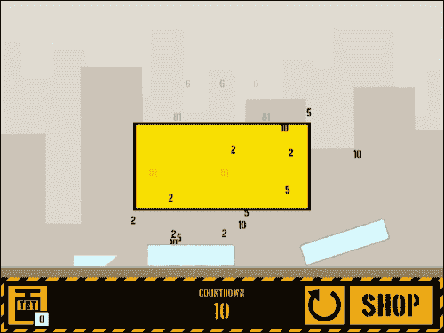

1.  现在我们只需要制作一个总结损坏并显示关卡总利润的得分屏幕。我们将首先引入一些额外的精灵，`spr_Screen_BG`和`spr_Button_NextLevel`，都在`第七章/精灵/`中提供。确保不要**删除背景**，并为两者都**居中**设置**原点**。

1.  让我们创建一个新脚本`scr_Menu_Button_NextLevel`，实现此按钮的功能：

```js
if (isVictory)
{
    draw_sprite(spr_Button_NextLevel, 0, nextLevelX, menuItems_Y);
    if (win_Y > menuItems_Y - menuItem_Zone && win_Y < menuItems_Y + menuItem_Zone)
    {
        if (win_X > nextLevelX - menuItem_Zone && win_X < nextLevelX + menuItem_Zone)
        {
            draw_sprite(spr_Button_NextLevel, 1, nextLevelX, menuItems_Y);
            if (mouse_check_button_pressed(mb_left))
            {
                for(i = 0; i < totalLevels; i++)
                { 
                    if (level[i, 0] == room)
                    { 
                        level[i+1, 1] = false;
                        room_goto( level[i+1, 0] );                        
                    }
                }    
            }
        }
    }
}
```

我们只希望下一关按钮在玩家成功清除区域时出现，因此我们首先检查这一点。如果玩家赢得了关卡，我们绘制精灵，然后检查鼠标是否悬停在其上。如果鼠标悬停在按钮上并按下，我们快速遍历关卡数组，查看我们当前所在的房间，并解锁下一关。最后，我们进入刚刚解锁的房间。

1.  现在我们准备创建一个新对象`obj_ScoreScreen`，用于显示得分屏幕。将**深度**设置为`-100`，以便它始终显示在所有其他 GUI 元素的顶部。

1.  为新脚本`scr_ScoreScreen_Create`添加一个**Create**事件，并初始化以下变量：

```js
isGameActive = false;
obj_Menu.isActive = true;
isVictory = scr_WinCondition();
screenX = 320;
screenY = 200;
menuItem_Zone = 32;
menuItems_Y = 440;
restartX = 200;
shopX = 320;
nextLevelX = 440;
```

我们不希望玩家在这段时间内进行游戏，因此我们关闭`isGameActive`变量，并激活菜单，使得装备按钮不再起作用。接下来，我们需要检查玩家是否成功，以便知道要绘制什么。最后的七个变量都是用于放置我们将显示的各种文本和按钮。

1.  现在添加一个**Draw** | **Draw GUI**事件，使用新脚本`scr_ScoreScreen_DrawGUI`，我们将首先绘制所需的所有文本：

```js
draw_sprite(spr_Screen_BG, 0, screenX, screenY);

draw_set_color(c_black);
draw_set_halign(fa_center);
draw_set_font(fnt_Large);
draw_text(screenX, 60, room_get_name(room));
draw_text(screenX, 144, obj_Menu.tempScore);
draw_text(screenX, 204, obj_Menu.tempCost);
draw_text(screenX, 284, obj_Menu.tempScore - obj_Menu.tempCost);

draw_set_font(fnt_Medium);
draw_text(screenX, 120, "Damage Estimate");
draw_text(screenX, 180, "Equipment Cost");
draw_text(screenX, 260, "Total Profit");
draw_set_font(-1);
```

首先绘制背景精灵。然后设置颜色、对齐和字体。我们使用最大的字体来绘制房间的名称和损坏量、使用的装备量和总利润的值。然后切换到中等字体，写出每个值的描述，放在相应数字的上方。我们完成了绘制文本，所以将字体设置回默认值。

1.  现在我们只需要将按钮添加到脚本中：

```js
Win_X = window_mouse_get_x();
Win_Y = window_mouse_get_y();
scr_Menu_Button_Restart();
scr_Menu_Button_Shop();
scr_Menu_Button_NextLevel();
```

就像我们在菜单中所做的那样，我们获取屏幕上鼠标的坐标，然后执行三个按钮的脚本。

1.  为了激活得分屏幕，我们需要重新打开`scr_Overlord_Alarm0`，并让它生成`obj_ScoreScreen`的一个实例，而不是当前运行的代码。删除所有代码，并用以下代码替换它：

```js
instance_create(0, 0, obj_ScoreScreen);
```

1.  运行游戏并完成第一关。计时器结束后，得分屏幕将显示损坏、成本和利润。游戏菜单已消失，并被三个按钮替换，用于重新玩关卡、前往商店或下一关。它应该看起来像以下截图：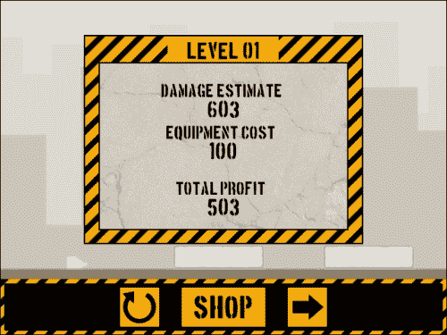

1.  我们需要解决一个问题。虽然屏幕显示我们已经赚了钱，但如果我们去商店，将没有现金可用。这是因为我们还没有将临时值转移到全局值，我们将在一个名为`scr_ScoreCleanUp`的新脚本中完成这个操作：

```js
with (obj_Menu)
{
    ds_grid_copy(equip, startEquip);
    ds_grid_destroy(startEquip);
    score += tempScore - tempCost;
    for ( i = 0; i < ds_grid_width(equip); i++)
    {
        e = ds_grid_get(equip, i, AMOUNT);

        if (e == 0)
        {
            inv = ds_list_find_index(inventory, i);
            ds_list_delete(inventory, inv);
        }
    }
}
```

当执行此脚本时，它将进入菜单，并将剩余的装备复制到全局装备值中，然后从内存中删除临时网格。接下来，根据游戏过程中发生的情况增加全局得分。然后，我们通过库存运行循环，查找玩家是否已用完任何物品。如果是，我们将其从库存中删除。

1.  如果玩家进入下一关，我们应该立即支付他们。我们还应该检查分数，以确保玩家有钱。如果他们钱花光了，那就是游戏结束，否则他们可以进入下一关。重新打开`scr_Menu_Button_NextLevel`并用以下代码替换切换房间的那行代码：

```js
scr_ScoreCleanUp(); 
if (score < 0)
{
    room_goto(GameOver);
} else {
    room_goto( level[i+1, 0] );
}
```

1.  如果玩家决定去商店，情况会变得有点棘手。我们正在调用的脚本也在菜单上使用，所以我们不希望它在游戏进行时改变数据。重新打开`scr_Menu_Button_Shop`并用以下代码替换切换房间的那行代码：

```js
if (!isGameActive) { scr_ScoreCleanUp();}
if (score < 0)
{
    room_goto(GameOver);
} else {
    room_goto(Shop);
}
```

现在只有在游戏停止时才会传输分数。我们还在这里检查游戏结束状态的分数，以决定点击时要去哪个房间。

1.  现在一切应该正常工作了，所以运行游戏并检查一下，确保在游戏进行时去商店时分数不会改变。

# 为每个级别添加介绍性文本

我们已经有了关卡的良好结局，但玩家可能不确定该怎么做。我们需要一点故事来推销摧毁塔的想法，并解释玩家在每个关卡需要做什么。为此，我们将在每个关卡开始时添加一个屏幕，就像在每个关卡开始时的得分屏幕一样：

1.  我们需要一个按钮来开始关卡，同样需要在屏幕上绘制。创建一个新脚本`scr_Menu_Button_Start`，其中包含一些非常熟悉的代码：

```js
draw_sprite(spr_Button_Start, 0, startX, startY);
if (win_Y > startY - start_ZoneHeight && win_Y < startY + start_ZoneHeight)
{
    if (win_X > startX - start_ZoneWidth && win_X < startX + start_ZoneWidth)
    {
        draw_sprite(spr_Button_Start, 1, startX, startY);
        if (mouse_check_button_pressed(mb_left)) 
        {        
            isGameActive = true;
            instance_destroy();
        }
    }
}
```

所有标准按钮代码都在这里，但当按钮被点击时，我们激活游戏并销毁 Story screen 对象。这里使用的`start_ZoneWidth`和`start_ZoneHeight`变量尚未初始化，但我们很快就会做到。

1.  接下来，我们需要所有我们想要为每个关卡显示的文本。为此，我们将使用一个地图数据结构，以便我们可以将文本链接到关卡。创建一个新脚本`scr_Global_Dialogue`，并编写我们需要的对话：

```js
globalvar dialogue;
dialogue = ds_map_create();
ds_map_add(dialogue, Level_01, "Welcome to Destruct! A tower toppling game. 
# Let's start with some basic training. Here we have a glass tower that needs to come down. You have one stick of TNT to use to completely clear the Zone. 
# Let's see what you can do.");
ds_map_add(dialogue, Level_02, "Temporary Dialogue for Level 02");
ds_map_add(dialogue, Level_03, "Temporary Dialogue for Level 03");
ds_map_add(dialogue, Level_04, "Temporary Dialogue for Level 04");
ds_map_add(dialogue, Level_05, "Temporary Dialogue for Level 05");
ds_map_add(dialogue, Level_06, "Temporary Dialogue for Level 06");
ds_map_add(dialogue, Level_07, "Temporary Dialogue for Level 07");
ds_map_add(dialogue, Level_08, "Temporary Dialogue for Level 08");
ds_map_add(dialogue, Level_09, "Temporary Dialogue for Level 09");
ds_map_add(dialogue, Level_10, "Temporary Dialogue for Level 10");
ds_map_add(dialogue, Level_11, "Temporary Dialogue for Level 11");
ds_map_add(dialogue, Level_12, "Temporary Dialogue for Level 12");
```

我们创建了一个新的全局变量，并将其附加到我们创建的地图数据结构上。对于每个条目，我们需要一个**Key**和一个**Value**。在这里，我们使用每个房间的名称作为键，并将对话写为值。我们需要为游戏中的每个房间都有文本，以免出错，所以我们为房间 2-12 提供了临时对话，您可以用自己的文本替换。在 Level 01 的对话中，我们使用`#`，这是一个特殊字符，用于开始新的段落。这将使大量文本更易读。

1.  打开`scr_Global_GameStart`并调用这个脚本。

1.  我们已经拥有了所有需要的艺术资源，但我们需要一个新的对象`obj_StoryScreen`，深度为`-100`。

1.  添加一个**Create**事件并应用一个新脚本`scr_StoryScreen_Create`来初始化变量：

```js
isGameActive = false;
screenX = 320;
screenY = 200;
startY = 440;
startX = 320;
start_ZoneWidth = 128;
start_ZoneHeight = 32;
myText = ds_map_find_value(dialogue, room);
textLength = 0;
```

我们停止游戏并设置六个变量来确定我们将要绘制的文本的位置。然后根据玩家当前所在的房间从地图中加载文本。我们最后一个变量`textLength`将用于一个库存效果，文本看起来会随着时间而被打出来。

1.  接下来，我们需要添加一个**Draw** | **Draw GUI**事件，并使用一个新脚本`scr_StoryScreen_DrawGUI`来绘制一切：

```js
draw_sprite(spr_Screen_BG, 0, screenX, screenY);
draw_set_color(c_black);
draw_set_halign(fa_center);
draw_set_font(fnt_Large);
draw_text(screenX, 60, string(room_get_name(room)));

draw_set_halign(fa_left);
draw_set_font(fnt_Small);
textLength++;
writeText = string_copy(myText, 1, textLength);
draw_text_ext(160, 120, writeText, -1, 320);
draw_set_font(-1);

win_X = window_mouse_get_x();
win_Y = window_mouse_get_y();
scr_Menu_Button_Start();
```

与得分屏幕一样，我们绘制背景并设置标题的颜色、对齐方式和字体。接下来是对话框在屏幕上显示的打字效果。我们改变对话框的对齐方式和字体，然后开始逐步增加`textLength`变量。这个值决定了需要复制到`writeText`变量的对话中有多少个字符，这意味着文本会随着时间增长。我们使用`draw_text_ext`函数，它允许我们限制段落在下移一行之前可以有多宽，本例中为 320 像素。最后，我们再次获取鼠标位置以使开始按钮工作。

1.  我们要做的最后一件事就是在`scr_Overlord_Create`中生成一个 Story screen 的实例：

```js
instance_create(0, 0, obj_StoryScreen);
```

1.  运行游戏并进入第一关。故事画面出现，对话开始一次出现一个字母，应该看起来像下面的图片。当点击**开始**按钮时，游戏玩法如常开始。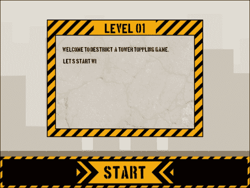

# 保存玩家的进度

游戏中的润色并不总是关于视觉装饰。有时也涉及添加一些不会立即被注意到但可以极大改善整体体验的小功能。目前游戏看起来不错，玩起来也很顺畅，但如果我们关闭浏览器然后在以后的时间返回来玩，我们将需要重新开始。如今的玩家期望他们可以回到游戏并从他们离开的地方继续。为了做到这一点，我们需要保存玩家的进度。

## 理解本地存储

每当游戏需要保存数据时，唯一可行的选择是将数据写入游戏本身之外的文件。对于基于网络的游戏来说，这可能会带来问题，因为任何需要下载的文件都需要用户明确允许。这意味着玩家会知道文件的名称和位置，这反过来意味着他们可以轻松地黑客自己的保存文件。为了避开这个障碍，HTML5 提供了一个名为**本地存储**的解决方案。

本地存储允许网页，或者在我们的情况下是嵌入到网页中的游戏，将数据保存在浏览器内部。这类似于互联网 cookie，但具有更快、更安全的优势，并且可能能够存储更多的信息。由于这些数据保存在浏览器中，用户不会收到文件被创建或访问的通知；他们无法轻松地看到数据，而且只能从创建它的域中访问。这使得它非常适合保存我们的游戏数据。

### 注意

清除保存的数据只有两种方法。覆盖数据或清除浏览器的缓存。建议您始终在私人浏览器模式下测试游戏，以确保保存系统正常工作。

## 写入本地存储

对于这个游戏，我们将保存所有与解锁的级别、累积现金金额和购买的装备相关的数据。为了保存游戏数据，我们需要写入文件。GameMaker: Studio 有两种文件格式可以处理 HTML5 游戏：**文本文件**和**Ini 文件**。文本文件适用于读取或写入大量数据，并且可以按任何您选择的方式进行结构化。Ini 文件用于较小量的数据，并使用**部分/键/值**结构。这种结构将数据分成单独的部分，在每个部分中将有键/值对，看起来像这样：

```js
[section]
key = value
[playerData]
playerFirstName = Jason
playerLastName = Elliott
```

本地存储要求所有数据都是键/值对，因此我们将使用 Ini 文件系统。虽然可以使用文本文件系统，但对于我们需要保存的少量数据以及额外编码所需的工作量来说，这并不是很有益。

1.  任何保存系统需要做的第一件事是创建一个具有所需结构和设置的保存文件。创建一个新的脚本，`scr_GameSave`，并编写以下代码：

```js
theFile = argument0;
ini_open(theFile);
ini_write_real("Score","Cash", score);
for (i = 0; i < totalLevels; i++)
{
    ini_write_string("Levels", string("Level_" + i), level[i, 1]);
}
for ( j = 0; j < ds_grid_width(equip); j++ )
{
    ini_write_real("Equipment",string("Equip_" + j), ds_grid_get(equip, j, AMOUNT));
}
ini_close(); 
```

当我们执行这个脚本时，我们需要传递文件的名称作为参数。然后我们可以打开请求的文件，或者如果找不到文件，将创建一个打开。一旦文件打开，我们就可以写入所有必要的数据。我们首先写入一个`Score`部分，使用一个名为`Cash`的键来设置分数的值。我们使用级别数组运行一个循环，在`Levels`部分中存储每个级别以及它是否已解锁。接下来我们运行另一个循环，这次是遍历装备网格，并写入玩家当前在游戏中拥有的每种物品的数量。最后，在所有数据都被写入后，我们关闭文件。

1.  保存游戏只有在实际加载数据时才有用。创建一个新脚本，`scr_GameLoad`，以便我们可以从文件中读取。

```js
theFile = argument0;
if (!file_exists(theFile)) 
{
    scr_GameSave(theFile); 
} else {
    ini_open(theFile);
    score = ini_read_real("Score","Cash", "");
    for (i = 0; i < totalLevels; i++)
    {
        level[i, 1] = ini_read_string("Levels", string("Level_" + i), "");
    }
    for ( j = 0; j < ds_grid_width(equip); j++ )
    {
        ds_grid_set(equip, j, AMOUNT, ini_read_real("Equipment",string("Equip_" + j), ""));
        if (ds_list_find_index(inventory, j) == -1 && ds_grid_get(equip, j, AMOUNT) > 0)
        {
            ds_list_add(inventory, j);
        }
    }   
    ini_close();
}
```

我们首先检查通过参数传递的文件是否存在。如果在本地存储中找不到文件，比如游戏首次运行时，我们会运行保存脚本来初始化数值。如果找到文件，我们会打开保存文件并将数据读入游戏，就像我们保存的那样。我们设置分数，解锁适当的关卡，并加载装备。我们还会遍历库存，以确保所有装备对玩家可用。

1.  我们希望在游戏开始时加载任何游戏数据。打开`scr_Global_GameStart`，并在脚本末尾添加以下代码：

```js
globalvar saveFile;
saveFile = "Default.ini";
scr_GameLoad(saveFile);
```

我们为文件名创建一个全局变量，以便稍后轻松保存我们的数据。然后将字符串传递给加载脚本。此代码必须放在脚本的末尾，因为我们需要首先初始化网格和数组的默认值。

1.  保存游戏的最合逻辑的地方是在玩家完成每个关卡后。打开`scr_ScoreCleanUp`，并在最后的大括号之前插入对`scr_GameSave`的调用。整个脚本如下所示：

```js
with (obj_Menu)
{
    ds_grid_copy(equip, startEquip);
    ds_grid_destroy(startEquip);
    score += tempScore - tempCost;
    for ( i = 0; i < ds_grid_width(equip); i++)
    {
        e = ds_grid_get(equip, i, AMOUNT);

        if (e == 0) 
        {
            inv = ds_list_find_index(inventory, i);
            ds_list_delete(inventory, inv);
        }
    }
    scr_GameSave(saveFile);
}
```

1.  当玩家在商店购买装备时，我们还需要保存游戏。打开`scr_Button_Buy_MousePressed`，并在最后的大括号之前插入对`scr_GameSave`的调用。

1.  保存游戏并玩几个关卡。完成几个关卡后，刷新浏览器。您应该看到您的现金、装备和已解锁的关卡仍然保持不变。

## 保存多个游戏配置文件

我们现在有一个可以保存玩家进度的游戏，但没有清除数据的方法，如果他们想重新玩游戏。正如我们已经提到的，删除数据的唯一选择是让用户清除其浏览器缓存或覆盖数据，这两种选择都有缺点。大多数用户不会想清除其缓存，因为这将删除本地存储中的所有数据，而不仅仅是游戏数据。如果多个人想在同一浏览器中玩游戏，覆盖数据会有问题。只有一个保存文件变得毫无意义。我们还有第三个可用的选项，即我们根本不清除数据，而是创建可以随时加载的额外保存文件。我们当前的保存/加载系统已经准备好让我们拥有多个用户配置文件，我们只需要添加一个输入系统来捕获用户的名称。我们将保持系统相当简单，将其放在前端，并将用户名称限制为最多八个字符。当玩家点击开始按钮时，它将在切换房间之前加载适当的配置文件：

1.  我们将首先添加一个用于玩家名称的全局变量。打开`scr_Global_GameStart`，初始化`playerName`变量，并在脚本末尾将其设置为空字符串。

```js
globalvar playerName;
playerName = "";
```

1.  我们需要创建一个新的对象，`obj_NameInput`，用于跟踪玩家的输入。由于我们将在屏幕上绘制文本，因此它不需要精灵。

1.  添加一个**Create**事件，附加一个名为`scr_NameInput_Create`的新脚本，用于初始化字符串的长度和已输入字符的数量的变量。

```js
nameSpace = 0;
nameMax = 8;
```

1.  接下来，我们将添加一个**Draw** | **Draw**事件，附加一个名为`scr_NameInput_Draw`的新脚本，用于绘制玩家输入的名称以及一个简单的指示，告诉玩家输入他们的名字：

```js
draw_set_color(c_black);
draw_set_halign(fa_center);
draw_set_font(fnt_Small);
draw_text(320, 280, "Type In Your Name");
draw_set_font(fnt_Large);
draw_text(320, 300, playerName);
draw_set_font(-1);
```

1.  现在我们已经在屏幕上显示了所有内容，我们需要收集键盘输入。添加一个**Key Press** | **Any Key**事件，并附加一个名为`scr_NameInput_KeyPressed`的新脚本。

```js
if (nameSpace < nameMax) 
{    
    if (keyboard_key >= 65 && keyboard_key <= 90) 
    {
        playerName = playerName + chr(keyboard_key);
        nameSpace++;
    }
}
```

我们只希望名称最多为八个字母，因此我们首先检查当前名称是否仍有空间。如果我们可以输入另一个字母，然后我们检查正在按下的键是否是字母。如果按下了字母，我们将该字母添加到字符串的末尾，然后指示另一个空间已被使用。

1.  如果我们现在运行游戏，我们将能够输入字母，但我们无法撤消任何字母。我们可以使用以下代码来解决这个问题：

```js
if (keyboard_key == vk_backspace) 
{  
    lastLetter = string_length(playerName);
    playerName = string_delete(playerName, lastLetter, 1)
    if (nameSpace > 0)
    {
        namespace--;
    }
}
```

如果用户按下*退格*键，我们获取字符串的长度，以找出字符串的最后一个空格在哪里。一旦我们知道了这一点，我们就可以删除字符串末尾的字母。最后，我们检查是否仍然有剩余的字母，如果有，就减少空格计数。这是必要的，这样我们就不会进入负空间。

1.  打开`MainMenu`，在房间的某个地方放置一个`obj_NameInput`的单个实例，位置无关紧要。

1.  保存并玩游戏。在前端，你应该能够输入最多八个字母的名字，并通过点击退格键删除所有这些字母。它应该看起来像下面的截图：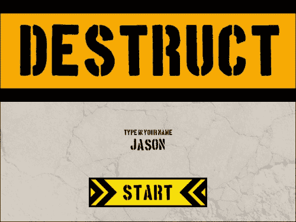

1.  保存系统现在已经完成；剩下要做的就是在玩家点击**开始**按钮时加载数据。由于我们在商店和主菜单中都使用**开始**按钮，我们需要运行一个检查，以确保我们只在游戏开始时加载游戏数据。打开`scr_Button_Start_MousePressed`，在房间改变之前，添加以下代码：

```js
if (room == MainMenu)
{
    saveFile = string(playerName + ".ini");
    scr_GameLoad(saveFile);
}
```

1.  保存并玩游戏。使用你的名字玩游戏，完成几个级别。然后刷新页面并输入一个不同的名字。当你到达级别选择时，只有第一个房间应该是可用的。

1.  刷新浏览器第二次，再次使用你的名字。这次当你到达级别选择时，你应该能看到所有解锁的级别。保存系统有效！

# 总结

干得好！在本章中，我们通过添加整个前端，包括商店和可解锁的级别，真正完善了游戏体验。我们学会了使用网格、地图和列表数据结构来保存各种信息。我们重建了 HUD，以便能够显示更多按钮，只显示可用的装备，并建立了一个基本的倒计时器。我们创建了一个得分屏幕，向玩家展示他们在级别中的表现。我们还在每个级别的前面创建了一个介绍屏幕，利用了一个简单的打字机效果，向我们展示了如何操作字符串。最后，我们添加了一个保存系统，教会了我们如何使用本地存储，并允许我们拥有多个玩家存档！

总的来说，我们将游戏从一个可玩的原型变成了一个完全成熟的游戏，有一个开始和结束，还有很多风险和回报。在下一章中，我们将继续通过查看粒子效果并将其添加到柱子和碎片的销毁中来完善这个游戏。让我们继续吧！
