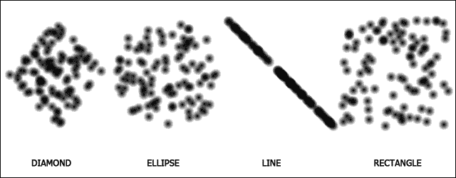
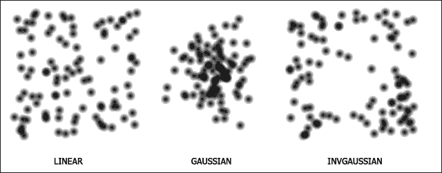
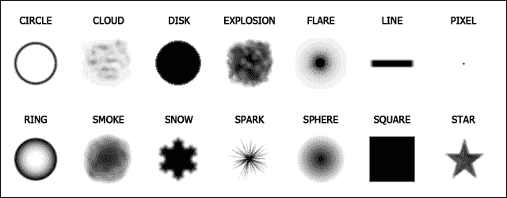
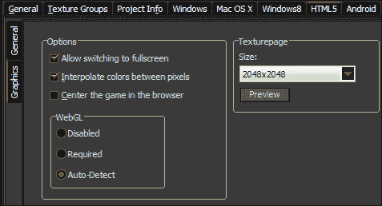
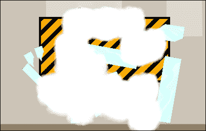
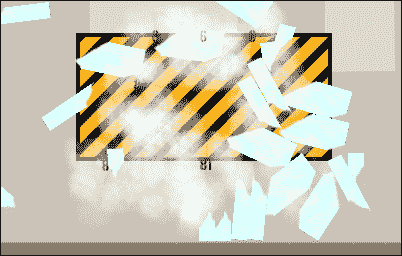
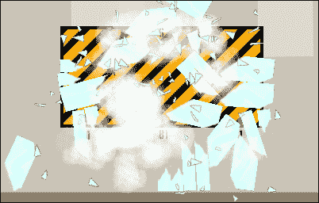
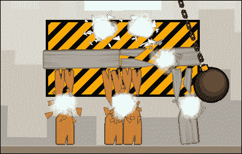
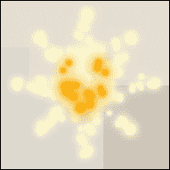
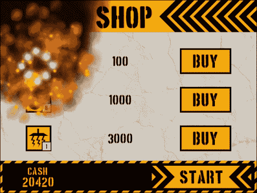

# 第八章：玩转粒子

在过去的两章中，我们构建了一个利用关节、夹具和力的强大的基于物理的游戏。然后我们添加了一个完整的前端，其中有一个商店，玩家可以购买装备和解锁级别。我们还更新了 HUD 并实现了介绍和得分屏幕来完善每个级别。感觉几乎像是一个完整的游戏，但缺少了一些东西。TNT 突然消失了，柱子的破裂也突然出现了。在本章中，我们将通过向游戏添加一些粒子效果来解决这个问题，以帮助掩盖这些变化。经过这一点点的润色，我们的游戏就可以发布了！

# 介绍粒子效果

粒子效果是游戏中用来表示动态和复杂现象的装饰性修饰，比如火、烟和雨。要创建一个粒子效果，需要三个元素：一个**系统**，**发射器**和**粒子**本身。

## 理解粒子系统

粒子系统是粒子和发射器存在的宇宙。就像宇宙一样，我们无法定义大小，但可以定义一个原点，所有发射器和粒子都将相对于该原点放置。我们也可以同时存在多个粒子系统，并可以设置不同深度来绘制粒子。虽然我们可以拥有尽可能多的粒子系统，但最好尽可能少，以防止可能的内存泄漏。原因是一旦创建了粒子系统，它将永远存在，除非手动销毁。销毁生成它的实例或更改房间不会移除系统，因此确保在不再需要时将其移除。通过销毁粒子系统，将同时移除系统中的所有发射器和粒子。

## 利用粒子发射器

粒子发射器是系统内定义的区域，粒子将从这些区域产生。有两种类型的发射器可供选择：**爆发**发射器一次性产生粒子，**流**发射器随时间不断喷射粒子。我们可以定义每个发射器在空间中的大小和形状区域，以及粒子在区域内的分布方式。



在定义空间区域时，有四种**形状**选项：菱形、椭圆、线和矩形。可以在前图中看到每种形状的示例，它们都使用完全相同的尺寸、粒子数量和分布。虽然使用这些形状之一之间没有功能上的区别，但效果本身可以受益于正确选择的形状。例如，只有线才能使效果看起来呈 30 度角。



粒子的**分布**也会影响粒子从发射器中喷射出来的方式。如前图所示，有三种不同的分布。**线性**将在发射器区域内均匀随机分布粒子。**高斯**将更多地在区域中心产生粒子。**反高斯**是高斯的反向，粒子将更靠近发射器的边缘产生。

## 应用粒子

粒子是从发射器产生的图形资源。可以创建两种类型的粒子：**形状**和**精灵**。形状是内置在 GameMaker: Studio 中用作粒子的 64 x 64 像素精灵的集合。如下图所示，这些形状适用于大多数常见的效果，比如烟花和火焰。当想要为游戏创建更专业的效果时，可以使用资源树中的任何精灵。



通过调整许多可用属性，我们可以通过粒子做很多事情。我们可以定义它的寿命范围，它应该是什么颜色，以及它如何移动。我们甚至可以在每个粒子的死亡点产生更多的粒子。然而，也有一些我们无法做到的事情。为了降低图形处理成本，没有能力在效果中操纵单个粒子。此外，粒子无法与任何对象进行交互，因此无法知道粒子是否与世界中的实例发生了碰撞。如果我们需要这种控制，我们需要构建对象。

### 注意

设计粒子事件的外观通常是一个漫长的试错过程。为了加快速度，可以尝试使用互联网上提供的许多粒子效果生成器之一，比如 Alert Games 的 Particle Designer 2.5，网址为：[`alertgames.net/index.php?page=s/pd2`](http://alertgames.net/index.php?page=s/pd2)。

## HTML5 的限制

使用粒子效果可以真正提高游戏的视觉质量，但在开发旨在在浏览器中玩的游戏时，我们需要小心。在实施粒子效果之前，了解可能遇到的问题非常重要。围绕粒子的最大问题是，为了使它们能够平稳地渲染而没有任何延迟，它们需要使用图形处理器而不是主 CPU 进行渲染。大多数浏览器通过一个名为**WebGL**的 JavaScript API 允许这种情况发生。然而，这不是 HTML5 的标准，微软已经表示他们没有计划在可预见的未来支持 Internet Explorer。这意味着游戏潜在受众的一个重要部分可能会因为使用粒子而遭受游戏体验不佳。此外，即使启用了 WebGL，粒子具有附加混合和高级颜色混合的功能也无法使用，因为目前没有浏览器支持这个功能。现在我们知道了这一点，我们准备制作一些效果！

# 将粒子效果添加到游戏中

我们将构建一些不同的粒子效果，以演示游戏中实现效果的各种方式，并研究可能出现的一些问题。为了保持简单，我们创建的所有效果都将是单个全局粒子系统的一部分。我们将使用两种发射器类型，并利用基于形状和精灵的粒子。我们将从一个尘埃云开始，每当柱子被打破或摧毁时都会看到。然后，我们将添加一个系统，为每种柱子类型创建一个独特的弹片效果。最后，我们将创建一些火焰和烟雾效果，用于 TNT 爆炸，以演示移动发射器。

## 创建一个尘埃云

我们要创建的第一个效果是一个简单的尘埃云。它将在每个柱子被摧毁时向外迸发，并随着时间的推移消失。由于这个效果将在游戏的每个级别中使用，我们将使其所有元素全局化，因此只需要声明一次。

1.  打开我们之前正在工作的倒塔项目，如果还没有打开的话。

1.  在构建游戏时，我们需要确保启用了 WebGL。导航到**资源** | **更改全局游戏设置**，然后点击**HTML5**选项卡。

1.  在左侧，点击**图形**选项卡。如下截图所示，在**选项**下有三个**WebGL**选项。如果**禁用**了 WebGL，游戏将无法使用 GPU，所有浏览器都会受到潜在的延迟影响。如果**需要**WebGL，任何不支持此功能的浏览器都将无法运行游戏。最后一个选项是**自动检测**，如果浏览器支持它，将使用 WebGL，但无论如何都允许所有浏览器玩游戏。选择**自动检测**，然后点击**确定**。

1.  现在我们已经激活了 WebGL，我们可以构建我们的效果。我们将首先通过创建一个名为`scr_Global_Particles`的新脚本，将我们的粒子系统定义为全局变量。

```js
globalvar system;
system = part_system_create();
```

1.  我们要制作的第一个效果是尘埃云，它将附着在柱子上。为此，我们只需要一个发射器，当需要时我们将其移动到适当的位置。创建一个发射器的全局变量，并在脚本的末尾添加以下代码将其添加到粒子系统中：

```js
globalvar dustEmitter;
dustEmitter = part_emitter_create(system);
```

1.  对于这个粒子，我们将使用内置形状之一`pt_shape_explosion`，看起来像一团浓密的尘埃云。在脚本的末尾添加以下代码：

```js
globalvar particle_Dust;
particle_Dust = part_type_create();
part_type_shape(particle_Dust, pt_shape_explosion);
```

我们再次将其设置为全局变量，这样我们只需要创建一次这个尘埃云粒子。目前我们只声明了这个粒子的形状属性。一旦我们在游戏中看到效果是什么样子，我们将再添加更多内容。

1.  我们需要用其他全局变量初始化粒子系统。重新打开`scr_Global_GameStart`并调用粒子脚本。

```js
scr_Global_Particles();
```

1.  一切初始化完成后，我们现在可以创建一个新的脚本`scr_Particles_DustCloud`，用于设置发射器的区域并激活一次粒子爆发。

```js
part_emitter_region(system, dustEmitter, x-16, x+16, y-16, y+16, ps_shape_ellipse, ps_distr_gaussian);
part_emitter_burst(system, dustEmitter, particle_Dust, 10);
```

我们首先根据调用此脚本的实例的位置定义一个发射器的小区域。区域本身将是圆形的，具有高斯分布，使得粒子从中心喷射出来。然后我们激活发射器中的 10 个尘埃粒子的单次爆发。

1.  现在我们只需要从柱子的破坏中执行这个脚本。重新打开`scr_Pillar_Destroy`并在实例被销毁之前的一行插入以下代码：

```js
scr_Particles_DustCloud();
```

1.  我们还需要将这个效果添加到柱子的破碎中。重新打开`scr_Pillar_BreakApart`并在同一位置插入相同的代码。

1.  保存游戏，然后进行游戏。当玻璃柱被摧毁时，我们应该看到厚厚的白色云朵出现，如下图所示：

1.  这时粒子很无聊且静止，因为我们除了让粒子看起来像云的形状之外，还没有告诉粒子做任何事情。让我们通过向粒子添加一些属性来解决这个问题。重新打开`scr_Global_Particles`并在脚本的末尾添加以下代码：

```js
part_type_life(particle_Dust, 15, 30);
part_type_direction(particle_Dust, 0, 360, 0, 0);
part_type_speed(particle_Dust, 1, 2, 0, 0);
part_type_size(particle_Dust, 0.2, 0.5, 0.01, 0);
part_type_alpha2(particle_Dust, 1, 0);
```

我们添加的第一个属性是粒子的寿命，这是在`15`和`30`步之间的范围，或者以我们房间的速度来说，是半秒到一秒。接下来，我们希望粒子向外爆炸，所以我们设置角度并添加一些速度。我们使用的两个函数都有类似的参数。第一个值是要应用于的粒子类型。接下来的两个参数是将从中随机选择一个数字的最小和最大值。第四个参数设置每步的增量值。最后，最后一个参数是一个摆动值，将在粒子的寿命中随机应用。对于尘埃云，我们设置方向为任意角度，速度相当慢，每步只有几个像素。我们还希望改变粒子的大小和透明度，使得尘埃看起来消散。

1.  保存游戏并再次运行。这次效果看起来更自然，云朵向外爆炸，稍微变大，然后消失。它应该看起来像下一个截图。尘埃云现在已经完成。

## 添加弹片

尘埃云效果有助于使柱子的破坏看起来更真实，但缺少人们期望看到的更大的材料碎片。我们希望各种形状和大小的弹片朝外爆炸，以适应不同类型的柱子。我们将从玻璃粒子开始。

1.  创建一个新的 Sprite，`spr_Particle_Glass`，并勾选**删除背景**，加载`Chapter 8/Sprites/Particle_Glass.gif`。这个 Sprite 不是用来做动画的，尽管它内部有几个帧。每一帧代表一个将在生成粒子时随机选择的不同形状的粒子。

1.  我们希望粒子在向外移动时旋转，因此我们需要将原点居中。点击**确定**。

1.  重新打开`scr_Global_Particles`，并在脚本的末尾初始化玻璃粒子。

```js
globalvar particle_Glass;
particle_Glass = part_type_create();
part_type_sprite(particle_Glass, spr_Particle_Glass, false, false, true);
```

一旦我们创建了全局变量和粒子，我们就将粒子类型设置为 Sprite。在分配 Sprites 时，除了应该使用哪些资源之外，还有一些额外的参数。第三和第四个参数是关于它是否应该是动画的，如果是，动画是否应该延伸到粒子的寿命。在我们的情况下，我们不使用动画，所以它被设置为`false`。最后一个参数是关于我们是否希望它选择 Sprite 的随机子图像，这正是我们希望它做的。

1.  我们还需要为这种粒子添加一些生命和运动属性。在脚本的末尾添加以下代码：

```js
part_type_life(particle_Glass, 10, 20);
part_type_direction(particle_Glass, 0, 360, 0, 0);
part_type_speed(particle_Glass, 4, 6, 0, 0);
part_type_orientation(particle_Glass, 0, 360, 20, 4, false);
```

与尘埃云相比，这种粒子的寿命会更短，但速度会更高。这将使效果更加强烈，同时保持一般区域较小。我们还通过`part_type_orientation`添加了一些旋转运动。粒子可以设置为任何角度，并且每帧旋转 20 度，最多可变化四度。这将给我们每个粒子的旋转带来很好的变化。旋转还有一个额外的参数，即角度是否应该相对于其运动。我们将其设置为`false`，因为我们只希望粒子自由旋转。

1.  为了测试这种效果，打开`scr_Particles_DustCloud`，并在发射尘埃云之前插入一个爆发发射器，这样玻璃粒子就会出现在其他效果的后面。

```js
part_emitter_burst(system, dustEmitter, particle_Glass, 8);
```

1.  保存游戏，然后玩游戏。当柱子破碎时，应该会有玻璃碎片和尘埃云一起爆炸出来。效果应该看起来类似于以下截图：

1.  接下来，我们需要为木材和钢铁粒子创建弹片。以与我们为玻璃做的方式相同，在`Chapter 8/Sprites/`中创建新的 Sprites`spr_Particle_Wood`和`spr_Particle_Steel`。

1.  由于这些粒子是全局的，我们不能动态地交换 Sprite。我们需要为每种类型创建新的粒子。在`scr_Global_Particles`中，添加木材和钢铁的粒子，属性与玻璃相同。

1.  目前，效果被设置为**始终创建玻璃粒子**，这是我们不想做的。为了解决这个问题，我们将在每个不同的柱子中添加一个变量`myParticle`，以允许我们生成适当的粒子。打开`scr_Pillar_Glass_Create`，并在脚本的末尾添加以下代码：

```js
myParticle = particle_Glass;
```

1.  使用适当的粒子重复最后一步，为木材和钢铁分配适当的粒子。

1.  为了正确生成粒子，我们只需要重新打开`scr_Particles_DustCloud`，并将变量`particle_Glass`更改为`myParticle`，如下所示：

```js
part_emitter_burst(system, dustEmitter, myParticle, 8);
```

1.  保存游戏并玩游戏，直到你可以摧毁所有三种类型的柱子以查看效果。它应该看起来类似于以下截图，其中每个柱子都会生成自己的弹片：

## 制作 TNT 爆炸

当 TNT 爆炸时，它会发射一些目前外观普通的 TNT 碎片。我们希望这些碎片在穿过场景时着火。我们还希望爆炸产生一团烟雾，以表明我们看到的爆炸实际上是着火的。这将引起一些复杂情况。为了使某物看起来着火，它需要改变颜色，比如从白色到黄色再到橙色。由于 WebGL 并非所有浏览器都支持，我们无法利用任何允许我们混合颜色的函数。这意味着我们需要解决这个问题。解决方案是使用多个粒子而不是一个。

1.  我们将首先创建一些自定义颜色，以便实现我们想要的火焰和烟雾效果。打开`scr_Global_Colors`并添加以下颜色：

```js
orange = make_color_rgb(255, 72, 12);
fireWhite = make_color_rgb(255, 252, 206);
smokeBlack = make_color_rgb(24, 6, 0);
```

我们已经有了一个漂亮的黄色，所以我们添加了一个橙色、一个略带黄色色调的白色，以及一个部分橙色的黑色。

1.  为了实现虚假混合效果，我们需要产生一种粒子类型，并在其死亡时产生下一种粒子类型。为了使其正常工作，我们需要按照它们将被看到的相反顺序构建粒子的创建。在这种情况下，我们需要从烟雾粒子开始构建。在`scr_Global_Particles`中添加一个新的烟雾粒子，具有以下属性：

```js
globalvar particle_Smoke;
particle_Smoke = part_type_create();
part_type_shape(particle_Smoke, pt_shape_smoke);
part_type_life(particle_Smoke, 30, 50);
part_type_direction(particle_Smoke, 80, 100, 0, 0);
part_type_speed(particle_Smoke, 2, 4, 0, 0);
part_type_size(particle_Smoke, 0.6, 0.8, 0.05, 0);
part_type_alpha2(particle_Smoke, 0.5, 0);
part_type_color1(particle_Smoke, smokeBlack);
part_type_gravity(particle_Smoke, 0.4, 90);
```

我们首先添加粒子并使用内置的烟雾形状。我们希望烟雾停留一段时间，所以我们将其寿命设置为一秒到接近两秒。然后，我们设置方向和速度大致向上，这样烟雾就会上升。接下来，我们设置大小并随着时间增长。对于 alpha 值，我们不希望烟雾完全不透明，所以我们将其设置为半透明并随着时间消失。接下来，我们使用`part_type_color1`，这样可以给粒子着色而不会对性能产生太大影响。最后，我们对粒子施加一些重力，这样任何倾斜的粒子都会慢慢向上飘浮。

1.  烟雾是我们效果的最后一步，它将从先前的橙色火焰中产生。

```js
globalvar particle_FireOrange;
particle_FireOrange = part_type_create();
part_type_shape(particle_FireOrange, pt_shape_smoke);
part_type_life(particle_FireOrange, 4, 6);
part_type_direction(particle_FireOrange, 70, 110, 0, 0);
part_type_speed(particle_FireOrange, 3, 5, 0, 0);
part_type_size(particle_FireOrange, 0.5, 0.6, 0.01, 0);
part_type_alpha2(particle_FireOrange, 0.75, 0.5);
part_type_color1(particle_FireOrange, orange);
part_type_gravity(particle_FireOrange, 0.2, 90);
part_type_death(particle_FireOrange, 1, particle_Smoke);
```

我们再次使用内置的烟雾形状来设置粒子，这次寿命要短得多。总体方向仍然主要向上，尽管比烟雾更散。这些粒子稍小，呈橙色，整个寿命都将是部分透明的。我们增加了一点向上的重力，因为这个粒子介于火和烟雾之间。最后，我们使用一个函数，当每个橙色粒子死亡时会产生一个烟雾粒子。

1.  这种效果链中的下一个粒子是黄色粒子。这次我们将使用 FLARE 形状，这将给火焰一个更好的外观。它也会稍小一些，比橙色粒子活得稍长一些，速度更快，向各个方向扩散。我们不会给这个粒子添加任何透明度，这样它看起来会燃烧得更明亮。

```js
globalvar particle_FireYellow;
particle_FireYellow = part_type_create();
part_type_shape(particle_FireYellow, pt_shape_flare);
part_type_life(particle_FireYellow, 6, 12);
part_type_direction(particle_FireYellow, 0, 360, 0, 0);
part_type_speed(particle_FireYellow, 4, 6, 0, 0);
part_type_size(particle_FireYellow, 0.4, 0.6, 0.01, 0);
part_type_color1(particle_FireYellow, yellow);
part_type_death(particle_FireYellow, 1, particle_FireOrange);
```

1.  我们只需要为最后一个粒子创建这种效果，这是最热和最明亮的白色粒子。它的构造与黄色粒子相同，只是它更小更快。

```js
globalvar particle_FireWhite;
particle_FireWhite = part_type_create();
part_type_shape(particle_FireWhite, pt_shape_flare);
part_type_life(particle_FireWhite, 2, 10);
part_type_direction(particle_FireWhite, 0, 360, 0, 0);
part_type_speed(particle_FireWhite, 6, 8, 0, 0);
part_type_size(particle_FireWhite, 0.3, 0.5, 0.01, 0);
part_type_color1(particle_FireWhite, fireWhite);
part_type_death(particle_FireWhite, 1, particle_FireYellow);
```

1.  我们现在已经拥有了这种粒子效果所需的所有粒子，我们只需要添加一个发射器来产生它们。这次我们将使用一个流发射器，这样火焰就会不断地从每个碎片中流出。由于碎片在移动，我们需要为每个创建的碎片都有一个独特的发射器。这意味着它不能是全局发射器，而是一个局部发射器。打开`scr_TNT_Fragment_Create`并在脚本的末尾添加以下代码：

```js
myEmitter = part_emitter_create(system);
part_emitter_region(system, myEmitter, x-5, x+5, y-5, y+5, ps_shape_ellipse, ps_distr_linear);
part_emitter_stream(system, myEmitter, particle_FireWhite, 5);
```

我们创建了一个具有相对较小区域的发射器，用于生成平衡分布的火焰粒子。在每一步中，只要发射器存在，它就会创建五个新的火焰粒子。

1.  发射器现在与碎片同时创建，但我们需要发射器随之移动。打开`scr_TNT_Fragment_Step`，并添加以下代码：

```js
part_emitter_region(system, myEmitter, x-5, x+5, y-5, y+5, ps_shape_ellipse, ps_distr_linear);
```

1.  如前所述，我们需要摧毁发射器，否则它将永远不会停止流出粒子。为此，我们需要打开`obj_TNT_Fragment`，并添加一个`destroy`事件，附加一个新的脚本`scr_TNT_Fragment_Destroy`，用于移除附加的发射器。

```js
part_emitter_destroy(system, myEmitter);
```

这个函数将从系统中移除发射器，而不会移除已生成的任何粒子。

1.  我们需要做的最后一件事是取消**可见**复选框的选中，因为我们不想看到碎片精灵，只想看到粒子。

1.  保存游戏并引爆 TNT。现在不仅可以看到一些碎片，还有火焰喷射出爆炸，变成漂浮上升的黑色烟雾。它应该看起来像以下截图：

## 清理粒子

到目前为止，我们已经使用各种粒子和发射器构建了各种效果。这些效果为游戏增添了许多亮点，但粒子存在一个缺陷。如果玩家决定在爆炸发生后立即重新开始房间或前往**商店**，那么发射器将不会被摧毁。这意味着它们将继续永远产生粒子，我们将失去对这些发射器的所有引用。游戏最终会看起来像以下截图：



1.  我们需要做的第一件事是在离开房间时摧毁发射器。幸运的是，我们已经编写了一个可以做到这一点的脚本。打开`obj_TNT_Fragment`，添加一个**房间结束**事件，并将`scr_TNT_Fragment_Destroy`附加到其中。

1.  即使我们在改变房间之前摧毁了发射器，游戏中任何剩余的粒子仍然会在下一个房间中出现，即使只是短暂地。我们需要做的是清除系统中的所有粒子。虽然这听起来可能是很多工作，但实际上非常简单。由于 Overlord 存在于每个级别中，但不在任何其他房间中，我们可以使用它来清理场景。打开`obj_Overlord`，添加一个**房间结束**事件，并附加一个新的脚本`scr_Overlord_RoomEnd`，其中包含以下代码：

```js
part_particles_clear(system);
```

这个函数将移除系统中存在的任何粒子，但不会从内存中移除粒子类型。重要的是我们不要销毁粒子类型，因为如果其类型不再存在，我们将无法再次使用粒子。

1.  保存游戏，引爆一些 TNT，并立即重新开始房间。您现在不应该在场景中看到任何粒子。

# 总结

我们从一个完整的游戏开始这一章，现在我们已经添加了一些修饰，使其真正闪耀。我们深入了解了粒子的世界，并创建了各种效果，为 TNT 和柱子的破坏增添了影响力。游戏现在已经完成，准备发布。

在下一章中，我们将考虑将这个游戏发布到互联网上。我们将介绍将其上传到您自己的网站，将其托管在 Facebook 上，并将其提交到游戏门户。我们还将研究使用各种内置的开发者服务，如分析和广告。让我们把游戏发布出去！
