# 第九章：让你的游戏走出去

经过所有的努力，我们的游戏已经准备好发布了。在本章中，我们将把游戏上传到 Web 服务器，以便任何人都可以在互联网上玩。我们将看看如何允许用户登录他们的 Facebook 账户，并将某个级别的得分发布到他们的 Facebook 动态。我们还将集成 Flurry 分析，以跟踪有用的数据，这将使我们能够了解人们是如何以及在哪里玩游戏的。最后，我们将简要讨论从游戏中赚钱的问题。

# 在自己的网站上发布游戏

为了让人们玩游戏，我们需要将游戏放到一个网站上，最好是你自己的网站。这意味着我们需要找一个托管网站的地方，导出游戏的最终版本，当然还要利用 FTP 程序上传游戏。

## 创建应用程序

在整本书中，我们一直在使用 GameMaker: Studio 内置的服务器模拟器来测试和玩我们的游戏。它允许我们查看游戏在实际网站上的表现，但只能访问我们正在开发的计算机。要将游戏上传到网站，我们需要将所有文件构建成适当的 HTML5 格式。

1.  如果尚未打开，打开我们一直在开发的 Tower Toppling 游戏。

1.  在创建最终版本之前，我们应该查看一些可用的选项。转到**资源** | **更改全局游戏设置**，然后转到**HTML5**选项卡。

在**常规**子选项卡中，有四个选项部分，如下一张截图所示。查看**HTML5 文件选项**，可以使用自定义网页文件和自定义加载栏，如果我们想要特定的布局或页面上的额外内容。创建这些文件需要了解 HTML 和 JavaScript，并且需要支持这些语言的代码编辑器，这些都超出了本书的范围。

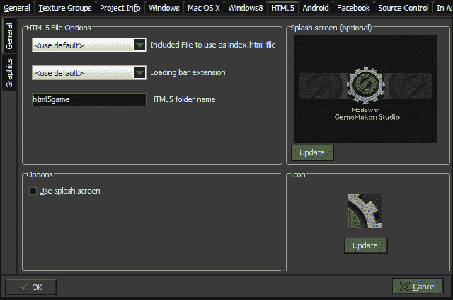

**启动画面**在游戏加载之前可见，并实际上嵌入到`index.html`代码中。它需要一个 PNG 文件，应该与游戏区域的大小相同；如果大小不同，它将被缩放以适应正确的尺寸。使用启动画面的一个缺点是，图像将被绘制而不是加载栏。由于通常认为始终让用户知道发生了什么是最佳实践，特别是在加载数据时，我们不会在这个游戏中添加启动画面。

当我们编译游戏时，GameMaker: Studio 会在根目录创建一个名为`favicon.ico`的文件，并在**全局游戏设置**中设置的图标。用户将在浏览器标签中看到这个图标，以及标签显示的页面名称；在保存页面为书签时也可见。图标是大多数网站的常见特征，是 ICO 格式的小图像，用于显示网站的代表性符号。大多数图像编辑器不能原生保存为 ICO 格式，通常需要插件来完成。幸运的是，有很多免费的网站可以将任何图像转换为图标。我个人更喜欢使用[`iconverticons.com/online/`](http://iconverticons.com/online/)，因为它们接受大多数常见的图像格式，并转换为包括 Windows、Mac 和 Web 图标在内的所有主要图标格式。一旦我们有了合适的 ICO 文件，就可以在我们的游戏中使用它。

1.  让我们通过点击“更新”来更新**图标**，并加载`第九章/资源/额外/GameIcon.ico`。点击“确定”。

1.  游戏现在已经准备好导出了。转到**文件** | **创建应用程序**，并将游戏保存到游戏项目目录中一个名为`Destruct`的新文件夹中。

1.  点击**保存**，您将看到游戏编译并创建运行游戏所需的所有文件。在`Destruct`文件夹中，您应该看到两个文件和一个文件夹。有一个`favicon.ico`文件，和一个`index.html`文件，这是将显示游戏的网页。文件夹`html5game`包含所有资产，比如所有声音的 OGG 和 MP3 格式，一些以`index_texture`开头的 PNG 文件，其中包含编译成单独精灵表的所有图形，以及一个包含所有游戏功能的`index.js`文件。还有一个`particles`文件夹，其中包含用于粒子形状的所有图像。

## 托管游戏

游戏已经构建好了；我们只需要一个放置它的地方。在互联网上有许多选项可供托管游戏的网站。这些可以从免费的网站托管到拥有个人服务器以及其中的一切。由于所有不同的套餐、不同的价格点以及我们的整体意图，选择一个托管商可能会非常耗时。每个开发者都需要考虑一些事情，比如预计有多少人会玩游戏，将来是否会添加更多游戏，网站上是否会有广告等等。如果游戏只会展示给家人和朋友，免费的网站托管服务可能就够了，但如果目标是从游戏中赚钱，最好使用某种付费服务。在选择提供商时，我们想要寻找的主要功能是：有多少服务器空间、带宽量、FTP 访问和最大文件大小。

另外，您应该确保网站允许上传 MP3 文件，因为许多免费和一些付费网站不允许这样做。一些知名的网站，如[www.godaddy.com](http://www.godaddy.com)和[www.globat.com](http://www.globat.com)提供了大量的服务器空间和带宽，价格非常实惠，适合大多数开发者，至少在他们开始发布游戏时。

为了进入下一步，请确保您已经获得了安全的网络服务器空间，并且可以访问 FTP。

## 使用 FTP 上传游戏

为了将我们的游戏放到服务器上，我们需要使用 FTP 客户端来传输文件。有许多免费可下载的 FTP 客户端可用，如 WinSCP，CuteFTP 和 FileZilla。一些浏览器可以用于 FTP，如果安装了适当的插件，比如 Firefox 的 FireFTP。一些网络托管服务甚至提供拖放式 FTP 功能。对于这个项目，我们将使用可以从[`winscp.net`](http://winscp.net)下载的 WinSCP。

1.  下载 WinSCP 客户端，并根据说明进行安装。当**初始用户设置**页面出现时，选择**指挥官界面**，如下截图所示：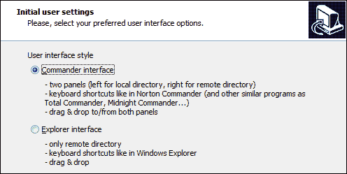

1.  运行 WinSCP。

1.  由于这是我们第一次访问网站的 FTP，我们需要点击**新建**来创建一个新的 FTP 会话。

1.  我们需要通过导航到**会话** | **文件协议**来选择文件传输的协议方法。默认是**SFTP**（**安全 FTP**），但许多托管站点只允许标准 FTP 访问，所以我们将选择它。导航到**文件协议** | **FTP**。

### 注意

请查阅您的托管提供商的文档，了解如何配置您的 FTP 连接的说明。

1.  接下来，我们需要输入服务器 FTP 地址，通常是您的网站名称，加上您的用户名和密码。它应该看起来像下面的截图：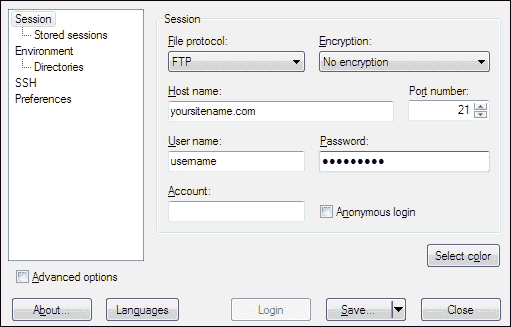

1.  为了将来更容易访问网站，我们可以保存这些设置，包括密码。点击**保存**。

1.  这将带我们回到登录界面，现在我们可以在**存储的会话**列表中看到 FTP 连接，如下一个截图所示。要打开连接，我们可以双击站点名称，或者选择站点名称，然后单击**登录**。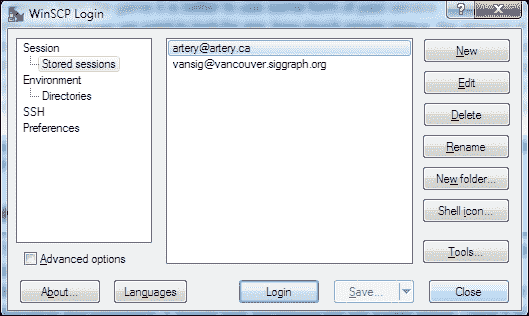

如果所有信息都输入正确，一个目录窗口应该会打开。如下一张截图所示，有两个带有文件目录的窗格。左侧是计算机的本地驱动器，右侧是服务器目录。服务器应该打开到根目录，尽管它可能显示为在一个名为`www`或`public_html`的文件夹中。目录中可能已经有至少一个文件，`index.html`，这将是人们访问域名时看到的默认页面。

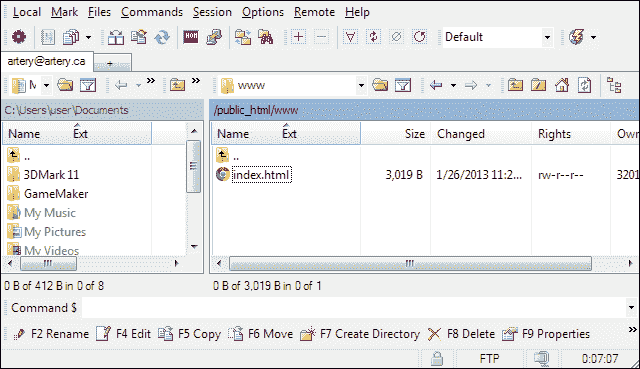

1.  在左侧面板中，找到我们的游戏已经导出的`Destruct`文件夹。将整个文件夹拖到右侧面板上，以将所有文件传输到服务器上。

1.  弹出对话框会询问我们是否要复制所有文件。点击**复制**。可能需要一些时间来转移所有内容。

1.  游戏现在已经上传并可以在互联网上访问。要访问它，只需打开浏览器，转到网站和`Destruct`子目录，例如`http://www.yoursitename.com/Destruct/`。

# 与 Facebook 集成

现在游戏已经上传到服务器，任何人都可以在世界上玩它。他们可以玩这个游戏，只要他们知道它。任何开发者面临的最困难的挑战之一是让人们了解他们的产品。通过社交媒体网站，比如 Facebook，传播消息是最简单的方法之一。GameMaker: Studio 已经集成了与 Facebook 连接的功能，这使得这一点变得容易。我们将在游戏的前端添加一个 Facebook 登录按钮，并允许玩家将他们的分数发布到他们的 Facebook 动态中。

1.  为了使用 Facebook 功能，我们需要拥有 Facebook 账户和 Facebook 开发者账户。前往[`developers.facebook.com/`](http://developers.facebook.com/)并登录。如果你没有 Facebook 账户，它会提示你创建一个。

1.  一旦我们登录到开发者页面，我们需要点击顶部菜单栏上的**应用**。这将带我们到**应用**页面。

1.  接下来，我们需要点击**注册为开发者**按钮。这将打开一个注册对话框，我们需要通过它。首先，我们需要**接受条款和条件**，然后我们需要提供一个电话号码来**验证账户**。这必须是一个有效的号码，因为它将发送一条需要验证的短信。按照指示完成流程。

### 注意

在同意条款和条件之前*一定要*阅读它们，并确保你完全理解你所要合法同意的内容。

1.  完成注册后，我们应该会发现自己回到了**应用**仪表板。在注册按钮附近有一个创建新应用的按钮。点击它。

1.  在**创建新应用**对话框中，如下一张截图所示，我们需要输入一个**应用名称**。只要我们没有另一个同名应用，这个名称就不需要是唯一的。关于命名约定有一些规则，你可以点击**Facebook 平台政策**链接阅读。可选的**应用命名空间**是为了更深入地与 Facebook 集成，使用应用页面和使用 Open Graph，一个通知工具。我们不需要应用命名空间，所以可以留空。我们也不需要**Web Hosting**，可以点击**继续**。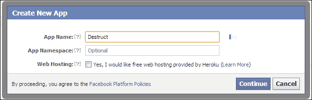

### 注意

要了解更多关于 Facebook Open Graph、应用命名空间等内容，请查看 Facebook 开发者 API 文档[`developers.facebook.com/docs/reference/apis/`](https://developers.facebook.com/docs/reference/apis/)。

1.  下一步是 CAPTCHA 安全检查。按照指示操作，然后点击**继续**。

1.  应用程序现在已经创建，我们在**基本信息**页面上。在这里，我们可以完成设置游戏如何集成到 Facebook。在**基本信息** | **应用域**中输入游戏网站的基本域名。这将允许应用在该域和所有子域上运行。它不应包括`http://`或根站点名称之外的任何其他元素。

1.  在**选择应用程序如何与 Facebook 集成**下，我们需要选择**带 Facebook 登录的网站**，然后输入游戏所在的确切 URL。

1.  点击**保存更改**，因为我们已经完成了基本信息。设置应该如下截图所示，输入适用于您网站的适当域信息：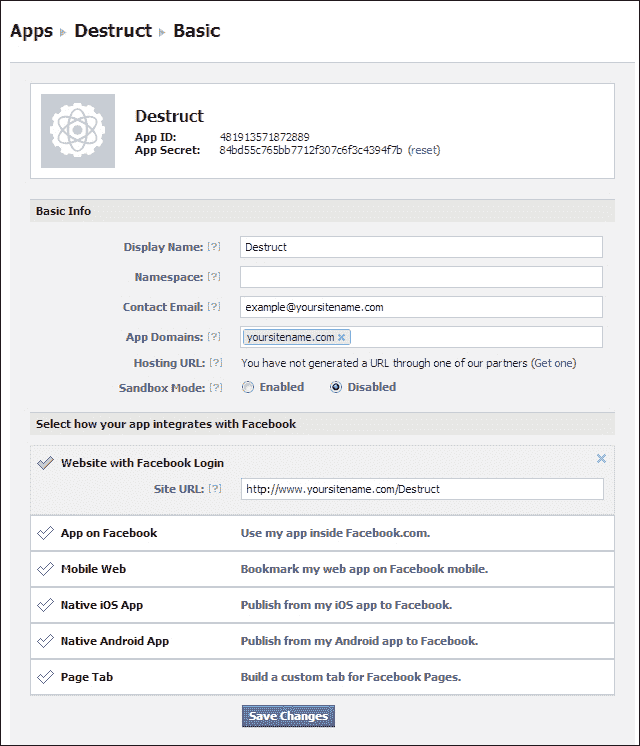

1.  在返回 GameMaker: Studio 之前，我们需要从**基本**页面顶部复制**应用 ID：**。

1.  重新打开游戏项目，导航到**资源** | **更改全局游戏设置**。

1.  转到**Facebook**选项卡，如下截图所示，勾选**使用 Facebook**的框，然后粘贴我们复制的 ID 到**Facebook 应用 ID**中。点击**确定**。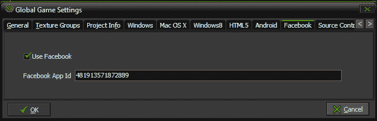

1.  我们现在可以访问 Facebook 应用程序；现在我们只需要初始化它。创建一个新的脚本，`scr_Global_Facebook`，其中包含以下代码：

```js
facebook_init();
globalvar permissions;
permissions = ds_list_create();
ds_list_add(permissions, "publish_stream");
```

我们首先初始化 Facebook，然后创建一个全局变量，用于包含我们想要从 Facebook 请求的所有权限的`ds_list`。在我们的情况下，我们只是要求能够发布到已登录用户的 Facebook 墙上。所有可用的选项都可以在 Facebook 开发人员网站上找到。

1.  打开`scr_Global_GameStart`，并在最后执行以下行：

```js
scr_Global_Facebook();
```

## 添加 Facebook 登录按钮

现在我们已经激活了 Facebook，我们可以将其实现到游戏中。我们将首先添加一个登录按钮。

1.  创建一个新的精灵，`spr_Button_FacebookLogin`，取消**删除背景**的选项，加载`Chapter 9/Resources/Sprites/FacebookLogin.gif`，并将原点居中。

1.  创建一个新对象，`obj_Button_FacebookLogin`，附加我们刚刚创建的精灵，然后将**父级**设置为`obj_Button_Parent`。

1.  添加一个**鼠标** | **左键按下**事件，并附加一个新的脚本，`scr_Button_FbLogin_MousePressed`，让用户登录 Facebook。

```js
facebook_login(permissions);
```

1.  打开`MainMenu`，并在**开始**按钮下方添加一个按钮的单个实例。

1.  接下来，我们需要让玩家发布到他们的墙上。为此，我们将在得分屏幕上添加另一个按钮。创建一个新的精灵，`spr_Button_FacebookPost`，取消**删除背景**的选项，加载`Chapter 9/Resources/Sprites/FacebookPost.gif`，并将原点居中。

1.  得分屏幕都是代码，所以我们不需要一个新对象，但我们需要向现有脚本添加代码。打开`scr_ScoreScreen_Create`，并添加一个用于按钮的 Y 位置、宽度偏移和高度偏移的变量。

```js
postfb_Y = 340;
postfb_OffsetW = 64;
postfb_OffsetH = 16;
```

1.  接下来，我们将创建一个新的脚本，`scr_Menu_Button_FbPost`，用于控制功能。

```js
if (isVictory)
{
    status = facebook_status()
    if (status == "AUTHORISED")
    {
        draw_sprite(spr_Button_FacebookPost, 0, screenX, postfb_Y);
        if ((win_Y > postfb_Y - postfb_OffsetH && win_Y < postfb_Y + postfb_OffsetH))
        {
            if ((win_X > screenX - postfb_OffsetW && win_X < screenX + postfb_OffsetW)) 
            {            {
                draw_sprite(spr_Button_FacebookPost, 1, screenX, postfb_Y);
                if (mouse_check_button_pressed(mb_left)) 
                {
                    myTitle = "Destruct";
                    myCaption = "Play this game at yournamesite.com"
                    myText = "I just destroyed the " + room_get_name(room) + " Towers playing Destruct!";    
                    myImage = "http://yoursitename.com/Destruct/Thumbnail.gif"; 
                    mySite = "http://yoursitename.com/Destruct/"      
                    facebook_post_message(myTitle, myCaption, myText, myImage , mySite, "", "");                    
                }
            }
        }
    }
}
}
```

我们只想在玩家完成一个级别时发布到 Facebook，所以我们首先检查胜利条件。我们检查 Facebook 连接的状态，因为我们只想在玩家登录时显示按钮。如果玩家已登录，我们在屏幕上绘制按钮，并检查鼠标是否悬停在按钮上，就像我们对所有其他按钮做的那样。如果点击按钮，我们创建一些变量用于消息标题、说明和文本、图像以及返回网站的链接。然后我们在 Facebook 上发布一条消息。该函数还有两个额外的参数，用于使用更高级的 Facebook 操作，但我们将这些参数留空。

### 注意

要查看可用的高级选项，请参阅 Facebook 开发人员 API 帖子页面[`developers.facebook.com/docs/reference/api/post/`](https://developers.facebook.com/docs/reference/api/post/)。

1.  为了在屏幕上绘制这个，我们需要重新打开`scr_ScoreScreen_DrawGUI`并执行我们刚刚创建的脚本：

```js
scr_Menu_Button_FbPost();
```

1.  保存游戏并点击**创建应用程序**。可以覆盖现有的项目文件。

1.  打开 WinSCP 并连接到 FTP 服务器。

1.  将所有文件传输到服务器。在提示确认覆盖文件时，点击**全部是**。

1.  我们还需要传输我们想要包含在帖子中的图像。打开`Chapter_09/Resources/Extras/`，将`Thumbnail.gif`传输到服务器的`Destruct`文件夹中。

1.  打开浏览器并转到游戏网站。当游戏加载完成时，我们应该会看到新按钮，就在**开始**按钮下方，如下面的屏幕截图所示：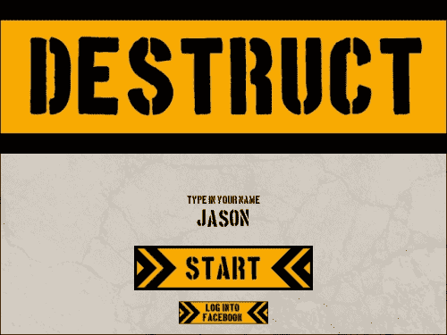

1.  点击**登录 Facebook**按钮。应该会出现一个弹出窗口，就像下一个屏幕截图一样。如果没有发生任何事情，请检查浏览器是否已阻止弹出窗口并解除阻止。当弹出窗口出现时，我们只需要登录我们的 Facebook 账户。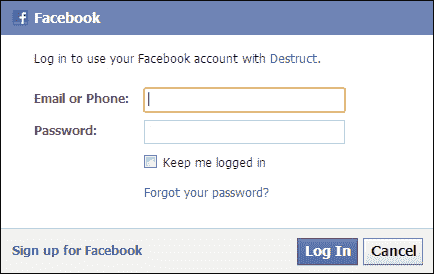

1.  成功玩一个级别。当得分屏幕出现时，我们应该会看到**发布到 Facebook**按钮，如下面的屏幕截图所示：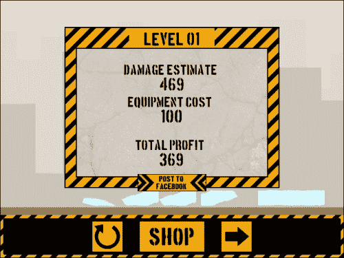

1.  点击按钮，然后转到你的 Facebook 页面。我们将看到一个新的帖子已经与世界分享，看起来像下面的屏幕截图：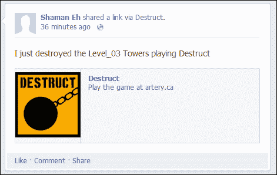

恭喜！游戏现在可以供所有人玩，并通过 Facebook 向世界展示。任何开发者的目标都是创建有趣的游戏，让每个人都喜欢玩并能够完成。但是你怎么知道是否发生了这种情况？人们是否在游戏中卡住了？是不是太容易？太难？在制作游戏时付出了所有的努力，不知道这些答案将是一件遗憾的事。这就是分析派上用场的地方。

# 使用 Flurry Analytics 跟踪游戏

**分析**是收集和发现一组数据中的模式的过程。这些数据可以是任何可量化的行为，比如鼠标点击，以及相关的元素，比如点击了什么。这些信息使开发人员能够看到用户如何使用他们的产品。在创建游戏时，这是非常有用的，因为有很多东西可以被跟踪。

我们将实施 Flurry Analytics，这是 GameMaker: Studio 内置的两个系统中最强大的一个。虽然可以跟踪任何事物，但通常最好专注于对用户体验最相关的事物。对于我们的游戏，我们将跟踪每个级别的得分、使用的装备和游玩次数。我们只会在玩家成功完成一个级别时发送这些数据。这将使我们能够看到每个级别被玩的频率，最常使用的装备，得分的变化，每个级别的难度，以及人们平均在哪里退出游戏。

## 设置 Flurry Analytics

为了使用 Flurry Analytics，我们需要在该服务上拥有一个账户，一个要发送数据的应用程序，并在 GameMaker: Studio 中激活它。一旦完成了这些步骤，就需要上传一个新的构建到网站上，然后人们就可以玩游戏了。

1.  首先，让我们注册 Flurry 分析。转到[`www.flurry.com/`](http://www.flurry.com/)并按照网站的说明注册一个免费账户。

1.  设置好账户并登录后，我们应该会进入开发者主页。在菜单栏上点击**应用程序**选项卡，进入**应用程序**页面，如下面的屏幕截图所示：

1.  此时我们还没有任何应用程序，所以需要添加一个。点击**添加新应用程序**。

1.  接下来的页面要求选择一个平台。点击 Java 图标。

1.  接下来，我们需要为应用程序添加一些基本信息。如下一张截图所示，输入游戏的名称`Destruct`，并选择一个合适的类别，在我们的情况下，**游戏-模拟**似乎最合适。然后点击**创建应用**。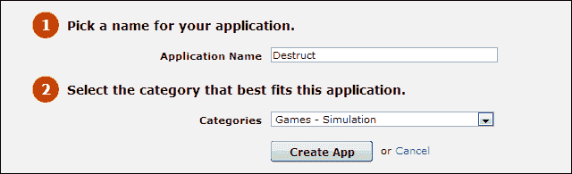

1.  在下一页中，它询问我们如何将 SDK 与几个选项集成。GameMaker: Studio 已经将其集成到软件中，这意味着我们可以跳过这一步。点击**取消**完成此步骤，并返回到**主页**。

1.  现在我们应该在**应用程序摘要**中看到我们的应用程序，如下一张截图所示。我们需要获取我们的应用程序 ID，所以点击**Destruct**。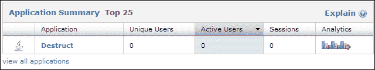

1.  接下来，我们需要导航到左侧菜单中的**管理** | **应用信息**，以访问包含我们应用程序信息的页面。在列表底部，如下一张截图所示，是**API 密钥**。这个密钥是连接 GameMaker: Studio 中的游戏到这个分析应用程序所需的。复制这个密钥。我们现在暂时完成了这个网站。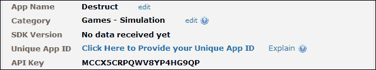

1.  重新打开项目文件并打开**全局游戏设置**。

1.  点击**全局游戏设置**顶部的右箭头，直到看到**Analytics**选项卡，如下一张截图所示。点击**Analytics**选项卡。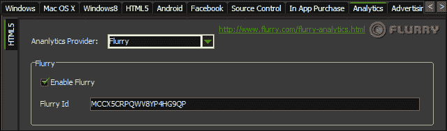

1.  在**HTML5**子选项卡中，将**分析提供程序**设置为**Flurry**，选中**启用 Flurry**复选框，并将 API 密钥粘贴到**Flurry Id**中。现在我们已经设置好并准备输出一些数据。

## 跟踪游戏中的事件

现在我们可以发送数据，我们只需要将其实现到现有游戏中。我们需要在几个脚本中添加一些代码，并创建一些新的脚本，以便获得有用的可跟踪信息。我们想要跟踪正在玩的级别，每个装备的使用情况，级别被玩的次数以及级别的得分。

1.  我们已经有了用于跟踪装备（`TNT: 0, WRECKINGBALL: 1`，`MAGNET: 2`）的常量，可以用于跟踪目的。这使我们需要一些额外的常量来跟踪级别，尝试次数和得分。导航到**资源** | **定义常量**，并添加`LEVEL: 3, ATTEMPTS: 4, LVLSCORE: 5`。

1.  我们需要将这些数据保存在全局可访问的网格中。创建一个新的脚本`scr_Global_Analytics`，并初始化整个游戏的值。

```js
globalvar levelData;
levelData = ds_grid_create(totalLevels, 6);
for (i = 0; i < totalLevels; i++)
{
    ds_grid_set(levelData, i, TNT, 0);
    ds_grid_set(levelData, i, WRECKINGBALL, 0);
    ds_grid_set(levelData, i, MAGNET, 0);
    ds_grid_set(levelData, i, LEVEL, level[i, 0]);
    ds_grid_set(levelData, i, ATTEMPTS, 0);
    ds_grid_set(levelData, i, LVLSCORE, 0);
}
```

我们首先创建一个全局数据结构，为游戏中的每个级别设置六个值。我们运行一个循环，为每个装备的初始值设置，通过从先前创建的级别数组中获取级别名称，尝试次数和级别得分，全部设置为零。

1.  重新打开`scr_Global_GameStart`并执行此脚本。

1.  接下来，我们需要插入一些代码来改变每个级别的这些值。我们将从跟踪每个级别的尝试开始。这将需要更改几个脚本。我们将更改的第一个是`scr_Button_LevelSelect_MousePressed`，在玩家选择级别时，我们需要添加一次尝试。在`else`语句中，在更改房间之前，添加以下代码：

```js
currentLevel = ds_grid_value_x(levelData, 0, LEVEL, totalLevels-1, LEVEL, myLevel);
ds_grid_add(levelData, currentLevel, ATTEMPTS, 1);
```

我们搜索 levelData 网格，以找出已选择的房间，以便找出我们需要更改的行。一旦我们有了行，我们就为该级别的数据添加一次尝试。

1.  由于我们正在跟踪尝试，我们需要在重新启动房间之前将相同的代码插入`scr_Menu_Button_Restart`中。

1.  最后，我们还需要在`scr_Menu_Button_NextLevel`中添加类似的代码，除了我们不能使用`myLevel`来找到房间。相反，我们需要向下查找到下一个房间。在更改房间之前，插入以下代码：

```js
currentLevel = ds_grid_value_x(levelData, 0, LEVEL, totalLevels-1, LEVEL, level[i+1,0]);
ds_grid_add(levelData, currentLevel, ATTEMPTS, 1); 
```

1.  现在尝试已经被跟踪，我们可以继续跟踪其他所需的数据。创建一个新的脚本`scr_Level_Stats`，并更新所有相关的统计数据。

```js
levelCompleted = ds_grid_value_x(levelData, 0, LEVEL, totalLevels-1, LEVEL, room)
for (i = 0; i < ds_grid_width(equip); i += 1)
{
    equipUsed = abs(ds_grid_get(obj_Menu.startEquip, i, AMOUNT) - ds_grid_get(equip, i, AMOUNT));
    ds_grid_set(levelData, levelCompleted, i, equipUsed);   
}
levelScore = obj_Menu.tempScore - obj_Menu.tempCost
ds_grid_set(levelData, levelCompleted, LVLSCORE, levelScore);
```

我们首先找到刚刚完成的级别的行。然后，我们通过循环运行设备，看看在级别中使用了多少设备，通过从玩家开始使用的设备数量中减去剩余设备数量来实现。为了确保我们得到一个正数，我们使用绝对值函数，它返回一个绝对值。我们还获取级别的最终得分并更新网格。

1.  我们希望仅在成功完成级别时运行此脚本，而将其放置的最简单的地方是在`scr_WinCondition`中，在我们返回一个真值的最后一行代码之前。

```js
scr_Level_Stats();
```

## 将数据发送到 Flurry

现在数据在每次玩级别并成功完成后都会得到正确更新。现在我们需要做的就是将数据发送到 Flurry。Flurry 不是实时更新的，而是每天编译数据几次。如果我们在整个游戏会话期间逐个发送数据的各个部分，那么当编译时，这些数据可能会被分开，导致异常。为了帮助防止这种情况发生，我们将在每次更新时发送每个级别的所有相关数据。Flurry 将识别更改并保持数据在一起。

1.  创建一个新的脚本，`scr_Analytics_Send`，并通过所有级别数据运行一个循环并发送出去。

```js
for (a = 0; a < totalLevels; a++)
{
    levelName = room_get_name(ds_grid_get(levelData, a, LEVEL));
    levelScore = ds_grid_get(levelData, a, LVLSCORE);
    levelAttempt = ds_grid_get(levelData, a, ATTEMPTS);
    usedTNT = ds_grid_get(levelData, a, TNT);
    usedWB = ds_grid_get(levelData, a, WRECKINGBALL);
    usedMagnet = ds_grid_get(levelData, a, MAGNET);
    analytics_event_ext(levelName, "Level Score", levelScore, "Attempts", levelAttempt, "TNT Used", usedTNT, "WBalls Used", usedWB, "Magnets Used", usedMagnet);
}
```

在这个循环中，我们首先获取网格中存储的房间名称以及每个数据的所有值。使用函数`analytics_event_ext`，我们可以向 Flurry 发送多达 10 个不同的数据。第一个参数是数据的类别，以字符串形式发送，这里我们使用级别的名称作为类别。所有接下来的参数都是键/值对，其中包括我们正在跟踪的数据的名称及其关联值。

1.  我们需要在游戏开始时发送一组初始分析数据，这样我们就可以从干净的状态开始。重新打开`scr_Global_Analytics`并在脚本的最后发送数据。

```js
scr_Analytics_Send();
```

1.  我们还需要在完成级别时发送数据。重新打开`scr_Level_Stats`并在脚本的最后发送数据。

1.  我们现在已经完成了分析的实施。现在剩下的就是将其放到网络上。保存游戏，单击**创建应用程序**，并将游戏的新版本上传到服务器。

1.  多次玩游戏，确保使用不同数量的设备并在每次重试级别。我们希望跟踪一些基本数据，以便我们可以看到这一切意味着什么。

## 理解分析

我们正在跟踪几个数据，并且 Flurry 将把这些信息编译成事件日志。我们可以看到会话何时发生以及在播放会话期间发生了什么。虽然这有些有用，但 Flurry 甚至在全球范围内进一步细分，以显示每个级别的平均游玩情况。让我们花点时间看看 Flurry 为我们提供了什么。在开始之前，重要的是要知道 Flurry Analytics 不是实时更新的，可能需要几个小时才能看到任何数据出现。

1.  登录到您的 Flurry 帐户并转到您的**Destruct**应用程序页面。

1.  在**仪表板**上，您将看到的第一个统计数据是**会话**图表，如下截图所示。在这里，我们可以看到游戏每天被玩的次数。还有一些信息，比如每个游戏会话的平均持续时间，世界各地的人们从哪里玩游戏等。

1.  在左侧菜单上单击**事件**。第一个选项是**事件摘要**，如下截图所示，显示了级别被玩的频率以及每个会话中完成该级别的用户百分比。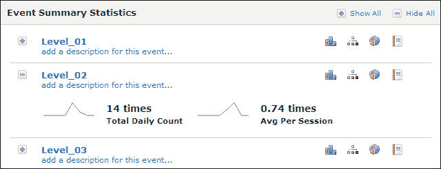

1.  如果我们点击一个级别的小饼图标，我们将得到单个事件参数的详细信息。每个参数将显示所有会话的总使用量。如下面的截图所示，一个玩家使用了三个 TNT，另一个只需要两个，还有六个玩家根本没有使用任何 TNT。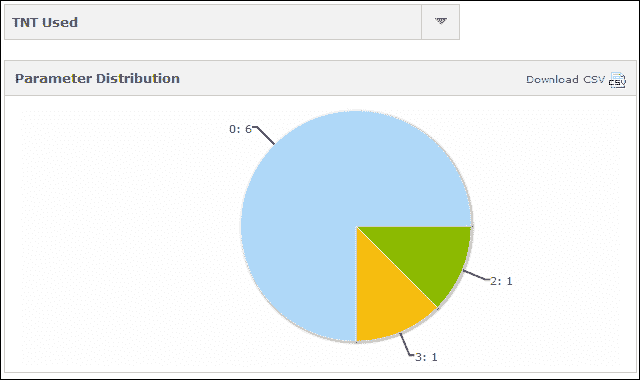

拥有这种类型的信息非常有价值。知道玩家在哪里停止玩游戏可以告诉我们哪里可以做出改进。跟踪玩家在游戏中使用的内容让我们知道游戏是否平衡。我们能够收集的数据越多，我们就能更好地将所学到的经验应用到未来的游戏中。

# 用你的游戏赚钱

发布游戏是一个了不起的成就，但是每个开发者都会在某个时候希望从自己的努力中赚点钱。赚钱的最常见方式是在网站上放置广告，但是当涉及到 HTML5 游戏时，这种方式有一些缺点。第一个问题是网站需要非常高的流量才能够积累足够的点击量来赚钱。这影响了第二个问题，即广告只有在人们在特定网站的网页上玩游戏时才会起作用。不幸的是，其他网站可以通过 iframe 嵌入 HTML5 游戏，并在周围放置自己的广告。这可能会令人沮丧，因为这意味着尽管游戏在我们的网站上运行，但我们却没有赚到钱。幸运的是，还有其他赚钱的方式，比如赞助。

**赞助商**是愿意支付费用将他们的品牌放在游戏上的游戏门户。品牌通常是赞助商的标志，显示在游戏开始时的闪屏上，但也可以包括诸如一个按钮，链接回他们的网站或者 Facebook 帖子显示的内容等。赞助的唯一缺点是目前没有许多游戏门户托管 HTML5 游戏，这意味着较少的潜在报价。展望未来，随着 HTML5 游戏的成熟和需求的增加，预计会有越来越多的门户加入。

寻找赞助的最佳地方并不是游戏门户，而是各种基于浏览器的游戏的市场。FGL，[`www.fgl.com`](http://www.fgl.com)，最初是作为一个连接 Flash 游戏开发者和赞助商的地方创建的，但最近它已经扩展到 HTML5 和 Unity 游戏，并接受 iOS 和 Android 设备的游戏。这个市场允许开发者私下向赞助商和其他游戏开发者展示他们的游戏，获得反馈，并在准备好时进行竞标。与传统的拍卖行不同，最高出价者获胜，开发者可以选择他们更喜欢的报价，并可以与出价者就交易的具体条款进行协商。不能保证游戏会被提供任何资金，但如果有机会提前获得资金，那么很可能会在这里发生。

# 总结

这就是我们的全部内容！在本章中，我们涵盖了各种事情。我们首先使用 FTP 客户端将游戏上传到 Web 服务器。然后我们将 Facebook 集成到游戏中，允许玩家登录他们的账户并将级别分数发布到他们的动态。然后我们使用 Flurry 实施了分析，跟踪玩家如何玩游戏。最后，我们简要谈到了通过赞助赚钱的问题。

现在你已经完成了这本书，你应该有一个非常扎实的基础来制作自己的游戏。我们从探索 GameMaker: Studio 界面和构建最简单的游戏开始。我们看了一下如何创建艺术和音频，以提高游戏的质量。然后，我们专注于使用 GameMaker 语言来编写几款游戏。我们从一个简单的横向射击游戏开始，展示了脚本编写的基础知识。然后，我们通过创建一个有多个房间和敌人路径的冒险游戏来扩展这些知识。我们学会了如何更好地构建我们的游戏，并在我们的平台 Boss 战中提高我们的脚本效率。然后，我们开始使用 Box2D 物理引擎创建一个简单的塔倒游戏，然后将其打磨成一个完整的游戏，包括完整的前端、粒子效果、Facebook 集成和 Flurry Analytics。

GameMaker: Studio 仍然有很多功能可以提供，新功能也在不断添加。现在轮到你利用所有这些所学知识来制作自己设计的游戏了。玩得开心，探索 HTML5 平台的可能性，并让你的游戏问世。祝你好运！
