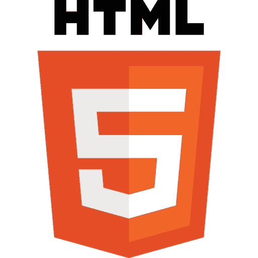

# 前言

今天你在阅读本书，是因为你想制作视频游戏。你希望构建自己的视频游戏，可以在人们的浏览器以及他们的智能手机和平板电脑上运行。所有这些今天都是可能的，尽管这并非一直如此。你现在能够相对轻松地构建自己的游戏，原因有两个：**HTML5** 和 **ImpactJS**。



**HTML5** 是我们的全球网络超文本标记语言的最新版本，也是网页的通用语言。HTML 自上世纪 90 年代初就存在了，当时欧洲核子研究组织（CERN）的一名名叫 Tim Berners-Lee 的员工首次引入了它。新版本相继发布：1995 年版本 2，1997 年版本 3，同年稍后版本 4。我们使用的 HTML 版本大致相同，直到 2008 年 HTML5 问世。随着对多媒体实施的需求不断增长，公司一直在构建浏览器插件来播放音乐、显示电影等。Flash 播放器可能是这方面最知名的插件之一。作为游戏开发者，你仍然可以选择使用 Flash 和 ActionScript，但我们不知道 Flash 还能坚持多久（如果有的话），直到 HTML5 完全取代它。Flash 游戏的未来难以预测，但有一件事是相当确定的：基于 HTML5 的游戏的未来看起来很光明。自 HTML5 出现以来，浏览器对其兼容性逐渐增加。HTML5 是一个巨大的进步，因为它引入了新的元素，允许在网页上播放音乐和视频。

然而，对我们来说最重要的新功能是引入了`<canvas>`元素。`<canvas>`元素基本上是你的图形元素出现的占位符。结合 JavaScript 的使用，可以在 Flash 播放器之外构建浏览器游戏。然而，JavaScript 本身并不适用于构建游戏。以其原始形式，你可以使用它来构建游戏，但这将证明是非常困难的。因此，最后一个必要的成分是一个专门用于游戏开发的 JavaScript 库。这就是 ImpactJS 发挥作用的地方。


**ImpactJS** 本质上是一种 JavaScript 代码库，能够让游戏开发者的生活变得更加轻松。ImpactJS 是由德国天才 Dominic Szablewski 开发的。ImpactJS 游戏引擎的优势在于，只需基本的 JavaScript 和 HTML 知识，就能快速构建游戏。这使得即使是新手程序员也能专注于他们所热爱的事情：构建实际的游戏。ImpactJS 还配备了非常直观的关卡编辑器和调试系统，我们在本书中也会介绍。ImpactJS 旨在构建基于瓦片的二维游戏。例如，如果你想构建像马里奥或塞尔达传说这样的横向或俯视游戏，你会选择 ImpactJS。现在，让我们毫不拖延地进入行动，继续阅读第一章，“启动你的第一个 Impact 游戏”，在这里我们将通过收集必要的资源为游戏开发做准备。

# 本书内容

第一章，“启动你的第一个 Impact 游戏”帮助我们设置开发环境，让我们的第一个游戏运行起来，并查看一些对 HTML5 游戏开发者有用的工具。

第二章，“介绍 ImpactJS”深入探讨了 ImpactJS 的基础知识，通过探索一款预制游戏来了解一些关键概念。

第三章，“让我们建立一个角色扮演游戏”是一个从零开始构建俯视游戏的指南。

第四章，*让我们建立一个侧卷游戏*帮助我们从头开始构建一个侧卷游戏，利用 Box2D 物理引擎。

第五章，*为您的游戏添加一些高级功能*教会我们为我们在第三章中构建的 RPG 游戏添加一些高级功能，如高级人工智能和数据存储。

第六章，*音乐和音效*带领我们深入了解如何在 ImpactJS 中使用音乐和音效，从哪里购买它们，以及如何使用 FL Studio 制作基本曲调。

第七章，*图形*教会我们创建矢量和 Photoshop 图形，并探索从艺术家和专业网站购买它们的选项。制作自己的图形或在其他地方购买它们是一个重要的权衡考虑。

第八章，*将您的 HTML5 游戏适应分销渠道*帮助我们了解将游戏部署到不同设备的几种选择以及技术上如何实现。这是游戏开发过程的最后一步。

第九章，*用您的游戏赚钱*介绍了作为游戏开发者赚钱的几种选择，从照顾自己的销售和营销到出售您的分销权。

# 您需要为本书准备什么

以下是执行书中给出的代码所需的软件要求：

+   服务器（示例：XAMPP）。免费下载。

+   JavaScript 代码编辑器（示例：Komodo edit）。免费下载。

+   ImpactJS 游戏引擎。在[www.impactjs.com](http://www.impactjs.com)购买。

+   Google Chrome 浏览器。免费下载。

+   Firefox 浏览器和 Firebug 插件。免费下载。

+   FL Studio。不免费，但仅与第六章，*音乐和音效*相关。

+   Photoshop。不免费，但仅与第七章，*图形*相关。

+   Inkscape。免费下载。

# 本书适用对象

本书适用于至少具有基本 JavaScript、CSS 和 HTML 知识的任何人。如果您想要为您的网站或应用商店构建自己的游戏，但不知道从何开始，这本书适合您。

# 约定

在本书中，您会发现一些区分不同信息类型的文本样式。以下是一些这些样式的示例，以及它们的含义解释。

文本中的代码词显示如下：“打开浏览器，在地址栏中键入`localhost`”。

代码块设置如下： 

```js
  EntityPlayer = ig.Entity.extend({
    size: {x:20,y:40},
    offset:{x:6,y:4},
    vel: {x:0,y:0},
    maxVel:{x:200,y:200},
    health: 400,
```

当我们希望引起您对代码块的特定部分的注意时，相关行或项目会以粗体显示：

```js
.defines(function(){
GameInfo = new function(){
 this.score = 0;
},

```

**新术语**和**重要单词**以粗体显示。您在屏幕上看到的单词，例如菜单或对话框中的单词，会以这种方式出现在文本中：“单击**下一步**按钮将您移动到下一个屏幕”。

### 注意

警告或重要说明会以这样的方式出现在一个框中。

### 提示

提示和技巧会以这样的方式出现。
