# 第一章：启动您的第一个 Impact 游戏

现在我们已经在*前言*中看到为什么 Impact Engine 是游戏开发者的一个不错选择，是时候开始工作了。为了开发游戏，您首先需要设置您的工作环境。就像画家需要他的画笔、画布和颜料一样，您需要设置您的代码编辑器、服务器和浏览器。在本章结束时，您将装备好所有开始冒险甚至在计算机上运行游戏所需的工具。

在本章中，我们将涵盖以下主题：

+   使用 XAMPP 设置您自己的本地服务器

+   在此服务器上运行预制游戏

+   您可以选择以下脚本编辑器的简短列表

+   使用浏览器和 ImpactJS 调试器脚本调试您的游戏

+   一些有趣的工具，您应该考虑帮助您创建游戏

# 安装 XAMPP 服务器

无论开发任何东西，无论是应用程序、网站还是游戏，创作者总是有一个临时区域。临时区域就像一个实验室；它用于在向世界展示之前构建和测试所有内容。即使发布游戏后，您也会首先在实验室中进行更改，以查看事情是否会出现问题。在*您自己的*面前出现问题是可以接受的，但您不希望这种情况发生在您的玩家身上。我们的临时区域将是一个本地服务器，在本书的过程中我们将使用**XAMPP**。XAMPP 中的 X 表示该服务器适用于不同的操作系统（跨环境，因此 X）。

其他字符（**AMPP**）代表**Apache**，**MySQL**，**PHP**和**Perl**。您可以根据下载和安装的版本在 Windows、Linux 或 Mac 上安装 XAMPP。还有一些 XAMPP 的替代品，如**WAMP**（适用于 Windows）和**LAMP**（适用于 Linux）。当然，这些替代品也很好。

Apache 是开源的 Web 服务器软件，使您能够运行您的代码。MySQL 是一个开源的数据库系统，使您能够使用 SQL 语言存储和查询数据。PHP 是一种能够将 SQL 命令（可以操作数据库）连接到网站或游戏代码（JavaScript）的语言。Perl 通常被称为“编程语言的瑞士军刀”，因为它在用途上非常多样化。安装 XAMPP 服务器相当简单。

您可以转到以下网站，并为您的系统下载适当的安装程序：

[`www.apachefriends.org/en/xampp.html`](http://www.apachefriends.org/en/xampp.html)

安装 XAMPP 服务器后，基本上是通过标准安装向导进行操作，是时候查看**XAMPP 控制面板**页面了。

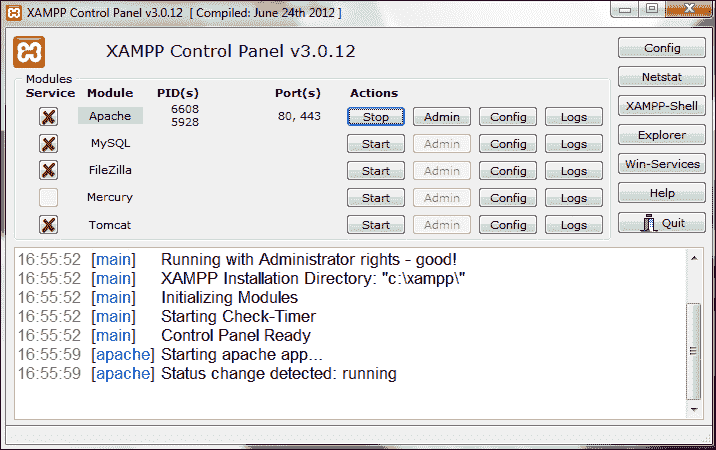

在此面板中，您可以看到服务器的不同组件，可以打开和关闭。您需要确保至少 Apache 组件正在运行。其他组件也可以打开，但 Apache 对于运行游戏是绝对必要的。

现在转到您的浏览器。在本书的过程中，我们将使用 Chrome 和 Firefox 浏览器。但是，建议还安装最新的 Internet Explorer 和 Safari 浏览器进行测试。在地址栏中简单地输入`localhost`。Localhost 是本地安装服务器的默认位置。您是否看到以下*XAMPP 启动屏幕*？


恭喜，您已成功设置了自己的本地服务器！

已知问题是**IIS**（**Internet Information Services**）占用了您必需的端口。您可能需要禁用或甚至删除它们，以便为 XAMPP 释放端口。

对于**MAMP**（**M**代表**Mac**），可能需要指定端口 8888 才能正常工作。因此，输入`localhost: 8888`而不是只输入`localhost`。

总结前面的内容，步骤如下：

1.  下载并安装 XAMMP。

1.  打开控制面板并启动 Apache。

1.  在地址栏中输入`localhost`，打开你的浏览器。

# 安装游戏引擎：ImpactJS

接下来你需要的是实际的 ImpactJS 游戏引擎，你可以从 ImpactJS 网站[`impactjs.com/`](http://impactjs.com/)购买，或者在 AppMobi 网站[`www.appmobi.com`](http://www.appmobi.com)上购买**AppMobi**的套餐，其中包含 ImpactJS 游戏引擎。

无论你在哪里购买引擎，你都会寻找一个（压缩的）文件夹，里面装满了 JavaScript 文件。这本质上就是 ImpactJS，一个在 HTML 环境中更容易构建 2D 游戏的 JavaScript 库。

现在你已经让服务器运行起来了，并且已经获得了 ImpactJS 引擎，你所需要做的就是把它放在正确的位置并测试它是否起作用。

在 ImpactJS 版本（v1.21）中，在写这本书的时候，你会得到一个名为`impact`和一个`license.txt`文件的文件夹。

许可证文件会告诉你购买的 Impact 许可证可以做什么，不能做什么，所以建议你至少阅读一下。

`impact`文件夹本身不仅包括 Impact 游戏引擎，还包括关卡编辑器。文件夹结构应该能够容纳所有未来的游戏文件。

目前，知道你可以将整个`impact`文件夹复制到服务器的根目录就足够了。

对于 XAMPP 来说，应该是：`"你的安装位置"\xampp\htdocs`。

对于 WAMP 来说，应该是：`"你的安装位置"\wamp\www`。

让我们也复制这个文件夹并将其重命名为`myfirstawesomegame`，让它更加个性化。现在你有了原始文件夹，我们将在第三章和第四章中使用，*让我们建立一个角色扮演游戏*和*让我们建立一个横向卷轴游戏*。

你还应该在 XAMPP 安装位置`\xampp\htdocs\myfirstawesomegame`和 WAMP 安装位置`\wamp\www\myfirstawesomegame`中都有以下文件夹结构。

在`myfirstawesomegame`文件夹中应该有`lib`、`media`和`tools`子文件夹，以及`index.html`和`Weltmeister.html`文件。

时间进行一次小测试！只需在浏览器中输入`localhost/myfirstawesomegame`。

“它起作用了！”的消息现在应该让你心中充满了喜悦！如果它没有出现在屏幕上，那么肯定出了大问题。如果你没有收到这条消息，请确保所有文件都存在并且位于正确的位置。

ImpactJS 带有一个名为`Box2D`的*物理引擎*。检查一下你的文件夹结构中是否有这个文件夹。如果没有，你可以通过你下载 Impact 引擎时得到的个人下载链接下载一个包含引擎的演示游戏。这个演示游戏叫做*Biolab Disaster*，你应该能在这里找到`box2d`文件夹。如果没有，Dominic（ImpactJS 的创造者）还提供了一个名为`physics`的单独文件夹。由于 Box2D 是标准引擎的一个插件，最好在你的`lib`文件夹中搜索`plugins`文件夹，并将`box2d`文件夹放在这里。

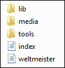

总结前面的内容，步骤如下：

+   购买 ImpactJS 许可证并下载其核心脚本

+   将所有必要的文件放在服务器目录中新创建的名为`myfirstawesomegame`的文件夹中。

+   在地址栏中输入`localhost/myfirstawesomegame`，打开你的浏览器。

+   下载 Box2D 插件并将其添加到你自己服务器上的`plugins`文件夹中

# 选择一个脚本编辑器

我们现在已经让服务器运行起来，并安装了 ImpactJS 游戏引擎，但我们还没有工具来实际编写游戏代码。这就是*脚本编辑器*的用武之地。

为了选择适合你需求的正确代码编辑器，最好区分纯编辑器和 IDE。**IDE**或**集成开发环境**既是脚本编辑器又是编译器。这意味着在一个程序中你可以改变和运行你的游戏。另一方面，脚本编辑器只是用来改变脚本。它不会显示输出，但在大多数情况下，会在你即将发生语法错误时提醒你。虽然编辑器会显示你 JavaScript 代码中的语法错误，但实际执行代码会显示逻辑错误，并给你一些（漂亮的）东西看。

对于 ImpactJS，有一个名为 AppMobi 的 IDE，它是免费的，但收费额外服务。使用 AppMobi 的替代方案是你刚刚安装的 XAMPP 服务器。

脚本编辑器，即使是非常好的脚本编辑器，通常也是免费的。在选择你喜欢的之前，你应该检查一些好的脚本编辑器，比如**Eclipse**，**notepad++**，**komodo edit**和**sublime edit 2**。特别是对于 Mac，有一个名为**Textmate**的编辑器，它经常被使用，但不是免费的。当然还有**Xcode**，官方的苹果开发者编辑器。

所有这些脚本编辑器都会检查你在 JavaScript 代码中所犯的错误，但它们不会检查 ImpactJS 特定的代码。为此，你可以制作自己的脚本颜色编码包，或者从那些花时间构建的人那里下载一个。

下载并安装之前提到的一些脚本编辑器，并选择你最喜欢的。所有这些都可以很好地完成任务，只是个人偏好的问题。

# 运行预制游戏

是时候在你的电脑上开始运行游戏了。为了做到这一点，你需要书中附带的文件。这些文件可以从以下网站下载：

[`www.PacktPub.com/support`](http://www.PacktPub.com/support)

现在你应该已经准备好了。复制第一章的可下载材料，*启动你的第一个 Impact 游戏*。用 Packt Publishing 下载页面上的`index.html`和`main.js`脚本替换 ImpactJS 库附带的`index.html`和`main.js`脚本。还要用提供的`media`、`entities`和`levels`文件夹覆盖你电脑上的文件夹。

返回浏览器，重新加载`localhost/myfirstawesomegame`链接。瞧！一个*完全功能的 ImpactJS 游戏*！如果你仍然看到下面截图中显示的**it works!**消息，可能需要清除浏览器缓存或刷新页面几次才能显示游戏。如果还有其他问题，我们将在学习调试时找出。

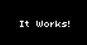

总结前面的内容，步骤如下：

+   从 packtpub 下载服务器下载必要的文件，并将它们放在你自己服务器上的正确位置

+   打开浏览器，在地址栏中输入`localhost/myfirstawesomegame`

# 使用浏览器和 ImpactJS 调试你的游戏

在你调试游戏之前，你至少应该了解*ImpactJS 代码的一般结构*。你可能已经注意到，ImpactJS 有一个主脚本，用于实际控制整个游戏。`main.js`脚本包括所有其他必要的脚本和`ImpactJS`库。它包含的每个脚本都代表一个模块。就像这样，你在游戏中为每个级别和实体都有一个模块。它们就像乐高积木，聚集在一个大的（`main.js`）城堡中。事实上，主脚本如下面的代码片段所示，本身就是一个模块，需要所有其他模块：

```js
ig.module( 
  'game.main' 
)
.requires(
  'impact.game',
  'impact.font',
  'game.entities.player',
  'game.entities.enemy',
  'game.levels.main',
  ...
```

### 提示

**下载示例代码**

您可以从[`www.packtpub.com`](http://www.packtpub.com)的帐户中下载您购买的所有 Packt 图书的示例代码文件。如果您在其他地方购买了本书，您可以访问[`www.packtpub.com/support`](http://www.packtpub.com/support)并注册，以便直接通过电子邮件接收文件。

如果您查看一下级别脚本，您会发现它是用**JSON**（JavaScript 对象表示法）编写的，这是**对象文字表示法**的一个子集。 JSON 和普通文字在以下方面有所不同：

1.  JSON 键是用双引号括起来的字符串。

1.  JSON 用于数据传输。

1.  您不能将函数分配为 JSON 对象的值。

有关 JSON 的更深入信息可以在[`json.org/`](http://json.org/)上找到。文字在 ImpactJS 中使用，并且看起来像以下代码片段：

```js
  EntityPlayer = ig.Entity.extend({
    size: {x:20,y:40},
    offset:{x:6,y:4},
    vel: {x:0,y:0},
    maxVel:{x:200,y:200},
    health: 400,
```

属性使用冒号（`:`）定义，并用逗号（`,`）分隔。在普通 JavaScript 中，这样做的方式不同，如下所示：

```js
if(ig.input.state('up') || ig.input.pressed('tbUp')){
  this.vel.y = -100;
  this.currentAnim = this.anims.up;
}
```

等号（`=`）用于为属性分配值，分号（`;`）用于分隔不同的属性和其他变量。

总结前面的内容，得出以下结论：

+   ImpactJS 使用三种 JavaScript 表示法：JSON，文字和普通表示法

+   ImpactJS 级别脚本使用 JSON 代码

+   ImpactJS 同时使用文字和普通 JavaScript 表示法

## 使用浏览器调试

在使用新安装的脚本编辑器编写代码时，您会注意到可以立即避免 JavaScript 语法错误，因为编辑器会告诉您出了什么问题。但是，有些错误只有在实际在浏览器中运行代码时才能找到。也许您并不希望公主在英雄救了她后起火，但意外的结果确实会发生。这意味着您应该随时保持浏览器打开，以便可以一遍又一遍地重新加载游戏，直到一切都符合您的喜好。

然而，当您的游戏崩溃或甚至无法完全加载时，找到原因可能会非常痛苦。即使一次更改一小部分代码，错误也可能在意想不到的地方出现。

为此，Firefox 和 Chrome 都配备了很好的工具。

### Firebug - Firefox 调试器

对于 Firefox，您可以安装**Firebug**插件，这是一个不错的 JavaScript 调试器，可以告诉您代码中的错误在哪一行，并且具有一个易于使用的**DOM**（文档对象模型）资源管理器。DOM 基本上是包含所有实体和函数的 HTML 文档的结构；深入了解 DOM 是必不可少的。

这个 DOM 资源管理器非常有用，可以用来检查某些变量的值，比如您的英雄的生命值或屏幕上敌人的数量。导致游戏崩溃的错误将很容易通过调试器（Firefox 和 Chrome 都有）找到。但是，要发现您在敌人的生命值末尾添加了两个额外的零（所以这些生物就是不会死！），您需要探索 DOM。


### Chrome 调试器

对于 Chrome，您甚至不需要下载插件，因为它已经捆绑了 JavaScript 控制台。此控制台可以在**选项** | **额外** | **JavaScript 控制台**下找到，并且非常方便使用。您还可以通过右键单击网页并选择**检查元素**来打开控制台。

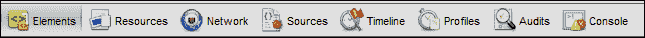

Chrome 调试器（也称为 Chrome 开发者工具）有八个选项卡，其中有四个对调试 Impact 游戏特别有用。

**元素**选项卡允许您检查页面的 HTML 代码，甚至可以立即对其进行编辑。这样，您可以更改游戏的画布大小。但是，请注意，更改仅适用于加载的网页；它们不会保存到您的 HTML 或 JavaScript 文件中。

在**Resources**标签中，您可以查找有关您的*本地存储*的信息。本地存储对于构建游戏并不是必需的，但它是一个用于保存高分和类似内容的很酷的功能。

**Sources**标签非常有用，因为它允许您检查和更改（再次是临时的）您的 JavaScript 代码。您可以在这个标签中找到您的 DOM，就像在 Firefox 中一样。代码可以手动暂停，也可以通过使用条件断点来暂停。例如，如果您的角色可以获得经验，您可以在升级时暂停游戏，看看所有变量是否都取得了您期望的值。

调试器最重要的部分是**Console**标签。控制台显示了您的错误所在，甚至指示了发生错误的 JavaScript 文件和行。控制台非常灵活，可以在任何其他标签打开时调用。这样，您可以在**Sources**标签中检查代码，如果有错误，可以通过单击右下角的**X**图标来调用控制台。打开**Sources**和**Console**标签后，调试变得轻而易举。

其他四个标签是**Network**，**Timeline**，**Profiles**和**Audits**标签。它们很有用，但您将花费大部分时间与**Sources**和**Console**组件一起打开。

在本书的过程中，Firebug 和 Chrome 调试器可以互换使用。

如果启用了缓存，更改游戏并重新加载您的 Web 浏览器通常是不够的。只要您的游戏被缓存，您就无法百分之百确定您是否在评估游戏的最新版本还是浏览器在内存中锁定的先前版本。在开发游戏时，关闭缓存是明智的选择。在 Firefox 中，可以通过下载和使用一个执行此操作的插件来完成。在 Chrome 中，这只是 Chrome 开发者工具本身的一个选项。当调试器打开时，单击右下角的齿轮符号以打开设置。在**General**标签下，您可以禁用缓存，如下面的屏幕截图所示：

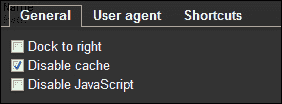

调试可以在单个浏览器中完成，但明智的做法是至少在四个浏览器上测试您的游戏是否运行顺畅，例如 Chrome，Safari，Internet Explorer 和 Firefox。使用这四个浏览器，您至少可以覆盖 95％的浏览器使用率。

如果您想为某些设备进行测试，那么测试也是必要的。这可以通过拥有您希望您的游戏在其上运行的设备之一（例如 iPad，iPhone，HTC，Galaxy 等）并在`one.com`等网络托管公司的帮助下将您的游戏在线上发布来完成。或者，您可以使用 AppMobi，该工具具有设备查看器，用于此目的。

测试游戏的另一个好方法是使用模拟器。模拟器是一种模拟实际智能手机的程序。这一切都很好，但让我们看一个实际的例子。

### 使用 Chrome 和 Firebug 进行调试的练习

在前面的章节中，我们已经让游戏开始运行了。现在让我们看看如果真的出了问题会发生什么（假设到目前为止一切都很顺利）。

首先，我们需要一些*有缺陷的代码文件*。因此，从`debugging tutorial`文件夹中复制`main.js`，`player.js`，`projectile.js`和`enemy.js`脚本，并用这些脚本替换旧的脚本。`main.js`应该位于您的`game`文件夹中，而`enemy.js`可以在`entities`文件夹中找到。

现在，您的特殊（即有错误的）脚本已经就位，是时候重新启动游戏了。重新加载您的浏览器，并确保缓存是空的，否则不会显示错误。

游戏无法完全加载，如下面的加载栏所示：

在使用 Chrome 和 Firebug 进行调试的练习中

这可能经常发生在你开发新游戏时。例如，如果不同 JavaScript 文件的依赖关系错误，就会经常发生这种情况。要查看现在发生了什么，请打开 Chrome 调试器。


转到**控制台**选项卡，查看错误消息：**i 未定义** **main.js:51**。在编辑器中打开`main.js`脚本，并转到指定的行号。果然，如下代码所示，有一些问题：

```js
i.input.bind(ig.KEY.UP_ARROW, 'up');
ig.input.bind(ig.KEY.DOWN_ARROW,'down');
```

没有叫做`i`的对象，这应该像其他的一样是`ig`。

现在我们解决了这个问题，再次加载游戏。加载成功！太棒了！但这并不意味着一切都没有错误。打开调试器，看看是否还有其他问题困扰着你的游戏。目前没有，所以让我们继续探索。

如果一切“顺利”，你的游戏应该在你想向左走的时候卡住。

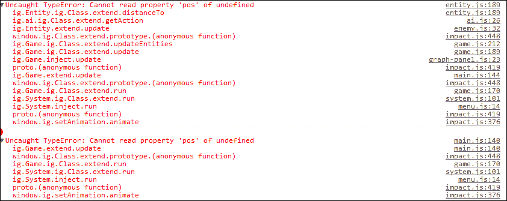

你会收到消息，**无法读取未定义的属性'pos'**。问题是很难确定错误实际发生的位置，因为几乎每个脚本中都会出现错误。但是，我们知道`pos`是实体的一个参数，并且在错误发生之前我们按下了`左`按钮。我们至少应该检查所有定义或使用这个`左`按钮的地方。

如果你打开`player.js`脚本，你会发现左移的命令相当奇怪，如下代码所示：

```js
else if(ig.input.state('left') || ig.input.pressed('tbLeft')){
  this.vel.x = -100;
  this.currentAnim = this.anims.left;
  this.kill();
}
```

因此，实体向左移动，动画设置为左侧，然后自毁。随意使用`kill()`函数是不好的。在这种情况下，`kill()`函数的意外位置导致玩家消失，因此玩家没有了位置，这在游戏的`update`循环中进一步产生了错误。移除这个`kill()`函数，游戏就不会再崩溃了。

有时控制台会显示错误，但是你的智慧仍然会带领你找到根本原因。控制台只是一个工具，你才是真正的主宰。

我们已经移除了所有主要的错误，因为 Chrome 目前没有指示错误。确保检查所有关卡，因为不同的关卡通常会有其他可能出现错误的实体。但是，现在让我们开始杀死一些敌人！

你可能已经注意到，摧毁这些讨厌的生物相当困难。我们不再有真正的错误，但也许其他事情并没有按计划进行。我们似乎无法杀死它，所以要么我们造成的伤害不够，要么它的生命值非常高。让我们深入了解可能涉及的两个实体：`projectile`和`enemy`。我们应该检查`projectile`实体而不是`player`实体，因为尽管玩家射击了抛射物，但是造成伤害的是抛射物。枪不杀人，子弹杀人。打开`projectile.js`和`enemy.js`脚本，它们都在`entities`文件夹中。或者，你可以打开 Chrome 调试器，在**脚本**选项卡下选择文件。

在`projectile.js`脚本中，查找以下代码：

```js
check: function(other){
  if(other.name == 'enemy'){other.receiveDamage(100,this);}
  this.kill();
  this.parent();
```

我们很快就会深入了解这段代码的具体内容。现在知道子弹在撞击敌人时造成`100`点伤害就足够了。

现在查看`enemy.js`脚本中敌人的生命值。以下代码显示了生命值：

```js
health:200000,
```

是的。这是一个问题。敌人比预期的强大一千倍。将生命值改为`200`，你就可以用两发子弹杀死敌人。或者，你可以将`projectile`实体的伤害设置为`100,000`。将`damage`属性改为一个大数值可能对喜欢看到大数值而不是适度数值的玩家有用（那些玩过魔兽世界的人知道我在说什么）。

如果你保存代码并重新加载关卡，你应该不会再遇到杀死敌人的问题了。

通过浏览 DOM 来找出可能出错的另一种方法是查看单个实体。让我们使用 Firebug 来做这个。如果您的 Firefox 上还没有安装它，可以搜索并安装它。

我们射击了敌人两次，发现他并不打算死。我们可以通过浏览 DOM 来查看生成的实体本身，而不是检查代码。要找到敌人的生命值，您必须通过按下浏览器中的 bug 符号来打开您的 Firebug，然后选择**DOM**选项卡。现在按顺序打开`ig`，`game`和`entities`文件夹。您将看到一个编号列表，数字是`entities`数组中特定实体的位置。现在您可以打开一些数字，直到找到生命值为**19800**的敌人，如下面的截图所示：

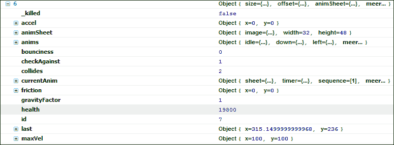

敌人被埋在其他实体的列表中，但通过他的属性我们可以看出这里发生了什么。我们射击了两次，现在它的**health**值为**19800**。这是有道理的，因为抛射物的伤害是**100**。

掌握 DOM 需要一些努力，但对于找出代码是否按预期工作非常有用。此外，您可以更好地了解 ImpactJS 的核心元素如何相互关联。建议在继续之前花一些时间在这里，以了解整体结构。

所以我们已经看到了三种不同类型的错误，从容易解决到相当难以找到和修复。在第一种情况下，控制台告诉你有一个地方出现了错误，你去设置它就对了。第二种情况显示游戏在多个地方同时产生错误，但只有一个根本原因。由你和你的逻辑大脑来推断是什么导致了游戏崩溃。最后，我们有意想不到的结果，这些并不是真正的错误。控制台不会显示这些错误，因为它无法读取你的思想（也许在下一个版本中，谁知道）。这些是最难找到的，需要你进行一些测试。

总结前面的内容，结论如下：

+   Firefox 和 Chrome 都具有非常强大的调试器功能。

+   Firebug 特别推荐用于探索游戏的 DOM。

+   Chrome 有八个有趣的组件，其中最有用的是控制台，可以检测错误。

+   错误可以有不同类型：语法错误，代码逻辑错误和游戏逻辑错误。

+   大多数语法错误可以通过一个好的脚本编辑器预先检测到。

+   一个简单的语法错误会在调试器控制台中显示为单行错误。这样很容易定位和修复。

+   代码逻辑错误很难检测，因为语法通常在根本上是正确的，但会在其他位置显示错误。

+   游戏逻辑错误是非常主观的错误，因为它们不会导致游戏崩溃，但会导致游戏玩法不佳。

## 使用 ImpactJS 进行调试

ImpactJS 本身带有一个内置的调试器。但是，默认情况下它是关闭的，可以通过对`main.js`脚本进行小修改来打开。`main.js`脚本（顾名思义）是您的游戏的主要脚本，并调用所有其他 JavaScript 文件。这个脚本加载到您的浏览器的 HTML 画布中，并一遍又一遍地循环，以使您的游戏运行。`main.js`脚本可以在`game`文件夹中找到，并且应该随 Impact 许可证一起提供，如下面的代码片段所示：

```js
ig.module(
  'game.main' 
)
.requires(
  'impact.game',
  'impact.font',
  'impact.debug.debug',
```

一切都始于`ig`（Impact Game）对象。这个对象是您在调试游戏并检查变量和函数时要查找的东西。在`main.js`脚本中，有一个对`.module`函数的调用，它将`game.main`定义为游戏的一个模块。模块名称需要与其位置和文件名相同！因此，JavaScript 文件`lib/game/entities/bigmonster.js`最终将被定义为`game.entities.bigmonster`。通过以下步骤可以向游戏添加`debug`面板：

1.  `.requires()`函数调用所有需要执行代码的脚本。并非每个模块都需要这样做，但`main.js`脚本将始终至少需要`impact`库。

1.  在这个函数调用中，您将希望添加`impact.debug.debug`脚本，它（正如您猜到的）调用`lib/impact/debug`文件夹中的`debug.js`脚本。

1.  保存`main.js`脚本，并在 Chrome 中重新运行`localhost/myfirstawesomegame`。

1.  如果一切按计划进行，您现在应该在浏览器底部看到一个名为**impact.debug**的新工具栏。

1.  调试器有三个选项卡：**背景地图**，**实体**和**性能**，以及右上角的四个关键指标。

1.  从左到右，这些指标如下：

+   运行游戏一帧所需的毫秒数。

+   游戏的每秒帧数指示器。

+   已经发生的**绘制**次数。如果您正在进行对话，这将包括角色。

+   在右侧，您会找到当前游戏中的实体数量。

虽然这些指标快速向您展示了需要考虑的最重要的事情，但如下图所示的三个选项卡更深入地展示了：


如果选择**背景地图**，您将看到游戏拥有的所有图形图层。假设您想让您的史诗角色在树前奔跑；您会期望树的一部分消失在角色的后面，而不是相反。当角色移动到树后面时，您希望它被树隐藏。因此，您至少需要两个图层才能绘制出这样的树。一个图层在玩家前面（很可能是树梢），另一个在玩家后面（树干）。

在调试器的部分中，您可以打开和关闭图层。如果图层设置为预渲染，您将能够看到图层的块。在以下截图中，**检查和碰撞**被打开，而其他选项被关闭：

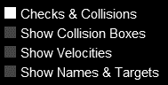

使用**实体**选项卡，您可以打开和关闭几个有趣的指标。如果您打开**显示碰撞框**，您将能够看到您的角色周围的红色框以及几个（不可见的）实体，它们不断检查碰撞。这些红色框指示触发点碰撞的边界。这很重要，因为如果围绕您的英雄角色的碰撞框比图像大得多，他可能无法再通过门，或者会神秘地被远处的敌人击中。在编写代码时，您可以自己设置这些碰撞框的大小，从而产生一些有趣的效果，比如只能通过射中眼球来杀死 boss。

当您打开**显示速度**时，您应该让角色四处走动。现在您将看到一条伸出在他前面的线，这是他当前移动速度的指示。

通过显示名称和目标，您可以看到所有命名实体及其目标。这是一个有趣的功能，但对于您的目的，最好使用 ImpactJS 级别编辑器（**Weltmeister**）。

最后，**性能**选项卡向您展示了浏览器为运行游戏需要执行的不同任务所付出的努力，如下图所示：

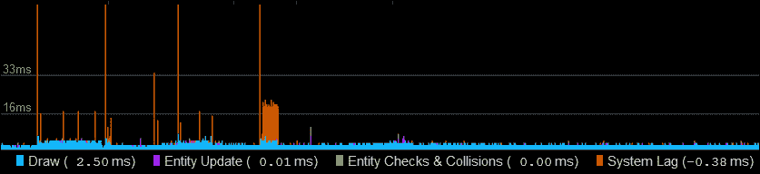

在上一个图表上可以看到两条水平线：**33ms**和**16ms**。这些线对应大约 60fps 和 30fps 的帧率。游戏运行在 30fps 以下是不可取的，因为看起来就像游戏在延迟，这样玩起来就没有乐趣。如果你发现游戏延迟，检查哪个部分占用了所有的资源，然后尝试修复它。

在大多数情况下，绘制游戏（图形）占用了大部分资源。这在**性能**选项卡中用**Draw**表示。如果发生这种情况，尝试减少图层或增大瓷砖的大小。此外，预渲染在这种情况下可以提高性能。

资源的另一部分由你的实体及其交互占用。如果你的屏幕上有成千上万个不同的实体，因为你决定一群海鸥应该由每只鸟的单独实体表示，你可能会很快遇到麻烦。

系统延迟有一个单独的指示器，这是一个你无法控制的参数，因为它显示了浏览器的性能。相当频繁地，系统延迟会导致帧率下降。然而，在大多数情况下，它实际上并不会被感觉到，因为真正巨大的波动来得快去得也快。

总结前面的内容，得出以下结论：

+   ImpactJS 自带调试器，默认情况下是关闭的

+   调试器有几个组件，可以洞察实体行为、碰撞和游戏性能

+   ImpactJS 调试器在跟踪性能问题方面非常有用，在开发过程中应始终保持开启状态

# 有哪些有用的工具

如果你有一个不错的脚本编辑器、ImpactJS 库、（本地）服务器和一个具有调试功能的浏览器，你就可以构建一个 ImpactJS 游戏。然而，还有一些有趣的工具可以大大简化你的开发过程。有**Ejecta**，它与 ImpactJS 一起提供，是为 iPhone 和 iPad 发布游戏的更有效的方式。**AppMobi**是一个为网络商店准备游戏的好工具。**PhoneGap**是一个创建应用程序的开源框架。使用**lawnchair**可以更轻松地使用本地数据存储。还有**Scoreoid**，一个免费的游戏云服务。最后是**Playtomic**——一个游戏分析工具。在本章中，我们将简要介绍其中的每一个。

## Ejecta

Ejecta 是一款精巧的工具，可以免费下载，链接如下：

[`impactjs.com/ejecta`](http://impactjs.com/ejecta)

它完全取代了**iOSImpact**，这是一种为苹果商店准备游戏的本地应用程序的方式。Dominic 称 Ejecta 为“没有浏览器的浏览器”。它没有额外开销，只有你的游戏特性和音频元素的画布。

Ejecta 对 ImpactJS 效果很好，但也可以用于其他应用程序。就像以前的 iOSImpact 一样，它利用**OpenGL**进行动画和**OpenAL**进行音频，这大大提高了游戏性能。如果你计划将游戏发布到 iPhone 上，Ejecta 绝对值得一看。

## AppMobi

AppMobi 提供了一个**XDK**（**跨平台开发工具包**），它与 ImpactJS 非常匹配。它们实际上为 ImpactJS（Impact XDK）和普通 XDK 分别提供了一个单独的开发工具包。

开发工具包是免费的，但额外的服务，如他们的云服务、实时更新功能和安全支付，需要额外付费。你可以在[`www.appmobi.com/`](http://www.appmobi.com/)找到所有信息。

只有在注册了 Impact 密钥并包含了他们的 JavaScript 库的情况下，Impact XDK 才允许您在 Impact 游戏上工作。设置正确后，XDK 允许您模拟 iPad、iPhone、Galaxy 等多个设备。XDK 只在 Google Chrome 中运行，尽管这并不是一个真正的弱点。您可以打开脚本编辑器，但它并不像我们之前看过的那些编辑器那样好。您可以选择调用调试器，但它只是 Google Chrome 调试器，而不是他们自己构建的调试器。

**Apphub**（您的控制中心）允许您在将应用程序发送到商店之前构建和测试应用程序。当然，要发布游戏，您仍然需要为您想要服务的平台拥有开发者帐户。

AppMobi 还拥有他们所谓的**直接画布加速**，它通过绕过游戏的画布元素来提高游戏的性能。这与 Ejecta 所做的非常相似，但是它是由 AppMobi 提供的。

以下截图是 AppMobi 可以提供的不同地形的概述，这将给一些开发人员带来一些帮助。虽然在编写游戏脚本时 AppMobi 的用途有限，但在测试和部署过程中可以提供出色的支持。

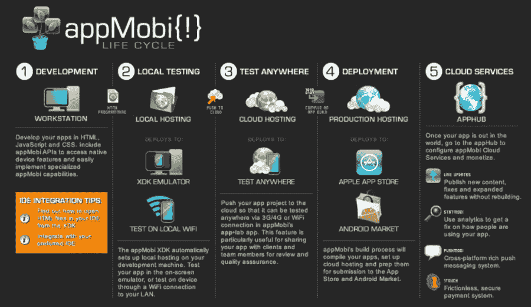

无法直接连接到移动设备。但是，您可以向任何拥有移动设备的人发送链接。这样，您的朋友可以在安装了**AppMobi applab**的情况下测试您的最新创作。

总的来说，AppMobi 易于入门，并且在整个发布游戏的过程中值得考虑，尽管在开发过程中您几乎完全是靠自己。

## PhoneGap

PhoneGap（以前称为**Cordova**）是另一个用于开发移动本机应用程序的 XDK。

PhoneGap 可以与 AppMobi 相比较，就功能而言，但 AppMobi 非常直观，更适合新手。PhoneGap 使您能够构建本地**操作系统**的应用程序，集成**PayPal**，并使用推送通知。

如下截图所示，PhoneGap 提供了一种构建您的应用程序以分发到不同渠道的方法：

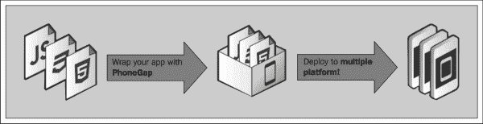

开始使用 PhoneGap 比 AppMobi 要复杂一些。您需要安装**eclipse**（免费）、android 开发工具和 SDK。安装**Git**可能是针对特定平台的必要条件。如果要发布到 iPhone 或 iPad，您还需要**xcode**。

总的来说，这绝对值得一看。幸运的是，它们有非常好的文档，因为它往往会变得有点复杂。更多信息可以在[`phonegap.com/`](http://phonegap.com/)上找到。

## lawnchair

lawnchair 提供了一种免费且简单的使用**本地存储**的方法。本地存储用于在运行您的游戏的设备上存储您的数据（保存文件和高分）。

在客户端保存所有内容相比在服务器端保存有许多优势。首先，您不需要了解 SQL。网站通过使用 SQL、PHP 和 JavaScript 将所有内容保存在它们的数据库中。如果您使用本地存储，只需要 JavaScript。存储空间的数量不受服务器限制，而是由用户限制。因此，如果您有许多玩家，每个玩家使用少量空间，您在本地存储时永远不会遇到麻烦，而在仅使用服务器存储时可能会遇到麻烦。由于不需要始终传输到服务器，您可以离线玩游戏并保留您的存档。

这些都是相当不错的优势，但是 lawnchair 是如何工作的呢？lawnchair 就像 ImpactJS 一样是一个 JavaScript 库（但这次是免费的）。您只需要将它与其他 JavaScript 文件一起包含，就可以开始使用特定的命令来保存数据。

包括 lawnchair 功能可以通过从[`brian.io/lawnchair/`](http://brian.io/lawnchair/)下载库并在您的`index.html`文件中包含`lawnchair.js`脚本来完成，如下面的代码示例所示：

```js
<html>
  <head>
    <title>my osim app</theitle>
  </head>
  <body>
    <script src="img/lawnchair.js"></script>
    <script src="img/app.js"></script>
  </body>
</html>
```

lawnchair 使用 JSON 在游戏的 DOM 中保存数据。如果您想要查看这是什么样子的示例，您可以在代码编辑器中打开任何 ImpactJS`level`脚本，因为这些脚本也是用 JSON 编码的。

如果您的游戏需要**保存游戏**、**高分**、**游戏进度**或任何其他需要跟踪的选项，以便玩家不需要重新开始，您将需要查看 lawnchair。更多信息可以在[`brian.io/lawnchair/`](http://brian.io/lawnchair/)上找到。

## Scoreoid

Scoreoid 是一个旨在处理一些高级功能的**游戏云服务**，如**排行榜**、**玩家登录**和**游戏内通知**。

要使用 Scoreoid 及其功能，您需要在他们的网站上注册，并在必要时在您的代码中实现他们的代码。不同的功能有不同的代码。以下代码片段是存储有关加载游戏的人的信息的示例模板：

```js
$.post("API URL",{api_key:"apikey",game_id:"gameid",response:"xml"},
  function(data){
    alert("Data Loaded: "+ data);
    console.log("Data Loaded: "+ data);
  });
```

您需要填写**API URL**、您自己的**API 密钥**、**游戏 ID**和用于传输的**数据编码**类型（XML 或 JSON），然后就可以开始了。

账户是免费的，但他们也有高级账户的选项，这也是免费的。但这只是因为他们目前仍在努力定义高级账户的额外功能。您可以在他们的网站[`www.scoreoid.net/`](http://www.scoreoid.net/)上订阅。

## Playtomic

Playtomic 是游戏监控的 Google 分析。

基本账户是免费的，但高级账户目前的价格为每月*15 美元*或每年*120 美元*。您可以在他们的网站[`www.playtomic.com`](http://www.playtomic.com)上订阅。

让分析流程运行起来并不太困难。在您的`index.html`文件中，您需要包含对他们 JavaScript 库的引用，如下面的脚本所示：

```js
<script type="text/javascript"src="img/playtomic.v2.1.min.js">
</script>
```

然后，在您的`main.js`脚本中，您可以添加一个命令将数据发送到他们的服务器，如下所示：

```js
Playtomic.Log.View(gameid, "guid", "apikey", document.location);
```

这两段代码是 Playtomic 建议的。但是，如果您以纯文本形式将数据发送到他们的服务器，可能会出现错误。因此，最好将脚本类型`text`替换为`application`，如下面的代码片段所示：

```js
<script type="application/javascript"src="img/playtomic.v2.1.min.js">
</script>
```

## one.com webhost

如果您想将自己的游戏放在自己的网站上，您将需要**webhost**。

您并不总是需要自己的网站，因为像 Scoreoid 这样的云主机也允许您将游戏放在网上。然而，有时在全球网络上拥有自己的小地方也是不错的。

[one.com](http://www.one.com)以一种包的形式出售网络空间和域名。这项服务的价格相当合理，特别是与您需要做的事情相比。您需要有安装了 XAMPP 的 PC，并且它应该一直运行。此外，如果您是认真的，您仍然需要购买一个域名，或者从其他地方获得一个免费的域名并将您的 IP 重定向到它。如果您的 IP 始终保持不变，这是可行的。然而，更多时候，这是互联网提供商的高级服务。您可以在[`www.one.com`](http://www.one.com)上注册一个账户。

如果您想使用 web 主机，还有更多的提供商，但在所有情况下都建议下载和安装**FileZilla**。FileZilla 是一个高效的文件传输程序，这正是您需要的，可以将您的所有文件从 PC 传输到沙漠中的某个服务器。FileZilla 可以在以下链接下载：

[`filezilla-project.org/`](http://filezilla-project.org/)

总结前面的内容，结论如下：

+   有很多工具可以让您作为游戏开发者的生活更加愉快

+   Ejecta 是将游戏发布到 iPad 和 iPhone 的高效解决方案

+   AppMobi 是一个免费的云工具，可以帮助发布和开发几乎每个分发渠道。

+   PhoneGap 与 AppMobi 有很多共同之处，尽管稍微复杂一些

+   lawnchair 提供了一种处理本地数据存储的方式

+   Scoreoid 是一个免费的游戏云服务，它将托管您的游戏并提供诸如排行榜集成之类的功能

+   Playtomic 是一款游戏分析工具，允许您标记游戏的某些元素并将数据存储在他们的服务器上

# 摘要

在本章中，我们作为游戏开发者做好了准备工作。我们已经建立了一个本地服务器，可以用作开发和初始测试环境。为了编写我们的代码，我们需要一个脚本编辑器，因此我们简要地介绍了一些编辑器。调试是程序员的主要技能之一；为此，我们不仅可以使用 Chrome 和 Firefox 调试器，还可以使用 ImpactJS 调试模块。最后，我们看了一些对 ImpactJS 游戏开发非常有帮助的工具。

现在我们已经准备就绪。在下一章中，我们将通过玩弄一个小的预制示例游戏来深入了解 ImpactJS。
