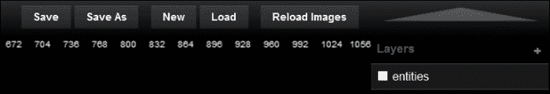
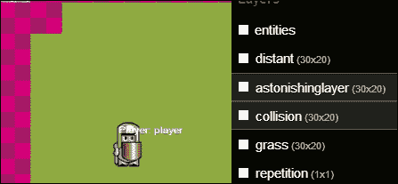
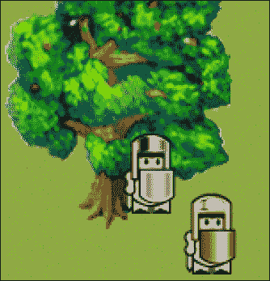
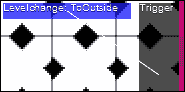
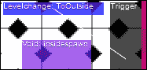
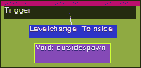
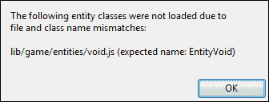
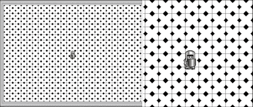
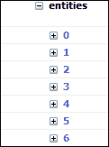
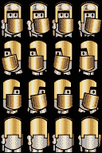

# 第二章：介绍 ImpactJS

现在我们已经收集了所有必要的工具，并且第一个游戏已经开始运行，现在是时候更多地了解 Impact 的实际工作原理了。

但是，在深入代码之前，我们应该先将代码从`chapter 2`文件夹复制到正确的位置。

与我们在第一章中所做的类似，*启动您的第一个 Impact 游戏*，我们只需要覆盖`myfirstawesomegame`项目的`main.js`和`index.html`文件以及`entities`、`levels`、`plugins`和`media`文件夹。

我们现在已经准备好去探索 ImpactJS 引擎的复杂工作原理了！

在本章中，我们将涵盖以下过程：

+   ImpactJS 的 Weltmeister 工具以及更改关卡中某些参数的后果

+   层级图层如何影响关卡设计

+   在 ImpactJS 中如何处理碰撞

+   ImpactJS 实体

+   ImpactJS 实体的属性

+   可玩实体与不可玩实体的区别

+   如何生成或消灭一个角色

+   如何设置玩家控制

+   如何更改游戏的图形

+   如何在触发时播放音效和背景音乐

+   如何使用 Box2D 为游戏添加物理效果

# 创建自己的关卡

在设计游戏时，您会想要创建发生一切的环境和地点。许多游戏被分成不同的关卡，通常每个关升级都会变得更加困难。对于一些其他游戏，比如**RPGs**（**角色扮演游戏**），并没有所谓的关卡，因为这意味着通常没有回头的可能。在整本书中，可以将一个空间保存为 Weltmeister 中的单个文件，称为一个关卡。

Weltmeister 实际上是掌握 ImpactJS 世界的工具。如果您正确安装了 ImpactJS，您应该能够通过在浏览器中输入以下地址来访问下一个截图中显示的关卡编辑器：

`http://localhost/myfirstawesomegame/weltmeister.html`



## 在 Weltmeister 中创建、加载和保存关卡

为游戏创建关卡是游戏设计中最令人愉快的事情之一。Weltmeister 的设计非常出色，您将花费数小时来玩弄它，只是因为您可以。

打开 Weltmeister（默认情况下），它会从一个干净的画布开始；有大量的空白等待您填充。很快我们将开始从头构建一个关卡，但现在我们应该加载`level1`关卡。按下 Weltmeister 右上角的**加载**按钮，并在`levels`文件夹中选择它。如果您在本章的开头复制了它，它应该就在那里，否则现在将其复制到 Weltmeister 中。

`Level1`是一个相当原创的第一关的名字，但让我们通过将其保存为`myfirstepiclevel`来个性化一下。按下右上角的**另存为**按钮，并将其保存在相同的目录中。现在我们有一个副本可以使用和玩弄了。

在我们实际使用名为`myfirstepiclevel`的关卡之前，我们需要在`main.js`脚本的代码中进行更改：

1.  在您首选的脚本编辑器中打开`main.js`脚本。

1.  在`main.js`脚本中，您将看到对`loadLevel()`函数的调用。

```js
this.loadLevel(LevelLevel1);
```

### 注意

这个调用位于游戏的`init()`函数中（`ig.game.init`）。这意味着`main.js`脚本将在*初始化*（即`init`）时做的第一件事情之一是加载`Level1`关卡。显然，我们不再需要这样做了，因为现在我们有自己的关卡叫做`myfirstepiclevel`。为了让游戏知道它必须包含这个关卡，您需要将它添加到`.requires()`函数中，如下面的代码行所示：

```js
'game.levels.level1',
'game.levels.myfirstepiclevel',
```

1.  还要更改对`loadLevel()`函数的调用，使其调用`myfirstepiclevel`关卡，而不是`Level1`，如下面的代码片段所示：

```js
this.loadLevel(LevelMyfirstepiclevel1);
```

### 提示

正如您可能已经注意到的，您总是需要在实际级别名称之前加上`Level`一词。此外，您将始终需要用大写字母写`Level`和您的级别名称。如果违反其中任何一个，将导致游戏加载时发生严重崩溃。在实际级别名称之前加上`Level`一词是一个相当奇怪的约定，特别是因为`loadlevel()`等函数被设计为期望一个级别文件。可能在未来的 ImpactJS 版本中会删除这个强制前缀。但是目前，如果未在实际级别名称之前插入`Level`一词或者用大写字母写`Level`和您的级别名称，将导致显示以下错误：


Weltmeister 中的其他按钮有**保存**、**新建**和**重新加载图像**。**保存**按钮只是保存您正在处理的文件，**新建**按钮将打开一个新的空文件。**重新加载图像**按钮是瓷砖集的刷新按钮。游戏的瓷砖集是图像的集合。单个主题的所有图形可以在单个瓷砖集中，例如`outdoor`瓷砖集。因为几个图像存储在一个称为瓷砖集的整体图像中，所以在 Weltmeister 中工作时更容易创建您的级别。您可以将其视为艺术家的调色板，但作为级别创建者，您可以使用与瓷砖集一样多的调色板。

总结我们所遇到的一切，我们可以得出结论：

+   您可以在服务器打开时在浏览器中输入以下地址访问 Weltmeister：`localhost/myfirstawesomegame/weltmeister.html`

+   使用**加载**按钮打开`level1`

+   再次保存为`myfirstepiclevel`，使用**另存为**按钮

+   通过将`myfirstepiclevel`添加到`include()`函数中，将新级别包含在`main.js`脚本中

## 图层和 z 轴

打开层级后，您可以看到它包括的不同元素和层。让我们首先看一下编辑器右侧的**图层**菜单。

选择**碰撞**图层，您将看到需要填写的图层的标准属性。所有图层（除了**实体**图层）都有名称、瓷砖集、瓷砖大小、尺寸和距离。

瓷砖集基本上是由方形图像链组成的，当组合得足够好时，形成您理想的风景或可怕的地牢。瓷砖大小是以像素为单位测量的一个瓷砖的宽度和高度。由于所有瓷砖都是正方形，您只需要填写一个数字。图层的尺寸是图层需要出现的整个地图的宽度和高度，以瓷砖数计量。因此，具有瓷砖大小为 8、宽度为 20 和高度为 30 的图层由 4800（8 x 20 x 30）像素组成。在使用移动设备时要考虑这一点。分辨率为 160（8 x 20）x 240（8 x 30）的级别将适合大多数设备。但是，如果瓷砖大小为 32，您将需要一个自动跟随可玩角色的视口来展示您的级别。这个视口相当容易整合，将在本章后面进行解释。按照以下步骤创建一个新的瓷砖集：

1.  尝试通过单击图层选择菜单顶部的加号（**+**）号来创建一个新图层。

1.  为图层输入一个名称；比如`astonishinglayer`或`tree`，随便你喜欢什么。

1.  现在从`media`文件夹中选择`tree`瓷砖集，方法是点击**瓷砖集**字段旁边的空框。如果无法通过 Weltmeister 菜单访问，只需在瓷砖集框中输入`media/Tree.png`。将瓷砖大小设置为`32`，尺寸设置为`30 x 20`（宽度 x 高度）。您可以看到图层边界相应地改变。

### 提示

一个常见的错误是一个层比另一个层小，然后无法在地图的某个部分添加对象。所以假设你的级别意图是一个尺寸为 30 x 20，瓷砖大小为 32 的地图，然后你添加了一个这样的层，并用草填充它。你想在草地上添加一个长凳，所以你添加了另一个层，并将尺寸设置为 30 x 20。因为你的长凳是一个 32 x 16 的图像，你将瓷砖大小设置为 16。如果你这样做，你将能够相当精确地绘制你的长凳，但只能在你的级别的左上角。你需要将尺寸改为 60 x 40，以便占据与草层相同的空间。

距离是层相对于游戏屏幕位置移动的速度。在“距离”字段中的值为 1 意味着它以相同的速度移动，而值为 2 意味着层移动速度减半。通过将此参数设置为大于 1，可以使事物看起来更远；这对于侧向滚动（或视差）游戏中的漂亮多云背景非常理想，比如马里奥。前往游戏，让你的角色从游戏的最左边向右边走，观察“距离”字段值的改变对效果的影响。

现在返回到 Weltmeister，尝试将“距离”字段的值设置为 2。保存并重新加载游戏，让你的角色从级别的一边跑到另一边，看看会发生什么。游戏的一部分将看起来比其他部分移动得更慢。这在侧向滚动游戏中作为背景很有用，但也用于顶部游戏中创建恐怖深渊的印象。在下面，你有“是否碰撞层”、“游戏中预渲染”、“重复”和“与碰撞链接”的选项。通过点击白色方块（变黑表示选项已关闭）可以打开或关闭它们。

“是否碰撞层”选项将告诉关卡编辑器，你正在绘制的层中的对象是不可穿透的。预渲染一个层会导致游戏在加载时对图块进行聚类。这将增加初始加载时间，但减少游戏所需的绘制次数，从而提高运行性能。

“重复”选项用于背景层。例如，如果你的背景云是一个图案，可以重复出现。

最后，“与碰撞链接”选项将确保对于你绘制的每个对象，碰撞方块都会添加到“碰撞”层。你可以稍后从“碰撞”层中删除它们，但这是一个加快绘制墙壁和其他不可通过地形的有用工具。

在“层”菜单中可以通过将它们拖动到列表中的上方或下方来重新排列层。通过将一个层拖到列表的顶部或底部，你可以定义它在 z 轴上的位置。你应该把 z 轴看作级别的第三维，就像我们生活的世界有一个 x 轴（宽度），一个 y 轴（高度）和一个 z 轴（深度）。你构建的游戏并不是传统意义上的 3D，但由于 2D 图形是叠加在一起的层，这里实际上有一个第三维在起作用。列表顶部的图形层将始终可见，甚至会隐藏实体。底层只有在没有其他东西挡住时才能可见。“碰撞”层永远不可见，但将其拖到顶部将使你更容易对其进行修改。

尝试重新排列层，看看会发生什么。保存游戏并重新加载。根据你对层做了什么疯狂的事情，世界现在确实是一个非常不同的地方。

与其将一个图层拖到堆栈的顶部以便能够查看它，你也可以打开和关闭图层。这是通过点击图层名称前面的方框来实现的。这在实际游戏中不会产生任何影响；它只在 Weltmeister 中可见。这对于**碰撞**图层非常有用。尝试将**碰撞**图层拖到堆栈的顶部，然后随意打开和关闭它。你会注意到这是在使用 Weltmeister 时**碰撞**图层的最佳位置。这是因为**碰撞**图层本身在玩游戏时实际上没有图形，所以它不会遮挡其他任何东西。



总结我们遇到的细节，我们得出结论：

+   一个关卡由具有诸如图块大小、距离以及是否为**collision**图层等属性的不同图层组成

+   使用**Layers**菜单中的（**+**）号添加一个新图层，并将其命名为`astonishinglayer`

+   将图块集`media/tree.png`添加到图层中。将其尺寸设置为`30 x 20`，将其图块大小设置为`32`

+   尝试玩弄图层上的所有属性，包括将图层上下拖动

+   每次调整参数后，保存关卡并在浏览器中重新加载游戏

## 添加和移除实体和物体

有三种大类型的图层：**entities**，**collision**，和其他任何图层。对于实体和死物体，实体和图形图层是感兴趣的。

**entities**图层包含了`entity`文件夹中存在的并由`main.js`脚本调用的所有实体。实体可以是任何东西，从玩家使用的角色到一个会杀死靠近的一切的隐形陷阱。所有功能和关卡的人工智能都在这些实体中。它可以包含敌人、触发器、关卡变化、随机飞行物体、可发射的抛射物，以及所有可以互动的东西。

### 提示

如果这些实体中存在关键错误，或者在你的`main.js`脚本中包含了一些不存在的实体，Weltmeister 甚至无法加载。因此，确保这些实体在你想要构建关卡时始终没有错误（或者没有包含）。

一些实体，比如玩家，已经存在于关卡中。首先在**Layers**菜单中选择**entities**图层，然后选择玩家实体以查看其属性。**x:**和**y:**属性是它当前的位置，并且在将新实体放入关卡时始终存在。

通过选择玩家并将其拖动到其他位置来尝试移动玩家实体。**x:**和**y:**坐标现在会改变。

让我们在关卡中添加一个**敌人**实体。选择**entities**图层，并在鼠标悬停在关卡上时按下空格键。一个菜单将出现在鼠标旁边；在这个菜单中选择**敌人**实体。一个敌人刚刚出现在你鼠标的位置！现在你可以疯狂地在每个方块上画上敌人实体，但这可能有点过火，所以让我们现在只放一个敌人。保存并重新加载你的游戏。现在，当敌人攻击你或者无动于衷地盯着它时，你会感到恐惧，这取决于你。

如果你添加了太多的敌人以至于无法安全地漫游，首先在 Weltmeister 中选择**entities**图层，然后选择你想要摆脱的敌人，然后简单地按下*Delete*键将它们从游戏中移除。

### 提示

将游戏和 Weltmeister 都打开以检查你所做的更改是一个好习惯。如果由于某种原因，你添加的实体是损坏的，游戏拒绝加载，至少你知道问题出在你最后做的更改上。当然，你还有 Chrome 或 Firefox 的调试器，它们也会指引你走向正确的方向。

添加对象与添加实体不同。死对象，不能与之交互，只是一个图形的东西，可以简单地涂抹，例如，一块草地、一个喷泉或一堵城墙。这些对象的复杂交互可以完成，但只能通过实体来实现。在这里，我们将看看如何向关卡添加一个简单的对象，没有交互。

虽然关卡看起来相当整洁，但我们需要对其进行改头换面。让我们从**图层**菜单中选择草地图层。将鼠标悬停在地图上，按下空格键。一个图块集将出现；你可以通过再次按下空格键使其消失。如果这个图块集不适合你的屏幕，你可以将鼠标悬停在更中心的位置并在那里打开它，或者使用鼠标滚轮缩小。如果你没有滚轮，你可以使用*Ctrl* + *-*（减号）组合键缩小，使用*Ctrl*键和加号键（*+*）放大。现在你可以看到整个草地图块集。选择草地，通过点击并按住鼠标左键在所有地方涂抹。

### 提示

用单个图块涂抹大面积的小技巧是，首先只在地图上涂抹一个小区域。然后点击*Shift* +鼠标左键，选择来自关卡本身的这个新绘制的更大的图块区域。现在你可以用这个新选择的图块涂抹，以更少的时间覆盖更大的区域。

如果你想从给定的图层中删除某些东西，只需选择该特定图层中的一个空方块。如果你已经在某个位置有其他图层的图形，但不是你当前正在操作的图层，那个方块可以被视为空的。现在用这个空方块涂抹，先前选择的图块将神奇地消失。现在试着删除一些草地。

草地位于一切的底部。如果你有一个对象，任何对象，它总是在草地的上面，从来不在下面（除非在一些疯狂的鼹鼠世界）。为了实现这一点，你必须将你的草地图层拖到图层堆栈的底部。

让我们在场景中添加一些其他东西。我们还有我们创建的图层`astonishinglayer`，准备好了，所以让我们用它画一棵树。为了一次性选择整棵树，通过点击*Shift* +鼠标左键组合键选择树。根据你放置图层的位置，树现在将始终出现在玩家的前面或后面。如果你将图层拖到列表的底部，甚至可能看不见。这是一个奇怪的结果，我们稍后会处理。保存你的关卡并重新加载，查看你的第一个关卡创意。



总结添加和删除实体和对象的过程，我们得出结论：

+   实体图层提供了所有游戏实体的选择

+   你可以将一些当前的实体添加到关卡中，然后保存并重新加载游戏

## 碰撞图层

**碰撞**图层是一个特殊的图层，在你从头开始打开 Weltmeister 时并不是预定义的。它是特殊的，因为它是一个不可见的图层，标记着不可通过的区域。例如，如果你通过使用图形图层在地图上画一堵墙，所有的实体都可以穿过它，就好像它根本不存在一样。如果你想要一堵真正能够阻止玩家和他的敌人的墙，就在**碰撞**图层上画一条线。

你的游戏还在打开；尝试画一堵墙（或者其他任何物体），然后在层次的底部穿过它。你会发现很容易穿过看起来很坚固的东西。选择**collision**图层，如果还没有完成，将其拖到列表的顶部，并确保其**visibility**选项已打开。现在所有的瓷砖都清晰可见，你会发现底部墙上没有瓷砖。将鼠标悬停在层次的画布上，按空格键以打开碰撞瓷砖集。选择一个方块，在墙上画一条线。删除碰撞块就像删除图形一样。选择地图上的一个区域（按住*Shift*键或不按住）没有碰撞块，并使用这个选择来删除那些存在的碰撞块。保存层次并重新加载游戏。现在再试着穿过墙；这已经变得相当不可能了；为此欢呼！

总结前面的过程：

+   在 Weltmeister 中选择**collision**图层

+   用它画一些瓷砖

+   保存并重新加载游戏，看看如果你想走到你画的碰撞瓷砖的地方会发生什么

## 连接两个不同的层次

现在我们知道了如何通过添加一些图形，比如草地、树木、玩家和一些敌人来构建一个层次，是时候看看层次是如何连接的了。

为此，将内部层次加载到 Weltmeister 中。内部层次位于建筑物内部（你没想到这一点，是吧？）。就像我们对`myfirstepiclevel`所做的那样，我们需要在`main.js`脚本中更改对`loadlevel()`函数的调用，如下面的代码片段所示。然而，这次，层次本身已经包含在`main.require`脚本中。

```js
this.loadLevel(LevelInside);
```

同样，不要忘记大写字母。

加载 Weltmeister 和游戏本身，看看是否一切都设置正确了。

在 Weltmeister 中，通过选择**entities**图层查看层次的实体。如果你无法清楚地看到地图中存在的实体，请随意关闭其他图层，方法是点击它们的白色方块。或者你可以在悬停在地图上时按空格键，以打开实体选择菜单。和往常一样，我们有一个玩家实体，所以我们可以在地方四处移动，但是在菜单中，你应该注意到一些额外的实体，比如**Void**，**Trigger**和**Levelchange**：

+   **Void**实体是一个相当简单的实体；它只是一个带有名称和一些坐标的盒子

+   **Trigger**实体将在特定类型的实体（如玩家）与其碰撞时触发与其链接的任何其他实体的代码。

+   **LevelChange**实体将使游戏加载另一个层次

通过巧妙地组合这三个实体，你可以连接层次，所以让我们来做吧：

1.  确保**entities**图层是顶部之一，这样你就可以看到你添加的东西。

1.  首先选择**Trigger**实体，并将其放在靠近门的地图上。一开始它只是一个小方块，所以把它做得大一点，以适应出口。你可以通过选择方框，将鼠标移动到其边缘，直到看到双箭头（双箭头符号），然后拖动它使其变大（就像你在 PC 上调整任何窗口对象的大小一样）。在选择大小时，你的目标是在玩家想要使用门出去时检测到他。

1.  现在添加一个**Levelchange**实体。如果选择**Levelchange**实体，您将在右侧看到其属性。目前，这只是地图上的位置（x 和 y 坐标）和其尺寸，以防您重新调整了框的形状。通过在键框中输入`name`，为**Levelchange**实体命名为**ToOutside**。按*Enter*键确认。现在您将看到该实体具有额外的属性（名称），其值为**ToOutside**。只有通过给它一个名称，它才能被唯一标识，这就是我们需要的。我们还需要告诉它需要加载哪个关卡。添加键**level**，值为**outside**，然后按*Enter*键。

1.  **Trigger**和**Levelchange**实体现在都在关卡中，但它们尚不知道彼此的存在；如果我们希望它们合作，这一点非常重要。

1.  返回到触发器实体并给它一个目标。您可以通过在键框中输入`target.1`，值为**ToOutside**来实现。注意单词`target`后面的句点（`.`）；没有它，它将无法工作。现在按*Enter*键，看着两个漂亮的方块如何通过一条白线连接在一起，如下图所示。**Trigger**实体现在知道它是**Levelchange**实体；当玩家触摸到它时，它将被触发。

保存并加载关卡。将您的玩家走向触发器位置；**Levelchange**实体的位置是无关紧要的。如果一切顺利，现在您应该能够通过走向门来进入下一个关卡！

奇怪的是，当您进入外部世界时，并没有被放置在建筑物旁边。即使对于一个视频游戏来说，这也太奇怪了。此外，当试图打开门时，没有办法回到室内，您将永远被困在外面，除非重新加载。

这是因为在外部关卡中没有添加**spawnpoint**、**Trigger**或**Levelchange**实体。我们将弥补这一点，但首先让我们在内部关卡中添加一个出生点。

为了做到这一点，我们需要**Void**实体。将**Void**实体添加到关卡中，并将其放在门前，但是超过触发器。将其放得太靠近（或者在上面）触发器会导致玩家被击退到外面。虽然制作一个永恒的循环，让玩家在关卡之间来回击退是很有趣的，但是永恒的循环（就像除以零一样）有可能摧毁世界。将**Void**实体命名为`insideSpawn`。选择**Levelchange**实体并添加键**spawn**，值为**OutsideSpawn**。



我们已经完成了内部关卡，现在需要将外部关卡设置为其镜像相反。因此，再次添加**Void**、**Levelchange**和**Trigger**实体。将**Void**实体命名为`OutsideDoor`，因为**Levelchange**实体将寻找它。将**Levelchange**实体命名为`ToInside`，并将触发器指向它。还要向**Levelchange**实体添加**Level**和**spawn**属性。这些属性的值分别为**Inside**和**InsideDoor**。



保存并重新加载游戏。如果一切顺利，您现在应该能够像专业人士一样在两个关卡之间移动。

总结连接两个关卡的完整过程：

+   在 Weltmeister 中加载内部关卡

+   向关卡中添加三个实体，**Trigger**、**Levelchange**和**Void**

+   给每个实体命名

+   使触发器指向**Levelchange**实体

+   将这些信息添加到**Levelchange**实体中：它需要加载的关卡和它将要使用的出生点

+   保存内部关卡，加载外部关卡，并在那里重复练习

+   确保两个关卡都已保存并在浏览器中重新加载游戏

# 对象-可玩和不可玩角色

现在我们已经看过如何构建一个级别，是时候深入研究我们一直在玩的实体背后的代码了。虽然没有官方分类，但可以通过区分三种类型的实体来简化事情：死亡对象、不可玩角色和玩家实体本身。这三种类型的实体按复杂性和互动性逐渐增加排序。在本章的第一部分，我们看了游戏的图形层。纯粹的图形根本没有任何互动元素；它们只是作为稳定的元素存在。要从你正在玩（构建）的游戏中得到一些反馈，你需要实体。这些实体中最简单的是死亡对象，它们根本没有任何人工智能，但可以进行交互，例如，可以拾取的物品，如硬币和药水。我们已经调查过的一种实体类型是**Trigger**实体，它本身是不可见的，但可以放置在与图形相同的级别，并且可以指示游戏中将会发生的事情。岩浆的图形不会杀死你。但是，精心放置在岩浆下面的实体会告诉游戏摧毁进入该区域的一切。在复杂性方面稍微上升的是**NPC**（**不可玩角色**）。这些是你的敌人，你的朋友，你作为玩家将杀死或保护的一切，或者如果你愿意的话，可以忽略。它们可以是毫无头脑的僵尸，也可以是复杂而非常精确的对手，比如国际象棋电脑。游戏中最后一个也是最复杂的实体就是你，或者至少是你的化身。可玩角色是迄今为止最多才多艺的角色，值得在本章后面进行详细阐述。在这样做之前，我们首先必须看一看是什么使 ImpactJS 实体成为它所是的。

## ImpactJS 实体

为了解释实体的基础知识，最好先看一看死亡对象。这些实体没有像不可玩角色或玩家那样复杂的行为模式，但肯定比纯粹的图形复杂得多。

一个例子是**Void**实体，我们在本章前面设置级别转换时遇到的一个好朋友。在脚本编辑器中打开`void.js`文件，这样我们就可以看一看。以下代码片段是**Void**实体的一个例子：

```js
ig.module(
  'game.entities.void'
)
.requires(
  'impact.entity'
)
.defines(function(){
  EntityVoid = ig.Entity.extend({
  _wmDrawBox: true,_wmBoxColor: 'rgba(128, 28, 230, 0.7)',_wmScalable: true,size: {x: 8, y: 8},update: function(){}});
});
```

每个实体至少会调用`ig.module`，`requires()`和`defines()`函数。

在`ig.module`函数中，你将**Void**实体定义为一个模块。`ig.module`函数调用定义了**Void**实体作为一个新模块。模块名称应该与脚本的名称相同。放在`game`文件夹中的`entities`文件夹中的`void.js`文件将成为`game.entities.void`文件。

`requires()`函数将调用此实体所依赖的代码。像所有实体一样，虚空实体依赖于 Impact Engine 中的实体原型代码，因此被命名为`impact.entity`。

`defines()`函数使你能够定义这个特定模块的全部内容。看一看`defines()`函数里面有什么。我们看到`EntityVoid`模块被定义为实体类的扩展，如下所示：

```js
EntityVoid = ig.Entity.extend({
```

在实体名称前始终添加`Entity`，不要忘记大写字母。如果你不这样做，Weltmeister 就不会喜欢，你会收到一个错误消息，说它期望一个不同名称的实体。Weltmeister 将生成以下错误：



**Void**实体是一个特殊实体，因为它在游戏中是不可见的；这一点从代码并未指向`media`文件夹中的某个图像就可以看出。相反，它有三个属性适用于 Weltmeister：`_wmDrawBox`，`_wmBoxColor`和`_wmScalable`。`_wm`前缀属性表明它们对 Weltmeister 很重要。

```js
 _wmDrawBox: true,
```

上一个代码片段告诉 Weltmeister 在将实体插入到级别时必须绘制一个框。将此属性设置为`false`，则不会应用来自`_wmBoxColor`属性的颜色。

```js
_wmBoxColor: 'rgba(128, 28, 230, 0.7)',
```

上一个代码片段定义了此框的颜色，采用 RGBA 颜色方案。对于**Void**实体，目前颜色是紫色。

```js
_wmScalable: true ,
```

上一个代码片段将允许您使框变大或变小。这对于像**Trigger**实体这样的事物特别有用，您可能在以前连接两个级别时将其转换为一个小但相当长的矩形。

```js
size: {x: 8, y: 8},
```

在上一个代码片段中，`size`属性是实体的默认大小。由于这个实体是可伸缩的，您可以在 Weltmeister 中进行更改。

```js
update: function(){}
```

最后是`update()`函数。每个实体每帧调用一次此函数，无论您是否明确提到调用此函数，如前面的代码片段所示。

尝试更改**Void**实体的默认参数并重新加载 Weltmeister，看看会发生什么。

**Void**实体是一个简单而有用的实体，但让我们面对现实，它也相当无聊。让我们看看更有趣的东西，比如硬币。假设您希望玩家每次拾取硬币时都变得更加富有。

以下是一个**Coin**实体示例：

为此，您将需要一个**Coin**实体，让我们在编辑器中打开`coin.js`文件。与**Void**实体类似，它有一个名称（coin），需要`impact.entity`库，是原型实体的扩展，并具有大小。然而，在以下代码中还有一些其他有趣的属性：

```js
collides: ig.Entity.COLLIDES.NEVER,
type: ig.Entity.TYPE.B,
checkAgainst: ig.Entity.TYPE.A,
```

`type`、`collides`和`checkAgainst`属性都与硬币在与其他实体碰撞时的行为有关。`type`参数告诉游戏硬币在评估碰撞时属于类型`B`。硬币实际上从不与任何东西发生碰撞，因为其`collides`属性设置为`NEVER`。这里的其他可能性是：`LITE`、`PASSIVE`、`ACTIVE`和`FIXED`。`LITE`和`PASSIVE`实体不会相互碰撞。`FIXED`实体无法移动，`LITE`实体可以被`ACTIVE`实体移动。如果`ACTIVE`实体与另一个`ACTIVE`或`PASSIVE`实体发生碰撞，则两个实体都会移动。

起初听起来有点棘手，但值得尝试。打开`player.js`文件，并确保`collides`属性设置为`ACTIVE`。现在使用 Weltmeister 在游戏中添加一个硬币，靠近玩家的起点。通过在下面的示例中添加两个破折号(`//`)将硬币的`checkAgainst`属性注释掉：

```js
//checkAgainst: ig.Entity.TYPE.A
```

如果将**coin**实体的模式设置为`FIXED`，则无法移动硬币。当将其模式设置为`PASSIVE`或`ACTIVE`时，可以移动硬币，但会很困难，因为硬币会推回。然而，设置为`LITE`属性的**coin**实体将非常容易移动。最后，当**coin**实体重新设置为`NEVER`属性时，玩家会直接穿过硬币，就好像它不存在一样。我们使用 Weltmeister 向墙上添加碰撞瓦片；这些瓦片可以被视为`FIXED`，因此不会被实体移动。

从`checkAgainst`属性中删除破折号，以使其再次起作用，因为这告诉**coin**实体检查类型为`A`的实体是否触碰它（玩家实体设置为`A`）。

虽然**Void**实体是可见的，但硬币具有游戏内图形，并且它们位于**AnimationSheet**帧中。

```js
animSheet: new ig.AnimationSheet('media/COIN.png',16,16),
```

这个`AnimationSheet`帧实际上只是一个 16 像素的正方形图像，所以它并不能真正实现动画。为此，您需要一个至少包含两个不同图像的单个 PNG 文件。

然而，我们可以用第二个硬币替换这个硬币。通过将`COIN.png`更改为`COIN2.png`（保存并重新加载）来实现这一点。

每个实体的`init()`函数将定义它们的标准属性。

```js
  init: function(x, y , settings){
    this.parent(x,y,settings);
    this.addAnim('idle',1,[0]);
  }
```

由于**coin**实体没有太多属性，`init()`方法相当空。

我们调用了父实体，这里只是`entity`。`this.addAnim()`函数是一个能够为 coin 添加动画的 impact 函数。它有三个输入：

+   实体的状态（`idle`）

+   从一个动画切换到另一个动画的速度（`1`秒）

+   它必须经过的图块集上的图像（图像`0`）

显然，由于只有一张图片，实际上没有动画。

`check()`函数是每个实体非常有趣的一个方法。以下示例代码解释了`check()`函数：

```js
  check: function(other){
    ig.game.addCoin();   // give the player a coin when picked up
    this.kill();     //disappear if you are picked up
  }
```

它检查是否与另一个实体重叠，如果是，将执行函数中规定的操作。`check()`方法与`checkagainst`属性相关联；唯一相关的重叠将是其中声明的实体类型。在这种情况下，当玩家触碰到 coin 时，`check()`函数将触发。这将导致触发`ig.game.addCoin()`函数，然后使用`this.kill()`函数将 coin 从游戏中移除。

死亡对象通常是非常简单的实体，只有几行代码，不可玩角色甚至有一个简单的 AI，而可玩角色则完全是另一回事。

总结可玩和不可玩角色的创建，我们可以得出结论：

+   与纯粹的图形相反，ImpactJS 实体是一个交互式游戏元素。

+   死亡对象是最不复杂的实体；**Void**和**coin**实体就是其中的两个例子。

+   **Void**实体在游戏中是不可见的，但在 Weltmeister 中是可见的，因为它具有特殊的 Weltmeister 属性。在本章的前面，我们曾将其用作生成点。

+   **coin**实体在游戏中是可见的，因为它有一个动画表。它也可以被玩家捡起，因为有碰撞检测。

+   碰撞检测可以采用多种形式：实体可以杀死、阻挡、推开，或者根据其碰撞属性简单地忽略彼此。

+   尝试玩弄**Void**和**coin**实体中解释的所有参数，看看会发生什么。

## 设置玩家控制

没有什么比实际玩家和他或她送入遗忘的敌人更有趣了。

如果你打开`player.js`和`enemy.js`文件，你会发现有很多关于这些实体需要讨论的内容。从动画到控制再到音效等等，它们确实很复杂。所有这些东西将在本章剩余的页面中逐渐揭示。但首先，ImpactJS 如何区分可玩和不可玩的角色呢？

你称一个实体为 player 并不会自动使其成为 player；ImpactJS 没有为这个实体保留名称，以识别什么可以被控制，什么不是由玩家控制的。这将非常有限，因为**RTS**（**实时战略**）游戏取决于同时移动不同可玩对象的能力。这意味着区分这两个实体的唯一元素是它们是否可控。

打开`player.js`文件，滚动到以下代码：

```js
    if(ig.input.state('up') || ig.input.pressed('tbUp')){
      this.vel.y = -100;
      this.currentAnim = this.anims.up;
      this.lastPressed = 'up';
    }else if(ig.input.state('down') || ig.input.pressed('tbDown')){
      this.vel.y =  100;
      this.currentAnim = this.anims.down;
      this.lastPressed = 'down';
    }
    else if(ig.input.state('left') || ig.input.pressed('tbLeft')){
      this.vel.x = -100;
      this.currentAnim = this.anims.left;
      this.lastPressed = 'left';
    }
    else if(ig.input.state('right')||ig.input.pressed('tbRight')){
      this.vel.x = 100;
      this.currentAnim = this.anims.right;
      this.lastPressed = 'right';
    }
```

在这里，我们可以看到玩家实体将对输入做出反应。当输入命令`up`时，角色将向上移动并显示动画。这些`up`，`down`，`left`和`right`状态不是 ImpactJS 的关键字。实际上，它们是在主脚本中定义的。打开`main.js`文件，看一下以下代码：

```js
    if(!ig.ua.mobile){
    ig.input.bind(ig.KEY.UP_ARROW, 'up');
    ig.input.bind(ig.KEY.DOWN_ARROW,'down');
    ig.input.bind(ig.KEY.LEFT_ARROW,'left');
    ig.input.bind(ig.KEY.RIGHT_ARROW,'right');
    // fight
    ig.input.bind(ig.KEY.SPACE,'attack');
    ig.input.bind(ig.KEY.CTRL,'block');
```

在这里，你可以看到哪个键与哪个输入状态相关联。还要注意键绑定之前的`if`语句。首先要检查的是你是否在处理移动设备。这是因为 iPad 和 iPhone 上不存在 Space 键和方向箭头等键。尝试将攻击状态绑定到鼠标左键，而不是 Space 键，代码片段如下：

```js
ig.input.bind(ig.KEY.MOUSE1,'attack');
```

所有可能的组合都可以在 ImpactJS 网站上找到。

保存并重新加载游戏，注意您的触发手指是如何从空格键移动到左鼠标按钮的。

请注意，这些初始键绑定定义在`main.js`脚本的`init()`函数中，而在`player.js`脚本中的`update`函数中等待输入。这是因为实际的键绑定只需要在游戏初始化时进行一次，而您的玩家需要始终受控制。`update`函数在游戏经过完整的游戏循环时被调用，这与您的帧速率相同。假设您的帧速率为 60fps（每秒 60 帧），在这种情况下，`update`函数将每秒检查用户输入 60 次。

处理移动设备时情况有些不同。由于几乎没有按键，您需要使用 HTML 对象添加虚拟按钮。

打开`index.html`文件，并键入以下代码以添加虚拟按钮：

```js
    if(ig.ua.mobile){
      // controls are different on a mobile device
      ig.input.bindTouch( '#buttonLeft', 'tbLeft' );
      ig.input.bindTouch( '#buttonRight', 'tbRight' );
      ig.input.bindTouch( '#buttonUp', 'tbUp' );
      ig.input.bindTouch( '#buttonDown', 'tbDown' );
      ig.input.bindTouch( '#buttonJump', 'changeWeapon' );
      ig.input.bindTouch( '#buttonShoot', 'attack' );
    }
```

将 ImpactJS 游戏加载到浏览器时，实际加载的是这个页面，游戏本身只显示在页面内的 canvas 元素中。这意味着除了 canvas 元素之外，还可以添加其他东西，比如 HTML 按钮。由于每个按钮都可以用触摸板按下，通过巧妙使用这些按钮，可以为游戏添加无限数量的交互功能。您可以在`index.html`文件中找到以下按钮定义，如下所示的 HTML 代码：

```js
<div class="button" id="buttonLeft"></div>
<div class="button" id="buttonRight"></div>
<div class="button" id="buttonUp"></div>
<div class="button" id="buttonDown"></div>
<div class="button" id="buttonShoot"></div>
<div class="button" id="buttonJump"></div>
```

按钮是`<div>`元素，其中`div`是 division 的缩写。`<div>`元素与 CSS 代码一起用于布局网页。在这种情况下，它们为我们提供了四个箭头，用于选择方向。

`<div>`元素有几个属性；其中，`id`属性对我们来说特别重要，因为它唯一标识了`<div>`元素，并使我们能够链接到 JavaScript 代码。这可以在`main.js`脚本中的`bindTouch`方法中看到。

```js
ig.input.bindTouch('#buttonLeft', 'tbLeft' );
```

它的第一个参数是`<div>`元素的唯一 ID，前面加上`#`符号；这样 JavaScript 就知道它需要查找一个 ID。第二个参数是我们称之为`tbleft`（触摸绑定左）的输入状态。

如果您有 iPad 或其他移动设备，并且将游戏放在在线服务器上，您就可以在那里加载游戏。

现在输入键（无论是真正的键盘还是虚拟键）都绑定到了 ImpactJS 状态；这些状态可以用于跟踪玩家控制。当然，一个例子就是朝着某个方向移动。

总结设置玩家控制的程序：

+   控制一个实体是可玩角色和不可玩角色（NPC）之间的区别。

+   键盘和动作名称之间的链接在主脚本中定义一次。您应该尝试更改这些控件以适应您自己的偏好。

+   动作名称和实际执行动作之间的链接可以在玩家实体本身找到。

+   在移动设备上，您在某种程度上受限于触摸屏。可以使用 HTML `<div>`标签实现虚拟按钮。

## 位置、加速度和速度

一切都有位置，有些东西正在前往某个地方。在 ImpactJS 世界中，定位是通过 x 和 y 坐标以及第三个不太直观的 z 索引来完成的。

x 和 y 坐标是到达级别左上角的距离，以像素为单位。x 坐标是水平轴上任何对象的位置，从左到右计数。y 坐标是垂直轴上的位置，从上到下计数。对于习惯于查看图表的人来说，这个 y 坐标有点反直觉；y 坐标在底部始终为 0，在向上移动时会变得更高。请注意，级别的左上角并不总是与画布的左上角相同！你可以看到游戏的画布只是世界的窗口。这在策略游戏中非常明显，你永远看不到整个世界，通常会得到一个小地图，以便更快地从战斗到战斗中导航。



每个实体都有 x 和 y 坐标，当你使用 Weltmeister 时，你可以在地图上拖动实体时看到这种变化。在实体代码中，你可以像这样引用（和更改）它的位置：

```js
this.pos.x = 100;
this.pos.y = 100;
```

如果你想让事物进行瞬间移动，这很好，但通常你只是希望它们移动得更微妙一些。为此，我们可以调整速度和加速度等属性。将速度设置为与`0`不同的数字将使实体的位置随时间改变。设置加速度将随时间改变速度。

```js
if(ig.input.state('up') || ig.input.pressed('tbUp')){
      this.vel.y = -100;this.currentAnim = this.anims.up;
      this.lastPressed = 'up';
}
```

我们在讨论玩家控制时已经看到了这段代码。`this.vel.x = -100`命令将使玩家以每秒 100 像素的速度向上移动。因为正如我们之前看到的，需要将速度设置为负值才能向上移动，y 轴是反向的。速度可以分别设置为每个方向。例如，你可以创建一个区域，强风使英雄逆风时移动更慢，但在 90 度角下移动时不受影响，玩家甚至可能在风助下向后移动得更快。尝试使用以下代码更改速度来模拟来自北方的强风：

```js
if(ig.input.state('up') || ig.input.pressed('tbUp')){
      this.vel.y = -25;
      this.currentAnim = this.anims.up;
      this.lastPressed = 'up';
}
else if(ig.input.state('down') || ig.input.pressed('tbDown')){
      this.vel.y = 400;
      this.currentAnim = this.anims.down;
      this.lastPressed = 'down';
}
```

加速度反过来影响了随时间的速度。加速度有点棘手，因为减速并不自然地停止，而是转向相反的方向，此时减速实际上变成了加速，反之亦然。为了引入加速度因素，我们插入以下代码：

```js
    if(ig.input.state('accelerate')){
      this.accel.x = 1;
      this.accel.y = 1;
    }
    if(ig.input.state('slow_down')){
      this.accel.x = -1;
      this.accel.y = -1;
    }
```

为了确保加速不会使你的实体以光速前进，只要有足够的时间和按钮操作，你可以使用以下代码示例设置最大速度：

```js
maxVel:{x:200,y:200},
```

尝试将此代码片段添加到`player.js init()`函数或作为属性。如果你的风效果仍然存在，那么下风的效果应该比以前要弱一些。

除了 x 和 y 坐标，还有第三个维度在起作用。为了给游戏增加一些深度感，实体可以放置在彼此的前面。对于图形层，这可以通过在 Weltmeister **Layers**菜单中上下移动来简单地完成。在那里，你可以永久地将图层放在其他图层和所有实体的前面或后面。然而，实体之间的解决方式并不是在 Weltmeister 中设置的，而是通过它们各自的 z 索引。实体的 z 索引实际上是它在实体数组中的位置。为了更好地理解这意味着什么，看一下游戏 DOM 的以下 Firebug 表示：



在数组末尾的实体将由游戏的`draw()`方法最后绘制。最后绘制意味着你将被绘制在所有其他实体的顶部，因此看起来就好像在它们的前面。所有新生成的实体都会附加到列表的末尾。实体越年轻，放在其他实体上方时就会显得越靠近。这可以通过手动设置 z 索引并在`player.js`文件的`main.js`更新函数中使用游戏的`sortEntitiesDeferred()`方法来避免：

```js
zIndex:999,
```

按照以下方式更新`main.js`中的`update()`函数：

```js
ig.game.sortEntitiesDeferred() ;
```

你的玩家可以移动，但是它是如何如此优雅地移动而不是只是从 A 点滑向 B 点呢？这一切都与精灵和动画表有关。

总结位置、加速度和速度过程，我们得出：

+   每个实体都有一个位置、速度和加速度。

+   尝试改变玩家的速度以改变他/她的位置。

+   尝试改变加速度以改变速度，从而改变玩家的位置。

+   每个实体都有一个 z 坐标，它表示实体是在其他实体的前面还是后面绘制。尝试将玩家的 z 坐标更改为一个非常大的数字。现在可玩角色将被绘制在关卡中所有其他实体的后面。

## 游戏的图形：精灵和动画表

精灵是一种绘画，放在透明背景上，然后以能保持背景透明的文件格式保存，比如`.png`或`.gif`格式。例如，JPEG 不能有透明部分。拥有一个角色的绘画，比如一个带有核爪的红鲸鱼，是不错的。然而，对于动画，你需要更多这样的绘画，最好是从不同的角度。然后把所有这些绘画放在一个文件中（同样，不是`.JPEG`格式），它们组成一个动画表。



好的精灵和动画表并不是那么容易获得的，而且你在互联网上找到的往往是有许可证的，禁止用于游戏发布。你可以自己画，也可以在诸如[www.sprites4games.com](http://www.sprites4games.com)这样的网站上购买。

动画表通常放在`media`文件夹中，尽管这并不是强制性的，完全取决于你如何组织它们。

通过调用`AnimationSheet()`方法，将动画表分配给一个实体，如下所示：

```js
animSheet: new ig.AnimationSheet('media/player.png',32,48),
```

第一个参数是你的动画表的位置和名称。永远不要忘记，位置总是相对于其根文件夹指定的，现在应该是`myfirstawesomegame`文件夹。它存储在 XAMP 文件结构的`htdocs`文件夹中并不重要。第二和第三个参数分别是每个动画的宽度和高度（以像素为单位）。

现在动画表与玩家关联起来了，所有可能的状态都需要与一定的图像序列关联起来。实体的`addAnim()`方法允许你将可能的状态与一定的图像序列关联起来，如下例所示：

```js
this.addAnim('idle',1,[0]);
this.addAnim('down',0.1,[0,1,2,3,2,1,0]);
this.addAnim('left',0.1,[4,5,6,7,6,5,4]);
this.addAnim('right',0.1,[8,9,10,11,10,9,8]);
this.addAnim('up',0.1,[12,13,14,15,14,13,12]);
```

在玩家初始化（`init()`函数）时，定义了一些序列并赋予了一个名称。最简单的是`idle`。玩家什么也不做，只需要一张图片，就是在动画表的位置 0（`[0]`）上。所有的 JavaScript 数组都从索引 0 开始，ImpactJS 的动画表数组也是如此。一个 128 x 192 像素的动画表可以容纳 16 张 32 x 48 像素的图片，编号从 0 到 15。编号从表的左上角开始，到右下角结束，就像你读这本书的页面一样（也许除非你是中国人）。

向左走只需要三张不同的图片：向左看、伸出右腿和伸出左腿。在动画过程中，向左看在切换腿之间重复出现，这给人一种行走的印象，如果速度设置正确的话。这里在切换图片之间的速度设置为`0.1`秒，相当匆忙。

尝试将空闲动画的速度设置为`100`秒，将行走动画的速度设置为`0.5`秒，如下例所示：

```js
this.addAnim('idle',100,[0]);
this.addAnim('down',0.5,[0,1,2,3,2,1,0]);
```

请注意，将空闲动画的速度设置为`100`秒并没有影响它，因为实际上没有真正的动画，它只是一个图像。但是，将行走之间的时间增加五倍确实有很大的视觉影响。玩家现在看起来像是在漂浮，有点像鬼魂。

最后，您需要使用所需的动画更新实体属性`currentAnim`。使用用户输入更改速度和方向时，更新此实体属性与所需的动画会改变动画序列。

你也可以尝试玩这个。例如，尝试在玩家向左走时将动画设置为右，反之亦然。将这与相当缓慢的动画结合起来，哦是的，你在后退！

```js
else if(ig.input.state('left') || ig.input.pressed('tbLeft')){
this.vel.x = -100;
this.currentAnim = this.anims.right;
this.lastPressed = 'right';
}
```

总结使用精灵和动画表提升游戏图形的过程，我们可以得出结论：

+   每个可见的实体都有一个动画表。动画表是实体可以看起来的所有不同方式的组合。尝试更改玩家实体的动画表。

+   动画序列将告诉游戏在执行某个动作时应该跟随哪些图像。玩弄动画的序列和速度可以创造出有趣的效果。尝试仅使用`addAnim()`方法复制一个幽灵或后退的角色。

## 生成、生命和死亡

每个生物都有一个开始、生命和死亡。说你几年前从你母亲的子宫中产生出来有点残酷。但在游戏术语中，这就是你所做的。

理论上，单个游戏中生成的实体数量是没有限制的；实际上，这受性能问题的限制，特别是在移动设备上。

让我们来看看一个经常生成和销毁的实体：抛射物。

当玩家感到扳机指头发痒时，抛射物就会由玩家生成。在`player.js`的更新函数中，您会找到以下代码：

```js
ig.game.spawnEntity('EntityProjectile',this.pos.x,this.pos.y,{direction:this.lastPressed})
```

生成是通过`ig.game.spawnEntity`方法完成的。这个方法真正需要的是实体类型和需要生成的位置。第四个参数是一组额外的设置，您可能想要添加，这是可选的，但现在用于告诉子弹发射的方向。

任何东西都可以生成一个实体。与玩家生成抛射物的方式相同，**Levelchange**实体将生成玩家。在`levelchange.js`文件中，您会找到以下代码：

```js
if(spawnpoint) {
ig.game.spawnEntity(EntityPlayer, spawnpoint.pos.x,spawnpoint.pos.y);
ig.game.player = ig.game.getEntitiesByType( EntityPlayer )[0]
}
```

这段代码的作用是检测玩家想要前往的关卡中是否存在生成点，如果存在，则杀死可能存在的玩家。在 Weltmeister 中，您可以将玩家实体添加到关卡中；这样，您可以单独测试它，而不必经历所有可能出现在它之前的其他实体。这个预设的玩家实体被杀死，并在适当的生成点位置被新的玩家实体替换。然后`ig.game.player`变量被设置为找到的第一个预设（`[0]`）玩家实体。最后一部分不是必需的，但有时直接链接到玩家实体是很方便的。

在这种情况下，抛射物本身并没有指定的生命值，但可以使用以下代码将其杀死：

```js
if(this.lifetime <=100){this.lifetime +=1;}else{this.kill();}
```

在这里，抛射物只能存在 100 帧。您还可以使用真实计时器控制实体的寿命，或者当它击中可以造成伤害的东西时将其销毁。将值从`100`更改为`1000`，以大幅增加抛射物的射程。或者，您可以在抛射物中添加一个名为`range`的新属性，并用这个属性替换寿命检查。在`init()`函数中添加`range`属性，如下所示：

```js
this.range = 100;
```

在检查函数中，将值`100`替换为`this.range`：

```js
if(this.lifetime <=this.range){this.lifetime+=1;}else{this.kill();}
```

恭喜！您的代码再次变得更加易读和灵活。

使用以下代码片段，当抛射物击中敌人时，也可以将其销毁：

```js
check: function(other){
    if(other.name == 'enemy'){other.receiveDamage(100,this);}
    this.kill();
    this.parent();
  }
```

通过调用`kill()`方法来杀死一个实体很简单，但如果健康值达到 0，实体的`receiveDamage()`方法也会调用`kill()`方法。

那么在这个弹丸检查函数中会发生什么呢？如果弹丸与敌人发生碰撞，它将受到`100`的伤害，由`this`（弹丸）造成。如果发生这种情况，弹丸将在这个过程中被摧毁。

在 ImpactJS 中，生成和死亡都是简单的事情，健康更是如此。当你用一种方法生成或杀死一个实体时，健康只是一个你可以随意设置和改变的属性。在`player.js`文件中，如果添加了以下代码，你会看到玩家的健康值为`400`：

```js
 health: 400,
```

扣除健康是通过`receiveDamage()`方法内置到 Impact 引擎中的；你可以用相同的方法增加健康。尝试将`receiveDamage()`方法中的伤害设置为负数，你就发明了治疗弹丸！

```js
if(other.name == 'enemy'){other.receiveDamage(-100,this);}
```

总结生成、健康和死亡的完整过程，我们可以得出结论：

+   每个 ImpactJS 实体都可以生成、失去、获得健康并被杀死。

+   尝试改变弹丸实体的生成位置，使其生成离玩家更近或更远。

+   弹丸会对其他实体造成伤害；尝试颠倒效果以创建治疗箭。

# 摄像机视图

当你探索的世界很小很舒适时，随时保持概览是很容易的。但在更大的关卡和较小的屏幕上情况就不一样了。如果你的目标是为手机发布游戏，你必须掌握摄像机。

你的摄像机只是你进入世界的窗口。当你的世界很大时，你需要定期调整你的窗口以跟踪事物。有几种类型的摄像机，但最重要的两种是自由移动摄像机和自动摄像机。

然而，在深入研究摄像机之前，最好先看看 Impact 游戏中画布元素的设置方式。

## 游戏画布

如果你打开`main.js`和`html.index`，你应该能找到所有你需要的画布代码，因为这是一个高级游戏组件。在 HTML 文档的 body 标签中，你会找到包含游戏电影屏幕的画布。画布元素有一个名为`"canvas"`的 ID，这使得可以通过以下代码将其与 JavaScript 链接起来：

```js
<canvas id="canvas"></canvas>
```

在`main.js`文件中，你可以找到`ig`对象的`main`方法。这个方法通过查找其 ID 将整个游戏与画布链接起来。如果 JavaScript 需要查找 HTML 的 ID，它总是以`#`符号开头，如下面的例子所示：

```js
 ig.main('#canvas', OpenScreen, 60, 640, 480, 1);
```

`ig.main()`方法有 6 个参数。第一个是画布 ID，然后是游戏的名称，如前面在`main.js`文件中指定的。第三个参数表示游戏需要以每秒帧数运行；然而，这个参数已经过时，可能会在将来的版本中被完全移除。现在，引擎本身决定了最佳帧率，因此手动设置已经不可能了。

最后三个参数是画布的宽度和高度以及你想要使用的缩放值。缩放是一种特殊的东西，因为它会按你设定的因子放大一切。

尺寸为 640 x 480，缩放值为 1 的画布实际上是 640 x 480 像素大，其中的每个字符都保持其原始尺寸。然而，如果将缩放值设为`2`，尺寸将乘以 2，游戏中的所有内容也将乘以 2。例如，如果你只有 640 x 480 像素可用，但几乎看不到你的主角，可以将尺寸除以 2，并将缩放值设置为`2`，如下面的代码示例所示：

```js
ig.main('#canvas', OpenScreen, 60, 320, 240, 2);
```

尝试将缩放值设置为`6`，会导致极度眼睛疼痛和模糊。

总结画布特性，我们可以得出结论：

+   游戏画布是你进入游戏世界的窗口。

+   这个窗口的几个元素可以改变；大小和缩放是最重要的。尝试同时改变它们，以便完美地适应你自己的屏幕分辨率。

## 自由移动摄像机

自由移动摄像机，顾名思义，可以由玩家自己自由移动。这些视口通常在 RTS 游戏中使用，因为许多事情都在玩家的指挥下。例如，在著名的游戏《红色警戒》中，你有数十辆坦克、飞机、士兵和疯狂的潜艇四处游荡。优秀的玩家将它们分散在地图的各个地方，同时攻击各种目标。这类游戏中的摄像机控制比我们将要探索的简单介绍更复杂，但你得从某个地方开始。在`main.js`文件中找到自由移动摄像机的代码：

```js
var gameviewport= ig.game.screen;
if(ig.input.state('camera_right')) {gameviewport.x = gameviewport.x + 2;}
else if(ig.input.state('camera_left')) {gameviewport.x = gameviewport.x - 2;}
else if(ig.input.state('camera_up'))	{gameviewport.y = gameviewport.y - 2;}
else if(ig.input.state('camera_down')) {gameviewport.y = gameviewport.y + 2;} 
```

屏幕对象代表你可以看到的游戏部分，即前面提到的视口。在这里，屏幕被分配给一个名为`gameviewport`的局部变量，以便可以用按钮进行操作。例如，每当玩家按下`camera_right`按钮时，窗口向右移动 2 像素。

总结摄像机移动过程，我们可以得出结论：

+   自由移动摄像机只有在手动告知时才会调整窗口

+   你可以尝试在游戏中移动摄像机

## 自动跟随摄像机

制作一个自动跟随摄像机可能听起来更加困难，但实际上并不需要。我们可以看到在以下代码中添加自动跟随摄像机的简单过程：

```js
var gameviewport= ig.game.screen;
var gamecanvas= ig.system;
var player = this.getEntitiesByType( EntityPlayer )[0];
gameviewport.x = player.pos.x - gamecanvas.width /2;
gameviewport.y = player.pos.y - gamecanvas.height /2;
```

这里引入了一个额外的元素：画布本身。`ig.system`对象确保游戏循环，并负责输入。`ig.system`对象通常通过`ig.main()`函数调用，我们在查看画布时看到了，因此它接受相同的参数。这里它被分配给一个局部变量`gamecanvas`，我们需要它来获取我们正在处理的视口的实际尺寸。玩家实体也被分配给一个局部变量`player`。正如你可能已经注意到的，第一个玩家实体被取出（数组的索引 0）。因此，如果有多个玩家实体，只会关注第一个。这使它成为一个自动跟随摄像机，对于有多个可玩实体的游戏来说并不合适。

游戏窗口会不断更新玩家的位置（包括 x 和 y 轴），地图宽度除以 2。最后这个减法是为了保持玩家牢固地居中。尝试去掉最后这部分，看看会发生什么：

```js
gameviewport.x = player.pos.x;
gameviewport.y = player.pos.y;
```

视口将被更新以保持玩家在屏幕上，但玩家被放置在左上角。它将始终位于左上角，因为 x 轴的坐标是从左到右计数，y 轴的坐标是从上到下增加的。

总结创建自动跟随摄像机的过程，我们可以得出结论：

+   自动跟随摄像机试图保持玩家在屏幕中央。

+   你可以尝试改变代码，使玩家保持在屏幕的左上角。

# 添加音乐和音效

有好游戏，也有真正令人难忘的游戏。任何游戏都可以凭借出色的游戏性和一些体面的图形自持；你并不总是需要音乐。《Minecraft》就是这类游戏的一个很好的例子；你并不是为了它清新的音乐而玩它。但对于那些玩过《塞尔达传说：时光之笛》和任何《最终幻想》的人来说，你知道音乐是锦上添花的。必须提前说一下，音乐在移动设备上有时可能会出现问题。同时播放两个声音通常是不可能的。这是一个相当基本的问题，因为背景音乐和音效总是重叠的。由于它在移动设备上的难以控制的特性，为了可重现性，我们只会在桌面版本中进行讨论。

有两种主要类型的声音：真正的音乐和音效。真正的音乐由作曲的歌曲组成；对于现代（和昂贵）的游戏来说，这些通常是管弦乐曲。音效是您的敌人的呻吟声，剑的撞击声，您的脚步声和一阵风的声音。如果您想得到一些真正的音乐，您可以自己创作或购买。当您需要音效时，您只需要准备一个音频录音机和您需要的声音列表，并与您最好的朋友之一组织一个录音会话。

## 播放背景音乐

在`main.js`文件中，您应该找到以下代码：

```js
var play_music = true;
var music = ig.music;
music.add("media/music/backgroundMusic.ogg");
music.volume = 0.0;
music.play();
```

您在这里看到的第一个重要元素是`ig.music`，这是（您可能已经猜到的）负责所有音乐的对象。音乐数组形成了您想要使用的所有音乐的列表，添加歌曲的方式与您在任何数组末尾添加东西的方式相同，即使用`.add()`方法。该方法只需要一个参数：您想要与其位置相对于游戏根文件夹的音乐文件。您可以使用音量属性设置音量。音量可以从值`0`到`1`。当然，您可以将音量设置为`1`，只要您愿意，如果您不激活音乐，就不会有声音。这是通过`.play()`方法完成的。尝试将音乐音量设置为 1 并重新加载游戏。

玩家是否想听您的音乐实际上应该取决于他或她。假设他们在上课时玩您的游戏；您不希望他们被抓到吧；那将是邪恶的。出于这个目的，您将在`main.js`文件中找到以下代码：

```js
  if (ig.input.pressed('music_down')){ig.music.volume -= 0.1;}
  if (ig.input.pressed('music_louder')){ig.music.volume += 0.1;}
  if (ig.input.pressed('music_off')){ig.music.stop();}
```

它基本上检查您之前定义的声音按钮是否被按下，如果是，音量会增加，减少或完全关闭。

总结添加音乐和音效的整个过程，我们可以得出结论：

+   音乐可以以`.mp3`或`.ogg`格式添加到游戏中

+   `music`类对于整个音乐曲目特别有用，因为它具有几个等同于标准收音机的功能

+   您可以尝试更改音量并打开或关闭音乐

## 介绍音效

音乐是一个连续的东西，不是真正依赖于游戏事件（除非您的玩家几乎快死了，也许会有一些更紧张的音乐）。另一方面，音效可以添加到几乎任何东西上。

打开`player.js`文件，并在其`init()`函数中找到以下代码：

```js
  this.walksound = new ig.Sound('media/music/snowwalk.ogg');
  this.walksound_status = false;
  this.walksound.volume = 1;
```

另一个新对象`ig.sound`将能够处理您提供的任何声音，包括背景音乐。然而，最好将您的音乐属性分配给`ig.music`对象，因为您可以使用额外的选项来处理音乐曲目。例如，使用`ig.music`对象，您可以随机播放曲目（`.random`）或添加淡出效果（`.fadeOut`），如果尚未包含在您的 MP3 文件中。

行走声音被添加为玩家实体（`this`）的新声音，并且其音量设置为`1`。我们有一个要添加的脚步声，但当他实际上没有在走路时听到脚步声并没有太多意义：

```js
if(this.vel.x == 0 && this.vel.y == 0){
  this.walksound.stop();
  this.walksound_status = false;
}
else if(this.walksound_status == false){
  this.walksound.play();
  this.walksound_status = true;
}
```

当玩家不四处闲逛时，一切都是安静的。如果他再次开始走路，脚步声就会恢复。还有许多其他添加音效的例子，但现在我们将在此结束。

总结添加音效的完整过程，我们可以得出结论：

+   音效是通常只在发生某种动作时播放的短声音

+   默认情况下，音效只会播放一次

+   您可以尝试激活雪地行走音效

# 使用 Box2D 进行游戏物理

为了结束探索性章节，我们将看看 ImpactJS 的物理引擎：Box2D。物理引擎是游戏引擎，能够模拟地球上许多可见的力，如重力和压力力（冲击）。当然，最著名的带有物理引擎的游戏之一是愤怒的小鸟。在这个 2D 世界出现之前，物理在许多游戏中都得到了应用（例如《半条命》和甚至比这个更早的游戏）。然而，愤怒的小鸟应该是一个例子，说明一个简单的游戏（加上一个可观的营销机器）可以获得巨大的成功。

该引擎不是 Dominic（ImpactJS 的制作者）的发明，而是从 Flash ActionScript 移植到 JavaScript。因此，Impact 网站上并没有提供有关所有 Box2D 功能的完整描述（就像 Impact 引擎一样），但可以在以下网站上找到：[`www.box2dflash.org/docs/2.0.2/manual.php`](http://www.box2dflash.org/docs/2.0.2/manual.php)。

然而，关于结合 ImpactJS 和 Box2D 的文档在最好的情况下是零碎的。在构建具有物理特性的游戏和没有物理特性的游戏时，您需要完全不同的思维方式，这也是为什么源代码与标准包是分开的原因。正如在第一章中提到的，*启动您的第一个 Impact 游戏*，您可以从购买 ImpactJS 时的可下载文件`physics`中获取 Box2D 源代码。文件夹称为`Box2D`应放置在`plugins`文件夹下以继续进行。

在深入研究 Box2D 代码之前，加载一个游戏并按下*Shift* + *F9*键组合。您现在神奇地被传送到 Box2D 的奇异世界，在那里物体可以飞翔，重力使一切都回到原位。尝试推动硬币并看看它们如何对来自不同方向的有力头槌做出反应。

## 重力和力

如果您打开`main.js`文件，您将遇到一个新的游戏定义。这次不是标准`ig.game`函数的扩展，而是`ig.Box2DGame`。是的，可以在单个文件中定义不同的游戏，通常使用此技术制作游戏结束屏幕、闪屏等，使用以下代码：

```js
BouncyGame = ig.Box2DGame.extend({
    gravity:3,
```

从一开始，我们可以将世界的重力定义为`BouncyGame`变量的属性。随意更改它，并观察重力在游戏中产生的影响。重力也不一定需要是正向力。尝试将其设置为负数，如`-100`，您将看到一切都被吸向天花板。

重力越大，您需要克服它的力就越大。使用重力值`300`（或`-300`），您的移动将受到左右的限制。

这可以在玩家实体本身中进行更改。打开`boxPlayer.js`文件，找到玩家实体的特殊实例。特殊之处在于它不是普通玩家实体的扩展，而是另一个称为`Box2DEntity`的实体，如下面的代码示例所示：

```js
.requires(
  'plugins.box2d.entity'
)
.defines(function(){
  EntityBoxPlayer = ig.Box2DEntity.extend({
```

还要注意，我们需要包含 Box2D 实体。

正常的 Impact 引擎使用速度，而 Box2D 使用向量。正如您可能从物理学和数学中记得的那样，向量是具有方向和大小的线；让我们看看它是如何实现的：

```js
if(ig.input.state('up')){
  this.body.ApplyForce( new b2.Vec2(0,-200),this.body.GetPosition() );
}
```

例如，为了向上移动，您在身体的位置上施加力。如本例所示，您输出的力的大小为`200`。我们将重力值更改为`300`，因此我们没有足够的力量来克服 200 的力。尝试将其值设置为`500`，您将能够逐渐克服重力。将其值设置为`1000`，即使您仍然像砖块一样掉下来，通过按下上键来克服重力变得轻而易举。

总结重力和力的概念，我们可以得出结论：

+   Box2D 是一个物理引擎，不是 ImpactJS 的正式部分，但与之相当集成。

+   Box2D 是基于向量的。所有运动都以力和方向的组合进行转换。重力只是一个特例，始终具有垂直方向。

+   尝试改变游戏的重力，使物体向上浮动。

+   更改按下上按钮时施加在玩家身上的力。

## 碰撞影响和弹性

当撞击另一个物体（如硬币）时，它可能会被撞击力移动。您可能已经尝试过这样做。玩家施加的力被应用于硬币，它飞起来了。最终，硬币又被重力带到了静止，但您当然可以再次撞击它。

硬币也具有一定的弹性，在 Box2D 中被称为恢复。恢复的值可以在`0`到`1`的范围内设置。由于力随时间减小，物体永远不会以与其撞击墙壁时相同的速度弹回。您可以在`boxcoin.js`文件中自行设置硬币的弹性如下：

```js
This.restitution = 1;
```

尝试将恢复值设置为`0`，看看硬币是否仍然会从墙壁上弹开。

这是对 Box2D 的一个非常简短的介绍。在下一章中，我们将从头开始构建一个小型 RPG。

总结碰撞影响和弹性的概念，我们可以得出结论：

+   在 Box2D 环境中两个物体之间的碰撞将导致每个物体对另一个物体施加一定的力

+   当撞击固体物体时，物体可以具有一定的弹性；这被称为恢复或弹性

+   您可以尝试更改硬币实体的恢复值，并观察弹性的细微差异

# 总结

本章的目的是通过探索一个预制示例，快速了解 Impact 游戏的每个重要组件。我们首先使用 Weltmeister 工具打开了一个现有的关卡，并深入了解了它是如何由图层和实体构建起来的。我们看了一个可玩角色以及它与不可玩角色的区别。通过调整一些实体参数，我们可以改变诸如生命值、移动速度甚至实体外观等内容。由于在大多数游戏中，您无法在单个屏幕上看到整个游戏场景，我们看了一下手动和自动跟随相机。我们添加了背景音乐和音效作为游戏氛围的一部分。

最后，我们简要地了解了 Box2D 物理引擎。虽然在本章中我们只是在调整参数，但在下一章中我们将从头开始构建一个游戏。
