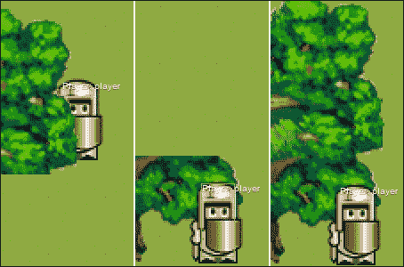
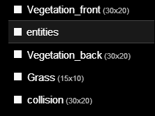
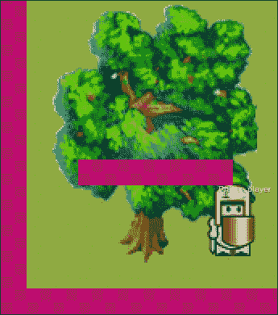
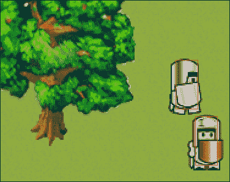
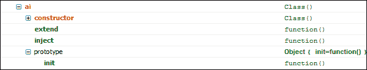
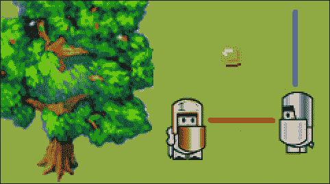
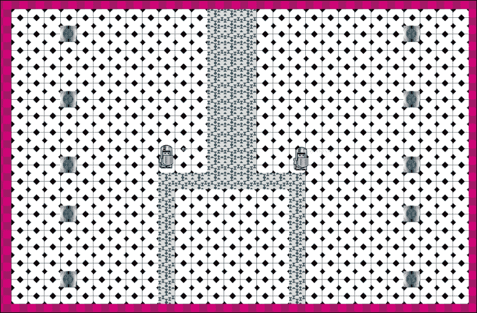
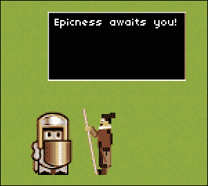

# 第三章：让我们建立一个角色扮演游戏

在上一章中，我们看了几个关键概念，并逐一放大它们，基本上忽略了它们的基本依赖关系。现在我们将逐步构建一个游戏。在本章中，我们将看看 RPG，而在第四章中，我们将深入研究侧面滚动游戏。

在本章中，我们将涵盖：

+   RPG 游戏格式及其可能的子格式

+   为玩家建立一个实际的探索级别，并将其与其他级别连接起来

+   向游戏中添加可玩实体、可杀但危险的敌人和中立的健谈角色

+   将您的玩家变成一个不可忽视的力量，通过添加武器和有用的物品

+   通过赋予敌人基本的人工智能，为玩家的敌人增加一些深度

+   跟踪游戏中的一些变化，比如收集硬币

+   通过让玩家与更强大的敌人对抗来结束游戏

# RPG 游戏设置

在深入研究 RPG 游戏设置之前，最好看一看一些成功的 RPG，并看看我们可以从中学到什么。有一些很好的例子：《塞尔达传说》，《最终幻想》，《宝可梦》，《魔兽世界》，《泰比亚》，《博德之门》，《无冬之夜》等等。这个列表几乎是无穷无尽的。是什么让所有这些游戏如此成功呢？嗯，总是有营销因素，但没有游戏可以仅凭营销而获得永恒的名声。那么，他们对目标受众的*独特游戏主张*是什么？游戏评论员经常将他们的分数分配到几个类别，如游戏性、图形、声音等。这些都是有效的观点，但为什么不看看上瘾性呢？即使是最简单的游戏也可能会上瘾。如果你曾经去过拉斯维加斯，目睹了成堆的人在不需要任何技能的老虎机上玩了几个小时，你就会明白游戏心理学有些特别。

上瘾当然是很棒的，如果你提供一个免费游戏，并希望通过游戏内广告或重复订阅费用赚钱。另一种方法是使游戏引人入胜，但是有终点。这些是你实际上可以“完成”的游戏。它们通常在游戏的主角和反派之间有一个有趣的故事。当反派被打败时，游戏就结束了，作为玩家，你不太可能再去玩它。一个例子就是《最终幻想》系列中的每个游戏。

除了**大型多人在线角色扮演游戏**之外，大多数 RPG 都属于第二类。它们通常有一个迷人的故事和迷人的音乐。角色非常有趣和深刻。战斗系统非常直观，但足够复杂，以至于有人可以擅长或不擅长。真正优秀的游戏往往会给玩过的人留下深刻的印象，而且需要付出大量的工作才能完成。

这是看待 RPG 的标准方式。然而，这绝不应该阻止你刷新这个类型，并将其他类型的元素或全新的想法融入其中。例如，《无主之地》是 RPG 和射击游戏的混合体。它具有像大多数 RPG 那样的等级进展和武器增强。它有一个故事，同时仍然像射击游戏一样玩。

游戏不需要混合两种电脑类型。**我的世界**本质上是在电脑上玩乐高的乐趣。

归根结底，就是要找出自己最喜欢的或小时候非常喜欢的东西。找出其中的机制，并尝试在游戏中复制那种感觉。这当然比说起来容易得多。然而，有必要经历这个过程，因为建立游戏需要花费你的时间，如果它甚至不是你自己想玩的游戏，为什么别人会想要呢？

对于 RPG 游戏来说，通常会比简单找到原创的游戏组件更加复杂。RPG 视频游戏可以是一本好书和一部电影的结合，同时具有互动性的优点。如果你是一个很好的故事讲述者，或者认识一个，为什么不这样做呢？游戏并不需要难以或者图形完美才能吸引人们玩。一个很好的例子是《最终幻想 VII》，它在 1990 年代大获成功。2012 年，它以“优化图形”的形式重新发行。实际上并没有太大的区别；一个不经训练的眼睛不会立即注意到这种优化。但它仍然是一款很棒的游戏，尽管它无法与《上古卷轴》或《寓言》等游戏的复杂性和图形辉煌相竞争。

这就是你应该追求的目标：以尽可能少的复杂性打包你想要的*核心乐趣*，并添加快乐、柔和的图形。快乐的图形很棒。不，说真的，如果你想让你的游戏散发出黑暗和恐惧，那也可以，但除此之外，一定要考虑一些微笑的云和疯狂的动物。

# 构建一个 RPG 关卡

现在是时候开始组建我们自己的小型 RPG 了。我们将从零开始我们的旅程。以下是构建 RPG 关卡的步骤：

1.  让我们复制我们在`第一章`文件夹中保留的新安装的`ImpactJS`文件夹，并将其重命名为`RPG`。将`第三章`文件夹中的`media`文件夹复制到你的`RPG/media`文件夹中。这样至少我们有一些图形可以使用。

1.  回到当你在浏览器中输入`localhost/RPG`时得到的**它起作用了！**屏幕。

1.  让我们从打开 Weltmeister（`localhost/Weltmeister.html`）并绘制一个小关卡开始。

1.  这一次你会注意到没有为你准备好任何东西。唯一可用的层是`entities`层，甚至连一个实体都没有。然而，一旦我们有了一些东西来填充世界，我们就可以画一个小的游戏场地来开始。

1.  所以让我们添加另一个层（*+-*符号）并将其命名为`grass`。让我们将瓷砖大小设置为`16`，并在距离 1 像素处有一个 30 x 20 的区域。选择瓷砖集`grass.png`，然后点击**应用更改**按钮，然后你就可以开始铺设草坪了。

1.  如果你的绘图框没有完全居中，按住*Ctrl*键并移动鼠标直到它居中。如果由于某种原因它太大而无法适应你的屏幕，可以用鼠标滚轮缩小。

1.  一旦我们把整个层都涂成绿色，我们就可以轻松地添加另一个层放在草坪上。但在这样做之前，将你的文件保存为`level1`。经常保存是一种美德。

1.  在添加层时，你可以根据它们应该代表的内容进行命名和使用。例如，你可以有一个家具、植物和杂项物品的层。这是一个不错的工作方式，但你必须记住，一些层在视觉上会出现在你的玩家和怪物实体的前面，而其他层则会出现在它们的后面。即使是一个简单的墙最好也用两层来绘制。

### 提示

Weltmeister 不支持无限数量的层。为了保持层的数量可观，你可以为特定的关卡设置瓷砖集。例如，你有两个关卡设置：城市和地牢。两者都可以包含一把椅子，所以不要害怕在城市的瓷砖集上放置相同的椅子，也在不同的瓷砖集上构建你的地牢。重复信息会增加你的整体游戏大小，但可以减少单个关卡所需的层数。

我们的草地只叫`grass`，因为我们不会有草地漂浮在玩家面前；因此我们不需要第二层草地。让我们创建两个新图层，分别叫做`vegetation_back`和`vegetation_front`。`vegetation_back`必须在图层选择菜单中的`entities`图层下面。`vegetation_front`必须放在`entities`图层上面。这两个新图层一起将构成地图上的所有植被。

选择图块集`tree.png`，并为`grass`图层使用相同的设置。

使用`vegetation_front`图层绘制树的上部，使用`vegetation_back`绘制下部。以下屏幕截图显示了不同的图层：



你的 Weltmeister **Layers**菜单中应该有以下图层：



如果你不知道任何东西的上部或下部应该是什么，想想你的玩家和/或敌人有多大。当走过树时，他们的头或脚不应该消失。为了避免玩家完全穿过树，我们需要另一个图层，碰撞图层。

在 Weltmeister 中添加一个名为`collision`的图层。

不要忘记，你可以通过将图层拖到图层堆栈的顶部或关闭挡住视野的图层来在 Weltmeister 中使图层可见。在这种情况下，如果碰撞图层在堆栈的底部，`grass`图层可能会挡住所有的视野。将`collision`图层拖到顶部并在必要时打开和关闭它是非常有效的。设置图层的设置与以往一样。

使用`collision`图层，在关卡周围绘制边界，这样就没有人可以逃跑了。还在树干下面或上面的分界线附近放一些碰撞方块，如下图所示：



所以我们创建了一个可行的环境。虽然不多，但这是一个开始。然而，为了加载关卡，我们需要对我们的`main.js`脚本进行更改，如下面的代码片段所示：

```js
.requires(
  'impact.game',
  'impact.font',
  'game.levels.level1'
)
init: function() {
  // Initialize your game here; bind keys etc.
  this.loadLevel(LevelLevel1);
},
```

为了确保我们的游戏能找到关卡，我们需要在模块的`.requires`部分包含它。我们需要以与任何文件相同的方式指向它，从我们的游戏根文件夹开始。唯一的区别是斜杠(`/`)被点(`.`)替换，而包含的文件本身总是被认为有`.js`扩展名。例如，`/game/levels/level1.js`变成了`game.levels.level1`。

我们还需要在游戏启动时加载关卡，所以让我们在`init()`函数中添加一个`loadlevel()`方法。不要忘记，调用这个函数的参数总是以下形式：

大写字母的`Level + Levelname`。其他任何形式都会导致游戏崩溃。

我们现在有一个加载的关卡，但它没有任何交互性；我们还没有玩家。尽管在屏幕上始终显示**it works!**相当激励，但也会轻微地阻碍我们的视野。所以让我们从`main.js`中删除以下代码，然后继续使用以下代码来创建我们的`player`实体：

```js
var x = ig.system.width/2,
var y = ig.system.height/2;
this.font.draw( 'It Works!', x, y, ig.Font.ALIGN.CENTER );
```

总结前面的内容，步骤如下：

1.  我们需要从头开始构建我们的游戏。因此，我们需要最初下载的 ImpactJS 文件。将它们放在服务器工作目录的一个单独文件夹中。还要测试一下是否收到了**it works!**消息。

1.  将`chapter 3`文件夹的`media`文件添加到你刚刚设置的文件夹中。

1.  打开 Weltmeister 关卡编辑器并创建一个分层关卡。你需要一个碰撞图层，一个实体图层和三个图形图层。底部的图形图层将代表草地。其他两个图层代表所有其他在玩家前面或后面出现的对象。

1.  绘制图形图层。

1.  在你的`main`脚本中包含关卡文件。

1.  从`main`脚本中删除`it works!`消息。

# 添加可玩角色

为了从头开始构建我们的玩家，我们需要一个新的（并且是空的）`.js`文件。在你的代码编辑器中创建一个新文件，即使它是空的，也将其保存为`entities`文件夹中的`player.js`。

每个模块都是以相同的方式开始的。它由`ig.module()`，`ig.requires()`和`ig.defines()`方法组成。对于一些模块，你不需要`requires()`方法，但所有实体都需要，因为在这里你需要包含实体的`impact`脚本，如下面的代码片段所示：

```js
ig.module('game.entities.player')
.requires(
'impact.entity')
.defines( function(){
  EntityPlayer = ig.Entity.extend({
  });
});
```

我们将根据`prototype`实体构建玩家。这个原型有几个属性（比如`health`和`velocity`）和几个方法（比如`kill()`和`receiveDamage()`）预定义。这样我们只需要用`extend()`方法扩展原始版本，就可以创建我们的玩家了。

这里有一些规则。如果你的 JavaScript 文件叫做`player.js`，你的实体将被称为`Player`。你可以通过在其名称前面添加`Entity`，将其分配给`entity`原型的扩展，如前面的代码所示。

### 提示

任何与命名约定的偏离都将从 Weltmeister **Entities**菜单中移除实体。将实体添加到 Weltmeister 编辑器时，如果命名正确，加载游戏时命名错误将导致崩溃。

还不要忘记在`main.js`中的`requires()`方法中包含`player`实体。只有当`main`模块知道其存在时，模块才能被使用。以下代码显示了扩展`.player`被分配给`entities`文件夹：

```js
'game.entities.player'
```

如果你现在用 Weltmeister 添加`player`实体到游戏中，你会注意到什么也看不到。玩家还没有视觉表示，我们将在下面的代码中解决这个问题：

```js
EntityPlayer = ig.Entity.extend({
  size: {x:32,y:48},
  health: 200,
  animSheet: new ig.AnimationSheet('media/player.png', 32, 48 ), init: function( x, y, settings ) {
    this.parent( x, y, settings );
    // Add the animations
    this.addAnim( 'idle', 1, [0] );
  }
});
```

为了看到我们可玩角色的一瞥，我们需要添加一个动画表，它位于我们的`media`文件夹中。如果你不想看到你的角色只是走来走去的话，动画表需要被分配正确的尺寸。我们还给实体分配了一个大小。动画实际上可以比实体的大小大。如果你不设置大小，你会发现你可以在 Weltmeister 中选择`player`实体，但它的边界并不包含整个图像。这是因为默认大小是 16 x 16。大小是碰撞检测的相关属性。我们还给玩家一些生命值来开始。默认生命值是 10。

我们还面临着`entity`原型的`init()`方法。`entity`原型已经有了自己的`init()`函数，所以最好通过在`init()`函数中调用`parent()`方法来包含它。定义动画表并不会使实体动画化。你需要为动画表分配一个动作。在这里，*空闲*对应于表上的第一张图片。现在你可以安全地将你的玩家添加到地图上了。

太好了，我们的游戏中有了一个玩家！太糟糕了，它还不能移动。让我们现在来解决这个问题。

在`main.js`脚本中，你需要在你的`init()`方法中添加以下内容：

```js
// move your character
ig.input.bind(ig.KEY.UP_ARROW, 'up');
ig.input.bind(ig.KEY.DOWN_ARROW,'down');
ig.input.bind(ig.KEY.LEFT_ARROW,'left');
ig.input.bind(ig.KEY.RIGHT_ARROW,'right');
```

这将确保你的箭头键绑定到一个*输入状态*。从现在开始，游戏将自动检查这些键中是否有任何一个被按下。由于我们在这里正在构建一个俯视游戏，我们需要能够朝任何方向行走。

在`player.js`脚本中，需要在`init()`函数中添加四个新的动画序列，如下面的代码片段所示：

```js
this.addAnim('down',0.1,[0,1,2,3,2,1,0]);
this.addAnim('left',0.1,[4,5,6,7,6,5,4]);
this.addAnim('right',0.1,[8,9,10,11,10,9,8]);
this.addAnim('up',0.1,[12,13,14,15,14,13,12]);
```

虽然`idle`的动画序列由一张图片组成，但现在我们需要为玩家可以行走的每个方向分配一个真正的序列。同样，`0.1`值是图像之间的时间。

此外，你需要调用和扩展`entity`原型的`update()`函数。不要忘记在`init()`和`update()`函数之间加上逗号，否则会出错。

```js
update: function(){
  this.parent();
  //player movement
  if(ig.input.state('up')){
    this.vel.y = -100;
    this.currentAnim = this.anims.up;
  }
  else if(ig.input.pressed('down')) {
    this.vel.y = 100;
    this.currentAnim = this.anims.down;
  }
  else if(ig.input.state('left')){
    this.vel.x = -100;
      this.currentAnim = this.anims.left;
  }
  else if(ig.input.state('right')){
    this.vel.x = 100;
    this.currentAnim = this.anims.right;
  }
  else{
    this.vel.y = 0;
    this.vel.x = 0;
    this.currentAnim = this.anims.idle;
  }
}
```

`update()`函数和`init()`一样，是原型`entity`的标准方法。因此，如果我们不想失去其 ImpactJS 实体核心功能，我们需要调用父函数。

对于每个输入状态，我们需要单独的行为，因此我们有这组*if-then 操作符*。请记住，由于我们将这段代码放在`update()`函数中，它会在游戏每次更新循环时运行，即每帧一次。`init()`函数只会被调用一次，也就是在玩家创建的时候。

在条件检查中，我们做了两件事：在相关轴上分配速度并添加动画。如果玩家什么也不做，那么两个方向上的速度也被设置为`0`，因此玩家需要持续输入才能移动。

我们可以使用`ig.input.pressed`而不是`ig.input.state`。但这将导致我们的玩家不得不通过按钮来穿过关卡。因为每次他或她按下移动按钮时，玩家只会移动一小段距离然后立即停下。在 60 fps 和速度为 100 的情况下，玩家每次触摸只会移动 100/60 = 1.67 像素。尽管`ig.input.pressed`当然有其优点，但以这种方式移动可能会让即使是最有耐心的玩家也感到恼火。

我们终于有了一个优雅移动的可玩角色！它甚至可以躲在我们之前创建的树后面。不过我们手头还有另一个问题，我们不能始终看到我们的玩家。你能想象一个玩家因为看不到自己的位置而被杀死的沮丧吗？我相信你可以，而且如果你过去玩过一些游戏，这种情况可能甚至发生过。不过，我们很幸运，因为一个跟随玩家四处走动的摄像头很容易实现，如下面的代码片段所示：

```js
var gameviewport= ig.game.screen;
var gamecanvas= ig.system;
var player = this.getEntitiesByType( EntityPlayer )[0];
gameviewport.x = player.pos.x - gamecanvas.width /2;
gameviewport.y = player.pos.y - gamecanvas.height /2;
```

正如您在前面的代码中所看到的，两个重要的元素和玩家被分配给了一个本地变量。然后，视口坐标被设置为玩家的位置。如果您希望相机将玩家放在屏幕的左上角，您就不需要游戏画布。但当然，我们希望玩家居中，所以我们通过画布尺寸的一半来调整其位置。

重新加载浏览器后，您会注意到您终于可以走到屏幕底部和树下面。太好了！只是可惜这里没有什么可做的，所以下一步我们将引入一些敌对的东西。

总结前面的内容，步骤如下：

1.  打开一个新的 JavaScript 文件，并将其保存为`player.js`。

1.  使用标准的 ImpactJS 模块代码设置`player.js`脚本。

1.  在`main`脚本中包含`player.js`。

1.  为可玩角色添加动画表和序列，以便在 Weltmeister 中找到它。还为其提供健康和大小。

1.  通过将键盘键绑定到`main`脚本中的输入状态来添加玩家控制。

1.  将这些输入状态绑定到移动角色动作，通过操纵其速度。

1.  通过引入额外的动画序列并在某些输入状态激活时调用它们，使移动看起来像是平滑的动画。

1.  放置一个自动跟随玩家四处走动的摄像头。

# 引入一个可击败的对手

同样，我们将不得不从头开始，因此打开一个空的 JavaScript 文件，并将其保存为`enemy.js`。

实体创建的开始总是相同的。设置您的`Entity`文件并将`enemy`实体添加到您的`main`脚本中。

在`main.js.requires`中添加以下代码：

```js
'game.entities.enemy',
```

在`enemy.js`中添加以下代码：

```js
ig.module('game.entities.enemy')
.requires('impact.entity')
.defines(function(){
  EntityEnemy = ig.Entity.extend({
  }); 
});
```

添加前面的代码片段创建了我们的实体，我们可以通过 Weltmeister 将其添加到关卡中。不过它还是相当无用的，所以让我们首先使用以下代码添加一些图形：

```js
size: {x:32,y:48},
animSheet: new ig.AnimationSheet('media/enemy.png',32,48),
init: function(x, y , settings){
  this.addAnim('idle',1,[0]);
  this.addAnim('down',0.1,[0,1,2,3,2,1,0]);
  this.addAnim('left',0.1,[4,5,6,7,6,5,4]);
  this.addAnim('right',0.1,[8,9,10,11,10,9,8]);
  this.addAnim('up',0.1,[12,13,14,15,14,13,12]);
  this.parent(x,y,settings);
}
```

现在我们可以将我们的第一个敌人添加到关卡中。不过它不会做太多事情，甚至你甚至可以穿过他走。这是因为实体之间还没有指定碰撞。

将以下代码添加到`player`和`enemy`实体作为属性。您可以使用旧的 JavaScript 表示法在`init()`函数中添加它们，或者在文字表示法中在`init()`上方添加，如下面的代码所示。

以下代码是用于玩家的：

```js
collides: ig.Entity.COLLIDES.ACTIVE,
type: ig.Entity.TYPE.A,
checkAgainst: ig.Entity.TYPE.B,
```

以下代码是用于敌人`entity`的：

```js
collides: ig.Entity.COLLIDES.PASSIVE,
type: ig.Entity.TYPE.B,
checkAgainst: ig.Entity.TYPE.A,
```

现在我们可以像真正的恶霸一样推动我们的敌人在关卡中四处走动。您可能已经注意到玩家和敌人之间仍然有一些空间。这是因为实体的边界是矩形，远远超出了实际的绘图范围。当视觉上并非如此时，玩家被敌人击中是非常恼人的。为了纠正这种情况，我们需要将`offset`引入为玩家属性。`size`属性确定了实体周围的碰撞框的大小。`offset`属性使您的碰撞框向右或向下移动几个像素。当然，您可以在一个点输入一个负数，它将向左和/或向上移动。我们需要结合这两个属性来为玩家制作一个新的碰撞框，使他更难被击中。但是，在继续之前，通过在`main.js`脚本的`requires()`方法中添加以下代码行来打开 ImpactJS 调试器是有用的：

```js
 'impact.debug.debug',
```

在开发过程中保持调试器打开是一个好习惯。当准备发布时，您可以再次删除此代码。让我们使用以下代码更改玩家和敌人的大小和偏移：

```js
size: {x:18,y:40},
offset: {x: 7, y: 4},
```

实际图像大小为 32 x 48。我们将两个实体的大小都改为`18` x `40`，偏移为`7` x `4`。如果您在**Entities**选项卡上打开调试器并打开**显示碰撞框**，您会注意到大小的差异。您还可能注意到静态碰撞，例如我们添加到树中间的碰撞层的正方形不可见，因为它只显示实体的碰撞，如下面的截图所示：



没有设置碰撞框的完美规则。这完全取决于您的图像有多好地居中和对称，当涉及到碰撞时您有多宽容，以及前视和侧视之间的图像大小差异。在这里，我们选择将我们的宽度减小 14 像素（32-18）。为了保持框居中，偏移设置为差值的一半（（32-18）/2 = 7）。相同的推理适用于 y 轴。

现在我们有了一个敌人。让我们杀了它！

总结前面的内容，步骤如下：

1.  打开一个新的 JavaScript 文件并将其保存为`enemy.js`。

1.  使用标准的 ImpactJS 模块代码设置`enemy.js`脚本。

1.  在您的`main`脚本中包含`enemy.js`。

1.  添加一个动画表和几个动画序列，考虑到敌人可能行走的每个方向。

1.  更改玩家和敌人的`碰撞`实体。它们需要能够检测到彼此的存在，以便敌人以后可以伤害玩家。

1.  如果您还没有这样做，请通过在您的`main`脚本中包含它来打开 ImpactJS 调试器。目的是看到实体的碰撞框。

# 给玩家一些武器

我们喜欢我们的玩家武装起来，准备行动。让我们首先添加一个新的按键用于攻击。在`main.js`中添加以下键绑定：

```js
ig.input.bind(ig.KEY.MOUSE1,'attack');
```

在任何战斗情况下，造成伤害的是两个物体的碰撞。如果箭射中目标，造成伤害的是箭，而不是弓。同样的道理适用于核导弹。造成伤害的不是发射设施，而是核弹的爆炸冲击波与任何阻挡在其路径上的物体的碰撞。在这方面，我们可以说这里有三个实体在起作用：发射设施、核弹和其爆炸冲击波。如果你想区分空气压力和实际的大火，甚至可以再添加一个实体。所有这些只是为了展示在向游戏中添加武器时应该如何思考。哪种影响是相关的？在鸡和鸡发射器的情况下，鸡将成为一个实体，而发射器只是一个简单的绘图。

## 生成一个 projectile

对于我们的远程攻击，我们需要一个新的实体，我们将其称为`projectile`。创建一个新的脚本，设置基础，将其保存为`projectile.js`，并在`main.js`中包含它。

在`main.js`中包含以下代码：

```js
'game.entities.projectile',
```

在`projectile.js`中包含以下代码：

```js
ig.module('game.entities.projectile')
.requires('impact.entity')
.defines( function(){
  EntityProjectile = ig.Entity.extend({
    size: {x:8,y:4},
    vel: {x:100,y:0},
    animSheetX: new ig.AnimationSheet('media/projectile_x.png',8,4),
    animSheetY: new ig.AnimationSheet('media/projectile_y.png',4,8),
    init: function(x, y , settings){
      this.parent(x,y,settings);
      this.anims.xaxis = new ig.Animation(this.animSheetX,1,[0]);
      this.anims.yaxis = new ig.Animation(this.animSheetY,1,[0]);
      this.currentAnim = this.anims.xaxis;
    }
  })
});
```

好吧，基础看起来似乎并不那么基础。这一次，我们有两个不同的动画表。箭往往比宽度长得多。因此，如果箭从左到右（或从右到左）射出，其尺寸与从上到下射出的箭不同。在定义动画表时，我们只需要一次定义每个图像的尺寸。然而，在这种情况下，我们需要两种不同的尺寸：`8` x `4`和`4` x `8`。实际上，在这种特殊情况下，还有另一种可能更简单的解决方案，涉及动画的角度。在编程语言中，通常有不同的方法来获得相同或类似的结果。然而，现在我们将使用多个动画表。

我们定义了两种不同的动画表。我们将它们命名为`animSheetX`和`animSheetY`，而不是在标准的`animSheet`属性上初始化它们，以表示不同的轴。`init()`函数不像`Player`和`Enemy`实体那样调用`addAnim()`方法，因为它是按默认设置为`animSheet`属性。相反，我们直接调用`ig.animation`，可以传递我们自己的动画表。如果您想在 Weltmeister 中添加一个箭头，那么`currentAnim`属性将默认给出 x 轴动画序列。

现在我们只需要让玩家生成箭。因此，我们需要在玩家的`update()`函数中添加以下内容：

```js
if(ig.input.pressed('attack')) {
  ig.game.spawnEntity('EntityProjectile',this.pos.x,this.pos.y);
}
```

箭将在玩家的位置生成。

在这一点上运行游戏时，箭只能朝一个方向飞行：向右。这是因为我们的默认速度设置为每秒`100`像素向右。而且我们的默认动画是箭头向右。

这并不完全是我们想要的。我们的敌人必须始终在我们的右侧，我们才能杀死他们。因此，让我们通过在`init()`函数中添加以下代码来修改 projectile 代码：

```js
if (this.direction == 'right'){
  this.vel.x = this.velocity;
  this.vel.y = 0;
  this.currentAnim = this.anims.xaxis;
  this.anims.xaxis.flip.x = false;
}
else if (this.direction == 'left'){
  this.vel.x = -this.velocity;
  this.vel.y = 0;
  this.currentAnim = this.anims.xaxis;
  this.anims.xaxis.flip.x = true;
}
else if (this.direction == 'up'){
  this.vel.x = 0;
  this.vel.y = -this.velocity;
  this.currentAnim = this.anims.yaxis;
  this.anims.yaxis.flip.y = false;
  }
else if (this.direction == 'down'){
  this.vel.x = 0;
  this.vel.y = this.velocity;
  this.currentAnim = this.anims.yaxis;
  this.anims.yaxis.flip.y = true;
}
```

按照以下代码显示`velocity`作为一个属性：

```js
velocity: 100,
```

现在发生的是，如果箭头的方向是右、左、上或下，它将相应地调整其速度和动画。这里只有两个图像在起作用，一个箭头指向上方，一个指向右边，每个都在其单独的动画表中。我们可以向每个表中添加一个额外的图像，一个指向下的箭头，一个指向左边。这将是一个可行的解决方案，但在这里我们选择使用翻转属性。翻转基本上是制作动画的镜像图像，使箭头指向完全相反的方向。在使用翻转时，您必须确保翻转图像而不是使用单独的图像是有意义的。例如，如果您有一个从左到右奔跑的角色，并且希望使其从右到左奔跑，使用翻转是可以接受的。对于朝向您或远离您奔跑的角色，这并不起作用，因为您期望看到他们的正面或背面。

这一切都很好，但它的*方向*从哪里得到呢？让我们用默认值初始化方向，然后修改玩家，使其可以将自己的方向传递给抛射物。

将以下代码添加到`projectile.js`：

```js
direction: 'right',
```

对`player.js`执行以下操作：

对于每个方向，添加一个名为`lastpressed`的变量，其值与输入状态相同，如下面的代码片段所示，用于向右移动：

```js
else if(ig.input.state('right')){
  this.vel.x = 100;
  this.currentAnim = this.anims.right;
  this.lastpressed = 'right';
}
```

使用以下代码使`spawnEntity`方法传递方向参数：

```js
if(ig.input.pressed('attack')) {
  ig.game.spawnEntity('EntityProjectile',this.pos.x,this.pos.y,{direction:this.lastpressed});
}
```

太棒了！我们现在的英雄可以像老板一样朝各个方向射箭。目前，我们的箭头仍然相当坚固，对我们幸运的敌人来说相当无害。它们只是击中我们关卡的边缘，永远停留在那里，或者直到游戏重新加载。

总结前面的内容，步骤如下：

1.  打开一个新的 JavaScript 文件，并将其保存为`projectile.js`。

1.  设置`projectile.js`脚本。给它两个动画表。

1.  将`projectile`脚本添加到`main`脚本中。

1.  更改玩家的`update`函数，以便玩家在激活`attack`输入状态时可以生成一个抛射物。

1.  根据玩家射击时面对的方向，调整抛射物的方向和动画。

1.  确保在生成时将玩家的方向传递给`projectile`脚本。这是通过填写标准 ImpactJS 实体的可选参数：`spawn`函数来完成的。

## 用抛射物造成伤害

我们可以使用以下代码使箭头在击中敌人或在空中一段时间后消失：

```js
lifetime: 0,
update:function(){
  if(this.lifetime<=100){this.lifetime +=1;}else{this.kill();}
  this.parent();
}
```

在`0`处初始化一个名为`lifetime`的新属性，并在`update()`函数中使用`kill()`函数添加一个计数器，将使箭头在飞行了`100`帧后消失。再次，不要忘记用逗号（`,`）分隔`init()`和`update()`函数，否则文字表达式不会原谅您。

为了对敌人造成伤害，我们需要让箭头检查它是否遇到了敌人。我们将箭头设置为`TYPE A`实体，就像`player`实体一样，并让它检查`TYPE B`实体，就像以下代码中的`enemies`实体一样：

```js
collides: ig.Entity.COLLIDES.NONE,
type: ig.Entity.TYPE.A,
checkAgainst: ig.Entity.TYPE.B,
```

通过添加`check()`函数，我们可以使箭头检查它需要检查的每个实体（由`checkAgainst`属性设置）。如果遇到类型为`B`的实体，该实体将受到`100`的伤害，如下面的代码片段所示：

```js
check: function(other){
  other.receiveDamage(100,this);
  this.kill();
  this.parent();
}
```

现在我们仍然没有解决箭头在关卡边缘或任何其他地图碰撞存在的地方露营的问题。所以让我们制作一些反弹的箭头！别担心，我们确保它们不会伤害玩家，因为它们只会检查类型为`B`的实体，并且会直接穿过我们的玩家。

首先将`bounciness`设置为`1`，这意味着在反弹时保持所有速度，使用以下代码：

```js
bounciness: 1,
```

现在我们只需要检查速度是否已经反转（如果箭已经反弹），并在必要时反转动画。当然，这需要在`update()`函数中完成，如下面的代码片段所示，因为它可能随时发生：

```js
if (this.vel.x< 0 &&this.direction == 'right'){this.anims.xaxis.flip.x = true;}
else if (this.vel.x> 0 &&this.direction == 'left'){this.anims.xaxis.flip.x = false;}
else if (this.vel.y> 0 &&this.direction == 'up'){this.anims.yaxis.flip.y = true;}
else if (this.vel.y< 0 &&this.direction == 'down'){this.anims.yaxis.flip.y = false;}
```

这是一个非常天真的检查，因为它依赖于箭的速度在反弹后仍然保持不变的假设。然而，为了保持示例简单，它将起作用。

我们甚至没有设置敌人的`health`值，我们就已经能够伤害和杀死它了。这是因为默认情况下，实体的`health`值被设置为`10`。让我们更改这个属性，这样我们的敌人至少能够在第一次受到攻击时存活。

根据`enemy.js`中的以下代码进行更改：

```js
health: 200,
```

我们的敌人变得更难击败了，但并不是说他对我们构成挑战。是时候开始学习一些基本的**AI**或**人工智能**了。

总结前面的内容，步骤如下：

1.  将项目的最大寿命添加到你的抛射物中，这样它就不会永远留在游戏中。

1.  添加实体碰撞检测，使其能够与敌人碰撞。

1.  设置抛射物的“检查”功能，使得当抛射物与敌人碰撞时，抛射物被摧毁，敌人受到伤害。

1.  添加“弹性”以便它可以从墙上弹开。

1.  设置敌人的`health`属性，使其不会被第一个抛射物击中。

# 用人工智能让你的 NPC 活起来

人工智能可能是游戏中最复杂的元素之一，如果不是*最*复杂的。顾名思义，AI 是人工或模拟的智能。游戏中的实体需要对玩家对它们或它们的环境所做的事情做出反应。在编写 AI 时，实际上是在尝试将人脑或更强大的东西放入计算机中。对于策略游戏，AI 可以决定游戏玩法的成败，因为它是在玩离线的小规模比赛时保持玩家参与的因素。对于其他类型的游戏，比如 2D 射击游戏，你可能会满足于敌人不仅仅只是向你开火。复杂的 AI 问题在于它需要考虑太多的参数，以至于一个程序员几乎无法理解。让我们将其分为三种类型：

+   **单一策略 AI**

+   **多策略 AI**

+   **数据驱动 AI**

**策略**是实体在特定情况下遵循的行为模式。当敌人健康时，它可以全力冲向你，但当受伤严重时，它会撤退并寻找一个安全的地方来治疗自己。这是使用两种不同策略的一个例子，而*单一策略*的敌人可能会一直攻击你，直到它死掉，不管自己的生命如何。

*数据驱动 AI*是完全不同的东西。它不是硬编码的行为，而是需要大量玩家数据，这些数据被上传到一个单一的位置。在那里，数据被处理，并且统计程序，如回归，决策树建模和神经网络被应用，以使 AI 在未来更加有竞争力。你得到的是一个学习实体，它变得越来越难击败，并根据模型的预测自动发明新的策略。对一些人来说，计算机能够学习和适应行为的想法可能相当可怕。然而，这是当今的现实，未来肯定会带来越来越聪明的 AI。计算机是否最终会像《终结者》和《黑客帝国》中的电影那样接管世界，还有待观察。

现在我们将忘记所有那些数据驱动的统计解决方案，只看一个单一策略的 AI。

在编写 AI 时，我们希望在决策和实际行为之间保持清晰的分工。你可以把它看作是人类大脑和身体之间的分工。大脑做出决定并向身体发送脉冲来执行动作。因此，我们将在一个单独的模块中编写我们的“大脑”，而敌人能够执行的动作将留在`enemy`实体本身作为方法。

## NPC 的行为

创建一个新的脚本，命名为`ai.js`，并将其保存在`plugins`文件夹下，如下面的代码片段所示：

```js
ig.module('plugins.ai').
defines(function(){
  ig.ai = ig.Class.extend({ 
  })
})
```

我们首先定义我们全新的模块，我们的第一个插件。不要忘记在我们的`main.js`中要求脚本，如下面的代码所示：

```js
'plugins.ai',
```

AI 需要给实体下达命令。为了实现这一点，它们需要使用共同的语言。就像你的腿需要解释你的神经信号一样，我们的敌人需要在任何给定时间解释它需要执行的动作。我们在`init()`函数中定义这些命令，如下面的代码片段所示：

```js
init: function(entity){
  ig.ai.ACTION = { Rest:0,MoveLeft:1,MoveRight:2,MoveUp:3,MoveDown:4,Attack:5,Block:6 };
  this.entity = entity;
}
```

`action`数组包含`AI`模块可以发送的所有可能动作。`init()`函数以它需要命令的实体作为输入。并不需要像前面的代码片段中所示那样为`this.entity`分配一个实体（`this.entity=entity;`），但这仅仅是确认`this`不是实体本身，而是它的 AI。输入参数`entity`不是分配给`this`而是分配给`this.entity`，这将使得可能拥有一个集体的`ai`，也能够为整个敌人群体做出决策。这种集体 AI 或蜂群思维将在第五章中讨论，*为你的游戏添加一些高级功能*。

如果你现在在 Firefox 的 Firebug DOM 中查看，你可以看到`AI`类作为`ig`对象的一部分，它目前只包含我们刚刚编写的`init()`函数。在编写代码时，跟踪 DOM 的演变是一个好主意。



现在我们已经定义了我们将发送的信号，让我们看看它们最终会到达哪里。打开`enemy.js`脚本，并向其中添加以下`update()`函数：

```js
update: function(){
/* let the artificial intelligence engine tell us what to do */
  var action = ai.getAction(this);
/* listen to the commands with an appropriate animation and velocity */
  switch(action){
    case ig.ai.ACTION.Rest:
    this.currentAnim = this.anims.idle;
    this.vel.x = 0;
    this.vel.y = 0;
    break;
    case ig.ai.ACTION.MoveLeft:
    this.currentAnim = this.anims.left;
    this.vel.x = -this.speed;
    break;
    case ig.ai.ACTION.MoveRight :
    this.currentAnim = this.anims.right;
    this.vel.x = this.speed;
    break;
    case ig.ai.ACTION.MoveUp:
    this.currentAnim = this.anims.up;
    this.vel.y = -this.speed;
    break;
    case ig.ai.ACTION.MoveDown:
    this.currentAnim = this.anims.down;
    this.vel.y = this.speed;
    break;
    case ig.ai.ACTION.Attack:
    this.currentAnim = this.anims.idle;
    this.vel.x = 0;
    this.vel.y = 0;
    ig.game.getEntitiesByType('EntityPlayer')[0].receiveDamage(2,this);
    break;
    default: 
    this.currentAnim = this.anims.idle;
    this.vel.x = 0;
    this.vel.y = 0;
    break;
  }
  this.parent();
}
```

我们可以将所有的行为写在单独的方法中，然后使用`AI`命令来查看它们是否需要做些什么。然后，这些方法可以放在实体的`update()`函数中，以保持其命令的最新状态。在这种情况下，我们不打算将这些行为分成方法。因为在这种情况下，事情并不太复杂，所有的行为代码都将适应`update()`函数，而不会创建中间方法。

`update()`函数现在由两个主要部分组成：*调用 AI 模块*来接收它需要执行的动作和*实际执行动作*。

通过调用`ai.getAction()`方法，将动作存储在名为`action`的局部变量中。然而，为了做到这一点，我们需要在敌人的`requires`函数旁边添加 AI 到`impact`实体代码中，如下面的代码片段所示：

```js
.requires('impact.entity','plugins.ai')
```

还要给你的敌人一个速度参数，如下面的代码所示，因为 case 语句使用它来设置它们的移动：

```js
speed:50
```

我们在`AI`模块中定义的所有操作都在`update()`函数中表示。为了使一系列案例检查更有效，每个操作的末尾都插入了一个 break。这样，一旦一个操作与案例匹配，它就会停止检查其他案例是否匹配。我们知道我们只想在每个给定时间给出*一个命令*，所以这是有道理的。由于`update()`函数中的所有代码将在每秒调用 60 次，如果游戏以 60 帧的帧速率运行，应尽可能高效地编写。我们的四个操作都是朝着正确的方向移动，然后我们有`attack`和`rest`。为了确保处理每种情况，设置了一个`default`值。这样，如果敌人收到他不理解的命令，他就会原地不动。如果你愿意，你可以重写代码的`default`部分，并用`attack`案例覆盖它；这样，如果敌人不明白他需要做什么，他就会一直攻击；野蛮但有效。

如果敌人攻击，他会调用玩家的`receive damage`函数。这很有趣，因为玩家的`receive damage`方法可以在`player.js`中被重写，以包含来自盔甲等的伤害减少。

然而，现在让我们看一下实际的大脑或决策本身。因此，我们需要回到我们的`AI`模块。

总结前面的内容，结论如下：

+   实体的 AI 是其基于外部输入做出决策的能力，通常使用多种策略

+   在代码中，决策应尽可能与实际行为分开

总结前面的内容，步骤如下：

1.  打开一个新的 JavaScript 文件，并将其保存为`ai.js`。类比于人体，这个文件将包含关于大脑的一切。

1.  将`ai.js`脚本设置为 ImpactJS 类扩展。

1.  在你的`main`脚本中包括`ai.js`。

1.  定义将行为决策与实际行为绑定的语言。类比于人体，这些将是你的神经系统传输的电脉冲。

1.  为敌人将遵循的每个命令构建实际的行为模式。类比于人体，这将是身体对某些神经冲动的反应。

1.  包括调用 AI 命令的函数。类比于人体，这个函数调用将是神经本身。

## NPC 的决策过程

我们刚刚看到 AI `getAction()`方法被调用，但尚未完全解释。它的主要目的是在调用时返回一个动作。这里可能的动作是朝着某个方向移动、攻击、阻挡进攻或根本不移动。采取什么行动是由需要做出决定的`enemy`实体与玩家之间的距离决定，如下面的代码所示：

```js
getAction: function(entity){
  this.entity = entity;
  //by default do nothing
  var playerList= ig.game.getEntitiesByType('EntityPlayer');
  var player = playerList[0];
  var distance = this.entity.distanceTo(player);
  var angle = this.entity.angleTo(player);
  var x_dist = distance * Math.cos(angle);
  var y_dist = distance * Math.sin(angle);
  var collision = ig.game.collisionMap ;
  //if collision between the player and the enemy occurs
  //collision.trace is the way ImpactJS simulates line of sight detection. This will be explained after this block of code.
  var res = collision.trace( this.entity.pos.x,this.entity.pos.y,x_dist,y_dist,
    this.entity.size.x,this.entity.size.y);
  if( res.collision.x){
    if(angle > 0){return this.doAction(ig.ai.ACTION.MoveUp);}else{return this.doAction(ig.ai.ACTION.MoveDown);}
  }
  if(res.collision.y){
    if(Math.abs(angle) >Math.PI / 2){return this.doAction(ig.ai.ACTION.MoveLeft)}else{return this.doAction(ig.ai.ACTION.MoveRight);}
  }
  if(distance < 30){
    //decide between attacking, blocking or just being lazy //
    var decide = Math.random();
    if(decide < 0.3){return this.doAction(ig.ai.ACTION.Block);}
    if(decide < 0.6){return this.doAction(ig.ai.ACTION.Attack);}
    return this.doAction(ig.ai.ACTION.Rest);
  }
  if( distance > 30 && distance < 300) {
    //if you can walk in a straight line: go for it
    if(Math.abs(angle) <Math.PI / 4){ return this.doAction(ig.ai.ACTION.MoveRight); }
    if(Math.abs(angle) > 3 * Math.PI / 4) {return this.doAction(ig.ai.ACTION.MoveLeft);}
    if(angle < 0){return this.doAction(ig.ai.ACTION.MoveUp);}
    return this.doAction(ig.ai.ACTION.MoveDown);
  }
  return this.doAction(ig.ai.ACTION.Rest);
}
```

将此函数添加到`AI`模块中。就像`init()`函数一样，它以实体作为输入参数。一系列局部变量被计算出来，以决定需要采取什么路径才能到达玩家。敌人需要知道与玩家的距离和朝向玩家的角度。使用`collision.trace()`方法计算碰撞。这个方法的输入是实体的`position`、`size`和到目标的`distance`，在这种情况下是玩家。在这里，你不应该把碰撞看作真正的物理碰撞，而应该把它看作视线。`res.x.collision`应该被解释为“如果我在屏幕上水平看，玩家是否在视线中？”

以下截图显示了敌人的视线：



如果是这样，就不再需要上下移动。对于 y 轴和左右移动也是同样的道理。这只是为了向你展示这个函数是如何工作的，省略了前两个`if`语句，并且`res`变量的计算仍然会得到相同的结果，因为接下来的两个`if`语句的逻辑。

在此之后检查敌人和玩家之间的距离。如果敌人足够接近可以攻击（这在`30`像素处硬编码），敌人就会攻击。这个截止点可以通过读取敌人的实际范围并使用它来代替`30`来改变。此外，敌人每帧有一次攻击的机会；这样一秒钟就会有 60 次攻击。你有没有被一秒钟内被剑击中 60 次？那很疼。我们可以通过增加敌人什么都不做的机会来降低这个频率。通过改变这两件事，代码可能看起来像以下的代码片段：

```js
if(distance <entity.range){
  var decide = Math.random();
  if(decide < 0.3){return this.doAction(ig.ai.ACTION.Block);}
  if(decide < 0.02){return this.doAction(ig.ai.ACTION.Attack);}
  return this.doAction(ig.ai.ACTION.Rest);
}
```

当然，你需要改变实际造成的伤害，因为 2 点伤害对于一个有 200 点生命值的玩家来说可能并不那么令人印象深刻或具有挑战性。以下代码片段显示了伤害的变化：

```js
ig.game.getEntitiesByType('EntityPlayer')[0].receiveDamage(40,this);
```

当敌人和玩家之间的距离为 300 时，敌人会朝着玩家移动。如前所述，它使用角度来决定首先朝哪个方向前进。在所有其他情况下，AI 建议实体休息。所以如果玩家很远，敌人就不会攻击。这样你就可以避免被所有敌人同时攻击。如果你的速度更快，你甚至可以逃跑。

还有一件小事。你可能已经注意到，一个动作不会立即返回，而是通过`doAction()`方法发送。以下代码片段显示了如何做到这一点：

```js
doAction: function(action){
  this.lastAction = action;
  return action;
},
```

这个方法也被添加到`AI`模块中，只用于存储实体执行的最后一个动作。你可以不用这个函数，但是跟踪上一次执行的动作通常很方便。这个功能的应用在这个简短的 AI 教程中没有展示出来。

如果你在这一点重新加载游戏，你应该有一个真正试图杀死你的敌人，而不仅仅是像一块石头一样被动。

总结前面的内容，步骤如下：

1.  调用大脑行动是通过我们的`getAction()`函数完成的。这个函数以需要做出决定的实体作为输入参数，并返回一个命令或一个动作。这个函数内部的逻辑可以像你喜欢的那样简单或复杂。在这个例子中，与玩家的距离是决定需要采取的行动的最重要因素。

1.  使用`line of sight` ImpactJS 函数来确定敌人是否能看到玩家。

1.  AI 应该做的是完全主观的事情；尝试添加你自己的命令和行为模式。

# 拾取物品来帮助你的玩家

现在我们的敌人反击了，我们可能需要一些额外的帮助，比如`pickup`物品和额外的武器。

一个有用的`pickup`物品将是一个即时的`healthpotion`实体，这样我们就可以从受到的伤害中恢复。

## 用药水治疗你的玩家

让我们建立一个名为`healthpotion`的实体，并将其包含在`main`脚本`main.js`中，如下所示：

```js
'game.entities.healthpotion',
```

在`healthpotion.js`脚本中包含以下代码：

```js
ig.module('game.entities.healthpotion')
.requires('impact.entity')
.defines( function(){
  EntityHealthpotion = ig.Entity.extend({
    size: {x:32,y:32},
    collides: ig.Entity.COLLIDES.NONE,
    type: ig.Entity.TYPE.B,
    checkAgainst: ig.Entity.TYPE.A,
    animSheet: new ig.AnimationSheet('media /healthpotion.png',20,25),
    init: function(x, y , settings){
      this.parent(x,y,settings);
      this.addAnim('idle',1,[0]);
    },
    check: function(other){
      other.receiveDamage(-500,this);
      this.kill();
    }
  })
});
```

`healthpotion`实体是一个非常直接的实体。除了检测玩家是否触碰它，然后治疗玩家之外，它没有真正的行为。

有趣的是`receiveDamage()`方法如何使用负伤害来治疗目标。这种生命药水在拾取时使用；它不总是这样，有些事情可以通过`gameinfo`数组来计算。

总结前面的内容，步骤如下：

1.  打开一个新的 JavaScript 文件，并将其保存为`healthpotion.js`。

1.  使用标准的 ImpactJS 模块代码设置`healthpotion.js`脚本。

1.  在你的`main`脚本中包含`healthpotion.js`脚本。

1.  添加一个动画表和一个序列。

1.  设置`collision`实体，以便它在玩家触碰它时能够检测到。

1.  使用`receivedamage()`函数并带有负伤害；这将治愈玩家而不是处理伤害。让`healthpotion`实体销毁自身。

## 用硬币变得富有

`coin`实体是我们可能想要计数的物品的一个例子。它与`healthpotion`实体几乎相同，除了名称、动画表和`check`函数不同，如下所示：

```js
check: function(other){
  ig.game.addCoin();
  his.kill();
}
```

不再治疗玩家，而是应用了一个名为`addCoin()`的方法。这个函数还没有起作用，所以你可以把这行代码放在注释中，直到我们在“为玩家反馈保持得分”部分改变它。

首先让我们解决另一个问题。如果你用 Weltmeister 向游戏中添加了`coin`和`healthpotion`实体，你可能已经注意到你实际上可以通过射击它们来杀死`healthpotion`和`coin`实体。如果你不喜欢这种行为，可以通过给每个实体一个唯一的名称来修复，如下面的代码所示：

```js
name: "player",
```

你可以在检查函数中检查它，就像下面的代码所示的那样：

```js
check: function(other){
  if (other.name == "player"){
  //ig.game.addCoin();
  this.kill();
}}
```

现在让我们让我们的得分系统起作用。

总结前面的内容，步骤如下：

1.  打开一个新的 JavaScript 文件，并将其保存为`coin.js`。

1.  用标准的 ImpactJS 模块代码设置`coin.js`文件。

1.  在你的`main`脚本中包含`coin.js`。

1.  添加一个动画表和一个序列。

1.  设置`collision`实体，以便它在玩家触碰它时能够检测到。

1.  当触碰`player`实体时，`coin`实体必须销毁自身并调用`addcoin()`函数，该函数会向游戏信息系统发送反馈。该函数将在本章后面定义，所以在实现时打开它。

# 为玩家反馈保持得分

跟踪一些东西的数量就是将它留在当前加载的游戏之外。这样它可以在关卡之间甚至在游戏之间传递。将以下内容添加到`main.js`中`MyGame`定义的上面：

```js
GameInfo = new function(){
  this.coins = 0;
  this.score = 0;
},
```

`GameInfo.coins`和`GameInfo.score`现在将跟踪我们收集了多少硬币和我们当前的得分。

然而，我们确实需要两个函数，它们实际上会增加这些游戏属性。因此，让我们在`main.js`脚本的`MyGame`定义中添加这些函数：

```js
addCoin: function(){
    GameInfo.coins += 1; //add a coin to the money
},
increaseScore: function(points){
  GameInfo.score +=points;
},
```

现在你可以放心地将`ig.game.addCoin()`方法从注释中取出，而不用担心游戏崩溃。此外，我们可以在敌人死亡时调用`increaseScore`函数。为此，我们需要更改`enemy.js`脚本中敌人的`kill`函数，如下面的代码片段所示：

```js
kill: function(){
  ig.game.increaseScore(100);
  this.parent();
}
```

正如你所看到的，我们通过添加`this.parent()`代码行来保留原始函数，但是在它之前添加了增加得分的代码。

我们不需要局限于只能上升的东西。我们可以限制英雄拥有的抛射物数量，并对其进行计数。将初始抛射物数量添加到`GameInfo`数组中，如下面的代码片段所示：

```js
this.projectiles = 10;
```

我们需要两个新的函数，我们可以像为`addCoin()`和`increaseScore()`一样将它们添加到`MyGame`中。添加这两个函数的代码如下：

```js
addProjectile: function(nbr_projectiles){
  GameInfo.projectiles +=nbr_projectiles;
},
substractProjectile: function(){
  GameInfo.projectiles -=1;
}
```

我们的`player`实体的新攻击代码将如下代码片段所示：

```js
if(ig.input.pressed('attack')) {
  if (GameInfo.projectiles> 0){ ig.game.spawnEntity('EntityProjectile',this.pos.x,this.pos.y,{direction:this.lastpressed});
  ig.game.substractProjectile();
  }
}
```

首先我们检查是否有足够的抛射物，然后发射一个后，从我们的原始堆栈中减去一个`projectile`实体。

太棒了！但是我们如何补给？我们可以为此目的创建另一个`pickup`物品，如下面的代码所示：

```js
ig.module('game.entities.pickupprojectile')
.requires('impact.entity')
.defines( function(){
  EntityPickupprojectile = ig.Entity.extend({
    size: {x:8,y:4},
    collides: ig.Entity.COLLIDES.NONE,
    type: ig.Entity.TYPE.B,
    name: "pickupprojectile",
    checkAgainst: ig.Entity.TYPE.A,
    animSheet: new ig.AnimationSheet('media /projectile_x.png',8,4),
    init: function(x, y , settings){
      this.parent(x,y,settings);
      this.addAnim('idle',1,[0]);
    },
    check: function(other){
      if (other.name == "player"){
        ig.game.addProjectile(10);
        this.kill();
      }}
  })
});
```

在你的游戏中添加一些这样的东西，你就能像真正的兰博一样射穿一切！

这个`GameInfo`数组还有许多其他用途，但是如何好好利用它就取决于你了。

总结前面的内容，步骤如下：

1.  一些信息需要保留在实际游戏之外，以便在游戏结束后使用和存储。这些额外信息保存在`main`脚本中定义的`gameinfo`数组中。

1.  创建`gameinfo`数组，并保留一个位置来存储收集的硬币数量和玩家实现的总分数。

1.  构建`addcoin()`和`increasescore()`函数。`addcoin()`在调用时将硬币数量增加一枚。`increasescore()`可以接受一个数字输入参数，这是需要添加到总分数的分数。

1.  激活`coin`实体中的`addcoin()`函数。

1.  覆盖敌人的`kill`方法以整合`increasescore()`函数。

1.  使用相同的逻辑，创建`addProjectile()`和`substractprojectile()`函数。

1.  更改`player`实体代码。这样它将检查玩家在变得可能发射之前有多少投射物。当发射投射物时，从剩余弹药中减去一个`projectile`实体。

1.  利用您学到的关于`pickup`物品的一切，制作一个可以补充玩家弹药供应的`pickup`投射物。

# 从一个区域过渡到另一个区域

在第二章中，详细解释了如何进行 RPG 的地图过渡，*介绍 ImpactJS*。在本节中，我们将简要回顾一些要点。

正如您可能记得的，我们使用了三个实体文件的组合来构建级别之间的网关。将`trigger`、`levelchange`和`void`实体添加到`entities`文件夹中，并在`main`脚本中包含它们，如下面的代码片段所示：

```js
'game.entities.levelchange',
'game.entities.trigger',
'game.entities.void',
```

要连接到一个级别，我们首先需要构建一个级别。以下屏幕截图显示了我们应该连接到的`endgame`级别：



这个级别是`endgame`内容；它很快将展示这个小 RPG 的危险老板。不要忘记将其包含在`main.js`中，如下面的代码片段所示：

```js
'game.levels.level1',
'game.levels.endgame',
```

现在所有必要的组件都准备好了，以与第二章中所示的方式连接级别，*介绍 ImpactJS*。

当玩家走过时，使用`trigger`实体触发`levelchange`实体。`void`实体用作`spawn`位置。

这里需要指出一件事。当玩家从一个区域（级别）移动到另一个区域时，他的健康值会被重置为默认值，因为`levelchange`脚本会生成一个新的玩家。可以通过将`health`值移动到加载新级别之前的独立变量数组中，或者通过更改`levelchange`脚本本身来避免这种情况。第二个选项在下面的代码片段中显示。打开`levelchange.js`找到以下代码：

```js
ig.game.player = ig.game.getEntitiesByType( EntityPlayer )[0];
var health = ig.game.player.health;
ig.game.loadLevel( ig.global['Level'+levelName] );
if(this.spawn){
  var spawnpoint = ig.game.getEntityByName(this.spawn);
  if(spawnpoint)
  {
    ig.game.spawnEntity(EntityPlayer, spawnpoint.pos.x, spawnpoint.pos.y);
    ig.game.player = ig.game.getEntitiesByType( EntityPlayer )[0];
    ig.game.player.health = health; 
  }
}
```

在实际加载`level`实体之前，`health`值被存储到一个本地变量`health`中，然后重新分配给新生成的玩家。同样的操作也可以应用到任何属性，或者可以对`player`实体进行临时复制，然后覆盖新生成的实体。

总结前面的内容，步骤如下：

1.  从`第二章`文件夹中复制`trigger`、`levelchange`和`void`实体，并将它们放入`entities`文件夹中。

1.  在`main`脚本中包含所有三个实体。

1.  使用这三个实体进行级别过渡，如第二章中所示，*介绍 ImpactJS*。

1.  更改`levelchange`实体，以便玩家的健康状况在级别加载之间暂时存储。

# NPC 和对话

在许多 2D RPG 中，史诗般的故事仅通过文本来讲述。玩家在击败游戏之前与各种 NPC（非玩家角色）进行互动。敌人也是 NPC，但在大多数情况下，NPC 被视为通过给出提示、任务和物品来帮助英雄达到目标的非敌对角色。我们将在下一节介绍这样一个和平的生物，并让他说话。

## 对话气球

为此，我们将使用一个文本气球，将其视为一个独立的实体。让我们准备一个新的 JavaScript 文件，并将其命名为`textballoon.js`，使用以下代码：

```js
ig.module('game.entities.textballoon'
  )
.requires('impact.entity','impact.game'
  )
.defines( function(){
});
```

我们将再次需要让我们的`main`脚本知道它的存在，所以将`'game.entities.textballoon'`添加到`main`脚本中。

在这个文件中，我们不仅会定义我们的`textballoon`实体，还会定义一个内部类，我们将在`textballoon`实体中使用：`WordWrap`。`WordWrap`是由 ImpactJS 论坛上一个名为 Kingsley 的人发明的类，所有的感谢应该归给他。这再次证明，在论坛上查找是一个好主意。有人可能已经做了你打算做的事情。`WordWrap`以这样一种方式组织输入的文本，以便你可以将其放在诸如对话气球之类的对象上。我们可以在我们的任何 JavaScript 文件中定义这个类，但由于它仅被我们的`textballoon`实体使用，将脚本放置如下所示是有意义的：

```js
WordWrap = ig.Class.extend({
  text:"",
  maxWidth:100,
  cut: false,
  init:function (text, maxWidth, cut) {
    this.text = text;
    this.maxWidth = maxWidth;
    this.cut = cut;
  },
  wrap:function(){
    var regex = '.{1,' +this.maxWidth+ '}(\\s|$)' + (this.cut ? '|.{' +this.maxWidth+ '}|.+$' : '|\\S+?(\\s|$)');
    return this.text.match( RegExp(regex, 'g') ).join( '\n' );
  }
}),
```

`WordWrap`类是通用 Impact 类的扩展，就像我们的`AI`模块一样。实际上，它是一个函数，它接受三个参数：一段文本，一行文本的最大宽度，以及函数是否应该按字符或单词截断。当创建一个新的`WordWrap`类时，这三个参数被分配给本地参数，如`init()`函数中所示。

然而，最重要的是`WordWrap`类的`wrap`方法。它只包含两行代码，但却完成了所有的工作。在第一行中，构建了一个正则表达式，然后在第二行中进行解释和返回。正则表达式是一种灵活的方式，用于识别指定的文本字符串。这里不涵盖文本模式识别代码的工作原理，因为它不在本书的范围内。

现在我们已经有了`textballoon`实体的最重要功能，我们可以使用以下代码构建`textballoon`实体本身：

```js
EntityTextballoon = ig.Entity.extend({
  pos:{x:0,y:0},// a default position
  size:{x:100,y:50},// the default size
  lifeTime:200,// show the balloon for 200 frames
  //media used by text balloon
  font : new ig.Font('media/font.png'),// the font sheet
  animSheet: new ig.AnimationSheet('media/gui_dialog.png',100,50),// the animation
  wrapper : null,// place holder
  init: function(x,y,settings){
    this.zIndex = 1000;// always show on top
    this.addAnim('idle',1,[0]);// the default graphic
    this.currentAnim = this.anims.idle;
    this.parent(x,y,settings);// defaults
    this.wrapper = new WordWrap('Epicness awaits you!',20);//we only have one text so use it as a default
  },
});
```

`balloon`实体不过是一个带有文本的图像，在生成时显示在所有其他内容的顶部（`zIndex = 1000`）。在我们的`balloon`实体的`Init()`方法中，使用`WordWrap()`函数将文本包装到正确的尺寸。有趣的是，这里如何初始化字体（`font: new ig.Font('media/font.png')`）。将要使用的字体已经存在于我们的`media`文件夹中，格式为`.png`，为了将其分配给我们的本地变量字体，使用了一个新的 impact 方法：`ig.Font()`。与 Word 中的字体不同，这里有一个预定义的颜色和大小。如果您想为 ImpactJS 游戏制作自己的字体，可以在以下链接上找到免费的字体工具：

[`impactjs.com/font-tool/`](http://impactjs.com/font-tool/)

还有一个名为`lifeTime`的变量，它将跟踪`balloon`实体被解散之前剩余的帧数。这个检查是在`update()`函数中进行的，如下面的代码所示：

```js
update:function(){
  this.lifeTime = this.lifeTime -1;// counter for the lifetime
  if(this.lifeTime< 0){this.kill();}// remove the balloon after 200 frames
  this.parent();// defaults
},
```

在每一帧中，生命周期减少一次。当`lifeTime`值达到`0`时，`balloon`实体被销毁。更智能的气球计时器可以通过计算应该阅读的文本量并调整阅读时间来实现，但这只是一个简单的例子。

我们需要的最后一件事是实体的`draw()`方法。`draw()`就像`update()`函数一样，每一帧都会被调用，但它专门用于需要显示的内容，如下面的代码片段所示：

```js
draw:function(){
  this.parent();// defaults
  var x = this.pos.x - ig.game.screen.x + 5;// x coordinate draw position
  var y = this.pos.y - ig.game.screen.y + 5;// y coordinate draw position
  this.font.draw(this.wrapper.wrap(),x, y,ig.Font.ALIGN.LEFT);// put it on the screen
}
```

所有实体都有一个`draw`方法，并且会自动调用。我们现在将看一下它，因为我们的气泡需要稍作调整。在`draw()`函数中，首先调用其父函数，然后定位并绘制需要显示在气泡顶部的文本。这里事情的顺序非常重要。如果你首先绘制文本并在最后放置`this.parent();`，那么文本将首先被写入，然后是气泡。一旦我们有一个实体来生成我们的`balloon`实体，你可以尝试这样做；现在你应该得到一个空的对话气泡。以下截图显示了一个完全功能的对话气泡：



现在我们有一个完全功能的对话气泡，是时候介绍一个想和我们说话的实体了：`NPC`实体。

总结前面的内容，结论如下：

+   许多游戏中都有友好的生物在周围走动，并为玩家提供提示。

+   一个说话的角色由友好的`NPC`实体和其对话气泡组成，可以被视为一个单独的实体。此外，我们使用了一个`wordwrap()`函数，它将保持句子在对话气泡的边界内。

总结前面的内容，步骤如下：

1.  打开一个新的 JavaScript 文件，并将其保存为`textballoon.js`。

1.  将`wordwrap()`函数作为`ImpactJS`类的扩展。

1.  使用标准的 ImpactJS 模块代码设置`textballoon.js`文件。

1.  在你的`main`脚本中包含`textballoon.js`。

1.  添加一个动画表，一个动画序列，一个大小和一个默认位置。

1.  将 z-index 属性设置为一个较高的数字，这样对话气泡总是显示在其他实体的顶部。

1.  使用`wordwrap()`函数来转换你选择的文本，并将其添加为对话气泡的属性。

1.  如果你想为你的游戏制作自己的字体，请使用 ImpactJS 字体工具将其转换为 Impact 可以使用的文件。字体工具位于以下网址：[`impactjs.com/font-tool/`](http://impactjs.com/font-tool/)。

1.  更改对话气泡的`update`函数，以便它能够跟踪自对话气泡生成以来经过了多少时间。`update`函数还将在预设的帧数过去时关闭对话气泡。

1.  覆盖默认的`draw`函数，使其能够在对话气泡本身上绘制你的文本。

## 添加一个说话的非玩家角色

创建一个新的脚本并将其保存为`Talkie.js`。`Talkie`将是我们可爱的 NPC 的名称，如下面的代码所示：

```js
ig.module('game.entities.Talkie')
.requires('impact.entity')
.defines(function(){
EntityTalkie = ig.Entity.extend({
  })
});
```

与任何常规实体一样，`Talkie`脚本属性在`init()`函数之前或之中被定义，具体取决于你是否希望以文字表示法编写它们，如下面的代码所示：

```js
size: {x:80,y:40},
offset:{x:-5,y:0},
// how to behave when active collision occurs
collides: ig.Entity.COLLIDES.PASSIVE,
type: ig.Entity.TYPE.B,
checkAgainst: ig.Entity.TYPE.A,
name: 'Talkie',
talked:0,
Anim:'idle', times:200,
// where to find the animation sheet
animSheet: new ig.AnimationSheet('media/Talkie.png',32,48),
init: function(x, y , settings){
  this.addAnim('idle',3,[0,1]);
  this.addAnim('Talk',0.2,[0,1,2,1]);
  this.currentAnim = this.anims.idle;
  this.parent(x,y,settings);
  },
```

`Talkie`有两种状态，要么他什么也不做（`idle`），要么他在说话（`Talk`），他的动画会相应地改变。他应该只在气泡存在时保持在`Talk`状态，因此使用以下代码设置一个定时器来使气泡与 Talkie 的动画同步：

```js
update: function(){
  if(this.times>=0 &&this.Anim == 'Talk'){
    if(this.times == 200){this.currentAnim = this.anims.Talk;}
    this.times = this.times -1;
    }
  if(this.times == 0){
    this.currentAnim = this.anims.idle;
    this.times = -1;
    }
  this.parent();
  },
```

动画保持在`200`帧的位置；完成后，Talkie 返回到他的空闲状态。

`Talkie`需要检查玩家是否在附近，这样他就可以开始说话。当玩家靠近时，`textballoon`实体被生成，Talkie 将不会再说话。`ig.game.sortEntitiesDeferred()`通过其 z 值重新排序游戏中的实体；这样你就可以确保气球显示在顶部。以下代码用于此目的：

```js
check: function(other){
  if(this.talked == 0){
    this.Anim = 'Talk';
    this.talked = 1;
    ig.game.spawnEntity('EntityTextBalloon',this.pos.x - 10,this.pos.y - 70,null);
    ig.game.sortEntitiesDeferred();
  }
}
```

现在我们的 Talkie 代码已经完成，尝试将他添加到其中一个关卡，并靠近他。一个气球应该弹出，上面写着**史诗般的等待着你！**

Talkie 是正确的，因为我们几乎到达了游戏的结尾。

总结前面的内容，步骤如下：

1.  现在我们需要一个能够向玩家传递消息的角色。我们将称这个角色为`Talkie`。

1.  打开一个新的 JavaScript 文件，并将其保存为`Talkie.js`。

1.  使用标准的 ImpactJS 模块代码设置`Talkie.js`文件。

1.  在你的`main`脚本中包含`Talkie.js`。

1.  为 Talkie 添加动画表、动画序列、大小、名称和其他几个属性。

1.  添加一个`talked`属性，用于跟踪 Talkie 是否已经说过话。还有一个`times`属性，表示 Talkie 需要看起来像在说话的帧数。对话动画显示的时间跨度最好等于对话气球的寿命。

1.  调整`update`函数使对话动画起作用。

1.  覆盖`check`函数和碰撞检测，以便在玩家触摸 Talkie 时生成一个`textballoon`实体，如果他之前还没有说过话。

# 最终战斗

通常游戏以盛大的结局结束；一个强大的 boss，你需要杀死他才能获得永恒的名声！

让我们来看看最终的`Boss`实体：

```js
ig.module('game.entities.Boss')
.requires('plugins.ai','game.entities.enemy')
.defines(function(){
  EntityBoss = EntityEnemy.extend({
    name: 'Boss',/* Let's call him the Boss*/
    health: 300, /* he has more health than an ordinary enemy*/
    speed:80, /* The default speed is higher than an enemy*/ 
    animSheet: new ig.AnimationSheet('media/enemyboss.png',32,48)
    /* different animation sheet for the Boss */
    receiveDamage: function(amount,from){
      /* override the default because we want an end screen (or animation) */
      /* the boss is stronger then everyone, so he doesn't get damaged that fast */
      amount = amount / 2;
      if(this.health - amount <= 0){
      //ig.system.setGame(GameEnd); /*we want an end screen (or animation)*/
      }
    /* update the health status */
    this.health = this.health - amount;
    }
  })
});
```

在这种情况下，`Boss`实体只是一个强大的敌人。没有必要精确复制和粘贴`enemy`实体，并在它们共享的元素上分别调整代码。通过扩展`enemy`类并只填写差异，效率更高。我们的 boss 有另一个名字，更多的生命值，更快的速度，外观不同，并且受到的伤害更少。为了能够建立在原始的`enemy`实体之上，你需要在其`require`函数中包含它。由于敌人已经建立在 ImpactJS `entity`类之上，所以不再需要包含`impact.entity`。

此外，我们需要告诉`projectile`实体也可以击中`Boss`实体，如下面的代码片段所示：

```js
check: function(other){
  if (other.name == "enemy" || other.name == "Boss"){
    other.receiveDamage(100,this);
    this.kill();
    this.parent();
    }
  }
```

在`projectile.js`中，`if`语句被调整以适应我们的`Boss`实体。你可能已经注意到我们的敌人死亡会触发游戏结束。我们将在第五章中研究这一点和开场画面，*为你的游戏添加一些高级功能*。你可以在`endgame`级别中添加一个`Boss`实体并为荣耀而战！

总结前面的内容，结论如下：

+   最终 boss 通常是玩家需要击败才能完成游戏或阶段的期待已久的对手。他通常拥有更多的生命值，造成更多的伤害，因此通常比普通敌人更难击败。

+   我们可以通过扩展`enemy`类来创建`boss`实体，以基于常规敌人的角色。

总结前面的内容，步骤如下：

1.  打开一个新的 JavaScript 文件，将其保存为`Boss.js`。

1.  通过扩展`enemy`类设置`Boss.js`文件。

1.  在你的`main`脚本中包含`Boss.js`。

1.  更改所有需要区分 boss 和普通敌人的属性。这包括生命值、伤害、速度，甚至护甲。护甲可以通过覆盖`receivedamage()`函数来实现伤害减少。

1.  覆盖`receivedamage()`函数，确保在 boss 死亡时调用游戏结束。这个 GameEnd 在第五章中有解释，*为你的游戏添加一些高级功能*，所以现在可以关闭它。

1.  调整`projectile`实体，使其也对`Boss`实体造成伤害，而不仅仅是对`enemy`实体。

# 总结

在本章中，我们能够从头开始构建自己的俯视游戏。为了做到这一点，我们使用 ImpactJS Weltmeister 构建了关卡，并添加了一个可控制的角色，称为**player**。通过添加智能敌人和击败它们的武器，游戏变得更具挑战性。我们能够通过引入友好的 NPC 来为游戏增加一些深度。最后一个元素是保持得分，以便为玩家提供一些关于他或她表现如何的反馈。
