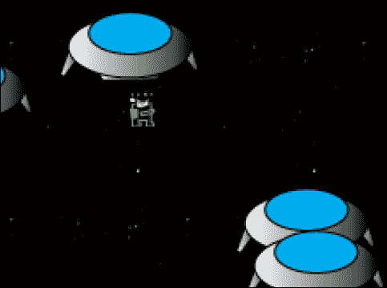

# 第四章：让我们建立一个侧向滚动游戏

在本章中，我们将使用 ImpactJS 和 Box2D 构建一个非常基本的侧向滚动游戏。Box2D 是一个开源的 C++物理引擎。使用它，重力和摩擦力会被模拟，就像你在愤怒的小鸟游戏中看到的那样。虽然不是完全集成，但经过足够的努力，Box2D 可以在 ImpactJS 游戏中使用。就像上一章一样，游戏将从头开始构建。主要区别在于使用物理引擎和侧向滚动游戏设置。

在本章中，我们将涵盖：

+   侧向滚动游戏

+   使用 Box2D 与 ImpactJS

+   使用 ImpactJS Weltmeister 构建一个侧向滚动关卡

+   引入一个可玩的角色

+   在侧向滚动游戏中添加一些敌人

+   为玩家配备子弹和炸弹

+   使用人工智能使敌人更聪明

+   创建玩家可以拾取的物品

+   保持得分并在每次敌人死亡时添加分数

+   连接两个不同的侧向滚动关卡

+   以强大的敌人结束游戏

# 侧向滚动游戏设置

侧向滚动视频游戏是一种从侧面角度观看的游戏，玩家通常在玩过程中从左到右移动。屏幕基本上是从一侧滚动到另一侧，无论是从左到右还是其他方向，因此得名侧向滚动。著名的侧向滚动游戏有 2D 马里奥、索尼克、大金刚、旧版洛克人、超级任天堂和 Gameboy 版的银河战士游戏，以及古老但成功的双战龙。

这种类型的大多数游戏都有一个长的关卡，英雄需要通过战斗或避开怪物和死亡陷阱找到自己的路。到达关卡的结尾后，通常除了重新开始该关卡之外，没有其他回头的办法。《银河战士》在这方面有些奇怪，因为它是最早的侧向滚动游戏之一，拥有一个你可以像在标准角色扮演游戏（RPG）中一样探索的巨大世界。《银河战士》为侧向滚动游戏的新思维方式奠定了基础；你需要在虚拟的数英里长的洞穴中找到自己的路，偶尔会发现自己回到起点。《梦幻城堡》是另一个例子，这是一个使用中世纪背景的侧向滚动冒险游戏。


既然我们已经了解了侧向滚动游戏是什么，让我们开始用 ImpactJS 构建一个。

## 为 Box2D 准备游戏

在我们正式开始之前，我们需要确保所有文件都正确放置：

1.  从我们在第一章中准备的原始 ImpactJS 可下载文件夹中复制一份，*启动你的第一个 Impact 游戏*。或者，你也可以再次下载一个新的，并将其放在 XAMPP 服务器的`htdocs`目录中。给你的文件夹起一个名字；让我们完全原创，叫它`chapter4`。其他名字也可以。

1.  从 ImpactJS 网站下载物理演示，并转到其`plugins`文件夹。在这里，你应该找到`Box2D`插件。创建你自己的`plugins`文件夹，并将`Box2D`扩展放在那里。

1.  通过在浏览器中访问`localhost/chapter4`来测试一切是否正常。**它正常工作！**消息应该再次等待着你。

1.  此外，我们还需要更改一些 Box2D 核心文件。Box2D 不是 ImpactJS 的产品，而是在开发 JavaScript 等效版本之前为基于 C++的游戏而发明的。然后，Dominic Szablewski（ImpactJS 的创造者）将这个 JavaScript 版本与 ImpactJS 集成。然而，存在一些缺陷，其中一个是错误的碰撞检测。因此，我们需要用一个修正了这个问题的适应文件来替换其中一个原始文件。从可下载的`chapter4`文件夹中获取`game.js`和`collision.js`脚本，并将它们放在本地的`Box2D`文件夹中。`collision.js`脚本得益于提供该脚本的 Abraham Walters。

1.  将`chapter4`文件夹的媒体文件复制到本地的`media`文件夹中。

1.  我们需要对主脚本进行调整。我们的游戏将不再是标准 Impact 游戏类的扩展。

```js
MyGame = ig.Game.extend({ 
```

1.  相反，它将是修改后的 Box2D 版本的扩展。因此，请确保更改以下代码片段：

```js
MyGame = ig.Box2DGame.extend({
```

1.  我们需要在`main.js`脚本的开头包含 Box2D 的`game`文件才能使用这个扩展。

```js
.requires(
  'impact.game',
  'impact.font',
  'plugins.box2d.game'
)
```

1.  最后，为了测试一切是否正常，我们需要加载一个带有碰撞层的关卡。这是因为 Box2D 需要碰撞层来创建它的世界环境和边界。没有关卡，你将遇到一个错误，看起来像这样：

1.  为此，从`chapter4`文件夹的`level`子文件夹中复制`testsetup.js`脚本，并将其放在本地的`levels`文件夹中。将关卡添加到所需的文件中。

```js
'game.levels.testsetup'
```

1.  在主脚本的`init()`方法中插入一个`loadlevel()`函数。

```js
init: function() {
    this.loadLevel( LevelTestsetup );
  },
```

1.  在浏览器中重新加载游戏，你应该会看到**it works!**的消息。现在你已经看到了它，可以从代码中删除它。它在主脚本的`draw()`方法中。

```js
  var x = ig.system.width/2,
    y = ig.system.height/2;
    this.font.draw( 'It Works!', x, y, ig.Font.ALIGN.CENTER);
```

太好了！我们现在应该已经准备就绪了。我们要做的第一件事是建立一个小关卡，以便有一个属于自己的游乐场。

# 构建一个横向滚动的关卡

为了构建一个关卡，我们再次需要依赖于 ImpactJS Weltmeister：

1.  在浏览器中打开 Weltmeister `localhost/chapter4/Weltmeister.html`。我们没有任何实体可以玩耍，所以现在我们要添加的只是一些图形和一个碰撞层。这个碰撞层特别重要，因为 Box2D 扩展代码将寻找它，缺少它将导致游戏崩溃。可以说，对于 ImpactJS 来说，Box2D 仍处于起步阶段，这样的小 bug 是可以预料到的。

1.  添加一个层并将其命名为`collision`；Weltmeister 将自动识别它为碰撞层。

1.  将其瓷砖大小设置为`8`，层尺寸设置为`100 x 75`。现在我们有一个 800 x 600 像素的画布可以使用。

1.  现在在边缘画一个框，这样我们就有了一个封闭的环境，没有实体可以逃脱。当重力开始作用时，这将非常重要。没有坚实的地面，你肯定会得到一些意外的结果。

1.  现在添加一个新的层，将其命名为`background`。我们将使用一张图片作为这个关卡的背景。

1.  从`media`文件夹中选择`church.png`文件作为图块集。我们的图片是 800 x 600 像素，所以它应该恰好适合我们用碰撞层创建的区域。将瓷砖大小设置为`100`，层尺寸设置为`8 x 6`。在画布上绘制教堂的图片。

1.  将你的关卡保存为`level1`。

太好了，我们现在有了一个基本的关卡。虽然它很空，但一些额外的障碍会很好。只需按照以下步骤添加一些障碍：

1.  添加另一个名为`platforms`的层。

1.  使用`tiles.png`文件作为图块集。它们设计简单，但可以作为任何你想构建的平台的基本构件。将瓷砖大小设置为`8`，尺寸设置为`100 x 75`，与碰撞层完全相同。

1.  在开始绘制平台之前，打开**与碰撞层链接**选项。这样，你就不需要事后用碰撞层追踪平台。如果你不希望平台的每个部分都是固体的，当然可以暂时关闭链接，绘制瓷砖，然后重新打开链接；链接不是事后建立的。

1.  在关卡中添加一些浮动平台；按照你的内心欲望来决定它们应该是什么样子。

1.  当你觉得舞台已经准备好时保存你的关卡。

1.  将关卡添加到你的`main.js`脚本的`require()`函数中。

```js
.requires(
  'impact.game',
  'impact.font',
  'plugins.box2d.game',

  'game.levels.testsetup',
  'game.levels.level1'
)
```

1.  确保在开始时加载名为`level1`的关卡，而不是我们的`testsetup`关卡，通过改变`loadLevel()`函数的参数。

```js
    init: function() {
    // Initialize your game here; bind keys etc.
    this.loadLevel( LevelLevel1 );
  },
```


现在是时候向游戏中添加一个可玩实体，这样我们就可以发现我们刚刚创建的令人惊叹的关卡了。

# 可玩角色

由于我们正在使用 Box2D，我们将不使用标准的 ImpactJS 实体，而是使用适应版本。特别是实体在 Box2D 世界中移动的方式是使一切变得不同的地方。在标准的 ImpactJS 中，这是将你的角色图像沿着某个方向移动几个像素的非常简单的过程。然而，Box2D 使用力；因此，为了移动，你需要克服重力甚至空气摩擦。但让我们先建立一个基本实体：

1.  打开一个新的 JavaScript 文件，并将其保存为`entities`文件夹中的`player.js`。

1.  添加基本的 Box2D 实体代码如下：

```js
ig.module(
  'game.entities.player'
)
.requires(
  'plugins.box2d.entity'
)
.defines(function(){
  EntityPlayer = ig.Box2DEntity.extend({
  });
});
```

1.  正如你所看到的，术语`entity`是 Box2D 实体的扩展，因此需要 Box2D 实体插件文件。再次确保遵守命名约定，否则你的玩家实体将不会出现在 Weltmeister 中。

1.  将`'game.entities.player'`参数添加到`main.js`脚本中。

如果你在进行这些修改后访问 Weltmeister，你会发现玩家在你的实体层中。尽管目前它只是一个不可见的正方形，你无法控制它。是时候通过添加一个动画表来改变他的不可见性了。

```js
EntityPlayer = ig.Box2DEntity.extend({
  size: {x: 16, y:24},
  name: 'player',
  animSheet: new ig.AnimationSheet( 'media/player.png', 16, 24 ),
  init: function( x, y, settings ) {
    this.parent( x, y, settings );
    this.addAnim( 'idle', 1, [0] );
    this.addAnim( 'fly', 0.07, [1,2] );
  } 
});
```

通过上面的代码块，我们给玩家指定了大小和名称；但更重要的是，我们添加了图形。动画表只包含两个图像，一个是玩家站立不动时的图像，另一个是玩家飞行时的图像。这并不多，但对于一个简单的游戏来说足够了。侧面滚动游戏在需要图形方面有相当大的优势。理论上，你只需要两张图像来代表一个角色；也就是说，一个是角色静止不动时的图像，另一个是角色在运动时的图像。而对于一个俯视游戏，你至少需要六张图像来完成同样的事情。这是因为，除了侧视图，你还需要一个角色背面和正面的图像。因此，如果你为玩家开火添加一个动画，这将导致侧面滚动游戏需要额外绘制一张图像，而俯视游戏需要三张图像。很明显，如果你只有有限的资源来获取你的图形，侧面滚动游戏更好。

现在我们可以将玩家添加到游戏中并且他实际上是可见的，但我们还没有对他有任何控制。

玩家控制是在两个地方完成的，即主脚本和玩家脚本。在主脚本中，将控制添加到游戏的`init()`方法中。

```js
init: function() {
    // Bind keys
    ig.input.bind(ig.KEY.LEFT_ARROW, 'left' );
    ig.input.bind( ig.KEY.RIGHT_ARROW, 'right' );
    ig.input.bind( ig.KEY.X, fly);
//Load Level
    this.loadLevel( LevelLevel1 );
  },
```

在玩家脚本中，我们需要改变我们的`update()`函数，这样玩家就可以对我们的输入命令做出反应。

```js
update: function() {
  // move left or right
  if( ig.input.state('left') ) {
    this.body.ApplyForce( new b2.Vec2(-20,0),this.body.GetPosition() );
    this.flip = true;
  }
  else if( ig.input.state('right') ) {
    this.body.ApplyForce( new b2.Vec2(20,0),this.body.GetPosition() );
    this.flip = false;
  }
  // jetpack
  if( ig.input.state('fly') ) {
    this.body.ApplyForce( new b2.Vec2(0,-60),this.body.GetPosition() );
    this.currentAnim = this.anims.fly;
  }
  else {
    this.currentAnim = this.anims.idle;
  }
  this.currentAnim.flip.x = this.flip;
  this.parent();
}
```

在 Box2D 中，实体有一个额外的属性，即身体。为了移动身体，我们需要对其施加力。这正是当我们使用身体的`ApplyForce()`方法时发生的事情。我们在某个方向上施加一个力，因此我们实际上使用一个向量。向量的使用正是 Box2D 的全部内容。只要我们保持右、左或飞行按钮按下，力就会被施加。然而，当释放时，实体并不会立即停止。不再施加进一步的力，但需要一定的时间来消耗施加力的效果；这与我们在前几章中使用的速度有很大的不同。

如果你把玩家添加到关卡中，确保他在左上角的某个平台上。左上角是默认可见的，我们还没有一个适应性视口来跟随我们的玩家。准确地说，他现在并不需要一个平台来站立，因为我们的世界没有重力。让我们解决这个问题。在`main.js`脚本中添加重力属性到你的游戏，如下所示：

```js
MyGame = ig.Box2DGame.extend({
  gravity: 100,
```

让我们带我们的玩家进行一次测试飞行，好吗？


你可能已经注意到，即使他飞行得相当顺利，我们的喷气背包青蛙遇到的任何固体物体都会使他旋转。也许你实际上不希望发生这种情况。特别是当他的头朝下时，他的喷气背包火焰朝上。现在，如果激活喷气背包仍然导致向上推力，那么喷气背包火焰朝上就没有太多意义。因此，我们需要解决他的稳定性问题。这可以通过在水平轴上固定身体来实现。将以下代码添加到青蛙的`update()`函数中：

```js
this.body.SetXForm(this.body.GetPosition(), 0);
```

现在玩家的身体被固定在 0 度角朝向 x 轴。尝试将其更改为 45；现在你有一个疯狂的青蛙，即使面向左，他的身体也始终向右倾斜飞行。

现在我们有一个飞行和稳定的青蛙。只可惜当我们向右移动一点或重力把我们带到关卡的底部时，我们就看不到他了。现在绝对是引入一个跟随摄像头的时候了。为此，我们需要对游戏的`update()`函数进行修改，如下所示：

```js
update: function() {
    this.parent();
    var player = this.getEntitiesByType( EntityPlayer )[0];
    if( player ) {
      this.screen.x = player.pos.x - ig.system.width/2;
      this.screen.y = player.pos.y - ig.system.height/2;
    }
},
```

玩家被放在一个局部变量中，并且每帧检查其位置以更新屏幕的位置。因为我们从玩家的位置中减去视口大小的一半，所以我们的玩家被整齐地保持在屏幕中央。如果不减去这部分，玩家将保持在屏幕的左上角。

保存所有修改并在你创建的关卡周围飞行；尽情享受宁静，因为很快敌对势力将搅乱这个地方。

让我们快速回顾一下我们关于 Box2D 实体以及如何使用它制作可玩角色的内容。Box2D 实体不同于 ImpactJS 实体，Box2D 利用向量来移动。向量是方向和力的组合：

+   打开一个新的 JavaScript 文件，并将其保存为`player.js`。

+   插入标准的 Box2D 实体扩展代码。

+   在主脚本中包含玩家实体。

+   为玩家添加动画。还利用`flip`属性，它可以在垂直轴上翻转图像，并为侧向滚动游戏剪切所需的角色图形的一半。

+   添加玩家控制，使其能够向左、向右和向上移动。注意力是如何施加在身体上以便移动的。一旦输入按钮被释放，不再施加力，实体将继续前进并完全停止，一旦力完全消散或者他撞到一个固体墙壁。

+   将重力引入游戏的属性。由于重力是一个不断向下的恒定力量，它会将一切拉向它遇到的第一个固体物体，除非提供一个相反的力。对于我们的飞行青蛙，他的喷气背包是对抗重力的反作用力。

+   我们的青蛙目前还不知道如何稳定地飞行。将他固定在水平轴上，这样他每次撞到固体物体时就不会旋转。

+   最后，我们需要一个摄像机来跟踪我们的位置。在游戏的`update()`函数中加入自动跟随摄像机。

# 添加一个小敌人

我们需要一些对手，一些我们可以在拥有武器后击落的东西。因此，让我们介绍一些更多的青蛙！这次是敌对的：

1.  打开一个新文件，保存为`enemy.js`。

1.  将以下代码插入文件中。这是在 Weltmeister 中获得我们敌人表示所需的最小代码。因此，它已经包括了动画表。

```js
ig.module(
  'game.entities.enemy'
)
.requires(
  'plugins.box2d.entity'
)
.defines(function(){
EntityEnemy = ig.Box2DEntity.extend({
size: {x: 16, y:24},
name: 'enemy',
animSheet: new ig.AnimationSheet( 'media/enemy.png', 16, 24),
init: function( x, y, settings ) {
  this.parent( x, y, settings );
  // Add the animations
  this.addAnim( 'idle', 1, [0] );
  this.addAnim( 'fly', 0.07, [1,2] );
  }
})
});
```

1.  在我们的`main.js`脚本中需要敌人实体。

```js
'game.entities.enemy'
```

1.  使用 Weltmeister 在关卡中添加敌人。

由于我们的敌人目前相当无助，我们也可以将他从平台上击落。


在正常的 ImpactJS 代码中，我们必须为此设置碰撞变量，否则玩家和敌人青蛙会直接穿过彼此。在 Box2D 中，这是不必要的，因为碰撞会自动假定，并且我们的飞行青蛙撞到每个可移动对象时都会施加力。

由于我们已经有了重力，一个很好的替代方法是在关卡顶部生成敌人。在游戏的`init()`函数中添加`spawnEntity()`函数。敌人将在那里生成，并且重力会将其拉到底部。

```js
this.loadLevel( LevelLevel1 );
this.spawnEntity('EntityEnemy',300,30,null);
```

确保`spawnEntity()`函数在关卡加载后使用，否则会出错。一旦敌人有了自己的智能，在关卡顶部生成敌人就会更有意义。它们会下落，要么落到最底部，要么直到它们到达一个平台，在那里它们会等待玩家并攻击它。

一旦我们为红色青蛙提供了一些基本的人工智能，我们将把它变成一个真正讨厌的生物。然而，让我们首先通过向游戏添加一些武器来做好准备。

让我们简要回顾一下我们是如何创建我们的敌人的：

+   打开一个新的 JavaScript 文件，保存为`enemy.js`。

+   插入标准的 Box2D 实体扩展，附加动画表，并添加动画序列

+   在主脚本中包含敌人实体

+   使用 Weltmeister 和`spawnentity()`方法在关卡中添加敌人

# 引入强大的武器

武器很棒，特别是如果它们受到重力的影响，或者如果它们可以对其他实体施加一些力。我们将在这里看两种类型的武器，即抛射物和炸弹。

## 发射抛射物

抛射物将是我们对手青蛙的主要武器，所以让我们从设置基础开始：

1.  打开一个新的 JavaScript 文件，保存为`projectile.js`，放在`entities`文件夹中。

1.  使用以下代码片段添加基本的 Box2D 实体代码，包括动画表和序列：

```js
ig.module(
  'game.entities.projectile'
)
.requires(
  'plugins.box2d.entity'
)
.defines(function(){
  EntityProjectile = ig.Box2DEntity.extend({
  size: {x: 8, y: 4},
  lifetime:60,
  name: 'projectile',
  animSheet: new ig.AnimationSheet( 'media/projectile.png', 8, 4),
  init: function( x, y, settings ) {
    this.parent( x, y, settings );
    this.addAnim( 'idle', 1, [0] );
  }
});
});
```

1.  除了名称、大小和执行动画所需的元素之外，我们已经包括了一个名为`lifetime`的属性。每个抛射物都以`60`的`lifetime`开始。当它达到`0`时，我们将使其消失并杀死子弹。这样我们就不会在一个游戏中得到过多的实体。每个实体都需要自己的计算，一次在屏幕上有太多实体可能会显著降低游戏的性能。可以使用 ImpactJS 调试器来跟踪这种性能，通过在主脚本中包含`'impact.debug.debug'`命令来打开它。

1.  将`game.entities.projectile`脚本添加到`main.js`脚本中。

现在我们可以通过 Weltmeister 向游戏中添加抛射物。然而，手动添加对我们来说没有太大用处。让我们改变玩家的代码，这样我们的青蛙就可以生成抛射物。首先，在主脚本中将`'shoot'`状态绑定到一个键。

```js
ig.input.bind(ig.KEY.C, 'shoot' );
```

然后将以下代码添加到玩家的`update()`函数中。

```js
if(ig.input.pressed('shoot') ) {
  var x = this.pos.x + (this.flip ? -0 : 6);
  var y = this.pos.y + 6;
  ig.game.spawnEntity( EntityProjectile, x, y, {flip:this.flip} );
}
```

生成弹丸需要在特定位置完成，并且必须指向特定方向，要么向左，要么向右。我们任意地将生成点的 y 坐标设置为比我们的玩家位置低 6 像素；我们也可以将其设置为 10、20 或 200 像素。不过，在最后一种情况下，子弹看起来会生成在玩家下方，这会显得相当不寻常。不过，我们不要忘记玩家的位置总是在其图像的左上角。鉴于我们的青蛙的高度为 24 像素，看起来就好像子弹是从嘴里射出来的，这对于一只青蛙来说相当酷。x 坐标是另一回事。如果青蛙面向左，我们不调整生成坐标；如果他面向右，我们将其调整 6 像素。有关玩家是否翻转的信息不仅用于调整生成坐标。它还作为一个可选的输入参数传递给弹丸本身。这里将用它来确定它应该面向和飞向哪一边。在发射子弹时，你可能会注意到青蛙被击退了一点，有点像枪的后坐力。这是因为青蛙最初占据了子弹生成时的位置。如果你想避免这种酷炫的效果，你只需要让子弹离青蛙远一点。如果你此时加载游戏，你会注意到你的子弹生成了，但没有飞走。这是因为我们没有告诉子弹在生成时应该这样做。

将以下两行代码添加到弹丸的`init()`函数中将纠正这种情况。

```js
this.currentAnim.flip.x = settings.flip;
var velocity = (settings.flip ? -10 : 10);
this.body.ApplyImpulse( new b2.Vec2(velocity,0),
this.body.GetPosition() );
```

在生成弹丸时，我们现在应用的是冲量而不是力。`ApplyImpulse()`和`ApplyForce()`函数之间存在显著的区别。`ApplyForce()`函数在物体上施加一个恒定的力，而`ApplyImpulse()`函数只施加一次，但是突然。你可以将其比作推动一块石头与跑向它并用你所有的力量和动量撞击它。现实生活中的子弹与我们在这里尝试模拟的方式相同；它被一个小爆炸甩开，之后再也没有被推动。局部变量`var.velocity`用于调整子弹的方向，就像动画取决于`settings.flip`参数的值一样。如果`flip`属性的值为 false，子弹将面向右并向右飞行。如果`flip`属性的值为 true，动画将翻转，使其面向左。因为速度取负数，子弹也会向左飞行。

我们仍然可以调整 y 轴上的冲量，目前设置为`0`。输入一个负数将使我们的青蛙向上射击，就像一门防空炮。输入一个正数将使他向下射击，就像一架轰炸机。尝试调整这个值，看看效果。

我们的弹丸仍然在屏幕上徘徊，因为我们还没有充分利用我们的`lifetime`属性。

让我们修改`update()`函数，以限制我们子弹的寿命。

```js
update: function(){
  this.lifetime -=1;
  if(this.lifetime< 0){this.kill();}
  this.parent();
}
```

每当游戏通过更新循环，也就是每帧一次，弹丸的剩余寿命就会减少 1。在每秒 60 帧的游戏中，给定一个总寿命值为 60，子弹在生成后有 1 秒的寿命。

我们可以用它向敌人射击，并且实际上用子弹的力量将他们推开，但我们还没有真正伤害到他们。要实现这一点，我们需要检查是否击中了敌人。

```js
check: function(other){
  other.receiveDamage(10);
  this.kill();
}
```

添加这个修改后的`check()`函数，这将使弹丸在自毁之前造成伤害，是不够的。尽管碰撞是由 Box2D 自动处理的，但`check()`函数工作所需的参数并没有。我们需要做一些其他的事情：

1.  通过添加`TYPE`属性，告诉敌人它是 B 型实体。

```js
type: ig.Entity.TYPE.B,
```

1.  使用`checkAgainst`属性使抛射物检查与 B 类型实体的碰撞。

```js
checkAgainst: ig.Entity.TYPE.B,
```

1.  现在保存并重新加载游戏。你现在可以杀死那些讨厌的红色青蛙了。

尝试将你的玩家设为 B 类型实体。现在你的子弹会杀死你。这是因为我们让它们生成在我们的青蛙已经占据的空间中。正如我们之前看到的，这也是为什么我们在发射子弹时有这种后坐力效应的原因。然而，这次不仅仅是后坐力；它实际上可以杀死玩家。所以我们最好不要让我们的玩家成为 B 类型实体，或者我们应该让我们的子弹生成得离得更远，失去后坐力效应。拥有一些可以自卫的东西是很好的，即使其他青蛙现在还不构成太大的威胁。在让它们活过来之前，我们很快要看一下更爆炸性的东西，一个炸弹。

在转向炸弹之前，让我们再快速看一下我们是如何引入我们的主要武器——子弹的：

+   我们需要枪，很多枪。

+   打开一个新的 JavaScript 文件，并将其保存为`projectile.js`。

+   插入标准的 Box2D 实体扩展，附加一个动画表，并添加动画序列。还添加一个`lifetime`属性，用来跟踪子弹在游戏中应该停留多久。

+   在主脚本中包含抛射实体。

+   在主脚本中为射击输入状态添加一个键绑定。

+   当玩家点击射击按钮时，让我们的飞行青蛙产生一个抛射物。

+   给子弹添加一个冲量，这样它就可以真正飞起来，而不仅仅是掉到地上。

+   检查子弹在空中的时间，并在超过预设寿命时将其销毁。

+   让子弹检查敌人。如果遇到敌人，它应该造成伤害并自杀。

+   尝试让子弹杀死玩家，但不要保持这种状态。

## 制造一个真正的炸弹

制造炸弹的基础与制造抛射物的基础相同，实际上，它们与创建任何实体的基础相同：

1.  打开一个新的 JavaScript 文件，并将其保存为`bomb.js`在`entities`文件夹中

1.  添加基本的 Box2D 实体代码，动画表和序列如下：

```js
ig.module(
  'game.entities.bomb'
)
.requires(
  'plugins.box2d.entity'
)
.defines(function(){
EntityBomb = ig.Box2DEntity.extend({
  size: {x: 24, y: 10},
  type: ig.Entity.TYPE.A,
  checkAgainst: ig.Entity.TYPE.B,
  animSheet: new ig.AnimationSheet( 'media/bomb.png', 24, 10 ),
  lifespan: 100,
  init: function( x, y, settings ) {
    this.parent( x, y, settings );
    // Add the animations
    this.addAnim( 'idle', 1, [0] );
    this.currentAnim = this.anims.idle;
  }
});
});
```

1.  这次我们已经给我们的炸弹一个类型和一个用于造成伤害的检查类型

1.  将`game.entities.bomb`参数作为所需实体放入`main.js`脚本

现在我们有一个炸弹，我们可以把它放在任何我们想要的关卡中。我们可以在我们的关卡天花板附近添加一些炸弹，这样它们在关卡加载时会掉下来。那将是很棒的，因为会有一个真正的爆炸。我们将把这个爆炸作为一个单独的方法引入，只有我们的炸弹才能使用。

```js
explosion:
function(minblastzone,maxblastzone,blastdamage,blastforcex,blastforcey){
  varEnemyList= ig.copy(ig.game.entities);
  var i = 0;
  //check every entity
  while(typeofEnemyList[i] != 'undefined'){
    Enemy = EnemyList[i];
    //calculate distance to entity
    distance = Math.sqrt((this.pos.x - Enemy.pos.x)*(this.pos.x -Enemy.pos.x) + (this.pos.y - Enemy.pos.y)*(this.pos.y -Enemy.pos.y));
    //adjust blastdirection depending on entity position
    if(this.pos.x - Enemy.pos.x< 0){adjustedblastforcex =blastforcex}
    else{adjustedblastforcex = - blastforcex}
    if(this.pos.y - Enemy.pos.y< 0){adjustedblastforcey = blastforcey}
    else{adjustedblastforcey = - blastforcey}//if within blastzone: blow up the targetif(minblastzone< distance && distance <maxblastzone){Enemy.body.ApplyImpulse(newb2.Vec2(adjustedblastforcex,adjustedblastforcey),this.body.GetPosition());
      Enemy.receiveDamage(blastdamage,this);}
      i++;
    }
}
```

就像`init()`、`update()`和`check()`方法一样，我们现在将`explosion()`方法插入到炸弹实体中，以便它今后能够使用。`explosion()`方法接受五个参数：

1.  **最小爆炸区域**：如果一个实体距离比这更近，他将不会受到影响。这对于炸弹来说并没有太多意义，除非它允许你在一个炸弹中使用几次爆炸。这反过来又使得在目标靠近炸弹时造成更大的伤害，而在目标远离炸弹时造成更小的伤害成为可能。

1.  **最大爆炸区域**：距离最大爆炸区域以外的一切都不会受到爆炸的影响。

1.  **爆炸伤害**：这是实体在爆炸区域内会受到的伤害。

1.  **Blastforcex**：这是应用于受影响实体的 x 轴冲量。它将决定目标会向右或向左飞多远。

1.  **Blastforcey**：这是应用于受影响实体的 y 轴冲量。它将决定目标会飞多高。显然，如果目标在炸弹下方爆炸，它会将目标向下推，而不是向上。

`explosion()` 方法的工作方式如下。所有实体都被复制到一个本地变量中。然后依次检查这些实体，看看它们距离炸弹有多远。这里计算的距离是欧几里得距离。在计算欧几里得距离或普通距离时，你应用毕达哥拉斯定理。这个定理规定，如果已知三角形的另外两边的长度，就可以计算出一个直角三角形的任意一边的长度。公式是 *a² + b² = c²*，其中 *c* 是三角形的最长边。根据不幸的目标是位于炸弹的右侧还是左侧，上方还是下方，力的方向会进行调整。最后，函数检查距离是否在爆炸区域的范围内。如果是这样，就对目标施加伤害和冲量。在这一点上，实体要么死亡，要么飞向空中；无论哪种情况都不是好消息。

仅仅添加这个 `explosion()` 方法是没有用的，直到我们真正使用它。因此，我们需要修改我们的 `update()` 方法，以便在炸弹寿命结束时引爆我们的炸弹。

```js
update: function(){
  //projectiles disappear after 100 frames
  this.lifespan -= 1;
  if(this.lifespan< 0){
    this.explosion(0,40,70,200,100);
    this.explosion(40,200,20,100,50);
    this.kill();
  }
  this.parent();
},
```

寿命部分的工作方式与弹丸中的方式完全相同。然而，在这种情况下，我们不仅仅调用 `kill()` 函数，而是使用我们新开发的爆炸两次。我们可以只调用一次函数，并将爆炸范围值设置在 0 到 200 之间。正如前面提到的，我们现在的优势在于高伤害和靠近炸弹的压力之间的区分，以及低伤害和远离炸弹的压力。从技术上讲，我们可以使用任意数量的爆炸；每一个都需要计算时间。不过，你可以决定你想要多少个爆炸。

在实际测试游戏中的爆炸之前，确保为所有实体分配健康值。它们是否能够承受爆炸的伤害将取决于你是否给予它们足够的健康值。由于默认值设置为 10，它们将不会飞走，而是立即死亡，如果使用前面的数字。因此，让我们通过在它们各自的 `init()` 函数之前添加此属性来给我们的玩家和敌人一个健康值为 100。

```js
health: 100
```

作为最后的修饰，我们可以让炸弹在接触到敌对青蛙之一时爆炸。

```js
check: function(other){
    other.receiveDamage(30);
    this.explosion(0,40,70,200,100);
    this.explosion(40,200,20,100,50);
    this.kill();
}
```

我们已经确保炸弹通过设置 `checkAgainst` 属性检查与 B 类型实体的接触。直接受到这块金属的伤害设置为 `30`。这之后是爆炸本身，它将造成 70 分的伤害，因为敌人离得很近。第二波爆炸影响到更远的一切，然后炸弹最终自毁。

现在我们有一个可以放置在关卡中任何位置并且效果很好的炸弹。然而，如果我们的玩家自己也能生成一个炸弹，那就更好了。在接下来的步骤中，我们简单地重复了我们在弹丸中所做的操作，使玩家自己生成一个炸弹：

1.  将一个键盘按钮分配给炸弹输入状态，如下行代码所示：

```js
ig.input.bind(ig.KEY.V, 'bomb');
```

1.  修改玩家的 `update()` 函数，以便玩家现在可以使用以下代码生成炸弹：

```js
if (ig.input.pressed('bomb')){
  var x = this.pos.x + (this.flip ? 0 : 8 );
  var y = this.pos.y + 25;
  ig.game.spawnEntity(EntityBomb,x,y, {flip:this.flip});
}
```

1.  这里定义的生成坐标与我们在弹丸中所做的不同。 `y` 坐标非常重要；它设置为 `25`，因为我们的飞行青蛙的高度为 `24` 像素。这样炸弹总是生成在飞行青蛙的正下方。

1.  将以下代码添加到炸弹的 `init()` 函数中，以便它接受 `flip` 参数，以知道生成时应该面向哪一侧。

```js
this.currentAnim.flip.x = settings.flip;
```

1.  保存、重新加载，并炸掉那些红色的青蛙！不过要小心，炸弹也可能杀死你。

炸弹是我们最大的武器；让我们快速回顾一下我们是如何构建它的：

+   打开一个新的 JavaScript 文件，并将其保存为 `bomb.js`。

+   插入标准的 Box2D 实体扩展，附加动画表，并添加动画序列。添加一个寿命属性，用于跟踪炸弹爆炸前剩余的时间，如果没有被触碰敌人而过早引爆。

+   在主脚本中包括炸弹实体。

+   在关卡中添加一个炸弹。

+   介绍`explosion()`方法；这是一个自定义函数，模拟爆炸的伤害和力量效果。

+   更改`update()`函数，使炸弹在时间到时爆炸。

+   使用`check()`函数检测与敌人的碰撞并立即引爆。

+   为炸弹分配一个键盘快捷键。

+   调整玩家的`update()`函数，使玩家命令时会生成一个炸弹。

+   使炸弹翻转到玩家所看的方向。

+   玩得开心，尽情地炸青蛙！

# 人工智能

是时候让我们的红色青蛙变得更聪明一点，这样他们至少有一点机会对抗我们新开发的武器库。在第三章中，*让我们建立一个角色扮演游戏*，我们完全按照书本上的方法做到了这一点，通过将决策与行为分开。我们为决策制定了一个单独的人工智能（AI）文件，而实际行为始终在实体的`update()`函数中。

这一次，我们将保持非常简单，直接将所有人工智能放在敌人的`update()`方法中。这将证明，即使是简单的人工智能也可以看起来相当聪明。

让我们用以下代码修改我们的敌人的`update()`函数：

```js
update: function(){
  var players = ig.game.getEntitiesByType('EntityPlayer');
  var player = players[0];
  // both distance on x axis and y axis are calculated
  var distanceX = this.pos.x - player.pos.x;
  var sign = Math.abs(distanceX)/distanceX;
  var distanceY = this.pos.y - player.pos.y;
  //try to move without flying, fly if necessary
  var col = ig.game.collisionMap.trace( this.pos.x, this.pos.y,player.pos.x, player.pos.y,16,8 );
  if (Math.abs(distanceX) < 110){
    var fY = distanceY> 0 ? -50: 0;
    this.body.ApplyForce( new b2.Vec2(sign * -20,fY),this.body.GetPosition() );
    if(distanceY>= 0){this.currentAnim = this.anims.fly;}
    else{this.currentAnim = this.anims.idle;}
  }
  this.body.SetXForm(this.body.GetPosition(), 0);
  if (distanceX> 0){this.currentAnim.flip.x = true;}
  else{this.currentAnim.flip.x = false;}
  this.parent();
  }
```

将此函数插入到敌人实体中，将使他试图抓住玩家。但它是如何工作的呢？首先，玩家实体保存在函数的本地变量中，称为`player`。计算敌人和玩家之间的水平距离和垂直距离。`sign`变量用于确定青蛙应该向左飞还是向右飞。他总是向上飞；如果他需要下降，因为玩家在他下面，他将让重力发挥作用。在飞行时，飞行动画是活动的，否则使用空闲动画，即使在水平移动时也是如此。

青蛙的身体固定在 x 轴上，以防止他旋转，就像玩家一样。最后，根据玩家相对于敌人的位置，动画会翻转到左侧或右侧。

现在我们有一只青蛙，如果我们离他足够近，他会跟着我们走。现在我们需要他对玩家造成一些伤害：

1.  确保敌人的类型和需要检查的类型分别填写为 B 和 A。还引入一个名为`cooldowncounter`的新敌人属性，如下所示：

```js
type: ig.Entity.TYPE.B,
checkAgainst: ig.Entity.TYPE.A,
cooldowncounter: 0,
```

1.  `cooldowncounter`属性将跟踪自上次青蛙能够造成伤害以来经过了多少帧。

1.  `cooldowncounter`属性必须计数，因此将其添加到`update()`函数中：

```js
this.cooldowncounter ++;
```

1.  扩展`check()`函数，以检查自上次攻击以来是否已经过了足够的帧数，并允许青蛙进行攻击，如下所示：

```js
check: function(other){
  if (this.cooldowncounter> 60){
    other.receiveDamage(10,this);
    this.cooldowncounter = 0;
  }
}
```

青蛙现在将能够在玩家身上使用其恶毒的近战攻击。无论青蛙在近距离对玩家造成的攻击是什么，每次击中玩家都会降低玩家的健康值 10 点。现在玩家肯定需要避开这些恶毒的生物，以免健康值迅速下降。我们需要给玩家一些额外的东西，让他能够在这场屠杀中生存下来。

人工智能是使敌人值得对抗的原因。与我们在第三章中提到的不同，*让我们建立一个角色扮演游戏*，它并不总是需要变得复杂。让我们快速看一下我们如何为横向滚动游戏实现了人工智能：

+   更改`update()`函数，使敌人现在可以朝着玩家飞行。这个新的`update()`函数是敌人青蛙的人工智能。与第三章中的*让我们建立一个角色扮演游戏*不同，这次决策和行为都包含在同一段代码中。

+   引入一个冷却计数器，用于跟踪自上次攻击以来的帧数。还要确保敌人实体是 B 类型，并检查它是否接触到 A 类型的实体。玩家应该是 A 类型的实体。

+   通过将其添加到修改后的`update()`函数中，使`cooldown`属性在每帧过去时增加 1 的值。

+   在`check()`函数中加入攻击，使青蛙成为不可忽视的力量。

# 拾取物品

我们的小飞行青蛙现在正式可以被那些讨厌的红色青蛙杀死。这对他来说不是好消息，我们需要提供一种方式来补充失去的健康。这是通过使用拾取物品来实现的，也就是，当接触到玩家时会消失但在过程中提供有益效果的实体。

在我们添加实际的拾取物品之前，它将以补充健康的板条箱的形式出现，让我们先在游戏中添加一个普通的板条箱。

## 添加一个普通板条箱

我们的板条箱将作为我们可以发明的所有类型的板条箱的原型。执行以下步骤创建板条箱：

1.  打开一个新文件并将其保存为`crate.js`。

1.  将板条箱代码添加到文件中。

```js
ig.module(
  'game.entities.crate'
)
.requires(
  'plugins.box2d.entity'
)
.defines(function(){
EntityCrate = ig.Box2DEntity.extend({size: {x: 8, y: 8},
  health: 2000,
  name: 'crate',
  type: ig.Entity.TYPE.B,checkAgainst: ig.Entity.TYPE.A,
  animSheet: new ig.AnimationSheet( 'media/crate.png', 8, 8),
  init: function( x, y, settings ) {
    this.addAnim( 'idle', 1, [0] );
    this.parent( x, y, settings );
  }
});
});
```

1.  这段代码非常简单，因为板条箱只是一个无生命的物体。尽管是一个坚固的无生命物体，因为它的健康值为`2000`。通过给予板条箱如此多的健康，它能够经受住多次炸弹爆炸。

1.  保存文件并在 Weltmeister 中添加一些到你的游戏中。当然，在释放爆炸之前，试着堆叠几个板条箱。

现在我们有了标准的板条箱；制作一个治疗板条箱只需要几个步骤，因为我们将在普通板条箱的基础上构建它。

在看看我们的治疗板条箱之前，让我们快速看看我们是如何制作普通板条箱的：

+   创建一个新文件并将其保存为`crate.js`

+   实现标准的 Box2D 实体代码

+   保存并使用 Weltmeister 向游戏中添加一些板条箱

## 实现一个治疗板条箱

现在我们有了基本的原型板条箱，我们只需要在其基础上构建，以创建健康板条箱。执行以下步骤来构建健康板条箱：

1.  打开一个新文件并将其保存为`crate.js`。

1.  为其添加`healthcrate`特定的代码。健康板条箱是普通板条箱的扩展，不是一个 Box2D 实体；因此，我们只需要指出健康板条箱与普通板条箱的区别所在：

```js
ig.module(
  'game.entities.healthcrate'
)
.requires('game.entities.crate'
).defines(function(){
EntityHealthcrate = EntityCrate.extend({
  name: 'healthcrate',
  animSheet: new ig.AnimationSheet( 'media/healthcrate.png', 8, 8),
  check: function(other){
    if(other.name == 'player'){
      other.health =  other.health + 100;
      this.kill();
    }
  }
})
});
```

1.  它有另一个名称和动画表。此外，它将治疗玩家并在治疗玩家后销毁自己。

1.  使用以下代码将板条箱添加到主脚本中，这样你的游戏就知道它在那里。

```js
'game.entities.healthcrate'
```

1.  保存并添加一个板条箱到游戏中以查看其效果。

这个板条箱通过提供**100**的**健康**值来治疗玩家，如下截图所示。因此，玩家的健康值总是比游戏开始时更高。这只是一个选择；你可以通过实现健康上限来改变这一点，以确保治疗不会使玩家比初始状态更强大。


记住你可以随时用带有 Firebug 附加组件的 Firefox 打开并查找**文档对象模型**（**DOM**）中的玩家属性。在拾取板条箱之前，我们的玩家的健康值为 100，拾取后上升到 200。

治疗板条箱比普通板条箱要复杂一些。让我们再次看看我们制作治疗板条箱所采取的步骤：

+   创建一个新文件并将其保存为`healthcrate.js`。

+   扩展先前构建的生命箱，而不是一个 Box2D 实体。只添加健康箱与原始箱不同的参数。这包括一个`check()`函数，用于查看玩家是否触摸到它。

+   保存并添加一个生命箱到游戏中使用 Weltmeister。

+   在 DOM 中检查您的生命箱是否实际增加了玩家的生命值。

# 保持得分

在游戏中跟踪分数是一件相当简单的事情。为了实现一个系统，在其中每次杀死一个敌人时都会保持并增加分数，我们需要三样东西：

1.  我们需要一个在游戏本身范围内并且可以被视为某种开销变量的变量。

```js
.defines(function(){
GameInfo = new function(){
 this.score = 0;
},
MyGame = ig.Box2DGame.extend({
```

1.  这非常重要，因为正如我们将在第五章中看到的那样，*为您的游戏添加一些高级功能*，开始和结束屏幕实际上是正在加载的不同游戏。当新游戏加载到内存中时，旧游戏被丢弃，它的所有变量也被丢弃。这就是为什么我们需要一个存在于游戏之外的变量。

1.  这个函数用于增加一定数量的分数。这个函数允许是游戏本身的一个方法。只需将其插入到`MyGame`文件的其他主要函数下面的主脚本中。

```js
increaseScore: function(points){
  //increase score by certain amount of points
  GameInfo.score +=points;
}
```

1.  我们覆盖了敌人的`kill()`函数，如所示，因此青蛙不仅死亡，而且还为我们提供了额外的分数。

```js
  kill: function(){
    ig.game.increaseScore(100);
    this.parent();
  }
```

从现在开始，每当红蛙死亡时，我们都会得到额外的 100 分，并且这些分数会安全地保存在一个变量中，只要我们不刷新页面，它们就不会被删除。然后，我们可以稍后使用这个变量，在游戏结束时向我们的玩家提供一些反馈，告诉他表现得好还是差。

保持得分对于几乎任何游戏来说都是非常重要的组成部分。这是一种挑战玩家重玩游戏并在其中表现更好的方式。而且实现起来也不是太困难；让我们看看我们做了什么：

+   在当前游戏之外创建一个变量，并将变量命名为`score`

+   添加一个可以直接操作我们的`score`变量的游戏函数

+   敌人死亡时调用该函数，将分数添加到整体玩家得分中。

# 从一个级别过渡到另一个级别

为了实现地图过渡，您首先需要第二个级别。您可以自己制作一个，或者从本章的可下载文件中复制一个。您还需要触发器结束`levelchange`实体。将这两个实体复制到`entities`文件夹中，并将名为`level 2`的级别复制到本地计算机上的`levels`文件夹中。或者，您可以自己设计第二个级别，并使用随 Impact 许可证提供的触发器实体。触发器实体不是实际引擎的一部分；它可以在 ImpactJS 网站的可下载示例中找到。

在`levelchange`实体中，我们将进行以下代码更改：

```js
ig.module(
  'game.entities.levelchange'
)
.requires(
  'impact.entity'
)
.defines(function(){ 
EntityLevelchange = ig.Entity.extend({
  _wmDrawBox: true,
  _wmBoxColor: 'rgba(0, 0, 255, 0.7)',
  _wmScalable: true,
  size: {x: 8, y: 8},
  level: null,
  triggeredBy: function( entity, trigger ) {
    if(this.level) { 
      varlevelName = this.level.replace(/^(Level)?(\w)(\w*)/, function( m, l, a, b ) {
        return a.toUpperCase() + b;
        });
      var oldplayer = ig.game.getEntitiesByType( EntityPlayer )[0];
      ig.game.loadLevel( ig.global['Level'+levelName] );
      var newplayer = ig.game.getEntitiesByType( EntityPlayer )[0];
      newplayer = oldplayer;
    }
  },
  update: function(){}
});
});
```

正如您可能注意到的那样，它与我们在 RPG 中使用的不同，主要有两个方面：

+   它不考虑使用生成点。对于大多数横向卷轴游戏，实际上并不需要使用生成点。这是因为一旦完成了一个级别，您只能通过重新玩它来返回到它。因此，我们不需要每个级别多个生成点，只需要一个生成点。然而，如果我们只需要一个生成点，不使用我们在之前章节中使用的 Void 实体会更容易。相反，我们只需将玩家实体放在级别内的某个位置，级别将始终从那里开始。

+   对`levelchange`实体的第二个更改是我们对玩家实体的备份。在加载关卡之前，我们将玩家实体复制到一个名为`oldplayer`的本地变量中。一旦游戏加载，就会创建一个新的可玩角色；这是我们手动添加到 Weltmeister 中的`level 2`。然后我们将这个新玩家分配给另一个名为`newplayer`的本地变量。通过用`oldplayer`覆盖`newplayer`，我们可以继续使用旧的青蛙进行游戏。如果玩家被允许保留先前获得的补充武器或生命值，这可能很重要。

现在我们所需要做的就是在`level 1`中正确设置`trigger`和`levelchange`实体，这样我们就有了一个体面的关卡过渡。应该按照以下步骤进行：

1.  一旦`trigger`和`levelchange`实体出现在`entities`文件夹中，就将它们都添加到主脚本中。一旦你创建或复制了`level 2`，也将`level 2`添加到脚本中。

```js
'game.levels.level2',
'game.entities.trigger',
'game.entities.levelchange'
```

1.  使用 Weltmeister 将`trigger`和`levelchange`实体放入`level 1`。

1.  使用 Weltmeister 为`levelchange`实体添加一个值为`tolevel2`的`name`属性和一个值为`level2`的`level`属性。

1.  使用 Weltmeister 为`trigger`实体添加一个名为`target.1`的属性，值为`tolevel2`。

1.  仔细检查你的第二个关卡中是否有一个玩家实体，并且这个关卡的名称是`level2`。

1.  保存你所做的所有更改，并重新加载游戏进行测试。一定要尝试在使用关卡过渡之前收集一个生命值箱。一旦你到达`level2`，你的生命值增加应该会持续。

如果你从可下载文件中复制了`level2`，请注意星星的移动速度比飞船慢，而飞船的移动速度又比其他一些飞船慢。这是因为这三个图层的距离。如果你打开 Weltmeister，你会发现星星图层的距离值为**5**，最接近的星船的值为**2**，其他飞船的值为**3**。使用距离可以为视差游戏带来非常好的效果；明智地使用它们。



如果只是单向进行关卡过渡，那么添加关卡过渡可以相对容易地完成。让我们回顾一下我们是如何做到这一点的：

+   复制`trigger`和`levelchange`实体。

+   构建或复制一个名为`level2`的第二个关卡。确保在关卡中添加一个玩家实体。

+   在主脚本中包括新的关卡和`trigger`和`levelchange`实体。

+   在`level 1`中添加一个`trigger`和`levelchange`实体，连接它们，并确保`levelchange`实体指向`level2`。

+   在设计关卡时，尝试使用图层的`distance`属性。这可以在横向滚动游戏中给你美丽的结果。

# 最后的战斗

每个好游戏都以一个具有挑战性的最终战斗结束，善良战胜邪恶，或者反之，由你决定。

为了进行一场具有挑战性的战斗，让我们创建一个单独的`boss`实体，比我们其他的青蛙更强大。

1.  新建一个文件并将其保存为`boss.js`。

1.  boss 将是我们正常敌人的扩展，所以让我们首先定义他与红色青蛙不同的特征。

```js
ig.module(
  'game.entities.boss'
)
.requires(
  'game.entities.enemy'
)
.defines(function(){
  EntityBoss = EntityEnemy.extend({
  name: 'boss',
  size: {x: 32, y:48},
  health: 200,
  animSheet: new ig.AnimationSheet( 'media/Boss.png', 32,48 )
});
});
```

1.  他的名字不同；但更重要的是，他的生命值更多，比其他青蛙要大得多。

1.  使用以下代码将 boss 添加到你的主脚本中：

```js
'game.entities.boss'
```

1.  保存所有更改并将 boss 放入你的一个关卡中。

我们现在确实有一个更大的敌人，生命值更多，基本上做的事情和较小的一样。这并不会让 boss 战变得有趣，所以让我们赋予他像玩家一样发射子弹的能力。我们需要一个单独的子弹实体，因为我们的基本抛射物只能伤害 B 类型实体，而我们的玩家是 A 类型；另外我们可能希望它看起来有点不同：

1.  新建一个文件并将其保存为`bossbullet.js`。

1.  这颗子弹将是普通子弹的直接扩展，除了类型检查和外观方式。编写以下代码来创建新的子弹实体：

```js
ig.module(
  'game.entities.bossbullet'
)
.requires(
  'game.entities.projectile'
)
.defines(function(){
  EntityBossbullet = EntityProjectile.extend({
  name: 'bossbullet',
  checkAgainst: ig.Entity.TYPE.A,
  animSheet: new ig.AnimationSheet( 'media/bossbullet.png',8, 4 )
  });
});
```

1.  我们需要进行最后一个修改，如下所示的代码，让 boss 发射自己的子弹：

```js
update: function(){
  var players = ig.game.getEntitiesByType('EntityPlayer');
  var player = players[0];
  // both distance on x axis and y axis are calculated
  var distanceX = this.pos.x - player.pos.x;
  var sign = Math.abs(distanceX)/distanceX;
  var distanceY = this.pos.y - player.pos.y;
  //try to move without flying, fly if necessary
  if (Math.abs(distanceX) < 1000 &&Math.abs(distanceX)>100){
    var fY = distanceY> 0 ? -350: 0;
    this.body.ApplyForce( new b2.Vec2(sign * -50,fY),this.body.GetPosition() );
    if(distanceX>0){this.flip = true;}
    else {this.flip = false;}
    if (Math.random() > 0.9){
      var x = this.pos.x + (this.flip ? -6 : 6 );
      var y = this.pos.y + 6;
      ig.game.spawnEntity( EntityBossbullet, x, y,{flip:this.flip} );
    }
    if(distanceY>= 0){this.currentAnim = this.anims.fly;}
    else{this.currentAnim = this.anims.idle;}
  }
  else if (Math.abs(distanceX) <= 100){
    if(Math.random() > 0.9){
      var x = this.pos.x + (this.flip ? -6 : 6 );
      var y = this.pos.y + 6;
      ig.game.spawnEntity( EntityBossbullet, x, y,{flip:this.flip} );
    }
  }
  this.body.SetXForm(this.body.GetPosition(), 0);
  if (distanceX> 0){this.currentAnim.flip.x = true;}
  else{this.currentAnim.flip.x = false;}
  this.cooldowncounter ++;
  this.parent();
}
```

1.  boss 实体的`update()`函数与其他实体有三个主要区别：

+   由于他是一个更大的生物，他需要更多的力量来移动。

+   我们希望他用子弹造成伤害，这样他就不会试图进入近战范围。当他在 x 轴上的距离为 1000 像素时，他会接近。一旦距离为 100 像素，他就不会再靠近了。

+   最后但并非最不重要的是，在每一帧中，他有 1/10 的几率发射一颗子弹。这平均每秒应该会导致 6 颗子弹，这是相当密集的火力。如果你非常不幸，他可以在一秒内向你发射多达 60 颗子弹。

Box2D 碰撞的一个相当好的效果是，作为玩家，你自己的子弹可以偏转 boss 的子弹。然而，这并不总是这样。Box2D 中的碰撞检测还不完美，有时两个实体可以直接穿过彼此。这也是为什么你应该确保你的外边界碰撞墙非常厚。否则，你的实体可能会飞出你的关卡，可能导致游戏崩溃。


击败 boss 角色应该结束游戏，并给玩家一个漂亮的胜利画面。死亡应该以游戏结束画面而不是游戏崩溃画面结束。这些以及许多其他事情将在第五章中得到解决，*为您的游戏添加一些高级功能*，在那里我们将更深入地研究一些更高级的功能，以增强您的游戏。

当游戏接近尾声时，玩家期望有一个高潮。这可以通过与一个值得的敌人进行一场史诗般的战斗来给他。这正是我们在本章早些时候所做的。boss 角色是玩家的终极敌人，也是他取得胜利的关键：

+   打开一个新文件并将其保存为`boss.js`。

+   将 boss 角色的基本功能作为敌人实体的扩展。

+   引入 boss 的子弹，也就是 boss 用来杀死玩家的抛射物。这是玩家自己使用的抛射物的扩展。

+   升级 boss，使他能够利用他的致命新子弹。

+   在游戏中添加一个 boss 并查看你是否能击败他。

# 总结

在本章中，我们了解了横向卷轴游戏，并看了一些著名的例子。我们使用了集成了 ImpactJS 的物理引擎 Box2D 构建了自己的横向卷轴游戏。

首先，我们使用 Weltmeister 建立了一个关卡，这样我们就可以用我们新创建的敌人和可玩角色来填充它们。我们添加了无生命的箱子，以完全展示 Box2D 的物理效果。为了武装玩家对抗暴力敌人，我们引入了拾取物品和两种有趣的武器，即子弹和炸弹。

我们的敌人在我们添加了轻微的人工智能后获得了生命。作为玩家的最终挑战，强大的 boss 被带到了场景中。这个敌人比普通敌人更强大，能够像玩家一样发射子弹。为了击败每个敌人，玩家将获得额外的积分。

在下一章中，我们将探讨一些新概念，比如处理数据，并深入一些我们已经接触过的功能，比如调试人工智能。
