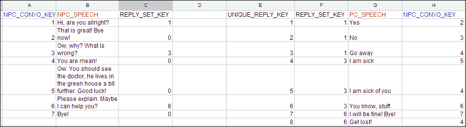
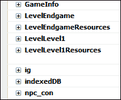
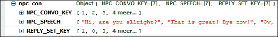
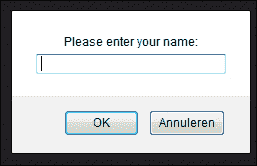
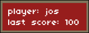
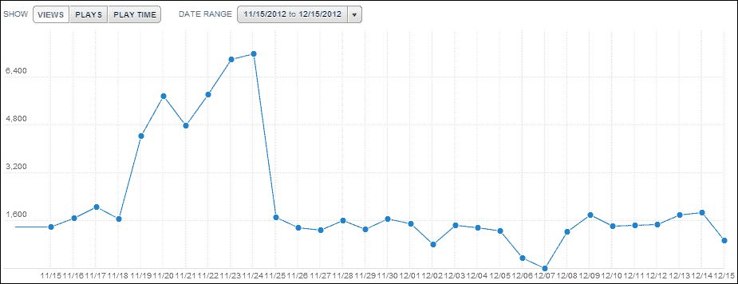
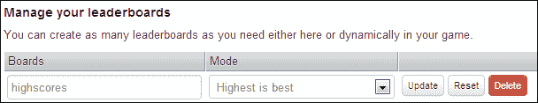
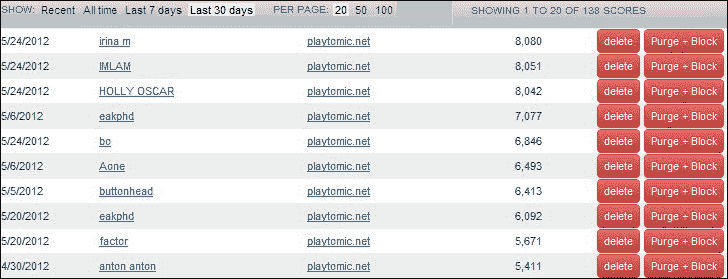

# 第五章：为您的游戏添加一些高级功能

在之前的章节中，我们看到了如何设置工作环境，看了 Impact 引擎，甚至构建了两种类型的游戏。现在是时候看一些有趣的额外内容了。

为了测试本章涵盖的元素，最好要么下载`第五章`文件夹中的代码材料，要么直接在我们设计的游戏中构建第三章中的游戏，*让我们建立一个角色扮演游戏*。由于本章我们不会使用 Box2D 扩展，一些东西将与第四章中的侧面卷轴游戏不兼容，*让我们建立一个侧面卷轴游戏*。在本章中，我们将涵盖：

+   制作开始和胜利画面

+   额外的调试可能性和引入定制的 ImpactJS 调试面板

+   使用 cookie 和 lawnchair 应用程序保存数据，并将 Excel 文件转换为有用的游戏数据

+   在第三章的角色扮演游戏（RPG）中的一些额外游戏功能，*让我们建立一个角色扮演游戏*

+   通过鼠标移动角色

+   智能生成位置

+   添加基本对话

+   显示玩家的生命值条

+   通过集体智慧扩展人工智能（AI）

+   实施 Playtomic 进行游戏分析

# 开始和游戏结束画面

当玩家开始游戏时，你可能希望他看到的第一件事是一个闪屏。这个屏幕通常包含游戏的名称和其他有趣的信息；通常包含一些关于游戏故事或控制的信息。在游戏结束时，你可以有一个胜利画面，告诉玩家他在排行榜上的得分有多高。

在代码方面，可以通过在实际游戏旁边引入新的游戏实例来实现。每个屏幕：开始、游戏结束和胜利都是 ImpactJS 游戏类的直接扩展。让我们首先创建一个开始画面。

## 游戏的开始画面

为了制作一个漂亮的开场画面，我们需要一个背景图片和我们信任的`main.js`脚本：

1.  打开`main.js`脚本并插入以下代码：

```js
OpenScreen = ig.Game.extend({
  StartImage : new ig.Image('media/StartScreen.png'),
  init:function(){
  if(ig.ua.mobile){
    ig.system.setGame(MyGame);
  }
    ig.input.bind(ig.KEY.SPACE,'LoadGame');
  },
  init:function(){
    if(ig.ua.mobile){ig.input.bindTouch( '#canvas','LoadGame' );}
    else {ig.input.bind(ig.KEY.SPACE,'LoadGame');}
  },
```

1.  开场画面是`ig.Game`函数的扩展，就像我们的游戏一样。事实上，当我们完成这里的工作后，我们将有四个游戏实例：一个真正的游戏称为`MyGame`，另外三个游戏，它们只是作为开始、胜利或游戏结束画面。这可能有点反直觉，因为你可能期望这些画面是同一个游戏的一部分。实际上，这绝对是真的。然而，在代码中，将这些画面转换为单独的游戏类扩展更方便。

1.  在`OpenScreen`代码的这一部分中，我们首先定义了我们将要显示的图像：`StartScreen.png`。

1.  最后，我们将空格键绑定到一个名为`LoadGame`的动作状态，如下所示：

```js
  update:function(){
    if(ig.input.pressed('LoadGame')){
      ig.system.setGame(MyGame);
    }
  },
```

1.  现在我们可以通过按空格键加载游戏，但我们仍然需要在屏幕上实际显示一些东西。

1.  我们可以通过操纵任何 ImpactJS 类的`draw()`函数来可视化事物，如下面的代码片段所示：

```js
  draw: function(){
    this.parent();
    this.StartImage.draw(0,0);
    var canvas = document.getElementById('canvas');
    if(canvas.getContext){
      var context = canvas.getContext('2d');
      context.fillStyle = "rgb(150,29,28)";
      context.fillRect (10,10,100,30);
    }
    var font = new ig.Font('media/font.png');
    font.draw('player:' + GameInfo.name,10,10);
  }
}),
```

1.  `draw()`函数将绘制我们在初始化`OpenScreen`函数时指定的背景图像。这样做后，它还会添加一个小的红色矩形，我们将在其中打印玩家的名字（如果有的话）。我们将在本章后面查看游戏数据时，获取这个名字并存储它以供以后使用。目前，`GameInfo.name`变量是未定义的，将会像开始新游戏一样显示出来。

1.  为了确保我们全新的开场画面实际上被使用，我们需要在我们的`ig.main`函数调用中用`OpenScreen`函数替换`MyGame`游戏类实例，如下面的代码行所示：

```js
ig.main( '#canvas', OpenScreen, 60, 320, 240, 2 );
```

现在我们有了一个开场画面！添加游戏结束画面和胜利画面的过程非常相似。在制作这些其他画面之前，让我们快速回顾一下我们刚刚做的事情：

+   我们确保`media`文件夹中有背景图像

+   我们添加了`OpenScreen`函数作为一个新的游戏实例

+   我们绑定了空格键，以便用来加载实际游戏

+   我们设置了`Draw()`函数，以便它可以显示背景，甚至以后还可以显示玩家的名字

+   我们在`OpenScreen`函数窗口中初始化了我们的画布，而不是在`MyGame`游戏类实例中

## 胜利和游戏结束画面

胜利画面是游戏实体的一个相对简单的扩展。对于我们想要显示的每种类型的画面，该过程几乎是相同的。要设置胜利画面，请按照以下步骤进行：

1.  打开`game.js`文件，并添加我们的新`GameEnd`游戏类，如下所示：

```js
GameEnd = ig.Game.extend({
  EndImage : new ig.Image('media/Winner.png'),

  init:function(){
    if(ig.ua.mobile){ig.input.bindTouch( '#canvas','LoadGame' );}
    else {ig.input.bind(ig.KEY.SPACE,'LoadGame');}
  },
```

1.  我们需要初始化的是我们将要显示的图像和一个用于重新开始游戏的键。

1.  与开始画面类似，我们使用空格键加载新游戏。我们通过在`update`函数中添加以下`if`语句来不断检查空格键是否被按下：

```js
  update:function(){
    if(ig.input.pressed('LoadGame')){
      ig.system.setGame(MyGame);
    }
  },
```

1.  我们需要使用以下代码绘制实际的游戏结束图像，并放置文本**HIT SPACE TO RESTART**。这样我们就确保玩家不会刷新浏览器而是使用空格键。

```js
  draw: function(){
    this.parent();
    var font = new ig.Font('media/font.png');
    this.StartImage.draw(0,0);

  if(ig.ua.mobile){
    font.draw('HIT THE SCREEN TO RESTART:',100,100);
  }
else font.draw('HIT SPACE TO RESTART:',100,100);
  }
}),
```

1.  当玩家到达游戏结束时，需要显示胜利画面。在我们的情况下，这将是当 boss 实体被击败时。打开`boss.js`文件，并按照以下代码更改`kill()`方法，以便在他死亡时加载胜利画面：

```js
kill: function(){
  ig.game.gameWon();
}
```

1.  在`kill()`方法中，我们调用了`gameWon()`函数，这是我们当前游戏的一个方法，但尚未定义。

1.  打开`game.js`文件，并将`gameWon()`方法添加为`MyGame`文件的一个新方法，如下所示。

```js
gameWon: function(){
  ig.system.setGame(GameEnd);
}
```

1.  目前，引入一个额外的中间函数来调用胜利画面可能看起来有点无聊。然而，一旦我们开始处理游戏数据，这将开始变得有意义。最终，这个函数不仅会调用胜利画面，还会保存玩家的得分。使用中间函数比直接将`ig.system.setGame()`函数添加到玩家实体中是一种更干净的编程方式。

### 注意

游戏结束画面可以是胜利画面的确切等价物，只是使用另一张图像，并且是由玩家的死亡而不是 boss 的触发。

1.  如下所示，在`game.js`文件中添加`gameOver`函数：

```js
gameOver = ig.Game.extend({
  gameOverImage : new ig.Image('media/GameOver.png'),
  init: function(){
    ig.input.bind(ig.KEY.SPACE,'LoadGame');
  },
  update:function(){
    if(ig.input.pressed('LoadGame')){
      ig.system.setGame(MyGame);
    }
  },
  draw: function(){
    this.parent();
    var font = new ig.Font('media/font.png');
    this.gameOverImage.draw(0,0);
    font.draw('HIT SPACE TO RESTART',150,50);
  }
}),
```

1.  通过使用以下代码调整他的`kill()`方法，确保`gameOver`函数在玩家死亡时被触发：

```js
kill: function(){
    ig.game.gameOver();
}
```

1.  再次调用中间函数来处理实际画面加载。这个函数需要作为`MyGame`游戏类实例的一个方法添加。

1.  在`game.js`脚本中，将`gameOver()`方法添加到`MyGame`游戏类实例中，如下所示：

```js
gameOver: function(){
  ig.system.setGame(gameOver);
},
```

这些都是非常基本的开始和游戏结束画面，它们表明可以通过使用`ig.game`类作为起点来完成。对于胜利和游戏结束画面，一个好主意是显示排行榜或在游戏过程中收集的其他有趣信息。

当游戏通过添加高级功能变得更加复杂时，调试变得越来越重要，以应对这些增加的复杂性。我们现在将看看我们可以使用哪些高级调试选项。然而，在我们这样做之前，让我们快速回顾一下胜利和游戏结束画面：

+   我们制作了两个新的游戏实例，作为胜利和游戏结束画面

+   `update`函数被调整以监听空格键，而`draw`函数被调整以显示背景图像和**HIT SPACE TO RESTART**消息

+   老板和玩家实体的功能被调整以触发胜利和游戏结束屏幕

+   我们使用了名为`gameOver()`和`gameWon()`的中间函数，因为我们希望稍后调整它们，以便触发 lawnchair 应用程序来存储分数

## 更高级的调试选项

在第一章中，*启动你的第一个 Impact 游戏*，我们看了如何使用浏览器进行调试以及 ImpactJS 调试面板提供了什么。在这里，我们将进一步制作一个新的 ImpactJS 调试面板。这段代码由 Dominic 在他的 ImpactJS 网站上提供，但很多人忽视了这个功能，尽管它非常有用。

在第一章中，*启动你的第一个 Impact 游戏*，我们还谈到了逻辑错误，这是一种非常难以找到的错误，因为它不一定会在浏览器调试控制台中生成错误。为了应对这些错误，程序员经常使用一种称为单元测试的方法。基本上，这涉及到预先定义每段代码的期望结果，将这些期望结果转化为条件，并测试输出是否符合这些条件。让我们看一个简短的例子。

## 单元测试的简短介绍

我们的 ImpactJS 脚本中最基本的组件之一是函数。我们的一些函数返回值，其他函数直接改变属性。假设我们有一个名为`dummyUnitTest()`的函数，它接受一个参数：`functioninput`。

```js
dummyUnitTest: function(inputnumber){
  var outputnumber= Math.pow(inputnumber,2);
  return null; // can cause an error in subsequentfunctions,comment out to fix it
  return outputnumber;
}
```

`inputnumber`变量可以是任何数字，但我们的函数将`inputnumber`变量转换为`outputnumber`变量，然后返回它。`inputnumber`变量的平方应该始终返回一个正数。所以我们至少可以说两件事关于我们对这个函数的期望：输出不能为 null，也不能为负数。

我们可以通过添加专门用于检查特定条件的`assert`函数来对这个函数进行单元测试。`assert`函数检查一个条件，当条件为假时，它会将消息写入控制台日志。控制台元素本身具有这个函数，当调试模块被激活时，ImpactJS 也有这个函数。`ig.assert()`函数是`Console.assert()`函数的 ImpactJS 等价物。记住，通过在`main.js`文件中包含`'impact.debug.debug'`来激活 ImpactJS 调试。使用`ig.assert`函数优于`console.assert()`函数。这是因为在准备启动游戏时，通过简单地关闭 ImpactJS 调试模块来摆脱`ig`类消息。控制台类的方法，如`console.assert()`调用需要单独关闭。一般来说，`assert()`函数看起来像这样：

```js
ig.assert(this.dummyUnitTest('expected')==='expected','you introduced a logical error you should retrieve the same value as the input');
```

对于我们的具体示例，我们可以执行几个测试，如下所示的代码：

```js
ig.assert(typeof argument1 === 'number','the input is not a number');
ig.assert(typeof argument2 === 'number','the output is not a number');
ig.assert(typeof argument2 >= 0,'the output is negative');
ig.assert(typeof argument2 != null,'the output is null);
```

我们可以继续，这种方法并不是没有过度的缺陷。但一般来说，当你计划构建一个非常复杂的游戏时，单元测试可以通过减少你寻找逻辑错误源的时间来极大地帮助你。例如，在这种情况下，如果我们的输出是一个负数，函数本身不会失败；也许大部分依赖于这个函数的代码也不会失败，但在链条的某个地方，会有问题。在引入所有这些依赖关系的同时，一个函数建立在另一个函数之上，依此类推，单元测试是完全合理的。

在`ig.assert()`和`ig.log()`函数旁边还有另一个有趣的函数。它是`console.log()`函数的 ImpactJS 等价物，将始终写入日志，而不检查特定条件。这对于在不必在**文档对象模型**（**DOM**）中寻找的情况下关注敌人的健康状况非常有用。

让我们在继续使用我们自己的 ImpactJS 调试面板之前，快速回顾一下单元测试的内容：

+   单元测试是关于预见您期望代码组件执行的操作，并返回和检查输出的有效性。

+   我们使用`ig.assert()`或`console.assert()`函数来检查某些条件，并在违反条件时向日志打印消息。

## 将您自己的调试面板添加到 ImpactJS 调试器

如前所述，通过简单地在`main.js`文件中包含`'impact.debug'`语句来激活调试面板。开始新游戏时，面板会最小化显示在屏幕底部，只需点击即可完全显示。

让我们开始构建我们自己的面板，这将使我们能够在玩游戏时激活和停用实体。这样我们就可以在游戏中毫无阻碍地通过最凶猛的敌人，通过冻结它们的位置。让我们开始吧：

1.  打开一个新文件，将其保存为`MyDebugPanel.js`。

1.  在文件中插入以下代码：

```js
ig.module(
  'plugins.debug.MyDebugPanel'
)
.requires(
  'impact.debug.menu',
  'impact.entity',
  'impact.game'
)
.defines(function(){
ig.Game.inject({
  loadLevel: function( data ) {
    this.parent(data);
    ig.debug.panels.fancypanel.load(this);
  }
})
})
```

1.  在我们实际定义面板之前，我们将在两个 ImpactJS 核心类中注入代码：`Game`和`Entity`。注入代码就像扩展一样，只是我们不创建一个新类。原始代码被其扩展版本所替换。在前面的代码中，我们告诉核心`loadlevel()`函数也要加载我们的面板，这将被称为**Fancy panel**。

1.  然后，通过在核心实体代码中添加一个新属性`_shouldUpdate`来升级，如下所示：

```js
ig.Entity.inject({
  _shouldUpdate: true,update: function() {if( this._shouldUpdate ) {this.parent();}
  }
});
```

1.  当为 true 时，实体的`update`方法将被调用，这也是默认方法。但是，当为 false 时，`update()`函数将被绕过，并且实体不会执行任何实际操作。

1.  现在让我们来看看面板本身。我们可以看到面板中包含以下代码：

```js
MyFancyDebugPanel = ig.DebugPanel.extend({
  init: function( name, label ) {
    this.parent( name, label ); 
    this.container.innerHTML = '<em>Entities not loadedyet.</em>';
  },
}
```

1.  我们的花哨面板被初始化为 ImpactJS 面板的扩展，称为`DebugPanel`。调用`this.parent`函数将确保向面板提供一个 DIV 容器，以便它可以在 HTML5 中显示。如果游戏中没有实体，容器将不包含任何内容，因此会放置一条消息。例如，这将是我们的开始和结束屏幕的情况。由于`this.container.innerHTML`函数将保存面板的内容，因此在开始屏幕中打开面板应该会显示消息**Entities not loaded yet**。

为了显示先前的消息，我们应该在`this.container.innerHTML`函数中添加以下代码：

```js
load: function( game ) {
  this.container.innerHTML = '';
    for( var i = 0; i < game.entities.length; i++ ) {
      var ent = game.entities[i];
      if( ent.name ) {
        var opt = new ig.DebugOption( 'Entity ' + ent.name, ent,'_shouldUpdate' );
        this.addOption( opt );
        this.container.appendChild(document.createTextNode('health: '+ ent.name + ' :' +ent.health));
      }
    }
},
```

1.  在加载级别时，我们的面板将填充游戏中的所有实体，并提供关闭它们的`update()`函数的选项。还会显示它们的健康状况。`addOption()`函数使得可以在需要时从 true 切换到 false，并反之。它接受两个参数：一个标签和需要在 true 和 false 之间交替的变量。

1.  这些最后的函数并没有用于我们特定的面板，但仍然很有用。以下代码解释了先前的函数：

```js
ready: function() {
  // This function is automatically called when a new gameis created.
  // ig.game is valid here!
},
beforeRun: function() {
  // This function is automatically called BEFORE eachframe is processed.
},
afterRun: function() {
  // This function is automatically called AFTER each frameis processed.
}
});
```

1.  `load()`、`ready()`、`beforeRun()`和`afterRun()`函数之间的主要区别在于它们在游戏中被调用的时刻。根据您的需求，您将使用一个，另一个或者组合。我们使用了`load()`方法，它在加载级别时被调用。但对于其他面板，您可能希望使用其他方法。

1.  最后一步，我们实际上将定制面板添加到我们的标准面板集中，如下所示：

```js
ig.debug.addPanel({
  type: MyFancyDebugPanel,
  name: 'fancypanel',
  label: 'Fancy Panel'
});
```

1.  重新加载游戏，看看您的新面板。尝试冻结您的敌人！您会注意到敌人仍然会面对玩家，但不会朝向他移动。这是因为我们禁用了它们的`update()`方法，但没有禁用它们的`draw()`方法。

现在我们将继续使用游戏数据，但让我们首先看一下我们刚刚涵盖的内容：

+   ImpactJS 有一个非常有趣的调试器，您可以设计自己的面板。

+   通过在主脚本中包含`'impact.debug.debug'`命令来激活 ImpactJS 调试器。

+   我们通过扩展 ImpactJS 的`DebugPanel`类制作了自己的面板。我们自己的面板需要让我们能够将任何实体冻结在位置上，这样我们就可以无阻碍地探索我们的关卡。

+   利用一种称为注入的技术；我们改变了我们的核心实体类，以便调试面板可以控制每个实体的`update`函数。

+   最后，我们将我们的调试面板添加到标准设置中，以便随时可用。

# 处理游戏数据

处理数据对于游戏构建可能是至关重要的。简单的游戏不需要显式的数据管理。然而，当我们开始研究那些包含对话或保持高分的游戏时，理解数据处理就成为一个重要的话题。我们将讨论两件事：

+   将数据引入游戏

+   存储在游戏中生成的数据

对于后者，我们将看看解决问题的两种不同方式：cookie 和 lawnchair 应用程序。

首先让我们看看如果我们想要在 NPC 和玩家之间的对话中引入数据，我们需要做些什么。

## 向游戏添加数据

如前所述，RPG 游戏通常充满了玩家和多个非玩家角色（NPC）之间的对话。在这些对话中，玩家在回答时会有几个选项。这方面的代码机制可能会变得非常复杂，我们将在本章后面详细介绍，但首先我们需要实际的句子。我们可以在诸如 Excel 之类的应用程序中准备这些句子。



设置 RPG 对话是一门艺术；有许多方法可以做到这一点，每种方法都有其优缺点。创建一个体面的对话设置和流程，甚至是数据库方面的，是一个超出本书范围的讨论。在这里，我们将尽量简单，并与两个表一起工作：一个用于 NPC 可以说的所有事情，另一个用于玩家可以回答的事情。我们游戏中对话的流程将如下：

1.  NPC 说了些什么。NPC 可以说的一切都有一个名为**NPC_CONVO_KEY**的唯一键。

1.  玩家将被呈现一组可能的答案。每组都有一个名为**REPLY_SET_KEY**的键。除此之外，虽然我们不会使用它，但每个答案都有自己的唯一键，我们称之为**UNIQUE_REPLY_KEY**。即使你现在不使用它们，拥有主键也是一个很好的做法。

1.  玩家选择其中一个答案。答案有一个外键，指向 NPC。我们将这个外键命名为**NPC_CONVO_KEY**。

1.  使用**NPC_CONVO_KEY**，NPC 知道接下来该说什么，我们已经完成了循环。这将继续进行，直到对话被突然中止或自然结束。

实际的句子保存在变量**PC_SPEECH**和**NPC_SPEECH**中。

我们可以在 Excel 文档中轻松准备我们的数据，但我们仍需要将其导入到我们的游戏中。我们将使用转换器，例如以下网站上的转换器：[`shancarter.com/data_converter/`](http://shancarter.com/data_converter/)。

只需将数据从 Excel 复制粘贴到转换器中，并选择**JSON-Column Arrays**，即可将数据转换为 JSON 格式文档。

一旦以这种格式存在，我们所需要做的就是将数据复制粘贴到单独的模块中。以下代码是我们的 Excel 数据转换为 JSON 后的样子：

```js
ig.module('plugins.conversation.npc_con')
.defines(function(){
npc_con=/*JSON[*/{
  "NPC_CONVO_KEY":[1,2,3,4,5,6,7],
  "NPC_SPEECH":["Hi, are you allright?","That is great! Bye now!","Ow, why? What is wrong?","You are mean!","Ow. You should see the doctor, he lives in the green house a bitfurther. Good luck!","Please explain. Maybe I can help you?","Bye!"],
  "REPLY_SET_KEY":[1,0,3,0,0,6,0]
}
});
```

我们将数据以 JSON 格式存储，就像 Weltmeister 对级别文件所做的那样。以下代码是玩家的语音数据转换为 JSON 后的样子：

```js
ig.module( 'plugins.conversation.pc_con' )
.defines(function(){
pc_con=/*JSON[*/{
  "UNIQUE_REPLY_KEY":[1,2,3,4,5,6,7,8],
  "REPLY_SET_KEY":[1,1,1,3,3,3,6,6],
  "PC_SPEECH":["Yes","No","Go away","I am sick","I am sick of you","You know, stuff.","I will be fine! Bye!","Get lost! "],
  "NPC_CONVO_KEY":[2,3,4,5,4,6,7,4]
}
});
```

现在剩下的就是将数据放入我们的游戏目录，并在`main.js`文件中包含这两个文件：

```js
'plugins.conversation.npc_con',
'plugins.conversation.pc_con',
```

如果您重新加载游戏，您应该能够在 Firebug 应用程序中探索您新引入的数据，如下面的屏幕截图所示：



现在我们已经看了如何引入数据，让我们来看一下两种在玩家计算机上存储数据的方法，首先是使用 cookie。但首先让我们总结一下我们在这里所做的事情：

+   设置对话是一门艺术，本章不会深入探讨

+   我们在 Excel 或等效应用程序中设置了一个简单的对话

+   这个 Excel 表格被转换为 JSON 格式的文档。您可以使用在线转换器来做到这一点，比如[`shancarter.com/data_converter/`](http://shancarter.com/data_converter/)

+   我们将新的 JSON 编码数据转换为 ImpactJS 模块

+   最后，我们在我们的主脚本中包含了这两个新创建的数据模块

## 使用 cookie 在玩家的计算机上存储数据

Cookie 不过是存储在浏览器中的一段字符串数据，许多网站用它来跟踪访问者。如果您使用 Google Analytics，您可能知道 Google 提供了一个脚本，为每个访问者放置了几个不同的 cookie。Google Analytics 并不是唯一以这种方式工作的程序。在一天愉快的上网之后，您的浏览器中充满了 cookie；其中一些将在几个月内保留，直到最终删除自己。

在用户的浏览器中存储玩家姓名和最高分等信息是有意义的；您不需要从您这边进行存储，因此不需要 PHP 或 SQL 编码。缺点是如果玩家决定清理浏览器，数据将丢失。此外，在使用 cookie 时与玩家之间没有真正的一对一关系。一个人可以有多个设备，甚至每个设备可以有多个浏览器。因此，建议对您总是从头开始重玩的游戏使用 cookie。对于需要玩家大量时间投入的游戏来说，这显然不适用；例如，大型多人在线角色扮演游戏（MMORPGs）往往是如此。对于这些更高级的游戏，使用帐户和服务器端数据库是正确的方式。

让我们按照以下步骤构建一个能够存储玩家姓名的 cookie 插件，这样我们可以在重新开始游戏时检索它：

1.  打开一个新文件，将其保存为`cookie.js`。插入基本的类扩展代码如下：

```js
ig.module('plugins.data.cookie').
  defines(function(){
    ig.cookie = ig.Class.extend({
    userName : null,
    init: function(){
      this.checkCookie();
  },
```

1.  我们首先将我们的 cookie 插件定义为 ImpactJS 类扩展。我们知道它以后将需要存储用户名，所以让我们用值`null`来初始化它。我们的新 DOM 对象创建时，第一件事就是调用`checkCookie()`函数。`checkCookie()`函数将检查是否已经存在存储了相同用户名的 cookie。当然这里有两种可能性：存在或不存在。如果不存在，需要提示并存储名称。如果用户名以前已存储，可以检索出来。

1.  将 cookie 放置在位置上是使用`setCookie()`函数完成的，如下面的代码所示：

```js
setCookie: function(c_name,value,exdays){
  var exdate=new Date();
  exdate.setDate(exdate.getDate() + exdays);
  var c_value=escape(value) + ((exdays==null) ? "" : ";expires="+exdate.toUTCString());
document.cookie=c_name + "=" + c_value;
},
```

1.  这个函数接受三个参数：

+   `c_name`：它需要存储的变量的名称，即用户名

+   `value`：用户名的值

+   `exdays`：cookie 允许存在的天数，直到它应该从浏览器中删除自己

1.  `setcookie()`函数用于检查输入数据的有效性。该值被转换，因此业余黑客更难插入有害代码而不是名称。然后将数据存储在`document.cookie`变量中，这是 DOM 的一部分，它存储所有 cookie，并在关闭页面时不会丢失。深入研究`document.cookie`变量的工作方式将使我们走得太远，但它的行为非常奇特。如前面的代码片段所示，将值分配给`document.cookie`变量不会用新分配的值替换已经存在的值。相反，它将添加到堆栈的其余部分。

1.  如果有`setCookie()`函数，当然也有`getCookie()`函数，如下面的代码片段所示：

```js
getCookie: function(c_name){
  var i,x,y,ARRcookies=document.cookie.split(";");
  for (i=0;i<ARRcookies.length;i++){
    x=ARRcookies[i].substr(0,ARRcookies[i].indexOf("="));
    y=ARRcookies[i].substr(ARRcookies[i].indexOf("=")+1);
    x=x.replace(/^\s+|\s+$/g,"");
    if (x==c_name){
      return unescape(y);
    }
  }
},
```

1.  前面的代码将解码转换后的 cookie 并返回它。它的唯一输入参数是您要查找的变量的名称。

1.  在编程中，特别是在 Java 中，很常见使用`set`和`get`函数的组合来更改属性。因此，根据这种编程逻辑，例如`health`属性应该始终具有`setHealth()`和`getHealth()`函数。直接更改参数有优点和缺点。直接更改属性的主要优点是实用主义；事情保持简单和直观。一个很大的缺点是维护代码的有效性的挑战。如果任何地方都可以随意更改任何实体的任何属性，如果失去了对事物的视野，就会出现严重问题。

1.  `checkCookie()`函数通过使用`getCookie()`函数检查浏览器中是否存在用户名：

```js
checkCookie :function(){
  var username=this.getCookie("username");
  if (username!=null && username!=""){
  this.setUserName(username);
  }
  else {
    username=prompt("Please enter your name:","");
    if (username!=null && username!=""){
      this.setCookie("username",username,365);
    }
  }
},
```

1.  如果存在 cookie，则使用获取的用户名作为输入参数调用`setUserName()`函数。如果没有 cookie，则提示玩家插入他/她的名字，然后使用`setCookie()`函数存储。

1.  `getUserName()`和`setUserName()`函数在本示例中保持相对基本，如下面的代码所示：

```js
getUserName: function(){
  return this.userName;
},
setUserName: function(userName){
  if(userName.length > 10){alert("username is too long");}
  else { this.userName = userName; }
}
```

1.  `setUsername()`和`getUsername()`函数可以通过直接使用`checkCookie()`和`setCookie()`函数来获取或设置`this.username`命令来省略。然而，正如前面所说的，使用`set`和`get`语句是一种良好的编程实践，无论何时需要更改属性。正如在`setUserName()`函数中所看到的，这些函数可以内置一些额外的检查。虽然`getCookie()`和`setCookie()`函数确保数据以无害的方式存储和适当获取，但`setUserName()`和`getUserName()`函数可以用于检查其他约束，例如名称长度。

1.  现在我们已经完成了我们的 cookie 扩展，我们实际上可以利用它。打开`main.js`文件，并将以下两行添加到`GameInfo`类中：

```js
this.cookie = new ig.cookie();//ask username or retrieve ifnot set
this.userName = this.cookie.getUserName();//store theusername
```

1.  `GameInfo`类非常适合这个；我们希望在游戏实例之外保持可用的所有内容都需要在`GameInfo`类中收集。尽可能将数据组件与游戏逻辑分离是保持代码清晰和易于理解的一种方式，当游戏变得更加复杂时。

1.  我们的第一行代码将创建一个`ig.cookie`数组，并立即检查用户名是否存在。如果不存在，将出现提示，并在玩家填写提示警报后存储该名称。

1.  第二行简单地将用户名传递给我们在第三章中首次遇到的`GameInfo`对象，*让我们建立一个角色扮演游戏*。您可能还记得，我们在本章的开头使用了`GameInfo.name`变量，但它是未定义的。现在它将被设置为`null`，直到玩家给出他的名字，并且以后用于他玩的每个游戏。

最初，玩家的名字将是未知的，并且在屏幕上将显示**null**，如前一个截图所示。



然而，玩家被提示在窗口中填写他或她的名字，如前一个截图所示。


因此，真实姓名将如前一个截图所示地显示在屏幕上。

虽然您应该能够绕过使用 cookie，但还有另一种存储数据的方式，可能更多功能和易于使用：lawnchair。lawnchair 应用程序利用 HTML5 本地存储，也称为 DOM 存储。在转向 lawnchair 应用程序之前，我们将快速了解如何在不使用 lawnchair 应用程序的情况下使用 HTML5 本地存储：

+   Cookie 是一种在玩家浏览器中存储数据的方式。许多网站使用它们，包括网络分析平台 Google Analytics。Cookie 对于短时间内反复玩的游戏很有用，而不适用于需要长时间存储许多东西的复杂游戏。

+   我们可以通过创建一个`cookies`插件来实现使用 cookie。一旦激活了这个插件，它将检查是否已经存在 cookie，如果没有找到，则放置一个。

+   在这个例子中，我们使用 cookie 来存储和检索玩家的名字，如果没有 cookie，我们首先要求他填写。

+   重点放在使用`set()`和`get()`函数上。这些函数是 Java 中的标准做法，是一种有用的技术，可以在代码中保持对事物的视野，并检查任何属性的有效性，即使代码变得更加复杂。

## 本地存储

本地存储，也称为 DOM 存储，是 HTML5 的一个功能，允许您在用户的计算机上保存信息。它几乎在所有方面都优于 cookie，但是旧版浏览器不支持它。使用本地存储相当简单，如下面的代码片段所示：

```js
ig.module('plugins.data.local').
defines(function(){
  ig.local = ig.Class.extend({
    setData: function(key, data){
      localStorage.setItem(key, data);
    },
    getData: function(key){ 
      return localStorage.getItem(key);
    }
  });
})
```

这个插件并不是必需的，以便使用本地存储。它只是一个扩展，使用`get`和`set`技术来检查数据的有效性。您可以通过在`main.js`脚本中包含`'plugins.data.local'`命令并调用`setData()`和`getData()`函数来使用该插件。

```js
Ls = new ig.local(); //localstorage
  Ls.setData("name","Davy");
  alert(Ls.getData("name"));
```

现在我们来快速看一下如何一般使用本地存储；让我们看看 lawnchair 应用程序提供了什么。

## 使用 lawnchair 作为存储数据的多功能方式

lawnchair 应用程序是在客户端存储数据的免费且非常专业的解决方案。它能够以多种方式存储数据，并且 ImpactJS 的插件已经准备就绪。让我们看看如何使用 lawnchair 应用程序来存储数据：

1.  从以下网站下载 lawnchair 应用程序：[`brian.io/lawnchair/`](http://brian.io/lawnchair/)，或者您可以在[`github.com/jmo84/Lawnchair-plugin-for-ImpactJS`](https://github.com/jmo84/Lawnchair-plugin-for-ImpactJS)上下载适用于 ImpactJS 的版本。

1.  将文件放入您的`plugin`文件夹中。在这个例子中，它们被放在名为`data`和`Lawnchair`的单独子文件夹中。但是，只要确保相应地更改代码，您可以自由使用任何结构。

1.  在您的`main.js`文件中包含`impact-plugin`文件，如下面的代码所示：

```js
'plugins.data.lawnchair.impact-plugin',
```

1.  通过使用新获得的`ig.Lawnchair()`方法，将存储元素添加到您的`GameInfo`类中，如下面的代码行所示：

```js
this.store = new ig.Lawnchair({adaptor:'dom',table:'allscores'},function() { ig.log('teststore is ready'); }),
```

`ig.Lawnchair()`方法接受两个输入参数：

+   第一个参数是最重要的，实际上是一个数组。在这个数组中，您需要指定两件事情：您想要使用哪种方法来存储所有内容，以及您想要创建的数据存储的名称。第一个变量称为`adaptor`，因为 lawnchair 应用程序使用适配器模式技术来决定接下来需要发生什么。lawnchair 应用程序编程非常高效，通过使用模式立即变得明显。适配器模式本质上是一段代码，将您自己的代码链接到 lawnchair 应用程序的存储系统。没有这种模式，要与实际的 lawnchair 应用程序源代码进行通信将会非常困难。在这里，我们选择将其保存为永久 DOM 存储，但也可以选择其他选项，如 Webkit-SQLite。

### 注意

Webkit-SQLite 与永久 DOM 存储不同，它更像是一个常规数据库，但是在客户端的本地存储上运行。例如，像其他数据库一样，您可以使用 SQL 查询 Webkit-SQLite 存储。

+   第二个输入参数是可选的。在这里，您可以放入需要在准备好`store`变量时执行的函数。这是放置日志消息的完美位置。

1.  现在我们的存储元素已经准备就绪，只需调用`store.save()`方法存储任何您想要的数据。假设我们想要存储玩家的分数。为此，我们可以向`GameInfo`类添加一个执行相同操作的方法。

```js
this.saveScore = function(){
  this.store.save({score:this.score});
}
```

1.  `saveScore()`函数可以添加到我们构建胜利和游戏结束屏幕时创建的`gameOver()`和`gameWon()`方法中，如下所示：

```js
gameOver: function(){
 GameInfo.saveScore();
  ig.system.setGame(gameOver); 
},
gameWon: function(){
 GameInfo.saveScore();
  ig.system.setGame(GameEnd); 
}
```

1.  当玩家死亡或赢得比赛时，他的分数将使用 lawnchair 永久 DOM 方法保存。永久 DOM 并不意味着 DOM 永久保存在用户的 PC 上；这只是本地存储的另一个名称。

1.  我们需要能够做的最后一件重要的事情是检索数据。为此，我们向`GameInfo`类引入了三个新函数：

+   如果输入参数是实际数字，`setScore()`函数将把输入参数保存为`GameInfo.score`类，如下面的代码所示：

```js
this.setScore = function(score){
  if(typeof score == 'number')
  this.score = score;
}; 
```

+   `getScore()`方法将只返回存储在`GameInfo.score`类中的`分数值`，如下面的代码所示：

```js
this.getScore = function() {
  return this.score;
};
```

### 注意

`setScore()`和`getScore()`似乎并不太重要，但正如在查看 cookies 概念时所解释的，使用`set`和`get`语句对数据有效性进行检查是有用的。

+   `GameInfo.getSavedScore()`方法是`GameInfo.saveScore()`方法的镜像相反，如下面的代码所示：

```js
this.getSavedScore = function(){
  this.store.get('score',function(score){GameInfo.setScore(score.value) });
  return this.getScore();
};
```

1.  `getSavedScore()`方法利用`setScore()`函数将`GameInfo.score`类设置为从存储中提取的数字，然后使用`getScore()`方法返回此分数，其中可以对数据有效性进行一些额外的测试。

1.  现在，您可以随时检索最后达到的分数！

1.  我们可以调整我们的开屏，以便通过将以下代码行添加到其`draw()`函数中显示最后达到的分数。

```js
font.draw('last score: ' + GameInfo.getSavedScore(), 10,20); 
```

玩家的最后得分如下截图所示：



关于数据存储的足够了，让我们快速了解一下 cookies、本地存储以及使用本地存储的更多灵活的方式：lawnchair 之间的区别。

|   | 存储大小 | 过期日期 | 信息安全 |
| --- | --- | --- | --- |
| **Cookies** | 非常有限 | 固定 | 可以在 URL 中看到，并将被发送到接收服务器和返回到本地计算机。 |
| **本地存储** | 大 | 会话或无限 | 存储在本地计算机上，没有任何东西发送到服务器和从服务器返回。 |
| **lawnchair** | 大 | 取决于所选的技术 | 存储在本地计算机上，没有任何东西发送到服务器和从服务器返回。 |

简而言之，本地存储是保存数据的新方法。你仍然可以使用 cookies，但是新的隐私规则规定你必须在使用它们之前征得许可。

总结完整的数据存储概念，我们得出结论：

+   lawnchair 应用程序是一个可自由下载的代码包，可以处理所有客户端存储需求。它可以使用多种方法保存，如永久 DOM 存储或 Webkit-SQLite。

+   推荐的可下载代码包位于[`github.com/jmo84/Lawnchair-plugin-for-ImpactJS`](https://github.com/jmo84/Lawnchair-plugin-for-ImpactJS)，因为它带有一个 ImpactJS 插件。

+   利用 lawnchair 存储系统包括包含库并将我们的`GameInfo`类的变量初始化为 lawnchair 应用程序的对象。然后我们可以通过使用`this`对象来存储和检索数据，因为它继承了所有的 lawnchair 方法。

# RPG 的额外功能

在这一部分，我们将看一些额外的功能，这些功能可能对于像我们在第三章中设计的 RPG 游戏特别有用，*让我们建立一个角色扮演游戏*。首先，我们将通过鼠标点击实现角色移动，这对于移动游戏特别有用，因为触摸屏幕相当于点击鼠标。然后我们将添加一个智能生成点。这个生成点首先检查生成实体是否会导致碰撞，并相应地调整其生成坐标。第三个元素是玩家和非玩家角色（NPC）之间的对话。最后一个附加功能是基本的头顶显示（HUD），允许玩家跟踪他们的健康状况。

## 通过鼠标点击移动玩家

直到现在，我们通过键盘箭头键移动我们的玩家。这是非常直观的，但有时是不可能的。如果你在 iPad 或其他移动设备上打开游戏，由于没有箭头键，你无法移动你的角色。在这种情况下，如果我们的角色只需朝着我们在屏幕上触摸的位置走就更有用了。在 ImpactJS 中，鼠标点击和触摸被视为相同的东西，这取决于设备。因此，通过鼠标点击实现移动自动导致了移动触摸设备。要使玩家通过点击鼠标或触摸屏幕移动，需要按照以下步骤进行：

1.  在`main.js`文件中，将鼠标点击绑定到名为`'mouseclick'`的动作。

```js
ig.input.bind(ig.KEY.MOUSE1, 'mouseclick');
```

1.  打开`player.js`文件并添加一些额外的初始变量。一旦我们开始使用即将添加的鼠标功能，我们将需要这个。

```js
name: "player",
movementspeed : 100,
mousewalking : 0,
takemouseinput : 0,
animSheet: new ig.AnimationSheet|( 'media/player.png', 32, 48 ),
```

1.  如果`movementspeed`变量还不是一个`"player"`属性，确保现在添加它。`mousewalking`命令是一个标志变量；值为`1`表示玩家必须按鼠标点击的命令行走。当鼠标被点击并且目标坐标被计算后，`takemouseinput`变量的值被设置为`1`，然后立即返回到`0`。没有这个变量，可能会通过鼠标位置来操纵你的角色，而不是单击一次。这是一个选择的问题；通过鼠标位置而不是鼠标点击来操纵可以成为有效和直观的控制方案的一部分。

1.  使用以下代码将`mousemovement()`方法添加到`"player"`实体：

```js
mousemovement: function(player){
if (player.mousewalking == 1 && player.takemouseinput == 1){
  player.destinationx = ig.input.mouse.x + ig.game.screen.x;
  player.destinationy = ig.input.mouse.y + ig.game.screen.y;
  player.takemouseinput = 0;
}
else if(player.mousewalking == 1){
  var distancetotargetx = player.destinationx - player.pos.x - (player.size.x/2) ;
  var distancetotargety = player.destinationy - player.pos.y -(player.size.y/2) ;
  if (Math.abs(distancetotargetx) > 5 ||Math.abs(distancetotargety) > 5){
    if (Math.abs(distancetotargetx) > Math.abs(distancetotargety)){
      if (distancetotargetx > 0){
        player.vel.x = player.movementspeed;
        var xydivision = distancetotargety / distancetotargetx;
        player.vel.y = xydivision * player.movementspeed;
        player.currentAnim = player.anims.right;
        player.lastpressed = 'right';
      }
      else{
        player.vel.x = -player.movementspeed;
        var xydivision = distancetotargety /Math.abs(distancetotargetx);
        player.vel.y = xydivision * player.movementspeed;
        player.currentAnim = player.anims.left;
        player.lastpressed = 'left';
      }
      }
    else{
      if (distancetotargety > 0){
        player.vel.y = player.movementspeed;
        var xydivision = distancetotargetx / distancetotargety;
        player.vel.x = xydivision * player.movementspeed;
        player.currentAnim = player.anims.down;
        player.lastpressed = 'down';
      }
      else{
        player.vel.y = -player.movementspeed;
        var xydivision = distancetotargetx /Math.abs(distancetotargety);
        player.vel.x = xydivision * player.movementspeed;
        player.currentAnim = player.anims.up;
        player.lastpressed = 'up';
      }
      }
    }
  else{
    player.vel.y = 0;
    player.vel.x = 0;
    player.mousewalking = 0;
    player.currentAnim = player.anims.idle;
  }
}
},
```

1.  这个函数的长度可能有点令人生畏，但实际上相同的逻辑被重复了几次。该函数基本上有两个功能：它可以设置目的地坐标，也可以使玩家朝着目标移动。在大多数情况下，不需要计算新的目标。因此，第一个检查是是否需要使用新的目的地。为此，`player.takemouseinput`和`player.mousewalking`变量都需要为`true`。在计算目标位置坐标时，对游戏屏幕的位置进行了修正。

1.  然后，函数继续进行实际的移动；是否进行移动由`player.mousewalking`变量的值（`True`或`False`）设置。

1.  如果玩家需要行走，实际距离将被计算到目标的 x 和 y 轴，并存储在本地变量`distancetotargetx`和`distancetotargety`中。当目标在任一轴上与玩家相距 5 像素时，玩家将不会移动。

1.  然而，如果距离大于 5 像素，玩家将以线性方式朝着目标移动。为了确保玩家以预设的移动速度移动，他将在剩余距离最大的轴上这样做。假设玩家在 x 轴上离目标很远，但在 y 轴上不那么远。在这种情况下，他将以 x 轴上的预设移动速度移动，但在 y 轴上的速度小于预设移动速度。此外，他将面向左或右，而不是上或下。

1.  两个最重要的触发变量：`player.mousewalking`和`player.takemouseinput`的初始值为`0`；当鼠标点击被注册时，它们需要被设置为`1`。我们在`update()`函数中执行此操作，如下面的代码所示：

```js
if( ig.input.pressed('mouseclick')){
this.mousewalking = 1;
this.takemouseinput = 1;
}
```

1.  我们刚刚确保游戏在每个新帧都会检查鼠标是否被点击。

1.  如果我们现在通过添加对`mousemovement()`方法的调用来调用我们的更新函数，玩家将在屏幕上注册鼠标点击的地方行走。

```js
mousemovement();
```

1.  当然，我们的键盘控件仍然存在，这将导致问题。为了使两种控制方法都能正常工作，我们只需要在按下键盘上的任意一个键时，将`player.mousewalking`变量的值设置为`0`，如下面的代码所示，用于上箭头键：

```js
if(ig.input.state('up')){
  this.mousewalking = 0;
  this.vel.y =this.movementspeed;
  this.currentAnim = this.anims.up;
  this.lastpressed = 'up';
}
```

1.  需要不断使用以下代码来检查`player.mousewalking`变量的值是否为`0`。如果不是，我们的旧控制系统将立即停止移动，因为没有注册键盘输入。

```js
Elseif(this.mousewalking == 0){
  this.vel.y = 0; 
  this.vel.x = 0;
  this.currentAnim = this.anims.idle;
}
```

1.  最后，保存您的文件并重新加载游戏。

现在，您应该能够通过在屏幕上的任何位置单击鼠标来四处走动。如果玩家遇到障碍物，您可能会注意到轻微的航向调整。但是，如果障碍物太大，玩家就不够聪明去绕过它。作为玩家，您需要自己避开障碍物。

让我们看看如何创建一个智能的生成位置。但在这样做之前，让我们回顾一下刚刚讨论的内容：

+   能够通过鼠标点击移动玩家是一个有趣的功能，尤其是在移动到移动设备时，因为在那里键盘不是一个选项。在 ImpactJS 中，鼠标的点击被视为与触摸 iPad 屏幕相同。

+   目前，我们的玩家可以使用键盘四个方向键移动，因此我们需要实现同时使用键盘方向键和鼠标的可能性。所有这些调整将在玩家实体内进行。

+   我们引入了一个名为`mousemovement()`的新方法，该方法在玩家的`update`函数中被重复调用。在任何时候，我们的方法都会检查是否给出了通过鼠标点击移动的命令，如果是，将移动玩家到所需位置。

+   除了添加这个新方法，我们还需要调整旧的移动代码，以便允许同时使用箭头键和新实现的鼠标点击移动。

## 添加智能生成位置

在 Weltmeister 中构建关卡时，可以立即将敌对实体添加到关卡本身。这很好，但有时增加一些不可预测性会增加游戏的重玩价值。这可以通过添加智能生成来实现：在随机位置生成敌人，但考虑到其他实体和碰撞层的碰撞。为了做到这一点，我们需要按照以下步骤创建一个新的插件：

1.  创建一个新文件，并将其保存为`spawnlocations.js`。

1.  将`'plugins.functions.spawnlocations'`命令添加到你的`main.js`文件中。

1.  创建一个`ig.spawnlocations`变量，作为 ImpactJS 类的扩展，如下面的代码所示：

```js
ig.module('plugins.functions.spawnlocations').defines(function(){
  ig.spawnlocations = ig.Class.extend({
  });
})
```

1.  添加`spawnIf()`方法，这是一个回调函数，如下面的代码所示。当满足某些条件时，它可以再次调用自身。

```js
spawnIf: function(x, y)
{
  if (this.CollisionAt(x,y) || this.getEntitiesAt(x,y)){
    var x1 = x + Math.round(Math.random())*10;
    var x2 = x + Math.round(Math.random())*10;
    this.spawnIf(x1,x2); //recursion
  }
  ig.game.spawnEntity('EntityEnemy', x, y);
},
```

1.  `spawnIf()`函数接受一个 x 和 y 的起始坐标，并检查是否与碰撞层或实体发生碰撞。如果是这种情况，原始坐标将在两个轴上的随机像素数上进行调整。然后，这些新坐标将被重新提交给`spawnIf()`函数，直到找到一个空闲位置。一旦不再检测到碰撞，敌人就会在那个位置生成。它需要的`CollisionAt()`和`getEntitiesAt()`函数也是`spawnlocations`类的一部分。

1.  `getEntitiesAt()`函数将检测与需要生成的敌人重叠的实体。以下代码描述了`getEntitiesAt()`函数应用的检测过程：

```js
getEntitiesAt: function(x, y)
{
  var n = ig.game.entities.length;
  var ents = [];
  for (var i=0; i<n; i++)
  {
    var ent = ig.game.entities[i],
    x0 = ent.pos.x,
    x1 = x0 + ent.size.x,
    y0 = ent.pos.y,
    y1 = y0 + ent.size.y;
    if (x0 <= x && x1 > x && y0 <= y && y1 > y)
      return true;
  }
  return false;
},
```

1.  逐个检查实体，以查看它们是否重叠，使用它们的位置、宽度和高度。如果与单个实体重叠，循环将被中止，`getEntitiesAt()`函数将返回值`true`。如果没有检测到重叠，它将返回值`false`。

1.  虽然`getEntitiesAt()`函数检查与其他实体的可能碰撞，`CollisionAt()`函数检查敌人是否会与碰撞层重叠，如下面的代码片段所示：

```js
CollisionAt: function(x,y)
{
  var Map = ig.game.collisionMap;
  var ent = new EntityEnemy();
  var res = Map.trace( x, y, x+ ent.size.x,y + ent.size.y,ent.size.x,ent.size.y ); // position, distance, size
  // true if there is a collision on either x or y axis 
  return res.collision.x || res.collision.y;
}
```

1.  最重要的功能是`collisionMap`方法的`trace()`函数。`trace()`函数将检查`x`坐标值和`x`和`ent.size.x`变量坐标值之和之间，或者`y`坐标值和`y`和`ent.size.y`变量坐标值之和之间是否有东西。最后两个参数是实体的`size`。这通常用于检查轨迹，但我们用它来检查特定位置。如果在 x 轴或 y 轴上发生碰撞，`CollisionAt()`函数将返回值`true`，`spawnIf()`函数将需要寻找新的生成位置。

1.  我们需要做的最后一件事是实际生成一个敌人。我们可以在`main.js`文件的`MyGame`中使用以下代码来实现：

```js
var spaw = new ig.spawnlocations();
spaw.spawnIf(100,200);
```

1.  如果有空闲空间，敌人现在将在这些坐标生成，否则，坐标将被调整，直到找到合适的位置。

现在我们在游戏中添加了智能生成点，是时候转向一个相对复杂的游戏元素：对话。然而，在开始对话过程之前，让我们快速回顾一下我们刚刚做的事情：

+   智能生成点的目的是找到一个敌人生成的开放空间。为此，需要检查游戏中已有的实体和关卡的碰撞层。

+   我们构建了一个包含三个部分的插件：

+   一个回调函数，将调整坐标直到找到一个合适的位置，并随后生成敌人。它利用了我们生成点类中的其他两个函数。

+   必须检查潜在与其他实体的重叠的函数。

+   检查与碰撞层的重叠的函数。

+   现在可以通过初始化一个新的生成点并使用其`spawnIf()`方法将新的敌人放入游戏世界来向游戏添加敌人。

## 介绍基本对话

许多角色扮演游戏（RPG）中有玩家和一些不可玩角色（NPC）之间的对话。在本节中，我们将介绍一种将简单对话添加到游戏中的方法。主要前提是我们在本章前面为游戏添加的对话数据。我们需要构建一个包含可以由玩家选择的对话菜单，具体步骤如下。我们可爱的 NPC Talkie 将作为我们的合作伙伴，玩家不仅在 Talkie 说话时有几个回答选项，而且 NPC 还会根据玩家想说的话做出反应，开启新的选项。这个循环应该能够一直进行，直到所有选项耗尽或对话被突然中止：

1.  打开一个新文件，并将其保存为`menu.js`，放在`plugins`文件夹的`conversation`子文件夹中。

1.  在你的`main.js`文件中添加一个`'plugins.conversation.menu'`命令。

1.  创建一个`window.Menu`类，作为 ImpactJS 类的扩展，如下面的代码所示：

```js
ig.module(
  'plugins.conversation.menu'
)
.defines(function(){
  window.Menu = ig.Class.extend({
    init: function(_font,_choice_spacing,_choices,_entity){
      this.selectedChoice = 0;
      this.cursorLeft = ">>";
      this.cursorRight = "<<";
      this.cursorLeftWidth =_font.widthForString(this.cursorLeft);
      this.cursorRightWidth =_font.widthForString(this.cursorRight);
      var i,labeled_choice;
      for(i=0;i<_choices.length;i++){
        _choices[i].labelWidth =_font.widthForString(_choices[i].label);
      } 
      this.font = _font;
      this.choices = _choices;
      this.choice_spacing = _choice_spacing;
      this.entity = _entity;
      this.MenubackgroundMenubackground = newig.Image('media/black_square.png');
      this.Menubackground.height = this.choices.length *this.choice_spacing;
    }
  }
},
```

1.  我们的菜单`init()`函数将需要四个输入变量；我们将把它们都转换为`menu`属性，以便它们在我们的`menu`方法中可用；这四个输入变量如下：

+   `_font`：这是我们将使用的字体

+   `_choice_spacing`：这是我们希望在屏幕上显示的每个选择之间的间距

+   _choices：这是玩家在对话特定部分拥有的选择数组

+   `_entity`：这是需要与玩家交谈的 NPC；在这种情况下，将是`Talkie`

1.  我们的`init()`方法包含一些其他重要的变量，如下所示：

+   `this.selectedChoice`：这是将存储当前选定选择的数组索引的变量。它被初始化为值`0`，这始终是任何数组的第一个元素，因此也是玩家的第一个选项。`this.selectedChoice`变量很重要，因为符号`<<`和`>>`将显示在当前选定选项的两侧，作为视觉辅助。

+   `this.cursorLeft`和`this.cursorRight`：它们是存储视觉辅助符号`<<`和`>>`的变量。

+   `this.cursorLeftWidth`和`this.cursorRightWidth`：它们是存储所选字体的`<<`和`>>`符号的长度的变量，以便在实际在屏幕上绘制选择时可以考虑到这一点。

+   `_choices[i].labelWidth`：这个局部变量存储了为每个选择计算出的宽度。计算出的宽度然后存储在菜单属性数组`choices[i].labelWidth`中。`cursorLeftWidth`和`cursorRightWidth`变量将用于确定在屏幕上绘制选项时的屏幕定位。

+   `this.Menubackground`：这个变量将保存一个黑色的正方形，作为背景，以便对话的白色字符始终可读，无论当前级别的外观如何。背景会根据最长选项的长度和选项的数量自适应。这样就不会占用比绝对必要更多的空间。

1.  `draw()`方法包含所有菜单逻辑，因此我们将使用以下代码分块讨论它：

```js
draw: function(_baseX, _baseY){
  var _choices = this.choices;
  var _font = this.font;
  var i,choice,x,y;
  if (this.choices.length > 0){
    var Menubackground = newig.Image('media/black_square.png');
    Menubackground.height = this.choices.length *this.choice_spacing;
    Menubackground.width = 1;
    for(var k=0;k<_choices.length;k++){
      choice = _choices[k];
      if(this.font.widthForString(choice.label)>Menubackground.width){
        Menubackground.width =this.font.widthForString(choice.label);
      }
    }
  Menubackground.width = this.Menubackground.width +this.cursorLeftWidth + this.cursorRightWidth + 16;
  Menubackground.draw(_baseX-this.Menubackground.width/2,_baseY);
  };
}
```

1.  `draw()`函数的第一个主要功能是调整菜单的背景，使其始终足够大，以适应不同的句子，给定所选择的字体。这种逻辑，以及其他逻辑，实际上可以存储在`update()`函数中，而不是`draw()`函数中。这是一个选择问题，您当然可以根据自己的意愿重写`menu`类。最重要的共同属性是`draw()`和`update()`函数都在每一帧中被调用。在下面的代码中，我们可以查看`draw()`函数的功能：

```js
for(i=0;i<_choices.length;i++){
  choice = _choices[i];
  choice.labelWidth = _font.widthForString(choice.label);
  y = _baseY + i * this.choice_spacing + 2;
  _font.draw(choice.label, _baseX, y,ig.Font.ALIGN.CENTER);
  if (this.selectedChoice === i){
    x = _baseX - (choice.labelWidth / 2) -this.cursorLeftWidth - 8;
    _font.draw(this.cursorLeft, x, y - 1);
    x = _baseX + (choice.labelWidth / 2) + 8;
    _font.draw(this.cursorRight, x, y - 1);
  }
}
```

1.  现在确定文本的位置，并将每个选项写在屏幕上。检查当前选择的选项。这个选项被**<<**和**>>**符号包围，以使玩家意识到他即将做出的选择。为了添加这些功能，我们将查看以下代码：

```js
if(ig.input.pressed('up')){
  this.selectedChoice--;
  this.selectedChoice = (this.selectedChoice < 0) ? 0 :this.selectedChoice;
}
else if(ig.input.pressed('down')){
  this.selectedChoice++;
  this.selectedChoice = (this.selectedChoice >=_choices.length) ?_choices.length-1 : this.selectedChoice;
}
else if(ig.input.pressed('interact')){var chosen_reply_key = _choices[this.selectedChoice].npcreply();ig.game.spawnEntity('EntityTextballoon',this.entity.pos.x -10,this.entity.pos.y - 70,{wrapper:npc_con.NPC_SPEECH[chosen_reply_key]});
  this.choices =_choices[this.selectedChoice].changechoices(chosen_reply_key);
}
```

1.  玩家有三个选项：他可以按上箭头、下箭头或键盘上的交互按钮；最后的动作状态对应*Enter*键。在这里，我们将解释如何在常规桌面上实现这一点。尝试为移动设备实现这一点是一个很好的练习：

+   如果激活了`'up'`输入状态，则`'up'`状态当前应该绑定到键盘的上箭头，并且所选选项向上移动一个位置。在数组中，这意味着一个具有较低索引的元素。但是，如果达到索引中的位置 0，它就不能再往下走了，因为这是第一个选项。在这种情况下，它会停留在第一个选项。

+   使用下箭头键向下移动菜单时使用相同的逻辑。

+   如果`'interact'`状态尚未绑定到*Enter*键，请通过在`main.js`文件中添加`ig.input.bind( ig.KEY.ENTER, 'interact' );`命令来绑定。玩家通过按下*Enter*键来做出选择。使用`npcreply()`函数，NPC 知道该说什么，并将生成一个包含他回复的文本气球。根据这个回复，`this.choices`函数将填充新的供玩家选择的选项。

1.  菜单由不同的项目组成；每个单独的选项对应一个单独的菜单项。使用以下代码将此菜单项类添加到`menu.js`文件中：

```js
window.MenuItem = ig.Class.extend({
  init: function(label,NPC_Response){
    this.label = label;
    this.NPC_Response = NPC_Response;
    this.entity = entity;
    },
  });
});
```

1.  菜单项使用以下两个输入参数进行初始化：

+   标签，这是一个选择或选项的实际文本。

+   `NPC_Response`，这是 NPC 回复的主键。有了这个键，就可以查找 NPC 需要回答的内容，并为玩家构建新的选项。

1.  `npcreply()`方法使用`NPC_Response`键（如下面的代码所示）查找 NPC 在我们在本章前面构建的`NPC_CON`数组中将要给出的回复的数组编号：

```js
npcreply: function(){
  for(var i= 0;i<=npc_con.NPC_CONVO_KEY.length; i++){
    if (npc_con.NPC_CONVO_KEY[i] == this.NPC_Response){
    return i;
    }
  }
},
```

1.  你可能还记得，我们的整个对话只有两个数组：

+   `NPC_CON`：这个数组包含了 NPC 要说的一切

+   `PC_CON`：这个数组包含了玩家可以说的一切

1.  在菜单代码中，该键存储在一个名为`chosen_reply_key`的局部变量中，然后以以下两种方式重新使用：

+   使 NPC 回复

+   通过将其作为参数输入到`changechoices()`方法来构建新的选项

1.  最后，`changechoices()`方法接受 NPC 所说的内容（如下面的代码所示），并通过遍历我们在本章前面构建的`PC_CON`数组来构建新的选项。

```js
changechoices: function(chosen_reply_key){
  var choices =  []
  for(var k= 0;k<=pc_con.REPLY_SET_KEY.length; k++){
    if (pc_con.REPLY_SET_KEY[k] ==npc_con.REPLY_SET_KEY[chosen_reply_key]){
      choices.push(new MenuItem(pc_con.PC_SPEECH[k],pc_con.NPC_CONVO_KEY[k]));
    }
  }
return choices;
}
```

对话是一个循环，理论上可以永远进行下去。然而，我们仍然需要一个开始。我们可以通过在`Talkie` NPC 本身中初始化我们的`Talkie` NPC 菜单的一些选项来实现这一点。这是一个非常实用的方法，但与此对话插件的整个实现一样，您可以自由地根据自己的意愿进行调整和扩展。

在我们开始与他交谈之前，我们仍然需要调整我们的`Talkie`实体：

1.  打开`talkie.js`文件，并将以下代码添加到文件中作为属性：

```js
var i;
this.choices = [
new MenuItem(pc_con.PC_SPEECH[0],pc_con.NPC_CONVO_KEY[0],this),
new MenuItem(pc_con.PC_SPEECH[1],pc_con.NPC_CONVO_KEY[1],this),
new MenuItem(pc_con.PC_SPEECH[2],pc_con.NPC_CONVO_KEY[2],this)
];
var menufont = new ig.Font('media/04b03.font.png');
this.contextMenu = new Menu(menufont,8,this.choices,this);
```

1.  我们现在为 Talkie 添加了一个对话菜单，并将其初始化为`PC_CON`数组的前三个选项。

1.  现在我们需要一个函数来检查 Talkie 是否被实际选择。否则，如果我们同时引入多个 NPC，就会出现冲突。为了检查 Talkie 是否被实际选择，我们编写以下代码：

```js
checkSelection:function(){
  this.mousecorrectedx = ig.input.mouse.x + ig.game.screen.x;
  this.mousecorrectedy = ig.input.mouse.y + ig.game.screen.y;
  return (
    (this.mousecorrectedx >= this.pos.x && this.mousecorrectedx <=this.pos.x+this.animSheet.width)&& (this.mousecorrectedy >= this.pos.y && this.mousecorrectedy <=this.pos.y+this.animSheet.height)
    );
  },
}
```

1.  该函数将检查鼠标点击的位置，并校正其在游戏屏幕上的位置。如果我们的级别完全适合视口，则不需要校正，但这几乎永远不是这种情况，因此需要进行校正。该函数返回一个`true`或`false`值。如果实体被选择，则返回值为`true`，如果没有选择，则返回`false`。

1.  在我们的`update()`方法中，我们现在可以检查鼠标点击，并使用以下代码查看 Talkie 是否被实际选择：

```js
if( ig.input.pressed('mouseclick') ) {
  this.contexted = this.checkSelection();
}
```

1.  如果是这样，我们将设置它全新的属性`contexted`为`true`。如果没有选择 Talkie，`contexted`将被设置为`false`。

1.  如果`Talkie`实体被点击并且有菜单可用，它将在`Talkie`实体下方绘制以下代码：

```js
draw: function() {
  if(this.contexted && this.contextMenu){
    this.contextMenu.draw(this.pos.x+(this.animSheet.width/2)-ig.game.screen.x,this.pos.y+(this.animSheet.height)-ig.game.screen.y);
  }
this.parent();
},
```

1.  现在 Talkie 已经准备好交谈了！一定要尝试设置自己的对话，并在游戏中看到它展开。

在我们继续讨论一些高级 AI 之前，我们将添加一个漂亮的条形图，直观地显示玩家的生命值。但在这样做之前，我们将首先回顾一下对话插件：

+   我们想要在玩家和 NPC 之间建立一段对话。为此，我们将利用本章早些时候导入的数据和一个名为`Menu`的新插件。

+   `Menu`插件由两部分组成：菜单本身和菜单中的选项。我们将两者都创建为`ImpactJS`类的扩展。

+   设置了`Menu`插件和菜单项之后，我们友好的 NPC Talkie 需要进行一些额外的调整。当玩家用鼠标点击`Talkie`实体时，应该出现一个带有几个选项的菜单。当选择其中一个选项时，Talkie 会回复。为了显示回复，我们利用了在第三章中创建的对话气泡，*让我们建立一个角色扮演游戏*。

+   整个对话是一个循环，当玩家或 NPC 用完句子，或者玩家走开时，循环结束。

## 添加基本的头顶显示

我们的玩家有生命值，但他不知道自己在任何给定时间剩下多少。因为作为玩家，了解自己剩下多少生命值是如此重要，所以我们将在屏幕上显示这一点，作为数字和生命条。为此，我们使用以下步骤构建自己的 HUD 插件：

1.  打开一个新文件，并将其保存为`hud.js`，放在`plugin`文件夹的`hud`子文件夹下。

1.  将`'plugins.hud.hud'`命令添加到`main.js`脚本中。

1.  首先在新的`plugin`文件中插入以下代码：

```js
ig.module('plugins.hud.hud').
defines(function(){
  ig.hud = ig.Class.extend({ 
    canvas  : document.getElementById('canvas'), //get the canvas
    context : canvas.getContext('2d'),
    maxHealth  : null,
    init: function(){
      ig.Game.inject({
        draw: function(){
          this.parent();
          // draw hud if there is a player
          if(ig.game.getEntitiesByType('EntityPlayer').length  !=0){
            if (this.hud){
            this.hud.number();
            this.hud.bar();
            } 
          }
        }
      })
    }, 
  }
}
```

1.  像往常一样，我们基于 ImpactJS 类定义一个新类。我们初始化两个变量：canvas 和 context，这将允许我们查看游戏是否正在被查看。此外，我们以值`null`初始化一个`maxHealth`变量。然而，与通常的条件不同，我们使用了注入技术，就像我们构建调试面板时所做的那样。在扩展代码时，您创建原始代码的新实例，并为其提供新名称。它在所有方面都是原始代码的副本，唯一的区别是您添加的额外代码。但在注入时，您修改原始代码。在这种情况下，我们覆盖了游戏的`draw()`函数。`this.parent()`函数指向我们以前的`draw()`函数，因此已经存在的所有内容都被保留。我们添加的是检查玩家实体是否存在。如果玩家在游戏中，将绘制 HUD。我们的 HUD 由两部分组成：数字和生命条。

1.  `number`函数将绘制一个黑色并略微透明的矩形，其中健康值将可见，使用以下代码：

```js
number: function(){ 
  if(!this.context) return null;
  var player =ig.game.getEntitiesByType('EntityPlayer')[0];
  // draw a transparant black rectangle 
  var context = this.canvas.getContext('2d');
  context.fillStyle = "rgb(0,0,0)";
  context.setAlpha(0.7); //set transparency 
  context.fillRect(10,10,100,30);
  //draw text on top of the rectangle 
  context.fillStyle = "rgb(255,255,255)";
  context.font = "15px Arial";
  context.fillText('health: ' + player.health,20,30);
  //font used is the default canvas font
  context.setAlpha(1);
  return null;
},
```

1.  在我们的`number()`函数的第一部分中，我们定义并绘制了矩形。由于它需要位于数字下方，所以需要先绘制它。与以前不同的是，我们直接使用 canvas 元素的属性在屏幕上绘制。例如，字体不需要使用 ImpactJS 的`ig.font`函数来设置。如下所示，您可以通过直接访问画布并设置画布的`font`属性来将字符写入屏幕。我们在这里使用的画布属性非常简单，列举如下：

+   `fillstyle`: 此属性将设置颜色

+   `font`: 此属性将设置字体

+   `setAlpha()`: 此属性将设置透明度，值为`1`表示完全不透明，值为`0`表示完全透明

+   `fillRect()`: 此属性将在给定位置以给定宽度和高度向屏幕绘制一个矩形

+   `fillText()`: 此属性将在屏幕上的特定位置绘制文本

1.  我们的生命条功能的工作方式与数字功能类似，如下面的代码所示：

```js
bar: function(){
  if(!this.context) return null;
  var player = ig.game.getEntitiesByType('EntityPlayer')[0];
  // draw a transparant black rectangle 
  var h = 100*Math.min(player.health / this.maxHealth,100);
  var context = this.canvas.getContext('2d');
  context.fillStyle = "rgb(0,0,0)";
  context.setAlpha(0.7);
  context.fillRect(10,50,100,10);
  //either draw a blue or red rectangle on top of theblack one var color = h < 30 ? "rgb(150,0,0)" :"rgb(0,0,150)";
  context.fillStyle = color;
  context.setAlpha(0.9);
  context.fillRect(10,50,h,10);
  context.setAlpha(1);
  return null;
},
```

1.  在这里，我们在彼此之上绘制了两个矩形。底部的矩形始终是黑色的，并且略微透明。顶部的矩形要么是蓝色的，要么是红色的，这取决于玩家剩余的健康程度。如果玩家的健康值为`30`或更高，条将是蓝色的，否则将是红色的，表示即将死亡。

1.  黑色透明底部条的大小始终相同，但其宽度取决于玩家开始游戏时的健康状况。我们可以使用`setMaxHealth()`方法来捕获这一点，如下面的代码所示：

```js
setMaxHealth: function(health){
  this.maxHealth = health;
}
```

1.  现在我们所需要做的就是初始化一个 HUD，并使用我们的`setMaxHealth()`方法提供玩家的健康值。将以下代码添加到`main.js`文件中：

```js
MyGame = ig.Game.extend({
  font: new ig.Font( 'media/04b03.font.png' ),ai: new ig.general_ai(),
 hud: new ig.hud(),
  init: function() {
    this.loadLevel(LevelLevel1);
 var player = ig.game.getEntitiesByType('EntityPlayer')[0];
 this.hud.setMaxHealth(player.health);
  }
}
```

1.  重新加载游戏时，我们现在应该有一个蓝色的生命条，并指示我们还剩下**100**的**生命**值，如下面的屏幕截图所示：

1.  然而，与敌人进行了一场小战斗后，我们可以通过我们的红色生命条看到，现在是时候去找医生了，如下面的屏幕截图所示：

现在我们已经看过了一些有趣的扩展内容第三章，*让我们建立一个角色扮演游戏*，让我们重新审视我们的人工智能，并引入新的复杂性。在继续之前，让我们快速回顾一下我们构建 HUD 的方式：

+   HUD 或抬头显示器提供了玩家几个关键指标的快速视图，这有助于玩家取得成功。在射击游戏中，这显示了他还剩多少弹药，总共和当前弹夹中的数量。它还可以指示其他物品或他的总得分。在这里，我们允许他使用经典的生命条来跟踪他的健康状况。

+   `hud`插件是 ImpactJS 类的扩展，有两个元素：数字和有颜色的条。它们在`hud`插件内部有各自的方法。您可以通过添加代表其他可跟踪统计数据的新方法来扩展`hud`插件。

+   在构建 HUD 时，我们使用`canvas`属性作为使用 ImpactJS 类（如`ig.font`）的替代方法。

# 人工智能：集体意识

在第三章中，*让我们建立一个角色扮演游戏*，我们已经涵盖了 AI 以及为什么行为应该与决策过程分开。我们也已经看过策略，但只应用了单一策略：攻击。在这里，我们将建立一个补充的智能层，决定哪个实体将遵循哪种策略。因为决策过程考虑了同一级别中的所有敌人，我们称之为集体意识智能。这与蜂巢的女王或战场上的将军非常相似，他们决定谁应该攻击，谁应该留在原地。我们在集体意识中决定的策略被发送到我们在第三章中放置的 AI，那里它被解释并转化为行为。行为命令又被发送到实体本身，然后实体根据它们行动。让我们使用以下步骤创建我们的`ai`插件：

1.  打开一个新文件，将其保存为`general_ai.js`。

1.  在`main.js`文件中插入`'plugins.ai.general_ai'`类。

1.  将`ig.general_ai`类创建为 ImpactJS 类扩展。通常，类`general_ai.js`已经按照以下代码创建：

```js
ig.module('plugins.ai.general_ai').
defines(function(){
  ig.general_ai = ig.Class.extend({
    init: function(){
      ig.ai.STRATEGY = { Rest:0,Approach:1};
  },
}
```

1.  我们首先要做的是定义可能的策略。在这里，我们只会发布两种策略：`Approach`或`Rest`。

1.  `getStrategy()`函数位于我们的集体意识决定保留它的地方，它是我们的 AI 将调用以接收策略的函数。这个策略又通过以下代码转化为行为：

```js
getStrategy: function(ent){
  // part 1: get player and list of enemies
  var playerList = ig.game.getEntitiesByType('EntityPlayer');
  var player = playerList[0];
  var EnemyList = ig.game.getEntitiesByType('EntityEnemy');
  // part 2: store distance to player if that enemy has enoughhealth to attack
  var distance =  [];
  for(var i = 0;i < EnemyList.length; i++){
    //for every enemy > 100 health: put in array
    EnemyList[i].health > 100 ?distance.push(EnemyList[i].distanceTo(player)) : null;
  }
  // part 3: decide on strategy: attack or stay put?var Mindist = Math.min.apply(null,distance);
  var strategy = (ent.distanceTo(player)===Mindist ||distance.length === 0) ? ig.ai.STRATEGY.Approach:ig.ai.STRATEGY.Rest;
  return strategy;
}
```

1.  `getStrategy()`方法包含我们整个集体意识逻辑，并由三个主要部分组成：

+   首先，敌人列表和玩家实体分别分配给本地变量。

+   然后，这些本地变量被用来计算每个敌人与玩家之间的距离，对于那些具有超过 100 生命值的敌人。每个生命值低于 100 的敌人都被认为是虚弱的，太害怕攻击。通过为每个敌人添加个性，可以使这段代码变得更加复杂。例如，我们可以初始化每个敌人的`courage`属性，填充一个在我们敌人的生命范围内的随机数；在我们的情况下，这是`0`到`200`。这样我们可以通过将当前生命值与勇气进行比较来决定某个敌人是否足够勇敢地攻击，而不是与固定值进行比较。当然，你可以尝试这个方法；它为游戏增加了深度和不可预测性。

+   最后，所有足够勇敢攻击的敌人都将根据它们与目标的距离进行比较，只有最接近目标的敌人才会攻击。其他人将被分配`Rest`策略，只有当它们成为周围最近的敌人时才会攻击。作为玩家，你仍然应该小心。如果他们中没有一个感到足够强大来单独攻击，他们将联合起来一起攻击。

1.  在我们之前构建的 AI 中，我们现在需要使用以下代码调用`getStrategy()`函数：

```js
getAction: function(entity){
this.entity = entity;
if(ig.game.ai.getStrategy(entity) == ig.ai.STRATEGY.Approach){

```

1.  如果策略是`Approach`，AI 将将其转化为适当的动作。

```js
return this.doAction(ig.ai.ACTION.Rest);
```

1.  如果策略是其他的，它会立即转化为`Rest`动作。因为我们只有这两种策略，所以这是有意义的。如果你有更多的策略，你将需要更多的检查。

现在我们已经扩展了我们的 AI 以包含策略，是时候来看一下本章的最后一部分了：使用 Playtomic 实现游戏分析。在继续之前，让我们快速回顾一下集体意识 AI：

+   集体意识是一个高层决策机构，将向游戏中的不同实体发布策略。这是一种使它们作为一个团体而不是一群无组织的个体行动的方式。

+   在第三章*让我们建立一个角色扮演游戏*中，我们有决策过程，这被转化为行为。现在我们有了一个策略，这转化为个体决策，然后转化为行为。

+   集体意识插件与我们在第三章*让我们建立一个角色扮演游戏*中构建的 AI 是分开的。这样我们仍然可以通过只进行少量代码更正来返回我们的个体主义 AI。

+   集体意识逻辑遵循三个主要步骤：

+   获取关卡内的所有敌人和玩家。

+   检查每个敌人的健康值，看看他是否是一个适合攻击的候选人。

+   从这些可行的敌人中选择一个离玩家最近的敌人让他攻击。敌人将如何执行这次攻击并不是由总体 AI 指定的；这是个体 AI 的决定。

# 实施 Playtomic 进行游戏分析

Playtomic 可以被视为游戏的 Google Analytics。你可以标记游戏的某些部分，并检查它们是否经常被使用。例如，如果你的游戏中有一个隐藏关卡，你可以通过标记这个隐藏关卡的`loadlevel()`函数来查看它被多少不同的玩家发现了多少次。然后你就可以确定它可能太容易或太难被发现，然后相应地调整你的游戏。但这只是你可以应用游戏统计的众多方式之一。然而，你需要意识到标记你的游戏会在一定程度上影响其性能。因此，标记代码的每一寸可能并不像预期的那样富有成效。此外，你将留下大量的数据需要分析，这可能是一项艰巨的任务。

除了为你提供游戏使用情况的见解外，Playtomic 还允许你在他们的服务器上存储一些东西，比如得分，你可以将其转化为排行榜。

如果这一切听起来对你来说都不错，那么请务必前往[`playtomic.com/`](https://playtomic.com/)创建一个免费账户。

然而，需要适当地警告一下。Playtomic 仍处于起步阶段，这意味着会有一些错误或不合逻辑的选择。例如，默认的保存得分到排行榜的做法是不覆盖第一个，即使新的得分更高。这对于排行榜来说是没有意义的，即使文档中也指出默认设置应该允许得分覆盖。与 Playtomic 服务器的连接会减慢游戏加载速度，并且经常会因为没有建立稳定连接而丢失数据。

但即使在实施、服务器速度和文档中存在缺陷，如果你想要收集有关你的游戏的见解，Playtomic 还是值得一看的。以下截图描述了 Playtomic 收集的数据及其表示：



为了实施 Playtomic，你需要做一些事情：

1.  创建一个 Playtomic 账户并获取你的数据传输凭据。你需要这些来建立与他们服务器的连接。

1.  在`index.html`文件中，我们需要包含 Playtomic 源脚本，如下面的代码所示。当然，要检查最新版本是什么，在安装时。在撰写本书时，它是 2.2 版本，但这些东西发展得很快。

```js
<body>
  <canvas id="canvas"></canvas>
  <script type="text/javascript"src="img/playtomic.v2.2.min.js"></script>
</body>
```

1.  打开一个新文件，并将其保存为`PlayTomic.js`，放在`plugins`文件夹的`data`子文件夹下。在这里，我们将放置我们需要与 Playtomic 一起工作的函数。

1.  将此插件文件包含在我们的`main.js`脚本中，如下面的代码行所示：

```js
'plugins.data.PlayTomic'
```

1.  使用以下代码定义`PlayTomic`插件模块：

```js
ig.module('plugins.data.PlayTomic').
defines(function(){
// module to store and retrieve things with Playtomic
ig.PlayTomic= ig.Class.extend({
userName : null,
success: true,
scores: null,
init: function(){
  ig.log('Trying to start Playtomic...');
  try{
 Playtomic.Log.View( 951388, 'b05b606fc66742b9','f41f965c47a14bcfa7adee84eff714', document.location );
    //your login credentials
    Playtomic.Log.Play();//game start
    ig.log('loading Playtomic success ...')//could connectmessage
  }
  catch(e){
    this.success = false; //could not connect
    ig.log('Failed loading Playtomic ...')//could notconnect message
  }
},
```

1.  我们的新 Playtomic 类将负责在 Playtomic 服务器上保存玩家的分数。但是，首先需要建立与服务器的连接；这是在`init()`函数中完成的。在实现和测试 Playtomic 设置时，在关键时刻插入日志消息非常有用。您需要在上述代码的突出部分填写自己的连接凭据。

1.  一旦我们建立了连接，我们就需要发送数据。由于我们要保存分数，我们需要一个`saveScore`方法，如下面的代码所示：

```js
saveScore: function(name, score1){
  var score = {Name: name, Points: score1};
  Playtomic.Leaderboards.Save(score,'highscores',this.submitComplete,{allowduplicates:true});
},
```

1.  `Playtomic`类有一个**leaderboards**属性，您可以使用其`save()`方法保存玩家的分数。您需要指定要保存到高分榜中并添加分数的值。您可以在 Playtomic 网站的**leaderboards**设置中自己命名表格，如下截图所示：

1.  我们添加了一个可选函数，用于在提交成功时给我们反馈。在使用 Playtomic 时，强烈建议跟踪所有发送和接收的数据。作为最后一个参数，我们将允许在排行榜上重复，以便一个人可以在榜单上有多个分数。

1.  `submitComplete()`函数只是我们跟踪特定数据传输是否成功的一种方式：

```js
submitComplete: function( response ){
  if( response.Success ){
    ig.log( 'Successfully Logged!' ); //submit success
    ig.log( response );
  }
  else{
    ig.log( 'Unable to Save High Score!' ); //submit fail
  }
},
```

1.  现在，我们唯一需要做的就是集成我们的`PlayTomic`分析，如下所示的代码，使用我们为使用 lawnchair 应用程序保存分数而构建的`GameInfo.saveScore()`函数：

```js
this.PlayTom = new ig.PlayTomic();
this.saveScore = function(){
  this.store.save({score:this.score});
  if(this.PlayTom.success){
    try{
    //service sometimes failes to load
      this.PlayTom.saveScore(this.userName,this.score);}
      catch(e){
        ig.log("Could not load to Playtomic");
      }
    }
  }
}
```

1.  我们的`saveScore()`方法现在不仅通过 lawnchair 应用程序在本地保存分数，还将结果发送到 Playtomic 服务器，在那里它将被放入排行榜中，如下截图所示：

Playtomic 还有很多内容没有涵盖到，但这将由您自行发现。通过这个简单的介绍，您应该已经有信心开始自己的游戏分析了。不过，请注意隐私规定适用且不断变化。最好在保留游戏统计数据时征得玩家的许可，并确保在实现 Playtomic 代码时考虑到这一点。

总结介绍 Playtomic 在我们的游戏中的完整过程，我们得出结论：

+   Playtomic 是移动游戏的谷歌分析工具，免费且相对容易实现。

+   在创建 Playtomic 帐户后，您需要的第一件事是连接到他们的脚本，该脚本可以包含在您的`index.html`文件中。

+   需要建立与 Playtomic 服务器的连接。这是使用您的帐户凭据完成的，尽管您可以使用示例代码中的凭据进行测试。

+   本介绍的目标是将游戏平台上的分数发送到 Playtomic 服务器，以便在排行榜中表示。为此，我们制作了自己的 Playtomic 插件。

# 摘要

在本章中，我们看了一些您可以在游戏中做的更高级的事情，并将它们应用到我们在第三章中设计的 RPG 游戏中。

我们构建了一个介绍、胜利和游戏结束的屏幕，并让我们的游戏提示玩家的名字，以便在介绍屏幕上显示。

我们深入研究了如何通过单元测试调试代码，并制作了自己的 ImpactJS 调试面板。然后，我们看了一下处理数据的方法以及在玩家设备上存储数据的方法。RPG 增加了一些有趣的元素，比如通过鼠标点击移动玩家的方法，智能生成点，NPC 对话和生命条。

我们通过引入高层次的策略决策来增强我们的人工智能，比如集体智慧。最后，我们看了一下 Playtomic 以及如何将玩家分数发送到 Playtomic 数据库。

在下一章中，我们将看一看音乐和音效。目标是获得开始制作你的第一款游戏所需的基本声音和音乐。
