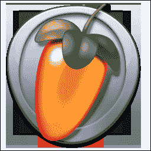
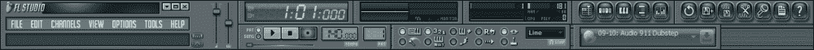
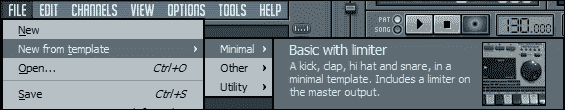
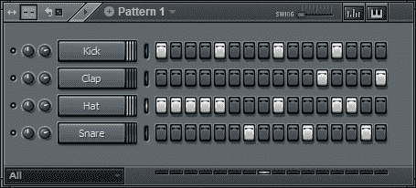
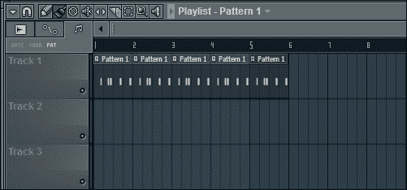
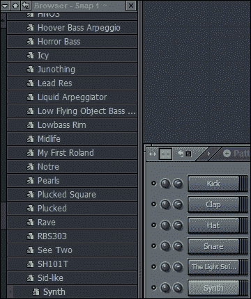
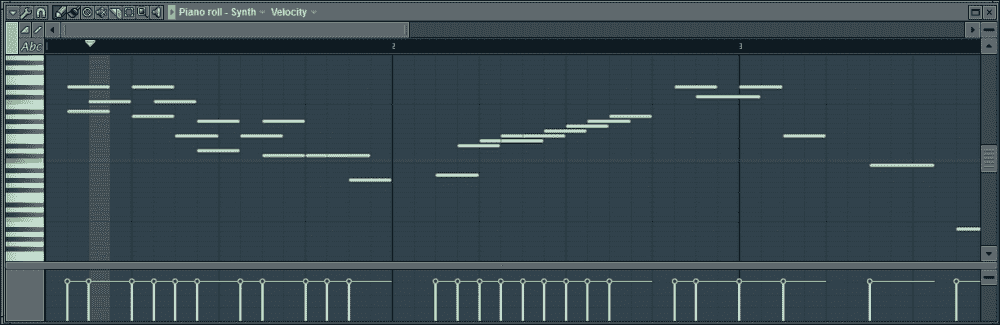
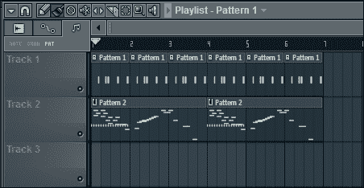
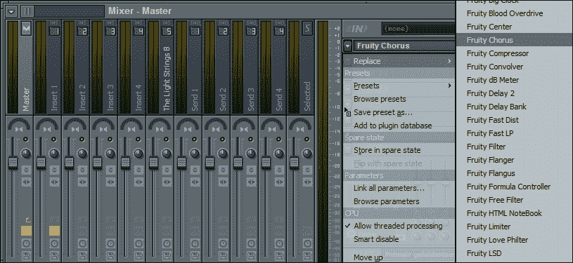
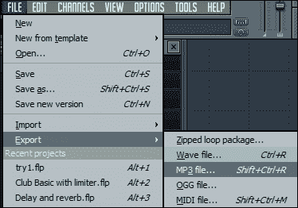

# 第六章：音乐和音效

音乐和音效就像蛋糕上的樱桃：当正确实施时，它们可以极大地改善游戏体验，但如果没有，至少你还有蛋糕。现在的大预算游戏总是伴随着原创和精美的歌曲和曲调。游戏音乐领域在过去几十年里已经发展壮大，有许多作曲家致力于制作游戏音乐。

以下是一些伟大作曲家的名单：

+   近藤浩治（马里奥和塞尔达系列）

+   植松伸夫（《最终幻想系列》）

+   中村正人（索尼克、合金装备固、《银河战士 Prime》系列）

+   迈克尔·贾奇诺（《使命召唤》、《荣誉勋章：联合突击》）

+   比尔·布朗（《命令与征服将军》、《敌领土》、《彩虹六号》）

+   杰瑞米·索尔（《上古卷轴》系列、《星球大战：旧共和国》、《全面毁灭》、《无冬之夜》、《博德之门》、《公会战争》、《英雄连》、《普特普特》）

这些人确实知道如何制作令人惊叹的音乐，为游戏体验增添了难以置信的附加值。这些游戏中使用的曲调通常变得与游戏本身一样具有标志性和令人难忘。如果你观看一部非常古老的电影，你会注意到它们使用的音乐和音效要比现在少得多，这使得它们对我们许多人来说几乎无法观看。尝试从任何最近的电影中剥离所有的背景音乐，你可能会发现它看起来乏味，即使故事内容保持不变。对于许多游戏来说也是如此，特别是对于冒险游戏来说，精心谱写的背景音乐非常重要，因为它有助于将你带入故事情节中。

同样，没有音效和威胁性音乐的恐怖游戏几乎是不可想象的。曲调和音效对于营造场景的氛围至关重要。一个很好的例子是著名的游戏《生化危机》。在这款僵尸游戏中，即使 20 分钟内什么都没有发生，你仍然会时刻保持警惕。正是声音和威胁性的音乐让你本能地不愿意打开下一扇门。因此，在选择音乐和音效之前，考虑一下你希望玩家在玩游戏时产生的感觉。对于唤起感觉来说，没有什么比完美选择的音乐和声音更有影响力了。

在本章中，我们将看一下一些游戏音乐的来源，除了这些相当昂贵的作曲家。我们将简要介绍一下 FL Studio，它可以用来创作你自己的音乐。最后，我们将在 ImpactJS 中整合音乐和音效。

# 制作或购买音乐

如果你决定要为你的游戏添加一些音乐，问题仍然是要么自己制作，要么购买。似乎作为一个 2D 游戏开发者，你需要了解一点点所有的东西：你必须能够理解游戏心理学，实际编写游戏程序，为其制作图形，甚至创作其音乐。听起来你需要成为一个全能的人才才能完成这样的壮举。然而，在图形设计和音乐领域进行教育可能是浪费时间。虽然成为一个通才是一个很好的特点，但考虑一下为你的游戏创作音乐需要多少时间，而不是从别人那里购买。

在本章中，这两种选择都得到了支持。首先，让我们看看一些可以为你提供音乐和音效的网站。

# 购买曲调和音效

如果你需要一些游戏音乐，你可以像杰瑞米·索尔一样雇佣一位个人作曲家。然而，假设你没有数百万美元的预算，以下网站可能会有所帮助：

[www.craze.se](http://www.craze.se)

在*Craze*上，可以找到各种类型的音乐。这些歌曲可以提前听，并且价格从每首 15 美元到 60 美元不等。它们也可以作为包购买，这将大大降低总成本。

如果你正在寻找一个价格相对更实惠的供应商，你可以看看以下链接中的*Lucky Lion Studios*：

[www.luckylionstudios.com](http://www.luckylionstudios.com)

大多数曲目售价为 5 美元。他们接受定制委托，并且甚至会区分购买定制项目的独家或非独家权利，从而让您在定制任务上节省成本。

最后，如果您正在寻找一些免费音乐，可以在以下链接找到*Nosoapradio*：

[www.nosoapradio.us](http://www.nosoapradio.us)

这个网站拥有一切；您可以随意收听和下载超过 300 首曲目（超过 12 小时的音乐），而且完全免费使用。该网站甚至提供了一个种子文件的追踪器，让您一次性下载 1GB 的音乐。这是一个很棒的网站，如果您希望有一些音乐作为占位符，甚至发布一个真正的游戏。

还有一些网站可以购买音效：

+   *Pro sound effects*允许您以每个效果 5 美元的价格从各种不同的声音中购买，链接如下：

[www.prosoundeffects.com](http://www.prosoundeffects.com)

您还可以购买特定主题的整个音效库，例如动物声音。这些套餐的价格范围可以从 40 美元到 15000 美元不等。

+   *Radish patch*每小时以 45 美元的价格提供定制工作，还以 8 美元或 80 美元的价格出售预制音效，具体取决于您的计划。链接如下：

[www.radish-patch.com](http://www.radish-patch.com)

如果您计划销售超过 5000 份游戏，他们将收取每个音效 80 美元，而不是 8 美元。

+   列表中还有一个免费网站供您使用，链接如下：

[www.mediacollege.com/downloads/sound-effects/](http://www.mediacollege.com/downloads/sound-effects/)

*Media college*提供了大量免费的声音效果，涵盖了各种主题。他们唯一要求的是，如果您喜欢他们提供的内容，可以捐赠一些费用。

与优质音乐不同，音效并不难制作。您只需要一个所需声音的列表，一个体面的录音机，一点空闲时间（也许还有一些疯狂的朋友来帮助您制作）。因此，在决定是自己制作还是购买音效时，建议自己制作，除非您需要一些真正优质的效果。

现在让我们来看看 FL Studio 的基础知识。

# 使用 FL Studio 制作基本曲调

**FL Studio**是一款数字音频工作站，以前被称为 FruityLoops。以下是 FL Studio 的标志：



FL Studio 不是免费软件，而是一个可以从他们的网站下载的演示版本：

[www.fl-studio.en.softonic.com](http://www.fl-studio.en.softonic.com)

FL Studio 被认为是目前最完整的虚拟工作室。但是，FL Studio 目前尚不适用于 Linux。

对于 Linux 用户，**LMMS**可能是一个不错的（免费）但功能较弱的替代品。以下是 LMMS 的标志：


您可以从以下链接下载 LMMS：

[`lmms.sourceforge.net/download.php`](http://lmms.sourceforge.net/download.php)

由于本书的目的不是深入了解音乐制作，因此这里只涵盖了 FL Studio 的基础知识。

打开 FL Studio 时，首先注意到的是顶部菜单栏，如下面的截图所示：



我们大致可以区分三个主要部分。在左侧是您可以期望任何程序都具有的所有菜单：**文件**，**工具**，**视图**，**选项**等。栏的中间提供了快速访问播放、停止和其他与您正在处理的歌曲直接相关的按钮。在右侧，我们可以找到一些快速访问按钮，用于 FL Studio 的重要元素。

创建新文件时，FL Studio 允许您从模板开始，这对于初学者来说非常方便。



例如，**Basic with limiter**将立即为用户提供鼓线的不同元素。这样，您就不需要自己找出基本组件。FL Studio 的五个最重要的元素的快速访问按钮从左到右依次是：播放列表、步进序列器、钢琴卷、文件浏览器和混音器，如下面的屏幕截图所示：


如果您打开步进序列器，您会注意到您的第一个序列**Pattern 1**已经预定义了四个元素：**Kick**、**Clap**、**Hat**和**Snare**。如下列表所述，这四个元素构成了您鼓线的基础。

+   **Kick**可以比作您的大鼓。

+   **Clap**是拍子的近似。Clap（也称为 tala）本身是印度古典音乐中用于任何作品的节奏模式的术语。

+   **Snare**代表较小的鼓。

+   **Hat**是您鼓线的钹。

以下屏幕截图显示了**Pattern 1**序列：



在您的模式中，每个乐器都有一系列矩形。通过单击一个矩形，您告诉 FL Studio 在该特定点激活这个乐器。右键单击突出显示的矩形将再次关闭它。FruityLoop studio 中的几乎所有内容都是通过左键单击打开或添加的，而右键单击用于关闭或删除。尝试通过在特定时间间隔激活一些乐器来制作出声音不错的鼓线。

创建了一个模式后，可以将其添加到播放列表。**播放列表**控制台将保存项目中所有音乐的所有部分，如下面的屏幕截图所示：



您的所有模式可以根据您使用它们的方式同时或顺序地进行排队或播放。在**播放列表**控制台中左键单击一个位置，基本上是在该位置*绘制*一个模式。右键单击一个模式将其删除。要更改模式，您当前正在放置的下拉框位于**播放列表**控制台的右上角。

FL Studio 为用户提供了各种乐器、音效，甚至预制音乐和一些语音效果，如下面的屏幕截图所示：



所有这些资源都可以通过**文件浏览器**访问。从这里，您可以向您的序列构建器添加乐器，例如合成器或吉他。每种声音类型都有不同的符号，如下面的屏幕截图所示，甚至可以在浏览器中预览（或提前听到）预制音乐：


添加预先编排的旋律可以让您快速制作出一首相当不错的歌曲，然后可以将其合并到您的游戏中。

如果您已经向您的序列构建器添加了乐器，比如合成器，请尝试打开其**钢琴卷**控制台，如下面的屏幕截图所示：



**钢琴卷**控制台允许您定义乐器需要演奏的每个音符。对于一些乐器，比如鼓，这并不总是必要的，但对于其他乐器来说，绝对建议在**钢琴卷**控制台中制作自己的小曲调。您可以在与鼓线相同的模式中进行，或者您可以开始一个不同的模式，在那里释放您的创造力，如下面的屏幕截图所示：



最终，您创建的每一首音乐都应该最终进入播放列表。使用不同的音轨是保持对同时发生的所有事情的良好视图的关键。如果您忘记将不同的乐器类别分配到不同的音轨中，不用担心，在**播放列表**窗口中有一个拆分它们的选项。

在某个时候，您会想要听听您的不同音轨一起播放时的声音。为此，您需要从模式切换到**歌曲**模式，如下图所示：


如果您觉得需要对不同的乐器进行一些额外的调整，这就是**混音器**控制台发挥作用的地方。**混音器**控制台允许您更改音量、平衡和特殊效果，如下图所示：



向音乐添加特殊效果或滤镜可以快速为您提供所需的额外触感。有许多预设的滤镜可供选择，它们都可以单独进行调整。如果您正在寻找一个快速解决方案，当然可以将它们保留在默认设置并进行操作。

在这四个元素中的每一个：序列器、播放列表、钢琴卷、和混音器中，都有一些模板和/或默认设置可用。如果您不想花太多精力来创建自己的音乐，请务必寻找这些。您可以使用已经存在的内容，稍作调整，很快就可以拥有自己的配乐！

当您完成第一首歌曲时，您可能不仅想要保存它，还想将其导出为`.mp3`和`.ogg`文件。



同样，不要忘记将项目切换到歌曲模式，而不是模式模式，否则您只会导出当前选择的模式。

一旦歌曲被导出，您可以在 ImpactJS 中使用您刚刚创建的内容。

# 将背景音乐添加到您的游戏中

背景音乐是您希望始终播放的东西。很多游戏会在情况变得艰难时，将音乐从平静变为更加热烈的音轨。所有这些都可以使用`if`条件来在您的主代码中或专门用于管理播放列表的单独文件中完成。

ImpactJS 有两个重要的类负责您想要使用的所有声音：`ig.music`和`ig.sound`。`ig.music`是我们需要的背景音乐。假设您想要将您的音乐添加到第三章的项目中，*让我们建立一个角色扮演游戏*或第四章的项目中，*让我们建立一个横向卷轴游戏*。将以下代码添加到`main.js`中`MyGame`定义的`init()`函数中：

```js
init: function() {
  this.loadLevel(LevelLevel1);
  ig.input.bind(ig.KEY.UP_ARROW, 'up');
  ig.input.bind(ig.KEY.DOWN_ARROW,'down');
  ig.input.bind(ig.KEY.LEFT_ARROW,'left');
  ig.input.bind(ig.KEY.RIGHT_ARROW,'right');
  ig.input.bind(ig.KEY.MOUSE1,'attack');
  var music = ig.music;
  music.add("media/music/background.*");
  music.volume = 1.0;
  music.play();
},
```

请注意，我们将我们的歌曲添加为`background.*`，而不是`background.ogg`或`background.mp3`。这样游戏就知道它需要查找所有名为`background`的文件，而不管它们的扩展名是什么。由于我们在`media`文件夹中创建了一个单独的`music`文件夹，这里不应该有命名冲突。使用`background.*`不仅方便（一行代码而不是两行），而且对于系统使用`music`文件也是有帮助的。有时这将是`.mp3`，有时是`.ogg`；至少现在可以自动确定要使用的`music`文件。Chrome 现在似乎更喜欢 WebM 而不是`.mp3`或`.ogg`，但仍然可以使用`.mp3`和`.ogg`。另一方面，Firefox 更喜欢使用`.ogg`，而不使用`.mp3`。

`ig.music`本身就是一种播放列表，具有多个功能。使用`add()`方法将在播放列表的末尾添加另一首歌曲。您可以用几乎无限数量的歌曲填充这个列表。`music.volume`方法设置了您的歌曲音量，范围从`0`到`1`。`music.play()`方法将激活播放列表中的第一首歌曲。前面的代码不仅会激活您的歌曲，而且会无限循环播放，因为这是默认设置。除了简单启动循环的方法之外，还有许多其他函数。

`fadeout(time)`将使您的歌曲在您指定的时间内淡出。当歌曲的音量达到`0`时，它将调用`stop()`方法，停止歌曲的播放。在 ImpactJS 中有您在常规收音机上期望的一切。您可以使用`pause()`和`next()`方法，以及`loop`和`random`属性使歌曲循环和随机播放。另一个有趣的属性是`currentIndex`，因为它将返回当前播放歌曲在播放列表中的位置。这在管理歌曲顺序并在必要时切换歌曲时非常有用。

# 当发生某个动作时播放声音

`ig.music`非常适合用于音乐，因为它与基本媒体播放器有许多共同的功能。对于播放音乐，`ig.music`是最佳选择，而对于播放音效，您应该使用`ig.sound`以获得最佳效果。

声音效果并不是持续活动的，而是只在执行某些动作时发生。比如说，当玩家发射抛射物时，我们希望听到枪声。我们需要在玩家的`init()`方法中添加声音，这样它就可以作为资源使用。

在`player.js`中使用以下代码添加`this.gunshotsound`：

```js
init: function( x, y, settings ) {
  this.parent( x, y, settings );
  // Add the animations
  this.addAnim( 'idle', 1, [0] );
  this.addAnim('down',0.1,[0,1,2,3,2,1,0]);
  this.addAnim('left',0.1,[4,5,6,7,6,5,4]);
  this.addAnim('right',0.1,[8,9,10,11,10,9,8]);
  this.addAnim('up',0.1,[12,13,14,15,14,13,12]);
  //set up the sound
  this.gunshotsound = new ig.Sound('media/sounds/gunshot.*');
  this.gunshotsound.volume = 1;
},
```

然后，通过在`player.js`中添加以下代码，我们实际上播放了抛射物发射时的声音。

```js
if(ig.input.pressed('attack')) {
  if (GameInfo.projectiles> 0){
    ig.game.spawnEntity('EntityProjectile',this.pos.x,this.pos.y,{direction:this.lastpressed});
    ig.game.substractProjectile();
    this.gunshotsound.play();
  }
}
```

在`ig.music`中，歌曲被添加到播放列表中，声音是通过调用`ig.sound`的新实例来启动的。当只有一首歌曲被添加到音乐播放列表时，默认情况下它会永远循环。这对于使用`ig.sound`启动的音效并不适用，因为它没有`loop`属性，因此在调用`.play()`方法时，声音只会播放一次。`ig.sound`具有`.enabled`属性，默认设置为`true`。将其设置为`false`将为游戏停用所有声音和音乐。这很有用，因为一些移动设备在需要同时播放两种不同的声音时仍然存在问题。同时播放两种不同的声音是非常常见的，特别是如果您已经在播放背景音乐。通过使用 Ejecta，ImpactJS 的直接画布解决方案，可以解决这个问题。代码保持不变，但是 Ejecta 目前只支持 iPhone 和 iPad，不支持 Android 或 Windows 设备。

# 在游戏中使用声音文件的技巧

优化声音文件意味着保持简短和简单。大多数游戏都有短小的歌曲，不会太过于显眼，因此不会总是被注意到。即使不被注意到的歌曲仍然会影响情绪，而且不会显得太过重复。为了优化目的，有一些事情您一定要注意：

+   保持歌曲简短，并且只在需要时将其加载到内存中。

+   准备相同的歌曲，分别以`.ogg`和`.mp3`格式，这样需要播放的系统可以选择最有效的扩展名。

+   使用以下代码在目标发布游戏的移动设备上双重检查您的声音是否有效。如果没有，请确保在这些设备上关闭所有声音，直到能够使声音在这些设备上正常工作为止。

```js
if(ig.ua.mobile){
  ig.music.add("media/music/backgroundMusic.ogg");
  ig.music.play();
}
```

+   这不仅仅是一种优化，更是一种用户友好的措施，但请确保允许玩家关闭音乐和音效。最好是分开两者：有些玩家喜欢听枪声，但不喜欢你的音乐。如果你使用游戏分析，请确保跟踪这些变化，以便了解哪种类型的歌曲是可以接受的，哪种是不可以接受的。

# 总结

在本章中，我们讨论了音乐和音效作为在游戏中营造氛围的重要元素。我们讨论了是否应该购买或创建音乐以及你可以在哪里找到它：免费或付费。我们使用 FL Studio 创建了自己的基本背景音乐，并将其添加到了我们的游戏中。最后，我们总结了在 ImpactJS 中使用音乐的一些建议。

在下一章中，我们将看一下图形。我们将检查是购买还是制作它们更好，以及如何使用 Inkscape 或 Photoshop 创建图形。
