# 第七章：图形

你可以有完美运行的脚本，但如果没有东西可看，就没有游戏。图形很重要，我们将在这里探讨如何获得它们并在 ImpactJS 中实现它们。在本章中，你将学到：

+   不同类型的图形

+   在决定是制作还是购买图形时你应该考虑什么

+   如何使用免费工具 Inkscape 制作矢量图形

+   如何利用 Adobe Photoshop 将现实变成游戏

自数字游戏开始以来，游戏图形一直在不断发展。快速浏览一下《太空战争！》及其街机版本《计算机空间》，《乒乓球》，《枪战》，以及许多其他古老的游戏。你会注意到的第一件事不是游戏玩法的不同，而是缺乏图形的华丽。更快的计算机和专用图形处理器的发展使得游戏变得越来越漂亮。当然，有一个普遍的趋势朝着更多的现实主义发展：我们能让游戏看起来多像现实生活而不会把我们的处理器烧毁？这有点像绘画的发展。画家们倾向于追求更多的细节，更好地逼近现实生活中所见的东西。这是一个挑战，直到他们开始使用光学透镜将图像直接反射到画布上。然后他们只需要描绘和上色。艺术家们开始寻找在画布上表达自己的新方法，因为完美不再是成功的保证。几个世纪后，当图形完美达到时，世界看到了像毕加索的《格尔尼卡》和爱德华·蒙克的《尖叫》这样的绘画。这两者都远非接近完美的现实主义；但它们都有一些东西能吸引人们。

在游戏世界中似乎正在发生类似的事情。最近的游戏已经证明我们可以非常接近现实，一些游戏开发者已经开始寻找更原创的外观。例如，任天堂从未努力接近提供逼真的图形，但他们在制作优秀游戏方面的技能在全世界都受到尊敬。这是因为他们明白，在玩家心中激起某种感觉比展示玩家从屏幕上看到的东西更重要。

看看 1995 年发行的超级任天堂游戏《耀西岛》。这里描绘的场景远非现实。然而，只要玩上 10 分钟，你就会充满快乐的感觉。一切看起来都是如此快乐和闪闪发光，色彩明亮而快乐。当它们不打算杀死你时，动物甚至云朵都会用真诚的快乐微笑着看着你。

《塞尔达传说：风之杖》于 2003 年发布，是最早使用卡通渲染图形的大型游戏之一。卡通渲染或卡通风格的图形看起来就像是手绘的。卡通渲染已经被许多其他非常成功的游戏使用，如《无主之地》和《大神》。

之前的例子是 3D 游戏，但你现在正在阅读这篇文章就证明了制作游戏并不仅仅是关于图形。许多年前，游戏成功地从 2D 过渡到 3D。即使我们心爱的马里奥也能够出色地完成这个过渡。3D 游戏通常被认为比 2D 游戏更令人愉悦。然而，你现在正在准备制作一个 2D 游戏。这证明了漂亮的图形对传达某种感觉很重要，但你可以以任何你希望的形式来传达这种感觉，就像艺术本身一样。

# 制作/购买图形

在制作游戏时，我们需要购买或制作自己的图形吗？我们至少有幸在这方面有选择。对于 3D 游戏，自己制作图形的选择通常受到开发团队规模的限制。对于 2D 游戏，自己完成所有工作的选择仍然是一个现实的选择。如果你没有预算购买精灵和瓷砖集，你有三个主要选项来创建你的图形：

+   像素艺术

+   矢量艺术

+   使用 Photoshop 创造现实

在这三个选项中，逐像素绘制你的角色和场景是最雄心勃勃的选择。优秀的艺术家可以用这种方法得到非常好的结果，但即使是最有经验的像素艺术家也会花费数小时来绘制几个角色和瓷砖集。有一些工具可以帮助你将自己的绘画技能转移到电脑上，比如数字绘画笔和软件：Adobe Photoshop 或其免费的对应物 GIMP。如果你对绘画没有任何经验，也没有强烈的冲动去投入精力学习，那就干脆不要尝试。

第二个选择是矢量图形设计。矢量图形与像素艺术不同，因为图形是由线条和基本形状构建而成，而不是单独的点。这些线条和形状可以自由缩放到更高或更低的分辨率，而对于像素艺术来说，这可能非常困难。从基本形状如矩形、圆形和线条构建图形需要一种不同于常规绘画的洞察力。制作图形的先决条件基本上是从需要稳定的手转变为对物体和生物的分析视角。以《愤怒的小鸟》中的鸟为例。它们的基本形状是一个圆，眼睛放在中心的圆形上。它们的喙略呈圆形三角形，它们的眉毛和尾巴只是一堆矩形。如果你从这种更分析的角度看这些愤怒的小鸟，那么自己画一个就会变得更容易。如果你觉得自己有一些分析洞察力，即使你的绘画技能只是普通水平，只要你付出足够的努力，你就可以制作自己的瓷砖集。本章将简要介绍如何做到这一点。

最后一个选择更像是一个快速解决方案。通过拍摄物体的照片并将其转换为瓷砖集，你可以迅速获得一些图形。虽然对于 3D 游戏来说，接近真实场景是非常困难的，但对于 2D 游戏来说，这实际上是最简单的方法。当然，这里的主要问题是，如果使用调整后的图片，你很难在竞争对手中脱颖而出，这在推广游戏时是一个真正的缺点。尽管如此，这些图形看起来很好，这是一种快速而廉价的获取图形的方式。

# 购买图形的地方

尽管 2D 游戏相当普遍，但并没有很多公司专门为业余游戏开发者提供瓷砖集。大多数游戏艺术家要么为游戏公司工作，要么按照客户的要求工作，这往往对于业余时间开发游戏的人来说太昂贵了。

然而，有一些价格实惠的 2D 游戏图形制作商，例如[www.sprites4games.com](http://www.sprites4games.com)。他们有一些免费的精灵可用，但他们尤其因其美丽而实惠的定制作品而备受赞誉。

从随机网页下载免费瓷砖集时，存在两个主要问题：

+   瓷砖集非常不完整，因此实际上无法用它们来创建整个游戏。

+   免费瓷砖集的另一个问题是它们实际上并不是免费的。它们经常是从现有游戏中剥离出来的，重新使用它们是违法的。

例如，在[www.spritedatabase.net](http://www.spritedatabase.net)，你可以下载整个游戏的瓷砖集。但实际上使用它们来发布你自己的游戏可能会导致因侵犯版权而被起诉。

有时你也可以在更大的艺术和照片网站上找到瓷砖集，比如[www.shutterstock.com](http://www.shutterstock.com)。问题在于混乱；在所有这些其他图片中找到实际的游戏图形是很困难的。如果你最终找到了一些，你将面临与免费瓷砖集相同的问题：不完整。在那时，你可以联系艺术家并请求更多的图形，但那又变成了定制工作，这往往会变得相当昂贵。

# 矢量图形介绍

现在我们已经看过了不同的选项，让我们深入了解其中一个：创建我们自己的矢量图形。有几种有趣的工具可以帮助你。Adobe Illustrator 是市场上最好的之一。然而，在这里我们将使用一个稍微不那么先进但免费的工具：Inkscape。你可以在他们的网站上下载 Inkscape：[www.inkscape.org/download/](http:// www.inkscape.org/download/)。

一旦我们在计算机上安装了 Inkscape，我们就可以开始制作一个机器人角色。

有几种方法可以绘制自己的角色或物体。真正的艺术家使用钢笔工具来完成，如下面的截图所示：

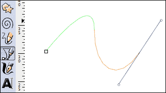

这是一个非常多才多艺的绘图工具，它使您能够绘制直线和最完美对称的曲线。然而，在这个简短的初学者教程中，我们将限制自己使用基本形状，如矩形和圆来构建我们的小机器人，如下图所示：

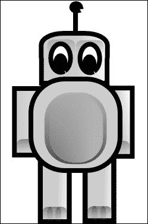

这实际上将是一个小机器人，因为我们希望它的大小与我们一直在使用的角色相同：48 x 32 像素。尽管矢量图形是可伸缩的，但最好还是按照要使用的比例来工作。在处理这些小分辨率时，实际上看到你要填充的像素是有意义的。您可以通过在“视图”选项卡下打开“网格”选项来实现这一点。此外，您需要在放大的图片和实际大小之间切换；这样你就可以看到你实际上要在游戏中放入多少细节。放大和缩小可以使用鼠标的 Ctrl 键和滚轮来完成；此外，通过按键盘上的“1”键，可以简单地以 1:1 的比例查看所有内容。

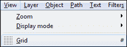

当我们看我们想要构建的机器人时，可以注意到一些重要的东西：头部被放大了。通常，人类的头部大小应该是人体的八分之一或七分之一。在低分辨率下绘制时，头部大约应该是身体大小的三分之一到一半。这是非常不现实的，但至少你能看到一些面部特征，比如眼睛和嘴巴。这种大头风格被称为千变，意思是日语中的“矮个子”；它非常适合小动画。

让我们首先看一下我们需要的基本形状。这似乎不过是一些矩形（圆角和普通的）和两个椭圆形的眼睛，如下面的截图所示：

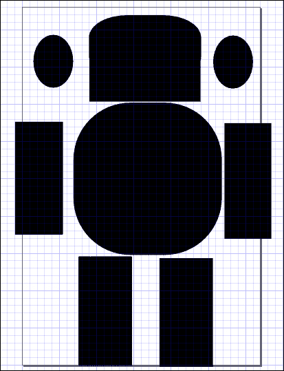

矩形的角可以通过选择普通矩形并在下面的面板中更改其角的半径来轻松圆角，如下面的截图所示：

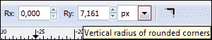

椭圆形只不过是一个拉长的圆。您可以在任何方向拉伸任何形状，并在必要时旋转或倾斜它，如下面的截图所示：

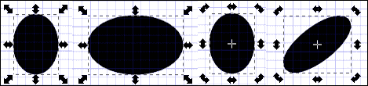

在处理矢量图形时，最好有不同的图层来处理不同的动画。例如，如果我们想让我们的机器人行走，我们需要它的一只胳膊和腿伸出，然后是另一只胳膊和腿。从动画的角度来看，将身体和手臂和腿放在单独的图层中是有意义的。身体的形状在移动时不会改变，而肢体的形状会改变。

现在我们有了基本的形式，让我们专注于颜色。在低分辨率下工作时，最好是有很大的对比度。你可以通过选择一个接近白色和一个接近黑色的颜色来实现这一点，从而调整亮度。或者，你可以选择使用两种互补颜色。当两种颜色互补时，它们是彼此的对立面，当它们相邻时产生最大的对比度。因此，在选择颜色时，引入色轮是有用的。在这个色轮上，彼此相对的颜色被认为是互补颜色。例如，黄色的补色是紫色，如下图所示：

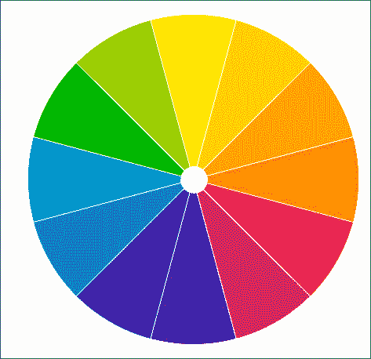

我们的机器人将是灰色和黑色。为了给它上色，我们只需要右键单击鼠标按钮，选择**填充和描边**，并用我们喜欢的颜色填充它。

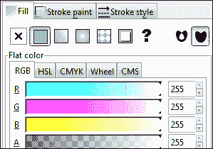

此外，我们可以通过在我们的圆圈中切换到不完整的弧线来给我们的机器人的眼睛增加一些额外的细节，使用下图中显示的面板。

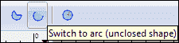

我们的机器人现在有了一个可识别的形式，甚至有了这个小眼睛细节。这些细节的问题在于，当实际玩游戏时，它们并不总是可见，如下图所示，我们的机器人角色的最小化形式；找到合适的细节量可能会有些棘手。

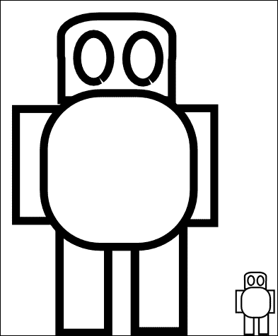

我们可以像下图所示在他的头上加上天线，虽然很小，但仍然是可识别的；最终，这是你需要考虑的每一个细节。让我们在角色的下图所示的绘画中加入一点阴影。我们可以通过将填充改为渐变图案而不是均匀填充来实现这一点。

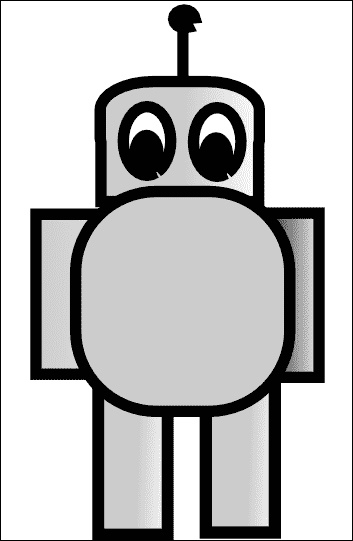

此外，通过使用这些渐变阴影图案添加一些额外的形式，我们可以使设计看起来更加逼真。作为练习，你可以为角色空闲时添加自己的动画。例如，一个人会吸气和呼气，使他的胸部上下起伏。为了描绘这一点，你可以添加一张额外的图像，使游戏感觉更加生动。最终，我们得到了我们的最终机器人。教它如何行走只是把最好的一面展现出来，然后当然是另一面。如果你在一个图层中工作，可以通过选择它们并按下*Home*键将一条腿和一只胳膊移到前面来完成。按下*End*键将选定的手臂放在其他形式的后面。或者，你可以使用**对象**菜单来实现同样的事情。不过，理想情况下，你会希望使用不同的图层，因为这样会让生活变得更加容易。然而，在这里我们不会深入到那个层面的细节。

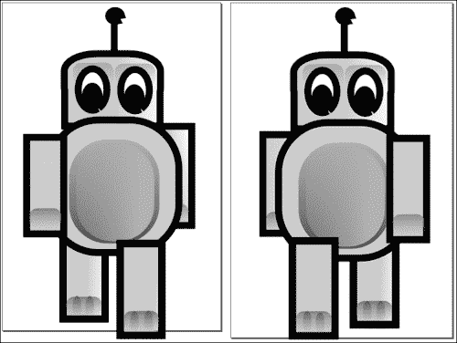

机器人看起来好像要离开他的小画面，直接走向你，就像前面的图表所示的那样。要得到一个完整的角色，你至少需要为一个侧面视图和背面视图做同样的事情。一旦你有经验，这可以很快完成。然而，有一个更快的方法来获得图形。不过，你可能只想在图纸准备好之前使用它们作为占位符，这仍然是一个不错的选择。这个选择是使用 Adobe Photoshop 进行真实生活图片。

# 使用 Adobe Photoshop 创建你自己的头像

曾经梦想过在自己的游戏中四处走动吗？现在你可以了！你只需要一个相机和类似 Adobe Photoshop 的工具。虽然我们将使用 Adobe Photoshop，但市面上有很多免费的替代品可以胜任。甚至浏览器的解决方案也相当不错。Pixlr 就是一个很好的例子。它可以在[www.pixlr.com](http://www.pixlr.com)找到。

我们将从各个相关方向拍摄一堆照片开始。最好在均匀着色的屏幕前拍摄；简单的白色毯子或墙壁也可以。如果您的背景与您想捕捉的人容易区分，那么将他或她从图片中减去将更容易。我们可以使用快速选择工具来做到这一点，如下面的截图所示：

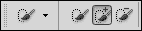

在将人与背景分离后，我们可以简单地将图片放入一个带有透明背景的新文件中，甚至可以添加一些效果，以赋予它更加超现实的触感，如下面的截图所示：

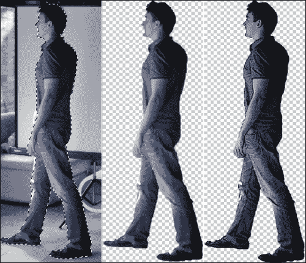

不要局限于 Adobe Photoshop 所提供的功能。有一些很好的网站可以以你难以想象的方式转换你的图片。其中一个网站是[www.befunky.com](http:// www.befunky.com)。

在这里，我们可以选择在我们的图片上释放卡通效果，使人几乎无法辨认，同时产生出这种漂亮的单色风格，如下面的截图所示：

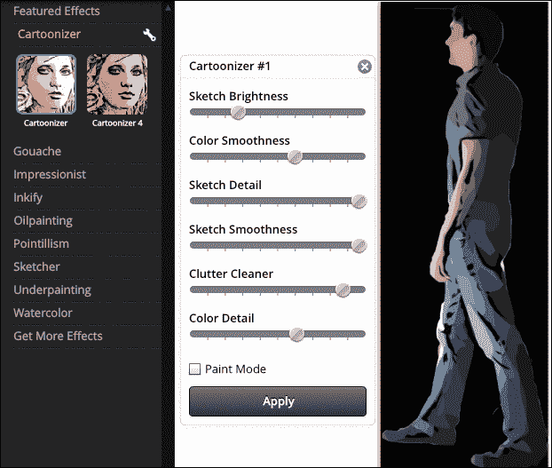

您将不得不为所有的图片重复这个过程，这可能会耗费相当多的时间。然而，这比自己绘制它们要快得多。还要记住，被动对象只需要一张图片。需要实际动画表的游戏角色代表了大部分的工作量。

现在我们有了个人精灵，让我们来看看动画表本身。如果您没有适合的照片，现在是时候去让别人在白墙前拍几张照片了。在视频游戏中看到自己有点奇怪，所以试试看吧。

# 将您的作品添加到 RPG

为了从个人精灵到完全成熟的动画表中，所需做的就是将它们整齐地放在一个文件中。

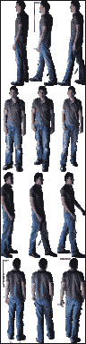

在开始之前，您需要考虑您的图片需要多大。在这个例子中，它们的尺寸为 32 x 96 像素。在早期章节中，我们的角色尺寸为 32 x 48 像素。拥有比我们当前示例拉伸得更少的图纸是更可取的，因为它们将使游戏玩起来更容易。操纵一个尺寸为圆形或正方形的角色要比操纵一个又长又细的角色容易得多。然而，在这种情况下，我们的测试人员又长又瘦，我们希望保持他的样子。

实际上，在单个动画表上安排图片是一项精密的工作，因此建议使用图片的坐标。Adobe Fireworks 在设置坐标时非常直观。任何图片程序都可以胜任；甚至可以在 MS Paint 中完成。当然还有其他选择。精灵表生成器将使排列精灵并将它们保存为瓷砖集合变得更加容易。您还可以选择在 Fireworks 中使用一些 JavaScript 排列代码来自动化定位过程。但是，这里不会对这些主题进行详细阐述。

当您最终设置好自己的表格时，就该将其引入游戏中了。将文件保存为`player.png`，并在之前章节中的代码和表格中进行替换。

```js
animSheet: new ig.AnimationSheet( 'media/player.png', 32, 96 ), 
init: function( x, y, settings ) {
  this.parent( x, y, settings );
  // Add the animations
  this.addAnim( 'idle', 1, [4] );
  this.addAnim('down',0.1,[3,4,3,5]);
  this.addAnim('left',0.1,[0,1,0,2]);
  this.addAnim('right',0.1,[6,7,6,8]);
  this.addAnim('up',0.1,[9,10,9,11]);
}
```

我们的动画序列非常短。对于每个视角，我们在静止和移动右腿或左腿之间切换。如果我们的角色是完全对称的，那么图表可能会更小。那样的话，我们只需要左右行走的动画，然后通过翻转图像来获得另一个动画，就像在前面的章节中所看到的那样。

# 在 HTML5 中使用图形的提示

为了结束本章，让我们回顾一下在 HTML5 中使用图形的一些要点：

+   尽量保持动画图表尽可能小。没有必要复制某些精灵；如果必要，动画序列允许多次引用同一个精灵。还要知道，每个浏览器都有不同的图像大小限制，尽管你必须相当粗心才能达到这个限制。

+   使用支持透明背景的文件格式。PNG 文件就可以胜任。JPG 无法保存透明背景，而会将其解释为纯白色。

+   尽量使用对称图形。这样你可以翻转图像，使角色从左到右行走，反之亦然，使用相同的图像。这也减少了你需要的精灵数量，从而减少了制作它们的工作量。

+   在 ImpactJS 中使用背景地图时，预渲染它们可能会很有用。背景地图与常规级别图层不同，它是通过您在脚本中提供的代码数组绘制的，而不是标准的 JSON 编码级别文件。这样就可以设置重复的背景。

```js
var backgroundarray= [
  [1,2,6],
  [0,3,5],
  [2,8,1],
];
var background = new ig.BackgroundMap( 32, backgroundarray,'media/grass.png' );
```

+   预渲染背景将使系统创建块，这是一组瓷砖。选择预渲染将需要更多的 RAM，因为需要将更大的块保留在内存中，但会加快绘图过程；这样设备的处理器上的负担就会减少。知道你有这个选项，并根据你认为 RAM 还是处理能力将成为瓶颈，你可以选择通过使用 ImpactJS 的`.prerender`属性来预渲染背景或不预渲染。此外，你可以设置块的大小来微调两种资源之间的平衡：

```js
background.preRender = true;
background.chunksize = 4096;
```

# 总结

图形是任何游戏的重要元素，因为它们是游戏所代表的一切的可视化。尽管游戏中的图形确实趋向于更加逼真，但这并不是获得良好游戏体验的绝对要求。我们讨论了是否应该制作或购买图形，以及在哪里可以以实惠的价格购买定制图形。如果决定创建自己的图形，我们区分了三个重要选项：像素图形、矢量图形，以及使用 Adobe Photoshop。跳过第一个选项，我们快速了解了如何使用 Inkscape 开发矢量图形，并使用 Adobe Photoshop 将自己添加到游戏中。本章以一些关于在游戏中使用图形的提示结束。在下一章中，我们终于可以向世界展示我们的游戏，因为我们将把它部署到从常规网站到 Google Play 等多个分发渠道。
